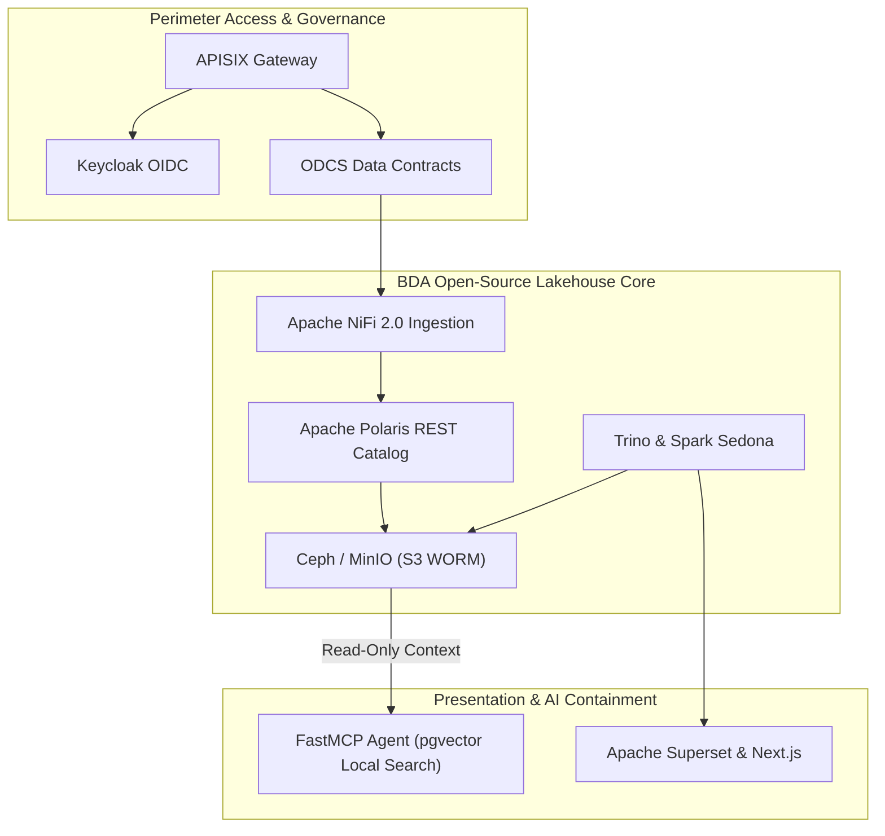

# Modernizing Big Data Analytics Architecture: BDA Lakehouse Baseline

Welcome to the authoritative baseline platform documentation for modernizing the **Big Data Analytics (BDA)** architecture into a 100% open-source, S3-compatible data lakehouse serving as a Single Source of Truth (SSoT).

---

## 🏛️ Master Platform Topology & Open-Source Stack Overview

The diagram below presents the high-level architecture of the modernized BDA Lakehouse, highlighting perimeter security, lakehouse core engines, and AI containment.

### 1. Standalone Production-Ready SVG Vector Graphic (`.svg`)

<svg xmlns="http://www.w3.org/2000/svg" viewBox="0 0 960 420" width="100%" height="100%">
  <defs>
    <marker id="arrow-rm" viewBox="0 0 10 10" refX="6" refY="5" markerWidth="6" markerHeight="6" orient="auto-start-reverse">
      <path d="M 0 0 L 10 5 L 0 10 z" fill="#64748B" />
    </marker>
    <filter id="shadow-rm" x="-4%" y="-4%" width="108%" height="108%">
      <feDropShadow dx="0" dy="2" stdDeviation="3" flood-color="#000000" flood-opacity="0.25"/>
    </filter>
  </defs>

  <!-- Background -->
  <rect width="960" height="420" fill="#0F172A" rx="10"/>

  <!-- Tier 1: Ingress Gateway -->
  <rect x="20" y="20" width="920" height="80" fill="#1E293B" stroke="#334155" stroke-width="1.5" rx="8" filter="url(#shadow-rm)"/>
  <rect x="20" y="20" width="920" height="26" fill="#0F172A" rx="8"/>
  <text x="35" y="38" font-family="-apple-system, BlinkMacSystemFont, 'Segoe UI', Roboto, sans-serif" font-size="12" font-weight="bold" fill="#38BDF8">INGRESS &amp; PERIMETER SECURITY GATEWAY</text>

  <rect x="40" y="52" width="270" height="38" fill="#0369A1" stroke="#38BDF8" rx="4"/>
  <text x="50" y="75" font-family="-apple-system, BlinkMacSystemFont, 'Segoe UI', Roboto, sans-serif" font-size="12" font-weight="bold" fill="#E0F2FE">Apache APISIX Cloud-Native Gateway</text>

  <rect x="345" y="52" width="270" height="38" fill="#1E3A8A" stroke="#3B82F6" rx="4"/>
  <text x="355" y="75" font-family="-apple-system, BlinkMacSystemFont, 'Segoe UI', Roboto, sans-serif" font-size="12" font-weight="bold" fill="#93C5FD">Keycloak OIDC &amp; OAuth2 Identity</text>

  <rect x="650" y="52" width="270" height="38" fill="#581C87" stroke="#A855F7" rx="4"/>
  <text x="660" y="75" font-family="-apple-system, BlinkMacSystemFont, 'Segoe UI', Roboto, sans-serif" font-size="12" font-weight="bold" fill="#E9D5FF">ODCS v3.1.0 Contract Gate</text>

  <!-- Tier 2: Lakehouse Core -->
  <rect x="20" y="135" width="920" height="150" fill="#1E293B" stroke="#334155" stroke-width="1.5" rx="8" filter="url(#shadow-rm)"/>
  <rect x="20" y="135" width="920" height="26" fill="#0F172A" rx="8"/>
  <text x="35" y="153" font-family="-apple-system, BlinkMacSystemFont, 'Segoe UI', Roboto, sans-serif" font-size="12" font-weight="bold" fill="#60A5FA">BDA LAKEHOUSE CORE ENGINE &amp; S3 STORAGE</text>

  <rect x="40" y="170" width="270" height="100" fill="#0F172A" stroke="#3B82F6" rx="6"/>
  <text x="50" y="192" font-family="-apple-system, BlinkMacSystemFont, 'Segoe UI', Roboto, sans-serif" font-size="13" font-weight="bold" fill="#93C5FD">Apache NiFi 2.0 &amp; Airflow</text>
  <text x="50" y="212" font-family="Consolas, Monaco, monospace" font-size="10" fill="#60A5FA">Master Data Plane &amp; Orchestration</text>
  <text x="50" y="232" font-family="-apple-system, BlinkMacSystemFont, 'Segoe UI', Roboto, sans-serif" font-size="11" fill="#E2E8F0">• Vector Processing &amp; Lineage</text>

  <rect x="345" y="170" width="270" height="100" fill="#0F172A" stroke="#3B82F6" rx="6"/>
  <text x="355" y="192" font-family="-apple-system, BlinkMacSystemFont, 'Segoe UI', Roboto, sans-serif" font-size="13" font-weight="bold" fill="#93C5FD">Apache Iceberg &amp; Polaris</text>
  <text x="355" y="212" font-family="Consolas, Monaco, monospace" font-size="10" fill="#60A5FA">Open REST Catalog &amp; Ceph/MinIO</text>
  <text x="355" y="232" font-family="-apple-system, BlinkMacSystemFont, 'Segoe UI', Roboto, sans-serif" font-size="11" fill="#E2E8F0">• Hardware WORM Compliance Lock</text>

  <rect x="650" y="170" width="270" height="100" fill="#0F172A" stroke="#3B82F6" rx="6"/>
  <text x="660" y="192" font-family="-apple-system, BlinkMacSystemFont, 'Segoe UI', Roboto, sans-serif" font-size="13" font-weight="bold" fill="#93C5FD">Trino &amp; Spark Sedona</text>
  <text x="660" y="212" font-family="Consolas, Monaco, monospace" font-size="10" fill="#60A5FA">Distributed Spatial Compute</text>
  <text x="660" y="232" font-family="-apple-system, BlinkMacSystemFont, 'Segoe UI', Roboto, sans-serif" font-size="11" fill="#E2E8F0">• GeoParquet &amp; SpatialRDD</text>

  <!-- Tier 3: Consumption & AI -->
  <rect x="20" y="315" width="920" height="85" fill="#1E293B" stroke="#334155" stroke-width="1.5" rx="8" filter="url(#shadow-rm)"/>
  <rect x="20" y="315" width="920" height="26" fill="#0F172A" rx="8"/>
  <text x="35" y="333" font-family="-apple-system, BlinkMacSystemFont, 'Segoe UI', Roboto, sans-serif" font-size="12" font-weight="bold" fill="#4ADE80">CONSUMPTION, VISUALIZATION &amp; ZERO-TRUST AI CONTAINMENT</text>

  <rect x="40" y="348" width="430" height="42" fill="#0F172A" stroke="#22C55E" rx="6"/>
  <text x="50" y="374" font-family="-apple-system, BlinkMacSystemFont, 'Segoe UI', Roboto, sans-serif" font-size="12" font-weight="bold" fill="#86EFAC">Apache Superset &amp; Next.js (deck.gl Spatial Views)</text>

  <rect x="490" y="348" width="430" height="42" fill="#0F172A" stroke="#A855F7" rx="6"/>
  <text x="500" y="374" font-family="-apple-system, BlinkMacSystemFont, 'Segoe UI', Roboto, sans-serif" font-size="12" font-weight="bold" fill="#E9D5FF">Containerized FastMCP &amp; pgvector (Read-Only AI Sandbox)</text>

  <!-- Connectors -->
  <line x1="310" y1="71" x2="345" y2="71" stroke="#64748B" stroke-width="1.5" marker-end="url(#arrow-rm)"/>
  <line x1="785" y1="90" x2="175" y2="170" stroke="#64748B" stroke-width="1.5" marker-end="url(#arrow-rm)"/>
  <line x1="310" y1="220" x2="345" y2="220" stroke="#64748B" stroke-width="1.5" marker-end="url(#arrow-rm)"/>
  <line x1="785" y1="270" x2="255" y2="348" stroke="#64748B" stroke-width="1.5" marker-end="url(#arrow-rm)"/>
  <line x1="480" y1="270" x2="705" y2="348" stroke="#64748B" stroke-width="1.5" marker-end="url(#arrow-rm)"/>
</svg>

### 2. Git-Native Mermaid Topology (`.mmd`)

### 3. Summary Interface & Routing Table

| Source Component | Target Component | Port / Protocol / API Ingress | Security Boundary / Access Key | Operational Significance / Flow Description |
| :--- | :--- | :--- | :--- | :--- |
| **API Client** | **APISIX Gateway** | `TCP 8443` / HTTPS TLS 1.3 | Keycloak JWT / mTLS Cert | Enforces perimeter access control and rate-limiting. |
| **APISIX Gateway** | **Keycloak OIDC IAM** | `TCP 8443` / HTTPS OIDC | OAuth2 Realm Keys | Validates client bearer tokens and verifies user roles. |
| **ODCS Contract Gate** | **NiFi 2.0 Ingestion** | `TCP 8443` / HTTPS Stream | ODCS Contract Spec | Streams validated telemetry into NiFi flow queues. |
| **NiFi 2.0 Pipeline** | **Apache Polaris Catalog** | `TCP 8181` / REST API | Polaris OAuth2 Token | Commits validated records as versioned Iceberg Parquet tables. |
| **Trino Query Engine** | **Apache Superset** | `TCP 8088` / Trino JDBC | OAuth2 RLS Scopes | Serves federated spatial queries for interactive deck.gl map rendering. |
| **Ceph WORM Storage** | **FastMCP Agent** | `TCP 5432` / TLS 1.3 PostgreSQL | Read-Only Session Scope | Exposes master context to AI models without allowing write access to Tier 0 datasets. |

---

## 🤖 AI Gateway & Sovereign Protocols

- **Root AI Gateway:** [AGENTS.html](AGENTS.html)
- **Sovereign AI Constitution:** [.agents/AGENTS.md](.agents/AGENTS.md)
- **Spatial Memory Engine:** [.agents/brain/](.agents/brain/) (`task.md`, `walkthrough.md`, `palace_registry.md`, `active_context_manifest.md`)
- **AI Cognitive Twin Protocol:** [docs/AI-COGNITIVE-TWIN-PROTOCOL.html](docs/AI-COGNITIVE-TWIN-PROTOCOL.html)
- **OpenWiki SSoT Navigation & Graph:** [openwiki/quickstart.md](openwiki/quickstart.md) (`tools/openwiki_emulator.py`)
- **Master Onboarding Map:** [START-HERE.html](START-HERE.html)

---

## 🧭 Diátaxis Documentation Compass

Following the **Diátaxis Framework**, documentation is categorized into four distinct quadrants:

### 🎓 1. Tutorials (Practical Learning)

- [Onboarding and Developer Setup Guide](docs/tutorials/onboarding-and-setup.html)

### 🛠️ 2. How-To Guides (Practical Problem-Solving)

- [Ingestion Pipeline & Superset Modernization](docs/how-to-guides/ingestion-pipeline-modernization.html)
- [Phased Migration Strategy & Roadmap](docs/how-to-guides/phased-migration-strategy.html)
- [Onboarding and Scaling New AI/ML Business Cases](docs/how-to-guides/onboarding-new-ai-business-cases.html)

### 📚 3. Reference Material (Factual Technical Specs)

- [Legacy BDA Environment Architectural Deconstruction](docs/reference/legacy-architecture.html)
- [Target 100% Open-Source Lakehouse Architecture](docs/reference/lakehouse-architecture.html)
- [Big Data Domain Analytical Modules Specifications](docs/reference/business-applications.html)
- [Data Governance & Subsystems Matrix](docs/reference/governance-matrix.html)
- [Solution 1 Reference Spec: AWS Native & Cloud Managed Infrastructure](docs/reference/solution-1-aws-native.html)
- [Solution 2 Reference Spec: Hybrid Cloud Lakehouse & On-Premises GPU Infrastructure](docs/reference/solution-2-hybrid-ai.html)
- [Solution 3 Reference Spec: 100% On-Premises Sovereign Architecture (Proxmox VE + RKE2 + Ceph SDS)](docs/reference/solution-3-onprem-proxmox-rke2.html)
- [Next Technology Roadmap Stack Specification (Apache Polaris, DuckDB vss / pgvector, OpenTelemetry)](docs/reference/next-technology-roadmap-stack.html)
- [PostgreSQL & pgvector Enterprise Strategy Specification](docs/reference/postgresql-pgvector-enterprise-strategy.html)
- [Apache NiFi 2.0 Master Data Plane Architecture and Migration Guide](docs/reference/apache-nifi-2-master-data-plane-and-migration.html)
- [Consumption & Integration Layer Specification](docs/reference/consumption-and-integration-layer.html)
- [5-Year Strategic BDA & AI Roadmap & Master Business Case Specification (2026–2030)](docs/reference/5-year-bda-ai-roadmap-and-business-case.html)
- [OpenWiki SSoT Knowledge Base & Quickstart](openwiki/quickstart.md)

### 💡 4. Explanation (Theoretical Rationale)

- [The Human-to-AI Quarantine Model](docs/explanation/human-ai-quarantine-model.html)
- [Model Context Protocol (MCP) & AI Sandboxing Architecture](docs/explanation/mcp-and-ai-sandboxing.html)
- [Governance, Security, and Compliance Framework](docs/explanation/governance-and-compliance.html)

---

## 🛠️ CI/CD Workflows, Linters & Test Suites

- **Automated OKF & Zero Link Decay Audit:** `.github/workflows/dsom-audit.yml` and `tests/test_okf_and_links.py`
- **OpenWiki Emulator & Knowledge Graph:** `tools/openwiki_emulator.py` (`uv run python tools/openwiki_emulator.py --init`)
- **Code Health Linters:** `ruff` & `markdownlint-cli` configured via `pyproject.toml`, `.markdownlint.json`, and `.pre-commit-config.yaml`
- **Ansible & Infrastructure Testing:** `.ansible-lint` and Molecule scenarios in `molecule/default/`
- **Playwright E2E Search Tests:** `playwright.config.ts` and `tests/e2e/docs_search.spec.ts`

---

## 📜 Sovereign Ledgers & Standards

- **Master Navigation Summary:** [SUMMARY.html](SUMMARY.html)
- **AI Crawler Sitemap:** [llms.txt](llms.txt)
- **Changelog Ledger:** [CHANGELOG.html](CHANGELOG.html)
- **Execution History Ledger:** [HISTORY.html](HISTORY.html)
