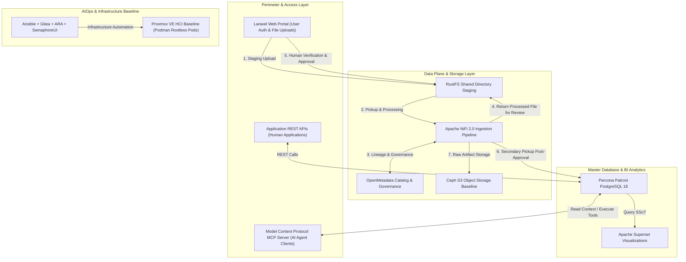

# Modernizing Big Data Analytics Architecture: BDA Lakehouse SSoT Baseline

Welcome to the authoritative platform documentation for modernizing the **Big Data Analytics (BDA)** architecture into a 100% open-source, S3-compatible Single Source of Truth (SSoT) data lakehouse.

---

## 🏛️ Master Infrastructure & Data Governance Architecture

The diagram below presents the high-level architecture of the modernized BDA SSoT platform, highlighting perimeter access, human-in-the-loop file quarantine workflow, data plane orchestration, database persistence, visualization, and AIOps automation.

### 1. Standalone Production-Ready SVG Vector Graphic (`.svg`)

<svg xmlns="http://www.w3.org/2000/svg" viewBox="0 0 960 520" width="100%" height="100%">
  <defs>
    <marker id="arrow-rm" viewBox="0 0 10 10" refX="6" refY="5" markerWidth="6" markerHeight="6" orient="auto-start-reverse">
      <path d="M 0 0 L 10 5 L 0 10 z" fill="#64748B" />
    </marker>
    <filter id="shadow-rm" x="-4%" y="-4%" width="108%" height="108%">
      <feDropShadow dx="0" dy="2" stdDeviation="3" flood-color="#000000" flood-opacity="0.25"/>
    </filter>
  </defs>

  <!-- Background -->
  <rect width="960" height="520" fill="#0F172A" rx="10"/>

  <!-- Tier 1: Ingress & Client Interfaces -->
  <rect x="20" y="20" width="920" height="90" fill="#1E293B" stroke="#334155" stroke-width="1.5" rx="8" filter="url(#shadow-rm)"/>
  <rect x="20" y="20" width="920" height="26" fill="#0F172A" rx="8"/>
  <text x="35" y="38" font-family="-apple-system, BlinkMacSystemFont, 'Segoe UI', Roboto, sans-serif" font-size="12" font-weight="bold" fill="#38BDF8">INGRESS &amp; CLIENT INTERFACES</text>

  <rect x="40" y="55" width="270" height="42" fill="#0369A1" stroke="#38BDF8" rx="4"/>
  <text x="50" y="80" font-family="-apple-system, BlinkMacSystemFont, 'Segoe UI', Roboto, sans-serif" font-size="12" font-weight="bold" fill="#E0F2FE">Laravel Web App (Human Upload &amp; Review)</text>

  <rect x="345" y="55" width="270" height="42" fill="#1E3A8A" stroke="#3B82F6" rx="4"/>
  <text x="355" y="80" font-family="-apple-system, BlinkMacSystemFont, 'Segoe UI', Roboto, sans-serif" font-size="12" font-weight="bold" fill="#93C5FD">Application REST APIs (Human Apps)</text>

  <rect x="650" y="55" width="270" height="42" fill="#581C87" stroke="#A855F7" rx="4"/>
  <text x="660" y="80" font-family="-apple-system, BlinkMacSystemFont, 'Segoe UI', Roboto, sans-serif" font-size="12" font-weight="bold" fill="#E9D5FF">MCP Server (AI Agent Tool Integrations)</text>

  <!-- Tier 2: Storage & Data Plane Isolation -->
  <rect x="20" y="130" width="920" height="150" fill="#1E293B" stroke="#334155" stroke-width="1.5" rx="8" filter="url(#shadow-rm)"/>
  <rect x="20" y="130" width="920" height="26" fill="#0F172A" rx="8"/>
  <text x="35" y="148" font-family="-apple-system, BlinkMacSystemFont, 'Segoe UI', Roboto, sans-serif" font-size="12" font-weight="bold" fill="#60A5FA">STORAGE, FILE QUARANTINE &amp; DATA PLANE ENGINE</text>

  <rect x="35" y="165" width="270" height="100" fill="#0F172A" stroke="#3B82F6" rx="6"/>
  <text x="45" y="187" font-family="-apple-system, BlinkMacSystemFont, 'Segoe UI', Roboto, sans-serif" font-size="12" font-weight="bold" fill="#93C5FD">RustFS Shared Storage</text>
  <text x="45" y="207" font-family="Consolas, Monaco, monospace" font-size="10" fill="#60A5FA">Non-IT User Upload Staging</text>
  <text x="45" y="227" font-family="-apple-system, BlinkMacSystemFont, 'Segoe UI', Roboto, sans-serif" font-size="10" fill="#E2E8F0">• Verification Directory Swap</text>

  <rect x="345" y="165" width="270" height="100" fill="#0F172A" stroke="#22C55E" rx="6"/>
  <text x="355" y="187" font-family="-apple-system, BlinkMacSystemFont, 'Segoe UI', Roboto, sans-serif" font-size="12" font-weight="bold" fill="#86EFAC">Apache NiFi 2.0 &amp; OpenMetadata</text>
  <text x="355" y="207" font-family="Consolas, Monaco, monospace" font-size="10" fill="#4ADE80">ETL Pipeline &amp; Governance</text>
  <text x="355" y="227" font-family="-apple-system, BlinkMacSystemFont, 'Segoe UI', Roboto, sans-serif" font-size="10" fill="#E2E8F0">• Metadata Lineage Tagging</text>

  <rect x="650" y="165" width="270" height="100" fill="#0F172A" stroke="#F59E0B" rx="6"/>
  <text x="660" y="187" font-family="-apple-system, BlinkMacSystemFont, 'Segoe UI', Roboto, sans-serif" font-size="12" font-weight="bold" fill="#FDE68A">Ceph S3 Object Store</text>
  <text x="660" y="207" font-family="Consolas, Monaco, monospace" font-size="10" fill="#FBBF24">WORM Immutable S3 Storage</text>
  <text x="660" y="227" font-family="-apple-system, BlinkMacSystemFont, 'Segoe UI', Roboto, sans-serif" font-size="10" fill="#E2E8F0">• Long-Term Storage &amp; Raw Artifacts</text>

  <!-- Tier 3: Master Database, Visualization & AIOps -->
  <rect x="20" y="300" width="920" height="110" fill="#1E293B" stroke="#334155" stroke-width="1.5" rx="8" filter="url(#shadow-rm)"/>
  <rect x="20" y="300" width="920" height="26" fill="#0F172A" rx="8"/>
  <text x="35" y="318" font-family="-apple-system, BlinkMacSystemFont, 'Segoe UI', Roboto, sans-serif" font-size="12" font-weight="bold" fill="#4ADE80">MASTER PERSISTENCE, VISUALIZATION &amp; AIOPS AUTOMATION</text>

  <rect x="35" y="335" width="270" height="60" fill="#0F172A" stroke="#22C55E" rx="6"/>
  <text x="45" y="357" font-family="-apple-system, BlinkMacSystemFont, 'Segoe UI', Roboto, sans-serif" font-size="12" font-weight="bold" fill="#86EFAC">Percona Patroni PostgreSQL 18</text>
  <text x="45" y="377" font-family="Consolas, Monaco, monospace" font-size="10" fill="#4ADE80">HA SSoT Master Relational DB</text>

  <rect x="345" y="335" width="270" height="60" fill="#0F172A" stroke="#38BDF8" rx="6"/>
  <text x="355" y="357" font-family="-apple-system, BlinkMacSystemFont, 'Segoe UI', Roboto, sans-serif" font-size="12" font-weight="bold" fill="#E0F2FE">Apache Superset</text>
  <text x="355" y="377" font-family="Consolas, Monaco, monospace" font-size="10" fill="#38BDF8">BI &amp; Spatial Visualizations</text>

  <rect x="650" y="335" width="270" height="60" fill="#0F172A" stroke="#A855F7" rx="6"/>
  <text x="660" y="357" font-family="-apple-system, BlinkMacSystemFont, 'Segoe UI', Roboto, sans-serif" font-size="12" font-weight="bold" fill="#E9D5FF">AIOps Automation Control</text>
  <text x="660" y="377" font-family="Consolas, Monaco, monospace" font-size="10" fill="#A855F7">Ansible + Gitea + ARA + SemaphoreUI</text>

  <!-- Baseline Infrastructure Container -->
  <rect x="20" y="430" width="920" height="70" fill="#0F172A" stroke="#64748B" stroke-width="1.5" rx="8"/>
  <text x="35" y="450" font-family="-apple-system, BlinkMacSystemFont, 'Segoe UI', Roboto, sans-serif" font-size="12" font-weight="bold" fill="#94A3B8">INFRASTRUCTURE BASELINE &amp; CONTAINER RUNTIME</text>
  <text x="35" y="475" font-family="Consolas, Monaco, monospace" font-size="11" fill="#E2E8F0">Proxmox VE (Hyper-Converged Infrastructure) + Podman Rootless Pods (Kubernetes to be evaluated post-2028 baseline build)</text>

  <!-- Connector Lines -->
  <line x1="175" y1="97" x2="175" y2="165" stroke="#64748B" stroke-width="1.5" marker-end="url(#arrow-rm)"/>
  <line x1="305" y1="215" x2="345" y2="215" stroke="#64748B" stroke-width="1.5" marker-end="url(#arrow-rm)"/>
  <line x1="615" y1="215" x2="650" y2="215" stroke="#64748B" stroke-width="1.5" marker-end="url(#arrow-rm)"/>
  <line x1="480" y1="265" x2="175" y2="335" stroke="#64748B" stroke-width="1.5" marker-end="url(#arrow-rm)"/>
  <line x1="175" y1="395" x2="480" y2="335" stroke="#64748B" stroke-width="1.5" marker-end="url(#arrow-rm)"/>
</svg>

### 2. Git-Native Mermaid Topology (`.mmd`)



### 3. Summary Interface & Routing Table

| Source Component | Target Component | Port / Protocol / API Ingress | Security Boundary / Access Key | Operational Significance / Flow Description |
| :--- | :--- | :--- | :--- | :--- |
| **Laravel Web App** | **RustFS Storage** | `TCP 9000` / POSIX Mount & REST | Session JWT / Shared ACL | Non-IT users upload files into isolated shared staging directories. |
| **RustFS Storage** | **Apache NiFi 2.0** | `TCP 8443` / Directory Watcher | Mutual TLS / Service Token | NiFi picks up raw files for extraction, normalization, and validation. |
| **Apache NiFi 2.0** | **OpenMetadata** | `TCP 8585` / REST API | Bearer API Key | Emits lineage metadata, schema tags, and provenance classification records. |
| **Apache NiFi 2.0** | **Laravel Verification** | `TCP 9000` / Shared Volume Swap | Session JWT | Places processed output back into staging directory for human review. |
| **Apache NiFi 2.0** | **Percona Patroni PostgreSQL 18** | `TCP 5432` / PostgreSQL TLS 1.3 | Service Role Credentials | Ingests human-verified data into High-Availability PostgreSQL master database. |
| **Apache Superset** | **Percona Patroni PostgreSQL 18** | `TCP 5432` / PostgreSQL TLS 1.3 | Read-Only Analytical Scope | Renders interactive dashboards, geospatial maps, and reporting analytics. |
| **MCP Server** | **Percona Patroni PostgreSQL 18** | `TCP 5432` / PostgreSQL TLS 1.3 | Session Context Injection (`SET LOCAL`) | Exposes SSoT context to external AI agents via sandboxed read-only tools. |
| **AIOps Suite** | **Proxmox / Podman** | `TCP 22` / SSH, `TCP 3000` SemaphoreUI | SSH Keys & Git Tokens | Automates playbook execution, configuration drift management, and pod deployments. |

---

## 🛠️ Baseline Software Stack Architecture

The platform standardizes on an enterprise-grade, 100% open-source software stack deployed on Proxmox VE hyper-converged infrastructure using Podman rootless pods:

1. **Database:** **Percona Patroni PostgreSQL 18** — High-availability clustered relational master persistence engine providing SSoT transaction guarantees and spatial query execution.
2. **Data Plane:** **Apache NiFi 2.0 + OpenMetadata** — Low-code visual workflow processing, automated stream/batch ingestion, schema extraction, and metadata lineage tracking.
3. **Visualization:** **Apache Superset** — Enterprise business intelligence, spatial analytics, and executive reporting engine.
4. **AIOps & Orchestration:** **Ansible + Gitea + ARA + SemaphoreUI** — GitOps automation pipeline, infrastructure-as-code management, execution audit tracking (ARA), and web UI orchestration (SemaphoreUI).
5. **File & Object Storage:** **RustFS + Ceph S3** — RustFS provides high-performance shared file directory staging for non-IT user uploads, while Ceph S3 serves as the primary object storage baseline.
6. **Infrastructure Baseline:** **Proxmox VE (HCI) + Podman Rootless Pods** — Hyper-converged virtualized infrastructure running container workloads in rootless Podman pods. *Note: Kubernetes container orchestration will be evaluated in a later operational phase.*

---

## 🔄 Human-in-the-Loop File Quarantine Workflow

To bridge non-IT user interactions with automated big data ETL while guaranteeing SSoT data integrity, the architecture enforces a structured quarantine and approval workflow built using Laravel and Apache NiFi 2.0:

```
[Non-IT User]
     │
     ▼ (1. Login & Upload File)
[Laravel Web App] ──> [RustFS Staging Directory]
                             │
                             ▼ (2. Directory Watcher Pickup)
                     [Apache NiFi 2.0 Pipeline]
                             │
                             ▼ (3. Extract, Normalize & Process)
                     [RustFS Verification Directory]
                             │
                             ▼ (4. Display Summary & Preview)
[Laravel Web App] <── [Human User Review & Verification]
     │
     ▼ (5. Human Grant Approval)
[Apache NiFi 2.0] ──> (6. Final Load) ──> [Percona Patroni PostgreSQL 18]
```

### Process Lifecycle Stages:
1. **User Login & Upload:** Non-IT domain users authenticate via Laravel and upload raw spreadsheet/document files into dedicated staging directories managed by RustFS.
2. **Automated NiFi Pickup:** Apache NiFi 2.0 directory monitoring processors pick up newly uploaded files, parse schemas, perform automated data cleansing, and execute quality validations.
3. **Verification Staging:** NiFi writes the processed outputs into a human verification directory and updates the file status in OpenMetadata and Laravel.
4. **Human Review & Verification:** Users inspect processed summaries, validation alerts, and diff previews within the user-friendly Laravel interface.
5. **Approval Trigger:** Upon human verification and digital sign-off in Laravel, NiFi is triggered to complete the workflow.
6. **Master Persistence Load:** NiFi moves the verified payload into Percona Patroni PostgreSQL 18 master database and archives raw artifacts to Ceph S3.

---

## 🏷️ Two-Tier Data Classification & Tagging Strategy

All data processed within the platform is tagged into two distinct governance categories to preserve ground truth and prevent unverified AI outputs from corrupting SSoT datasets:

| Tagging Category | Classification Name | Governance & Access Rules |
| :--- | :--- | :--- |
| **Category 1** | `REAL_DATA_AI_PROCESSED` | **Real Data & Real Processes with AI Processing:** Empirical physical data and human-driven business processes augmented by AI for cleaning, extraction, or formatting. Requires human verification before promotion to Percona Patroni PostgreSQL 18 master tables. |
| **Category 2** | `AI_PROCESS_RAG_ENRICHED` | **AI Process with RAG & AI Enrichment:** Synthetic outputs, generative summaries, vector embeddings, and RAG contextual enrichments created by AI models. Contained in read-only sandbox layers with mandatory `AI_GENERATED` lineage tagging. |

---

## 📡 Interfaces for Humans and AI Agents

The platform exposes dual interface layers to accommodate both human application consumption and AI agent tool calling:

* **Application REST APIs:** High-performance REST endpoints exposed to frontend web apps, mobile clients, and external enterprise software. Enables standard CRUD, spatial queries, and analytical reporting over HTTPS TLS 1.3.
* **Model Context Protocol (MCP) Server:** Native Python MCP server integration allowing external AI agents (e.g. Claude, Antigravity, local LLMs) to query context, execute sandboxed analytical tools, and retrieve SSoT metadata without direct database write permissions.

---

## 📅 Multi-Year Build & Business Case Migration Plan (2028–2032)

Implementation and operational rollout are structured across a 5-year strategic timeline starting in 2028:

```
2028: Year 1 — Baseline Infrastructure Build
├── Deploy Proxmox VE HCI cluster & Podman rootless runtime
├── Provision Ceph S3 storage & RustFS staging directories
├── Install Percona Patroni PostgreSQL 18 HA cluster
├── Configure Apache NiFi 2.0, OpenMetadata & Apache Superset
└── Deploy Laravel upload portal & MCP server integration

2029–2032: Years 2–5 — Business Case Migration & System Evolution
├── Migrate legacy departmental business cases into SSoT platform
├── Onboard high-volume telemetry & IoT streaming feeds
├── Enhance AI/RAG enrichment pipelines & MCP tool capabilities
└── Evaluate Kubernetes container orchestration migration requirements
```

---

## 🤖 AI Gateway & Sovereign Protocols

- **Root AI Gateway:** [AGENTS.html](AGENTS.html)
- **Sovereign AI Constitution:** [.agents/AGENTS.md](.agents/AGENTS.md)
- **Spatial Memory Engine:** [.agents/brain/](.agents/brain/) (`task.md`, `walkthrough.md`, `palace_registry.md`, `active_context_manifest.md`)
- **AI Cognitive Twin Protocol:** [docs/AI-COGNITIVE-TWIN-PROTOCOL.html](docs/AI-COGNITIVE-TWIN-PROTOCOL.html)
- **OpenWiki SSoT Navigation & Graph:** [openwiki/quickstart.md](openwiki/quickstart.md) (`tools/openwiki_emulator.py`)
- **Master Onboarding Map:** [START-HERE.html](START-HERE.html)

---

## 🧭 Diátaxis Documentation Compass

Following the **Diátaxis Framework**, documentation is categorized into four distinct quadrants:

### 🎓 1. Tutorials (Practical Learning)

- [Onboarding and Developer Setup Guide](docs/tutorials/onboarding-and-setup.html)

### 🛠️ 2. How-To Guides (Practical Problem-Solving)

- [Ingestion Pipeline & Superset Modernization](docs/how-to-guides/ingestion-pipeline-modernization.html)
- [Phased Migration Strategy & Roadmap](docs/how-to-guides/phased-migration-strategy.html)
- [Onboarding and Scaling New AI/ML Business Cases](docs/how-to-guides/onboarding-new-ai-business-cases.html)

### 📚 3. Reference Material (Factual Technical Specs)

- [Legacy BDA Environment Architectural Deconstruction](docs/reference/legacy-architecture.html)
- [Target 100% Open-Source Lakehouse Architecture](docs/reference/lakehouse-architecture.html)
- [Big Data Domain Analytical Modules Specifications](docs/reference/business-applications.html)
- [Data Governance & Subsystems Matrix](docs/reference/governance-matrix.html)
- [Solution 1 Reference Spec: AWS Native & Cloud Managed Infrastructure](docs/reference/solution-1-aws-native.html)
- [Solution 2 Reference Spec: Hybrid Cloud Lakehouse & On-Premises GPU Infrastructure](docs/reference/solution-2-hybrid-ai.html)
- [Solution 3 Reference Spec: 100% On-Premises Sovereign Architecture (Proxmox VE + RKE2 + Ceph SDS)](docs/reference/solution-3-onprem-proxmox-rke2.html)
- [Next Technology Roadmap Stack Specification (Apache Polaris, DuckDB vss / pgvector, OpenTelemetry)](docs/reference/next-technology-roadmap-stack.html)
- [PostgreSQL & pgvector Enterprise Strategy Specification](docs/reference/postgresql-pgvector-enterprise-strategy.html)
- [Apache NiFi 2.0 Master Data Plane Architecture and Migration Guide](docs/reference/apache-nifi-2-master-data-plane-and-migration.html)
- [Consumption & Integration Layer Specification](docs/reference/consumption-and-integration-layer.html)
- [5-Year Strategic BDA & AI Roadmap & Master Business Case Specification (2026–2030)](docs/reference/5-year-bda-ai-roadmap-and-business-case.html)
- [OpenWiki SSoT Knowledge Base & Quickstart](openwiki/quickstart.md)

### 💡 4. Explanation (Theoretical Rationale)

- [The Human-to-AI Quarantine Model](docs/explanation/human-ai-quarantine-model.html)
- [Model Context Protocol (MCP) & AI Sandboxing Architecture](docs/explanation/mcp-and-ai-sandboxing.html)
- [Governance, Security, and Compliance Framework](docs/explanation/governance-and-compliance.html)

---

## 🛠️ CI/CD Workflows, Linters & Test Suites

- **Automated OKF & Zero Link Decay Audit:** `.github/workflows/dsom-audit.yml` and `tests/test_okf_and_links.py`
- **OpenWiki Emulator & Knowledge Graph:** `tools/openwiki_emulator.py` (`uv run python tools/openwiki_emulator.py --init`)
- **Code Health Linters:** `ruff` & `markdownlint-cli` configured via `pyproject.toml`, `.markdownlint.json`, and `.pre-commit-config.yaml`
- **Ansible & Infrastructure Testing:** `.ansible-lint` and Molecule scenarios in `molecule/default/`
- **Playwright E2E Search Tests:** `playwright.config.ts` and `tests/e2e/docs_search.spec.ts`

---

## 📜 Sovereign Ledgers & Standards

- **Master Navigation Summary:** [SUMMARY.html](SUMMARY.html)
- **AI Crawler Sitemap:** [llms.txt](llms.txt)
- **Changelog Ledger:** [CHANGELOG.html](CHANGELOG.html)
- **Execution History Ledger:** [HISTORY.html](HISTORY.html)
