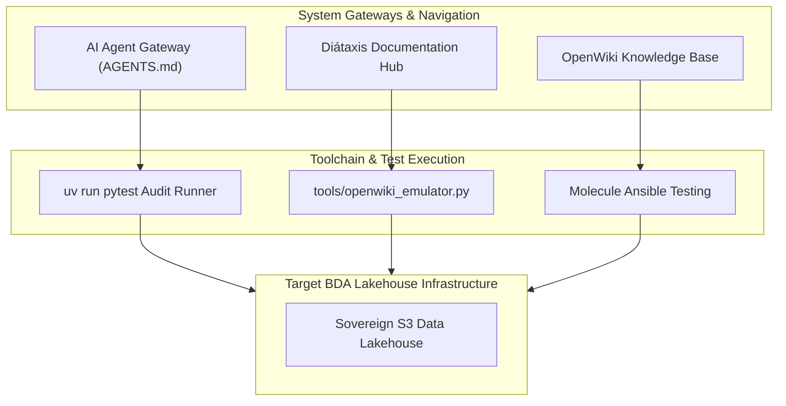

# 🚀 START HERE — BDA Lakehouse & DSOM Protocol Onboarding

Welcome to the Big Data Analytics (BDA) Lakehouse SSoT modernization project operating under the Deep State of Mind (DSOM) Protocol.

---

## 🏛️ Quickstart Onboarding & System Navigation Topology

The diagram below maps out the onboarding pathways and system navigation architecture for developers, operators, and AI agents.

### 1. Standalone Production-Ready SVG Vector Graphic (`.svg`)

<svg xmlns="http://www.w3.org/2000/svg" viewBox="0 0 960 400" width="100%" height="100%">
  <defs>
    <marker id="arrow-start" viewBox="0 0 10 10" refX="6" refY="5" markerWidth="6" markerHeight="6" orient="auto-start-reverse">
      <path d="M 0 0 L 10 5 L 0 10 z" fill="#64748B" />
    </marker>
    <filter id="shadow-start" x="-4%" y="-4%" width="108%" height="108%">
      <feDropShadow dx="0" dy="2" stdDeviation="3" flood-color="#000000" flood-opacity="0.25"/>
    </filter>
  </defs>

  <!-- Background -->
  <rect width="960" height="400" fill="#0F172A" rx="10"/>

  <!-- Top Gateway Tier -->
  <rect x="20" y="20" width="920" height="80" fill="#1E293B" stroke="#334155" stroke-width="1.5" rx="8" filter="url(#shadow-start)"/>
  <rect x="20" y="20" width="920" height="26" fill="#0F172A" rx="8"/>
  <text x="35" y="38" font-family="-apple-system, BlinkMacSystemFont, 'Segoe UI', Roboto, sans-serif" font-size="12" font-weight="bold" fill="#38BDF8">ONBOARDING GATEWAYS &amp; SYSTEM ENTRY POINTS</text>

  <rect x="40" y="52" width="270" height="38" fill="#0369A1" stroke="#38BDF8" rx="4"/>
  <text x="50" y="75" font-family="-apple-system, BlinkMacSystemFont, 'Segoe UI', Roboto, sans-serif" font-size="12" font-weight="bold" fill="#E0F2FE">AI Agent Gateway (AGENTS.md / DSOM)</text>

  <rect x="345" y="52" width="270" height="38" fill="#1E3A8A" stroke="#3B82F6" rx="4"/>
  <text x="355" y="75" font-family="-apple-system, BlinkMacSystemFont, 'Segoe UI', Roboto, sans-serif" font-size="12" font-weight="bold" fill="#93C5FD">Diátaxis Docs &amp; Developer Tutorials</text>

  <rect x="650" y="52" width="270" height="38" fill="#065F46" stroke="#22C55E" rx="4"/>
  <text x="660" y="75" font-family="-apple-system, BlinkMacSystemFont, 'Segoe UI', Roboto, sans-serif" font-size="12" font-weight="bold" fill="#86EFAC">OpenWiki SSoT Knowledge Base</text>

  <!-- Execution & Verification Tier -->
  <rect x="20" y="135" width="920" height="120" fill="#1E293B" stroke="#334155" stroke-width="1.5" rx="8" filter="url(#shadow-start)"/>
  <rect x="20" y="135" width="920" height="26" fill="#0F172A" rx="8"/>
  <text x="35" y="153" font-family="-apple-system, BlinkMacSystemFont, 'Segoe UI', Roboto, sans-serif" font-size="12" font-weight="bold" fill="#4ADE80">VERIFICATION RUNNERS &amp; TOOLCHAIN ENGINE</text>

  <rect x="40" y="170" width="270" height="70" fill="#0F172A" stroke="#22C55E" rx="6"/>
  <text x="50" y="192" font-family="-apple-system, BlinkMacSystemFont, 'Segoe UI', Roboto, sans-serif" font-size="13" font-weight="bold" fill="#86EFAC">uv Toolchain &amp; pytest</text>
  <text x="50" y="212" font-family="Consolas, Monaco, monospace" font-size="10" fill="#4ADE80">OKF v0.2 &amp; Zero Link Decay Audit</text>

  <rect x="345" y="170" width="270" height="70" fill="#0F172A" stroke="#22C55E" rx="6"/>
  <text x="355" y="192" font-family="-apple-system, BlinkMacSystemFont, 'Segoe UI', Roboto, sans-serif" font-size="13" font-weight="bold" fill="#86EFAC">OpenWiki Emulator</text>
  <text x="355" y="212" font-family="Consolas, Monaco, monospace" font-size="10" fill="#4ADE80">tools/openwiki_emulator.py</text>

  <rect x="650" y="170" width="270" height="70" fill="#0F172A" stroke="#22C55E" rx="6"/>
  <text x="660" y="192" font-family="-apple-system, BlinkMacSystemFont, 'Segoe UI', Roboto, sans-serif" font-size="13" font-weight="bold" fill="#86EFAC">Ansible &amp; Molecule</text>
  <text x="660" y="212" font-family="Consolas, Monaco, monospace" font-size="10" fill="#4ADE80">Container Integration Testing</text>

  <!-- Output Infrastructure Tier -->
  <rect x="20" y="285" width="920" height="90" fill="#1E293B" stroke="#334155" stroke-width="1.5" rx="8" filter="url(#shadow-start)"/>
  <rect x="20" y="285" width="920" height="26" fill="#0F172A" rx="8"/>
  <text x="35" y="303" font-family="-apple-system, BlinkMacSystemFont, 'Segoe UI', Roboto, sans-serif" font-size="12" font-weight="bold" fill="#FBBF24">TARGET BDA LAKEHOUSE INFRASTRUCTURE</text>

  <rect x="40" y="320" width="880" height="42" fill="#0F172A" stroke="#F59E0B" rx="6"/>
  <text x="50" y="346" font-family="-apple-system, BlinkMacSystemFont, 'Segoe UI', Roboto, sans-serif" font-size="12" font-weight="bold" fill="#FDE68A">Sovereign Data Lakehouse (Apache Iceberg, Polaris, PostgreSQL PostGIS, Ceph/MinIO, APISIX)</text>

  <!-- Connectors -->
  <line x1="175" y1="90" x2="175" y2="170" stroke="#64748B" stroke-width="1.5" marker-end="url(#arrow-start)"/>
  <line x1="480" y1="90" x2="480" y2="170" stroke="#64748B" stroke-width="1.5" marker-end="url(#arrow-start)"/>
  <line x1="785" y1="90" x2="785" y2="170" stroke="#64748B" stroke-width="1.5" marker-end="url(#arrow-start)"/>

  <line x1="175" y1="240" x2="480" y2="320" stroke="#64748B" stroke-width="1.5" marker-end="url(#arrow-start)"/>
  <line x1="480" y1="240" x2="480" y2="320" stroke="#64748B" stroke-width="1.5" marker-end="url(#arrow-start)"/>
  <line x1="785" y1="240" x2="480" y2="320" stroke="#64748B" stroke-width="1.5" marker-end="url(#arrow-start)"/>
</svg>

### 2. Git-Native Mermaid Topology (`.mmd`)

### 3. Summary Interface & Routing Table

| Source Component | Target Component | Port / Protocol / API Ingress | Security Boundary / Access Key | Operational Significance / Flow Description |
| :--- | :--- | :--- | :--- | :--- |
| **Developer / Agent** | **uv run pytest** | Local CLI Exec | Local Environment | Audits frontmatter metadata, link decay, and raw SVG inline tags. |
| **OpenWiki Emulator** | **OpenWiki SSoT Index** | Local Python Script | Local File System Write | Re-generates knowledge graph and interactive navigation metadata. |

## 🧭 Navigation Gateway

### 🤖 AI Agent Entry Points

1. **Root Gateway:** [AGENTS.html](AGENTS.html)
2. **Sovereign Constitution:** [.agents/AGENTS.md](.agents/AGENTS.md)
3. **Spatial Memory Engine:** [.agents/brain/](.agents/brain/)
4. **AI Cognitive Twin Protocol:** [docs/AI-COGNITIVE-TWIN-PROTOCOL.html](docs/AI-COGNITIVE-TWIN-PROTOCOL.html)
5. **OpenWiki SSoT Quickstart & Graph:** [openwiki/quickstart.md](openwiki/quickstart.md)

### 📚 Documentation Quadrants (Diátaxis)

- **Tutorials:** [docs/tutorials/onboarding-and-setup.html](docs/tutorials/onboarding-and-setup.html)
- **How-To Guides:** [docs/how-to-guides/phased-migration-strategy.html](docs/how-to-guides/phased-migration-strategy.html)
- **Reference Material:** [docs/reference/lakehouse-architecture.html](docs/reference/lakehouse-architecture.html) | [docs/reference/postgresql-pgvector-enterprise-strategy.html](docs/reference/postgresql-pgvector-enterprise-strategy.html) | [docs/reference/consumption-and-integration-layer.html](docs/reference/consumption-and-integration-layer.html) | [docs/reference/next-technology-roadmap-stack.html](docs/reference/next-technology-roadmap-stack.html)
- **Explanation:** [docs/explanation/governance-and-compliance.html](docs/explanation/governance-and-compliance.html)

### 🛠️ Workflows & Test Suites

- **CI/CD OKF & Link Audit:** `.github/workflows/dsom-audit.yml`
- **OpenWiki Emulator & Knowledge Graph:** `uv run python tools/openwiki_emulator.py --init`
- **Python Linter & Unit Tests:** `uv run ruff check .` and `uv run pytest`
- **Ansible & Quadlet Tests:** `.ansible-lint` and `molecule/default/`
- **Playwright E2E Search Tests:** `tests/e2e/docs_search.spec.ts`

### 📜 Sovereign Ledgers

- **Summary Index:** [SUMMARY.html](SUMMARY.html)
- **LLM AI Sitemap:** [llms.txt](llms.txt)
- **Changelog Ledger:** [CHANGELOG.html](CHANGELOG.html)
- **Execution History Ledger:** [HISTORY.html](HISTORY.html)
