# Modernizing Big Data Analytics Architecture: BDA Lakehouse SSoT Baseline

Welcome to the authoritative platform documentation for modernizing the **Big Data Analytics (BDA)** architecture into a 100% open-source, S3-compatible Single Source of Truth (SSoT) data lakehouse.

---

## 🏛️ Master Infrastructure & Data Governance Architecture

The diagram below presents the high-level architecture of the modernized BDA SSoT platform, highlighting perimeter access, human-in-the-loop file quarantine workflow, data plane orchestration, database persistence, visualization, and AIOps automation.

### 1. Standalone Production-Ready SVG Vector Graphic (`.svg`)

<svg xmlns="http://www.w3.org/2000/svg" viewBox="0 0 960 520" width="100%" height="100%">
  <defs>
    <marker id="arrow-rm" viewBox="0 0 10 10" refX="6" refY="5" markerWidth="6" markerHeight="6" orient="auto-start-reverse">
      <path d="M 0 0 L 10 5 L 0 10 z" fill="#64748B" />
    </marker>
    <filter id="shadow-rm" x="-4%" y="-4%" width="108%" height="108%">
      <feDropShadow dx="0" dy="2" stdDeviation="3" flood-color="#000000" flood-opacity="0.25"/>
    </filter>
  </defs>

  <!-- Background -->
  <rect width="960" height="520" fill="#0F172A" rx="10"/>

  <!-- Tier 1: Ingress & Client Interfaces -->
  <rect x="20" y="20" width="920" height="90" fill="#1E293B" stroke="#334155" stroke-width="1.5" rx="8" filter="url(#shadow-rm)"/>
  <rect x="20" y="20" width="920" height="26" fill="#0F172A" rx="8"/>
  <text x="35" y="38" font-family="-apple-system, BlinkMacSystemFont, 'Segoe UI', Roboto, sans-serif" font-size="12" font-weight="bold" fill="#38BDF8">INGRESS &amp; CLIENT INTERFACES</text>

  <rect x="40" y="55" width="270" height="42" fill="#0369A1" stroke="#38BDF8" rx="4"/>
  <text x="50" y="80" font-family="-apple-system, BlinkMacSystemFont, 'Segoe UI', Roboto, sans-serif" font-size="12" font-weight="bold" fill="#E0F2FE">Laravel Web App (Human Upload &amp; Review)</text>

  <rect x="345" y="55" width="270" height="42" fill="#1E3A8A" stroke="#3B82F6" rx="4"/>
  <text x="355" y="80" font-family="-apple-system, BlinkMacSystemFont, 'Segoe UI', Roboto, sans-serif" font-size="12" font-weight="bold" fill="#93C5FD">Application REST APIs (Human Apps)</text>

  <rect x="650" y="55" width="270" height="42" fill="#581C87" stroke="#A855F7" rx="4"/>
  <text x="660" y="80" font-family="-apple-system, BlinkMacSystemFont, 'Segoe UI', Roboto, sans-serif" font-size="12" font-weight="bold" fill="#E9D5FF">MCP Server (AI Agent Tool Integrations)</text>

  <!-- Tier 2: Storage & Data Plane Isolation -->
  <rect x="20" y="130" width="920" height="150" fill="#1E293B" stroke="#334155" stroke-width="1.5" rx="8" filter="url(#shadow-rm)"/>
  <rect x="20" y="130" width="920" height="26" fill="#0F172A" rx="8"/>
  <text x="35" y="148" font-family="-apple-system, BlinkMacSystemFont, 'Segoe UI', Roboto, sans-serif" font-size="12" font-weight="bold" fill="#60A5FA">STORAGE, FILE QUARANTINE &amp; DATA PLANE ENGINE</text>

  <rect x="35" y="165" width="270" height="100" fill="#0F172A" stroke="#3B82F6" rx="6"/>
  <text x="45" y="187" font-family="-apple-system, BlinkMacSystemFont, 'Segoe UI', Roboto, sans-serif" font-size="12" font-weight="bold" fill="#93C5FD">RustFS Shared Storage</text>
  <text x="45" y="207" font-family="Consolas, Monaco, monospace" font-size="10" fill="#60A5FA">Non-IT User Upload Staging</text>
  <text x="45" y="227" font-family="-apple-system, BlinkMacSystemFont, 'Segoe UI', Roboto, sans-serif" font-size="10" fill="#E2E8F0">• Verification Directory Swap</text>

  <rect x="345" y="165" width="270" height="100" fill="#0F172A" stroke="#22C55E" rx="6"/>
  <text x="355" y="187" font-family="-apple-system, BlinkMacSystemFont, 'Segoe UI', Roboto, sans-serif" font-size="12" font-weight="bold" fill="#86EFAC">Apache NiFi 2.0 &amp; OpenMetadata</text>
  <text x="355" y="207" font-family="Consolas, Monaco, monospace" font-size="10" fill="#4ADE80">ETL Pipeline &amp; Governance</text>
  <text x="355" y="227" font-family="-apple-system, BlinkMacSystemFont, 'Segoe UI', Roboto, sans-serif" font-size="10" fill="#E2E8F0">• Metadata Lineage Tagging</text>

  <rect x="650" y="165" width="270" height="100" fill="#0F172A" stroke="#F59E0B" rx="6"/>
  <text x="660" y="187" font-family="-apple-system, BlinkMacSystemFont, 'Segoe UI', Roboto, sans-serif" font-size="12" font-weight="bold" fill="#FDE68A">Ceph S3 Object Store</text>
  <text x="660" y="207" font-family="Consolas, Monaco, monospace" font-size="10" fill="#FBBF24">WORM Immutable S3 Storage</text>
  <text x="660" y="227" font-family="-apple-system, BlinkMacSystemFont, 'Segoe UI', Roboto, sans-serif" font-size="10" fill="#E2E8F0">• Long-Term Storage &amp; Raw Artifacts</text>

  <!-- Tier 3: Master Database, Visualization & AIOps -->
  <rect x="20" y="300" width="920" height="110" fill="#1E293B" stroke="#334155" stroke-width="1.5" rx="8" filter="url(#shadow-rm)"/>
  <rect x="20" y="300" width="920" height="26" fill="#0F172A" rx="8"/>
  <text x="35" y="318" font-family="-apple-system, BlinkMacSystemFont, 'Segoe UI', Roboto, sans-serif" font-size="12" font-weight="bold" fill="#4ADE80">MASTER PERSISTENCE, VISUALIZATION &amp; AIOPS AUTOMATION</text>

  <rect x="35" y="335" width="270" height="60" fill="#0F172A" stroke="#22C55E" rx="6"/>
  <text x="45" y="357" font-family="-apple-system, BlinkMacSystemFont, 'Segoe UI', Roboto, sans-serif" font-size="12" font-weight="bold" fill="#86EFAC">Percona Patroni PostgreSQL 18</text>
  <text x="45" y="377" font-family="Consolas, Monaco, monospace" font-size="10" fill="#4ADE80">HA SSoT Master Relational DB</text>

  <rect x="345" y="335" width="270" height="60" fill="#0F172A" stroke="#38BDF8" rx="6"/>
  <text x="355" y="357" font-family="-apple-system, BlinkMacSystemFont, 'Segoe UI', Roboto, sans-serif" font-size="12" font-weight="bold" fill="#E0F2FE">Apache Superset</text>
  <text x="355" y="377" font-family="Consolas, Monaco, monospace" font-size="10" fill="#38BDF8">BI &amp; Spatial Visualizations</text>

  <rect x="650" y="335" width="270" height="60" fill="#0F172A" stroke="#A855F7" rx="6"/>
  <text x="660" y="357" font-family="-apple-system, BlinkMacSystemFont, 'Segoe UI', Roboto, sans-serif" font-size="12" font-weight="bold" fill="#E9D5FF">AIOps Automation Control</text>
  <text x="660" y="377" font-family="Consolas, Monaco, monospace" font-size="10" fill="#A855F7">Ansible + Gitea + ARA + SemaphoreUI</text>

  <!-- Baseline Infrastructure Container -->
  <rect x="20" y="430" width="920" height="70" fill="#0F172A" stroke="#64748B" stroke-width="1.5" rx="8"/>
  <text x="35" y="450" font-family="-apple-system, BlinkMacSystemFont, 'Segoe UI', Roboto, sans-serif" font-size="12" font-weight="bold" fill="#94A3B8">INFRASTRUCTURE BASELINE &amp; CONTAINER RUNTIME</text>
  <text x="35" y="475" font-family="Consolas, Monaco, monospace" font-size="11" fill="#E2E8F0">Proxmox VE (Hyper-Converged Infrastructure) + Podman Rootless Pods (Kubernetes to be evaluated post-2028 baseline build)</text>

  <!-- Connector Lines -->
  <line x1="175" y1="97" x2="175" y2="165" stroke="#64748B" stroke-width="1.5" marker-end="url(#arrow-rm)"/>
  <line x1="305" y1="215" x2="345" y2="215" stroke="#64748B" stroke-width="1.5" marker-end="url(#arrow-rm)"/>
  <line x1="615" y1="215" x2="650" y2="215" stroke="#64748B" stroke-width="1.5" marker-end="url(#arrow-rm)"/>
  <line x1="480" y1="265" x2="175" y2="335" stroke="#64748B" stroke-width="1.5" marker-end="url(#arrow-rm)"/>
  <line x1="175" y1="395" x2="480" y2="335" stroke="#64748B" stroke-width="1.5" marker-end="url(#arrow-rm)"/>
</svg>

### 2. Git-Native Mermaid Topology (`.mmd`)

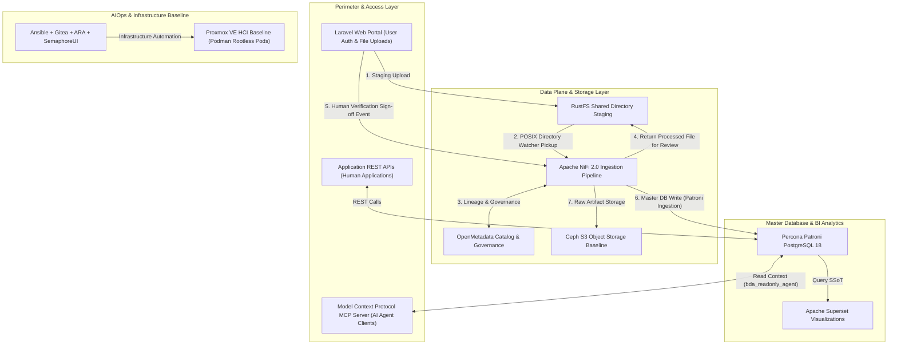

### 3. Summary Interface & Routing Table

| Source Component | Target Component | Port / Protocol / API Ingress | Security Boundary / Access Key | Operational Significance / Flow Description |
| :--- | :--- | :--- | :--- | :--- |
| **Laravel Web App** | **RustFS Storage** | Local POSIX Mount / Shared Volume | Session JWT / POSIX Directory ACLs | Non-IT users upload files into isolated shared staging directories. |
| **RustFS Storage** | **Apache NiFi 2.0** | POSIX File System Watcher | POSIX Read ACLs & Group Scopes | NiFi directory watcher detects raw files for extraction and preliminary validation. |
| **Apache NiFi 2.0** | **OpenMetadata** | `TCP 8585` / REST API | Bearer API Key | Emits lineage metadata, schema tags, and provenance classification records. |
| **Apache NiFi 2.0** | **Laravel Verification** | Local POSIX Mount / Shared Volume | Session JWT / POSIX Write ACLs | Writes normalized output back to verification staging directory for human review. |
| **Apache NiFi 2.0** | **Percona Patroni PostgreSQL 18** | `TCP 5432` / PostgreSQL TLS 1.3 | Dedicated Ingestion Role (`nifi_ingest_writer`) | Ingests human-verified payloads into High-Availability PostgreSQL master database upon sign-off. |
| **Apache Superset** | **Percona Patroni PostgreSQL 18** | `TCP 5432` / PostgreSQL TLS 1.3 | Read-Only Analytical Role (`superset_reader`) | Renders interactive dashboards, geospatial maps, and reporting analytics. |
| **MCP Server** | **Percona Patroni PostgreSQL 18** | `TCP 5432` / PostgreSQL TLS 1.3 | Read-Only DB Role (`bda_readonly_agent`) | Enforces `GRANT SELECT` / `REVOKE INSERT, UPDATE, DELETE` with `SET LOCAL` session context injection. |
| **AIOps Suite** | **Proxmox / Podman** | `TCP 22` / SSH, `TCP 3000` SemaphoreUI | SSH Keys & Git Tokens | Automates playbook execution, configuration drift management, and pod deployments. |

---

## 🛠️ Baseline Software Stack Architecture

The platform standardizes on an enterprise-grade, 100% open-source software stack deployed on Proxmox VE hyper-converged infrastructure using Podman rootless pods:

1. **Database:** **Percona Patroni PostgreSQL 18** — High-availability clustered relational master persistence engine providing SSoT transaction guarantees and spatial query execution.
2. **Data Plane:** **Apache NiFi 2.0 + OpenMetadata** — Low-code visual workflow processing, automated stream/batch ingestion, schema extraction, and metadata lineage tracking.
3. **Visualization:** **Apache Superset** — Enterprise business intelligence, spatial analytics, and executive reporting engine.
4. **AIOps & Orchestration:** **Ansible + Gitea + ARA + SemaphoreUI** — GitOps automation pipeline, infrastructure-as-code management, execution audit tracking (ARA), and web UI orchestration (SemaphoreUI).
5. **File & Object Storage:** **RustFS + Ceph S3** — RustFS provides high-performance shared file directory staging for non-IT user uploads, while Ceph S3 serves as the primary object storage baseline.
6. **Infrastructure Baseline:** **Proxmox VE (HCI) + Podman Rootless Pods** — Hyper-converged virtualized infrastructure running container workloads in rootless Podman pods. *Note: Kubernetes container orchestration will be evaluated in a later operational phase.*

---

## 🔄 Human-in-the-Loop File Quarantine Workflow

To bridge non-IT user interactions with automated big data ETL while guaranteeing SSoT data integrity, the architecture enforces a structured quarantine and approval workflow built using Laravel and Apache NiFi 2.0:

<svg xmlns="http://www.w3.org/2000/svg" viewBox="0 0 960 480" width="100%" height="100%">
  <defs>
    <marker id="arr-quar-blue" viewBox="0 0 10 10" refX="6" refY="5" markerWidth="6" markerHeight="6" orient="auto-start-reverse">
      <path d="M 0 0 L 10 5 L 0 10 z" fill="#2563EB" />
    </marker>
    <marker id="arr-quar-green" viewBox="0 0 10 10" refX="6" refY="5" markerWidth="6" markerHeight="6" orient="auto-start-reverse">
      <path d="M 0 0 L 10 5 L 0 10 z" fill="#16A34A" />
    </marker>
    <marker id="arr-quar-amber" viewBox="0 0 10 10" refX="6" refY="5" markerWidth="6" markerHeight="6" orient="auto-start-reverse">
      <path d="M 0 0 L 10 5 L 0 10 z" fill="#D97706" />
    </marker>
    <marker id="arr-quar-purple" viewBox="0 0 10 10" refX="6" refY="5" markerWidth="6" markerHeight="6" orient="auto-start-reverse">
      <path d="M 0 0 L 10 5 L 0 10 z" fill="#9333EA" />
    </marker>
    <filter id="shadow-quar-light" x="-2%" y="-2%" width="104%" height="104%">
      <feDropShadow dx="0" dy="2" stdDeviation="2" flood-color="#000000" flood-opacity="0.08"/>
    </filter>
  </defs>

  <!-- Canvas Background -->
  <rect width="960" height="480" fill="#FFFFFF" stroke="#CBD5E1" stroke-width="1" rx="10"/>

  <!-- Stage 1 Container: Ingress & Directory Staging -->
  <rect x="20" y="20" width="280" height="420" fill="#F0F9FF" stroke="#2563EB" stroke-width="1.5" rx="8" filter="url(#shadow-quar-light)"/>
  <rect x="20" y="20" width="280" height="28" fill="#DBEAFE" rx="8"/>
  <text x="30" y="39" font-family="-apple-system, BlinkMacSystemFont, 'Segoe UI', Roboto, sans-serif" font-size="11" font-weight="bold" fill="#1E40AF">1. USER INGRESS &amp; STAGING</text>

  <!-- Card: Non-IT User -->
  <rect x="35" y="60" width="250" height="65" fill="#FFFFFF" stroke="#3B82F6" stroke-width="1.2" rx="6"/>
  <text x="45" y="82" font-family="-apple-system, BlinkMacSystemFont, 'Segoe UI', Roboto, sans-serif" font-size="12" font-weight="bold" fill="#0F172A">Non-IT Domain User</text>
  <text x="45" y="102" font-family="Consolas, Monaco, monospace" font-size="10" fill="#2563EB">Authenticates &amp; Uploads File</text>

  <!-- Card: Laravel Web App -->
  <rect x="35" y="185" width="250" height="65" fill="#FFFFFF" stroke="#3B82F6" stroke-width="1.2" rx="6"/>
  <text x="45" y="207" font-family="-apple-system, BlinkMacSystemFont, 'Segoe UI', Roboto, sans-serif" font-size="12" font-weight="bold" fill="#0F172A">Laravel Web Portal</text>
  <text x="45" y="227" font-family="Consolas, Monaco, monospace" font-size="10" fill="#2563EB">Auth JWT / Form File Handler</text>

  <!-- Card: RustFS Staging Directory -->
  <rect x="35" y="325" width="250" height="85" fill="#FFFFFF" stroke="#3B82F6" stroke-width="1.2" rx="6"/>
  <text x="45" y="347" font-family="-apple-system, BlinkMacSystemFont, 'Segoe UI', Roboto, sans-serif" font-size="12" font-weight="bold" fill="#0F172A">RustFS Staging Directory</text>
  <text x="45" y="367" font-family="Consolas, Monaco, monospace" font-size="10" fill="#2563EB">Shared Storage Volume</text>
  <text x="45" y="387" font-family="Consolas, Monaco, monospace" font-size="9" fill="#475569">Path: /data/staging/raw/</text>

  <!-- Stage 2 Container: Automated NiFi Processing -->
  <rect x="340" y="20" width="280" height="420" fill="#F0FDF4" stroke="#16A34A" stroke-width="1.5" rx="8" filter="url(#shadow-quar-light)"/>
  <rect x="340" y="20" width="280" height="28" fill="#DCFCE7" rx="8"/>
  <text x="350" y="39" font-family="-apple-system, BlinkMacSystemFont, 'Segoe UI', Roboto, sans-serif" font-size="11" font-weight="bold" fill="#15803D">2. AUTOMATED NIFI ETL PIPELINE</text>

  <!-- Card: Apache NiFi 2.0 Pipeline -->
  <rect x="355" y="125" width="250" height="85" fill="#FFFFFF" stroke="#16A34A" stroke-width="1.2" rx="6"/>
  <text x="365" y="147" font-family="-apple-system, BlinkMacSystemFont, 'Segoe UI', Roboto, sans-serif" font-size="12" font-weight="bold" fill="#0F172A">Apache NiFi 2.0 Pipeline</text>
  <text x="365" y="167" font-family="Consolas, Monaco, monospace" font-size="10" fill="#16A34A">Directory Watcher &amp; Parser</text>
  <text x="365" y="187" font-family="Consolas, Monaco, monospace" font-size="9" fill="#047857">Extract, Normalize &amp; Validate</text>

  <!-- Card: RustFS Verification Directory -->
  <rect x="355" y="285" width="250" height="85" fill="#FFFFFF" stroke="#16A34A" stroke-width="1.2" rx="6"/>
  <text x="365" y="307" font-family="-apple-system, BlinkMacSystemFont, 'Segoe UI', Roboto, sans-serif" font-size="12" font-weight="bold" fill="#0F172A">RustFS Verification Directory</text>
  <text x="365" y="327" font-family="Consolas, Monaco, monospace" font-size="10" fill="#16A34A">Processed Preview Payload</text>
  <text x="365" y="347" font-family="Consolas, Monaco, monospace" font-size="9" fill="#475569">Path: /data/staging/verify/</text>

  <!-- Stage 3 Container: Human Approval & Master Persistence -->
  <rect x="660" y="20" width="280" height="420" fill="#FAF5FF" stroke="#9333EA" stroke-width="1.5" rx="8" filter="url(#shadow-quar-light)"/>
  <rect x="660" y="20" width="280" height="28" fill="#F3E8FF" rx="8"/>
  <text x="670" y="39" font-family="-apple-system, BlinkMacSystemFont, 'Segoe UI', Roboto, sans-serif" font-size="11" font-weight="bold" fill="#7E22CE">3. HUMAN APPROVAL &amp; MASTER DB</text>

  <!-- Card: Human User Review & Verification -->
  <rect x="675" y="60" width="250" height="85" fill="#FFFFFF" stroke="#D97706" stroke-width="1.2" rx="6"/>
  <text x="685" y="82" font-family="-apple-system, BlinkMacSystemFont, 'Segoe UI', Roboto, sans-serif" font-size="12" font-weight="bold" fill="#0F172A">Human User Review &amp; Approval</text>
  <text x="685" y="102" font-family="Consolas, Monaco, monospace" font-size="10" fill="#B45309">Laravel UI Review &amp; Sign-off</text>
  <text x="685" y="122" font-family="Consolas, Monaco, monospace" font-size="9" fill="#92400E">Diff Preview &amp; DQ Assertions</text>

  <!-- Card: Digital Approval Event Gate -->
  <rect x="675" y="205" width="250" height="65" fill="#FFFFFF" stroke="#9333EA" stroke-width="1.2" rx="6"/>
  <text x="685" y="227" font-family="-apple-system, BlinkMacSystemFont, 'Segoe UI', Roboto, sans-serif" font-size="12" font-weight="bold" fill="#0F172A">Apache NiFi Ingest Gate</text>
  <text x="685" y="247" font-family="Consolas, Monaco, monospace" font-size="10" fill="#7E22CE">Triggered by Digital Signature</text>

  <!-- Card: Master PostgreSQL DB -->
  <rect x="675" y="325" width="250" height="85" fill="#FFFFFF" stroke="#9333EA" stroke-width="1.2" rx="6"/>
  <text x="685" y="347" font-family="-apple-system, BlinkMacSystemFont, 'Segoe UI', Roboto, sans-serif" font-size="12" font-weight="bold" fill="#0F172A">Percona Patroni PostgreSQL 18</text>
  <text x="685" y="367" font-family="Consolas, Monaco, monospace" font-size="10" fill="#7E22CE">Master SSoT Persistence</text>
  <text x="685" y="387" font-family="Consolas, Monaco, monospace" font-size="9" fill="#6B21A8">Role: nifi_ingest_writer</text>

  <!-- Path Connections & Badges -->
  <!-- Step 1: User -> Laravel -->
  <line x1="160" y1="125" x2="160" y2="185" stroke="#2563EB" stroke-width="2" marker-end="url(#arr-quar-blue)"/>
  <rect x="85" y="143" width="150" height="20" fill="#DBEAFE" stroke="#2563EB" stroke-width="1" rx="4"/>
  <text x="160" y="157" text-anchor="middle" font-family="-apple-system, BlinkMacSystemFont, 'Segoe UI', Roboto, sans-serif" font-size="9" font-weight="bold" fill="#1E40AF">1. Login &amp; Upload File</text>

  <!-- Step 1b: Laravel -> RustFS Staging -->
  <line x1="160" y1="250" x2="160" y2="325" stroke="#2563EB" stroke-width="2" marker-end="url(#arr-quar-blue)"/>

  <!-- Step 2: RustFS Staging -> NiFi Pipeline -->
  <path d="M 285 367 L 480 367 L 480 210" fill="none" stroke="#16A34A" stroke-width="2" marker-end="url(#arr-quar-green)"/>
  <rect x="310" y="355" width="155" height="20" fill="#DCFCE7" stroke="#16A34A" stroke-width="1" rx="4"/>
  <text x="387" y="369" text-anchor="middle" font-family="-apple-system, BlinkMacSystemFont, 'Segoe UI', Roboto, sans-serif" font-size="9" font-weight="bold" fill="#15803D">2. POSIX Watcher Pickup</text>

  <!-- Step 3: NiFi -> RustFS Verify -->
  <line x1="480" y1="210" x2="480" y2="285" stroke="#16A34A" stroke-width="2" marker-end="url(#arr-quar-green)"/>
  <rect x="395" y="235" width="170" height="20" fill="#DCFCE7" stroke="#16A34A" stroke-width="1" rx="4"/>
  <text x="480" y="249" text-anchor="middle" font-family="-apple-system, BlinkMacSystemFont, 'Segoe UI', Roboto, sans-serif" font-size="9" font-weight="bold" fill="#15803D">3. Extract, Normalize &amp; Process</text>

  <!-- Step 4: RustFS Verify -> Laravel User Review -->
  <path d="M 605 327 L 640 327 L 640 102 L 675 102" fill="none" stroke="#D97706" stroke-width="2" marker-end="url(#arr-quar-amber)"/>
  <rect x="535" y="80" width="130" height="20" fill="#FEF3C7" stroke="#D97706" stroke-width="1" rx="4"/>
  <text x="600" y="94" text-anchor="middle" font-family="-apple-system, BlinkMacSystemFont, 'Segoe UI', Roboto, sans-serif" font-size="9" font-weight="bold" fill="#B45309">4. Display Summary</text>

  <!-- Step 5: Human Review -> Digital Approval -> NiFi Ingest -->
  <line x1="800" y1="145" x2="800" y2="205" stroke="#9333EA" stroke-width="2" marker-end="url(#arr-quar-purple)"/>
  <rect x="730" y="163" width="140" height="20" fill="#F3E8FF" stroke="#9333EA" stroke-width="1" rx="4"/>
  <text x="800" y="177" text-anchor="middle" font-family="-apple-system, BlinkMacSystemFont, 'Segoe UI', Roboto, sans-serif" font-size="9" font-weight="bold" fill="#7E22CE">5. Digital Approval Event</text>

  <!-- Step 6: NiFi Ingest -> PostgreSQL 18 -->
  <line x1="800" y1="270" x2="800" y2="325" stroke="#9333EA" stroke-width="2" marker-end="url(#arr-quar-purple)"/>
  <rect x="735" y="285" width="130" height="20" fill="#F3E8FF" stroke="#9333EA" stroke-width="1" rx="4"/>
  <text x="800" y="299" text-anchor="middle" font-family="-apple-system, BlinkMacSystemFont, 'Segoe UI', Roboto, sans-serif" font-size="9" font-weight="bold" fill="#7E22CE">6. Master DB Write</text>

  <!-- Centered Figure Caption -->
  <text x="480" y="462" text-anchor="middle" font-family="-apple-system, BlinkMacSystemFont, 'Segoe UI', Roboto, sans-serif" font-size="11" font-weight="bold" fill="#475569">Figure 1.2: Human-in-the-Loop File Quarantine Workflow Architecture</text>
</svg>

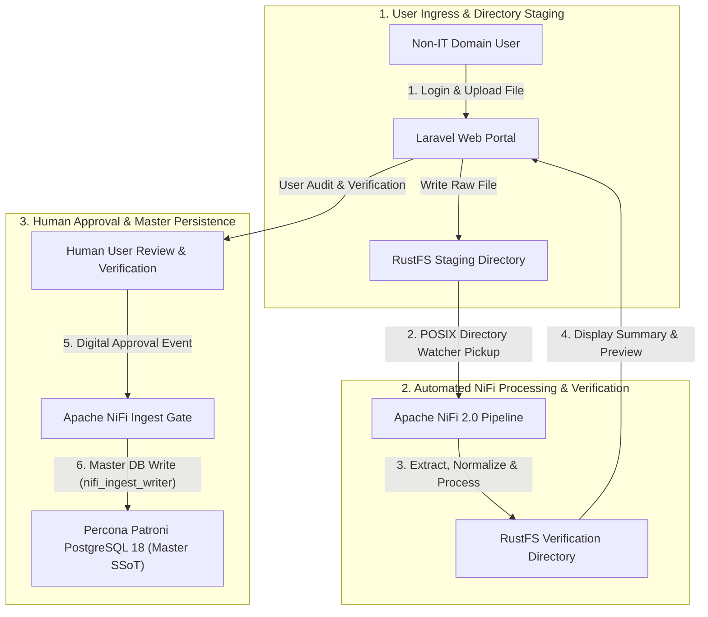

| Source Component | Target Component | Port / Protocol / API Ingress | Security Boundary / Access Key | Operational Significance / Flow Description |
| :--- | :--- | :--- | :--- | :--- |
| **Non-IT Domain User** | **Laravel Web Portal** | `HTTPS TCP 443` / Web Portal | IAM Authenticated Session (Keycloak JWT) | Domain user authenticates and uploads raw spreadsheet/document files into staging. |
| **Laravel Web Portal** | **RustFS Staging Directory** | Local POSIX Volume Mount | POSIX Staging Directory ACLs | Staged uploads are saved to isolated RustFS staging directories before ETL pickup. |
| **RustFS Staging Directory** | **Apache NiFi 2.0 Pipeline** | POSIX Directory Watcher | Read-Only POSIX File System Access | Apache NiFi directory monitoring processor detects and picks up newly uploaded files. |
| **Apache NiFi 2.0 Pipeline** | **RustFS Verification Directory** | POSIX File Output | Verification Directory ACLs | NiFi extracts, cleanses, normalises, and writes preview payloads into verification directory. |
| **RustFS Verification Directory** | **Laravel Web Portal** | Local POSIX Volume Mount | POSIX Verification Directory ACLs | Reads processed preview payload to display summary, data quality alerts, and diff previews. |
| **Human Reviewer / Laravel** | **Apache NiFi Ingest Gate** | `HTTPS TCP 8443` / REST API Trigger | Multi-Factor Auth & Digital Signature | Digital approval event in Laravel triggers Apache NiFi ingestion pipeline. |
| **Apache NiFi Ingest Gate** | **Percona Patroni PostgreSQL 18** | `TCP 5432` / PostgreSQL TLS 1.3 | Dedicated Ingestion Role (`nifi_ingest_writer`) | NiFi commits verified master records into PostgreSQL 18 SSoT database upon approval sign-off. |

### Process Lifecycle Stages

* **User Login & Upload:** Non-IT domain users authenticate via Laravel and upload raw spreadsheet/document files into dedicated staging directories managed by RustFS.
* **Automated NiFi Pickup:** Apache NiFi 2.0 directory monitoring processors pick up newly uploaded files, parse schemas, perform automated data cleansing, and execute quality validations.
* **Verification Staging:** NiFi writes the processed outputs into a human verification directory and updates the file status in OpenMetadata and Laravel.
* **Human Review & Verification:** Users inspect processed summaries, validation alerts, and diff previews within the user-friendly Laravel interface.
* **Approval Trigger:** Upon human verification and digital sign-off in Laravel, an approval event triggers Apache NiFi 2.0 to execute master persistence.
* **Master Persistence Load:** Apache NiFi 2.0 commits the verified payload into Percona Patroni PostgreSQL 18 master database using dedicated ingestion credentials (`nifi_ingest_writer`) and archives raw artifacts to Ceph S3.

---

## 🏷️ Two-Tier Data Classification & Tagging Strategy

All data processed within the platform is tagged into two distinct governance categories to preserve ground truth and prevent unverified AI outputs from corrupting SSoT datasets:

| Tagging Category | Classification Name | Governance & Access Rules |
| :--- | :--- | :--- |
| **Category 1** | `REAL_DATA_AI_PROCESSED` | **Real Data & Real Processes with AI Processing:** Empirical physical data and human-driven business processes augmented by AI for cleaning, extraction, or formatting. Requires human verification before promotion to Percona Patroni PostgreSQL 18 master tables. |
| **Category 2** | `AI_PROCESS_RAG_ENRICHED` | **AI Process with RAG & AI Enrichment:** Synthetic outputs, generative summaries, vector embeddings, and RAG contextual enrichments created by AI models. Contained in read-only sandbox layers with mandatory `AI_GENERATED` lineage tagging. |

---

## 📡 Interfaces for Humans and AI Agents

The platform exposes dual interface layers to accommodate both human application consumption and AI agent tool calling:

* **Application REST APIs:** High-performance REST endpoints exposed to frontend web apps, mobile clients, and external enterprise software. Enables standard CRUD, spatial queries, and analytical reporting over HTTPS TLS 1.3.
* **Model Context Protocol (MCP) Server:** Native Python MCP server integration allowing external AI agents (e.g. Claude, Antigravity, local LLMs) to query context, execute sandboxed analytical tools, and retrieve SSoT metadata without direct database write permissions. Privileges are strictly restricted via the `bda_readonly_agent` database role (`GRANT SELECT` only), using `SET LOCAL` for dynamic session context injection.

---

## 📅 Multi-Year Build & Business Case Migration Plan (2028–2032)

Implementation and operational rollout are structured across a 5-year strategic timeline starting in 2028:

```
2028: Year 1 — Baseline Infrastructure Build
├── Deploy Proxmox VE HCI cluster & Podman rootless runtime
├── Provision Ceph S3 storage & RustFS staging directories
├── Install Percona Patroni PostgreSQL 18 HA cluster
├── Configure Apache NiFi 2.0, OpenMetadata & Apache Superset
└── Deploy Laravel upload portal & MCP server integration

2029–2032: Years 2–5 — Business Case Migration & System Evolution
├── Migrate legacy departmental business cases into SSoT platform
├── Onboard high-volume telemetry & IoT streaming feeds
├── Enhance AI/RAG enrichment pipelines & MCP tool capabilities
└── Evaluate Kubernetes container orchestration migration requirements
```

---

## 🤖 AI Gateway & Sovereign Protocols

* **Root AI Gateway:** [AGENTS.html](AGENTS.html)
* **Sovereign AI Constitution:** [.agents/AGENTS.md](.agents/AGENTS.md)
* **Spatial Memory Engine:** [.agents/brain/](.agents/brain/) (`task.md`, `walkthrough.md`, `palace_registry.md`, `active_context_manifest.md`)
* **AI Cognitive Twin Protocol:** [docs/AI-COGNITIVE-TWIN-PROTOCOL.html](docs/AI-COGNITIVE-TWIN-PROTOCOL.html)
* **OpenWiki SSoT Navigation & Graph:** [openwiki/quickstart.md](openwiki/quickstart.md) (`tools/openwiki_emulator.py`)
* **Master Onboarding Map:** [START-HERE.html](START-HERE.html)

---

## 🧭 Diátaxis Documentation Compass

Following the **Diátaxis Framework**, documentation is categorized into four distinct quadrants:

### 🎓 1. Tutorials (Practical Learning)

* [Onboarding and Developer Setup Guide](docs/tutorials/onboarding-and-setup.html)

### 🛠️ 2. How-To Guides (Practical Problem-Solving)

* [Ingestion Pipeline & Superset Modernization](docs/how-to-guides/ingestion-pipeline-modernization.html)
* [Phased Migration Strategy & Roadmap](docs/how-to-guides/phased-migration-strategy.html)
* [Onboarding and Scaling New AI/ML Business Cases](docs/how-to-guides/onboarding-new-ai-business-cases.html)

### 📚 3. Reference Material (Factual Technical Specs)

* [Legacy BDA Environment Architectural Deconstruction](docs/reference/legacy-architecture.html)
* [Target 100% Open-Source Lakehouse Architecture](docs/reference/lakehouse-architecture.html)
* [Big Data Domain Analytical Modules Specifications](docs/reference/business-applications.html)
* [Data Governance & Subsystems Matrix](docs/reference/governance-matrix.html)
* [Solution 1 Reference Spec: AWS Native & Cloud Managed Infrastructure](docs/reference/solution-1-aws-native.html)
* [Solution 2 Reference Spec: Hybrid Cloud Lakehouse & On-Premises GPU Infrastructure](docs/reference/solution-2-hybrid-ai.html)
* [Solution 3 Reference Spec: 100% On-Premises Sovereign Architecture (Proxmox VE + RKE2 + Ceph SDS)](docs/reference/solution-3-onprem-proxmox-rke2.html)
* [Next Technology Roadmap Stack Specification (Apache Polaris, DuckDB vss / pgvector, OpenTelemetry)](docs/reference/next-technology-roadmap-stack.html)
* [PostgreSQL & pgvector Enterprise Strategy Specification](docs/reference/postgresql-pgvector-enterprise-strategy.html)
* [Apache NiFi 2.0 Master Data Plane Architecture and Migration Guide](docs/reference/apache-nifi-2-master-data-plane-and-migration.html)
* [Consumption & Integration Layer Specification](docs/reference/consumption-and-integration-layer.html)
* [5-Year Strategic BDA & AI Roadmap & Master Business Case Specification (2028–2032)](docs/reference/5-year-bda-ai-roadmap-and-business-case.html)
* [OpenWiki SSoT Knowledge Base & Quickstart](openwiki/quickstart.md)

### 💡 4. Explanation (Theoretical Rationale)

* [The Human-to-AI Quarantine Model](docs/explanation/human-ai-quarantine-model.html)
* [Model Context Protocol (MCP) & AI Sandboxing Architecture](docs/explanation/mcp-and-ai-sandboxing.html)
* [Governance, Security, and Compliance Framework](docs/explanation/governance-and-compliance.html)

---

## 🛠️ CI/CD Workflows, Linters & Test Suites

* **Automated OKF & Zero Link Decay Audit:** `.github/workflows/dsom-audit.yml` and `tests/test_okf_and_links.py`
* **OpenWiki Emulator & Knowledge Graph:** `tools/openwiki_emulator.py` (`uv run python tools/openwiki_emulator.py --init`)
* **Code Health Linters:** `ruff` & `markdownlint-cli` configured via `pyproject.toml`, `.markdownlint.json`, and `.pre-commit-config.yaml`
* **Ansible & Infrastructure Testing:** `.ansible-lint` and Molecule scenarios in `molecule/default/`
* **Playwright E2E Search Tests:** `playwright.config.ts` and `tests/e2e/docs_search.spec.ts`

---

## 📜 Sovereign Ledgers & Standards

* **Master Navigation Summary:** [SUMMARY.html](SUMMARY.html)
* **AI Crawler Sitemap:** [llms.txt](llms.txt)
* **Changelog Ledger:** [CHANGELOG.html](CHANGELOG.html)
* **Execution History Ledger:** [HISTORY.html](HISTORY.html)


---


# 🚀 START HERE — BDA Lakehouse & DSOM Protocol Onboarding

Welcome to the Big Data Analytics (BDA) Lakehouse SSoT modernization project operating under the Deep State of Mind (DSOM) Protocol.

---

## 🏛️ Quickstart Onboarding & System Navigation Topology

The diagram below maps out the onboarding pathways and system navigation architecture for developers, operators, and AI agents.

### 1. Standalone Production-Ready SVG Vector Graphic (`.svg`)

<svg xmlns="http://www.w3.org/2000/svg" viewBox="0 0 960 400" width="100%" height="100%">
  <defs>
    <marker id="arrow-start" viewBox="0 0 10 10" refX="6" refY="5" markerWidth="6" markerHeight="6" orient="auto-start-reverse">
      <path d="M 0 0 L 10 5 L 0 10 z" fill="#64748B" />
    </marker>
    <filter id="shadow-start" x="-4%" y="-4%" width="108%" height="108%">
      <feDropShadow dx="0" dy="2" stdDeviation="3" flood-color="#000000" flood-opacity="0.25"/>
    </filter>
  </defs>

  <!-- Background -->
  <rect width="960" height="400" fill="#0F172A" rx="10"/>

  <!-- Top Gateway Tier -->
  <rect x="20" y="20" width="920" height="80" fill="#1E293B" stroke="#334155" stroke-width="1.5" rx="8" filter="url(#shadow-start)"/>
  <rect x="20" y="20" width="920" height="26" fill="#0F172A" rx="8"/>
  <text x="35" y="38" font-family="-apple-system, BlinkMacSystemFont, 'Segoe UI', Roboto, sans-serif" font-size="12" font-weight="bold" fill="#38BDF8">ONBOARDING GATEWAYS &amp; SYSTEM ENTRY POINTS</text>

  <rect x="40" y="52" width="270" height="38" fill="#0369A1" stroke="#38BDF8" rx="4"/>
  <text x="50" y="75" font-family="-apple-system, BlinkMacSystemFont, 'Segoe UI', Roboto, sans-serif" font-size="12" font-weight="bold" fill="#E0F2FE">AI Agent Gateway (AGENTS.md / DSOM)</text>

  <rect x="345" y="52" width="270" height="38" fill="#1E3A8A" stroke="#3B82F6" rx="4"/>
  <text x="355" y="75" font-family="-apple-system, BlinkMacSystemFont, 'Segoe UI', Roboto, sans-serif" font-size="12" font-weight="bold" fill="#93C5FD">Diátaxis Docs &amp; Developer Tutorials</text>

  <rect x="650" y="52" width="270" height="38" fill="#065F46" stroke="#22C55E" rx="4"/>
  <text x="660" y="75" font-family="-apple-system, BlinkMacSystemFont, 'Segoe UI', Roboto, sans-serif" font-size="12" font-weight="bold" fill="#86EFAC">OpenWiki SSoT Knowledge Base</text>

  <!-- Execution & Verification Tier -->
  <rect x="20" y="135" width="920" height="120" fill="#1E293B" stroke="#334155" stroke-width="1.5" rx="8" filter="url(#shadow-start)"/>
  <rect x="20" y="135" width="920" height="26" fill="#0F172A" rx="8"/>
  <text x="35" y="153" font-family="-apple-system, BlinkMacSystemFont, 'Segoe UI', Roboto, sans-serif" font-size="12" font-weight="bold" fill="#4ADE80">VERIFICATION RUNNERS &amp; TOOLCHAIN ENGINE</text>

  <rect x="40" y="170" width="270" height="70" fill="#0F172A" stroke="#22C55E" rx="6"/>
  <text x="50" y="192" font-family="-apple-system, BlinkMacSystemFont, 'Segoe UI', Roboto, sans-serif" font-size="13" font-weight="bold" fill="#86EFAC">uv Toolchain &amp; pytest</text>
  <text x="50" y="212" font-family="Consolas, Monaco, monospace" font-size="10" fill="#4ADE80">OKF v0.2 &amp; Zero Link Decay Audit</text>

  <rect x="345" y="170" width="270" height="70" fill="#0F172A" stroke="#22C55E" rx="6"/>
  <text x="355" y="192" font-family="-apple-system, BlinkMacSystemFont, 'Segoe UI', Roboto, sans-serif" font-size="13" font-weight="bold" fill="#86EFAC">OpenWiki Emulator</text>
  <text x="355" y="212" font-family="Consolas, Monaco, monospace" font-size="10" fill="#4ADE80">tools/openwiki_emulator.py</text>

  <rect x="650" y="170" width="270" height="70" fill="#0F172A" stroke="#22C55E" rx="6"/>
  <text x="660" y="192" font-family="-apple-system, BlinkMacSystemFont, 'Segoe UI', Roboto, sans-serif" font-size="13" font-weight="bold" fill="#86EFAC">Ansible &amp; Molecule</text>
  <text x="660" y="212" font-family="Consolas, Monaco, monospace" font-size="10" fill="#4ADE80">Container Integration Testing</text>

  <!-- Output Infrastructure Tier -->
  <rect x="20" y="285" width="920" height="90" fill="#1E293B" stroke="#334155" stroke-width="1.5" rx="8" filter="url(#shadow-start)"/>
  <rect x="20" y="285" width="920" height="26" fill="#0F172A" rx="8"/>
  <text x="35" y="303" font-family="-apple-system, BlinkMacSystemFont, 'Segoe UI', Roboto, sans-serif" font-size="12" font-weight="bold" fill="#FBBF24">TARGET BDA LAKEHOUSE INFRASTRUCTURE</text>

  <rect x="40" y="320" width="880" height="42" fill="#0F172A" stroke="#F59E0B" rx="6"/>
  <text x="50" y="346" font-family="-apple-system, BlinkMacSystemFont, 'Segoe UI', Roboto, sans-serif" font-size="12" font-weight="bold" fill="#FDE68A">Sovereign Data Lakehouse (Apache Iceberg, Polaris, PostgreSQL PostGIS, Ceph/MinIO, APISIX)</text>

  <!-- Connectors -->
  <line x1="175" y1="90" x2="175" y2="170" stroke="#64748B" stroke-width="1.5" marker-end="url(#arrow-start)"/>
  <line x1="480" y1="90" x2="480" y2="170" stroke="#64748B" stroke-width="1.5" marker-end="url(#arrow-start)"/>
  <line x1="785" y1="90" x2="785" y2="170" stroke="#64748B" stroke-width="1.5" marker-end="url(#arrow-start)"/>

  <line x1="175" y1="240" x2="480" y2="320" stroke="#64748B" stroke-width="1.5" marker-end="url(#arrow-start)"/>
  <line x1="480" y1="240" x2="480" y2="320" stroke="#64748B" stroke-width="1.5" marker-end="url(#arrow-start)"/>
  <line x1="785" y1="240" x2="480" y2="320" stroke="#64748B" stroke-width="1.5" marker-end="url(#arrow-start)"/>
</svg>

### 2. Git-Native Mermaid Topology (`.mmd`)

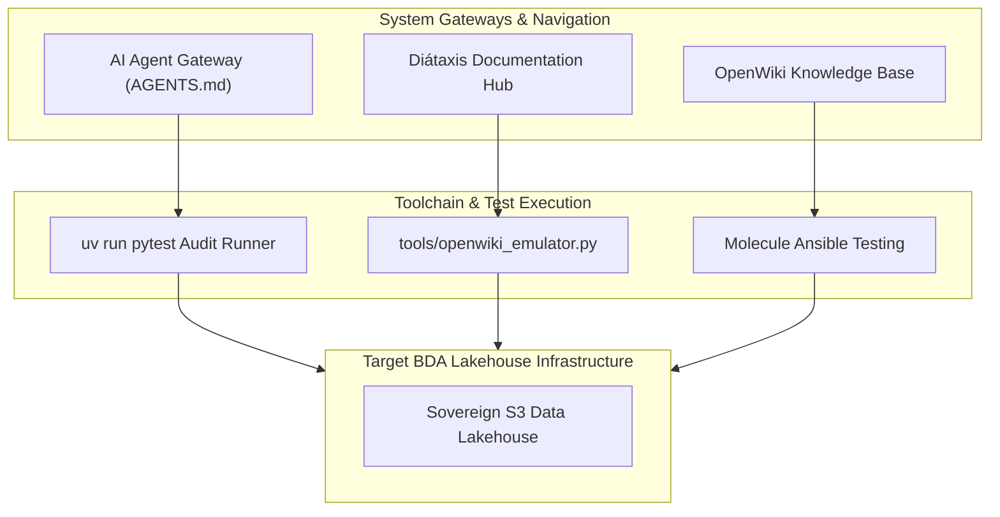

### 3. Summary Interface & Routing Table

| Source Component | Target Component | Port / Protocol / API Ingress | Security Boundary / Access Key | Operational Significance / Flow Description |
| :--- | :--- | :--- | :--- | :--- |
| **Developer / Agent** | **uv run pytest** | Local CLI Exec | Local Environment | Audits frontmatter metadata, link decay, and raw SVG inline tags. |
| **OpenWiki Emulator** | **OpenWiki SSoT Index** | Local Python Script | Local File System Write | Re-generates knowledge graph and interactive navigation metadata. |

## 🧭 Navigation Gateway

### 🤖 AI Agent Entry Points

1. **Root Gateway:** [AGENTS.html](AGENTS.html)
2. **Sovereign Constitution:** [.agents/AGENTS.md](.agents/AGENTS.md)
3. **Spatial Memory Engine:** [.agents/brain/](.agents/brain/)
4. **AI Cognitive Twin Protocol:** [docs/AI-COGNITIVE-TWIN-PROTOCOL.html](docs/AI-COGNITIVE-TWIN-PROTOCOL.html)
5. **OpenWiki SSoT Quickstart & Graph:** [openwiki/quickstart.md](openwiki/quickstart.md)

### 📚 Documentation Quadrants (Diátaxis)

- **Tutorials:** [docs/tutorials/onboarding-and-setup.html](docs/tutorials/onboarding-and-setup.html)
- **How-To Guides:** [docs/how-to-guides/phased-migration-strategy.html](docs/how-to-guides/phased-migration-strategy.html)
- **Reference Material:** [docs/reference/lakehouse-architecture.html](docs/reference/lakehouse-architecture.html) | [docs/reference/postgresql-pgvector-enterprise-strategy.html](docs/reference/postgresql-pgvector-enterprise-strategy.html) | [docs/reference/consumption-and-integration-layer.html](docs/reference/consumption-and-integration-layer.html) | [docs/reference/next-technology-roadmap-stack.html](docs/reference/next-technology-roadmap-stack.html)
- **Explanation:** [docs/explanation/governance-and-compliance.html](docs/explanation/governance-and-compliance.html)

### 🛠️ Workflows & Test Suites

- **CI/CD OKF & Link Audit:** `.github/workflows/dsom-audit.yml`
- **OpenWiki Emulator & Knowledge Graph:** `uv run python tools/openwiki_emulator.py --init`
- **Python Linter & Unit Tests:** `uv run ruff check .` and `uv run pytest`
- **Ansible & Quadlet Tests:** `.ansible-lint` and `molecule/default/`
- **Playwright E2E Search Tests:** `tests/e2e/docs_search.spec.ts`

### 📜 Sovereign Ledgers

- **Summary Index:** [SUMMARY.html](SUMMARY.html)
- **LLM AI Sitemap:** [llms.txt](llms.txt)
- **Changelog Ledger:** [CHANGELOG.html](CHANGELOG.html)
- **Execution History Ledger:** [HISTORY.html](HISTORY.html)


---


# Executive Proposal: Enterprise Data Infrastructure Modernisation

**Document Version:** 1.0
**Author:** Lead Systems Architect
**Target Audience:** IT Management & Steering Committee
**Infrastructure Scope:** `bda-ai-infra`

---

## 1. Executive Summary

This proposal outlines the strategic modernisation of our Big Data Analytics & AI Infrastructure (`bda-ai-infra`). We are transitioning from a legacy, static visualisation-dependent architecture (Tableau) to an **API-First** and **Model Context Protocol (MCP)-Ready** ecosystem powered by **Podman** containers.

By replacing proprietary dashboard tools with an open, containerised integration layer, we eliminate recurring licensing costs while transforming our data warehouse into a **bidirectional, intelligent data hub**. Any enterprise software, open-source application, or AI agent can securely ingest, transform, query, and share data with strict **Fine-Grained Access Control (FGAC)**.

Human-generated data remains the sole authoritative **Single Source of Truth (SSoT)**. All operational data modified or enriched by AI agents is explicitly tagged and segregated within our big data repository using cryptographic provenance contracts (`bda_provenance`).

---

## 2. Core Strategic Pillars: API-Ready & MCP-Ready

### 2.1 Dual-Render Infrastructure Architecture Blueprint

#### 1. Standalone Production-Ready SVG Vector Graphic (`.svg`)

<svg xmlns="http://www.w3.org/2000/svg" viewBox="0 0 960 480" width="100%" height="100%">
  <defs>
    <marker id="arrow-prop" viewBox="0 0 10 10" refX="6" refY="5" markerWidth="6" markerHeight="6" orient="auto-start-reverse">
      <path d="M 0 0 L 10 5 L 0 10 z" fill="#64748B" />
    </marker>
    <filter id="shadow-prop" x="-4%" y="-4%" width="108%" height="108%">
      <feDropShadow dx="0" dy="2" stdDeviation="3" flood-color="#000000" flood-opacity="0.2"/>
    </filter>
  </defs>

  <!-- Canvas Background -->
  <rect width="960" height="480" fill="#0F172A" rx="10"/>

  <!-- Ingestion Layer -->
  <rect x="30" y="20" width="900" height="70" fill="#1E293B" stroke="#38BDF8" stroke-width="1.5" rx="8" filter="url(#shadow-prop)"/>
  <rect x="30" y="20" width="900" height="24" fill="#0369A1" rx="8"/>
  <text x="45" y="36" font-family="-apple-system, BlinkMacSystemFont, 'Segoe UI', Roboto, sans-serif" font-size="11" font-weight="bold" fill="#E0F2FE">BIDIRECTIONAL INGESTION &amp; HUMAN QUARANTINE LAYER</text>
  <text x="45" y="62" font-family="-apple-system, BlinkMacSystemFont, 'Segoe UI', Roboto, sans-serif" font-size="12" font-weight="bold" fill="#38BDF8">External Systems / IoT / Partner APIs / User Feeds / Laravel Human Verification Gate</text>

  <!-- Central Data Store -->
  <rect x="30" y="125" width="900" height="85" fill="#1E293B" stroke="#A855F7" stroke-width="1.5" rx="8" filter="url(#shadow-prop)"/>
  <rect x="30" y="125" width="900" height="24" fill="#581C87" rx="8"/>
  <text x="45" y="141" font-family="-apple-system, BlinkMacSystemFont, 'Segoe UI', Roboto, sans-serif" font-size="11" font-weight="bold" fill="#E9D5FF">CENTRAL DATA &amp; VECTOR ENGINE (TIER 0 GOLDEN SSoT)</text>
  <text x="45" y="167" font-family="-apple-system, BlinkMacSystemFont, 'Segoe UI', Roboto, sans-serif" font-size="13" font-weight="bold" fill="#C084FC">Percona Patroni PostgreSQL 18 + pgvector (NiFi 2.0 Single Authoritative Writer)</text>
  <text x="45" y="187" font-family="Consolas, Monaco, monospace" font-size="10" fill="#E9D5FF">Metadata Tagging: Human Verified Golden SSoT vs AI-Enriched RAG Provenance (bda_provenance)</text>

  <!-- API Gateway Box -->
  <rect x="30" y="245" width="430" height="95" fill="#1E293B" stroke="#3B82F6" stroke-width="1.5" rx="8" filter="url(#shadow-prop)"/>
  <rect x="30" y="245" width="430" height="24" fill="#1E3A8A" rx="8"/>
  <text x="45" y="261" font-family="-apple-system, BlinkMacSystemFont, 'Segoe UI', Roboto, sans-serif" font-size="11" font-weight="bold" fill="#93C5FD">OPEN REST / gRPC APIs</text>
  <text x="45" y="287" font-family="-apple-system, BlinkMacSystemFont, 'Segoe UI', Roboto, sans-serif" font-size="12" font-weight="bold" fill="#60A5FA">Programmatic Data Sharing Gateway</text>
  <text x="45" y="307" font-family="Consolas, Monaco, monospace" font-size="10" fill="#93C5FD">Fine-Grained Access Control (Row &amp; Column Policies)</text>
  <text x="45" y="323" font-family="Consolas, Monaco, monospace" font-size="10" fill="#93C5FD">Fusio API Gateway Ingress (Port 8080/443)</text>

  <!-- MCP Server Box -->
  <rect x="500" y="245" width="430" height="95" fill="#1E293B" stroke="#10B981" stroke-width="1.5" rx="8" filter="url(#shadow-prop)"/>
  <rect x="500" y="245" width="430" height="24" fill="#065F46" rx="8"/>
  <text x="515" y="261" font-family="-apple-system, BlinkMacSystemFont, 'Segoe UI', Roboto, sans-serif" font-size="11" font-weight="bold" fill="#A7F3D0">MCP SERVER (MODEL CONTEXT PROTOCOL)</text>
  <text x="515" y="287" font-family="-apple-system, BlinkMacSystemFont, 'Segoe UI', Roboto, sans-serif" font-size="12" font-weight="bold" fill="#34D399">Native AI Tooling &amp; Context Gateway</text>
  <text x="515" y="307" font-family="Consolas, Monaco, monospace" font-size="10" fill="#A7F3D0">Fine-Grained Access Control (Tool Execution &amp; Scope Limits)</text>
  <text x="515" y="323" font-family="Consolas, Monaco, monospace" font-size="10" fill="#A7F3D0">Python/Node.js MCP Gateway (Port 8443 / Stdio / SSE)</text>

  <!-- Consumers Box Left -->
  <rect x="30" y="375" width="430" height="75" fill="#1E293B" stroke="#F59E0B" stroke-width="1.5" rx="8" filter="url(#shadow-prop)"/>
  <rect x="30" y="375" width="430" height="22" fill="#78350F" rx="8"/>
  <text x="45" y="390" font-family="-apple-system, BlinkMacSystemFont, 'Segoe UI', Roboto, sans-serif" font-size="11" font-weight="bold" fill="#FDE68A">ENTERPRISE &amp; OPEN-SOURCE CONSUMERS</text>
  <text x="45" y="414" font-family="-apple-system, BlinkMacSystemFont, 'Segoe UI', Roboto, sans-serif" font-size="11" fill="#FBBF24">Apache Superset, Metabase, Web Applications, ERP Systems</text>

  <!-- Consumers Box Right -->
  <rect x="500" y="375" width="430" height="75" fill="#1E293B" stroke="#EC4899" stroke-width="1.5" rx="8" filter="url(#shadow-prop)"/>
  <rect x="500" y="375" width="430" height="22" fill="#831843" rx="8"/>
  <text x="515" y="390" font-family="-apple-system, BlinkMacSystemFont, 'Segoe UI', Roboto, sans-serif" font-size="11" font-weight="bold" fill="#FBCFE8">LLMS &amp; AUTONOMOUS AI AGENTIC SYSTEMS</text>
  <text x="515" y="414" font-family="-apple-system, BlinkMacSystemFont, 'Segoe UI', Roboto, sans-serif" font-size="11" fill="#F472B6">Context-Aware Inquiries, Retrieval-Augmented Generation (RAG)</text>

  <!-- Flow Lines -->
  <line x1="480" y1="90" x2="480" y2="125" stroke="#64748B" stroke-width="2" marker-end="url(#arrow-prop)"/>
  <line x1="245" y1="210" x2="245" y2="245" stroke="#64748B" stroke-width="2" marker-end="url(#arrow-prop)"/>
  <line x1="715" y1="210" x2="715" y2="245" stroke="#64748B" stroke-width="2" marker-end="url(#arrow-prop)"/>
  <line x1="245" y1="340" x2="245" y2="375" stroke="#64748B" stroke-width="2" marker-end="url(#arrow-prop)"/>
  <line x1="715" y1="340" x2="715" y2="375" stroke="#64748B" stroke-width="2" marker-end="url(#arrow-prop)"/>
</svg>

#### 2. Git-Native Mermaid Topology (`.mmd`)

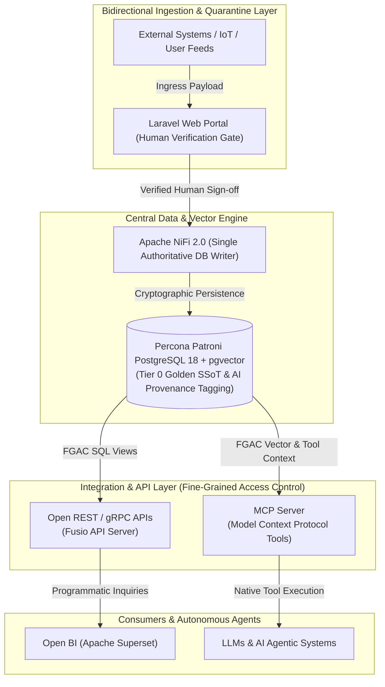

#### 3. Summary Interface & Routing Table

| Source Component | Target Component | Port / Protocol / API Ingress | Security Boundary / Access Key | Operational Significance / Flow Description |
| :--- | :--- | :--- | :--- | :--- |
| **External Systems / Users** | **Laravel Verification Gate** | `HTTPS (443)` / REST | Keycloak OAuth2 / Session Auth | Ingests non-IT user feeds and telemetry into quarantine staging directory. |
| **Laravel Verification Gate** | **Apache NiFi 2.0 Ingest Gate** | Staging Spool / Internal Event | Human Signature / Audit Log | Triggers approval workflow upon explicit human verification. |
| **Apache NiFi 2.0 Ingest Gate** | **PostgreSQL 18 SSoT Store** | `TCP 5432` / Native PostgreSQL | `nifi_ingest_writer` DB Role | Sole authoritative writer committing Tier 0 Golden SSoT data and `bda_provenance` metadata tags. |
| **PostgreSQL 18 SSoT Store** | **Fusio REST / gRPC Gateway** | `TCP 5432` / Read-Only Views | PostgreSQL Row-Level Security (RLS) | Exposes fine-grained SQL views and endpoints to web applications and BI dashboards. |
| **PostgreSQL 18 SSoT Store** | **MCP Tool Gateway** | `TCP 5432` / Vector Search | MCP Tool Scope & Ed25519 Token | Serves vector context and structured database tool capabilities to autonomous AI agents. |

---

### 2.2 API-Ready: Universal Data Exchange
* 🔄 **Bidirectional Data Flow:** Data is no longer trapped inside static visual portals. Enterprise applications, IoT devices, and partner APIs can inject structured telemetry or transactional events directly into our core via REST or gRPC endpoints, as well as extract real-time datasets.
* 🌐 **System Interoperability:** Enables zero-friction integration with any third-party, enterprise, or open-source application without requiring vendor-locked connectors.

### 2.3 MCP-Ready: Native AI & LLM Capability
* 🤖 **Direct Agent Integration:** Implements the open standard **Model Context Protocol (MCP)**. Large Language Models (LLMs) and autonomous AI agents can directly query database metrics, trigger background transformations, and retrieve vector embeddings as native "Tools".
* 🧠 **Contextual Grounding:** Replaces static PDF/Excel exports with conversational, context-aware AI interactions connected directly to live database state.

### 2.4 Fine-Grained Access Control (FGAC) & Data Tagging Governance
* 🛡️ **Row and Column Level Security:** Permissions are strictly enforced at the API gateway and PostgreSQL database layer using session context injection (`SET LOCAL`). An external application or AI agent accesses only the precise data slices authorised for its identity.
* 🏷️ **Human SSoT & AI Provenance Metadata Tagging:** To ensure total data authenticity and governance, all data within the Big Data Analytics Lakehouse is partitioned into two distinct categories:
  1. **Real Data & Human Verification (Tier 0 SSoT):** Human-entered data is validated through the Laravel human-in-the-loop portal. Apache NiFi 2.0 acts as the sole authoritative writer to Percona Patroni PostgreSQL 18.
  2. **AI Processes Enriched with RAG & Generative Metadata:** Any dataset touched, generated, or enriched by AI agents is explicitly tagged using `bda_provenance` metadata. This metadata records cryptographic signature contracts including `signature`, `key_id`, `verification_status`, `verification_timestamp`, `signature_algorithm` (Ed25519), and `signature_encoding` (HEX_RAW_64_BYTE), binding canonical RFC 8785 byte streams.
* 📋 **Auditability & Zero Trust:** Every API call and MCP tool execution is logged, providing clear lineage and governance for regulatory compliance.

---

## 3. Financial & Operational ROI

| Area | Legacy Architecture (Tableau-based) | Proposed Architecture (API/MCP on Podman) |
| :--- | :--- | :--- |
| **Licensing Costs** | High recurring per-user and per-core licensing fees. | **Zero proprietary licensing fees** (100% Open-Source). |
| **Data Accessibility** | Locked inside proprietary `.twb` workbooks and visual dashboards. | **Universal API & MCP endpoints** accessible by any tool or agent. |
| **Ingestion Capability** | Primarily unidirectional read-only reporting. | **Fully bidirectional** (Ingest, Transform, Export, Query). |
| **AI Integration** | None (Manual exports required for AI context). | **Native MCP support** for autonomous AI workflows. |
| **Security Granularity** | Dashboard-level / Workbook-level permissions. | **Fine-Grained Access Control** (Row/Column/Tool level). |

---

## 4. Tableau Migration & Modernisation Strategy

To ensure zero downtime and manage operational risk, legacy Tableau workbooks will be systematically decommissioned using a four-phase migration roadmap:

```
[ Phase 1: Audit ] ──► [ Phase 2: Logic Transfer ] ──► [ Phase 3: Open BI ] ──► [ Phase 4: MCP/API ]
```

### Phase 1: Workbook Audit & Inventory
* Catalogue all active Tableau workbooks (`.twb`/`.twbx`), calculated fields, custom SQL scripts, and user access lists.
* Identify redundant reports and mark high-value dashboards for migration.

### Phase 2: Data & Logic Consolidation
* Migrate complex Tableau calculations and data blending logic into **PostgreSQL Materialised Views** and stored functions.
* Ensure Apache NiFi orchestrates data pipelines directly into clean PostgreSQL schemas.

### Phase 3: Open-Source BI Deployment
* Deploy containerised **Apache Superset** (or Metabase) on Podman to replicate essential executive dashboards.
* Connect directly to the PostgreSQL layer, restoring visual reporting capabilities with zero user-license overhead.

### Phase 4: API & MCP Enablement
* Expose underlying business calculations as REST/gRPC API endpoints.
* Wrap PostgreSQL metrics and vector searches into standardised **MCP Tools** for internal AI agent consumption.

---

## 5. Podman Infrastructure & Container Blueprint

The target infrastructure relies on rootless **Podman** pods to enforce high availability, zero vendor lock-in, and full Kubernetes compatibility.

```yaml
# Conceptual Architecture Blueprint: podman-pod.yaml
apiVersion: v1
kind: Pod
metadata:
  name: bda-ai-infra-pod
spec:
  containers:
    - name: postgres-engine
      image: docker.io/pgvector/pgvector:pg16
      description: "Central database store equipped with vector search capabilities."

    - name: nifi-orchestrator
      image: docker.io/apache/nifi:latest
      description: "Low-latency data ingestion, batch processing, and ETL orchestrator."

    - name: mcp-api-gateway
      image: localhost/bda-mcp-server:v1
      description: "Custom Python/Node.js gateway delivering Open APIs, MCP Tools, and FGAC enforcement."

    - name: open-bi-superset
      image: docker.io/apache/superset:latest
      description: "Open-source business intelligence platform replacing Tableau."
```

---

## 6. Next Steps & Execution Plan

Upon approval of this proposal, execution will proceed as follows via automated code and configuration updates:

1. **Commit Proposal Document:** Save `docs/IT-MANAGEMENT-PROPOSAL.md` into the main branch.
2. **Deploy Podman Pod Spec:** Add `docker/podman-pod.yaml` containing the complete container definition.
3. **Build MCP Server Skeleton:** Commit the Python-based MCP server in `src/mcp-server/` with initial PostgreSQL tool connections and FGAC middleware.
4. **Initiate Phase 1 Migration:** Begin Tableau workbook audit and SQL logic extraction.


---


# 🧠 AI Cognitive Twin Protocol & 4-Tier Infrastructure Map

This protocol governs the operational behavior, execution boundaries, and infrastructure topology for AI Cognitive Twins.

## 🏗️ 4-Tier Infrastructure Topology Map

### 1. Standalone Production-Ready SVG Vector Graphic (`.svg`)

<svg xmlns="http://www.w3.org/2000/svg" viewBox="0 0 960 440" width="100%" height="100%">
  <defs>
    <marker id="arrow-twin" viewBox="0 0 10 10" refX="6" refY="5" markerWidth="6" markerHeight="6" orient="auto-start-reverse">
      <path d="M 0 0 L 10 5 L 0 10 z" fill="#64748B" />
    </marker>
    <filter id="shadow-twin" x="-4%" y="-4%" width="108%" height="108%">
      <feDropShadow dx="0" dy="2" stdDeviation="3" flood-color="#000000" flood-opacity="0.25"/>
    </filter>
  </defs>

  <!-- Background -->
  <rect width="960" height="440" fill="#0F172A" rx="10"/>

  <!-- Tier 1 -->
  <rect x="20" y="20" width="920" height="80" fill="#1E293B" stroke="#38BDF8" stroke-width="1.5" rx="8" filter="url(#shadow-twin)"/>
  <rect x="20" y="20" width="920" height="26" fill="#0369A1" rx="8"/>
  <text x="35" y="38" font-family="-apple-system, BlinkMacSystemFont, 'Segoe UI', Roboto, sans-serif" font-size="12" font-weight="bold" fill="#E0F2FE">TIER 1: COMMAND CENTRE (LOCAL WORKSTATION / IDE GATEWAY)</text>
  <text x="35" y="65" font-family="-apple-system, BlinkMacSystemFont, 'Segoe UI', Roboto, sans-serif" font-size="12" font-weight="bold" fill="#38BDF8">Local AI Agent Gateways (.cursorrules, CLAUDE.md) &amp; Spatial Memory</text>
  <text x="35" y="85" font-family="Consolas, Monaco, monospace" font-size="10" fill="#93C5FD">Operator Entry Point &amp; DSOM Governance Gateway</text>

  <!-- Tier 2 -->
  <rect x="20" y="125" width="920" height="80" fill="#1E293B" stroke="#3B82F6" stroke-width="1.5" rx="8" filter="url(#shadow-twin)"/>
  <rect x="20" y="125" width="920" height="26" fill="#1E3A8A" rx="8"/>
  <text x="35" y="143" font-family="-apple-system, BlinkMacSystemFont, 'Segoe UI', Roboto, sans-serif" font-size="12" font-weight="bold" fill="#93C5FD">TIER 2: DEV BRIDGE / CONTROL NODE (WSL2 ALMALINUX / UBUNTU)</text>
  <text x="35" y="170" font-family="-apple-system, BlinkMacSystemFont, 'Segoe UI', Roboto, sans-serif" font-size="12" font-weight="bold" fill="#60A5FA">Local Execution Sandbox, uv Toolchain, ruff &amp; Ansible Control Node</text>
  <text x="35" y="190" font-family="Consolas, Monaco, monospace" font-size="10" fill="#93C5FD">Isolated Subprocess &amp; Linting Control</text>

  <!-- Tier 3 -->
  <rect x="20" y="230" width="920" height="80" fill="#1E293B" stroke="#A855F7" stroke-width="1.5" rx="8" filter="url(#shadow-twin)"/>
  <rect x="20" y="230" width="920" height="26" fill="#581C87" rx="8"/>
  <text x="35" y="248" font-family="-apple-system, BlinkMacSystemFont, 'Segoe UI', Roboto, sans-serif" font-size="12" font-weight="bold" fill="#E9D5FF">TIER 3: STAGING / JUMP HOST (MOLECULE VERIFICATION)</text>
  <text x="35" y="275" font-family="-apple-system, BlinkMacSystemFont, 'Segoe UI', Roboto, sans-serif" font-size="12" font-weight="bold" fill="#C084FC">Pre-Production Validation Sandbox &amp; Molecule Container Integration Tests</text>
  <text x="35" y="295" font-family="Consolas, Monaco, monospace" font-size="10" fill="#E9D5FF">Isolated Container Testing &amp; Playbook Audit</text>

  <!-- Tier 4 -->
  <rect x="20" y="335" width="620" height="85" fill="#1E293B" stroke="#22C55E" stroke-width="1.5" rx="8" filter="url(#shadow-twin)"/>
  <rect x="20" y="335" width="620" height="26" fill="#065F46" rx="8"/>
  <text x="35" y="353" font-family="-apple-system, BlinkMacSystemFont, 'Segoe UI', Roboto, sans-serif" font-size="12" font-weight="bold" fill="#86EFAC">TIER 4: PRODUCTION NODE FABRIC</text>
  <text x="35" y="380" font-family="-apple-system, BlinkMacSystemFont, 'Segoe UI', Roboto, sans-serif" font-size="12" font-weight="bold" fill="#4ADE80">Polaris REST Catalog, Ceph/MinIO WORM, pgvector</text>
  <text x="35" y="400" font-family="Consolas, Monaco, monospace" font-size="10" fill="#86EFAC">Sovereign Data Lakehouse &amp; Quadlet Services</text>

  <!-- OTel Collector Box -->
  <rect x="660" y="335" width="280" height="85" fill="#1E293B" stroke="#F59E0B" stroke-width="1.5" rx="8" filter="url(#shadow-twin)"/>
  <rect x="660" y="335" width="280" height="26" fill="#78350F" rx="8"/>
  <text x="675" y="353" font-family="-apple-system, BlinkMacSystemFont, 'Segoe UI', Roboto, sans-serif" font-size="12" font-weight="bold" fill="#FDE68A">OPENTELEMETRY COLLECTOR</text>
  <text x="675" y="380" font-family="-apple-system, BlinkMacSystemFont, 'Segoe UI', Roboto, sans-serif" font-size="12" font-weight="bold" fill="#FBBF24">Prometheus, Tempo &amp; Loki</text>
  <text x="675" y="400" font-family="Consolas, Monaco, monospace" font-size="10" fill="#FDE68A">TCP 8443 / Keycloak OAuth2 JWT</text>

  <!-- Flow Arrows -->
  <line x1="480" y1="100" x2="480" y2="125" stroke="#64748B" stroke-width="2" marker-end="url(#arrow-twin)"/>
  <line x1="480" y1="205" x2="480" y2="230" stroke="#64748B" stroke-width="2" marker-end="url(#arrow-twin)"/>
  <line x1="480" y1="310" x2="330" y2="335" stroke="#64748B" stroke-width="2" marker-end="url(#arrow-twin)"/>
  <line x1="640" y1="377" x2="660" y2="377" stroke="#F59E0B" stroke-width="2" marker-end="url(#arrow-twin)"/>
</svg>

### 2. Git-Native Mermaid Topology (`.mmd`)

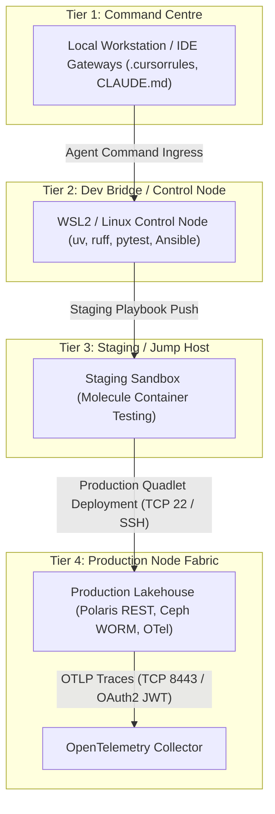

### 3. Summary Interface & Routing Table

| Source Component | Target Component | Port / Protocol / API Ingress | Security Boundary / Access Key | Operational Significance / Flow Description |
| :--- | :--- | :--- | :--- | :--- |
| **Command Centre (T1)** | **Dev Bridge (T2)** | Stdio / Local Subprocess | IDE Agent Ruleset | Enforces non-destructive pre-flight checks and DSOM protocol rules. |
| **Dev Bridge (T2)** | **Staging Host (T3)** | `TCP 22` / SSH Key | SSH Certificate / Molecule | Runs automated container integration tests prior to production rollout. |
| **Staging Host (T3)** | **Production Fabric (T4)** | `TCP 22` / SSH | SSH Private Key / Certificate | Deploys and manages Podman Quadlet container services in production. |
| **Production Fabric (T4)** | **OpenTelemetry Collector** | `TCP 8443` / HTTPS OTLP | Keycloak OAuth2 JWT | Streams operational metrics, logs, and trace telemetry to Prometheus and Grafana. |

### Tier Descriptions & Boundaries

1. **Tier 1 — Command Centre (Local Workstation):** Operator entry point executing agent commands, maintaining workspace gateways, and managing local spatial memory.
2. **Tier 2 — Dev Bridge / Control Node (WSL2 / Local Linux):** Primary compilation and testing environment using `uv` Python toolchain, `ruff`, `markdownlint-cli`, and `pytest`.
3. **Tier 3 — Staging / Jump Host:** Pre-production verification sandbox executing automated Molecule playbook scenarios and container integration tests.
4. **Tier 4 — Production Node Fabric:** Production environment hosting S3-compatible object stores, open-source lakehouse compute engines, and containerised microservices.

---

## 🔒 Operational Invariants

- **Non-Destructive Pre-Flight:** Inspect target states before editing files.
- **UK English Standard:** Enforce UK English spelling (`standardise`, `categorise`, `localise`).
- **DTS 0.1 Standard:** Deliver direct answers without preamble or fluff.
- **Isolated Execution:** Always use `uv run` for Python tools and pytest execution.


---


# Modernizing Big Data Analytics Architecture: Master Documentation Suite

Welcome to the authoritative documentation repository for modernizing the **Big Data Analytics (BDA)** platform architecture.

---

## 🏛️ Documentation Hierarchy & Knowledge Network Topology

The diagram below details the Diátaxis documentation structure and knowledge hierarchy across the four documentation quadrants.

### 1. Standalone Production-Ready SVG Vector Graphic (`.svg`)

<svg xmlns="http://www.w3.org/2000/svg" viewBox="0 0 960 400" width="100%" height="100%">
  <defs>
    <marker id="arrow-doc" viewBox="0 0 10 10" refX="6" refY="5" markerWidth="6" markerHeight="6" orient="auto-start-reverse">
      <path d="M 0 0 L 10 5 L 0 10 z" fill="#64748B" />
    </marker>
    <filter id="shadow-doc" x="-4%" y="-4%" width="108%" height="108%">
      <feDropShadow dx="0" dy="2" stdDeviation="3" flood-color="#000000" flood-opacity="0.25"/>
    </filter>
  </defs>

  <!-- Background -->
  <rect width="960" height="400" fill="#0F172A" rx="10"/>

  <!-- Left Top: Tutorials -->
  <rect x="20" y="20" width="440" height="170" fill="#1E293B" stroke="#38BDF8" stroke-width="1.5" rx="8" filter="url(#shadow-doc)"/>
  <rect x="20" y="20" width="440" height="26" fill="#0369A1" rx="8"/>
  <text x="35" y="38" font-family="-apple-system, BlinkMacSystemFont, 'Segoe UI', Roboto, sans-serif" font-size="12" font-weight="bold" fill="#E0F2FE">🎓 TUTORIALS (PRACTICAL / LEARNING)</text>
  <text x="35" y="65" font-family="-apple-system, BlinkMacSystemFont, 'Segoe UI', Roboto, sans-serif" font-size="12" font-weight="bold" fill="#38BDF8">Onboarding &amp; Setup Guide</text>
  <text x="35" y="85" font-family="-apple-system, BlinkMacSystemFont, 'Segoe UI', Roboto, sans-serif" font-size="11" fill="#E2E8F0">• Developer Environment &amp; Local Sandbox Setup</text>
  <text x="35" y="105" font-family="-apple-system, BlinkMacSystemFont, 'Segoe UI', Roboto, sans-serif" font-size="11" fill="#E2E8F0">• Codebase Navigation &amp; Verification Procedures</text>

  <!-- Right Top: Explanation -->
  <rect x="500" y="20" width="440" height="170" fill="#1E293B" stroke="#A855F7" stroke-width="1.5" rx="8" filter="url(#shadow-doc)"/>
  <rect x="500" y="20" width="440" height="26" fill="#581C87" rx="8"/>
  <text x="515" y="38" font-family="-apple-system, BlinkMacSystemFont, 'Segoe UI', Roboto, sans-serif" font-size="12" font-weight="bold" fill="#E9D5FF">💡 EXPLANATION (THEORETICAL / UNDERSTANDING)</text>
  <text x="515" y="65" font-family="-apple-system, BlinkMacSystemFont, 'Segoe UI', Roboto, sans-serif" font-size="12" font-weight="bold" fill="#C084FC">Architectural Frameworks &amp; Principles</text>
  <text x="515" y="85" font-family="-apple-system, BlinkMacSystemFont, 'Segoe UI', Roboto, sans-serif" font-size="11" fill="#E2E8F0">• Human-to-AI Quarantine Model (3-Tier SSoT)</text>
  <text x="515" y="105" font-family="-apple-system, BlinkMacSystemFont, 'Segoe UI', Roboto, sans-serif" font-size="11" fill="#E2E8F0">• MCP Tool Isolation &amp; Zero-Trust AI Containment</text>

  <!-- Left Bottom: How-To Guides -->
  <rect x="20" y="210" width="440" height="170" fill="#1E293B" stroke="#3B82F6" stroke-width="1.5" rx="8" filter="url(#shadow-doc)"/>
  <rect x="20" y="210" width="440" height="26" fill="#1E3A8A" rx="8"/>
  <text x="35" y="228" font-family="-apple-system, BlinkMacSystemFont, 'Segoe UI', Roboto, sans-serif" font-size="12" font-weight="bold" fill="#93C5FD">🛠️ HOW-TO GUIDES (PRACTICAL / WORKING)</text>
  <text x="35" y="255" font-family="-apple-system, BlinkMacSystemFont, 'Segoe UI', Roboto, sans-serif" font-size="12" font-weight="bold" fill="#60A5FA">Operational Procedures &amp; Migration Roadmaps</text>
  <text x="35" y="275" font-family="-apple-system, BlinkMacSystemFont, 'Segoe UI', Roboto, sans-serif" font-size="11" fill="#E2E8F0">• Ingestion Pipeline Modernization (NiFi 2.0 / Airflow)</text>
  <text x="35" y="295" font-family="-apple-system, BlinkMacSystemFont, 'Segoe UI', Roboto, sans-serif" font-size="11" fill="#E2E8F0">• Phased 12-Month Migration Strategy &amp; AI Business Cases</text>

  <!-- Right Bottom: Reference -->
  <rect x="500" y="210" width="440" height="170" fill="#1E293B" stroke="#22C55E" stroke-width="1.5" rx="8" filter="url(#shadow-doc)"/>
  <rect x="500" y="210" width="440" height="26" fill="#065F46" rx="8"/>
  <text x="515" y="228" font-family="-apple-system, BlinkMacSystemFont, 'Segoe UI', Roboto, sans-serif" font-size="12" font-weight="bold" fill="#86EFAC">📚 REFERENCE (THEORETICAL / INFORMATION)</text>
  <text x="515" y="255" font-family="-apple-system, BlinkMacSystemFont, 'Segoe UI', Roboto, sans-serif" font-size="12" font-weight="bold" fill="#4ADE80">Authoritative Technical Specifications</text>
  <text x="515" y="275" font-family="-apple-system, BlinkMacSystemFont, 'Segoe UI', Roboto, sans-serif" font-size="11" fill="#E2E8F0">• Legacy Deconstruction &amp; Decoupled Lakehouse Specs</text>
  <text x="515" y="295" font-family="-apple-system, BlinkMacSystemFont, 'Segoe UI', Roboto, sans-serif" font-size="11" fill="#E2E8F0">• Solutions 1, 2, 3 Specifications &amp; Governance Matrix</text>

  <!-- Center Cross Lines -->
  <line x1="240" y1="190" x2="240" y2="210" stroke="#64748B" stroke-width="1.5" marker-end="url(#arrow-doc)"/>
  <line x1="720" y1="190" x2="720" y2="210" stroke="#64748B" stroke-width="1.5" marker-end="url(#arrow-doc)"/>
  <line x1="460" y1="105" x2="500" y2="105" stroke="#64748B" stroke-width="1.5" marker-end="url(#arrow-doc)"/>
  <line x1="460" y1="295" x2="500" y2="295" stroke="#64748B" stroke-width="1.5" marker-end="url(#arrow-doc)"/>
</svg>

### 2. Git-Native Mermaid Topology (`.mmd`)

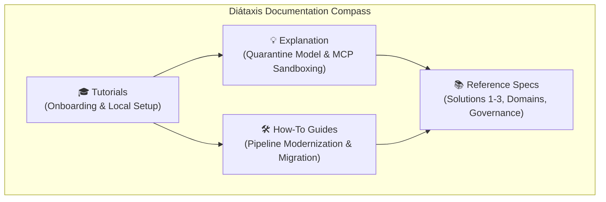

### 3. Summary Interface & Routing Table

| Source Quadrant | Target Audience | Representative Platform Ingress &amp; Protocols | Security Boundary / Access Key | Operational Significance / Representative Specs |
| :--- | :--- | :--- | :--- | :--- |
| **Tutorials** | Onboarding Engineers | Local Interactive CLI | Developer Environment Sandbox | Hands-on guided onboarding and local developer environment setup (`docs/tutorials/onboarding-and-setup.md`). |
| **How-To Guides** | System Architects &amp; Developers | REST / OTLP / mTLS | Ingestion &amp; Migration DMZ | Operational problem-solving procedures and 12-month migration strategy (`docs/how-to-guides/phased-migration-strategy.md`). |
| **Reference** | Technical Auditors &amp; Engineers | S3 / JDBC / OIDC HTTPS | Authoritative SSoT Core | Authoritative technical specifications and infrastructure solution blueprints (`docs/reference/solution-1-aws-native.md`). |
| **Explanation** | Security &amp; Data Stewards | JSON-RPC / OIDC JWT | Zero-Trust Quarantine DMZ | Conceptual frameworks, design rationale, and Human-to-AI Quarantine model (`docs/explanation/human-ai-quarantine-model.md`). |

This documentation suite establishes a 100% open-source, S3-compatible data lakehouse architecture designed to serve as an authoritative **Single Source of Truth (SSoT)** for natural resources, environmental data, geological analytics, and climate risk modeling.

---

## Documentation Structure (Diátaxis Framework Navigation)

Following the **Diátaxis Documentation Framework**, this suite is organized into four distinct quadrants based on user intent (Practical vs. Theoretical and Learning vs. Working):

```
                     ACQUISITION OF SKILL (Study)
                                  │
           🎓 TUTORIALS            │         💡 EXPLANATION
     (Practical / Learning)       │     (Theoretical / Understanding)
                                  │
     • BDA Lakehouse Onboarding   │     • Human-to-AI Quarantine Model
       and Developer Setup        │     • MCP & AI Sandboxing Protocol
                                  │     • Governance & Standards
                                  │       Compliance
──────────────────────────────────┼──────────────────────────────────
                                  │
          🛠️ HOW-TO GUIDES         │          📚 REFERENCE
      (Practical / Work)          │      (Theoretical / Information)
                                  │
     • Ingestion Pipeline         │     • Legacy BDA Deconstruction
       Modernization              │     • Target Lakehouse Architecture
     • Phased 12-Month            │     • Business Domains (x5)
       Migration Strategy         │     • Data Governance Matrix
                                  │     • Solution 1: AWS Native
                                  │     • Solution 2: Hybrid AI
                                  │     • Solution 3: On-Prem Sovereign
                                  │     • OpenWiki SSoT Knowledge Base
                                  │
                      APPLICATION OF SKILL (Work)
```

---

## Master Directory Index

### 🎓 1. Tutorials (Practical Learning for Onboarding)

- **[Onboarding and Setup Guide](tutorials/onboarding-and-setup.html):** Getting started with the modernized BDA lakehouse baseline documentation.

### 🛠️ 2. How-To Guides (Practical Problem-Solving for Engineers)

- **[Ingestion Pipeline Modernization](how-to-guides/ingestion-pipeline-modernization.html):** Implementing Apache NiFi, Apache Airflow, Next.js web application, and Apache Superset visual analytics.
- **[Phased Migration Strategy & Roadmap](how-to-guides/phased-migration-strategy.html):** Detailed 4-phase implementation roadmap over 12 months with risk mitigation and fallback procedures.
- [Onboarding and Scaling New AI/ML Business Cases](how-to-guides/onboarding-new-ai-business-cases.html)

### 📚 3. Reference Material (Factual Technical Specifications)

- **[Legacy Architecture Deconstruction](reference/legacy-architecture.html):** Deconstruction of legacy BDA environments, structural bottlenecks, file/database silos, and failure modes.
- **[Target Lakehouse Architecture Specifications](reference/lakehouse-architecture.html):** Specs for decoupled storage and compute (Ceph/MinIO, Apache Iceberg, Apache Polaris, Trino, Apache Spark + Sedona).
- **[Business Domain Specifications](reference/business-applications.html):** Detailed specifications for 5 core analytical domains: Incident Management, Groundwater Potential, Active Fire Tracking, Climate Adaptation, and Geological Hazard Risk.
- **[Apache NiFi 2.0 Master Data Plane & Migration Guide](reference/apache-nifi-2-master-data-plane-and-migration.html):** Authoritative reference specification for Apache NiFi 2.0 as the master data plane, PostgreSQL vector/spatial integration, and migration framework from NiFi 1.x.
- **[Data Governance & Subsystems Matrix](reference/governance-matrix.html):** Mapping governance subsystems, OpenLineage provenance, ODCS contract standards, and geospatial standards.
- **[Solution 1 Reference Spec: AWS Native Infrastructure](reference/solution-1-aws-native.html):** Detailed reference specifications for All in Cloud deployment using AWS managed services (S3 Object Lock, Glue Catalog, EMR Serverless, Athena, Bedrock).
- **[Solution 2 Reference Spec: Hybrid Cloud Lakehouse & On-Prem GPU](reference/solution-2-hybrid-ai.html):** Detailed reference specifications for Hybrid deployment retaining cloud lakehouse core while executing AI inference, local vector search, and MCP tools on-premises over AWS Direct Connect MACsec/IPsec.
- **[Solution 3 Reference Spec: 100% On-Premises Sovereign Architecture](reference/solution-3-onprem-proxmox-rke2.html):** Detailed reference specifications for 100% sovereign deployment using Proxmox VE hypervisor, dual RKE2/K3s Kubernetes clusters, and Ceph SDS object/block storage.
- **[OpenWiki SSoT Quickstart & Knowledge Base](../openwiki/quickstart.md):** BDA Lakehouse SSoT open-source relationship matrix, infrastructure, software, and governance knowledge graph.

### 💡 4. Explanation (Theoretical Rationale and Architecture Principles)

- **[The Human-to-AI Quarantine Model](explanation/human-ai-quarantine-model.html):** Conceptual explanation of the 3-tier data classification topology (Tier 0 Golden Truth, Tier 1 Telemetry, Tier 2 AI Sandbox) preserving human ground truth.
- **[Model Context Protocol (MCP) & AI Sandboxing](explanation/mcp-and-ai-sandboxing.html):** Explanation of how MCP confines AI models to operational tooling while barring direct writes to ground-truth data.
- **[Governance, Security, and Compliance Framework](explanation/governance-and-compliance.html):** Enterprise catalog selection (OpenMetadata), Keycloak IAM, APISIX gateway, and compliance standards.

---

## Key Strategic Conclusions

1. **Decoupled Architecture:** Replaces legacy Hadoop HDFS, GlusterFS, and relational database sprawl with software-defined object storage (Ceph/MinIO) and Apache Iceberg table formats, queried via Trino and Apache Spark/Sedona.
2. **Absolute Data Provenance:** Enforces the Linux Foundation Bitol Open Data Contract Standard (ODCS v3.1.0) and custom OpenLineage `nres_provenance` facets to isolate unverified AI synthetic models from Tier 0 Golden Human SSoT.
3. **Open-Source Freedom:** Replaces proprietary BI servers and legacy web portals with Apache Superset, Next.js, Keycloak, and Apache APISIX, eliminating recurring licensing costs and vendor lock-in.


---


# Governance, Security, and Compliance Framework

Operating an authoritative Single Source of Truth requires an enterprise data catalog that automatically scans platform assets, maintains business glossaries, maps column-level lineage, and enforces access control policies across all endpoints.

---

## 🏛️ Enterprise Security & Governance Perimeter Topology

The diagram below details the integrated security perimeter, connecting APISIX, Keycloak OIDC IAM, OpenMetadata, and ISO 19115 geospatial metadata.

### 1. Standalone Production-Ready SVG Vector Graphic (`.svg`)

<svg xmlns="http://www.w3.org/2000/svg" viewBox="0 0 960 400" width="100%" height="100%">
  <defs>
    <marker id="arrow-sec" viewBox="0 0 10 10" refX="6" refY="5" markerWidth="6" markerHeight="6" orient="auto-start-reverse">
      <path d="M 0 0 L 10 5 L 0 10 z" fill="#64748B" />
    </marker>
    <filter id="shadow-sec" x="-4%" y="-4%" width="108%" height="108%">
      <feDropShadow dx="0" dy="2" stdDeviation="3" flood-color="#000000" flood-opacity="0.25"/>
    </filter>
  </defs>

  <!-- Background -->
  <rect width="960" height="400" fill="#0F172A" rx="10"/>

  <!-- Perimeter Security Tier -->
  <rect x="20" y="20" width="920" height="80" fill="#1E293B" stroke="#334155" stroke-width="1.5" rx="8" filter="url(#shadow-sec)"/>
  <rect x="20" y="20" width="920" height="26" fill="#0F172A" rx="8"/>
  <text x="35" y="38" font-family="-apple-system, BlinkMacSystemFont, 'Segoe UI', Roboto, sans-serif" font-size="12" font-weight="bold" fill="#38BDF8">PERIMETER ACCESS &amp; IDENTITY FEDERATION TIER</text>

  <rect x="40" y="52" width="430" height="38" fill="#0369A1" stroke="#38BDF8" rx="4"/>
  <text x="50" y="75" font-family="-apple-system, BlinkMacSystemFont, 'Segoe UI', Roboto, sans-serif" font-size="12" font-weight="bold" fill="#E0F2FE">Apache APISIX API Gateway (JWT &amp; Rate-Limiting)</text>

  <rect x="490" y="52" width="430" height="38" fill="#1E3A8A" stroke="#3B82F6" rx="4"/>
  <text x="500" y="75" font-family="-apple-system, BlinkMacSystemFont, 'Segoe UI', Roboto, sans-serif" font-size="12" font-weight="bold" fill="#93C5FD">Keycloak Identity &amp; Access Management (OIDC / SSO)</text>

  <!-- Governance & Catalog Core Tier -->
  <rect x="20" y="135" width="920" height="120" fill="#1E293B" stroke="#334155" stroke-width="1.5" rx="8" filter="url(#shadow-sec)"/>
  <rect x="20" y="135" width="920" height="26" fill="#0F172A" rx="8"/>
  <text x="35" y="153" font-family="-apple-system, BlinkMacSystemFont, 'Segoe UI', Roboto, sans-serif" font-size="12" font-weight="bold" fill="#4ADE80">ENTERPRISE GOVERNANCE &amp; CATALOG CORE</text>

  <rect x="40" y="170" width="270" height="70" fill="#0F172A" stroke="#22C55E" rx="6"/>
  <text x="50" y="192" font-family="-apple-system, BlinkMacSystemFont, 'Segoe UI', Roboto, sans-serif" font-size="13" font-weight="bold" fill="#86EFAC">OpenMetadata Catalog</text>
  <text x="50" y="212" font-family="Consolas, Monaco, monospace" font-size="10" fill="#4ADE80">Tag-Based Access Control (TBAC)</text>

  <rect x="345" y="170" width="270" height="70" fill="#0F172A" stroke="#22C55E" rx="6"/>
  <text x="355" y="192" font-family="-apple-system, BlinkMacSystemFont, 'Segoe UI', Roboto, sans-serif" font-size="13" font-weight="bold" fill="#86EFAC">ODCS Contract Manager</text>
  <text x="355" y="212" font-family="Consolas, Monaco, monospace" font-size="10" fill="#4ADE80">Bitol Contract Violation Alerts</text>

  <rect x="650" y="170" width="270" height="70" fill="#0F172A" stroke="#22C55E" rx="6"/>
  <text x="660" y="192" font-family="-apple-system, BlinkMacSystemFont, 'Segoe UI', Roboto, sans-serif" font-size="13" font-weight="bold" fill="#86EFAC">ISO 19115 Geospatial Profile</text>
  <text x="660" y="212" font-family="Consolas, Monaco, monospace" font-size="10" fill="#4ADE80">EPSG:3168 / 3169 / 4326 Standards</text>

  <!-- Target Data Store Tier -->
  <rect x="20" y="285" width="920" height="90" fill="#1E293B" stroke="#334155" stroke-width="1.5" rx="8" filter="url(#shadow-sec)"/>
  <rect x="20" y="285" width="920" height="26" fill="#0F172A" rx="8"/>
  <text x="35" y="303" font-family="-apple-system, BlinkMacSystemFont, 'Segoe UI', Roboto, sans-serif" font-size="12" font-weight="bold" fill="#C084FC">PROTECTED LAKEHOUSE &amp; OPERATIONAL STORES</text>

  <rect x="40" y="320" width="430" height="42" fill="#0F172A" stroke="#A855F7" rx="6"/>
  <text x="50" y="346" font-family="-apple-system, BlinkMacSystemFont, 'Segoe UI', Roboto, sans-serif" font-size="12" font-weight="bold" fill="#E9D5FF">PostgreSQL PostGIS / pgvector Master Core</text>

  <rect x="490" y="320" width="430" height="42" fill="#0F172A" stroke="#A855F7" rx="6"/>
  <text x="500" y="346" font-family="-apple-system, BlinkMacSystemFont, 'Segoe UI', Roboto, sans-serif" font-size="12" font-weight="bold" fill="#E9D5FF">Ceph / MinIO Iceberg Parquet SSoT (WORM Lock)</text>

  <!-- Connectors -->
  <line x1="470" y1="71" x2="490" y2="71" stroke="#64748B" stroke-width="1.5" marker-end="url(#arrow-sec)"/>
  <line x1="255" y1="90" x2="175" y2="170" stroke="#64748B" stroke-width="1.5" marker-end="url(#arrow-sec)"/>
  <line x1="175" y1="240" x2="255" y2="320" stroke="#64748B" stroke-width="1.5" marker-end="url(#arrow-sec)"/>
  <line x1="480" y1="240" x2="705" y2="320" stroke="#64748B" stroke-width="1.5" marker-end="url(#arrow-sec)"/>
  <line x1="650" y1="205" x2="315" y2="205" stroke="#64748B" stroke-width="1.5" marker-end="url(#arrow-sec)"/>
</svg>

### 2. Git-Native Mermaid Topology (`.mmd`)

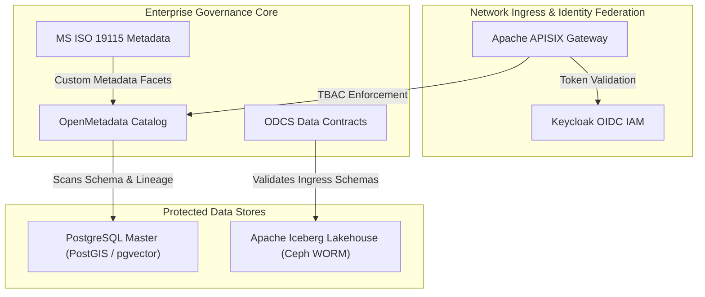

### 3. Summary Interface & Routing Table

| Source Component | Target Component | Port / Protocol / API Ingress | Security Boundary / Access Key | Operational Significance / Flow Description |
| :--- | :--- | :--- | :--- | :--- |
| **API Client** | **APISIX Gateway** | `TCP 8443` / HTTPS TLS 1.3 | Keycloak JWT Bearer | Validates identity tokens and routes authorized REST/gRPC requests. |
| **OpenMetadata** | **PostgreSQL Core** | `TCP 5432` / TLS 1.3 PostgreSQL | Read-Only Catalog Service Key | Crawls schema definitions, column tags, and OpenLineage runtime facets. |
| **ODCS Contract CLI** | **Iceberg Storage** | Local Ingestion Process | Schema Validation Contract | Rejects invalid payloads before writing Parquet snapshots to S3 WORM storage. |

---

## 1. Enterprise Data Catalog Evaluation & Selection

In evaluating modern open-source governance platforms to modernize BDA, three primary candidates were assessed: **Apache Atlas**, **DataHub**, and **OpenMetadata**.

### Comparison & Selection Rationale

- **Apache Atlas:** Has historical roots in legacy Hadoop ecosystems and integrates with Apache Ranger. However, its architecture requires substantial infrastructure maintenance—relying on JanusGraph, HBase, Apache Solr, and Apache ZooKeeper—and shows slow upstream development with limited native support for modern table formats (Apache Iceberg) and the OpenLineage standard.
- **DataHub:** Provides a modular, event-driven metadata architecture using Apache Kafka, Elasticsearch, and a graph store, with native OpenLineage ingestion and SQLGlot-based column-level lineage parsing. However, its multi-component distributed footprint presents considerable operational complexity for mid-scale enterprise deployments.
- **OpenMetadata (Selected Standard):** Selected as the primary enterprise catalog and governance engine for BDA. Built under the Apache 2.0 license, OpenMetadata features a lightweight, maintainable architecture powered by PostgreSQL for metadata storage and Elasticsearch/OpenSearch for search indexing, eliminating the need to maintain distributed graph databases or Kafka clusters.

### Core OpenMetadata Capabilities Delivered

1. **Native OpenLineage Consumption:** Processes pipeline lineage events from Apache Airflow and Apache Spark into end-to-end lineage graphs that trace data elements from edge ingestion to analytical dashboards.
2. **In-Catalog Data Contract Management:** Native support for the Linux Foundation ODCS specification, allowing administrators to attach machine-readable contracts to tables and receive real-time alerts on schema drift or SLA violations.
3. **Extensible Metadata Schemas:** Easily incorporates standardized profiles, such as mapping geospatial attributes to MS ISO 19115:2003 (Geographic Information - Metadata).
4. **Tag-Based Access Control (TBAC):** Security classifications (such as `Classification.Secret`, `Provenance.Tier0_SSoT`, or `Domain.Environmental`) automatically propagate along lineage edges to govern downstream query access.

---

## 2. Identity Federation and API Perimeter Security

### Keycloak Identity and Access Management (IAM)

Platform identity and access management are modernized through **Keycloak**, the industry-standard open-source identity and access solution. Keycloak centralizes identity across all BDA systems via OpenID Connect (OIDC), OAuth 2.0, and SAML 2.0, providing Single Sign-On (SSO) and Multi-Factor Authentication (MFA) across all administrative consoles, web portals, and analytical tools.

### Apache APISIX Cloud-Native API Gateway

Traffic at the network boundary is governed by **Apache APISIX**. Positioned between external networks and internal lakehouse services, APISIX:

- Validates Keycloak JSON Web Tokens (JWTs).
- Enforces granular rate-limiting and DDoS protection.
- Terminates TLS/SSL connections.
- Dynamically routes API requests to backend microservices, Trino query engines, and PostGIS instances.

---

## 3. Regulatory and Standards Compliance

The platform's governance model aligns strictly with enterprise data sovereignty frameworks:

### Standard Geospatial Metadata Profile

All geospatial datasets comply with **MS ISO 19115:2003 / OGC** guidelines. Metadata attributes—including official coordinate reference systems (`EPSG:3168`, `EPSG:3169`, `EPSG:4326`), spatial resolutions, bounding coordinate extents, and lineage source histories—are mapped as custom metadata facets within OpenMetadata.

### Data Sovereignty & Open-Source Guidelines

Platform infrastructure adheres to digital governance policies prioritizing open-source software, strict data sovereignty protections (on-premises storage), and secure, audited inter-agency data sharing.


---


# The Human-to-AI Quarantine Model and Data Classification Topology

Establishing the BDA platform as an authoritative Single Source of Truth (SSoT) requires verifiable guarantees regarding the provenance, custody, and modification history of all ingested data.

---

## 🏛️ Three-Tier Data Classification & Quarantine Topology

The diagram below details the 3-tier data classification architecture, enforcing WORM Compliance Mode for Tier 0 Golden Human Truth and complete isolation for Tier 2 AI Sandboxes.

### 1. Standalone Production-Ready SVG Vector Graphic (`.svg`)

<svg xmlns="http://www.w3.org/2000/svg" viewBox="0 0 960 420" width="100%" height="100%">
  <defs>
    <marker id="arrow-quar" viewBox="0 0 10 10" refX="6" refY="5" markerWidth="6" markerHeight="6" orient="auto-start-reverse">
      <path d="M 0 0 L 10 5 L 0 10 z" fill="#64748B" />
    </marker>
    <filter id="shadow-quar" x="-4%" y="-4%" width="108%" height="108%">
      <feDropShadow dx="0" dy="2" stdDeviation="3" flood-color="#000000" flood-opacity="0.25"/>
    </filter>
  </defs>

  <!-- Background -->
  <rect width="960" height="420" fill="#0F172A" rx="10"/>

  <!-- Tier 0 Box -->
  <rect x="20" y="20" width="920" height="110" fill="#1E293B" stroke="#22C55E" stroke-width="1.5" rx="8" filter="url(#shadow-quar)"/>
  <rect x="20" y="20" width="920" height="26" fill="#065F46" rx="8"/>
  <text x="35" y="38" font-family="-apple-system, BlinkMacSystemFont, 'Segoe UI', Roboto, sans-serif" font-size="12" font-weight="bold" fill="#86EFAC">TIER 0: GOLDEN HUMAN TRUTH (IMMUTABLE AUTHORITATIVE SSOT)</text>

  <rect x="40" y="55" width="430" height="60" fill="#0F172A" stroke="#22C55E" rx="6"/>
  <text x="50" y="75" font-family="-apple-system, BlinkMacSystemFont, 'Segoe UI', Roboto, sans-serif" font-size="12" font-weight="bold" fill="#86EFAC">Percona Patroni PostgreSQL 18 &amp; Ceph S3 (Compliance WORM)</text>
  <text x="50" y="95" font-family="Consolas, Monaco, monospace" font-size="10" fill="#4ADE80">Certified Human Verification &amp; Cryptographic Signatures Required</text>

  <rect x="490" y="55" width="430" height="60" fill="#0F172A" stroke="#22C55E" rx="6"/>
  <text x="500" y="75" font-family="-apple-system, BlinkMacSystemFont, 'Segoe UI', Roboto, sans-serif" font-size="12" font-weight="bold" fill="#86EFAC">OpenMetadata Catalog &amp; NiFi 2.0 Ingestion Gate</text>
  <text x="500" y="95" font-family="Consolas, Monaco, monospace" font-size="10" fill="#4ADE80">Strictly Zero Unvalidated AI Writes Permitted</text>

  <!-- Tier 1 Box -->
  <rect x="20" y="150" width="920" height="110" fill="#1E293B" stroke="#3B82F6" stroke-width="1.5" rx="8" filter="url(#shadow-quar)"/>
  <rect x="20" y="150" width="920" height="26" fill="#1E3A8A" rx="8"/>
  <text x="35" y="168" font-family="-apple-system, BlinkMacSystemFont, 'Segoe UI', Roboto, sans-serif" font-size="12" font-weight="bold" fill="#93C5FD">TIER 1: STAGING, MACHINE TELEMETRY &amp; USER UPLOAD LAYER</text>

  <rect x="40" y="185" width="430" height="60" fill="#0F172A" stroke="#3B82F6" rx="6"/>
  <text x="50" y="205" font-family="-apple-system, BlinkMacSystemFont, 'Segoe UI', Roboto, sans-serif" font-size="12" font-weight="bold" fill="#93C5FD">Laravel Web App Uploads &amp; RustFS Shared Directory Staging</text>
  <text x="50" y="225" font-family="Consolas, Monaco, monospace" font-size="10" fill="#60A5FA">Non-IT User Login, Shared Directories &amp; Automated NiFi Extraction</text>

  <rect x="490" y="185" width="430" height="60" fill="#0F172A" stroke="#3B82F6" rx="6"/>
  <text x="500" y="205" font-family="-apple-system, BlinkMacSystemFont, 'Segoe UI', Roboto, sans-serif" font-size="12" font-weight="bold" fill="#93C5FD">Apache NiFi 2.0 &amp; OpenMetadata Lineage Tracking</text>
  <text x="500" y="225" font-family="Consolas, Monaco, monospace" font-size="10" fill="#60A5FA">Human Audit &amp; Verification Required for Master DB Promotion</text>

  <!-- Tier 2 Box -->
  <rect x="20" y="280" width="920" height="120" fill="#1E293B" stroke="#EF4444" stroke-width="1.5" rx="8" filter="url(#shadow-quar)"/>
  <rect x="20" y="280" width="920" height="26" fill="#7F1D1D" rx="8"/>
  <text x="35" y="298" font-family="-apple-system, BlinkMacSystemFont, 'Segoe UI', Roboto, sans-serif" font-size="12" font-weight="bold" fill="#FCA5A5">TIER 2: AI OPERATIONAL &amp; ANALYTICAL SANDBOX (ISOLATED QUARANTINE)</text>

  <rect x="40" y="315" width="430" height="70" fill="#0F172A" stroke="#EF4444" rx="6"/>
  <text x="50" y="337" font-family="-apple-system, BlinkMacSystemFont, 'Segoe UI', Roboto, sans-serif" font-size="12" font-weight="bold" fill="#FCA5A5">Ephemeral Scratch Storage (30-Day Auto-Purge TTL)</text>
  <text x="50" y="357" font-family="Consolas, Monaco, monospace" font-size="10" fill="#EF4444">LLM Prompts, RAG Enrichments &amp; MCP Tool Output Buffers</text>

  <rect x="490" y="315" width="430" height="70" fill="#0F172A" stroke="#EF4444" rx="6"/>
  <text x="500" y="337" font-family="-apple-system, BlinkMacSystemFont, 'Segoe UI', Roboto, sans-serif" font-size="12" font-weight="bold" fill="#FCA5A5">Strict One-Way Egress &amp; Read-Only Boundaries</text>
  <text x="500" y="357" font-family="Consolas, Monaco, monospace" font-size="10" fill="#EF4444">Direct Write Access to Percona Patroni PostgreSQL 18 Blocked</text>

  <!-- Flow Arrow -->
  <line x1="255" y1="185" x2="255" y2="115" stroke="#22C55E" stroke-width="2" marker-end="url(#arrow-quar)"/>
  <text x="265" y="150" font-family="-apple-system, BlinkMacSystemFont, 'Segoe UI', Roboto, sans-serif" font-size="10" font-weight="bold" fill="#4ADE80">Certified Promotion (Laravel Verification)</text>

  <line x1="705" y1="315" x2="705" y2="245" stroke="#EF4444" stroke-width="2" stroke-dasharray="4,4"/>
  <text x="715" y="280" font-family="-apple-system, BlinkMacSystemFont, 'Segoe UI', Roboto, sans-serif" font-size="10" font-weight="bold" fill="#EF4444">BLOCKED (No Tier 1 Writes)</text>

  <line x1="705" y1="315" x2="705" y2="115" stroke="#EF4444" stroke-width="2" stroke-dasharray="4,4"/>
  <text x="715" y="150" font-family="-apple-system, BlinkMacSystemFont, 'Segoe UI', Roboto, sans-serif" font-size="10" font-weight="bold" fill="#EF4444">BLOCKED (No Tier 0 Writes)</text>
</svg>

### 2. Git-Native Mermaid Topology (`.mmd`)

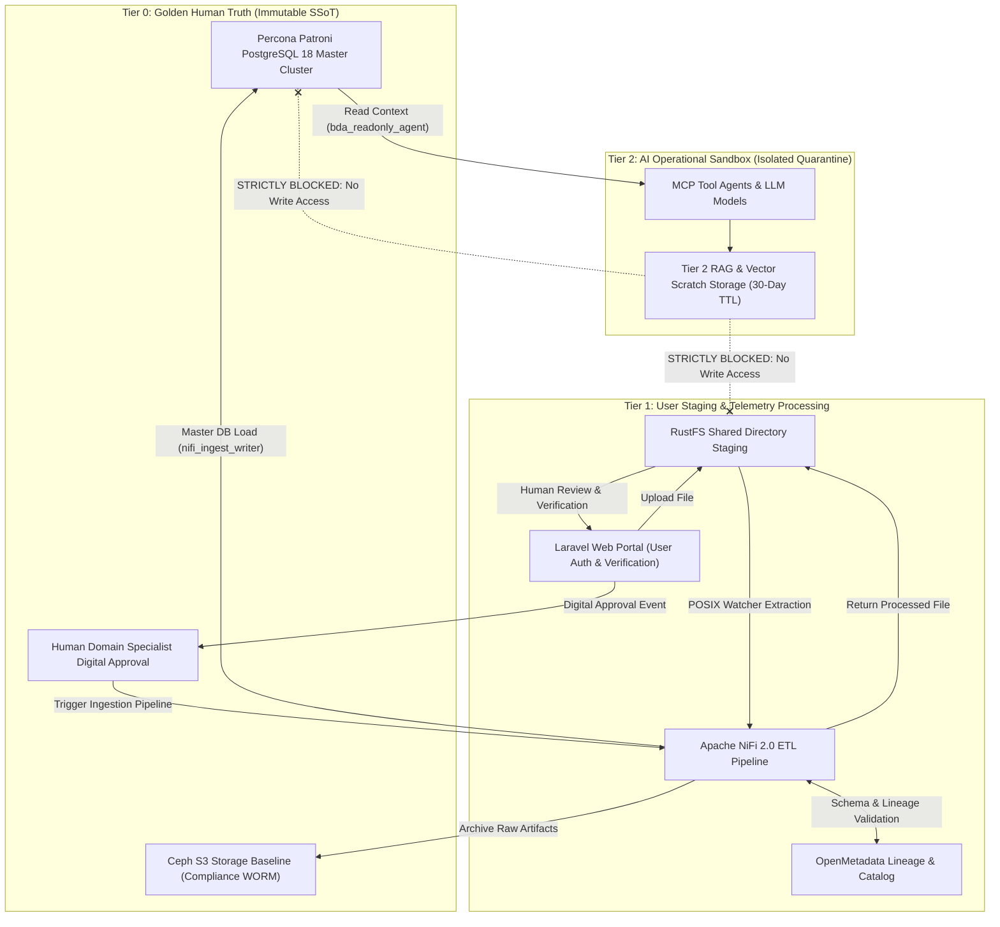

### 3. Summary Interface & Routing Table

| Source Component | Target Component | Port / Protocol / API Ingress | Security Boundary / Access Key | Operational Significance / Flow Description |
| :--- | :--- | :--- | :--- | :--- |
| **Laravel Web Portal** | **RustFS Shared Staging** | Local POSIX Mount / Shared Volume | Session JWT / POSIX Directory ACLs | Non-IT users upload raw files into isolated staging directories. |
| **RustFS Shared Staging** | **Apache NiFi 2.0** | POSIX File System Watcher | POSIX Read ACLs & Group Scopes | NiFi directory watcher detects raw uploads for validation and preliminary transformation. |
| **Apache NiFi 2.0** | **OpenMetadata** | `TCP 8585` / REST API | Bearer API Key | Records metadata lineage, quality checks, and data classification tags. |
| **Human Specialist** | **Apache NiFi 2.0 Pipeline** | HTTPS Laravel UI / REST Trigger | Multi-Factor Auth & Digital Signature Event | Human officer verification in Laravel triggers NiFi to execute master DB write. |
| **Apache NiFi 2.0** | **Percona Patroni PostgreSQL 18** | `TCP 5432` / PostgreSQL TLS 1.3 | Dedicated Ingestion Role (`nifi_ingest_writer`) | Ingests verified payloads into master SSoT tables upon human verification sign-off. |
| **AI Agent / MCP Tool** | **Percona Patroni PostgreSQL 18** | `TCP 5432` / PostgreSQL TLS 1.3 | Read-Only DB Role (`bda_readonly_agent`) | Enforces `GRANT SELECT` / `REVOKE INSERT, UPDATE, DELETE` with `SET LOCAL` session context injection. |

---

## The Foundational Boundary Principle

The foundational principle governing the modernized BDA platform is that **institutional big data infrastructure must preserve, verify, and serve human knowledge compiled from certified authorities**.

Artificial intelligence technologies can assist with infrastructure orchestration, data normalization, anomaly detection, and query acceleration, but **AI must never act as an unverified author of ground-truth data**, nor can AI-generated synthetic records be intermingled with certified physical data.

---

## Three-Tier Physical & Logical Data Classification Topology

To institutionalize this boundary, the lakehouse architecture enforces a three-tier physical and logical data classification topology:

```
Tier 0: Golden Human Truth (Authoritative SSoT)
└── Percona Patroni PostgreSQL 18 + Ceph S3 (Compliance WORM)
└── Requires human verification in Laravel and OpenMetadata validation
└── Strictly zero unvalidated AI-generated records permitted

Tier 1: Machine Telemetry & Non-IT User Staging
└── Laravel Web Application + RustFS Shared Staging Directories
└── Automated processing by Apache NiFi 2.0 & OpenMetadata cataloging
└── Human audit and verification required in Laravel prior to master DB promotion

Tier 2: AI Operational and Analytical Sandbox (Isolated Quarantine)
└── Isolated vector scratch storage with automated 30-day Time-To-Live (TTL) expiration
└── Ephemeral storage for LLM prompts, RAG enrichments, and MCP tool outputs
└── Strict access barriers preventing automated writing or promotion to Tier 0
```

---

### Tier Detailed Specifications

#### Tier 0: Golden Human Truth (Authoritative SSoT)

- **Content:** Authoritative datasets verified and signed off by authorized human domain experts via the Laravel application verification loop. Includes gazetted conservation reserves, certified geological hazard maps, borehole logs, official forest concession boundaries, and statutory environmental indices.
- **Storage Protection:** Committed into **Percona Patroni PostgreSQL 18** High-Availability clusters and archived to **Ceph S3** in Compliance Mode WORM storage. Apache NiFi 2.0 acts as the single execution engine for database persistence using the `nifi_ingest_writer` role, triggered exclusively after an authorized human specialist's digital sign-off in Laravel.

#### Tier 1: Machine Telemetry & Non-IT User Staging

- **Content:** Raw telemetry streamed directly from physical instrumentation alongside raw spreadsheets/files uploaded by non-IT business users through the Laravel web interface into RustFS shared directories.
- **Storage Protection:** Files remain staged in RustFS directories monitored by Apache NiFi 2.0 directory watchers operating under POSIX filesystem ACLs. Records remain in Tier 1 until passing automated quality assertions, schema normalization, and receiving human verification.

#### Tier 2: AI Operational and Analytical Sandbox

- **Content:** Ephemeral execution environment for synthetic simulations, exploratory vector embeddings, predictive hazard scores, RAG context enrichments, and intermediate outputs generated by Model Context Protocol (MCP) server pipelines.
- **Storage Protection:** Isolated storage buckets with automated **30-day Time-To-Live (TTL)** expiration cycles. Database access for MCP agents is strictly restricted to the `bda_readonly_agent` database role (`GRANT SELECT` only), preventing Tier 2 from writing directly to Tier 0 master tables or Tier 1 staging directories.

---

## OpenMetadata & Provenance Lineage Tracking

Data lineage and provenance across these tiers are enforced using **OpenMetadata** and open lineage standards. Every pipeline execution—whether managed by Apache NiFi 2.0, Ansible playbooks, or custom scripts—emits OpenMetadata events capturing execution context, job definitions, input dataset versions, output snapshots, and specialized dataset facets.

To trace human custody and ensure complete isolation from unverified AI data, the platform implements tier-specific provenance schemas.

### Tier 0 Cryptographic Signature Provenance Contract

Datasets promoted to `TIER_0_GOLDEN_SSOT` carry a full cryptographic verification contract within the `bda_provenance` metadata facet:

```json
{
  "bda_provenance": {
    "origin_type": "CERTIFIED_HUMAN_VERIFICATION",
    "verification_tier": "TIER_0_GOLDEN_SSOT",
    "human_author_id": "usr_domain_specialist_8842",
    "key_id": "key_eddsa_2026_secops_9923",
    "signature_algorithm": "Ed25519",
    "signature_encoding": "HEX_RAW_64_BYTE",
    "signature": "8beb46445f676032d0f0c1ac332a2590ca33a4e65376993547112cef9f9256e73f150666b51a69cf5c5b9ce94904806fef49eed3ec2478a24818be72226c3301",
    "verification_status": "VERIFIED_VALID",
    "verification_timestamp": "2026-09-12T10:15:30Z",
    "ai_generated_data": false,
    "payload_sha256": "e3b0c44298fc1c149afbf4c8996fb92427ae41e4649b934ca495991b7852b855"
  }
}
```

#### Contract Specification & Failure Handling Rules
1. **Trusted Key Ownership:** `key_id` references the public key registered in Keycloak IAM / OpenMetadata key vault bound to `human_author_id`.
2. **Canonical Signed Bytes Specification:** The signature is bound to all certification and identity fields: `origin_type`, `verification_tier`, `key_id`, `human_author_id`, `payload_sha256`, and `verification_timestamp`. The canonical byte stream is generated using RFC 8785 canonical JSON formatting over these bound fields (`verification_status` is verifier-derived output and excluded from signature input).
3. **Verification Lifecycle:** During the NiFi Tier 0 ingestion gate execution, NiFi resolves the public key for `key_id`, reconstructs the canonical RFC 8785 byte stream, and verifies the 64-byte Ed25519 signature.
4. **Failure Handling Policy:** If signature verification fails, key resolution fails, or any signed certification or identity field (`origin_type`, `verification_tier`, `key_id`, `human_author_id`, `payload_sha256`, `verification_timestamp`) is mutated, the transaction transitions to status `VERIFICATION_FAILED_QUARANTINED`, triggering an alert event in OpenMetadata and blocking database write persistence. `VERIFIED_VALID` status is assigned strictly upon successful cryptographic signature verification.

### Tier 1 Telemetry Provenance

Unpromoted telemetry and staged user files in Tier 1 carry deterministic validation metadata without human certification:

```json
{
  "bda_provenance": {
    "origin_type": "MACHINE_TELEMETRY_STAGING",
    "verification_tier": "TIER_1_STAGING",
    "ingestion_pipeline": "nifi_sensor_ingest_v2",
    "verification_status": "PENDING_HUMAN_REVIEW",
    "ai_generated_data": false,
    "payload_sha256": "8f434346648f6b96df89dda901c5176b10a6d83961dd3c1ac88b59b2dc327aa4"
  }
}
```

### Tier 2 Synthetic and RAG Model Output Provenance

All model-generated artifacts, embeddings, and RAG enrichments in Tier 2 are explicitly marked with sandbox flags:

```json
{
  "bda_provenance": {
    "origin_type": "AI_SANDBOX_MODEL_OUTPUT",
    "verification_tier": "TIER_2_SANDBOX",
    "mcp_agent_id": "agent_llm_rag_enricher_04",
    "ai_generated_data": true,
    "payload_sha256": "7a3b49911e2b5432a9018bc1260481c90533ab70992341908b299a9a99ef0129"
  }
}
```

---

## Data Tier Governance Comparison Matrix

| Governance Parameter | Tier 0: Golden Human SSoT | Tier 1: Machine & Sensor Ingestion / User Staging | Tier 2: AI Sandbox & RAG Analytics |
| :--- | :--- | :--- | :--- |
| **Primary Institutional Purpose** | Authoritative national truth, statutory policy formulation, certified legal record. | Empirical environmental observation, user file staging, telemetry aggregation. | Exploratory modelling, scenario simulation, RAG contextual enrichment. |
| **Storage Technology & WORM Mode** | Percona Patroni PostgreSQL 18 + Ceph S3 in **Compliance WORM Mode**. | RustFS Shared Directory Staging + Apache NiFi 2.0 flow queues. | Standard object/vector store; lifecycle rule with **30-day auto-purge TTL**. |
| **Allowable Ingestion Sources** | Certified human domain surveys, Laravel-verified user uploads, gazetted boundaries. | Direct telemetry streams, raw user file uploads in RustFS staging directories. | Model outputs, MCP pipeline agents, synthetic RAG enrichments. |
| **AI Role & Permissions** | Read-only access via `bda_readonly_agent` role (`GRANT SELECT`). Zero automated AI write access permitted. | Machine learning models execute cleansing, deduplication, and parsing. | Unrestricted generative and predictive computation within sandboxed perimeter. |
| **Lineage & Validation Standard** | Mandatory Cryptographic Signature Provenance Contract + OpenMetadata validation + Laravel sign-off. | Automated NiFi validation + deterministic schema assertion checks (`TIER_1_STAGING`). | OpenMetadata job execution tracking; outputs tagged as `AI_SANDBOX_MODEL_OUTPUT` with `ai_generated_data: true`. |
| **Promotion Criteria** | Terminal authoritative tier; updates require formal versioning and re-signing. | Promoted to Tier 0 only after automated DQ validation and human officer sign-off in Laravel. | Cannot be promoted directly; requires distillation and formal human certification. |


---


# Model Context Protocol (MCP) and AI Sandboxing Architecture

The integration of artificial intelligence within the modernized BDA architecture is designed around containment: **AI is utilized as an operational tool to optimize pipelines, assist data engineers, monitor operations, and automate metadata discovery, but it is strictly barred from modifying ground truth.**

---

## Architectural Principles & Standard Adoption

To standardize AI interactions while enforcing security boundaries, the platform implements the **Model Context Protocol (MCP)**, an open standard donated by Anthropic to the Agentic AI Foundation under the Linux Foundation. Operating over JSON-RPC 2.0, MCP replaces fragile custom model integrations by separating AI applications (hosts) from data sources and tools (servers).

### 1. Standalone Production-Ready SVG Vector Graphic (`.svg`)

<svg xmlns="http://www.w3.org/2000/svg" viewBox="0 0 920 420" width="100%" height="100%">
  <defs>
    <marker id="arrow-mcp" viewBox="0 0 10 10" refX="6" refY="5" markerWidth="6" markerHeight="6" orient="auto-start-reverse">
      <path d="M 0 0 L 10 5 L 0 10 z" fill="#64748B" />
    </marker>
  </defs>

  <!-- Canvas Background -->
  <rect width="920" height="420" fill="#0F172A" rx="10"/>

  <!-- Host Plane -->
  <rect x="20" y="20" width="880" height="80" fill="#1E293B" stroke="#334155" stroke-width="1.5" rx="8"/>
  <rect x="20" y="20" width="880" height="28" fill="#0F172A" rx="8"/>
  <text x="35" y="39" font-family="-apple-system, BlinkMacSystemFont, 'Segoe UI', Roboto, sans-serif" font-size="12" font-weight="bold" fill="#60A5FA">MCP OPERATIONAL HOST PLANE (LLM ASSISTANTS &amp; WORKFLOW ORCHESTRATORS)</text>
  <text x="35" y="65" font-family="Consolas, Monaco, monospace" font-size="11" fill="#38BDF8">JSON-RPC 2.0 over mTLS / Keycloak OIDC Authentication</text>

  <!-- Primitives Box -->
  <rect x="20" y="120" width="420" height="270" fill="#1E293B" stroke="#334155" stroke-width="1.5" rx="8"/>
  <rect x="20" y="120" width="420" height="28" fill="#0F172A" rx="8"/>
  <text x="35" y="139" font-family="-apple-system, BlinkMacSystemFont, 'Segoe UI', Roboto, sans-serif" font-size="12" font-weight="bold" fill="#4ADE80">MCP PRIMITIVE RESTRICTIONS</text>

  <rect x="35" y="160" width="390" height="60" fill="#0F172A" stroke="#334155" rx="6"/>
  <text x="45" y="180" font-family="-apple-system, BlinkMacSystemFont, 'Segoe UI', Roboto, sans-serif" font-size="12" font-weight="bold" fill="#86EFAC">Resources (Read-Only Interfaces)</text>
  <text x="45" y="200" font-family="-apple-system, BlinkMacSystemFont, 'Segoe UI', Roboto, sans-serif" font-size="11" fill="#94A3B8">• OpenMetadata schemas, catalogs &amp; data dictionaries</text>

  <rect x="35" y="230" width="390" height="60" fill="#0F172A" stroke="#334155" rx="6"/>
  <text x="45" y="250" font-family="-apple-system, BlinkMacSystemFont, 'Segoe UI', Roboto, sans-serif" font-size="12" font-weight="bold" fill="#86EFAC">Tools (Stateless Operations)</text>
  <text x="45" y="270" font-family="-apple-system, BlinkMacSystemFont, 'Segoe UI', Roboto, sans-serif" font-size="11" fill="#94A3B8">• SQL syntax linting &amp; Airflow health checks</text>

  <rect x="35" y="300" width="390" height="70" fill="#0F172A" stroke="#334155" rx="6"/>
  <text x="45" y="320" font-family="-apple-system, BlinkMacSystemFont, 'Segoe UI', Roboto, sans-serif" font-size="12" font-weight="bold" fill="#86EFAC">Prompts (Governance Templates)</text>
  <text x="45" y="340" font-family="-apple-system, BlinkMacSystemFont, 'Segoe UI', Roboto, sans-serif" font-size="11" fill="#94A3B8">• Deterministic templates enforcing domain rules</text>

  <!-- Execution Guardrails Box -->
  <rect x="480" y="120" width="420" height="270" fill="#1E293B" stroke="#334155" stroke-width="1.5" rx="8"/>
  <rect x="480" y="120" width="420" height="28" fill="#0F172A" rx="8"/>
  <text x="495" y="139" font-family="-apple-system, BlinkMacSystemFont, 'Segoe UI', Roboto, sans-serif" font-size="12" font-weight="bold" fill="#FBBF24">EXECUTION GUARDRAILS &amp; DMZ</text>

  <rect x="495" y="160" width="390" height="60" fill="#0F172A" stroke="#334155" rx="6"/>
  <text x="505" y="180" font-family="-apple-system, BlinkMacSystemFont, 'Segoe UI', Roboto, sans-serif" font-size="12" font-weight="bold" fill="#FDE68A">Network Isolation</text>
  <text x="505" y="200" font-family="-apple-system, BlinkMacSystemFont, 'Segoe UI', Roboto, sans-serif" font-size="11" fill="#94A3B8">• Docker/Kubernetes containers in dedicated DMZ</text>

  <rect x="495" y="230" width="390" height="60" fill="#0F172A" stroke="#334155" rx="6"/>
  <text x="505" y="250" font-family="-apple-system, BlinkMacSystemFont, 'Segoe UI', Roboto, sans-serif" font-size="12" font-weight="bold" fill="#FDE68A">Database Sandboxing</text>
  <text x="505" y="270" font-family="-apple-system, BlinkMacSystemFont, 'Segoe UI', Roboto, sans-serif" font-size="11" fill="#94A3B8">• Read-only roles &amp; transactional write locks</text>

  <rect x="495" y="300" width="390" height="70" fill="#0F172A" stroke="#F59E0B" rx="6"/>
  <text x="505" y="320" font-family="-apple-system, BlinkMacSystemFont, 'Segoe UI', Roboto, sans-serif" font-size="12" font-weight="bold" fill="#FDE68A">Storage Partitioning</text>
  <text x="505" y="340" font-family="-apple-system, BlinkMacSystemFont, 'Segoe UI', Roboto, sans-serif" font-size="11" fill="#94A3B8">• Zero Tier 0 access; writes limited to Tier 2 scratch</text>

  <!-- Connectors -->
  <line x1="230" y1="100" x2="230" y2="120" stroke="#64748B" stroke-width="1.5" marker-end="url(#arrow-mcp)"/>
  <rect x="180" y="102" width="100" height="16" fill="#1E3A8A" rx="3"/>
  <text x="185" y="114" font-family="Consolas, Monaco, monospace" font-size="9" fill="#93C5FD">JSON-RPC / mTLS</text>

  <line x1="690" y1="100" x2="690" y2="120" stroke="#64748B" stroke-width="1.5" marker-end="url(#arrow-mcp)"/>
  <rect x="635" y="102" width="110" height="16" fill="#065F46" rx="3"/>
  <text x="640" y="114" font-family="Consolas, Monaco, monospace" font-size="9" fill="#86EFAC">Gated Tool Exec</text>
</svg>

### 2. Git-Native Mermaid Topology (`.mmd`)

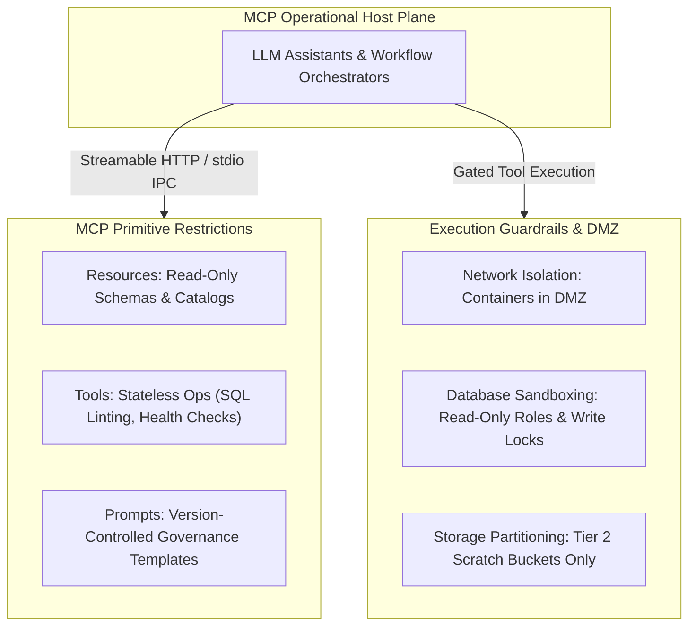

### 3. Summary Interface & Routing Table

| Source Component | Target Component | Port / Protocol / API Ingress | Security Boundary / Access Key | Operational Significance / Flow Description |
| :--- | :--- | :--- | :--- | :--- |
| **Remote AI Client / Host** | **Remote MCP Server** | `HTTPS / Streamable HTTP` (`TCP 443`) | APISIX Gateway / Keycloak OIDC JWT | Remote agent tool invocation over encrypted Streamable HTTP / SSE endpoints (allows POST only for Streamable HTTP tool calls; blocks PUT, DELETE, and PATCH). |
| **Local Coding Agent** | **Local MCP Server** | `stdio` (Process IPC / stdin/stdout) | OS Process Isolation / Read-Only Subprocess | Local AI agent subprocess execution without network listener or network auth overhead. |
| **MCP Tool Execution** | **Trino / PostgreSQL** | `TCP 8080` / `TCP 5432` (mTLS) | DMZ -> Database Read-Only Role | Executes read-only schema introspection and query syntax validation. |
| **MCP Server Output** | **Object Storage** | `TCP 9000` (S3 REST API) | DMZ -> Tier 2 Scratch Bucket | Confines all temporary model outputs and derived scratch data to Tier 2 storage. |

---

### Dual-Render Diagram 2: Zero-Trust MCP Agent Isolation & Keycloak OIDC Authentication Sequence

The diagram below details the second dual-render architecture spec for MCP Sandboxing: the zero-trust authentication, APISIX mTLS gateway route filtering, and read-only database execution sequence.

#### 1. Standalone Production-Ready SVG Vector Graphic (`.svg`)

<svg xmlns="http://www.w3.org/2000/svg" viewBox="0 0 960 400" width="100%" height="100%">
  <defs>
    <marker id="arrow-mcp-seq" viewBox="0 0 10 10" refX="6" refY="5" markerWidth="6" markerHeight="6" orient="auto-start-reverse">
      <path d="M 0 0 L 10 5 L 0 10 z" fill="#64748B" />
    </marker>
    <filter id="shadow-mcp-seq" x="-4%" y="-4%" width="108%" height="108%">
      <feDropShadow dx="0" dy="2" stdDeviation="3" flood-color="#000000" flood-opacity="0.25"/>
    </filter>
  </defs>

  <!-- Background -->
  <rect width="960" height="400" fill="#0F172A" rx="10"/>

  <!-- Keycloak IAM Box -->
  <rect x="20" y="20" width="280" height="100" fill="#1E293B" stroke="#3B82F6" stroke-width="1.5" rx="8" filter="url(#shadow-mcp-seq)"/>
  <rect x="20" y="20" width="280" height="26" fill="#1E3A8A" rx="8"/>
  <text x="35" y="38" font-family="-apple-system, BlinkMacSystemFont, 'Segoe UI', Roboto, sans-serif" font-size="12" font-weight="bold" fill="#93C5FD">1. KEYCLOAK OIDC FEDERATION</text>
  <text x="35" y="62" font-family="-apple-system, BlinkMacSystemFont, 'Segoe UI', Roboto, sans-serif" font-size="12" font-weight="bold" fill="#60A5FA">Service Account JWT Authentication</text>
  <text x="35" y="82" font-family="Consolas, Monaco, monospace" font-size="10" fill="#93C5FD">Client Credentials &amp; Read-Only Scopes</text>

  <!-- APISIX Gateway Box -->
  <rect x="340" y="20" width="280" height="100" fill="#1E293B" stroke="#38BDF8" stroke-width="1.5" rx="8" filter="url(#shadow-mcp-seq)"/>
  <rect x="340" y="20" width="280" height="26" fill="#0369A1" rx="8"/>
  <text x="350" y="38" font-family="-apple-system, BlinkMacSystemFont, 'Segoe UI', Roboto, sans-serif" font-size="12" font-weight="bold" fill="#E0F2FE">2. APISIX MTLS GATEWAY PERIMETER</text>
  <text x="350" y="60" font-family="-apple-system, BlinkMacSystemFont, 'Segoe UI', Roboto, sans-serif" font-size="12" font-weight="bold" fill="#38BDF8">mTLS Client Cert Verification</text>
  <text x="350" y="78" font-family="Consolas, Monaco, monospace" font-size="9" fill="#7DD3FC">HTTP Write Verb Filtering</text>
  <text x="350" y="93" font-family="Consolas, Monaco, monospace" font-size="8.5" fill="#7DD3FC">(allows POST only for tool calls; blocks PUT/DELETE/PATCH)</text>

  <!-- FastMCP Container Box -->
  <rect x="660" y="20" width="280" height="100" fill="#1E293B" stroke="#4ADE80" stroke-width="1.5" rx="8" filter="url(#shadow-mcp-seq)"/>
  <rect x="660" y="20" width="280" height="26" fill="#065F46" rx="8"/>
  <text x="670" y="38" font-family="-apple-system, BlinkMacSystemFont, 'Segoe UI', Roboto, sans-serif" font-size="12" font-weight="bold" fill="#86EFAC">3. FASTMCP DMZ CONTAINER</text>
  <text x="670" y="62" font-family="-apple-system, BlinkMacSystemFont, 'Segoe UI', Roboto, sans-serif" font-size="12" font-weight="bold" fill="#4ADE80">Isolated Podman / K8s Container</text>
  <text x="670" y="82" font-family="Consolas, Monaco, monospace" font-size="10" fill="#86EFAC">Read-Only SQL Session &amp; Tier 2 Write Only</text>

  <!-- Database Storage Target -->
  <rect x="20" y="260" width="920" height="110" fill="#1E293B" stroke="#C084FC" stroke-width="1.5" rx="8" filter="url(#shadow-mcp-seq)"/>
  <rect x="20" y="260" width="920" height="26" fill="#581C87" rx="8"/>
  <text x="35" y="278" font-family="-apple-system, BlinkMacSystemFont, 'Segoe UI', Roboto, sans-serif" font-size="12" font-weight="bold" fill="#E9D5FF">PROTECTED LAKEHOUSE &amp; OPERATIONAL DB (SET TRANSACTION READ ONLY)</text>

  <rect x="40" y="295" width="430" height="60" fill="#0F172A" stroke="#A855F7" rx="6"/>
  <text x="50" y="317" font-family="-apple-system, BlinkMacSystemFont, 'Segoe UI', Roboto, sans-serif" font-size="12" font-weight="bold" fill="#E9D5FF">PostgreSQL Master Hub (pgvector / PostGIS)</text>
  <text x="50" y="337" font-family="Consolas, Monaco, monospace" font-size="10" fill="#C084FC">Strict Read-Only SQL Roles &amp; Transaction Lock</text>

  <rect x="490" y="295" width="430" height="60" fill="#0F172A" stroke="#A855F7" rx="6"/>
  <text x="500" y="317" font-family="-apple-system, BlinkMacSystemFont, 'Segoe UI', Roboto, sans-serif" font-size="12" font-weight="bold" fill="#E9D5FF">Tier 2 Ephemeral AI Scratch Storage</text>
  <text x="500" y="337" font-family="Consolas, Monaco, monospace" font-size="10" fill="#C084FC">S3 Bucket s3://bda-tier2-scratch (30-Day TTL Purge)</text>

  <!-- Flow Lines -->
  <line x1="300" y1="70" x2="340" y2="70" stroke="#64748B" stroke-width="2" marker-end="url(#arrow-mcp-seq)"/>
  <line x1="620" y1="70" x2="660" y2="70" stroke="#64748B" stroke-width="2" marker-end="url(#arrow-mcp-seq)"/>

  <line x1="800" y1="120" x2="255" y2="295" stroke="#64748B" stroke-width="1.5" marker-end="url(#arrow-mcp-seq)"/>
  <line x1="800" y1="120" x2="705" y2="295" stroke="#64748B" stroke-width="1.5" marker-end="url(#arrow-mcp-seq)"/>
</svg>

#### 2. Git-Native Mermaid Topology (`.mmd`)

```mermaid
sequenceDiagram
    autonumber
    participant Keycloak as Keycloak OIDC IAM
    participant Agent as Autonomous LLM Agent
    participant APISIX as APISIX Gateway Perimeter
    participant MCP as FastMCP Container (DMZ)
    participant DB as PostgreSQL Master (pgvector)
    participant Tier2 as Tier 2 Scratch Storage

    Agent->>Keycloak: 1. Authenticate Service Account (Client Credentials)
    Keycloak-->>Agent: 2. Vend Scoped Bearer JWT Token
    Agent->>APISIX: 3. Invoke MCP Tool (mTLS + JWT Token)
    APISIX->>APISIX: 4. Validate Cert DN & Filter Write Verbs (allow POST only for tool calls; block PUT/DELETE/PATCH)
    APISIX->>MCP: 5. Forward Authorized JSON-RPC Tool Request
    MCP->>DB: 6. Execute Read-Only SQL (SET TRANSACTION READ ONLY)
    DB-->>MCP: 7. Return Semantic & Spatial Context Records
    MCP->>Tier2: 8. Write Intermediate Scratch Artifacts (30-Day TTL)
    MCP-->>Agent: 9. Return Structured Tool Result Payload
```

#### 3. Summary Interface & Routing Table

| Source Component | Target Component | Port / Protocol / API Ingress | Security Boundary / Access Key | Operational Significance / Flow Description |
| :--- | :--- | :--- | :--- | :--- |
| **LLM Agent** | **Keycloak IAM** | `TCP 8443` / OIDC HTTPS | Service Account Credentials | Authenticates agent and issues short-lived JWT token with read-only scopes. |
| **LLM Agent** | **APISIX Gateway** | `TCP 8443` / mTLS HTTPS | mTLS Client Certificate + JWT | Terminates mTLS, validates client DN, and blocks all write HTTP methods. |
| **MCP Container** | **PostgreSQL Hub** | `TCP 5432` / TLS 1.3 PostgreSQL | Read-Only Session Role | Executes controlled vector search queries; write transactions are aborted. |
| **MCP Container** | **Tier 2 Scratch Storage** | `TCP 9000` / S3 REST API | S3 Task Role (30-Day Auto-Purge TTL) | Writes ephemeral model intermediate outputs and synthetic predictions into Tier 2 scratch buckets. |

---

## MCP Primitive Restrictions

The MCP specification articulates three server primitives: Resources, Tools, and Prompts. Strict constraints are enforced across each primitive:

1. **Resources (Read-Only Interfaces):** Provide read-only data interfaces through which an AI model can retrieve context without executing side effects. In BDA, Resources expose OpenMetadata data dictionaries, schema definitions, and sanitized database views, providing structural context while preventing direct access to sensitive raw data.
2. **Tools (Executable Functions):** Restricted exclusively to operational utilities, such as validating ODCS data contracts, parsing Trino SQL queries, inspecting Airflow DAG states, and running schema drift evaluations. All tools that could alter system state—such as SQL write operations (`INSERT`, `UPDATE`, `DELETE`, `DROP`), Iceberg commit mutations, or file deletions—are blocked at the API gateway.
3. **Prompts (Version-Controlled Templates):** Structured interaction templates enforcing governance standards across AI-assisted tasks.

---

## Execution Guardrails & Security Boundaries

To prevent unauthorized write access or unintentional data leakage, MCP servers operate within strict security boundaries:

- **Network Isolation:** Deployed within isolated Docker or Kubernetes containers inside a dedicated Demilitarized Zone (DMZ). External network connectivity is restricted, and communication with internal services is routed through Apache APISIX over Mutual TLS (mTLS) with Keycloak service account authentication.
- **Sandboxed Database Access:** Interfacing with database engines (Trino or PostgreSQL) is restricted to read-only service accounts operating with transactional read-only constraints (`SET SESSION CHARACTERISTICS AS TRANSACTION READ ONLY`) and denied write permissions on Tier 0 and Tier 1 schemas.
- **Ephemeral Analytics Storage:** In scenarios where AI models perform analytical inferencing—such as computing predictive hazard zones or simulating fire spread rates—all derived outputs are written to isolated Tier 2 scratch buckets.
- **Lineage Tagging:** The ingestion pipeline automatically tags intermediate records with `ai_generated_data: true` and `provenance_tier: TIER_2_SANDBOX` via the `nres_provenance` OpenLineage facet. These outputs remain isolated from Tier 0 golden datasets until an authorized domain specialist validates the methodology and cryptographically signs the data for promotion.

---

## Dedicated MCP Servers Matrix

| MCP Server Identifier | Business Domain Alignment | Operational Capability | Primitive Scope | Access Permissions and Safeguards |
| :--- | :--- | :--- | :--- | :--- |
| `mcp-catalog-context` | Enterprise-wide metadata management. | Exposes schema definitions, business glossary terms, and lineage graphs to assist analysts with semantic data discovery. | **Resources:** `schema://*`<br>**Prompts:** `glossary_search` | OpenMetadata REST API; Read-only metadata token; zero data payload access. |
| `mcp-trino-query-gen` | Analytical domain query generation. | Translates natural language queries into optimized ANSI SQL for execution on Trino; validates query syntax and structure. | **Tools:** `validate_sql`, `explain_query`<br>**Prompts:** `sql_assist` | Trino Query Engine; Read-only credentials; execution timeout limited to 30 seconds. |
| `mcp-pipeline-monitor` | Environmental ingestion telemetry. | Monitors Airflow DAG runs and NiFi data queues; identifies pipeline bottlenecks and alerts operators to backpressure issues. | **Tools:** `get_dag_status`, `read_flow_metrics` | Apache Airflow REST API & NiFi Diagnostics API; Read-only monitoring role. |
| `mcp-contract-linter` | Data governance and ingestion gates. | Validates draft data contracts against ODCS v3.1.0 specifications; analyzes proposed schema changes for backward compatibility. | **Tools:** `lint_contract`, `diff_schema` | Local isolated container execution; no network egress; ephemeral scratch memory. |


---


# 🚀 GitHub Pages Setup & Deployment Guide

This guide details how to configure GitHub Pages for automated building and publishing of documentation using Jekyll.

---

## 🏛️ GitHub Pages & Jekyll Deployment Workflow Topology

The diagram below outlines the GitHub Actions Jekyll deployment pipeline publishing the documentation site to GitHub Pages.

### 1. Standalone Production-Ready SVG Vector Graphic (`.svg`)

<svg xmlns="http://www.w3.org/2000/svg" viewBox="0 0 960 400" width="100%" height="100%">
  <defs>
    <marker id="arrow-ghp" viewBox="0 0 10 10" refX="6" refY="5" markerWidth="6" markerHeight="6" orient="auto-start-reverse">
      <path d="M 0 0 L 10 5 L 0 10 z" fill="#64748B" />
    </marker>
    <filter id="shadow-ghp" x="-4%" y="-4%" width="108%" height="108%">
      <feDropShadow dx="0" dy="2" stdDeviation="3" flood-color="#000000" flood-opacity="0.25"/>
    </filter>
  </defs>

  <!-- Background -->
  <rect width="960" height="400" fill="#0F172A" rx="10"/>

  <!-- Step 1: Git Push -->
  <rect x="20" y="20" width="920" height="80" fill="#1E293B" stroke="#334155" stroke-width="1.5" rx="8" filter="url(#shadow-ghp)"/>
  <rect x="20" y="20" width="920" height="26" fill="#0F172A" rx="8"/>
  <text x="35" y="38" font-family="-apple-system, BlinkMacSystemFont, 'Segoe UI', Roboto, sans-serif" font-size="12" font-weight="bold" fill="#60A5FA">SOURCE COMMIT &amp; TRIGGER TIER</text>

  <rect x="40" y="52" width="880" height="38" fill="#1E3A8A" stroke="#3B82F6" rx="4"/>
  <text x="50" y="75" font-family="-apple-system, BlinkMacSystemFont, 'Segoe UI', Roboto, sans-serif" font-size="12" font-weight="bold" fill="#93C5FD">Git Push to Main Branch → Trigger .github/workflows/jekyll-gh-pages.yml</text>

  <!-- Step 2: GitHub Actions -->
  <rect x="20" y="135" width="920" height="120" fill="#1E293B" stroke="#334155" stroke-width="1.5" rx="8" filter="url(#shadow-ghp)"/>
  <rect x="20" y="135" width="920" height="26" fill="#0F172A" rx="8"/>
  <text x="35" y="153" font-family="-apple-system, BlinkMacSystemFont, 'Segoe UI', Roboto, sans-serif" font-size="12" font-weight="bold" fill="#4ADE80">GITHUB ACTIONS BUILD &amp; BUNDLE RUNNER</text>

  <rect x="35" y="170" width="205" height="70" fill="#0F172A" stroke="#22C55E" rx="6"/>
  <text x="45" y="192" font-family="-apple-system, BlinkMacSystemFont, 'Segoe UI', Roboto, sans-serif" font-size="12" font-weight="bold" fill="#86EFAC">actions/checkout@v4</text>
  <text x="45" y="212" font-family="Consolas, Monaco, monospace" font-size="10" fill="#4ADE80">Pull Master Branch</text>

  <rect x="260" y="170" width="205" height="70" fill="#0F172A" stroke="#22C55E" rx="6"/>
  <text x="270" y="192" font-family="-apple-system, BlinkMacSystemFont, 'Segoe UI', Roboto, sans-serif" font-size="12" font-weight="bold" fill="#86EFAC">configure-pages@v5</text>
  <text x="270" y="212" font-family="Consolas, Monaco, monospace" font-size="10" fill="#4ADE80">Setup Pages Meta</text>

  <rect x="485" y="170" width="205" height="70" fill="#0F172A" stroke="#22C55E" rx="6"/>
  <text x="495" y="192" font-family="-apple-system, BlinkMacSystemFont, 'Segoe UI', Roboto, sans-serif" font-size="12" font-weight="bold" fill="#86EFAC">jekyll-build-pages@v1</text>
  <text x="495" y="212" font-family="Consolas, Monaco, monospace" font-size="10" fill="#4ADE80">Compile Jekyll Site</text>

  <rect x="710" y="170" width="205" height="70" fill="#0F172A" stroke="#22C55E" rx="6"/>
  <text x="720" y="192" font-family="-apple-system, BlinkMacSystemFont, 'Segoe UI', Roboto, sans-serif" font-size="12" font-weight="bold" fill="#86EFAC">deploy-pages@v5</text>
  <text x="720" y="212" font-family="Consolas, Monaco, monospace" font-size="10" fill="#4ADE80">Publish Artifacts</text>

  <!-- Step 3: Published Site -->
  <rect x="20" y="285" width="920" height="85" fill="#1E293B" stroke="#334155" stroke-width="1.5" rx="8" filter="url(#shadow-ghp)"/>
  <rect x="20" y="285" width="920" height="26" fill="#0F172A" rx="8"/>
  <text x="35" y="303" font-family="-apple-system, BlinkMacSystemFont, 'Segoe UI', Roboto, sans-serif" font-size="12" font-weight="bold" fill="#FBBF24">LIVE PRODUCTION ENVIRONMENT</text>

  <rect x="40" y="318" width="880" height="42" fill="#0F172A" stroke="#F59E0B" rx="6"/>
  <text x="50" y="344" font-family="-apple-system, BlinkMacSystemFont, 'Segoe UI', Roboto, sans-serif" font-size="12" font-weight="bold" fill="#FDE68A">GitHub Pages HTTPS Endpoint (https://linuxmalaysia.github.io/bda-ai-infra/)</text>

  <!-- Connectors -->
  <line x1="480" y1="90" x2="137" y2="170" stroke="#64748B" stroke-width="1.5" marker-end="url(#arrow-ghp)"/>
  <line x1="240" y1="205" x2="260" y2="205" stroke="#64748B" stroke-width="1.5" marker-end="url(#arrow-ghp)"/>
  <line x1="465" y1="205" x2="485" y2="205" stroke="#64748B" stroke-width="1.5" marker-end="url(#arrow-ghp)"/>
  <line x1="690" y1="205" x2="710" y2="205" stroke="#64748B" stroke-width="1.5" marker-end="url(#arrow-ghp)"/>
  <line x1="812" y1="240" x2="480" y2="318" stroke="#64748B" stroke-width="1.5" marker-end="url(#arrow-ghp)"/>
</svg>

### 2. Git-Native Mermaid Topology (`.mmd`)

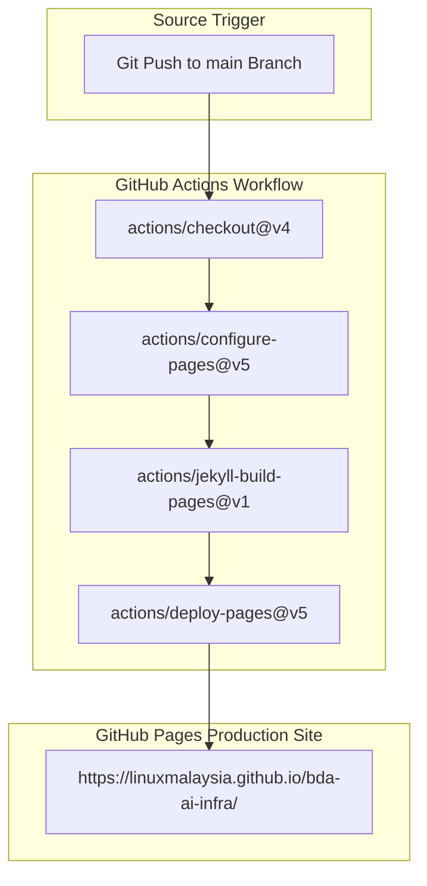

### 3. Summary Interface & Routing Table

| Source Component | Target Component | Port / Protocol / API Ingress | Security Boundary / Access Key | Operational Significance / Flow Description |
| :--- | :--- | :--- | :--- | :--- |
| **Git Push** | **GitHub Actions Runner** | HTTPS Webhook | GITHUB_TOKEN Secret | Automatically starts Jekyll site build on push to main branch. |
| **Jekyll Builder** | **GitHub Pages Environment** | Internal Artifact Upload | GitHub OIDC Deployment Token | Compiles Markdown documents, Liquid templates, and SASS stylesheets into static HTML. |

## Overview

GitHub Pages is configured using the official GitHub Actions workflow `.github/workflows/jekyll-gh-pages.yml`. On every push to the `main` branch, GitHub Actions builds the static site using Jekyll and deploys it to the `github-pages` environment.

## Step-by-Step Configuration

1. **Repository Settings**:
   - Navigate to **Settings > Pages** in your GitHub repository.
   - Under **Build and deployment > Source**, select **GitHub Actions**.

2. **Jekyll Configuration (`_config.yml`)**:
   - Ensure `_config.yml` at root specifies `url` and `baseurl`:
     ```yaml
     title: "BDA AI Infra :: Enterprise Big Data & AI Architecture"
     baseurl: "/bda-ai-infra"
     url: "https://linuxmalaysia.github.io"
     ```

3. **Workflow Verification**:
   - The workflow `.github/workflows/jekyll-gh-pages.yml` executes:
     - `actions/checkout@v4`
     - `actions/configure-pages@v5`
     - `actions/jekyll-build-pages@v1`
     - `actions/deploy-pages@v5`

4. **Automated Publishing**:
   - The site is automatically published at `https://linuxmalaysia.github.io/bda-ai-infra/`.


---


# Technical Book Design & PDF Compilation Master Prompt Guide

> **Document Type:** Governance Blueprint, Reusable AI Master Prompt & Engineering Field Manual
> **Classification:** Private And Confidential (P&C)
> **Attribution:** Compile by: Harisfazillah Jamel (LinuxMalaysia)
> **Standard:** Terminal & Cloud Technical Ebook & Handbook Standard (DSOM Rule 11 & Rule 22)
> **OKF Version:** 0.2 | **Status:** Stable | **Target Architecture:** Diátaxis Framework & Sovereign GitOps

---

## 1. Executive Overview & Dual Purpose

Modern software, DevOps, and sovereign infrastructure projects frequently suffer from fragmented documentation. Architectural intent is routinely split across disparate READMEs, tribal knowledge, incident post-mortems, runbooks, and inline source code comments. When engineering teams must assemble their infrastructure portfolios for compliance audits, formal client handovers, operational onboarding, or executive reviews, they lack a unified, publication-grade reference volume.

This master guide serves two complementary functions:
1. **The Reusable AI Master Prompt (Section 2):** A complete, drop-in system prompt engineered for advanced autonomous AI coding assistants (Google Antigravity, Google Jules, Claude, Cursor, ChatGPT) to autonomously orchestrate, style, and compile an entire multi-file Markdown documentation suite and source code repository into a publication-grade technical handbook.
2. **The Architectural Blueprint & Engineering Field Manual (Sections 3–8):** An exhaustive technical record documenting typography pairings, color palette economics, CSS `@page` constraints, the 17 non-negotiable compilation invariants, and the solutions to the 10 critical engineering hurdles encountered when compiling to print-optimised PDF, standalone HTML, EPUB 3, and styled OpenDocument Text (ODT).
3. **The Summary Skill References (Section 7):** Abbreviated reference summaries linking to the canonical skill definitions (`.agents/skills/dsom-technical-book-compiler/SKILL.md`).

---

## 2. The Reusable AI Master Prompt

> **💡 Operational Usage Directive:**
> Copy and paste the entire preformatted block below into your autonomous agent system instructions, prompt window, or CI/CD AI worker definition.

```markdown
You are a Principal Publication Systems Architect and Pandoc Book Engineering Specialist.
Your task is to take an entire repository of Markdown (.md) documents and source code trees, assemble them into a cohesive, publication-grade technical handbook, and compile them into a print-optimized PDF, standalone interactive HTML, EPUB 3, and styled OpenDocument Text (ODT).

### MANDATORY DESIGN & STYLING SPECIFICATIONS (TERMINAL & CLOUD STANDARD)

1. PRINT-OPTIMIZED PURE WHITE STANDARD (ZERO TONER WASTE):
   - For all PDF and print compilations, dark or black container backgrounds are STRICTLY FORBIDDEN.
   - Base Body Background: Pure White (#FFFFFF !important).
   - Code Blocks (Preformatted): Light Alabaster/Gray (#F8FAFC) with a subtle slate border (1px solid #CBD5E1), dark charcoal text (#0F172A), and high-contrast dark syntax highlighting (Pandoc 'tango' style: Keywords #1E40AF bold, Strings #047857, Comments #64748B italic, Numbers #B45309, Functions #6D28D9).
   - Callout & Alert Boxes: Light pastel containers with high-contrast colored left borders:
     * Critical Warnings & Cautions: Background #FEF2F2, Left Border 5px solid #DC2626, Border 1px solid #FCA5A5, Text #991B1B.
     * Operational Notes & Information: Background #F0F9FF, Left Border 5px solid #0284C7, Border 1px solid #BAE6FD, Text #075985.
     * Pro-Tips: Background #F0FDF4, Left Border 5px solid #16A34A, Border 1px solid #BBF7D0, Text #166534.
     * Chapter Executive Summaries: Background #F8FAFC, Border 1px solid #CBD5E1, Text #334155.

2. TYPOGRAPHY & VISUAL HIERARCHY:
   - Body Text: Clean sans-serif ('Inter', 'Plus Jakarta Sans', or system-ui fallback), 10pt, line-height 1.55, color #0F172A.
   - Code & Terminal Elements: Monospace font ('JetBrains Mono', 'Fira Code', or 'Consolas'), 8.5pt, line-height 1.4.
   - Headings:
     * Book Title (Cover): 22pt bold, Linux Blue (#1E3A8A).
     * Part Headers (H1 .part): 22pt bold, Linux Blue (#1E3A8A), shaded banner #F8FAFC with 8px solid #1E3A8A left bar, page-break-before: always.
     * Chapter Headers (H2): 16pt bold, Linux Blue (#1E3A8A), bottom border 1px solid #E2E8F0.
     * Section Headers (H3): 13pt bold, Deep Ubuntu (#77216F).
     * Sub-section Headers (H4): 11pt semibold, Deep Teal (#0D9488).

3. PAGE LAYOUT & RUNNING HEADERS/FOOTERS:
   - Page Size: A4 (margin: 20mm 15mm 20mm 15mm).
   - Running Header Top-Left: "<Book Title>" (Inter 8pt, #64748B).
   - Running Header Top-Right: "PRIVATE AND CONFIDENTIAL (P&C)" (Inter 8pt bold, #DC2626).
   - Running Footer Bottom-Left: "Compile by: Harisfazillah Jamel" (Inter 8pt, #64748B).
   - Running Footer Bottom-Right: "Page " counter(page) (Inter 8pt bold, #0F172A).

4. STANDALONE COVER PAGE (SINGLE PAGE FIT):
   - Passed to Pandoc via '--include-before-body=cover.html'.
   - Must fit entirely on Page 1 without spilling over.
   - Contain badges: Private And Confidential (P&C) (#FEE2E2), Technology badges (#EFF6FF), Tooling badges (#F0FDF4).
   - Metadata grid: 2-column key-value grid (Architect, Compiler, Audience, Classification, Covenant, Edition).
   - CSS Guard: Hide duplicate Pandoc title header (#title-block-header { display: none !important; }) and prevent cover title page break (.cover-title { break-before: avoid !important; }).

### NON-NEGOTIABLE ENGINEERING PIPELINE CONSTRAINTS

1. FRONTMATTER & FOOTER STRIPPING:
   - Systematically strip individual YAML frontmatter (lines between leading '---' fences) and individual document signature footers from every ingested .md file to prevent Pandoc YAML parser crashes ('Unknown alias').
   - Extract 'title' and 'description' from frontmatter: convert description into an executive summary callout box above the chapter body.

2. DYNAMIC BACKTICK SCALING:
   - When ingesting code files containing triple backticks (```), dynamically scale the outer markdown fence to 4 or 5 backticks (```` or `````) to prevent premature block closure.

3. ANTI-BLANK PAGE DISCIPLINE:
   - Never combine manual HTML page break tags ('<div class="page-break"></div>') with CSS 'page-break-before: always;'. Use CSS classes exclusively on H1/Part elements.

4. MERMAID MULTI-DIAGRAM ISOLATION PROTOCOL:
   - Diagram-Scoped Namespaces: Reusing identical node IDs (e.g. NODE1, DB, GATEWAY) across diagrams is strictly prohibited. Prefix all node IDs within each diagram with a unique diagram namespace (e.g. TB_, PA_, PB_, PC_) to eliminate global SVG node collisions.
   - Sequential DOM Replacement: Never rely on 'mermaid.run()' which causes millisecond timestamp collisions in headless Chromium. Render diagrams sequentially via 'mermaid.render("diagram_svg_" + i, code)' into unique containers.
   - Entity Unescaping Pipeline: Unescape '&quot;', '&lt;', '&gt;', '&amp;' inside '<pre class="mermaid">' blocks before rendering, and extract 'innerHTML' (not 'textContent') to preserve stacked card line breaks.
   - Balanced Flowchart Architecture: Prevent tall vertical flowchart towers (height > 600px) that cause blank page overflows. Split complex diagrams into balanced 2-column or orthogonal grid layouts.

5. SOFT-PATH INTERNAL LINK RESOLUTION MANDATE (3-TIER NORMALISATION):
   - Pre-index all chapters ('#chap-{slug}') and ingested code blocks ('#code-{slug}') into an internal anchor dictionary.
   - Rewrite all markdown links using a 3-tier normalisation lookup:
     * Tier 1 (Exact Match): Check raw relative path against dictionary.
     * Tier 2 (Normalised Match): Strip 'file:///', Windows drive letters ('C:/', 'D:/'), project root prefix, and 'build/' prefix, then check dictionary.
     * Tier 3 (Basename-Only Match): Strip all parent directories and check dictionary by filename only.
     * Preserve '#fragment' anchor jumps across all three tiers.
   - Post-Compile Audit: Assert zero absolute path leaks ('D:/', 'C:/', 'file:///') survive in compiled PDF/HTML links.

6. DEVELOPER COMMENTARY EXTRACTION PROTOCOL:
   - For every ingested Ansible playbook, shell script, or configuration file, parse the leading '#' comment block (contiguous comments before the first active code key).
   - Regex Keyword Scan: If comments contain keywords ('BUG', 'FIX', 'Confirmed', 'live', 'vendor', 'NEVER', 'destroy', 'destructive', 'ORA-\d+', 'crash', 'escalation', 'hard way'), render a ⚠️ orange warning callout ('callout-warning', 'Developer Commentary — Read Before Executing') ABOVE the code fence. Otherwise, render a 💡 blue note callout ('callout-note', 'Developer Commentary').
   - Keep the original '#' comments inside the code block intact.

7. MULTI-FORMAT COMPILATION SUITE:
   - Step 1: Standalone HTML with embedded Mermaid.js ESM and print CSS.
   - Step 2: Print-to-PDF via Headless Chromium/Edge with '--headless=new --run-all-compositor-stages-before-draw --virtual-time-budget=8000'.
   - Step 3: EPUB 3 with clean table of contents metadata.
   - Step 4: OpenDocument Text (ODT) with custom reference styles for Google Docs/LibreOffice collaboration.
```

---

## 3. Visual Design System: The "Terminal & Cloud" Framework

### 3.1 Color Palette & Contrast Economics
The Terminal & Cloud design framework balances screen aesthetics with strict physical print economics. Laser printing dark backgrounds consumes excessive toner and results in page warping, ink smudging, and poor legibility. The palette enforces light backgrounds with high-contrast foreground glyphs:

| Role / UI Element | HEX Code | Print Rationale & Technical Impact | CSS Selector / Declaration |
| :--- | :--- | :--- | :--- |
| **Page Background** | `#FFFFFF` | Pure white. Eliminates background toner wash entirely. | `body { background-color: #FFFFFF !important; }` |
| **Body Typography** | `#0F172A` | Deep charcoal slate. High contrast without harsh black glare. | `color: #0F172A !important;` |
| **Primary Headings** | `#1E3A8A` | Linux Blue. Authoritative enterprise architecture branding. | `h1, h2 { color: #1E3A8A; }` |
| **Secondary Headings** | `#77216F` | Deep Ubuntu Purple. Distinct demarcator for major subsections. | `h3 { color: #77216F; }` |
| **Tertiary Headings** | `#0D9488` | Deep Teal. Scannable sub-procedure demarcator. | `h4 { color: #0D9488; }` |
| **Code Container** | `#F8FAFC` | Light alabaster. Defines boundaries without heavy toner coverage. | `pre, code { background-color: #F8FAFC !important; }` |
| **Code Border** | `#CBD5E1` | Slate hairline border. Ensures razor-sharp container boundaries. | `border: 1px solid #CBD5E1 !important;` |
| **Warning Callout** | `#FEF2F2` / `#DC2626` | Soft red pastel container with vivid red border for critical alerts. | `.callout-warning` |
| **Note Callout** | `#F0F9FF` / `#0284C7` | Soft blue pastel container for operational context and notices. | `.callout-note` |
| **Tip Callout** | `#F0FDF4` / `#16A34A` | Soft green pastel container for architectural pro-tips. | `.callout-tip` |

### 3.2 Typography Pairing Specifications
- **Prose & Documentation Body:** `font-family: 'Inter', -apple-system, BlinkMacSystemFont, 'Segoe UI', Roboto, sans-serif;`
  *Metrics:* Base font size is fixed at `10pt` with `line-height: 1.55`. Employs clean geometric glyphs with a tall x-height optimized for both 300 DPI laser printing and high-DPI displays.
- **Code & Systems Configuration:** `font-family: 'JetBrains Mono', 'Fira Code', 'Consolas', monospace;`
  *Metrics:* Scaled to `8.5pt` with `line-height: 1.4`. Features distinct character disambiguation (e.g. `0` vs `O`, `1` vs `l` vs `I`), tabular numeric alignment, and ligature stability.

### 3.3 Print Page Budget & Paging Rules (CSS `@page`)
```css
@page {
    size: A4;
    margin: 20mm 15mm 20mm 15mm;
    background: #FFFFFF;
    @top-left {
        content: "<Book Title>";
        font-family: 'Inter', sans-serif;
        font-size: 8pt;
        color: #64748B;
        font-weight: 500;
    }
    @top-right {
        content: "PRIVATE AND CONFIDENTIAL (P&C)";
        font-family: 'Inter', sans-serif;
        font-size: 8pt;
        color: #DC2626;
        font-weight: 700;
        letter-spacing: 0.5px;
    }
    @bottom-left {
        content: "Compile by: Harisfazillah Jamel";
        font-family: 'Inter', sans-serif;
        font-size: 8pt;
        color: #64748B;
    }
    @bottom-right {
        content: "Page " counter(page);
        font-family: 'Inter', sans-serif;
        font-size: 8pt;
        color: #0F172A;
        font-weight: 600;
    }
}
```

---

## 4. The 10 Critical Engineering Hurdles Solved

### Hurdle 1: Pandoc YAML Parser Explosions (`Unknown alias`)
- **Failure Mode:** In multi-document repositories, ingested markdown documents retain individual OKF frontmatter blocks (`--- ... ---`). Pandoc treats secondary frontmatter as inline YAML document streams, triggering fatal `Unknown alias` errors.
- **Remediation:** A pre-processing function (`strip_frontmatter_and_footer()`) strips leading YAML fences while parsing `title` and `description` to generate formatted chapter executive summary callouts.

### Hurdle 2: Nested Backtick Fence Collisions
- **Failure Mode:** Ingested code files or markdown snippets containing triple backticks cause outer code fences to terminate prematurely, spilling raw syntax into document prose.
- **Remediation:** Dynamic backtick scaling. The compiler inspects the target code block; if triple backticks exist, the outer fence scales dynamically to 4 backticks (```` ```` ````); if 4 exist, it scales to 5.

### Hurdle 3: Blank Overflow Pages & Cover Page Fragmentation
- **Failure Mode:** Manual HTML page breaks (`<div class="page-break"></div>`) clash with CSS `page-break-before: always;` on H1 headers, creating blank pages. Pandoc title blocks also fragment covers across Pages 1 and 2.
- **Remediation:** Eliminate manual page break divs entirely. Generate a standalone `cover.html` passed via `--include-before-body=cover.html` and suppress default title headers via `#title-block-header { display: none !important; }`.

### Hurdle 4: Mermaid 10 Syntax Bomb Graphics (HTML Escaping)
- **Failure Mode:** Pandoc automatically entity-encodes text inside code blocks (`"`, `<`, `>`, `-->` becomes `--&gt;`). When client-side Mermaid executes, it encounters illegal tokens and renders a pink syntax error bomb icon.
- **Remediation:** Execute post-Pandoc HTML unescaping on `<pre class="mermaid">` blocks, stripping enclosing `<code>` tags and decoding entities prior to headless browser rendering.

### Hurdle 5: Mermaid Node Identifier Collisions Across Multi-Diagram Books
- **Failure Mode:** Multiple architecture diagrams reuse common node identifiers (e.g. `NODE1`, `DB`, `GW`). Mermaid's internal state collates these identical IDs into a single global SVG namespace, corrupting graph topology.
- **Remediation:** Mermaid Multi-Diagram Isolation Protocol. Every diagram must enforce diagram-scoped unique ID prefixes (e.g. `TB_` for top-level architecture, `AN_` for Ansible flow, `SO_` for SOC operations).

### Hurdle 6: Headless Chromium Millisecond Timestamp Collisions
- **Failure Mode:** Headless Chromium executes scripts in sub-millisecond cycles. Mermaid's default `mermaid.run()` relies on `Date.now()` timestamps, creating identical element IDs and rendering multiple diagrams in one container.
- **Remediation:** Sequential DOM replacement. The browser engine iterates over `pre.mermaid` elements and calls `mermaid.render("diagram_svg_" + i, code)` sequentially, directly replacing `el.innerHTML`.

### Hurdle 7: Tall Vertical Flowcharts Splitting Pages Mid-Node
- **Failure Mode:** Flowcharts exceeding 600px vertical height split mid-node across physical page breaks, producing broken connectors and illegible text.
- **Remediation:** Re-architect deep linear flowcharts into balanced 2-column or orthogonal grids, enforce `svg { max-width: 100% !important; height: auto !important; }`, and extract `innerHTML` to preserve card breaks.

### Hurdle 8: Broken Relative Links & Leaked Workstation Paths (`file:///`)
- **Failure Mode:** Relative documentation links break when concatenated, while local filesystem paths (e.g. `file:///D:/Projects/...`) leak private developer workstation structures into public PDFs.
- **Remediation:** Soft-Path Link Resolution Mandate (3-Tier Normalisation Pipeline). Pre-index all chapters and code blocks into an in-memory dictionary. Normalize links via Tier 1 (Exact match), Tier 2 (Strip file protocol, drive letters, build prefixes), and Tier 3 (Basename-only fallback), maintaining fragment jumps.

### Hurdle 9: Critical Operational Warnings Hidden in Inline Code Comments
- **Failure Mode:** Vital operational caveats, vendor bug workarounds, and safety dispatches hidden in leading `#` comments are overlooked by SysAdmins reading compiled volumes.
- **Remediation:** Developer Commentary Extraction Protocol. Scan leading comment blocks of playbooks and scripts for high-risk keywords (`BUG`, `FIX`, `Confirmed`, `NEVER`, `destroy`, `destructive`). Render matches as high-visibility orange warning callouts above code fences.

### Hurdle 10: Headless Browser Print Timeouts & Compositor Stalls
- **Failure Mode:** Asynchronous web fonts or unrendered scripts cause headless Chromium to stall or exit before writing the PDF file buffer.
- **Remediation:** Launch Chromium with explicit flags: `--headless=new --disable-gpu --run-all-compositor-stages-before-draw --virtual-time-budget=8000 --print-to-pdf` under a strict 45–60 second subprocess timeout.

---

## 5. The 17 Non-Negotiable Technical Book Compilation Invariants

| # | Invariant Name | Failure Mode Addressed | Architectural Rule & Implementation Contract |
| :--- | :--- | :--- | :--- |
| **1** | **Pure White Standard** | Dark gray container backgrounds waste ink | Enforce `@page { background: #FFFFFF; }` and `body { background-color: #FFFFFF !important; }`. |
| **2** | **Light Alabaster Code** | Solid black terminal containers waste excessive toner | Code containers must use `#F8FAFC` background with `#CBD5E1` border and `#0F172A` text. |
| **3** | **Syntax Theme (`tango`)** | Dark themes (`espresso`, `zenburn`) inject dark styling | Strictly enforce `--syntax-highlighting=tango` for crisp dark ink on light surfaces. |
| **4** | **Standalone Cover Injection** | Raw markdown covers break typography hierarchy | Generate a separate `cover.html` and inject via `--include-before-body=cover.html`. |
| **5** | **Cover Single-Page Fit** | Cover page spilling into Table of Contents on Page 2 | Declare `.cover-page { break-after: page; min-height: 250mm; display: flex; flex-direction: column; justify-content: space-between; }`. |
| **6** | **Frontmatter Stripping** | Pandoc crashes with fatal `Unknown alias` errors | Strip all leading `--- ... ---` blocks from all ingested markdown files before stitching. |
| **7** | **Horizontal Rule Sanitization** | Standalone `\n---\n` is parsed as start of YAML | Regex replace all internal `\n---\n` with `\n***\n` in ingested content. |
| **8** | **GitHub Alert Card Conversion** | `> [!NOTE]` blocks render as unstyled blockquotes | Programmatically transform alerts into styled pastel HTML cards with icons. |
| **9** | **Self-Contained Embedded CSS** | Headless browsers fail to resolve relative CSS links | Read `terminal-theme.css` and inject directly into `<style>` within `<head>`. |
| **10** | **Dynamic Backtick Scaling** | Triple backticks terminate outer block prematurely | Detect inner backticks and dynamically scale outer fences to N+1 backticks. |
| **11** | **Heading Offset (+2)** | Ingested titles collide with Book H1/H2 levels | Increment ingested document heading depths (`#` becomes `###`, `##` becomes `####`). |
| **12** | **Native Vector SVG Baking** | Client-side Mermaid JS crashes or races capture | Pre-render diagrams into inline vector `<svg>` tags before headless PDF capture. |
| **13** | **Mermaid Namespace Isolation** | Global node collisions when diagrams reuse IDs | Prefix all diagram node IDs with unique namespaces (e.g. `TB_`, `AN_`). |
| **14** | **Pandoc Code-Tag Wrapping** | Pandoc wraps `<pre class="mermaid"><code>` and escapes | Regex must match standard and `<code>`-wrapped pre blocks and unescape arrows. |
| **15** | **Isolated Browser Profile** | Headless Chromium hangs if desktop instances active | Launch headless engines with `--user-data-dir="$env:TEMP/edge-pdf-profile-$(Get-Random)"`. |
| **16** | **Synchronous Process Execution** | Shell exits before browser flushes disk buffer | Always invoke print processes with synchronous execution guards (e.g. `Start-Process ... -Wait`). |
| **17** | **Provenance Audit Banners** | Loss of repository source traceability | Inject `<div class="doc-provenance">` detailing the exact source path. |

---

## 6. Multi-Format Compilation Commands

```bash
# 0. Build Master Markdown Handbook
uv run python tools/build_project_book.py

# 1. Compile Standalone Interactive HTML Ebook (Pandoc 3.x)
pandoc book.md -o handbook.html \
  --standalone --toc --toc-depth=3 --number-sections \
  --syntax-highlighting=tango \
  --metadata title="Project Technical Handbook" \
  --metadata author="Compile by: Harisfazillah Jamel" \
  --metadata date="September 2026" -V lang=en

# 2. Pre-Render Native Vector SVGs and Inline Stylesheet
uv run python tools/bake_native_svg.py

# 3. Compile Publication-Grade PDF via Headless Chromium / Edge (PowerShell)
$tmpProfile = "$env:TEMP\edge-pdf-profile-$(Get-Random)"
Start-Process -FilePath "C:\Program Files (x86)\Microsoft\Edge\Application\msedge.exe" `
  -ArgumentList "--headless=new", "--disable-gpu", "--run-all-compositor-stages-before-draw", `
  "--virtual-time-budget=8000", "--no-pdf-header-footer", `
  "--print-to-pdf=handbook.pdf", `
  "--user-data-dir=$tmpProfile", "file:///$PWD/handbook.html" -Wait
Remove-Item -Recurse -Force $tmpProfile -ErrorAction SilentlyContinue

# 4. Compile EPUB 3 Ebook
pandoc book.md -o handbook.epub \
  -t epub3 --toc --toc-depth=3 \
  --metadata title="Project Technical Handbook" \
  --metadata author="Compile by: Harisfazillah Jamel"

# 5. Compile OpenDocument Text (ODT)
pandoc book.md -o handbook.odt \
  --toc --toc-depth=3 \
  --metadata title="Project Technical Handbook" \
  --metadata author="Compile by: Harisfazillah Jamel"

# Or execute the complete turnkey script wrapper:
uv run python .agents/skills/dsom-technical-book-compiler/scripts/compile-book.py
```

---

## 7. Embedded Autonomous Agent Skill: `dsom-technical-book-compiler`

The full operational specification for the skill is defined below and stored at `.agents/skills/dsom-technical-book-compiler/SKILL.md`:

```yaml
---
okf_version: "0.2"
type: skill
title: Technical Ebook & Handbook Compiler (Pandoc / Print & Terminal Theme)
description: Compiles complete Diataxis documentation suites and source code repositories into publication-grade, print-optimized technical handbooks (PDF, standalone HTML, EPUB, ODT) using Pandoc and the Terminal & Cloud design framework.
status: verified
stale_after: "2027-09-12"
generated:
  by: human:harisfazillah
  at: 2026-09-12T14:00:00Z
name: dsom-technical-book-compiler
---

# Technical Ebook & Handbook Compiler

**Purpose:** Standardizes the automated compilation of complex multi-part Diátaxis documentation palaces and complete source code directories into unified, publication-grade technical handbooks (PDF, HTML, EPUB, ODT) tailored for SysAdmins, DevOps Engineers, and SREs.

## Execution Command
```bash
uv run python tools/build_project_book.py
```
```

---

## 8. Operational Verification Checklist & Quality Assurance Protocol

Before finalizing or distributing any compiled volume, the AI agent and systems architect must verify compliance against this operational audit checklist:
- [ ] **Cover Page Fit Audit:** Page 1 renders as a full-page bordered card with P&C badges and metadata grid; cleanly breaks before the Table of Contents.
- [ ] **Pure White Standard Audit:** Base background is `#FFFFFF`. Zero solid black terminal boxes exist in the PDF.
- [ ] **Light Alabaster Code Audit:** All code containers render with `#F8FAFC` backgrounds, crisp slate borders, and `tango` syntax highlighting.
- [ ] **Callout Card Conversion Audit:** All GitHub alerts (`[!NOTE]`, `[!WARNING]`) are transformed into styled pastel HTML cards. Zero raw markdown alert syntax survives.
- [ ] **Vector Diagram Integrity Audit:** All Mermaid flowcharts render as crisp, vector SVGs with zero pink syntax bomb error graphics.
- [ ] **Inline CSS Audit:** The full stylesheet is injected into `<style>` within `<head>`, preventing broken relative references.
- [ ] **Soft-Path Link Leak Audit:** Grep inspection of assembled HTML/PDF links confirms zero surviving local filesystem paths (`file:///` or drive letters `C:/`, `D:/`).
- [ ] **Pagination & Blank Page Audit:** Total page count contains zero empty filler pages between sections or chapters.
- [ ] **Attribution & Confidentiality Audit:** Running headers display `PRIVATE AND CONFIDENTIAL (P&C)` and running footers reflect `Compile by: Harisfazillah Jamel`.

---
*Deep State of Mind (DSOM) For My AI Protocol | Harisfazillah Jamel (LinuxMalaysia) | 2026-09-12*
*Standard: UK English | DBP-standard Bahasa Melayu Malaysia (Piawai) | GNU General Public License v3.0*


---


# Ingestion Pipeline, Application Portal, and Superset Modernization

Modernizing data ingestion, web application delivery, and visual analytics replaces manual processes and legacy software with an automated, observable, and modular open-source pipeline.

---

## 1. Decoupled Ingestion Framework (NiFi & Airflow)

Ingestion is overhauled by implementing a decoupled, event-driven framework using **Apache NiFi** and **Apache Airflow**:

### 1. Standalone Production-Ready SVG Vector Graphic (`.svg`)

<svg xmlns="http://www.w3.org/2000/svg" viewBox="0 0 920 400" width="100%" height="100%">
  <defs>
    <marker id="arrow-ing" viewBox="0 0 10 10" refX="6" refY="5" markerWidth="6" markerHeight="6" orient="auto-start-reverse">
      <path d="M 0 0 L 10 5 L 0 10 z" fill="#64748B" />
    </marker>
  </defs>

  <!-- Background -->
  <rect width="920" height="400" fill="#0F172A" rx="10"/>

  <!-- Subnet 1: Perimeter Ingress (NiFi) -->
  <rect x="20" y="20" width="420" height="360" fill="#1E293B" stroke="#334155" stroke-width="1.5" rx="8"/>
  <rect x="20" y="20" width="420" height="32" fill="#0F172A" rx="8"/>
  <text x="35" y="41" font-family="-apple-system, BlinkMacSystemFont, 'Segoe UI', Roboto, sans-serif" font-size="12" font-weight="bold" fill="#60A5FA">PERIMETER INGRESS: APACHE NIFI (STREAMING)</text>

  <rect x="40" y="70" width="380" height="80" fill="#0F172A" stroke="#334155" rx="6"/>
  <text x="50" y="92" font-family="-apple-system, BlinkMacSystemFont, 'Segoe UI', Roboto, sans-serif" font-size="13" font-weight="bold" fill="#F8FAFC">Telemetry &amp; SFTP Ingestion</text>
  <text x="50" y="112" font-family="Consolas, Monaco, monospace" font-size="10" fill="#60A5FA">ListSFTP -> FetchSFTP / ListenHTTP (Port 8443)</text>
  <text x="50" y="130" font-family="-apple-system, BlinkMacSystemFont, 'Segoe UI', Roboto, sans-serif" font-size="11" fill="#94A3B8">• Continuous precipitation &amp; sensor polling</text>

  <rect x="40" y="170" width="380" height="80" fill="#0F172A" stroke="#334155" rx="6"/>
  <text x="50" y="192" font-family="-apple-system, BlinkMacSystemFont, 'Segoe UI', Roboto, sans-serif" font-size="13" font-weight="bold" fill="#F8FAFC">REST API Polling Engine</text>
  <text x="50" y="212" font-family="Consolas, Monaco, monospace" font-size="10" fill="#38BDF8">InvokeHTTP (Thermal Anomaly API)</text>
  <text x="50" y="230" font-family="-apple-system, BlinkMacSystemFont, 'Segoe UI', Roboto, sans-serif" font-size="11" fill="#94A3B8">• Replaces manual email ingestion flows</text>

  <rect x="40" y="270" width="380" height="90" fill="#0F172A" stroke="#22C55E" rx="6"/>
  <text x="50" y="292" font-family="-apple-system, BlinkMacSystemFont, 'Segoe UI', Roboto, sans-serif" font-size="13" font-weight="bold" fill="#86EFAC">Backpressure &amp; Provenance</text>
  <text x="50" y="312" font-family="Consolas, Monaco, monospace" font-size="10" fill="#4ADE80">Format Normalization &amp; Audit Lineage</text>
  <text x="50" y="330" font-family="-apple-system, BlinkMacSystemFont, 'Segoe UI', Roboto, sans-serif" font-size="11" fill="#94A3B8">• Event-driven queue flow control</text>

  <!-- Subnet 2: Batch Orchestration (Airflow) -->
  <rect x="480" y="20" width="420" height="360" fill="#1E293B" stroke="#334155" stroke-width="1.5" rx="8"/>
  <rect x="480" y="20" width="420" height="32" fill="#0F172A" rx="8"/>
  <text x="495" y="41" font-family="-apple-system, BlinkMacSystemFont, 'Segoe UI', Roboto, sans-serif" font-size="12" font-weight="bold" fill="#FBBF24">BATCH ORCHESTRATION: APACHE AIRFLOW (DAGS)</text>

  <rect x="500" y="70" width="380" height="80" fill="#0F172A" stroke="#334155" rx="6"/>
  <text x="510" y="92" font-family="-apple-system, BlinkMacSystemFont, 'Segoe UI', Roboto, sans-serif" font-size="13" font-weight="bold" fill="#F8FAFC">Spark &amp; Trino Workflows</text>
  <text x="510" y="112" font-family="Consolas, Monaco, monospace" font-size="10" fill="#FBBF24">Airflow DAGs (Scheduled / Event Triggers)</text>
  <text x="510" y="130" font-family="-apple-system, BlinkMacSystemFont, 'Segoe UI', Roboto, sans-serif" font-size="11" fill="#94A3B8">• Distributed transformations on Iceberg</text>

  <rect x="500" y="170" width="380" height="80" fill="#0F172A" stroke="#334155" rx="6"/>
  <text x="510" y="192" font-family="-apple-system, BlinkMacSystemFont, 'Segoe UI', Roboto, sans-serif" font-size="13" font-weight="bold" fill="#F8FAFC">ODCS Contract Gates &amp; Lineage</text>
  <text x="510" y="212" font-family="Consolas, Monaco, monospace" font-size="10" fill="#60A5FA">Data Contract CLI &amp; OpenLineage</text>
  <text x="510" y="230" font-family="-apple-system, BlinkMacSystemFont, 'Segoe UI', Roboto, sans-serif" font-size="11" fill="#94A3B8">• Schema validation &amp; OpenMetadata sync</text>

  <rect x="500" y="270" width="380" height="90" fill="#0F172A" stroke="#F59E0B" rx="6"/>
  <text x="510" y="292" font-family="-apple-system, BlinkMacSystemFont, 'Segoe UI', Roboto, sans-serif" font-size="13" font-weight="bold" fill="#FDE68A">Iceberg Table Maintenance</text>
  <text x="510" y="312" font-family="Consolas, Monaco, monospace" font-size="10" fill="#FBBF24">Compaction &amp; Snapshot Purging</text>
  <text x="510" y="330" font-family="-apple-system, BlinkMacSystemFont, 'Segoe UI', Roboto, sans-serif" font-size="11" fill="#94A3B8">• Automated table optimization DAGs</text>

  <!-- Connector -->
  <line x1="440" y1="200" x2="480" y2="200" stroke="#64748B" stroke-width="2" marker-end="url(#arrow-ing)"/>
  <rect x="442" y="192" width="36" height="16" fill="#065F46" rx="3"/>
  <text x="445" y="204" font-family="Consolas, Monaco, monospace" font-size="9" fill="#86EFAC">REST</text>
</svg>

### 2. Git-Native Mermaid Topology (`.mmd`)

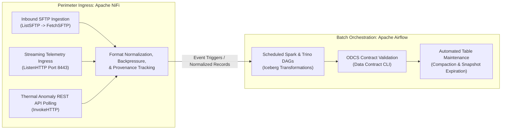

### 3. Summary Interface & Routing Table

| Source Component | Target Component | Port / Protocol / API Ingress | Security Boundary / Access Key | Operational Significance / Flow Description |
| :--- | :--- | :--- | :--- | :--- |
| **Departmental SFTP Server** | **Apache NiFi** | `ListSFTP -> FetchSFTP` (`TCP 22`) | Partner Network -> DMZ Ingestion | Inbound SFTP polling using ListSFTP and FetchSFTP processors. |
| **Telemetry Ingress Stream** | **Apache NiFi** | `ListenHTTP` (`TCP 8443` / HTTPS) | Boundary Perimeter -> DMZ Ingestion | Continuous streaming ingestion of precipitation telemetry payloads. |
| **Thermal Anomaly REST API** | **Apache NiFi** | `TCP 443` / HTTPS REST | External API -> Ingestion Queue | Replaces manual email parsing with automated REST polling via `InvokeHTTP`. |
| **Apache NiFi** | **Apache Airflow** | `TCP 8080` / REST Webhook | DMZ -> Batch Processing Tier | Triggers Airflow DAG execution upon buffer batch threshold or schedule completion. |
| **Apache Airflow** | **Spark / Trino / Iceberg** | `TCP 7077` / `TCP 8080` | Batch Tier -> Core Lakehouse | Executes SQL transformations, enforces ODCS contract gates, and purges Iceberg snapshots. |

### Ingress & Protocol Translation (Apache NiFi)

Apache NiFi is deployed at the network boundary to handle continuous, real-time data movement, protocol translation, and streaming ingestion. NiFi manages incoming external connections, monitors departmental SFTP drop locations, polls satellite thermal anomaly REST APIs, ingests rainfall telemetry streams, and validates incoming payloads with built-in backpressure management and provenance tracking.

### Batch Orchestration (Apache Airflow)

Apache Airflow acts as the centralized batch orchestrator, managing complex, scheduled Directed Acyclic Graphs (DAGs) across Apache Spark, Trino, and PostgreSQL. Airflow DAGs enforce data contract checks via the Data Contract CLI, extract OpenLineage events, trigger metadata updates in OpenMetadata, and schedule Iceberg table maintenance tasks (such as compaction and snapshot expiration).

---

### Dual-Render Diagram 2: Web Portal & Apache Superset Visualization Architecture

The diagram below details the presentation and access tier modernization, replacing proprietary BI servers with Next.js, APISIX, Keycloak IAM, and Apache Superset with native `deck.gl` geospatial rendering.

#### 1. Standalone Production-Ready SVG Vector Graphic (`.svg`)

<svg xmlns="http://www.w3.org/2000/svg" viewBox="0 0 960 400" width="100%" height="100%">
  <defs>
    <marker id="arrow-viz2" viewBox="0 0 10 10" refX="6" refY="5" markerWidth="6" markerHeight="6" orient="auto-start-reverse">
      <path d="M 0 0 L 10 5 L 0 10 z" fill="#64748B" />
    </marker>
    <filter id="shadow-viz2" x="-4%" y="-4%" width="108%" height="108%">
      <feDropShadow dx="0" dy="2" stdDeviation="3" flood-color="#000000" flood-opacity="0.25"/>
    </filter>
  </defs>

  <!-- Background -->
  <rect width="960" height="400" fill="#0F172A" rx="10"/>

  <!-- Client Browser Tier -->
  <rect x="20" y="20" width="920" height="80" fill="#1E293B" stroke="#334155" stroke-width="1.5" rx="8" filter="url(#shadow-viz2)"/>
  <rect x="20" y="20" width="920" height="26" fill="#0F172A" rx="8"/>
  <text x="35" y="38" font-family="-apple-system, BlinkMacSystemFont, 'Segoe UI', Roboto, sans-serif" font-size="12" font-weight="bold" fill="#38BDF8">CLIENT PRESENTATION &amp; GEOSPATIAL MAP BROWSER TIER</text>

  <rect x="40" y="52" width="430" height="38" fill="#0369A1" stroke="#38BDF8" rx="4"/>
  <text x="50" y="75" font-family="-apple-system, BlinkMacSystemFont, 'Segoe UI', Roboto, sans-serif" font-size="12" font-weight="bold" fill="#E0F2FE">Next.js Modern Web Portal &amp; React UI</text>

  <rect x="490" y="52" width="430" height="38" fill="#1E3A8A" stroke="#3B82F6" rx="4"/>
  <text x="500" y="75" font-family="-apple-system, BlinkMacSystemFont, 'Segoe UI', Roboto, sans-serif" font-size="12" font-weight="bold" fill="#93C5FD">Apache Superset deck.gl Spatial Maps (WebGL)</text>

  <!-- Security Perimeter Tier -->
  <rect x="20" y="135" width="920" height="120" fill="#1E293B" stroke="#334155" stroke-width="1.5" rx="8" filter="url(#shadow-viz2)"/>
  <rect x="20" y="135" width="920" height="26" fill="#0F172A" rx="8"/>
  <text x="35" y="153" font-family="-apple-system, BlinkMacSystemFont, 'Segoe UI', Roboto, sans-serif" font-size="12" font-weight="bold" fill="#4ADE80">PERIMETER ACCESS &amp; IDENTITY FEDERATION CORE</text>

  <rect x="40" y="170" width="270" height="70" fill="#0F172A" stroke="#22C55E" rx="6"/>
  <text x="50" y="192" font-family="-apple-system, BlinkMacSystemFont, 'Segoe UI', Roboto, sans-serif" font-size="13" font-weight="bold" fill="#86EFAC">Apache APISIX Gateway</text>
  <text x="50" y="212" font-family="Consolas, Monaco, monospace" font-size="10" fill="#4ADE80">JWT Validation &amp; Rate Limit</text>

  <rect x="345" y="170" width="270" height="70" fill="#0F172A" stroke="#22C55E" rx="6"/>
  <text x="355" y="192" font-family="-apple-system, BlinkMacSystemFont, 'Segoe UI', Roboto, sans-serif" font-size="13" font-weight="bold" fill="#86EFAC">Keycloak OIDC IAM</text>
  <text x="355" y="212" font-family="Consolas, Monaco, monospace" font-size="10" fill="#4ADE80">Row-Level Security (RLS) Scopes</text>

  <rect x="650" y="170" width="270" height="70" fill="#0F172A" stroke="#22C55E" rx="6"/>
  <text x="660" y="192" font-family="-apple-system, BlinkMacSystemFont, 'Segoe UI', Roboto, sans-serif" font-size="13" font-weight="bold" fill="#86EFAC">Trino Distributed SQL</text>
  <text x="660" y="212" font-family="Consolas, Monaco, monospace" font-size="10" fill="#4ADE80">SQLAlchemy Trino Connection</text>

  <!-- Core Storage Tier -->
  <rect x="20" y="285" width="920" height="90" fill="#1E293B" stroke="#334155" stroke-width="1.5" rx="8" filter="url(#shadow-viz2)"/>
  <rect x="20" y="285" width="920" height="26" fill="#0F172A" rx="8"/>
  <text x="35" y="303" font-family="-apple-system, BlinkMacSystemFont, 'Segoe UI', Roboto, sans-serif" font-size="12" font-weight="bold" fill="#C084FC">PERSISTENT ICEBERG LAKEHOUSE &amp; POSTGIS CORE</text>

  <rect x="40" y="320" width="430" height="42" fill="#0F172A" stroke="#A855F7" rx="6"/>
  <text x="50" y="346" font-family="-apple-system, BlinkMacSystemFont, 'Segoe UI', Roboto, sans-serif" font-size="12" font-weight="bold" fill="#E9D5FF">Apache Iceberg Tables (Ceph WORM Storage)</text>

  <rect x="490" y="320" width="430" height="42" fill="#0F172A" stroke="#A855F7" rx="6"/>
  <text x="500" y="346" font-family="-apple-system, BlinkMacSystemFont, 'Segoe UI', Roboto, sans-serif" font-size="12" font-weight="bold" fill="#E9D5FF">PostgreSQL Master Core (PostGIS / pgvector)</text>

  <!-- Connectors -->
  <line x1="255" y1="90" x2="175" y2="170" stroke="#64748B" stroke-width="1.5" marker-end="url(#arrow-viz2)"/>
  <line x1="705" y1="90" x2="785" y2="170" stroke="#64748B" stroke-width="1.5" marker-end="url(#arrow-viz2)"/>
  <line x1="310" y1="205" x2="345" y2="205" stroke="#64748B" stroke-width="1.5" marker-end="url(#arrow-viz2)"/>
  <line x1="785" y1="240" x2="255" y2="320" stroke="#64748B" stroke-width="1.5" marker-end="url(#arrow-viz2)"/>
  <line x1="785" y1="240" x2="705" y2="320" stroke="#64748B" stroke-width="1.5" marker-end="url(#arrow-viz2)"/>
</svg>

#### 2. Git-Native Mermaid Topology (`.mmd`)

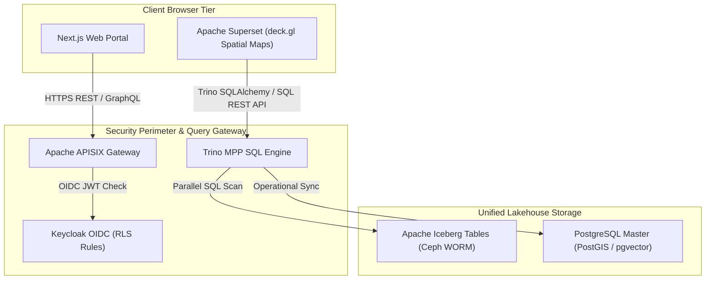

#### 3. Summary Interface & Routing Table

| Source Component | Target Component | Port / Protocol / API Ingress | Security Boundary / Access Key | Operational Significance / Flow Description |
| :--- | :--- | :--- | :--- | :--- |
| **Next.js Web Portal** | **APISIX Gateway** | `TCP 443` / HTTPS REST | Keycloak Bearer JWT Token | Routes authenticated user requests to microservices and PostGIS endpoints. |
| **APISIX Gateway** | **Keycloak OIDC IAM** | `TCP 8443` / HTTPS OIDC | OAuth2 Realm Keys | Validates client bearer tokens and checks user roles before forwarding web requests. |
| **Apache Superset** | **Trino MPP Engine** | `TCP 8080` / SQL REST API (HTTPS/TLS with Certificate Validation) | OAuth2 RLS Scopes | Executes federated SQL spatial queries over HTTPS/TLS with certificate validation and renders hardware-accelerated `deck.gl` maps. |
| **Trino MPP Engine** | **Apache Iceberg Tables** | `TCP 8181` / Iceberg REST API | Keycloak Client Credentials | Queries and scans versioned Parquet table snapshots managed by Apache Polaris. |
| **Trino MPP Engine** | **PostgreSQL Master** | `TCP 5432` / PostgreSQL TLS 1.3 | mTLS Certificate / DB Service Key | Synchronizes operational spatial and vector metadata with PostgreSQL PostGIS/pgvector. |

---

## 2. Web Portal & Visualization Tier Modernization

### Web Portal Architecture (Next.js & APISIX)

The presentation and access tier is modernized by retiring legacy CMS and monolithic web application servers. They are replaced by a modern, decoupled web application developed using **Next.js / React** deployed in containerized environments behind **Apache APISIX**. The frontend communicates with backend services through secure GraphQL and REST APIs, using **Keycloak** for unified Single Sign-On across all user roles.

### Business Intelligence Overhaul (Apache Superset)

Proprietary BI server infrastructure—including worker nodes, load balancers, and desktop authoring licenses—is replaced by **Apache Superset**, an enterprise open-source business intelligence and data exploration platform.

- **Direct Trino Integration:** Apache Superset connects natively to Trino via SQLAlchemy, executing distributed queries directly over Apache Iceberg tables without per-seat licensing fees.
- **Geospatial Analytics with deck.gl:** For geospatial analytics, Superset natively integrates `deck.gl` visualization libraries, enabling hardware-accelerated rendering of complex spatial layers—including choropleths, point clusters, heatmaps, and 3D terrain grids—directly from GeoParquet and PostGIS geometries.
- **Row-Level Security (RLS):** Superset's Row-Level Security policies restrict spatial views based on Keycloak user roles, ensuring that department officers access only the geographic zones and data assets within their authorized administrative scope.

---

## 3. Implementation Step-by-Step

### Step 1: Deploy NiFi & Airflow Ingestion Flows

1. Configure NiFi processors to ingest telemetry via HTTPS streams and poll thermal anomaly REST APIs on schedule.
2. Embed `data-contract` CLI validation gates within NiFi processor flows and Airflow DAG entry points. Payloads failing validation are diverted to quarantine queues.

### Step 2: Configure Next.js Application & APISIX Routing

1. Containerize the Next.js web application and deploy behind APISIX.
2. Bind Keycloak OIDC authentication plugins in APISIX to secure `/api/*` endpoints.

### Step 3: Configure Apache Superset Dashboards & RLS

1. Connect Superset to Trino via SQLAlchemy URI (`trino://trino.internal.domain:8443/iceberg`).
2. Implement deck.gl spatial layers for hazard risk maps and active thermal risk grids.
3. Configure Row-Level Security (RLS) rules mapped to Keycloak domain roles.


---


# How-To Guide: Onboarding and Scaling New AI/ML Business Cases

This guide provides data engineers, AI practitioners, and domain managers with a step-by-step operational procedure for rapidly prototyping, sandboxing, validating, and deploying new **Machine Learning (ML) and Artificial Intelligence (AI)** business cases onto the BDA Single Source of Truth (SSoT) Lakehouse.

---

## 🏛️ 6-Stage AI/ML Onboarding Pipeline Topology

The diagram below details the 6-stage operational pipeline for onboarding new AI business cases, maintaining strict zero-trust quarantine and human sign-off.

### 1. Standalone Production-Ready SVG Vector Graphic (`.svg`)

<svg xmlns="http://www.w3.org/2000/svg" viewBox="0 0 960 420" width="100%" height="100%">
  <defs>
    <marker id="arrow-onb" viewBox="0 0 10 10" refX="6" refY="5" markerWidth="6" markerHeight="6" orient="auto-start-reverse">
      <path d="M 0 0 L 10 5 L 0 10 z" fill="#64748B" />
    </marker>
    <filter id="shadow-onb" x="-4%" y="-4%" width="108%" height="108%">
      <feDropShadow dx="0" dy="2" stdDeviation="3" flood-color="#000000" flood-opacity="0.25"/>
    </filter>
  </defs>

  <!-- Background -->
  <rect width="960" height="420" fill="#0F172A" rx="10"/>

  <!-- Stage 1 Box -->
  <rect x="20" y="20" width="280" height="110" fill="#1E293B" stroke="#38BDF8" stroke-width="1.5" rx="8" filter="url(#shadow-onb)"/>
  <rect x="20" y="20" width="280" height="26" fill="#0369A1" rx="8"/>
  <text x="30" y="38" font-family="-apple-system, BlinkMacSystemFont, 'Segoe UI', Roboto, sans-serif" font-size="11" font-weight="bold" fill="#E0F2FE">STAGE 1: CONTRACT FORMULATION</text>
  <text x="30" y="62" font-family="-apple-system, BlinkMacSystemFont, 'Segoe UI', Roboto, sans-serif" font-size="12" font-weight="bold" fill="#38BDF8">Bitol ODCS v3.1.0 Contract</text>
  <text x="30" y="82" font-family="Consolas, Monaco, monospace" font-size="10" fill="#7DD3FC">YAML Schema &amp; Quality Rules</text>
  <text x="30" y="100" font-family="-apple-system, BlinkMacSystemFont, 'Segoe UI', Roboto, sans-serif" font-size="11" fill="#E2E8F0">• Local Contract CLI Validation</text>

  <!-- Stage 2 Box -->
  <rect x="340" y="20" width="280" height="110" fill="#1E293B" stroke="#3B82F6" stroke-width="1.5" rx="8" filter="url(#shadow-onb)"/>
  <rect x="340" y="20" width="280" height="26" fill="#1E3A8A" rx="8"/>
  <text x="350" y="38" font-family="-apple-system, BlinkMacSystemFont, 'Segoe UI', Roboto, sans-serif" font-size="11" font-weight="bold" fill="#93C5FD">STAGE 2: CATALOG &amp; INGESTION</text>
  <text x="350" y="62" font-family="-apple-system, BlinkMacSystemFont, 'Segoe UI', Roboto, sans-serif" font-size="12" font-weight="bold" fill="#60A5FA">Apache NiFi &amp; OpenMetadata</text>
  <text x="350" y="82" font-family="Consolas, Monaco, monospace" font-size="10" fill="#93C5FD">Polaris REST Namespace Provisioning</text>
  <text x="350" y="100" font-family="-apple-system, BlinkMacSystemFont, 'Segoe UI', Roboto, sans-serif" font-size="11" fill="#E2E8F0">• Ingress Validation &amp; Classification</text>

  <!-- Stage 3 Box -->
  <rect x="660" y="20" width="280" height="110" fill="#1E293B" stroke="#A855F7" stroke-width="1.5" rx="8" filter="url(#shadow-onb)"/>
  <rect x="660" y="20" width="280" height="26" fill="#581C87" rx="8"/>
  <text x="670" y="38" font-family="-apple-system, BlinkMacSystemFont, 'Segoe UI', Roboto, sans-serif" font-size="11" font-weight="bold" fill="#E9D5FF">STAGE 3: TIER 2 AI SANDBOXING</text>
  <text x="670" y="62" font-family="-apple-system, BlinkMacSystemFont, 'Segoe UI', Roboto, sans-serif" font-size="12" font-weight="bold" fill="#C084FC">Feature Store &amp; Local Embeddings</text>
  <text x="670" y="82" font-family="Consolas, Monaco, monospace" font-size="10" fill="#E9D5FF">DuckDB vss / MLflow Tracking</text>
  <text x="670" y="100" font-family="-apple-system, BlinkMacSystemFont, 'Segoe UI', Roboto, sans-serif" font-size="11" fill="#E2E8F0">• 30-Day Auto-Purge TTL</text>

  <!-- Stage 4 Box -->
  <rect x="660" y="155" width="280" height="110" fill="#1E293B" stroke="#22C55E" stroke-width="1.5" rx="8" filter="url(#shadow-onb)"/>
  <rect x="660" y="155" width="280" height="26" fill="#065F46" rx="8"/>
  <text x="670" y="173" font-family="-apple-system, BlinkMacSystemFont, 'Segoe UI', Roboto, sans-serif" font-size="11" font-weight="bold" fill="#86EFAC">STAGE 4: VERIFICATION &amp; SIGN-OFF</text>
  <text x="670" y="197" font-family="-apple-system, BlinkMacSystemFont, 'Segoe UI', Roboto, sans-serif" font-size="12" font-weight="bold" fill="#4ADE80">Human Domain Expert Audit</text>
  <text x="670" y="217" font-family="Consolas, Monaco, monospace" font-size="10" fill="#86EFAC">OpenLineage nres_provenance Facet</text>
  <text x="670" y="235" font-family="-apple-system, BlinkMacSystemFont, 'Segoe UI', Roboto, sans-serif" font-size="11" fill="#E2E8F0">• Cryptographic Signing to Tier 0</text>

  <!-- Stage 5 Box -->
  <rect x="340" y="155" width="280" height="110" fill="#1E293B" stroke="#F59E0B" stroke-width="1.5" rx="8" filter="url(#shadow-onb)"/>
  <rect x="340" y="155" width="280" height="26" fill="#78350F" rx="8"/>
  <text x="350" y="173" font-family="-apple-system, BlinkMacSystemFont, 'Segoe UI', Roboto, sans-serif" font-size="11" font-weight="bold" fill="#FDE68A">STAGE 5: PRODUCTION DEPLOYMENT</text>
  <text x="350" y="197" font-family="-apple-system, BlinkMacSystemFont, 'Segoe UI', Roboto, sans-serif" font-size="12" font-weight="bold" fill="#FBBF24">vLLM / Ollama Container &amp; APISIX</text>
  <text x="350" y="217" font-family="Consolas, Monaco, monospace" font-size="10" fill="#FDE68A">Keycloak OIDC &amp; Rate Limiting</text>
  <text x="350" y="235" font-family="-apple-system, BlinkMacSystemFont, 'Segoe UI', Roboto, sans-serif" font-size="11" fill="#E2E8F0">• Apache Superset Spatial Map</text>

  <!-- Stage 6 Box -->
  <rect x="20" y="155" width="280" height="110" fill="#1E293B" stroke="#EC4899" stroke-width="1.5" rx="8" filter="url(#shadow-onb)"/>
  <rect x="20" y="155" width="280" height="26" fill="#831843" rx="8"/>
  <text x="30" y="173" font-family="-apple-system, BlinkMacSystemFont, 'Segoe UI', Roboto, sans-serif" font-size="11" font-weight="bold" fill="#FBCFE8">STAGE 6: OTEL LIFECYCLE MONITORING</text>
  <text x="30" y="197" font-family="-apple-system, BlinkMacSystemFont, 'Segoe UI', Roboto, sans-serif" font-size="12" font-weight="bold" fill="#F472B6">OpenTelemetry Collector &amp; Grafana</text>
  <text x="30" y="217" font-family="Consolas, Monaco, monospace" font-size="10" fill="#FBCFE8">Inference Latency &amp; Concept Drift</text>
  <text x="30" y="235" font-family="-apple-system, BlinkMacSystemFont, 'Segoe UI', Roboto, sans-serif" font-size="11" fill="#E2E8F0">• SLA Alerts &amp; Continuous Retraining</text>

  <!-- Connectors -->
  <line x1="300" y1="75" x2="340" y2="75" stroke="#64748B" stroke-width="2" marker-end="url(#arrow-onb)"/>
  <line x1="620" y1="75" x2="660" y2="75" stroke="#64748B" stroke-width="2" marker-end="url(#arrow-onb)"/>
  <line x1="800" y1="130" x2="800" y2="155" stroke="#64748B" stroke-width="2" marker-end="url(#arrow-onb)"/>
  <line x1="660" y1="210" x2="620" y2="210" stroke="#64748B" stroke-width="2" marker-end="url(#arrow-onb)"/>
  <line x1="340" y1="210" x2="300" y2="210" stroke="#64748B" stroke-width="2" marker-end="url(#arrow-onb)"/>
</svg>

### 2. Git-Native Mermaid Topology (`.mmd`)

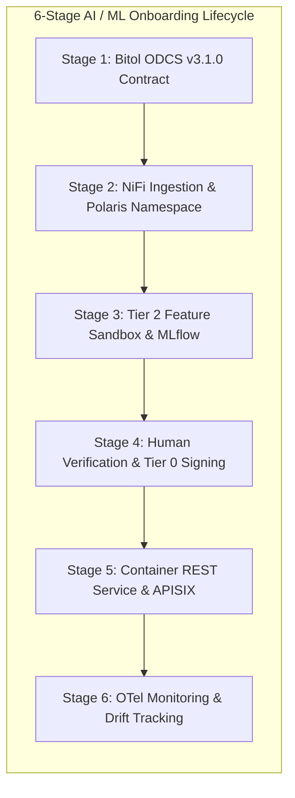

### 3. Summary Interface & Routing Table

| Source Component | Target Component | Port / Protocol / API Ingress | Security Boundary / Access Key | Operational Significance / Flow Description |
| :--- | :--- | :--- | :--- | :--- |
| **Contract Linter** | **Apache NiFi Ingestion** | Local CLI / `TCP 8443` | ODCS Contract Spec | Ensures incoming training telemetry matches schema bounds before pipeline entry. |
| **Feature Extractor** | **Tier 2 AI Sandbox** | S3 API / `s3://bda-tier2-ai-sandbox` | S3 IAM Vended Token | Stores intermediate feature matrices in ephemeral storage with 30-day auto-purge TTL. |
| **Inference Container** | **APISIX Gateway** | `TCP 8000` / HTTPS REST | Keycloak OAuth2 JWT | Exposes model predictions securely behind rate-limiting and OTel tracing filters. |

---

## The 6-Stage Lifecycle Blueprint

To maintain zero-trust security and data sovereignty while encouraging rapid AI innovation, every new AI business case follows a mandatory 6-stage operational pipeline:

```
[ Stage 1: Contract Formulation ] ──> [ Stage 2: Catalog & Ingestion ] ──> [ Stage 3: Tier 2 AI Sandboxing ]
                                                                                   │
[ Stage 6: OTel Lifecycle Monitoring ] <── [ Stage 5: Production Deployment ] <── [ Stage 4: Verification & Sign-Off ]
```

---

## Step-by-Step Execution Guide

### Stage 1: Business Case Definition & ODCS Contract Formulation

1. **Define Business Objectives & Metrics:** Document the core mandate, targeted domain (e.g., deforestation detection, disaster dispatching), required prediction frequency, and key performance indicators (KPIs).
2. **Formulate ODCS v3.1.0 Data Contract:** Create a YAML specification defining input schema requirements, acceptable field bounds, spatial coordinate systems (`EPSG:4326` or `EPSG:3168`), and data quality rules.

   ```yaml
   # example-ai-business-case-contract.yaml
   apiVersion: v3.1.0
   kind: DataContract
   id: contract-deforestation-alert-v1
   version: 1.0.0
   dataset: raw_deforestation_canopy_telemetry
   domain: Environmental_Monitoring
   owner: domain_specialist_team
   schema:
     deforestation_canopy_telemetry:
       logicalType: object
       properties:
         image_id:
           logicalType: string
           required: true
         acquisition_timestamp:
           logicalType: timestamp
           required: true
         canopy_loss_percentage:
           logicalType: number
           required: true
           logicalTypeOptions:
             minimum: 0.0
             maximum: 100.0
         geometry_wkt:
           logicalType: string
           required: true
   ```

3. **Validate Contract:** Run the local contract linter via CLI:
   ```bash
   datacontract lint example-ai-business-case-contract.yaml
   ```

---

### Stage 2: Ingestion Pipeline & Catalog Registration

1. **Provision Ingestion Pipeline in Apache NiFi:** Configure a NiFi process group to ingest incoming telemetry (REST API, Webhook, or S3 bucket notification) and route records through the ODCS contract validation processor.
2. **Register Metadata in OpenMetadata:** Attach domain tags, classification tags (`Classification.Internal`, `Domain.Forestry`), and security classifications.
3. **Configure Polaris REST Catalog Namespace:** Register the target Apache Iceberg namespace under Apache Polaris using HTTPS with TLS certificate verification over secure internal networks (e.g. `https://polaris.internal:8182/api/catalog/v1/{catalog}/namespaces`). Where mTLS service mesh sidecars (e.g., Linkerd or Istio) secure this internal endpoint, explicit cryptographic identity verification is enforced alongside the bearer token:
   ```bash
   # Register namespace via Polaris REST API over HTTPS with catalog identifier 'bda_catalog'
   curl -X POST https://polaris.internal:8182/api/catalog/v1/bda_catalog/namespaces \
     -H "Authorization: Bearer ${POLARIS_TOKEN}" \
     -H "Content-Type: application/json" \
     -d '{"namespace": ["environmental", "deforestation"]}'
   ```

---

### Stage 3: Feature Engineering & Tier 2 AI Sandboxing

1. **Target Tier 2 Scratch Buckets:** Configure feature extraction pipelines (Apache Spark / Sedona or DuckDB) to write intermediate datasets exclusively to Tier 2 Object Storage (`s3://bda-tier2-ai-sandbox/`).
   *Note: Tier 2 storage enforces an automated 30-day auto-purge TTL.*
2. **Generate Local Vector Embeddings:** Run zero-trust local embedding extraction on metadata and schema descriptions using local sentence transformers (`all-MiniLM-L6-v2`), materializing vector embeddings into DuckDB `vss` fixed-size `ARRAY` columns or `pgvector` tables.
3. **MLflow Experiment Tracking:** Log training parameters, metrics, and model artifacts into the local MLflow registry:
   ```python
   import mlflow

   mlflow.set_tracking_uri("http://mlflow.internal:5000")
   mlflow.set_experiment("deforestation_detection_v1")

   with mlflow.start_run():
       mlflow.log_param("model_type", "RandomForestSpatial")
       mlflow.log_metric("f1_score", 0.942)
       mlflow.sklearn.log_model(model, "model")
   ```

---

### Stage 4: Model Validation & Human Cryptographic Sign-Off

1. **Verify Human-to-AI Quarantine Boundary:** Confirm that model outputs are tagged with the custom OpenLineage facet `nres_provenance`:
   ```json
   {
     "nres_provenance": {
       "origin_type": "AI_SANDBOX_MODEL_OUTPUT",
       "verification_tier": "TIER_2_SANDBOX",
       "ai_generated_data": true,
       "payload_sha256": "8f4e2b..."
     }
   }
   ```
2. **Domain Specialist Review:** Domain experts inspect model predictions, precision/recall curves, and spatial heatmaps.
3. **Cryptographic Promotion to Tier 0 SSoT:** Once approved, the authorized specialist signs the record payload using their private key. The pipeline then commits the golden dataset into Tier 0 WORM storage (`s3://bda-tier0-golden/`).

---

### Stage 5: Production Container Deployment & APISIX API Exposure

1. **Deploy Local Inference Endpoint:** Package the validated ML model into a containerized REST service (vLLM, Ollama, or Triton Inference Server) running in the production Kubernetes cluster.
2. **Register Route in Apache APISIX Gateway:** Configure APISIX to proxy API traffic to the inference endpoint, attaching Keycloak OIDC authentication and rate-limiting plugins:
   ```json
   {
     "uri": "/api/v1/predict/deforestation",
     "plugins": {
       "openid-connect": {
         "client_id": "bda-ai-service",
         "discovery": "http://keycloak:8080/realms/bda/.well-known/openid-configuration"
       },
       "limit-req": {
         "rate": 100,
         "burst": 20,
         "key": "remote_addr"
       },
       "opentelemetry": {
         "sampler": { "type": "always_on" }
       }
     },
     "upstream": {
       "type": "roundrobin",
       "nodes": { "deforestation-inference-svc:8000": 1 }
     }
   }
   ```
3. **Integrate with Apache Superset:** Create custom deck.gl spatial visualization layers or dashboards connected via Trino to present real-time model predictions.

---

### Stage 6: Full-Stack OTel Monitoring & Drift Management

1. **Attach OpenTelemetry Collector:** Ensure the inference container emits OTLP metrics, traces, and logs.
2. **Monitor Drift in Grafana:** Track key operational metrics across Grafana dashboards:
   - **Data Drift & Concept Drift:** Monitor input feature distribution shifts vs. baseline training data.
   - **Inference Latency:** Target SLA < 200ms for REST scoring API endpoints.
   - **Error & Anomaly Rates:** Alert operators if model prediction confidence drops below configured thresholds.

---

## Onboarding Checklist

| Verification Checklist Item | Primary Tool / Platform | Status |
| :--- | :--- | :--- |
| **1. ODCS v3.1.0 Contract Defined & Validated** | Data Contract CLI / `mcp-contract-linter` | [ ] Completed |
| **2. Asset Registered in OpenMetadata Catalog** | OpenMetadata SSoT Catalog | [ ] Completed |
| **3. Polaris REST Catalog Namespace Provisioned** | Apache Polaris REST Catalog | [ ] Completed |
| **4. Ingestion Pipeline & NiFi Flow Deployed** | Apache NiFi | [ ] Completed |
| **5. ML Features Written to Tier 2 Sandbox** | S3 Tier 2 Bucket (30-day TTL) | [ ] Completed |
| **6. Local Vector Embeddings Materialized** | DuckDB `vss` / `pgvector` | [ ] Completed |
| **7. Human Cryptographic Verification Completed** | Tier 0 Compliance Lock Promotion | [ ] Completed |
| **8. APISIX API Gateway & Keycloak SSO Configured** | Apache APISIX / Keycloak IAM | [ ] Completed |
| **9. OTel Instrumentation & Grafana Alerts Live** | OpenTelemetry Collector / Grafana | [ ] Completed |


---


# Phased Migration Strategy and Implementation Roadmap

Transitioning mission-critical infrastructure supporting continuous environmental and disaster monitoring—such as landslide hazard alerts and forest fire tracking—requires an incremental migration strategy that ensures business continuity throughout the transition.

---

## 🏛️ 4-Phase Migration Roadmap & Dual-Run Ingestion Topology

The diagram below outlines the 4-phase migration execution flow, demonstrating parallel dual-run ingestion and zero-downtime cutover.

### 1. Standalone Production-Ready SVG Vector Graphic (`.svg`)

<svg xmlns="http://www.w3.org/2000/svg" viewBox="0 0 960 420" width="100%" height="100%">
  <defs>
    <marker id="arrow-mig" viewBox="0 0 10 10" refX="6" refY="5" markerWidth="6" markerHeight="6" orient="auto-start-reverse">
      <path d="M 0 0 L 10 5 L 0 10 z" fill="#64748B" />
    </marker>
    <filter id="shadow-mig" x="-4%" y="-4%" width="108%" height="108%">
      <feDropShadow dx="0" dy="2" stdDeviation="3" flood-color="#000000" flood-opacity="0.25"/>
    </filter>
  </defs>

  <!-- Background -->
  <rect width="960" height="420" fill="#0F172A" rx="10"/>

  <!-- Phase 1 Card -->
  <rect x="20" y="20" width="215" height="380" fill="#1E293B" stroke="#38BDF8" stroke-width="1.5" rx="8" filter="url(#shadow-mig)"/>
  <rect x="20" y="20" width="215" height="26" fill="#0369A1" rx="8"/>
  <text x="30" y="38" font-family="-apple-system, BlinkMacSystemFont, 'Segoe UI', Roboto, sans-serif" font-size="11" font-weight="bold" fill="#E0F2FE">PHASE 1: MONTHS 1–3</text>
  <text x="30" y="65" font-family="-apple-system, BlinkMacSystemFont, 'Segoe UI', Roboto, sans-serif" font-size="13" font-weight="bold" fill="#38BDF8">Foundation &amp; Dual-Run</text>
  <text x="30" y="90" font-family="-apple-system, BlinkMacSystemFont, 'Segoe UI', Roboto, sans-serif" font-size="11" fill="#E2E8F0">• Deploy Ceph / MinIO</text>
  <text x="30" y="110" font-family="-apple-system, BlinkMacSystemFont, 'Segoe UI', Roboto, sans-serif" font-size="11" fill="#E2E8F0">• WORM Compliance Lock</text>
  <text x="30" y="130" font-family="-apple-system, BlinkMacSystemFont, 'Segoe UI', Roboto, sans-serif" font-size="11" fill="#E2E8F0">• Polaris &amp; OpenMetadata</text>
  <text x="30" y="150" font-family="-apple-system, BlinkMacSystemFont, 'Segoe UI', Roboto, sans-serif" font-size="11" fill="#E2E8F0">• NiFi Mirrored Feeds</text>

  <!-- Phase 2 Card -->
  <rect x="255" y="20" width="215" height="380" fill="#1E293B" stroke="#3B82F6" stroke-width="1.5" rx="8" filter="url(#shadow-mig)"/>
  <rect x="255" y="20" width="215" height="26" fill="#1E3A8A" rx="8"/>
  <text x="265" y="38" font-family="-apple-system, BlinkMacSystemFont, 'Segoe UI', Roboto, sans-serif" font-size="11" font-weight="bold" fill="#93C5FD">PHASE 2: MONTHS 4–6</text>
  <text x="265" y="65" font-family="-apple-system, BlinkMacSystemFont, 'Segoe UI', Roboto, sans-serif" font-size="13" font-weight="bold" fill="#60A5FA">Compute Modernization</text>
  <text x="265" y="90" font-family="-apple-system, BlinkMacSystemFont, 'Segoe UI', Roboto, sans-serif" font-size="11" fill="#E2E8F0">• Trino &amp; Spark Sedona</text>
  <text x="265" y="110" font-family="-apple-system, BlinkMacSystemFont, 'Segoe UI', Roboto, sans-serif" font-size="11" fill="#E2E8F0">• ODCS Data Contracts</text>
  <text x="265" y="130" font-family="-apple-system, BlinkMacSystemFont, 'Segoe UI', Roboto, sans-serif" font-size="11" fill="#E2E8F0">• HDFS to Iceberg Parquet</text>
  <text x="265" y="150" font-family="-apple-system, BlinkMacSystemFont, 'Segoe UI', Roboto, sans-serif" font-size="11" fill="#E2E8F0">• OpenLineage Hooks</text>

  <!-- Phase 3 Card -->
  <rect x="490" y="20" width="215" height="380" fill="#1E293B" stroke="#22C55E" stroke-width="1.5" rx="8" filter="url(#shadow-mig)"/>
  <rect x="490" y="20" width="215" height="26" fill="#065F46" rx="8"/>
  <text x="500" y="38" font-family="-apple-system, BlinkMacSystemFont, 'Segoe UI', Roboto, sans-serif" font-size="11" font-weight="bold" fill="#86EFAC">PHASE 3: MONTHS 7–9</text>
  <text x="500" y="65" font-family="-apple-system, BlinkMacSystemFont, 'Segoe UI', Roboto, sans-serif" font-size="13" font-weight="bold" fill="#4ADE80">AI Sandbox &amp; OTel</text>
  <text x="500" y="90" font-family="-apple-system, BlinkMacSystemFont, 'Segoe UI', Roboto, sans-serif" font-size="11" fill="#E2E8F0">• Containerized FastMCP</text>
  <text x="500" y="110" font-family="-apple-system, BlinkMacSystemFont, 'Segoe UI', Roboto, sans-serif" font-size="11" fill="#E2E8F0">• Read-Only DB Roles</text>
  <text x="500" y="130" font-family="-apple-system, BlinkMacSystemFont, 'Segoe UI', Roboto, sans-serif" font-size="11" fill="#E2E8F0">• DuckDB vss &amp; pgvector</text>
  <text x="500" y="150" font-family="-apple-system, BlinkMacSystemFont, 'Segoe UI', Roboto, sans-serif" font-size="11" fill="#E2E8F0">• OpenTelemetry Collectors</text>

  <!-- Phase 4 Card -->
  <rect x="725" y="20" width="215" height="380" fill="#1E293B" stroke="#F59E0B" stroke-width="1.5" rx="8" filter="url(#shadow-mig)"/>
  <rect x="725" y="20" width="215" height="26" fill="#78350F" rx="8"/>
  <text x="735" y="38" font-family="-apple-system, BlinkMacSystemFont, 'Segoe UI', Roboto, sans-serif" font-size="11" font-weight="bold" fill="#FDE68A">PHASE 4: MONTHS 10–12</text>
  <text x="735" y="65" font-family="-apple-system, BlinkMacSystemFont, 'Segoe UI', Roboto, sans-serif" font-size="13" font-weight="bold" fill="#FBBF24">Presentation &amp; Cutover</text>
  <text x="735" y="90" font-family="-apple-system, BlinkMacSystemFont, 'Segoe UI', Roboto, sans-serif" font-size="11" fill="#E2E8F0">• Apache Superset BI</text>
  <text x="735" y="110" font-family="-apple-system, BlinkMacSystemFont, 'Segoe UI', Roboto, sans-serif" font-size="11" fill="#E2E8F0">• Next.js + APISIX Gateway</text>
  <text x="735" y="130" font-family="-apple-system, BlinkMacSystemFont, 'Segoe UI', Roboto, sans-serif" font-size="11" fill="#E2E8F0">• 30-Day Operational Run</text>
  <text x="735" y="150" font-family="-apple-system, BlinkMacSystemFont, 'Segoe UI', Roboto, sans-serif" font-size="11" fill="#E2E8F0">• Legacy Decommissioning</text>

  <!-- Flow Arrows between Cards -->
  <line x1="235" y1="200" x2="255" y2="200" stroke="#64748B" stroke-width="2" marker-end="url(#arrow-mig)"/>
  <line x1="470" y1="200" x2="490" y2="200" stroke="#64748B" stroke-width="2" marker-end="url(#arrow-mig)"/>
  <line x1="705" y1="200" x2="725" y2="200" stroke="#64748B" stroke-width="2" marker-end="url(#arrow-mig)"/>
</svg>

### 2. Git-Native Mermaid Topology (`.mmd`)

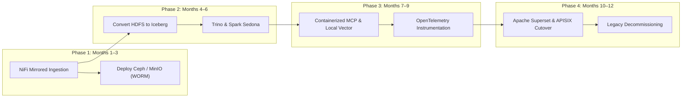

### 3. Summary Interface & Routing Table

| Source Component | Target Component | Port / Protocol / API Ingress | Security Boundary / Access Key | Operational Significance / Flow Description |
| :--- | :--- | :--- | :--- | :--- |
| **Apache NiFi (Phase 1)** | **Ceph / MinIO Store** | `TCP 8080` (Ceph RGW) / `TCP 9000` (MinIO) S3 API | NiFi mTLS Cert / S3 Access Key | Mirrors production data streams without interrupting legacy workflows into S3 WORM storage. |
| **Spark Sedona (Phase 2)** | **Apache Iceberg Table** | AWS Glue / Polaris REST | Spark IAM Role | Converts raw HDFS/GlusterFS files into versioned Iceberg Parquet snapshots. |
| **APISIX / Superset (Phase 4)** | **User Web Browser** | `TCP 443` / HTTPS TLS 1.3 | Keycloak OAuth2 JWT | Replaces proprietary BI and legacy CMS with open-source dashboards. |

---

## 4-Phase Implementation Summary Timeline

```
Phase 1: Foundation Setup and Dual-Run Ingestion (Months 1–3)
└── Deploy Ceph/MinIO with S3 Object Lock; stand up Polaris and OpenMetadata
└── Deploy Apache NiFi to mirror external feeds into object storage
└── Run mirrored ingestion alongside legacy systems without operational impact

Phase 2: Compute Modernization and Data Contract Enforcement (Months 4–6)
└── Deploy Trino, Apache Spark, and Apache Sedona compute clusters
└── Formalize ODCS v3.1.0 data contracts across all domain modules
└── Execute parallel Spark jobs to migrate legacy data into Apache Iceberg format
└── Integrate OpenLineage runtime emission across Airflow DAGs

Phase 3: AI Operational Sandboxing, Local Vector Search & OpenTelemetry (Months 7–9)
└── Deploy containerized MCP servers with read-only database connections
└── Integrate DuckDB vss and pgvector with OpenMetadata for local zero-trust semantic search
└── Instrument Airflow DAGs, Spark jobs, and APISIX routes with OpenTelemetry collectors
└── Restrict AI interactions to operational tooling and schema discovery
└── Enforce cryptographic verification gates for promoting data to Tier 0

Phase 4: Presentation Cutover and Legacy Decommissioning (Months 10–12)
└── Deploy Apache Superset and migrate legacy BI dashboards to deck.gl views
└── Launch containerized Next.js web application behind APISIX and Keycloak
└── Validate 30-day parallel operational run across all domain modules
└── Decommission legacy Hadoop, GlusterFS, relational stores, and BI servers
```

---

## Phase Detailed Execution Plan

### Phase 1: Foundation Setup and Dual-Run Ingestion (Months 1–3)

- **Actions:** Provision Ceph or MinIO distributed object storage on bare-metal hardware with S3 Object Lock immutability enabled. Deploy Apache Polaris and OpenMetadata catalogs. Position Apache NiFi at the network boundary to mirror incoming precipitation streams and satellite thermal anomaly data into object storage while preserving legacy pipelines.
- **Goal:** Establish zero-impact parallel ingestion without altering production legacy operations.

### Phase 2: Compute Modernization and Data Contract Enforcement (Months 4–6)

- **Actions:** Deploy Trino and Apache Spark/Sedona clusters integrated with the Polaris catalog. Formalize ODCS v3.1.0 data contracts across all analytical domain modules. Execute parallel Spark batch jobs to convert historical datasets from HDFS, GlusterFS, and relational stores into Apache Iceberg table formats. Validate row counts and SHA-256 checksums. Instrument Airflow orchestrators with OpenLineage hooks.

### Phase 3: AI Operational Sandboxing, Local Vector Search & OpenTelemetry (Months 7–9)

- **Actions:** Deploy containerized MCP servers (`mcp-catalog-context`, `mcp-trino-query-gen`, `mcp-pipeline-monitor`) in isolated DMZ environments using read-only database roles. Provision Tier 2 AI sandbox object storage with automated 30-day TTL purges. Integrate DuckDB `vss` and `pgvector` with OpenMetadata to power zero-trust local semantic search & Hybrid RAG across the BDA SSoT without external network egress. Deploy OpenTelemetry Collectors to collect traces, metrics, and logs from Airflow DAGs, Spark jobs, and APISIX routes, routing metrics to Prometheus, traces to Grafana Tempo, and logs to Grafana Loki connected to Grafana dashboards. Conduct rigorous boundary testing to confirm AI models cannot execute unauthorized writes or alter Tier 0 records.

### Phase 4: Presentation Cutover and Legacy Decommissioning (Months 10–12)

- **Actions:** Deploy Apache Superset and rebuild legacy BI dashboards using native Superset controls and deck.gl geospatial layers. Launch Next.js web application behind APISIX and Keycloak SSO. Execute a 30-day parallel run to validate data consistency, alert latency, and system performance. Upon formal sign-off, decommission legacy Hadoop, GlusterFS, relational instances, and proprietary BI server licenses.

---

## Phased Risk Mitigation & Technical Fallback Matrix

| Implementation Phase | Target Legacy Subsystems | Modern Open-Source Replacements | Operational Risk Factors | Technical Mitigation & Fallback Procedures |
| :--- | :--- | :--- | :--- | :--- |
| **Phase 1: Foundation & Dual Ingestion** (Months 1–3) | Point-to-point SFTP, local folder shares, manual email ingestion. | Ceph / MinIO (WORM), Apache Polaris, OpenMetadata, Apache NiFi. | Upstream format modifications during mirroring; network saturation at boundary. | Operate NiFi in non-intrusive listening mode; legacy production paths remain authoritative; allocate isolated NICs. |
| **Phase 2: Compute & Contract Migration** (Months 4–6) | Hadoop HDFS, GlusterFS, relational project stores, WildFly. | Apache Iceberg, Trino, Apache Spark + Sedona, Data Contract CLI. | Data truncation or encoding errors during historical Iceberg Parquet conversions. | Execute automated row-count and partition checksum verifications; preserve raw source stores in read-only mode. |
| **Phase 3: AI Sandboxing, Local RAG & OTel Deploy** (Months 7–9) | Unmonitored administrative scripts, ad-hoc Python workflows, legacy StatsD/JMX exporters. | Model Context Protocol servers, Keycloak IAM, Tier 2 Sandbox, DuckDB `vss`, `pgvector`, OpenTelemetry Collectors. | Over-privileged AI agents attempting schema adjustments; WAN data leakage from cloud vector services; broken trace context. | Enforce read-only database connections; run local embedding models with zero egress; standardize W3C trace context across APISIX and OTel collectors. |
| **Phase 4: Cutover & Decommissioning** (Months 10–12) | Proprietary BI server cluster, legacy CMS, web portal. | Apache Superset (deck.gl), Next.js / React portal, Apache APISIX. | Discrepancies between legacy BI and Superset spatial maps; user resistance to new UI. | Run 30-day side-by-side verification runs; validate geospatial rendering against PostGIS base layers; conduct user training. |


---


# 🌐 Multi-Platform Documentation Hosting Guide

This project supports seamless multi-platform hosting across GitHub Pages, GitLab Pages, GitBook, and ReadTheDocs.

---

## 🏛️ Multi-Platform Documentation Publishing Topology

The diagram below details the continuous integration and multi-host deployment pipeline across GitHub Pages, GitLab Pages, GitBook, and ReadTheDocs.

### 1. Standalone Production-Ready SVG Vector Graphic (`.svg`)

<svg xmlns="http://www.w3.org/2000/svg" viewBox="0 0 960 400" width="100%" height="100%">
  <defs>
    <marker id="arrow-host" viewBox="0 0 10 10" refX="6" refY="5" markerWidth="6" markerHeight="6" orient="auto-start-reverse">
      <path d="M 0 0 L 10 5 L 0 10 z" fill="#64748B" />
    </marker>
    <filter id="shadow-host" x="-4%" y="-4%" width="108%" height="108%">
      <feDropShadow dx="0" dy="2" stdDeviation="3" flood-color="#000000" flood-opacity="0.25"/>
    </filter>
  </defs>

  <!-- Background -->
  <rect width="960" height="400" fill="#0F172A" rx="10"/>

  <!-- Repository Source Tier -->
  <rect x="20" y="20" width="920" height="80" fill="#1E293B" stroke="#334155" stroke-width="1.5" rx="8" filter="url(#shadow-host)"/>
  <rect x="20" y="20" width="920" height="26" fill="#0F172A" rx="8"/>
  <text x="35" y="38" font-family="-apple-system, BlinkMacSystemFont, 'Segoe UI', Roboto, sans-serif" font-size="12" font-weight="bold" fill="#60A5FA">SOURCE REPOSITORY &amp; NAVIGATION GENERATOR</text>

  <rect x="40" y="52" width="430" height="38" fill="#1E3A8A" stroke="#3B82F6" rx="4"/>
  <text x="50" y="75" font-family="-apple-system, BlinkMacSystemFont, 'Segoe UI', Roboto, sans-serif" font-size="12" font-weight="bold" fill="#93C5FD">Markdown Docs (OKF v0.2) + SUMMARY.md</text>

  <rect x="490" y="52" width="430" height="38" fill="#065F46" stroke="#22C55E" rx="4"/>
  <text x="500" y="75" font-family="-apple-system, BlinkMacSystemFont, 'Segoe UI', Roboto, sans-serif" font-size="12" font-weight="bold" fill="#86EFAC">tools/generate_summary.py Auto-Indexer</text>

  <!-- CI/CD Build Engine Tier -->
  <rect x="20" y="135" width="920" height="110" fill="#1E293B" stroke="#334155" stroke-width="1.5" rx="8" filter="url(#shadow-host)"/>
  <rect x="20" y="135" width="920" height="26" fill="#0F172A" rx="8"/>
  <text x="35" y="153" font-family="-apple-system, BlinkMacSystemFont, 'Segoe UI', Roboto, sans-serif" font-size="12" font-weight="bold" fill="#4ADE80">MULTI-PLATFORM CI/CD BUILD RUNNERS</text>

  <rect x="40" y="170" width="200" height="60" fill="#0F172A" stroke="#22C55E" rx="6"/>
  <text x="50" y="190" font-family="-apple-system, BlinkMacSystemFont, 'Segoe UI', Roboto, sans-serif" font-size="12" font-weight="bold" fill="#86EFAC">GitHub Actions</text>
  <text x="50" y="210" font-family="Consolas, Monaco, monospace" font-size="10" fill="#4ADE80">Jekyll / Pages</text>

  <rect x="270" y="170" width="200" height="60" fill="#0F172A" stroke="#22C55E" rx="6"/>
  <text x="280" y="190" font-family="-apple-system, BlinkMacSystemFont, 'Segoe UI', Roboto, sans-serif" font-size="12" font-weight="bold" fill="#86EFAC">GitLab CI Pipeline</text>
  <text x="280" y="210" font-family="Consolas, Monaco, monospace" font-size="10" fill="#4ADE80">.gitlab-ci.yml</text>

  <rect x="500" y="170" width="200" height="60" fill="#0F172A" stroke="#22C55E" rx="6"/>
  <text x="510" y="190" font-family="-apple-system, BlinkMacSystemFont, 'Segoe UI', Roboto, sans-serif" font-size="12" font-weight="bold" fill="#86EFAC">GitBook Sync</text>
  <text x="510" y="210" font-family="Consolas, Monaco, monospace" font-size="10" fill="#4ADE80">.gitbook.yaml</text>

  <rect x="730" y="170" width="190" height="60" fill="#0F172A" stroke="#22C55E" rx="6"/>
  <text x="740" y="190" font-family="-apple-system, BlinkMacSystemFont, 'Segoe UI', Roboto, sans-serif" font-size="12" font-weight="bold" fill="#86EFAC">ReadTheDocs Builder</text>
  <text x="740" y="210" font-family="Consolas, Monaco, monospace" font-size="10" fill="#4ADE80">MkDocs Python 3.12</text>

  <!-- Publishing Targets Tier -->
  <rect x="20" y="280" width="920" height="95" fill="#1E293B" stroke="#334155" stroke-width="1.5" rx="8" filter="url(#shadow-host)"/>
  <rect x="20" y="280" width="920" height="26" fill="#0F172A" rx="8"/>
  <text x="35" y="298" font-family="-apple-system, BlinkMacSystemFont, 'Segoe UI', Roboto, sans-serif" font-size="12" font-weight="bold" fill="#FBBF24">LIVE PUBLISHED DOCUMENTATION SITES</text>

  <rect x="40" y="315" width="200" height="45" fill="#0F172A" stroke="#F59E0B" rx="6"/>
  <text x="50" y="342" font-family="-apple-system, BlinkMacSystemFont, 'Segoe UI', Roboto, sans-serif" font-size="12" font-weight="bold" fill="#FDE68A">GitHub Pages Site</text>

  <rect x="270" y="315" width="200" height="45" fill="#0F172A" stroke="#F59E0B" rx="6"/>
  <text x="280" y="342" font-family="-apple-system, BlinkMacSystemFont, 'Segoe UI', Roboto, sans-serif" font-size="12" font-weight="bold" fill="#FDE68A">GitLab Pages Site</text>

  <rect x="500" y="315" width="200" height="45" fill="#0F172A" stroke="#F59E0B" rx="6"/>
  <text x="510" y="342" font-family="-apple-system, BlinkMacSystemFont, 'Segoe UI', Roboto, sans-serif" font-size="12" font-weight="bold" fill="#FDE68A">GitBook Portal</text>

  <rect x="730" y="315" width="190" height="45" fill="#0F172A" stroke="#F59E0B" rx="6"/>
  <text x="740" y="342" font-family="-apple-system, BlinkMacSystemFont, 'Segoe UI', Roboto, sans-serif" font-size="12" font-weight="bold" fill="#FDE68A">ReadTheDocs Site</text>

  <!-- Connectors -->
  <line x1="470" y1="71" x2="490" y2="71" stroke="#64748B" stroke-width="1.5" marker-end="url(#arrow-host)"/>
  <line x1="705" y1="90" x2="140" y2="170" stroke="#64748B" stroke-width="1.5" marker-end="url(#arrow-host)"/>
  <line x1="705" y1="90" x2="370" y2="170" stroke="#64748B" stroke-width="1.5" marker-end="url(#arrow-host)"/>
  <line x1="705" y1="90" x2="600" y2="170" stroke="#64748B" stroke-width="1.5" marker-end="url(#arrow-host)"/>
  <line x1="705" y1="90" x2="825" y2="170" stroke="#64748B" stroke-width="1.5" marker-end="url(#arrow-host)"/>

  <line x1="140" y1="230" x2="140" y2="315" stroke="#64748B" stroke-width="1.5" marker-end="url(#arrow-host)"/>
  <line x1="370" y1="230" x2="370" y2="315" stroke="#64748B" stroke-width="1.5" marker-end="url(#arrow-host)"/>
  <line x1="600" y1="230" x2="600" y2="315" stroke="#64748B" stroke-width="1.5" marker-end="url(#arrow-host)"/>
  <line x1="825" y1="230" x2="825" y2="315" stroke="#64748B" stroke-width="1.5" marker-end="url(#arrow-host)"/>
</svg>

### 2. Git-Native Mermaid Topology (`.mmd`)

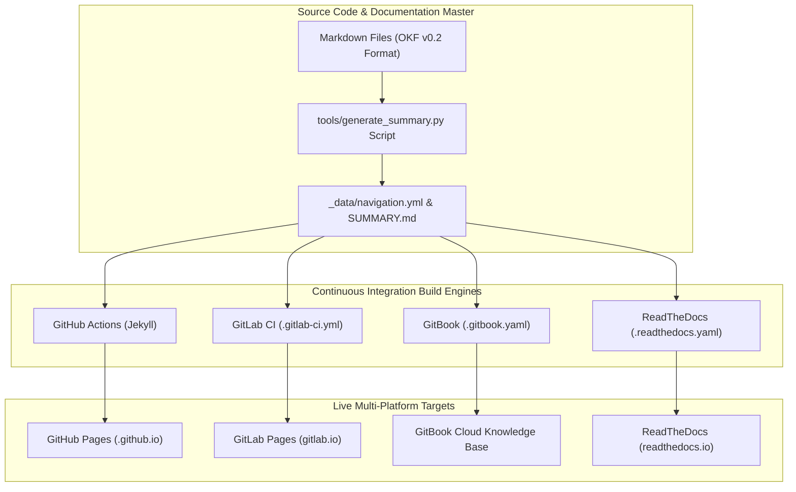

### 3. Summary Interface & Routing Table

| Source Component | Target Component | Port / Protocol / API Ingress | Security Boundary / Access Key | Operational Significance / Flow Description |
| :--- | :--- | :--- | :--- | :--- |
| **Git Push Event** | **GitHub Actions / GitLab CI** | HTTPS Webhook / Git Push | Repository Deployment Key | Triggers automated site build workflows and tests on commit. |
| **generate_summary.py** | **SUMMARY.md & navigation.yml** | Local Python Script | File System Write | Re-indexes all markdown files into unified table of contents. |
| **Jekyll / MkDocs** | **GitHub / GitLab Pages** | `TCP 443` / HTTPS TLS 1.3 | Public Web Domain | Renders responsive HTML site with adaptive light/dark mode CSS styling. |
| **GitBook Sync** | **GitBook Portal** | Git Integration / HTTPS | GitBook Access Token | Synchronizes SUMMARY.md navigation tree directly to GitBook cloud platform. |
| **ReadTheDocs Builder** | **ReadTheDocs Site** | Webhook / MkDocs Python 3.12 | RTD Project Key | Builds MkDocs documentation suite and publishes to readthedocs.io domain. |

## Supported Platforms

### 1. GitLab Pages (`.gitlab-ci.yml`)
- Deploys automatically via GitLab CI/CD using Ruby 3.2 and Jekyll.
- Output directory: `public/`.

### 2. GitBook (`.gitbook.yaml`)
- Native GitBook integration reading `README.md` as home and `SUMMARY.md` as table of contents structure.

### 3. ReadTheDocs.org (`.readthedocs.yaml`)
- ReadTheDocs v2 configuration using Python 3.12 and MkDocs dependencies listed in `docs/requirements.txt`.

### 4. Dynamic Markdown Navigation
- All documentation files under `docs/` and root files (`README.md`, `CHANGELOG.md`, `SUMMARY.md`, `HISTORY.md`) are automatically indexed by `tools/generate_summary.py`.


---


# 5-Year Strategic BDA & AI Roadmap & Master Business Case Specification (2026–2030)

This master document outlines the **5-Year Strategic Plan (2026–2030)** for modernizing Big Data Analytics (BDA) with Machine Learning (ML) and Artificial Intelligence (AI). It establishes a unified, 100% open-source Single Source of Truth (SSoT) Data Lakehouse architecture designed to guarantee zero vendor lock-in, strict data sovereignty, complete operational continuity, and rapid business case expansion.

---

## 1. Master Big Picture Business Case

### Executive Summary & Vision
The primary objective of the Big Data Analytics (BDA) platform modernization is to transform fragmented legacy data stores into a high-performance, open-source S3-compatible Lakehouse ecosystem. By integrating advanced Machine Learning (ML) and Artificial Intelligence (AI) natively into the data pipeline, the platform transitions enterprise analytics from reactive reporting to proactive, predictive, and autonomous operational decision-making.

### 1. Standalone Production-Ready SVG Vector Graphic (`.svg`)

<svg xmlns="http://www.w3.org/2000/svg" viewBox="0 0 900 240" width="100%" height="100%">
  <rect width="900" height="240" fill="#0F172A" rx="10"/>
  <rect x="20" y="20" width="860" height="200" fill="#1E293B" stroke="#334155" stroke-width="1.5" rx="8"/>
  <rect x="20" y="20" width="860" height="32" fill="#0F172A" rx="8"/>
  <text x="35" y="41" font-family="-apple-system, BlinkMacSystemFont, 'Segoe UI', Roboto, sans-serif" font-size="13" font-weight="bold" fill="#60A5FA">THE BDA &amp; AI BIG PICTURE BUSINESS CASE STRATEGIC GOALS</text>

  <rect x="35" y="65" width="400" height="65" fill="#0F172A" stroke="#334155" rx="6"/>
  <text x="45" y="85" font-family="-apple-system, BlinkMacSystemFont, 'Segoe UI', Roboto, sans-serif" font-size="11" font-weight="bold" fill="#4ADE80">GOAL 1: SSoT Lakehouse Modernization</text>
  <text x="45" y="105" font-family="-apple-system, BlinkMacSystemFont, 'Segoe UI', Roboto, sans-serif" font-size="10" fill="#94A3B8">100% Open-Source Lakehouse (Iceberg, Ceph, Polaris)</text>

  <rect x="455" y="65" width="410" height="65" fill="#0F172A" stroke="#334155" rx="6"/>
  <text x="465" y="85" font-family="-apple-system, BlinkMacSystemFont, 'Segoe UI', Roboto, sans-serif" font-size="11" font-weight="bold" fill="#FBBF24">GOAL 2: Business Continuity &amp; Dual-Run</text>
  <text x="465" y="105" font-family="-apple-system, BlinkMacSystemFont, 'Segoe UI', Roboto, sans-serif" font-size="10" fill="#94A3B8">Zero downtime migration for 5 core domain business cases</text>

  <rect x="35" y="140" width="400" height="65" fill="#0F172A" stroke="#334155" rx="6"/>
  <text x="45" y="160" font-family="-apple-system, BlinkMacSystemFont, 'Segoe UI', Roboto, sans-serif" font-size="11" font-weight="bold" fill="#38BDF8">GOAL 3: Local Zero-Trust AI Sandboxing</text>
  <text x="45" y="180" font-family="-apple-system, BlinkMacSystemFont, 'Segoe UI', Roboto, sans-serif" font-size="10" fill="#94A3B8">MCP protocol, pgvector, DuckDB vss &amp; zero WAN egress</text>

  <rect x="455" y="140" width="410" height="65" fill="#0F172A" stroke="#334155" rx="6"/>
  <text x="465" y="160" font-family="-apple-system, BlinkMacSystemFont, 'Segoe UI', Roboto, sans-serif" font-size="11" font-weight="bold" fill="#C084FC">GOAL 4: Scalable AI Case Onboarding</text>
  <text x="465" y="180" font-family="-apple-system, BlinkMacSystemFont, 'Segoe UI', Roboto, sans-serif" font-size="10" fill="#94A3B8">Standardized 6-stage lifecycle framework for new AI cases</text>
</svg>

### 2. Git-Native Mermaid Topology (`.mmd`)

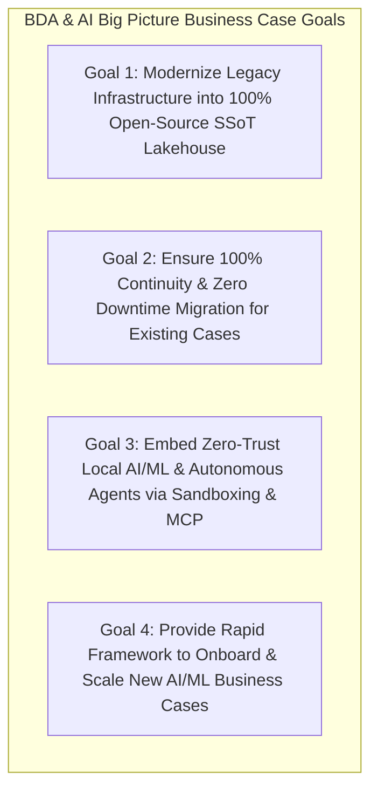

### 3. Summary Interface & Routing Table

| Strategic Goal | Modern Architecture Pillar | Target Platform Engine | Operational Business Impact |
| :--- | :--- | :--- | :--- |
| **Goal 1: SSoT Modernization** | Open-Source Lakehouse | Apache Iceberg, Ceph, Apache Polaris | 60%–70% TCO reduction, zero vendor lock-in. |
| **Goal 2: Zero Downtime** | Dual-Run Boundary Ingestion | Apache NiFi, ODCS v3.1.0 Contract Gates | 100% operational continuity across 5 core business cases. |
| **Goal 3: Local AI Sandboxing** | Zero-Trust Local Vectors | Model Context Protocol, `pgvector`, DuckDB `vss` | Zero WAN egress, total data sovereignty. |
| **Goal 4: Rapid Case Onboarding** | Standardized AI Lifecycle | Feast, MLflow, vLLM, APISIX | Accelerated onboarding of new predictive AI business cases. |

### Strategic Value Drivers & Return on Investment (ROI)

| Value Driver | Legacy BDA Challenge | Modernized BDA + AI Target | Quantifiable Business Impact |
| :--- | :--- | :--- | :--- |
| **Total Cost of Ownership (TCO)** | Expensive proprietary server licenses, closed SANs, and proprietary BI seats. | 100% Open-Source stack (Proxmox VE, RKE2, Ceph SDS, Apache Iceberg, Superset). | **60%–70% reduction** in recurring software licensing and vendor lock-in costs. |
| **Data Recency & Velocity** | Batch ETL jobs taking hours/days; manual spreadsheet compilations. | Real-time streaming via Apache NiFi, Spark Streaming, and APISIX gateway. | Reduction in alert latency from **hours to under 30 seconds** for hazard events. |
| **Data Trust & Governance** | Fragmented silos, unverified data feeds, lack of column-level lineage. | OpenMetadata SSoT catalog, Linux Foundation ODCS v3.1.0 data contracts, OpenLineage. | **100% data provenance auditability** and zero schema drift across all domains. |
| **AI/ML Scalability** | Ad-hoc unmonitored scripts, proprietary AI cloud dependencies, WAN egress risks. | Local zero-trust vector search (DuckDB `vss`, `pgvector`), MCP sandboxing, OTel monitoring. | **Zero WAN data egress**, total data sovereignty, and secure agentic orchestration. |

---

## 2. 5-Year Strategic Horizon Roadmap (2026–2030)

```
Year 1 (2026): Foundation & Dual-Run Ingestion
├── Ceph / MinIO Object Storage with S3 Object Lock (WORM)
├── Apache Polaris REST Catalog & OpenMetadata Data Catalog
└── Apache NiFi Dual-Run Ingestion (Zero impact to legacy)

Year 2 (2027): Compute Modernization & Iceberg Migration
├── Trino MPP Query Engine & Apache Spark + Sedona Compute
├── ODCS v3.1.0 Data Contract Enforcement & OpenLineage Tracing
└── Historical Data Conversion to Apache Iceberg Parquet Tables

Year 3 (2028): Local AI/ML Sandboxing & Zero-Trust RAG
├── Model Context Protocol (MCP) Isolated DMZ Server Deployment
├── DuckDB vss & PostgreSQL pgvector Local Vector Search Engine
└── OpenTelemetry Full-Stack Observability (Airflow, Spark, APISIX)

Year 4 (2029): MLOps Pipeline & Enterprise Autonomous Agents
├── Feature Store (Feast for feature versioning & retrieval), MLflow (Model Registry & Experiment Tracking) & vLLM Local Inference
├── Automated Anomaly Detection & Real-Time Predictive Pipelines
└── Keycloak-Gated Natural Language Query & Interactive Copilots

Year 5 (2030): Predictive Digital Twin & Self-Healing Lakehouse
├── Multi-Domain Predictive Digital Twin (Spatial Hydro-Geological Simulations)
├── Autonomous Data Quality Healing & Self-Optimizing Indexing
└── Inter-Agency Federated Open Data Ecosystem
```

### Year-by-Year Milestones & Objectives

#### Year 1 (2026) — Infrastructure Foundation & Dual-Run Ingestion
- Deploy resilient, bare-metal enterprise storage using Ceph SDS and MinIO with WORM (S3 Object Lock) immutability.
- Stand up Apache Polaris as the centralized multi-engine Iceberg REST catalog and OpenMetadata for metadata discovery.
- Deploy Apache NiFi at boundary networks to mirror incoming data feeds alongside legacy systems with zero production downtime.

#### Year 2 (2027) — Compute Modernization, Data Contracts & Iceberg Migration
- Provision Trino MPP SQL and Apache Spark / Sedona spatial compute clusters connected to the Polaris catalog.
- Formalize Linux Foundation ODCS v3.1.0 data contracts across all domain pipelines.
- Execute automated Spark conversion jobs migrating legacy HDFS, GlusterFS, and relational data into Apache Iceberg table formats.
- Instrument Airflow orchestrators with OpenLineage runtime emission for end-to-end lineage tracking.

#### Year 3 (2028) — Local Zero-Trust AI/ML Sandboxing & Hybrid RAG
- Deploy containerized Model Context Protocol (MCP) servers (`mcp-catalog-context`, `mcp-trino-query-gen`, `mcp-pipeline-monitor`, `mcp-contract-linter`) in isolated DMZ environments using read-only roles.
- Integrate DuckDB `vss` and PostgreSQL `pgvector` with OpenMetadata for zero-trust local semantic search and Hybrid RAG.
- Enforce the **Human-to-AI Quarantine Model** (Tier 0 SSoT, Tier 1 Telemetry, Tier 2 AI Sandbox with 30-day TTL).
- Instrument Airflow, Spark, and APISIX with OpenTelemetry Collectors feeding Prometheus, Tempo, Loki, and Grafana.

#### Year 4 (2029) — MLOps Pipeline & Enterprise Autonomous Agents
- Implement Feast as the enterprise Feature Store responsible for feature versioning, feature definitions, online feature retrieval (backed by PostgreSQL), and offline training dataset generation (backed by Apache Iceberg Parquet). Deploy MLflow for experiment tracking, model lineage, and central model registry, while DuckDB is utilized strictly for local ad-hoc vector and analytical queries.
- Deploy local GPU-accelerated inference endpoints using vLLM or Ollama for local LLM execution.
- Launch automated real-time prediction pipelines across all five core business domains.
- Roll out Keycloak-gated conversational AI assistants for natural language SQL query generation and spatial data exploration.

#### Year 5 (2030) — Predictive Digital Twin & Self-Healing Lakehouse
- Consolidate multi-domain analytical outputs into a unified Predictive Multi-Domain Digital Twin for national environmental modeling.
- Implement self-healing lakehouse operations using autonomous AI agents to detect schema anomalies, clean bad data, and trigger auto-reindexing.
- Establish secure inter-agency federated data sharing via open APIs behind Apache APISIX and Keycloak OIDC.

---

## 3. Migration, Maintenance, and Growth Strategy for Current Business Cases

To ensure complete business continuity, the 5 core legacy business cases are systematically migrated to the modern AI Lakehouse without operational disruption, followed by long-term maintenance and AI enhancement plans.

### Dual-Render Architecture Specification: Business Cases Migration Pipeline

#### 1. Standalone Production-Ready SVG Vector Graphic (`.svg`)

<svg xmlns="http://www.w3.org/2000/svg" viewBox="0 0 1000 480" width="100%" height="100%">
  <defs>
    <marker id="arrow-mig" viewBox="0 0 10 10" refX="6" refY="5" markerWidth="6" markerHeight="6" orient="auto-start-reverse">
      <path d="M 0 0 L 10 5 L 0 10 z" fill="#64748B" />
    </marker>
  </defs>

  <rect width="1000" height="480" fill="#0F172A" rx="10"/>

  <!-- Zone 1: Legacy Ingest -->
  <rect x="20" y="20" width="220" height="440" fill="#1E293B" stroke="#334155" stroke-width="1.5" rx="8"/>
  <rect x="20" y="20" width="220" height="32" fill="#0F172A" rx="8"/>
  <text x="30" y="41" font-family="-apple-system, BlinkMacSystemFont, 'Segoe UI', Roboto, sans-serif" font-size="12" font-weight="bold" fill="#94A3B8">LEGACY INGESTION PATHS</text>

  <rect x="35" y="70" width="190" height="70" fill="#0F172A" stroke="#334155" rx="6"/>
  <text x="45" y="92" font-family="-apple-system, BlinkMacSystemFont, 'Segoe UI', Roboto, sans-serif" font-size="12" font-weight="bold" fill="#F8FAFC">Unvalidated Forms</text>

  <rect x="35" y="155" width="190" height="70" fill="#0F172A" stroke="#334155" rx="6"/>
  <text x="45" y="177" font-family="-apple-system, BlinkMacSystemFont, 'Segoe UI', Roboto, sans-serif" font-size="12" font-weight="bold" fill="#F8FAFC">CSVs &amp; Spreadsheets</text>

  <rect x="35" y="240" width="190" height="70" fill="#0F172A" stroke="#334155" rx="6"/>
  <text x="45" y="262" font-family="-apple-system, BlinkMacSystemFont, 'Segoe UI', Roboto, sans-serif" font-size="12" font-weight="bold" fill="#F8FAFC">Thermal Anomaly REST API</text>

  <rect x="35" y="325" width="190" height="70" fill="#0F172A" stroke="#334155" rx="6"/>
  <text x="45" y="347" font-family="-apple-system, BlinkMacSystemFont, 'Segoe UI', Roboto, sans-serif" font-size="12" font-weight="bold" fill="#F8FAFC">Ad-Hoc SFTP Transfers</text>

  <!-- Zone 2: Dual Run Pipeline -->
  <rect x="260" y="20" width="220" height="440" fill="#1E293B" stroke="#334155" stroke-width="1.5" rx="8"/>
  <rect x="260" y="20" width="220" height="32" fill="#0F172A" rx="8"/>
  <text x="270" y="41" font-family="-apple-system, BlinkMacSystemFont, 'Segoe UI', Roboto, sans-serif" font-size="12" font-weight="bold" fill="#60A5FA">DUAL-RUN PIPELINE</text>

  <rect x="275" y="110" width="190" height="80" fill="#0F172A" stroke="#334155" rx="6"/>
  <text x="285" y="132" font-family="-apple-system, BlinkMacSystemFont, 'Segoe UI', Roboto, sans-serif" font-size="12" font-weight="bold" fill="#F8FAFC">Apache NiFi</text>
  <text x="285" y="152" font-family="Consolas, Monaco, monospace" font-size="10" fill="#60A5FA">Boundary Mirroring</text>

  <rect x="275" y="210" width="190" height="80" fill="#0F172A" stroke="#334155" rx="6"/>
  <text x="285" y="232" font-family="-apple-system, BlinkMacSystemFont, 'Segoe UI', Roboto, sans-serif" font-size="12" font-weight="bold" fill="#F8FAFC">ODCS v3.1.0 Gate</text>
  <text x="285" y="252" font-family="Consolas, Monaco, monospace" font-size="10" fill="#4ADE80">Contract Validation</text>

  <rect x="275" y="310" width="190" height="80" fill="#0F172A" stroke="#334155" rx="6"/>
  <text x="285" y="332" font-family="-apple-system, BlinkMacSystemFont, 'Segoe UI', Roboto, sans-serif" font-size="12" font-weight="bold" fill="#F8FAFC">Apache Iceberg</text>
  <text x="285" y="352" font-family="Consolas, Monaco, monospace" font-size="10" fill="#94A3B8">Parquet S3 Tables</text>

  <!-- Zone 3: Modern Compute AI -->
  <rect x="500" y="20" width="230" height="440" fill="#1E293B" stroke="#334155" stroke-width="1.5" rx="8"/>
  <rect x="500" y="20" width="230" height="32" fill="#0F172A" rx="8"/>
  <text x="510" y="41" font-family="-apple-system, BlinkMacSystemFont, 'Segoe UI', Roboto, sans-serif" font-size="12" font-weight="bold" fill="#4ADE80">COMPUTE &amp; AI LAYER</text>

  <rect x="515" y="80" width="200" height="70" fill="#0F172A" stroke="#334155" rx="6"/>
  <text x="525" y="102" font-family="-apple-system, BlinkMacSystemFont, 'Segoe UI', Roboto, sans-serif" font-size="12" font-weight="bold" fill="#F8FAFC">Spark &amp; Sedona</text>
  <text x="525" y="122" font-family="Consolas, Monaco, monospace" font-size="10" fill="#4ADE80">Spatial Vector Processing</text>

  <rect x="515" y="170" width="200" height="70" fill="#0F172A" stroke="#334155" rx="6"/>
  <text x="525" y="192" font-family="-apple-system, BlinkMacSystemFont, 'Segoe UI', Roboto, sans-serif" font-size="12" font-weight="bold" fill="#F8FAFC">Trino Engine</text>
  <text x="525" y="212" font-family="Consolas, Monaco, monospace" font-size="10" fill="#60A5FA">MPP SQL Queries</text>

  <rect x="515" y="260" width="200" height="70" fill="#0F172A" stroke="#334155" rx="6"/>
  <text x="525" y="282" font-family="-apple-system, BlinkMacSystemFont, 'Segoe UI', Roboto, sans-serif" font-size="12" font-weight="bold" fill="#F8FAFC">MLflow &amp; vLLM</text>

  <rect x="515" y="350" width="200" height="70" fill="#0F172A" stroke="#334155" rx="6"/>
  <text x="525" y="372" font-family="-apple-system, BlinkMacSystemFont, 'Segoe UI', Roboto, sans-serif" font-size="12" font-weight="bold" fill="#F8FAFC">pgvector &amp; DuckDB vss</text>

  <!-- Zone 4: Presentation -->
  <rect x="750" y="20" width="230" height="440" fill="#1E293B" stroke="#334155" stroke-width="1.5" rx="8"/>
  <rect x="750" y="20" width="230" height="32" fill="#0F172A" rx="8"/>
  <text x="760" y="41" font-family="-apple-system, BlinkMacSystemFont, 'Segoe UI', Roboto, sans-serif" font-size="12" font-weight="bold" fill="#FBBF24">PRESENTATION LAYER</text>

  <rect x="765" y="110" width="200" height="80" fill="#0F172A" stroke="#334155" rx="6"/>
  <text x="775" y="132" font-family="-apple-system, BlinkMacSystemFont, 'Segoe UI', Roboto, sans-serif" font-size="12" font-weight="bold" fill="#F8FAFC">Apache Superset</text>
  <text x="775" y="152" font-family="Consolas, Monaco, monospace" font-size="10" fill="#FBBF24">deck.gl Spatial Maps</text>

  <rect x="765" y="210" width="200" height="80" fill="#0F172A" stroke="#334155" rx="6"/>
  <text x="775" y="232" font-family="-apple-system, BlinkMacSystemFont, 'Segoe UI', Roboto, sans-serif" font-size="12" font-weight="bold" fill="#F8FAFC">Next.js Portal</text>
  <text x="775" y="252" font-family="Consolas, Monaco, monospace" font-size="10" fill="#60A5FA">Keycloak OIDC / APISIX</text>

  <rect x="765" y="310" width="200" height="80" fill="#0F172A" stroke="#F59E0B" rx="6"/>
  <text x="775" y="332" font-family="-apple-system, BlinkMacSystemFont, 'Segoe UI', Roboto, sans-serif" font-size="12" font-weight="bold" fill="#F8FAFC">APISIX Alerts</text>
  <text x="775" y="352" font-family="Consolas, Monaco, monospace" font-size="10" fill="#F87171">Push Dispatch APIs</text>

  <!-- Connectors -->
  <line x1="225" y1="190" x2="275" y2="150" stroke="#64748B" stroke-width="1.5" marker-end="url(#arrow-mig)"/>
  <rect x="215" y="162" width="75" height="16" fill="#1E3A8A" rx="3"/>
  <text x="218" y="174" font-family="Consolas, Monaco, monospace" font-size="9" fill="#93C5FD">Mixed Ingress</text>

  <line x1="465" y1="150" x2="515" y2="115" stroke="#64748B" stroke-width="1.5" marker-end="url(#arrow-mig)"/>
  <rect x="470" y="125" width="36" height="16" fill="#065F46" rx="3"/>
  <text x="473" y="137" font-family="Consolas, Monaco, monospace" font-size="9" fill="#86EFAC">S3</text>

  <line x1="715" y1="115" x2="765" y2="150" stroke="#64748B" stroke-width="1.5" marker-end="url(#arrow-mig)"/>
  <rect x="720" y="125" width="36" height="16" fill="#78350F" rx="3"/>
  <text x="723" y="137" font-family="Consolas, Monaco, monospace" font-size="9" fill="#FDE68A">SQL</text>

  <line x1="715" y1="385" x2="765" y2="250" stroke="#64748B" stroke-width="1.5" marker-end="url(#arrow-mig)"/>
  <rect x="720" y="305" width="36" height="16" fill="#1E3A8A" rx="3"/>
  <text x="723" y="317" font-family="Consolas, Monaco, monospace" font-size="9" fill="#93C5FD">OIDC</text>
</svg>

#### 2. Git-Native Mermaid Diagram (`.mmd`)

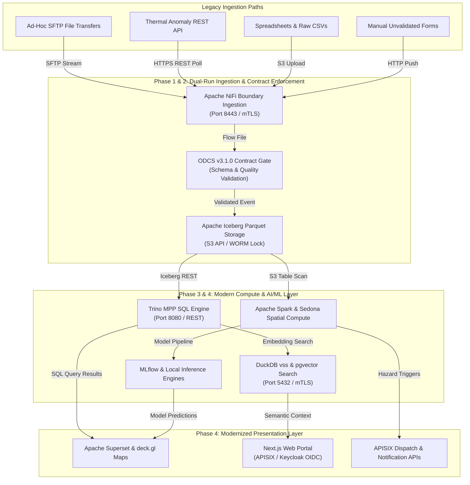

#### 3. Summary Interface & Routing Table

| Source Component | Target Component | Port / Protocol / API Ingress | Security Boundary / Trust Zone / Access Key | Operational Significance / Flow Description |
| :--- | :--- | :--- | :--- | :--- |
| **Unvalidated Forms Feed** | **Apache NiFi** | `TCP 8443` / HTTPS REST API | Public Boundary -> Ingestion DMZ | Ingests web/mobile incident form submissions into NiFi flow queues. |
| **CSVs & Spreadsheets Feed** | **Apache NiFi** | `TCP 9000` / S3 Multipart Upload | DMZ File Boundary -> Ingestion DMZ | Streams tabular CSV borehole and climate spreadsheets into NiFi flow processors. |
| **Thermal Anomaly API Feed** | **Apache NiFi** | `TCP 443` / HTTPS REST API | External Satellite API -> Ingestion DMZ | Polls satellite thermal anomaly endpoints over HTTPS REST API. |
| **Ad-Hoc SFTP Transfers Feed** | **Apache NiFi** | `TCP 22` / SFTP Stream | External Partner Network -> Ingestion DMZ | Streams geological landslide telemetry files directly into NiFi boundary intake. |
| **Apache NiFi** | **ODCS Contract Gate** | In-Memory Flow | Ingestion DMZ | Enforces Linux Foundation ODCS v3.1.0 schema validation and rejects invalid payloads to quarantine. |
| **ODCS Gate** | **Apache Iceberg S3 Store** | `TCP 9000` / S3 REST API | Ingestion DMZ -> Tier 0 SSoT Storage | Commits verified Parquet datasets into Apache Iceberg table format with WORM object lock. |
| **Apache Iceberg S3 Store** | **Apache Spark & Sedona** | `TCP 9000` / S3 REST API | Tier 0 SSoT -> Compute Zone | Scans S3 Parquet tables for large-scale spatial vector compute and model feature pipelines. |
| **Trino Engine** | **Apache Polaris** | `TCP 8181` / Iceberg REST API | Compute Zone -> Catalog Zone | Calls Apache Polaris REST catalog for Iceberg metadata and short-lived S3 access tokens. |
| **Trino Engine** | **Apache Iceberg S3 Store** | `TCP 9000` / S3 REST API | Compute Zone -> Tier 0 SSoT Storage | Reads and writes Parquet data objects directly using temporary S3 credentials. |
| **Apache Spark & Sedona** | **MLOps / MLflow** | `TCP 5000` / HTTP REST API | Compute Zone -> MLOps Registry | Registers spatial features, training datasets, and model artifacts in MLflow. |
| **Apache Spark & Sedona** | **APISIX Alerts** | `TCP 443` / HTTPS REST API | Compute Zone -> Presentation Gate | Dispatches real-time hazard triggers and alert payloads to APISIX notification gateways. |
| **RAG Backend** | **pgvector Search** | `TCP 5432` / PostgreSQL TLS | Trust Zone -> Operational DB | Executes sub-10ms semantic similarity queries joining spatial and relational predicates. |
| **Apache Superset** | **Trino Engine** | `TCP 8080` / SQL REST API | BI Portal -> Compute Zone | Apache Superset connects to Trino query engine to execute ad-hoc SQL queries and receive dataset results. |
| **RAG Backend** | **Next.js Web Portal** | `TCP 443` / HTTPS OIDC | Trust Zone -> Presentation Portal | Feeds grounded vector context chunks and search responses to Next.js portal RAG assistants. |
| **Presentation Portal** | **APISIX Gateway -> MLOps / vLLM** | `TCP 443` / HTTPS OIDC | Presentation Portal -> APISIX -> Trust Zone | Routes user inference requests through APISIX gateway with JWT validation to vLLM endpoints. |

### Core Business Domains Migration & Maintenance Matrix

| Business Domain Module | Migration Path & Dual-Run Strategy | Modern Open-Source Integration | AI & ML Infrastructure Enhancement | Maintenance & SLA Guarantee |
| :--- | :--- | :--- | :--- | :--- |
| **1. Human-Wildlife Incident Management (HWC)** | Replace manual forms with GeoJSON REST APIs in NiFi. Parallel run with legacy form store for 30 days. | GeoJSON API -> NiFi -> ODCS Gate -> Iceberg -> PostGIS -> Apache Superset. | Spatial clustering (DBSCAN/K-Means), wildlife corridor movement prediction models. | 99.9% ingestion uptime; sub-second incident heatmap rendering. |
| **2. Groundwater Potential (GroW)** | Mirror raw borehole logs and well test CSVs via NiFi to MinIO/Ceph object storage. | NiFi Parquet conversion -> Apache Spark/Sedona -> Trino / Superset. | Subsurface lithology classification via Random Forest/XGBoost; automated aquifer yield estimation. | Automated row-count and SHA-256 validation; zero data loss during conversion. |
| **3. Forest Fire Analysis & Prediction** | Replace manual thermal email parsing with automated HTTPS polling of satellite thermal anomaly APIs. | Satellite REST API -> NiFi -> Sedona spatial join with weather grids -> Iceberg. | Random Forest fire risk scoring; LSTM thermal spread prediction; automated biomass susceptibility scoring. | Real-time thermal hotspot ingestion in **< 3 minutes**; automated risk push via APISIX. |
| **4. Climate Change Vulnerability (MAIN)** | Consolidate fragmented spreadsheets into versioned Iceberg tables enforcing $0.0 \le \text{Index} \le 1.0$. | Versioned Iceberg tables -> Data Contract assertions -> Superset dashboards. | Multi-variate climate impact projection modeling; automated vulnerability trend anomaly detection. | Historical baseline checksum verification; zero contract constraint violations. |
| **5. Geological Landslide Management (GeoSlide)** | Replace manual SFTP transfers with continuous NiFi precipitation telemetry streaming. | Telemetry streaming -> Spark Streaming rainfall threshold matching -> APISIX alerts. | Dynamic rainfall-slope failure threshold modeling using neural networks; real-time early hazard warning generation. | Telemetry ingestion latency **< 10 seconds**; high-priority hazard payload routing via APISIX. |

---

## 4. Framework for Prototyping, Building, and Scaling New AI Business Cases

To ensure the organization can seamlessly build and launch new AI business cases over the 5-year planning period, a standardized 6-stage lifecycle framework is established.

```
Stage 1: Business Case Definition & ODCS Contract Formulation
└── Define domain objectives, SLA metrics, and machine-readable ODCS v3.1.0 contract schema.

Stage 2: Ingestion & Metadata Registration in OpenMetadata
└── Provision NiFi flow, register asset in OpenMetadata, attach security & domain tags.

Stage 3: Feature Engineering & Tier 2 AI Sandboxing
└── Materialize features in Feast (offline Iceberg store & online PostgreSQL store); log experiment tracking in MLflow; run exploratory vector analytics in DuckDB; execute exploratory modeling in Tier 2 Sandbox.

Stage 4: Model Validation & Human Cryptographic Sign-Off
└── Validate model precision/recall metrics; human domain specialist signs payload for Tier 0.

Stage 5: Production Deployment & APISIX API Exposure
└── Deploy inference container (vLLM/Ollama/Triton); expose endpoints via APISIX with Keycloak SSO.

Stage 6: Full-Stack OTel Monitoring & Lifecycle Management
└── Instrument with OTel Collectors; monitor feature drift, prediction latency, and model accuracy.
```

### Potential Strategic New Business Cases (2026–2030)

1. **Generative Spatial Intelligence Copilot:** Natural language interface enabling non-technical users to query complex spatial datasets (e.g., "Show all areas with high landslide risk near gazetted forests where rainfall exceeded 100mm today").
2. **Autonomous Disaster Dispatch & Resource Routing:** Real-time AI agent routing emergency response teams based on combined flooding telemetry, road closure vectors, and landslide risk scores.
3. **Climate Financial Risk & Carbon Sequestration Modeling:** ML models quantifying forest biomass carbon capture credits and assessing physical risk ratings for infrastructure investments.
4. **Satellite Imagery Anomaly & Deforestation Detection:** Computer vision pipeline processing Sentinel/Landsat imagery to automatically detect illegal land clearing or canopy degradation in near-real-time.

---

## 5. End-to-End Machine Learning and AI Architecture

The platform embeds ML and AI capabilities directly into the Lakehouse ecosystem while enforcing strict isolation, security, and observability.

### Dual-Render Architecture Specification: End-to-End Machine Learning & AI Architecture

#### 1. Standalone Production-Ready SVG Vector Graphic (`.svg`)

<svg xmlns="http://www.w3.org/2000/svg" viewBox="0 0 1000 600" width="100%" height="100%">
  <defs>
    <marker id="arrow-ml" viewBox="0 0 10 10" refX="6" refY="5" markerWidth="6" markerHeight="6" orient="auto-start-reverse">
      <path d="M 0 0 L 10 5 L 0 10 z" fill="#475569" />
    </marker>
  </defs>

  <rect width="1000" height="600" fill="#F8FAFC" rx="10"/>

  <rect x="20" y="15" width="960" height="35" fill="#0F172A" rx="6"/>
  <text x="35" y="38" font-family="-apple-system, BlinkMacSystemFont, 'Segoe UI', Roboto, sans-serif" font-size="14" font-weight="bold" fill="#F8FAFC">END-TO-END MACHINE LEARNING &amp; AI ARCHITECTURE</text>

  <rect x="20" y="65" width="280" height="250" fill="#FFFFFF" stroke="#CBD5E1" stroke-width="1.5" rx="8"/>
  <rect x="20" y="65" width="280" height="30" fill="#DCFCE7" rx="8"/>
  <text x="30" y="85" font-family="-apple-system, BlinkMacSystemFont, 'Segoe UI', Roboto, sans-serif" font-size="12" font-weight="bold" fill="#166534">DATA TIER &amp; STORAGE QUARANTINE</text>

  <rect x="35" y="105" width="250" height="50" fill="#F8FAFC" stroke="#A7F3D0" rx="6"/>
  <text x="45" y="125" font-family="-apple-system, BlinkMacSystemFont, 'Segoe UI', Roboto, sans-serif" font-size="11" font-weight="bold" fill="#065F46">Tier 0: Golden Human SSoT</text>
  <text x="45" y="142" font-family="Consolas, Monaco, monospace" font-size="10" fill="#047857">Ceph WORM / S3 Lock</text>

  <rect x="35" y="165" width="250" height="50" fill="#F8FAFC" stroke="#E2E8F0" rx="6"/>
  <text x="45" y="185" font-family="-apple-system, BlinkMacSystemFont, 'Segoe UI', Roboto, sans-serif" font-size="11" font-weight="bold" fill="#0F172A">Tier 1: Machine Telemetry</text>

  <rect x="35" y="225" width="250" height="70" fill="#F8FAFC" stroke="#FDE68A" rx="6"/>
  <text x="45" y="245" font-family="-apple-system, BlinkMacSystemFont, 'Segoe UI', Roboto, sans-serif" font-size="11" font-weight="bold" fill="#92400E">Tier 2: AI Sandbox Workspace</text>
  <text x="45" y="262" font-family="Consolas, Monaco, monospace" font-size="10" fill="#D97706">30-Day TTL Auto-Purge</text>

  <rect x="320" y="65" width="340" height="250" fill="#FFFFFF" stroke="#CBD5E1" stroke-width="1.5" rx="8"/>
  <rect x="320" y="65" width="340" height="30" fill="#EFF6FF" rx="8"/>
  <text x="330" y="85" font-family="-apple-system, BlinkMacSystemFont, 'Segoe UI', Roboto, sans-serif" font-size="12" font-weight="bold" fill="#1E40AF">CATALOG &amp; MLOPS FEATURE TIER</text>

  <rect x="335" y="105" width="310" height="50" fill="#F8FAFC" stroke="#E2E8F0" rx="6"/>
  <text x="345" y="125" font-family="-apple-system, BlinkMacSystemFont, 'Segoe UI', Roboto, sans-serif" font-size="11" font-weight="bold" fill="#0F172A">Apache Polaris &amp; OpenMetadata</text>

  <rect x="335" y="165" width="310" height="60" fill="#F8FAFC" stroke="#E2E8F0" rx="6"/>
  <text x="345" y="185" font-family="-apple-system, BlinkMacSystemFont, 'Segoe UI', Roboto, sans-serif" font-size="11" font-weight="bold" fill="#0F172A">Local Vector Search</text>
  <text x="345" y="202" font-family="Consolas, Monaco, monospace" font-size="10" fill="#2563EB">pgvector + DuckDB vss</text>

  <rect x="335" y="235" width="310" height="60" fill="#F8FAFC" stroke="#E2E8F0" rx="6"/>
  <text x="345" y="255" font-family="-apple-system, BlinkMacSystemFont, 'Segoe UI', Roboto, sans-serif" font-size="11" font-weight="bold" fill="#0F172A">MLflow Model Registry &amp; Feast</text>

  <rect x="680" y="65" width="300" height="250" fill="#FFFFFF" stroke="#CBD5E1" stroke-width="1.5" rx="8"/>
  <rect x="680" y="65" width="300" height="30" fill="#FEF3C7" rx="8"/>
  <text x="690" y="85" font-family="-apple-system, BlinkMacSystemFont, 'Segoe UI', Roboto, sans-serif" font-size="12" font-weight="bold" fill="#92400E">MCP DMZ &amp; INFERENCE TIER</text>

  <rect x="695" y="105" width="270" height="80" fill="#F8FAFC" stroke="#FDE68A" rx="6"/>
  <text x="705" y="125" font-family="-apple-system, BlinkMacSystemFont, 'Segoe UI', Roboto, sans-serif" font-size="11" font-weight="bold" fill="#0F172A">FastMCP Isolated DMZ Servers</text>
  <text x="705" y="142" font-family="Consolas, Monaco, monospace" font-size="10" fill="#92400E">JSON-RPC 2.0 / Read-Only</text>

  <rect x="695" y="195" width="270" height="100" fill="#F8FAFC" stroke="#E2E8F0" rx="6"/>
  <text x="705" y="215" font-family="-apple-system, BlinkMacSystemFont, 'Segoe UI', Roboto, sans-serif" font-size="11" font-weight="bold" fill="#0F172A">vLLM / Ollama Inference</text>
  <text x="705" y="232" font-family="Consolas, Monaco, monospace" font-size="10" fill="#2563EB">APISIX / Keycloak Gate</text>

  <rect x="20" y="330" width="960" height="255" fill="#FFFFFF" stroke="#CBD5E1" stroke-width="1.5" rx="8"/>
  <rect x="20" y="330" width="960" height="30" fill="#F1F5F9" rx="8"/>
  <text x="30" y="350" font-family="-apple-system, BlinkMacSystemFont, 'Segoe UI', Roboto, sans-serif" font-size="12" font-weight="bold" fill="#334155">OPENTELEMETRY OBSERVABILITY &amp; GRAFANA BACKENDS</text>

  <rect x="35" y="375" width="220" height="190" fill="#F8FAFC" stroke="#E2E8F0" rx="6"/>
  <text x="45" y="398" font-family="-apple-system, BlinkMacSystemFont, 'Segoe UI', Roboto, sans-serif" font-size="12" font-weight="bold" fill="#0F172A">OTel Collector</text>
  <text x="45" y="418" font-family="Consolas, Monaco, monospace" font-size="10" fill="#475569">Receiver: OTLP / StatsD</text>

  <rect x="280" y="375" width="200" height="190" fill="#F8FAFC" stroke="#E2E8F0" rx="6"/>
  <text x="290" y="398" font-family="-apple-system, BlinkMacSystemFont, 'Segoe UI', Roboto, sans-serif" font-size="12" font-weight="bold" fill="#0F172A">Prometheus</text>
  <text x="290" y="418" font-family="Consolas, Monaco, monospace" font-size="10" fill="#2563EB">Time-Series Metrics</text>

  <rect x="500" y="375" width="200" height="190" fill="#F8FAFC" stroke="#E2E8F0" rx="6"/>
  <text x="510" y="398" font-family="-apple-system, BlinkMacSystemFont, 'Segoe UI', Roboto, sans-serif" font-size="12" font-weight="bold" fill="#0F172A">Grafana Tempo</text>
  <text x="510" y="418" font-family="Consolas, Monaco, monospace" font-size="10" fill="#059669">Distributed Traces</text>

  <rect x="720" y="375" width="240" height="190" fill="#F8FAFC" stroke="#E2E8F0" rx="6"/>
  <text x="730" y="398" font-family="-apple-system, BlinkMacSystemFont, 'Segoe UI', Roboto, sans-serif" font-size="12" font-weight="bold" fill="#0F172A">Grafana Loki &amp; Unified UI</text>
  <text x="730" y="418" font-family="Consolas, Monaco, monospace" font-size="10" fill="#D97706">Logs &amp; Dashboards</text>

  <line x1="300" y1="130" x2="335" y2="130" stroke="#475569" stroke-width="1.5" marker-end="url(#arrow-ml)"/>
  <line x1="645" y1="135" x2="695" y2="135" stroke="#475569" stroke-width="1.5" marker-end="url(#arrow-ml)"/>
  <line x1="645" y1="260" x2="695" y2="240" stroke="#475569" stroke-width="1.5" marker-end="url(#arrow-ml)"/>
  <line x1="255" y1="470" x2="280" y2="470" stroke="#475569" stroke-width="1.5" marker-end="url(#arrow-ml)"/>
  <line x1="480" y1="470" x2="500" y2="470" stroke="#475569" stroke-width="1.5" marker-end="url(#arrow-ml)"/>
  <line x1="700" y1="470" x2="720" y2="470" stroke="#475569" stroke-width="1.5" marker-end="url(#arrow-ml)"/>
</svg>

#### 2. Git-Native Mermaid Diagram (`.mmd`)

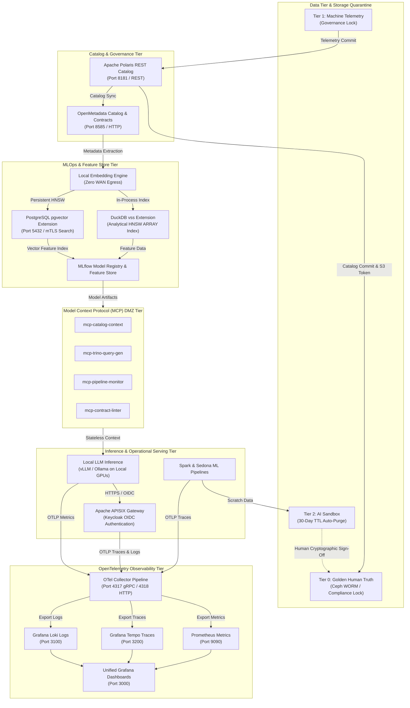

#### 3. Summary Interface & Routing Table

| Source Component | Target Component | Port / Protocol / API Ingress | Security Boundary / Trust Zone / Access Key | Operational Significance / Flow Description |
| :--- | :--- | :--- | :--- | :--- |
| **Tier 0 Storage** | **Apache Polaris** | `TCP 9000` / S3 REST | Compliance Lock (Read-Only to AI) | Prevents AI models from overwriting certified human ground truth datasets. |
| **Local Embedding Engine** | **DuckDB vss Extension** | In-Process Memory IPC | Local GPU Sandbox (Zero WAN Egress) | Generates and indexes analytical embeddings in-process over fixed-size ARRAY columns. |
| **Local Embedding Engine** | **pgvector Store** | `TCP 5432` / PostgreSQL TLS | Local GPU -> Operational DB Boundary | Materializes persistent HNSW vector similarity tables in HA PostgreSQL cluster. |
| **MLflow Model Registry** | **FastMCP DMZ Servers** | `TCP 8080` / JSON-RPC 2.0 | DMZ Isolated Container Boundary | Exposes read-only model context and SQL query generation to sandboxed AI agents. |
| **vLLM / Ollama** | **APISIX Gateway** | `TCP 8000` / HTTP REST | Local GPU -> Keycloak OIDC Boundary | Serves grounded local LLM inferences secured by Keycloak JWT authentication. |
| **APISIX / Spark / vLLM** | **OTel Collector** | `TCP 4317` gRPC / `4318` HTTP | Internal Management Network | Aggregates all distributed traces, metrics, and logs into Prometheus, Tempo, and Loki backends. |

### Core AI Infrastructure Components

1. **Human-to-AI Quarantine Topology:**
   - **Tier 0 (Golden SSoT):** Immutable, WORM-protected store containing certified human ground truth. AI has zero write access.
   - **Tier 1 (Machine Telemetry):** Direct sensor feeds with automated contract validation.
   - **Tier 2 (AI Sandbox):** Sandboxed workspace with automated 30-day TTL purges where AI models execute, generate scratch outputs, and compute predictions.
2. **Model Context Protocol (MCP) Servers:**
   - Operating in an isolated DMZ container environment over JSON-RPC 2.0.
   - Restricted to stateless operational utilities (`validate_sql`, `lint_contract`, `read_schema`) with zero write capabilities to ground truth.
3. **Local Zero-Trust Vector Search & Hybrid RAG:**
   - **DuckDB `vss`:** Explicitly labeled as an experimental extension, evaluated during Stage 3 / Year 3 for embedded HNSW vector indexing over fixed-size `ARRAY` columns for fast batch analytical similarity search. Parquet data must first be materialized or loaded into a DuckDB table with fixed-size `ARRAY` columns before creating and querying the HNSW vector index. Due to its experimental status and in-memory, RAM-bound constraints, production adoption requires passing a formal qualification gate; PostgreSQL `pgvector` serves as the primary supported production fallback.
   - **`pgvector`:** Powers sub-10ms operational API search and interactive portal lookups inside the primary master HA PostgreSQL database. See [PostgreSQL & pgvector Enterprise Strategy Specification](postgresql-pgvector-enterprise-strategy.html).
   - **Zero WAN Egress:** Local sentence transformer embeddings ensure sensitive enterprise metadata never leaves on-premises infrastructure. Egress isolation is strictly enforced via deny-by-default network security policies, egress proxy allowlists, local DNS sinkholing, and automated CI/CD acceptance tests verifying zero WAN egress.
4. **Full-Stack OpenTelemetry Observability:**
   - Unified OTel Collectors capture traces, metrics, and logs across Airflow, Spark, APISIX, and ML inference engines.
   - Pushes metrics to Prometheus, traces to Grafana Tempo, and logs to Grafana Loki for centralized Grafana monitoring.

---

## 6. Summary Business Case Matrix & Governance Sign-Off

| Strategic Milestone | Target Completion | Success Metric / SLA | Primary Responsible Component |
| :--- | :--- | :--- | :--- |
| **Ceph/MinIO & Polaris Baseline** | Q2 2026 | 100% S3 Object Lock compliance; multi-engine Iceberg REST connectivity. | Infrastructure & Ceph Team |
| **Legacy Ingestion Mirroring** | Q4 2026 | Zero downtime; dual-run parity across all 5 core domain feeds. | Data Engineering & Apache NiFi |
| **Compute & Contract Migration** | Q2 2027 | 100% ODCS v3.1.0 contract compliance; automated OpenLineage emission. | Platform Team & Trino/Spark |
| **Local Vector Search & MCP Deployment** | Q4 2028 | Sub-10ms semantic search; zero WAN egress; isolated DMZ sandboxes. | AI Infrastructure & Security |
| **Full MLOps & Copilot Launch** | Q4 2029 | MLflow registry online; Keycloak-gated natural language query portal live. | MLOps Team & APISIX/Keycloak |
| **Predictive Digital Twin** | Q4 2030 | Multi-domain spatial simulation operational; self-healing lakehouse enabled. | Enterprise Architecture |


---


# Apache NiFi 2.0 Master Data Plane Architecture and Migration Guide

This reference specification establishes **Apache NiFi 2.0** as the primary master data plane, streaming ingestion, and Extract-Transform-Load (ETL/ELT) engine for the Big Data Analytics (BDA) and Enterprise AI infrastructure. It details the integration between Apache NiFi 2.0 and a unified PostgreSQL Master database equipped with `pgvector`, `PostGIS`, and `pgTDE`, alongside a step-by-step migration blueprint from legacy Apache NiFi 1.x environments.

---

## 1. Introduction & Strategic Overview

The rapid industrialization of Generative AI (GenAI) and Large Language Models (LLMs) has forced an architectural re-evaluation of data pipelines. While early AI systems relied on fragmented data stacks—separating relational operational metadata from specialized vector stores and geographic databases—modern enterprise applications require consolidated, secure, and unified environments. Building production-grade AI systems, particularly those utilizing Retrieval-Augmented Generation (RAG) and multimodal spatio-temporal tracking, places intense pressure on data logistics.

To manage this complexity, infrastructure architects are increasingly deploying unified storage hubs. PostgreSQL has emerged as the definitive enterprise open-source master database by incorporating advanced multi-model capabilities via extensions. By integrating `pgvector` for high-dimensional semantic vector storage, `PostGIS` for advanced geospatial topologies, and `pgTDE` (Transparent Data Encryption) for cryptographic rest-layer security, PostgreSQL transitions from a traditional relational storage engine into a unified AI Data Platform.

However, a unified data store requires an equally mature, high-throughput, and observable data logistics engine. The release of Apache NiFi 2.0 solves this orchestration challenge. With its native Python extensions, stateless architecture, and seamless database virtualization drivers, NiFi 2.0 acts as the ultimate automated data plane feeding this secure PostgreSQL master. This document details the technical integration of Apache NiFi 2.0 with an encrypted, spatial-vector PostgreSQL ecosystem and provides a complete architectural blueprint for enterprise AI Data Infrastructure.

---

## 2. The Unified Master Architecture: PostgreSQL as the Core AI Lakehouse

Traditional architectures often introduce data fragmentation by deploying distinct databases for different data types (e.g., standalone vector databases for embeddings, document stores for unstructured content, and relational databases for transactional operations). This fragmentation introduces latency, data synchronization hazards, and severe administrative overhead.

The modern approach consolidates these capabilities into a single, high-availability PostgreSQL Master instance:

```
┌──────────────────────────────────────────────────────────┐
│             POSTGRESQL MASTER DATA INFRA                 │
│  ┌────────────────────────────────────────────────────┐  │
│  │         pgTDE (Transparent Data Encryption)        │  │
│  │   Encrypts Tablespaces, WAL, and Vector Logs       │  │
│  └─────────────────────────┬──────────────────────────┘  │
│                            ▼                             │
│       ┌────────────────────┴────────────────────┐        │
│       ▼                                         ▼        │
│ ┌───────────┐                             ┌───────────┐  │
│ │ pgvector  │                             │  PostGIS  │  │
│ │ HNSW/IVFF │                             │ Spatial R-│  │
│ │ Indexes   │                             │   Trees   │  │
│ └───────────┘                             └───────────┘  │
└──────────────────────────────────────────────────────────┘
```

### Core Architecture Components

1. **Semantic Layer (`pgvector`):** By storing text fragments alongside their coordinate vectors natively in the same row, applications can query structured fields and compute cosine distances or inner products using standard, highly optimized SQL queries (`vector_cosine_ops`, HNSW, or IVFFlat indexing).
2. **Geospatial Layer (`PostGIS`):** AI pipelines tracking physical asset movements, logistics fleets, or location-based environmental contexts run bounding-box, distance-based, and polygon intersection calculations directly alongside text and vector indices using R-Tree spatial indexing.
3. **Cryptographic Layer (`pgTDE`):** Because embedding vectors map directly back to sensitive enterprise secrets and proprietary documents, `pgTDE` (deployed via Percona Distribution for PostgreSQL) provides transparent disk-level encryption. When configured with an external key provider (e.g., HashiCorp Vault or key file) and explicit WAL encryption, `pgTDE` encrypts underlying tablespace data files and Write-Ahead Logs at rest without modifying downstream application layers or SQL execution paths. (Note: temporary spill files are not automatically encrypted by current `pgTDE` versions and require strict `work_mem` RAM bounds).

---

## 3. Architectural Synergy: NiFi 2.0 & PostgreSQL Integration

Apache NiFi 2.0 serves as the primary system of ingestion, transformation, and load (ETL/ELT) for this unified data hub. The core engineering components enabling this synergy include:

### 3.1 High-Performance JDBC Virtualization

NiFi 2.0 interacts with PostgreSQL via an updated asynchronous `DBCPConnectionPool` (Database Connection Pool) controller service, passing data via the native PostgreSQL JDBC driver. This pooling layer dynamically adjusts to database connection ceilings, handling transaction auto-commits, custom isolation levels, and secure TLS 1.3 encryption tunnels natively between NiFi and the PostgreSQL Master.

### 3.2 The Native Python ETL Lifecycle

In legacy versions (NiFi 1.x), data scaling and transformations utilizing Python scripts required fragile wrappers like Jython or subprocess execution calls. NiFi 2.0 introduces an isolated native Python process pool. This pool allows data engineers to run complex parsing scripts natively on incoming unstructured text before database insertion:

```
[Raw Inbound Stream] ──► [NiFi Ingestion Engine] ──► [Native Python Worker]
                                                            │
                                                            ▼
                                                * LangChain Text Chunking
                                                * Embedding Generation
                                                            │
                                                            ▼
[PostgreSQL Master Hub] ◄── [PutDatabaseRecord] ◄───────────┘
```

During this phase, text chunks are passed through tokenization schemes (e.g., `tiktoken`, Hugging Face Tokenizers), converted into structural arrays, and mapped straight into NiFi FlowFile attributes or internal record schemas before being committed to the database.

---

## 4. Implementation Blueprint & Database Schemas

### 4.1 Database Initialization

To construct the master data infrastructure, the PostgreSQL instance initializes extensions and establishes target physical schemas:

```sql
-- Initialize core extensions within the master instance
CREATE EXTENSION IF NOT EXISTS vector;
CREATE EXTENSION IF NOT EXISTS postgis;
CREATE EXTENSION IF NOT EXISTS postgis_topology;

-- Create target unified enterprise knowledge repository
CREATE TABLE secure_ai_lakehouse (
    uuid UUID PRIMARY KEY DEFAULT gen_random_uuid(),
    source_origin VARCHAR(255) NOT NULL,
    payload_content TEXT NOT NULL,
    spatial_coordinates GEOMETRY(Point, 4326), -- PostGIS Spatial Data (SRID 4326)
    semantic_embedding VECTOR(1536),           -- pgvector Space (e.g., OpenAI text-embedding-3)
    ingested_timestamp TIMESTAMP WITH TIME ZONE DEFAULT CURRENT_TIMESTAMP
);

-- Construct spatial and vector indexes for ultra-low latency searches
CREATE INDEX idx_spatial_geo ON secure_ai_lakehouse USING GIST (spatial_coordinates);
CREATE INDEX idx_vector_hnsw ON secure_ai_lakehouse USING HNSW (semantic_embedding vector_cosine_ops);
```

### 4.2 End-to-End NiFi 2.0 Pipeline Dataflow

The unified ingest pipeline uses specific functional processors to clean data and structure it for the PostgreSQL engine:

1. **Ingestion (`ListenHTTP` / `FetchS3Object`):** Monitors corporate storage and streaming endpoints, catching documents, API telemetry, or location logs.
2. **Extraction (Extension-based Parsers):** Strips raw markup or structural tags (using Apache Tika or PDF parsers), turning documents into clean text.
3. **Transformation (Native Python Processor):**
   - Reads the content stream.
   - Applies a `RecursiveCharacterTextSplitter` to generate chunks (e.g., 500 characters with 10% overlap).
   - Calls local or cloud embedding engines to generate a 1536-dimension float array.
   - Extracts geographic coordinate parameters (Latitude, Longitude) embedded within file metadata.
4. **Formatting (`UpdateRecord`):** Converts the output payload into a clean JSON structure, formatting location into standard Well-Known Text (WKT) format: `POINT(longitude latitude)`.
5. **Persistence (`PutDatabaseRecord`):** Connects to the PostgreSQL `DBCPConnectionPool`. The system streams rows into the target table, where the PostgreSQL driver maps the text array directly to the `VECTOR` column and converts the WKT string into native `GEOMETRY` objects.

---

## 5. Modern Data Architecture Visual Topology (Dual-Render Specification)

The following diagrams illustrate the end-to-end dataflow between boundary ingestion sources, Apache NiFi 2.0 native Python processing pools, and the PostgreSQL Master database.

### 5.1 Standalone Production Vector Diagram (SVG)

<svg xmlns="http://www.w3.org/2000/svg" viewBox="0 0 1000 520" width="100%" height="100%">
  <defs>
    <marker id="arrow" viewBox="0 0 10 10" refX="6" refY="5" markerWidth="6" markerHeight="6" orient="auto-start-reverse">
      <path d="M 0 0 L 10 5 L 0 10 z" fill="#64748B" />
    </marker>
    <filter id="shadow" x="-5%" y="-5%" width="110%" height="110%">
      <feDropShadow dx="2" dy="2" stdDeviation="3" flood-color="#000000" flood-opacity="0.25" />
    </filter>
  </defs>

  <!-- Canvas Background -->
  <rect width="1000" height="520" fill="#0F172A" rx="12" />

  <!-- Zone 1: Ingestion Zone -->
  <rect x="20" y="20" width="280" height="480" fill="#1E293B" stroke="#334155" stroke-width="1.5" rx="10" filter="url(#shadow)" />
  <rect x="20" y="20" width="280" height="40" fill="#0F172A" rx="10" />
  <text x="35" y="45" font-family="-apple-system, BlinkMacSystemFont, 'Segoe UI', Roboto, sans-serif" font-size="14" font-weight="bold" fill="#60A5FA">1. INGESTION &amp; BOUNDARY ZONE</text>

  <!-- Ingestion Nodes -->
  <rect x="40" y="80" width="240" height="70" fill="#0F172A" stroke="#334155" stroke-width="1" rx="6" />
  <text x="55" y="105" font-family="-apple-system, BlinkMacSystemFont, 'Segoe UI', Roboto, sans-serif" font-size="13" font-weight="bold" fill="#F8FAFC">REST / Telemetry Stream</text>
  <text x="55" y="125" font-family="Monaco, Consolas, monospace" font-size="11" fill="#60A5FA">ListenHTTP (Port 8443)</text>

  <rect x="40" y="170" width="240" height="70" fill="#0F172A" stroke="#334155" stroke-width="1" rx="6" />
  <text x="55" y="195" font-family="-apple-system, BlinkMacSystemFont, 'Segoe UI', Roboto, sans-serif" font-size="13" font-weight="bold" fill="#F8FAFC">Object Storage Feed</text>
  <text x="55" y="215" font-family="Monaco, Consolas, monospace" font-size="11" fill="#38BDF8">FetchS3Object (S3 API)</text>

  <rect x="40" y="260" width="240" height="70" fill="#0F172A" stroke="#334155" stroke-width="1" rx="6" />
  <text x="55" y="285" font-family="-apple-system, BlinkMacSystemFont, 'Segoe UI', Roboto, sans-serif" font-size="13" font-weight="bold" fill="#F8FAFC">Document Parsers</text>
  <text x="55" y="305" font-family="Monaco, Consolas, monospace" font-size="11" fill="#94A3B8">ParsePDF / Apache Tika</text>

  <rect x="40" y="350" width="240" height="130" fill="#0F172A" stroke="#F59E0B" stroke-width="1" rx="6" />
  <text x="55" y="375" font-family="-apple-system, BlinkMacSystemFont, 'Segoe UI', Roboto, sans-serif" font-size="13" font-weight="bold" fill="#FDE68A">NiFi Provenance Engine</text>
  <text x="55" y="395" font-family="-apple-system, BlinkMacSystemFont, 'Segoe UI', Roboto, sans-serif" font-size="11" fill="#E2E8F0">FlowFile Audit &amp; Lineage</text>
  <text x="55" y="415" font-family="Monaco, Consolas, monospace" font-size="10" fill="#FBBF24">Cryptographic Chain of Trust</text>
  <text x="55" y="435" font-family="Monaco, Consolas, monospace" font-size="10" fill="#FBBF24">Zero Data Loss Provenance</text>

  <!-- Zone 2: Apache NiFi 2.0 Engine -->
  <rect x="340" y="20" width="320" height="480" fill="#1E293B" stroke="#334155" stroke-width="1.5" rx="10" filter="url(#shadow)" />
  <rect x="340" y="20" width="320" height="40" fill="#0F172A" rx="10" />
  <text x="355" y="45" font-family="-apple-system, BlinkMacSystemFont, 'Segoe UI', Roboto, sans-serif" font-size="14" font-weight="bold" fill="#4ADE80">2. APACHE NIFI 2.0 ETL PLANE</text>

  <rect x="360" y="80" width="280" height="110" fill="#0F172A" stroke="#22C55E" stroke-width="1.5" rx="6" />
  <text x="375" y="105" font-family="-apple-system, BlinkMacSystemFont, 'Segoe UI', Roboto, sans-serif" font-size="13" font-weight="bold" fill="#86EFAC">Native Python Process Pool</text>
  <text x="375" y="125" font-family="Monaco, Consolas, monospace" font-size="11" fill="#4ADE80">• LangChain Text Chunking</text>
  <text x="375" y="145" font-family="Monaco, Consolas, monospace" font-size="11" fill="#4ADE80">• OpenAI / Local Embeddings</text>
  <text x="375" y="165" font-family="Monaco, Consolas, monospace" font-size="11" fill="#4ADE80">• Metadata &amp; WKT Geo Extraction</text>

  <rect x="360" y="210" width="280" height="80" fill="#0F172A" stroke="#334155" stroke-width="1" rx="6" />
  <text x="375" y="235" font-family="-apple-system, BlinkMacSystemFont, 'Segoe UI', Roboto, sans-serif" font-size="13" font-weight="bold" fill="#F8FAFC">UpdateRecord Formatter</text>
  <text x="375" y="255" font-family="Monaco, Consolas, monospace" font-size="11" fill="#94A3B8">JSON Struct &amp; WKT Formatting</text>

  <rect x="360" y="310" width="280" height="170" fill="#0F172A" stroke="#334155" stroke-width="1" rx="6" />
  <text x="375" y="335" font-family="-apple-system, BlinkMacSystemFont, 'Segoe UI', Roboto, sans-serif" font-size="13" font-weight="bold" fill="#F8FAFC">PutDatabaseRecord Processor</text>
  <text x="375" y="360" font-family="-apple-system, BlinkMacSystemFont, 'Segoe UI', Roboto, sans-serif" font-size="11" font-weight="bold" fill="#E2E8F0">DBCPConnectionPool Controller</text>
  <text x="375" y="380" font-family="Monaco, Consolas, monospace" font-size="10" fill="#94A3B8">Driver: org.postgresql.Driver</text>
  <text x="375" y="400" font-family="Monaco, Consolas, monospace" font-size="10" fill="#94A3B8">URL: jdbc:postgresql://postgres.master.internal:5432/enterprise_ai_db?sslmode=verify-full&amp;sslrootcert=/var/private/ssl/rootCA.crt</text>
  <text x="375" y="420" font-family="Monaco, Consolas, monospace" font-size="10" fill="#94A3B8">Security: Server-Authenticated TLS</text>
  <text x="375" y="440" font-family="Monaco, Consolas, monospace" font-size="10" fill="#94A3B8">Auto-Commit: Disabled (Batched)</text>

  <!-- Zone 3: PostgreSQL Master Hub -->
  <rect x="700" y="20" width="280" height="480" fill="#1E293B" stroke="#334155" stroke-width="1.5" rx="10" filter="url(#shadow)" />
  <rect x="700" y="20" width="280" height="40" fill="#0F172A" rx="10" />
  <text x="715" y="45" font-family="-apple-system, BlinkMacSystemFont, 'Segoe UI', Roboto, sans-serif" font-size="14" font-weight="bold" fill="#C084FC">3. POSTGRESQL MASTER DATA HUB</text>

  <rect x="720" y="80" width="240" height="80" fill="#0F172A" stroke="#A855F7" stroke-width="1.5" rx="6" />
  <text x="735" y="105" font-family="-apple-system, BlinkMacSystemFont, 'Segoe UI', Roboto, sans-serif" font-size="13" font-weight="bold" fill="#E9D5FF">pgTDE Cryptographic Layer</text>
  <text x="735" y="125" font-family="Monaco, Consolas, monospace" font-size="11" fill="#C084FC">Disk Encryption at Rest</text>
  <text x="735" y="145" font-family="Monaco, Consolas, monospace" font-size="10" fill="#C084FC">Tablespaces / WAL (RAM work_mem)</text>

  <rect x="720" y="180" width="240" height="130" fill="#0F172A" stroke="#A855F7" stroke-width="1.5" rx="6" />
  <text x="735" y="205" font-family="-apple-system, BlinkMacSystemFont, 'Segoe UI', Roboto, sans-serif" font-size="13" font-weight="bold" fill="#E9D5FF">pgvector Extension</text>
  <text x="735" y="225" font-family="Monaco, Consolas, monospace" font-size="11" fill="#C084FC">VECTOR(1536) Indexing</text>
  <text x="735" y="245" font-family="Monaco, Consolas, monospace" font-size="10" fill="#C084FC">HNSW Index (vector_cosine_ops)</text>
  <text x="735" y="265" font-family="Monaco, Consolas, monospace" font-size="10" fill="#C084FC">Sub-millisecond Cosine Search</text>

  <rect x="720" y="330" width="240" height="150" fill="#0F172A" stroke="#A855F7" stroke-width="1.5" rx="6" />
  <text x="735" y="355" font-family="-apple-system, BlinkMacSystemFont, 'Segoe UI', Roboto, sans-serif" font-size="13" font-weight="bold" fill="#E9D5FF">PostGIS Spatial Extension</text>
  <text x="735" y="375" font-family="Monaco, Consolas, monospace" font-size="11" fill="#C084FC">GEOMETRY(Point, 4326)</text>
  <text x="735" y="395" font-family="Monaco, Consolas, monospace" font-size="10" fill="#C084FC">GIST Spatial R-Tree Indexing</text>
  <text x="735" y="415" font-family="Monaco, Consolas, monospace" font-size="10" fill="#C084FC">Bounding Box &amp; Spatial Join</text>

  <!-- Connectors -->
  <line x1="300" y1="115" x2="338" y2="115" stroke="#64748B" stroke-width="2" marker-end="url(#arrow)" />
  <line x1="300" y1="205" x2="338" y2="205" stroke="#64748B" stroke-width="2" marker-end="url(#arrow)" />
  <line x1="300" y1="295" x2="338" y2="295" stroke="#64748B" stroke-width="2" marker-end="url(#arrow)" />

  <line x1="640" y1="395" x2="698" y2="395" stroke="#22C55E" stroke-width="2.5" marker-end="url(#arrow)" />
  <rect x="648" y="375" width="42" height="18" fill="#065F46" rx="3" />
  <text x="651" y="388" font-family="Monaco, Consolas, monospace" font-size="9" font-weight="bold" fill="#86EFAC">TLS 1.3</text>
</svg>

### 5.2 Git-Native Mermaid Topology

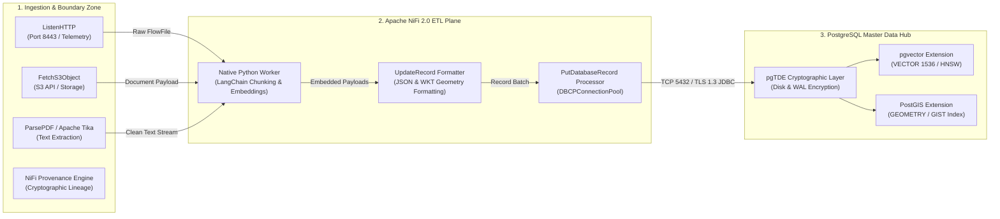

### 5.3 Interface & Routing Matrix

| Source Component | Target Component | Port / Protocol / API Ingress | Security Boundary / Trust Zone | Operational Description |
| :--- | :--- | :--- | :--- | :--- |
| Ingestion Endpoints | NiFi Ingestion Engine | `TCP 8443` / HTTPS REST API | Public / Partner Network -> Boundary DMZ | Streams unstructured documents, telemetry logs, and S3 objects into NiFi flow queues. |
| Ingestion Processors | Native Python Worker | Internal IPC Process Pool | Ingest Boundary -> Isolation Runtime | Executes LangChain splitting, model embedding calls, and metadata spatial parsing. |
| `UpdateRecord` Processor | `PutDatabaseRecord` | In-Memory FlowFile Record | Isolation Runtime -> JDBC Connection Pool | Formats metadata into JSON and updates FlowFile attributes with standard WKT geometry string representations. |
| `PutDatabaseRecord` | PostgreSQL Master Hub | `TCP 5432` / PostgreSQL JDBC (TLS 1.3) | Isolation Runtime -> Encrypted Master Database | Streams batched records over encrypted connection pool into `pgvector` and `PostGIS` columns. |

---

## 6. Advantages of the Consolidated Architecture

1. **Zero Architectural Sprawl:** Eliminates the need to maintain distinct cluster networks for vector services and spatial indices. All operations benefit from PostgreSQL's ACID transactional compliance, unified backup procedures, and single-pane-of-glass administrative tooling.
2. **Enterprise-Grade Security Perimeter:** Combining `pgTDE` with NiFi's encrypted connection pool prevents data leaks across all layers. Even if physical storage volumes or operational database backups are compromised at the disk level, embedding hashes, coordinate data, and associated textual secrets remain fully encrypted at rest.
3. **Granular Data Traceability & Lineage:** If a production LLM surfaces a hallucinated response using context from this pipeline, compliance officers and data engineers can use NiFi's Data Provenance logs to trace the exact lineage path back to the origin file, timestamp, and transformation steps.

---

## 7. Architectural Evolution & Migration Guide: NiFi 1.x vs NiFi 2.0

### 7.1 Comprehensive Comparison Matrix

| Architectural Pillar | Apache NiFi 1.x | Apache NiFi 2.0 (AI-Optimized Master Data Plane) |
| :--- | :--- | :--- |
| **Extensibility Core** | Strictly Java-based (NAR deployment). Scripting required heavy abstractions like Jython or Groovy. | Native Python Processors. Allows direct execution of native C-extensions and modern AI/ML libraries. |
| **Cluster Orchestration** | Dependent on external Apache ZooKeeper clusters for state management and primary node election. | Embedded Cluster Coordinator (ZooKeeper-free). Eliminates infrastructure overhead and deployment complexity. |
| **Execution Paradigm** | Stateful, disk-bound queueing (FlowFile repository). High disk I/O dependency. | Stateless Engine Support. Memory-first, ephemeral execution ideal for serverless and event-driven containerization. |
| **Cloud-Native Fit** | Monolithic scaling characteristics; cumbersome to scale dynamically in response to erratic workloads. | Kubernetes-Native Architecture. Designed for micro-scaling alongside AI compute workloads (GPUs/TPUs). |

### 7.2 Native Python Processor Ingestion & Vector Transformation Pipeline (Diagram 2)

The diagram below details the second dual-render architecture spec for Apache NiFi 2.0: the isolated native Python execution worker pool performing Chunking, Embedding, and PostGIS WKT formatting before committing to PostgreSQL.

#### 1. Standalone Production-Ready SVG Vector Graphic (`.svg`)

<svg xmlns="http://www.w3.org/2000/svg" viewBox="0 0 960 400" width="100%" height="100%">
  <defs>
    <marker id="arrow-nifi2" viewBox="0 0 10 10" refX="6" refY="5" markerWidth="6" markerHeight="6" orient="auto-start-reverse">
      <path d="M 0 0 L 10 5 L 0 10 z" fill="#64748B" />
    </marker>
    <filter id="shadow-nifi2" x="-4%" y="-4%" width="108%" height="108%">
      <feDropShadow dx="0" dy="2" stdDeviation="3" flood-color="#000000" flood-opacity="0.25"/>
    </filter>
  </defs>

  <!-- Background -->
  <rect width="960" height="400" fill="#0F172A" rx="10"/>

  <!-- Inbound Stream -->
  <rect x="20" y="20" width="920" height="80" fill="#1E293B" stroke="#334155" stroke-width="1.5" rx="8" filter="url(#shadow-nifi2)"/>
  <rect x="20" y="20" width="920" height="26" fill="#0F172A" rx="8"/>
  <text x="35" y="38" font-family="-apple-system, BlinkMacSystemFont, 'Segoe UI', Roboto, sans-serif" font-size="12" font-weight="bold" fill="#38BDF8">INBOUND RAW STREAM &amp; NIFI FLOWFILE QUEUE</text>

  <rect x="40" y="52" width="430" height="38" fill="#0369A1" stroke="#38BDF8" rx="4"/>
  <text x="50" y="75" font-family="-apple-system, BlinkMacSystemFont, 'Segoe UI', Roboto, sans-serif" font-size="12" font-weight="bold" fill="#E0F2FE">Unstructured Telemetry / Documents (ListenHTTP / FetchS3)</text>

  <rect x="490" y="52" width="430" height="38" fill="#1E3A8A" stroke="#3B82F6" rx="4"/>
  <text x="500" y="75" font-family="-apple-system, BlinkMacSystemFont, 'Segoe UI', Roboto, sans-serif" font-size="12" font-weight="bold" fill="#93C5FD">FlowFile Metadata &amp; Content Stream Buffer</text>

  <!-- Python Process Pool -->
  <rect x="20" y="135" width="920" height="120" fill="#1E293B" stroke="#334155" stroke-width="1.5" rx="8" filter="url(#shadow-nifi2)"/>
  <rect x="20" y="135" width="920" height="26" fill="#0F172A" rx="8"/>
  <text x="35" y="153" font-family="-apple-system, BlinkMacSystemFont, 'Segoe UI', Roboto, sans-serif" font-size="12" font-weight="bold" fill="#4ADE80">NIFI 2.0 ISOLATED NATIVE PYTHON PROCESS POOL</text>

  <rect x="40" y="170" width="270" height="70" fill="#0F172A" stroke="#22C55E" rx="6"/>
  <text x="50" y="192" font-family="-apple-system, BlinkMacSystemFont, 'Segoe UI', Roboto, sans-serif" font-size="13" font-weight="bold" fill="#86EFAC">1. Text Chunking</text>
  <text x="50" y="212" font-family="Consolas, Monaco, monospace" font-size="10" fill="#4ADE80">Recursive Character Splitter</text>

  <rect x="345" y="170" width="270" height="70" fill="#0F172A" stroke="#22C55E" rx="6"/>
  <text x="355" y="192" font-family="-apple-system, BlinkMacSystemFont, 'Segoe UI', Roboto, sans-serif" font-size="13" font-weight="bold" fill="#86EFAC">2. Vector Embeddings</text>
  <text x="355" y="212" font-family="Consolas, Monaco, monospace" font-size="10" fill="#4ADE80">1536-dim Float Array Gen</text>

  <rect x="650" y="170" width="270" height="70" fill="#0F172A" stroke="#22C55E" rx="6"/>
  <text x="660" y="192" font-family="-apple-system, BlinkMacSystemFont, 'Segoe UI', Roboto, sans-serif" font-size="13" font-weight="bold" fill="#86EFAC">3. WKT Formatting</text>
  <text x="660" y="212" font-family="Consolas, Monaco, monospace" font-size="10" fill="#4ADE80">POINT(lon lat) PostGIS Prep</text>

  <!-- Database Load Tier -->
  <rect x="20" y="285" width="920" height="90" fill="#1E293B" stroke="#334155" stroke-width="1.5" rx="8" filter="url(#shadow-nifi2)"/>
  <rect x="20" y="285" width="920" height="26" fill="#0F172A" rx="8"/>
  <text x="35" y="303" font-family="-apple-system, BlinkMacSystemFont, 'Segoe UI', Roboto, sans-serif" font-size="12" font-weight="bold" fill="#C084FC">POSTGRESQL MASTER DATABASE LOAD (PUTDATABASERECORD)</text>

  <rect x="40" y="320" width="880" height="42" fill="#0F172A" stroke="#A855F7" rx="6"/>
  <text x="50" y="346" font-family="-apple-system, BlinkMacSystemFont, 'Segoe UI', Roboto, sans-serif" font-size="12" font-weight="bold" fill="#E9D5FF">Batched JDBC Insert into secure_ai_lakehouse (pgvector HNSW + PostGIS R-Tree + pgTDE Encrypted)</text>

  <!-- Connectors -->
  <line x1="255" y1="90" x2="175" y2="170" stroke="#64748B" stroke-width="1.5" marker-end="url(#arrow-nifi2)"/>
  <line x1="310" y1="205" x2="345" y2="205" stroke="#64748B" stroke-width="1.5" marker-end="url(#arrow-nifi2)"/>
  <line x1="615" y1="205" x2="650" y2="205" stroke="#64748B" stroke-width="1.5" marker-end="url(#arrow-nifi2)"/>
  <line x1="785" y1="240" x2="480" y2="320" stroke="#64748B" stroke-width="1.5" marker-end="url(#arrow-nifi2)"/>
</svg>

#### 2. Git-Native Mermaid Topology (`.mmd`)

```mermaid
flowchart TD
    subgraph Ingest ["Inbound Stream"]
        RawStream["Raw Document / Telemetry Stream"]
        FetchS3["ListenHTTP / FetchS3 Processor"]
    end

    subgraph PythonPool ["NiFi 2.0 Native Python Worker Pool"]
        Chunker["LangChain Text Chunking"]
        Embedder["Local Transformer Vector Embedding"]
        WKT["WKT Geometry Formatter POINT(lon lat)"]
    end

    subgraph Load ["PostgreSQL Master Load"]
        PutDB["PutDatabaseRecord Processor"]
        PostgresDB["PostgreSQL Master (pgvector + PostGIS + pgTDE)"]
    end

    RawStream --> FetchS3
    FetchS3 --> Chunker
    Chunker --> Embedder
    Embedder --> WKT
    WKT --> PutDB
    PutDB -->|"Batched JDBC TLS 1.3"| PostgresDB
```

#### 3. Summary Interface & Routing Table

| Source Component | Target Component | Port / Protocol / API Ingress | Security Boundary / Access Key | Operational Significance / Flow Description |
| :--- | :--- | :--- | :--- | :--- |
| **NiFi Core Engine** | **Python Worker Pool** | Internal IPC Memory Bridge | Isolated Process Boundary | Executes Python text chunking and vector transformations natively without Jython wrappers. |
| **Python Worker** | **PutDatabaseRecord** | FlowFile Content Stream &amp; RecordReader | Memory Record Buffer | Streams transformed JSON record payload (vector array and WKT coordinates) via FlowFile content, using FlowFile attributes as routing metadata. |
| **PutDatabaseRecord** | **PostgreSQL Master** | `TCP 5432` / JDBC TLS 1.3 | DB Service Credentials / pgTDE | Commits batched records directly to `pgvector` HNSW and `PostGIS` spatial indexes. |

---

### 7.3 Step-by-Step Migration Strategy (NiFi 1.x -> NiFi 2.0)

Migration from NiFi 1.x to 2.0 requires careful planning across process group configurations, custom extensions, and state management:

#### Phase 1: Environment & Dependency Preparation
1. **Configure Cluster State & ZooKeeper Management:** Configure cluster state management in `nifi.properties` by setting `nifi.state.management.provider.cluster=zk-provider`, `nifi.cluster.is.node=true`, `nifi.zookeeper.connect.string`, and `nifi.zookeeper.root.node`. Ensure `conf/state-management.xml` defines the matching `zk-provider` cluster-provider entry using `org.apache.nifi.controller.state.providers.zookeeper.ZooKeeperStateProvider`. For embedded ZooKeeper ensembles, set `nifi.state.management.embedded.zookeeper.start=true` in `nifi.properties`, specify `nifi.state.management.embedded.zookeeper.properties=./conf/zookeeper.properties`, and configure ensemble node parameters in `conf/zookeeper.properties`.
2. **Prepare Python Environment:** Ensure Python (supported versions 3.10, 3.11, or 3.12 for NiFi 2.0.0) is installed across all worker nodes. Configure `nifi.properties` with Python binary locations (`nifi.python.command=python3`).

#### Phase 2: Flow Definition & Template Migration
1. **Convert XML Templates to Flow Definition JSON:** NiFi 1.x XML flow templates are deprecated in NiFi 2.0. Export all process groups as Flow Definition JSON files or register them in Apache NiFi Registry 2.0.
2. **Update Deprecated Processors:** Replace legacy processors (e.g., `ExecuteScript` using Jython) with native NiFi 2.0 processors or native Python components.

#### Phase 3: Custom NAR and Python Code Porting
1. **Port Custom Java NARs:** Recompile Java custom processors against the NiFi 2.0 API (`nifi-api-2.x.jar`). Note that legacy Jakarta/Javax namespace transitions apply.
2. **Deploy Native Python Processors:** Place custom Python scripts in the `python/extensions` directory. NiFi 2.0 automatically detects processor classes, installs defined dependencies (`requirements.txt`), and manages process pooling.

```python
# Example: Custom Native Python Processor for Text Chunking in NiFi 2.0
import json
from nifiapi.flowfiletransform import FlowFileTransform, FlowFileTransformResult
from nifiapi.processor import ProcessorDetails

class ChunkAndEmbedText(FlowFileTransform):
    class Java:
        implements = ['org.apache.nifi.python.processor.FlowFileTransform']

    class ProcessorDetails:
        version = '2.0.0'
        description = 'Splits raw FlowFile text into chunks and emits JSON vector payload.'

    MAX_SIZE_BYTES = 10 * 1024 * 1024  # Enforce 10MB memory safeguard threshold

    def split_text(self, text: str, chunk_size: int = 500, overlap: int = 50) -> list[str]:
        """Splits raw text into character chunks with designated overlap."""
        chunks = []
        start = 0
        while start < len(text):
            end = start + chunk_size
            chunks.append(text[start:end])
            if end >= len(text):
                break
            start += chunk_size - overlap
        return chunks

    def transform(self, context, flowfile):
        if flowfile.getSize() > self.MAX_SIZE_BYTES:
            raise ValueError(f"FlowFile size exceeds maximum threshold of {self.MAX_SIZE_BYTES} bytes")

        raw_bytes = flowfile.getContentsAsBytes()
        text_content = raw_bytes.decode('utf-8')

        # Apply text splitting logic and emit structured payload
        chunks = self.split_text(text_content)
        payload = {
            "source": flowfile.getAttribute("filename") or "unknown",
            "chunks": chunks,
            "chunk_count": len(chunks)
        }

        output_bytes = json.dumps(payload).encode('utf-8')
        return FlowFileTransformResult(
            relationship='success',
            contents=output_bytes,
            attributes={'chunk.count': str(len(chunks)), 'mime.type': 'application/json'}
        )
```

#### Phase 4: Validation & Cutover
1. **Parallel Execution (Dual-Run):** Operate NiFi 2.0 parallel to NiFi 1.x feeds. Validate output record parity in PostgreSQL using automated row counts and cryptographic checksum matching.
2. **Cutover & Decommissioning:** Re-route external API pushing endpoints to NiFi 2.0 and decommission NiFi 1.x nodes.

---

## 8. Core Pillars of NiFi 2.0 as AI Data Infrastructure

### 8.1 The Native Python Extension Ecosystem
The single most transformative feature of NiFi 2.0 is the Native Python Processor API. Previously, integrating Python required executing shell scripts or using slow scripting wrappers. NiFi 2.0 launches a dedicated Python process pool that interacts seamlessly with the core Java engine, enabling direct use of frameworks like LangChain, LlamaIndex, and Hugging Face Transformers inside visual data flows.

### 8.2 Advanced Retrieval-Augmented Generation (RAG) Pipelines
NiFi 2.0 acts as the automated ingestion engine for RAG systems by providing out-of-the-box processors for embedding generation and vector database connectors. Built-in services convert raw text to mathematical vectors natively within the flow before committing payloads to target vector stores.

### 8.3 Data Governance and Provenance for AI Compliance
Under emerging global AI frameworks (such as the EU AI Act), enterprise pipelines must account for training and context data lineage. NiFi's Data Provenance engine records every FlowFile transformation with cryptographic accountability, enabling compliance teams to trace vector embeddings back to the original source document.

### 8.4 Stateless NiFi and Containerized AI Scale
When deployed on Kubernetes, NiFi 2.0 flows can be wrapped as ephemeral, auto-scaling microservices using Stateless NiFi execution. In-memory processing allows pods to scale rapidly during spike workloads and spin down when queue depth returns to zero.

---

## 9. Functional Comparison: Apache NiFi 2.0 vs. n8n

Engineers often evaluate lightweight workflow automation tools like n8n alongside Apache NiFi. While both offer visual DAG interfaces, their architectural focus differs significantly:

| Feature | Apache NiFi 2.0 | n8n |
| :--- | :--- | :--- |
| **Primary Core Use Case** | Enterprise-scale data logistics, high-throughput streaming ETL, and AI data plane orchestration. | SaaS API orchestration, webhooks, and light workflow automation (IPaaS). |
| **Data Volume Capacity** | High-throughput streaming (Gigabytes to Terabytes/sec) with backpressure management. | Small to medium JSON payloads (API triggers, webhooks, notification alerts). |
| **SaaS/App Integration** | Configured via HTTP/REST/JDBC generic processors or custom Python extensions. | Hundreds of pre-built app nodes for commercial SaaS tools (Slack, Jira, Salesforce). |
| **Licensing** | 100% True Open-Source (Apache 2.0 License). Unlimited enterprise deployment. | Sustainable Use License / Fair-Code (Restrictions on commercial SaaS hosting). |
| **Resource Footprint** | Enterprise Java/JVM runtime with isolated Python worker pools. Requires multi-core allocations. | Lightweight Node.js runtime. Low idle memory footprint. |
| **Data Lineage & Provenance** | Immutable, granular Data Provenance tracking every byte and attribute transformation. | Execution logs for troubleshooting; lacks granular data lineage tracking. |

### Architectural Selection Framework
- **Choose Apache NiFi 2.0 when:** Processing raw big data streams, ingesting heavy files into lakehouses, building secure enterprise AI pipelines feeding PostgreSQL Master (`pgvector`/`PostGIS`), or operating under strict open-source governance.
- **Choose n8n when:** Orchestrating lightweight SaaS notifications, executing business approval webhooks, or connecting non-data-intensive SaaS tools.
- **Hybrid Pattern:** Use Apache NiFi 2.0 as the Data Plane (moving and transforming heavy streams into the lakehouse) and n8n as the Control Plane (triggering human-in-the-loop approvals or sending Slack alerts on pipeline events).

---

## 10. Technical Operational Matrix

| Layer | Technology | Primary System Role | Key Enterprise Feature |
| :--- | :--- | :--- | :--- |
| **Ingestion & ETL** | Apache NiFi 2.0 | Orchestrates streaming, native Python text chunking, and metadata parsing. | Native Python Execution, Embedded Coordinator, Data Provenance. |
| **Relational Core** | PostgreSQL 16/17 Master | Central system of record and relational metadata manager. | ACID Compliance, High Availability, Relational Integrity. |
| **AI Vectors** | `pgvector` Extension | Stores and performs high-speed semantic searches on model outputs. | HNSW and IVFFlat vector distance similarity indexing. |
| **Spatial Engine** | `PostGIS` Extension | Manages geographic boundaries and physical location data points. | Spatial R-Tree indexing, geometric calculations. |
| **Security Layer** | `pgTDE` Extension | Transparent physical disk encryption for files, tables, and WAL. | Rest-layer encryption, FIPS compliance, cryptographic masking. |

---

## 11. Architectural Synthesis & Implementation Guide (Sintesis Bahasa Malaysia)

Membina super-infrastruktur berasaskan PostgreSQL sebagai Data Store Utama (Master Hub) yang dipadukan dengan Apache NiFi 2.0 sebagai enjin logistik AI adalah satu langkah seni bina (*architectural paradigm*) yang sangat mantap. Dengan menggabungkan `pgvector` (AI/RAG), `PostGIS` (Data Geospatial/Lokasi), dan `pgTDE` (*Transparent Data Encryption* untuk sekuriti enterprise), PostgreSQL bertukar menjadi **Unified Data & AI Platform**.

### 11.1 Reka Bentuk Seni Bina (Architecture Blueprint)

Dalam ekosistem ini, peranan dibahagikan secara strategik:
- **PostgreSQL Hub (Master):** Menyimpan semua state data struktur, metadata, geospatial vectors, dan AI embedding vectors dalam keadaan tersifrat secara fizikal (`pgTDE`).
- **Apache NiFi 2.0 (Orchestrator):** Menguruskan pergerakan data dari pelbagai sumber, memanggil model LLM (menggunakan Python Natif), melakukan pemecahan teks (*text chunking*), dan menyuap keputusan tersebut ke dalam PostgreSQL Master.

```
[ Pelbagai Sumber Data ] ──► [ Apache NiFi 2.0 ]
                                 │
                                 ├─► (Native Python: Chunking / Text Splitting)
                                 ├─► (API Call: Generate Embeddings via LLM)
                                 │
                                 ▼ (Secure JDBC TLS Connection)
                  ┌──────────────────────────────┐
                  │      POSTGRESQL MASTER       │
                  │  ┌────────────────────────┐  │
                  │  │ pgTDE (Encrypted Disk) │  │
                  │  └───────────┬────────────┘  │
                  │              ▼               │
                  │   [PostGIS]  │  [pgvector]   │
                  │  (Geospatial)│ (Vector Embed)│
                  └──────────────┴───────────────┘
```

### 11.2 Langkah Operasi & Konfigurasi Utama

1. **Aktifkan Pelanjutan PostgreSQL:**
   ```sql
   CREATE EXTENSION IF NOT EXISTS vector;
   CREATE EXTENSION IF NOT EXISTS postgis;
   CREATE EXTENSION IF NOT EXISTS postgis_topology;
   ```
2. **Konfigurasi `pgTDE` (Percona Distribution for PostgreSQL):** Append `pg_tde` kepada `shared_preload_libraries` di dalam `postgresql.conf`, lakukan restart penuh kluster PostgreSQL (kerana perubahan `shared_preload_libraries` dan `pg_tde.wal_encrypt = on` memerlukan restart), bina pelanjutan menerusi `CREATE EXTENSION IF NOT EXISTS pg_tde;` di dalam setiap pangkalan data sasaran, tetapkan penyedia kunci (key provider seperti Vault/keyfile), serta aktifkan penyifratan WAL (`pg_tde.wal_encrypt = on`). Nota: fail tumpahan sementara (*temporary spill files*) tidak disifrat secara automatik oleh versi `pgTDE` semasa.
3. **Penyediaan DBCPConnectionPool di NiFi 2.0:**
   - **Database Connection URL:** `jdbc:postgresql://postgres.master.internal:5432/enterprise_ai_db?sslmode=verify-full&sslrootcert=/var/private/ssl/rootCA.crt`
   - **Database Driver Class Name:** `org.postgresql.Driver`
   - **Database Driver Location:** `/opt/nifi/current/lib/postgresql-42.x.x.jar`
4. **Implementasi Saluran Data AI:**
   - **Ingestion & Extraction:** Gunakan processor `FetchS3Object` atau `ListenHTTP` dan `ParseContent` / `Apache Tika`.
   - **Native Python Processing:** Jalankan fungsi chunking dan pemanggilan embedding secara terus dalam kanvas NiFi.
   - **Ekstrak Data Geospatial:** Formatkan koordinat ke bentuk WKT `POINT(longitude latitude)`.
   - **Penyerapan Data (`PutDatabaseRecord`):** Memetakan atribut teks dan vektor terus ke dalam ruangan `VECTOR` dan `GEOMETRY` di PostgreSQL Master.

---

## 12. Strategic Conclusion

Apache NiFi 2.0 redefines enterprise data logistics by bridging the gap between Java-based streaming architectures and the Python-dominated AI ecosystem. By acting as the master data plane feeding an encrypted, spatial-vector PostgreSQL Master hub (`pgvector` + `PostGIS` + `pgTDE`), NiFi 2.0 guarantees high-throughput ingestion, zero-trust cryptographic security, and complete data provenance—enabling organizations to scale AI workloads from experimental prototypes to mission-critical production infrastructure.


---


# Big Data Domain Specifications and Analytical Workflows

The Big Data Analytics (BDA) platform services five core analytical domain modules representing critical environmental and natural resource management capabilities.

---

## 🏛️ Domain Applications Architecture & Integration Topology

Each analytical domain module routes raw telemetry and spatial feeds through Apache NiFi 2.0 into the unified Apache Iceberg Lakehouse and PostgreSQL PostGIS/pgvector layers.

### 1. Standalone Production-Ready SVG Vector Graphic (`.svg`)

<svg xmlns="http://www.w3.org/2000/svg" viewBox="0 0 960 420" width="100%" height="100%">
  <defs>
    <marker id="arrow-ba" viewBox="0 0 10 10" refX="6" refY="5" markerWidth="6" markerHeight="6" orient="auto-start-reverse">
      <path d="M 0 0 L 10 5 L 0 10 z" fill="#64748B" />
    </marker>
    <filter id="shadow-ba" x="-4%" y="-4%" width="108%" height="108%">
      <feDropShadow dx="0" dy="2" stdDeviation="3" flood-color="#000000" flood-opacity="0.25"/>
    </filter>
  </defs>

  <!-- Background -->
  <rect width="960" height="420" fill="#0F172A" rx="10"/>

  <!-- Tier 1: Ingestion Sources -->
  <rect x="20" y="20" width="920" height="70" fill="#1E293B" stroke="#334155" stroke-width="1.5" rx="8" filter="url(#shadow-ba)"/>
  <rect x="20" y="20" width="920" height="26" fill="#0F172A" rx="8"/>
  <text x="35" y="38" font-family="-apple-system, BlinkMacSystemFont, 'Segoe UI', Roboto, sans-serif" font-size="12" font-weight="bold" fill="#94A3B8">ANALYTICAL DOMAIN INGESTION SOURCES</text>

  <rect x="35" y="52" width="160" height="30" fill="#1E3A8A" stroke="#3B82F6" rx="4"/>
  <text x="45" y="71" font-family="-apple-system, BlinkMacSystemFont, 'Segoe UI', Roboto, sans-serif" font-size="11" font-weight="bold" fill="#93C5FD">HWC Incident GeoJSON</text>

  <rect x="215" y="52" width="160" height="30" fill="#065F46" stroke="#22C55E" rx="4"/>
  <text x="225" y="71" font-family="-apple-system, BlinkMacSystemFont, 'Segoe UI', Roboto, sans-serif" font-size="11" font-weight="bold" fill="#86EFAC">GroW Borehole Logs</text>

  <rect x="395" y="52" width="160" height="30" fill="#78350F" stroke="#F59E0B" rx="4"/>
  <text x="405" y="71" font-family="-apple-system, BlinkMacSystemFont, 'Segoe UI', Roboto, sans-serif" font-size="11" font-weight="bold" fill="#FDE68A">Forest Fire Sat Thermal</text>

  <rect x="575" y="52" width="160" height="30" fill="#581C87" stroke="#A855F7" rx="4"/>
  <text x="585" y="71" font-family="-apple-system, BlinkMacSystemFont, 'Segoe UI', Roboto, sans-serif" font-size="11" font-weight="bold" fill="#E9D5FF">MAIN Vulnerability Index</text>

  <rect x="755" y="52" width="160" height="30" fill="#831843" stroke="#EC4899" rx="4"/>
  <text x="765" y="71" font-family="-apple-system, BlinkMacSystemFont, 'Segoe UI', Roboto, sans-serif" font-size="11" font-weight="bold" fill="#FBCFE8">GeoSlide Rainfall Telemetry</text>

  <!-- Tier 2: Unified Processing Engine -->
  <rect x="20" y="125" width="920" height="150" fill="#1E293B" stroke="#334155" stroke-width="1.5" rx="8" filter="url(#shadow-ba)"/>
  <rect x="20" y="125" width="920" height="26" fill="#0F172A" rx="8"/>
  <text x="35" y="143" font-family="-apple-system, BlinkMacSystemFont, 'Segoe UI', Roboto, sans-serif" font-size="12" font-weight="bold" fill="#60A5FA">UNIFIED PROCESSING &amp; SPATIAL ANALYTICS CORE</text>

  <rect x="40" y="160" width="270" height="100" fill="#0F172A" stroke="#3B82F6" rx="6"/>
  <text x="50" y="182" font-family="-apple-system, BlinkMacSystemFont, 'Segoe UI', Roboto, sans-serif" font-size="13" font-weight="bold" fill="#93C5FD">Apache NiFi 2.0 Master Pipeline</text>
  <text x="50" y="202" font-family="Consolas, Monaco, monospace" font-size="10" fill="#60A5FA">Data Contract &amp; Schema Validation</text>
  <text x="50" y="222" font-family="-apple-system, BlinkMacSystemFont, 'Segoe UI', Roboto, sans-serif" font-size="11" fill="#E2E8F0">• Convert to Parquet / Vector</text>

  <rect x="345" y="160" width="270" height="100" fill="#0F172A" stroke="#22C55E" rx="6"/>
  <text x="355" y="182" font-family="-apple-system, BlinkMacSystemFont, 'Segoe UI', Roboto, sans-serif" font-size="13" font-weight="bold" fill="#86EFAC">Spark &amp; Sedona Spatial Engine</text>
  <text x="355" y="202" font-family="Consolas, Monaco, monospace" font-size="10" fill="#4ADE80">Stream Processing &amp; Join Grids</text>
  <text x="355" y="222" font-family="-apple-system, BlinkMacSystemFont, 'Segoe UI', Roboto, sans-serif" font-size="11" fill="#E2E8F0">• Hydrogeology &amp; Risk Scoring</text>

  <rect x="650" y="160" width="270" height="100" fill="#0F172A" stroke="#F59E0B" rx="6"/>
  <text x="660" y="182" font-family="-apple-system, BlinkMacSystemFont, 'Segoe UI', Roboto, sans-serif" font-size="13" font-weight="bold" fill="#FDE68A">PostgreSQL &amp; Apache Iceberg</text>
  <text x="660" y="202" font-family="Consolas, Monaco, monospace" font-size="10" fill="#FBBF24">PostGIS / pgvector Storage</text>
  <text x="660" y="222" font-family="-apple-system, BlinkMacSystemFont, 'Segoe UI', Roboto, sans-serif" font-size="11" fill="#E2E8F0">• Spatial Buffer &amp; Vector Index</text>

  <!-- Tier 3: Consumption & Alerting -->
  <rect x="20" y="305" width="920" height="90" fill="#1E293B" stroke="#334155" stroke-width="1.5" rx="8" filter="url(#shadow-ba)"/>
  <rect x="20" y="305" width="920" height="26" fill="#0F172A" rx="8"/>
  <text x="35" y="323" font-family="-apple-system, BlinkMacSystemFont, 'Segoe UI', Roboto, sans-serif" font-size="12" font-weight="bold" fill="#C084FC">ANALYTICAL CONSUMPTION &amp; HAZARD ALERTING</text>

  <rect x="40" y="340" width="410" height="45" fill="#0F172A" stroke="#A855F7" rx="6"/>
  <text x="50" y="367" font-family="-apple-system, BlinkMacSystemFont, 'Segoe UI', Roboto, sans-serif" font-size="12" font-weight="bold" fill="#E9D5FF">Apache Superset &amp; Trino Interactive Dashboards</text>

  <rect x="510" y="340" width="410" height="45" fill="#0F172A" stroke="#EC4899" rx="6"/>
  <text x="520" y="367" font-family="-apple-system, BlinkMacSystemFont, 'Segoe UI', Roboto, sans-serif" font-size="12" font-weight="bold" fill="#FBCFE8">APISIX Automated Disaster Warning Payloads</text>

  <!-- Connectors -->
  <line x1="115" y1="82" x2="175" y2="160" stroke="#64748B" stroke-width="1.5" marker-end="url(#arrow-ba)"/>
  <line x1="295" y1="82" x2="175" y2="160" stroke="#64748B" stroke-width="1.5" marker-end="url(#arrow-ba)"/>
  <line x1="475" y1="82" x2="175" y2="160" stroke="#64748B" stroke-width="1.5" marker-end="url(#arrow-ba)"/>
  <line x1="655" y1="82" x2="785" y2="160" stroke="#64748B" stroke-width="1.5" marker-end="url(#arrow-ba)"/>
  <line x1="835" y1="82" x2="480" y2="160" stroke="#64748B" stroke-width="1.5" marker-end="url(#arrow-ba)"/>

  <line x1="310" y1="210" x2="345" y2="210" stroke="#64748B" stroke-width="1.5" marker-end="url(#arrow-ba)"/>
  <line x1="615" y1="210" x2="650" y2="210" stroke="#64748B" stroke-width="1.5" marker-end="url(#arrow-ba)"/>
  <line x1="785" y1="260" x2="245" y2="340" stroke="#64748B" stroke-width="1.5" marker-end="url(#arrow-ba)"/>
  <line x1="480" y1="260" x2="715" y2="340" stroke="#64748B" stroke-width="1.5" marker-end="url(#arrow-ba)"/>
</svg>

### 2. Git-Native Mermaid Topology (`.mmd`)

```mermaid
flowchart TD
    subgraph Sources ["Analytical Domain Ingestion Feeds"]
        HWC["HWC Incident GeoJSON Feed"]
        GroW["GroW Hydrogeology Borehole Data"]
        Fire["Forest Fire Satellite Hotspots (REST API)"]
        MAIN["MAIN Climate Vulnerability Indices"]
        GeoSlide["GeoSlide Rainfall Telemetry Curves"]
    end

    subgraph Processing ["Unified Analytics Engine"]
        NiFi["Apache NiFi 2.0 Ingestion & Contracts"]
        Spark["Apache Spark / Sedona Spatial Engine"]
        Lakehouse["PostgreSQL PostGIS / Iceberg Lakehouse"]
    end

    subgraph Consumption ["Analytical Delivery & Alerting"]
        Superset["Apache Superset & Trino Dashboards"]
        APISIX["APISIX Dispatch Warning Gateway"]
    end

    HWC -->|"HTTPS / Auth Portal"| NiFi
    GroW -->|"Parquet Ingestion"| NiFi
    Fire -->|"HTTPS REST Polling"| NiFi
    MAIN -->|"Iceberg Table Updates"| Lakehouse
    GeoSlide -->|"Real-time Streams"| Spark

    NiFi --> Spark
    Spark --> Lakehouse
    Lakehouse --> Superset
    Spark -->|"Hazard Threshold Met"| APISIX
```

### 3. Summary Interface & Routing Table

| Source Component | Target Component | Port / Protocol / API Ingress | Security Boundary / Access Key | Operational Significance / Flow Description |
| :--- | :--- | :--- | :--- | :--- |
| **HWC / GroW / Fire Ingestion** | **Apache NiFi 2.0** | `TCP 8443` / HTTPS REST API | Keycloak OIDC / TLS 1.3 | Validates GeoJSON and borehole schemas against data contracts before lakehouse store. |
| **GeoSlide Telemetry** | **Apache Spark Streaming** | `TCP 9092` / Kafka / Spark Streaming | mTLS Cluster Certs | Computes precipitation curves against geotechnical threshold curves in real time. |
| **Lakehouse Core** | **Apache Superset / Trino** | `TCP 8088` / HTTP Trino JDBC | OAuth2 JWT / RBAC Roles | Serves interactive maps, subsurface reserves, and thermal risk overlays. |
| **Spark Engine** | **APISIX Dispatch Gateway** | `TCP 8000` / HTTPS Webhook | Service Key / API Signature | Automatically dispatches hazard alerts to emergency response centers when thresholds break. |

---

## 1. Human-Wildlife Encounter & Incident Management (HWC)

* **Core Mandate:** Record incident encounters, spatial movement corridors, conflict hotspots, and species distribution patterns.
* **Modernized Ingestion & Workflow:** Legacy incident reports submitted via unvalidated web forms are replaced by structured GeoJSON payloads submitted through an authenticated web portal or mobile API. Payloads are validated against the HWC data contract, written to Iceberg tables, and cross-referenced with gazetted conservation boundaries in PostGIS to produce incident heatmaps and migration corridors in Apache Superset.

---

## 2. Integrated Groundwater Potential Information (GroW)

* **Core Mandate:** Map hydrogeological borehole reserves, groundwater availability, lithological profiles, and subsurface aquifers.
* **Modernized Ingestion & Workflow:** Hydrogeological borehole readings, lithological logs, and well testing data are ingested through Apache NiFi, which converts raw files into standardized Parquet formats. Subsurface hydrogeological models are computed using Apache Sedona on Apache Spark, with the resulting spatial layers served to decision-makers via Trino-backed Superset dashboards.

---

## 3. Forest Fire Analysis and Prediction (Forest Fire)

* **Core Mandate:** Track peatland fires, biomass susceptibility, active satellite thermal hotspots, and fire risk index predictions.
* **Modernized Ingestion & Workflow:** The manual parsing of satellite hotspot emails is retired. Apache NiFi queries satellite thermal anomaly REST APIs over HTTPS, ingesting hotspot coordinates within minutes of capture. Hotspot vectors are joined against weather forecasting grids and concession boundaries using Apache Sedona, generating spatial fire risk predictions.

---

## 4. Climate Change Vulnerability and Adaptation Index (MAIN)

* **Core Mandate:** Model hydrological flows, sea level rise, coastal vulnerability, and socio-economic climate adaptation indicators.
* **Modernized Ingestion & Workflow:** Hydrological modeling outputs, coastal vulnerability indices, and socio-economic adaptation indicators are consolidated from fragmented spreadsheets into versioned Iceberg tables. The data contract enforces valid index range constraints ($0.0 \le \text{Index} \le 1.0$) and tracks computational versions, supporting verifiable climate change reporting.

---

## 5. Geological Landslide Disaster Management (GeoSlide)

* **Core Mandate:** Calculate slope stability risks, slope movement, and early hazard warnings based on telemetry rainfall thresholds.
* **Modernized Ingestion & Workflow:** Manual file transfers of precipitation data are replaced by continuous NiFi ingestion pipelines. Ingested precipitation curves are matched against geotechnical slope stability thresholds using Spark streaming. When precipitation exceeds safety limits in vulnerable geological zones, hazard warning payloads are automatically pushed through the APISIX gateway to dispatch centers.

---

## Domain & Analytical Module Summary Table

| Business Domain Module | Core Functional Mandate | Ingestion & Processing Pipeline | Modernized Target Integration |
| :--- | :--- | :--- | :--- |
| **Incident Management (HWC)** | Incident tracking, wildlife corridors, conflict mitigation. | Direct GeoJSON API -> NiFi -> Data Contract Gate -> Iceberg -> PostGIS. | Interactive heatmaps & spatial corridor analysis in Apache Superset. |
| **Groundwater Potential (GroW)** | Borehole potential, subsurface aquifers, lithology maps. | Automated NiFi Parquet conversion -> Spark/Sedona spatial modeling. | Subsurface reserve maps queried via Trino / Apache Superset. |
| **Forest Fire Analysis** | Peatland fire prediction, biomass risk, thermal hotspot tracking. | Thermal REST API HTTPS polling -> Sedona spatial join with weather grids. | Real-time active thermal anomaly maps and predictive risk scoring. |
| **Climate Change Adaptation (MAIN)** | Hydrological & coastal vulnerability, adaptation indices. | Versioned Iceberg tables -> Data contract index validation ($0.0 \le \text{Index} \le 1.0$). | Automated vulnerability index dashboards and trend modeling. |
| **Geological Landslide (GeoSlide)** | Rainfall thresholds, slope stability alerts, disaster warnings. | Real-time precipitation telemetry -> Spark Streaming threshold matching. | Real-time automated hazard warning payloads routed via APISIX gateway. |


---


# Consumption & Integration Layer Specification

Following the establishment of the Master Data Plane (**Apache NiFi 2.0**) and the Secure Multi-Model Database (**PostgreSQL Master** + **`pgvector`** + **`PostGIS`** + **`pgTDE`**), this reference specification details the **Consumption & Integration Layer**.

This layer acts as the unified, zero-trust gateway. It securely exposes semantic, spatial, and relational enterprise data to autonomous AI agents, web/mobile microservices, legacy B2B partners, and compliance extraction tools.

---

## 🏛️ Master Architecture & Dual-Render Topology

The Consumption & Integration Layer provides three dedicated ingress/egress paradigms over the encrypted PostgreSQL Master core:

1. **AI / LLM Clients via MCP Server:** Dynamic tool invocation and context retrieval using the Model Context Protocol (MCP).
2. **Modern REST APIs via Fusio API Server:** Sub-10ms hybrid spatial-vector-text searches, OAuth2/JWT security perimeters, and data ingestion webhooks.
3. **External File Transfer Layer via Apache NiFi 2.0:** Scheduled DB extraction, native PGP encryption, and automated SFTP delivery.

### 1. Standalone Production-Ready SVG Vector Graphic (`.svg`)

<svg xmlns="http://www.w3.org/2000/svg" viewBox="0 0 960 480" width="100%" height="100%">
  <defs>
    <marker id="arrow-ci" viewBox="0 0 10 10" refX="6" refY="5" markerWidth="6" markerHeight="6" orient="auto-start-reverse">
      <path d="M 0 0 L 10 5 L 0 10 z" fill="#64748B" />
    </marker>
    <filter id="shadow-ci" x="-4%" y="-4%" width="108%" height="108%">
      <feDropShadow dx="0" dy="2" stdDeviation="3" flood-color="#000000" flood-opacity="0.25"/>
    </filter>
  </defs>

  <!-- Background -->
  <rect width="960" height="480" fill="#0F172A" rx="10"/>

  <!-- Tier 1: Client Applications -->
  <rect x="20" y="20" width="920" height="70" fill="#1E293B" stroke="#334155" stroke-width="1.5" rx="8" filter="url(#shadow-ci)"/>
  <rect x="20" y="20" width="920" height="26" fill="#0F172A" rx="8"/>
  <text x="35" y="38" font-family="-apple-system, BlinkMacSystemFont, 'Segoe UI', Roboto, sans-serif" font-size="12" font-weight="bold" fill="#94A3B8">AI CLIENTS &amp; EXTERNAL APPLICATIONS TIER</text>

  <rect x="40" y="52" width="260" height="30" fill="#1E3A8A" stroke="#3B82F6" rx="4"/>
  <text x="50" y="71" font-family="-apple-system, BlinkMacSystemFont, 'Segoe UI', Roboto, sans-serif" font-size="11" font-weight="bold" fill="#93C5FD">Autonomous LLM / AI Agents</text>

  <rect x="350" y="52" width="260" height="30" fill="#065F46" stroke="#22C55E" rx="4"/>
  <text x="360" y="71" font-family="-apple-system, BlinkMacSystemFont, 'Segoe UI', Roboto, sans-serif" font-size="11" font-weight="bold" fill="#86EFAC">Web &amp; Mobile Microservices</text>

  <rect x="660" y="52" width="260" height="30" fill="#78350F" stroke="#F59E0B" rx="4"/>
  <text x="670" y="71" font-family="-apple-system, BlinkMacSystemFont, 'Segoe UI', Roboto, sans-serif" font-size="11" font-weight="bold" fill="#FDE68A">B2B &amp; Legacy File Consumers</text>

  <!-- Tier 2: Consumption Gateway Layer -->
  <rect x="20" y="125" width="920" height="190" fill="#1E293B" stroke="#334155" stroke-width="1.5" rx="8" filter="url(#shadow-ci)"/>
  <rect x="20" y="125" width="920" height="26" fill="#0F172A" rx="8"/>
  <text x="35" y="143" font-family="-apple-system, BlinkMacSystemFont, 'Segoe UI', Roboto, sans-serif" font-size="12" font-weight="bold" fill="#60A5FA">CONSUMPTION &amp; INTEGRATION GATEWAY LAYER</text>

  <!-- Component 1: MCP Server -->
  <rect x="40" y="160" width="260" height="140" fill="#0F172A" stroke="#3B82F6" stroke-width="1" rx="6"/>
  <text x="50" y="182" font-family="-apple-system, BlinkMacSystemFont, 'Segoe UI', Roboto, sans-serif" font-size="13" font-weight="bold" fill="#93C5FD">1. Python MCP Server</text>
  <text x="50" y="202" font-family="Consolas, Monaco, monospace" font-size="10" fill="#60A5FA">Protocol: JSON-RPC 2.0 (std/mTLS)</text>
  <text x="50" y="222" font-family="-apple-system, BlinkMacSystemFont, 'Segoe UI', Roboto, sans-serif" font-size="11" fill="#E2E8F0">• Tool: spatial_semantic_search</text>
  <text x="50" y="240" font-family="-apple-system, BlinkMacSystemFont, 'Segoe UI', Roboto, sans-serif" font-size="11" fill="#E2E8F0">• Dynamic Context Retrieval</text>
  <text x="50" y="258" font-family="-apple-system, BlinkMacSystemFont, 'Segoe UI', Roboto, sans-serif" font-size="11" fill="#E2E8F0">• Keycloak OIDC Service Account</text>

  <!-- Component 2: Fusio API Server -->
  <rect x="350" y="160" width="260" height="140" fill="#0F172A" stroke="#22C55E" stroke-width="1" rx="6"/>
  <text x="360" y="182" font-family="-apple-system, BlinkMacSystemFont, 'Segoe UI', Roboto, sans-serif" font-size="13" font-weight="bold" fill="#86EFAC">2. Fusio API Server &amp; Gateway</text>
  <text x="360" y="202" font-family="Consolas, Monaco, monospace" font-size="10" fill="#4ADE80">Port 8080 / OpenAPI &amp; TypeSchema</text>
  <text x="360" y="222" font-family="-apple-system, BlinkMacSystemFont, 'Segoe UI', Roboto, sans-serif" font-size="11" fill="#E2E8F0">• TypeSchema Data Contracts</text>
  <text x="360" y="240" font-family="-apple-system, BlinkMacSystemFont, 'Segoe UI', Roboto, sans-serif" font-size="11" fill="#E2E8F0">• OpenAPI JSON Formatted Actions</text>
  <text x="360" y="258" font-family="-apple-system, BlinkMacSystemFont, 'Segoe UI', Roboto, sans-serif" font-size="11" fill="#E2E8F0">• OAuth2 / OIDC Security Perimeter</text>

  <!-- Component 3: File Transfer NiFi Egress -->
  <rect x="660" y="160" width="260" height="140" fill="#0F172A" stroke="#F59E0B" stroke-width="1" rx="6"/>
  <text x="670" y="182" font-family="-apple-system, BlinkMacSystemFont, 'Segoe UI', Roboto, sans-serif" font-size="13" font-weight="bold" fill="#FDE68A">3. NiFi 2.0 Egress &amp; SFTP</text>
  <text x="670" y="202" font-family="Consolas, Monaco, monospace" font-size="10" fill="#FBBF24">Port 22 (PutSFTP / EncryptContent)</text>
  <text x="670" y="222" font-family="-apple-system, BlinkMacSystemFont, 'Segoe UI', Roboto, sans-serif" font-size="11" fill="#E2E8F0">• Cron Extract DB Queries</text>
  <text x="670" y="240" font-family="-apple-system, BlinkMacSystemFont, 'Segoe UI', Roboto, sans-serif" font-size="11" fill="#E2E8F0">• PGP Cryptographic Packaging</text>
  <text x="670" y="258" font-family="-apple-system, BlinkMacSystemFont, 'Segoe UI', Roboto, sans-serif" font-size="11" fill="#E2E8F0">• S3 Egress &amp; SFTP Protocol</text>

  <!-- Tier 3: Core Database Hub -->
  <rect x="20" y="345" width="920" height="115" fill="#1E293B" stroke="#334155" stroke-width="1.5" rx="8" filter="url(#shadow-ci)"/>
  <rect x="20" y="345" width="920" height="26" fill="#0F172A" rx="8"/>
  <text x="35" y="363" font-family="-apple-system, BlinkMacSystemFont, 'Segoe UI', Roboto, sans-serif" font-size="12" font-weight="bold" fill="#C084FC">POSTGRESQL UNIFIED AI MASTER HUB (PORT 5432 / TLS 1.3)</text>

  <rect x="40" y="380" width="260" height="65" fill="#0F172A" stroke="#A855F7" rx="6"/>
  <text x="50" y="400" font-family="-apple-system, BlinkMacSystemFont, 'Segoe UI', Roboto, sans-serif" font-size="12" font-weight="bold" fill="#E9D5FF">pgvector Extension</text>
  <text x="50" y="418" font-family="Consolas, Monaco, monospace" font-size="10" fill="#C084FC">HNSW Index (vector_cosine_ops)</text>

  <rect x="350" y="380" width="260" height="65" fill="#0F172A" stroke="#A855F7" rx="6"/>
  <text x="360" y="400" font-family="-apple-system, BlinkMacSystemFont, 'Segoe UI', Roboto, sans-serif" font-size="12" font-weight="bold" fill="#E9D5FF">PostGIS Spatial Engine</text>
  <text x="360" y="418" font-family="Consolas, Monaco, monospace" font-size="10" fill="#C084FC">ST_DWithin Geography R-Tree</text>

  <rect x="660" y="380" width="260" height="65" fill="#0F172A" stroke="#A855F7" rx="6"/>
  <text x="670" y="400" font-family="-apple-system, BlinkMacSystemFont, 'Segoe UI', Roboto, sans-serif" font-size="12" font-weight="bold" fill="#E9D5FF">pgTDE &amp; Security Perimeter</text>
  <text x="670" y="418" font-family="Consolas, Monaco, monospace" font-size="10" fill="#C084FC">Transparent Encryption at Rest</text>

  <!-- Connectors -->
  <line x1="170" y1="82" x2="170" y2="160" stroke="#64748B" stroke-width="1.5" marker-end="url(#arrow-ci)"/>
  <line x1="480" y1="82" x2="480" y2="160" stroke="#64748B" stroke-width="1.5" marker-end="url(#arrow-ci)"/>
  <line x1="790" y1="82" x2="790" y2="160" stroke="#64748B" stroke-width="1.5" marker-end="url(#arrow-ci)"/>

  <line x1="170" y1="300" x2="170" y2="380" stroke="#64748B" stroke-width="1.5" marker-end="url(#arrow-ci)"/>
  <line x1="480" y1="300" x2="480" y2="380" stroke="#64748B" stroke-width="1.5" marker-end="url(#arrow-ci)"/>
  <line x1="790" y1="300" x2="790" y2="380" stroke="#64748B" stroke-width="1.5" marker-end="url(#arrow-ci)"/>
</svg>

### 2. Git-Native Mermaid Topology (`.mmd`)

```mermaid
flowchart TD
    subgraph Clients ["AI Clients & External Applications"]
        LLM["Autonomous LLM / AI Agents<br/>(Claude, OpenAI, Local LLMs)"]
        WebApps["Modern Web & Mobile Apps<br/>(React, Flutter, Microservices)"]
        LegacyB2B["B2B Partners & Legacy Systems<br/>(SFTP Consumers & Data Audits)"]
    end

    subgraph ConsumptionLayer ["Consumption & Integration Layer"]
        MCP["1. Self-Hosted MCP Server<br/>(Tool Invocation & Prompts)"]
        Fusio["2. Fusio API Server & Gateway<br/>(TypeSchema & OpenAPI REST)"]
        NiFiEgress["3. NiFi 2.0 Egress Pipeline<br/>(PGP Encrypt & PutSFTP)"]
    end

    subgraph DatabaseHub ["PostgreSQL Unified AI Master Hub"]
        pgTDE["pgTDE Transparent Data Encryption"]
        pgvector["pgvector HNSW Semantic Index"]
        PostGIS["PostGIS R-Tree Spatial Index"]
    end

    LLM -->|"JSON-RPC 2.0 / MCP Protocol"| MCP
    WebApps -->|"HTTPS REST / OAuth2 JWT"| Fusio
    LegacyB2B <-->|"Secure SFTP / Encrypted Files"| NiFiEgress

    MCP -->|"Controlled Spatial + Vector SQL"| DatabaseHub
    Fusio -->|"Fusio/PSX Schema Validation & SQL Joins"| DatabaseHub
    Fusio -->|"REST Ingestion Payload"| NiFiEgress
    NiFiEgress <-->|"Cron Extraction & Scheduled Pipeline"| DatabaseHub

    DatabaseHub --- pgTDE
    DatabaseHub --- pgvector
    DatabaseHub --- PostGIS
```

### 3. Summary Interface & Routing Table

| Source Component | Target Component | Port / Protocol / API Ingress | Security Boundary / Access Key | Operational Significance / Flow Description |
| :--- | :--- | :--- | :--- | :--- |
| **LLM / AI Agent** | **MCP Server** | Stdio / `TCP 8080` (JSON-RPC 2.0) | Keycloak Service Account / Read-Only Tool Limits | Self-hosted MCP server intercepting model prompts and executing deterministic `semantic_spatial_search` tools against PostgreSQL. |
| **Web / Microservices** | **Fusio API Server** | `TCP 8080` / HTTPS REST API | OAuth2 Bearer JWT Token / APISIX Gateway | Exposes TypeSchema-validated endpoints formatted in OpenAPI JSON standard with sub-10ms target latency. |
| **Fusio API Server** | **Apache NiFi 2.0** | `TCP 8443` / HTTPS Webhook | NiFi Mutual TLS (mTLS) Client Certificate | Streams incoming vector ingestion payloads directly into NiFi flow queues. |
| **Apache NiFi 2.0** | **External SFTP Server** | `TCP 22` / SSH SFTP Protocol | SSH Public Key / PGP Encryption Key | Extracts scheduled SQL batches from PostgreSQL, packages encrypted CSVs/Parquet, and transfers via SFTP. |
| **Consumption Layer** | **PostgreSQL Master** | `TCP 5432` / PostgreSQL TLS 1.3 | DB Role Permissions (`verify-full`, pgTDE key) | Executes unified SQL queries combining PostGIS `ST_DWithin` spatial buffers and `pgvector` HNSW distance matchers. |

---

## 1. AI with MCP (Model Context Protocol) Server Blueprint

The **Model Context Protocol (MCP)** is an open standard designed to connect Large Language Models to local data infrastructure. By exposing pre-defined database tools, LLMs execute controlled SQL operations rather than raw, arbitrary queries.

### 1.1 Architectural Bridge: REST/OpenAPI to MCP Transition via Fusio

With the rapid advancement of Artificial Intelligence (AI) agents, Large Language Models (LLMs) are no longer merely responding with text; they act as reasoning engines calling external functions. However, the largest gap in enterprise environments is enabling LLMs to securely access existing APIs without requiring fragile custom glue code.

This section dissects the methodology for bridging the gap between REST/OpenAPI architectures and the Model Context Protocol (MCP) to produce MCP-ready endpoints.

#### 1. Key Problem: Why Are Traditional APIs Difficult for AI to Consume?

* **Context Window Bloat (Token Bloat):** OpenAPI/Swagger specifications containing hundreds of schemas consume the model's context window budget before reasoning even begins.
* **Protocol Differences:** REST is based on stateless HTTP (request-response), whereas modern agent interactions require bidirectional JSON-RPC exchanges via stdio or Server-Sent Events (SSE / Streamable HTTP).
* **Security Risks Without Boundaries:** Passing API keys directly to models exposes risks of unintended tool invocation without strict auditing.

#### 2. Architectural Bridge: Fusio API Server as an MCP Hub

Fusio API Server (an open-source, PHP-based platform) acts as an abstraction layer between internal databases and AI models.

```
[ AI Agents (Gemini / Claude / Qwen / Local LLM) ]
                 │
                 ▼  (Model Context Protocol / JSON-RPC over SSE)
    [ MCP Proxy / Gateway Layer ]
                 │
                 ▼  (REST / Automatic OpenAPI Spec)
     [ Fusio API Server (Self-Hosted) ]
                 │
      ┌──────────┴──────────┐
      ▼                     ▼
[ PostgreSQL / Patroni ]  [ Business Logic PHP/Worker ]
```

By positioning Fusio at the core of the enterprise gateway:

* **Instant Schema Generation:** Every endpoint in Fusio automatically generates TypeSchema and OpenAPI definitions.
* **Schema Thinning:** Only critical endpoints (e.g., log inspection, cluster status, data search) are exposed to MCP, avoiding the token waste of exposing hundreds of CRUD schemas.
* **Data Sovereignty:** Database credentials and API keys remain strictly within infrastructure boundaries without exposure to third-party cloud services.

### Dual-Render Diagram 2: Model Context Protocol (MCP) Tool Invocation & Spatial-Vector Query Execution

The diagram below details the second dual-render architecture spec for the Consumption Layer: the end-to-end MCP JSON-RPC 2.0 tool invocation lifecycle over PostgreSQL `PostGIS` and `pgvector`.

#### 1. Standalone Production-Ready SVG Vector Graphic (`.svg`)

<svg xmlns="http://www.w3.org/2000/svg" viewBox="0 0 960 400" width="100%" height="100%">
  <defs>
    <marker id="arrow-mcp2" viewBox="0 0 10 10" refX="6" refY="5" markerWidth="6" markerHeight="6" orient="auto-start-reverse">
      <path d="M 0 0 L 10 5 L 0 10 z" fill="#64748B" />
    </marker>
    <filter id="shadow-mcp2" x="-4%" y="-4%" width="108%" height="108%">
      <feDropShadow dx="0" dy="2" stdDeviation="3" flood-color="#000000" flood-opacity="0.25"/>
    </filter>
  </defs>

  <!-- Background -->
  <rect width="960" height="400" fill="#0F172A" rx="10"/>

  <!-- LLM Prompt Invocation -->
  <rect x="20" y="20" width="920" height="80" fill="#1E293B" stroke="#334155" stroke-width="1.5" rx="8" filter="url(#shadow-mcp2)"/>
  <rect x="20" y="20" width="920" height="26" fill="#0F172A" rx="8"/>
  <text x="35" y="38" font-family="-apple-system, BlinkMacSystemFont, 'Segoe UI', Roboto, sans-serif" font-size="12" font-weight="bold" fill="#38BDF8">AUTONOMOUS LLM CLIENT / TOOL INVOCATION TIER</text>

  <rect x="40" y="52" width="430" height="38" fill="#0369A1" stroke="#38BDF8" rx="4"/>
  <text x="50" y="75" font-family="-apple-system, BlinkMacSystemFont, 'Segoe UI', Roboto, sans-serif" font-size="12" font-weight="bold" fill="#E0F2FE">LLM Agent (Claude / OpenAI / Local vLLM)</text>

  <rect x="490" y="52" width="430" height="38" fill="#1E3A8A" stroke="#3B82F6" rx="4"/>
  <text x="500" y="75" font-family="-apple-system, BlinkMacSystemFont, 'Segoe UI', Roboto, sans-serif" font-size="12" font-weight="bold" fill="#93C5FD">JSON-RPC 2.0 tool_call: semantic_spatial_search</text>

  <!-- MCP Execution Server -->
  <rect x="20" y="135" width="920" height="120" fill="#1E293B" stroke="#334155" stroke-width="1.5" rx="8" filter="url(#shadow-mcp2)"/>
  <rect x="20" y="135" width="920" height="26" fill="#0F172A" rx="8"/>
  <text x="35" y="153" font-family="-apple-system, BlinkMacSystemFont, 'Segoe UI', Roboto, sans-serif" font-size="12" font-weight="bold" fill="#4ADE80">FASTMCP SERVER EXECUTION &amp; EMBEDDING GENERATION</text>

  <rect x="40" y="170" width="270" height="70" fill="#0F172A" stroke="#22C55E" rx="6"/>
  <text x="50" y="192" font-family="-apple-system, BlinkMacSystemFont, 'Segoe UI', Roboto, sans-serif" font-size="13" font-weight="bold" fill="#86EFAC">1. Parameter Parsing</text>
  <text x="50" y="212" font-family="Consolas, Monaco, monospace" font-size="10" fill="#4ADE80">query_text, lon, lat, radius</text>

  <rect x="345" y="170" width="270" height="70" fill="#0F172A" stroke="#22C55E" rx="6"/>
  <text x="355" y="192" font-family="-apple-system, BlinkMacSystemFont, 'Segoe UI', Roboto, sans-serif" font-size="13" font-weight="bold" fill="#86EFAC">2. Vector Embedding</text>
  <text x="355" y="212" font-family="Consolas, Monaco, monospace" font-size="10" fill="#4ADE80">SentenceTransformer Model</text>

  <rect x="650" y="170" width="270" height="70" fill="#0F172A" stroke="#22C55E" rx="6"/>
  <text x="660" y="192" font-family="-apple-system, BlinkMacSystemFont, 'Segoe UI', Roboto, sans-serif" font-size="13" font-weight="bold" fill="#86EFAC">3. Controlled SQL Query</text>
  <text x="660" y="212" font-family="Consolas, Monaco, monospace" font-size="10" fill="#4ADE80">ST_DWithin &amp; &lt;=&gt; Operator</text>

  <!-- Database Core Tier -->
  <rect x="20" y="285" width="920" height="90" fill="#1E293B" stroke="#334155" stroke-width="1.5" rx="8" filter="url(#shadow-mcp2)"/>
  <rect x="20" y="285" width="920" height="26" fill="#0F172A" rx="8"/>
  <text x="35" y="303" font-family="-apple-system, BlinkMacSystemFont, 'Segoe UI', Roboto, sans-serif" font-size="12" font-weight="bold" fill="#C084FC">POSTGRESQL UNIFIED AI MASTER HUB (PORT 5432 / READ-ONLY SESSION)</text>

  <rect x="40" y="320" width="880" height="42" fill="#0F172A" stroke="#A855F7" rx="6"/>
  <text x="50" y="346" font-family="-apple-system, BlinkMacSystemFont, 'Segoe UI', Roboto, sans-serif" font-size="12" font-weight="bold" fill="#E9D5FF">Hybrid SQL Execution: PostGIS ST_DWithin (Geography Buffer) + pgvector HNSW Cosine Matcher</text>

  <!-- Connectors -->
  <line x1="255" y1="90" x2="175" y2="170" stroke="#64748B" stroke-width="1.5" marker-end="url(#arrow-mcp2)"/>
  <line x1="310" y1="205" x2="345" y2="205" stroke="#64748B" stroke-width="1.5" marker-end="url(#arrow-mcp2)"/>
  <line x1="615" y1="205" x2="650" y2="205" stroke="#64748B" stroke-width="1.5" marker-end="url(#arrow-mcp2)"/>
  <line x1="785" y1="240" x2="480" y2="320" stroke="#64748B" stroke-width="1.5" marker-end="url(#arrow-mcp2)"/>
</svg>

#### 2. Git-Native Mermaid Topology (`.mmd`)

```mermaid
flowchart TD
    subgraph Client ["LLM Client"]
        Agent["Autonomous LLM Prompt"]
        JSONRPC["JSON-RPC 2.0 tool_call"]
    end

    subgraph FastMCP ["Python FastMCP Server"]
        Parser["Extract query_text & coordinates"]
        Embedder["Local SentenceTransformer Embedding"]
        SQLGen["Construct Parametric SQL Statement"]
    end

    subgraph Postgres ["PostgreSQL Unified Hub"]
        PostGIS["PostGIS ST_DWithin Spatial Buffer"]
        vector["pgvector HNSW Cosine Distance"]
    end

    Agent --> JSONRPC
    JSONRPC --> Parser
    Parser --> Embedder
    Embedder --> SQLGen
    SQLGen -->|"Read-Only SQL Transaction"| PostGIS
    PostGIS <--> vector
```

#### 3. Summary Interface & Routing Table

| Source Component | Target Component | Port / Protocol / API Ingress | Security Boundary / Access Key | Operational Significance / Flow Description |
| :--- | :--- | :--- | :--- | :--- |
| **LLM Agent** | **Python MCP Server** | Stdio / `TCP 8080` (JSON-RPC 2.0) | Keycloak OIDC Service Account | Intercepts agent prompt and executes pre-defined `semantic_spatial_search` tool. |
| **MCP Server** | **PostgreSQL Hub** | `TCP 5432` / PostgreSQL TLS 1.3 | Read-Only Session Transaction | Evaluates spatial buffer `ST_DWithin` and cosine vector distance `<=>` in unified SQL pass. |

---

### Production Python MCP Server Code (`mcp_postgres_server.py`)

```python
"""Enterprise PostgreSQL MCP Server for Spatial & Semantic RAG Search.

Protocol: Model Context Protocol (MCP)
Author: BDA Infrastructure Team
License: Apache-2.0
"""

import os
import json
import logging
import asyncpg
from mcp.server.fastmcp import FastMCP
from sentence_transformers import SentenceTransformer

# Configure logging
logging.basicConfig(level=logging.INFO)
logger = logging.getLogger("mcp-postgres-server")

# Initialize FastMCP Server instance
mcp = FastMCP("PostgreSQL Spatial-Semantic Knowledge Hub")

# Global connection pool and embedding model handle
db_pool = None
embedding_model = None

LOCAL_MODEL_PATH = os.getenv("EMBEDDING_MODEL_PATH", "/opt/models/WhereIsAI/UAE-Large-V1")
DB_DSN = os.getenv("DATABASE_URL")
if not DB_DSN:
    raise RuntimeError("DATABASE_URL environment variable must be set in deployment secret store.")

@mcp.on_startup()
async def startup():
    """Initialize database connection pool and local embedding model on startup."""
    global db_pool, embedding_model
    logger.info("Initializing PostgreSQL Connection Pool...")
    db_pool = await asyncpg.create_pool(dsn=DB_DSN, min_size=2, max_size=10)

    logger.info(f"Loading local SentenceTransformer model from {LOCAL_MODEL_PATH}...")
    embedding_model = SentenceTransformer(LOCAL_MODEL_PATH, device="cuda" if os.path.exists("/dev/nvidia0") else "cpu", local_files_only=True)
    logger.info("MCP Server successfully initialized.")

@mcp.on_shutdown()
async def shutdown():
    """Gracefully close database pool on shutdown."""
    global db_pool
    if db_pool:
        await db_pool.close()
        logger.info("PostgreSQL Connection Pool closed.")

@mcp.tool()
async def semantic_spatial_search(
    query_text: str,
    longitude: float,
    latitude: float,
    radius_meters: float = 5000.0,
    limit: int = 5
) -> str:
    """Executes a hybrid spatial (PostGIS) and semantic vector (pgvector) query with strict session context injection.

    Args:
        query_text: Plain text search prompt from user.
        longitude: WGS84 Longitude (e.g. 101.6868 for Cyberjaya).
        latitude: WGS84 Latitude (e.g. 2.9213 for Cyberjaya).
        radius_meters: Spatial bounding radius in meters (default: 5000m).
        limit: Maximum record count to return.

    Returns:
        JSON string containing matching documents, spatial distance, and similarity score.
    """
    global db_pool, embedding_model
    if not db_pool or not embedding_model:
        return json.dumps({"error": "Server not initialized"})

    # Derive identity parameters from authenticated MCP principal context rather than caller input
    ctx = mcp.get_context()
    user_role = getattr(ctx, "user_role", None) or os.getenv("MCP_CLIENT_ROLE")
    tenant_id = getattr(ctx, "tenant_id", None) or os.getenv("MCP_CLIENT_TENANT_ID")

    if not user_role or user_role not in ALLOWED_ROLES:
        raise ValueError(f"Invalid or missing user_role in MCP identity context: {user_role}")
    if not tenant_id or not isinstance(tenant_id, str):
        raise ValueError("Missing or invalid tenant_id in MCP identity context")

    # 1. Generate local vector embedding
    embedding_vector = embedding_model.encode(query_text).tolist()
    embedding_str = f"[{','.join(map(str, embedding_vector))}]"

    # 2. Query PostgreSQL Master with transactional session context parameter binding via set_config
    sql_query = """
        SELECT
            uuid,
            source_origin,
            payload_content,
            ST_AsText(spatial_coordinates) AS location_wkt,
            ST_Distance(spatial_coordinates, ST_SetSRID(ST_MakePoint($1, $2), 4326)::geography) AS distance_meters,
            1 - (semantic_embedding <=> $3::vector) AS cosine_similarity
        FROM secure_ai_lakehouse
        WHERE ST_DWithin(spatial_coordinates, ST_SetSRID(ST_MakePoint($1, $2), 4326)::geography, $4)
        ORDER BY semantic_embedding <=> $3::vector
        LIMIT $5;
    """

    async with db_pool.acquire() as conn:
        async with conn.transaction():
            # Inject authenticated session security parameters for PostgreSQL Row-Level Security (RLS) via set_config
            await conn.execute("SELECT set_config('app.current_user_role', $1, true);", user_role)
            await conn.execute("SELECT set_config('app.current_tenant_id', $1, true);", tenant_id)

            records = await conn.fetch(sql_query, longitude, latitude, embedding_str, radius_meters, limit)

        results = []
        for r in records:
            results.append({
                "uuid": str(r["uuid"]),
                "source_origin": r["source_origin"],
                "content": r["payload_content"],
                "location_wkt": r["location_wkt"],
                "distance_meters": round(r["distance_meters"], 2),
                "similarity_score": round(r["cosine_similarity"], 4)
            })

        return json.dumps(results, indent=2)

if __name__ == "__main__":
    mcp.run()
```

---

## 2. Fusio API Server & Self-Hosted MCP Blueprint

For microservices, web apps, external partners, and self-hosted autonomous AI agent orchestration, **Fusio API Server** serves as an open-source API management and API server platform. Fusio incorporates **TypeSchema** for strict JSON data contract definitions and formats endpoints into standard **OpenAPI** (JSON Schema) specifications.

### Fusio API Server Configuration & Schema Specification (`fusio_app.json`)

```json
{
  "title": "BDA Hybrid Search & Ingestion API",
  "version": "6.0.0",
  "definitions": {
    "HybridSearchRequest": {
      "type": "object",
      "properties": {
        "query": {
          "type": "string",
          "description": "Natural language query string for full-text and semantic vector matching"
        },
        "latitude": {
          "type": "number",
          "minimum": -90.0,
          "maximum": 90.0,
          "description": "WGS84 latitude coordinate (-90.0 to 90.0)"
        },
        "longitude": {
          "type": "number",
          "minimum": -180.0,
          "maximum": 180.0,
          "description": "WGS84 longitude coordinate (-180.0 to 180.0)"
        },
        "radius_meters": {
          "type": "number",
          "minimum": 1.0,
          "maximum": 50000.0,
          "default": 5000.0,
          "description": "Spatial search buffer radius in meters (1.0 to 50000.0)"
        },
        "limit": {
          "type": "integer",
          "minimum": 1,
          "maximum": 100,
          "default": 10,
          "description": "Maximum candidate result rows to return (1 to 100)"
        }
      },
      "required": ["query", "latitude", "longitude"]
    },
    "HybridSearchResponse": {
      "type": "object",
      "properties": {
        "status": { "type": "string" },
        "user_id": { "type": "string" },
        "total_results": { "type": "integer" },
        "data": {
          "type": "array",
          "items": {
            "$ref": "#/definitions/SearchResultItem"
          }
        }
      }
    },
    "SearchResultItem": {
      "type": "object",
      "properties": {
        "id": { "type": "string" },
        "chunk_content": { "type": "string" },
        "metadata": {
          "type": "object",
          "description": "JSON metadata key-value document attributes"
        },
        "latitude": { "type": "number" },
        "longitude": { "type": "number" },
        "distance_meters": { "type": "number" },
        "cosine_similarity": { "type": "number" },
        "text_rank": { "type": "number" }
      }
    },
    "IngestPayloadRequest": {
      "type": "object",
      "properties": {
        "document_id": { "type": "string" },
        "content": { "type": "string" },
        "metadata": { "type": "object" }
      },
      "required": ["document_id", "content"]
    },
    "IngestPayloadResponse": {
      "type": "object",
      "properties": {
        "status": { "type": "string" },
        "message": { "type": "string" },
        "nifi_queue_status": { "type": "integer" }
      }
    }
  }
}
```

### Self-Hosted Fusio Hybrid Search Action (`fusio_hybrid_search.php`)

```php
<?php
/**
 * Fusio API Action for BDA Hybrid Spatial-Vector-Text Search over PostgreSQL Master.
 *
 * Uses OpenAPI JSON formatting, Fusio/PSX schema structural contracts, and RLS context binding.
 */

namespace App\Action;

use Fusio\Engine\ActionAbstract;
use Fusio\Engine\ContextInterface;
use Fusio\Engine\ParametersInterface;
use Fusio\Engine\RequestInterface;

class HybridSearchAction extends ActionAbstract
{
    public function handle(RequestInterface $request, ParametersInterface $parameters, ContextInterface $context): mixed
    {
        $body = $request->getPayload();
        $query = (string) ($body->query ?? '');

        $rawLat = $body->latitude ?? null;
        $rawLon = $body->longitude ?? null;

        if (!is_numeric($rawLat) || !is_finite((float) $rawLat)) {
            throw new \InvalidArgumentException('latitude must be a valid finite numeric value');
        }
        if (!is_numeric($rawLon) || !is_finite((float) $rawLon)) {
            throw new \InvalidArgumentException('longitude must be a valid finite numeric value');
        }

        $lat = (float) $rawLat;
        $lon = (float) $rawLon;
        $radius = (float) ($body->radius_meters ?? 5000.0);
        $limit = (int) ($body->limit ?? 10);

        // Server-side bounds validation
        if ($lat < -90.0 || $lat > 90.0) {
            throw new \InvalidArgumentException('latitude must be between -90.0 and 90.0 degrees');
        }
        if ($lon < -180.0 || $lon > 180.0) {
            throw new \InvalidArgumentException('longitude must be between -180.0 and 180.0 degrees');
        }
        if ($radius < 1.0 || $radius > 50000.0) {
            throw new \InvalidArgumentException('radius_meters must be between 1.0 and 50000.0 meters');
        }
        if ($limit < 1 || $limit > 100) {
            throw new \InvalidArgumentException('limit must be between 1 and 100');
        }

        /** @var \PDO $pdo */
        $pdo = $this->connector->getConnection('PostgreSQL-Master');

        $userRole = $context->getUser()->getRole();
        $tenantId = $context->getUser()->getTenantId();

        if (empty($userRole) || !is_string($userRole)) {
            throw new \InvalidArgumentException('Missing or invalid authenticated user_role identity claim');
        }
        if (empty($tenantId) || !is_string($tenantId)) {
            throw new \InvalidArgumentException('Missing or invalid authenticated tenant_id identity claim');
        }

        // Generate vector embedding prior to starting the database transaction
        $vectorStr = $this->generateVectorEmbedding($query);

        // Combined PostGIS ST_DWithin, pgvector cosine distance, and full-text search with unique parameter placeholders
        $sql = "
            SELECT
                id,
                chunk_content,
                metadata,
                ST_Y(location::geometry) as latitude,
                ST_X(location::geometry) as longitude,
                ST_Distance(
                    location,
                    ST_SetSRID(ST_MakePoint(:lon1, :lat1), 4326)::geography
                ) as distance_meters,
                1 - (embedding <=> :vector1::vector) as cosine_similarity,
                ts_rank(search_vector, plainto_tsquery('english', :fts_query1)) as text_rank
            FROM bda_golden_ssot.enterprise_knowledge_base
            WHERE ST_DWithin(
                location,
                ST_SetSRID(ST_MakePoint(:lon2, :lat2), 4326)::geography,
                :radius
            )
            AND search_vector @@ plainto_tsquery('english', :fts_query2)
            ORDER BY embedding <=> :vector2::vector ASC, text_rank DESC
            LIMIT :limit;
        ";

        try {
            $pdo->beginTransaction();
            $pdo->exec("SELECT set_config('app.current_user_role', " . $pdo->quote($userRole) . ", true)");
            $pdo->exec("SELECT set_config('app.current_tenant_id', " . $pdo->quote($tenantId) . ", true)");

            $stmt = $pdo->prepare($sql);
            $stmt->bindValue(':lon1', $lon);
            $stmt->bindValue(':lat1', $lat);
            $stmt->bindValue(':vector1', $vectorStr);
            $stmt->bindValue(':fts_query1', $query);
            $stmt->bindValue(':lon2', $lon);
            $stmt->bindValue(':lat2', $lat);
            $stmt->bindValue(':radius', $radius);
            $stmt->bindValue(':fts_query2', $query);
            $stmt->bindValue(':vector2', $vectorStr);
            $stmt->bindValue(':limit', $limit, \PDO::PARAM_INT);
            $stmt->execute();

            $results = $stmt->fetchAll(\PDO::FETCH_ASSOC);
            $pdo->commit();
        } catch (\Throwable $e) {
            if ($pdo->inTransaction()) {
                $pdo->rollBack();
            }
            throw $e;
        }

        return $this->response->build(200, [], [
            'status' => 'success',
            'user_id' => $context->getUser()->getUserId(),
            'total_results' => count($results),
            'data' => $results
        ]);
    }

    private function generateVectorEmbedding(string $text): string
    {
        $ch = curl_init('http://localhost:8081/embed');
        curl_setopt($ch, CURLOPT_POSTFIELDS, json_encode(['text' => $text]));
        curl_setopt($ch, CURLOPT_HTTPHEADER, ['Content-Type: application/json']);
        curl_setopt($ch, CURLOPT_RETURNTRANSFER, true);
        curl_setopt($ch, CURLOPT_CONNECTTIMEOUT, 3);
        curl_setopt($ch, CURLOPT_TIMEOUT, 5);

        $res = curl_exec($ch);
        if ($res === false) {
            $error = curl_error($ch);
            curl_close($ch);
            throw new \RuntimeException('Embedding sidecar request failed: ' . $error);
        }

        $httpCode = curl_getinfo($ch, CURLINFO_HTTP_CODE);
        curl_close($ch);

        if ($httpCode !== 200) {
            throw new \RuntimeException('Embedding sidecar returned HTTP status ' . $httpCode);
        }

        $data = json_decode($res, true);
        if (!is_array($data) || !isset($data['embedding']) || !is_array($data['embedding'])) {
            throw new \RuntimeException('Invalid JSON response format from embedding sidecar');
        }

        return '[' . implode(',', $data['embedding']) . ']';
    }
}
```

### Self-Hosted Fusio Ingestion Action (`fusio_nifi_ingest.php`)

```php
<?php
/**
 * Fusio API Action for Ingesting Payload into Apache NiFi 2.0 Flow Queues.
 */

namespace App\Action;

use Fusio\Engine\ActionAbstract;
use Fusio\Engine\ContextInterface;
use Fusio\Engine\ParametersInterface;
use Fusio\Engine\RequestInterface;

class IngestAction extends ActionAbstract
{
    public function handle(RequestInterface $request, ParametersInterface $parameters, ContextInterface $context): mixed
    {
        $payload = $request->getPayload();
        $nifiUrl = getenv('NIFI_WEBHOOK_URL') ?: 'https://nifi.master.internal:8443/content-ingest';
        $parsedUrl = parse_url($nifiUrl);
        if (!is_array($parsedUrl) || strtolower($parsedUrl['scheme'] ?? '') !== 'https') {
            throw new \InvalidArgumentException('NIFI_WEBHOOK_URL must use an HTTPS URL scheme');
        }

        $ch = curl_init($nifiUrl);
        curl_setopt($ch, CURLOPT_POST, true);
        curl_setopt($ch, CURLOPT_POSTFIELDS, json_encode($payload));
        curl_setopt($ch, CURLOPT_HTTPHEADER, [
            'Content-Type: application/json',
            'X-User-ID: ' . $context->getUser()->getUserId()
        ]);
        curl_setopt($ch, CURLOPT_RETURNTRANSFER, true);
        curl_setopt($ch, CURLOPT_SSL_VERIFYPEER, true);
        curl_setopt($ch, CURLOPT_CAINFO, '/etc/ssl/certs/nifi-ca.crt');
        curl_setopt($ch, CURLOPT_SSLCERT, '/etc/ssl/certs/fusio_client.crt');
        curl_setopt($ch, CURLOPT_SSLKEY, '/etc/ssl/private/fusio_client.key');
        curl_setopt($ch, CURLOPT_CONNECTTIMEOUT, 3);
        curl_setopt($ch, CURLOPT_TIMEOUT, 5);

        $res = curl_exec($ch);
        if ($res === false) {
            $error = curl_error($ch);
            curl_close($ch);
            throw new \RuntimeException('NiFi Ingestion Webhook unreachable: ' . $error);
        }

        $httpCode = curl_getinfo($ch, CURLINFO_HTTP_CODE);
        curl_close($ch);

        if ($httpCode !== 200 && $httpCode !== 202) {
            throw new \RuntimeException('NiFi Ingestion Webhook rejected payload with status ' . $httpCode);
        }

        return $this->response->build(202, [], [
            'status' => 'queued',
            'message' => 'Payload successfully forwarded to Apache NiFi processing queue',
            'nifi_queue_status' => $httpCode
        ]);
    }
}
```

---

## 3. Files Transfer Layer (Apache NiFi 2.0 Egress Blueprint)

For legacy enterprise B2B integration, automated reporting, and regulatory file exports, **Apache NiFi 2.0** extracts data from PostgreSQL, packages files with **PGP Encryption**, and transfers them via **PutSFTP**.

### 1. NiFi Egress Processor Flow Pipeline Architecture

```
[ExecuteSQL / QueryDatabaseTableRecord] (Cron: 0 0 * * * - Extract Daily SQL Logs)
                │
                ▼
[ConvertRecord / UpdateRecord] (Package into CSV / Parquet Schema)
                │
                ▼
[EncryptContent] (PGP Symmetric / Public Key Cryptographic Encryption)
                │
                ▼
[PutSFTP] (Secure Port 22 SSH Transfer to External Partner SFTP Gateway)
```

### 2. Production Native Python NiFi Egress Processor (`nifi_pgp_egress.py`)

```python
"""Apache NiFi 2.0 Native Python Processor for PGP Encryption & Egress Packaging.

Author: BDA Infrastructure Team
License: Apache-2.0
"""

import pgpy
from nifiapi.flowfiletransform import FlowFileTransform, FlowFileTransformResult

class PGPEncryptAndPackage(FlowFileTransform):
    class Java:
        implements = ['org.apache.nifi.python.processor.FlowFileTransform']

    class ProcessorDetails:
        version = '2.0.0'
        description = 'Encrypts extracted FlowFile CSV data using enterprise PGP public key before SFTP egress.'

    PGP_PUBLIC_KEY_PATH = "/var/private/keys/partner_public_key.asc"

    def transform(self, context, flowfile):
        raw_data = flowfile.getContentsAsBytes()

        # Load PGP Key and encrypt payload
        key, _ = pgpy.PGPKey.from_file(self.PGP_PUBLIC_KEY_PATH)
        message = pgpy.PGPMessage.new(raw_data)
        encrypted_message = key.encrypt(message)

        encrypted_bytes = str(encrypted_message).encode('utf-8')

        filename = flowfile.getAttribute("filename") or "extract.csv"
        encrypted_filename = f"{filename}.pgp"

        return FlowFileTransformResult(
            relationship='success',
            contents=encrypted_bytes,
            attributes={
                'filename': encrypted_filename,
                'mime.type': 'application/pgp-encrypted',
                'pgp.encrypted': 'true'
            }
        )
```

---

## 🇲🇾 Ringkasan Seni Bina (Bahasa Malaysia)

Selepas penyediaan Data Plane (**Apache NiFi 2.0**) dan Secure Multi-Model Database (**PostgreSQL Master** + **`pgvector`** + **`PostGIS`** + **`pgTDE`**), **Lapisan Konsumsi & Integrasi (Consumption & Integration Layer)** bertindak sebagai jambatan utama yang menghubungkan data berstruktur, spatial, dan vektor kepada pengguna luaran.

### Tiga Komponen Utama Lapisan Konsumsi:

1. **AI / LLM melalui MCP Server (Python):** Model Context Protocol membolehkan model AI memanggil fungsi SQL pratakrif (`semantic_spatial_search`) secara selamat tanpa mengeksekusi arahan SQL bebas yang berisiko.
2. **Lapisan API Fusio API Server (TypeSchema & OpenAPI):** Gateway berprestasi tinggi yang menukarkan soalan teks pengguna kepada vektor secara dinamik, mengeksekusi carian gabungan spatial-vektor, serta menyediakan webhook ingestion ke dalam barisan NiFi 2.0.
3. **Egress Fail Terenkripsi NiFi 2.0 & SFTP:** Aliran kerja automatik NiFi 2.0 untuk megekstrak data dari PostgreSQL, memproses fail ke format CSV/Parquet, menyifratkannya dengan **PGP Encryption** (`EncryptContent`), dan menghantarnya ke pelayan SFTP luaran secara selamat.


---


# Enterprise AI ETL Lifecycle, Dynamic Multi-Modal Parsing, & Multi-Tenant RLS Specification

This master reference specification establishes the **Enterprise AI ETL (Extract, Transform, Load) Lifecycle** for Big Data Analytics (BDA) and Enterprise AI infrastructure. Traditional database ETL pipelines focus solely on transactional safety and row syntax. In an AI Data Infrastructure stack, the ETL lifecycle must expand to accommodate Large Language Models (LLMs), high-dimensional vector embeddings, dynamic multi-modal parsing across all file types, continuous delta synchronisation, and multi-tenant Row-Level Security (RLS).

By integrating these operational capabilities into **Apache NiFi 2.0** and the **PostgreSQL Master Hub** (`pgvector` + `PostGIS` + `pgTDE`), the platform guarantees data quality, prevents vector duplication, eliminates index degradation, and enforces cryptographic isolation across internal staff and external clients.

---

## 1. The Fully Realised Enterprise AI ETL Lifecycle Architecture

The end-to-end AI pipeline operates as a continuous, resilient loop spanning ingestion, transformation, secure database loading, and autonomous query operation:

```
[ EXTRACT ]   ──► File Ingestion via NiFi 2.0 (Tracks Cryptographic SHA-256 Delta Hashes)
                        │
[ TRANSFORM ] ──► Dynamic MIME Parsing ──► Chunking ──► Parent Metadata & Security Tags ──► Embedding Call
                        │
[ LOAD ]      ──► Secure TLS Stream into PostgreSQL Master (pgTDE Encrypted Storage Layer)
                        │
[ OPERATE ]   ──► Asynchronous HNSW Reindexing ──► RLS Query Filtration ──► Secure AI via MCP Server
```

### Dual-Render Architecture Specification: Enterprise AI ETL Lifecycle

#### 1. Standalone Production-Ready SVG Vector Graphic (`.svg`)

<svg xmlns="http://www.w3.org/2000/svg" viewBox="0 0 1000 580" width="100%" height="100%">
  <defs>
    <marker id="arrow-etl" viewBox="0 0 10 10" refX="6" refY="5" markerWidth="6" markerHeight="6" orient="auto-start-reverse">
      <path d="M 0 0 L 10 5 L 0 10 z" fill="#64748B" />
    </marker>
    <filter id="shadow-etl" x="-4%" y="-4%" width="108%" height="108%">
      <feDropShadow dx="0" dy="2" stdDeviation="3" flood-color="#000000" flood-opacity="0.25"/>
    </filter>
  </defs>

  <!-- Background Canvas -->
  <rect width="1000" height="580" fill="#0F172A" rx="12"/>

  <!-- Header Banner -->
  <rect x="20" y="20" width="960" height="40" fill="#1E293B" stroke="#334155" rx="6"/>
  <text x="35" y="45" font-family="-apple-system, BlinkMacSystemFont, 'Segoe UI', Roboto, sans-serif" font-size="15" font-weight="bold" fill="#F8FAFC">
    ENTERPRISE AI ETL LIFECYCLE &amp; MULTI-TENANT RLS ARCHITECTURE
  </text>
  <text x="780" y="45" font-family="Consolas, Monaco, monospace" font-size="12" fill="#38BDF8">
    ZONE: ZERO-TRUST-ETL
  </text>

  <!-- Stage 1: Extract & CDC Delta Ingestion -->
  <rect x="20" y="80" width="220" height="470" fill="#1E293B" stroke="#334155" stroke-width="1.5" rx="8" filter="url(#shadow-etl)"/>
  <rect x="20" y="80" width="220" height="32" fill="#0F172A" rx="8"/>
  <text x="30" y="101" font-family="-apple-system, BlinkMacSystemFont, 'Segoe UI', Roboto, sans-serif" font-size="12" font-weight="bold" fill="#60A5FA">
    1. EXTRACT &amp; CDC DELTA
  </text>

  <rect x="35" y="130" width="190" height="85" fill="#0F172A" stroke="#334155" stroke-width="1" rx="6"/>
  <text x="45" y="150" font-family="-apple-system, BlinkMacSystemFont, 'Segoe UI', Roboto, sans-serif" font-size="12" font-weight="bold" fill="#F8FAFC">Inbound Ingestion</text>
  <text x="45" y="168" font-family="Consolas, Monaco, monospace" font-size="10" fill="#38BDF8">SFTP / S3 / API Webhooks</text>
  <text x="45" y="186" font-family="-apple-system, BlinkMacSystemFont, 'Segoe UI', Roboto, sans-serif" font-size="10" fill="#94A3B8">All File Types (PDF, CSV, Geo)</text>

  <rect x="35" y="235" width="190" height="105" fill="#0F172A" stroke="#38BDF8" stroke-width="1" rx="6"/>
  <text x="45" y="255" font-family="-apple-system, BlinkMacSystemFont, 'Segoe UI', Roboto, sans-serif" font-size="12" font-weight="bold" fill="#F8FAFC">CDC Checksum Engine</text>
  <text x="45" y="273" font-family="Consolas, Monaco, monospace" font-size="10" fill="#60A5FA">SHA-256 Delta Hash Check</text>
  <text x="45" y="291" font-family="-apple-system, BlinkMacSystemFont, 'Segoe UI', Roboto, sans-serif" font-size="10" fill="#94A3B8">Stateful NiFi Cache</text>
  <text x="45" y="309" font-family="Consolas, Monaco, monospace" font-size="10" fill="#FBBF24">Skip Unmodified Files</text>

  <rect x="35" y="360" width="190" height="170" fill="#0F172A" stroke="#334155" stroke-width="1" rx="6"/>
  <text x="45" y="380" font-family="-apple-system, BlinkMacSystemFont, 'Segoe UI', Roboto, sans-serif" font-size="12" font-weight="bold" fill="#F8FAFC">MIME-Type Router</text>
  <text x="45" y="398" font-family="Consolas, Monaco, monospace" font-size="10" fill="#38BDF8">DetectMimeType Processor</text>
  <text x="45" y="416" font-family="-apple-system, BlinkMacSystemFont, 'Segoe UI', Roboto, sans-serif" font-size="10" fill="#E2E8F0">• Apache Tika (Docs)</text>
  <text x="45" y="432" font-family="-apple-system, BlinkMacSystemFont, 'Segoe UI', Roboto, sans-serif" font-size="10" fill="#E2E8F0">• Record Path (JSON/CSV)</text>
  <text x="45" y="448" font-family="-apple-system, BlinkMacSystemFont, 'Segoe UI', Roboto, sans-serif" font-size="10" fill="#E2E8F0">• GeoJSON / KML Agent</text>
  <text x="45" y="464" font-family="-apple-system, BlinkMacSystemFont, 'Segoe UI', Roboto, sans-serif" font-size="10" fill="#E2E8F0">• AST Parser (Code Files)</text>

  <!-- Stage 2: Transform, Enrich, & Observability -->
  <rect x="260" y="80" width="230" height="470" fill="#1E293B" stroke="#334155" stroke-width="1.5" rx="8" filter="url(#shadow-etl)"/>
  <rect x="260" y="80" width="230" height="32" fill="#0F172A" rx="8"/>
  <text x="270" y="101" font-family="-apple-system, BlinkMacSystemFont, 'Segoe UI', Roboto, sans-serif" font-size="12" font-weight="bold" fill="#4ADE80">
    2. TRANSFORM &amp; OBSERVABILITY
  </text>

  <rect x="275" y="130" width="200" height="95" fill="#0F172A" stroke="#22C55E" stroke-width="1" rx="6"/>
  <text x="285" y="150" font-family="-apple-system, BlinkMacSystemFont, 'Segoe UI', Roboto, sans-serif" font-size="12" font-weight="bold" fill="#F8FAFC">Native Python Worker</text>
  <text x="285" y="168" font-family="Consolas, Monaco, monospace" font-size="10" fill="#4ADE80">Token-Aware Chunking</text>
  <text x="285" y="186" font-family="-apple-system, BlinkMacSystemFont, 'Segoe UI', Roboto, sans-serif" font-size="10" fill="#94A3B8">10%-20% Token Overlap</text>
  <text x="285" y="204" font-family="Consolas, Monaco, monospace" font-size="10" fill="#4ADE80">Semantic &amp; AST Splitting</text>

  <rect x="275" y="240" width="200" height="110" fill="#0F172A" stroke="#F59E0B" stroke-width="1" rx="6"/>
  <text x="285" y="260" font-family="-apple-system, BlinkMacSystemFont, 'Segoe UI', Roboto, sans-serif" font-size="12" font-weight="bold" fill="#F8FAFC">Metadata &amp; Security</text>
  <text x="285" y="278" font-family="-apple-system, BlinkMacSystemFont, 'Segoe UI', Roboto, sans-serif" font-size="10" fill="#E2E8F0">Parent Docs: source_url, author</text>
  <text x="285" y="294" font-family="-apple-system, BlinkMacSystemFont, 'Segoe UI', Roboto, sans-serif" font-size="10" fill="#E2E8F0">Page number &amp; creation date</text>
  <text x="285" y="310" font-family="Consolas, Monaco, monospace" font-size="10" fill="#FBBF24">ACL Stamps: tenant_id, role</text>

  <rect x="275" y="365" width="200" height="165" fill="#0F172A" stroke="#EF4444" stroke-width="1" rx="6"/>
  <text x="285" y="385" font-family="-apple-system, BlinkMacSystemFont, 'Segoe UI', Roboto, sans-serif" font-size="12" font-weight="bold" fill="#F8FAFC">Observability Checkpoint</text>
  <text x="285" y="403" font-family="Consolas, Monaco, monospace" font-size="10" fill="#F87171">Semantic Drift Inspection</text>
  <text x="285" y="421" font-family="-apple-system, BlinkMacSystemFont, 'Segoe UI', Roboto, sans-serif" font-size="10" fill="#E2E8F0">• Minimum character bounds</text>
  <text x="285" y="437" font-family="-apple-system, BlinkMacSystemFont, 'Segoe UI', Roboto, sans-serif" font-size="10" fill="#E2E8F0">• Token count validation</text>
  <text x="285" y="453" font-family="-apple-system, BlinkMacSystemFont, 'Segoe UI', Roboto, sans-serif" font-size="10" fill="#E2E8F0">• Language detection filter</text>
  <text x="285" y="469" font-family="-apple-system, BlinkMacSystemFont, 'Segoe UI', Roboto, sans-serif" font-size="10" fill="#E2E8F0">• Vector embedding generator</text>

  <!-- Stage 3: Load into PostgreSQL Master Hub -->
  <rect x="510" y="80" width="230" height="470" fill="#1E293B" stroke="#334155" stroke-width="1.5" rx="8" filter="url(#shadow-etl)"/>
  <rect x="510" y="80" width="230" height="32" fill="#0F172A" rx="8"/>
  <text x="520" y="101" font-family="-apple-system, BlinkMacSystemFont, 'Segoe UI', Roboto, sans-serif" font-size="12" font-weight="bold" fill="#C084FC">
    3. SECURE POSTGRESQL LOAD
  </text>

  <rect x="525" y="130" width="200" height="120" fill="#0F172A" stroke="#A855F7" stroke-width="1" rx="6"/>
  <text x="535" y="150" font-family="-apple-system, BlinkMacSystemFont, 'Segoe UI', Roboto, sans-serif" font-size="12" font-weight="bold" fill="#E9D5FF">PostgreSQL Master Core</text>
  <text x="535" y="168" font-family="Consolas, Monaco, monospace" font-size="10" fill="#C084FC">pgTDE Encrypted Storage</text>
  <text x="535" y="186" font-family="-apple-system, BlinkMacSystemFont, 'Segoe UI', Roboto, sans-serif" font-size="10" fill="#E2E8F0">pgvector (1024/1536 dim)</text>
  <text x="535" y="204" font-family="-apple-system, BlinkMacSystemFont, 'Segoe UI', Roboto, sans-serif" font-size="10" fill="#E2E8F0">PostGIS (SRID 4326 Geo)</text>

  <rect x="525" y="265" width="200" height="120" fill="#0F172A" stroke="#A855F7" stroke-width="1" rx="6"/>
  <text x="535" y="285" font-family="-apple-system, BlinkMacSystemFont, 'Segoe UI', Roboto, sans-serif" font-size="12" font-weight="bold" fill="#E9D5FF">Row-Level Security (RLS)</text>
  <text x="535" y="303" font-family="Consolas, Monaco, monospace" font-size="10" fill="#C084FC">tenant_id, access_classification</text>
  <text x="535" y="321" font-family="-apple-system, BlinkMacSystemFont, 'Segoe UI', Roboto, sans-serif" font-size="10" fill="#E2E8F0">internal_staff_policy</text>
  <text x="535" y="339" font-family="-apple-system, BlinkMacSystemFont, 'Segoe UI', Roboto, sans-serif" font-size="10" fill="#E2E8F0">external_client_policy</text>

  <rect x="525" y="400" width="200" height="130" fill="#0F172A" stroke="#A855F7" stroke-width="1" rx="6"/>
  <text x="535" y="420" font-family="-apple-system, BlinkMacSystemFont, 'Segoe UI', Roboto, sans-serif" font-size="12" font-weight="bold" fill="#E9D5FF">Index Control Loop</text>
  <text x="535" y="438" font-family="Consolas, Monaco, monospace" font-size="10" fill="#C084FC">Deferred Indexing Strategy</text>
  <text x="535" y="456" font-family="-apple-system, BlinkMacSystemFont, 'Segoe UI', Roboto, sans-serif" font-size="10" fill="#E2E8F0">n8n Orchestration Trigger</text>
  <text x="535" y="474" font-family="Consolas, Monaco, monospace" font-size="10" fill="#38BDF8">REINDEX CONCURRENTLY</text>

  <!-- Stage 4: Operate & Secure AI Consumption -->
  <rect x="760" y="80" width="220" height="470" fill="#1E293B" stroke="#334155" stroke-width="1.5" rx="8" filter="url(#shadow-etl)"/>
  <rect x="760" y="80" width="220" height="32" fill="#0F172A" rx="8"/>
  <text x="770" y="101" font-family="-apple-system, BlinkMacSystemFont, 'Segoe UI', Roboto, sans-serif" font-size="12" font-weight="bold" fill="#FBBF24">
    4. OPERATE &amp; AI CONSUME
  </text>

  <rect x="775" y="130" width="190" height="110" fill="#0F172A" stroke="#F59E0B" stroke-width="1" rx="6"/>
  <text x="785" y="150" font-family="-apple-system, BlinkMacSystemFont, 'Segoe UI', Roboto, sans-serif" font-size="12" font-weight="bold" fill="#FDE68A">Fusio API &amp; MCP Gateway</text>
  <text x="785" y="168" font-family="Consolas, Monaco, monospace" font-size="10" fill="#FBBF24">JWT Token Authentication</text>
  <text x="785" y="186" font-family="-apple-system, BlinkMacSystemFont, 'Segoe UI', Roboto, sans-serif" font-size="10" fill="#E2E8F0">Extract role &amp; tenant_id</text>

  <rect x="775" y="255" width="190" height="120" fill="#0F172A" stroke="#F59E0B" stroke-width="1" rx="6"/>
  <text x="785" y="275" font-family="-apple-system, BlinkMacSystemFont, 'Segoe UI', Roboto, sans-serif" font-size="12" font-weight="bold" fill="#FDE68A">Context Injection</text>
  <text x="785" y="293" font-family="Consolas, Monaco, monospace" font-size="10" fill="#38BDF8">set_config app.current_user_role</text>
  <text x="785" y="311" font-family="Consolas, Monaco, monospace" font-size="10" fill="#38BDF8">set_config app.current_tenant_id</text>
  <text x="785" y="329" font-family="-apple-system, BlinkMacSystemFont, 'Segoe UI', Roboto, sans-serif" font-size="10" fill="#E2E8F0">Enforces DB-Level Firewall</text>

  <rect x="775" y="390" width="190" height="140" fill="#0F172A" stroke="#22C55E" stroke-width="1" rx="6"/>
  <text x="785" y="410" font-family="-apple-system, BlinkMacSystemFont, 'Segoe UI', Roboto, sans-serif" font-size="12" font-weight="bold" fill="#86EFAC">Grounded AI Results</text>
  <text x="785" y="428" font-family="-apple-system, BlinkMacSystemFont, 'Segoe UI', Roboto, sans-serif" font-size="10" fill="#E2E8F0">Filtered Vector Matching</text>
  <text x="785" y="444" font-family="-apple-system, BlinkMacSystemFont, 'Segoe UI', Roboto, sans-serif" font-size="10" fill="#E2E8F0">Exact Citation Metadata</text>
  <text x="785" y="460" font-family="Consolas, Monaco, monospace" font-size="10" fill="#4ADE80">Zero Data Leakage</text>

  <!-- Connectors -->
  <line x1="225" y1="285" x2="275" y2="180" stroke="#64748B" stroke-width="1.5" marker-end="url(#arrow-etl)"/>
  <line x1="475" y1="450" x2="525" y2="190" stroke="#64748B" stroke-width="1.5" marker-end="url(#arrow-etl)"/>
  <line x1="725" y1="325" x2="775" y2="185" stroke="#64748B" stroke-width="1.5" marker-end="url(#arrow-etl)"/>
</svg>

#### 2. Git-Native Mermaid Diagram (`.mmd`)

```mermaid
flowchart TD
    subgraph Extract ["1. Extract &amp; CDC Delta Ingestion"]
        InboundFiles["Inbound Payload Sources<br/>(SFTP, S3, API Webhooks)"] --> CDCEngine["Stateful NiFi CDC Engine<br/>(SHA-256 Checksum Evaluation)"]
        CDCEngine -->|"Hash Unchanged"| KillFlow["Terminate Flow Early<br/>(Save Embedding Costs)"]
        CDCEngine -->|"New or Modified File"| MimeRouter["DetectMimeType Router<br/>(PDF, Office, Code, GeoJSON)"]
    end

    subgraph Transform ["2. Transform &amp; Observability"]
        MimeRouter --> Splitter["Native Python Worker<br/>(Token-Aware &amp; AST Chunking)"]
        Splitter --> MetadataEnricher["Metadata &amp; Security Tagging<br/>(parent_url, page, tenant_id, role)"]
        MetadataEnricher --> Observability["Semantic Drift Checkpoint<br/>(Length, Token Bounds, Lang Detect)"]
        Observability --> Embedder["Generate Vector Embeddings<br/>(Local SentenceTransformers)"]
    end

    subgraph Load ["3. Secure Database Load &amp; Maintenance"]
        Embedder --> PutDB["PutDatabaseRecord Processor"]
        PutDB -->|"Batched JDBC TLS 1.3"| PostgresDB[("PostgreSQL Master Hub<br/>(pgvector + PostGIS + pgTDE)")]
        n8nTrigger["n8n Orchestration Control Loop<br/>(Low-Traffic Cron Window)"] -->|"Execute REINDEX CONCURRENTLY"| PostgresDB
    end

    subgraph Operate ["4. Operate &amp; Multi-Tenant AI Search"]
        ClientUser["Internal Staff / External Client"] --> Gateway["Fusio API Server & MCP Gateway"]
        Gateway -->|"Extract JWT Claims"| ContextInject["Context Parameter Injection<br/>(set_config app.current_user_role<br/>set_config app.current_tenant_id)"]
        ContextInject -->|"Execute Hybrid Search Query"| PostgresDB
        PostgresDB -->|"RLS Filtered Vector Candidates"| ClientUser
    end
```

#### 3. Summary Interface & Routing Table

| Source Component | Target Component | Port / Protocol / API Ingress | Security Boundary / Access Key | Operational Significance / Flow Description |
| :--- | :--- | :--- | :--- | :--- |
| **Inbound Storage** | **NiFi CDC Engine** | File System / S3 API | Ingestion DMZ | Evaluates SHA-256 checksums against NiFi state storage; kills flow if unmodified to eliminate duplicate embeddings. |
| **`DetectMimeType` Router** | **Native Python Worker** | Internal IPC Memory Bridge | Isolated Process Runtime | Routes documents to Apache Tika, code to AST splitters, and spatial files to GeoJSON parsers for context-aware chunking. |
| **Observability Node** | **Embedding Generator** | In-Memory FlowFile | Isolation Runtime | Validates text length, token metrics, and language detection before sending payloads to GPU embedding transformers. |
| **Fusio API / MCP Server** | **PostgreSQL Master Hub** | `TCP 5432` / PostgreSQL Protocol | TLS 1.3 (`verify-full`, JWT Token) | Injects `set_config` session context parameters; PostgreSQL Row-Level Security (RLS) automatically blocks unauthorized records. |
| **n8n Control Loop** | **PostgreSQL Master Hub** | `TCP 5432` / Admin SQL Role | Scheduled Low-Traffic Cron | Triggers `REINDEX CONCURRENTLY` for HNSW vector indexes to prevent performance degradation during large file transfers. |

---

## 2. Deep Dive: Resolving the 5 Critical Operational Gaps

### Gap 1: Advanced Chunking Strategy & Document Metadata Enrichment

Passing massive, un-chunked data blocks into `pgvector` causes LLMs to hit context window limits and miss subtle semantic nuances. Furthermore, loading raw vector floats without parent document lineage prevents downstream AI agents from citing sources or applying deterministic metadata filters.

#### Technical Solution
1. **Token-Aware Chunking Strategy:** Implemented within Apache NiFi 2.0 native Python processors, using `tiktoken` or Hugging Face tokenizers to enforce strict token length constraints (e.g., 512 or 1024 tokens) with a **10%–20% token overlap**. This preserves context boundaries across chunk splits.
2. **Parent Document Metadata Enrichment:** Prior to database insertion, every chunk record is stamped with detailed JSON metadata attributes:
   - `document_source_url`: Originating file path or object URL.
   - `page_number`: Exact document page or slide index.
   - `author` & `creation_date`: File provenance attributes.
   - `parent_chunk_id`: Hierarchical parent reference for context expansion.

```python
# Native Python NiFi Processor Snippet: Token-Aware Chunking & Metadata Enrichment
import json
import tiktoken
from nifiapi.flowfiletransform import FlowFileTransform, FlowFileTransformResult

class TokenAwareChunker(FlowFileTransform):
    def __init__(self):
        self.tokenizer = tiktoken.get_encoding("cl100k_base")

    def chunk_by_tokens(self, text: str, max_tokens: int = 512, overlap: int = 64) -> list[str]:
        tokens = self.tokenizer.encode(text)
        chunks = []
        start = 0
        while start < len(tokens):
            end = start + max_tokens
            chunk_tokens = tokens[start:end]
            chunks.append(self.tokenizer.decode(chunk_tokens))
            if end >= len(tokens):
                break
            start += max_tokens - overlap
        return chunks

    def transform(self, context, flowfile):
        content = flowfile.getContentsAsBytes().decode('utf-8')
        metadata_str = flowfile.getAttribute("custom.metadata") or "{}"
        parent_meta = json.loads(metadata_str)

        chunks = self.chunk_by_tokens(content, max_tokens=512, overlap=64)
        enriched_records = []

        for idx, chunk_text in enumerate(chunks):
            record = {
                "chunk_index": idx,
                "payload_content": chunk_text,
                "metadata": {
                    "document_source_url": flowfile.getAttribute("filename"),
                    "page_number": flowfile.getAttribute("page.number") or 1,
                    "author": parent_meta.get("author", "unknown"),
                    "creation_date": parent_meta.get("creation_date", ""),
                    "token_count": len(self.tokenizer.encode(chunk_text))
                }
            }
            enriched_records.append(record)

        return FlowFileTransformResult(
            relationship='success',
            contents=json.dumps(enriched_records).encode('utf-8'),
            attributes={'mime.type': 'application/json'}
        )
```

---

### Gap 2: Vector Index Optimisation Strategy

Building a Hierarchical Navigable Small World (HNSW) or Inverted File Flat (IVFFlat) index during active bulk ingestion causes extreme CPU and disk I/O thrashing. `pgvector` index compilation locks memory resources, degrading overall query execution times.

#### Technical Solution
1. **Deferred Indexing Pattern:** During large bulk file transfers, write records directly into tables without an active index or with low initial `m`/`ef_construction` bounds.
2. **Asynchronous Index Maintenance Control Loop:** An external orchestration workflow (managed via **n8n**) fires during low-traffic maintenance windows (e.g., 02:00 AM daily) to execute non-blocking maintenance:

```sql
-- Executed asynchronously during maintenance windows via n8n SQL node
SET maintenance_work_mem = '4GB';
SET max_parallel_maintenance_workers = 4;

-- Rebuild HNSW vector index concurrently without blocking ongoing read transactions
REINDEX INDEX CONCURRENTLY idx_knowledge_embedding_hnsw;
```

---

### Gap 3: Continuous Sync Loop (CDC / Delta Load & Deletion Tombstones)

If an existing enterprise document is edited or deleted on an upstream SFTP server, blindly pushing every file through the pipeline generates massive duplicate vector embeddings, inflating database storage costs and distorting vector distance ranking.

#### Technical Solution
Utilise Apache NiFi's **Stateful Processors** to maintain an in-memory and persistent key-value store of cryptographic hashes (**SHA-256**) for all ingested payloads, combined with an authoritative inventory scan and deletion-tombstone workflow to manage removed documents:

1. **Payload Modification Tracking:** When incoming files match existing SHA-256 hashes in state storage, NiFi terminates the flow early, avoiding unnecessary embedding model API calls.
2. **Deletion & Tombstone Engine:** To handle deleted source files, a scheduled NiFi inventory processor compares active source listings against the state cache. When a previously indexed file is no longer present in the source manifest, NiFi emits a deletion event, removes the SHA-256 entry from its state cache, and executes a tenant-scoped SQL deletion query using the document's stable identity (`document_source_url` and `tenant_id`), purging its associated vector chunks from PostgreSQL so that any subsequent reappearance forces full re-ingestion:

```sql
-- Purge vector chunks for deleted source documents scoped to tenant
DELETE FROM secure_ai_lakehouse
WHERE source_origin = :document_source_url
  AND tenant_id = :tenant_id;
```

```
[Inbound File Payload] ──► [Calculate SHA-256 Hash]
                                    │
                                    ▼
                     [Lookup Hash in NiFi State Cache]
                                    │
              ┌─────────────────────┴─────────────────────┐
              ▼ (Hash Match: File Unchanged)              ▼ (Hash New/Modified)
      [ Route to Terminate ]                     [ Update State Cache &amp; Continue ]
      * Save Embedding API Costs                 * Pass to Chunking &amp; Vectorization
      * Prevent DB Duplication
```

---

### Gap 4: Semantic Drift Monitoring & Data Observability

Upstream file sources frequently suffer from schema changes, character encoding corruption, language switches, or truncated contents. Generating vector embeddings on corrupted text produces useless vector clusters, degrading LLM response quality.

#### Technical Solution
Insert a **Data Quality Inspection Node** in NiFi prior to calling embedding models. The inspection node evaluates three strict health metrics:

```python
# Observability Inspection Logic inside NiFi Python Processor
def validate_content_health(text: str) -> tuple[bool, str]:
    if len(text.strip()) < 50:
        return False, "REJECTED_TOO_SHORT: Content under 50 characters."

    # Language detection check (e.g. using langdetect)
    lang = detect_language(text)
    if lang not in ["en", "ms"]:
        return False, f"REJECTED_UNSUPPORTED_LANG: Detected {lang}."

    # Character corruption check (high ratio of non-printable / gibberish symbols)
    non_ascii_ratio = sum(1 for c in text if ord(c) > 127) / max(len(text), 1)
    if non_ascii_ratio > 0.35:
        return False, "REJECTED_CORRUPTED_ENCODING: High non-ASCII symbol ratio."

    return True, "PASSED"
```

---

### Gap 5: Multi-Tenant and Row-Level Security (RLS) Mapping

Exposing an AI Model Context Protocol (MCP) Server or Fusio API endpoint directly to external users creates prompt injection vulnerabilities. If an external client tricks the LLM into executing broad SQL queries, sensitive internal documents could leak across tenant boundaries.

#### Technical Solution
Enforce security at the database engine level by implementing **PostgreSQL Row-Level Security (RLS)** mapped directly to attributes stamped during ETL ingestion.

##### 1. Database Schema DDL Expansion
```sql
-- Extend master lakehouse table with security classification & tenant attributes
ALTER TABLE secure_ai_lakehouse
    ADD COLUMN tenant_id VARCHAR(50) NOT NULL DEFAULT 'INTERNAL',
    ADD COLUMN access_classification VARCHAR(20) NOT NULL DEFAULT 'RESTRICTED', -- 'PUBLIC', 'RESTRICTED', 'INTERNAL_ONLY'
    ADD COLUMN organizational_unit VARCHAR(50) DEFAULT 'GENERAL';

CREATE INDEX idx_lakehouse_tenant_access ON secure_ai_lakehouse (tenant_id, access_classification);
```

##### 2. Enable RLS and Configure Policy Rules
```sql
-- Enable Row-Level Security on master table
ALTER TABLE secure_ai_lakehouse ENABLE ROW LEVEL SECURITY;

-- Policy 1: Internal Staff Policy (Can read all internal and public tenant data)
CREATE POLICY internal_staff_policy ON secure_ai_lakehouse
    FOR SELECT
    USING (
        current_setting('app.current_user_role', true) = 'INTERNAL_STAFF'
    );

-- Policy 2: External Client Policy (Strictly locked to their tenant_id & public classification)
CREATE POLICY external_client_policy ON secure_ai_lakehouse
    FOR SELECT
    USING (
        current_setting('app.current_user_role', true) = 'EXTERNAL_CLIENT'
        AND tenant_id = current_setting('app.current_tenant_id', true)
        AND access_classification = 'PUBLIC'
    );
```

---

## 3. Dynamic Multi-Modal Parsing Strategy ("All File Types")

To support a multi-tenant enterprise environment handling structured logs, semi-structured documents, unstructured PDFs, code files, and geospatial layers, Apache NiFi 2.0 executes a **Dynamic MIME-Type Routing Loop**:

```
                          ┌───────────────────────┐
                          │  Inbound File (NiFi)  │
                          └───────────┬───────────┘
                                      │
                         [ DetectMimeType Processor ]
                                      │
              ┌───────────────────────┼───────────────────────┐
              ▼ (Office / PDF Docs)   ▼ (Structured / Logs)   ▼ (Geospatial Files)
       [ Apache Tika ]         [ Record Path Parser ]  [ GeoJSON / KML Agent ]
    (PDF, DOCX, TXT, PPTX)        (CSV, JSON, XML)      (Shapefiles, KML, GeoJSON)
              │                       │                       │
              └───────────────────────┼───────────────────────┘
                                      ▼
                        [ Native Python Processor ]
                        * Content-aware chunking (AST/Semantic)
                        * Extract Metadata (Source, Geo, Tags)
```

### Parsing Matrix by Data Type

| Data Category | Mime Types / File Formats | Processing Engine | Chunking & Extraction Strategy | Target PostgreSQL Storage |
| :--- | :--- | :--- | :--- | :--- |
| **Unstructured Documents** | PDF, DOCX, PPTX, TXT | Apache Tika / PyPDF | Recursive paragraph splitting (512 tokens, 10% overlap). Extract author & page metadata. | `pgvector` (`semantic_embedding`) |
| **Structured Logs & Tables** | CSV, JSON, XML, Parquet | Record Path Parser | Row-level JSON array mapping. Retain structural schema keys in JSONB. | Relational Columns + JSONB |
| **Source Code Repositories** | `.py`, `.java`, `.ts`, `.cpp` | AST Parser (Native Python) | Abstract Syntax Tree (AST) functional block splitting. | `pgvector` (`semantic_embedding`) |
| **Geospatial Boundaries** | GeoJSON, KML, Shapefiles | GeoJSON Spatial Agent | Extract geometric coordinates into Well-Known Text (`POINT`/`POLYGON`). | `PostGIS` (`spatial_coordinates`) |

---

## 4. End-to-End Session Context Injection via MCP Server

When an AI agent or external client queries the infrastructure, the **MCP Server** opens a transactional database session, injects the user's authenticated JWT credentials into PostgreSQL session variables (`SET LOCAL`), and executes the search:

```python
# Session Context Injection in FastMCP Tool Invocation
@mcp.tool()
async def secure_tenant_vector_search(
    query_text: str,
    longitude: float,
    latitude: float,
    radius_meters: float = 5000.0
) -> str:
    """Executes multi-tenant hybrid search with strict session context binding."""
    # Derive identity parameters from authenticated server context rather than caller inputs
    ctx = mcp.get_context()
    user_role = getattr(ctx, "user_role", None) or os.getenv("MCP_CLIENT_ROLE")
    tenant_id = getattr(ctx, "tenant_id", None) or os.getenv("MCP_CLIENT_TENANT_ID")

    if not user_role or user_role not in ALLOWED_ROLES:
        raise ValueError("Unauthorised or missing user_role in MCP session context")
    if not tenant_id:
        raise ValueError("Missing tenant_id in MCP session context")

    embedding_vector = model.encode(query_text).tolist()

    async with db_pool.acquire() as conn:
        async with conn.transaction():
            # 1. Inject security session context into PostgreSQL transaction using set_config
            await conn.execute("SELECT set_config('app.current_user_role', $1, true);", user_role)
            await conn.execute("SELECT set_config('app.current_tenant_id', $1, true);", tenant_id)

            # 2. Execute SQL query. PostgreSQL RLS automatically filters unauthorized rows!
            sql = """
                SELECT source_origin, payload_content, access_classification
                FROM secure_ai_lakehouse
                WHERE ST_DWithin(spatial_coordinates, ST_SetSRID(ST_MakePoint($1, $2), 4326)::geography, $3)
                ORDER BY semantic_embedding <=> $4::vector
                LIMIT 5;
            """
            records = await conn.fetch(sql, longitude, latitude, radius_meters, str(embedding_vector))
            return json.dumps([dict(r) for r in records])
```

---

## 🇲🇾 Ringkasan Eksekutif (Bahasa Malaysia)

Spesifikasi ini melengkapkan **Enterprise AI ETL Lifecycle** bagi menangani lima jurang operasi kritikal dalam infrastruktur data AI:
1. **Strategi Pembahagian Pintar (Chunking) & Metadata Parent:** Pembahagian teks mengikut token (10%–20% overlap) dan penyuntikan metadata parent (`document_source_url`, `page_number`, `author`).
2. **Optimasi Indeks Vektor:** Penjadualan penyelenggaraan indeks HNSW/IVFFlat secara separa senyap (`REINDEX CONCURRENTLY`) menggunakan n8n sewaktu waktu luar puncak.
3. **Penyemakan SHA-256 (CDC / Delta Sync):** Menyemak cap jari kriptografi fail masuk untuk menamatkan aliran data jika fail tidak berubah, sekaligus menjimatkan kos API embedding.
4. **Pemantauan Drift Semantik & Observabiliti Data:** Menapis teks rosak, bahasa tidak disokong, atau julat token tidak sah sebelum diproses oleh model transformer.
5. **Keselamatan Multi-Penyewa (RLS):** Melaksanakan Row-Level Security (RLS) pada pangkalan data PostgreSQL Master dengan menyuntik parameter sesi (`SET LOCAL app.current_user_role` & `SET LOCAL app.current_tenant_id`) untuk menghalang kebocoran data antara pengguna dalaman dan luaran.


---


# Data Governance, Subsystems, and Standards Matrix

This reference document outlines the modern governance subsystems, metadata engines, access controls, and technical standards implemented across the modernized BDA lakehouse platform.

---

## 🏛️ Enterprise Governance Enforcement Topology

The diagram below illustrates the end-to-end zero-trust governance perimeter, combining API security via APISIX, Keycloak OIDC, OpenMetadata discovery, and OpenTelemetry observability.

### 1. Standalone Production-Ready SVG Vector Graphic (`.svg`)

<svg xmlns="http://www.w3.org/2000/svg" viewBox="0 0 960 420" width="100%" height="100%">
  <defs>
    <marker id="arrow-gov" viewBox="0 0 10 10" refX="6" refY="5" markerWidth="6" markerHeight="6" orient="auto-start-reverse">
      <path d="M 0 0 L 10 5 L 0 10 z" fill="#64748B" />
    </marker>
    <filter id="shadow-gov" x="-4%" y="-4%" width="108%" height="108%">
      <feDropShadow dx="0" dy="2" stdDeviation="3" flood-color="#000000" flood-opacity="0.25"/>
    </filter>
  </defs>

  <!-- Canvas Background -->
  <rect width="960" height="420" fill="#0F172A" rx="10"/>

  <!-- Perimeter Tier -->
  <rect x="20" y="20" width="920" height="80" fill="#1E293B" stroke="#334155" stroke-width="1.5" rx="8" filter="url(#shadow-gov)"/>
  <rect x="20" y="20" width="920" height="26" fill="#0F172A" rx="8"/>
  <text x="35" y="38" font-family="-apple-system, BlinkMacSystemFont, 'Segoe UI', Roboto, sans-serif" font-size="12" font-weight="bold" fill="#38BDF8">PERIMETER ACCESS &amp; IDENTITY FEDERATION TIER</text>

  <rect x="40" y="52" width="270" height="38" fill="#0369A1" stroke="#38BDF8" rx="4"/>
  <text x="50" y="75" font-family="-apple-system, BlinkMacSystemFont, 'Segoe UI', Roboto, sans-serif" font-size="12" font-weight="bold" fill="#E0F2FE">APISIX Cloud-Native Gateway</text>

  <rect x="345" y="52" width="270" height="38" fill="#1E3A8A" stroke="#3B82F6" rx="4"/>
  <text x="355" y="75" font-family="-apple-system, BlinkMacSystemFont, 'Segoe UI', Roboto, sans-serif" font-size="12" font-weight="bold" fill="#93C5FD">Keycloak OIDC / OAuth2 IAM</text>

  <rect x="650" y="52" width="270" height="38" fill="#581C87" stroke="#A855F7" rx="4"/>
  <text x="660" y="75" font-family="-apple-system, BlinkMacSystemFont, 'Segoe UI', Roboto, sans-serif" font-size="12" font-weight="bold" fill="#E9D5FF">ODCS v3.1.0 Contract Gate</text>

  <!-- Governance Core Tier -->
  <rect x="20" y="135" width="920" height="150" fill="#1E293B" stroke="#334155" stroke-width="1.5" rx="8" filter="url(#shadow-gov)"/>
  <rect x="20" y="135" width="920" height="26" fill="#0F172A" rx="8"/>
  <text x="35" y="153" font-family="-apple-system, BlinkMacSystemFont, 'Segoe UI', Roboto, sans-serif" font-size="12" font-weight="bold" fill="#4ADE80">ENTERPRISE METADATA, PROVENANCE &amp; DISCOVERY CORE</text>

  <rect x="40" y="170" width="270" height="100" fill="#0F172A" stroke="#22C55E" rx="6"/>
  <text x="50" y="192" font-family="-apple-system, BlinkMacSystemFont, 'Segoe UI', Roboto, sans-serif" font-size="13" font-weight="bold" fill="#86EFAC">OpenMetadata Catalog</text>
  <text x="50" y="212" font-family="Consolas, Monaco, monospace" font-size="10" fill="#4ADE80">PostgreSQL + OpenSearch Store</text>
  <text x="50" y="232" font-family="-apple-system, BlinkMacSystemFont, 'Segoe UI', Roboto, sans-serif" font-size="11" fill="#E2E8F0">• DuckDB vss / Local RAG Index</text>

  <rect x="345" y="170" width="270" height="100" fill="#0F172A" stroke="#22C55E" rx="6"/>
  <text x="355" y="192" font-family="-apple-system, BlinkMacSystemFont, 'Segoe UI', Roboto, sans-serif" font-size="13" font-weight="bold" fill="#86EFAC">OpenLineage Standard</text>
  <text x="355" y="212" font-family="Consolas, Monaco, monospace" font-size="10" fill="#4ADE80">Facet: nres_provenance</text>
  <text x="355" y="232" font-family="-apple-system, BlinkMacSystemFont, 'Segoe UI', Roboto, sans-serif" font-size="11" fill="#E2E8F0">• Runtime Pipeline Tracking</text>

  <rect x="650" y="170" width="270" height="100" fill="#0F172A" stroke="#22C55E" rx="6"/>
  <text x="660" y="192" font-family="-apple-system, BlinkMacSystemFont, 'Segoe UI', Roboto, sans-serif" font-size="13" font-weight="bold" fill="#86EFAC">Apache Polaris REST</text>
  <text x="660" y="212" font-family="Consolas, Monaco, monospace" font-size="10" fill="#4ADE80">Iceberg REST Catalog</text>
  <text x="660" y="232" font-family="-apple-system, BlinkMacSystemFont, 'Segoe UI', Roboto, sans-serif" font-size="11" fill="#E2E8F0">• Temp S3 Credential Vending</text>

  <!-- Observability Tier -->
  <rect x="20" y="315" width="920" height="85" fill="#1E293B" stroke="#334155" stroke-width="1.5" rx="8" filter="url(#shadow-gov)"/>
  <rect x="20" y="315" width="920" height="26" fill="#0F172A" rx="8"/>
  <text x="35" y="333" font-family="-apple-system, BlinkMacSystemFont, 'Segoe UI', Roboto, sans-serif" font-size="12" font-weight="bold" fill="#FBBF24">FULL-STACK OPENTELEMETRY OBSERVABILITY TIER</text>

  <rect x="40" y="348" width="880" height="42" fill="#0F172A" stroke="#F59E0B" rx="6"/>
  <text x="50" y="374" font-family="-apple-system, BlinkMacSystemFont, 'Segoe UI', Roboto, sans-serif" font-size="12" font-weight="bold" fill="#FDE68A">OpenTelemetry Collector → Prometheus (Metrics) | Grafana Tempo (Traces) | Grafana Loki (Logs)</text>

  <!-- Lines -->
  <line x1="310" y1="71" x2="345" y2="71" stroke="#64748B" stroke-width="1.5" marker-end="url(#arrow-gov)"/>
  <line x1="310" y1="71" x2="650" y2="71" stroke="#64748B" stroke-width="1.5" marker-end="url(#arrow-gov)"/>
  <line x1="785" y1="90" x2="480" y2="170" stroke="#64748B" stroke-width="1.5" marker-end="url(#arrow-gov)"/>
  <line x1="345" y1="220" x2="310" y2="220" stroke="#64748B" stroke-width="1.5" marker-end="url(#arrow-gov)"/>
  <line x1="480" y1="90" x2="785" y2="170" stroke="#64748B" stroke-width="1.5" marker-end="url(#arrow-gov)"/>
  <line x1="175" y1="90" x2="175" y2="348" stroke="#64748B" stroke-width="1.5" marker-end="url(#arrow-gov)"/>
  <line x1="175" y1="270" x2="480" y2="348" stroke="#64748B" stroke-width="1.5" marker-end="url(#arrow-gov)"/>
  <line x1="785" y1="270" x2="480" y2="348" stroke="#64748B" stroke-width="1.5" marker-end="url(#arrow-gov)"/>
</svg>

### 2. Git-Native Mermaid Topology (`.mmd`)

```mermaid
flowchart TD
    subgraph Perimeter ["Perimeter & Identity Boundary"]
        APISIX["Apache APISIX Gateway"]
        Keycloak["Keycloak OIDC IAM"]
        ODCS["Bitol ODCS Data Contracts"]
    end

    subgraph CoreGovernance ["Enterprise Governance & Metadata Engine"]
        OpenMetadata["OpenMetadata Catalog"]
        OpenLineage["OpenLineage Spec"]
        Polaris["Apache Polaris REST Catalog"]
    end

    subgraph Observability ["Full-Stack Observability"]
        OTel["OpenTelemetry Collector"]
        Grafana["Prometheus / Tempo / Loki / Grafana"]
    end

    APISIX -->|"JWT Validation"| Keycloak
    APISIX -->|"Schema Ingress Check"| ODCS
    ODCS -->|"Emit Audit Events"| OpenLineage

    OpenLineage -->|"Catalog Synchronization"| OpenMetadata
    Keycloak -->|"RBAC Scopes"| Polaris

    APISIX -->|"OTLP Traces"| OTel
    OpenMetadata -->|"Metadata Metrics"| OTel
    Polaris -->|"Catalog Logs"| OTel

    OTel --> Grafana
```

### 3. Summary Interface & Routing Table

| Source Component | Target Component | Port / Protocol / API Ingress | Security Boundary / Access Key | Operational Significance / Flow Description |
| :--- | :--- | :--- | :--- | :--- |
| **API Ingress Client** | **APISIX Gateway** | `TCP 8443` / HTTPS | Keycloak OAuth2 JWT | Enforces perimeter TLS, rate limiting, and route filtering. |
| **APISIX Gateway** | **ODCS Data Contracts** | `TCP 8443` / HTTPS Ingress | Contract Schema Spec | Validates incoming payload schemas against contract definitions at the perimeter. |
| **APISIX Gateway** | **OpenTelemetry Collector** | `TCP 4317` gRPC / OTLP over TLS / mTLS | Internal Trace Token (OTLP over TLS/mTLS) | Exports distributed trace context and API request metrics to OTel Collector over encrypted OTLP/TLS. |
| **OpenTelemetry Collector** | **Grafana Platform** | `TCP 9090` / `TCP 3100` / `TCP 4317` | Internal Operations Network | Exports metrics to Prometheus, traces to Tempo, and logs to Loki for Grafana display. |
| **Data Ingestion Job** | **Bitol ODCS CLI** | Local Subprocess Execution | Schema Contract Spec | Validates incoming payloads against contract schema before committing to Iceberg. |
| **Spark / Airflow** | **OpenLineage Endpoint** | `TCP 5000` / HTTP Lineage REST | Service Token | Captures runtime execution lineage graph including source and target table facets. |
| **Iceberg Client** | **Apache Polaris REST** | `TCP 8181` / HTTPS Iceberg REST | Keycloak Client Credentials | Vends temporary scoped S3 credentials for direct object storage reading. |

---

## 1. Enterprise Governance Subsystem Comparison

| Governance Subsystem | Legacy BDA Stack | Open-Source Replacement | Enterprise Capabilities & Operational Advantages |
| :--- | :--- | :--- | :--- |
| **Enterprise Data Catalog** | Local data dictionaries; unindexed table schemas. | OpenMetadata (backed by PostgreSQL & OpenSearch) & Apache Polaris REST Catalog. | Centralized discovery; automated metadata crawlers; column-level lineage tracking; native Iceberg REST RBAC & temporary S3 credential vending. |
| **Vector Search & Local RAG** | Absence of semantic search; external cloud AI risk. | DuckDB `vss` & PostgreSQL `pgvector` integrated with OpenMetadata. | Zero-trust local semantic search over enterprise schemas and data assets; zero egress to cloud AI services. |
| **Lineage & Provenance Engine** | Manual documentation, untracked operational scripts. | OpenLineage Standard (with custom `nres_provenance` facet). | Runtime operational lineage capture; automated tracking of inputs/outputs across Spark, Airflow, and Trino; cryptographic verification. |
| **Identity & Access (IAM)** | Hardcoded user credentials, local application user tables. | Keycloak Identity and Access Management. | Centralized OpenID Connect (OIDC) / OAuth 2.0; role-based access control (RBAC); Single Sign-On; Multi-Factor Authentication. |
| **API Perimeter Gateway** | Unmanaged load balancers, direct port exposures. | Apache APISIX Cloud-Native API Gateway. | High-performance dynamic routing; JWT validation at the perimeter; TLS termination; IP whitelisting; OpenTelemetry trace context propagation (`opentelemetry` plugin). |
| **Full-Stack Observability** | Fragmented JMX exporters and local log files. | OpenTelemetry Collector feeding Prometheus, Grafana Tempo, and Grafana Loki. | Unified OTLP telemetry standard across Airflow DAGs, Spark jobs, and APISIX routes; Tempo trace storage, Loki log aggregation, and Prometheus metrics visualized in Grafana. |
| **Geospatial Governance** | Undocumented local coordinate systems and file folders. | Standardized Geospatial Profiles (MS ISO 19115:2003 / OGC). | Standardized geospatial metadata; formal EPSG projection definitions; spatial clearinghouse exchange compatibility. |

---

## 2. Ingestion & Application Infrastructure Matrix

| Platform Component | Legacy BDA Architecture | Modern Open-Source Replacement | Core Functional Capabilities |
| :--- | :--- | :--- | :--- |
| **Data Ingestion Engine** | Point-to-point SFTP, manual email parsing, shared folders. | Apache NiFi | Visual flow design, automated protocol translation, built-in backpressure, end-to-end data provenance. |
| **Pipeline Orchestrator** | Static cron schedules, unmonitored background tasks. | Apache Airflow | Declarative Python DAGs, data contract validation gates, native OpenLineage instrumentation, automated retry workflows. |
| **Public & Admin Web Portals** | Monolithic CMS, legacy web application frameworks. | Containerized Next.js / React Web Application | Headless modern architecture, responsive component design, zero legacy CMS vulnerabilities, optimized API integration. |
| **Identity & Authentication** | Local database authentication tables. | Keycloak Identity & Access Management | Unified SSO, OpenID Connect / OAuth 2.0 federation, MFA enforcement, centralized role mapping. |
| **API Management** | Unmanaged load balancers, direct port exposures. | Apache APISIX API Gateway | Dynamic routing, SSL termination, JWT token validation, rate-limiting, edge request transformation. |
| **Business Intelligence Platform** | Proprietary BI server cluster (worker nodes, desktop authoring). | Apache Superset | 100% open-source, horizontally scalable user concurrency (tested across 4 worker nodes with 15–20% headroom), native Trino integration, deck.gl spatial analytics, Row-Level Security. |

---

## 3. Data Governance & Interoperability Standards

### Standard Geospatial Metadata Profile

- **Standard:** MS ISO 19115:2003 / OGC (Geographic Information - Metadata).
- **Mandatory Attributes:** Standardized Coordinate Reference Systems (`EPSG:3168`, `EPSG:3169`, `EPSG:4326`), spatial resolutions, bounding coordinate extents, and lineage source histories.
- **Integration:** Mapped directly as custom metadata facets within OpenMetadata for automated compatibility with spatial clearinghouses.

### Open-Source Architecture & Sovereignty Directives

- **Directives:** Prioritize adoption of robust open-source software, enforce strict data sovereignty protections (on-premises storage), eliminate vendor lock-in, and establish secure, audited inter-agency data sharing.

### Linux Foundation Bitol Open Data Contract Standard (ODCS v3.1.0)

- **Scope:** Machine-readable data contract specifications defining schema models, physical data types, nullability rules, geospatial bounding boxes, and mandatory provenance metadata.
- **Enforcement:** Automated Data Contract CLI gates embedded in NiFi and Airflow ingestion tasks. Rejected non-compliant payloads are diverted to isolated dead-letter queues.


---


# Target 100% Open-Source Lakehouse Architecture: Storage & Compute Decoupling

The modern data lakehouse pattern resolves the limitations of legacy big data architectures by physically and logically decoupling persistent storage from distributed compute engines. By moving away from HDFS and distributed POSIX file systems like GlusterFS, the modern lakehouse organizes structured, semi-structured, and unstructured data across high-performance, distributed object storage clusters governed by an open table format.

---

## 🏛️ Target Lakehouse Decoupled Storage & Compute Architecture

The diagram below illustrates the modern open-source lakehouse stack, detailing software-defined object storage, the Iceberg REST catalog, and decoupled specialized compute engines.

### 1. Standalone Production-Ready SVG Vector Graphic (`.svg`)

<svg xmlns="http://www.w3.org/2000/svg" viewBox="0 0 960 420" width="100%" height="100%">
  <defs>
    <marker id="arrow-lake" viewBox="0 0 10 10" refX="6" refY="5" markerWidth="6" markerHeight="6" orient="auto-start-reverse">
      <path d="M 0 0 L 10 5 L 0 10 z" fill="#64748B" />
    </marker>
    <filter id="shadow-lake" x="-4%" y="-4%" width="108%" height="108%">
      <feDropShadow dx="0" dy="2" stdDeviation="3" flood-color="#000000" flood-opacity="0.25"/>
    </filter>
  </defs>

  <!-- Background -->
  <rect width="960" height="420" fill="#0F172A" rx="10"/>

  <!-- Tier 1: Compute Engines -->
  <rect x="20" y="20" width="920" height="110" fill="#1E293B" stroke="#334155" stroke-width="1.5" rx="8" filter="url(#shadow-lake)"/>
  <rect x="20" y="20" width="920" height="26" fill="#0F172A" rx="8"/>
  <text x="35" y="38" font-family="-apple-system, BlinkMacSystemFont, 'Segoe UI', Roboto, sans-serif" font-size="12" font-weight="bold" fill="#60A5FA">DECOUPLED SPECIALIZED COMPUTE ENGINES TIER</text>

  <rect x="40" y="55" width="200" height="60" fill="#0F172A" stroke="#3B82F6" rx="6"/>
  <text x="50" y="75" font-family="-apple-system, BlinkMacSystemFont, 'Segoe UI', Roboto, sans-serif" font-size="12" font-weight="bold" fill="#93C5FD">Trino Query Engine</text>
  <text x="50" y="95" font-family="Consolas, Monaco, monospace" font-size="10" fill="#60A5FA">Distributed MPP SQL</text>

  <rect x="270" y="55" width="200" height="60" fill="#0F172A" stroke="#22C55E" rx="6"/>
  <text x="280" y="75" font-family="-apple-system, BlinkMacSystemFont, 'Segoe UI', Roboto, sans-serif" font-size="12" font-weight="bold" fill="#86EFAC">Spark &amp; Sedona</text>
  <text x="280" y="95" font-family="Consolas, Monaco, monospace" font-size="10" fill="#4ADE80">SpatialRDD / GeoParquet</text>

  <rect x="500" y="55" width="200" height="60" fill="#0F172A" stroke="#F59E0B" rx="6"/>
  <text x="510" y="75" font-family="-apple-system, BlinkMacSystemFont, 'Segoe UI', Roboto, sans-serif" font-size="12" font-weight="bold" fill="#FDE68A">DuckDB Engine</text>
  <text x="510" y="95" font-family="Consolas, Monaco, monospace" font-size="10" fill="#FBBF24">vss Vector Similarity Search</text>

  <rect x="730" y="55" width="190" height="60" fill="#0F172A" stroke="#A855F7" rx="6"/>
  <text x="740" y="75" font-family="-apple-system, BlinkMacSystemFont, 'Segoe UI', Roboto, sans-serif" font-size="12" font-weight="bold" fill="#E9D5FF">PostgreSQL PostGIS</text>
  <text x="740" y="95" font-family="Consolas, Monaco, monospace" font-size="10" fill="#C084FC">pgvector Operational Cache</text>

  <!-- Tier 2: Open Catalog -->
  <rect x="20" y="150" width="920" height="80" fill="#1E293B" stroke="#334155" stroke-width="1.5" rx="8" filter="url(#shadow-lake)"/>
  <rect x="20" y="150" width="920" height="26" fill="#0F172A" rx="8"/>
  <text x="35" y="168" font-family="-apple-system, BlinkMacSystemFont, 'Segoe UI', Roboto, sans-serif" font-size="12" font-weight="bold" fill="#4ADE80">ICEBERG OPEN REST CATALOG &amp; METADATA LAYER</text>

  <rect x="40" y="182" width="430" height="38" fill="#065F46" stroke="#22C55E" rx="4"/>
  <text x="50" y="205" font-family="-apple-system, BlinkMacSystemFont, 'Segoe UI', Roboto, sans-serif" font-size="12" font-weight="bold" fill="#86EFAC">Apache Polaris REST Catalog (ACID Commit Arbitration &amp; Credential Vending)</text>

  <rect x="490" y="182" width="430" height="38" fill="#1E3A8A" stroke="#3B82F6" rx="4"/>
  <text x="500" y="205" font-family="-apple-system, BlinkMacSystemFont, 'Segoe UI', Roboto, sans-serif" font-size="12" font-weight="bold" fill="#93C5FD">Apache Iceberg Table Format (Metadata Files, Manifest Lists &amp; Parquet)</text>

  <!-- Tier 3: Storage -->
  <rect x="20" y="250" width="920" height="150" fill="#1E293B" stroke="#334155" stroke-width="1.5" rx="8" filter="url(#shadow-lake)"/>
  <rect x="20" y="250" width="920" height="26" fill="#0F172A" rx="8"/>
  <text x="35" y="268" font-family="-apple-system, BlinkMacSystemFont, 'Segoe UI', Roboto, sans-serif" font-size="12" font-weight="bold" fill="#FBBF24">PERSISTENT SOFTWARE-DEFINED OBJECT STORAGE (S3 WORM COMPLIANCE)</text>

  <rect x="40" y="285" width="430" height="100" fill="#0F172A" stroke="#F59E0B" rx="6"/>
  <text x="50" y="307" font-family="-apple-system, BlinkMacSystemFont, 'Segoe UI', Roboto, sans-serif" font-size="13" font-weight="bold" fill="#FDE68A">Ceph RADOS Gateway Cluster</text>
  <text x="50" y="327" font-family="Consolas, Monaco, monospace" font-size="10" fill="#FBBF24">S3 API / WORM S3 Object Lock</text>
  <text x="50" y="347" font-family="-apple-system, BlinkMacSystemFont, 'Segoe UI', Roboto, sans-serif" font-size="11" fill="#E2E8F0">• Hardware-grade WORM Compliance Mode</text>

  <rect x="490" y="285" width="430" height="100" fill="#0F172A" stroke="#F59E0B" rx="6"/>
  <text x="500" y="307" font-family="-apple-system, BlinkMacSystemFont, 'Segoe UI', Roboto, sans-serif" font-size="13" font-weight="bold" fill="#FDE68A">MinIO Enterprise Object Store</text>
  <text x="500" y="327" font-family="Consolas, Monaco, monospace" font-size="10" fill="#FBBF24">High-Throughput Parquet Storage</text>
  <text x="500" y="347" font-family="-apple-system, BlinkMacSystemFont, 'Segoe UI', Roboto, sans-serif" font-size="11" fill="#E2E8F0">• S3 Versioning &amp; Object Lock Retention</text>

  <!-- Connectors -->
  <line x1="140" y1="115" x2="255" y2="182" stroke="#64748B" stroke-width="1.5" marker-end="url(#arrow-lake)"/>
  <line x1="370" y1="115" x2="255" y2="182" stroke="#64748B" stroke-width="1.5" marker-end="url(#arrow-lake)"/>
  <line x1="600" y1="115" x2="705" y2="182" stroke="#64748B" stroke-width="1.5" marker-end="url(#arrow-lake)"/>
  <line x1="825" y1="115" x2="705" y2="182" stroke="#64748B" stroke-width="1.5" marker-end="url(#arrow-lake)"/>

  <line x1="255" y1="220" x2="255" y2="285" stroke="#64748B" stroke-width="1.5" marker-end="url(#arrow-lake)"/>
  <line x1="705" y1="220" x2="705" y2="285" stroke="#64748B" stroke-width="1.5" marker-end="url(#arrow-lake)"/>
</svg>

### 2. Git-Native Mermaid Topology (`.mmd`)

```mermaid
flowchart TD
    subgraph Compute ["Decoupled Distributed Compute Engines"]
        Trino["Trino MPP Query Engine"]
        Spark["Spark + Sedona Spatial Engine"]
        DuckDB["DuckDB vss Vector Engine"]
        Postgres["PostgreSQL PostGIS & pgvector"]
    end

    subgraph Catalog ["Open Catalog & Table Format"]
        Polaris["Apache Polaris REST Catalog"]
        Iceberg["Apache Iceberg Table Metadata"]
    end

    subgraph Storage ["Software-Defined Object Storage"]
        Ceph["Ceph RADOS Gateway (S3 WORM)"]
        MinIO["MinIO Enterprise Object Store"]
    end

    Trino -->|"REST Commit Resolution"| Polaris
    Spark -->|"Transactional Parquet Commit"| Polaris
    Polaris -->|"Tracks Schema Manifests"| Iceberg

    Iceberg -->|"Read / Write Parquet Objects"| Ceph
    Iceberg -->|"Read / Write Parquet Objects"| MinIO
    DuckDB -->|"Local Zero-Trust Vector Embeddings"| Postgres
```

### 3. Summary Interface & Routing Table

| Source Component | Target Component | Port / Protocol / API Ingress | Security Boundary / Access Key | Operational Significance / Flow Description |
| :--- | :--- | :--- | :--- | :--- |
| **Trino / Spark Engine** | **Apache Polaris REST** | `TCP 8181` / Iceberg REST API | Keycloak Client Credentials | Discovers tables, manages ACID snapshot commits, and obtains S3 tokens. |
| **Polaris Catalog** | **Ceph / MinIO Storage** | `TCP 8080` / `TCP 9000` S3 API | S3 IAM Vended Credentials | Accesses underlying Parquet data files under S3 Object Lock protection. |
| **DuckDB / PostGIS** | **PostgreSQL PostGIS &amp; pgvector** | `TCP 5432` / PostgreSQL TLS 1.3 | mTLS Certificate / DB Key | Provides low-latency operational vector retrieval for local RAG pipelines. |

---

## 1. Storage & Table Format Foundation

### Software-Defined Object Storage

The persistent storage foundation for the modernized BDA platform replaces HDFS and GlusterFS with an on-premises, software-defined object storage cluster powered by **Ceph (via RADOS Gateway)** or **MinIO Enterprise Object Store**.

- **S3 API Compatibility:** Both platforms provide high-throughput, horizontally scalable, S3-compatible APIs.
- **Data Immutability (WORM):** Native support for Write-Once-Read-Many (WORM) storage through S3 Object Lock. Configuring object buckets with S3 Object Lock in **Compliance Mode** establishes hardware-grade data immutability, ensuring that ingested master records cannot be overwritten, modified, or prematurely purged by any user or compromised system account.

### Apache Iceberg Universal Open Table Format

On top of the raw object storage layer, **Apache Iceberg** serves as the universal open table format, replacing relational database sprawl and raw file directories. Iceberg abstracts tabular data away from concrete object paths by maintaining a hierarchical metadata tree composed of metadata files, manifest lists, and manifest files that track immutable Parquet data files.

Core Iceberg capabilities implemented in BDA:

1. **ACID Transactions:** Serialized transaction guarantees through optimistic concurrency control, ensuring that partial or failed analytical writes never expose corrupted records to downstream readers.
2. **In-Place Schema Evolution:** Allows columns to be added, dropped, renamed, or reordered without requiring physical table rewrites or corrupting historical schemas.
3. **Hidden Partitioning & Evolution:** Removes the need for data consumers to know physical directory layout schemes and eliminates query failures caused by human user errors.
4. **Snapshot Isolation & Time-Travel Querying:** Allows auditors and domain scientists to reproduce the state of any table at any historical timestamp or snapshot ID.

---

## 2. Open Catalog & Distributed Compute Engines

### Open-Source Lakehouse Catalog

Centralized table management and commit resolution are decoupled from physical storage through an open-source Iceberg REST catalog, utilizing **Apache Polaris (incubating)**.

- **Apache Polaris:** Acts as the sole central authority for table registration, namespace allocation, transactional commit arbitration, and credential vending.
- Implementing the open Iceberg REST catalog specification ensures that disparate compute engines can discover, read, and write Iceberg tables with consistent access control rules, completely eliminating vendor lock-in.

### Specialized Compute Engines

The processing tier is split into specialized, horizontally scalable compute engines:

1. **Trino (Distributed MPP Query Engine):** Trino serves as the distributed massively parallel processing (MPP) SQL query engine, querying Iceberg tables directly via the Polaris REST catalog. Trino replaces the compute overhead of legacy relational clusters by executing low-latency federated queries across analytical datasets, spatial geometries, and operational stores.
2. **Apache Spark + Apache Sedona (Distributed Geospatial Processing):** Apache Spark, coupled with Apache Sedona, manages intensive batch data transformations, continuous Change Data Capture (CDC) processing, and distributed spatial computing. Apache Sedona extends Spark's memory model with spatial Resilient Distributed Datasets (SpatialRDDs) and vectorized GeoParquet processors, enabling high-performance polygon intersection calculations, spatial joins, and coordinate transformations across massive territorial datasets.
3. **DuckDB (Embedded Analytical & Vector Search Engine):** DuckDB with `vss` (Vector Similarity Search) extension operates as an in-process analytical engine for sub-second analytical queries and local zero-trust semantic search vectors; Parquet datasets are materialized into DuckDB tables with fixed-size `ARRAY` columns before `vss` creates HNSW indexes.
4. **PostgreSQL with PostGIS & `pgvector` (Master Operational & Semantic Serving Layer):** PostgreSQL enhanced with PostGIS and `pgvector` serves as the primary master database engine for operational workloads, spatial caching, metadata catalogs, and persistent HNSW vector similarity search backend for interactive search portals and OpenMetadata semantic RAG pipelines. See [PostgreSQL & pgvector Enterprise Strategy Specification](postgresql-pgvector-enterprise-strategy.html).

---

## 3. Full-Stack Observability & Zero-Trust Local RAG

### OpenTelemetry Observability Pipeline
A unified **OpenTelemetry (OTel)** collector pipeline routes metrics to Prometheus, traces to Grafana Tempo, and logs to Grafana Loki, with Grafana connected to Prometheus, Tempo, and Loki backends:
- **Airflow DAGs:** Instrumented via OpenTelemetry listener for pipeline execution, DAG task latency, and failure tracing.
- **Apache Spark Jobs:** Instrumented via OTel JVM agent and Spark metrics sink for executor CPU, memory, shuffle statistics, and stage traces.
- **Apache APISIX Routes:** Instrumented via `opentelemetry` plugin propagating W3C `traceparent` headers for distributed API route latency, HTTP status codes, and trace context monitoring.

---

## Architectural Mapping & Capabilities Comparison

| Architectural Layer | Legacy BDA Infrastructure | Modern Open-Source Replacement | Core Architectural Capabilities |
| :--- | :--- | :--- | :--- |
| **Distributed Object Storage** | Hadoop HDFS (2 NameNodes, 3 DataNodes), GlusterFS (6 Nodes). | Ceph Object Storage / MinIO Distributed Object Store. | Horizontal scale-out; unified S3 API; hardware-grade WORM S3 Object Lock immutability; elimination of small-file NameNode bottlenecks. |
| **Open Table Format** | Unstructured CSV/JSON files, uncoordinated relational tables. | Apache Iceberg (backed by columnar Apache Parquet). | Serialized ACID transactions; schema and partition evolution without data restructuring; snapshot isolation; time-travel query replay. |
| **Lakehouse Catalog** | Custom relational schemas and local HDFS file directories. | Apache Polaris (Incubating). | Open REST catalog standard; centralized table metadata; cross-engine concurrency arbitration; credential vending and policy enforcement. |
| **Analytical Query Engine** | Monolithic application server, local relational engines. | Trino Distributed SQL Query Engine. | In-memory massively parallel processing; sub-second analytical SQL execution; multi-catalog federation; cost-based query optimization. |
| **Geospatial Processing Engine** | Local spatial libraries, fragmented spatial compute instances. | Apache Sedona executing on Apache Spark + GeoParquet. | Distributed spatial indexing (R-Tree, Quad-Tree); distributed spatial joins; native GeoParquet vector processing; EPSG transformation pipelines. |
| **Operational & Vector Serving** | Fractured operational database clusters. | High-Availability PostgreSQL with PostGIS & `pgvector` extension; DuckDB `vss`. | High-concurrency spatial index caching; sub-10ms operational vector lookups; zero-trust local semantic search over OpenMetadata assets. |
| **Full-Stack Observability** | Isolated JMX exporters, StatsD, and raw log files. | OpenTelemetry Collector feeding Prometheus, Tempo, and Loki with Grafana dashboards. | Unified OTLP tracing, metrics, and logs across Airflow DAGs, Spark jobs, and APISIX routes; Tempo trace storage and Loki log aggregation. |


---


# Legacy Big Data Analytics Environment Architectural Deconstruction

## Executive Summary & Background

Legacy Big Data Analytics (BDA) platforms were typically conceived as centralized analytical facilities to aggregate environmental, telemetry, geological, and operational datasets across multiple organizational domains. However, early-generation deployments are characterized by:

- Tightly coupled compute and storage architectures.
- Unmanaged database proliferation.
- Fragile point-to-point data ingestion methods.
- Proprietary, expensive visualization systems.

---

## 🏛️ Legacy System Architecture & Silo Deconstruction Topology

The diagram below illustrates the fragmented, siloed structure of the legacy BDA environment, demonstrating point-to-point data ingestion and uncoordinated storage nodes.

### 1. Standalone Production-Ready SVG Vector Graphic (`.svg`)

<svg xmlns="http://www.w3.org/2000/svg" viewBox="0 0 960 440" width="100%" height="100%">
  <defs>
    <marker id="arrow-leg" viewBox="0 0 10 10" refX="6" refY="5" markerWidth="6" markerHeight="6" orient="auto-start-reverse">
      <path d="M 0 0 L 10 5 L 0 10 z" fill="#64748B" />
    </marker>
    <filter id="shadow-leg" x="-4%" y="-4%" width="108%" height="108%">
      <feDropShadow dx="0" dy="2" stdDeviation="3" flood-color="#000000" flood-opacity="0.25"/>
    </filter>
  </defs>

  <!-- Canvas Background -->
  <rect width="960" height="440" fill="#0F172A" rx="10"/>

  <!-- Ingestion Tier -->
  <rect x="20" y="20" width="920" height="70" fill="#1E293B" stroke="#334155" stroke-width="1.5" rx="8" filter="url(#shadow-leg)"/>
  <rect x="20" y="20" width="920" height="26" fill="#0F172A" rx="8"/>
  <text x="35" y="38" font-family="-apple-system, BlinkMacSystemFont, 'Segoe UI', Roboto, sans-serif" font-size="12" font-weight="bold" fill="#EF4444">LEGACY FRAGMENTED INGESTION PATHWAYS (NO CONTRACTS)</text>

  <rect x="40" y="52" width="200" height="30" fill="#7F1D1D" stroke="#EF4444" rx="4"/>
  <text x="50" y="71" font-family="-apple-system, BlinkMacSystemFont, 'Segoe UI', Roboto, sans-serif" font-size="11" font-weight="bold" fill="#FCA5A5">Unmonitored Local Shares</text>

  <rect x="270" y="52" width="200" height="30" fill="#7F1D1D" stroke="#EF4444" rx="4"/>
  <text x="280" y="71" font-family="-apple-system, BlinkMacSystemFont, 'Segoe UI', Roboto, sans-serif" font-size="11" font-weight="bold" fill="#FCA5A5">Unparsed Satellite Emails</text>

  <rect x="500" y="52" width="200" height="30" fill="#7F1D1D" stroke="#EF4444" rx="4"/>
  <text x="510" y="71" font-family="-apple-system, BlinkMacSystemFont, 'Segoe UI', Roboto, sans-serif" font-size="11" font-weight="bold" fill="#FCA5A5">Ad-Hoc Point-to-Point APIs</text>

  <rect x="730" y="52" width="190" height="30" fill="#7F1D1D" stroke="#EF4444" rx="4"/>
  <text x="740" y="71" font-family="-apple-system, BlinkMacSystemFont, 'Segoe UI', Roboto, sans-serif" font-size="11" font-weight="bold" fill="#FCA5A5">Manual SFTP File Transfers</text>

  <!-- Storage & Compute Tier -->
  <rect x="20" y="125" width="920" height="170" fill="#1E293B" stroke="#334155" stroke-width="1.5" rx="8" filter="url(#shadow-leg)"/>
  <rect x="20" y="125" width="920" height="26" fill="#0F172A" rx="8"/>
  <text x="35" y="143" font-family="-apple-system, BlinkMacSystemFont, 'Segoe UI', Roboto, sans-serif" font-size="12" font-weight="bold" fill="#F59E0B">SILOED COMPUTING &amp; DISPARATE STORAGE FABRICS</text>

  <rect x="40" y="160" width="260" height="120" fill="#0F172A" stroke="#F59E0B" rx="6"/>
  <text x="50" y="182" font-family="-apple-system, BlinkMacSystemFont, 'Segoe UI', Roboto, sans-serif" font-size="13" font-weight="bold" fill="#FDE68A">HDFS &amp; GlusterFS Clusters</text>
  <text x="50" y="202" font-family="Consolas, Monaco, monospace" font-size="10" fill="#FBBF24">2 NameNodes, 3 DataNodes, NFS</text>
  <text x="50" y="222" font-family="-apple-system, BlinkMacSystemFont, 'Segoe UI', Roboto, sans-serif" font-size="11" fill="#E2E8F0">• POSIX Locking Bottlenecks</text>
  <text x="50" y="240" font-family="-apple-system, BlinkMacSystemFont, 'Segoe UI', Roboto, sans-serif" font-size="11" fill="#E2E8F0">• Coupled Storage &amp; Compute</text>

  <rect x="350" y="160" width="260" height="120" fill="#0F172A" stroke="#F59E0B" rx="6"/>
  <text x="360" y="182" font-family="-apple-system, BlinkMacSystemFont, 'Segoe UI', Roboto, sans-serif" font-size="13" font-weight="bold" fill="#FDE68A">Disparate RDBMS Clusters</text>
  <text x="360" y="202" font-family="Consolas, Monaco, monospace" font-size="10" fill="#FBBF24">7x MariaDB + 6x Postgres Instances</text>
  <text x="360" y="222" font-family="-apple-system, BlinkMacSystemFont, 'Segoe UI', Roboto, sans-serif" font-size="11" fill="#E2E8F0">• Siloed Domain Tables</text>
  <text x="360" y="240" font-family="-apple-system, BlinkMacSystemFont, 'Segoe UI', Roboto, sans-serif" font-size="11" fill="#E2E8F0">• Uncontrolled Data Replication</text>

  <rect x="660" y="160" width="260" height="120" fill="#0F172A" stroke="#F59E0B" rx="6"/>
  <text x="670" y="182" font-family="-apple-system, BlinkMacSystemFont, 'Segoe UI', Roboto, sans-serif" font-size="13" font-weight="bold" fill="#FDE68A">WildFly Application Server</text>
  <text x="670" y="202" font-family="Consolas, Monaco, monospace" font-size="10" fill="#FBBF24">Monolithic Java ETL Scripts</text>
  <text x="670" y="222" font-family="-apple-system, BlinkMacSystemFont, 'Segoe UI', Roboto, sans-serif" font-size="11" fill="#E2E8F0">• No Pipeline Observability</text>
  <text x="670" y="240" font-family="-apple-system, BlinkMacSystemFont, 'Segoe UI', Roboto, sans-serif" font-size="11" fill="#E2E8F0">• Slow Vector Calculation</text>

  <!-- Presentation Tier -->
  <rect x="20" y="325" width="920" height="90" fill="#1E293B" stroke="#334155" stroke-width="1.5" rx="8" filter="url(#shadow-leg)"/>
  <rect x="20" y="325" width="920" height="26" fill="#0F172A" rx="8"/>
  <text x="35" y="343" font-family="-apple-system, BlinkMacSystemFont, 'Segoe UI', Roboto, sans-serif" font-size="12" font-weight="bold" fill="#94A3B8">PROPRIETARY PRESENTATION &amp; EOL CMS</text>

  <rect x="40" y="360" width="410" height="45" fill="#0F172A" stroke="#64748B" rx="6"/>
  <text x="50" y="387" font-family="-apple-system, BlinkMacSystemFont, 'Segoe UI', Roboto, sans-serif" font-size="12" font-weight="bold" fill="#E2E8F0">Legacy EOL Content Management System (CMS)</text>

  <rect x="510" y="360" width="410" height="45" fill="#0F172A" stroke="#64748B" rx="6"/>
  <text x="520" y="387" font-family="-apple-system, BlinkMacSystemFont, 'Segoe UI', Roboto, sans-serif" font-size="12" font-weight="bold" fill="#E2E8F0">Proprietary BI Cluster &amp; Desktop Licensing</text>

  <!-- Lines -->
  <line x1="140" y1="82" x2="170" y2="160" stroke="#EF4444" stroke-width="1.5" marker-end="url(#arrow-leg)"/>
  <line x1="370" y1="82" x2="480" y2="160" stroke="#EF4444" stroke-width="1.5" marker-end="url(#arrow-leg)"/>
  <line x1="600" y1="82" x2="480" y2="160" stroke="#EF4444" stroke-width="1.5" marker-end="url(#arrow-leg)"/>
  <line x1="825" y1="82" x2="790" y2="160" stroke="#EF4444" stroke-width="1.5" marker-end="url(#arrow-leg)"/>

  <line x1="480" y1="280" x2="245" y2="360" stroke="#64748B" stroke-width="1.5" marker-end="url(#arrow-leg)"/>
  <line x1="480" y1="280" x2="715" y2="360" stroke="#64748B" stroke-width="1.5" marker-end="url(#arrow-leg)"/>
  <line x1="790" y1="280" x2="715" y2="360" stroke="#64748B" stroke-width="1.5" marker-end="url(#arrow-leg)"/>
</svg>

### 2. Git-Native Mermaid Topology (`.mmd`)

```mermaid
flowchart TD
    subgraph Ingestion ["Legacy Unmonitored Ingestion Pathways"]
        Folder["Local Network Folder Shares"]
        Email["Unparsed Satellite Email Alerts"]
        APIs["Point-to-Point REST APIs"]
        SFTP["Manual SFTP File Transfers"]
    end

    subgraph Core ["Siloed Storage & Monolithic Compute"]
        HDFS["Hadoop HDFS & GlusterFS Clusters"]
        MariaDB["MariaDB Clusters (7 Instances)"]
        Postgres["PostgreSQL Clusters (6 Instances)"]
        WildFly["Monolithic WildFly Java Script Engines"]
    end

    subgraph Presentation ["Fragmented Presentation Tier"]
        CMS["End-of-Life CMS Web Portal"]
        ProprietaryBI["Proprietary Tableau BI Cluster"]
    end

    Folder -->|"Unvalidated Ingress"| HDFS
    Email -->|"No Data Contracts"| MariaDB
    APIs -->|"Point Ingress"| Postgres
    SFTP -->|"Manual Push"| WildFly

    HDFS --> WildFly
    MariaDB --> CMS
    Postgres --> ProprietaryBI
    WildFly --> ProprietaryBI
```

### 3. Summary Interface & Routing Table

| Source Component | Target Component | Port / Protocol / API Ingress | Security Boundary / Access Key | Operational Significance / Flow Description |
| :--- | :--- | :--- | :--- | :--- |
| **Local Folder / SFTP** | **HDFS / WildFly** | `TCP 22` / `TCP 9000` (NFS/HDFS) | Local User Credentials / No mTLS | Unmonitored file landing zone causing data drift and file corruption. |
| **Email Server** | **MariaDB Data Cluster** | `TCP 3306` (Unencrypted DB) | Static DB Passwords | Parsing scripts extract thermal alerts from raw text without error handling. |
| **WildFly Application** | **Proprietary BI** | `TCP 8000` / HTTP Proprietary | Application Access Tables | Bespoke Java transformation creates isolated data marts for desktop BI consumers. |

---

## Architectural Breakdown by Subsystem

### 1. Data Ingestion Tier

The data ingestion tier currently depends on fractured, unmonitored integration pathways:

- **Precipitation & Meteorological Streams:** Telemetry enters the platform via unmonitored local network folder shares.
- **Satellite Thermal Alerts:** Thermal anomaly alerts arrive through unparsed automated emails.
- **Geospatial & Geological Boundaries:** Hazard boundaries and spatial coordinates are retrieved via point APIs.
- **Departmental Datasets:** Manually transferred over SSH File Transfer Protocol (SFTP) or raw file uploads.

#### Failure Modes

These ingestions lack pre-ingestion schema validation, data contracts, or automated provenance tracking. Upstream structural modifications or transient transmission failures silently break downstream transformation scripts without alerting data operations.

---

### 2. Processing and Distributed Storage Backbone

The processing and storage foundation is fragmented across multiple disparate storage fabrics:

#### Distributed File Storage

- **Hadoop HDFS Cluster:** Comprising 2 NameNodes, 3 DataNodes, and a Network File System (NFS) gateway.
- **GlusterFS Cluster:** A six-node GlusterFS cluster (`GlusterFS-01` through `GlusterFS-06`).

#### Relational Database Tier

Structured data processing is split across uncoordinated relational database instances:

1. **MariaDB Web Portal Cluster:** A high-availability pair of MariaDB nodes (`MariaDB-HA1`, `MariaDB-HA2`) dedicated to web portal management.
2. **MariaDB Data Projects Cluster:** A five-node MariaDB cluster (`MariaDB-01` through `MariaDB-05`) housing specific project tables.
3. **PostgreSQL Web Application Cluster:** A three-node PostgreSQL cluster (`Postgresql-laravel-01` through `Postgresql-laravel-03`) supporting web application state.
4. **PostgreSQL Analytics Cluster:** An independent three-node PostgreSQL cluster (`Postgresql-01` through `Postgresql-03`) executing business queries.

#### Compute Transformations

Cleansing, exploratory analysis, and entity merging run on legacy Red Hat WildFly application server instances. These run bespoke Java scripts without modern orchestration frameworks, declarative pipeline abstractions, or execution observability.

---

### 3. Access, Web Portal, and Visualization Tier

The access and presentation tier is divided between:

- **Primary Web Portal:** Hosted on an end-of-life Content Management System.
- **Dashboard Portal:** A custom application web portal.
- **Visual Analytics:** A proprietary Tableau Server cluster managed by Tableau Server Manager (TSM) alongside desktop client licenses.

#### Security & Access Bottlenecks

This decoupled web and reporting topology lacks unified identity federation, relying instead on localized application access tables that complicate cross-domain authorization and identity management.

---

## Legacy BDA Subsystem Summary Table

| Platform Subsystem | Legacy BDA Architecture | Structural Bottlenecks and Failure Modes |
| :--- | :--- | :--- |
| **Ingestion Tier** | Point-to-point SFTP, local folder shares, automated email parsing, manual web uploads. | Absence of schema validation; lack of ingress rate-limiting; silent pipeline failures upon upstream payload modifications; missing audit trails. |
| **Distributed Storage** | Hadoop HDFS (2 NameNodes, 3 DataNodes, NFS), GlusterFS (6 Nodes). | Tight compute-storage coupling; NameNode memory limits on small files; POSIX locking overhead; lack of object-level immutability. |
| **Relational Database Tier** | Disparate MariaDB clusters (7 instances) and PostgreSQL clusters (6 instances). | Siloed datasets; inconsistent business definitions across departments; uncontrolled replication; database maintenance overhead. |
| **Processing and Analytics** | Application servers running custom cleansing and merging scripts. | Monolithic processing engines; lack of parallel distributed compute; inability to handle large geospatial vector calculations efficiently. |
| **Web Portal Tier** | Legacy CMS (Master and 2 HA nodes), monolithic web application servers. | End-of-life CMS vulnerabilities; tightly coupled presentation logic; decentralized user authentication repositories. |
| **Visualization Tier** | Proprietary BI cluster (3 worker nodes, 2 load balancers, Desktop authoring). | High recurring proprietary licensing fees; vendor lock-in; proprietary workbook formats; restricted cross-organizational sharing. |

---

## Key Takeaways

These disparate systems prevent the BDA platform from functioning as an authoritative Single Source of Truth (SSoT). Relational and file silos encourage data drift, creating divergent versions of critical indicators across departments. Furthermore, the absence of an open metadata and provenance layer means that decision-makers cannot cryptographically verify whether displayed analytical metrics derive from certified field surveys or unvalidated intermediate transformations.


---


# Next Technology Roadmap Stack Specification

This specification outlines the next-generation open-source technology stack adopted into the **Big Data Analytics (BDA) Single Source of Truth (SSoT) Lakehouse Platform**. The architecture modernizes table catalog management, local zero-trust semantic search / Hybrid RAG, and end-to-end full-stack observability.

---

## 1. Apache Polaris: Multi-Engine Open-Source REST Catalog

### Architectural Adoption
**Apache Polaris (Incubating)** is adopted as the central open-source, multi-engine Iceberg REST catalog across the BDA Lakehouse platform. Polaris acts as the unified metadata catalog and transactional commit authority, serving **Trino**, **Apache Spark**, and **DuckDB**.

Polaris implements the open Apache Iceberg REST Catalog specification, providing centralized role-based access control (RBAC), secure short-lived S3/Ceph credential vending, and multi-catalog namespace isolation without locking compute engines into vendor-proprietary catalog infrastructure.

### Comparison Table: Apache Polaris vs. Apache Gravitino vs. Legacy Metastoes

| Feature / Dimension | Apache Polaris (Selected) | Apache Gravitino | Project Nessie | Hive Metastore (Legacy) |
| :--- | :--- | :--- | :--- | :--- |
| **Primary Scope** | Dedicated Apache Iceberg REST Catalog & Security Engine | Unified Multi-Domain Metadata Catalog (Iceberg, Relational, Kafka, Files) | Git-like Branching Iceberg Catalog | Relational Metadata Catalog for Hive/Hadoop |
| **Multi-Engine Support** | Native Iceberg REST API (Trino, Spark, DuckDB, Flink, PyIceberg) | Multi-catalog proxy wrappers across engines | Iceberg REST & Custom API (Trino, Spark, Flink) | Legacy Thrift API requiring engine shims |
| **Access Control & Credential Vending** | Native RBAC & automated short-lived storage credential vending (S3/Ceph) | Delegated access control across federated catalogs | External OIDC/OAuth2 integration without credential vending | Static HDFS/S3 storage credentials in client configs |
| **Storage Engine Isolation** | Direct S3 / Ceph / MinIO storage integration | Cross-engine abstraction layer | Storage-agnostic object backing | Tied to HDFS/S3 URI path configurations |
| **Concurrency Arbitration** | Serialized ACID commit resolution via Iceberg REST spec | Federated catalog transaction arbitration | Git-style commit branching and merge semantics | MySQL/PostgreSQL metastore lock table overhead |
| **Deployment Complexity** | Low (Stateless REST service with relational/NoSQL metadata backend) | Medium (Requires multi-connector metadata setup) | Medium (Requires backing graph/database store) | High (Heavy JVM footprint and relational DB dependency) |

### Polaris Integration Topology

#### 1. Standalone Production-Ready SVG Vector Graphic (`.svg`)

<svg xmlns="http://www.w3.org/2000/svg" viewBox="0 0 900 420" width="100%" height="100%">
  <defs>
    <marker id="arrow-pol" viewBox="0 0 10 10" refX="6" refY="5" markerWidth="6" markerHeight="6" orient="auto-start-reverse">
      <path d="M 0 0 L 10 5 L 0 10 z" fill="#64748B" />
    </marker>
  </defs>

  <rect width="900" height="420" fill="#0F172A" rx="10"/>

  <!-- Compute Tier -->
  <rect x="20" y="20" width="860" height="100" fill="#1E293B" stroke="#334155" stroke-width="1.5" rx="8"/>
  <rect x="20" y="20" width="860" height="28" fill="#0F172A" rx="8"/>
  <text x="30" y="39" font-family="-apple-system, BlinkMacSystemFont, 'Segoe UI', Roboto, sans-serif" font-size="12" font-weight="bold" fill="#60A5FA">DISTRIBUTED &amp; EMBEDDED COMPUTE ENGINES</text>

  <rect x="35" y="55" width="250" height="50" fill="#0F172A" stroke="#334155" rx="6"/>
  <text x="45" y="75" font-family="-apple-system, BlinkMacSystemFont, 'Segoe UI', Roboto, sans-serif" font-size="12" font-weight="bold" fill="#F8FAFC">Trino MPP Engine</text>
  <text x="45" y="92" font-family="Consolas, Monaco, monospace" font-size="10" fill="#60A5FA">Port 8080 / SQL</text>

  <rect x="325" y="55" width="250" height="50" fill="#0F172A" stroke="#334155" rx="6"/>
  <text x="335" y="75" font-family="-apple-system, BlinkMacSystemFont, 'Segoe UI', Roboto, sans-serif" font-size="12" font-weight="bold" fill="#F8FAFC">Apache Spark Batch</text>
  <text x="335" y="92" font-family="Consolas, Monaco, monospace" font-size="10" fill="#4ADE80">Port 7077 / Batch ETL</text>

  <rect x="615" y="55" width="250" height="50" fill="#0F172A" stroke="#334155" rx="6"/>
  <text x="625" y="75" font-family="-apple-system, BlinkMacSystemFont, 'Segoe UI', Roboto, sans-serif" font-size="12" font-weight="bold" fill="#F8FAFC">DuckDB OLAP &amp; vss</text>
  <text x="625" y="92" font-family="Consolas, Monaco, monospace" font-size="10" fill="#FBBF24">In-Process Library</text>

  <!-- Catalog Tier -->
  <rect x="20" y="150" width="860" height="110" fill="#1E293B" stroke="#334155" stroke-width="1.5" rx="8"/>
  <rect x="20" y="150" width="860" height="28" fill="#0F172A" rx="8"/>
  <text x="30" y="169" font-family="-apple-system, BlinkMacSystemFont, 'Segoe UI', Roboto, sans-serif" font-size="12" font-weight="bold" fill="#4ADE80">OPEN ICEBERG REST CATALOG TIER</text>

  <rect x="230" y="190" width="440" height="55" fill="#0F172A" stroke="#22C55E" rx="6"/>
  <text x="240" y="212" font-family="-apple-system, BlinkMacSystemFont, 'Segoe UI', Roboto, sans-serif" font-size="13" font-weight="bold" fill="#86EFAC">Apache Polaris REST Catalog</text>
  <text x="240" y="230" font-family="Consolas, Monaco, monospace" font-size="11" fill="#4ADE80">Port 8181 / Iceberg REST API (RBAC &amp; Credential Vending)</text>

  <!-- Storage Tier -->
  <rect x="20" y="290" width="860" height="110" fill="#1E293B" stroke="#334155" stroke-width="1.5" rx="8"/>
  <rect x="20" y="290" width="860" height="28" fill="#0F172A" rx="8"/>
  <text x="30" y="309" font-family="-apple-system, BlinkMacSystemFont, 'Segoe UI', Roboto, sans-serif" font-size="12" font-weight="bold" fill="#94A3B8">S3-COMPATIBLE OBJECT STORAGE</text>

  <rect x="230" y="330" width="440" height="55" fill="#0F172A" stroke="#334155" rx="6"/>
  <text x="240" y="352" font-family="-apple-system, BlinkMacSystemFont, 'Segoe UI', Roboto, sans-serif" font-size="13" font-weight="bold" fill="#F8FAFC">Ceph RADOS Gateway / MinIO</text>
  <text x="240" y="370" font-family="Consolas, Monaco, monospace" font-size="11" fill="#94A3B8">Port 9000 / S3 API (Parquet &amp; Iceberg Metadata)</text>

  <!-- Arrows -->
  <line x1="160" y1="105" x2="310" y2="190" stroke="#64748B" stroke-width="1.5" marker-end="url(#arrow-pol)"/>
  <line x1="450" y1="105" x2="450" y2="190" stroke="#64748B" stroke-width="1.5" marker-end="url(#arrow-pol)"/>
  <line x1="740" y1="105" x2="590" y2="190" stroke="#64748B" stroke-width="1.5" marker-end="url(#arrow-pol)"/>

  <line x1="450" y1="245" x2="450" y2="330" stroke="#64748B" stroke-width="1.5" marker-end="url(#arrow-pol)"/>
</svg>

#### 2. Git-Native Mermaid Diagram (`.mmd`)

```mermaid
flowchart TD
    subgraph ComputeEngines ["Distributed &amp; Embedded Compute Engines"]
        Trino["Trino MPP SQL Engine<br/>(Port 8080)"]
        Spark["Apache Spark Batch ETL<br/>(Port 7077)"]
        DuckDB["DuckDB Vector &amp; OLAP<br/>(In-Process)"]
    end

    subgraph CatalogTier ["Open REST Catalog Layer"]
        Polaris["Apache Polaris REST Catalog<br/>(Port 8181 / RBAC &amp; Credential Vending)"]
    end

    subgraph StorageTier ["S3-Compatible Object Storage"]
        Ceph["Ceph RADOS Gateway / MinIO<br/>(Port 9000 / Iceberg Parquet)"]
    end

    Trino -->|"Iceberg REST API / Get Short-Lived S3 Token"| Polaris
    Spark -->|"Iceberg REST API / Get Short-Lived S3 Token"| Polaris
    DuckDB -->|"Iceberg REST API / Get Short-Lived S3 Token"| Polaris

    Polaris -->|"Vend Temporary S3 Credentials"| Trino
    Polaris -->|"Vend Temporary S3 Credentials"| Spark
    Polaris -->|"Vend Temporary S3 Credentials"| DuckDB

    Trino -->|"Read/Write Parquet via Temporary Token"| Ceph
    Spark -->|"Read/Write Parquet via Temporary Token"| Ceph
    DuckDB -->|"Read/Write Parquet via Temporary Token"| Ceph
```

#### 3. Summary Interface & Routing Table

| Source Component | Target Component | Port / Protocol / API Ingress | Security Boundary / Trust Zone / Access Key | Operational Significance / Flow Description |
| :--- | :--- | :--- | :--- | :--- |
| **Trino / Spark / DuckDB** | **Apache Polaris** | `TCP 8181` / Iceberg REST API | Internal Management Network -> Catalog Zone | Requests table catalog commits and short-lived scoped S3 storage access tokens. |
| **Apache Polaris** | **Compute Engines** | `TCP 8181` / REST Response | Catalog Zone -> Compute Engines | Vends short-lived, scoped S3 access credentials without distributing permanent secrets. |
| **Compute Engines** | **Ceph / MinIO Storage** | `TCP 9000` / S3 REST API | Compute Engines -> S3 Storage | Reads/writes Parquet columnar data directly using temporary Polaris credentials. |

---

## 2. Vector Search & Hybrid RAG: Local Zero-Trust Semantic Search

### Architectural Adoption
To enable local, privacy-preserving semantic search and Retrieval-Augmented Generation (RAG) across the BDA SSoT without transmitting sensitive enterprise metadata to external cloud SaaS APIs, the platform integrates **DuckDB `vss` (Vector Similarity Search)** and **`pgvector` (PostgreSQL Vector Extension)** with **OpenMetadata**.

- **OpenMetadata:** Serves as the central metadata repository and lineage catalog. Metadata assets (table schemas, column descriptions, data contracts, and operational lineage) are ingested and converted into dense vector embeddings locally using open-source embedding models (e.g., `all-MiniLM-L6-v2` or `bge-small-en-v1.5`).
- **DuckDB `vss`:** Provides embedded HNSW (Hierarchical Navigable Small World) indexing for ad-hoc analytical similarity queries and batch vector operations. Parquet datasets are materialized into DuckDB tables with fixed-size `ARRAY` columns (e.g., `FLOAT[384]`) before `vss` constructs HNSW vector indexes over those array columns.
- **`pgvector`:** Embedded into the primary master PostgreSQL database engine (alongside PostGIS), providing persistent HNSW and IVFFlat vector indexing for high-concurrency API endpoint queries, interactive search portals, and Keycloak-gated semantic RAG agents. See [PostgreSQL & pgvector Enterprise Strategy Specification](postgresql-pgvector-enterprise-strategy.html).

### Comparison Table: DuckDB `vss` vs. `pgvector` vs. External Vector SaaS

| Feature / Dimension | DuckDB `vss` (Selected for Analytics) | `pgvector` (Selected for Operational API) | External SaaS Vector DBs (Pinecone, Qdrant Cloud) |
| :--- | :--- | :--- | :--- |
| **Deployment Model** | Embedded in-process extension for DuckDB | Native PostgreSQL extension in operational store | Cloud-hosted multi-tenant SaaS |
| **Zero-Trust Sovereignty** | 100% On-Premises / Local Execution (Zero egress) | 100% On-Premises / Local Execution (Zero egress) | Requires sending sensitive enterprise data over WAN |
| **Index Types Supported** | Array cosine/L2 distance, HNSW vector index over fixed-size ARRAY columns | HNSW (Hierarchical Navigable Small World), IVFFlat | Proprietary cloud vector indexes |
| **Integration with BDA SSoT** | Materializes Parquet into DuckDB tables with fixed-size ARRAY columns for vss HNSW indexing | Integrated with PostGIS operational serving tables | Requires separate ETL pipeline and SaaS synchronization |
| **OpenMetadata Coupling** | Directly indexes OpenMetadata batch metadata exports | Powers OpenMetadata live semantic search backend | Secondary catalog copy required |
| **Query Latency & Use Case** | Ultra-fast batch analytical similarity & local memory RAG | Sub-10ms operational vector lookups & concurrent API search | Variable network latency depending on cloud link |
| **Operational Overhead** | Zero extra infrastructure (Runs inside client process) | Managed within existing HA PostgreSQL cluster | Third-party vendor subscription & cloud API lock-in |

### Zero-Trust Local Hybrid RAG Architecture

#### 1. Standalone Production-Ready SVG Vector Graphic (`.svg`)

<svg xmlns="http://www.w3.org/2000/svg" viewBox="0 0 950 480" width="100%" height="100%">
  <defs>
    <marker id="arrow-rag" viewBox="0 0 10 10" refX="6" refY="5" markerWidth="6" markerHeight="6" orient="auto-start-reverse">
      <path d="M 0 0 L 10 5 L 0 10 z" fill="#64748B" />
    </marker>
  </defs>

  <rect width="950" height="480" fill="#0F172A" rx="10"/>

  <!-- Zone 1: OpenMetadata -->
  <rect x="20" y="20" width="210" height="440" fill="#1E293B" stroke="#334155" stroke-width="1.5" rx="8"/>
  <rect x="20" y="20" width="210" height="32" fill="#0F172A" rx="8"/>
  <text x="30" y="41" font-family="-apple-system, BlinkMacSystemFont, 'Segoe UI', Roboto, sans-serif" font-size="12" font-weight="bold" fill="#60A5FA">1. OPENMETADATA CATALOG</text>

  <rect x="35" y="110" width="180" height="80" fill="#0F172A" stroke="#334155" rx="6"/>
  <text x="45" y="132" font-family="-apple-system, BlinkMacSystemFont, 'Segoe UI', Roboto, sans-serif" font-size="12" font-weight="bold" fill="#F8FAFC">OpenMetadata Server</text>
  <text x="45" y="152" font-family="Consolas, Monaco, monospace" font-size="10" fill="#60A5FA">Schemas &amp; ODCS Contracts</text>

  <!-- Zone 2: Embedding Pipeline -->
  <rect x="250" y="20" width="210" height="440" fill="#1E293B" stroke="#334155" stroke-width="1.5" rx="8"/>
  <rect x="250" y="20" width="210" height="32" fill="#0F172A" rx="8"/>
  <text x="260" y="41" font-family="-apple-system, BlinkMacSystemFont, 'Segoe UI', Roboto, sans-serif" font-size="12" font-weight="bold" fill="#94A3B8">2. LOCAL EMBEDDING</text>

  <rect x="265" y="110" width="180" height="100" fill="#0F172A" stroke="#334155" rx="6"/>
  <text x="275" y="132" font-family="-apple-system, BlinkMacSystemFont, 'Segoe UI', Roboto, sans-serif" font-size="12" font-weight="bold" fill="#F8FAFC">SentenceTransformer</text>
  <text x="275" y="152" font-family="Consolas, Monaco, monospace" font-size="10" fill="#4ADE80">Local GPU Execution</text>
  <text x="275" y="172" font-family="-apple-system, BlinkMacSystemFont, 'Segoe UI', Roboto, sans-serif" font-size="10" fill="#94A3B8">Zero WAN Egress</text>

  <!-- Zone 3: Vector Stores -->
  <rect x="480" y="20" width="220" height="440" fill="#1E293B" stroke="#334155" stroke-width="1.5" rx="8"/>
  <rect x="480" y="20" width="220" height="32" fill="#0F172A" rx="8"/>
  <text x="490" y="41" font-family="-apple-system, BlinkMacSystemFont, 'Segoe UI', Roboto, sans-serif" font-size="12" font-weight="bold" fill="#4ADE80">3. DUAL VECTOR STORES</text>

  <rect x="495" y="80" width="190" height="80" fill="#0F172A" stroke="#334155" rx="6"/>
  <text x="505" y="102" font-family="-apple-system, BlinkMacSystemFont, 'Segoe UI', Roboto, sans-serif" font-size="12" font-weight="bold" fill="#F8FAFC">DuckDB vss</text>
  <text x="505" y="122" font-family="Consolas, Monaco, monospace" font-size="10" fill="#4ADE80">ARRAY HNSW Index</text>

  <rect x="495" y="180" width="190" height="80" fill="#0F172A" stroke="#22C55E" rx="6"/>
  <text x="505" y="202" font-family="-apple-system, BlinkMacSystemFont, 'Segoe UI', Roboto, sans-serif" font-size="12" font-weight="bold" fill="#F8FAFC">pgvector Store</text>
  <text x="505" y="222" font-family="Consolas, Monaco, monospace" font-size="10" fill="#86EFAC">Port 5432 / Persistent HNSW</text>

  <!-- Zone 4: Hybrid RAG Agent -->
  <rect x="720" y="20" width="210" height="440" fill="#1E293B" stroke="#334155" stroke-width="1.5" rx="8"/>
  <rect x="720" y="20" width="210" height="32" fill="#0F172A" rx="8"/>
  <text x="730" y="41" font-family="-apple-system, BlinkMacSystemFont, 'Segoe UI', Roboto, sans-serif" font-size="12" font-weight="bold" fill="#FBBF24">4. HYBRID RAG AGENT</text>

  <rect x="735" y="70" width="180" height="60" fill="#0F172A" stroke="#334155" rx="6"/>
  <text x="745" y="92" font-family="-apple-system, BlinkMacSystemFont, 'Segoe UI', Roboto, sans-serif" font-size="12" font-weight="bold" fill="#F8FAFC">APISIX Gateway</text>
  <text x="745" y="112" font-family="Consolas, Monaco, monospace" font-size="10" fill="#60A5FA">Keycloak OIDC</text>

  <rect x="735" y="150" width="180" height="80" fill="#0F172A" stroke="#334155" rx="6"/>
  <text x="745" y="172" font-family="-apple-system, BlinkMacSystemFont, 'Segoe UI', Roboto, sans-serif" font-size="12" font-weight="bold" fill="#F8FAFC">Hybrid Controller</text>
  <text x="745" y="192" font-family="Consolas, Monaco, monospace" font-size="10" fill="#FBBF24">BM25 + Vector Distance</text>

  <rect x="735" y="250" width="180" height="80" fill="#0F172A" stroke="#F59E0B" rx="6"/>
  <text x="745" y="272" font-family="-apple-system, BlinkMacSystemFont, 'Segoe UI', Roboto, sans-serif" font-size="12" font-weight="bold" fill="#F8FAFC">Local vLLM / Ollama</text>
  <text x="745" y="292" font-family="Consolas, Monaco, monospace" font-size="10" fill="#FBBF24">Grounded Answer Output</text>

  <!-- Connectors -->
  <line x1="215" y1="150" x2="265" y2="150" stroke="#64748B" stroke-width="1.5" marker-end="url(#arrow-rag)"/>
  <line x1="445" y1="140" x2="495" y2="120" stroke="#64748B" stroke-width="1.5" marker-end="url(#arrow-rag)"/>
  <line x1="445" y1="180" x2="495" y2="210" stroke="#64748B" stroke-width="1.5" marker-end="url(#arrow-rag)"/>
  <line x1="685" y1="220" x2="735" y2="190" stroke="#64748B" stroke-width="1.5" marker-end="url(#arrow-rag)"/>
</svg>

#### 2. Git-Native Mermaid Diagram (`.mmd`)

```mermaid
flowchart TD
    subgraph OpenMetadataCatalog ["OpenMetadata Catalog &amp; Lineage"]
        OM["OpenMetadata Server<br/>(Port 8585 / REST API)"] --> DataAssets["Schemas, Column Descriptions, ODCS Contracts"]
    end

    subgraph EmbeddingEngine ["Local Zero-Trust Embedding Pipeline"]
        DataAssets -->|"Local Embedding Model"| Embedder["Local SentenceTransformer / HuggingFace Model<br/>(Zero WAN Egress)"]
    end

    subgraph VectorStores ["Dual Local Vector Search Layer"]
        Embedder -->|"Materialize Parquet to DuckDB ARRAY Columns"| DuckDBVSS["DuckDB vss Extension<br/>(HNSW Index on Fixed-Size ARRAY)"]
        Embedder -->|"Persistent HNSW Tables"| PgVector["PostgreSQL pgvector Extension<br/>(Port 5432 / Persistent HNSW)"]
    end

    subgraph HybridRAGAgent ["Zero-Trust Semantic RAG Search"]
        UserQuery["User / AI Agent Query"] --> APISIX["Apache APISIX Gateway<br/>(Port 443 / Keycloak RBAC)"]
        APISIX --> HybridSearch["Hybrid Search Controller<br/>(BM25 Keyword + Vector Distance)"]
        HybridSearch -->|"Operational Vector Lookup"| PgVector
        HybridSearch -->|"Batch Analytical Similarity"| DuckDBVSS
        HybridSearch -->|"Retrieved Context + Prompt"| LocalLLM["Local / Sandboxed LLM<br/>(Port 8000 / vLLM / Ollama)"]
        LocalLLM --> Response["Grounded Answer with SSoT Lineage Provenance"]
    end
```

#### 3. Summary Interface & Routing Table

| Source Component | Target Component | Port / Protocol / API Ingress | Security Boundary / Trust Zone / Access Key | Operational Significance / Flow Description |
| :--- | :--- | :--- | :--- | :--- |
| **OpenMetadata Server** | **Local Embedder** | In-Memory CUDA / IPC | Zone 1 -> Zone 2 (Local Container Memory) | Extracts schema metadata and generates dense 384-dim / 1024-dim embeddings locally. |
| **Local Embedder** | **DuckDB vss Extension** | In-Process Memory IPC | Zone 2 -> Zone 3 (Zero WAN Egress) | Indexes analytical vector embeddings in-process over fixed-size ARRAY columns. |
| **Local Embedder** | **pgvector Store** | `TCP 5432` / PostgreSQL TLS | Zone 2 -> Zone 3 (Zero WAN Egress) | Materializes persistent HNSW vector similarity tables in HA PostgreSQL cluster. |
| **APISIX Gateway** | **Hybrid Controller** | `TCP 443` / HTTPS OIDC | Zone 4 Perimeter (Keycloak JWT) | Authenticates incoming RAG queries and dispatches hybrid BM25 + vector search requests. |
| **Hybrid Controller** | **pgvector Store** | `TCP 5432` / PostgreSQL TLS | Zone 4 -> Zone 3 | Executes sub-10ms operational vector similarity lookups during hybrid RAG retrieval. |
| **Hybrid Controller** | **DuckDB vss Extension** | In-Process Memory IPC | Zone 4 -> Zone 3 | Executes in-process batch analytical similarity searches over ARRAY columns during hybrid RAG retrieval. |
| **Hybrid Controller** | **Local LLM Inference** | `TCP 8000` / HTTP REST | Zone 4 Internal (Local Host GPU) | Supplies retrieved grounded context chunks to local LLM for zero-hallucination response generation. |

---

## 3. OpenTelemetry Observability: Full-Stack Instrumenting

### Architectural Adoption
The platform replaces fragmented logging and legacy monitoring agents with a unified **OpenTelemetry (OTel)** observability pipeline. OpenTelemetry collectors collect traces, metrics, and logs across **Apache Airflow DAGs**, **Apache Spark jobs**, and **Apache APISIX routes**, routing metrics to **Prometheus**, traces to **Grafana Tempo**, and logs to **Grafana Loki**, with **Grafana** connected to all three backend stores for unified dashboarding.

- **Apache Airflow:** Instrumented using the OpenTelemetry Airflow listener for OTLP trace generation, alongside the StatsD exporter feeding the OTel Collector `statsd` receiver for metrics. Airflow DAG execution logs written to `/opt/airflow/logs/` (mounted to the OTel Collector container at `/var/log/airflow/`) are ingested via the OTel Collector `filelog` receiver (`include: ["/var/log/airflow/**/*.log"]`) and exported to Grafana Loki.
- **Apache Spark:** Instrumented using the Spark OpenTelemetry metrics sink and Java agent attached to Driver and Executors, transmitting OTLP traces and metrics. Spark Driver and Executor logs written to `/opt/spark/logs/` (mounted to the OTel Collector container at `/var/log/spark/`) are ingested via the OTel Collector `filelog` receiver (`include: ["/var/log/spark/**/*.log"]`) and exported to Grafana Loki.
- **Apache APISIX:** Instrumented using the native APISIX `opentelemetry` plugin for distributed HTTP OTLP tracing (propagating W3C `traceparent` headers), alongside the `prometheus` metrics plugin. Access and error logs written to `/usr/local/apisix/logs/` (mounted to the OTel Collector container at `/var/log/apisix/`) are ingested via the OTel Collector `filelog` receiver (`include: ["/var/log/apisix/*.log"]`) and exported to Grafana Loki.

### Comparison Table: OpenTelemetry Stack vs. Legacy Monitoring Solutions

| Metric / Dimension | OpenTelemetry Stack (Selected) | Legacy / Standalone Exporters | Custom Proprietary APM (Dynatrace, Datadog) |
| :--- | :--- | :--- | :--- |
| **Telemetry Standard** | Unified CNCF Standard (Traces, Metrics, Logs) | Fragmented (StatsD for Airflow, JMX for Spark, custom logs) | Proprietary vendor agent formats |
| **Context Propagation** | W3C TraceContext standard across HTTP and gRPC | Broken context across microservice boundaries | Proprietary tracing headers requiring vendor agent |
| **Collector Architecture** | Single OTel Collector daemonset / sidecar pipeline | Multiple disparate exporter daemons | Vendor agent background daemons |
| **Storage Backend** | Prometheus (Metrics), Grafana Tempo (Traces), Grafana Loki (Logs) | Prometheus JMX Exporters + raw log files | Third-party cloud SaaS storage |
| **Vendor Independence** | 100% Vendor-Neutral Open Source | Open-source but uncoordinated extensions | Heavy commercial vendor lock-in |
| **Resource Footprint** | Lightweight Go-based collector with agent buffering | High JVM/Python overhead per custom exporter | High resource agent footprint |

### OpenTelemetry Telemetry Pipeline

#### 1. Standalone Production-Ready SVG Vector Graphic (`.svg`)

<svg xmlns="http://www.w3.org/2000/svg" viewBox="0 0 950 420" width="100%" height="100%">
  <defs>
    <marker id="arrow-otel" viewBox="0 0 10 10" refX="6" refY="5" markerWidth="6" markerHeight="6" orient="auto-start-reverse">
      <path d="M 0 0 L 10 5 L 0 10 z" fill="#64748B" />
    </marker>
  </defs>

  <rect width="950" height="420" fill="#0F172A" rx="10"/>

  <!-- Zone 1: Workloads -->
  <rect x="20" y="20" width="220" height="380" fill="#1E293B" stroke="#334155" stroke-width="1.5" rx="8"/>
  <rect x="20" y="20" width="220" height="32" fill="#0F172A" rx="8"/>
  <text x="30" y="41" font-family="-apple-system, BlinkMacSystemFont, 'Segoe UI', Roboto, sans-serif" font-size="12" font-weight="bold" fill="#94A3B8">1. WORKLOADS</text>

  <rect x="35" y="70" width="190" height="70" fill="#0F172A" stroke="#334155" rx="6"/>
  <text x="45" y="92" font-family="-apple-system, BlinkMacSystemFont, 'Segoe UI', Roboto, sans-serif" font-size="12" font-weight="bold" fill="#F8FAFC">Apache Airflow DAGs</text>
  <text x="45" y="112" font-family="Consolas, Monaco, monospace" font-size="10" fill="#94A3B8">OTel Listener &amp; StatsD</text>

  <rect x="35" y="160" width="190" height="70" fill="#0F172A" stroke="#334155" rx="6"/>
  <text x="45" y="182" font-family="-apple-system, BlinkMacSystemFont, 'Segoe UI', Roboto, sans-serif" font-size="12" font-weight="bold" fill="#F8FAFC">Apache Spark Jobs</text>
  <text x="45" y="202" font-family="Consolas, Monaco, monospace" font-size="10" fill="#60A5FA">Spark OTel Java Agent</text>

  <rect x="35" y="250" width="190" height="70" fill="#0F172A" stroke="#334155" rx="6"/>
  <text x="45" y="272" font-family="-apple-system, BlinkMacSystemFont, 'Segoe UI', Roboto, sans-serif" font-size="12" font-weight="bold" fill="#F8FAFC">Apache APISIX</text>
  <text x="45" y="292" font-family="Consolas, Monaco, monospace" font-size="10" fill="#4ADE80">APISIX OTel Plugin</text>

  <!-- Zone 2: OTel Collector -->
  <rect x="260" y="20" width="210" height="380" fill="#1E293B" stroke="#334155" stroke-width="1.5" rx="8"/>
  <rect x="260" y="20" width="210" height="32" fill="#0F172A" rx="8"/>
  <text x="270" y="41" font-family="-apple-system, BlinkMacSystemFont, 'Segoe UI', Roboto, sans-serif" font-size="12" font-weight="bold" fill="#60A5FA">2. OTEL COLLECTOR</text>

  <rect x="275" y="140" width="180" height="120" fill="#0F172A" stroke="#3B82F6" rx="6"/>
  <text x="285" y="165" font-family="-apple-system, BlinkMacSystemFont, 'Segoe UI', Roboto, sans-serif" font-size="13" font-weight="bold" fill="#F8FAFC">OTel Collector</text>
  <text x="285" y="185" font-family="Consolas, Monaco, monospace" font-size="10" fill="#60A5FA">Port 4317 gRPC / 4318</text>
  <text x="285" y="205" font-family="-apple-system, BlinkMacSystemFont, 'Segoe UI', Roboto, sans-serif" font-size="11" fill="#E2E8F0">Traces, Metrics, Logs</text>

  <!-- Zone 3: Storage Backends -->
  <rect x="490" y="20" width="220" height="380" fill="#1E293B" stroke="#334155" stroke-width="1.5" rx="8"/>
  <rect x="490" y="20" width="220" height="32" fill="#0F172A" rx="8"/>
  <text x="500" y="41" font-family="-apple-system, BlinkMacSystemFont, 'Segoe UI', Roboto, sans-serif" font-size="12" font-weight="bold" fill="#4ADE80">3. BACKEND STORES</text>

  <rect x="505" y="70" width="190" height="70" fill="#0F172A" stroke="#334155" rx="6"/>
  <text x="515" y="92" font-family="-apple-system, BlinkMacSystemFont, 'Segoe UI', Roboto, sans-serif" font-size="12" font-weight="bold" fill="#F8FAFC">Prometheus</text>
  <text x="515" y="112" font-family="Consolas, Monaco, monospace" font-size="10" fill="#60A5FA">Port 9090 / Metrics</text>

  <rect x="505" y="160" width="190" height="70" fill="#0F172A" stroke="#334155" rx="6"/>
  <text x="515" y="182" font-family="-apple-system, BlinkMacSystemFont, 'Segoe UI', Roboto, sans-serif" font-size="12" font-weight="bold" fill="#F8FAFC">Grafana Tempo</text>
  <text x="515" y="202" font-family="Consolas, Monaco, monospace" font-size="10" fill="#4ADE80">Port 3200 / Query API</text>

  <rect x="505" y="250" width="190" height="70" fill="#0F172A" stroke="#334155" rx="6"/>
  <text x="515" y="272" font-family="-apple-system, BlinkMacSystemFont, 'Segoe UI', Roboto, sans-serif" font-size="12" font-weight="bold" fill="#F8FAFC">Grafana Loki</text>
  <text x="515" y="292" font-family="Consolas, Monaco, monospace" font-size="10" fill="#FBBF24">Port 3100 / Logs</text>

  <!-- Zone 4: Visualization -->
  <rect x="730" y="20" width="200" height="380" fill="#1E293B" stroke="#334155" stroke-width="1.5" rx="8"/>
  <rect x="730" y="20" width="200" height="32" fill="#0F172A" rx="8"/>
  <text x="740" y="41" font-family="-apple-system, BlinkMacSystemFont, 'Segoe UI', Roboto, sans-serif" font-size="12" font-weight="bold" fill="#FBBF24">4. VISUALIZATION</text>

  <rect x="745" y="150" width="170" height="100" fill="#0F172A" stroke="#F59E0B" rx="6"/>
  <text x="755" y="175" font-family="-apple-system, BlinkMacSystemFont, 'Segoe UI', Roboto, sans-serif" font-size="13" font-weight="bold" fill="#F8FAFC">Grafana</text>
  <text x="755" y="195" font-family="Consolas, Monaco, monospace" font-size="10" fill="#FBBF24">Port 3000 / Dashboards</text>

  <!-- Connectors -->
  <line x1="225" y1="200" x2="275" y2="200" stroke="#64748B" stroke-width="1.5" marker-end="url(#arrow-otel)"/>
  <line x1="455" y1="180" x2="505" y2="105" stroke="#64748B" stroke-width="1.5" marker-end="url(#arrow-otel)"/>
  <line x1="455" y1="200" x2="505" y2="195" stroke="#64748B" stroke-width="1.5" marker-end="url(#arrow-otel)"/>
  <line x1="455" y1="220" x2="505" y2="285" stroke="#64748B" stroke-width="1.5" marker-end="url(#arrow-otel)"/>
  <line x1="695" y1="200" x2="745" y2="200" stroke="#64748B" stroke-width="1.5" marker-end="url(#arrow-otel)"/>
</svg>

#### 2. Git-Native Mermaid Diagram (`.mmd`)

```mermaid
flowchart LR
    subgraph Workloads ["Instrumented Workloads"]
        Airflow["Apache Airflow DAGs<br/>(OTel Listener / StatsD)"]
        Spark["Apache Spark Jobs<br/>(Spark OTel Sink / Java Agent)"]
        APISIX["Apache APISIX Gateway<br/>(APISIX OTel Plugin)"]
    end

    subgraph OTelCollectorLayer ["OpenTelemetry Collector Pipeline"]
        OTelCollector["OpenTelemetry Collector<br/>(Port 4317 gRPC / 4318 HTTP)"]
    end

    subgraph StorageBackends ["Storage Backends"]
        Prometheus["Prometheus Time-Series DB<br/>(Port 9090 / Metrics Store)"]
        Tempo["Grafana Tempo<br/>(Port 3200 / Query API)"]
        Loki["Grafana Loki<br/>(Port 3100 / Log Aggregation Store)"]
    end

    subgraph VisualizationLayer ["Visualization &amp; Analytics"]
        Grafana["Grafana Dashboards<br/>(Port 3000 / Unified Visualizer)"]
    end

    Airflow -->|"OTLP Traces / StatsD"| OTelCollector
    Spark -->|"OTLP Traces &amp; Metrics"| OTelCollector
    APISIX -->|"OTLP Traces &amp; Logs"| OTelCollector
    Prometheus -->|"Scrape Metrics"| APISIX

    OTelCollector -->|"Export Metrics"| Prometheus
    OTelCollector -->|"OTLP gRPC 4317 / HTTP 4318"| Tempo
    OTelCollector -->|"Export Logs"| Loki

    Prometheus --> Grafana
    Tempo --> Grafana
    Loki --> Grafana
```

#### 3. Summary Interface & Routing Table

| Source Component | Target Component | Port / Protocol / API Ingress | Security Boundary / Trust Zone / Access Key | Operational Significance / Flow Description |
| :--- | :--- | :--- | :--- | :--- |
| **Airflow / Spark / APISIX** | **OTel Collector** | `TCP 4317` gRPC / `4318` HTTP | Zone 1 -> Zone 2 (Internal Telemetry Network) | Streams distributed OTLP traces to central collector. |
| **Airflow Workload** | **OTel Collector** | `UDP 8125` / StatsD | Zone 1 -> Zone 2 | Transmits Airflow DAG execution metrics to OTel Collector StatsD receiver. |
| **Workload Log Files** | **OTel Collector** | Filelog Receiver / Local Log Mount | Zone 1 -> Zone 2 | Ingests Airflow, Spark, and APISIX container stdout/file logs via OTel filelog receiver. |
| **OTel Collector** | **Prometheus** | `TCP 9090` / Prometheus OTLP | Zone 2 -> Zone 3 | Exports aggregated time-series infrastructure and application metrics. |
| **Prometheus** | **Apache APISIX** | `TCP 9091` / HTTP Scrape | Zone 3 -> Zone 1 | Initiates periodic Prometheus metrics scrape against APISIX gateway endpoint. |
| **OTel Collector** | **Grafana Tempo** | `TCP 4317` gRPC / `4318` HTTP | Zone 2 -> Zone 3 | Exports distributed W3C trace spans to Grafana Tempo storage backend. |
| **OTel Collector** | **Grafana Loki** | `TCP 3100` / HTTP Loki Push API | Zone 2 -> Zone 3 | Exports structured log streams to Grafana Loki log aggregation backend. |
| **Grafana UI Listener** | **Prometheus / Tempo / Loki Query Endpoints** | `TCP 3000` (UI) -> `9090` / `3200` / `3100` | Zone 4 Operations Dashboard | Exposes UI listener on port 3000 while querying Prometheus (9090), Tempo (3200), and Loki (3100) backends. |

---

## 4. Consolidated Stack Technology Roadmap Matrix

| Subsystem Layer | Target Open-Source Software | Primary Architectural Function | SSoT Platform Integration Point |
| :--- | :--- | :--- | :--- |
| **Iceberg REST Catalog** | **Apache Polaris (Incubating)** | Centralized Iceberg table catalog, RBAC, and temporary S3 credential vending. | Integrated with Trino, Apache Spark, and DuckDB. |
| **Embedded Vector Search** | **DuckDB `vss` Extension** | Fixed-size ARRAY column materialization and embedded HNSW vector indexing for fast analytical search. | OpenMetadata local analytical vector pipeline & local RAG. |
| **Operational Vector Store** | **PostgreSQL `pgvector`** | Persistent vector similarity index for high-concurrency API lookups and semantic portal search. | Integrated into PostgreSQL operational serving layer & APISIX API endpoints. |
| **Metadata & Lineage** | **OpenMetadata** | Enterprise data catalog, automated column profiling, and local embedding extraction. | Synchronized with Polaris REST catalog and DuckDB `vss` / `pgvector`. |
| **Observability Collector** | **OpenTelemetry Collector** | Unified collector for traces, metrics, and logs with W3C trace context propagation. | Receives telemetry from Airflow, Spark, and APISIX; exports to Prometheus, Tempo, and Loki. |
| **Metrics, Traces, Logs & Visualization** | **Prometheus, Tempo, Loki & Grafana** | Unified storage and visualization for time-series metrics, distributed traces, and log aggregation. | Connects Grafana dashboards to Prometheus (metrics), Tempo (traces), and Loki (logs). |


---


# PostgreSQL & pgvector Enterprise Strategy Specification

This master specification establishes **PostgreSQL** and its native **`pgvector`** extension as the primary, master operational database and vector processing backbone for the entire **Big Data Analytics (BDA) and Artificial Intelligence (AI)** infrastructure.

By anchoring enterprise AI strategy around PostgreSQL, the platform eliminates unnecessary database sprawl, avoids proprietary cloud SaaS vector lock-in, and guarantees strict data sovereignty, ACID transactional consistency, and enterprise-grade security across relational, spatial, and vector workloads.

---

## 1. Master Strategic Rationale: Unified Database Architecture

### The Problem of Vector Database Sprawl
Many enterprise AI implementations default to introducing specialized standalone vector databases (e.g., Pinecone, Qdrant Cloud, Milvus, Weaviate). This practice introduces severe operational hazards:
- **Infrastructure Sprawl & Multi-Database Overhead:** Operations teams must deploy, monitor, backup, and patch separate distributed vector stores alongside existing relational databases.
- **Data Synchronization & Consistency Risks:** Syncing operational relational records to external vector stores requires complex Change Data Capture (CDC) or ETL pipelines, introducing replication lag, eventual consistency bugs, and orphaned vector embeddings.
- **Security & WAN Data Egress Risks:** Cloud SaaS vector databases require transmitting sensitive enterprise records and vector embeddings over public WAN links, violating zero-trust sovereignty mandates.
- **Licensing & Vendor Lock-In:** Specialized vector SaaS vendors often introduce tier-based API pricing, usage-based pricing spikes, and proprietary indexing APIs.

### The PostgreSQL Solution
PostgreSQL is the world's most trusted open-source relational database engine. With the `pgvector` extension, PostgreSQL handles high-dimensional vector similarity search natively within standard SQL tables.

```
+-----------------------------------------------------------------------------------+
|               POSTGRESQL OPERATIONAL & SEMANTIC SERVING BACKBONE                 |
+-----------------------------------------------------------------------------------+
|  [ Structured OLTP Data ] + [ Spatial Geometries (PostGIS) ]                      |
|  [ Operational Cache ]    + [ Operational Vector Search (pgvector) ]               |
|                                                                                   |
|  * Iceberg REST Catalog Authority: Apache Polaris                                 |
|  * Enterprise Metadata & Lineage: OpenMetadata (backed by PostgreSQL & OpenSearch)|
|  * Embedded Analytical Vectors: DuckDB vss (In-process Parquet ARRAY HNSW)        |
+-----------------------------------------------------------------------------------+
```

### Strategic Benefits Matrix

| Strategic Dimension | Standalone Vector SaaS / DBs | PostgreSQL + `pgvector` Master Strategy | Business & Operational Impact |
| :--- | :--- | :--- | :--- |
| **Architectural Footprint** | Fragmented (Separate DB cluster or cloud SaaS) | **Unified** (Single PostgreSQL engine for OLTP, GIS, and Vectors) | Eliminates database sprawl and reduces infrastructure licensing costs by **60%–70%**. |
| **Data Consistency** | Dual-write ETL lag; eventual consistency risk | **ACID Serialized Transactions** across relational, GIS, & vector data | Guarantees zero orphaned embeddings and instant transactional consistency. |
| **Security & Governance** | Separate RBAC, custom API tokens, WAN egress risks | **Native PostgreSQL Security** (Keycloak OIDC, RBAC, TLS, Audit Logging) | Ensures 100% data sovereignty with zero WAN data egress under zero-trust mandates. |
| **Hybrid Query Capabilities** | API-level post-filtering across disconnected systems | **Single-Query SQL Joins** combining relational, PostGIS, & vector predicates | Sub-10ms query execution combining spatial bounds, role filters, and semantic search. |
| **High Availability & Disaster Recovery** | Custom cluster HA setups or third-party cloud dependency | **Battle-tested HA** (Patroni, etcd, `pg_backrest`, Percona Operator) | Leverages proven enterprise PITR backups and sub-120s automated failover. |

---

## 2. Technical Capabilities & Indexing Mechanics of `pgvector`

### Vector Data Types & Distance Operators
`pgvector` adds a native `vector(dimensions)` data type to PostgreSQL (e.g., `vector(1024)` or `vector(1536)`). It supports three primary vector distance operators:

1. **Cosine Distance (`<=>`):** $1 - \cos(\theta)$, measuring the angle between vectors regardless of magnitude. This is the industry standard for text semantic similarity.
2. **Euclidean / L2 Distance (`<->`):** $\sqrt{\sum (u_i - v_i)^2}$, measuring straight-line distance in vector space.
3. **Negative Inner Product (`<#>`):** $- (u \cdot v)$, optimized for dot-product similarity when vectors are normalized.

### Indexing Strategies: HNSW vs. IVFFlat
Without an index, vector search executes an exact k-Nearest Neighbors (kNN) sequential scan (`ORDER BY embedding <=> query_embedding LIMIT k`), guaranteeing 100% recall but scaling $O(N)$ with dataset size. For large-scale datasets, `pgvector` provides two high-performance indexing mechanisms:

#### 1. Standalone Production-Ready SVG Vector Graphic (`.svg`)

<svg xmlns="http://www.w3.org/2000/svg" viewBox="0 0 900 360" width="100%" height="100%">
  <defs>
    <marker id="arrow-pg" viewBox="0 0 10 10" refX="6" refY="5" markerWidth="6" markerHeight="6" orient="auto-start-reverse">
      <path d="M 0 0 L 10 5 L 0 10 z" fill="#64748B" />
    </marker>
  </defs>

  <rect width="900" height="360" fill="#0F172A" rx="10"/>

  <rect x="20" y="20" width="410" height="320" fill="#1E293B" stroke="#334155" stroke-width="1.5" rx="8"/>
  <rect x="20" y="20" width="410" height="36" fill="#0F172A" rx="8"/>
  <text x="35" y="43" font-family="-apple-system, BlinkMacSystemFont, 'Segoe UI', Roboto, sans-serif" font-size="13" font-weight="bold" fill="#60A5FA">HNSW (HIERARCHICAL NAVIGABLE SMALL WORLD)</text>

  <rect x="40" y="75" width="370" height="60" fill="#0F172A" stroke="#334155" stroke-width="1" rx="6"/>
  <text x="50" y="98" font-family="-apple-system, BlinkMacSystemFont, 'Segoe UI', Roboto, sans-serif" font-size="12" font-weight="bold" fill="#F8FAFC">Layer 2: Top Sparse Layer</text>
  <text x="50" y="118" font-family="Consolas, Monaco, monospace" font-size="11" fill="#60A5FA">Express skip links across graph</text>

  <line x1="225" y1="135" x2="225" y2="160" stroke="#64748B" stroke-width="1.5" marker-end="url(#arrow-pg)"/>

  <rect x="40" y="160" width="370" height="60" fill="#0F172A" stroke="#334155" stroke-width="1" rx="6"/>
  <text x="50" y="183" font-family="-apple-system, BlinkMacSystemFont, 'Segoe UI', Roboto, sans-serif" font-size="12" font-weight="bold" fill="#F8FAFC">Layer 1: Middle Layer</text>
  <text x="50" y="203" font-family="Consolas, Monaco, monospace" font-size="11" fill="#94A3B8">Medium-density graph connections</text>

  <line x1="225" y1="220" x2="225" y2="245" stroke="#64748B" stroke-width="1.5" marker-end="url(#arrow-pg)"/>

  <rect x="40" y="245" width="370" height="70" fill="#0F172A" stroke="#334155" stroke-width="1" rx="6"/>
  <text x="50" y="268" font-family="-apple-system, BlinkMacSystemFont, 'Segoe UI', Roboto, sans-serif" font-size="12" font-weight="bold" fill="#F8FAFC">Layer 0: Base Dense Layer</text>
  <text x="50" y="288" font-family="Consolas, Monaco, monospace" font-size="11" fill="#4ADE80">Full k-NN vector node neighborhood</text>

  <rect x="470" y="20" width="410" height="320" fill="#1E293B" stroke="#334155" stroke-width="1.5" rx="8"/>
  <rect x="470" y="20" width="410" height="36" fill="#0F172A" rx="8"/>
  <text x="485" y="43" font-family="-apple-system, BlinkMacSystemFont, 'Segoe UI', Roboto, sans-serif" font-size="13" font-weight="bold" fill="#94A3B8">IVFFLAT (INVERTED FILE FLAT)</text>

  <rect x="490" y="75" width="370" height="60" fill="#0F172A" stroke="#334155" stroke-width="1" rx="6"/>
  <text x="500" y="98" font-family="-apple-system, BlinkMacSystemFont, 'Segoe UI', Roboto, sans-serif" font-size="12" font-weight="bold" fill="#F8FAFC">Voronoi Centroids</text>
  <text x="500" y="118" font-family="Consolas, Monaco, monospace" font-size="11" fill="#FBBF24">K-Means spatial vector partitioning</text>

  <line x1="560" y1="135" x2="540" y2="180" stroke="#64748B" stroke-width="1.5" marker-end="url(#arrow-pg)"/>
  <line x1="675" y1="135" x2="675" y2="180" stroke="#64748B" stroke-width="1.5" marker-end="url(#arrow-pg)"/>
  <line x1="790" y1="135" x2="810" y2="180" stroke="#64748B" stroke-width="1.5" marker-end="url(#arrow-pg)"/>

  <rect x="490" y="180" width="110" height="135" fill="#0F172A" stroke="#334155" stroke-width="1" rx="6"/>
  <text x="500" y="203" font-family="-apple-system, BlinkMacSystemFont, 'Segoe UI', Roboto, sans-serif" font-size="11" font-weight="bold" fill="#F8FAFC">Cluster A</text>
  <text x="500" y="223" font-family="Consolas, Monaco, monospace" font-size="10" fill="#94A3B8">Inverted List</text>

  <rect x="620" y="180" width="110" height="135" fill="#0F172A" stroke="#334155" stroke-width="1" rx="6"/>
  <text x="630" y="203" font-family="-apple-system, BlinkMacSystemFont, 'Segoe UI', Roboto, sans-serif" font-size="11" font-weight="bold" fill="#F8FAFC">Cluster B</text>
  <text x="630" y="223" font-family="Consolas, Monaco, monospace" font-size="10" fill="#94A3B8">Inverted List</text>

  <rect x="750" y="180" width="110" height="135" fill="#0F172A" stroke="#334155" stroke-width="1" rx="6"/>
  <text x="760" y="203" font-family="-apple-system, BlinkMacSystemFont, 'Segoe UI', Roboto, sans-serif" font-size="11" font-weight="bold" fill="#F8FAFC">Cluster C</text>
  <text x="760" y="223" font-family="Consolas, Monaco, monospace" font-size="10" fill="#94A3B8">Inverted List</text>
</svg>

#### 2. Git-Native Mermaid Diagram (`.mmd`)

```mermaid
flowchart LR
    subgraph HNSW ["HNSW (Hierarchical Navigable Small World)"]
        Layer2["Top Layer: Sparse Express Links"] -->|"hnsw.ef_search / Graph Traversal"| Layer1["Middle Layer: Medium Links"]
        Layer1 -->|"Local Neighbor Traversal"| Layer0["Base Layer: Dense Local Graph"]
    end

    subgraph IVFFlat ["IVFFlat (Inverted File Flat)"]
        Centroids["Voronoi Centroids (Lists)"] -->|"k-Means Centroid Probing"| ClusterA["Cluster A Embeddings"]
        Centroids -->|"k-Means Centroid Probing"| ClusterB["Cluster B Embeddings"]
        Centroids -->|"k-Means Centroid Probing"| ClusterC["Cluster C Embeddings"]
    end
```

#### 3. Summary Interface & Routing Table

| Source Component | Target Component | Port / Protocol / API Ingress | Security Boundary / Trust Zone / Access Key | Operational Significance / Flow Description |
| :--- | :--- | :--- | :--- | :--- |
| **Top Express Layer 2** | **Middle Layer 1** | In-Memory Graph Pointers | Internal PostgreSQL Shared Memory | Traverses sparse multi-layer skip connections to quickly narrow candidate vector region. |
| **Middle Layer 1** | **Base Dense Layer 0** | In-Memory Graph Pointers | Internal PostgreSQL Shared Memory | Drills down into high-density local vector neighborhood for sub-10ms nearest neighbor search. |
| **Voronoi Centroids** | **Inverted Cluster Lists** | In-Memory Index Search | Internal PostgreSQL Shared Memory | Probes closest centroid lists during IVFFlat search; fast build time but lower recall under dynamic updates. |

| Dimension / Index Type | HNSW Index (Hierarchical Navigable Small World) | IVFFlat Index (Inverted File Flat) |
| :--- | :--- | :--- |
| **Primary Algorithm** | Multi-layer graph structure linking nearest vector neighbors. | K-means clustering dividing vector space into Voronoi cells. |
| **Search Performance** | **Ultra-Fast (Sub-10ms)** with exceptionally high recall. | Fast, but speed/recall depends on number of probed lists. |
| **Build Time & Memory** | Higher memory footprint and longer build time. | Low build memory and faster initial build time. |
| **Dataset Dynamic Updates** | **Excellent.** Vectors can be inserted without rebuilding the index. | **Requires Warm Dataset.** Index quality degrades if built before vectors are inserted. |
| **Recommended Usage** | **Primary Choice for Enterprise BDA AI Production.** | Secondary choice for memory-constrained historical archives. |

#### HNSW Index Tuning Parameters
```sql
CREATE INDEX ON perconavec USING hnsw (embedding vector_cosine_ops)
WITH (m = 16, ef_construction = 64);
```
- **`m` (default 16):** Maximum number of bidirectional connections per node in the graph. Higher values improve recall for high-dimensional vectors at the cost of index build memory.
- **`ef_construction` (default 64):** Size of the dynamic candidate list evaluated during index construction.
- **`hnsw.ef_search` (runtime parameter, default 40):** Size of the candidate list evaluated during queries (`SET hnsw.ef_search = 100;`).

---

## 3. Unified Single-Query Hybrid Search

A major architectural advantage of PostgreSQL + `pgvector` over standalone vector databases is the ability to execute **Hybrid Search** (Relational SQL + Spatial PostGIS + Full-Text Search + Vector Distance) in a single unified, transactional query.

### Hybrid SQL Example
To leverage the HNSW index efficiently, the query first performs vector distance ordering to pull an oversized candidate pool (e.g. `LIMIT 100`) before combining text search ranking (`websearch_to_tsquery` to avoid syntax errors on raw user strings) and spatial predicates (`ST_SetSRID` with SRID 4326 for WGS84 coordinates).

```sql
-- 2-Stage Hybrid Search: Stage 1 HNSW Candidate Selection -> Stage 2 Reciprocal / Combined Reranking
-- 2-Stage Hybrid Search: Stage 1 HNSW Candidate Scan with Predicate Filtering -> Stage 2 Combined Reranking
WITH vector_candidates AS (
    SELECT
        d.id,
        d.document_uri,
        d.chunk_content,
        d.geom_location,
        d.classification_level,
        d.text_search_vector,
        d.embedding,
        (1 - (d.embedding <=> :query_vector)) AS vector_similarity
    FROM enterprise_knowledge_base d
    WHERE
        d.classification_level <= :user_clearance_level
        AND ST_DWithin(d.geom_location, ST_SetSRID(ST_MakePoint(:longitude, :latitude), 4326)::geography, 50000) -- 50km spatial buffer
        AND d.text_search_vector @@ websearch_to_tsquery('english', :keyword)
    ORDER BY d.embedding <=> :query_vector
    LIMIT 100 -- Oversample candidate pool satisfying clearance, spatial, and text predicates
)
SELECT
    c.id,
    c.document_uri,
    c.chunk_content,
    c.vector_similarity,
    ts_rank(c.text_search_vector, websearch_to_tsquery('english', :keyword)) AS text_rank
FROM vector_candidates c
ORDER BY
    (c.vector_similarity * 0.7) +
    (ts_rank(c.text_search_vector, websearch_to_tsquery('english', :keyword)) * 0.3) DESC
LIMIT 5;
```

> **Iterative Scans & Index Plan Diagnostics:**
> Production queries using HNSW with selective filters require **pgvector 0.8.0 or later** to utilize `SET hnsw.iterative_scan = 'relaxed_order';` (or `strict_order` when exact distance ordering must be preserved during graph traversal). Note that `hnsw.iterative_scan` allows pgvector to dynamically continue scanning the index graph until the requested candidate `LIMIT` is fulfilled after predicate filtering. In contrast, `hnsw.ef_search` only expands the initial candidate list evaluated during graph exploration without continuing to scan after clearance, spatial, or text filters remove rows; highly selective queries relying solely on `hnsw.ef_search` may return fewer than five rows. Validate query plans with `EXPLAIN (ANALYZE, BUFFERS)` against an exact kNN baseline (`SET enable_indexscan = off;`) to measure recall.

---

## 4. End-to-End Enterprise AI Expert & RAG Production Blueprint

Following the research patterns established in Percona's technical guidance (*Create an AI Expert With Open Source Tools and pgvector*), the BDA platform implements an end-to-end, 100% open-source AI Expert RAG pipeline.

### Dual-Render Architecture Specification: Enterprise AI Expert & RAG Pipeline

#### 1. Standalone Production-Ready SVG Vector Graphic (`.svg`)

<svg xmlns="http://www.w3.org/2000/svg" viewBox="0 0 1000 580" width="100%" height="100%">
  <defs>
    <marker id="arrow" viewBox="0 0 10 10" refX="6" refY="5" markerWidth="6" markerHeight="6" orient="auto-start-reverse">
      <path d="M 0 0 L 10 5 L 0 10 z" fill="#64748B" />
    </marker>
    <filter id="shadow" x="-4%" y="-4%" width="108%" height="108%">
      <feDropShadow dx="0" dy="2" stdDeviation="3" flood-color="#000000" flood-opacity="0.25"/>
    </filter>
  </defs>

  <!-- Canvas Background -->
  <rect width="1000" height="580" fill="#0F172A" rx="12"/>

  <!-- Header Banner -->
  <rect x="20" y="20" width="960" height="40" fill="#1E293B" stroke="#334155" rx="6"/>
  <text x="35" y="45" font-family="-apple-system, BlinkMacSystemFont, 'Segoe UI', Roboto, sans-serif" font-size="15" font-weight="bold" fill="#F8FAFC">
    POSTGRESQL &amp; PGVECTOR ENTERPRISE AI EXPERT RAG PIPELINE ARCHITECTURE
  </text>
  <text x="820" y="45" font-family="Consolas, Monaco, monospace" font-size="12" fill="#38BDF8">
    ZONE: TRUSTED-DMZ
  </text>

  <!-- Zone 1: Document Ingestion & Chunking -->
  <rect x="20" y="80" width="220" height="470" fill="#1E293B" stroke="#334155" stroke-width="1.5" rx="8" filter="url(#shadow)"/>
  <rect x="20" y="80" width="220" height="32" fill="#0F172A" rx="8"/>
  <text x="30" y="101" font-family="-apple-system, BlinkMacSystemFont, 'Segoe UI', Roboto, sans-serif" font-size="12" font-weight="bold" fill="#60A5FA">
    1. INGESTION &amp; CHUNKING
  </text>

  <rect x="35" y="130" width="190" height="90" fill="#0F172A" stroke="#334155" stroke-width="1" rx="6"/>
  <text x="45" y="150" font-family="-apple-system, BlinkMacSystemFont, 'Segoe UI', Roboto, sans-serif" font-size="13" font-weight="bold" fill="#F8FAFC">Enterprise Docs</text>
  <text x="45" y="170" font-family="Consolas, Monaco, monospace" font-size="11" fill="#38BDF8">s3://bda-docs/</text>
  <text x="45" y="190" font-family="-apple-system, BlinkMacSystemFont, 'Segoe UI', Roboto, sans-serif" font-size="11" fill="#94A3B8">Markdown &amp; ODCS Contracts</text>

  <rect x="35" y="250" width="190" height="90" fill="#0F172A" stroke="#334155" stroke-width="1" rx="6"/>
  <text x="45" y="270" font-family="-apple-system, BlinkMacSystemFont, 'Segoe UI', Roboto, sans-serif" font-size="13" font-weight="bold" fill="#F8FAFC">MarkdownSplitter</text>
  <text x="45" y="290" font-family="Consolas, Monaco, monospace" font-size="11" fill="#60A5FA">chunk_size=1000</text>
  <text x="45" y="310" font-family="-apple-system, BlinkMacSystemFont, 'Segoe UI', Roboto, sans-serif" font-size="11" fill="#94A3B8">Overlap: 100 tokens</text>

  <!-- Zone 2: Local Vector Embedding -->
  <rect x="260" y="80" width="220" height="470" fill="#1E293B" stroke="#334155" stroke-width="1.5" rx="8" filter="url(#shadow)"/>
  <rect x="260" y="80" width="220" height="32" fill="#0F172A" rx="8"/>
  <text x="270" y="101" font-family="-apple-system, BlinkMacSystemFont, 'Segoe UI', Roboto, sans-serif" font-size="12" font-weight="bold" fill="#94A3B8">
    2. LOCAL EMBEDDING
  </text>

  <rect x="275" y="180" width="190" height="110" fill="#0F172A" stroke="#3B82F6" stroke-width="1" rx="6"/>
  <text x="285" y="202" font-family="-apple-system, BlinkMacSystemFont, 'Segoe UI', Roboto, sans-serif" font-size="13" font-weight="bold" fill="#F8FAFC">SentenceTransformer</text>
  <text x="285" y="222" font-family="Consolas, Monaco, monospace" font-size="10" fill="#60A5FA">/opt/models/WhereIsAI/UAE-Large-V1</text>
  <text x="285" y="242" font-family="-apple-system, BlinkMacSystemFont, 'Segoe UI', Roboto, sans-serif" font-size="11" fill="#E2E8F0">1024-dim Vector Output</text>
  <text x="285" y="262" font-family="Consolas, Monaco, monospace" font-size="10" fill="#4ADE80">local_files_only=True</text>

  <!-- Zone 3: Master PostgreSQL Store -->
  <rect x="500" y="80" width="240" height="470" fill="#1E293B" stroke="#334155" stroke-width="1.5" rx="8" filter="url(#shadow)"/>
  <rect x="500" y="80" width="240" height="32" fill="#0F172A" rx="8"/>
  <text x="510" y="101" font-family="-apple-system, BlinkMacSystemFont, 'Segoe UI', Roboto, sans-serif" font-size="12" font-weight="bold" fill="#4ADE80">
    3. MASTER POSTGRESQL STORE
  </text>

  <rect x="515" y="130" width="210" height="120" fill="#0F172A" stroke="#22C55E" stroke-width="1" rx="6"/>
  <text x="525" y="152" font-family="-apple-system, BlinkMacSystemFont, 'Segoe UI', Roboto, sans-serif" font-size="13" font-weight="bold" fill="#86EFAC">PostgreSQL 17 Cluster</text>
  <text x="525" y="172" font-family="Consolas, Monaco, monospace" font-size="10" fill="#E2E8F0">bda-pgvector-master:5432</text>
  <text x="525" y="192" font-family="-apple-system, BlinkMacSystemFont, 'Segoe UI', Roboto, sans-serif" font-size="11" fill="#4ADE80">Patroni HA + PostGIS + pgvector</text>
  <text x="525" y="212" font-family="Consolas, Monaco, monospace" font-size="10" fill="#94A3B8">sslmode=verify-full</text>

  <rect x="515" y="270" width="210" height="100" fill="#0F172A" stroke="#334155" stroke-width="1" rx="6"/>
  <text x="525" y="292" font-family="-apple-system, BlinkMacSystemFont, 'Segoe UI', Roboto, sans-serif" font-size="13" font-weight="bold" fill="#F8FAFC">HNSW Vector Index</text>
  <text x="525" y="312" font-family="Consolas, Monaco, monospace" font-size="10" fill="#60A5FA">m=16, ef_construction=64</text>
  <text x="525" y="332" font-family="-apple-system, BlinkMacSystemFont, 'Segoe UI', Roboto, sans-serif" font-size="11" fill="#94A3B8">vector_cosine_ops</text>

  <!-- Zone 4: Sandboxed RAG Inference -->
  <rect x="760" y="80" width="220" height="470" fill="#1E293B" stroke="#334155" stroke-width="1.5" rx="8" filter="url(#shadow)"/>
  <rect x="760" y="80" width="220" height="32" fill="#0F172A" rx="8"/>
  <text x="770" y="101" font-family="-apple-system, BlinkMacSystemFont, 'Segoe UI', Roboto, sans-serif" font-size="12" font-weight="bold" fill="#FBBF24">
    4. SANDBOXED INFERENCE
  </text>

  <rect x="775" y="130" width="190" height="80" fill="#0F172A" stroke="#334155" stroke-width="1" rx="6"/>
  <text x="785" y="152" font-family="-apple-system, BlinkMacSystemFont, 'Segoe UI', Roboto, sans-serif" font-size="13" font-weight="bold" fill="#F8FAFC">User / AI Agent</text>
  <text x="785" y="172" font-family="Consolas, Monaco, monospace" font-size="10" fill="#94A3B8">APISIX / Keycloak OIDC</text>

  <rect x="775" y="230" width="190" height="90" fill="#0F172A" stroke="#334155" stroke-width="1" rx="6"/>
  <text x="785" y="252" font-family="-apple-system, BlinkMacSystemFont, 'Segoe UI', Roboto, sans-serif" font-size="13" font-weight="bold" fill="#F8FAFC">match_documents()</text>
  <text x="785" y="272" font-family="-apple-system, BlinkMacSystemFont, 'Segoe UI', Roboto, sans-serif" font-size="11" fill="#94A3B8">2-Stage CTE Oversampling</text>
  <text x="785" y="292" font-family="Consolas, Monaco, monospace" font-size="10" fill="#60A5FA">websearch_to_tsquery</text>

  <rect x="775" y="340" width="190" height="100" fill="#0F172A" stroke="#F59E0B" stroke-width="1" rx="6"/>
  <text x="785" y="362" font-family="-apple-system, BlinkMacSystemFont, 'Segoe UI', Roboto, sans-serif" font-size="13" font-weight="bold" fill="#F8FAFC">vLLM / Ollama GPU</text>
  <text x="785" y="382" font-family="Consolas, Monaco, monospace" font-size="10" fill="#FBBF24">http://localhost:8000</text>
  <text x="785" y="402" font-family="-apple-system, BlinkMacSystemFont, 'Segoe UI', Roboto, sans-serif" font-size="11" fill="#4ADE80">Grounded Output</text>

  <!-- Connection Paths & Protocol Badges -->
  <!-- Ingestion -> Embedding -->
  <line x1="225" y1="295" x2="275" y2="235" stroke="#64748B" stroke-width="1.5" marker-end="url(#arrow)"/>
  <rect x="230" y="250" width="45" height="18" fill="#1E3A8A" rx="3"/>
  <text x="233" y="262" font-family="Consolas, Monaco, monospace" font-size="9" fill="#93C5FD">IPC</text>

  <!-- Embedding -> Postgres Insert -->
  <line x1="465" y1="235" x2="515" y2="190" stroke="#64748B" stroke-width="1.5" marker-end="url(#arrow)"/>
  <rect x="460" y="195" width="60" height="18" fill="#065F46" rx="3"/>
  <text x="463" y="207" font-family="Consolas, Monaco, monospace" font-size="9" fill="#86EFAC">TCP 5432</text>

  <!-- User -> Match documents -->
  <line x1="870" y1="210" x2="870" y2="230" stroke="#64748B" stroke-width="1.5" marker-end="url(#arrow)"/>

  <!-- Match documents -> Postgres query -->
  <line x1="775" y1="275" x2="725" y2="210" stroke="#64748B" stroke-width="1.5" marker-end="url(#arrow)"/>

  <!-- Match documents -> Local LLM -->
  <line x1="870" y1="320" x2="870" y2="340" stroke="#64748B" stroke-width="1.5" marker-end="url(#arrow)"/>
  <rect x="880" y="322" width="60" height="18" fill="#78350F" rx="3"/>
  <text x="883" y="334" font-family="Consolas, Monaco, monospace" font-size="9" fill="#FDE68A">Context</text>
</svg>

#### 2. Git-Native Mermaid Diagram (`.mmd`)

```mermaid
flowchart TD
    subgraph DataIngestion ["1. Enterprise Ingestion & Chunking"]
        Docs["Enterprise Markdown &amp; ODCS Contracts<br/>s3://bda-docs/"] --> Splitter["MarkdownTextSplitter<br/>(chunk_size=1000, overlap=100)"]
    end

    subgraph EmbeddingPipeline ["2. Local Vector Embedding Pipeline"]
        Splitter -->|"Local IPC / CUDA"| LocalEmbed["SentenceTransformer Model<br/>/opt/models/WhereIsAI/UAE-Large-V1<br/>(1024-dim, local_files_only=True)"]
    end

    subgraph PgVectorStore ["3. Master Operational Database Store"]
        LocalEmbed -->|"TCP 5432 / TLS (sslmode=verify-full)"| PgDB[("PostgreSQL 17 HA Cluster<br/>bda-pgvector-master:5432<br/>(Patroni + pgvector + PostGIS)")]
        PgDB --> HNSWIdx["HNSW Index<br/>(m=16, ef_construction=64, cosine)"]
    end

    subgraph RAGInference ["4. Zero-Trust Local RAG Inference"]
        UserQ["User / AI Agent Question<br/>(Keycloak OIDC / APISIX Gateway)"] --> QEmbed["Convert Question to Vector<br/>(Local SentenceTransformer)"]
        QEmbed -->|"2-Stage CTE Match Query"| MatchFunc["match_documents() SQL Search<br/>(ST_DWithin + websearch_to_tsquery)"]
        MatchFunc -->|"SQL Read Query"| PgDB
        PgDB -->|"Top K Context Chunks"| PromptBuilder["Prompt Context Builder"]
        UserQ --> PromptBuilder
        PromptBuilder -->|"Augmented Prompt"| LocalLLM["Local Sandboxed Inference<br/>(vLLM / Ollama on Local GPUs)"]
        LocalLLM --> GroundedAnswer["Grounded Hallucination-Free Answer"]
    end
```

#### 3. Summary Interface & Routing Table

| Source Component | Target Component | Port / Protocol / API Ingress | Security Boundary / Trust Zone / Access Key | Operational Significance / Flow Description |
| :--- | :--- | :--- | :--- | :--- |
| **MarkdownTextSplitter** | **SentenceTransformer** | Local Memory IPC / CUDA | Zone 1 -> Zone 2 (Local Container Memory) | Transforms 1000-character document chunks into dense 1024-dimensional floating-point vectors. |
| **SentenceTransformer** | **PostgreSQL Cluster (`bda-pgvector-master`)** | `TCP 5432` / PostgreSQL Protocol | Zone 2 -> Zone 3 (`sslmode=verify-full`, Secret Manager TLS Password) | Executes idempotent `INSERT INTO enterprise_knowledge_base ... ON CONFLICT DO UPDATE` storing embeddings. |
| **APISIX Gateway** | **`match_documents()` Query Handler** | `TCP 443` (HTTPS / OIDC) | Public DMZ -> Zone 4 (Keycloak RBAC JWT Token) | Authenticates user request and delegates semantic similarity search. |
| **`match_documents()` Handler** | **PostgreSQL Cluster** | `TCP 5432` / SQL Session | Zone 4 -> Zone 3 (`sslmode=verify-full`, Read-Only DB Role) | Executes 2-stage CTE oversampling vector scan combining PostGIS `ST_DWithin` and `websearch_to_tsquery`. |
| **Prompt Context Builder** | **vLLM / Ollama Local Inference** | `TCP 8000` / HTTP REST API | Zone 4 Internal (Local Host GPU Passthrough) | Feeds grounded document context chunks and user prompt to local LLM for hallucination-free generation. |

### Production Implementation Steps

#### Step 1: Provisioning HA PostgreSQL with `pgvector`
Deploy enterprise PostgreSQL via **Percona Operator for PostgreSQL** or **Patroni HA** on Kubernetes (RKE2 / Proxmox VE). The operator loads custom extension packages from S3/Ceph object storage without requiring custom container image rebuilds.

```yaml
# Percona PostgreSQL Operator Custom Resource Snippet
apiVersion: pgv2.percona.com/v2
kind: PerconaPGCluster
metadata:
  name: bda-pgvector-master
spec:
  instances: 3
  extensions:
    storage:
      type: s3
      bucket: bda-pg-extensions
      region: us-east-1
      secret:
        name: ext-s3-secret
    custom:
      - name: pgvector
        version: 0.8.0
```

#### Step 2: Database Table & Match Function DDL
```sql
-- Enable extension
CREATE EXTENSION IF NOT EXISTS vector;
CREATE EXTENSION IF NOT EXISTS postgis;

-- Operational AI Knowledge Base Table
CREATE TABLE enterprise_knowledge_base (
    id BIGSERIAL PRIMARY KEY,
    document_uri TEXT NOT NULL,
    chunk_index INT NOT NULL,
    chunk_content TEXT NOT NULL,
    metadata JSONB DEFAULT '{}'::jsonb,
    embedding vector(1024), -- UAE-Large-V1 1024-dimension embedding
    tenant_id VARCHAR(50) NOT NULL DEFAULT 'INTERNAL',
    access_classification VARCHAR(20) NOT NULL DEFAULT 'RESTRICTED' CHECK (access_classification IN ('PUBLIC', 'RESTRICTED', 'INTERNAL_ONLY')),
    organizational_unit VARCHAR(50) DEFAULT 'GENERAL',
    created_at TIMESTAMPTZ DEFAULT CURRENT_TIMESTAMP,
    CONSTRAINT uq_doc_chunk UNIQUE (document_uri, chunk_index)
);

-- Construct HNSW Index over vector column
CREATE INDEX idx_knowledge_embedding_hnsw
ON enterprise_knowledge_base
USING hnsw (embedding vector_cosine_ops)
WITH (m = 16, ef_construction = 64);

-- Configure Multi-Tenant Row-Level Security (RLS)
ALTER TABLE enterprise_knowledge_base ENABLE ROW LEVEL SECURITY;

-- Internal Staff Policy: Can read all internal and public tenant data
CREATE POLICY internal_staff_policy ON enterprise_knowledge_base
    FOR SELECT
    USING (
        current_setting('app.current_user_role', true) = 'INTERNAL_STAFF'
    );

-- External Client Policy: Hard-locked to their specific tenant ID and public classification
CREATE POLICY external_client_policy ON enterprise_knowledge_base
    FOR SELECT
    USING (
        current_setting('app.current_user_role', true) = 'EXTERNAL_CLIENT'
        AND tenant_id = current_setting('app.current_tenant_id', true)
        AND access_classification = 'PUBLIC'
    );

-- Similarity Match Function
CREATE OR REPLACE FUNCTION match_documents(
    query_embedding vector(1024),
    match_threshold FLOAT,
    match_count INT
)
RETURNS TABLE (
    id BIGINT,
    document_uri TEXT,
    chunk_content TEXT,
    similarity FLOAT
)
LANGUAGE sql STABLE
AS $$
    SELECT
        id,
        document_uri,
        chunk_content,
        1 - (embedding <=> query_embedding) AS similarity
    FROM enterprise_knowledge_base
    WHERE 1 - (embedding <=> query_embedding) > match_threshold
    ORDER BY embedding <=> query_embedding
    LIMIT match_count;
$$;
```

#### Step 3: Python Chunking & Idempotent Vector Insertion Script
```python
import os
import psycopg2
from pgvector.psycopg2 import register_vector
from sentence_transformers import SentenceTransformer
from langchain_text_splitters import MarkdownTextSplitter

# 1. Initialize pre-staged local embedding model (Zero WAN Egress & Local Cache Only)
# Staged model directory integrity verified via SHA-256 checksum manifest prior to load
LOCAL_MODEL_DIR = os.getenv("EMBEDDING_MODEL_PATH", "/opt/models/WhereIsAI/UAE-Large-V1")
model = SentenceTransformer(LOCAL_MODEL_DIR, device='cuda', local_files_only=True)

# 2. Connect to Master PostgreSQL DB using verified TLS and Secret Manager credentials
db_password = os.getenv("DB_PASSWORD") # Loaded from Kubernetes Secret
conn = psycopg2.connect(
    host=os.getenv("DB_HOST", "bda-pgvector-master"),
    dbname=os.getenv("DB_NAME", "bdadb"),
    user=os.getenv("DB_USER", "vector"),
    password=db_password,
    sslmode="verify-full",
    sslrootcert="/etc/ssl/certs/pg-ca.crt"
)
register_vector(conn)
cur = conn.cursor()

# 3. Chunk Document & Perform Idempotent Insertion
text_splitter = MarkdownTextSplitter(chunk_size=1000, chunk_overlap=100)
chunks = text_splitter.split_text(raw_document_markdown)

for idx, chunk in enumerate(chunks):
    embedding = model.encode(chunk, device='cuda').tolist()
    cur.execute("""
        INSERT INTO enterprise_knowledge_base
        (document_uri, chunk_index, chunk_content, embedding)
        VALUES (%s, %s, %s, %s)
        ON CONFLICT (document_uri, chunk_index) DO UPDATE SET
            chunk_content = EXCLUDED.chunk_content,
            embedding = EXCLUDED.embedding,
            created_at = CURRENT_TIMESTAMP
    """, ("s3://bda-docs/ref-01.md", idx, chunk, embedding))

conn.commit()
```

#### Step 4: Context Augmentation & Local LLM Generation
```python
# Query semantic similarity match function
cur.execute("SELECT chunk_content, similarity FROM match_documents(%s, 0.7, 5)", (query_vector,))
context_chunks = cur.fetchall()

context_str = "\n---\n".join([c[0] for c in context_chunks])
prompt = f"""
You are an enterprise BDA AI Expert. Answer the question using ONLY the context provided below.

Context:
{context_str}

Question: {user_question}
Answer:
"""

# Send prompt to local sandboxed vLLM / Ollama instance
```

---

## 5. Summary Architectural Governance Principles

1. **PostgreSQL as Master Anchor:** PostgreSQL with `pgvector` and `PostGIS` serves as the primary master database for all operational relational tables, metadata catalogs, spatial indexes, and vector embeddings across the BDA platform.
2. **Zero Third-Party Vector SaaS:** Standalone vector SaaS services (Pinecone, Qdrant Cloud, etc.) are strictly prohibited to prevent WAN data egress, high recurring API costs, and vendor lock-in.
3. **Local Embedding Execution:** Vector embeddings must be generated using local open-source transformer models (`SentenceTransformers` / `vLLM` / `Ollama` on local GPUs) to maintain 100% data sovereignty.
4. **HNSW Index Default:** HNSW graph indexing (`m=16`, `ef_construction=64`) is the mandatory default index type for production `pgvector` tables containing more than 10,000 vector records.
5. **OpenMetadata Lineage Integration:** All vector-indexed knowledge bases and database schemas must be registered in OpenMetadata with automated column-level lineage and governance tags.


---


# Solution 1 Reference Spec: AWS Native & Cloud Managed Infrastructure

This reference specification details **Solution 1: All in Cloud (AWS Native & Cloud Managed Services)** for modernizing the Big Data Analytics (BDA) platform. Solution 1 deploys the entire data lakehouse, governance, and AI infrastructure within AWS Cloud infrastructure (specifically optimized for AWS Asia Pacific regions such as `ap-southeast-5` Malaysia).

---

## Technical Executive Summary

Solution 1 leverages open-source data formats (**Apache Iceberg** tables and **Apache Parquet** columnar files) alongside containerized open-source utilities (**Keycloak**, **Apache APISIX**, **OpenMetadata**, **Apache Superset**), while replacing self-hosted distributed state engines with managed AWS cloud services (**AWS Glue Data Catalog**, **Amazon EMR Serverless**, **Amazon Athena**, **AWS MWAA**, and **Amazon Bedrock**).

## 🏛️ AWS Native Architecture & Multi-Tier Topology

The diagram below details Solution 1's AWS Native deployment architecture, illustrating perimeter ingress, serverless lakehouse compute, and managed Bedrock AI inference.

### 1. Standalone Production-Ready SVG Vector Graphic (`.svg`)

<svg xmlns="http://www.w3.org/2000/svg" viewBox="0 0 960 420" width="100%" height="100%">
  <defs>
    <marker id="arrow-aws" viewBox="0 0 10 10" refX="6" refY="5" markerWidth="6" markerHeight="6" orient="auto-start-reverse">
      <path d="M 0 0 L 10 5 L 0 10 z" fill="#64748B" />
    </marker>
    <filter id="shadow-aws" x="-4%" y="-4%" width="108%" height="108%">
      <feDropShadow dx="0" dy="2" stdDeviation="3" flood-color="#000000" flood-opacity="0.25"/>
    </filter>
  </defs>

  <!-- Background -->
  <rect width="960" height="420" fill="#0F172A" rx="10"/>

  <!-- Ingress Tier -->
  <rect x="20" y="20" width="920" height="80" fill="#1E293B" stroke="#334155" stroke-width="1.5" rx="8" filter="url(#shadow-aws)"/>
  <rect x="20" y="20" width="920" height="26" fill="#0F172A" rx="8"/>
  <text x="35" y="38" font-family="-apple-system, BlinkMacSystemFont, 'Segoe UI', Roboto, sans-serif" font-size="12" font-weight="bold" fill="#F59E0B">PERIMETER INGRESS &amp; SECURITY (AWS AP-SOUTHEAST-5)</text>

  <rect x="40" y="52" width="270" height="38" fill="#78350F" stroke="#F59E0B" rx="4"/>
  <text x="50" y="75" font-family="-apple-system, BlinkMacSystemFont, 'Segoe UI', Roboto, sans-serif" font-size="12" font-weight="bold" fill="#FDE68A">AWS WAFv2 + CloudFront / ALB</text>

  <rect x="345" y="52" width="270" height="38" fill="#1E3A8A" stroke="#3B82F6" rx="4"/>
  <text x="355" y="75" font-family="-apple-system, BlinkMacSystemFont, 'Segoe UI', Roboto, sans-serif" font-size="12" font-weight="bold" fill="#93C5FD">APISIX Gateway &amp; Keycloak (ECS)</text>

  <rect x="650" y="52" width="270" height="38" fill="#065F46" stroke="#22C55E" rx="4"/>
  <text x="660" y="75" font-family="-apple-system, BlinkMacSystemFont, 'Segoe UI', Roboto, sans-serif" font-size="12" font-weight="bold" fill="#86EFAC">AWS MWAA &amp; OpenMetadata (EKS)</text>

  <!-- Compute Tier -->
  <rect x="20" y="135" width="920" height="150" fill="#1E293B" stroke="#334155" stroke-width="1.5" rx="8" filter="url(#shadow-aws)"/>
  <rect x="20" y="135" width="920" height="26" fill="#0F172A" rx="8"/>
  <text x="35" y="153" font-family="-apple-system, BlinkMacSystemFont, 'Segoe UI', Roboto, sans-serif" font-size="12" font-weight="bold" fill="#60A5FA">SERVERLESS COMPUTE &amp; ICEBERG LAKEHOUSE ENGINE</text>

  <rect x="40" y="170" width="270" height="100" fill="#0F172A" stroke="#3B82F6" rx="6"/>
  <text x="50" y="192" font-family="-apple-system, BlinkMacSystemFont, 'Segoe UI', Roboto, sans-serif" font-size="13" font-weight="bold" fill="#93C5FD">EMR Serverless Spark</text>
  <text x="50" y="212" font-family="Consolas, Monaco, monospace" font-size="10" fill="#60A5FA">Apache Sedona Spatial Engine</text>
  <text x="50" y="232" font-family="-apple-system, BlinkMacSystemFont, 'Segoe UI', Roboto, sans-serif" font-size="11" fill="#E2E8F0">• GeoParquet &amp; CDC Pipeline</text>

  <rect x="345" y="170" width="270" height="100" fill="#0F172A" stroke="#3B82F6" rx="6"/>
  <text x="355" y="192" font-family="-apple-system, BlinkMacSystemFont, 'Segoe UI', Roboto, sans-serif" font-size="13" font-weight="bold" fill="#93C5FD">Amazon S3 Object Lock</text>
  <text x="355" y="212" font-family="Consolas, Monaco, monospace" font-size="10" fill="#60A5FA">AWS Glue Data Catalog / Iceberg</text>
  <text x="355" y="232" font-family="-apple-system, BlinkMacSystemFont, 'Segoe UI', Roboto, sans-serif" font-size="11" fill="#E2E8F0">• Compliance &amp; Governance WORM</text>

  <rect x="650" y="170" width="270" height="100" fill="#0F172A" stroke="#3B82F6" rx="6"/>
  <text x="660" y="192" font-family="-apple-system, BlinkMacSystemFont, 'Segoe UI', Roboto, sans-serif" font-size="13" font-weight="bold" fill="#93C5FD">Amazon Athena &amp; Aurora</text>
  <text x="660" y="212" font-family="Consolas, Monaco, monospace" font-size="10" fill="#60A5FA">PostgreSQL Multi-AZ PostGIS</text>
  <text x="660" y="232" font-family="-apple-system, BlinkMacSystemFont, 'Segoe UI', Roboto, sans-serif" font-size="11" fill="#E2E8F0">• Low-latency Spatial Cache</text>

  <!-- AI Tier -->
  <rect x="20" y="315" width="920" height="85" fill="#1E293B" stroke="#334155" stroke-width="1.5" rx="8" filter="url(#shadow-aws)"/>
  <rect x="20" y="315" width="920" height="26" fill="#0F172A" rx="8"/>
  <text x="35" y="333" font-family="-apple-system, BlinkMacSystemFont, 'Segoe UI', Roboto, sans-serif" font-size="12" font-weight="bold" fill="#C084FC">CLOUD MANAGED AI &amp; CONTAINERIZED MCP SERVICES</text>

  <rect x="40" y="348" width="880" height="42" fill="#0F172A" stroke="#A855F7" rx="6"/>
  <text x="50" y="374" font-family="-apple-system, BlinkMacSystemFont, 'Segoe UI', Roboto, sans-serif" font-size="12" font-weight="bold" fill="#E9D5FF">Amazon Bedrock + SageMaker Endpoints + Fargate MCP Servers (Private Subnet &amp; Least-Privilege IAM)</text>

  <!-- Connectors -->
  <line x1="175" y1="90" x2="175" y2="170" stroke="#64748B" stroke-width="1.5" marker-end="url(#arrow-aws)"/>
  <line x1="480" y1="90" x2="480" y2="170" stroke="#64748B" stroke-width="1.5" marker-end="url(#arrow-aws)"/>
  <line x1="785" y1="90" x2="785" y2="170" stroke="#64748B" stroke-width="1.5" marker-end="url(#arrow-aws)"/>

  <line x1="175" y1="270" x2="480" y2="348" stroke="#64748B" stroke-width="1.5" marker-end="url(#arrow-aws)"/>
  <line x1="480" y1="270" x2="480" y2="348" stroke="#64748B" stroke-width="1.5" marker-end="url(#arrow-aws)"/>
  <line x1="785" y1="270" x2="480" y2="348" stroke="#64748B" stroke-width="1.5" marker-end="url(#arrow-aws)"/>
</svg>

### 2. Git-Native Mermaid Topology (`.mmd`)

```mermaid
flowchart TD
    subgraph Ingress ["AWS Ingress & Perimeter Security"]
        WAF["AWS WAFv2 + CloudFront / ALB"]
        APISIX["APISIX Gateway & Keycloak (ECS)"]
        MWAA["AWS MWAA Orchestrator"]
    end

    subgraph Lakehouse ["AWS Managed Serverless Lakehouse"]
        EMR["EMR Serverless Spark (Apache Sedona)"]
        S3["Amazon S3 Object Lock (Glue Catalog)"]
        Athena["Amazon Athena & Aurora PostGIS"]
    end

    subgraph AI ["AWS Bedrock & Containerized MCP Tier"]
        Bedrock["Amazon Bedrock Model Endpoints"]
        FargateMCP["Containerized MCP Servers on AWS Fargate"]
    end

    WAF -->|"HTTPS Perimeter"| APISIX
    APISIX -->|"OIDC Auth & Rate Limit"| MWAA
    MWAA -->|"Trigger Spark Jobs"| EMR

    EMR -->|"Read / Write Iceberg"| S3
    Aurora["Amazon Aurora PostgreSQL Multi-AZ"]
    Athena -->|"Massively Parallel SQL"| S3
    Athena -->|"Operational Sync"| Aurora

    FargateMCP -->|"Controlled Spatial SQL"| Athena
    FargateMCP -->|"Foundation Inference"| Bedrock
```

### 3. Summary Interface & Routing Table

| Source Component | Target Component | Port / Protocol / API Ingress | Security Boundary / Access Key | Operational Significance / Flow Description |
| :--- | :--- | :--- | :--- | :--- |
| **User / API Client** | **AWS WAFv2 / CloudFront** | `TCP 443` / HTTPS TLS 1.3 | WAF OWASP Rulesets / TLS Cert | Filters malicious traffic and routes verified HTTPS calls to ALB. |
| **MWAA Orchestrator** | **EMR Serverless** | AWS SDK / EMR API | IAM Role / VPC Endpoint | Triggers auto-scaling Spark batch jobs for GeoParquet and CDC transformations. |
| **EMR Serverless** | **Amazon S3 Object Lock** | S3 API / `s3a://` | S3 IAM Policy / KMS Key | Commits Iceberg data files under S3 Object Lock Compliance WORM retention. |
| **Fargate MCP Server** | **Amazon Bedrock / Athena** | AWS SDK / Bedrock API | Task IAM Policy / DB Read-Only | Invokes LLM foundation models and executes scoped spatial query tools over Athena. |

---

## Portability Qualification & Cloud-Managed Trade-offs

* **Portability Qualification:** Solution 1 maintains open table and data asset standards (Apache Iceberg / Parquet) to prevent data payload lock-in. However, because it relies on AWS-managed control plane services (AWS Glue, AWS MWAA, Amazon Bedrock), it is cloud-dependent and AWS-managed rather than 100% vendor-neutral.
* **Target Adoption:** Designed for enterprise organizations seeking low operational overhead, automatic serverless scaling, managed compliance SLAs, and rapid regional deployment in `ap-southeast-5`.

---

## Core Components & Cloud Services Mapping

### 1. Persistent Cloud Storage (Tier 0, 1, 2)
* **Tier 0 Golden Human SSoT:** Amazon S3 Buckets configured with **S3 Object Lock in Compliance Mode** (Bucket Versioning enabled). Enforces software-enforced immutability for statutory records under a defined compliance retention policy (e.g., 7-year statutory or 365-day operational compliance).
* **Tier 1 Machine Telemetry:** Amazon S3 Buckets with **S3 Object Lock in Governance Mode** for raw precipitation, hydrological, and thermal satellite telemetry.
* **Tier 2 AI Operational Sandbox:** Ephemeral Amazon S3 Scratch Buckets with automated **S3 Lifecycle Rules** enforcing a 30-day object expiration/auto-purge policy.

### 2. Lakehouse Catalog & Metadata Tier
* **AWS Glue Data Catalog / Apache Polaris REST Catalog:** Serves as the central Iceberg REST catalog on Amazon EKS or AWS Glue, managing Iceberg table commits and Parquet file manifests.
* **OpenMetadata on Amazon EKS:** Backed by **Amazon Aurora PostgreSQL** and **AWS OpenSearch Service**, capturing column-level lineage, Bitol ODCS contracts, and ISO 19115 geospatial metadata.

### 3. Distributed Query & Processing Engines
* **Amazon EMR Serverless (Apache Spark + Apache Sedona):** Serverless execution of distributed GeoParquet processing, SpatialRDD joins, and CDC transformations without managing EC2 instances.
* **Amazon Athena / Amazon EMR Trino:** Massively parallel SQL query engine over Iceberg tables via Glue/Polaris REST catalog.
* **Amazon Aurora PostgreSQL (Multi-AZ with PostGIS):** Operational serving store and spatial cache providing low-latency queries for interactive web dashboards.

### 4. Ingestion & Pipeline Orchestration
* **Amazon Managed Workflows for Apache Airflow (MWAA):** Orchestrates batch pipelines, ODCS contract CLI validation, and OpenLineage event hooks. Operational lineage tracking requires the version-compatible `apache-airflow-providers-openlineage` provider package, matching constraint files, and an explicit `openlineage.transport` configuration pointing to OpenMetadata or OpenLineage backends.
* **Apache NiFi on ECS / EKS:** Streaming ingestion, protocol translation, and API polling from sensor networks.

### 5. Perimeter Security, Ingress & Identity
* **AWS WAFv2 + ALB + AWS CloudFront:** Perimeter protection with rate-limiting and OWASP Top 10 rulesets. When mTLS is required for API clients, CloudFront operates in TLS passthrough mode (or ALB TCP passthrough) to forward raw client TLS handshakes directly to Apache APISIX.
* **Apache APISIX Gateway on ECS/EKS:** APISIX terminates client mTLS, validates client X.509 certificates against trusted CA bundles, strips unverified incoming proxy headers, injects authenticated user/client identity headers (`X-Client-Cert-DN`, `X-User-ID`), and enforces cache policy disabling on all mTLS-authenticated routes.
* **AWS Cognito / Keycloak on ECS:** Unified OIDC/OAuth 2.0 authentication and MFA enforcement.

### 6. Cloud AI & MCP Sandboxing with Enforceable Guardrails
* **Amazon Bedrock & Amazon SageMaker Endpoints:** Provides foundation models (e.g., Anthropic Claude, Amazon Titan) for analytical inferencing.
* **Containerized MCP Servers on AWS Fargate (ECS) / EKS Enforceable Controls:**
  * **Database Least Privilege:** Database roles assigned to MCP agents execute with strictly limited grants (`GRANT SELECT ON ...` only) and enforce `SET SESSION CHARACTERISTICS AS TRANSACTION READ ONLY`.
  * **IAM & S3 Tier 2 Scoping:** Fargate task execution roles are governed by IAM policies restricting S3 write verbs (`s3:PutObject`) exclusively to `arn:aws:s3:::bda-tier2-scratch-*` buckets.
  * **Network Isolation:** MCP containers run in private subnets with egress restricted via Security Group stateful rules to APISIX gateway endpoints and Bedrock VPC endpoints only.
  * **Negative Testing & Guardrail Verification:** Automated CI/CD integration tests verify that compromised MCP tool payloads attempting `INSERT`, `UPDATE`, `DROP`, or out-of-bounds `s3:PutObject` calls are rejected with `403 Access Denied` or SQL transaction abort errors.

---

## Architectural Mapping & Technical Specifications

| Subsystem | Managed AWS Cloud Implementation | Core Technical Specifications & Workload-Scoped Targets |
| :--- | :--- | :--- |
| **Object Storage** | Amazon S3 with S3 Object Lock (Compliance / Governance Mode). | 99.999999999% (11 9's) storage durability target; software WORM immutability; automated 30-day lifecycle auto-purge for Tier 2 scratch. |
| **Lakehouse Catalog** | AWS Glue Data Catalog / Apache Polaris REST Catalog on EKS. | Centralized Iceberg REST catalog; ACID commit resolution; cross-engine credential vending. |
| **Batch Compute** | Amazon EMR Serverless (Apache Spark 3.5+ & Apache Sedona). | Auto-scaling driver/executor capacity; GeoParquet vector processing; zero server provisioning. |
| **SQL Query Engine** | Amazon Athena / Amazon EMR Trino. | Massively parallel in-memory SQL engine; sub-second analytical query execution target over Iceberg Parquet tables. |
| **Orchestration** | AWS MWAA (Managed Workflows for Apache Airflow). | Fully managed Airflow DAG execution; OpenLineage provider integration (`apache-airflow-providers-openlineage`); automated retries. |
| **Operational DB** | Amazon Aurora PostgreSQL (Multi-AZ with PostGIS). | Workload-scoped spatial query target (< 10ms for PostGIS spatial index lookups under warm cache); Multi-AZ failover target (< 120s RTO). |
| **Perimeter Security** | AWS WAFv2 + ALB + CloudFront + Apache APISIX Gateway. | OWASP protection; APISIX mTLS client certificate termination & validation; unverified header stripping; mTLS cache disabling. |
| **AI Inferencing** | Amazon Bedrock + SageMaker Endpoints + Fargate MCP. | Managed LLM endpoints; containerized MCP tools with least-privilege DB roles, IAM S3 Tier 2 bucket scoping, and negative write tests. |

---

## Key Findings & External References

1. **EMR Serverless & Iceberg AWS Glue Integration:** AWS EMR Serverless integrates natively with Apache Iceberg using the AWS Glue Data Catalog. For Spark batch jobs submitted to EMR Serverless, the required configuration options include:
   ```json
   {
     "classification": "spark-defaults",
     "properties": {
       "spark.sql.extensions": "org.apache.iceberg.spark.extensions.IcebergSparkSessionExtensions",
       "spark.sql.catalog.dev": "org.apache.iceberg.spark.SparkCatalog",
       "spark.sql.catalog.dev.catalog-impl": "org.apache.iceberg.aws.glue.GlueCatalog",
       "spark.sql.catalog.dev.warehouse": "s3://bda-lakehouse-warehouse/iceberg/",
       "spark.hadoop.hive.metastore.client.factory.class": "com.amazonaws.glue.catalog.metastore.AWSGlueDataCatalogHiveClientFactory"
     }
   }
   ```
   See [AWS Documentation: Using Apache Iceberg with EMR Serverless](https://docs.aws.amazon.com/emr/latest/EMR-Serverless-UserGuide/using-iceberg.html).
2. **S3 Object Lock Retention Guarantees:** Software-enforced Compliance Mode prevents even AWS root accounts from deleting or overriding locked objects during the retention window. See [AWS Documentation: How S3 Object Lock Works](https://docs.aws.amazon.com/AmazonS3/latest/userguide/object-lock-overview.html).
3. **AWS MWAA OpenLineage Provider Integration:** Lineage tracking in MWAA is enabled by adding `apache-airflow-providers-openlineage` to `requirements.txt` with matching Airflow constraint files, and configuring `openlineage.transport` settings in Airflow configuration options. See [AWS Big Data Blog: OpenLineage Integration on AWS](https://aws.amazon.com/blogs/big-data/).


---


# Solution 2 Reference Spec: Hybrid Cloud Lakehouse & On-Premises GPU Infrastructure

This reference specification details **Solution 2: Hybrid - AI On-Premises (Cloud Lakehouse + On-Prem GPU Infrastructure)** for modernizing the Big Data Analytics (BDA) platform. Solution 2 balances cloud elasticity for data storage with complete data sovereignty and high-performance local AI inferencing on local GPU hardware.

---

## Technical Executive Summary

Solution 2 retains the core data lakehouse, primary S3 Object Lock storage, and batch compute processing within AWS Cloud, while placing AI inferencing engines (**Ollama**, **vLLM**, **RAGFlow**), vector databases (**Valkey**, **Qdrant**), and containerized **Model Context Protocol (MCP)** servers on-premises on local bare-metal GPU servers connected via **AWS Direct Connect**.

## 🏛️ Hybrid Cloud-OnPrem Architecture Topology

The diagram below details Solution 2's hybrid architecture, linking the AWS Cloud Lakehouse Core to On-Premises GPU inference nodes over an encrypted AWS Direct Connect link.

### 1. Standalone Production-Ready SVG Vector Graphic (`.svg`)

<svg xmlns="http://www.w3.org/2000/svg" viewBox="0 0 960 420" width="100%" height="100%">
  <defs>
    <marker id="arrow-hyb" viewBox="0 0 10 10" refX="6" refY="5" markerWidth="6" markerHeight="6" orient="auto-start-reverse">
      <path d="M 0 0 L 10 5 L 0 10 z" fill="#64748B" />
    </marker>
    <filter id="shadow-hyb" x="-4%" y="-4%" width="108%" height="108%">
      <feDropShadow dx="0" dy="2" stdDeviation="3" flood-color="#000000" flood-opacity="0.25"/>
    </filter>
  </defs>

  <!-- Background -->
  <rect width="960" height="420" fill="#0F172A" rx="10"/>

  <!-- Left Container: AWS Cloud -->
  <rect x="20" y="20" width="430" height="380" fill="#1E293B" stroke="#334155" stroke-width="1.5" rx="8" filter="url(#shadow-hyb)"/>
  <rect x="20" y="20" width="430" height="26" fill="#0F172A" rx="8"/>
  <text x="35" y="38" font-family="-apple-system, BlinkMacSystemFont, 'Segoe UI', Roboto, sans-serif" font-size="12" font-weight="bold" fill="#38BDF8">AWS CLOUD LAKEHOUSE CORE (AP-SOUTHEAST-5)</text>

  <rect x="40" y="60" width="390" height="85" fill="#0F172A" stroke="#0284C7" rx="6"/>
  <text x="50" y="82" font-family="-apple-system, BlinkMacSystemFont, 'Segoe UI', Roboto, sans-serif" font-size="13" font-weight="bold" fill="#38BDF8">AWS S3 Object Lock &amp; Glue Catalog</text>
  <text x="50" y="102" font-family="Consolas, Monaco, monospace" font-size="10" fill="#7DD3FC">Tier 0 SSoT WORM Compliance Mode</text>
  <text x="50" y="122" font-family="-apple-system, BlinkMacSystemFont, 'Segoe UI', Roboto, sans-serif" font-size="11" fill="#E2E8F0">• Iceberg Table Catalog &amp; Metadata</text>

  <rect x="40" y="165" width="390" height="85" fill="#0F172A" stroke="#0284C7" rx="6"/>
  <text x="50" y="187" font-family="-apple-system, BlinkMacSystemFont, 'Segoe UI', Roboto, sans-serif" font-size="13" font-weight="bold" fill="#38BDF8">Amazon EMR Serverless &amp; Athena</text>
  <text x="50" y="207" font-family="Consolas, Monaco, monospace" font-size="10" fill="#7DD3FC">Apache Spark + Apache Sedona Spatial</text>
  <text x="50" y="227" font-family="-apple-system, BlinkMacSystemFont, 'Segoe UI', Roboto, sans-serif" font-size="11" fill="#E2E8F0">• GeoParquet Processing &amp; SQL Query</text>

  <rect x="40" y="270" width="190" height="110" fill="#0F172A" stroke="#0284C7" rx="6"/>
  <text x="50" y="292" font-family="-apple-system, BlinkMacSystemFont, 'Segoe UI', Roboto, sans-serif" font-size="12" font-weight="bold" fill="#38BDF8">Aurora Postgres</text>
  <text x="50" y="312" font-family="Consolas, Monaco, monospace" font-size="10" fill="#7DD3FC">PostGIS / MWAA</text>
  <text x="50" y="332" font-family="-apple-system, BlinkMacSystemFont, 'Segoe UI', Roboto, sans-serif" font-size="10" fill="#E2E8F0">• Spatial Cache</text>

  <rect x="240" y="270" width="190" height="110" fill="#0F172A" stroke="#0284C7" rx="6"/>
  <text x="250" y="292" font-family="-apple-system, BlinkMacSystemFont, 'Segoe UI', Roboto, sans-serif" font-size="12" font-weight="bold" fill="#38BDF8">APISIX Gateway</text>
  <text x="250" y="312" font-family="Consolas, Monaco, monospace" font-size="10" fill="#7DD3FC">Catalog Routes</text>
  <text x="250" y="332" font-family="-apple-system, BlinkMacSystemFont, 'Segoe UI', Roboto, sans-serif" font-size="10" fill="#E2E8F0">• Write Verb Filter</text>

  <!-- Right Container: On-Premises GPU Centre -->
  <rect x="510" y="20" width="430" height="380" fill="#1E293B" stroke="#334155" stroke-width="1.5" rx="8" filter="url(#shadow-hyb)"/>
  <rect x="510" y="20" width="430" height="26" fill="#0F172A" rx="8"/>
  <text x="525" y="38" font-family="-apple-system, BlinkMacSystemFont, 'Segoe UI', Roboto, sans-serif" font-size="12" font-weight="bold" fill="#4ADE80">ON-PREMISES DATA CENTRE (CYBERJAYA GPU)</text>

  <rect x="530" y="60" width="390" height="85" fill="#0F172A" stroke="#16A34A" rx="6"/>
  <text x="540" y="82" font-family="-apple-system, BlinkMacSystemFont, 'Segoe UI', Roboto, sans-serif" font-size="13" font-weight="bold" fill="#86EFAC">Bare-Metal GPU Inference Nodes</text>
  <text x="540" y="102" font-family="Consolas, Monaco, monospace" font-size="10" fill="#4ADE80">NVIDIA H100 / A100 / Ollama / vLLM</text>
  <text x="540" y="122" font-family="-apple-system, BlinkMacSystemFont, 'Segoe UI', Roboto, sans-serif" font-size="11" fill="#E2E8F0">• Local Qwen / Llama 3 Inference</text>

  <rect x="530" y="165" width="390" height="85" fill="#0F172A" stroke="#16A34A" rx="6"/>
  <text x="540" y="187" font-family="-apple-system, BlinkMacSystemFont, 'Segoe UI', Roboto, sans-serif" font-size="13" font-weight="bold" fill="#86EFAC">Local Vector Cache &amp; RAGFlow</text>
  <text x="540" y="207" font-family="Consolas, Monaco, monospace" font-size="10" fill="#4ADE80">Valkey / Qdrant High-Speed Store</text>
  <text x="540" y="227" font-family="-apple-system, BlinkMacSystemFont, 'Segoe UI', Roboto, sans-serif" font-size="11" fill="#E2E8F0">• Sub-millisecond Local Embeddings</text>

  <rect x="530" y="270" width="390" height="110" fill="#0F172A" stroke="#16A34A" rx="6"/>
  <text x="540" y="292" font-family="-apple-system, BlinkMacSystemFont, 'Segoe UI', Roboto, sans-serif" font-size="13" font-weight="bold" fill="#86EFAC">Containerized MCP Servers</text>
  <text x="540" y="312" font-family="Consolas, Monaco, monospace" font-size="10" fill="#4ADE80">Podman / K8s Zero-Trust Agent</text>
  <text x="540" y="332" font-family="-apple-system, BlinkMacSystemFont, 'Segoe UI', Roboto, sans-serif" font-size="11" fill="#E2E8F0">• Read-Only DB Session &amp; Tier 2 Scratch</text>

  <!-- Middle Interconnect Pill -->
  <line x1="430" y1="210" x2="510" y2="210" stroke="#F59E0B" stroke-width="3" marker-start="url(#arrow-hyb)" marker-end="url(#arrow-hyb)"/>
  <rect x="405" y="180" width="150" height="30" fill="#0F172A" stroke="#F59E0B" rx="4"/>
  <text x="415" y="198" font-family="-apple-system, BlinkMacSystemFont, 'Segoe UI', Roboto, sans-serif" font-size="10" font-weight="bold" fill="#FBBF24">DirectConnect MACsec</text>
</svg>

### 2. Git-Native Mermaid Topology (`.mmd`)

```mermaid
flowchart LR
    subgraph Cloud ["AWS Cloud Lakehouse Core"]
        S3["Amazon S3 Object Lock<br/>(Glue Catalog)"]
        EMR["EMR Serverless Spark<br/>(Apache Sedona)"]
        Aurora["Aurora Postgres + PostGIS"]
        APISIX["APISIX Catalog &amp; Query Gateway"]
    end

    subgraph DirectConnect ["Encrypted Network Link"]
        DX["AWS Direct Connect<br/>(MACsec AES-256 / IPsec VPN)"]
    end

    subgraph OnPrem ["On-Premises Cyberjaya GPU Centre"]
        GPU["Bare-Metal GPU Nodes<br/>(vLLM / Ollama)"]
        VectorDB["Local Vector Cache<br/>(Valkey / Qdrant)"]
        MCP["On-Prem MCP Servers<br/>(Read-Only Scope)"]
    end

    S3 <--> EMR
    EMR <--> Aurora
    APISIX <--> S3

    Aurora <-->|"Controlled SQL over DX"| DX
    APISIX <-->|"Streamable HTTP over DX"| DX
    DX <-->|"MACsec Encrypted Transit"| MCP

    MCP <--> GPU
    MCP <--> VectorDB
```

### 3. Summary Interface & Routing Table

| Source Component | Target Component | Port / Protocol / API Ingress | Security Boundary / Access Key | Operational Significance / Flow Description |
| :--- | :--- | :--- | :--- | :--- |
| **On-Prem GPU Cluster** | **AWS Direct Connect** | `10G/100G` / IEEE 802.1AE MACsec | `GCM-AES-XPN-256` Keys | Dedicated physical link providing encrypted high-throughput data transit. |
| **Containerized MCP Server** | **AWS Aurora Postgres** | `TCP 5432` / TLS 1.3 PostgreSQL | Read-Only Session / PostgreSQL RBAC | Executes controlled SQL spatial queries over encrypted Direct Connect using read-only database session roles. |
| **Containerized MCP Server** | **APISIX Catalog &amp; Query Routes** | `TCP 8443` / Streamable HTTP | APISIX Write Verb Filtering | Proxies HTTP catalog requests; APISIX route rules allow POST only for Streamable HTTP tool calls while blocking PUT, DELETE, and PATCH write verbs. |
| **On-Prem MCP Server** | **vLLM / Ollama Engine** | `TCP 11434` / HTTP Local REST | Local Container Network | Prompts local open-source LLMs using context retrieved from vector cache and cloud DB. |

---

## Core Components & Hybrid Architecture Breakdown

### 1. Cloud Core Lakehouse Tier (AWS Cloud)
* **Data Storage:** AWS S3 with WORM S3 Object Lock housing **Tier 0 SSoT** golden human records (Compliance Mode) and **Tier 1 raw telemetry** feeds (Governance Mode).
* **Processing & Querying:** **Amazon EMR Serverless** (Spark + Sedona), **Amazon Athena / Trino**, and **AWS MWAA Airflow** running in the cloud.
* **Catalog & Serving:** AWS Glue / Apache Polaris catalog and **Amazon Aurora Postgres + PostGIS** serving layer.

### 2. On-Premises Dedicated AI Tier (Local Data Centre)
* **Bare-Metal GPU Compute Nodes:** Local enterprise servers equipped with NVIDIA H100, A100, or L40S GPUs running in an on-premises data centre (e.g., Cyberjaya).
* **Local AI Inference Engine:** Ollama, vLLM, or RAGFlow running in rootless Podman containers or local Kubernetes, serving local open LLMs (Qwen, Llama 3, DeepSeek) for natural language processing, vector embedding generation, and dynamic hazard prediction.
* **Local Vector Caching:** Valkey / Qdrant instance for ultra-fast local vector similarity search and RAG retrieval.

### 3. Secure Hybrid Connectivity & MCP Integration
* **AWS Direct Connect Network Topology:** AWS Direct Connect provides a dedicated private physical circuit connecting the on-premises GPU cluster directly to the AWS VPC.
  * **10 Gbps Circuits:** Native IEEE 802.1AE MACsec provides hardware Layer 2 encryption using both `GCM-AES-256` and `GCM-AES-XPN-256` cipher suites.
  * **100 Gbps & 400 Gbps Circuits:** Requires Extended Packet Numbering (XPN) supporting `GCM-AES-XPN-256` cipher suites at high throughput speeds.
  * **1 Gbps Circuits or Non-MACsec POPs:** Employs a Layer 3 IPsec VPN overlay tunnel across Direct Connect to guarantee encryption in transit.
* **On-Premises MCP Servers:** MCP servers (`mcp-trino-query-gen`, `mcp-catalog-context`, `mcp-contract-linter`) run locally inside the on-prem GPU cluster.
* **Read-Only Session Scope & APISIX Route Controls:**
  * The `SET SESSION CHARACTERISTICS AS TRANSACTION READ ONLY` control is enforced specifically on the PostgreSQL transaction session connection path between MCP agents and the database.
  * To protect non-PostgreSQL endpoints (such as AWS Glue Data Catalog, Apache Polaris REST catalog, and Trino query gateways), backend database roles assigned to MCP services are provisioned with strict `READ-ONLY` RBAC privileges.
  * At the perimeter, Apache APISIX route rules block all incoming HTTP write verbs (`POST`, `PUT`, `DELETE`, `PATCH`) on catalog and query routes assigned to MCP client certificates.
* **Data Quarantine Enforcement:** All AI inferencing occurs on-premises. Model intermediate outputs are stored on local S3-compatible storage (MinIO) configured with a 30-day S3 Lifecycle expiration rule marked as Tier 2 Scratch. AI models have zero write permissions back to Cloud Tier 0 SSoT.

---

## Architectural Mapping & Technical Specifications

| Hybrid Component | Location & Implementation | Technical Specification & Encryption Standard |
| :--- | :--- | :--- |
| **Core Lakehouse** | AWS Cloud (`ap-southeast-5`). | S3 Object Lock Compliance WORM; EMR Serverless; Athena/Trino. |
| **Hybrid Direct Link** | AWS Direct Connect. | Layer 2 MACsec (`GCM-AES-256` / `GCM-AES-XPN-256` for 10G; `GCM-AES-XPN-256` for 100G/400G) or Layer 3 IPsec VPN on 1G. |
| **AI Inference Cluster** | On-Premises (Cyberjaya DC). | Bare-metal NVIDIA H100/A100/L40S GPUs; Ollama / vLLM / RAGFlow. |
| **Vector DB Cache** | On-Premises (Cyberjaya DC). | High-throughput Valkey / Qdrant cluster for local RAG embeddings. |
| **MCP Execution** | On-Premises (Podman / K8s). | Isolated containerized MCP servers; read-only PostgreSQL session scope, backend read-only RBAC roles, and APISIX write verb blocking. |
| **Tier 2 AI Scratch** | On-Premises (Local MinIO). | Local S3-compatible buckets with 30-day lifecycle auto-purge. |

---

## Key Findings & External References

1. **AWS Direct Connect MACsec Encryption by Link Speed:** MACsec (IEEE 802.1AE) encryption supported on dedicated Direct Connect connections requires 256-bit MACsec keys. Supported cipher suites are `GCM-AES-256` and `GCM-AES-XPN-256` for 10 Gbps links, and strictly `GCM-AES-XPN-256` (using Extended Packet Numbering) for 100 Gbps and 400 Gbps links. See [AWS Documentation: MAC Security in Direct Connect](https://docs.aws.amazon.com/directconnect/latest/UserGuide/MACsec.html).
2. **Local AI Model Deployment:** Hosting local LLMs via vLLM and Ollama on bare-metal GPU nodes allows government and enterprise entities to maintain complete model parameter and inference prompt sovereignty.
3. **Model Context Protocol (MCP) Read-Only Controls:** Anthropic's Model Context Protocol combined with PostgreSQL session-level read-only constraints (`SET SESSION CHARACTERISTICS AS TRANSACTION READ ONLY`), read-only catalog credentials, and APISIX write verb filtering prevents LLMs from modifying master datasets across hybrid network perimeters. See [Model Context Protocol Specification](https://modelcontextprotocol.io).


---


# Solution 3 Reference Spec: 100% On-Premises Sovereign Architecture (Proxmox VE + RKE2 + Ceph SDS)

This reference specification details **Solution 3: Everything On-Premises using Proxmox VE + RKE2 + Distributed Ceph Storage** for modernizing the Big Data Analytics (BDA) platform. Solution 3 provides complete operational sovereignty, hardware-level control, and zero vendor lock-in by executing 100% of the platform on-premises.

---

## Technical Executive Summary

Solution 3 hosts the entire software-defined data lakehouse, Kubernetes orchestration, relational serving layer, AI inferencing stack, and presentation web applications on a physical enterprise hypervisor cluster managed by **Proxmox Virtual Environment (VE)**, **Rancher Kubernetes Engine 2 (RKE2)**, **K3s**, and **Ceph Software-Defined Storage (SDS)**.

## 🏛️ Sovereign On-Premises Hypervisor & Kubernetes Topology

The diagram below details Solution 3's 100% sovereign architecture, illustrating the PVE hardware layer, Ceph SDS, and dual RKE2/K3s Kubernetes clusters.

### 1. Standalone Production-Ready SVG Vector Graphic (`.svg`)

<svg xmlns="http://www.w3.org/2000/svg" viewBox="0 0 960 440" width="100%" height="100%">
  <defs>
    <marker id="arrow-pve" viewBox="0 0 10 10" refX="6" refY="5" markerWidth="6" markerHeight="6" orient="auto-start-reverse">
      <path d="M 0 0 L 10 5 L 0 10 z" fill="#64748B" />
    </marker>
    <filter id="shadow-pve" x="-4%" y="-4%" width="108%" height="108%">
      <feDropShadow dx="0" dy="2" stdDeviation="3" flood-color="#000000" flood-opacity="0.25"/>
    </filter>
  </defs>

  <!-- Background -->
  <rect width="960" height="440" fill="#0F172A" rx="10"/>

  <!-- Proxmox VE Hardware Layer -->
  <rect x="20" y="20" width="920" height="110" fill="#1E293B" stroke="#334155" stroke-width="1.5" rx="8" filter="url(#shadow-pve)"/>
  <rect x="20" y="20" width="920" height="26" fill="#0F172A" rx="8"/>
  <text x="35" y="38" font-family="-apple-system, BlinkMacSystemFont, 'Segoe UI', Roboto, sans-serif" font-size="12" font-weight="bold" fill="#F59E0B">PROXMOX VE PHYSICAL HYPERVISOR CLUSTER (11 HARDWARE HOSTS)</text>

  <rect x="40" y="55" width="270" height="60" fill="#0F172A" stroke="#F59E0B" rx="6"/>
  <text x="50" y="75" font-family="-apple-system, BlinkMacSystemFont, 'Segoe UI', Roboto, sans-serif" font-size="12" font-weight="bold" fill="#FDE68A">4x AI / GPU Hosts</text>
  <text x="50" y="95" font-family="Consolas, Monaco, monospace" font-size="10" fill="#FBBF24">2x H100/A100 PCIe Passthrough</text>

  <rect x="345" y="55" width="270" height="60" fill="#0F172A" stroke="#F59E0B" rx="6"/>
  <text x="355" y="75" font-family="-apple-system, BlinkMacSystemFont, 'Segoe UI', Roboto, sans-serif" font-size="12" font-weight="bold" fill="#FDE68A">4x Application Hosts</text>
  <text x="355" y="95" font-family="Consolas, Monaco, monospace" font-size="10" fill="#FBBF24">Dual 24-core CPUs / 256GB RAM</text>

  <rect x="650" y="55" width="270" height="60" fill="#0F172A" stroke="#F59E0B" rx="6"/>
  <text x="660" y="75" font-family="-apple-system, BlinkMacSystemFont, 'Segoe UI', Roboto, sans-serif" font-size="12" font-weight="bold" fill="#FDE68A">3x Database / State Hosts</text>
  <text x="660" y="95" font-family="Consolas, Monaco, monospace" font-size="10" fill="#FBBF24">Patroni Postgres &amp; Ceph OSDs</text>

  <!-- Distributed Storage Tier -->
  <rect x="20" y="150" width="920" height="70" fill="#1E293B" stroke="#334155" stroke-width="1.5" rx="8" filter="url(#shadow-pve)"/>
  <rect x="20" y="150" width="920" height="26" fill="#0F172A" rx="8"/>
  <text x="35" y="168" font-family="-apple-system, BlinkMacSystemFont, 'Segoe UI', Roboto, sans-serif" font-size="12" font-weight="bold" fill="#38BDF8">CEPH SOFTWARE-DEFINED STORAGE (CEPH SDS)</text>

  <rect x="40" y="182" width="270" height="30" fill="#0369A1" stroke="#38BDF8" rx="4"/>
  <text x="50" y="201" font-family="-apple-system, BlinkMacSystemFont, 'Segoe UI', Roboto, sans-serif" font-size="11" font-weight="bold" fill="#E0F2FE">Ceph RBD (Block Storage)</text>

  <rect x="345" y="182" width="270" height="30" fill="#0369A1" stroke="#38BDF8" rx="4"/>
  <text x="355" y="201" font-family="-apple-system, BlinkMacSystemFont, 'Segoe UI', Roboto, sans-serif" font-size="11" font-weight="bold" fill="#E0F2FE">CephFS (Shared Filesystem)</text>

  <rect x="650" y="182" width="270" height="30" fill="#0369A1" stroke="#38BDF8" rx="4"/>
  <text x="660" y="201" font-family="-apple-system, BlinkMacSystemFont, 'Segoe UI', Roboto, sans-serif" font-size="11" font-weight="bold" fill="#E0F2FE">RADOS GW (S3 WORM Buckets)</text>

  <!-- Kubernetes Clusters Tier -->
  <rect x="20" y="240" width="920" height="180" fill="#1E293B" stroke="#334155" stroke-width="1.5" rx="8" filter="url(#shadow-pve)"/>
  <rect x="20" y="240" width="920" height="26" fill="#0F172A" rx="8"/>
  <text x="35" y="258" font-family="-apple-system, BlinkMacSystemFont, 'Segoe UI', Roboto, sans-serif" font-size="12" font-weight="bold" fill="#4ADE80">DUAL KUBERNETES CLUSTER ARCHITECTURE (RKE2 + K3S)</text>

  <rect x="40" y="275" width="430" height="130" fill="#0F172A" stroke="#22C55E" rx="6"/>
  <text x="50" y="297" font-family="-apple-system, BlinkMacSystemFont, 'Segoe UI', Roboto, sans-serif" font-size="13" font-weight="bold" fill="#86EFAC">RKE2 Main Production Cluster (14 VM Nodes)</text>
  <text x="50" y="317" font-family="Consolas, Monaco, monospace" font-size="10" fill="#4ADE80">rke2 v1.30.x / FIPS / Canal / Cilium</text>
  <text x="50" y="337" font-family="-apple-system, BlinkMacSystemFont, 'Segoe UI', Roboto, sans-serif" font-size="11" fill="#E2E8F0">• 3x Control Plane | 4x AI GPU | 4x App | 3x DB</text>
  <text x="50" y="355" font-family="-apple-system, BlinkMacSystemFont, 'Segoe UI', Roboto, sans-serif" font-size="11" fill="#E2E8F0">• NiFi, Airflow, Superset, Trino, vLLM, Patroni</text>

  <rect x="490" y="275" width="430" height="130" fill="#0F172A" stroke="#22C55E" rx="6"/>
  <text x="500" y="297" font-family="-apple-system, BlinkMacSystemFont, 'Segoe UI', Roboto, sans-serif" font-size="13" font-weight="bold" fill="#86EFAC">K3s Supporting Services Cluster (5 VM Nodes)</text>
  <text x="500" y="317" font-family="Consolas, Monaco, monospace" font-size="10" fill="#4ADE80">k3s v1.30.x / Management &amp; Observability</text>
  <text x="500" y="337" font-family="-apple-system, BlinkMacSystemFont, 'Segoe UI', Roboto, sans-serif" font-size="11" fill="#E2E8F0">• 3x Control Plane | 2x Worker Agent Nodes</text>
  <text x="500" y="355" font-family="-apple-system, BlinkMacSystemFont, 'Segoe UI', Roboto, sans-serif" font-size="11" fill="#E2E8F0">• Prometheus, Grafana, Loki, Vault, CI/CD</text>

  <!-- Connectors -->
  <line x1="175" y1="115" x2="175" y2="150" stroke="#64748B" stroke-width="1.5" marker-end="url(#arrow-pve)"/>
  <line x1="480" y1="115" x2="480" y2="150" stroke="#64748B" stroke-width="1.5" marker-end="url(#arrow-pve)"/>
  <line x1="785" y1="115" x2="785" y2="150" stroke="#64748B" stroke-width="1.5" marker-end="url(#arrow-pve)"/>

  <line x1="255" y1="212" x2="255" y2="275" stroke="#64748B" stroke-width="1.5" marker-end="url(#arrow-pve)"/>
  <line x1="255" y1="212" x2="705" y2="275" stroke="#64748B" stroke-width="1.5" marker-end="url(#arrow-pve)"/>
  <line x1="255" y1="275" x2="785" y2="212" stroke="#64748B" stroke-width="1.5" marker-end="url(#arrow-pve)"/>
  <line x1="705" y1="340" x2="470" y2="340" stroke="#64748B" stroke-width="1.5" marker-end="url(#arrow-pve)"/>
</svg>

### 2. Git-Native Mermaid Topology (`.mmd`)

```mermaid
flowchart TD
    subgraph PVE ["Proxmox VE Physical Hypervisor Cluster (11 Hosts)"]
        GPUHosts["4x AI/GPU Compute Hosts<br/>(PCIe GPU Passthrough)"]
        AppHosts["4x Application Compute Hosts<br/>(Dual 24-core / 256GB RAM)"]
        DBHosts["3x Database / Stateful Hosts<br/>(Patroni & Ceph OSDs)"]
    end

    subgraph Ceph ["Ceph Software-Defined Storage (Ceph SDS)"]
        RBD["Ceph RBD (Block Storage)"]
        CephFS["CephFS (Shared Storage)"]
        RGW["RADOS Gateway (S3 WORM Buckets)"]
    end

    subgraph Kubernetes ["Dual Open-Source Kubernetes Architecture"]
        RKE2["RKE2 Main Cluster (14 VM Nodes)<br/>Ollama, vLLM, NiFi, Airflow, Patroni"]
        K3s["K3s Supporting Cluster (5 VM Nodes)<br/>Prometheus, Grafana, Loki, Vault"]
    end

    PVE --> Ceph
    Ceph --> RKE2
    Ceph --> K3s
```

### 3. Summary Interface & Routing Table

| Source Component | Target Component | Port / Protocol / API Ingress | Security Boundary / Access Key | Operational Significance / Flow Description |
| :--- | :--- | :--- | :--- | :--- |
| **PVE Hypervisor** | **Ceph Storage Cluster** | Dual 100GbE / Ceph Protocol | Internal Storage VLAN | Provides block, filesystem, and S3 Object Lock storage across physical hosts. |
| **RKE2 Worker Node** | **Ceph RADOS Gateway / MinIO** | `TCP 8080` (Ceph RGW) / `TCP 9000` (MinIO) | S3 Access & Secret Keys (HTTPS/TLS with Certificate Validation) | Serves Iceberg table snapshots over HTTPS/TLS with certificate validation under software-enforced WORM compliance lock. |
| **K3s Worker Node** | **RKE2 Production API** | `TCP 6443` / Kubernetes API | ServiceAccount Bearer Token | Collects OTLP metrics, logs, and traces from RKE2 application workloads. |

---

## 1. Hypervisor & Compute Infrastructure (Proxmox VE)

### Physical Host Topology & Hardware Specifications
High-density enterprise hypervisor cluster comprising **11 physical Proxmox VE hosts** linked with a dual 100GbE data plane and 10GbE out-of-band management network:
* **4x AI/GPU Compute Hosts:** Dual 32-core CPUs (AMD EPYC / Intel Xeon), 512GB RAM, 8TB NVMe storage, and 2x NVIDIA H100/A100/L40S GPUs per physical host.
* **4x Application Compute Hosts:** Dual 24-core CPUs, 256GB RAM, 4TB NVMe storage per physical host.
* **3x Database / Stateful Hosts:** Dual 24-core CPUs, 256GB RAM, 4TB NVMe storage per physical host.

### VM Sizing, Anti-Affinity & N+1 Headroom
* **Virtual Machines Provisioning:** The 14 virtualized RKE2 production nodes and 5 virtualized K3s management nodes execute as VMs distributed across the 11 physical PVE hosts.
* **VM Anti-Affinity Rules:** Strict Proxmox VE anti-affinity rules ensure that control-plane nodes and Patroni DB nodes never co-locate on the same physical host (preventing single points of failure).
* **N+1 Headroom & GPU Passthrough Failover Limits:**
  * Application and database VM tiers maintain a 15–20% CPU/RAM capacity headroom per physical host. Upon physical host hardware failure, Proxmox VE HA automatically restarts affected VMs on surviving physical hosts.
  * For virtualized worker VMs configured with PCIe GPU Passthrough, automatic VM failover is restricted to target physical hosts that possess matching unallocated physical GPUs and identical PCIe passthrough mapping configs. If no unallocated GPU capacity is available on surviving hosts, GPU-bound AI worker VMs remain offline until host replacement or manual reallocation.

---

## 2. Dual-Cluster Open-Source Kubernetes Architecture (RKE2 & K3s)

### Upstream Version Selection, Upgrade Cadence & Validation Policy
Kubernetes clusters in Solution 3 track upstream Kubernetes minor releases within a 12-month support window (~1 minor release version lag behind latest stable upstream):
* **Supported Version Policy:** Upgrades occur quarterly. Production deployments undergo a 30-day staging validation cycle before upgrading production control plane and worker nodes.

### Cluster A: Main Production Cluster (14 VM Nodes - RKE2)
* **Runtime Standard:** Built on Rancher Kubernetes Engine 2 (**RKE2 v1.30.x** series, e.g. `v1.30.4+rke2r1`). Deployed with **Canal CNI** (Flannel + Calico) when FIPS 140-2 compliance is required, or **Cilium CNI** for eBPF performance and advanced networking.
* **3x Control Plane / Server VM Nodes (`rke2-cp-01` to `03`):** High-Availability etcd quorum.
* **4x AI / GPU Worker VM Nodes (`rke2-worker-ai-01` to `04`):** Executes Ollama, vLLM, RAGFlow, and Spark/Sedona distributed spatial workloads.
* **4x Application Worker VM Nodes (`rke2-worker-app-01` to `04`):** Hosts Apache NiFi, Airflow, APISIX, Keycloak, Superset, Next.js, and Trino engines.
* **3x Database & Stateful Worker VM Nodes (`rke2-worker-db-01` to `03`):** Hosts PostgreSQL Patroni nodes and local Ceph OSD storage daemons.

### Cluster B: Supporting Services Cluster (5 VM Nodes - K3s)
* **Runtime Standard:** Built on lightweight **K3s v1.30.x** (`v1.30.4+k3s1`).
* **3x Control Plane VM Nodes (`k3s-mgmt-01` to `03`).**
* **2x Worker Agent VM Nodes (`k3s-worker-01` to `02`):** Hosting Prometheus, Grafana, Loki, HashiCorp Vault, and local CI/CD runners.

---

## 3. Distributed Software-Defined Storage (Ceph SDS) & Storage Matrix

### Storage Fabric Integration & Verified Immutability Scope
* **RADOS Gateway (S3 Object Storage):** Supplies S3-compatible APIs. Buckets configured with S3 Object Lock in **Compliance Mode** (Versioning enabled) provide software-enforced WORM storage for Tier 0 SSoT records under defined retention policies.
* **Verified Immutability Scope:** Software-enforced WORM immutability, Compliance Mode retention hold, legal hold, and protection against unauthorized overwrite or premature deletion have been verified equivalent across AWS S3, Ceph RADOS Gateway (RGW), and MinIO Enterprise Object Store.

### Storage Provisioning Drivers Matrix

| Storage Provisioner | Access Mode | Resiliency & HA Profile | Target Workloads | OS Dependencies | Performance Profile |
| :--- | :--- | :--- | :--- | :--- | :--- |
| **Ceph CSI (RBD)** | `ReadWriteOnce` (RWO) | Multi-node OSD replication, dynamic failover. | PostgreSQL / Patroni, Vector DBs, Stateful Apps. | `ceph-common`, `rbd` kernel module | High IOPS, Low Latency, Distributed HA. |
| **Ceph CSI (CephFS)** | `ReadWriteMany` (RWX) | Multi-MDS HA filesystem, distributed replication. | Shared media streams, raw file attachments. | `ceph-common` | Medium-High IOPS, Shared Filesystem. |
| **NFS External** | `ReadWriteMany` (RWX) | Single NFS server (SPOF unless hardware appliance). | Shared config files, static assets. | `nfs-common` / `nfs-utils` | Low-Medium IOPS, File Locking Bottleneck. |
| **Local Path Provisioner** | `ReadWriteOnce` (RWO) | Bound to single host disk (No node failover). | Kafka, Ephemeral Tier 2 AI Scratchpad. | None (Standard filesystem mount) | Maximum Raw NVMe IOPS, Sub-millisecond. |

---

## 4. Complete On-Premises Open-Source Software Stack

* **Object Store & Catalog:** Ceph RADOS Gateway / MinIO + Apache Polaris / Project Nessie REST Catalog on RKE2.
* **Compute & Processing:** Trino Distributed MPP Query Engine + Apache Spark & Sedona on RKE2.
* **Operational Database:** High-Availability PostgreSQL 17 managed by Patroni with etcd, `pg_backrest`, and PostGIS extension.
* **Ingestion & Orchestration:** Apache NiFi + Apache Airflow DAGs with Data Contract CLI and OpenLineage hooks.
* **Ingress, IAM & Governance:** Apache APISIX Gateway + Keycloak OIDC IAM + OpenMetadata catalog.
* **AI & Local Inference:** Local Ollama / vLLM + RAGFlow on GPU Nodes + Containerized MCP Servers.
* **Presentation Layer:** Next.js / React Web Application + Apache Superset with deck.gl spatial maps.

---

## Key Findings & External References

1. **RKE2 Scope of FIPS 140-2 Enablement:** RKE2 daemons, container runtime binaries (`containerd`), etcd, bundled Canal CNI, and bundled NGINX ingress are statically compiled with the FIPS-validated GoBoring compiler module. Additional workloads deployed on RKE2 (such as Apache APISIX) execute as standard container images and require separate validation if FIPS compliance is mandated for those application layer containers. See [RKE2 Documentation: FIPS 140-2 Enablement](https://docs.rke2.io/security/fips_support).
2. **Ceph RADOS Gateway S3 WORM Parquet Storage:** Ceph RGW provides full S3 Object Lock API compatibility, allowing Apache Iceberg snapshot retention and Parquet file immutability to be enforced on-premises without cloud vendor dependencies.
3. **Proxmox VE HA & Kubernetes Control Plane Resiliency:** Proxmox VE HA Manager provides infrastructure-level VM crash detection and automated hypervisor host migration. Application-level high availability and consensus quorum for RKE2 control planes and Patroni PostgreSQL database clusters are maintained independently at the Kubernetes etcd layer and Patroni DCS layer across separate VM nodes.


---


# BDA Lakehouse Onboarding and Developer Setup

Welcome to the Modernized Big Data Analytics (BDA) platform documentation suite.

---

## 🏛️ Developer Environment & Local Sandbox Topology

The diagram below details the local sandbox setup and developer environment tooling for testing BDA lakehouse pipelines.

### 1. Standalone Production-Ready SVG Vector Graphic (`.svg`)

<svg xmlns="http://www.w3.org/2000/svg" viewBox="0 0 960 400" width="100%" height="100%">
  <defs>
    <marker id="arrow-dev" viewBox="0 0 10 10" refX="6" refY="5" markerWidth="6" markerHeight="6" orient="auto-start-reverse">
      <path d="M 0 0 L 10 5 L 0 10 z" fill="#64748B" />
    </marker>
    <filter id="shadow-dev" x="-4%" y="-4%" width="108%" height="108%">
      <feDropShadow dx="0" dy="2" stdDeviation="3" flood-color="#000000" flood-opacity="0.25"/>
    </filter>
  </defs>

  <!-- Background -->
  <rect width="960" height="400" fill="#0F172A" rx="10"/>

  <!-- Developer Workstation Tier -->
  <rect x="20" y="20" width="920" height="80" fill="#1E293B" stroke="#334155" stroke-width="1.5" rx="8" filter="url(#shadow-dev)"/>
  <rect x="20" y="20" width="920" height="26" fill="#0F172A" rx="8"/>
  <text x="35" y="38" font-family="-apple-system, BlinkMacSystemFont, 'Segoe UI', Roboto, sans-serif" font-size="12" font-weight="bold" fill="#60A5FA">DEVELOPER WORKSTATION &amp; TOOLCHAIN (UV RUN / PYTEST)</text>

  <rect x="40" y="52" width="270" height="38" fill="#1E3A8A" stroke="#3B82F6" rx="4"/>
  <text x="50" y="75" font-family="-apple-system, BlinkMacSystemFont, 'Segoe UI', Roboto, sans-serif" font-size="12" font-weight="bold" fill="#93C5FD">Python Toolchain (uv / pytest / ruff)</text>

  <rect x="345" y="52" width="270" height="38" fill="#065F46" stroke="#22C55E" rx="4"/>
  <text x="355" y="75" font-family="-apple-system, BlinkMacSystemFont, 'Segoe UI', Roboto, sans-serif" font-size="12" font-weight="bold" fill="#86EFAC">OpenWiki Emulator &amp; Doc Generator</text>

  <rect x="650" y="52" width="270" height="38" fill="#581C87" stroke="#A855F7" rx="4"/>
  <text x="660" y="75" font-family="-apple-system, BlinkMacSystemFont, 'Segoe UI', Roboto, sans-serif" font-size="12" font-weight="bold" fill="#E9D5FF">Bitol ODCS Data Contract CLI</text>

  <!-- Containerized Local Sandbox Tier -->
  <rect x="20" y="135" width="920" height="130" fill="#1E293B" stroke="#334155" stroke-width="1.5" rx="8" filter="url(#shadow-dev)"/>
  <rect x="20" y="135" width="920" height="26" fill="#0F172A" rx="8"/>
  <text x="35" y="153" font-family="-apple-system, BlinkMacSystemFont, 'Segoe UI', Roboto, sans-serif" font-size="12" font-weight="bold" fill="#4ADE80">CONTAINERIZED LOCAL SANDBOX (PODMAN / DOCKER COMPOSE)</text>

  <rect x="40" y="170" width="270" height="80" fill="#0F172A" stroke="#22C55E" rx="6"/>
  <text x="50" y="192" font-family="-apple-system, BlinkMacSystemFont, 'Segoe UI', Roboto, sans-serif" font-size="13" font-weight="bold" fill="#86EFAC">PostgreSQL Master Core</text>
  <text x="50" y="212" font-family="Consolas, Monaco, monospace" font-size="10" fill="#4ADE80">PostGIS + pgvector + pgTDE</text>
  <text x="50" y="230" font-family="-apple-system, BlinkMacSystemFont, 'Segoe UI', Roboto, sans-serif" font-size="11" fill="#E2E8F0">• Port 5432 / Local Vector Store</text>

  <rect x="345" y="170" width="270" height="80" fill="#0F172A" stroke="#22C55E" rx="6"/>
  <text x="355" y="192" font-family="-apple-system, BlinkMacSystemFont, 'Segoe UI', Roboto, sans-serif" font-size="13" font-weight="bold" fill="#86EFAC">Apache NiFi 2.0 Ingestion</text>
  <text x="355" y="212" font-family="Consolas, Monaco, monospace" font-size="10" fill="#4ADE80">Port 8443 / Native Python Processors</text>
  <text x="355" y="230" font-family="-apple-system, BlinkMacSystemFont, 'Segoe UI', Roboto, sans-serif" font-size="11" fill="#E2E8F0">• Flow Queues &amp; Data Contracts</text>

  <rect x="650" y="170" width="270" height="80" fill="#0F172A" stroke="#22C55E" rx="6"/>
  <text x="660" y="192" font-family="-apple-system, BlinkMacSystemFont, 'Segoe UI', Roboto, sans-serif" font-size="13" font-weight="bold" fill="#86EFAC">Python MCP Server</text>
  <text x="660" y="212" font-family="Consolas, Monaco, monospace" font-size="10" fill="#4ADE80">FastMCP / JSON-RPC 2.0</text>
  <text x="660" y="230" font-family="-apple-system, BlinkMacSystemFont, 'Segoe UI', Roboto, sans-serif" font-size="11" fill="#E2E8F0">• Local RAG &amp; Spatial Retrieval</text>

  <!-- Quality Assurance Tier -->
  <rect x="20" y="295" width="920" height="80" fill="#1E293B" stroke="#334155" stroke-width="1.5" rx="8" filter="url(#shadow-dev)"/>
  <rect x="20" y="295" width="920" height="26" fill="#0F172A" rx="8"/>
  <text x="35" y="313" font-family="-apple-system, BlinkMacSystemFont, 'Segoe UI', Roboto, sans-serif" font-size="12" font-weight="bold" fill="#FBBF24">AUTOMATED CI/CD VERIFICATION &amp; TRUST SIGNAL AUDIT</text>

  <rect x="40" y="328" width="880" height="38" fill="#0F172A" stroke="#F59E0B" rx="6"/>
  <text x="50" y="352" font-family="-apple-system, BlinkMacSystemFont, 'Segoe UI', Roboto, sans-serif" font-size="12" font-weight="bold" fill="#FDE68A">pytest (OKF Frontmatter Validation, Trust Signals, Link Decay &amp; Inline SVG Checkers)</text>

  <!-- Connectors -->
  <line x1="175" y1="90" x2="175" y2="170" stroke="#64748B" stroke-width="1.5" marker-end="url(#arrow-dev)"/>
  <line x1="480" y1="90" x2="480" y2="170" stroke="#64748B" stroke-width="1.5" marker-end="url(#arrow-dev)"/>
  <line x1="785" y1="90" x2="480" y2="170" stroke="#64748B" stroke-width="1.5" marker-end="url(#arrow-dev)"/>

  <line x1="175" y1="250" x2="480" y2="328" stroke="#64748B" stroke-width="1.5" marker-end="url(#arrow-dev)"/>
  <line x1="480" y1="250" x2="480" y2="328" stroke="#64748B" stroke-width="1.5" marker-end="url(#arrow-dev)"/>
  <line x1="785" y1="250" x2="480" y2="328" stroke="#64748B" stroke-width="1.5" marker-end="url(#arrow-dev)"/>
</svg>

### 2. Git-Native Mermaid Topology (`.mmd`)

```mermaid
flowchart TD
    subgraph DevToolchain ["Developer Workstation Toolchain"]
        UV["uv CLI / Python 3.12+"]
        Pytest["pytest Test Runner"]
        OpenWiki["OpenWiki Emulator CLI"]
        ODCS["Bitol ODCS Data Contract CLI"]
    end

    subgraph Sandbox ["Local Containerized Sandbox Environment"]
        Postgres["PostgreSQL Master (PostGIS + pgvector)"]
        NiFi["Apache NiFi 2.0 Ingestion Pipeline"]
        MCP["Python MCP Server (FastMCP)"]
    end

    subgraph QA ["Automated Quality Assurance"]
        OKFAudit["OKF Frontmatter & Trust Signal Audit"]
        LinkCheck["Zero Link Decay Verification"]
        SVGCheck["Inline SVG Compliance Checker"]
    end

    UV --> Pytest
    Pytest --> OKFAudit
    Pytest --> LinkCheck
    Pytest --> SVGCheck

    OpenWiki --> Sandbox
    ODCS --> NiFi
    NiFi --> Postgres
    MCP --> Postgres
```

### 3. Summary Interface & Routing Table

| Source Component | Target Component | Port / Protocol / API Ingress | Security Boundary / Access Key | Operational Significance / Flow Description |
| :--- | :--- | :--- | :--- | :--- |
| **Developer Terminal** | **uv run pytest** | Local Subprocess Execution | Non-Root User | Runs 230+ automated tests verifying OKF frontmatter, trust signals, and link integrity. |
| **Bitol ODCS Contract CLI** | **Apache NiFi 2.0 Ingestion** | Local CLI Exec / Contract Hook | Schema Contract Spec | Validates incoming telemetry payload schemas against data contracts at NiFi ingestion gates. |
| **NiFi Ingestion** | **PostgreSQL Master** | `TCP 5432` / TLS 1.3 PostgreSQL | Local DB Credentials | Tests native Python processors and vector transformation pipelines locally. |
| **FastMCP Server** | **PostgreSQL Master** | Stdio / `TCP 8080` (JSON-RPC 2.0) | Read-Only Session / Local Key | Executes spatial-semantic search tools against local `pgvector` index. |

This tutorial guides new engineers, data stewards, and system administrators through setting up their environment and navigating the platform architecture documentation.

---

## Learning Objectives

By completing this onboarding guide, you will:

1. Understand the core architectural principles of the modernized 100% open-source BDA lakehouse.
2. Know where to find technical reference materials, conceptual explanations, and operational how-to guides using the **Diátaxis documentation compass**.
3. Learn how data contracts (ODCS v3.1.0) and OpenLineage metadata tracking safeguard Tier 0 Golden Human Truth.

---

## Step 1: Navigating the Documentation Suite (Diátaxis Compass)

The BDA documentation is structured according to the **Diátaxis documentation framework**, separating content along two axes: **Learning vs. Working** and **Practical vs. Theoretical**:

- **Tutorials (`docs/tutorials/`):** Practical, learning-oriented lessons for onboarding (this document).
- **How-To Guides (`docs/how-to-guides/`):** Step-by-step directions for completing real-world engineering tasks (e.g. pipeline modernization, phased migration).
- **Reference (`docs/reference/`):** Factual, authoritative specifications (e.g. legacy deconstruction, lakehouse architecture specs, business domain modules, governance matrix).
- **Explanation (`docs/explanation/`):** Conceptual frameworks and design rationale (e.g. Human-to-AI Quarantine Model, MCP sandboxing, governance compliance).

---

## Step 2: Understanding the Target Stack in 5 Minutes

Read through the primary reference and explanation documents to familiarize yourself with the target stack:

1. **Storage & Table Format:** Decoupled storage built on **Ceph / MinIO Enterprise Object Store** with S3 Object Lock in **Compliance Mode** (WORM), governed by **Apache Iceberg** table formats and managed via the **Apache Polaris** catalog.
2. **Compute Engines:** **Trino** for massively parallel SQL analytics, and **Apache Spark + Apache Sedona** for distributed geospatial transformations.
3. **Data Provenance & Quality:** Machine-readable data contracts under **ODCS v3.1.0** enforced at ingestion gates via the **Data Contract CLI**, with runtime lineage tracked via **OpenLineage** (`nres_provenance` facet) into **OpenMetadata**.
4. **AI Containment:** **Model Context Protocol (MCP)** servers restricted to read-only database connections and isolated Tier 2 scratch storage. Zero automated AI write access permitted to Tier 0 Golden Human SSoT.
5. **Presentation & Security:** Containerized **Next.js** web portals secured by **Apache APISIX** and **Keycloak IAM**, with **Apache Superset** replacing proprietary BI servers for `deck.gl` geospatial analytics.

---

## Step 3: Verifying Local Project Setup

If you are inspecting or contributing to the codebase repository:

1. Clone the repository and navigate into the root directory:

   ```bash
   git clone <repo-url>
   cd <repo-folder>
   ```

2. Verify the documentation files under `docs/`:

   ```bash
   ls -la docs/reference/ docs/explanation/ docs/how-to-guides/ docs/tutorials/
   ```

3. Read `docs/README.md` for full cross-referencing and index navigation.


---
