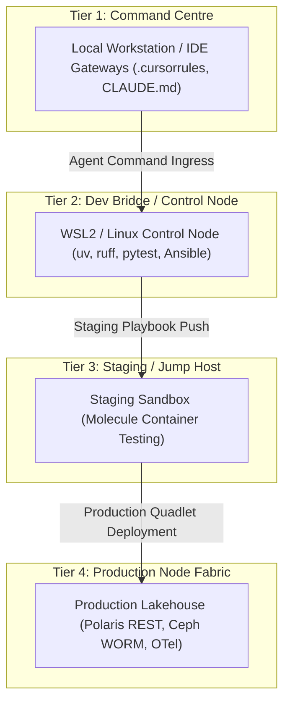

# 🧠 AI Cognitive Twin Protocol & 4-Tier Infrastructure Map

This protocol governs the operational behavior, execution boundaries, and infrastructure topology for AI Cognitive Twins.

## 🏗️ 4-Tier Infrastructure Topology Map

### 1. Standalone Production-Ready SVG Vector Graphic (`.svg`)

<svg xmlns="http://www.w3.org/2000/svg" viewBox="0 0 960 440" width="100%" height="100%">
  <defs>
    <marker id="arrow-twin" viewBox="0 0 10 10" refX="6" refY="5" markerWidth="6" markerHeight="6" orient="auto-start-reverse">
      <path d="M 0 0 L 10 5 L 0 10 z" fill="#64748B" />
    </marker>
    <filter id="shadow-twin" x="-4%" y="-4%" width="108%" height="108%">
      <feDropShadow dx="0" dy="2" stdDeviation="3" flood-color="#000000" flood-opacity="0.25"/>
    </filter>
  </defs>

  <!-- Background -->
  <rect width="960" height="440" fill="#0F172A" rx="10"/>

  <!-- Tier 1 -->
  <rect x="20" y="20" width="920" height="80" fill="#1E293B" stroke="#38BDF8" stroke-width="1.5" rx="8" filter="url(#shadow-twin)"/>
  <rect x="20" y="20" width="920" height="26" fill="#0369A1" rx="8"/>
  <text x="35" y="38" font-family="-apple-system, BlinkMacSystemFont, 'Segoe UI', Roboto, sans-serif" font-size="12" font-weight="bold" fill="#E0F2FE">TIER 1: COMMAND CENTRE (LOCAL WORKSTATION / IDE GATEWAY)</text>
  <text x="35" y="65" font-family="-apple-system, BlinkMacSystemFont, 'Segoe UI', Roboto, sans-serif" font-size="12" font-weight="bold" fill="#38BDF8">Local AI Agent Gateways (.cursorrules, CLAUDE.md) &amp; Spatial Memory</text>
  <text x="35" y="85" font-family="Consolas, Monaco, monospace" font-size="10" fill="#93C5FD">Operator Entry Point &amp; DSOM Governance Gateway</text>

  <!-- Tier 2 -->
  <rect x="20" y="125" width="920" height="80" fill="#1E293B" stroke="#3B82F6" stroke-width="1.5" rx="8" filter="url(#shadow-twin)"/>
  <rect x="20" y="125" width="920" height="26" fill="#1E3A8A" rx="8"/>
  <text x="35" y="143" font-family="-apple-system, BlinkMacSystemFont, 'Segoe UI', Roboto, sans-serif" font-size="12" font-weight="bold" fill="#93C5FD">TIER 2: DEV BRIDGE / CONTROL NODE (WSL2 ALMALINUX / UBUNTU)</text>
  <text x="35" y="170" font-family="-apple-system, BlinkMacSystemFont, 'Segoe UI', Roboto, sans-serif" font-size="12" font-weight="bold" fill="#60A5FA">Local Execution Sandbox, uv Toolchain, ruff &amp; Ansible Control Node</text>
  <text x="35" y="190" font-family="Consolas, Monaco, monospace" font-size="10" fill="#93C5FD">Isolated Subprocess &amp; Linting Control</text>

  <!-- Tier 3 -->
  <rect x="20" y="230" width="920" height="80" fill="#1E293B" stroke="#A855F7" stroke-width="1.5" rx="8" filter="url(#shadow-twin)"/>
  <rect x="20" y="230" width="920" height="26" fill="#581C87" rx="8"/>
  <text x="35" y="248" font-family="-apple-system, BlinkMacSystemFont, 'Segoe UI', Roboto, sans-serif" font-size="12" font-weight="bold" fill="#E9D5FF">TIER 3: STAGING / JUMP HOST (MOLECULE VERIFICATION)</text>
  <text x="35" y="275" font-family="-apple-system, BlinkMacSystemFont, 'Segoe UI', Roboto, sans-serif" font-size="12" font-weight="bold" fill="#C084FC">Pre-Production Validation Sandbox &amp; Molecule Container Integration Tests</text>
  <text x="35" y="295" font-family="Consolas, Monaco, monospace" font-size="10" fill="#E9D5FF">Isolated Container Testing &amp; Playbook Audit</text>

  <!-- Tier 4 -->
  <rect x="20" y="335" width="920" height="85" fill="#1E293B" stroke="#22C55E" stroke-width="1.5" rx="8" filter="url(#shadow-twin)"/>
  <rect x="20" y="335" width="920" height="26" fill="#065F46" rx="8"/>
  <text x="35" y="353" font-family="-apple-system, BlinkMacSystemFont, 'Segoe UI', Roboto, sans-serif" font-size="12" font-weight="bold" fill="#86EFAC">TIER 4: PRODUCTION NODE FABRIC (OPEN LAKEHOUSE &amp; OTEL)</text>
  <text x="35" y="380" font-family="-apple-system, BlinkMacSystemFont, 'Segoe UI', Roboto, sans-serif" font-size="12" font-weight="bold" fill="#4ADE80">Polaris REST Catalog, Ceph/MinIO WORM, DuckDB vss, pgvector, OpenTelemetry</text>
  <text x="35" y="400" font-family="Consolas, Monaco, monospace" font-size="10" fill="#86EFAC">Sovereign Data Lakehouse &amp; Quadlet Container Services</text>

  <!-- Flow Arrows -->
  <line x1="480" y1="100" x2="480" y2="125" stroke="#64748B" stroke-width="2" marker-end="url(#arrow-twin)"/>
  <line x1="480" y1="205" x2="480" y2="230" stroke="#64748B" stroke-width="2" marker-end="url(#arrow-twin)"/>
  <line x1="480" y1="310" x2="480" y2="335" stroke="#64748B" stroke-width="2" marker-end="url(#arrow-twin)"/>
</svg>

### 2. Git-Native Mermaid Topology (`.mmd`)

### 3. Summary Interface & Routing Table

| Source Component | Target Component | Port / Protocol / API Ingress | Security Boundary / Access Key | Operational Significance / Flow Description |
| :--- | :--- | :--- | :--- | :--- |
| **Command Centre (T1)** | **Dev Bridge (T2)** | Stdio / Local Subprocess | IDE Agent Ruleset | Enforces non-destructive pre-flight checks and DSOM protocol rules. |
| **Dev Bridge (T2)** | **Staging Host (T3)** | `TCP 22` / SSH Key | SSH Certificate / Molecule | Runs automated container integration tests prior to production rollout. |
| **Staging Host (T3)** | **Production Fabric (T4)** | `TCP 22` / SSH | SSH Private Key / Certificate | Deploys and manages Podman Quadlet container services in production. |
| **Production Fabric (T4)** | **OpenTelemetry Collector** | `TCP 8443` / HTTPS OTLP | Keycloak OAuth2 JWT | Streams operational metrics, logs, and trace telemetry to Prometheus and Grafana. |

### Tier Descriptions & Boundaries

1. **Tier 1 — Command Centre (Local Workstation):** Operator entry point executing agent commands, maintaining workspace gateways, and managing local spatial memory.
2. **Tier 2 — Dev Bridge / Control Node (WSL2 / Local Linux):** Primary compilation and testing environment using `uv` Python toolchain, `ruff`, `markdownlint-cli`, and `pytest`.
3. **Tier 3 — Staging / Jump Host:** Pre-production verification sandbox executing automated Molecule playbook scenarios and container integration tests.
4. **Tier 4 — Production Node Fabric:** Production environment hosting S3-compatible object stores, open-source lakehouse compute engines, and containerised microservices.

---

## 🔒 Operational Invariants

- **Non-Destructive Pre-Flight:** Inspect target states before editing files.
- **UK English Standard:** Enforce UK English spelling (`standardise`, `categorise`, `localise`).
- **DTS 0.1 Standard:** Deliver direct answers without preamble or fluff.
- **Isolated Execution:** Always use `uv run` for Python tools and pytest execution.
