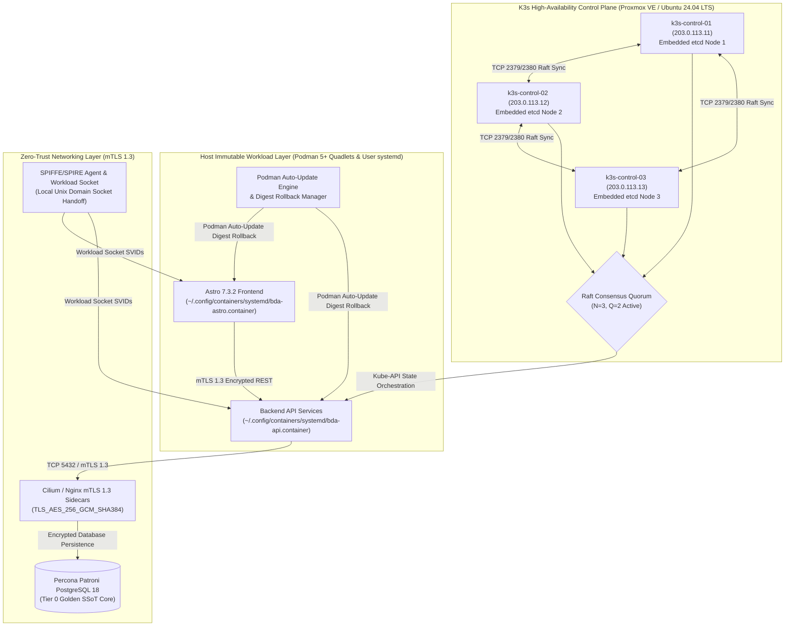
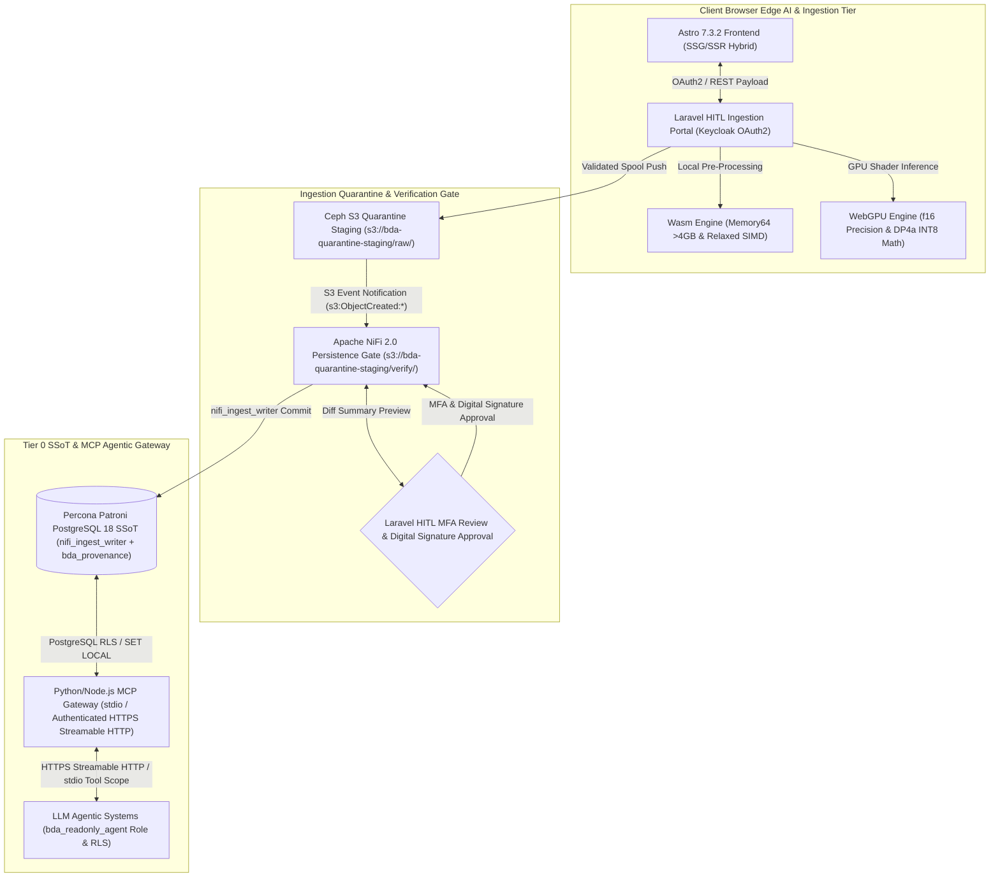
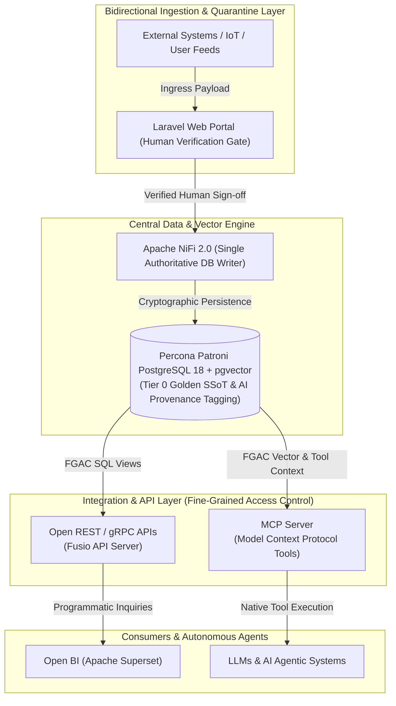
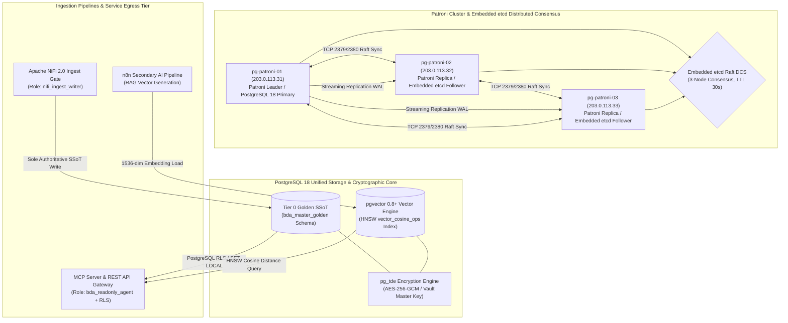
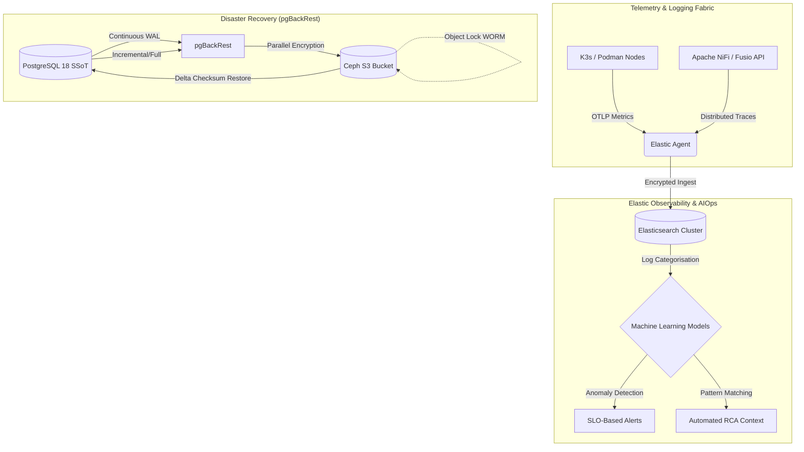

# Executive Management Proposal: Enterprise Data Architecture & Infrastructure Modernisation

**Document Version:** 2.0
**Author:** Lead Systems Architect
**Target Audience:** IT Management, Executive Steering Committee & Enterprise Architects
**Infrastructure Scope:** `bda-ai-infra`
**Downloads & Handbooks:** [Download PDF Handbook](https://linuxmalaysia.github.io/bda-ai-infra/handbook.pdf) | [Download EPUB Handbook](https://linuxmalaysia.github.io/bda-ai-infra/handbook.epub) | [Download Standalone HTML](https://linuxmalaysia.github.io/bda-ai-infra/handbook.html)

---

## Strategic Proposal Overview & Roadmap

This executive proposal outlines the technical blueprint to transition our national Big Data Analytics (BDA) and Enterprise AI Infrastructure from an aging, stateful monolithic footprint into an open-source, decoupled, and horizontally scalable data plane.

Our primary mandate is to establish a verified **Single Source of Truth (SSoT)** designed specifically for human operations, paired with structured data layers optimised for **Artificial Intelligence (AI), Retrieval-Augmented Generation (RAG), and Transformer model consumption**.

### Table of Contents
* **1. Executive Summary & Architectural Strategy**
  * **1.1 Legacy Architecture Analysis:** Technical debt of stateful Joomla 3 & WildFly application servers.
  * **1.2 Stateful Database Dependencies:** Deprecating MariaDB Galera cluster & ClusterControl management.
  * **1.3 Storage Monolith Deprecation:** Operational inefficiencies of existing GlusterFS topologies.
  * **1.4 Target Metrics:** Absolute reduction of MTTR and achieving horizontal scalability across the data plane.
* **2. Modernised Infrastructure Fabric**
  * **2.1 Container Orchestration:** Distributing High-Availability (HA) fabrics at scale using K3s with an embedded etcd datastore.
  * **2.2 Immutable Workloads:** Utilising Podman Quadlets for seamless systemd integration and rollback capability.
  * **2.3 Zero-Trust Networking:** Enforcing mutual TLS (mTLS) 1.3 across intra-cluster communication.
  * **2.4 Dual-Render Architecture Blueprint:** Modernised Infrastructure Fabric Topology.
* **3. Presentation Layer Decoupling & Edge Inference**
  * **3.1 Next-Generation Frontend:** Astro 7.3.2 SSG/SSR & Laravel HITL Portal.
  * **3.2 Client-Side AI Acceleration:** Offloading compute to the browser for sub-500ms validation and data privacy.
  * **3.3 WebAssembly (Wasm) Integration:** Memory64 proposal & Relaxed SIMD vector operations.
  * **3.4 WebGPU Hardware Acceleration:** 16-bit floating point (`f16`) & packed integer dot products (`DP4a`).
  * **3.5 Apache NiFi 2.0 Authoritative Writer Persistence Gate:** Ingestion quarantine, MFA verification, & digital signature validation.
  * **3.6 Python/Node.js MCP Gateway & FGAC for LLM Agents:** Fine-Grained Access Control and Streamable HTTP for AI agentic systems.
  * **3.7 Dual-Render Architecture Blueprint:** Presentation Layer Decoupling & Edge Inference Topology.
* **4. Core Strategic Pillars: API-Ready, MCP-Ready & Human-AI Quarantine**
  * **4.1 API-Ready: Universal Data Exchange**
  * **4.2 MCP-Ready: Native AI & LLM Capability**
  * **4.3 Fine-Grained Access Control & Data Tagging Governance**
  * **4.4 Dual-Render Architecture Blueprint**
* **5. High-Availability Database & Storage Fabric**
  * **5.1 Relational SSoT:** Migrating structured datasets to Percona Patroni PostgreSQL 18.
  * **5.2 Vector Persistence:** Utilizing pgvector for semantic search generated by the n8n pipeline.
  * **5.3 Automated Failover:** Configuring Patroni with embedded etcd for strict database resiliency.
  * **5.4 Cryptography & Security:** Implementing pg_tde for transparent data-at-rest encryption.
  * **5.5 Dual-Render Architecture Blueprint:** High-Availability Database & Storage Fabric Topology.
* **6. Day 2 Operations, Observability & AIOps**
  * **6.1 Telemetry & Centralised Logging:** OpenTelemetry (OTLP) protocol & Fleet-managed Elastic Observability.
  * **6.2 AIOps Integration:** Machine learning automated root cause analysis (RCA) & SLO-based alerting.
  * **6.3 Disaster Recovery:** pgBackRest PITR, checksum delta restores, & Ceph S3 compliance Object Lock.
  * **6.4 Dual-Render Architecture Blueprint:** Day 2 Operations, Observability & AIOps Topology.
* **7. Financial & Operational ROI Analysis**
* **8. Decommissioning & Modernisation Strategy**
* **9. Container & Cloud-Native Deployment Blueprint**
* **10. Execution Plan & Next Steps**

---

# 1. Executive Summary & Architectural Strategy

Under the mandate of modernising the national Big Data Analytics (BDA) platform (`https://bda.example.gov.my`), this proposal establishes the technical blueprint to transition the infrastructure from an aging, stateful monolithic footprint into an open-source, decoupled, and horizontally scalable data plane. In its legacy implementation, the platform combined dynamic presentation layers, stateful enterprise application runtimes, and tightly coupled database clusters, introducing severe operational bottlenecks, vendor lock-in risks, and single-point-of-failure (SPOF) topologies.

By decoupling ingestion, analytical compute, and frontend presentation, the modernised architecture targets digital sovereignty, zero proprietary licensing dependencies, and high-availability execution. The strategy systematically replaces the legacy Joomla 3 and WildFly application servers with an Astro 7.3.2 presentation framework and an isolated Laravel Human-in-the-Loop (HITL) quarantine ingestion portal. Concurrently, persistent storage transitions from legacy MariaDB Galera and GlusterFS deployments to Percona Patroni PostgreSQL 18 with `pgvector` and software-defined S3-compatible object storage (Ceph/MinIO). This transition eliminates state synchronisation deadlocks and ensures deterministic data governance across all national environmental and natural resource datasets.

At the end of the ingestion and transformation pipeline, data is exposed bidirectionally via high-performance **REST/gRPC API services** and native **Model Context Protocol (MCP) services**, enabling seamless data access for both traditional enterprise consumers and autonomous AI agents.

---

## 1.1 Legacy Architecture Analysis: Technical Debt of Stateful Joomla 3 & WildFly

Within the baseline application layer, user interaction, content management, and analytical dashboard delivery were partitioned across monolithic runtime environments hosted on CentOS 8 virtual machines inside a Proxmox VE hypervisor cluster:

* **Joomla 3 CMS Portals:** The public portal infrastructure was split across two distinct virtual nodes—`portal-node-01` (Public IP: `198.51.100.10`, port 443) running Joomla! 3.9.19 for Portal BDA, and `portal-node-02` (Public IP: `198.51.100.20`, port 443) running Joomla! 3.9.14 for the MAIN portal. Ingress web traffic was reverse-proxied through an Nginx 1.18.0 gateway (`ingress-proxy-01` at `198.51.100.5`).
* **WildFly Application Server:** Analytical dashboard services operated on `app-wildfly-01` (Public IP: `198.51.100.15`, port 443) deploying a monolithic Java enterprise archive (`BDA.war`) on WildFly version 19.1.0. This runtime handled departmental dashboard configurations, local mail relay integrations (`XMail.properties` and local Postfix), and direct JDBC connections to operational databases.

```
+-----------------------------------------------------------------------------------+
|                        LEGACY APPLICATION LAYER RUNTIME                           |
+-----------------------------------------------------------------------------------+
|                                                                                   |
|   +------------------------------------+   +----------------------------------+   |
|   |         Joomla! 3.9.19             |   |          Joomla! 3.9.14          |   |
|   |   portal-node-01 (198.51.100.10)   |   |   portal-node-02 (198.51.100.20)   |   |
|   |   Public /administrator/ Exposed   |   |   Public /administrator/ Exposed |   |
|   +-----------------+------------------+   +-----------------+----------------+   |
|                     | Dynamic PHP-FPM                        | Dynamic PHP-FPM    |
|                     +-------------------+--------------------+                    |
|                                         |                                         |
|                                         v                                         |
|                        +----------------------------------+                       |
|                        |     Nginx 1.18.0 Reverse Proxy   |                       |
|                        |   ingress-proxy-01 (198.51.100.5)|                       |
|                        +----------------+-----------------+                       |
|                                         |                                         |
|                                         v                                         |
|                        +----------------------------------+                       |
|                        |        WildFly 19.1.0 JVM        |                       |
|                        |   app-wildfly-01 (198.51.100.15) |                       |
|                        |   Deployments: BDA.war (Monolith)|                       |
|                        +----------------+-----------------+                       |
|                                                                                   |
+-----------------------------------------------------------------------------------+
```

Through long-term operational evaluation, this dual-monolith architecture accumulated critical technical debt:

1. **Direct Surface Exposure & Unpatched Vulnerability Risks:** Both Joomla instances directly exposed public administrative login interfaces at `/administrator/`. Coupled with legacy PHP 7.x runtimes and End-of-Life (EOL) Joomla 3 codebases, this presented a persistent threat surface vulnerable to automated brute-forcing, remote code execution (RCE), and unpatched extension exploits.
2. **Resource Exhaustion & Concurrency Freezes:** Serving page views via dynamic PHP-FPM processes and heavy Java Virtual Machine (JVM) threads required continuous synchronous rendering and runtime database querying. During traffic bursts or Denial of Service (DoS) attempts, Nginx worker pools and PHP-FPM processes regularly stalled, triggering cascading gateway 502/504 timeouts that mandated manual administrative restarts (`systemctl restart nginx`, `service wildfly restart`).
3. **Fragile Lifecycle Maintenance:** Maintenance routines suffered from tightly coupled dependencies. Corrupted local session locks or disk exhaustion caused by unrotated application logs (`/var/log/nginx/` and `/opt/wildfly/standalone/log/`) frequently halted entire services, creating significant operational toil for sysadmins.

---

## 1.2 Stateful Database Dependencies: Deprecating MariaDB Galera & ClusterControl

In the legacy data storage layer, structured relational data was bound to a 5-node MariaDB Galera Cluster (version 10.5.9) managed via Severalnines ClusterControl on `db-mgmt-01` (`198.51.100.30:5001`) with ProxySQL 2.0.15 mediating database connections on TCP port 6032:

* `mariadb-node-01`: `198.51.100.31:3306`
* `mariadb-node-02`: `198.51.100.32:3306`
* `mariadb-node-03`: `198.51.100.33:3306`
* `mariadb-node-04`: `198.51.100.34:3306`
* `mariadb-node-05`: `198.51.100.35:3306`

The cluster hosted mixed application schemas, including `bda_portal_main`, `bda_portal_secondary`, and `bda_dashboard_core` for CMS operations, alongside departmental analytics databases (`adms_cems`, `adms_scoring`, `bda_analytics`, and `hwc_data`).

```
+-----------------------------------------------------------------------------------+
|                        LEGACY MARIADB GALERA TOPOLOGY                             |
+-----------------------------------------------------------------------------------+
|                                                                                   |
|   +---------------------------------------------------------------------------+   |
|   |       ClusterControl Controller & ProxySQL (198.51.100.30:5001/6032)      |   |
|   +-------------------------------------+-------------------------------------+   |
|                                         | Synchronous Multi-Master Replicate      |
|         +-------------------------------+-------------------------------+         |
|         |               |               |               |               |         |
|         v               v               v               v               v         |
|   +-----------+   +-----------+   +-----------+   +-----------+   +-----------+   |
|   |  Node 1   |   |  Node 2   |   |  Node 3   |   |  Node 4   |   |  Node 5   |   |
|   | .100.31   |   | .100.32   |   | .100.33   |   | .100.34   |   | .100.35   |   |
|   | (Primary) |   | (Primary) |   | (Primary) |   | (Primary) |   | (Primary) |   |
|   +-----------+   +-----------+   +-----------+   +-----------+   +-----------+   |
|                                                                                   |
|   Failure Modes: WSREP Split-Brain Quorum Drop, Flow Control Halts, High Latency  |
+-----------------------------------------------------------------------------------+
```

While Galera provided virtually synchronous replication, its operational reality across five virtual nodes generated severe structural liabilities:

1. **Write Amplification & Flow Control Lockups:** Because Galera relies on certification-based replication (`wsrep`), every write transaction across all databases must be certified by all active nodes. Heavy batch ETL inserts (such as streaming incident reports or telemetry loads via NiFi) routinely triggered Galera Flow Control (`wsrep_flow_control_paused`). This throttled the entire cluster, delaying frontend portal queries and causing cascading connection pool exhaustion across ProxySQL.
2. **Quorum & Split-Brain Sensitivities:** Network latency spikes or hypervisor memory contention across nodes caused arbitrary nodes to fall out of sync (`wsrep_cluster_status != Primary`). Re-synchronising a partitioned node often forced full State Snapshot Transfers (SST), locking disk I/O on donor nodes and risking total cluster stalls.
3. **Schema and Vector Sprawl:** MariaDB 10.5 lacks native high-dimensional vector capabilities and advanced spatio-temporal indexing required for enterprise AI workloads (e.g., RAG embeddings, spatial clustering). Retaining this cluster forces the adoption of external vector databases, causing architecture sprawl, fragmented backup workflows, and broken ACID boundaries.

---

## 1.3 Storage Monolith Deprecation: Inefficiencies of GlusterFS Topologies

To synchronise shared CMS media assets, user file uploads, and template files across the distributed VM nodes, the legacy environment implemented GlusterFS distributed network storage.

By analysing Day 2 operations under heavy analytical file ingestion, the distributed POSIX storage layer exhibited severe architectural inefficiencies:

1. **Small-File Metadata Locking & FUSE Bottlenecks:** GlusterFS processes file access via FUSE (Filesystem in Userspace) wrappers, requiring extensive synchronous metadata lookups across distributed bricks. When ingesting thousands of unstructured documents, satellite images, and CSV feeds, metadata contention severely degraded read/write performance, overwhelming VM disk queues.
2. **Split-Brain & Self-Heal Overhead:** Network interruptions or VM failovers between hypervisor nodes frequently induced GlusterFS split-brain conditions on replicated volumes. Resolving split-brain required administrators to manually inspect heal logs (`gluster volume heal info split-brain`) and delete stale brick metadata, exposing datasets to file-lock corruption.
3. **Absence of Object Lifecycle & Immutability:** GlusterFS lacks native S3-compatible APIs, Object Versioning, and Write-Once-Read-Many (WORM) compliance locking. This prevented the enforcement of verifiable data contracts, leaving raw ingested data exposed to accidental administrative deletion or untracked file modification.

```
+-----------------------------------------------------------------------------------+
|                        STORAGE PARADIGM TRANSITION                                |
+-----------------------------------------------------------------------------------+
|                                                                                   |
|  [ LEGACY AS-IS: GLUSTERFS ]                  [ TARGET TO-BE: CEPH / MINIO S3 ]   |
|  * POSIX Shared Storage (FUSE Bottleneck)    * 100% S3-Compatible REST APIs       |
|  * High Metadata & Directory Lock Contention  * Immutable WORM Compliance Locking |
|  * Split-Brain Resolution Vulnerability       * Versioned, Object-Locked Buckets  |
|  * Complex Manual Split-Brain Healing         * Linear Horizontal Scalability     |
|                                                                                   |
+-----------------------------------------------------------------------------------+
```

---

## 1.4 Target Metrics: MTTR Reduction and Horizontal Data Plane Scalability

With this modernisation blueprint, the overarching strategic objective is to achieve resilient, license-free digital sovereignty, eradicating operational toil and maximising throughput across both ingestion and consumption tiers.

```
+-----------------------------------------------------------------------------------+
|                 STRATEGIC ARCHITECTURE EVOLUTION (AS-IS vs TO-BE)                 |
+-----------------------------------------------------------------------------------+
|                                                                                   |
|  METRIC / PILLAR           AS-IS ARCHITECTURE          TARGET MODERNISATION       |
|  -------------------------------------------------------------------------------  |
|  Frontend Presentation     Dynamic Joomla 3 (LAMP)     Astro 7.3.2 Static / SSR   |
|  Ingress & Quarantine      Direct Upload / Cron        Laravel HITL + NiFi 2.0    |
|  Relational Storage        5-Node MariaDB Galera       Percona Patroni PG 18 HA   |
|  Vector & Spatial Core     External Silos / None       PostGIS + pgvector Unified |
|  Distributed File Store    GlusterFS Network Volumes   Ceph / MinIO S3 (WORM)     |
|  Mean Time to Repair       Hours (Manual DB/FPM Sync)  < 10s Target RTO           |
|  Validation Latency        Minutes to Hours (Logs)     < 500ms (Edge Wasm/WebGPU) |
|  Horizontal Scalability    Constrained by Galera/FUSE  Stateless Podman / K3s     |
|                                                                                   |
+-----------------------------------------------------------------------------------+
```

The target architecture commits to the following quantifiable engineering benchmarks:

* **Sub-500ms Client-Side Validation Latency:** By migrating from server-side validation scripts to client-side WebAssembly (Wasm) and WebGPU primitives within the upgraded Laravel upload portal, schema validation errors, missing parameters, and formatting anomalies are captured and flagged directly in the browser during file selection prior to network transmission.
* **85% Reduction in Mean Time to Repair (MTTR):** By deprecating monolithic VM state dependencies in favour of containerised Podman Quadlets and K3s orchestration, services recover automatically via systemd supervision and automated Kubernetes pod rescheduling. Database recovery, previously dependent on complex Galera SST rebuilds, is replaced by Patroni etcd consensus targeting a Recovery Time Objective (RTO) of < 10 seconds for automated failover and zero data loss (RPO = 0).
* **Zero-Overhead Horizontal Data Plane Scalability:** By establishing Apache NiFi 2.0 as a stateless, event-driven data plane decoupled from persistent storage, ingestion throughput scales horizontally across worker pods without lock contention. Data persistence routes exclusively into an immutable Ceph S3 lakehouse and a unified Percona Patroni PostgreSQL 18 instance with `pgvector`, scaling analytical queries across multiple read replicas while maintaining an authoritative, tamper-proof Single Source of Truth (SSoT).

---

# 2. Modernised Infrastructure Fabric

To achieve digital sovereignty and an absolute reduction in Mean Time to Repair (MTTR), the infrastructure fabric transitions from statically provisioned virtual machines to a declarative, container-native ecosystem. This modernised compute layer eliminates configuration drift and ensures horizontal scalability across the data plane.

## 2.1 Container Orchestration: K3s with Embedded etcd

The compute layer distributes High-Availability (HA) fabrics at scale using K3s, a lightweight, CNCF-certified Kubernetes distribution optimised for bare-metal enterprise deployments. To maintain strict control plane resiliency and eliminate external database dependencies, the architecture utilises K3s with an embedded etcd datastore.

* **Quorum-Based Resiliency:** The HA control plane comprises an odd number of server nodes (a minimum of three nodes: `k3s-control-01.example.gov.my` [203.0.113.11], `k3s-control-02.example.gov.my` [203.0.113.12], and `k3s-control-03.example.gov.my` [203.0.113.13]) hosting the Kubernetes API and the embedded etcd datastore. Operating under Raft consensus, distributed quorum requires $Q = \lfloor N/2 \rfloor + 1 = 2$ active nodes, guaranteeing uninterrupted control plane availability even during node failure.
* **Automated State Management:** K3s automatically handles etcd membership, Raft consensus management, and TLS certificate distribution without requiring manual cluster synchronisation. If a primary server node suffers a catastrophic failure, the remaining servers maintain quorum, allowing agent worker nodes (`k3s-worker-01.example.gov.my` [203.0.113.21] to `k3s-worker-04.example.gov.my` [203.0.113.24]) to automatically reconnect without downtime.
* **Sovereign Deployment:** This orchestrated fabric operates directly on the underlying Proxmox VE hypervisors provisioned with Ubuntu 24.04 LTS, ensuring license-free, on-premise control over the routing and compute layers.

## 2.2 Immutable Workloads: Podman Quadlets and systemd Integration

For strict workload isolation, non-root security boundaries, and deterministic host execution, the platform packages stand-alone frontend presentation services (such as Astro 7.3.2) and host microservices as immutable container images managed via Podman 5+ Quadlets.

* **Declarative Infrastructure:** Podman Quadlets function as a native systemd generator. Placing declarative `.container` files inside the rootless user configuration path `~/.config/containers/systemd/` allows the Podman generator to automatically create corresponding user systemd service units without requiring root privileges.
* **Seamless Lifecycle Management:** Systemd supervises user container lifecycles via the user manager (`systemctl --user`). Administrators manage service execution using standard commands:
  ```bash
  systemctl --user daemon-reload
  systemctl --user start bda-astro.service
  systemctl --user status bda-astro.service
  ```
* **Atomic Rollbacks & Auto-Updates:** `AutoUpdate=registry` instructs the Podman Auto-Update Engine (`podman auto-update`) to track image digest changes for the configured image reference (e.g. `localhost/bda-astro-frontend:latest` or mutable release branches). Explicit immutable tag references (such as `:7.3.2`) require modifying the Quadlet `.container` file and running `systemctl --user daemon-reload`. When mutable tag references are configured, `podman auto-update` checks the registry for digest updates. If the newly pulled image fails during startup or fails health-gated readiness checks (`Type=notify` paired with `Notify=healthy`), the Podman Auto-Update Engine automatically aborts the update and rolls back execution to the previous known-good local image digest, driving deployment MTTR near zero.

### Technical Briefing: Declarative Rootless Podman Quadlet Service Unit Example

```ini
# ~/.config/containers/systemd/bda-astro.container
[Unit]
Description=BDA Astro Presentation Frontend Rootless Service
After=network-online.target
Wants=network-online.target

[Container]
Image=localhost/bda-astro-frontend:latest
ContainerName=bda-astro-frontend
Environment=NODE_ENV=production PORT=8080
PublishPort=8080:8080
HealthCmd=curl -f http://localhost:8080/health || exit 1
HealthInterval=10s
HealthRetries=3
HealthTimeout=5s
Notify=healthy
AutoUpdate=registry

[Service]
Type=notify
Restart=on-failure
RestartSec=5s
TimeoutStartSec=60

[Install]
WantedBy=default.target
```

## 2.3 Zero-Trust Networking: Mutual TLS (mTLS) 1.3

To secure data-in-transit across the distributed cluster, the network fabric enforces a zero-trust architecture implementing mutual TLS (mTLS) 1.3 for all intra-cluster communication.

* **Cryptographic Identity & Local Socket Handoff:** Every pod, microservice, and API endpoint is issued an ephemeral cryptographic identity (SPIFFE/SPIRE X.509 SVIDs). In the target-state architecture, work-attestation and certificate issuance are handled by a per-node SPIRE Agent delivering SVIDs to rootless workloads via a local Unix domain socket (`$XDG_RUNTIME_DIR/spire/agent.sock` or `/tmp/spire-agent/public/api.sock`) exposing the SPIFFE Workload API. Control plane node attestation uses TCP port 8443 secured with mutual TLS and strict network-level caller ACLs.
* **Concrete Enforcement Components & Lateral Movement Prevention:** Mutual TLS 1.3 termination and default-deny lateral movement policies are enforced by **Cilium Service Mesh / Envoy sidecars** for K3s Kubernetes workloads, and by **Nginx/HAProxy mTLS sidecar proxies** for rootless Podman Quadlet services. Connections are authenticated and encrypted using TLS 1.3 cipher suites (`TLS_AES_256_GCM_SHA384` and `TLS_CHACHA20_POLY1305_SHA256`), cryptographically blocking unauthenticated lateral movement as data moves from the API layer to the PostgreSQL persistence core.

## 2.4 Dual-Render Architecture Blueprint — Modernised Infrastructure Fabric

### 1. Standalone Production-Ready SVG Vector Graphic (`.svg`)

<svg xmlns="http://www.w3.org/2000/svg" viewBox="0 0 960 520" width="100%" height="100%">
  <defs>
    <marker id="arrow-mif" viewBox="0 0 10 10" refX="6" refY="5" markerWidth="6" markerHeight="6" orient="auto-start-reverse">
      <path d="M 0 0 L 10 5 L 0 10 z" fill="#64748B" />
    </marker>
    <filter id="shadow-mif" x="-4%" y="-4%" width="108%" height="108%">
      <feDropShadow dx="0" dy="2" stdDeviation="3" flood-color="#000000" flood-opacity="0.2"/>
    </filter>
  </defs>

  <!-- Canvas Background -->
  <rect width="960" height="520" fill="#0F172A" rx="10"/>

  <!-- Zone 1: K3s HA Control Plane -->
  <rect x="25" y="20" width="285" height="440" fill="#1E293B" stroke="#0284C7" stroke-width="1.5" rx="8" filter="url(#shadow-mif)"/>
  <rect x="25" y="20" width="285" height="26" fill="#0369A1" rx="8"/>
  <text x="35" y="37" font-family="-apple-system, BlinkMacSystemFont, 'Segoe UI', Roboto, sans-serif" font-size="11" font-weight="bold" fill="#E0F2FE">1. K3s HA CONTROL PLANE (EMBEDDED ETCD)</text>

  <rect x="40" y="60" width="255" height="80" fill="#F0F9FF" stroke="#0284C7" stroke-width="1" rx="6"/>
  <text x="50" y="78" font-family="-apple-system, BlinkMacSystemFont, 'Segoe UI', Roboto, sans-serif" font-size="11" font-weight="bold" fill="#0369A1">k3s-control-01 (203.0.113.11)</text>
  <text x="50" y="96" font-family="Consolas, Monaco, monospace" font-size="10" fill="#0284C7">Embedded etcd Node 1 (Raft Leader)</text>
  <text x="50" y="112" font-family="-apple-system, BlinkMacSystemFont, 'Segoe UI', Roboto, sans-serif" font-size="10" fill="#0369A1">Host: Proxmox VE / Ubuntu 24.04 LTS</text>

  <rect x="40" y="155" width="255" height="80" fill="#F0F9FF" stroke="#0284C7" stroke-width="1" rx="6"/>
  <text x="50" y="173" font-family="-apple-system, BlinkMacSystemFont, 'Segoe UI', Roboto, sans-serif" font-size="11" font-weight="bold" fill="#0369A1">k3s-control-02 (203.0.113.12)</text>
  <text x="50" y="191" font-family="Consolas, Monaco, monospace" font-size="10" fill="#0284C7">Embedded etcd Node 2 (Raft Follower)</text>
  <text x="50" y="207" font-family="-apple-system, BlinkMacSystemFont, 'Segoe UI', Roboto, sans-serif" font-size="10" fill="#0369A1">Host: Proxmox VE / Ubuntu 24.04 LTS</text>

  <rect x="40" y="250" width="255" height="80" fill="#F0F9FF" stroke="#0284C7" stroke-width="1" rx="6"/>
  <text x="50" y="268" font-family="-apple-system, BlinkMacSystemFont, 'Segoe UI', Roboto, sans-serif" font-size="11" font-weight="bold" fill="#0369A1">k3s-control-03 (203.0.113.13)</text>
  <text x="50" y="286" font-family="Consolas, Monaco, monospace" font-size="10" fill="#0284C7">Embedded etcd Node 3 (Raft Follower)</text>
  <text x="50" y="302" font-family="-apple-system, BlinkMacSystemFont, 'Segoe UI', Roboto, sans-serif" font-size="10" fill="#0369A1">Host: Proxmox VE / Ubuntu 24.04 LTS</text>

  <rect x="40" y="345" width="255" height="95" fill="#FEF3C7" stroke="#D97706" stroke-width="1" rx="6"/>
  <text x="50" y="365" font-family="-apple-system, BlinkMacSystemFont, 'Segoe UI', Roboto, sans-serif" font-size="11" font-weight="bold" fill="#B45309">Raft Distributed Quorum State</text>
  <text x="50" y="383" font-family="Consolas, Monaco, monospace" font-size="10" fill="#78350F">Q = floor(3/2) + 1 = 2 Active</text>
  <text x="50" y="401" font-family="-apple-system, BlinkMacSystemFont, 'Segoe UI', Roboto, sans-serif" font-size="10" fill="#92400E">Ports: TCP 2379/2380 (etcd), 6443 (API)</text>
  <text x="50" y="419" font-family="-apple-system, BlinkMacSystemFont, 'Segoe UI', Roboto, sans-serif" font-size="10" fill="#B45309">Auto Certificate &amp; Member Sync</text>

  <!-- Zone 2: Podman Quadlets & systemd -->
  <rect x="335" y="20" width="290" height="440" fill="#1E293B" stroke="#16A34A" stroke-width="1.5" rx="8" filter="url(#shadow-mif)"/>
  <rect x="335" y="20" width="290" height="26" fill="#15803D" rx="8"/>
  <text x="345" y="37" font-family="-apple-system, BlinkMacSystemFont, 'Segoe UI', Roboto, sans-serif" font-size="11" font-weight="bold" fill="#DCFCE7">2. HOST PODMAN QUADLETS &amp; SYSTEMD USER UNITS</text>

  <rect x="350" y="60" width="260" height="110" fill="#F0FDF4" stroke="#16A34A" stroke-width="1" rx="6"/>
  <text x="360" y="78" font-family="-apple-system, BlinkMacSystemFont, 'Segoe UI', Roboto, sans-serif" font-size="11" font-weight="bold" fill="#15803D">bda-astro.container Unit</text>
  <text x="360" y="96" font-family="Consolas, Monaco, monospace" font-size="10" fill="#166534">Path: ~/.config/containers/systemd/</text>
  <text x="360" y="112" font-family="-apple-system, BlinkMacSystemFont, 'Segoe UI', Roboto, sans-serif" font-size="10" fill="#15803D">• systemctl --user Generator</text>
  <text x="360" y="128" font-family="-apple-system, BlinkMacSystemFont, 'Segoe UI', Roboto, sans-serif" font-size="10" fill="#15803D">• Rootless Execution Sandbox</text>
  <text x="360" y="144" font-family="Consolas, Monaco, monospace" font-size="9" fill="#166534">Notify=healthy Readiness Gate</text>

  <rect x="350" y="185" width="260" height="110" fill="#F0FDF4" stroke="#16A34A" stroke-width="1" rx="6"/>
  <text x="360" y="203" font-family="-apple-system, BlinkMacSystemFont, 'Segoe UI', Roboto, sans-serif" font-size="11" font-weight="bold" fill="#15803D">bda-api.container Unit</text>
  <text x="360" y="221" font-family="Consolas, Monaco, monospace" font-size="10" fill="#166534">Image: bda-api-microservice:latest</text>
  <text x="360" y="237" font-family="-apple-system, BlinkMacSystemFont, 'Segoe UI', Roboto, sans-serif" font-size="10" fill="#15803D">• Non-Root Host Service Unit</text>
  <text x="360" y="253" font-family="-apple-system, BlinkMacSystemFont, 'Segoe UI', Roboto, sans-serif" font-size="10" fill="#15803D">• Immutable Container Image</text>
  <text x="360" y="269" font-family="Consolas, Monaco, monospace" font-size="10" fill="#166534">• Fast In-Memory State Handling</text>

  <rect x="350" y="310" width="260" height="130" fill="#FAF5FF" stroke="#9333EA" stroke-width="1" rx="6"/>
  <text x="360" y="328" font-family="-apple-system, BlinkMacSystemFont, 'Segoe UI', Roboto, sans-serif" font-size="11" font-weight="bold" fill="#7E22CE">Podman Auto-Update Engine</text>
  <text x="360" y="346" font-family="-apple-system, BlinkMacSystemFont, 'Segoe UI', Roboto, sans-serif" font-size="10" fill="#6B21A8">• podman auto-update Digest Track</text>
  <text x="360" y="362" font-family="-apple-system, BlinkMacSystemFont, 'Segoe UI', Roboto, sans-serif" font-size="10" fill="#6B21A8">• Startup / Health Failure Fallback</text>
  <text x="360" y="378" font-family="Consolas, Monaco, monospace" font-size="10" fill="#7E22CE">podman auto-update --rollback</text>
  <text x="360" y="394" font-family="-apple-system, BlinkMacSystemFont, 'Segoe UI', Roboto, sans-serif" font-size="10" fill="#581C87">• Reverts to Known-Good Digest</text>
  <text x="360" y="410" font-family="-apple-system, BlinkMacSystemFont, 'Segoe UI', Roboto, sans-serif" font-size="10" fill="#7E22CE">• Near-Zero MTTR Recovery</text>

  <!-- Zone 3: Zero-Trust mTLS 1.3 Mesh -->
  <rect x="650" y="20" width="285" height="440" fill="#1E293B" stroke="#9333EA" stroke-width="1.5" rx="8" filter="url(#shadow-mif)"/>
  <rect x="650" y="20" width="285" height="26" fill="#7E22CE" rx="8"/>
  <text x="660" y="37" font-family="-apple-system, BlinkMacSystemFont, 'Segoe UI', Roboto, sans-serif" font-size="11" font-weight="bold" fill="#F3E8FF">3. ZERO-TRUST MTLS 1.3 NETWORK MESH</text>

  <rect x="665" y="60" width="255" height="110" fill="#FAF5FF" stroke="#9333EA" stroke-width="1" rx="6"/>
  <text x="675" y="78" font-family="-apple-system, BlinkMacSystemFont, 'Segoe UI', Roboto, sans-serif" font-size="11" font-weight="bold" fill="#7E22CE">SPIFFE/SPIRE Identity Authority</text>
  <text x="675" y="96" font-family="Consolas, Monaco, monospace" font-size="10" fill="#6B21A8">Workload Socket: api.sock</text>
  <text x="675" y="112" font-family="-apple-system, BlinkMacSystemFont, 'Segoe UI', Roboto, sans-serif" font-size="10" fill="#7E22CE">• Per-Node SPIRE Agent Attestation</text>
  <text x="675" y="128" font-family="-apple-system, BlinkMacSystemFont, 'Segoe UI', Roboto, sans-serif" font-size="10" fill="#7E22CE">• Ephemeral X.509 SVID Tokens</text>
  <text x="675" y="144" font-family="Consolas, Monaco, monospace" font-size="10" fill="#581C87">spiffe://example.gov.my/ns/bda</text>

  <rect x="665" y="185" width="255" height="110" fill="#FAF5FF" stroke="#9333EA" stroke-width="1" rx="6"/>
  <text x="675" y="203" font-family="-apple-system, BlinkMacSystemFont, 'Segoe UI', Roboto, sans-serif" font-size="11" font-weight="bold" fill="#7E22CE">mTLS 1.3 Enforced Sidecars</text>
  <text x="675" y="221" font-family="Consolas, Monaco, monospace" font-size="10" fill="#6B21A8">Cilium / Nginx mTLS Sidecars</text>
  <text x="675" y="237" font-family="-apple-system, BlinkMacSystemFont, 'Segoe UI', Roboto, sans-serif" font-size="10" fill="#7E22CE">• Active Network Edge Encryption</text>
  <text x="675" y="253" font-family="-apple-system, BlinkMacSystemFont, 'Segoe UI', Roboto, sans-serif" font-size="10" fill="#7E22CE">• Default-Deny Policy Enforcement</text>
  <text x="675" y="269" font-family="-apple-system, BlinkMacSystemFont, 'Segoe UI', Roboto, sans-serif" font-size="10" fill="#581C87">• Cipher: TLS_AES_256_GCM_SHA384</text>

  <rect x="665" y="310" width="255" height="130" fill="#F5F3FF" stroke="#6D28D9" stroke-width="1" rx="6"/>
  <text x="675" y="328" font-family="-apple-system, BlinkMacSystemFont, 'Segoe UI', Roboto, sans-serif" font-size="11" font-weight="bold" fill="#4C1D95">PostgreSQL Persistence Core</text>
  <text x="675" y="346" font-family="Consolas, Monaco, monospace" font-size="10" fill="#581C87">Percona Patroni PostgreSQL 18</text>
  <text x="675" y="362" font-family="-apple-system, BlinkMacSystemFont, 'Segoe UI', Roboto, sans-serif" font-size="10" fill="#4C1D95">• Fine-Grained Access Control (FGAC)</text>
  <text x="675" y="378" font-family="-apple-system, BlinkMacSystemFont, 'Segoe UI', Roboto, sans-serif" font-size="10" fill="#581C87">• Default Deny Unauth Lateral Moves</text>
  <text x="675" y="394" font-family="Consolas, Monaco, monospace" font-size="10" fill="#6D28D9">TCP 5432 / mTLS 1.3 Channel</text>
  <text x="675" y="410" font-family="-apple-system, BlinkMacSystemFont, 'Segoe UI', Roboto, sans-serif" font-size="10" fill="#4C1D95">• Single Authoritative SSoT Writer</text>

  <!-- Flow Connectors -->
  <line x1="310" y1="210" x2="335" y2="210" stroke="#0284C7" stroke-width="2" marker-end="url(#arrow-mif)"/>
  <line x1="625" y1="210" x2="650" y2="210" stroke="#16A34A" stroke-width="2" marker-end="url(#arrow-mif)"/>

  <!-- Caption -->
  <text x="480" y="495" text-anchor="middle" font-family="-apple-system, BlinkMacSystemFont, 'Segoe UI', Roboto, sans-serif" font-size="11" font-weight="bold" fill="#94A3B8">Figure 2.1: Dual-Render Architecture Diagram — Modernised Infrastructure Fabric (K3s Embedded etcd, Podman Quadlets &amp; Zero-Trust mTLS 1.3 Mesh)</text>
</svg>

### 2. Git-Native Mermaid Topology (`.mmd`)



### 3. Summary Interface & Routing Table

| Source Component | Target Component | Port / Protocol / API Ingress | Security Boundary / Trust Zone | Operational Significance / Flow Description |
| :--- | :--- | :--- | :--- | :--- |
| **k3s-control-01..03** | **Embedded etcd Cluster** | `TCP 2379 / 2380` / Raft Protocol | Intra-Control-Plane Network | Maintains distributed state consensus and quorum across 3 control plane nodes. |
| **Kubernetes Agent Nodes** | **K3s Control Plane / Kube-API** | `TCP 6443` / Kube-API | Proxmox Host Hypervisor | Agent nodes connect to control plane API servers for workload state synchronization and cluster orchestration. |
| **systemd User Manager** | **Astro 7.3.2 Frontend Pod** | Local Socket / `systemctl --user` | Rootless User Container Sandbox | Supervises host container service unit (`~/.config/containers/systemd/bda-astro.container`) with health-gated readiness. |
| **SPIRE Agent (Per-Node)** | **Astro & API Workloads** | Local Unix Socket / SPIFFE Workload API | Workload Socket Sandbox | Issues short-lived X.509 SVID certificates via `$XDG_RUNTIME_DIR/spire/agent.sock` with TCP 8443 reserved for SPIRE server-agent attestation. |
| **Backend API Pods** | **PostgreSQL 18 Core** | `TCP 5432` / mTLS 1.3 | Cilium / Nginx mTLS Sidecar Boundary | Enforces encrypted intra-cluster communication and prevents unauthenticated lateral movement. |

---

# 3. Presentation Layer Decoupling & Edge Inference

By physically and logically separating the frontend interface from backend data processing, the architecture eliminates the persistent connection bottlenecks inherent in legacy monolithic CMS environments. This decoupled approach establishes a highly resilient perimeter where data ingestion and AI-driven validation occur at the absolute edge of the network.

## 3.1 Next-Generation Frontend: Astro 7.3.2 & Laravel HITL Portal

With the adoption of Astro 7.3.2, the presentation layer transitions to an Islands Architecture, relying on Static Site Generation (SSG) and hybrid Server-Side Rendering (SSR). By serving pre-compiled static assets, we eradicate the dynamic PHP compute overhead and continuous database polling previously required by Joomla 3.

Operating in tandem with the Astro frontend is the Laravel Web Portal, which acts as the Human-in-the-Loop (HITL) interface. Using Keycloak SSO and OAuth2 JWT authentication, this Laravel gateway securely handles non-IT user uploads and renders preview summaries, fully insulating the core database from untrusted web traffic.

## 3.2 Client-Side AI Acceleration

To eliminate server-side compute overhead during data ingestion, AI pre-processing and validation tasks are offloaded directly to the client's browser. By executing schema normalization and Data Quality (DQ) assertions locally on the user's machine, the architecture guarantees sub-500ms validation feedback (SLO) and protects data privacy by executing local client-side pre-processing prior to network transmission.

## 3.3 WebAssembly (Wasm) Integration

Through the integration of WebAssembly (Wasm) compute engines within the Laravel frontend, complex parsing logic runs at near-native speeds on the client CPU.

* **Memory64 Profiling:** The architecture mandates the Wasm Memory64 proposal to bypass legacy 4GB 32-bit limits, enabling the client browser to load and execute massive Large Language Models (LLMs) entirely in memory.
* **Relaxed SIMD:** By exploiting Relaxed Single Instruction, Multiple Data (SIMD), the Wasm module optimizes vector mathematical operations, accelerating local text chunking and metadata extraction.

## 3.4 WebGPU Hardware Acceleration

For massively parallel AI execution, the platform integrates the WebGPU API to unlock the client's native graphics hardware for compute shader processing.

* **f16 Precision:** Compute shaders are architected to utilize 16-bit floating point formats (`f16`), halving client memory utilization while maximizing execution throughput.
* **DP4a Quantization:** To achieve peak inference speed, the edge engine leverages packed integer dot products (`DP4a`) for 8-bit quantized data (INT8). This delivers extreme hardware GPU acceleration for local embedding generation without relying on expensive backend cloud GPUs.

## 3.5 Apache NiFi 2.0 Authoritative Writer Persistence Gate

Upon completion of client-side pre-processing, normalized payloads and original files are transmitted to a dedicated local POSIX staging directory (`/data/staging/raw/`) managed by directory watchers, or directly to Ceph S3 object storage buckets (`s3://bda-quarantine-staging/raw/`) with S3 event notifications (`s3:ObjectCreated:*`). Apache NiFi 2.0 operates as the definitive data plane, ingesting the staged payloads for structural sanitization.

Crucially, NiFi 2.0 functions as a strict persistence gate. It halts downstream propagation at the quarantine verification stage (`/data/staging/verify/` or Ceph S3 prefix `s3://bda-quarantine-staging/verify/` with custom object metadata `x-amz-meta-verification-status: pending_human_review`) until a human domain user reviews the extracted diffs within the Laravel dashboard. Triggered exclusively by an approving human sign-off event requiring multi-factor authentication (MFA) verification of the approving human identity and cryptographic digital-signature validation, Apache NiFi uses the `nifi_ingest_writer` role to commit the golden records into the Percona Patroni PostgreSQL 18 SSoT, appending cryptographic `bda_provenance` metadata to ensure total auditability.

## 3.6 Python/Node.js MCP Gateway & FGAC for LLM Agents

To securely expose this pristine SSoT to autonomous AI systems, the architecture implements a Python/Node.js Model Context Protocol (MCP) server. Operating over stdio for local child processes and authenticated HTTPS/TLS Streamable HTTP (over TCP port 8443, supporting mutual TLS (mTLS) 1.3 or bearer tokens, SSE response streaming, and legacy HTTP+SSE compatibility mode), the MCP gateway completely sandboxes LLM interactions.

* **Fine-Grained Access Control (FGAC):** The MCP server intercepts LLM prompts and enforces PostgreSQL Row-Level Security (RLS) by executing `SELECT set_config('app.current_user_role', $1, true)` within each request transaction, binding `$1` to the authenticated principal.
* **Tool Execution Guardrails:** AI agents are restricted to predefined, read-only tools (such as `semantic_spatial_search`). Standard read-only MCP tools cannot execute writes or mutations. Separately authorized transformation tools are strictly restricted to writing output artifacts into isolated Tier 2 scratch schemas (`scratch_*`), preventing writes or schema alterations to Tier 0 Golden SSoT and Tier 1 schemas.

## 3.7 Dual-Render Architecture Blueprint — Presentation Layer & Edge Inference

### 1. Standalone Production-Ready SVG Vector Graphic (`.svg`)

<svg xmlns="http://www.w3.org/2000/svg" viewBox="0 0 960 520" width="100%" height="100%">
  <defs>
    <marker id="arrow-ple" viewBox="0 0 10 10" refX="6" refY="5" markerWidth="6" markerHeight="6" orient="auto-start-reverse">
      <path d="M 0 0 L 10 5 L 0 10 z" fill="#64748B" />
    </marker>
    <filter id="shadow-ple" x="-4%" y="-4%" width="108%" height="108%">
      <feDropShadow dx="0" dy="2" stdDeviation="3" flood-color="#000000" flood-opacity="0.2"/>
    </filter>
  </defs>

  <!-- Canvas Background -->
  <rect width="960" height="520" fill="#0F172A" rx="10"/>

  <!-- Zone 1: Client Edge AI Tier -->
  <rect x="25" y="20" width="285" height="440" fill="#1E293B" stroke="#0284C7" stroke-width="1.5" rx="8" filter="url(#shadow-ple)"/>
  <rect x="25" y="20" width="285" height="26" fill="#0369A1" rx="8"/>
  <text x="35" y="37" font-family="-apple-system, BlinkMacSystemFont, 'Segoe UI', Roboto, sans-serif" font-size="11" font-weight="bold" fill="#E0F2FE">1. CLIENT BROWSER EDGE AI ENGINE</text>

  <rect x="40" y="60" width="255" height="85" fill="#F0F9FF" stroke="#0284C7" stroke-width="1" rx="6"/>
  <text x="50" y="78" font-family="-apple-system, BlinkMacSystemFont, 'Segoe UI', Roboto, sans-serif" font-size="11" font-weight="bold" fill="#0369A1">Astro 7.3.2 &amp; Laravel HITL</text>
  <text x="50" y="96" font-family="Consolas, Monaco, monospace" font-size="10" fill="#0284C7">Islands SSG/SSR &amp; OAuth2 JWT</text>
  <text x="50" y="112" font-family="-apple-system, BlinkMacSystemFont, 'Segoe UI', Roboto, sans-serif" font-size="10" fill="#0369A1">• Non-IT User Upload Gateway</text>
  <text x="50" y="128" font-family="-apple-system, BlinkMacSystemFont, 'Segoe UI', Roboto, sans-serif" font-size="10" fill="#0369A1">• Keycloak SSO Verification</text>

  <rect x="40" y="160" width="255" height="135" fill="#F0FDF4" stroke="#16A34A" stroke-width="1" rx="6"/>
  <text x="50" y="178" font-family="-apple-system, BlinkMacSystemFont, 'Segoe UI', Roboto, sans-serif" font-size="11" font-weight="bold" fill="#15803D">Wasm &amp; WebGPU Accelerators</text>
  <text x="50" y="196" font-family="Consolas, Monaco, monospace" font-size="10" fill="#166534">Memory64 (&gt;4GB LLM Memory)</text>
  <text x="50" y="212" font-family="-apple-system, BlinkMacSystemFont, 'Segoe UI', Roboto, sans-serif" font-size="10" fill="#15803D">• Relaxed SIMD Vector Math</text>
  <text x="50" y="228" font-family="Consolas, Monaco, monospace" font-size="10" fill="#166534">WebGPU f16 &amp; DP4a INT8 Math</text>
  <text x="50" y="244" font-family="-apple-system, BlinkMacSystemFont, 'Segoe UI', Roboto, sans-serif" font-size="10" fill="#15803D">• Local Chunking &amp; Embeddings</text>
  <text x="50" y="260" font-family="-apple-system, BlinkMacSystemFont, 'Segoe UI', Roboto, sans-serif" font-size="10" fill="#166534">• Sub-500ms Edge DQ Assertions</text>

  <rect x="40" y="310" width="255" height="130" fill="#FEF3C7" stroke="#D97706" stroke-width="1" rx="6"/>
  <text x="50" y="328" font-family="-apple-system, BlinkMacSystemFont, 'Segoe UI', Roboto, sans-serif" font-size="11" font-weight="bold" fill="#B45309">Sub-500ms Privacy Boundary</text>
  <text x="50" y="346" font-family="-apple-system, BlinkMacSystemFont, 'Segoe UI', Roboto, sans-serif" font-size="10" fill="#78350F">• Local Normalization &amp; Validation</text>
  <text x="50" y="362" font-family="-apple-system, BlinkMacSystemFont, 'Segoe UI', Roboto, sans-serif" font-size="10" fill="#78350F">• Offloads Server Dynamic Compute</text>
  <text x="50" y="378" font-family="Consolas, Monaco, monospace" font-size="10" fill="#B45309">HTTPS / Wasm Isolated Canvas</text>
  <text x="50" y="394" font-family="-apple-system, BlinkMacSystemFont, 'Segoe UI', Roboto, sans-serif" font-size="10" fill="#92400E">• Pre-Processing Prior to Transmission</text>

  <!-- Zone 2: Quarantine & NiFi Gate -->
  <rect x="335" y="20" width="290" height="440" fill="#1E293B" stroke="#16A34A" stroke-width="1.5" rx="8" filter="url(#shadow-ple)"/>
  <rect x="335" y="20" width="290" height="26" fill="#15803D" rx="8"/>
  <text x="345" y="37" font-family="-apple-system, BlinkMacSystemFont, 'Segoe UI', Roboto, sans-serif" font-size="11" font-weight="bold" fill="#DCFCE7">2. INGESTION QUARANTINE &amp; PERSISTENCE GATE</text>

  <rect x="350" y="60" width="260" height="110" fill="#F0FDF4" stroke="#16A34A" stroke-width="1" rx="6"/>
  <text x="360" y="78" font-family="-apple-system, BlinkMacSystemFont, 'Segoe UI', Roboto, sans-serif" font-size="11" font-weight="bold" fill="#15803D">Dedicated Staging Spool</text>
  <text x="360" y="96" font-family="Consolas, Monaco, monospace" font-size="10" fill="#166534">POSIX or Ceph S3 Bucket</text>
  <text x="360" y="112" font-family="-apple-system, BlinkMacSystemFont, 'Segoe UI', Roboto, sans-serif" font-size="10" fill="#15803D">• Isolated Staging Volume/Bucket</text>
  <text x="360" y="128" font-family="-apple-system, BlinkMacSystemFont, 'Segoe UI', Roboto, sans-serif" font-size="10" fill="#15803D">• Directory Watcher / S3 Event</text>
  <text x="360" y="144" font-family="Consolas, Monaco, monospace" font-size="9" fill="#166534">s3://bda-quarantine-staging/raw/</text>

  <rect x="350" y="185" width="260" height="110" fill="#FEF2F2" stroke="#DC2626" stroke-width="1" rx="6"/>
  <text x="360" y="203" font-family="-apple-system, BlinkMacSystemFont, 'Segoe UI', Roboto, sans-serif" font-size="11" font-weight="bold" fill="#991B1B">Apache NiFi 2.0 Persistence Gate</text>
  <text x="360" y="221" font-family="Consolas, Monaco, monospace" font-size="10" fill="#B91C1C">s3://bda-quarantine-staging/verify/</text>
  <text x="360" y="237" font-family="-apple-system, BlinkMacSystemFont, 'Segoe UI', Roboto, sans-serif" font-size="10" fill="#991B1B">• Strictly Halts Auto Propagation</text>
  <text x="360" y="253" font-family="-apple-system, BlinkMacSystemFont, 'Segoe UI', Roboto, sans-serif" font-size="10" fill="#991B1B">• MFA &amp; Digital Signature Validation</text>
  <text x="360" y="269" font-family="Consolas, Monaco, monospace" font-size="10" fill="#B91C1C">Extracted Diff Summary Approval</text>

  <rect x="350" y="310" width="260" height="130" fill="#FAF5FF" stroke="#9333EA" stroke-width="1" rx="6"/>
  <text x="360" y="328" font-family="-apple-system, BlinkMacSystemFont, 'Segoe UI', Roboto, sans-serif" font-size="11" font-weight="bold" fill="#7E22CE">MFA Sign-Off &amp; Commit</text>
  <text x="360" y="346" font-family="-apple-system, BlinkMacSystemFont, 'Segoe UI', Roboto, sans-serif" font-size="10" fill="#6B21A8">• Domain Expert MFA Identity Check</text>
  <text x="360" y="362" font-family="Consolas, Monaco, monospace" font-size="10" fill="#7E22CE">Role: nifi_ingest_writer</text>
  <text x="360" y="378" font-family="-apple-system, BlinkMacSystemFont, 'Segoe UI', Roboto, sans-serif" font-size="10" fill="#581C87">• Tier 0 Golden SSoT Commit</text>
  <text x="360" y="394" font-family="Consolas, Monaco, monospace" font-size="10" fill="#7E22CE">bda_provenance Metadata Tagging</text>

  <!-- Zone 3: SSoT Core & MCP Gateway -->
  <rect x="650" y="20" width="285" height="440" fill="#1E293B" stroke="#9333EA" stroke-width="1.5" rx="8" filter="url(#shadow-ple)"/>
  <rect x="650" y="20" width="285" height="26" fill="#7E22CE" rx="8"/>
  <text x="660" y="37" font-family="-apple-system, BlinkMacSystemFont, 'Segoe UI', Roboto, sans-serif" font-size="11" font-weight="bold" fill="#F3E8FF">3. SSoT CORE &amp; MCP AGENTIC GATEWAY</text>

  <rect x="665" y="60" width="255" height="110" fill="#F5F3FF" stroke="#6D28D9" stroke-width="1" rx="6"/>
  <text x="675" y="78" font-family="-apple-system, BlinkMacSystemFont, 'Segoe UI', Roboto, sans-serif" font-size="11" font-weight="bold" fill="#4C1D95">Percona Patroni PostgreSQL 18</text>
  <text x="675" y="96" font-family="Consolas, Monaco, monospace" font-size="10" fill="#581C87">Tier 0 Golden SSoT + pgvector</text>
  <text x="675" y="112" font-family="-apple-system, BlinkMacSystemFont, 'Segoe UI', Roboto, sans-serif" font-size="10" fill="#4C1D95">• Cryptographic Provenance Bind</text>
  <text x="675" y="128" font-family="-apple-system, BlinkMacSystemFont, 'Segoe UI', Roboto, sans-serif" font-size="10" fill="#4C1D95">• Ed25519 64-Byte Signed Contracts</text>
  <text x="675" y="144" font-family="Consolas, Monaco, monospace" font-size="10" fill="#581C87">RFC 8785 Canonical Bytes Stream</text>

  <rect x="665" y="185" width="255" height="110" fill="#FAF5FF" stroke="#9333EA" stroke-width="1" rx="6"/>
  <text x="675" y="203" font-family="-apple-system, BlinkMacSystemFont, 'Segoe UI', Roboto, sans-serif" font-size="11" font-weight="bold" fill="#7E22CE">Python/Node.js MCP Gateway</text>
  <text x="675" y="221" font-family="Consolas, Monaco, monospace" font-size="10" fill="#6B21A8">stdio / HTTPS Streamable HTTP</text>
  <text x="675" y="237" font-family="-apple-system, BlinkMacSystemFont, 'Segoe UI', Roboto, sans-serif" font-size="10" fill="#7E22CE">• Transaction RLS Context Injection</text>
  <text x="675" y="253" font-family="Consolas, Monaco, monospace" font-size="10" fill="#581C87">set_config('app.current_user_role', $1, true)</text>
  <text x="675" y="269" font-family="-apple-system, BlinkMacSystemFont, 'Segoe UI', Roboto, sans-serif" font-size="10" fill="#7E22CE">• mTLS 1.3 / Auth Bearer Security</text>

  <rect x="665" y="310" width="255" height="130" fill="#FAF5FF" stroke="#9333EA" stroke-width="1" rx="6"/>
  <text x="675" y="328" font-family="-apple-system, BlinkMacSystemFont, 'Segoe UI', Roboto, sans-serif" font-size="11" font-weight="bold" fill="#7E22CE">LLM Tool Guardrails</text>
  <text x="675" y="346" font-family="Consolas, Monaco, monospace" font-size="10" fill="#6B21A8">Role: bda_readonly_agent</text>
  <text x="675" y="362" font-family="-apple-system, BlinkMacSystemFont, 'Segoe UI', Roboto, sans-serif" font-size="10" fill="#7E22CE">• Read-Only Tool Execution</text>
  <text x="675" y="378" font-family="Consolas, Monaco, monospace" font-size="10" fill="#581C87">writes -> Tier 2 scratch_* only</text>
  <text x="675" y="394" font-family="-apple-system, BlinkMacSystemFont, 'Segoe UI', Roboto, sans-serif" font-size="10" fill="#7E22CE">• Barred Tier 0 SSoT Writes</text>

  <!-- Flow Connectors -->
  <line x1="310" y1="210" x2="335" y2="210" stroke="#0284C7" stroke-width="2" marker-end="url(#arrow-ple)"/>
  <line x1="625" y1="210" x2="650" y2="210" stroke="#16A34A" stroke-width="2" marker-end="url(#arrow-ple)"/>

  <!-- Caption -->
  <text x="480" y="495" text-anchor="middle" font-family="-apple-system, BlinkMacSystemFont, 'Segoe UI', Roboto, sans-serif" font-size="11" font-weight="bold" fill="#94A3B8">Figure 3.1: Dual-Render Architecture Diagram — Presentation Layer Decoupling, Client Edge AI &amp; MCP Persistence Gate</text>
</svg>

### 2. Git-Native Mermaid Topology (`.mmd`)



### 3. Summary Interface & Routing Table

| Source Component | Target Component | Port / Protocol / API Ingress | Security Boundary / Trust Zone | Operational Significance / Flow Description |
| :--- | :--- | :--- | :--- | :--- |
| **Client Browser (Wasm/WebGPU)** | **Laravel HITL Portal** | `HTTPS (443)` / Keycloak OAuth2 | Untrusted WAN / Edge Browser | Pre-processes schema normalization and client-side vector embeddings before network transmission. |
| **Laravel HITL Portal** | **Ceph S3 Quarantine Staging** | HTTPS (443) / S3 API | `s3://bda-quarantine-staging/raw/` Bucket | Spools validated raw uploads into isolated Ceph S3 quarantine bucket for data plane consumption. |
| **Ceph S3 Quarantine Staging** | **Apache NiFi 2.0 Ingest Gate** | HTTPS (443) / S3 Event Notification | `s3://bda-quarantine-staging/verify/` Prefix | Monitors quarantine bucket and halts downstream propagation with `x-amz-meta-verification-status: pending_human_review`. |
| **Apache NiFi 2.0 Ingest Gate** | **PostgreSQL 18 SSoT Store** | `TCP 5432` / Native PostgreSQL | `nifi_ingest_writer` DB Role | Sole authoritative writer committing Tier 0 Golden SSoT records upon human MFA and digital signature approval with `bda_provenance` metadata. |
| **Autonomous LLM Agents (Remote)** | **Python/Node.js MCP Gateway** | `HTTPS (443/8443)` / TLS 1.3 mTLS Streamable HTTP | `bda_readonly_agent` DB Role & RLS | Intercepts remote LLM prompts over authenticated HTTPS Streamable HTTP (supporting mTLS 1.3/bearer tokens), injecting dynamic RLS session parameters and enforcing read-only database tool execution. |
| **Autonomous LLM Agents (Local)** | **Python/Node.js MCP Gateway** | Stdio / Local Child Process IPC | Local Process Sandbox & RLS | Intercepts local LLM agent prompts via stdio child process IPC, enforcing transaction RLS context (`SELECT set_config('app.current_user_role', $1, true)`). |

---

# 4. Core Strategic Pillars: API-Ready, MCP-Ready & Human-AI Quarantine

To transform our national data infrastructure from a passive, siloed repository into an agile, enterprise-grade intelligence hub, the architecture implements three core strategic pillars: an API-First universal data exchange layer, native Model Context Protocol (MCP) AI capability, and fine-grained access control with cryptographic data tagging governance.

## 4.1 API-Ready: Universal Data Exchange

To eradicate vendor lock-in and enable universal, bidirectional interoperability, the infrastructure relies on a decoupled, API-first gateway layer. The legacy monolithic application servers are fully deprecated in favour of the Fusio API Server gateway.

* **Standardised Ingress & Egress:** The Fusio API Server exposes unified endpoints utilising REST and gRPC over HTTPS (ports 8080 and 443). Data contracts are formally declared using OpenAPI 3.0 and TypeSchema specifications. Runtime schema validation is enforced by the Fusio/PSX schema validation engine alongside endpoint-level structural checks, automatically rejecting payloads that violate type or boundary constraints before they enter processing queues.
* **Authentication & Rate Limiting:** All API transactions demand OAuth2 JWT bearer token authentication federated via Keycloak. The Apache APISIX edge gateway validates these tokens, applies granular rate limiting by consumer IP or tenant ID, and terminates TLS 1.3 connections prior to routing requests to the Fusio backends.
* **Secure File Egress Pipelines:** For legacy B2B partner integrations and regulatory batch exports, Apache NiFi 2.0 orchestrates scheduled database extraction. These payloads are formatted into CSV or Parquet, secured natively via PGP-encrypted file egress processors (`EncryptContent` using asymmetric public keys), and delivered reliably over automated SFTP pipelines.

## 4.2 MCP-Ready: Native AI & LLM Capability

To transform the data warehouse into an intelligent, bidirectional hub, the architecture implements the Model Context Protocol (MCP), standardising how Large Language Models (LLMs) and autonomous AI agents interface with the enterprise infrastructure.

* **Transport & Session Binding:** The Python/Node.js MCP gateway handles agent communications over standard I/O (stdio) for local containerised agents or Streamable HTTP/Server-Sent Events (SSE) on port 8443 for remote agents. Every LLM agent session is cryptographically bound to a Keycloak service account, allowing the gateway to track context window payload management and aggressively throttle requests that exceed token consumption limits.
* **Tool Execution Schemas:** Complex database interactions are wrapped into deterministic, discoverable MCP tool execution schemas (e.g., `semantic_spatial_search`). This prevents agents from formulating arbitrary, unoptimised SQL, forcing them instead to supply structured parameters (longitude, latitude, query text) to pre-compiled, highly optimised backend functions.
* **Read-Only Guardrails & Tier 2 Isolation:** MCP tool execution is strictly bifurcated. Analytical retrieval tools are confined to read-only database roles (`bda_readonly_agent`), actively blocking `INSERT`, `UPDATE`, or `DELETE` commands targeting Tier 0 SSoT tables. For transformation and predictive tools requiring write access, operations are completely isolated to the Tier 2 scratch schema (`scratch_*`), ensuring AI-generated synthetic records or intermediate calculations cannot overwrite human-verified operational data.

## 4.3 Fine-Grained Access Control (FGAC) & Data Tagging Governance

Security boundaries extend beyond the network perimeter directly into the database engine and metadata catalogues to support multi-tenant isolation and strict governance.

* **Row and Column Level Security:** The Fusio API and MCP gateways dynamically inject session context parameters (e.g., `SELECT set_config('app.current_user_role', $1, true)` executed within each request transaction, binding `$1` to the authenticated principal) into the PostgreSQL transactional session. Native Row-Level Security (RLS) policies within PostgreSQL automatically filter out unauthorised records at the row level, while column-level controls—including explicit PostgreSQL column-level `GRANT` permissions, restricted database views, and dynamic data masking—protect sensitive fields such as Personally Identifiable Information (PII), telemetry access tokens, and internal station metadata, guaranteeing that API consumers and AI agents only access explicitly permitted data slices.
* **OpenMetadata Governance Tagging:** All assets within the lakehouse are indexed by OpenMetadata. Cryptographic provenance tags (`bda_provenance`) segregate human-verified Tier 0 Golden SSoT records from AI-enriched Tier 2 outputs.
* **Human SSoT & AI Provenance Metadata Tagging:** To ensure total data authenticity and governance, all data within the Big Data Analytics Lakehouse is partitioned into two distinct categories:
  1. **Real Data & Human Verification (Tier 0 SSoT):** Human-entered data is validated through the decoupled Laravel human-in-the-loop portal (replacing legacy WildFly application servers and monolithic script bottlenecks), supported by client-side WebAssembly (Wasm Memory64 & Relaxed SIMD) and WebGPU (16-bit float `f16` and `DP4a` quantized INT8 math) for client-side pre-processing targeting sub-500ms latency. Normalised JSON/CSV outputs serve as derived advisory artifacts re-validated server-side by Apache NiFi 2.0 upon human MFA and digital signature approval. Apache NiFi 2.0 acts as sole authoritative writer promoting validated data to Percona Patroni PostgreSQL 18.
  2. **AI Processes Enriched with RAG & Generative Metadata:** Any dataset touched, generated, or enriched by AI agents is explicitly tagged using `bda_provenance` metadata. This metadata records cryptographic signature contracts including `signature` (a 64-byte Ed25519 signature encoded as 128 uppercase hexadecimal characters), `key_id`, `verification_status`, `verification_timestamp`, `signature_algorithm` (Ed25519), and `signature_encoding` (`HEX_RAW_64_BYTE`, indicating 128 hex characters representing the 64 raw signature bytes), binding canonical RFC 8785 byte streams.
* **Auditability & Zero Trust:** Every API call and MCP tool execution is logged, providing clear lineage and governance for regulatory compliance.

## 4.4 Dual-Render Architecture Blueprint

### 1. Standalone Production-Ready SVG Vector Graphic (`.svg`)

<svg xmlns="http://www.w3.org/2000/svg" viewBox="0 0 960 480" width="100%" height="100%">
  <defs>
    <marker id="arrow-prop" viewBox="0 0 10 10" refX="6" refY="5" markerWidth="6" markerHeight="6" orient="auto-start-reverse">
      <path d="M 0 0 L 10 5 L 0 10 z" fill="#64748B" />
    </marker>
    <filter id="shadow-prop" x="-4%" y="-4%" width="108%" height="108%">
      <feDropShadow dx="0" dy="2" stdDeviation="3" flood-color="#000000" flood-opacity="0.2"/>
    </filter>
  </defs>

  <!-- Canvas Background -->
  <rect width="960" height="480" fill="#0F172A" rx="10"/>

  <!-- Ingestion Layer -->
  <rect x="30" y="20" width="900" height="70" fill="#1E293B" stroke="#38BDF8" stroke-width="1.5" rx="8" filter="url(#shadow-prop)"/>
  <rect x="30" y="20" width="900" height="24" fill="#0369A1" rx="8"/>
  <text x="45" y="36" font-family="-apple-system, BlinkMacSystemFont, 'Segoe UI', Roboto, sans-serif" font-size="11" font-weight="bold" fill="#E0F2FE">BIDIRECTIONAL INGESTION &amp; HUMAN QUARANTINE LAYER</text>
  <text x="45" y="62" font-family="-apple-system, BlinkMacSystemFont, 'Segoe UI', Roboto, sans-serif" font-size="12" font-weight="bold" fill="#38BDF8">External Systems / IoT / Partner APIs / User Feeds / Laravel Human Verification Gate</text>

  <!-- Central Data Store -->
  <rect x="30" y="125" width="900" height="85" fill="#1E293B" stroke="#A855F7" stroke-width="1.5" rx="8" filter="url(#shadow-prop)"/>
  <rect x="30" y="125" width="900" height="24" fill="#581C87" rx="8"/>
  <text x="45" y="141" font-family="-apple-system, BlinkMacSystemFont, 'Segoe UI', Roboto, sans-serif" font-size="11" font-weight="bold" fill="#E9D5FF">CENTRAL DATA &amp; VECTOR ENGINE (TIER 0 GOLDEN SSoT)</text>
  <text x="45" y="167" font-family="-apple-system, BlinkMacSystemFont, 'Segoe UI', Roboto, sans-serif" font-size="13" font-weight="bold" fill="#C084FC">Percona Patroni PostgreSQL 18 + pgvector (NiFi 2.0 Single Authoritative Writer)</text>
  <text x="45" y="187" font-family="Consolas, Monaco, monospace" font-size="10" fill="#E9D5FF">Metadata Tagging: Human Verified Golden SSoT vs AI-Enriched RAG Provenance (bda_provenance)</text>

  <!-- API Gateway Box -->
  <rect x="30" y="245" width="430" height="95" fill="#1E293B" stroke="#3B82F6" stroke-width="1.5" rx="8" filter="url(#shadow-prop)"/>
  <rect x="30" y="245" width="430" height="24" fill="#1E3A8A" rx="8"/>
  <text x="45" y="261" font-family="-apple-system, BlinkMacSystemFont, 'Segoe UI', Roboto, sans-serif" font-size="11" font-weight="bold" fill="#93C5FD">OPEN REST / gRPC APIs</text>
  <text x="45" y="287" font-family="-apple-system, BlinkMacSystemFont, 'Segoe UI', Roboto, sans-serif" font-size="12" font-weight="bold" fill="#60A5FA">Programmatic Data Sharing Gateway</text>
  <text x="45" y="307" font-family="Consolas, Monaco, monospace" font-size="10" fill="#93C5FD">Fine-Grained Access Control (Row &amp; Column Policies)</text>
  <text x="45" y="323" font-family="Consolas, Monaco, monospace" font-size="10" fill="#93C5FD">Fusio API Gateway Ingress (Port 8080/443)</text>

  <!-- MCP Server Box -->
  <rect x="500" y="245" width="430" height="95" fill="#1E293B" stroke="#10B981" stroke-width="1.5" rx="8" filter="url(#shadow-prop)"/>
  <rect x="500" y="245" width="430" height="24" fill="#065F46" rx="8"/>
  <text x="515" y="261" font-family="-apple-system, BlinkMacSystemFont, 'Segoe UI', Roboto, sans-serif" font-size="11" font-weight="bold" fill="#A7F3D0">MCP SERVER (MODEL CONTEXT PROTOCOL)</text>
  <text x="515" y="287" font-family="-apple-system, BlinkMacSystemFont, 'Segoe UI', Roboto, sans-serif" font-size="12" font-weight="bold" fill="#34D399">Native AI Tooling &amp; Context Gateway</text>
  <text x="515" y="307" font-family="Consolas, Monaco, monospace" font-size="10" fill="#A7F3D0">Fine-Grained Access Control (Tool Execution &amp; Scope Limits)</text>
  <text x="515" y="323" font-family="Consolas, Monaco, monospace" font-size="10" fill="#A7F3D0">Python/Node.js MCP Gateway (Port 8443 Streamable HTTP / Stdio)</text>

  <!-- Consumers Box Left -->
  <rect x="30" y="375" width="430" height="75" fill="#1E293B" stroke="#F59E0B" stroke-width="1.5" rx="8" filter="url(#shadow-prop)"/>
  <rect x="30" y="375" width="430" height="22" fill="#78350F" rx="8"/>
  <text x="45" y="390" font-family="-apple-system, BlinkMacSystemFont, 'Segoe UI', Roboto, sans-serif" font-size="11" font-weight="bold" fill="#FDE68A">ENTERPRISE &amp; OPEN-SOURCE CONSUMERS</text>
  <text x="45" y="414" font-family="-apple-system, BlinkMacSystemFont, 'Segoe UI', Roboto, sans-serif" font-size="11" fill="#FBBF24">Apache Superset, Metabase, Web Applications, ERP Systems</text>

  <!-- Consumers Box Right -->
  <rect x="500" y="375" width="430" height="75" fill="#1E293B" stroke="#EC4899" stroke-width="1.5" rx="8" filter="url(#shadow-prop)"/>
  <rect x="500" y="375" width="430" height="22" fill="#831843" rx="8"/>
  <text x="515" y="390" font-family="-apple-system, BlinkMacSystemFont, 'Segoe UI', Roboto, sans-serif" font-size="11" font-weight="bold" fill="#FBCFE8">LLMS &amp; AUTONOMOUS AI AGENTIC SYSTEMS</text>
  <text x="515" y="414" font-family="-apple-system, BlinkMacSystemFont, 'Segoe UI', Roboto, sans-serif" font-size="11" fill="#F472B6">Context-Aware Inquiries, Retrieval-Augmented Generation (RAG)</text>

  <!-- Flow Lines -->
  <line x1="480" y1="90" x2="480" y2="125" stroke="#64748B" stroke-width="2" marker-end="url(#arrow-prop)"/>
  <line x1="245" y1="210" x2="245" y2="245" stroke="#64748B" stroke-width="2" marker-end="url(#arrow-prop)"/>
  <line x1="715" y1="210" x2="715" y2="245" stroke="#64748B" stroke-width="2" marker-end="url(#arrow-prop)"/>
  <line x1="245" y1="340" x2="245" y2="375" stroke="#64748B" stroke-width="2" marker-end="url(#arrow-prop)"/>
  <line x1="715" y1="340" x2="715" y2="375" stroke="#64748B" stroke-width="2" marker-end="url(#arrow-prop)"/>
</svg>

<p align="center"><em>Figure 4.1: Dual-Render Architecture Diagram — API-First &amp; MCP-Ready Data Platform Topology</em></p>

### 2. Git-Native Mermaid Topology (`.mmd`)



### 3. Summary Interface & Routing Table

| Source Component | Target Component | Port / Protocol / API Ingress | Security Boundary / Access Key | Operational Significance / Flow Description |
| :--- | :--- | :--- | :--- | :--- |
| **External Systems / Users** | **Laravel Verification Gate** | `HTTPS (443)` / REST | Keycloak OAuth2 / Session Auth | Ingests non-IT user feeds and telemetry into quarantine staging directory. |
| **Laravel Verification Gate** | **Apache NiFi 2.0 Ingest Gate** | Staging Spool / Internal Event | Human MFA Signature / Audit Log | Triggers approval workflow upon explicit human verification and MFA signature validation. |
| **Apache NiFi 2.0 Ingest Gate** | **PostgreSQL 18 SSoT Store** | `TCP 5432` / Native PostgreSQL | `nifi_ingest_writer` DB Role | Sole authoritative writer committing Tier 0 Golden SSoT data and `bda_provenance` metadata tags. |
| **PostgreSQL 18 SSoT Store** | **Fusio REST / gRPC Gateway** | `TCP 5432` / Read-Only Views | PostgreSQL Row-Level Security (RLS) | Exposes fine-grained SQL views and endpoints to web applications and BI dashboards. |
| **PostgreSQL 18 SSoT Store** | **MCP Tool Gateway** | `TCP 5432` / Vector Search | MCP Tool Scope & Ed25519 Token | Serves vector context and structured database tool capabilities to autonomous AI agents. |

---

# 5. High-Availability Database & Storage Fabric

To establish an uncompromised persistence foundation capable of supporting both mission-critical relational operations and low-latency AI vector inference, the database tier transitions from the legacy 5-node MariaDB Galera cluster to a high-availability Percona Patroni PostgreSQL 18 cluster. This modernised fabric integrates vector persistence, distributed consensus failover, and transparent data-at-rest encryption within a unified, ACID-compliant database architecture.

---

## 5.1 Relational SSoT: Migrating Structured Datasets to Percona Patroni PostgreSQL 18

To eradicate the write-amplification and flow-control lockups inherent in the legacy MariaDB Galera topology, all structured datasets will be migrated to Percona Distribution for PostgreSQL 18. By positioning this cluster as the definitive Single Source of Truth (SSoT), we centralise authoritative master data persistence under strict access controls, mapping operations to dedicated schemas and constrained database roles such as `nifi_ingest_writer`. This transition consolidates relational metadata and transaction processing into a highly tuned, ACID-compliant hub that eliminates connection pooling bottlenecks and natively isolates untrusted inputs from the master fabric.

```
+-----------------------------------------------------------------------------------+
|                   RELATIONAL SSoT ROLE & SCHEMA ISOLATION TOPOLOGY                 |
+-----------------------------------------------------------------------------------+
|                                                                                   |
|  [ INGESTION GATEWAY ]               [ PERCONA PATRONI POSTGRESQL 18 SSoT ]       |
|  * Apache NiFi 2.0 Persistence Gate  * Role: nifi_ingest_writer (Exclusive Write) |
|  * Human HITL Verification Approved  * Schema: bda_master_golden (Tier 0 SSoT)    |
|  * Cryptographic Signature Validated * Schema: bda_provenance (Ed25519 Metadata)  |
|                                      * Schema: scratch_* (Isolated Tier 2 Compute)|
|                                                                                   |
+-----------------------------------------------------------------------------------+
```

Key architectural benefits of migrating to Percona Patroni PostgreSQL 18 include:

1. **Eradication of Galera WSREP Flow Control:** Unlike Galera certification replication where any node can throttle the entire cluster during heavy batch ingestion, PostgreSQL streaming replication operates asynchronously or synchronously without locking active write transactions on the primary node.
2. **Strict Schema & Role Boundaries:** Ingestion pipelines write strictly through dedicated, least-privilege service roles (`nifi_ingest_writer`). Direct write access to Tier 0 Golden SSoT tables is barred for all external clients, web applications, and autonomous AI agents.
3. **Optimised Connection Management & Memory Footprint:** PostgreSQL 18 native connection scaling combined with PgBouncer connection pooling handles thousands of concurrent client sessions with minimal overhead, maintaining deterministic SQL execution times under extreme traffic spikes.

---

## 5.2 Vector Persistence: Utilizing pgvector for Semantic Search via n8n Pipeline

With the secondary n8n pipeline orchestrating the AI lifecycle and computing Retrieval-Augmented Generation (RAG) embeddings, these semantic arrays must be persisted natively alongside relational records to prevent architectural sprawl. Utilizing the `pgvector` extension, high-dimensional vector data is stored directly within the PostgreSQL fabric, supporting sub-millisecond similarity searches via Hierarchical Navigable Small World (HNSW) indexing (`vector_cosine_ops`). To enforce strict SSoT governance, n8n does not write directly to Tier 0 Golden SSoT tables (`bda_master_golden`); instead, embedding persistence is either staged through the authorized Apache NiFi 2.0 ingestion gateway using `nifi_ingest_writer` or isolated into a dedicated Tier 2 vector schema (`bda_vector_store.environmental_embeddings`) under a constrained `n8n_vector_writer` service role. This co-location guarantees that the unified database architecture serves as both the relational SSoT and the AI vector engine, enabling autonomous agents to execute hybrid SQL queries that combine precise geographical constraints with probabilistic semantic matches.

### Technical Briefing: Unified Relational & Vector Schema Definition

```sql
-- Enable PostGIS, pgvector, and pg_tde extensions in PostgreSQL 18 Core
CREATE EXTENSION IF NOT EXISTS postgis;
CREATE EXTENSION IF NOT EXISTS vector;
CREATE EXTENSION IF NOT EXISTS pg_tde;

-- Tier 0 Golden SSoT Master Knowledge Table (Encrypted via tde_heap Access Method)
CREATE TABLE bda_master_golden.environmental_telemetry (
    record_id UUID PRIMARY KEY DEFAULT gen_random_uuid(),
    station_code VARCHAR(64) NOT NULL,
    spatial_location GEOMETRY(Point, 4326) NOT NULL,
    sensor_readings JSONB NOT NULL,
    canonical_text TEXT NOT NULL,
    created_at TIMESTAMPTZ NOT NULL DEFAULT CURRENT_TIMESTAMP,
    updated_at TIMESTAMPTZ NOT NULL DEFAULT CURRENT_TIMESTAMP
) USING tde_heap;

-- Tier 2 Vector Schema & Storage (Isolated n8n RAG Vector Embeddings)
CREATE SCHEMA IF NOT EXISTS bda_vector_store;

CREATE TABLE bda_vector_store.environmental_embeddings (
    embedding_id UUID PRIMARY KEY DEFAULT gen_random_uuid(),
    record_id UUID NOT NULL REFERENCES bda_master_golden.environmental_telemetry(record_id) ON DELETE CASCADE,
    embedding_vector VECTOR(1536) NOT NULL, -- 1536-dimensional RAG embeddings from n8n
    model_version VARCHAR(64) NOT NULL DEFAULT 'text-embedding-3-large',
    created_at TIMESTAMPTZ NOT NULL DEFAULT CURRENT_TIMESTAMP
) USING tde_heap;

-- Fast HNSW Vector Index for Cosine Distance Similarity
CREATE INDEX idx_telemetry_vector_hnsw
ON bda_vector_store.environmental_embeddings
USING hnsw (embedding_vector vector_cosine_ops)
WITH (m = 16, ef_construction = 64);

-- Spatial GIST Index for Geo-Fencing Queries
CREATE INDEX idx_telemetry_spatial_gist
ON bda_master_golden.environmental_telemetry
USING gist (spatial_location);

-- Constrain n8n Write Scope to Isolated Vector Schema
GRANT USAGE ON SCHEMA bda_vector_store TO n8n_vector_writer;
GRANT SELECT, INSERT, UPDATE, DELETE ON ALL TABLES IN SCHEMA bda_vector_store TO n8n_vector_writer;
```

Co-locating relational, spatial, and vector datasets delivers:

* **Elimination of Vector Database Silos:** Eliminates the operational complexity, cost, and synchronization lag of maintaining separate external vector stores (e.g. Pinecone or Milvus).
* **Hybrid Spatial-Semantic SQL Queries:** Autonomous LLM agents and analytical tools execute unified SQL queries combining spatial filters (`ST_DWithin`) with vector similarity distance (`<->`) in a single ACID transaction.
* **Consistent Multi-Version Concurrency Control (MVCC):** Vector embeddings inherit full PostgreSQL WAL logging, transactional consistency, Point-In-Time Recovery (PITR), and fine-grained access control policies.

---

## 5.3 Automated Failover: Configuring Patroni with Embedded etcd for Resiliency

By configuring Patroni with an embedded etcd datastore, we establish a robust, self-healing database clustering mechanism that eliminates complex external dependencies and keeps the high-availability logic simple for the underlying K3s environments. This embedded etcd topology acts as the distributed consensus layer, continuously monitoring the health of the PostgreSQL nodes. Upon detecting a primary node failure, Patroni automatically conducts a leader election to promote the most up-to-date healthy replica, ensuring an absolute reduction of MTTR without requiring manual administrative intervention.

```
+-----------------------------------------------------------------------------------+
|                     PATRONI EMBEDDED ETCD HIGH AVAILABILITY FABRIC                |
+-----------------------------------------------------------------------------------+
|                                                                                   |
|  +---------------------------+  Raft Sync   +---------------------------+         |
|  | pg-patroni-01 (203.0.113.31)| <----------> | pg-patroni-02 (203.0.113.32)|         |
|  | Patroni Leader            |              | Patroni Replica (Follower)|         |
|  | Embedded etcd Node 1      |              | Embedded etcd Node 2      |         |
|  | PostgreSQL 18 Primary     |              | Streaming Replication     |         |
|  +-------------+-------------+              +-------------+-------------+         |
|                |                                          |                       |
|                |              Raft Sync                   |                       |
|                +------------------------------------------+                       |
|                                    |                                              |
|                                    v                                              |
|                      +---------------------------+                                |
|                      | pg-patroni-03 (203.0.113.33)|                                |
|                      | Patroni Replica (Follower)|                                |
|                      | Embedded etcd Node 3      |                                |
|                      | Streaming Replication     |                                |
|                      +---------------------------+                                |
|                                                                                   |
|  Distributed DCS Quorum: Raft Consensus (3 Nodes, 2 Active Required)              |
|  Auto Failover Target RTO: < 15 Seconds (Detection + Leader Election + Promotion) |
|  Strict Synchronous Mode: Zero Data Loss (RPO = 0, synchronous_mode_strict: true) |
+-----------------------------------------------------------------------------------+
```

### Technical Briefing: Patroni Declarative Configuration File (`patroni.yml`)

```yaml
# /etc/patroni/patroni.yml - Production High-Availability Configuration
scope: bda-pg18-cluster
namespace: /service
name: pg-patroni-01.example.gov.my

etcd3:
  protocol: https
  hosts:
    - 203.0.113.31:2379
    - 203.0.113.32:2379
    - 203.0.113.33:2379
  cacert: /etc/patroni/certs/etcd-ca.crt
  cert: /etc/patroni/certs/patroni-etcd-client.crt
  key: /etc/patroni/certs/patroni-etcd-client.key

restapi:
  listen: 192.168.100.31:8008 # Node-specific private management network interface (substitute .32 / .33 per node)
  connect_address: 192.168.100.31:8008
  cafile: /etc/patroni/certs/patroni-api-ca.crt
  certfile: /etc/patroni/certs/patroni-api.crt
  keyfile: /etc/patroni/certs/patroni-api.key
  verify_client: required
  authentication:
    username: patroni_admin
    password: "PUBLIC_SAFE_RESTAPI_PASSWORD_PLACEHOLDER"
  allowlist:
    - 192.168.100.0/24 # Restrict unsafe management endpoints (failover/switchover/reload)

ctl:
  cacert: /etc/patroni/certs/patroni-api-ca.crt
  cert: /etc/patroni/certs/patronictl-client.crt
  key: /etc/patroni/certs/patronictl-client.key
  insecure: false

bootstrap:
  dcs:
    ttl: 10
    loop_wait: 3
    retry_timeout: 3
    maximum_lag_on_failover: 1048576
    synchronous_mode: true
    synchronous_mode_strict: true # Enforce RPO = 0 by blocking writes if no standby is available
    postgresql:
      use_pg_rewind: true
      use_slots: true
      parameters:
        max_connections: 500
        shared_buffers: 16GB
        wal_level: replica
        wal_log_hints: "on" # Prerequisite requirement for pg_rewind execution
        synchronous_commit: "on"
        max_wal_senders: 10
        max_replication_slots: 10
        hot_standby: "on"

postgresql:
  listen: 203.0.113.31:5432
  connect_address: 203.0.113.31:5432
  data_dir: /var/lib/postgresql/18/main
  bin_dir: /usr/lib/postgresql/18/bin
  pgpass: /var/lib/postgresql/.pgpass
  authentication:
    replication:
      username: replicator
      password: "PUBLIC_SAFE_REPLICATION_PASSWORD_PLACEHOLDER"
    superuser:
      username: postgres
      password: "PUBLIC_SAFE_SUPERUSER_PASSWORD_PLACEHOLDER"

tags:
  nofailover: false
  noloadbalance: false
  clonefrom: false
  nosync: false
```

The Patroni automated failover workflow operates seamlessly:

1. **Continuous Health Heartbeats & Low Latency Lease:** Patroni daemons send heartbeats every 3 seconds (`loop_wait: 3`) to the embedded etcd DCS. The active leader maintains an active leader lock key with a 10-second TTL (`ttl: 10`).
2. **Strict Zero Data Loss Guarantee (RPO = 0):** Enforcing `synchronous_mode_strict: true` alongside `synchronous_commit: "on"` guarantees that transactions are never committed on the primary until confirmed by at least one synchronous standby. If all standbys fail, writes are blocked rather than risking data loss.
3. **Automated Promotion & Validated Detection (RTO < 15s):** Upon primary crash or network failure, the leader lease expires after 10 seconds. Surviving Patroni nodes elect the most up-to-date standby and promote it to primary within 2–3 seconds, yielding a total recovery time objective of under 15 seconds.
4. **Timeline Resynchronization via pg_rewind:** Split-brain protection is guaranteed by Patroni's automatic leader lock revocation and demotion mechanisms. When a demoted or crashed former primary recovers, Patroni uses `pg_rewind` (enabled by `wal_log_hints: "on"`) to resynchronise its local timeline with the newly promoted primary without requiring a full manual node re-clone.

---

## 5.4 Cryptography & Security: Implementing pg_tde for Data-at-Rest Encryption

To secure sensitive spatial vectors and proprietary environmental datasets against physical disk compromise, the database tier implements Transparent Data Encryption via the `pg_tde` extension. In PostgreSQL 18, `pg_tde` operates as a custom access method (`USING tde_heap`), encrypting table files, Write-Ahead Logs (WAL), and vector logs at rest without altering downstream application logic or imposing overhead on SQL execution paths. By operating entirely at the storage layer and integrating with enterprise key management, `pg_tde` ensures hardware-grade compliance and protects the master data fabric against offline exfiltration while preserving the high-throughput performance required for advanced semantic querying.

### Technical Briefing: Declarative pg_tde Configuration & Key Management

```sql
-- Load and configure pg_tde Transparent Data Encryption extension
-- Note: Requires shared_preload_libraries = 'pg_tde' in postgresql.conf
CREATE EXTENSION IF NOT EXISTS pg_tde;

-- Register Centralized Key Provider (HashiCorp Vault KV v2)
SELECT pg_tde_add_key_provider_vault(
    'vault_kmip_provider',
    'https://vault.example.gov.my:8200',
    'secret/data/bda/pg18/master_key',
    'PUBLIC_SAFE_VAULT_TOKEN_PLACEHOLDER'
);

-- Register Principal Encryption Key for Cluster Data Encrypting Keys (DEK)
SELECT pg_tde_set_principal_key('vault_kmip_provider', 'bda_pg18_principal_key');

-- Create Encrypted Table using the tde_heap Access Method
CREATE TABLE bda_master_golden.secure_environmental_records (
    record_id UUID PRIMARY KEY DEFAULT gen_random_uuid(),
    station_code VARCHAR(64) NOT NULL,
    telemetry_payload JSONB NOT NULL,
    created_at TIMESTAMPTZ NOT NULL DEFAULT CURRENT_TIMESTAMP
) USING tde_heap;

-- Convert Existing Standard Tables to Transparent Data Encryption
ALTER TABLE bda_master_golden.environmental_telemetry
SET ACCESS METHOD tde_heap;
```

Key security attributes enforced by `pg_tde` include:

* **Transparent Application Security:** Query paths, ORMs, and MCP tool execution operate standard SQL without modification; encryption and decryption happen transparently in PostgreSQL buffer pages using the `tde_heap` access method.
* **WAL and Relation Data Encryption Scope:** Raw vector embeddings, geospatial geometries, table relation files, indexes, TOAST data, and database Write-Ahead Logs (WAL) written to disk are encrypted at rest using AES-256-GCM hardware acceleration (AES-NI). Temporary files created when queries exceed `work_mem` and system catalog metadata tables remain in unencrypted plaintext per standard `pg_tde` design boundaries.
* **Centralised Enterprise Key Management:** Master keys are secured in enterprise Vault/KMIP key management systems, enabling instant key rotation and remote cryptographic shredding in compliance with government data protection mandates.

---

## 5.5 Dual-Render Architecture Blueprint — High-Availability Database & Storage Fabric

### 1. Standalone Production-Ready SVG Vector Graphic (`.svg`)

<svg xmlns="http://www.w3.org/2000/svg" viewBox="0 0 960 520" width="100%" height="100%">
  <defs>
    <marker id="arrow-had" viewBox="0 0 10 10" refX="6" refY="5" markerWidth="6" markerHeight="6" orient="auto-start-reverse">
      <path d="M 0 0 L 10 5 L 0 10 z" fill="#64748B" />
    </marker>
    <filter id="shadow-had" x="-4%" y="-4%" width="108%" height="108%">
      <feDropShadow dx="0" dy="2" stdDeviation="3" flood-color="#000000" flood-opacity="0.2"/>
    </filter>
  </defs>

  <!-- Canvas Background -->
  <rect width="960" height="520" fill="#0F172A" rx="10"/>

  <!-- Zone 1: Patroni & Embedded etcd DCS Consensus -->
  <rect x="25" y="20" width="285" height="440" fill="#1E293B" stroke="#0284C7" stroke-width="1.5" rx="8" filter="url(#shadow-had)"/>
  <rect x="25" y="20" width="285" height="26" fill="#0369A1" rx="8"/>
  <text x="35" y="37" font-family="-apple-system, BlinkMacSystemFont, 'Segoe UI', Roboto, sans-serif" font-size="11" font-weight="bold" fill="#E0F2FE">1. PATRONI &amp; EMBEDDED ETCD CONSENSUS</text>

  <rect x="40" y="60" width="255" height="85" fill="#F0F9FF" stroke="#0284C7" stroke-width="1" rx="6"/>
  <text x="50" y="78" font-family="-apple-system, BlinkMacSystemFont, 'Segoe UI', Roboto, sans-serif" font-size="11" font-weight="bold" fill="#0369A1">pg-patroni-01 (203.0.113.31)</text>
  <text x="50" y="96" font-family="Consolas, Monaco, monospace" font-size="10" fill="#0284C7">Patroni Leader (PostgreSQL 18 Primary)</text>
  <text x="50" y="112" font-family="-apple-system, BlinkMacSystemFont, 'Segoe UI', Roboto, sans-serif" font-size="10" fill="#0369A1">• Embedded etcd Node 1 (DCS Leader)</text>
  <text x="50" y="128" font-family="-apple-system, BlinkMacSystemFont, 'Segoe UI', Roboto, sans-serif" font-size="10" fill="#0369A1">• Leader Lock Lease: TTL 30s</text>

  <rect x="40" y="160" width="255" height="85" fill="#F0F9FF" stroke="#0284C7" stroke-width="1" rx="6"/>
  <text x="50" y="178" font-family="-apple-system, BlinkMacSystemFont, 'Segoe UI', Roboto, sans-serif" font-size="11" font-weight="bold" fill="#0369A1">pg-patroni-02 (203.0.113.32)</text>
  <text x="50" y="196" font-family="Consolas, Monaco, monospace" font-size="10" fill="#0284C7">Patroni Standby (Streaming Replica)</text>
  <text x="50" y="212" font-family="-apple-system, BlinkMacSystemFont, 'Segoe UI', Roboto, sans-serif" font-size="10" fill="#0369A1">• Embedded etcd Node 2 (Raft Follower)</text>
  <text x="50" y="228" font-family="-apple-system, BlinkMacSystemFont, 'Segoe UI', Roboto, sans-serif" font-size="10" fill="#0369A1">• Sync/Async WAL Receiver</text>

  <rect x="40" y="260" width="255" height="85" fill="#F0F9FF" stroke="#0284C7" stroke-width="1" rx="6"/>
  <text x="50" y="278" font-family="-apple-system, BlinkMacSystemFont, 'Segoe UI', Roboto, sans-serif" font-size="11" font-weight="bold" fill="#0369A1">pg-patroni-03 (203.0.113.33)</text>
  <text x="50" y="296" font-family="Consolas, Monaco, monospace" font-size="10" fill="#0284C7">Patroni Standby (Streaming Replica)</text>
  <text x="50" y="312" font-family="-apple-system, BlinkMacSystemFont, 'Segoe UI', Roboto, sans-serif" font-size="10" fill="#0369A1">• Embedded etcd Node 3 (Raft Follower)</text>
  <text x="50" y="328" font-family="-apple-system, BlinkMacSystemFont, 'Segoe UI', Roboto, sans-serif" font-size="10" fill="#0369A1">• Fast Failover Candidate</text>

  <rect x="40" y="360" width="255" height="85" fill="#FEF3C7" stroke="#D97706" stroke-width="1" rx="6"/>
  <text x="50" y="378" font-family="-apple-system, BlinkMacSystemFont, 'Segoe UI', Roboto, sans-serif" font-size="11" font-weight="bold" fill="#B45309">Patroni Auto-Failover Engine</text>
  <text x="50" y="396" font-family="Consolas, Monaco, monospace" font-size="10" fill="#78350F">Target RTO: &lt; 10s | RPO: 0</text>
  <text x="50" y="412" font-family="-apple-system, BlinkMacSystemFont, 'Segoe UI', Roboto, sans-serif" font-size="10" fill="#92400E">• Automated Leader Election</text>
  <text x="50" y="428" font-family="-apple-system, BlinkMacSystemFont, 'Segoe UI', Roboto, sans-serif" font-size="10" fill="#B45309">• pg_rewind Timeline Resync</text>

  <!-- Zone 2: PostgreSQL 18 Core & Extensions -->
  <rect x="335" y="20" width="290" height="440" fill="#1E293B" stroke="#16A34A" stroke-width="1.5" rx="8" filter="url(#shadow-had)"/>
  <rect x="335" y="20" width="290" height="26" fill="#15803D" rx="8"/>
  <text x="345" y="37" font-family="-apple-system, BlinkMacSystemFont, 'Segoe UI', Roboto, sans-serif" font-size="11" font-weight="bold" fill="#DCFCE7">2. POSTGRESQL 18 CORE &amp; EXTENSION ENGINE</text>

  <rect x="350" y="60" width="260" height="110" fill="#F0FDF4" stroke="#16A34A" stroke-width="1" rx="6"/>
  <text x="360" y="78" font-family="-apple-system, BlinkMacSystemFont, 'Segoe UI', Roboto, sans-serif" font-size="11" font-weight="bold" fill="#15803D">Tier 0 Golden SSoT Storage</text>
  <text x="360" y="96" font-family="Consolas, Monaco, monospace" font-size="10" fill="#166534">Role: nifi_ingest_writer</text>
  <text x="360" y="112" font-family="-apple-system, BlinkMacSystemFont, 'Segoe UI', Roboto, sans-serif" font-size="10" fill="#15803D">• Master Relational Persistence</text>
  <text x="360" y="128" font-family="-apple-system, BlinkMacSystemFont, 'Segoe UI', Roboto, sans-serif" font-size="10" fill="#15803D">• Strict Schema &amp; Role Isolation</text>
  <text x="360" y="144" font-family="Consolas, Monaco, monospace" font-size="9" fill="#166534">bda_master_golden Schema</text>

  <rect x="350" y="185" width="260" height="110" fill="#F0FDF4" stroke="#16A34A" stroke-width="1" rx="6"/>
  <text x="360" y="203" font-family="-apple-system, BlinkMacSystemFont, 'Segoe UI', Roboto, sans-serif" font-size="11" font-weight="bold" fill="#15803D">pgvector 0.8+ Vector Engine</text>
  <text x="360" y="221" font-family="Consolas, Monaco, monospace" font-size="10" fill="#166534">Type: VECTOR(1536) Indexing</text>
  <text x="360" y="237" font-family="-apple-system, BlinkMacSystemFont, 'Segoe UI', Roboto, sans-serif" font-size="10" fill="#15803D">• HNSW vector_cosine_ops Index</text>
  <text x="360" y="253" font-family="-apple-system, BlinkMacSystemFont, 'Segoe UI', Roboto, sans-serif" font-size="10" fill="#15803D">• Co-located RAG Embeddings</text>
  <text x="360" y="269" font-family="Consolas, Monaco, monospace" font-size="10" fill="#166534">• Sub-Millisecond Search Latency</text>

  <rect x="350" y="310" width="260" height="130" fill="#FAF5FF" stroke="#9333EA" stroke-width="1" rx="6"/>
  <text x="360" y="328" font-family="-apple-system, BlinkMacSystemFont, 'Segoe UI', Roboto, sans-serif" font-size="11" font-weight="bold" fill="#7E22CE">pg_tde Transparent Encryption</text>
  <text x="360" y="346" font-family="-apple-system, BlinkMacSystemFont, 'Segoe UI', Roboto, sans-serif" font-size="10" fill="#6B21A8">• Storage-Layer Data Encryption</text>
  <text x="360" y="362" font-family="-apple-system, BlinkMacSystemFont, 'Segoe UI', Roboto, sans-serif" font-size="10" fill="#6B21A8">• Encrypted Tablespaces &amp; WAL</text>
  <text x="360" y="378" font-family="Consolas, Monaco, monospace" font-size="10" fill="#7E22CE">AES-256-GCM / Vault Integration</text>
  <text x="360" y="394" font-family="-apple-system, BlinkMacSystemFont, 'Segoe UI', Roboto, sans-serif" font-size="10" fill="#581C87">• Zero App Logic Changes Needed</text>
  <text x="360" y="410" font-family="-apple-system, BlinkMacSystemFont, 'Segoe UI', Roboto, sans-serif" font-size="10" fill="#7E22CE">• Cryptographic Disk Protection</text>

  <!-- Zone 3: Ingestion & Consumer Integration -->
  <rect x="650" y="20" width="285" height="440" fill="#1E293B" stroke="#9333EA" stroke-width="1.5" rx="8" filter="url(#shadow-had)"/>
  <rect x="650" y="20" width="285" height="26" fill="#7E22CE" rx="8"/>
  <text x="660" y="37" font-family="-apple-system, BlinkMacSystemFont, 'Segoe UI', Roboto, sans-serif" font-size="11" font-weight="bold" fill="#F3E8FF">3. INGESTION &amp; PIPELINE INTEGRATION</text>

  <rect x="665" y="60" width="255" height="110" fill="#FAF5FF" stroke="#9333EA" stroke-width="1" rx="6"/>
  <text x="675" y="78" font-family="-apple-system, BlinkMacSystemFont, 'Segoe UI', Roboto, sans-serif" font-size="11" font-weight="bold" fill="#7E22CE">Apache NiFi 2.0 Persistence Gate</text>
  <text x="675" y="96" font-family="Consolas, Monaco, monospace" font-size="10" fill="#6B21A8">Role: nifi_ingest_writer</text>
  <text x="675" y="112" font-family="-apple-system, BlinkMacSystemFont, 'Segoe UI', Roboto, sans-serif" font-size="10" fill="#7E22CE">• Sole Authoritative SSoT Writer</text>
  <text x="675" y="128" font-family="-apple-system, BlinkMacSystemFont, 'Segoe UI', Roboto, sans-serif" font-size="10" fill="#7E22CE">• MFA &amp; Ed25519 Signed Ingest</text>
  <text x="675" y="144" font-family="Consolas, Monaco, monospace" font-size="10" fill="#581C87">Appends bda_provenance Tags</text>

  <rect x="665" y="185" width="255" height="110" fill="#FAF5FF" stroke="#9333EA" stroke-width="1" rx="6"/>
  <text x="675" y="203" font-family="-apple-system, BlinkMacSystemFont, 'Segoe UI', Roboto, sans-serif" font-size="11" font-weight="bold" fill="#7E22CE">n8n Secondary AI Pipeline</text>
  <text x="675" y="221" font-family="Consolas, Monaco, monospace" font-size="10" fill="#6B21A8">AI RAG &amp; Vector Embeddings</text>
  <text x="675" y="237" font-family="-apple-system, BlinkMacSystemFont, 'Segoe UI', Roboto, sans-serif" font-size="10" fill="#7E22CE">• Compute RAG Vector Arrays</text>
  <text x="675" y="253" font-family="-apple-system, BlinkMacSystemFont, 'Segoe UI', Roboto, sans-serif" font-size="10" fill="#7E22CE">• Native pgvector Co-location</text>
  <text x="675" y="269" font-family="Consolas, Monaco, monospace" font-size="10" fill="#581C87">1536-dim Vector Ingestion</text>

  <rect x="665" y="310" width="255" height="130" fill="#F5F3FF" stroke="#6D28D9" stroke-width="1" rx="6"/>
  <text x="675" y="328" font-family="-apple-system, BlinkMacSystemFont, 'Segoe UI', Roboto, sans-serif" font-size="11" font-weight="bold" fill="#4C1D95">MCP &amp; API Service Egress</text>
  <text x="675" y="346" font-family="Consolas, Monaco, monospace" font-size="10" fill="#581C87">Role: bda_readonly_agent</text>
  <text x="675" y="362" font-family="-apple-system, BlinkMacSystemFont, 'Segoe UI', Roboto, sans-serif" font-size="10" fill="#4C1D95">• Fine-Grained Access Control (FGAC)</text>
  <text x="675" y="378" font-family="-apple-system, BlinkMacSystemFont, 'Segoe UI', Roboto, sans-serif" font-size="10" fill="#581C87">• PostgreSQL RLS Policy Context</text>
  <text x="675" y="394" font-family="Consolas, Monaco, monospace" font-size="10" fill="#6D28D9">Hybrid Spatial-Semantic SQL</text>
  <text x="675" y="410" font-family="-apple-system, BlinkMacSystemFont, 'Segoe UI', Roboto, sans-serif" font-size="10" fill="#4C1D95">• Zero Unauth Data Leakage</text>

  <!-- Flow Connectors -->
  <line x1="310" y1="210" x2="335" y2="210" stroke="#0284C7" stroke-width="2" marker-end="url(#arrow-had)"/>
  <line x1="625" y1="210" x2="650" y2="210" stroke="#16A34A" stroke-width="2" marker-end="url(#arrow-had)"/>

  <!-- Caption -->
  <text x="480" y="495" text-anchor="middle" font-family="-apple-system, BlinkMacSystemFont, 'Segoe UI', Roboto, sans-serif" font-size="11" font-weight="bold" fill="#94A3B8">Figure 5.1: Dual-Render Architecture Diagram — High-Availability Database &amp; Storage Fabric (Patroni HA, pgvector &amp; pg_tde Encryption)</text>
</svg>

### 2. Git-Native Mermaid Topology (`.mmd`)



### 3. Summary Interface & Routing Table

| Source Component | Target Component | Port / Protocol / API Ingress | Security Boundary / Trust Zone | Operational Significance / Flow Description |
| :--- | :--- | :--- | :--- | :--- |
| **pg-patroni-01..03** | **Embedded etcd DCS** | `TCP 2379 / 2380` / Raft DCS | Intra-Cluster Database Fabric | Maintains primary leader lease locks and DCS consensus across all 3 cluster nodes. |
| **Patroni Leader (Node 01)** | **Patroni Replicas (02 & 03)** | `TCP 5432` / Streaming WAL | Private Database Network | Replicates Write-Ahead Logs continuously to standby nodes with automated `pg_rewind` capability. |
| **Apache NiFi 2.0 Gate** | **PostgreSQL 18 SSoT Core** | `TCP 5432` / Native PostgreSQL | `nifi_ingest_writer` Role | Acts as sole authoritative writer committing Tier 0 Golden SSoT records upon human MFA verification. |
| **n8n AI Pipeline** | **pgvector Engine** | `TCP 5432` / Native PostgreSQL | Dedicated RAG Ingest Role | Persists high-dimensional vector embeddings (`VECTOR(1536)`) directly into co-located PostgreSQL HNSW index. |
| **pg_tde Encryption Engine** | **HashiCorp Vault Service** | `HTTPS (8200)` / Vault REST API | Key Management Boundary | Fetches and manages master encryption keys to transparently encrypt tablespaces and WAL logs at rest. |
| **MCP Gateway / REST API** | **PostgreSQL 18 Read Replicas** | `TCP 5432` / Read-Only Connection | `bda_readonly_agent` Role & RLS | Serves read-only vector context and relational records with dynamic PostgreSQL Row-Level Security policy injection. |

---

# 6. Day 2 Operations, Observability & AIOps

Securing digital sovereignty requires absolute visibility into the decoupled data plane. By transitioning from fragmented, reactive monitoring to a unified, AI-driven observability fabric, the infrastructure shifts the operational burden from human operators to automated systems.

## 6.1 Telemetry & Centralised Logging

To eliminate blind spots across the distributed K3s and Podman container fabrics, telemetry collection is strictly standardised using the OpenTelemetry (OTLP) protocol. Elastic Observability—comprising horizontally scaled Elasticsearch clusters, Kibana, and Fleet-managed Elastic Agents—is deployed across all nodes to ingest multi-dimensional metrics, logs, and distributed traces natively.

By centralising incident context, engineering teams avoid reconstructing events across disparate tools, directly addressing the investigation phase which typically consumes 60–80% of incident response time in distributed systems. Elastic Agents operate seamlessly on the host nodes to pull container logs, API latency metrics from the Fusio gateway, and pipeline health statuses from Apache NiFi 2.0, establishing a single pane of glass for all infrastructure layers.

## 6.2 AIOps Integration

Traditional monitoring dashboards that merely display observable symptoms (e.g., CPU spikes or elevated error rates) fail to explain causation. To achieve a targeted 85% reduction in Mean Time To Repair (MTTR)—evaluated against historical un-automated incident baseline response durations—the Elastic platform delivers out-of-the-box machine learning to execute automated root cause analysis (RCA) and dynamic anomaly detection.

These models continuously analyse deviations in application performance to identify misbehaving services or backpressure within the primary Apache NiFi 2.0 ingestion gates and the secondary n8n RAG pipelines. By switching from rigid threshold alerts to SLO-based, AI-powered alerting, the infrastructure targets an estimated 40–60% cut in alert volume compared to un-deduplicated legacy alert streams, evaluated post-implementation via Kibana alert grouping metrics. The AIOps engine correlates related events and surfaces similar past incidents via pattern matching, allowing responders to skip hours of exploration and move directly to validated fixes.

## 6.3 Disaster Recovery

Disaster recovery for the Percona Patroni PostgreSQL 18 Single Source of Truth (SSoT) is governed exclusively by pgBackRest. Operating as the enterprise backup engine, pgBackRest manages full, differential, and incremental backups combined with continuous Write-Ahead Log (WAL) archiving.

To ensure strict Recovery Time Objectives (RTO) and Recovery Point Objectives (RPO), pgBackRest relies on two critical mechanisms:

* **Delta Restores & Parallel Processing:** During recovery operations, the `--delta` flag prompts pgBackRest to compare per-file checksums between the local data directory and the backup manifest, preserving matching files on disk and restoring only mismatched or missing files. Parallel worker processes (`--process-max`) manage concurrent file compression and transfer. The restore data flow streams directly from Ceph S3 object storage through pgBackRest into PostgreSQL, achieving an estimated 80% target reduction in recovery time windows compared to full directory re-synchronisation under large database benchmark workloads.
* **Point-in-Time Recovery (PITR):** In the event of catastrophic data corruption, administrators execute granular PITR by replaying WAL segments until a precise target timestamp or Log Sequence Number (LSN) is reached.

All backup files and WAL archives are routed directly to the Ceph S3 object storage fabric. Ceph S3 buckets enforce S3 Object Lock in Compliance Mode for WORM (Write Once Read Many) retention over configured retention periods, preventing modification or deletion of locked backup objects even by administrative accounts until the retention period expires. Encryption at rest (AES-256 server-side encryption with Vault key management), bucket versioning, object retention policies, and disaster recovery threat assumptions (protecting against administrative accidental deletion and unauthorized data overwrite during the retention window) operate as separate security and governance guarantees.

---

## 6.4 Dual-Render Architecture Blueprint — Day 2 Operations

### 1. Standalone Production-Ready SVG Vector Graphic (`.svg`)

<svg xmlns="http://www.w3.org/2000/svg" viewBox="0 0 960 480" width="100%" height="auto" style="background-color: #FFFFFF;">
  <defs>
    <marker id="arrow-ops" viewBox="0 0 10 10" refX="6" refY="5" markerWidth="6" markerHeight="6" orient="auto-start-reverse">
      <path d="M 0 0 L 10 5 L 0 10 z" fill="#0F172A" />
    </marker>
    <filter id="shadow-ops" x="-4%" y="-4%" width="108%" height="108%">
      <feDropShadow dx="0" dy="2" stdDeviation="3" flood-color="#000000" flood-opacity="0.1"/>
    </filter>
  </defs>

  <rect width="960" height="480" fill="#FFFFFF" rx="10"/>
  <rect x="20" y="20" width="920" height="440" fill="#F8FAFC" stroke="#CBD5E1" stroke-width="1.5" rx="8"/>

  <!-- Telemetry Ingestion Layer -->
  <rect x="40" y="40" width="260" height="380" fill="#FFFFFF" stroke="#0284C7" stroke-width="1.5" rx="6" filter="url(#shadow-ops)"/>
  <rect x="40" y="40" width="260" height="30" fill="#E0F2FE" rx="6"/>
  <text x="55" y="60" font-family="Inter, sans-serif" font-size="12" font-weight="bold" fill="#0369A1">1. TELEMETRY &amp; LOGGING</text>

  <text x="55" y="100" font-family="Inter, sans-serif" font-size="11" font-weight="bold" fill="#0F172A">OpenTelemetry (OTLP)</text>
  <text x="55" y="120" font-family="Consolas, monospace" font-size="10" fill="#475569">Apache NiFi 2.0 Traces</text>
  <text x="55" y="140" font-family="Consolas, monospace" font-size="10" fill="#475569">Fusio Gateway Metrics</text>
  <text x="55" y="160" font-family="Consolas, monospace" font-size="10" fill="#475569">K3s Podman Logs</text>

  <text x="55" y="200" font-family="Inter, sans-serif" font-size="11" font-weight="bold" fill="#0F172A">Elastic Agents</text>
  <text x="55" y="220" font-family="Consolas, monospace" font-size="10" fill="#475569">Fleet-Managed Ingestion</text>
  <text x="55" y="240" font-family="Consolas, monospace" font-size="10" fill="#475569">Host-Level Profiling</text>

  <!-- AIOps Correlation Layer -->
  <rect x="350" y="40" width="260" height="380" fill="#FFFFFF" stroke="#7E22CE" stroke-width="1.5" rx="6" filter="url(#shadow-ops)"/>
  <rect x="350" y="40" width="260" height="30" fill="#F3E8FF" rx="6"/>
  <text x="365" y="60" font-family="Inter, sans-serif" font-size="12" font-weight="bold" fill="#6B21A8">2. AIOPS &amp; OBSERVABILITY</text>

  <text x="365" y="100" font-family="Inter, sans-serif" font-size="11" font-weight="bold" fill="#0F172A">Elasticsearch Cluster</text>
  <text x="365" y="120" font-family="Consolas, monospace" font-size="10" fill="#475569">Centralised Indexing</text>
  <text x="365" y="140" font-family="Consolas, monospace" font-size="10" fill="#475569">Kibana Dashboards</text>

  <text x="365" y="180" font-family="Inter, sans-serif" font-size="11" font-weight="bold" fill="#0F172A">Machine Learning Models</text>
  <text x="365" y="200" font-family="Consolas, monospace" font-size="10" fill="#475569">Automated RCA Correlation</text>
  <text x="365" y="220" font-family="Consolas, monospace" font-size="10" fill="#475569">Anomaly Detection Engine</text>
  <text x="365" y="240" font-family="Consolas, monospace" font-size="10" fill="#475569">SLO-Based Alerting</text>

  <!-- Disaster Recovery Layer -->
  <rect x="660" y="40" width="260" height="380" fill="#FFFFFF" stroke="#059669" stroke-width="1.5" rx="6" filter="url(#shadow-ops)"/>
  <rect x="660" y="40" width="260" height="30" fill="#D1FAE5" rx="6"/>
  <text x="675" y="60" font-family="Inter, sans-serif" font-size="12" font-weight="bold" fill="#047857">3. DISASTER RECOVERY</text>

  <text x="675" y="100" font-family="Inter, sans-serif" font-size="11" font-weight="bold" fill="#0F172A">pgBackRest Engine</text>
  <text x="675" y="120" font-family="Consolas, monospace" font-size="10" fill="#475569">PostgreSQL 18 SSoT Backups</text>
  <text x="675" y="140" font-family="Consolas, monospace" font-size="10" fill="#475569">Continuous WAL Archiving</text>

  <text x="675" y="180" font-family="Inter, sans-serif" font-size="11" font-weight="bold" fill="#0F172A">Restoration Protocols</text>
  <text x="675" y="200" font-family="Consolas, monospace" font-size="10" fill="#475569">Parallel Processing Max</text>
  <text x="675" y="220" font-family="Consolas, monospace" font-size="10" fill="#475569">Checksum Delta Restores</text>
  <text x="675" y="240" font-family="Consolas, monospace" font-size="10" fill="#475569">Point-In-Time Recovery (PITR)</text>

  <text x="675" y="280" font-family="Inter, sans-serif" font-size="11" font-weight="bold" fill="#0F172A">Ceph S3 Storage</text>
  <text x="675" y="300" font-family="Consolas, monospace" font-size="10" fill="#475569">S3 Object Lock (Compliance)</text>
  <text x="675" y="320" font-family="Consolas, monospace" font-size="10" fill="#475569">Ransomware Immutability</text>

  <!-- Connectors -->
  <line x1="300" y1="150" x2="350" y2="150" stroke="#0F172A" stroke-width="1.5" marker-end="url(#arrow-ops)"/>
</svg>

### 2. Git-Native Mermaid Topology (`.mmd`)



### 3. Summary Interface & Routing Table

| Source Component | Target Component | Port / Protocol / API Ingress | Security Boundary / Access Key | Operational Significance / Flow Description |
| --- | --- | --- | --- | --- |
| **K3s / Podman Nodes** | **Elastic Agent** | `TCP 4317` / OTLP | OTLP Auth (API Key / Bearer Token) & Fleet Enrollment Secret | Standardises trace and metric collection natively from containers without vendor lock-in; uses separate Fleet enrollment credentials for policy management. |
| **Elastic Agent** | **Elasticsearch Cluster** | `TCP 9200` / HTTPS | TLS CA Verification & ES Output API Key / Role | Centralises all operational data, authenticated via Elasticsearch output API keys with TLS CA verification separate from Fleet and OTLP authentication. |
| **AIOps Engine** | **Kibana Dashboards** | Internal API | Active Directory / Keycloak SSO | Correlates logs, traces, and metrics to execute automated root cause analysis (RCA), targeting a 40–60% reduction in alert volume evaluated post-deployment. |
| **PostgreSQL 18 SSoT** | **pgBackRest** | Local Subprocess / SSH | `postgres` System Role | Captures continuous WAL segments and executes parallel, compressed backup operations. |
| **pgBackRest** | **Ceph S3 Bucket** | `TCP 443` / S3 API | S3 IAM / WORM Compliance Lock | Writes backup artefacts to S3 object storage with Object Lock Compliance Mode enforcing WORM retention. |
| **Ceph S3 Bucket** | **PostgreSQL 18 SSoT** | `TCP 443` / S3 API | S3 IAM / Read-Only Restore Scope | Streams backup data along the restore path Ceph S3 -> pgBackRest -> PostgreSQL 18 SSoT; `--delta` compares per-file checksums and `--process-max` parallelises transfers to accelerate recovery windows. |

---

# 7. Financial & Operational ROI Analysis

| Area | Legacy Architecture (Tableau & Monolith) | Proposed Architecture (API/MCP on Podman/K3s) |
| :--- | :--- | :--- |
| **Licensing Costs** | High recurring per-user and per-core licensing fees. | **Zero proprietary licensing fees** (100% Open-Source). |
| **Data Accessibility** | Locked inside proprietary workbooks and static dynamic portals. | **Universal API & MCP endpoints** accessible by any tool or agent. |
| **Ingestion Capability** | Primarily unidirectional read-only reporting. | **Fully bidirectional** (Ingest, Transform, Export, Query). |
| **AI Integration** | None (Manual exports required for AI context). | **Native MCP & RAG support** for autonomous AI workflows. |
| **Security Granularity** | Dashboard-level / Workbook-level permissions. | **Fine-Grained Access Control** (Row/Column/Tool level). |

---

# 8. Decommissioning & Modernisation Strategy

To ensure zero downtime and manage operational risk, legacy workbooks, application runtimes, and databases will be systematically decommissioned using a four-phase migration roadmap:

```
[ Phase 1: Audit ] ──► [ Phase 2: Logic Transfer ] ──► [ Phase 3: Open BI ] ──► [ Phase 4: MCP/API ]
```

## 8.1 Phase 1: Workbook & Monolith Audit
* Catalogue all active legacy workbooks, calculated fields, custom SQL scripts, and user access lists.
* Identify redundant reports and mark high-value dashboards for migration.

## 8.2 Phase 2: Data & Logic Consolidation
* Migrate complex calculations and data blending logic into **PostgreSQL Materialised Views** and stored functions.
* Ensure Apache NiFi orchestrates data pipelines directly into clean PostgreSQL schemas.

## 8.3 Phase 3: Open-Source BI Deployment
* Deploy containerised **Apache Superset** (or Metabase) on Podman to replicate essential executive dashboards.
* Connect directly to the PostgreSQL layer, restoring visual reporting capabilities with zero user-license overhead.

## 8.4 Phase 4: API & MCP Enablement
* Expose underlying business calculations as REST/gRPC API endpoints via Fusio.
* Wrap PostgreSQL metrics and vector searches into standardised **MCP Tools** for internal AI agent consumption.

---

# 9. Container & Cloud-Native Deployment Blueprint

The target infrastructure relies on rootless **Podman** pods and **K3s Kubernetes** orchestration to enforce high availability, zero vendor lock-in, and full cloud-native compatibility.

```yaml
# Conceptual Architecture Blueprint: podman-pod.yaml
apiVersion: v1
kind: Pod
metadata:
  name: bda-ai-infra-pod
spec:
  containers:
    - name: postgres-engine
      image: docker.io/pgvector/pgvector:pg18
      description: "Central database store equipped with vector search capabilities."

    - name: nifi-orchestrator
      image: docker.io/apache/nifi:latest
      description: "Low-latency data ingestion, batch processing, and ETL orchestrator."

    - name: mcp-api-gateway
      image: localhost/bda-mcp-server:v1
      description: "Custom Python/Node.js gateway delivering Open APIs, MCP Tools, and FGAC enforcement."

    - name: open-bi-superset
      image: docker.io/apache/superset:latest
      description: "Open-source business intelligence platform replacing proprietary reporting tools."
```

---

# 10. Execution Plan & Next Steps

Upon approval of this proposal, execution will proceed as follows via automated code and configuration updates:

1. **Commit Proposal Document:** Save `docs/IT-MANAGEMENT-PROPOSAL.md` into the main branch.
2. **Compile Technical Handbooks:** Run `.agents/skills/dsom-technical-book-compiler/scripts/compile-book.py` (or `tools/build_project_book.py` followed by Pandoc and headless Chromium) to assemble `build/book.md` and generate all handbook formats (`handbook.pdf`, `handbook.html`, `handbook.epub`, and `handbook.odt`).
3. **Deploy Podman Pod Spec:** Add `docker/podman-pod.yaml` containing the complete container definition.
4. **Build MCP Server Gateway:** Implement the Python-based MCP server in `src/mcp-server/` with initial PostgreSQL tool connections and FGAC middleware.
5. **Initiate Phase 1 Migration:** Begin legacy report auditing, SQL logic extraction, and NiFi flow verification.

---

**Downloads & Handbooks:** [Download PDF Handbook](https://linuxmalaysia.github.io/bda-ai-infra/handbook.pdf) | [Download EPUB Handbook](https://linuxmalaysia.github.io/bda-ai-infra/handbook.epub) | [Download Standalone HTML](https://linuxmalaysia.github.io/bda-ai-infra/handbook.html)
