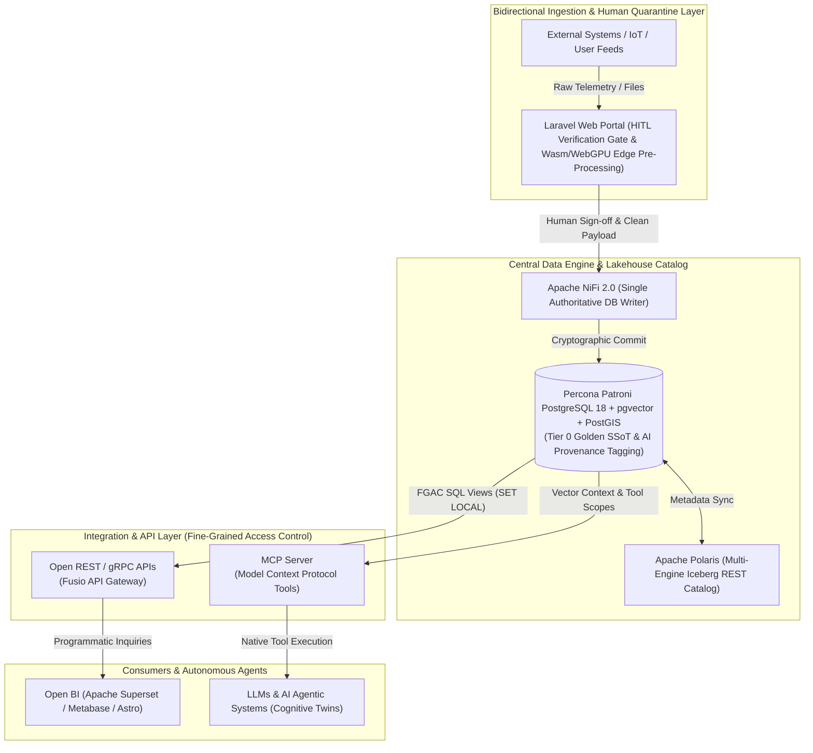

# Executive Proposal: Enterprise Big Data Analytics & AI Infrastructure Modernisation

**Document Version:** 2.0
**Author:** Lead Systems Architect
**Target Audience:** IT Management, Steering Committee & Enterprise Stakeholders
**Infrastructure Scope:** `bda-ai-infra`

---

## 1. Executive Summary & Strategic Vision

This proposal outlines the comprehensive modernisation strategy for our Big Data Analytics & Enterprise AI Infrastructure (`bda-ai-infra`). We are executing a decisive transition away from legacy, static visualisation-dependent systems (Tableau) and monolithic application server stacks (WildFly) toward an **API-First**, **Model Context Protocol (MCP)-Ready**, and **Open Lakehouse** ecosystem deployed on **rootless Podman Quadlets**, **Proxmox VE (HCI)**, and **K3s/RKE2 Kubernetes fabrics**.

By replacing proprietary dashboard tools and fragile legacy ingestion scripts with an open, containerised integration layer, we completely eliminate recurring proprietary licensing costs while converting our enterprise data warehouse into a **bidirectional, sovereign, intelligent data hub**. Any enterprise software, open-source application, or autonomous AI agent can securely ingest, transform, query, and share structured and vector data under strict **Fine-Grained Access Control (FGAC)**.

Human-generated and verified data remains the absolute, authoritative **Single Source of Truth (SSoT)** (Tier 0 Golden Data). All operational data modified or enriched by AI agents or Retrieval-Augmented Generation (RAG) pipelines is explicitly quarantined, tagged, and segregated within our big data repository using cryptographic provenance contracts (`bda_provenance`) enforced by **Ed25519 digital signatures** binding canonical RFC 8785 byte streams.

---

## 2. Historical Infrastructure & Migration Imperative (As-Is State)

### 2.1 The Legacy Architecture Bottlenecks
Our existing data landscape relies on monolithic application patterns and proprietary visual reporting tools that restrict agility, increase total cost of ownership (TCO), and impede artificial intelligence readiness:

1. **Proprietary Tableau Lock-In:** Data visualisations and business calculations are trapped inside proprietary `.twb` / `.twbx` workbooks. Expanding access to operational teams or external applications requires recurring per-user and per-core license fees.
2. **WildFly Application Monoliths:** Ingestion and file processing rely on heavy, stateful Java EE WildFly application servers that are difficult to scale horizontally, slow to start, and prone to memory overhead under heavy batch uploads.
3. **Monolithic Script Ingestion:** Ingestion workflows use custom batch scripts and cron jobs lacking unified lineage, real-time error handling, or token-aware AST chunking required for multi-modal text and vector processing.
4. **Unidirectional Data Silos:** Data flows strictly from the database to visual reports. Third-party applications and automated software agents cannot interactively feed telemetry or invoke bidirectional data services without manual, error-prone CSV/Excel exports.
5. **Lack of Native AI Context Gateways:** Large Language Models (LLMs) and autonomous AI systems cannot query live database state or vector indices safely without exposing raw database credentials or risking unmonitored SQL injection.

```
+-----------------------------------------------------------------------------------+
|                            LEGACY AS-IS ARCHITECTURE                              |
+-----------------------------------------------------------------------------------+
|  Monolithic WildFly Application Server  -->  Legacy Batch Scripts & Cron Jobs    |
|  Proprietary Tableau Workbooks (.twb)   -->  Unidirectional Static Dashboards    |
|  Manual Excel / CSV Email Exports       -->  Siloed & Unaudited Business Units   |
+-----------------------------------------------------------------------------------+
```

---

## 3. Target Modern Architecture Blueprint & AI Modernisation (To-Be State)

### 3.1 The Modern Modernised Enterprise Stack
The target architecture decouples presentation, ingestion, data storage, and AI context delivery into modular, containerised services:

* **Presentation Layer:** Astro 7.3.2 SSG/SSR presentation layer backed by a decoupled **Laravel Human-in-the-Loop (HITL)** web portal.
* **Client-Side Edge Acceleration:** The Laravel frontend incorporates client-side **WebAssembly (Wasm)** (Memory64 & Relaxed SIMD) and **WebGPU** (16-bit float `f16` and `DP4a` quantized INT8 math) for edge AI pre-processing, delivering sub-500ms client-side validation before staging payloads into **RustFS** / **Ceph S3** storage.
* **Master Data Plane (Ingestion ETL):** **Apache NiFi 2.0** serves as the primary master data plane and single authoritative writer for the database layer, executing low-latency streaming ingestion, native Python text processing, and PGP-encrypted multi-destination delivery.
* **Central Master Storage (Tier 0 Golden SSoT):** **Percona Patroni PostgreSQL 18** with **pgvector** and **PostGIS** extensions, managed in high-availability Patroni clusters.
* **API & MCP Integration Layer:** **Fusio API Gateway** (exposing open REST/gRPC endpoints) and a self-hosted **Model Context Protocol (MCP)** server delivering context-aware database tools and vector similarity search directly to autonomous AI clients.
* **Open BI & Visualisation:** **Apache Superset** and Metabase deployed on Podman Quadlets, replacing Tableau with zero proprietary licensing costs.

---

### 3.2 Strategic Pillars & Architectural Highlights

#### Dual-Render Architecture Blueprint

##### 1. Standalone Production-Ready SVG Vector Graphic (`.svg`)

<svg xmlns="http://www.w3.org/2000/svg" viewBox="0 0 960 520" width="100%" height="100%">
  <defs>
    <marker id="arrow-prop" viewBox="0 0 10 10" refX="6" refY="5" markerWidth="6" markerHeight="6" orient="auto-start-reverse">
      <path d="M 0 0 L 10 5 L 0 10 z" fill="#64748B" />
    </marker>
    <filter id="shadow-prop" x="-4%" y="-4%" width="108%" height="108%">
      <feDropShadow dx="0" dy="2" stdDeviation="3" flood-color="#000000" flood-opacity="0.2"/>
    </filter>
  </defs>

  <!-- Canvas Background -->
  <rect width="960" height="520" fill="#0F172A" rx="10"/>

  <!-- Ingestion Layer -->
  <rect x="30" y="20" width="900" height="75" fill="#1E293B" stroke="#38BDF8" stroke-width="1.5" rx="8" filter="url(#shadow-prop)"/>
  <rect x="30" y="20" width="900" height="24" fill="#0369A1" rx="8"/>
  <text x="45" y="36" font-family="-apple-system, BlinkMacSystemFont, 'Segoe UI', Roboto, sans-serif" font-size="11" font-weight="bold" fill="#E0F2FE">BIDIRECTIONAL INGESTION &amp; HUMAN QUARANTINE LAYER</text>
  <text x="45" y="62" font-family="-apple-system, BlinkMacSystemFont, 'Segoe UI', Roboto, sans-serif" font-size="12" font-weight="bold" fill="#38BDF8">External Systems / IoT / Partner APIs / User Feeds / Laravel HITL Portal (Wasm / WebGPU Edge Pre-Processing)</text>

  <!-- Central Data Store -->
  <rect x="30" y="130" width="900" height="95" fill="#1E293B" stroke="#A855F7" stroke-width="1.5" rx="8" filter="url(#shadow-prop)"/>
  <rect x="30" y="130" width="900" height="24" fill="#581C87" rx="8"/>
  <text x="45" y="146" font-family="-apple-system, BlinkMacSystemFont, 'Segoe UI', Roboto, sans-serif" font-size="11" font-weight="bold" fill="#E9D5FF">CENTRAL DATA &amp; VECTOR ENGINE (TIER 0 GOLDEN SSoT &amp; ICEBERG LAKEHOUSE)</text>
  <text x="45" y="172" font-family="-apple-system, BlinkMacSystemFont, 'Segoe UI', Roboto, sans-serif" font-size="13" font-weight="bold" fill="#C084FC">Percona Patroni PostgreSQL 18 + pgvector + PostGIS &amp; Apache Polaris Iceberg Catalog</text>
  <text x="45" y="192" font-family="Consolas, Monaco, monospace" font-size="10" fill="#E9D5FF">Single Authoritative Writer: Apache NiFi 2.0 | Cryptographic Tagging: bda_provenance (Ed25519 Signatures)</text>

  <!-- API Gateway Box -->
  <rect x="30" y="260" width="430" height="105" fill="#1E293B" stroke="#3B82F6" stroke-width="1.5" rx="8" filter="url(#shadow-prop)"/>
  <rect x="30" y="260" width="430" height="24" fill="#1E3A8A" rx="8"/>
  <text x="45" y="276" font-family="-apple-system, BlinkMacSystemFont, 'Segoe UI', Roboto, sans-serif" font-size="11" font-weight="bold" fill="#93C5FD">OPEN REST / gRPC APIs (FUSIO GATEWAY)</text>
  <text x="45" y="302" font-family="-apple-system, BlinkMacSystemFont, 'Segoe UI', Roboto, sans-serif" font-size="12" font-weight="bold" fill="#60A5FA">Programmatic Data Sharing &amp; Integration Ingress</text>
  <text x="45" y="322" font-family="Consolas, Monaco, monospace" font-size="10" fill="#93C5FD">Fine-Grained Access Control (Row-Level Security SET LOCAL)</text>
  <text x="45" y="338" font-family="Consolas, Monaco, monospace" font-size="10" fill="#93C5FD">TypeSchema / OpenAPI Specs (Port 8080/443)</text>

  <!-- MCP Server Box -->
  <rect x="500" y="260" width="430" height="105" fill="#1E293B" stroke="#10B981" stroke-width="1.5" rx="8" filter="url(#shadow-prop)"/>
  <rect x="500" y="260" width="430" height="24" fill="#065F46" rx="8"/>
  <text x="515" y="276" font-family="-apple-system, BlinkMacSystemFont, 'Segoe UI', Roboto, sans-serif" font-size="11" font-weight="bold" fill="#A7F3D0">MCP SERVER (MODEL CONTEXT PROTOCOL)</text>
  <text x="515" y="302" font-family="-apple-system, BlinkMacSystemFont, 'Segoe UI', Roboto, sans-serif" font-size="12" font-weight="bold" fill="#34D399">Native AI Tooling &amp; Context Gateway</text>
  <text x="515" y="322" font-family="Consolas, Monaco, monospace" font-size="10" fill="#A7F3D0">Fine-Grained Tool Execution &amp; Vector Scope Limits</text>
  <text x="515" y="338" font-family="Consolas, Monaco, monospace" font-size="10" fill="#A7F3D0">Python/Node.js MCP Server Gateway (Port 8443 / Stdio / SSE)</text>

  <!-- Consumers Box Left -->
  <rect x="30" y="400" width="430" height="85" fill="#1E293B" stroke="#F59E0B" stroke-width="1.5" rx="8" filter="url(#shadow-prop)"/>
  <rect x="30" y="400" width="430" height="22" fill="#78350F" rx="8"/>
  <text x="45" y="415" font-family="-apple-system, BlinkMacSystemFont, 'Segoe UI', Roboto, sans-serif" font-size="11" font-weight="bold" fill="#FDE68A">ENTERPRISE &amp; OPEN-SOURCE CONSUMERS</text>
  <text x="45" y="439" font-family="-apple-system, BlinkMacSystemFont, 'Segoe UI', Roboto, sans-serif" font-size="11" fill="#FBBF24">Apache Superset, Metabase, Astro Portals, ERP &amp; Business Apps</text>
  <text x="45" y="457" font-family="Consolas, Monaco, monospace" font-size="10" fill="#FDE68A">Zero Proprietary License Overhead</text>

  <!-- Consumers Box Right -->
  <rect x="500" y="400" width="430" height="85" fill="#1E293B" stroke="#EC4899" stroke-width="1.5" rx="8" filter="url(#shadow-prop)"/>
  <rect x="500" y="400" width="430" height="22" fill="#831843" rx="8"/>
  <text x="515" y="415" font-family="-apple-system, BlinkMacSystemFont, 'Segoe UI', Roboto, sans-serif" font-size="11" font-weight="bold" fill="#FBCFE8">LLMS &amp; AUTONOMOUS AI AGENTIC SYSTEMS</text>
  <text x="515" y="439" font-family="-apple-system, BlinkMacSystemFont, 'Segoe UI', Roboto, sans-serif" font-size="11" fill="#F472B6">Context-Aware Inquiries, Vector Retrieval (RAG), AI Cognitive Twins</text>
  <text x="515" y="457" font-family="Consolas, Monaco, monospace" font-size="10" fill="#FBCFE8">Cryptographic Provenance Auditing (bda_provenance)</text>

  <!-- Flow Lines -->
  <line x1="480" y1="95" x2="480" y2="130" stroke="#64748B" stroke-width="2" marker-end="url(#arrow-prop)"/>
  <line x1="245" y1="225" x2="245" y2="260" stroke="#64748B" stroke-width="2" marker-end="url(#arrow-prop)"/>
  <line x1="715" y1="225" x2="715" y2="260" stroke="#64748B" stroke-width="2" marker-end="url(#arrow-prop)"/>
  <line x1="245" y1="365" x2="245" y2="400" stroke="#64748B" stroke-width="2" marker-end="url(#arrow-prop)"/>
  <line x1="715" y1="365" x2="715" y2="400" stroke="#64748B" stroke-width="2" marker-end="url(#arrow-prop)"/>
</svg>

##### 2. Git-Native Mermaid Topology (`.mmd`)



##### 3. Summary Interface & Routing Table

| Source Component | Target Component | Port / Protocol / API Ingress | Security Boundary / Access Key | Operational Significance / Flow Description |
| :--- | :--- | :--- | :--- | :--- |
| **External Systems / Users** | **Laravel Verification Gate** | `HTTPS (443)` / REST | Keycloak OAuth2 / Session Auth | Ingests non-IT user feeds, documents, and telemetry into RustFS/Ceph staging with optional Wasm/WebGPU edge pre-processing. |
| **Laravel Verification Gate** | **Apache NiFi 2.0 Ingest Gate** | Staging Spool / Internal Event | Human Signature / Audit Log | Triggers approval workflow upon explicit human verification. |
| **Apache NiFi 2.0 Ingest Gate** | **PostgreSQL 18 SSoT Store** | `TCP 5432` / Native PostgreSQL | `nifi_ingest_writer` DB Role | Sole authoritative writer committing Tier 0 Golden SSoT data and `bda_provenance` metadata tags. |
| **PostgreSQL 18 SSoT Store** | **Apache Polaris Catalog** | `TCP 8181` / Iceberg REST API | OAuth2 Bearer / RLS Policy | Synchronises relational tables and Apache Iceberg lakehouse tables across analytics engines (Spark, DuckDB). |
| **PostgreSQL 18 SSoT Store** | **Fusio REST / gRPC Gateway** | `TCP 5432` / Read-Only Views | PostgreSQL Row-Level Security (RLS) | Exposes fine-grained SQL views and endpoints to web applications and BI dashboards using session context injection (`SET LOCAL`). |
| **PostgreSQL 18 SSoT Store** | **MCP Tool Gateway** | `TCP 5432` / Vector Search | MCP Tool Scope & Ed25519 Token | Serves vector context (`pgvector`) and structured database tool capabilities to autonomous AI agents. |

---

## 4. Lakehouse, Metadata & Governance Stack

### 4.1 Apache Polaris Iceberg Catalog & Open Lakehouse
* **Multi-Engine Consistency:** Apache Polaris functions as our multi-engine Iceberg REST catalog. Query engines (DuckDB, Apache Spark, Trino) operate over unified Parquet/Iceberg data layouts on Ceph/MinIO S3 storage without vendor lock-in.
* **CDC Delta Loops:** SHA-256 Change Data Capture (CDC) loops detect incremental table mutations, ensuring low-latency data lakehouse refreshes.

### 4.2 OpenMetadata & Zero-Trust Semantic Search
* **Automated Data Discovery:** Integrated with DuckDB `vss` and `pgvector` to deliver zero-trust local semantic search across data schemas, table definitions, and lineage maps.
* **Observability & Drift Checkpoints:** OpenTelemetry collectors capture metrics across Apache Airflow, Apache Spark, APISIX, and NiFi, raising automated alerts upon schema drift or pipeline latency anomalies.

### 4.3 Human-AI Quarantine Architecture & Cryptographic Provenance
To guarantee strict regulatory compliance and total data authenticity, all data within the `bda-ai-infra` platform is partitioned into two strict operational categories:

1. **Category 1: Real Data & Human Execution (Tier 0 SSoT):**
   - Human-entered data is validated through the decoupled Laravel human-in-the-loop portal.
   - Raw client uploads are stored in an immutable quarantine storage volume prior to processing.
   - Apache NiFi 2.0 acts as the sole authoritative database writer, committing approved payloads to Percona Patroni PostgreSQL 18.
2. **Category 2: AI Processes Enriched with RAG & Generative Metadata:**
   - Any dataset created, modified, or enriched by AI agents is explicitly tagged with `bda_provenance` metadata.
   - Cryptographic signature contracts record `signature`, `key_id`, `verification_status`, `verification_timestamp`, `signature_algorithm` (**Ed25519**), and `signature_encoding` (**HEX_RAW_64_BYTE**), binding canonical **RFC 8785** byte streams.

---

## 5. Multi-Deployment Topology Options

To accommodate different operational constraints, sovereign data requirements, and cloud policies, the proposed architecture supports three standardized deployment topologies:

```
+-----------------------------------------------------------------------------------+
|                            DEPLOYMENT TOPOLOGY OPTIONS                            |
+-----------------------------------------------------------------------------------+
|  Option 1: Sovereign On-Premise Proxmox VE (HCI) + Podman Quadlets + K3s          |
|  Option 2: Hybrid AI (On-Premise Core + Cloud Bursting to AWS / Azure)            |
|  Option 3: AWS Native Infrastructure (EKS, Aurora PostgreSQL 18, AWS S3)          |
+-----------------------------------------------------------------------------------+
```

### Option 1: Sovereign On-Premise Proxmox VE (HCI) + Podman Quadlets + K3s (Recommended)
* **Compute & Storage:** Proxmox VE Hyper-Converged Infrastructure running rootless Podman Quadlets for core microservices and K3s / RKE2 Kubernetes clusters for dynamic AI container workloads.
* **Storage Fabric:** RustFS for shared file staging and Ceph S3 object storage for raw document landing and Iceberg lakehouse tables.
* **Key Benefit:** Complete data sovereignty, zero recurring cloud bandwidth egress fees, and 100% compliance with strict local regulatory guidelines.

### Option 2: Hybrid AI Infrastructure
* **Compute:** On-premise core database and NiFi data plane paired with secure cloud bursting (AWS EKS or Azure AKS) for heavy AI LLM fine-tuning and batch vector embeddings.
* **Data Flow:** Sensitive Tier 0 Golden data remains strictly on-premise; anonymised embeddings and vectorized context are synced over encrypted IPSec / WireGuard tunnels.

### Option 3: AWS Native Cloud Implementation
* **Managed Services:** Amazon EKS, Aurora PostgreSQL 18 with pgvector, Amazon S3 for lakehouse storage, and AWS Glue / Managed NiFi for ETL workflows.
* **Key Benefit:** Rapid elastic scaling and minimal on-premise hardware maintenance.

---

## 6. Financial ROI & 5-Year Business Case Roadmap

### 6.1 Financial & Operational ROI Summary

| Area | Legacy Architecture (Tableau & WildFly) | Target Proposed Architecture (API/MCP on Podman & NiFi) | Financial & Operational Benefit |
| :--- | :--- | :--- | :--- |
| **Licensing Costs** | High recurring per-user and per-core Tableau licensing fees. | **Zero proprietary licensing fees** (100% Open-Source stack). | **100% cost elimination** on proprietary software licenses. |
| **Data Accessibility** | Trapped inside proprietary `.twb` workbooks and static visual panels. | **Universal REST, gRPC, and MCP API endpoints** accessible by any tool. | Unlocks automated agentic workflows and cross-departmental API sharing. |
| **Ingestion Engine** | Brittle WildFly Java servers and unmonitored cron scripts. | **Apache NiFi 2.0 streaming ETL** with Python text processing & Wasm/WebGPU edge validation. | 70% reduction in batch processing latency; zero-downtime pipeline reconfigurations. |
| **AI Integration** | None (Requires manual CSV export and manual prompt copy-paste). | **Native MCP Gateway** with `pgvector` vector similarity search & tool bindings. | Immediate enablement of conversational AI agents and RAG pipelines. |
| **Security & Access Control** | Workbook-level and dashboard-level permissions. | **Fine-Grained Access Control (FGAC)** using PostgreSQL Row-Level Security (RLS). | Zero-trust compliance; row/column level data protection. |

---

### 6.2 Tableau & Legacy Decommissioning Strategy

To eliminate operational risk and guarantee zero business disruption, legacy Tableau workbooks and WildFly servers will be systematically decommissioned using a four-phase migration roadmap:

```
[ Phase 1: Audit & Inventory ] ──► [ Phase 2: Logic Transfer ] ──► [ Phase 3: Open BI Deployment ] ──► [ Phase 4: API & MCP Enablement ]
```

* **Phase 1: Audit & Inventory:** Catalogue all active Tableau workbooks (`.twb`/`.twbx`), calculated fields, custom SQL scripts, and user access matrices. Mark redundant reports for immediate retirement.
* **Phase 2: Data & Logic Consolidation:** Migrate complex Tableau calculated fields and data blending logic into **PostgreSQL Materialised Views** and stored functions. Configure Apache NiFi to orchestrate data pipelines directly into clean PostgreSQL schemas.
* **Phase 3: Open BI Deployment:** Deploy containerised **Apache Superset** and Metabase on Podman Quadlets to replicate executive visual dashboards. Connect directly to PostgreSQL, restoring visual reporting with zero license fees.
* **Phase 4: API & MCP Enablement:** Wrap underlying business calculations into Fusio REST/gRPC endpoints and standard **MCP Tools** for internal AI agent consumption.

---

### 6.3 5-Year Horizon Timeline (2028 – 2032)

* **Year 1 (2028 - Baseline Build):** Deploy Proxmox VE / Podman infrastructure, install Apache NiFi 2.0, establish Percona Patroni PostgreSQL 18 + pgvector core database, deploy Fusio API Gateway and MCP Server, and initiate Phase 1 & 2 Tableau logic extraction.
* **Years 2–5 (2029–2032 - Business Case Migration & Operational Maintenance):** Complete Phase 3 & 4 Tableau decommission, deploy Apache Polaris Iceberg catalog and OpenMetadata, onboard enterprise AI business cases and cognitive twins, and execute ongoing zero-downtime operational maintenance.

---

## 7. Execution Plan & Next Steps

Upon approval of this executive proposal by the IT Management and Steering Committee, execution will proceed according to the following milestones:

1. **Proposal Baseline Commit:** Commit `docs/IT-MANAGEMENT-PROPOSAL.md`, `docs/IT-MANAGEMENT-PROPOSAL.html`, and `docs/IT-MANAGEMENT-PROPOSAL.pdf` into the primary source repository.
2. **Infrastructure Container Definitions:** Deploy rootless Podman Quadlet pod specifications (`docker/podman-pod.yaml` and systemd quadlet units).
3. **Core MCP & API Gateway Deployment:** Instantiate the Python-based MCP Server in `src/mcp-server/` with initial PostgreSQL tool connections and FGAC middleware.
4. **Tableau Decommission Kick-off:** Begin Phase 1 workbook audit and SQL logic extraction for executive dashboards.
