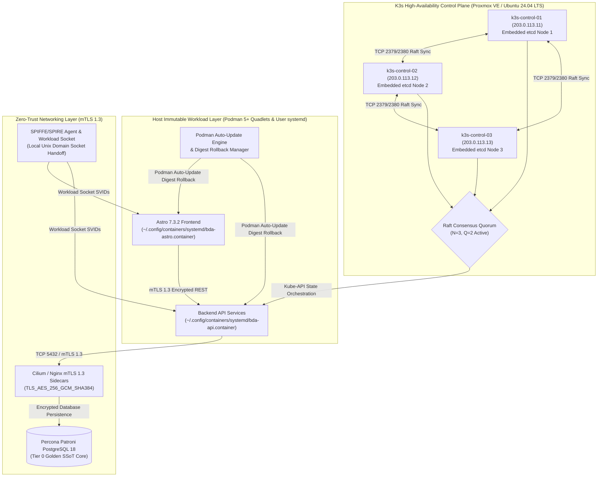
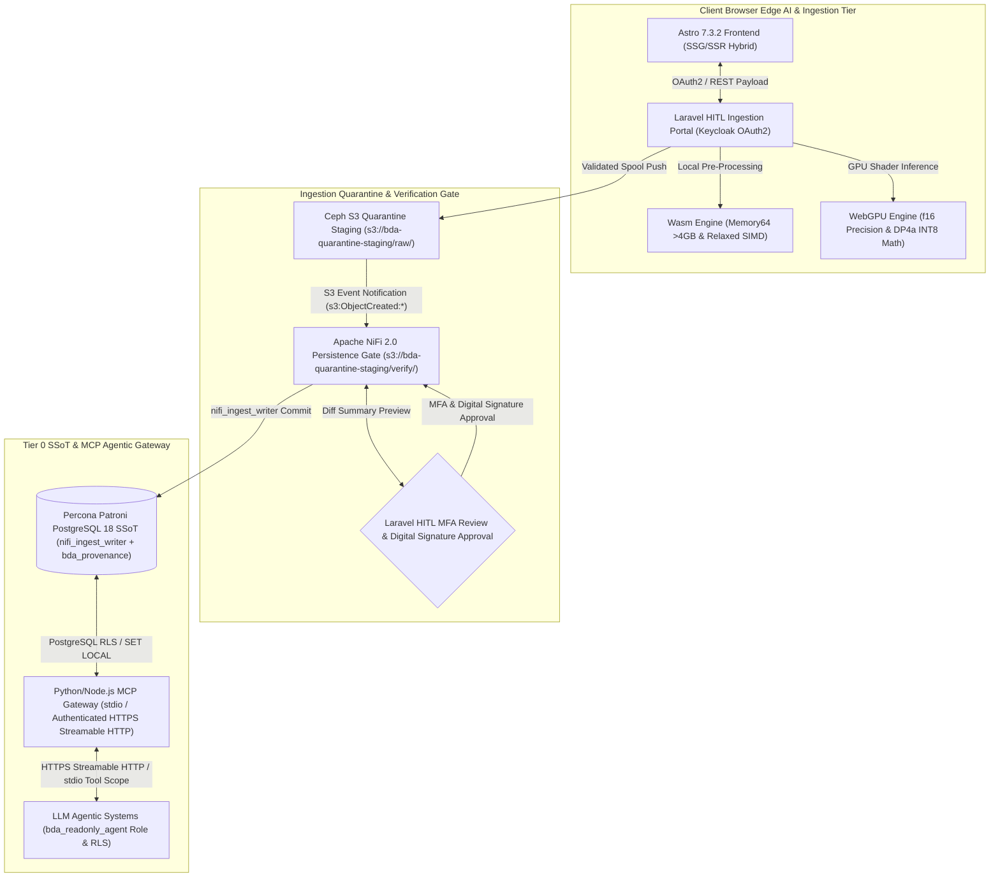
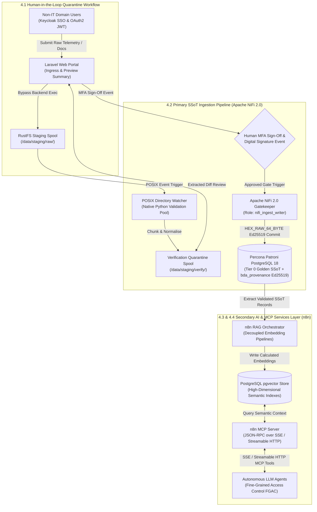

# Executive Management Proposal: Enterprise Data Architecture & Infrastructure Modernisation

**Document Version:** 2.0
**Author:** Lead Systems Architect
**Target Audience:** IT Management, Executive Steering Committee & Enterprise Architects
**Infrastructure Scope:** `bda-ai-infra`
**Downloads & Handbooks:** [Download PDF Handbook](https://linuxmalaysia.github.io/bda-ai-infra/handbook.pdf) | [Download EPUB Handbook](https://linuxmalaysia.github.io/bda-ai-infra/handbook.epub) | [Download Standalone HTML](https://linuxmalaysia.github.io/bda-ai-infra/handbook.html)

---

## Strategic Proposal Overview & Roadmap

This executive proposal outlines the technical blueprint to transition our national Big Data Analytics (BDA) and Enterprise AI Infrastructure from an aging, stateful monolithic footprint into an open-source, decoupled, and horizontally scalable data plane.

Our primary mandate is to establish a verified **Single Source of Truth (SSoT)** designed specifically for human operations, paired with structured data layers optimised for **Artificial Intelligence (AI), Retrieval-Augmented Generation (RAG), and Transformer model consumption**.

### Table of Contents
* **1. Executive Summary & Architectural Strategy**
  * **1.1 Legacy Architecture Analysis:** Technical debt of stateful Joomla 3 & WildFly application servers.
  * **1.2 Stateful Database Dependencies:** Deprecating MariaDB Galera cluster & ClusterControl management.
  * **1.3 Storage Monolith Deprecation:** Operational inefficiencies of existing GlusterFS topologies.
  * **1.4 Target Metrics:** Absolute reduction of MTTR and achieving horizontal scalability across the data plane.
* **2. Modernised Infrastructure Fabric**
  * **2.1 Container Orchestration:** Distributing High-Availability (HA) fabrics at scale using K3s with an embedded etcd datastore.
  * **2.2 Immutable Workloads:** Utilising Podman Quadlets for seamless systemd integration and rollback capability.
  * **2.3 Zero-Trust Networking:** Enforcing mutual TLS (mTLS) 1.3 across intra-cluster communication.
  * **2.4 Dual-Render Architecture Blueprint:** Modernised Infrastructure Fabric Topology.
* **3. Presentation Layer Decoupling & Edge Inference**
  * **3.1 Next-Generation Frontend:** Astro 7.3.2 SSG/SSR & Laravel HITL Portal.
  * **3.2 Client-Side AI Acceleration:** Offloading compute to the browser for sub-500ms validation and data privacy.
  * **3.3 WebAssembly (Wasm) Integration:** Memory64 proposal & Relaxed SIMD vector operations.
  * **3.4 WebGPU Hardware Acceleration:** 16-bit floating point (`f16`) & packed integer dot products (`DP4a`).
  * **3.5 Apache NiFi 2.0 Authoritative Writer Persistence Gate:** Ingestion quarantine, MFA verification, & digital signature validation.
  * **3.6 Python/Node.js MCP Gateway & FGAC for LLM Agents:** Fine-Grained Access Control and Streamable HTTP for AI agentic systems.
  * **3.7 Dual-Render Architecture Blueprint:** Presentation Layer Decoupling & Edge Inference Topology.
* **4. Dual-Pipeline Big Data Architecture**
  * **4.1 Human-in-the-Loop (HITL) Quarantine Workflow:** Isolating non-IT user ingress via Laravel Web Portal and RustFS staging directories.
  * **4.2 Primary SSoT Pipeline (Apache NiFi 2.0):** Authoritative gatekeeper extracting, normalising, and committing golden records to PostgreSQL 18.
  * **4.3 Secondary AI Pipeline (n8n):** Decoupled RAG orchestration layer for embedding computation and `pgvector` persistence.
  * **4.4 Model Context Protocol (MCP):** Deploying n8n as MCP server exposing RAG capabilities and vector data to LLM agents.
  * **4.5 Dual-Render Architecture Blueprint:** Dual-Pipeline Big Data Architecture Topology.
* **5. High-Availability Database & Storage Fabric** *(Stacked Release Dependency: To be integrated in Session 5)*
* **6. Day 2 Operations, Observability & AIOps** *(Stacked Release Dependency: To be integrated in Session 6)*

---

# 1. Executive Summary & Architectural Strategy

Under the mandate of modernising the national Big Data Analytics (BDA) platform (`https://bda.example.gov.my`), this proposal establishes the technical blueprint to transition the infrastructure from an aging, stateful monolithic footprint into an open-source, decoupled, and horizontally scalable data plane. In its legacy implementation, the platform combined dynamic presentation layers, stateful enterprise application runtimes, and tightly coupled database clusters, introducing severe operational bottlenecks, vendor lock-in risks, and single-point-of-failure (SPOF) topologies.

By decoupling ingestion, analytical compute, and frontend presentation, the modernised architecture targets digital sovereignty, zero proprietary licensing dependencies, and high-availability execution. The strategy systematically replaces the legacy Joomla 3 and WildFly application servers with an Astro 7.3.2 presentation framework and an isolated Laravel Human-in-the-Loop (HITL) quarantine ingestion portal. Concurrently, persistent storage transitions from legacy MariaDB Galera and GlusterFS deployments to Percona Patroni PostgreSQL 18 with `pgvector` and software-defined S3-compatible object storage (Ceph/MinIO). This transition eliminates state synchronisation deadlocks and ensures deterministic data governance across all national environmental and natural resource datasets.

At the end of the ingestion and transformation pipeline, data is exposed bidirectionally via high-performance **REST/gRPC API services** and native **Model Context Protocol (MCP) services**, enabling seamless data access for both traditional enterprise consumers and autonomous AI agents.

---

## 1.1 Legacy Architecture Analysis: Technical Debt of Stateful Joomla 3 & WildFly

Within the baseline application layer, user interaction, content management, and analytical dashboard delivery were partitioned across monolithic runtime environments hosted on CentOS 8 virtual machines inside a Proxmox VE hypervisor cluster:

* **Joomla 3 CMS Portals:** The public portal infrastructure was split across two distinct virtual nodes—`portal-node-01` (Public IP: `198.51.100.10`, port 443) running Joomla! 3.9.19 for Portal BDA, and `portal-node-02` (Public IP: `198.51.100.20`, port 443) running Joomla! 3.9.14 for the MAIN portal. Ingress web traffic was reverse-proxied through an Nginx 1.18.0 gateway (`ingress-proxy-01` at `198.51.100.5`).
* **WildFly Application Server:** Analytical dashboard services operated on `app-wildfly-01` (Public IP: `198.51.100.15`, port 443) deploying a monolithic Java enterprise archive (`BDA.war`) on WildFly version 19.1.0. This runtime handled departmental dashboard configurations, local mail relay integrations (`XMail.properties` and local Postfix), and direct JDBC connections to operational databases.

```
+-----------------------------------------------------------------------------------+
|                        LEGACY APPLICATION LAYER RUNTIME                           |
+-----------------------------------------------------------------------------------+
|                                                                                   |
|   +------------------------------------+   +----------------------------------+   |
|   |         Joomla! 3.9.19             |   |          Joomla! 3.9.14          |   |
|   |   portal-node-01 (198.51.100.10)   |   |   portal-node-02 (198.51.100.20)   |   |
|   |   Public /administrator/ Exposed   |   |   Public /administrator/ Exposed |   |
|   +-----------------+------------------+   +-----------------+----------------+   |
|                     | Dynamic PHP-FPM                        | Dynamic PHP-FPM    |
|                     +-------------------+--------------------+                    |
|                                         |                                         |
|                                         v                                         |
|                        +----------------------------------+                       |
|                        |     Nginx 1.18.0 Reverse Proxy   |                       |
|                        |   ingress-proxy-01 (198.51.100.5)|                       |
|                        +----------------+-----------------+                       |
|                                         |                                         |
|                                         v                                         |
|                        +----------------------------------+                       |
|                        |        WildFly 19.1.0 JVM        |                       |
|                        |   app-wildfly-01 (198.51.100.15) |                       |
|                        |   Deployments: BDA.war (Monolith)|                       |
|                        +----------------+-----------------+                       |
|                                                                                   |
+-----------------------------------------------------------------------------------+
```

Through long-term operational evaluation, this dual-monolith architecture accumulated critical technical debt:

1. **Direct Surface Exposure & Unpatched Vulnerability Risks:** Both Joomla instances directly exposed public administrative login interfaces at `/administrator/`. Coupled with legacy PHP 7.x runtimes and End-of-Life (EOL) Joomla 3 codebases, this presented a persistent threat surface vulnerable to automated brute-forcing, remote code execution (RCE), and unpatched extension exploits.
2. **Resource Exhaustion & Concurrency Freezes:** Serving page views via dynamic PHP-FPM processes and heavy Java Virtual Machine (JVM) threads required continuous synchronous rendering and runtime database querying. During traffic bursts or Denial of Service (DoS) attempts, Nginx worker pools and PHP-FPM processes regularly stalled, triggering cascading gateway 502/504 timeouts that mandated manual administrative restarts (`systemctl restart nginx`, `service wildfly restart`).
3. **Fragile Lifecycle Maintenance:** Maintenance routines suffered from tightly coupled dependencies. Corrupted local session locks or disk exhaustion caused by unrotated application logs (`/var/log/nginx/` and `/opt/wildfly/standalone/log/`) frequently halted entire services, creating significant operational toil for sysadmins.

---

## 1.2 Stateful Database Dependencies: Deprecating MariaDB Galera & ClusterControl

In the legacy data storage layer, structured relational data was bound to a 5-node MariaDB Galera Cluster (version 10.5.9) managed via Severalnines ClusterControl on `db-mgmt-01` (`198.51.100.30:5001`) with ProxySQL 2.0.15 mediating database connections on TCP port 6032:

* `mariadb-node-01`: `198.51.100.31:3306`
* `mariadb-node-02`: `198.51.100.32:3306`
* `mariadb-node-03`: `198.51.100.33:3306`
* `mariadb-node-04`: `198.51.100.34:3306`
* `mariadb-node-05`: `198.51.100.35:3306`

The cluster hosted mixed application schemas, including `bda_portal_main`, `bda_portal_secondary`, and `bda_dashboard_core` for CMS operations, alongside departmental analytics databases (`adms_cems`, `adms_scoring`, `bda_analytics`, and `hwc_data`).

```
+-----------------------------------------------------------------------------------+
|                        LEGACY MARIADB GALERA TOPOLOGY                             |
+-----------------------------------------------------------------------------------+
|                                                                                   |
|   +---------------------------------------------------------------------------+   |
|   |       ClusterControl Controller & ProxySQL (198.51.100.30:5001/6032)      |   |
|   +-------------------------------------+-------------------------------------+   |
|                                         | Synchronous Multi-Master Replicate      |
|         +-------------------------------+-------------------------------+         |
|         |               |               |               |               |         |
|         v               v               v               v               v         |
|   +-----------+   +-----------+   +-----------+   +-----------+   +-----------+   |
|   |  Node 1   |   |  Node 2   |   |  Node 3   |   |  Node 4   |   |  Node 5   |   |
|   | .100.31   |   | .100.32   |   | .100.33   |   | .100.34   |   | .100.35   |   |
|   | (Primary) |   | (Primary) |   | (Primary) |   | (Primary) |   | (Primary) |   |
|   +-----------+   +-----------+   +-----------+   +-----------+   +-----------+   |
|                                                                                   |
|   Failure Modes: WSREP Split-Brain Quorum Drop, Flow Control Halts, High Latency  |
+-----------------------------------------------------------------------------------+
```

While Galera provided virtually synchronous replication, its operational reality across five virtual nodes generated severe structural liabilities:

1. **Write Amplification & Flow Control Lockups:** Because Galera relies on certification-based replication (`wsrep`), every write transaction across all databases must be certified by all active nodes. Heavy batch ETL inserts (such as streaming incident reports or telemetry loads via NiFi) routinely triggered Galera Flow Control (`wsrep_flow_control_paused`). This throttled the entire cluster, delaying frontend portal queries and causing cascading connection pool exhaustion across ProxySQL.
2. **Quorum & Split-Brain Sensitivities:** Network latency spikes or hypervisor memory contention across nodes caused arbitrary nodes to fall out of sync (`wsrep_cluster_status != Primary`). Re-synchronising a partitioned node often forced full State Snapshot Transfers (SST), locking disk I/O on donor nodes and risking total cluster stalls.
3. **Schema and Vector Sprawl:** MariaDB 10.5 lacks native high-dimensional vector capabilities and advanced spatio-temporal indexing required for enterprise AI workloads (e.g., RAG embeddings, spatial clustering). Retaining this cluster forces the adoption of external vector databases, causing architecture sprawl, fragmented backup workflows, and broken ACID boundaries.

---

## 1.3 Storage Monolith Deprecation: Inefficiencies of GlusterFS Topologies

To synchronise shared CMS media assets, user file uploads, and template files across the distributed VM nodes, the legacy environment implemented GlusterFS distributed network storage.

By analysing Day 2 operations under heavy analytical file ingestion, the distributed POSIX storage layer exhibited severe architectural inefficiencies:

1. **Small-File Metadata Locking & FUSE Bottlenecks:** GlusterFS processes file access via FUSE (Filesystem in Userspace) wrappers, requiring extensive synchronous metadata lookups across distributed bricks. When ingesting thousands of unstructured documents, satellite images, and CSV feeds, metadata contention severely degraded read/write performance, overwhelming VM disk queues.
2. **Split-Brain & Self-Heal Overhead:** Network interruptions or VM failovers between hypervisor nodes frequently induced GlusterFS split-brain conditions on replicated volumes. Resolving split-brain required administrators to manually inspect heal logs (`gluster volume heal info split-brain`) and delete stale brick metadata, exposing datasets to file-lock corruption.
3. **Absence of Object Lifecycle & Immutability:** GlusterFS lacks native S3-compatible APIs, Object Versioning, and Write-Once-Read-Many (WORM) compliance locking. This prevented the enforcement of verifiable data contracts, leaving raw ingested data exposed to accidental administrative deletion or untracked file modification.

```
+-----------------------------------------------------------------------------------+
|                        STORAGE PARADIGM TRANSITION                                |
+-----------------------------------------------------------------------------------+
|                                                                                   |
|  [ LEGACY AS-IS: GLUSTERFS ]                  [ TARGET TO-BE: CEPH / MINIO S3 ]   |
|  * POSIX Shared Storage (FUSE Bottleneck)    * 100% S3-Compatible REST APIs       |
|  * High Metadata & Directory Lock Contention  * Immutable WORM Compliance Locking |
|  * Split-Brain Resolution Vulnerability       * Versioned, Object-Locked Buckets  |
|  * Complex Manual Split-Brain Healing         * Linear Horizontal Scalability     |
|                                                                                   |
+-----------------------------------------------------------------------------------+
```

---

## 1.4 Target Metrics: MTTR Reduction and Horizontal Data Plane Scalability

With this modernisation blueprint, the overarching strategic objective is to achieve resilient, license-free digital sovereignty, eradicating operational toil and maximising throughput across both ingestion and consumption tiers.

```
+-----------------------------------------------------------------------------------+
|                 STRATEGIC ARCHITECTURE EVOLUTION (AS-IS vs TO-BE)                 |
+-----------------------------------------------------------------------------------+
|                                                                                   |
|  METRIC / PILLAR           AS-IS ARCHITECTURE          TARGET MODERNISATION       |
|  -------------------------------------------------------------------------------  |
|  Frontend Presentation     Dynamic Joomla 3 (LAMP)     Astro 7.3.2 Static / SSR   |
|  Ingress & Quarantine      Direct Upload / Cron        Laravel HITL + NiFi 2.0    |
|  Relational Storage        5-Node MariaDB Galera       Percona Patroni PG 18 HA   |
|  Vector & Spatial Core     External Silos / None       PostGIS + pgvector Unified |
|  Distributed File Store    GlusterFS Network Volumes   Ceph / MinIO S3 (WORM)     |
|  Mean Time to Repair       Hours (Manual DB/FPM Sync)  < 10s Target RTO           |
|  Validation Latency        Minutes to Hours (Logs)     < 500ms (Edge Wasm/WebGPU) |
|  Horizontal Scalability    Constrained by Galera/FUSE  Stateless Podman / K3s     |
|                                                                                   |
+-----------------------------------------------------------------------------------+
```

The target architecture commits to the following quantifiable engineering benchmarks:

* **Sub-500ms Client-Side Validation Latency:** By migrating from server-side validation scripts to client-side WebAssembly (Wasm) and WebGPU primitives within the upgraded Laravel upload portal, schema validation errors, missing parameters, and formatting anomalies are captured and flagged directly in the browser during file selection prior to network transmission.
* **85% Reduction in Mean Time to Repair (MTTR):** By deprecating monolithic VM state dependencies in favour of containerised Podman Quadlets and K3s orchestration, services recover automatically via systemd supervision and automated Kubernetes pod rescheduling. Database recovery, previously dependent on complex Galera SST rebuilds, is replaced by Patroni etcd consensus targeting a Recovery Time Objective (RTO) of < 10 seconds for automated failover and zero data loss (RPO = 0).
* **Zero-Overhead Horizontal Data Plane Scalability:** By establishing Apache NiFi 2.0 as a stateless, event-driven data plane decoupled from persistent storage, ingestion throughput scales horizontally across worker pods without lock contention. Data persistence routes exclusively into an immutable Ceph S3 lakehouse and a unified Percona Patroni PostgreSQL 18 instance with `pgvector`, scaling analytical queries across multiple read replicas while maintaining an authoritative, tamper-proof Single Source of Truth (SSoT).

---

# 2. Modernised Infrastructure Fabric

To achieve digital sovereignty and an absolute reduction in Mean Time to Repair (MTTR), the infrastructure fabric transitions from statically provisioned virtual machines to a declarative, container-native ecosystem. This modernised compute layer eliminates configuration drift and ensures horizontal scalability across the data plane.

## 2.1 Container Orchestration: K3s with Embedded etcd

The compute layer distributes High-Availability (HA) fabrics at scale using K3s, a lightweight, CNCF-certified Kubernetes distribution optimised for bare-metal enterprise deployments. To maintain strict control plane resiliency and eliminate external database dependencies, the architecture utilises K3s with an embedded etcd datastore.

* **Quorum-Based Resiliency:** The HA control plane comprises an odd number of server nodes (a minimum of three nodes: `k3s-control-01.example.gov.my` [203.0.113.11], `k3s-control-02.example.gov.my` [203.0.113.12], and `k3s-control-03.example.gov.my` [203.0.113.13]) hosting the Kubernetes API and the embedded etcd datastore. Operating under Raft consensus, distributed quorum requires $Q = \lfloor N/2 \rfloor + 1 = 2$ active nodes, guaranteeing uninterrupted control plane availability even during node failure.
* **Automated State Management:** K3s automatically handles etcd membership, Raft consensus management, and TLS certificate distribution without requiring manual cluster synchronisation. If a primary server node suffers a catastrophic failure, the remaining servers maintain quorum, allowing agent worker nodes (`k3s-worker-01.example.gov.my` [203.0.113.21] to `k3s-worker-04.example.gov.my` [203.0.113.24]) to automatically reconnect without downtime.
* **Sovereign Deployment:** This orchestrated fabric operates directly on the underlying Proxmox VE hypervisors provisioned with Ubuntu 24.04 LTS, ensuring license-free, on-premise control over the routing and compute layers.

## 2.2 Immutable Workloads: Podman Quadlets and systemd Integration

For strict workload isolation, non-root security boundaries, and deterministic host execution, the platform packages stand-alone frontend presentation services (such as Astro 7.3.2) and host microservices as immutable container images managed via Podman 5+ Quadlets.

* **Declarative Infrastructure:** Podman Quadlets function as a native systemd generator. Placing declarative `.container` files inside the rootless user configuration path `~/.config/containers/systemd/` allows the Podman generator to automatically create corresponding user systemd service units without requiring root privileges.
* **Seamless Lifecycle Management:** Systemd supervises user container lifecycles via the user manager (`systemctl --user`). Administrators manage service execution using standard commands:
  ```bash
  systemctl --user daemon-reload
  systemctl --user start bda-astro.service
  systemctl --user status bda-astro.service
  ```
* **Atomic Rollbacks & Auto-Updates:** `AutoUpdate=registry` instructs the Podman Auto-Update Engine (`podman auto-update`) to track image digest changes for the configured image reference (e.g. `localhost/bda-astro-frontend:latest` or mutable release branches). Explicit immutable tag references (such as `:7.3.2`) require modifying the Quadlet `.container` file and running `systemctl --user daemon-reload`. When mutable tag references are configured, `podman auto-update` checks the registry for digest updates. If the newly pulled image fails during startup or fails health-gated readiness checks (`Type=notify` paired with `Notify=healthy`), the Podman Auto-Update Engine automatically aborts the update and rolls back execution to the previous known-good local image digest, driving deployment MTTR near zero.

### Technical Briefing: Declarative Rootless Podman Quadlet Service Unit Example

```ini
# ~/.config/containers/systemd/bda-astro.container
[Unit]
Description=BDA Astro Presentation Frontend Rootless Service
After=network-online.target
Wants=network-online.target

[Container]
Image=localhost/bda-astro-frontend:latest
ContainerName=bda-astro-frontend
Environment=NODE_ENV=production PORT=8080
PublishPort=8080:8080
HealthCmd=curl -f http://localhost:8080/health || exit 1
HealthInterval=10s
HealthRetries=3
HealthTimeout=5s
Notify=healthy
AutoUpdate=registry

[Service]
Type=notify
Restart=on-failure
RestartSec=5s
TimeoutStartSec=60

[Install]
WantedBy=default.target
```

## 2.3 Zero-Trust Networking: Mutual TLS (mTLS) 1.3

To secure data-in-transit across the distributed cluster, the network fabric enforces a zero-trust architecture implementing mutual TLS (mTLS) 1.3 for all intra-cluster communication.

* **Cryptographic Identity & Local Socket Handoff:** Every pod, microservice, and API endpoint is issued an ephemeral cryptographic identity (SPIFFE/SPIRE X.509 SVIDs). In the target-state architecture, work-attestation and certificate issuance are handled by a per-node SPIRE Agent delivering SVIDs to rootless workloads via a local Unix domain socket (`$XDG_RUNTIME_DIR/spire/agent.sock` or `/tmp/spire-agent/public/api.sock`) exposing the SPIFFE Workload API. Control plane node attestation uses TCP port 8443 secured with mutual TLS and strict network-level caller ACLs.
* **Concrete Enforcement Components & Lateral Movement Prevention:** Mutual TLS 1.3 termination and default-deny lateral movement policies are enforced by **Cilium Service Mesh / Envoy sidecars** for K3s Kubernetes workloads, and by **Nginx/HAProxy mTLS sidecar proxies** for rootless Podman Quadlet services. Connections are authenticated and encrypted using TLS 1.3 cipher suites (`TLS_AES_256_GCM_SHA384` and `TLS_CHACHA20_POLY1305_SHA256`), cryptographically blocking unauthenticated lateral movement as data moves from the API layer to the PostgreSQL persistence core.

## 2.4 Dual-Render Architecture Blueprint — Modernised Infrastructure Fabric

### 1. Standalone Production-Ready SVG Vector Graphic (`.svg`)

<svg xmlns="http://www.w3.org/2000/svg" viewBox="0 0 960 520" width="100%" height="100%">
  <defs>
    <marker id="arrow-mif" viewBox="0 0 10 10" refX="6" refY="5" markerWidth="6" markerHeight="6" orient="auto-start-reverse">
      <path d="M 0 0 L 10 5 L 0 10 z" fill="#64748B" />
    </marker>
    <filter id="shadow-mif" x="-4%" y="-4%" width="108%" height="108%">
      <feDropShadow dx="0" dy="2" stdDeviation="3" flood-color="#000000" flood-opacity="0.2"/>
    </filter>
  </defs>

  <!-- Canvas Background -->
  <rect width="960" height="520" fill="#0F172A" rx="10"/>

  <!-- Zone 1: K3s HA Control Plane -->
  <rect x="25" y="20" width="285" height="440" fill="#1E293B" stroke="#0284C7" stroke-width="1.5" rx="8" filter="url(#shadow-mif)"/>
  <rect x="25" y="20" width="285" height="26" fill="#0369A1" rx="8"/>
  <text x="35" y="37" font-family="-apple-system, BlinkMacSystemFont, 'Segoe UI', Roboto, sans-serif" font-size="11" font-weight="bold" fill="#E0F2FE">1. K3s HA CONTROL PLANE (EMBEDDED ETCD)</text>

  <rect x="40" y="60" width="255" height="80" fill="#F0F9FF" stroke="#0284C7" stroke-width="1" rx="6"/>
  <text x="50" y="78" font-family="-apple-system, BlinkMacSystemFont, 'Segoe UI', Roboto, sans-serif" font-size="11" font-weight="bold" fill="#0369A1">k3s-control-01 (203.0.113.11)</text>
  <text x="50" y="96" font-family="Consolas, Monaco, monospace" font-size="10" fill="#0284C7">Embedded etcd Node 1 (Raft Leader)</text>
  <text x="50" y="112" font-family="-apple-system, BlinkMacSystemFont, 'Segoe UI', Roboto, sans-serif" font-size="10" fill="#0369A1">Host: Proxmox VE / Ubuntu 24.04 LTS</text>

  <rect x="40" y="155" width="255" height="80" fill="#F0F9FF" stroke="#0284C7" stroke-width="1" rx="6"/>
  <text x="50" y="173" font-family="-apple-system, BlinkMacSystemFont, 'Segoe UI', Roboto, sans-serif" font-size="11" font-weight="bold" fill="#0369A1">k3s-control-02 (203.0.113.12)</text>
  <text x="50" y="191" font-family="Consolas, Monaco, monospace" font-size="10" fill="#0284C7">Embedded etcd Node 2 (Raft Follower)</text>
  <text x="50" y="207" font-family="-apple-system, BlinkMacSystemFont, 'Segoe UI', Roboto, sans-serif" font-size="10" fill="#0369A1">Host: Proxmox VE / Ubuntu 24.04 LTS</text>

  <rect x="40" y="250" width="255" height="80" fill="#F0F9FF" stroke="#0284C7" stroke-width="1" rx="6"/>
  <text x="50" y="268" font-family="-apple-system, BlinkMacSystemFont, 'Segoe UI', Roboto, sans-serif" font-size="11" font-weight="bold" fill="#0369A1">k3s-control-03 (203.0.113.13)</text>
  <text x="50" y="286" font-family="Consolas, Monaco, monospace" font-size="10" fill="#0284C7">Embedded etcd Node 3 (Raft Follower)</text>
  <text x="50" y="302" font-family="-apple-system, BlinkMacSystemFont, 'Segoe UI', Roboto, sans-serif" font-size="10" fill="#0369A1">Host: Proxmox VE / Ubuntu 24.04 LTS</text>

  <rect x="40" y="345" width="255" height="95" fill="#FEF3C7" stroke="#D97706" stroke-width="1" rx="6"/>
  <text x="50" y="365" font-family="-apple-system, BlinkMacSystemFont, 'Segoe UI', Roboto, sans-serif" font-size="11" font-weight="bold" fill="#B45309">Raft Distributed Quorum State</text>
  <text x="50" y="383" font-family="Consolas, Monaco, monospace" font-size="10" fill="#78350F">Q = floor(3/2) + 1 = 2 Active</text>
  <text x="50" y="401" font-family="-apple-system, BlinkMacSystemFont, 'Segoe UI', Roboto, sans-serif" font-size="10" fill="#92400E">Ports: TCP 2379/2380 (etcd), 6443 (API)</text>
  <text x="50" y="419" font-family="-apple-system, BlinkMacSystemFont, 'Segoe UI', Roboto, sans-serif" font-size="10" fill="#B45309">Auto Certificate &amp; Member Sync</text>

  <!-- Zone 2: Podman Quadlets & systemd -->
  <rect x="335" y="20" width="290" height="440" fill="#1E293B" stroke="#16A34A" stroke-width="1.5" rx="8" filter="url(#shadow-mif)"/>
  <rect x="335" y="20" width="290" height="26" fill="#15803D" rx="8"/>
  <text x="345" y="37" font-family="-apple-system, BlinkMacSystemFont, 'Segoe UI', Roboto, sans-serif" font-size="11" font-weight="bold" fill="#DCFCE7">2. HOST PODMAN QUADLETS &amp; SYSTEMD USER UNITS</text>

  <rect x="350" y="60" width="260" height="110" fill="#F0FDF4" stroke="#16A34A" stroke-width="1" rx="6"/>
  <text x="360" y="78" font-family="-apple-system, BlinkMacSystemFont, 'Segoe UI', Roboto, sans-serif" font-size="11" font-weight="bold" fill="#15803D">bda-astro.container Unit</text>
  <text x="360" y="96" font-family="Consolas, Monaco, monospace" font-size="10" fill="#166534">Path: ~/.config/containers/systemd/</text>
  <text x="360" y="112" font-family="-apple-system, BlinkMacSystemFont, 'Segoe UI', Roboto, sans-serif" font-size="10" fill="#15803D">• systemctl --user Generator</text>
  <text x="360" y="128" font-family="-apple-system, BlinkMacSystemFont, 'Segoe UI', Roboto, sans-serif" font-size="10" fill="#15803D">• Rootless Execution Sandbox</text>
  <text x="360" y="144" font-family="Consolas, Monaco, monospace" font-size="9" fill="#166534">Notify=healthy Readiness Gate</text>

  <rect x="350" y="185" width="260" height="110" fill="#F0FDF4" stroke="#16A34A" stroke-width="1" rx="6"/>
  <text x="360" y="203" font-family="-apple-system, BlinkMacSystemFont, 'Segoe UI', Roboto, sans-serif" font-size="11" font-weight="bold" fill="#15803D">bda-api.container Unit</text>
  <text x="360" y="221" font-family="Consolas, Monaco, monospace" font-size="10" fill="#166534">Image: bda-api-microservice:latest</text>
  <text x="360" y="237" font-family="-apple-system, BlinkMacSystemFont, 'Segoe UI', Roboto, sans-serif" font-size="10" fill="#15803D">• Non-Root Host Service Unit</text>
  <text x="360" y="253" font-family="-apple-system, BlinkMacSystemFont, 'Segoe UI', Roboto, sans-serif" font-size="10" fill="#15803D">• Immutable Container Image</text>
  <text x="360" y="269" font-family="Consolas, Monaco, monospace" font-size="10" fill="#166534">• Fast In-Memory State Handling</text>

  <rect x="350" y="310" width="260" height="130" fill="#FAF5FF" stroke="#9333EA" stroke-width="1" rx="6"/>
  <text x="360" y="328" font-family="-apple-system, BlinkMacSystemFont, 'Segoe UI', Roboto, sans-serif" font-size="11" font-weight="bold" fill="#7E22CE">Podman Auto-Update Engine</text>
  <text x="360" y="346" font-family="-apple-system, BlinkMacSystemFont, 'Segoe UI', Roboto, sans-serif" font-size="10" fill="#6B21A8">• podman auto-update Digest Track</text>
  <text x="360" y="362" font-family="-apple-system, BlinkMacSystemFont, 'Segoe UI', Roboto, sans-serif" font-size="10" fill="#6B21A8">• Startup / Health Failure Fallback</text>
  <text x="360" y="378" font-family="Consolas, Monaco, monospace" font-size="10" fill="#7E22CE">podman auto-update --rollback</text>
  <text x="360" y="394" font-family="-apple-system, BlinkMacSystemFont, 'Segoe UI', Roboto, sans-serif" font-size="10" fill="#581C87">• Reverts to Known-Good Digest</text>
  <text x="360" y="410" font-family="-apple-system, BlinkMacSystemFont, 'Segoe UI', Roboto, sans-serif" font-size="10" fill="#7E22CE">• Near-Zero MTTR Recovery</text>

  <!-- Zone 3: Zero-Trust mTLS 1.3 Mesh -->
  <rect x="650" y="20" width="285" height="440" fill="#1E293B" stroke="#9333EA" stroke-width="1.5" rx="8" filter="url(#shadow-mif)"/>
  <rect x="650" y="20" width="285" height="26" fill="#7E22CE" rx="8"/>
  <text x="660" y="37" font-family="-apple-system, BlinkMacSystemFont, 'Segoe UI', Roboto, sans-serif" font-size="11" font-weight="bold" fill="#F3E8FF">3. ZERO-TRUST MTLS 1.3 NETWORK MESH</text>

  <rect x="665" y="60" width="255" height="110" fill="#FAF5FF" stroke="#9333EA" stroke-width="1" rx="6"/>
  <text x="675" y="78" font-family="-apple-system, BlinkMacSystemFont, 'Segoe UI', Roboto, sans-serif" font-size="11" font-weight="bold" fill="#7E22CE">SPIFFE/SPIRE Identity Authority</text>
  <text x="675" y="96" font-family="Consolas, Monaco, monospace" font-size="10" fill="#6B21A8">Workload Socket: api.sock</text>
  <text x="675" y="112" font-family="-apple-system, BlinkMacSystemFont, 'Segoe UI', Roboto, sans-serif" font-size="10" fill="#7E22CE">• Per-Node SPIRE Agent Attestation</text>
  <text x="675" y="128" font-family="-apple-system, BlinkMacSystemFont, 'Segoe UI', Roboto, sans-serif" font-size="10" fill="#7E22CE">• Ephemeral X.509 SVID Tokens</text>
  <text x="675" y="144" font-family="Consolas, Monaco, monospace" font-size="10" fill="#581C87">spiffe://example.gov.my/ns/bda</text>

  <rect x="665" y="185" width="255" height="110" fill="#FAF5FF" stroke="#9333EA" stroke-width="1" rx="6"/>
  <text x="675" y="203" font-family="-apple-system, BlinkMacSystemFont, 'Segoe UI', Roboto, sans-serif" font-size="11" font-weight="bold" fill="#7E22CE">mTLS 1.3 Enforced Sidecars</text>
  <text x="675" y="221" font-family="Consolas, Monaco, monospace" font-size="10" fill="#6B21A8">Cilium / Nginx mTLS Sidecars</text>
  <text x="675" y="237" font-family="-apple-system, BlinkMacSystemFont, 'Segoe UI', Roboto, sans-serif" font-size="10" fill="#7E22CE">• Active Network Edge Encryption</text>
  <text x="675" y="253" font-family="-apple-system, BlinkMacSystemFont, 'Segoe UI', Roboto, sans-serif" font-size="10" fill="#7E22CE">• Default-Deny Policy Enforcement</text>
  <text x="675" y="269" font-family="-apple-system, BlinkMacSystemFont, 'Segoe UI', Roboto, sans-serif" font-size="10" fill="#581C87">• Cipher: TLS_AES_256_GCM_SHA384</text>

  <rect x="665" y="310" width="255" height="130" fill="#F5F3FF" stroke="#6D28D9" stroke-width="1" rx="6"/>
  <text x="675" y="328" font-family="-apple-system, BlinkMacSystemFont, 'Segoe UI', Roboto, sans-serif" font-size="11" font-weight="bold" fill="#4C1D95">PostgreSQL Persistence Core</text>
  <text x="675" y="346" font-family="Consolas, Monaco, monospace" font-size="10" fill="#581C87">Percona Patroni PostgreSQL 18</text>
  <text x="675" y="362" font-family="-apple-system, BlinkMacSystemFont, 'Segoe UI', Roboto, sans-serif" font-size="10" fill="#4C1D95">• Fine-Grained Access Control (FGAC)</text>
  <text x="675" y="378" font-family="-apple-system, BlinkMacSystemFont, 'Segoe UI', Roboto, sans-serif" font-size="10" fill="#581C87">• Default Deny Unauth Lateral Moves</text>
  <text x="675" y="394" font-family="Consolas, Monaco, monospace" font-size="10" fill="#6D28D9">TCP 5432 / mTLS 1.3 Channel</text>
  <text x="675" y="410" font-family="-apple-system, BlinkMacSystemFont, 'Segoe UI', Roboto, sans-serif" font-size="10" fill="#4C1D95">• Single Authoritative SSoT Writer</text>

  <!-- Flow Connectors -->
  <line x1="310" y1="210" x2="335" y2="210" stroke="#0284C7" stroke-width="2" marker-end="url(#arrow-mif)"/>
  <line x1="625" y1="210" x2="650" y2="210" stroke="#16A34A" stroke-width="2" marker-end="url(#arrow-mif)"/>

  <!-- Caption -->
  <text x="480" y="495" text-anchor="middle" font-family="-apple-system, BlinkMacSystemFont, 'Segoe UI', Roboto, sans-serif" font-size="11" font-weight="bold" fill="#94A3B8">Figure 2.1: Dual-Render Architecture Diagram — Modernised Infrastructure Fabric (K3s Embedded etcd, Podman Quadlets &amp; Zero-Trust mTLS 1.3 Mesh)</text>
</svg>

### 2. Git-Native Mermaid Topology (`.mmd`)



### 3. Summary Interface & Routing Table

| Source Component | Target Component | Port / Protocol / API Ingress | Security Boundary / Trust Zone | Operational Significance / Flow Description |
| :--- | :--- | :--- | :--- | :--- |
| **k3s-control-01..03** | **Embedded etcd Cluster** | `TCP 2379 / 2380` / Raft Protocol | Intra-Control-Plane Network | Maintains distributed state consensus and quorum across 3 control plane nodes. |
| **Kubernetes Agent Nodes** | **K3s Control Plane / Kube-API** | `TCP 6443` / Kube-API | Proxmox Host Hypervisor | Agent nodes connect to control plane API servers for workload state synchronization and cluster orchestration. |
| **systemd User Manager** | **Astro 7.3.2 Frontend Pod** | Local Socket / `systemctl --user` | Rootless User Container Sandbox | Supervises host container service unit (`~/.config/containers/systemd/bda-astro.container`) with health-gated readiness. |
| **SPIRE Agent (Per-Node)** | **Astro & API Workloads** | Local Unix Socket / SPIFFE Workload API | Workload Socket Sandbox | Issues short-lived X.509 SVID certificates via `$XDG_RUNTIME_DIR/spire/agent.sock` with TCP 8443 reserved for SPIRE server-agent attestation. |
| **Backend API Pods** | **PostgreSQL 18 Core** | `TCP 5432` / mTLS 1.3 | Cilium / Nginx mTLS Sidecar Boundary | Enforces encrypted intra-cluster communication and prevents unauthenticated lateral movement. |

---

# 3. Presentation Layer Decoupling & Edge Inference

By physically and logically separating the frontend interface from backend data processing, the architecture eliminates the persistent connection bottlenecks inherent in legacy monolithic CMS environments. This decoupled approach establishes a highly resilient perimeter where data ingestion and AI-driven validation occur at the absolute edge of the network.

## 3.1 Next-Generation Frontend: Astro 7.3.2 & Laravel HITL Portal

With the adoption of Astro 7.3.2, the presentation layer transitions to an Islands Architecture, relying on Static Site Generation (SSG) and hybrid Server-Side Rendering (SSR). By serving pre-compiled static assets, we eradicate the dynamic PHP compute overhead and continuous database polling previously required by Joomla 3.

Operating in tandem with the Astro frontend is the Laravel Web Portal, which acts as the Human-in-the-Loop (HITL) interface. Using Keycloak SSO and OAuth2 JWT authentication, this Laravel gateway securely handles non-IT user uploads and renders preview summaries, fully insulating the core database from untrusted web traffic.

## 3.2 Client-Side AI Acceleration

To eliminate server-side compute overhead during data ingestion, AI pre-processing and validation tasks are offloaded directly to the client's browser. By executing schema normalization and Data Quality (DQ) assertions locally on the user's machine, the architecture guarantees sub-500ms validation feedback (SLO) and protects data privacy by executing local client-side pre-processing prior to network transmission.

## 3.3 WebAssembly (Wasm) Integration

Through the integration of WebAssembly (Wasm) compute engines within the Laravel frontend, complex parsing logic runs at near-native speeds on the client CPU.

* **Memory64 Profiling:** The architecture mandates the Wasm Memory64 proposal to bypass legacy 4GB 32-bit limits, enabling the client browser to load and execute massive Large Language Models (LLMs) entirely in memory.
* **Relaxed SIMD:** By exploiting Relaxed Single Instruction, Multiple Data (SIMD), the Wasm module optimizes vector mathematical operations, accelerating local text chunking and metadata extraction.

## 3.4 WebGPU Hardware Acceleration

For massively parallel AI execution, the platform integrates the WebGPU API to unlock the client's native graphics hardware for compute shader processing.

* **f16 Precision:** Compute shaders are architected to utilize 16-bit floating point formats (`f16`), halving client memory utilization while maximizing execution throughput.
* **DP4a Quantization:** To achieve peak inference speed, the edge engine leverages packed integer dot products (`DP4a`) for 8-bit quantized data (INT8). This delivers extreme hardware GPU acceleration for local embedding generation without relying on expensive backend cloud GPUs.

## 3.5 Apache NiFi 2.0 Authoritative Writer Persistence Gate

Upon completion of client-side pre-processing, normalized payloads and original files are transmitted to a dedicated local POSIX staging directory (`/data/staging/raw/`) managed by directory watchers, or directly to Ceph S3 object storage buckets (`s3://bda-quarantine-staging/raw/`) with S3 event notifications (`s3:ObjectCreated:*`). Apache NiFi 2.0 operates as the definitive data plane, ingesting the staged payloads for structural sanitization.

Crucially, NiFi 2.0 functions as a strict persistence gate. It halts downstream propagation at the quarantine verification stage (`/data/staging/verify/` or Ceph S3 prefix `s3://bda-quarantine-staging/verify/` with custom object metadata `x-amz-meta-verification-status: pending_human_review`) until a human domain user reviews the extracted diffs within the Laravel dashboard. Triggered exclusively by an approving human sign-off event requiring multi-factor authentication (MFA) verification of the approving human identity and cryptographic digital-signature validation, Apache NiFi uses the `nifi_ingest_writer` role to commit the golden records into the Percona Patroni PostgreSQL 18 SSoT, appending cryptographic `bda_provenance` metadata to ensure total auditability.

## 3.6 Python/Node.js MCP Gateway & FGAC for LLM Agents

To securely expose this pristine SSoT to autonomous AI systems, the architecture implements a Python/Node.js Model Context Protocol (MCP) server. Operating over stdio for local child processes and authenticated HTTPS/TLS Streamable HTTP (over TCP port 8443, supporting mutual TLS (mTLS) 1.3 or bearer tokens, SSE response streaming, and legacy HTTP+SSE compatibility mode), the MCP gateway completely sandboxes LLM interactions.

* **Fine-Grained Access Control (FGAC):** The MCP server intercepts LLM prompts and enforces PostgreSQL Row-Level Security (RLS) by executing `SELECT set_config('app.current_user_role', $1, true)` within each request transaction, binding `$1` to the authenticated principal.
* **Tool Execution Guardrails:** AI agents are restricted to predefined, read-only tools (such as `semantic_spatial_search`). Standard read-only MCP tools cannot execute writes or mutations. Separately authorized transformation tools are strictly restricted to writing output artifacts into isolated Tier 2 scratch schemas (`scratch_*`), preventing writes or schema alterations to Tier 0 Golden SSoT and Tier 1 schemas.

## 3.7 Dual-Render Architecture Blueprint — Presentation Layer & Edge Inference

### 1. Standalone Production-Ready SVG Vector Graphic (`.svg`)

<svg xmlns="http://www.w3.org/2000/svg" viewBox="0 0 960 520" width="100%" height="100%">
  <defs>
    <marker id="arrow-ple" viewBox="0 0 10 10" refX="6" refY="5" markerWidth="6" markerHeight="6" orient="auto-start-reverse">
      <path d="M 0 0 L 10 5 L 0 10 z" fill="#64748B" />
    </marker>
    <filter id="shadow-ple" x="-4%" y="-4%" width="108%" height="108%">
      <feDropShadow dx="0" dy="2" stdDeviation="3" flood-color="#000000" flood-opacity="0.2"/>
    </filter>
  </defs>

  <!-- Canvas Background -->
  <rect width="960" height="520" fill="#0F172A" rx="10"/>

  <!-- Zone 1: Client Edge AI Tier -->
  <rect x="25" y="20" width="285" height="440" fill="#1E293B" stroke="#0284C7" stroke-width="1.5" rx="8" filter="url(#shadow-ple)"/>
  <rect x="25" y="20" width="285" height="26" fill="#0369A1" rx="8"/>
  <text x="35" y="37" font-family="-apple-system, BlinkMacSystemFont, 'Segoe UI', Roboto, sans-serif" font-size="11" font-weight="bold" fill="#E0F2FE">1. CLIENT BROWSER EDGE AI ENGINE</text>

  <rect x="40" y="60" width="255" height="85" fill="#F0F9FF" stroke="#0284C7" stroke-width="1" rx="6"/>
  <text x="50" y="78" font-family="-apple-system, BlinkMacSystemFont, 'Segoe UI', Roboto, sans-serif" font-size="11" font-weight="bold" fill="#0369A1">Astro 7.3.2 &amp; Laravel HITL</text>
  <text x="50" y="96" font-family="Consolas, Monaco, monospace" font-size="10" fill="#0284C7">Islands SSG/SSR &amp; OAuth2 JWT</text>
  <text x="50" y="112" font-family="-apple-system, BlinkMacSystemFont, 'Segoe UI', Roboto, sans-serif" font-size="10" fill="#0369A1">• Non-IT User Upload Gateway</text>
  <text x="50" y="128" font-family="-apple-system, BlinkMacSystemFont, 'Segoe UI', Roboto, sans-serif" font-size="10" fill="#0369A1">• Keycloak SSO Verification</text>

  <rect x="40" y="160" width="255" height="135" fill="#F0FDF4" stroke="#16A34A" stroke-width="1" rx="6"/>
  <text x="50" y="178" font-family="-apple-system, BlinkMacSystemFont, 'Segoe UI', Roboto, sans-serif" font-size="11" font-weight="bold" fill="#15803D">Wasm &amp; WebGPU Accelerators</text>
  <text x="50" y="196" font-family="Consolas, Monaco, monospace" font-size="10" fill="#166534">Memory64 (&gt;4GB LLM Memory)</text>
  <text x="50" y="212" font-family="-apple-system, BlinkMacSystemFont, 'Segoe UI', Roboto, sans-serif" font-size="10" fill="#15803D">• Relaxed SIMD Vector Math</text>
  <text x="50" y="228" font-family="Consolas, Monaco, monospace" font-size="10" fill="#166534">WebGPU f16 &amp; DP4a INT8 Math</text>
  <text x="50" y="244" font-family="-apple-system, BlinkMacSystemFont, 'Segoe UI', Roboto, sans-serif" font-size="10" fill="#15803D">• Local Chunking &amp; Embeddings</text>
  <text x="50" y="260" font-family="-apple-system, BlinkMacSystemFont, 'Segoe UI', Roboto, sans-serif" font-size="10" fill="#166534">• Sub-500ms Edge DQ Assertions</text>

  <rect x="40" y="310" width="255" height="130" fill="#FEF3C7" stroke="#D97706" stroke-width="1" rx="6"/>
  <text x="50" y="328" font-family="-apple-system, BlinkMacSystemFont, 'Segoe UI', Roboto, sans-serif" font-size="11" font-weight="bold" fill="#B45309">Sub-500ms Privacy Boundary</text>
  <text x="50" y="346" font-family="-apple-system, BlinkMacSystemFont, 'Segoe UI', Roboto, sans-serif" font-size="10" fill="#78350F">• Local Normalization &amp; Validation</text>
  <text x="50" y="362" font-family="-apple-system, BlinkMacSystemFont, 'Segoe UI', Roboto, sans-serif" font-size="10" fill="#78350F">• Offloads Server Dynamic Compute</text>
  <text x="50" y="378" font-family="Consolas, Monaco, monospace" font-size="10" fill="#B45309">HTTPS / Wasm Isolated Canvas</text>
  <text x="50" y="394" font-family="-apple-system, BlinkMacSystemFont, 'Segoe UI', Roboto, sans-serif" font-size="10" fill="#92400E">• Pre-Processing Prior to Transmission</text>

  <!-- Zone 2: Quarantine & NiFi Gate -->
  <rect x="335" y="20" width="290" height="440" fill="#1E293B" stroke="#16A34A" stroke-width="1.5" rx="8" filter="url(#shadow-ple)"/>
  <rect x="335" y="20" width="290" height="26" fill="#15803D" rx="8"/>
  <text x="345" y="37" font-family="-apple-system, BlinkMacSystemFont, 'Segoe UI', Roboto, sans-serif" font-size="11" font-weight="bold" fill="#DCFCE7">2. INGESTION QUARANTINE &amp; PERSISTENCE GATE</text>

  <rect x="350" y="60" width="260" height="110" fill="#F0FDF4" stroke="#16A34A" stroke-width="1" rx="6"/>
  <text x="360" y="78" font-family="-apple-system, BlinkMacSystemFont, 'Segoe UI', Roboto, sans-serif" font-size="11" font-weight="bold" fill="#15803D">Dedicated Staging Spool</text>
  <text x="360" y="96" font-family="Consolas, Monaco, monospace" font-size="10" fill="#166534">POSIX or Ceph S3 Bucket</text>
  <text x="360" y="112" font-family="-apple-system, BlinkMacSystemFont, 'Segoe UI', Roboto, sans-serif" font-size="10" fill="#15803D">• Isolated Staging Volume/Bucket</text>
  <text x="360" y="128" font-family="-apple-system, BlinkMacSystemFont, 'Segoe UI', Roboto, sans-serif" font-size="10" fill="#15803D">• Directory Watcher / S3 Event</text>
  <text x="360" y="144" font-family="Consolas, Monaco, monospace" font-size="9" fill="#166534">s3://bda-quarantine-staging/raw/</text>

  <rect x="350" y="185" width="260" height="110" fill="#FEF2F2" stroke="#DC2626" stroke-width="1" rx="6"/>
  <text x="360" y="203" font-family="-apple-system, BlinkMacSystemFont, 'Segoe UI', Roboto, sans-serif" font-size="11" font-weight="bold" fill="#991B1B">Apache NiFi 2.0 Persistence Gate</text>
  <text x="360" y="221" font-family="Consolas, Monaco, monospace" font-size="10" fill="#B91C1C">s3://bda-quarantine-staging/verify/</text>
  <text x="360" y="237" font-family="-apple-system, BlinkMacSystemFont, 'Segoe UI', Roboto, sans-serif" font-size="10" fill="#991B1B">• Strictly Halts Auto Propagation</text>
  <text x="360" y="253" font-family="-apple-system, BlinkMacSystemFont, 'Segoe UI', Roboto, sans-serif" font-size="10" fill="#991B1B">• MFA &amp; Digital Signature Validation</text>
  <text x="360" y="269" font-family="Consolas, Monaco, monospace" font-size="10" fill="#B91C1C">Extracted Diff Summary Approval</text>

  <rect x="350" y="310" width="260" height="130" fill="#FAF5FF" stroke="#9333EA" stroke-width="1" rx="6"/>
  <text x="360" y="328" font-family="-apple-system, BlinkMacSystemFont, 'Segoe UI', Roboto, sans-serif" font-size="11" font-weight="bold" fill="#7E22CE">MFA Sign-Off &amp; Commit</text>
  <text x="360" y="346" font-family="-apple-system, BlinkMacSystemFont, 'Segoe UI', Roboto, sans-serif" font-size="10" fill="#6B21A8">• Domain Expert MFA Identity Check</text>
  <text x="360" y="362" font-family="Consolas, Monaco, monospace" font-size="10" fill="#7E22CE">Role: nifi_ingest_writer</text>
  <text x="360" y="378" font-family="-apple-system, BlinkMacSystemFont, 'Segoe UI', Roboto, sans-serif" font-size="10" fill="#581C87">• Tier 0 Golden SSoT Commit</text>
  <text x="360" y="394" font-family="Consolas, Monaco, monospace" font-size="10" fill="#7E22CE">bda_provenance Metadata Tagging</text>

  <!-- Zone 3: SSoT Core & MCP Gateway -->
  <rect x="650" y="20" width="285" height="440" fill="#1E293B" stroke="#9333EA" stroke-width="1.5" rx="8" filter="url(#shadow-ple)"/>
  <rect x="650" y="20" width="285" height="26" fill="#7E22CE" rx="8"/>
  <text x="660" y="37" font-family="-apple-system, BlinkMacSystemFont, 'Segoe UI', Roboto, sans-serif" font-size="11" font-weight="bold" fill="#F3E8FF">3. SSoT CORE &amp; MCP AGENTIC GATEWAY</text>

  <rect x="665" y="60" width="255" height="110" fill="#F5F3FF" stroke="#6D28D9" stroke-width="1" rx="6"/>
  <text x="675" y="78" font-family="-apple-system, BlinkMacSystemFont, 'Segoe UI', Roboto, sans-serif" font-size="11" font-weight="bold" fill="#4C1D95">Percona Patroni PostgreSQL 18</text>
  <text x="675" y="96" font-family="Consolas, Monaco, monospace" font-size="10" fill="#581C87">Tier 0 Golden SSoT + pgvector</text>
  <text x="675" y="112" font-family="-apple-system, BlinkMacSystemFont, 'Segoe UI', Roboto, sans-serif" font-size="10" fill="#4C1D95">• Cryptographic Provenance Bind</text>
  <text x="675" y="128" font-family="-apple-system, BlinkMacSystemFont, 'Segoe UI', Roboto, sans-serif" font-size="10" fill="#4C1D95">• Ed25519 64-Byte Signed Contracts</text>
  <text x="675" y="144" font-family="Consolas, Monaco, monospace" font-size="10" fill="#581C87">RFC 8785 Canonical Bytes Stream</text>

  <rect x="665" y="185" width="255" height="110" fill="#FAF5FF" stroke="#9333EA" stroke-width="1" rx="6"/>
  <text x="675" y="203" font-family="-apple-system, BlinkMacSystemFont, 'Segoe UI', Roboto, sans-serif" font-size="11" font-weight="bold" fill="#7E22CE">Python/Node.js MCP Gateway</text>
  <text x="675" y="221" font-family="Consolas, Monaco, monospace" font-size="10" fill="#6B21A8">stdio / HTTPS Streamable HTTP</text>
  <text x="675" y="237" font-family="-apple-system, BlinkMacSystemFont, 'Segoe UI', Roboto, sans-serif" font-size="10" fill="#7E22CE">• Transaction RLS Context Injection</text>
  <text x="675" y="253" font-family="Consolas, Monaco, monospace" font-size="10" fill="#581C87">set_config('app.current_user_role', $1, true)</text>
  <text x="675" y="269" font-family="-apple-system, BlinkMacSystemFont, 'Segoe UI', Roboto, sans-serif" font-size="10" fill="#7E22CE">• mTLS 1.3 / Auth Bearer Security</text>

  <rect x="665" y="310" width="255" height="130" fill="#FAF5FF" stroke="#9333EA" stroke-width="1" rx="6"/>
  <text x="675" y="328" font-family="-apple-system, BlinkMacSystemFont, 'Segoe UI', Roboto, sans-serif" font-size="11" font-weight="bold" fill="#7E22CE">LLM Tool Guardrails</text>
  <text x="675" y="346" font-family="Consolas, Monaco, monospace" font-size="10" fill="#6B21A8">Role: bda_readonly_agent</text>
  <text x="675" y="362" font-family="-apple-system, BlinkMacSystemFont, 'Segoe UI', Roboto, sans-serif" font-size="10" fill="#7E22CE">• Read-Only Tool Execution</text>
  <text x="675" y="378" font-family="Consolas, Monaco, monospace" font-size="10" fill="#581C87">writes -> Tier 2 scratch_* only</text>
  <text x="675" y="394" font-family="-apple-system, BlinkMacSystemFont, 'Segoe UI', Roboto, sans-serif" font-size="10" fill="#7E22CE">• Barred Tier 0 SSoT Writes</text>

  <!-- Flow Connectors -->
  <line x1="310" y1="210" x2="335" y2="210" stroke="#0284C7" stroke-width="2" marker-end="url(#arrow-ple)"/>
  <line x1="625" y1="210" x2="650" y2="210" stroke="#16A34A" stroke-width="2" marker-end="url(#arrow-ple)"/>

  <!-- Caption -->
  <text x="480" y="495" text-anchor="middle" font-family="-apple-system, BlinkMacSystemFont, 'Segoe UI', Roboto, sans-serif" font-size="11" font-weight="bold" fill="#94A3B8">Figure 3.1: Dual-Render Architecture Diagram — Presentation Layer Decoupling, Client Edge AI &amp; MCP Persistence Gate</text>
</svg>

### 2. Git-Native Mermaid Topology (`.mmd`)



### 3. Summary Interface & Routing Table

| Source Component | Target Component | Port / Protocol / API Ingress | Security Boundary / Trust Zone | Operational Significance / Flow Description |
| :--- | :--- | :--- | :--- | :--- |
| **Client Browser (Wasm/WebGPU)** | **Laravel HITL Portal** | `HTTPS (443)` / Keycloak OAuth2 | Untrusted WAN / Edge Browser | Pre-processes schema normalization and client-side vector embeddings before network transmission. |
| **Laravel HITL Portal** | **Ceph S3 Quarantine Staging** | HTTPS (443) / S3 API | `s3://bda-quarantine-staging/raw/` Bucket | Spools validated raw uploads into isolated Ceph S3 quarantine bucket for data plane consumption. |
| **Ceph S3 Quarantine Staging** | **Apache NiFi 2.0 Ingest Gate** | HTTPS (443) / S3 Event Notification | `s3://bda-quarantine-staging/verify/` Prefix | Monitors quarantine bucket and halts downstream propagation with `x-amz-meta-verification-status: pending_human_review`. |
| **Apache NiFi 2.0 Ingest Gate** | **PostgreSQL 18 SSoT Store** | `TCP 5432` / Native PostgreSQL | `nifi_ingest_writer` DB Role | Sole authoritative writer committing Tier 0 Golden SSoT records upon human MFA and digital signature approval with `bda_provenance` metadata. |
| **Autonomous LLM Agents (Remote)** | **Python/Node.js MCP Gateway** | `HTTPS (443/8443)` / TLS 1.3 mTLS Streamable HTTP | `bda_readonly_agent` DB Role & RLS | Intercepts remote LLM prompts over authenticated HTTPS Streamable HTTP (supporting mTLS 1.3/bearer tokens), injecting dynamic RLS session parameters and enforcing read-only database tool execution. |
| **Autonomous LLM Agents (Local)** | **Python/Node.js MCP Gateway** | Stdio / Local Child Process IPC | Local Process Sandbox & RLS | Intercepts local LLM agent prompts via stdio child process IPC, enforcing transaction RLS context (`SELECT set_config('app.current_user_role', $1, true)`). |

---

# 4. Dual-Pipeline Big Data Architecture

By physically separating deterministic data ingestion from probabilistic AI operations, the architecture maintains strict governance over the master database. This dual-pipeline fabric ensures that raw telemetry and human-verified records remain immutable, while AI-driven vector enrichments operate in an isolated orchestration layer.

## 4.1 Human-in-the-Loop (HITL) Quarantine Workflow

Through the deployment of a Laravel Web Portal, non-IT domain users are logically isolated from the core data infrastructure.

* **Authentication & Ingress:** Users authenticate via Keycloak SSO and OAuth2 JWT session tokens before submitting raw payloads.
* **Edge Staging:** Uploads bypass backend execution environments and are written directly to a shared POSIX isolated volume spool, mapped to the RustFS Staging Directory at the path `/data/staging/raw/`.
* **Quarantine Enforcement:** This initial staging phase halts downstream propagation, confining untrusted user input until validation clears the files for extraction.

## 4.2 Primary SSoT Pipeline (Apache NiFi 2.0)

Apache NiFi 2.0 functions as the deterministic data plane and the sole authoritative writer to the master database.

* **Automated ETL Execution:** Using a POSIX Directory Watcher, NiFi detects newly uploaded files in the RustFS staging volume and triggers a native Python process pool for text chunking, structural validation, and schema normalisation.
* **Verification Halting:** Processed payloads are temporarily spooled to the `/data/staging/verify/` path to await human review.
* **Automated ETL Execution:** Using a POSIX Directory Watcher, NiFi detects newly uploaded files in the RustFS staging volume and triggers a native processing pool for text chunking, structural validation, and schema normalisation. In production, this processing pool executes via NiFi’s Python Processor API (a beta feature disabled by default requiring Python 3.10–3.12 and explicit `nifi.properties` configuration), or via an isolated containerised Python validation sidecar service.
* **Verification Halting:** Processed payloads are temporarily spooled to the `/data/staging/verify/` path to await human review.
* **Master SSoT Persistence:** Upon receiving a digital approval sign-off event from the Laravel dashboard, the Apache NiFi Ingest Gate commits the golden records into the Percona Patroni PostgreSQL 18 database. The NiFi Ingest Gate enforces strict approval validation, verifying that each approval signature covers both the normalized payload digest and the unique staged artifact version ID, while rejecting any expired, stale, or previously consumed approval tokens prior to database transaction commit.
* **Cryptographic Lineage & Write Boundaries:** NiFi executes these writes strictly under the `nifi_ingest_writer` role, which holds explicit `INSERT`/`UPDATE` grants strictly limited to Tier 0 SSoT tables. Conversely, the secondary n8n pipeline operates under a read-only role with `SELECT` grants on Tier 0 SSoT tables and `INSERT`/`UPDATE` grants confined strictly to the `pgvector` schema. Every committed SSoT record is appended with `bda_provenance` cryptographic metadata—including Ed25519 digital signatures. The `bda_provenance` signature encoding is defined prior to database write as `HEX_RAW_64_BYTE`, stored in a PostgreSQL `VARCHAR(128)` or `TEXT` column as exactly 128 uppercase hexadecimal characters representing the 64 raw Ed25519 signature bytes.

## 4.3 Secondary AI Pipeline (n8n)

To preserve the integrity of the primary Single Source of Truth (SSoT), all Retrieval-Augmented Generation (RAG) and AI enrichments are offloaded to n8n as a decoupled secondary pipeline.

* **RAG Orchestration & External LLM Egress Boundaries:** By separating ingestion from enrichment, n8n securely extracts validated records from the PostgreSQL 18 SSoT to generate vector embeddings. When interacting with external LLM providers, n8n enforces strict data boundary controls including automated PII field redaction, approved-provider domain allowlisting, and network egress proxy filtering. If these egress controls or approved providers are unavailable, n8n workflows are strictly restricted to on-premise local LLMs (e.g. Ollama / vLLM runtimes).
* **Vector Persistence:** Once processed, n8n writes the computed embeddings back into the PostgreSQL instance, utilising the `pgvector` extension for high-dimensional semantic search and indexing.
* **Data Purity:** This dual-pipeline structure guarantees that AI-generated synthetic records or vector representations never contaminate the original human-verified ground truth managed by NiFi.

## 4.4 Model Context Protocol (MCP)

To securely expose the RAG capabilities and `pgvector` data to external AI agents, n8n is deployed as a Model Context Protocol (MCP) server.

* **Workflow as a Tool:** Utilising n8n's native MCP Server Trigger nodes, internal RAG workflows and database queries are exposed as standardised, discoverable tools for autonomous LLM clients.
* **Protocol Standardisation:** The n8n MCP server communicates via JSON-RPC over Server-Sent Events (SSE) or Streamable HTTP, standardising how AI assistants interact with the PostgreSQL vector data without requiring custom integration code.
* **Fine-Grained Access Control (FGAC) Authorization Binding:** By routing agent inquiries through n8n's MCP interface, the infrastructure enforces strict access control. Ingress traffic to the n8n MCP Server Trigger is mediated by an APISIX API Gateway integrated with Keycloak OAuth2 / mTLS authentication. The gateway authenticates the client principal, validates JWT scope claims, and injects session header context (`X-User-Role: bda_readonly_agent`), ensuring that external AI systems query semantic context under the restricted `bda_readonly_agent` database role without obtaining direct database credentials or write permissions.

## 4.5 Dual-Render Architecture Blueprint — Dual-Pipeline Big Data Architecture

### 1. Standalone Production-Ready SVG Vector Graphic (`.svg`)

<svg xmlns="http://www.w3.org/2000/svg" viewBox="0 0 960 520" width="100%" height="100%">
  <defs>
    <marker id="arrow-dp" viewBox="0 0 10 10" refX="6" refY="5" markerWidth="6" markerHeight="6" orient="auto-start-reverse">
      <path d="M 0 0 L 10 5 L 0 10 z" fill="#475569" />
    </marker>
    <filter id="shadow-dp" x="-4%" y="-4%" width="108%" height="108%">
      <feDropShadow dx="0" dy="2" stdDeviation="3" flood-color="#000000" flood-opacity="0.1"/>
    </filter>
  </defs>

  <!-- Canvas Background -->
  <rect width="960" height="520" fill="#FFFFFF" rx="10" stroke="#CBD5E1" stroke-width="1"/>

  <!-- Zone 1: Human-in-the-Loop Quarantine -->
  <rect x="25" y="20" width="285" height="440" fill="#F8FAFC" stroke="#0284C7" stroke-width="1.5" rx="8" filter="url(#shadow-dp)"/>
  <rect x="25" y="20" width="285" height="26" fill="#0284C7" rx="8"/>
  <text x="35" y="37" font-family="-apple-system, BlinkMacSystemFont, 'Segoe UI', Roboto, sans-serif" font-size="11" font-weight="bold" fill="#FFFFFF">1. HITL INGRESS &amp; RUSTFS QUARANTINE</text>

  <rect x="40" y="60" width="255" height="110" fill="#FFFFFF" stroke="#0284C7" stroke-width="1" rx="6"/>
  <text x="50" y="78" font-family="-apple-system, BlinkMacSystemFont, 'Segoe UI', Roboto, sans-serif" font-size="11" font-weight="bold" fill="#0369A1">Laravel Web Portal</text>
  <text x="50" y="96" font-family="Consolas, Monaco, monospace" font-size="10" fill="#0284C7">Auth: Keycloak SSO / OAuth2 JWT</text>
  <text x="50" y="112" font-family="-apple-system, BlinkMacSystemFont, 'Segoe UI', Roboto, sans-serif" font-size="10" fill="#0369A1">• Non-IT Domain User Ingress</text>
  <text x="50" y="128" font-family="-apple-system, BlinkMacSystemFont, 'Segoe UI', Roboto, sans-serif" font-size="10" fill="#0369A1">• Diff Summary &amp; Preview Render</text>
  <text x="50" y="144" font-family="-apple-system, BlinkMacSystemFont, 'Segoe UI', Roboto, sans-serif" font-size="10" fill="#0369A1">• Cryptographic Identity Isolation</text>

  <rect x="40" y="185" width="255" height="120" fill="#FFFFFF" stroke="#0284C7" stroke-width="1" rx="6"/>
  <text x="50" y="203" font-family="-apple-system, BlinkMacSystemFont, 'Segoe UI', Roboto, sans-serif" font-size="11" font-weight="bold" fill="#0369A1">RustFS Staging Volume</text>
  <text x="50" y="221" font-family="Consolas, Monaco, monospace" font-size="10" fill="#0284C7">Path: /data/staging/raw/</text>
  <text x="50" y="237" font-family="-apple-system, BlinkMacSystemFont, 'Segoe UI', Roboto, sans-serif" font-size="10" fill="#0369A1">• POSIX Isolated Spool Directory</text>
  <text x="50" y="253" font-family="-apple-system, BlinkMacSystemFont, 'Segoe UI', Roboto, sans-serif" font-size="10" fill="#0369A1">• Bypasses Execution Runtime</text>
  <text x="50" y="269" font-family="-apple-system, BlinkMacSystemFont, 'Segoe UI', Roboto, sans-serif" font-size="10" fill="#0369A1">• Confines Untrusted Payload</text>

  <rect x="40" y="320" width="255" height="120" fill="#FEF3C7" stroke="#D97706" stroke-width="1" rx="6"/>
  <text x="50" y="338" font-family="-apple-system, BlinkMacSystemFont, 'Segoe UI', Roboto, sans-serif" font-size="11" font-weight="bold" fill="#B45309">Quarantine Boundary</text>
  <text x="50" y="356" font-family="-apple-system, BlinkMacSystemFont, 'Segoe UI', Roboto, sans-serif" font-size="10" fill="#78350F">• Halts Downstream Propagation</text>
  <text x="50" y="372" font-family="-apple-system, BlinkMacSystemFont, 'Segoe UI', Roboto, sans-serif" font-size="10" fill="#78350F">• Strictly Sandboxed File Ingress</text>
  <text x="50" y="388" font-family="Consolas, Monaco, monospace" font-size="10" fill="#B45309">Zero Direct Database Connection</text>
  <text x="50" y="404" font-family="-apple-system, BlinkMacSystemFont, 'Segoe UI', Roboto, sans-serif" font-size="10" fill="#92400E">• Prevents Raw Payload Contamination</text>

  <!-- Zone 2: Primary SSoT Pipeline (NiFi) -->
  <rect x="335" y="20" width="290" height="440" fill="#F8FAFC" stroke="#16A34A" stroke-width="1.5" rx="8" filter="url(#shadow-dp)"/>
  <rect x="335" y="20" width="290" height="26" fill="#16A34A" rx="8"/>
  <text x="345" y="37" font-family="-apple-system, BlinkMacSystemFont, 'Segoe UI', Roboto, sans-serif" font-size="11" font-weight="bold" fill="#FFFFFF">2. PRIMARY SSoT PIPELINE (NIFI 2.0)</text>

  <rect x="350" y="60" width="260" height="110" fill="#FFFFFF" stroke="#16A34A" stroke-width="1" rx="6"/>
  <text x="360" y="78" font-family="-apple-system, BlinkMacSystemFont, 'Segoe UI', Roboto, sans-serif" font-size="11" font-weight="bold" fill="#15803D">Apache NiFi 2.0 ETL Engine</text>
  <text x="360" y="96" font-family="Consolas, Monaco, monospace" font-size="10" fill="#166534">Trigger: POSIX Directory Watcher</text>
  <text x="360" y="112" font-family="-apple-system, BlinkMacSystemFont, 'Segoe UI', Roboto, sans-serif" font-size="10" fill="#15803D">• Native Python Processing Pool</text>
  <text x="360" y="128" font-family="-apple-system, BlinkMacSystemFont, 'Segoe UI', Roboto, sans-serif" font-size="10" fill="#15803D">• Structural Validation &amp; Chunking</text>
  <text x="360" y="144" font-family="Consolas, Monaco, monospace" font-size="9" fill="#166534">Spool: /data/staging/verify/</text>

  <rect x="350" y="185" width="260" height="120" fill="#FEF2F2" stroke="#DC2626" stroke-width="1" rx="6"/>
  <text x="360" y="203" font-family="-apple-system, BlinkMacSystemFont, 'Segoe UI', Roboto, sans-serif" font-size="11" font-weight="bold" fill="#991B1B">Verification Sign-Off Gate</text>
  <text x="360" y="221" font-family="-apple-system, BlinkMacSystemFont, 'Segoe UI', Roboto, sans-serif" font-size="10" fill="#B91C1C">• Human Review &amp; MFA Verification</text>
  <text x="360" y="237" font-family="-apple-system, BlinkMacSystemFont, 'Segoe UI', Roboto, sans-serif" font-size="10" fill="#991B1B">• Digital Approval Event Signal</text>
  <text x="360" y="253" font-family="Consolas, Monaco, monospace" font-size="10" fill="#B91C1C">Role: nifi_ingest_writer</text>
  <text x="360" y="269" font-family="-apple-system, BlinkMacSystemFont, 'Segoe UI', Roboto, sans-serif" font-size="10" fill="#991B1B">• Sole Authoritative DB Writer</text>

  <rect x="350" y="320" width="260" height="120" fill="#F0FDF4" stroke="#16A34A" stroke-width="1" rx="6"/>
  <text x="360" y="338" font-family="-apple-system, BlinkMacSystemFont, 'Segoe UI', Roboto, sans-serif" font-size="11" font-weight="bold" fill="#15803D">Master SSoT Persistence</text>
  <text x="360" y="356" font-family="Consolas, Monaco, monospace" font-size="10" fill="#166534">Percona Patroni PostgreSQL 18</text>
  <text x="360" y="372" font-family="-apple-system, BlinkMacSystemFont, 'Segoe UI', Roboto, sans-serif" font-size="10" fill="#15803D">• Golden Ground Truth Commit</text>
  <text x="360" y="388" font-family="Consolas, Monaco, monospace" font-size="10" fill="#166534">Metadata: bda_provenance</text>
  <text x="360" y="404" font-family="-apple-system, BlinkMacSystemFont, 'Segoe UI', Roboto, sans-serif" font-size="10" fill="#15803D">• Ed25519 HEX_RAW_64_BYTE Signatures</text>

  <!-- Zone 3: Secondary AI & MCP Pipeline (n8n) -->
  <rect x="650" y="20" width="285" height="440" fill="#F8FAFC" stroke="#9333EA" stroke-width="1.5" rx="8" filter="url(#shadow-dp)"/>
  <rect x="650" y="20" width="285" height="26" fill="#9333EA" rx="8"/>
  <text x="660" y="37" font-family="-apple-system, BlinkMacSystemFont, 'Segoe UI', Roboto, sans-serif" font-size="11" font-weight="bold" fill="#FFFFFF">3. SECONDARY AI &amp; MCP SERVICES (N8N)</text>

  <rect x="665" y="60" width="255" height="110" fill="#FFFFFF" stroke="#9333EA" stroke-width="1" rx="6"/>
  <text x="675" y="78" font-family="-apple-system, BlinkMacSystemFont, 'Segoe UI', Roboto, sans-serif" font-size="11" font-weight="bold" fill="#7E22CE">n8n RAG Orchestration</text>
  <text x="675" y="96" font-family="Consolas, Monaco, monospace" font-size="10" fill="#6B21A8">Decoupled AI Pipeline</text>
  <text x="675" y="112" font-family="-apple-system, BlinkMacSystemFont, 'Segoe UI', Roboto, sans-serif" font-size="10" fill="#7E22CE">• Extracts Validated Records from PG18</text>
  <text x="675" y="128" font-family="-apple-system, BlinkMacSystemFont, 'Segoe UI', Roboto, sans-serif" font-size="10" fill="#7E22CE">• Computes Vector Embeddings</text>
  <text x="675" y="144" font-family="-apple-system, BlinkMacSystemFont, 'Segoe UI', Roboto, sans-serif" font-size="10" fill="#7E22CE">• Isolates Probabilistic AI Logic</text>

  <rect x="665" y="185" width="255" height="120" fill="#FFFFFF" stroke="#9333EA" stroke-width="1" rx="6"/>
  <text x="675" y="203" font-family="-apple-system, BlinkMacSystemFont, 'Segoe UI', Roboto, sans-serif" font-size="11" font-weight="bold" fill="#7E22CE">pgvector Store &amp; Purity</text>
  <text x="675" y="221" font-family="Consolas, Monaco, monospace" font-size="10" fill="#6B21A8">PostgreSQL Extension: pgvector</text>
  <text x="675" y="237" font-family="-apple-system, BlinkMacSystemFont, 'Segoe UI', Roboto, sans-serif" font-size="10" fill="#7E22CE">• High-Dimensional Vector Persistence</text>
  <text x="675" y="253" font-family="-apple-system, BlinkMacSystemFont, 'Segoe UI', Roboto, sans-serif" font-size="10" fill="#7E22CE">• HNSW Vector Indexing</text>
  <text x="675" y="269" font-family="-apple-system, BlinkMacSystemFont, 'Segoe UI', Roboto, sans-serif" font-size="10" fill="#581C87">• Zero SSoT Ground Truth Contamination</text>

  <rect x="665" y="320" width="255" height="120" fill="#FAF5FF" stroke="#9333EA" stroke-width="1" rx="6"/>
  <text x="675" y="338" font-family="-apple-system, BlinkMacSystemFont, 'Segoe UI', Roboto, sans-serif" font-size="11" font-weight="bold" fill="#7E22CE">n8n MCP Server Gateway</text>
  <text x="675" y="356" font-family="Consolas, Monaco, monospace" font-size="10" fill="#6B21A8">JSON-RPC over SSE / Streamable HTTP</text>
  <text x="675" y="372" font-family="-apple-system, BlinkMacSystemFont, 'Segoe UI', Roboto, sans-serif" font-size="10" fill="#7E22CE">• MCP Server Trigger Nodes</text>
  <text x="675" y="388" font-family="-apple-system, BlinkMacSystemFont, 'Segoe UI', Roboto, sans-serif" font-size="10" fill="#7E22CE">• Standardised Tool Discovery</text>
  <text x="675" y="404" font-family="-apple-system, BlinkMacSystemFont, 'Segoe UI', Roboto, sans-serif" font-size="10" fill="#581C87">• Fine-Grained Access Control (FGAC)</text>

  <!-- Flow Connectors -->
  <line x1="310" y1="210" x2="335" y2="210" stroke="#475569" stroke-width="2" marker-end="url(#arrow-dp)"/>
  <line x1="625" y1="210" x2="650" y2="210" stroke="#475569" stroke-width="2" marker-end="url(#arrow-dp)"/>

  <!-- Caption -->
  <text x="480" y="495" text-anchor="middle" font-family="-apple-system, BlinkMacSystemFont, 'Segoe UI', Roboto, sans-serif" font-size="11" font-weight="bold" fill="#475569">Figure 4.1: Dual-Render Architecture Diagram — Dual-Pipeline Big Data Architecture (Primary NiFi SSoT &amp; Secondary n8n AI/MCP Pipeline)</text>
</svg>

### 2. Git-Native Mermaid Topology (`.mmd`)



### 3. Summary Interface & Routing Table

| Source Component | Target Component | Port / Protocol / API Ingress | Security Boundary / Trust Zone | Operational Significance / Flow Description |
| :--- | :--- | :--- | :--- | :--- |
| **Laravel Web Portal** | **RustFS Staging Directory** | POSIX Spool / File I/O | `/data/staging/raw/` Volume | Logically isolates user uploads, preventing direct execution on backend core. |
| **RustFS Staging Volume** | **Apache NiFi 2.0 Engine** | POSIX Directory Watcher | Internal Data Plane Sandbox | Triggers Python processing pool for text chunking, structural validation, and schema normalisation. |
| **Apache NiFi 2.0 Engine** | **Verification Staging Spool** | POSIX Spool / File I/O | `/data/staging/verify/` Path | Halts auto-propagation to master database until explicit human domain expert review and approval. |
| **Laravel HITL Portal** | **Apache NiFi Ingest Gate** | HTTPS (443) / Approval Event | Human MFA & Digital Signature | Sends verified sign-off signal authorizing NiFi to promote staged payloads into Golden SSoT. |
| **Apache NiFi Ingest Gate** | **PostgreSQL 18 SSoT Store** | `TCP 5432` / Native JDBC (TLS 1.3 Cert Verified) | `nifi_ingest_writer` DB Role | Commits Golden SSoT records over TLS 1.3 while binding Ed25519 `HEX_RAW_64_BYTE` (128 hex chars) `bda_provenance` signatures. |
| **PostgreSQL 18 SSoT Store** | **n8n RAG Orchestrator** | `TCP 5432` / Read-Only Channel | Decoupled Secondary Pipeline | Extracts human-verified SSoT ground truth to calculate vector embeddings without write access to master tables. |
| **n8n RAG Orchestrator** | **pgvector Persistence Index** | `TCP 5432` / Vector Write | PostgreSQL `pgvector` Schema | Persists high-dimensional vector embeddings for fast semantic similarity search. |
| **n8n MCP Server Trigger** | **Autonomous LLM Agents** | HTTPS (443/8443) / JSON-RPC over SSE or Streamable HTTP | Fine-Grained Access Control (FGAC) | Standardises AI agent interaction, exposing RAG tools and vector data without granting direct database credentials. |

---

# 5. High-Availability Database & Storage Fabric

# 6. Day 2 Operations, Observability & AIOps

---

**Downloads & Handbooks:** [Download PDF Handbook](https://linuxmalaysia.github.io/bda-ai-infra/handbook.pdf) | [Download EPUB Handbook](https://linuxmalaysia.github.io/bda-ai-infra/handbook.epub) | [Download Standalone HTML](https://linuxmalaysia.github.io/bda-ai-infra/handbook.html)
