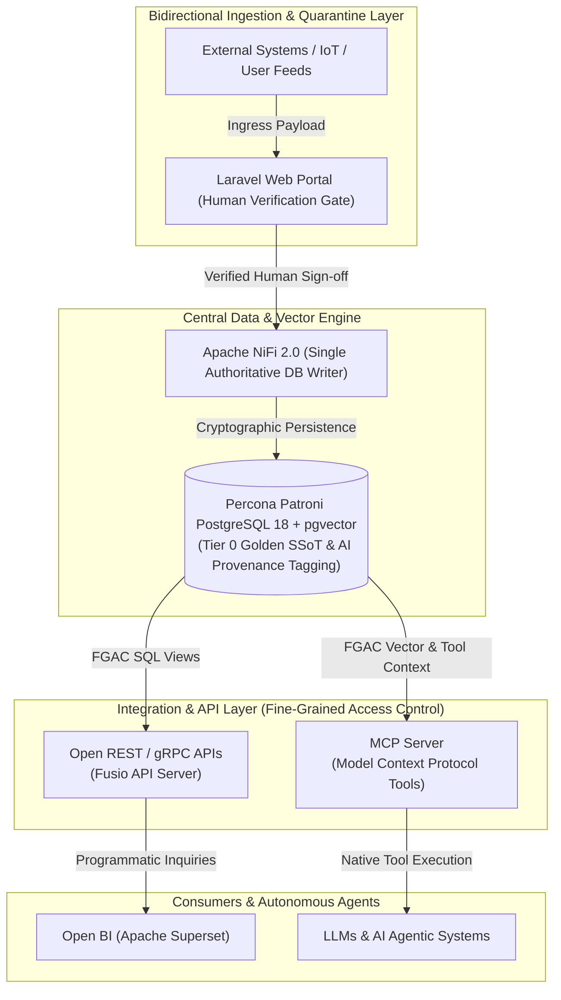

# Executive Proposal: Enterprise Data Infrastructure Modernisation

**Document Version:** 1.0
**Author:** Lead Systems Architect
**Target Audience:** IT Management & Steering Committee
**Infrastructure Scope:** `bda-ai-infra`

---

## 1. Executive Summary

This proposal outlines the strategic modernisation of our Big Data Analytics & AI Infrastructure (`bda-ai-infra`). We are transitioning from a legacy, static visualisation-dependent architecture (Tableau) to an **API-First** and **Model Context Protocol (MCP)-Ready** ecosystem powered by **Podman** containers.

By replacing proprietary dashboard tools with an open, containerised integration layer, we eliminate recurring licensing costs while transforming our data warehouse into a **bidirectional, intelligent data hub**. Any enterprise software, open-source application, or AI agent can securely ingest, transform, query, and share data with strict **Fine-Grained Access Control (FGAC)**.

Human-generated data remains the sole authoritative **Single Source of Truth (SSoT)**. All operational data modified or enriched by AI agents is explicitly tagged and segregated within our big data repository using cryptographic provenance contracts (`bda_provenance`).

---

## 2. Core Strategic Pillars: API-Ready & MCP-Ready

### 2.1 Dual-Render Infrastructure Architecture Blueprint

#### 1. Standalone Production-Ready SVG Vector Graphic (`.svg`)

<svg xmlns="http://www.w3.org/2000/svg" viewBox="0 0 960 480" width="100%" height="100%">
  <defs>
    <marker id="arrow-prop" viewBox="0 0 10 10" refX="6" refY="5" markerWidth="6" markerHeight="6" orient="auto-start-reverse">
      <path d="M 0 0 L 10 5 L 0 10 z" fill="#64748B" />
    </marker>
    <filter id="shadow-prop" x="-4%" y="-4%" width="108%" height="108%">
      <feDropShadow dx="0" dy="2" stdDeviation="3" flood-color="#000000" flood-opacity="0.2"/>
    </filter>
  </defs>

  <!-- Canvas Background -->
  <rect width="960" height="480" fill="#0F172A" rx="10"/>

  <!-- Ingestion Layer -->
  <rect x="30" y="20" width="900" height="70" fill="#1E293B" stroke="#38BDF8" stroke-width="1.5" rx="8" filter="url(#shadow-prop)"/>
  <rect x="30" y="20" width="900" height="24" fill="#0369A1" rx="8"/>
  <text x="45" y="36" font-family="-apple-system, BlinkMacSystemFont, 'Segoe UI', Roboto, sans-serif" font-size="11" font-weight="bold" fill="#E0F2FE">BIDIRECTIONAL INGESTION &amp; HUMAN QUARANTINE LAYER</text>
  <text x="45" y="62" font-family="-apple-system, BlinkMacSystemFont, 'Segoe UI', Roboto, sans-serif" font-size="12" font-weight="bold" fill="#38BDF8">External Systems / IoT / Partner APIs / User Feeds / Laravel Human Verification Gate</text>

  <!-- Central Data Store -->
  <rect x="30" y="125" width="900" height="85" fill="#1E293B" stroke="#A855F7" stroke-width="1.5" rx="8" filter="url(#shadow-prop)"/>
  <rect x="30" y="125" width="900" height="24" fill="#581C87" rx="8"/>
  <text x="45" y="141" font-family="-apple-system, BlinkMacSystemFont, 'Segoe UI', Roboto, sans-serif" font-size="11" font-weight="bold" fill="#E9D5FF">CENTRAL DATA &amp; VECTOR ENGINE (TIER 0 GOLDEN SSoT)</text>
  <text x="45" y="167" font-family="-apple-system, BlinkMacSystemFont, 'Segoe UI', Roboto, sans-serif" font-size="13" font-weight="bold" fill="#C084FC">Percona Patroni PostgreSQL 18 + pgvector (NiFi 2.0 Single Authoritative Writer)</text>
  <text x="45" y="187" font-family="Consolas, Monaco, monospace" font-size="10" fill="#E9D5FF">Metadata Tagging: Human Verified Golden SSoT vs AI-Enriched RAG Provenance (bda_provenance)</text>

  <!-- API Gateway Box -->
  <rect x="30" y="245" width="430" height="95" fill="#1E293B" stroke="#3B82F6" stroke-width="1.5" rx="8" filter="url(#shadow-prop)"/>
  <rect x="30" y="245" width="430" height="24" fill="#1E3A8A" rx="8"/>
  <text x="45" y="261" font-family="-apple-system, BlinkMacSystemFont, 'Segoe UI', Roboto, sans-serif" font-size="11" font-weight="bold" fill="#93C5FD">OPEN REST / gRPC APIs</text>
  <text x="45" y="287" font-family="-apple-system, BlinkMacSystemFont, 'Segoe UI', Roboto, sans-serif" font-size="12" font-weight="bold" fill="#60A5FA">Programmatic Data Sharing Gateway</text>
  <text x="45" y="307" font-family="Consolas, Monaco, monospace" font-size="10" fill="#93C5FD">Fine-Grained Access Control (Row &amp; Column Policies)</text>
  <text x="45" y="323" font-family="Consolas, Monaco, monospace" font-size="10" fill="#93C5FD">Fusio API Gateway Ingress (Port 8080/443)</text>

  <!-- MCP Server Box -->
  <rect x="500" y="245" width="430" height="95" fill="#1E293B" stroke="#10B981" stroke-width="1.5" rx="8" filter="url(#shadow-prop)"/>
  <rect x="500" y="245" width="430" height="24" fill="#065F46" rx="8"/>
  <text x="515" y="261" font-family="-apple-system, BlinkMacSystemFont, 'Segoe UI', Roboto, sans-serif" font-size="11" font-weight="bold" fill="#A7F3D0">MCP SERVER (MODEL CONTEXT PROTOCOL)</text>
  <text x="515" y="287" font-family="-apple-system, BlinkMacSystemFont, 'Segoe UI', Roboto, sans-serif" font-size="12" font-weight="bold" fill="#34D399">Native AI Tooling &amp; Context Gateway</text>
  <text x="515" y="307" font-family="Consolas, Monaco, monospace" font-size="10" fill="#A7F3D0">Fine-Grained Access Control (Tool Execution &amp; Scope Limits)</text>
  <text x="515" y="323" font-family="Consolas, Monaco, monospace" font-size="10" fill="#A7F3D0">Python/Node.js MCP Gateway (Port 8443 / Stdio / SSE)</text>

  <!-- Consumers Box Left -->
  <rect x="30" y="375" width="430" height="75" fill="#1E293B" stroke="#F59E0B" stroke-width="1.5" rx="8" filter="url(#shadow-prop)"/>
  <rect x="30" y="375" width="430" height="22" fill="#78350F" rx="8"/>
  <text x="45" y="390" font-family="-apple-system, BlinkMacSystemFont, 'Segoe UI', Roboto, sans-serif" font-size="11" font-weight="bold" fill="#FDE68A">ENTERPRISE &amp; OPEN-SOURCE CONSUMERS</text>
  <text x="45" y="414" font-family="-apple-system, BlinkMacSystemFont, 'Segoe UI', Roboto, sans-serif" font-size="11" fill="#FBBF24">Apache Superset, Metabase, Web Applications, ERP Systems</text>

  <!-- Consumers Box Right -->
  <rect x="500" y="375" width="430" height="75" fill="#1E293B" stroke="#EC4899" stroke-width="1.5" rx="8" filter="url(#shadow-prop)"/>
  <rect x="500" y="375" width="430" height="22" fill="#831843" rx="8"/>
  <text x="515" y="390" font-family="-apple-system, BlinkMacSystemFont, 'Segoe UI', Roboto, sans-serif" font-size="11" font-weight="bold" fill="#FBCFE8">LLMS &amp; AUTONOMOUS AI AGENTIC SYSTEMS</text>
  <text x="515" y="414" font-family="-apple-system, BlinkMacSystemFont, 'Segoe UI', Roboto, sans-serif" font-size="11" fill="#F472B6">Context-Aware Inquiries, Retrieval-Augmented Generation (RAG)</text>

  <!-- Flow Lines -->
  <line x1="480" y1="90" x2="480" y2="125" stroke="#64748B" stroke-width="2" marker-end="url(#arrow-prop)"/>
  <line x1="245" y1="210" x2="245" y2="245" stroke="#64748B" stroke-width="2" marker-end="url(#arrow-prop)"/>
  <line x1="715" y1="210" x2="715" y2="245" stroke="#64748B" stroke-width="2" marker-end="url(#arrow-prop)"/>
  <line x1="245" y1="340" x2="245" y2="375" stroke="#64748B" stroke-width="2" marker-end="url(#arrow-prop)"/>
  <line x1="715" y1="340" x2="715" y2="375" stroke="#64748B" stroke-width="2" marker-end="url(#arrow-prop)"/>
</svg>

#### 2. Git-Native Mermaid Topology (`.mmd`)



#### 3. Summary Interface & Routing Table

| Source Component | Target Component | Port / Protocol / API Ingress | Security Boundary / Access Key | Operational Significance / Flow Description |
| :--- | :--- | :--- | :--- | :--- |
| **External Systems / Users** | **Laravel Verification Gate** | `HTTPS (443)` / REST | Keycloak OAuth2 / Session Auth | Ingests non-IT user feeds and telemetry into quarantine staging directory. |
| **Laravel Verification Gate** | **Apache NiFi 2.0 Ingest Gate** | Staging Spool / Internal Event | Human Signature / Audit Log | Triggers approval workflow upon explicit human verification. |
| **Apache NiFi 2.0 Ingest Gate** | **PostgreSQL 18 SSoT Store** | `TCP 5432` / Native PostgreSQL | `nifi_ingest_writer` DB Role | Sole authoritative writer committing Tier 0 Golden SSoT data and `bda_provenance` metadata tags. |
| **PostgreSQL 18 SSoT Store** | **Fusio REST / gRPC Gateway** | `TCP 5432` / Read-Only Views | PostgreSQL Row-Level Security (RLS) | Exposes fine-grained SQL views and endpoints to web applications and BI dashboards. |
| **PostgreSQL 18 SSoT Store** | **MCP Tool Gateway** | `TCP 5432` / Vector Search | MCP Tool Scope & Ed25519 Token | Serves vector context and structured database tool capabilities to autonomous AI agents. |

---

### 2.2 API-Ready: Universal Data Exchange
* 🔄 **Bidirectional Data Flow:** Data is no longer trapped inside static visual portals. Enterprise applications, IoT devices, and partner APIs can inject structured telemetry or transactional events directly into our core via REST or gRPC endpoints, as well as extract real-time datasets.
* 🌐 **System Interoperability:** Enables zero-friction integration with any third-party, enterprise, or open-source application without requiring vendor-locked connectors.

### 2.3 MCP-Ready: Native AI & LLM Capability
* 🤖 **Direct Agent Integration:** Implements the open standard **Model Context Protocol (MCP)**. Large Language Models (LLMs) and autonomous AI agents can directly query database metrics, trigger background transformations, and retrieve vector embeddings as native "Tools".
* 🧠 **Contextual Grounding:** Replaces static PDF/Excel exports with conversational, context-aware AI interactions connected directly to live database state.

### 2.4 Fine-Grained Access Control (FGAC) & Data Tagging Governance
* 🛡️ **Row and Column Level Security:** Permissions are strictly enforced at the API gateway and PostgreSQL database layer using session context injection (`SET LOCAL`). An external application or AI agent accesses only the precise data slices authorised for its identity.
* 🏷️ **Human SSoT & AI Provenance Metadata Tagging:** To ensure total data authenticity and governance, all data within the Big Data Analytics Lakehouse is partitioned into two distinct categories:
  1. **Real Data & Human Verification (Tier 0 SSoT):** Human-entered data is validated through the decoupled Laravel human-in-the-loop portal (replacing legacy WildFly application servers and monolithic script bottlenecks). As a target-state capability, the Laravel frontend will support client-side **WebAssembly (Wasm)** (Memory64 & Relaxed SIMD) and **WebGPU** (16-bit float `f16` and `DP4a` quantized INT8 math) for client-side Web AI pre-processing targeting sub-500ms latency. Untouched raw client uploads are persisted into an immutable raw-upload quarantine storage volume prior to client-side pre-processing. Normalized JSON/CSV outputs serve as derived advisory artifacts which are re-validated server-side by Apache NiFi 2.0. If client Wasm/WebGPU hardware acceleration features are unsupported or fail, execution seamlessly falls back to standard Wasm CPU or server-side NiFi validation. Apache NiFi 2.0 acts as the sole authoritative writer promoting validated derived data to Percona Patroni PostgreSQL 18, while retaining original raw files for audit and reprocessing.
  2. **AI Processes Enriched with RAG & Generative Metadata:** Any dataset touched, generated, or enriched by AI agents is explicitly tagged using `bda_provenance` metadata. This metadata records cryptographic signature contracts including `signature`, `key_id`, `verification_status`, `verification_timestamp`, `signature_algorithm` (Ed25519), and `signature_encoding` (HEX_RAW_64_BYTE), binding canonical RFC 8785 byte streams.
* 📋 **Auditability & Zero Trust:** Every API call and MCP tool execution is logged, providing clear lineage and governance for regulatory compliance.

---

## 3. Financial & Operational ROI

| Area | Legacy Architecture (Tableau-based) | Proposed Architecture (API/MCP on Podman) |
| :--- | :--- | :--- |
| **Licensing Costs** | High recurring per-user and per-core licensing fees. | **Zero proprietary licensing fees** (100% Open-Source). |
| **Data Accessibility** | Locked inside proprietary `.twb` workbooks and visual dashboards. | **Universal API & MCP endpoints** accessible by any tool or agent. |
| **Ingestion Capability** | Primarily unidirectional read-only reporting. | **Fully bidirectional** (Ingest, Transform, Export, Query). |
| **AI Integration** | None (Manual exports required for AI context). | **Native MCP support** for autonomous AI workflows. |
| **Security Granularity** | Dashboard-level / Workbook-level permissions. | **Fine-Grained Access Control** (Row/Column/Tool level). |

---

## 4. Tableau Migration & Modernisation Strategy

To ensure zero downtime and manage operational risk, legacy Tableau workbooks will be systematically decommissioned using a four-phase migration roadmap:

```
[ Phase 1: Audit ] ──► [ Phase 2: Logic Transfer ] ──► [ Phase 3: Open BI ] ──► [ Phase 4: MCP/API ]
```

### Phase 1: Workbook Audit & Inventory
* Catalogue all active Tableau workbooks (`.twb`/`.twbx`), calculated fields, custom SQL scripts, and user access lists.
* Identify redundant reports and mark high-value dashboards for migration.

### Phase 2: Data & Logic Consolidation
* Migrate complex Tableau calculations and data blending logic into **PostgreSQL Materialised Views** and stored functions.
* Ensure Apache NiFi orchestrates data pipelines directly into clean PostgreSQL schemas.

### Phase 3: Open-Source BI Deployment
* Deploy containerised **Apache Superset** (or Metabase) on Podman to replicate essential executive dashboards.
* Connect directly to the PostgreSQL layer, restoring visual reporting capabilities with zero user-license overhead.

### Phase 4: API & MCP Enablement
* Expose underlying business calculations as REST/gRPC API endpoints.
* Wrap PostgreSQL metrics and vector searches into standardised **MCP Tools** for internal AI agent consumption.

---

## 5. Podman Infrastructure & Container Blueprint

The target infrastructure relies on rootless **Podman** pods to enforce high availability, zero vendor lock-in, and full Kubernetes compatibility.

```yaml
# Conceptual Architecture Blueprint: podman-pod.yaml
apiVersion: v1
kind: Pod
metadata:
  name: bda-ai-infra-pod
spec:
  containers:
    - name: postgres-engine
      image: docker.io/pgvector/pgvector:pg18
      description: "Central database store equipped with vector search capabilities."

    - name: nifi-orchestrator
      image: docker.io/apache/nifi:latest
      description: "Low-latency data ingestion, batch processing, and ETL orchestrator."

    - name: mcp-api-gateway
      image: localhost/bda-mcp-server:v1
      description: "Custom Python/Node.js gateway delivering Open APIs, MCP Tools, and FGAC enforcement."

    - name: open-bi-superset
      image: docker.io/apache/superset:latest
      description: "Open-source business intelligence platform replacing Tableau."
```

---

## 6. Next Steps & Execution Plan

Upon approval of this proposal, execution will proceed as follows via automated code and configuration updates:

1. **Commit Proposal Document:** Save `docs/IT-MANAGEMENT-PROPOSAL.md` into the main branch.
2. **Deploy Podman Pod Spec:** Add `docker/podman-pod.yaml` containing the complete container definition.
3. **Build MCP Server Skeleton:** Commit the Python-based MCP server in `src/mcp-server/` with initial PostgreSQL tool connections and FGAC middleware.
4. **Initiate Phase 1 Migration:** Begin Tableau workbook audit and SQL logic extraction.
