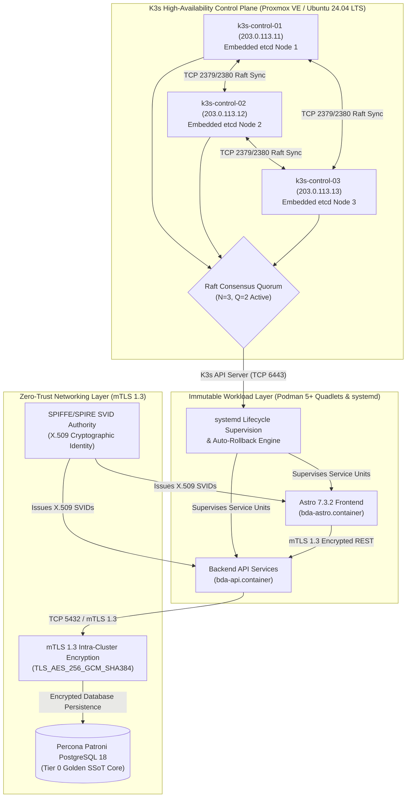
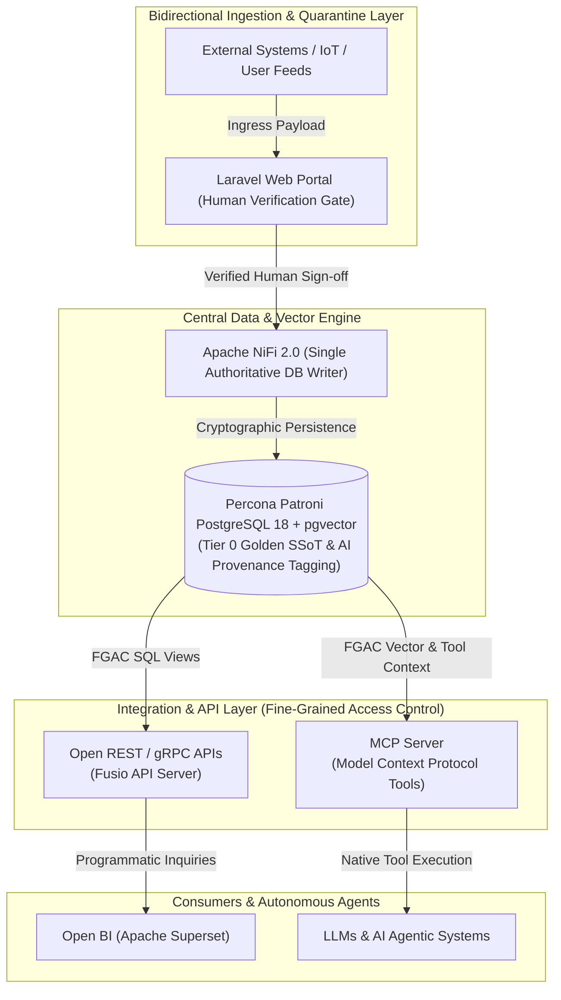

# Executive Management Proposal: Enterprise Data Architecture & Infrastructure Modernisation

**Document Version:** 2.0
**Author:** Lead Systems Architect
**Target Audience:** IT Management, Executive Steering Committee & Enterprise Architects
**Infrastructure Scope:** `bda-ai-infra`
**Downloads & Handbooks:** [Download PDF Handbook](https://linuxmalaysia.github.io/bda-ai-infra/handbook.pdf) | [Download EPUB Handbook](https://linuxmalaysia.github.io/bda-ai-infra/handbook.epub) | [Download Standalone HTML](https://linuxmalaysia.github.io/bda-ai-infra/handbook.html)

---

## Strategic Proposal Overview & Roadmap

This executive proposal outlines the technical blueprint to transition our national Big Data Analytics (BDA) and Enterprise AI Infrastructure from an aging, stateful monolithic footprint into an open-source, decoupled, and horizontally scalable data plane.

Our primary mandate is to establish a verified **Single Source of Truth (SSoT)** designed specifically for human operations, paired with structured data layers optimised for **Artificial Intelligence (AI), Retrieval-Augmented Generation (RAG), and Transformer model consumption**.

### Table of Contents
* **1. Executive Summary & Architectural Strategy**
  * **1.1 Legacy Architecture Analysis:** Technical debt of stateful Joomla 3 & WildFly application servers.
  * **1.2 Stateful Database Dependencies:** Deprecating MariaDB Galera cluster & ClusterControl management.
  * **1.3 Storage Monolith Deprecation:** Operational inefficiencies of existing GlusterFS topologies.
  * **1.4 Target Metrics:** Absolute reduction of MTTR and achieving horizontal scalability across the data plane.
* **2. Modernised Infrastructure Fabric**
  * **2.1 Container Orchestration:** Distributing High-Availability (HA) fabrics at scale using K3s with an embedded etcd datastore.
  * **2.2 Immutable Workloads:** Utilising Podman Quadlets for seamless systemd integration and rollback capability.
  * **2.3 Zero-Trust Networking:** Enforcing mutual TLS (mTLS) 1.3 across intra-cluster communication.
  * **2.4 Dual-Render Architecture Blueprint:** Modernised Infrastructure Fabric Topology.
* **3. Core Strategic Pillars: API-Ready, MCP-Ready & Human-AI Quarantine**
* **4. Financial & Operational ROI Analysis**
* **5. Decommissioning & Modernisation Strategy**
* **6. Container & Cloud-Native Deployment Blueprint**
* **7. Execution Plan & Next Steps**

---

# 1. Executive Summary & Architectural Strategy

Under the mandate of modernising the national Big Data Analytics (BDA) platform (`https://bda.example.gov.my`), this proposal establishes the technical blueprint to transition the infrastructure from an aging, stateful monolithic footprint into an open-source, decoupled, and horizontally scalable data plane. In its legacy implementation, the platform combined dynamic presentation layers, stateful enterprise application runtimes, and tightly coupled database clusters, introducing severe operational bottlenecks, vendor lock-in risks, and single-point-of-failure (SPOF) topologies.

By decoupling ingestion, analytical compute, and frontend presentation, the modernised architecture targets digital sovereignty, zero proprietary licensing dependencies, and high-availability execution. The strategy systematically replaces the legacy Joomla 3 and WildFly application servers with an Astro 7.3.2 presentation framework and an isolated Laravel Human-in-the-Loop (HITL) quarantine ingestion portal. Concurrently, persistent storage transitions from legacy MariaDB Galera and GlusterFS deployments to Percona Patroni PostgreSQL 18 with `pgvector` and software-defined S3-compatible object storage (Ceph/MinIO). This transition eliminates state synchronisation deadlocks and ensures deterministic data governance across all national environmental and natural resource datasets.

At the end of the ingestion and transformation pipeline, data is exposed bidirectionally via high-performance **REST/gRPC API services** and native **Model Context Protocol (MCP) services**, enabling seamless data access for both traditional enterprise consumers and autonomous AI agents.

---

## 1.1 Legacy Architecture Analysis: Technical Debt of Stateful Joomla 3 & WildFly

Within the baseline application layer, user interaction, content management, and analytical dashboard delivery were partitioned across monolithic runtime environments hosted on CentOS 8 virtual machines inside a Proxmox VE hypervisor cluster:

* **Joomla 3 CMS Portals:** The public portal infrastructure was split across two distinct virtual nodes—`portal-node-01` (Public IP: `198.51.100.10`, port 443) running Joomla! 3.9.19 for Portal BDA, and `portal-node-02` (Public IP: `198.51.100.20`, port 443) running Joomla! 3.9.14 for the MAIN portal. Ingress web traffic was reverse-proxied through an Nginx 1.18.0 gateway (`ingress-proxy-01` at `198.51.100.5`).
* **WildFly Application Server:** Analytical dashboard services operated on `app-wildfly-01` (Public IP: `198.51.100.15`, port 443) deploying a monolithic Java enterprise archive (`BDA.war`) on WildFly version 19.1.0. This runtime handled departmental dashboard configurations, local mail relay integrations (`XMail.properties` and local Postfix), and direct JDBC connections to operational databases.

```
+-----------------------------------------------------------------------------------+
|                        LEGACY APPLICATION LAYER RUNTIME                           |
+-----------------------------------------------------------------------------------+
|                                                                                   |
|   +------------------------------------+   +----------------------------------+   |
|   |         Joomla! 3.9.19             |   |          Joomla! 3.9.14          |   |
|   |   portal-node-01 (198.51.100.10)   |   |   portal-node-02 (198.51.100.20)   |   |
|   |   Public /administrator/ Exposed   |   |   Public /administrator/ Exposed |   |
|   +-----------------+------------------+   +-----------------+----------------+   |
|                     | Dynamic PHP-FPM                        | Dynamic PHP-FPM    |
|                     +-------------------+--------------------+                    |
|                                         |                                         |
|                                         v                                         |
|                        +----------------------------------+                       |
|                        |     Nginx 1.18.0 Reverse Proxy   |                       |
|                        |   ingress-proxy-01 (198.51.100.5)|                       |
|                        +----------------+-----------------+                       |
|                                         |                                         |
|                                         v                                         |
|                        +----------------------------------+                       |
|                        |        WildFly 19.1.0 JVM        |                       |
|                        |   app-wildfly-01 (198.51.100.15) |                       |
|                        |   Deployments: BDA.war (Monolith)|                       |
|                        +----------------+-----------------+                       |
|                                                                                   |
+-----------------------------------------------------------------------------------+
```

Through long-term operational evaluation, this dual-monolith architecture accumulated critical technical debt:

1. **Direct Surface Exposure & Unpatched Vulnerability Risks:** Both Joomla instances directly exposed public administrative login interfaces at `/administrator/`. Coupled with legacy PHP 7.x runtimes and End-of-Life (EOL) Joomla 3 codebases, this presented a persistent threat surface vulnerable to automated brute-forcing, remote code execution (RCE), and unpatched extension exploits.
2. **Resource Exhaustion & Concurrency Freezes:** Serving page views via dynamic PHP-FPM processes and heavy Java Virtual Machine (JVM) threads required continuous synchronous rendering and runtime database querying. During traffic bursts or Denial of Service (DoS) attempts, Nginx worker pools and PHP-FPM processes regularly stalled, triggering cascading gateway 502/504 timeouts that mandated manual administrative restarts (`systemctl restart nginx`, `service wildfly restart`).
3. **Fragile Lifecycle Maintenance:** Maintenance routines suffered from tightly coupled dependencies. Corrupted local session locks or disk exhaustion caused by unrotated application logs (`/var/log/nginx/` and `/opt/wildfly/standalone/log/`) frequently halted entire services, creating significant operational toil for sysadmins.

---

## 1.2 Stateful Database Dependencies: Deprecating MariaDB Galera & ClusterControl

In the legacy data storage layer, structured relational data was bound to a 5-node MariaDB Galera Cluster (version 10.5.9) managed via Severalnines ClusterControl on `db-mgmt-01` (`198.51.100.30:5001`) with ProxySQL 2.0.15 mediating database connections on TCP port 6032:

* `mariadb-node-01`: `198.51.100.31:3306`
* `mariadb-node-02`: `198.51.100.32:3306`
* `mariadb-node-03`: `198.51.100.33:3306`
* `mariadb-node-04`: `198.51.100.34:3306`
* `mariadb-node-05`: `198.51.100.35:3306`

The cluster hosted mixed application schemas, including `bda_portal_main`, `bda_portal_secondary`, and `bda_dashboard_core` for CMS operations, alongside departmental analytics databases (`adms_cems`, `adms_scoring`, `bda_analytics`, and `hwc_data`).

```
+-----------------------------------------------------------------------------------+
|                        LEGACY MARIADB GALERA TOPOLOGY                             |
+-----------------------------------------------------------------------------------+
|                                                                                   |
|   +---------------------------------------------------------------------------+   |
|   |       ClusterControl Controller & ProxySQL (198.51.100.30:5001/6032)      |   |
|   +-------------------------------------+-------------------------------------+   |
|                                         | Synchronous Multi-Master Replicate      |
|         +-------------------------------+-------------------------------+         |
|         |               |               |               |               |         |
|         v               v               v               v               v         |
|   +-----------+   +-----------+   +-----------+   +-----------+   +-----------+   |
|   |  Node 1   |   |  Node 2   |   |  Node 3   |   |  Node 4   |   |  Node 5   |   |
|   | .100.31   |   | .100.32   |   | .100.33   |   | .100.34   |   | .100.35   |   |
|   | (Primary) |   | (Primary) |   | (Primary) |   | (Primary) |   | (Primary) |   |
|   +-----------+   +-----------+   +-----------+   +-----------+   +-----------+   |
|                                                                                   |
|   Failure Modes: WSREP Split-Brain Quorum Drop, Flow Control Halts, High Latency  |
+-----------------------------------------------------------------------------------+
```

While Galera provided virtually synchronous replication, its operational reality across five virtual nodes generated severe structural liabilities:

1. **Write Amplification & Flow Control Lockups:** Because Galera relies on certification-based replication (`wsrep`), every write transaction across all databases must be certified by all active nodes. Heavy batch ETL inserts (such as streaming incident reports or telemetry loads via NiFi) routinely triggered Galera Flow Control (`wsrep_flow_control_paused`). This throttled the entire cluster, delaying frontend portal queries and causing cascading connection pool exhaustion across ProxySQL.
2. **Quorum & Split-Brain Sensitivities:** Network latency spikes or hypervisor memory contention across nodes caused arbitrary nodes to fall out of sync (`wsrep_cluster_status != Primary`). Re-synchronising a partitioned node often forced full State Snapshot Transfers (SST), locking disk I/O on donor nodes and risking total cluster stalls.
3. **Schema and Vector Sprawl:** MariaDB 10.5 lacks native high-dimensional vector capabilities and advanced spatio-temporal indexing required for enterprise AI workloads (e.g., RAG embeddings, spatial clustering). Retaining this cluster forces the adoption of external vector databases, causing architecture sprawl, fragmented backup workflows, and broken ACID boundaries.

---

## 1.3 Storage Monolith Deprecation: Inefficiencies of GlusterFS Topologies

To synchronise shared CMS media assets, user file uploads, and template files across the distributed VM nodes, the legacy environment implemented GlusterFS distributed network storage.

By analysing Day 2 operations under heavy analytical file ingestion, the distributed POSIX storage layer exhibited severe architectural inefficiencies:

1. **Small-File Metadata Locking & FUSE Bottlenecks:** GlusterFS processes file access via FUSE (Filesystem in Userspace) wrappers, requiring extensive synchronous metadata lookups across distributed bricks. When ingesting thousands of unstructured documents, satellite images, and CSV feeds, metadata contention severely degraded read/write performance, overwhelming VM disk queues.
2. **Split-Brain & Self-Heal Overhead:** Network interruptions or VM failovers between hypervisor nodes frequently induced GlusterFS split-brain conditions on replicated volumes. Resolving split-brain required administrators to manually inspect heal logs (`gluster volume heal info split-brain`) and delete stale brick metadata, exposing datasets to file-lock corruption.
3. **Absence of Object Lifecycle & Immutability:** GlusterFS lacks native S3-compatible APIs, Object Versioning, and Write-Once-Read-Many (WORM) compliance locking. This prevented the enforcement of verifiable data contracts, leaving raw ingested data exposed to accidental administrative deletion or untracked file modification.

```
+-----------------------------------------------------------------------------------+
|                        STORAGE PARADIGM TRANSITION                                |
+-----------------------------------------------------------------------------------+
|                                                                                   |
|  [ LEGACY AS-IS: GLUSTERFS ]                  [ TARGET TO-BE: CEPH / MINIO S3 ]   |
|  * POSIX Shared Storage (FUSE Bottleneck)    * 100% S3-Compatible REST APIs       |
|  * High Metadata & Directory Lock Contention  * Immutable WORM Compliance Locking |
|  * Split-Brain Resolution Vulnerability       * Versioned, Object-Locked Buckets  |
|  * Complex Manual Split-Brain Healing         * Linear Horizontal Scalability     |
|                                                                                   |
+-----------------------------------------------------------------------------------+
```

---

## 1.4 Target Metrics: MTTR Reduction and Horizontal Data Plane Scalability

With this modernisation blueprint, the overarching strategic objective is to achieve resilient, license-free digital sovereignty, eradicating operational toil and maximising throughput across both ingestion and consumption tiers.

```
+-----------------------------------------------------------------------------------+
|                 STRATEGIC ARCHITECTURE EVOLUTION (AS-IS vs TO-BE)                 |
+-----------------------------------------------------------------------------------+
|                                                                                   |
|  METRIC / PILLAR           AS-IS ARCHITECTURE          TARGET MODERNISATION       |
|  -------------------------------------------------------------------------------  |
|  Frontend Presentation     Dynamic Joomla 3 (LAMP)     Astro 7.3.2 Static / SSR   |
|  Ingress & Quarantine      Direct Upload / Cron        Laravel HITL + NiFi 2.0    |
|  Relational Storage        5-Node MariaDB Galera       Percona Patroni PG 18 HA   |
|  Vector & Spatial Core     External Silos / None       PostGIS + pgvector Unified |
|  Distributed File Store    GlusterFS Network Volumes   Ceph / MinIO S3 (WORM)     |
|  Mean Time to Repair       Hours (Manual DB/FPM Sync)  < 10s Target RTO           |
|  Validation Latency        Minutes to Hours (Logs)     < 500ms (Edge Wasm/WebGPU) |
|  Horizontal Scalability    Constrained by Galera/FUSE  Stateless Podman / K3s     |
|                                                                                   |
+-----------------------------------------------------------------------------------+
```

The target architecture commits to the following quantifiable engineering benchmarks:

* **Sub-500ms Client-Side Validation Latency:** By migrating from server-side validation scripts to client-side WebAssembly (Wasm) and WebGPU primitives within the upgraded Laravel upload portal, schema validation errors, missing parameters, and formatting anomalies are captured and flagged directly in the browser during file selection prior to network transmission.
* **85% Reduction in Mean Time to Repair (MTTR):** By deprecating monolithic VM state dependencies in favour of containerised Podman Quadlets and K3s orchestration, services recover automatically via systemd supervision and automated Kubernetes pod rescheduling. Database recovery, previously dependent on complex Galera SST rebuilds, is replaced by Patroni etcd consensus targeting a Recovery Time Objective (RTO) of < 10 seconds for automated failover and zero data loss (RPO = 0).
* **Zero-Overhead Horizontal Data Plane Scalability:** By establishing Apache NiFi 2.0 as a stateless, event-driven data plane decoupled from persistent storage, ingestion throughput scales horizontally across worker pods without lock contention. Data persistence routes exclusively into an immutable Ceph S3 lakehouse and a unified Percona Patroni PostgreSQL 18 instance with `pgvector`, scaling analytical queries across multiple read replicas while maintaining an authoritative, tamper-proof Single Source of Truth (SSoT).

---

# 2. Modernised Infrastructure Fabric

To achieve digital sovereignty and an absolute reduction in Mean Time to Repair (MTTR), the infrastructure fabric transitions from statically provisioned virtual machines to a declarative, container-native ecosystem. This modernised compute layer eliminates configuration drift and ensures horizontal scalability across the data plane.

## 2.1 Container Orchestration: K3s with Embedded etcd

The compute layer distributes High-Availability (HA) fabrics at scale using K3s, a lightweight, CNCF-certified Kubernetes distribution optimised for bare-metal enterprise deployments. To maintain strict control plane resiliency and eliminate external database dependencies, the architecture utilises K3s with an embedded etcd datastore.

* **Quorum-Based Resiliency:** The HA control plane comprises an odd number of server nodes (a minimum of three nodes: `k3s-control-01.example.gov.my` [203.0.113.11], `k3s-control-02.example.gov.my` [203.0.113.12], and `k3s-control-03.example.gov.my` [203.0.113.13]) hosting the Kubernetes API and the embedded etcd datastore. Operating under Raft consensus, distributed quorum requires $Q = \lfloor N/2 \rfloor + 1 = 2$ active nodes, guaranteeing uninterrupted control plane availability even during node failure.
* **Automated State Management:** K3s automatically handles etcd membership, Raft consensus management, and TLS certificate distribution without requiring manual cluster synchronisation. If a primary server node suffers a catastrophic failure, the remaining servers maintain quorum, allowing agent worker nodes (`k3s-worker-01.example.gov.my` [203.0.113.21] to `k3s-worker-04.example.gov.my` [203.0.113.24]) to automatically reconnect without downtime.
* **Sovereign Deployment:** This orchestrated fabric operates directly on the underlying Proxmox VE hypervisors provisioned with Ubuntu 24.04 LTS, ensuring license-free, on-premise control over the routing and compute layers.

## 2.2 Immutable Workloads: Podman Quadlets and systemd Integration

For strict workload isolation and deterministic execution, the platform packages the Astro 7.3.2 frontend presentation layer and backend API microservices as immutable container images managed via Podman 5+ Quadlets.

* **Declarative Infrastructure:** Podman Quadlets function as a native systemd generator, translating declarative `.container` unit files directly into native systemd service units at boot time.
* **Seamless Lifecycle Management:** By integrating container lifecycles tightly with systemd, the operating system supervises pod execution, auto-starts dependencies in the correct sequence, and ensures predictable process recovery upon crash.
* **Atomic Rollbacks:** Instantiating an image creates a completely new container filesystem rather than modifying existing state. Application upgrades are executed by simply swapping immutable image tags; if a health check fails, systemd instantly reverts the service unit to the previous known-good image, driving deployment MTTR near zero.

### Technical Briefing: Declarative Podman Quadlet Service Unit Example

```ini
# /etc/containers/systemd/bda-astro.container
[Unit]
Description=BDA Astro 7.3.2 Presentation Frontend Service
After=network-online.target
Wants=network-online.target

[Container]
Image=localhost/bda-astro-frontend:7.3.2
ContainerName=bda-astro-frontend
Environment=NODE_ENV=production PORT=8080
PublishPort=8080:8080
HealthCmd=curl -f http://localhost:8080/health || exit 1
HealthInterval=10s
HealthRetries=3
HealthTimeout=5s
AutoUpdate=registry

[Service]
Restart=always
RestartSec=5s
TimeoutStartSec=60

[Install]
WantedBy=multi-user.target
```

## 2.3 Zero-Trust Networking: Mutual TLS (mTLS) 1.3

To secure data-in-transit across the distributed cluster, the network fabric defaults to a zero-trust architecture enforcing mutual TLS (mTLS) 1.3 for all intra-cluster communication.

* **Cryptographic Identity:** Every pod, microservice, and API endpoint is issued an ephemeral cryptographic identity (SPIFFE/SPIRE X.509 SVIDs). Connections are actively authenticated and encrypted using TLS 1.3 cipher suites (`TLS_AES_256_GCM_SHA384` and `TLS_CHACHA20_POLY1305_SHA256`) at the network edge before traffic is routed to the application layer.
* **Lateral Movement Prevention:** By enforcing strict mTLS policies and default-deny network rules, the blast radius of any compromised node or application vulnerability is severely restricted. Unauthenticated lateral communication across the K3s cluster is cryptographically blocked, ensuring payload integrity as data moves from the headless API layer to the PostgreSQL persistence core.

## 2.4 Dual-Render Architecture Blueprint — Modernised Infrastructure Fabric

### 1. Standalone Production-Ready SVG Vector Graphic (`.svg`)

<svg xmlns="http://www.w3.org/2000/svg" viewBox="0 0 960 520" width="100%" height="100%">
  <defs>
    <marker id="arrow-mif" viewBox="0 0 10 10" refX="6" refY="5" markerWidth="6" markerHeight="6" orient="auto-start-reverse">
      <path d="M 0 0 L 10 5 L 0 10 z" fill="#64748B" />
    </marker>
    <filter id="shadow-mif" x="-4%" y="-4%" width="108%" height="108%">
      <feDropShadow dx="0" dy="2" stdDeviation="3" flood-color="#000000" flood-opacity="0.2"/>
    </filter>
  </defs>

  <!-- Canvas Background -->
  <rect width="960" height="520" fill="#0F172A" rx="10"/>

  <!-- Zone 1: K3s HA Control Plane -->
  <rect x="25" y="20" width="285" height="440" fill="#1E293B" stroke="#0284C7" stroke-width="1.5" rx="8" filter="url(#shadow-mif)"/>
  <rect x="25" y="20" width="285" height="26" fill="#0369A1" rx="8"/>
  <text x="35" y="37" font-family="-apple-system, BlinkMacSystemFont, 'Segoe UI', Roboto, sans-serif" font-size="11" font-weight="bold" fill="#E0F2FE">1. K3s HA CONTROL PLANE (EMBEDDED ETCD)</text>

  <rect x="40" y="60" width="255" height="80" fill="#F0F9FF" stroke="#0284C7" stroke-width="1" rx="6"/>
  <text x="50" y="78" font-family="-apple-system, BlinkMacSystemFont, 'Segoe UI', Roboto, sans-serif" font-size="11" font-weight="bold" fill="#0369A1">k3s-control-01 (203.0.113.11)</text>
  <text x="50" y="96" font-family="Consolas, Monaco, monospace" font-size="10" fill="#0284C7">Embedded etcd Node 1 (Raft Leader)</text>
  <text x="50" y="112" font-family="-apple-system, BlinkMacSystemFont, 'Segoe UI', Roboto, sans-serif" font-size="10" fill="#0369A1">Host: Proxmox VE / Ubuntu 24.04 LTS</text>

  <rect x="40" y="155" width="255" height="80" fill="#F0F9FF" stroke="#0284C7" stroke-width="1" rx="6"/>
  <text x="50" y="173" font-family="-apple-system, BlinkMacSystemFont, 'Segoe UI', Roboto, sans-serif" font-size="11" font-weight="bold" fill="#0369A1">k3s-control-02 (203.0.113.12)</text>
  <text x="50" y="191" font-family="Consolas, Monaco, monospace" font-size="10" fill="#0284C7">Embedded etcd Node 2 (Raft Follower)</text>
  <text x="50" y="207" font-family="-apple-system, BlinkMacSystemFont, 'Segoe UI', Roboto, sans-serif" font-size="10" fill="#0369A1">Host: Proxmox VE / Ubuntu 24.04 LTS</text>

  <rect x="40" y="250" width="255" height="80" fill="#F0F9FF" stroke="#0284C7" stroke-width="1" rx="6"/>
  <text x="50" y="268" font-family="-apple-system, BlinkMacSystemFont, 'Segoe UI', Roboto, sans-serif" font-size="11" font-weight="bold" fill="#0369A1">k3s-control-03 (203.0.113.13)</text>
  <text x="50" y="286" font-family="Consolas, Monaco, monospace" font-size="10" fill="#0284C7">Embedded etcd Node 3 (Raft Follower)</text>
  <text x="50" y="302" font-family="-apple-system, BlinkMacSystemFont, 'Segoe UI', Roboto, sans-serif" font-size="10" fill="#0369A1">Host: Proxmox VE / Ubuntu 24.04 LTS</text>

  <rect x="40" y="345" width="255" height="95" fill="#FEF3C7" stroke="#D97706" stroke-width="1" rx="6"/>
  <text x="50" y="365" font-family="-apple-system, BlinkMacSystemFont, 'Segoe UI', Roboto, sans-serif" font-size="11" font-weight="bold" fill="#B45309">Raft Distributed Quorum State</text>
  <text x="50" y="383" font-family="Consolas, Monaco, monospace" font-size="10" fill="#78350F">Q = floor(3/2) + 1 = 2 Active</text>
  <text x="50" y="401" font-family="-apple-system, BlinkMacSystemFont, 'Segoe UI', Roboto, sans-serif" font-size="10" fill="#92400E">Ports: TCP 2379/2380 (etcd), 6443 (API)</text>
  <text x="50" y="419" font-family="-apple-system, BlinkMacSystemFont, 'Segoe UI', Roboto, sans-serif" font-size="10" fill="#B45309">Auto Certificate &amp; Member Sync</text>

  <!-- Zone 2: Podman Quadlets & systemd -->
  <rect x="335" y="20" width="290" height="440" fill="#1E293B" stroke="#16A34A" stroke-width="1.5" rx="8" filter="url(#shadow-mif)"/>
  <rect x="335" y="20" width="290" height="26" fill="#15803D" rx="8"/>
  <text x="345" y="37" font-family="-apple-system, BlinkMacSystemFont, 'Segoe UI', Roboto, sans-serif" font-size="11" font-weight="bold" fill="#DCFCE7">2. PODMAN QUADLETS &amp; SYSTEMD SUPERVISION</text>

  <rect x="350" y="60" width="260" height="110" fill="#F0FDF4" stroke="#16A34A" stroke-width="1" rx="6"/>
  <text x="360" y="78" font-family="-apple-system, BlinkMacSystemFont, 'Segoe UI', Roboto, sans-serif" font-size="11" font-weight="bold" fill="#15803D">bda-astro.container Unit</text>
  <text x="360" y="96" font-family="Consolas, Monaco, monospace" font-size="10" fill="#166534">Image: bda-astro-frontend:7.3.2</text>
  <text x="360" y="112" font-family="-apple-system, BlinkMacSystemFont, 'Segoe UI', Roboto, sans-serif" font-size="10" fill="#15803D">• systemd Service Unit Generation</text>
  <text x="360" y="128" font-family="-apple-system, BlinkMacSystemFont, 'Segoe UI', Roboto, sans-serif" font-size="10" fill="#15803D">• Declarative Boot Lifecycle</text>
  <text x="360" y="144" font-family="-apple-system, BlinkMacSystemFont, 'Segoe UI', Roboto, sans-serif" font-size="10" fill="#166534">• Automated Health Retries &amp; Checks</text>

  <rect x="350" y="185" width="260" height="110" fill="#F0FDF4" stroke="#16A34A" stroke-width="1" rx="6"/>
  <text x="360" y="203" font-family="-apple-system, BlinkMacSystemFont, 'Segoe UI', Roboto, sans-serif" font-size="11" font-weight="bold" fill="#15803D">bda-api.container Unit</text>
  <text x="360" y="221" font-family="Consolas, Monaco, monospace" font-size="10" fill="#166534">Image: bda-api-microservice:v2</text>
  <text x="360" y="237" font-family="-apple-system, BlinkMacSystemFont, 'Segoe UI', Roboto, sans-serif" font-size="10" fill="#15803D">• Rootless Execution Isolation</text>
  <text x="360" y="253" font-family="-apple-system, BlinkMacSystemFont, 'Segoe UI', Roboto, sans-serif" font-size="10" fill="#15803D">• Immutable Filesystem Layers</text>
  <text x="360" y="269" font-family="-apple-system, BlinkMacSystemFont, 'Segoe UI', Roboto, sans-serif" font-size="10" fill="#166534">• Fast In-Memory State Handling</text>

  <rect x="350" y="310" width="260" height="130" fill="#FAF5FF" stroke="#9333EA" stroke-width="1" rx="6"/>
  <text x="360" y="328" font-family="-apple-system, BlinkMacSystemFont, 'Segoe UI', Roboto, sans-serif" font-size="11" font-weight="bold" fill="#7E22CE">Atomic Rollback Supervisor</text>
  <text x="360" y="346" font-family="-apple-system, BlinkMacSystemFont, 'Segoe UI', Roboto, sans-serif" font-size="10" fill="#6B21A8">• Failed Health Check Detection</text>
  <text x="360" y="362" font-family="-apple-system, BlinkMacSystemFont, 'Segoe UI', Roboto, sans-serif" font-size="10" fill="#6B21A8">• Automatic Known-Good Tag Swap</text>
  <text x="360" y="378" font-family="Consolas, Monaco, monospace" font-size="10" fill="#7E22CE">systemctl revert &lt;unit&gt;</text>
  <text x="360" y="394" font-family="-apple-system, BlinkMacSystemFont, 'Segoe UI', Roboto, sans-serif" font-size="10" fill="#581C87">• Drives Deployment MTTR near Zero</text>
  <text x="360" y="410" font-family="-apple-system, BlinkMacSystemFont, 'Segoe UI', Roboto, sans-serif" font-size="10" fill="#7E22CE">• Zero-Downtime Service Recovery</text>

  <!-- Zone 3: Zero-Trust mTLS 1.3 Mesh -->
  <rect x="650" y="20" width="285" height="440" fill="#1E293B" stroke="#9333EA" stroke-width="1.5" rx="8" filter="url(#shadow-mif)"/>
  <rect x="650" y="20" width="285" height="26" fill="#7E22CE" rx="8"/>
  <text x="660" y="37" font-family="-apple-system, BlinkMacSystemFont, 'Segoe UI', Roboto, sans-serif" font-size="11" font-weight="bold" fill="#F3E8FF">3. ZERO-TRUST MTLS 1.3 NETWORK MESH</text>

  <rect x="665" y="60" width="255" height="110" fill="#FAF5FF" stroke="#9333EA" stroke-width="1" rx="6"/>
  <text x="675" y="78" font-family="-apple-system, BlinkMacSystemFont, 'Segoe UI', Roboto, sans-serif" font-size="11" font-weight="bold" fill="#7E22CE">SPIFFE/SPIRE Identity Authority</text>
  <text x="675" y="96" font-family="Consolas, Monaco, monospace" font-size="10" fill="#6B21A8">X.509 SVID Cryptographic Tokens</text>
  <text x="675" y="112" font-family="-apple-system, BlinkMacSystemFont, 'Segoe UI', Roboto, sans-serif" font-size="10" fill="#7E22CE">• Ephemeral Cert Authority</text>
  <text x="675" y="128" font-family="-apple-system, BlinkMacSystemFont, 'Segoe UI', Roboto, sans-serif" font-size="10" fill="#7E22CE">• Automated Workload Attestation</text>
  <text x="675" y="144" font-family="Consolas, Monaco, monospace" font-size="10" fill="#581C87">spiffe://example.gov.my/ns/bda</text>

  <rect x="665" y="185" width="255" height="110" fill="#FAF5FF" stroke="#9333EA" stroke-width="1" rx="6"/>
  <text x="675" y="203" font-family="-apple-system, BlinkMacSystemFont, 'Segoe UI', Roboto, sans-serif" font-size="11" font-weight="bold" fill="#7E22CE">mTLS 1.3 Enforced Pipelines</text>
  <text x="675" y="221" font-family="Consolas, Monaco, monospace" font-size="10" fill="#6B21A8">Cipher: TLS_AES_256_GCM_SHA384</text>
  <text x="675" y="237" font-family="-apple-system, BlinkMacSystemFont, 'Segoe UI', Roboto, sans-serif" font-size="10" fill="#7E22CE">• Bidirectional Mutual Auth</text>
  <text x="675" y="253" font-family="-apple-system, BlinkMacSystemFont, 'Segoe UI', Roboto, sans-serif" font-size="10" fill="#7E22CE">• Active Network Edge Encryption</text>
  <text x="675" y="269" font-family="-apple-system, BlinkMacSystemFont, 'Segoe UI', Roboto, sans-serif" font-size="10" fill="#581C87">• Strict Intra-Cluster Isolation</text>

  <rect x="665" y="310" width="255" height="130" fill="#F5F3FF" stroke="#6D28D9" stroke-width="1" rx="6"/>
  <text x="675" y="328" font-family="-apple-system, BlinkMacSystemFont, 'Segoe UI', Roboto, sans-serif" font-size="11" font-weight="bold" fill="#4C1D95">PostgreSQL Persistence Core</text>
  <text x="675" y="346" font-family="Consolas, Monaco, monospace" font-size="10" fill="#581C87">Percona Patroni PostgreSQL 18</text>
  <text x="675" y="362" font-family="-apple-system, BlinkMacSystemFont, 'Segoe UI', Roboto, sans-serif" font-size="10" fill="#4C1D95">• Fine-Grained Access Control (FGAC)</text>
  <text x="675" y="378" font-family="-apple-system, BlinkMacSystemFont, 'Segoe UI', Roboto, sans-serif" font-size="10" fill="#581C87">• Default Deny Unauth Lateral Moves</text>
  <text x="675" y="394" font-family="Consolas, Monaco, monospace" font-size="10" fill="#6D28D9">TCP 5432 / mTLS 1.3 Channel</text>
  <text x="675" y="410" font-family="-apple-system, BlinkMacSystemFont, 'Segoe UI', Roboto, sans-serif" font-size="10" fill="#4C1D95">• Single Authoritative SSoT Writer</text>

  <!-- Flow Connectors -->
  <line x1="310" y1="210" x2="335" y2="210" stroke="#0284C7" stroke-width="2" marker-end="url(#arrow-mif)"/>
  <line x1="625" y1="210" x2="650" y2="210" stroke="#16A34A" stroke-width="2" marker-end="url(#arrow-mif)"/>

  <!-- Caption -->
  <text x="480" y="495" text-anchor="middle" font-family="-apple-system, BlinkMacSystemFont, 'Segoe UI', Roboto, sans-serif" font-size="11" font-weight="bold" fill="#94A3B8">Figure 2.1: Dual-Render Architecture Diagram — Modernised Infrastructure Fabric (K3s Embedded etcd, Podman Quadlets &amp; Zero-Trust mTLS 1.3 Mesh)</text>
</svg>

### 2. Git-Native Mermaid Topology (`.mmd`)



### 3. Summary Interface & Routing Table

| Source Component | Target Component | Port / Protocol / API Ingress | Security Boundary / Trust Zone | Operational Significance / Flow Description |
| :--- | :--- | :--- | :--- | :--- |
| **k3s-control-01..03** | **Embedded etcd Cluster** | `TCP 2379 / 2380` / Raft Protocol | Intra-Control-Plane Network | Maintains distributed state consensus and quorum across 3 control plane nodes. |
| **K3s Control Plane** | **systemd Service Manager** | `TCP 6443` / Kube-API | Proxmox Host Hypervisor | Orchestrates Podman Quadlet `.container` unit lifecycles and health monitors. |
| **systemd Supervisor** | **Astro 7.3.2 Frontend Pod** | Local Socket / systemctl | Rootless Container Sandbox | Supervises frontend application process with automated health checks and atomic rollbacks. |
| **SPIFFE/SPIRE Authority** | **Astro & API Workloads** | `TCP 8443` / SPIFFE Workload API | Cryptographic Identity Domain | Issues short-lived X.509 SVID certificates for workload-to-workload mutual authentication. |
| **Backend API Pods** | **PostgreSQL 18 Core** | `TCP 5432` / mTLS 1.3 | Zero-Trust Database Network Boundary | Enforces encrypted intra-cluster communication and prevents unauthenticated lateral movement. |

---

# 3. Core Strategic Pillars: API-Ready, MCP-Ready & Human-AI Quarantine

To ensure total clarity across executive and technical reviews, the target architecture is documented using our standardised dual-render architecture specification.

## 3.1 Dual-Render Architecture Blueprint

### 1. Standalone Production-Ready SVG Vector Graphic (`.svg`)

<svg xmlns="http://www.w3.org/2000/svg" viewBox="0 0 960 480" width="100%" height="100%">
  <defs>
    <marker id="arrow-prop" viewBox="0 0 10 10" refX="6" refY="5" markerWidth="6" markerHeight="6" orient="auto-start-reverse">
      <path d="M 0 0 L 10 5 L 0 10 z" fill="#64748B" />
    </marker>
    <filter id="shadow-prop" x="-4%" y="-4%" width="108%" height="108%">
      <feDropShadow dx="0" dy="2" stdDeviation="3" flood-color="#000000" flood-opacity="0.2"/>
    </filter>
  </defs>

  <!-- Canvas Background -->
  <rect width="960" height="480" fill="#0F172A" rx="10"/>

  <!-- Ingestion Layer -->
  <rect x="30" y="20" width="900" height="70" fill="#1E293B" stroke="#38BDF8" stroke-width="1.5" rx="8" filter="url(#shadow-prop)"/>
  <rect x="30" y="20" width="900" height="24" fill="#0369A1" rx="8"/>
  <text x="45" y="36" font-family="-apple-system, BlinkMacSystemFont, 'Segoe UI', Roboto, sans-serif" font-size="11" font-weight="bold" fill="#E0F2FE">BIDIRECTIONAL INGESTION &amp; HUMAN QUARANTINE LAYER</text>
  <text x="45" y="62" font-family="-apple-system, BlinkMacSystemFont, 'Segoe UI', Roboto, sans-serif" font-size="12" font-weight="bold" fill="#38BDF8">External Systems / IoT / Partner APIs / User Feeds / Laravel Human Verification Gate</text>

  <!-- Central Data Store -->
  <rect x="30" y="125" width="900" height="85" fill="#1E293B" stroke="#A855F7" stroke-width="1.5" rx="8" filter="url(#shadow-prop)"/>
  <rect x="30" y="125" width="900" height="24" fill="#581C87" rx="8"/>
  <text x="45" y="141" font-family="-apple-system, BlinkMacSystemFont, 'Segoe UI', Roboto, sans-serif" font-size="11" font-weight="bold" fill="#E9D5FF">CENTRAL DATA &amp; VECTOR ENGINE (TIER 0 GOLDEN SSoT)</text>
  <text x="45" y="167" font-family="-apple-system, BlinkMacSystemFont, 'Segoe UI', Roboto, sans-serif" font-size="13" font-weight="bold" fill="#C084FC">Percona Patroni PostgreSQL 18 + pgvector (NiFi 2.0 Single Authoritative Writer)</text>
  <text x="45" y="187" font-family="Consolas, Monaco, monospace" font-size="10" fill="#E9D5FF">Metadata Tagging: Human Verified Golden SSoT vs AI-Enriched RAG Provenance (bda_provenance)</text>

  <!-- API Gateway Box -->
  <rect x="30" y="245" width="430" height="95" fill="#1E293B" stroke="#3B82F6" stroke-width="1.5" rx="8" filter="url(#shadow-prop)"/>
  <rect x="30" y="245" width="430" height="24" fill="#1E3A8A" rx="8"/>
  <text x="45" y="261" font-family="-apple-system, BlinkMacSystemFont, 'Segoe UI', Roboto, sans-serif" font-size="11" font-weight="bold" fill="#93C5FD">OPEN REST / gRPC APIs</text>
  <text x="45" y="287" font-family="-apple-system, BlinkMacSystemFont, 'Segoe UI', Roboto, sans-serif" font-size="12" font-weight="bold" fill="#60A5FA">Programmatic Data Sharing Gateway</text>
  <text x="45" y="307" font-family="Consolas, Monaco, monospace" font-size="10" fill="#93C5FD">Fine-Grained Access Control (Row &amp; Column Policies)</text>
  <text x="45" y="323" font-family="Consolas, Monaco, monospace" font-size="10" fill="#93C5FD">Fusio API Gateway Ingress (Port 8080/443)</text>

  <!-- MCP Server Box -->
  <rect x="500" y="245" width="430" height="95" fill="#1E293B" stroke="#10B981" stroke-width="1.5" rx="8" filter="url(#shadow-prop)"/>
  <rect x="500" y="245" width="430" height="24" fill="#065F46" rx="8"/>
  <text x="515" y="261" font-family="-apple-system, BlinkMacSystemFont, 'Segoe UI', Roboto, sans-serif" font-size="11" font-weight="bold" fill="#A7F3D0">MCP SERVER (MODEL CONTEXT PROTOCOL)</text>
  <text x="515" y="287" font-family="-apple-system, BlinkMacSystemFont, 'Segoe UI', Roboto, sans-serif" font-size="12" font-weight="bold" fill="#34D399">Native AI Tooling &amp; Context Gateway</text>
  <text x="515" y="307" font-family="Consolas, Monaco, monospace" font-size="10" fill="#A7F3D0">Fine-Grained Access Control (Tool Execution &amp; Scope Limits)</text>
  <text x="515" y="323" font-family="Consolas, Monaco, monospace" font-size="10" fill="#A7F3D0">Python/Node.js MCP Gateway (Port 8443 / Stdio / SSE)</text>

  <!-- Consumers Box Left -->
  <rect x="30" y="375" width="430" height="75" fill="#1E293B" stroke="#F59E0B" stroke-width="1.5" rx="8" filter="url(#shadow-prop)"/>
  <rect x="30" y="375" width="430" height="22" fill="#78350F" rx="8"/>
  <text x="45" y="390" font-family="-apple-system, BlinkMacSystemFont, 'Segoe UI', Roboto, sans-serif" font-size="11" font-weight="bold" fill="#FDE68A">ENTERPRISE &amp; OPEN-SOURCE CONSUMERS</text>
  <text x="45" y="414" font-family="-apple-system, BlinkMacSystemFont, 'Segoe UI', Roboto, sans-serif" font-size="11" fill="#FBBF24">Apache Superset, Metabase, Web Applications, ERP Systems</text>

  <!-- Consumers Box Right -->
  <rect x="500" y="375" width="430" height="75" fill="#1E293B" stroke="#EC4899" stroke-width="1.5" rx="8" filter="url(#shadow-prop)"/>
  <rect x="500" y="375" width="430" height="22" fill="#831843" rx="8"/>
  <text x="515" y="390" font-family="-apple-system, BlinkMacSystemFont, 'Segoe UI', Roboto, sans-serif" font-size="11" font-weight="bold" fill="#FBCFE8">LLMS &amp; AUTONOMOUS AI AGENTIC SYSTEMS</text>
  <text x="515" y="414" font-family="-apple-system, BlinkMacSystemFont, 'Segoe UI', Roboto, sans-serif" font-size="11" fill="#F472B6">Context-Aware Inquiries, Retrieval-Augmented Generation (RAG)</text>

  <!-- Flow Lines -->
  <line x1="480" y1="90" x2="480" y2="125" stroke="#64748B" stroke-width="2" marker-end="url(#arrow-prop)"/>
  <line x1="245" y1="210" x2="245" y2="245" stroke="#64748B" stroke-width="2" marker-end="url(#arrow-prop)"/>
  <line x1="715" y1="210" x2="715" y2="245" stroke="#64748B" stroke-width="2" marker-end="url(#arrow-prop)"/>
  <line x1="245" y1="340" x2="245" y2="375" stroke="#64748B" stroke-width="2" marker-end="url(#arrow-prop)"/>
  <line x1="715" y1="340" x2="715" y2="375" stroke="#64748B" stroke-width="2" marker-end="url(#arrow-prop)"/>
</svg>

<p align="center"><em>Figure 3.1: Dual-Render Architecture Diagram — API-First &amp; MCP-Ready Data Platform Topology</em></p>

### 2. Git-Native Mermaid Topology (`.mmd`)



### 3. Summary Interface & Routing Table

| Source Component | Target Component | Port / Protocol / API Ingress | Security Boundary / Access Key | Operational Significance / Flow Description |
| :--- | :--- | :--- | :--- | :--- |
| **External Systems / Users** | **Laravel Verification Gate** | `HTTPS (443)` / REST | Keycloak OAuth2 / Session Auth | Ingests non-IT user feeds and telemetry into quarantine staging directory. |
| **Laravel Verification Gate** | **Apache NiFi 2.0 Ingest Gate** | Staging Spool / Internal Event | Human Signature / Audit Log | Triggers approval workflow upon explicit human verification. |
| **Apache NiFi 2.0 Ingest Gate** | **PostgreSQL 18 SSoT Store** | `TCP 5432` / Native PostgreSQL | `nifi_ingest_writer` DB Role | Sole authoritative writer committing Tier 0 Golden SSoT data and `bda_provenance` metadata tags. |
| **PostgreSQL 18 SSoT Store** | **Fusio REST / gRPC Gateway** | `TCP 5432` / Read-Only Views | PostgreSQL Row-Level Security (RLS) | Exposes fine-grained SQL views and endpoints to web applications and BI dashboards. |
| **PostgreSQL 18 SSoT Store** | **MCP Tool Gateway** | `TCP 5432` / Vector Search | MCP Tool Scope & Ed25519 Token | Serves vector context and structured database tool capabilities to autonomous AI agents. |

---

## 3.2 API-Ready: Universal Data Exchange
* 🔄 **Bidirectional Data Flow:** Data is no longer trapped inside static visual portals. Enterprise applications, IoT devices, and partner APIs can inject structured telemetry or transactional events directly into our core via REST or gRPC endpoints, as well as extract real-time datasets.
* 🌐 **System Interoperability:** Enables zero-friction integration with any third-party, enterprise, or open-source application without requiring vendor-locked connectors.

## 3.3 MCP-Ready: Native AI & LLM Capability
* 🤖 **Direct Agent Integration:** Implements the open standard **Model Context Protocol (MCP)**. Large Language Models (LLMs) and autonomous AI agents can directly query database metrics, trigger background transformations, and retrieve vector embeddings as native "Tools".
* 🧠 **Contextual Grounding:** Replaces static PDF/Excel exports with conversational, context-aware AI interactions connected directly to live database state.

## 3.4 Fine-Grained Access Control (FGAC) & Data Tagging Governance
* 🛡️ **Row and Column Level Security:** Permissions are strictly enforced at the API gateway and PostgreSQL database layer using session context injection (`SET LOCAL`). An external application or AI agent accesses only the precise data slices authorised for its identity.
* 🏷️ **Human SSoT & AI Provenance Metadata Tagging:** To ensure total data authenticity and governance, all data within the Big Data Analytics Lakehouse is partitioned into two distinct categories:
  1. **Real Data & Human Verification (Tier 0 SSoT):** Human-entered data is validated through the decoupled Laravel human-in-the-loop portal (replacing legacy WildFly application servers and monolithic script bottlenecks). As a target-state capability, the Laravel frontend supports client-side **WebAssembly (Wasm)** (Memory64 & Relaxed SIMD) and **WebGPU** (16-bit float `f16` and `DP4a` quantized INT8 math) for client-side Web AI pre-processing targeting sub-500ms latency. Untouched raw client uploads are persisted into an immutable raw-upload quarantine storage volume prior to client-side pre-processing. Normalised JSON/CSV outputs serve as derived advisory artifacts which are re-validated server-side by Apache NiFi 2.0. If client Wasm/WebGPU hardware acceleration features are unsupported or fail, execution seamlessly falls back to standard Wasm CPU or server-side NiFi validation. Apache NiFi 2.0 acts as the sole authoritative writer promoting validated derived data to Percona Patroni PostgreSQL 18, while retaining original raw files for audit and reprocessing.
  2. **AI Processes Enriched with RAG & Generative Metadata:** Any dataset touched, generated, or enriched by AI agents is explicitly tagged using `bda_provenance` metadata. This metadata records cryptographic signature contracts including `signature` (a 64-byte Ed25519 signature encoded as 128 uppercase hexadecimal characters), `key_id`, `verification_status`, `verification_timestamp`, `signature_algorithm` (Ed25519), and `signature_encoding` (`HEX_RAW_64_BYTE`, indicating 128 hex characters representing the 64 raw signature bytes), binding canonical RFC 8785 byte streams.
* 📋 **Auditability & Zero Trust:** Every API call and MCP tool execution is logged, providing clear lineage and governance for regulatory compliance.

---

# 4. Financial & Operational ROI Analysis

| Area | Legacy Architecture (Tableau & Monolith) | Proposed Architecture (API/MCP on Podman/K3s) |
| :--- | :--- | :--- |
| **Licensing Costs** | High recurring per-user and per-core licensing fees. | **Zero proprietary licensing fees** (100% Open-Source). |
| **Data Accessibility** | Locked inside proprietary workbooks and static dynamic portals. | **Universal API & MCP endpoints** accessible by any tool or agent. |
| **Ingestion Capability** | Primarily unidirectional read-only reporting. | **Fully bidirectional** (Ingest, Transform, Export, Query). |
| **AI Integration** | None (Manual exports required for AI context). | **Native MCP & RAG support** for autonomous AI workflows. |
| **Security Granularity** | Dashboard-level / Workbook-level permissions. | **Fine-Grained Access Control** (Row/Column/Tool level). |

---

# 5. Decommissioning & Modernisation Strategy

To ensure zero downtime and manage operational risk, legacy workbooks, application runtimes, and databases will be systematically decommissioned using a four-phase migration roadmap:

```
[ Phase 1: Audit ] ──► [ Phase 2: Logic Transfer ] ──► [ Phase 3: Open BI ] ──► [ Phase 4: MCP/API ]
```

## 5.1 Phase 1: Workbook & Monolith Audit
* Catalogue all active legacy workbooks, calculated fields, custom SQL scripts, and user access lists.
* Identify redundant reports and mark high-value dashboards for migration.

## 5.2 Phase 2: Data & Logic Consolidation
* Migrate complex calculations and data blending logic into **PostgreSQL Materialised Views** and stored functions.
* Ensure Apache NiFi orchestrates data pipelines directly into clean PostgreSQL schemas.

## 5.3 Phase 3: Open-Source BI Deployment
* Deploy containerised **Apache Superset** (or Metabase) on Podman to replicate essential executive dashboards.
* Connect directly to the PostgreSQL layer, restoring visual reporting capabilities with zero user-license overhead.

## 5.4 Phase 4: API & MCP Enablement
* Expose underlying business calculations as REST/gRPC API endpoints via Fusio.
* Wrap PostgreSQL metrics and vector searches into standardised **MCP Tools** for internal AI agent consumption.

---

# 6. Container & Cloud-Native Deployment Blueprint

The target infrastructure relies on rootless **Podman** pods and **K3s Kubernetes** orchestration to enforce high availability, zero vendor lock-in, and full cloud-native compatibility.

```yaml
# Conceptual Architecture Blueprint: podman-pod.yaml
apiVersion: v1
kind: Pod
metadata:
  name: bda-ai-infra-pod
spec:
  containers:
    - name: postgres-engine
      image: docker.io/pgvector/pgvector:pg18
      description: "Central database store equipped with vector search capabilities."

    - name: nifi-orchestrator
      image: docker.io/apache/nifi:latest
      description: "Low-latency data ingestion, batch processing, and ETL orchestrator."

    - name: mcp-api-gateway
      image: localhost/bda-mcp-server:v1
      description: "Custom Python/Node.js gateway delivering Open APIs, MCP Tools, and FGAC enforcement."

    - name: open-bi-superset
      image: docker.io/apache/superset:latest
      description: "Open-source business intelligence platform replacing proprietary reporting tools."
```

---

# 7. Execution Plan & Next Steps

Upon approval of this proposal, execution will proceed as follows via automated code and configuration updates:

1. **Commit Proposal Document:** Save `docs/IT-MANAGEMENT-PROPOSAL.md` into the main branch.
2. **Compile Technical Handbooks:** Run `.agents/skills/dsom-technical-book-compiler/scripts/compile-book.py` (or `tools/build_project_book.py` followed by Pandoc and headless Chromium) to assemble `build/book.md` and generate all handbook formats (`handbook.pdf`, `handbook.html`, `handbook.epub`, and `handbook.odt`).
3. **Deploy Podman Pod Spec:** Add `docker/podman-pod.yaml` containing the complete container definition.
4. **Build MCP Server Gateway:** Implement the Python-based MCP server in `src/mcp-server/` with initial PostgreSQL tool connections and FGAC middleware.
5. **Initiate Phase 1 Migration:** Begin legacy report auditing, SQL logic extraction, and NiFi flow verification.
