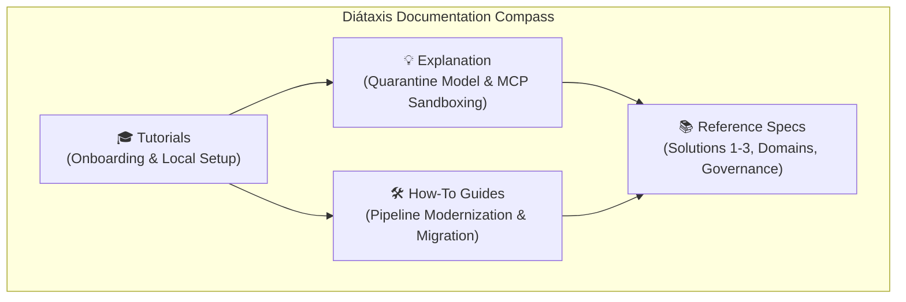

# Modernizing Big Data Analytics Architecture: Master Documentation Suite

Welcome to the authoritative documentation repository for modernizing the **Big Data Analytics (BDA)** platform architecture.

---

## 🏛️ Documentation Hierarchy & Knowledge Network Topology

The diagram below details the Diátaxis documentation structure and knowledge hierarchy across the four documentation quadrants.

### 1. Standalone Production-Ready SVG Vector Graphic (`.svg`)

<svg xmlns="http://www.w3.org/2000/svg" viewBox="0 0 960 400" width="100%" height="100%">
  <defs>
    <marker id="arrow-doc" viewBox="0 0 10 10" refX="6" refY="5" markerWidth="6" markerHeight="6" orient="auto-start-reverse">
      <path d="M 0 0 L 10 5 L 0 10 z" fill="#64748B" />
    </marker>
    <filter id="shadow-doc" x="-4%" y="-4%" width="108%" height="108%">
      <feDropShadow dx="0" dy="2" stdDeviation="3" flood-color="#000000" flood-opacity="0.25"/>
    </filter>
  </defs>

  <!-- Background -->
  <rect width="960" height="400" fill="#0F172A" rx="10"/>

  <!-- Left Top: Tutorials -->
  <rect x="20" y="20" width="440" height="170" fill="#1E293B" stroke="#38BDF8" stroke-width="1.5" rx="8" filter="url(#shadow-doc)"/>
  <rect x="20" y="20" width="440" height="26" fill="#0369A1" rx="8"/>
  <text x="35" y="38" font-family="-apple-system, BlinkMacSystemFont, 'Segoe UI', Roboto, sans-serif" font-size="12" font-weight="bold" fill="#E0F2FE">🎓 TUTORIALS (PRACTICAL / LEARNING)</text>
  <text x="35" y="65" font-family="-apple-system, BlinkMacSystemFont, 'Segoe UI', Roboto, sans-serif" font-size="12" font-weight="bold" fill="#38BDF8">Onboarding &amp; Setup Guide</text>
  <text x="35" y="85" font-family="-apple-system, BlinkMacSystemFont, 'Segoe UI', Roboto, sans-serif" font-size="11" fill="#E2E8F0">• Developer Environment &amp; Local Sandbox Setup</text>
  <text x="35" y="105" font-family="-apple-system, BlinkMacSystemFont, 'Segoe UI', Roboto, sans-serif" font-size="11" fill="#E2E8F0">• Codebase Navigation &amp; Verification Procedures</text>

  <!-- Right Top: Explanation -->
  <rect x="500" y="20" width="440" height="170" fill="#1E293B" stroke="#A855F7" stroke-width="1.5" rx="8" filter="url(#shadow-doc)"/>
  <rect x="500" y="20" width="440" height="26" fill="#581C87" rx="8"/>
  <text x="515" y="38" font-family="-apple-system, BlinkMacSystemFont, 'Segoe UI', Roboto, sans-serif" font-size="12" font-weight="bold" fill="#E9D5FF">💡 EXPLANATION (THEORETICAL / UNDERSTANDING)</text>
  <text x="515" y="65" font-family="-apple-system, BlinkMacSystemFont, 'Segoe UI', Roboto, sans-serif" font-size="12" font-weight="bold" fill="#C084FC">Architectural Frameworks &amp; Principles</text>
  <text x="515" y="85" font-family="-apple-system, BlinkMacSystemFont, 'Segoe UI', Roboto, sans-serif" font-size="11" fill="#E2E8F0">• Human-to-AI Quarantine Model (3-Tier SSoT)</text>
  <text x="515" y="105" font-family="-apple-system, BlinkMacSystemFont, 'Segoe UI', Roboto, sans-serif" font-size="11" fill="#E2E8F0">• MCP Tool Isolation &amp; Zero-Trust AI Containment</text>

  <!-- Left Bottom: How-To Guides -->
  <rect x="20" y="210" width="440" height="170" fill="#1E293B" stroke="#3B82F6" stroke-width="1.5" rx="8" filter="url(#shadow-doc)"/>
  <rect x="20" y="210" width="440" height="26" fill="#1E3A8A" rx="8"/>
  <text x="35" y="228" font-family="-apple-system, BlinkMacSystemFont, 'Segoe UI', Roboto, sans-serif" font-size="12" font-weight="bold" fill="#93C5FD">🛠️ HOW-TO GUIDES (PRACTICAL / WORKING)</text>
  <text x="35" y="255" font-family="-apple-system, BlinkMacSystemFont, 'Segoe UI', Roboto, sans-serif" font-size="12" font-weight="bold" fill="#60A5FA">Operational Procedures &amp; Migration Roadmaps</text>
  <text x="35" y="275" font-family="-apple-system, BlinkMacSystemFont, 'Segoe UI', Roboto, sans-serif" font-size="11" fill="#E2E8F0">• Ingestion Pipeline Modernization (NiFi 2.0 / Airflow)</text>
  <text x="35" y="295" font-family="-apple-system, BlinkMacSystemFont, 'Segoe UI', Roboto, sans-serif" font-size="11" fill="#E2E8F0">• Phased 12-Month Migration Strategy &amp; AI Business Cases</text>

  <!-- Right Bottom: Reference -->
  <rect x="500" y="210" width="440" height="170" fill="#1E293B" stroke="#22C55E" stroke-width="1.5" rx="8" filter="url(#shadow-doc)"/>
  <rect x="500" y="210" width="440" height="26" fill="#065F46" rx="8"/>
  <text x="515" y="228" font-family="-apple-system, BlinkMacSystemFont, 'Segoe UI', Roboto, sans-serif" font-size="12" font-weight="bold" fill="#86EFAC">📚 REFERENCE (THEORETICAL / INFORMATION)</text>
  <text x="515" y="255" font-family="-apple-system, BlinkMacSystemFont, 'Segoe UI', Roboto, sans-serif" font-size="12" font-weight="bold" fill="#4ADE80">Authoritative Technical Specifications</text>
  <text x="515" y="275" font-family="-apple-system, BlinkMacSystemFont, 'Segoe UI', Roboto, sans-serif" font-size="11" fill="#E2E8F0">• Legacy Deconstruction &amp; Decoupled Lakehouse Specs</text>
  <text x="515" y="295" font-family="-apple-system, BlinkMacSystemFont, 'Segoe UI', Roboto, sans-serif" font-size="11" fill="#E2E8F0">• Solutions 1, 2, 3 Specifications &amp; Governance Matrix</text>

  <!-- Center Cross Lines -->
  <line x1="240" y1="190" x2="240" y2="210" stroke="#64748B" stroke-width="1.5" marker-end="url(#arrow-doc)"/>
  <line x1="720" y1="190" x2="720" y2="210" stroke="#64748B" stroke-width="1.5" marker-end="url(#arrow-doc)"/>
  <line x1="460" y1="105" x2="500" y2="105" stroke="#64748B" stroke-width="1.5" marker-end="url(#arrow-doc)"/>
  <line x1="460" y1="295" x2="500" y2="295" stroke="#64748B" stroke-width="1.5" marker-end="url(#arrow-doc)"/>
</svg>

### 2. Git-Native Mermaid Topology (`.mmd`)



### 3. Summary Interface & Routing Table

| Source Quadrant | Target Audience | Port / Protocol / API Ingress | Security Boundary / Access Key | Operational Significance / Representative Specs |
| :--- | :--- | :--- | :--- | :--- |
| **Tutorials** | Onboarding Engineers | Local Interactive CLI | Developer Environment Sandbox | Hands-on guided onboarding and local developer environment setup (`docs/tutorials/onboarding-and-setup.md`). |
| **How-To Guides** | System Architects &amp; Developers | REST / OTLP / mTLS | Ingestion &amp; Migration DMZ | Operational problem-solving procedures and 12-month migration strategy (`docs/how-to-guides/phased-migration-strategy.md`). |
| **Reference** | Technical Auditors &amp; Engineers | S3 / JDBC / OIDC HTTPS | Authoritative SSoT Core | Authoritative technical specifications and infrastructure solution blueprints (`docs/reference/solution-1-aws-native.md`). |
| **Explanation** | Security &amp; Data Stewards | JSON-RPC / OIDC JWT | Zero-Trust Quarantine DMZ | Conceptual frameworks, design rationale, and Human-to-AI Quarantine model (`docs/explanation/human-ai-quarantine-model.md`). |

This documentation suite establishes a 100% open-source, S3-compatible data lakehouse architecture designed to serve as an authoritative **Single Source of Truth (SSoT)** for natural resources, environmental data, geological analytics, and climate risk modeling.

---

## Documentation Structure (Diátaxis Framework Navigation)

Following the **Diátaxis Documentation Framework**, this suite is organized into four distinct quadrants based on user intent (Practical vs. Theoretical and Learning vs. Working):

```
                     ACQUISITION OF SKILL (Study)
                                  │
           🎓 TUTORIALS            │         💡 EXPLANATION
     (Practical / Learning)       │     (Theoretical / Understanding)
                                  │
     • BDA Lakehouse Onboarding   │     • Human-to-AI Quarantine Model
       and Developer Setup        │     • MCP & AI Sandboxing Protocol
                                  │     • Governance & Standards
                                  │       Compliance
──────────────────────────────────┼──────────────────────────────────
                                  │
          🛠️ HOW-TO GUIDES         │          📚 REFERENCE
      (Practical / Work)          │      (Theoretical / Information)
                                  │
     • Ingestion Pipeline         │     • Legacy BDA Deconstruction
       Modernization              │     • Target Lakehouse Architecture
     • Phased 12-Month            │     • Business Domains (x5)
       Migration Strategy         │     • Data Governance Matrix
                                  │     • Solution 1: AWS Native
                                  │     • Solution 2: Hybrid AI
                                  │     • Solution 3: On-Prem Sovereign
                                  │     • OpenWiki SSoT Knowledge Base
                                  │
                      APPLICATION OF SKILL (Work)
```

---

## Master Directory Index

### 🎓 1. Tutorials (Practical Learning for Onboarding)

- **[Onboarding and Setup Guide](tutorials/onboarding-and-setup.html):** Getting started with the modernized BDA lakehouse baseline documentation.

### 🛠️ 2. How-To Guides (Practical Problem-Solving for Engineers)

- **[Ingestion Pipeline Modernization](how-to-guides/ingestion-pipeline-modernization.html):** Implementing Apache NiFi, Apache Airflow, Next.js web application, and Apache Superset visual analytics.
- **[Phased Migration Strategy & Roadmap](how-to-guides/phased-migration-strategy.html):** Detailed 4-phase implementation roadmap over 12 months with risk mitigation and fallback procedures.
- [Onboarding and Scaling New AI/ML Business Cases](how-to-guides/onboarding-new-ai-business-cases.html)

### 📚 3. Reference Material (Factual Technical Specifications)

- **[Legacy Architecture Deconstruction](reference/legacy-architecture.html):** Deconstruction of legacy BDA environments, structural bottlenecks, file/database silos, and failure modes.
- **[Target Lakehouse Architecture Specifications](reference/lakehouse-architecture.html):** Specs for decoupled storage and compute (Ceph/MinIO, Apache Iceberg, Apache Polaris, Trino, Apache Spark + Sedona).
- **[Business Domain Specifications](reference/business-applications.html):** Detailed specifications for 5 core analytical domains: Incident Management, Groundwater Potential, Active Fire Tracking, Climate Adaptation, and Geological Hazard Risk.
- **[Apache NiFi 2.0 Master Data Plane & Migration Guide](reference/apache-nifi-2-master-data-plane-and-migration.html):** Authoritative reference specification for Apache NiFi 2.0 as the master data plane, PostgreSQL vector/spatial integration, and migration framework from NiFi 1.x.
- **[Data Governance & Subsystems Matrix](reference/governance-matrix.html):** Mapping governance subsystems, OpenLineage provenance, ODCS contract standards, and geospatial standards.
- **[Solution 1 Reference Spec: AWS Native Infrastructure](reference/solution-1-aws-native.html):** Detailed reference specifications for All in Cloud deployment using AWS managed services (S3 Object Lock, Glue Catalog, EMR Serverless, Athena, Bedrock).
- **[Solution 2 Reference Spec: Hybrid Cloud Lakehouse & On-Prem GPU](reference/solution-2-hybrid-ai.html):** Detailed reference specifications for Hybrid deployment retaining cloud lakehouse core while executing AI inference, local vector search, and MCP tools on-premises over AWS Direct Connect MACsec/IPsec.
- **[Solution 3 Reference Spec: 100% On-Premises Sovereign Architecture](reference/solution-3-onprem-proxmox-rke2.html):** Detailed reference specifications for 100% sovereign deployment using Proxmox VE hypervisor, dual RKE2/K3s Kubernetes clusters, and Ceph SDS object/block storage.
- **[OpenWiki SSoT Quickstart & Knowledge Base](../openwiki/quickstart.md):** BDA Lakehouse SSoT open-source relationship matrix, infrastructure, software, and governance knowledge graph.

### 💡 4. Explanation (Theoretical Rationale and Architecture Principles)

- **[The Human-to-AI Quarantine Model](explanation/human-ai-quarantine-model.html):** Conceptual explanation of the 3-tier data classification topology (Tier 0 Golden Truth, Tier 1 Telemetry, Tier 2 AI Sandbox) preserving human ground truth.
- **[Model Context Protocol (MCP) & AI Sandboxing](explanation/mcp-and-ai-sandboxing.html):** Explanation of how MCP confines AI models to operational tooling while barring direct writes to ground-truth data.
- **[Governance, Security, and Compliance Framework](explanation/governance-and-compliance.html):** Enterprise catalog selection (OpenMetadata), Keycloak IAM, APISIX gateway, and compliance standards.

---

## Key Strategic Conclusions

1. **Decoupled Architecture:** Replaces legacy Hadoop HDFS, GlusterFS, and relational database sprawl with software-defined object storage (Ceph/MinIO) and Apache Iceberg table formats, queried via Trino and Apache Spark/Sedona.
2. **Absolute Data Provenance:** Enforces the Linux Foundation Bitol Open Data Contract Standard (ODCS v3.1.0) and custom OpenLineage `nres_provenance` facets to isolate unverified AI synthetic models from Tier 0 Golden Human SSoT.
3. **Open-Source Freedom:** Replaces proprietary BI servers and legacy web portals with Apache Superset, Next.js, Keycloak, and Apache APISIX, eliminating recurring licensing costs and vendor lock-in.
