```mermaid
flowchart LR
    subgraph Payload ["OKF v0.2 Ingestion"]
        YAMLFrontmatter["YAML Frontmatter Schema"]
        RFC8785["RFC 8785 Canonical JSON"]
        ParamSchema["Parameter & Runtime Schema"]
    end

    subgraph Execution ["Deterministic Sandbox Execution"]
        UvSandbox["uv Isolated Python Sandbox"]
        StateTracking["SHA-256 State Delta Tracking"]
    end

    subgraph Attestation ["Attestation & Provenance"]
        Ed25519Receipt["Ed25519 Execution Receipt"]
        AttesterAudit["Independent Attester Verification"]
    end

    Payload -->|"Canonical Payload"| Execution
    Execution -->|"Computed State Hash"| Attestation
```

```mermaid
flowchart LR
    subgraph Discovery ["Skill Discovery Layer"]
        Registry[".agents/skills/ Registry"]
        FallbackMirror["skills/ Mirror"]
        FrontmatterIndex["OKF Frontmatter Index"]
    end

    subgraph Resolution ["Argument & Protocol Resolution"]
        WarpVars["Warp Variables ($ARGUMENTS, $1, $2)"]
        OpenVikingURI["OpenViking viking:// URI Resolver"]
    end

    subgraph Execution ["Executable Skill Payload"]
        EmbeddedScripts["Embedded Scripts (scripts/*.py)"]
        QualityGate["Quality Gate & Linter Check"]
    end

    Discovery -->|"Resolved Skill Payload"| Resolution
    Resolution -->|"Injected Parameters"| Execution
```

# Attested Computations and Warp Agent Skills Architecture

This explanation guide explores the design principles, cryptographic attestation models, and execution frameworks governing **Attested Computations in OKF v0.2** and **Warp & OpenViking Agent Skills** within the Deep State of Mind (DSOM) architecture.

---

## Attested Computations in Open Knowledge Format (OKF v0.2)

In high-assurance enterprise AI systems, verifying that a computational result was executed deterministically without tampering is essential. Attested computations bind input parameters, environment constraints, binary hashes, and execution receipts into canonical Open Knowledge Format (OKF v0.2) records.

### Dual-Render Diagram 1: Attested Computation Pipeline Architecture

#### 1. Standalone Production-Ready SVG Vector Graphic (`.svg`)

<svg xmlns="http://www.w3.org/2000/svg" viewBox="0 0 920 380" width="100%" height="100%">
  <defs>
    <marker id="arrow-attest" viewBox="0 0 10 10" refX="6" refY="5" markerWidth="6" markerHeight="6" orient="auto-start-reverse">
      <path d="M 0 0 L 10 5 L 0 10 z" fill="#2563EB" />
    </marker>
    <filter id="shadow-attest" x="-4%" y="-4%" width="108%" height="108%">
      <feDropShadow dx="0" dy="2" stdDeviation="3" flood-color="#000000" flood-opacity="0.15"/>
    </filter>
  </defs>

  <!-- Background -->
  <rect width="920" height="380" fill="#0F172A" rx="10"/>

  <!-- Ingestion Tier (Blue) -->
  <rect x="20" y="20" width="280" height="320" fill="#1E293B" stroke="#2563EB" stroke-width="1.5" rx="8" filter="url(#shadow-attest)"/>
  <rect x="20" y="20" width="280" height="28" fill="#1E3A8A" rx="8"/>
  <text x="35" y="39" font-family="-apple-system, BlinkMacSystemFont, 'Segoe UI', Roboto, sans-serif" font-size="12" font-weight="bold" fill="#93C5FD">1. OKF V0.2 PAYLOAD INGESTION</text>

  <rect x="35" y="60" width="250" height="70" fill="#0F172A" stroke="#334155" rx="6"/>
  <text x="45" y="80" font-family="-apple-system, BlinkMacSystemFont, 'Segoe UI', Roboto, sans-serif" font-size="12" font-weight="bold" fill="#60A5FA">YAML Frontmatter Schema</text>
  <text x="45" y="100" font-family="Consolas, Monaco, monospace" font-size="11" fill="#94A3B8">• Parameter commitments</text>
  <text x="45" y="115" font-family="Consolas, Monaco, monospace" font-size="11" fill="#94A3B8">• Input canonical byte hashes</text>

  <rect x="35" y="145" width="250" height="80" fill="#0F172A" stroke="#334155" rx="6"/>
  <text x="45" y="165" font-family="-apple-system, BlinkMacSystemFont, 'Segoe UI', Roboto, sans-serif" font-size="12" font-weight="bold" fill="#60A5FA">RFC 8785 Binding</text>
  <text x="45" y="185" font-family="Consolas, Monaco, monospace" font-size="11" fill="#94A3B8">• Canonical JSON formatting</text>
  <text x="45" y="200" font-family="Consolas, Monaco, monospace" font-size="11" fill="#94A3B8">• Zero byte variation rule</text>

  <rect x="35" y="240" width="250" height="80" fill="#0F172A" stroke="#334155" rx="6"/>
  <text x="45" y="260" font-family="-apple-system, BlinkMacSystemFont, 'Segoe UI', Roboto, sans-serif" font-size="12" font-weight="bold" fill="#60A5FA">Parameter Schema</text>
  <text x="45" y="280" font-family="Consolas, Monaco, monospace" font-size="11" fill="#94A3B8">• Pinned dependency locks</text>
  <text x="45" y="295" font-family="Consolas, Monaco, monospace" font-size="11" fill="#94A3B8">• Runtime sandbox profile</text>

  <!-- Sandbox Execution Tier (Green) -->
  <rect x="320" y="20" width="280" height="320" fill="#1E293B" stroke="#16A34A" stroke-width="1.5" rx="8" filter="url(#shadow-attest)"/>
  <rect x="320" y="20" width="280" height="28" fill="#14532D" rx="8"/>
  <text x="335" y="39" font-family="-apple-system, BlinkMacSystemFont, 'Segoe UI', Roboto, sans-serif" font-size="12" font-weight="bold" fill="#86EFAC">2. DETERMINISTIC SANDBOX EXEC</text>

  <rect x="335" y="60" width="250" height="120" fill="#0F172A" stroke="#334155" rx="6"/>
  <text x="345" y="80" font-family="-apple-system, BlinkMacSystemFont, 'Segoe UI', Roboto, sans-serif" font-size="12" font-weight="bold" fill="#4ADE80">Isolated uv Execution</text>
  <text x="345" y="100" font-family="Consolas, Monaco, monospace" font-size="11" fill="#94A3B8">• Python 3.12 sandbox engine</text>
  <text x="345" y="115" font-family="Consolas, Monaco, monospace" font-size="11" fill="#94A3B8">• Byte-capped stdout capture</text>
  <text x="345" y="130" font-family="Consolas, Monaco, monospace" font-size="11" fill="#94A3B8">• Strict memory/CPU caps</text>

  <rect x="335" y="200" width="250" height="120" fill="#0F172A" stroke="#334155" rx="6"/>
  <text x="345" y="220" font-family="-apple-system, BlinkMacSystemFont, 'Segoe UI', Roboto, sans-serif" font-size="12" font-weight="bold" fill="#4ADE80">State Verification</text>
  <text x="345" y="240" font-family="Consolas, Monaco, monospace" font-size="11" fill="#94A3B8">• SHA-256 state delta tracking</text>
  <text x="345" y="255" font-family="Consolas, Monaco, monospace" font-size="11" fill="#94A3B8">• Side-effect elimination</text>
  <text x="345" y="270" font-family="Consolas, Monaco, monospace" font-size="11" fill="#94A3B8">• Deterministic build hashes</text>

  <!-- Cryptographic Attestation Tier (Purple) -->
  <rect x="620" y="20" width="280" height="320" fill="#1E293B" stroke="#9333EA" stroke-width="1.5" rx="8" filter="url(#shadow-attest)"/>
  <rect x="620" y="20" width="280" height="28" fill="#581C87" rx="8"/>
  <text x="635" y="39" font-family="-apple-system, BlinkMacSystemFont, 'Segoe UI', Roboto, sans-serif" font-size="12" font-weight="bold" fill="#E9D5FF">3. ATTESTATION RECEIPT &amp; PROVENANCE</text>

  <rect x="635" y="60" width="250" height="120" fill="#0F172A" stroke="#334155" rx="6"/>
  <text x="645" y="80" font-family="-apple-system, BlinkMacSystemFont, 'Segoe UI', Roboto, sans-serif" font-size="12" font-weight="bold" fill="#C084FC">Ed25519 Cryptographic Receipt</text>
  <text x="645" y="100" font-family="Consolas, Monaco, monospace" font-size="11" fill="#94A3B8">• HEX_RAW_64_BYTE signature</text>
  <text x="645" y="115" font-family="Consolas, Monaco, monospace" font-size="11" fill="#94A3B8">• Key ID &amp; UTC timestamp</text>
  <text x="645" y="130" font-family="Consolas, Monaco, monospace" font-size="11" fill="#94A3B8">• Verification status enum</text>

  <rect x="635" y="200" width="250" height="120" fill="#0F172A" stroke="#334155" rx="6"/>
  <text x="645" y="220" font-family="-apple-system, BlinkMacSystemFont, 'Segoe UI', Roboto, sans-serif" font-size="12" font-weight="bold" fill="#C084FC">Independent Attester Audit</text>
  <text x="645" y="240" font-family="Consolas, Monaco, monospace" font-size="11" fill="#94A3B8">• Re-execution in sandbox</text>
  <text x="645" y="255" font-family="Consolas, Monaco, monospace" font-size="11" fill="#94A3B8">• Public key validation</text>
  <text x="645" y="270" font-family="Consolas, Monaco, monospace" font-size="11" fill="#94A3B8">• Audit log ledger recording</text>

  <!-- Connectors -->
  <line x1="300" y1="180" x2="320" y2="180" stroke="#2563EB" stroke-width="2" marker-end="url(#arrow-attest)"/>
  <line x1="600" y1="180" x2="620" y2="180" stroke="#2563EB" stroke-width="2" marker-end="url(#arrow-attest)"/>

  <!-- Figure Caption -->
  <text x="460" y="362" font-family="-apple-system, BlinkMacSystemFont, 'Segoe UI', Roboto, sans-serif" font-size="11" font-weight="bold" fill="#64748B" text-anchor="middle">Figure 1.1: Attested Computation &amp; Cryptographic Provenance Workflow</text>
</svg>

#### 2. Git-Native Mermaid Topology (`.mmd`)

#### 3. Summary Interface & Routing Table

| Source Component | Target Component | Port / Protocol / API Ingress | Security Boundary / Access Key | Operational Significance / Flow Description |
| :--- | :--- | :--- | :--- | :--- |
| **OKF Payload Ingestion** | **Deterministic Sandbox** | `Local Subprocess` / IPC | Canonical Hash Verification | Validates OKF frontmatter parameters and RFC 8785 byte commitments. |
| **uv Sandbox Engine** | **State Tracker** | `Memory Pipeline` | Isolated `uv` Environment | Executes code deterministically and tracks state changes. |
| **State Tracker** | **Attestation Engine** | `Internal Channel` | Ed25519 Keypair / `bda_provenance` | Generates 64-byte Ed25519 cryptographic receipts binding execution outputs. |

---

## Warp & OpenViking Agent Skills Architecture

Agent Skills structure reusable, parameterizable operational knowledge for AI agents. Adhering to Warp Agent Skills and OpenViking Agent Skills specifications, skills are stored in `.agents/skills/<skill-name>/SKILL.md` (and mirrored in `skills/`), exposing standard parameter substitution (`$ARGUMENTS`, `$0`, `$1`), OpenViking URIs (`viking://skills/...`), and MCP tool bindings.

### Dual-Render Diagram 2: Agent Skill Discovery & Execution Routing

#### 1. Standalone Production-Ready SVG Vector Graphic (`.svg`)

<svg xmlns="http://www.w3.org/2000/svg" viewBox="0 0 920 360" width="100%" height="100%">
  <defs>
    <marker id="arrow-skill" viewBox="0 0 10 10" refX="6" refY="5" markerWidth="6" markerHeight="6" orient="auto-start-reverse">
      <path d="M 0 0 L 10 5 L 0 10 z" fill="#16A34A" />
    </marker>
    <filter id="shadow-skill" x="-4%" y="-4%" width="108%" height="108%">
      <feDropShadow dx="0" dy="2" stdDeviation="3" flood-color="#000000" flood-opacity="0.15"/>
    </filter>
  </defs>

  <!-- Background -->
  <rect width="920" height="360" fill="#0F172A" rx="10"/>

  <!-- Discovery Layer -->
  <rect x="20" y="20" width="280" height="300" fill="#1E293B" stroke="#38BDF8" stroke-width="1.5" rx="8" filter="url(#shadow-skill)"/>
  <rect x="20" y="20" width="280" height="28" fill="#0369A1" rx="8"/>
  <text x="35" y="39" font-family="-apple-system, BlinkMacSystemFont, 'Segoe UI', Roboto, sans-serif" font-size="12" font-weight="bold" fill="#E0F2FE">1. SKILL DISCOVERY GATEWAY</text>

  <rect x="35" y="60" width="250" height="70" fill="#0F172A" stroke="#334155" rx="6"/>
  <text x="45" y="80" font-family="-apple-system, BlinkMacSystemFont, 'Segoe UI', Roboto, sans-serif" font-size="12" font-weight="bold" fill="#38BDF8">Hierarchical Discovery</text>
  <text x="45" y="100" font-family="Consolas, Monaco, monospace" font-size="11" fill="#94A3B8">• .agents/skills/ registry</text>
  <text x="45" y="115" font-family="Consolas, Monaco, monospace" font-size="11" fill="#94A3B8">• skills/ fallback mirror</text>

  <rect x="35" y="145" width="250" height="155" fill="#0F172A" stroke="#334155" rx="6"/>
  <text x="45" y="165" font-family="-apple-system, BlinkMacSystemFont, 'Segoe UI', Roboto, sans-serif" font-size="12" font-weight="bold" fill="#38BDF8">Frontmatter Indexing</text>
  <text x="45" y="185" font-family="Consolas, Monaco, monospace" font-size="11" fill="#94A3B8">• name &amp; description matching</text>
  <text x="45" y="200" font-family="Consolas, Monaco, monospace" font-size="11" fill="#94A3B8">• allowed-tools filtering</text>
  <text x="45" y="215" font-family="Consolas, Monaco, monospace" font-size="11" fill="#94A3B8">• tags &amp; metadata discovery</text>

  <!-- Substitution & Resolution Layer -->
  <rect x="320" y="20" width="280" height="300" fill="#1E293B" stroke="#16A34A" stroke-width="1.5" rx="8" filter="url(#shadow-skill)"/>
  <rect x="320" y="20" width="280" height="28" fill="#14532D" rx="8"/>
  <text x="335" y="39" font-family="-apple-system, BlinkMacSystemFont, 'Segoe UI', Roboto, sans-serif" font-size="12" font-weight="bold" fill="#86EFAC">2. ARGUMENT SUBSTITUTION</text>

  <rect x="335" y="60" width="250" height="110" fill="#0F172A" stroke="#334155" rx="6"/>
  <text x="345" y="80" font-family="-apple-system, BlinkMacSystemFont, 'Segoe UI', Roboto, sans-serif" font-size="12" font-weight="bold" fill="#4ADE80">Warp Argument Engine</text>
  <text x="345" y="100" font-family="Consolas, Monaco, monospace" font-size="11" fill="#94A3B8">• $ARGUMENTS / $0 string</text>
  <text x="345" y="115" font-family="Consolas, Monaco, monospace" font-size="11" fill="#94A3B8">• $1, $2 positional variables</text>
  <text x="345" y="130" font-family="Consolas, Monaco, monospace" font-size="11" fill="#94A3B8">• Default fallback parameters</text>

  <rect x="335" y="185" width="250" height="115" fill="#0F172A" stroke="#334155" rx="6"/>
  <text x="345" y="205" font-family="-apple-system, BlinkMacSystemFont, 'Segoe UI', Roboto, sans-serif" font-size="12" font-weight="bold" fill="#4ADE80">OpenViking Integration</text>
  <text x="345" y="225" font-family="Consolas, Monaco, monospace" font-size="11" fill="#94A3B8">• viking:// URI resolution</text>
  <text x="345" y="240" font-family="Consolas, Monaco, monospace" font-size="11" fill="#94A3B8">• MCP tool mapping</text>
  <text x="345" y="255" font-family="Consolas, Monaco, monospace" font-size="11" fill="#94A3B8">• JSON-RPC 2.0 schema sync</text>

  <!-- Execution Layer -->
  <rect x="620" y="20" width="280" height="300" fill="#1E293B" stroke="#C084FC" stroke-width="1.5" rx="8" filter="url(#shadow-skill)"/>
  <rect x="620" y="20" width="280" height="28" fill="#581C87" rx="8"/>
  <text x="635" y="39" font-family="-apple-system, BlinkMacSystemFont, 'Segoe UI', Roboto, sans-serif" font-size="12" font-weight="bold" fill="#E9D5FF">3. EXECUTABLE WORKFLOW</text>

  <rect x="635" y="60" width="250" height="110" fill="#0F172A" stroke="#334155" rx="6"/>
  <text x="645" y="80" font-family="-apple-system, BlinkMacSystemFont, 'Segoe UI', Roboto, sans-serif" font-size="12" font-weight="bold" fill="#C084FC">Embedded Scripts</text>
  <text x="645" y="100" font-family="Consolas, Monaco, monospace" font-size="11" fill="#94A3B8">• scripts/ compile-book.py</text>
  <text x="645" y="115" font-family="Consolas, Monaco, monospace" font-size="11" fill="#94A3B8">• Pure Python automation</text>
  <text x="645" y="130" font-family="Consolas, Monaco, monospace" font-size="11" fill="#94A3B8">• Zero binary dependencies</text>

  <rect x="635" y="185" width="250" height="115" fill="#0F172A" stroke="#334155" rx="6"/>
  <text x="645" y="205" font-family="-apple-system, BlinkMacSystemFont, 'Segoe UI', Roboto, sans-serif" font-size="12" font-weight="bold" fill="#C084FC">Quality Gate &amp; Verification</text>
  <text x="645" y="225" font-family="Consolas, Monaco, monospace" font-size="11" fill="#94A3B8">• <4000 token limit check</text>
  <text x="645" y="240" font-family="Consolas, Monaco, monospace" font-size="11" fill="#94A3B8">• OKF v0.2 linting pass</text>
  <text x="645" y="255" font-family="Consolas, Monaco, monospace" font-size="11" fill="#94A3B8">• Pre-commit verification</text>

  <!-- Connectors -->
  <line x1="300" y1="170" x2="320" y2="170" stroke="#16A34A" stroke-width="2" marker-end="url(#arrow-skill)"/>
  <line x1="600" y1="170" x2="620" y2="170" stroke="#16A34A" stroke-width="2" marker-end="url(#arrow-skill)"/>

  <!-- Figure Caption -->
  <text x="460" y="342" font-family="-apple-system, BlinkMacSystemFont, 'Segoe UI', Roboto, sans-serif" font-size="11" font-weight="bold" fill="#64748B" text-anchor="middle">Figure 2.1: Agent Skill Discovery, Parameter Substitution, and Execution Architecture</text>
</svg>

#### 2. Git-Native Mermaid Topology (`.mmd`)

#### 3. Summary Interface & Routing Table

| Source Component | Target Component | Port / Protocol / API Ingress | Security Boundary / Access Key | Operational Significance / Flow Description |
| :--- | :--- | :--- | :--- | :--- |
| **AI Agent Gateway** | **Skill Registry** | File System / Read | `.agents/skills/` Directory | Discovers skills by scanning frontmatter metadata (`name`, `description`). |
| **Agent Skill Execution** | **Argument Resolver** | Environment Variable Ingress | Subprocess IPC | Substitutes `$ARGUMENTS`, `$0`, `$1` parameters into script execution context. |
| **OpenViking Bridge** | **MCP Tool Endpoint** | `viking://` / MCP JSON-RPC | Keycloak Token / Local IPC | Exposes skill procedures as standard MCP tool endpoints for remote or local agents. |
