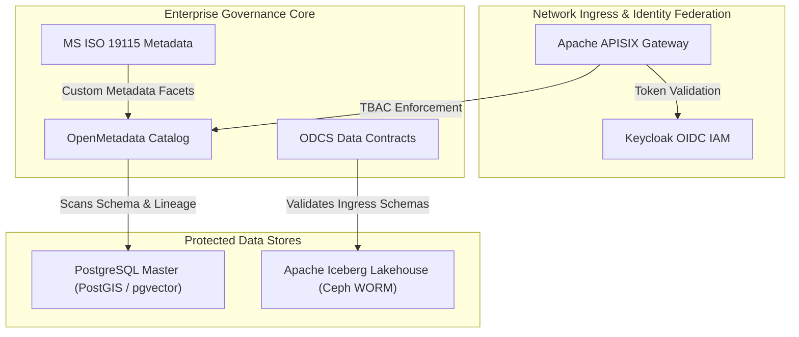

# Governance, Security, and Compliance Framework

Operating an authoritative Single Source of Truth requires an enterprise data catalog that automatically scans platform assets, maintains business glossaries, maps column-level lineage, and enforces access control policies across all endpoints.

---

## 🏛️ Enterprise Security & Governance Perimeter Topology

The diagram below details the integrated security perimeter, connecting APISIX, Keycloak OIDC IAM, OpenMetadata, and ISO 19115 geospatial metadata.

### 1. Standalone Production-Ready SVG Vector Graphic (`.svg`)

<svg xmlns="http://www.w3.org/2000/svg" viewBox="0 0 960 400" width="100%" height="100%">
  <defs>
    <marker id="arrow-sec" viewBox="0 0 10 10" refX="6" refY="5" markerWidth="6" markerHeight="6" orient="auto-start-reverse">
      <path d="M 0 0 L 10 5 L 0 10 z" fill="#64748B" />
    </marker>
    <filter id="shadow-sec" x="-4%" y="-4%" width="108%" height="108%">
      <feDropShadow dx="0" dy="2" stdDeviation="3" flood-color="#000000" flood-opacity="0.25"/>
    </filter>
  </defs>

  <!-- Background -->
  <rect width="960" height="400" fill="#0F172A" rx="10"/>

  <!-- Perimeter Security Tier -->
  <rect x="20" y="20" width="920" height="80" fill="#1E293B" stroke="#334155" stroke-width="1.5" rx="8" filter="url(#shadow-sec)"/>
  <rect x="20" y="20" width="920" height="26" fill="#0F172A" rx="8"/>
  <text x="35" y="38" font-family="-apple-system, BlinkMacSystemFont, 'Segoe UI', Roboto, sans-serif" font-size="12" font-weight="bold" fill="#38BDF8">PERIMETER ACCESS &amp; IDENTITY FEDERATION TIER</text>

  <rect x="40" y="52" width="430" height="38" fill="#0369A1" stroke="#38BDF8" rx="4"/>
  <text x="50" y="75" font-family="-apple-system, BlinkMacSystemFont, 'Segoe UI', Roboto, sans-serif" font-size="12" font-weight="bold" fill="#E0F2FE">Apache APISIX API Gateway (JWT &amp; Rate-Limiting)</text>

  <rect x="490" y="52" width="430" height="38" fill="#1E3A8A" stroke="#3B82F6" rx="4"/>
  <text x="500" y="75" font-family="-apple-system, BlinkMacSystemFont, 'Segoe UI', Roboto, sans-serif" font-size="12" font-weight="bold" fill="#93C5FD">Keycloak Identity &amp; Access Management (OIDC / SSO)</text>

  <!-- Governance & Catalog Core Tier -->
  <rect x="20" y="135" width="920" height="120" fill="#1E293B" stroke="#334155" stroke-width="1.5" rx="8" filter="url(#shadow-sec)"/>
  <rect x="20" y="135" width="920" height="26" fill="#0F172A" rx="8"/>
  <text x="35" y="153" font-family="-apple-system, BlinkMacSystemFont, 'Segoe UI', Roboto, sans-serif" font-size="12" font-weight="bold" fill="#4ADE80">ENTERPRISE GOVERNANCE &amp; CATALOG CORE</text>

  <rect x="40" y="170" width="270" height="70" fill="#0F172A" stroke="#22C55E" rx="6"/>
  <text x="50" y="192" font-family="-apple-system, BlinkMacSystemFont, 'Segoe UI', Roboto, sans-serif" font-size="13" font-weight="bold" fill="#86EFAC">OpenMetadata Catalog</text>
  <text x="50" y="212" font-family="Consolas, Monaco, monospace" font-size="10" fill="#4ADE80">Tag-Based Access Control (TBAC)</text>

  <rect x="345" y="170" width="270" height="70" fill="#0F172A" stroke="#22C55E" rx="6"/>
  <text x="355" y="192" font-family="-apple-system, BlinkMacSystemFont, 'Segoe UI', Roboto, sans-serif" font-size="13" font-weight="bold" fill="#86EFAC">ODCS Contract Manager</text>
  <text x="355" y="212" font-family="Consolas, Monaco, monospace" font-size="10" fill="#4ADE80">Bitol Contract Violation Alerts</text>

  <rect x="650" y="170" width="270" height="70" fill="#0F172A" stroke="#22C55E" rx="6"/>
  <text x="660" y="192" font-family="-apple-system, BlinkMacSystemFont, 'Segoe UI', Roboto, sans-serif" font-size="13" font-weight="bold" fill="#86EFAC">ISO 19115 Geospatial Profile</text>
  <text x="660" y="212" font-family="Consolas, Monaco, monospace" font-size="10" fill="#4ADE80">EPSG:3168 / 3169 / 4326 Standards</text>

  <!-- Target Data Store Tier -->
  <rect x="20" y="285" width="920" height="90" fill="#1E293B" stroke="#334155" stroke-width="1.5" rx="8" filter="url(#shadow-sec)"/>
  <rect x="20" y="285" width="920" height="26" fill="#0F172A" rx="8"/>
  <text x="35" y="303" font-family="-apple-system, BlinkMacSystemFont, 'Segoe UI', Roboto, sans-serif" font-size="12" font-weight="bold" fill="#C084FC">PROTECTED LAKEHOUSE &amp; OPERATIONAL STORES</text>

  <rect x="40" y="320" width="430" height="42" fill="#0F172A" stroke="#A855F7" rx="6"/>
  <text x="50" y="346" font-family="-apple-system, BlinkMacSystemFont, 'Segoe UI', Roboto, sans-serif" font-size="12" font-weight="bold" fill="#E9D5FF">PostgreSQL PostGIS / pgvector Master Core</text>

  <rect x="490" y="320" width="430" height="42" fill="#0F172A" stroke="#A855F7" rx="6"/>
  <text x="500" y="346" font-family="-apple-system, BlinkMacSystemFont, 'Segoe UI', Roboto, sans-serif" font-size="12" font-weight="bold" fill="#E9D5FF">Ceph / MinIO Iceberg Parquet SSoT (WORM Lock)</text>

  <!-- Connectors -->
  <line x1="470" y1="71" x2="490" y2="71" stroke="#64748B" stroke-width="1.5" marker-end="url(#arrow-sec)"/>
  <line x1="255" y1="90" x2="175" y2="170" stroke="#64748B" stroke-width="1.5" marker-end="url(#arrow-sec)"/>
  <line x1="175" y1="240" x2="255" y2="320" stroke="#64748B" stroke-width="1.5" marker-end="url(#arrow-sec)"/>
  <line x1="480" y1="240" x2="705" y2="320" stroke="#64748B" stroke-width="1.5" marker-end="url(#arrow-sec)"/>
  <line x1="650" y1="205" x2="315" y2="205" stroke="#64748B" stroke-width="1.5" marker-end="url(#arrow-sec)"/>
</svg>

### 2. Git-Native Mermaid Topology (`.mmd`)

### 3. Summary Interface & Routing Table

| Source Component | Target Component | Port / Protocol / API Ingress | Security Boundary / Access Key | Operational Significance / Flow Description |
| :--- | :--- | :--- | :--- | :--- |
| **API Client** | **APISIX Gateway** | `TCP 8443` / HTTPS TLS 1.3 | Keycloak JWT Bearer | Validates identity tokens and routes authorized REST/gRPC requests. |
| **OpenMetadata** | **PostgreSQL Core** | `TCP 5432` / TLS 1.3 PostgreSQL | Read-Only Catalog Service Key | Crawls schema definitions, column tags, and OpenLineage runtime facets. |
| **ODCS Contract CLI** | **Iceberg Storage** | Local Ingestion Process | Schema Validation Contract | Rejects invalid payloads before writing Parquet snapshots to S3 WORM storage. |

---

## 1. OpenMetadata Architecture & Infrastructure Rationale

Operating an authoritative Single Source of Truth across BDA and Enterprise AI requires an integrated metadata engine capable of real-time schema discovery, runtime lineage tracking, data quality assertion monitoring, and automated policy propagation.

### Why OpenMetadata is Necessary in Overall BDA & Infra

1. **Unified Metadata Hub & Zero Infrastructure Sprawl:**
   - OpenMetadata uses a clean, modern REST/JSON Schema architecture powered by **Percona PostgreSQL 18** for relational state and **OpenSearch / Elasticsearch** for full-text search indexing and discovery.
   - Eliminates the operational debt of legacy Hadoop/Java governance platforms (e.g., Apache Atlas) that require distributed graph databases (JanusGraph/HBase) and ZooKeeper clusters.
2. **Automated End-to-End Lineage Tracking (OpenLineage Standard):**
   - Ingests runtime execution facets emitted by **Apache Airflow** and **Apache Spark** (and custom NiFi REST metadata ingestion events over `TCP 8585` using Bearer API tokens), constructing interactive column-level lineage graphs.
   - Traces data provenance from edge file ingestion (RustFS / SFTP) through Human-in-the-Loop (HITL) quarantine verification down to Tier 0 SSoT PostgreSQL tables, Iceberg lakehouse Parquet files, and Apache Superset analytical dashboards.
3. **Linux Foundation Open Data Contract Standard (ODCS) Integration:**
   - Serves as the central catalog and integration hub for data contract specifications.
   - Active payload validation and rejection of non-compliant writes before persistence are executed by the configured Bitol ODCS CLI embedded within Apache NiFi and Apache Airflow pipelines, while OpenMetadata records catalog state, column metadata, and schema drift alerts.
4. **Tag-Based Access Control (TBAC) & Security Policy Scope:**
   - Configured security tags attached to upstream data assets (e.g., `Classification.Restricted`, `Provenance.HumanVerified`, `Domain.Spatial`) propagate across catalog metadata.
   - Row-Level Security (RLS) policies are configured directly in PostgreSQL (`SET LOCAL app.current_tenant_id`) and enforce isolation across documented Model Context Protocol (MCP) endpoints and data store views.
5. **Business Glossary & Semantic Context for AI Models (`mcp-catalog-context`):**
   - Exposes structured metadata, table schemas, and domain glossaries via read-only REST interfaces provided by `mcp-catalog-context` (distinct from OpenMetadata's stateless `openmetadata-mcp-stateless` server).
   - Enforces raw-table isolation through dedicated read-only database grants (`GRANT SELECT ON bda_public_schema_views TO mcp_reader`), sanitized database views, and PostgreSQL RLS context, preventing AI agents from executing unverified queries or accessing raw Tier 0 persistence tables directly.

### Enterprise Data Catalog Evaluation Matrix

| Governance Dimension | Apache Atlas | DataHub | **OpenMetadata (Selected BDA Standard)** |
| :--- | :--- | :--- | :--- |
| **Backend Architecture** | Complex (JanusGraph, HBase, Solr, ZooKeeper) | Event-Driven (Kafka, MySQL, Elasticsearch) | **Lightweight & Robust (PostgreSQL 18 + OpenSearch)** |
| **Lineage Standard** | Custom Atlas entities | Custom Kafka topics & SQLGlot | **Native OpenLineage (Spark/Airflow) & NiFi REST** |
| **Data Contracts** | Manual / Third-party | Custom schema assertions | **ODCS Catalog Hub (Bitol CLI Pipeline Validation)** |
| **AI & MCP Integration** | Limited / Legacy APIs | REST / GraphQL APIs | **Metadata Context Provider & Read-Only Views** |
| **Operational Overhead** | Very High | High | **Low–Medium (Fits Podman / K3s Stack)** |

---

## 2. Identity Federation and API Perimeter Security

### Keycloak Identity and Access Management (IAM)

Platform identity and access management are modernized through **Keycloak**, the industry-standard open-source identity and access solution. Keycloak centralizes identity across all BDA systems via OpenID Connect (OIDC), OAuth 2.0, and SAML 2.0, providing Single Sign-On (SSO) and Multi-Factor Authentication (MFA) across all administrative consoles, web portals, and analytical tools.

### Apache APISIX Cloud-Native API Gateway

Traffic at the network boundary is governed by **Apache APISIX**. Positioned between external networks and internal lakehouse services, APISIX:

- Validates Keycloak JSON Web Tokens (JWTs).
- Enforces granular rate-limiting and DDoS protection.
- Terminates TLS/SSL connections.
- Dynamically routes API requests to backend microservices, Trino query engines, and PostGIS instances.

---

## 3. Regulatory and Standards Compliance

The platform's governance model aligns strictly with enterprise data sovereignty frameworks:

### Standard Geospatial Metadata Profile

All geospatial datasets comply with **MS ISO 19115:2003 / OGC** guidelines. Metadata attributes—including official coordinate reference systems (`EPSG:3168`, `EPSG:3169`, `EPSG:4326`), spatial resolutions, bounding coordinate extents, and lineage source histories—are mapped as custom metadata facets within OpenMetadata.

### Data Sovereignty & Open-Source Guidelines

Platform infrastructure adheres to digital governance policies prioritizing open-source software, strict data sovereignty protections (on-premises storage), and secure, audited inter-agency data sharing.
