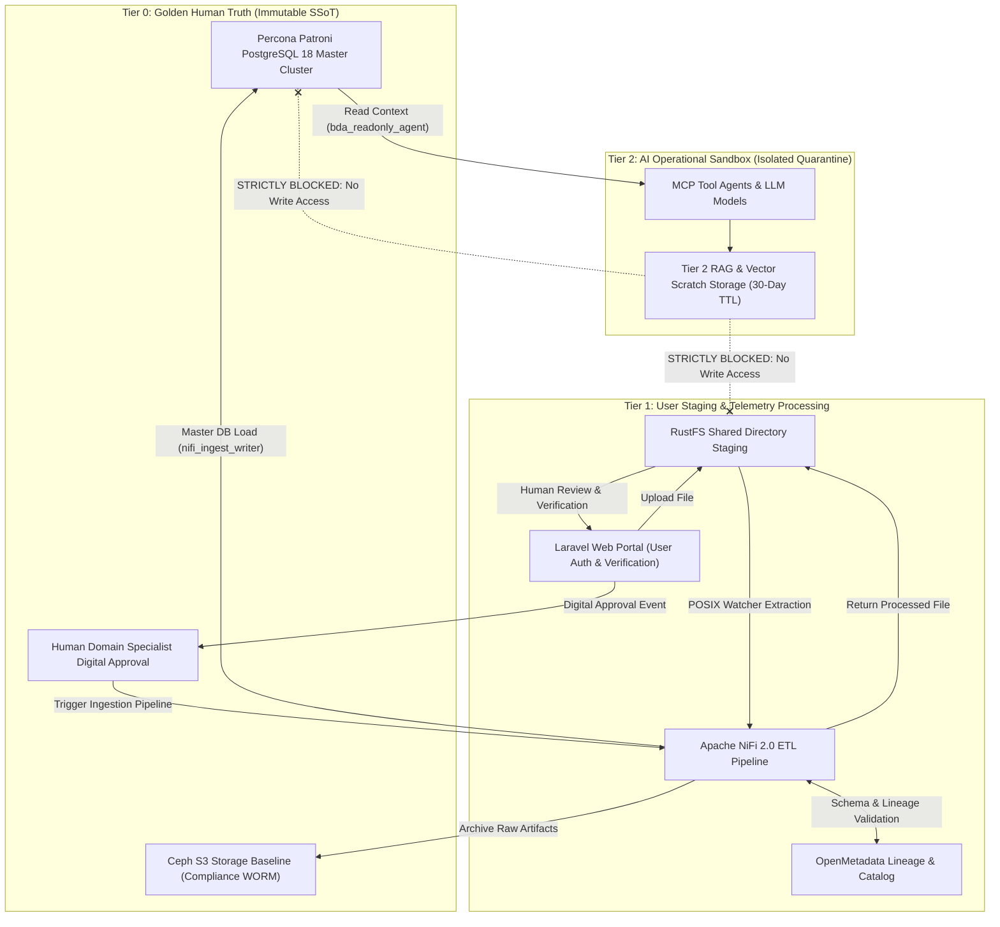

# The Human-to-AI Quarantine Model and Data Classification Topology

Establishing the BDA platform as an authoritative Single Source of Truth (SSoT) requires verifiable guarantees regarding the provenance, custody, and modification history of all ingested data.

---

## 🏛️ Three-Tier Data Classification & Quarantine Topology

The diagram below details the 3-tier data classification architecture, enforcing WORM Compliance Mode for Tier 0 Golden Human Truth and complete isolation for Tier 2 AI Sandboxes.

### 1. Standalone Production-Ready SVG Vector Graphic (`.svg`)

<svg xmlns="http://www.w3.org/2000/svg" viewBox="0 0 960 420" width="100%" height="100%">
  <defs>
    <marker id="arrow-quar" viewBox="0 0 10 10" refX="6" refY="5" markerWidth="6" markerHeight="6" orient="auto-start-reverse">
      <path d="M 0 0 L 10 5 L 0 10 z" fill="#64748B" />
    </marker>
    <filter id="shadow-quar" x="-4%" y="-4%" width="108%" height="108%">
      <feDropShadow dx="0" dy="2" stdDeviation="3" flood-color="#000000" flood-opacity="0.25"/>
    </filter>
  </defs>

  <!-- Background -->
  <rect width="960" height="420" fill="#0F172A" rx="10"/>

  <!-- Tier 0 Box -->
  <rect x="20" y="20" width="920" height="110" fill="#1E293B" stroke="#22C55E" stroke-width="1.5" rx="8" filter="url(#shadow-quar)"/>
  <rect x="20" y="20" width="920" height="26" fill="#065F46" rx="8"/>
  <text x="35" y="38" font-family="-apple-system, BlinkMacSystemFont, 'Segoe UI', Roboto, sans-serif" font-size="12" font-weight="bold" fill="#86EFAC">TIER 0: GOLDEN HUMAN TRUTH (IMMUTABLE AUTHORITATIVE SSOT)</text>

  <rect x="40" y="55" width="430" height="60" fill="#0F172A" stroke="#22C55E" rx="6"/>
  <text x="50" y="75" font-family="-apple-system, BlinkMacSystemFont, 'Segoe UI', Roboto, sans-serif" font-size="12" font-weight="bold" fill="#86EFAC">Percona Patroni PostgreSQL 18 &amp; Ceph S3 (Compliance WORM)</text>
  <text x="50" y="95" font-family="Consolas, Monaco, monospace" font-size="10" fill="#4ADE80">Certified Human Verification &amp; Cryptographic Signatures Required</text>

  <rect x="490" y="55" width="430" height="60" fill="#0F172A" stroke="#22C55E" rx="6"/>
  <text x="500" y="75" font-family="-apple-system, BlinkMacSystemFont, 'Segoe UI', Roboto, sans-serif" font-size="12" font-weight="bold" fill="#86EFAC">OpenMetadata Catalog &amp; NiFi 2.0 Ingestion Gate</text>
  <text x="500" y="95" font-family="Consolas, Monaco, monospace" font-size="10" fill="#4ADE80">Strictly Zero Unvalidated AI Writes Permitted</text>

  <!-- Tier 1 Box -->
  <rect x="20" y="150" width="920" height="110" fill="#1E293B" stroke="#3B82F6" stroke-width="1.5" rx="8" filter="url(#shadow-quar)"/>
  <rect x="20" y="150" width="920" height="26" fill="#1E3A8A" rx="8"/>
  <text x="35" y="168" font-family="-apple-system, BlinkMacSystemFont, 'Segoe UI', Roboto, sans-serif" font-size="12" font-weight="bold" fill="#93C5FD">TIER 1: STAGING, MACHINE TELEMETRY &amp; USER UPLOAD LAYER</text>

  <rect x="40" y="185" width="430" height="60" fill="#0F172A" stroke="#3B82F6" rx="6"/>
  <text x="50" y="205" font-family="-apple-system, BlinkMacSystemFont, 'Segoe UI', Roboto, sans-serif" font-size="12" font-weight="bold" fill="#93C5FD">Laravel Web App Uploads &amp; RustFS Shared Directory Staging</text>
  <text x="50" y="225" font-family="Consolas, Monaco, monospace" font-size="10" fill="#60A5FA">Non-IT User Login, Shared Directories &amp; Automated NiFi Extraction</text>

  <rect x="490" y="185" width="430" height="60" fill="#0F172A" stroke="#3B82F6" rx="6"/>
  <text x="500" y="205" font-family="-apple-system, BlinkMacSystemFont, 'Segoe UI', Roboto, sans-serif" font-size="12" font-weight="bold" fill="#93C5FD">Apache NiFi 2.0 &amp; OpenMetadata Lineage Tracking</text>
  <text x="500" y="225" font-family="Consolas, Monaco, monospace" font-size="10" fill="#60A5FA">Human Audit &amp; Verification Required for Master DB Promotion</text>

  <!-- Tier 2 Box -->
  <rect x="20" y="280" width="920" height="120" fill="#1E293B" stroke="#EF4444" stroke-width="1.5" rx="8" filter="url(#shadow-quar)"/>
  <rect x="20" y="280" width="920" height="26" fill="#7F1D1D" rx="8"/>
  <text x="35" y="298" font-family="-apple-system, BlinkMacSystemFont, 'Segoe UI', Roboto, sans-serif" font-size="12" font-weight="bold" fill="#FCA5A5">TIER 2: AI OPERATIONAL &amp; ANALYTICAL SANDBOX (ISOLATED QUARANTINE)</text>

  <rect x="40" y="315" width="430" height="70" fill="#0F172A" stroke="#EF4444" rx="6"/>
  <text x="50" y="337" font-family="-apple-system, BlinkMacSystemFont, 'Segoe UI', Roboto, sans-serif" font-size="12" font-weight="bold" fill="#FCA5A5">Ephemeral Scratch Storage (30-Day Auto-Purge TTL)</text>
  <text x="50" y="357" font-family="Consolas, Monaco, monospace" font-size="10" fill="#EF4444">LLM Prompts, RAG Enrichments &amp; MCP Tool Output Buffers</text>

  <rect x="490" y="315" width="430" height="70" fill="#0F172A" stroke="#EF4444" rx="6"/>
  <text x="500" y="337" font-family="-apple-system, BlinkMacSystemFont, 'Segoe UI', Roboto, sans-serif" font-size="12" font-weight="bold" fill="#FCA5A5">Strict One-Way Egress &amp; Read-Only Boundaries</text>
  <text x="500" y="357" font-family="Consolas, Monaco, monospace" font-size="10" fill="#EF4444">Direct Write Access to Percona Patroni PostgreSQL 18 Blocked</text>

  <!-- Flow Arrow -->
  <line x1="255" y1="185" x2="255" y2="115" stroke="#22C55E" stroke-width="2" marker-end="url(#arrow-quar)"/>
  <text x="265" y="150" font-family="-apple-system, BlinkMacSystemFont, 'Segoe UI', Roboto, sans-serif" font-size="10" font-weight="bold" fill="#4ADE80">Certified Promotion (Laravel Verification)</text>

  <line x1="705" y1="315" x2="705" y2="245" stroke="#EF4444" stroke-width="2" stroke-dasharray="4,4"/>
  <text x="715" y="280" font-family="-apple-system, BlinkMacSystemFont, 'Segoe UI', Roboto, sans-serif" font-size="10" font-weight="bold" fill="#EF4444">BLOCKED (No Tier 1 Writes)</text>

  <line x1="705" y1="315" x2="705" y2="115" stroke="#EF4444" stroke-width="2" stroke-dasharray="4,4"/>
  <text x="715" y="150" font-family="-apple-system, BlinkMacSystemFont, 'Segoe UI', Roboto, sans-serif" font-size="10" font-weight="bold" fill="#EF4444">BLOCKED (No Tier 0 Writes)</text>
</svg>

### 2. Git-Native Mermaid Topology (`.mmd`)



### 3. Summary Interface & Routing Table

| Source Component | Target Component | Port / Protocol / API Ingress | Security Boundary / Access Key | Operational Significance / Flow Description |
| :--- | :--- | :--- | :--- | :--- |
| **Laravel Web Portal** | **RustFS Shared Staging** | Local POSIX Mount / Shared Volume | Session JWT / POSIX Directory ACLs | Non-IT users upload raw files into isolated staging directories. |
| **RustFS Shared Staging** | **Apache NiFi 2.0** | POSIX File System Watcher | POSIX Read ACLs & Group Scopes | NiFi directory watcher detects raw uploads for validation and preliminary transformation. |
| **Apache NiFi 2.0** | **OpenMetadata** | `TCP 8585` / REST API | Bearer API Key | Records metadata lineage, quality checks, and data classification tags. |
| **Human Specialist** | **Apache NiFi 2.0 Pipeline** | HTTPS Laravel UI / REST Trigger | Multi-Factor Auth & Digital Signature Event | Human officer verification in Laravel triggers NiFi to execute master DB write. |
| **Apache NiFi 2.0** | **Percona Patroni PostgreSQL 18** | `TCP 5432` / PostgreSQL TLS 1.3 | Dedicated Ingestion Role (`nifi_ingest_writer`) | Ingests verified payloads into master SSoT tables upon human verification sign-off. |
| **AI Agent / MCP Tool** | **Percona Patroni PostgreSQL 18** | `TCP 5432` / PostgreSQL TLS 1.3 | Read-Only DB Role (`bda_readonly_agent`) | Enforces `GRANT SELECT` / `REVOKE INSERT, UPDATE, DELETE` with `SET LOCAL` session context injection. |

---

## The Foundational Boundary Principle

The foundational principle governing the modernized BDA platform is that **institutional big data infrastructure must preserve, verify, and serve human knowledge compiled from certified authorities**.

Artificial intelligence technologies can assist with infrastructure orchestration, data normalization, anomaly detection, and query acceleration, but **AI must never act as an unverified author of ground-truth data**, nor can AI-generated synthetic records be intermingled with certified physical data.

---

## Three-Tier Physical & Logical Data Classification Topology

To institutionalize this boundary, the lakehouse architecture enforces a three-tier physical and logical data classification topology:

```
Tier 0: Golden Human Truth (Authoritative SSoT)
└── Percona Patroni PostgreSQL 18 + Ceph S3 (Compliance WORM)
└── Requires human verification in Laravel and OpenMetadata validation
└── Strictly zero unvalidated AI-generated records permitted

Tier 1: Machine Telemetry & Non-IT User Staging
└── Laravel Web Application + RustFS Shared Staging Directories
└── Automated processing by Apache NiFi 2.0 & OpenMetadata cataloging
└── Human audit and verification required in Laravel prior to master DB promotion

Tier 2: AI Operational and Analytical Sandbox (Isolated Quarantine)
└── Isolated vector scratch storage with automated 30-day Time-To-Live (TTL) expiration
└── Ephemeral storage for LLM prompts, RAG enrichments, and MCP tool outputs
└── Strict access barriers preventing automated writing or promotion to Tier 0
```

---

### Tier Detailed Specifications

#### Tier 0: Golden Human Truth (Authoritative SSoT)

- **Content:** Authoritative datasets verified and signed off by authorized human domain experts via the Laravel application verification loop. Includes gazetted conservation reserves, certified geological hazard maps, borehole logs, official forest concession boundaries, and statutory environmental indices.
- **Storage Protection:** Committed into **Percona Patroni PostgreSQL 18** High-Availability clusters and archived to **Ceph S3** in Compliance Mode WORM storage. Apache NiFi 2.0 acts as the single execution engine for database persistence using the `nifi_ingest_writer` role, triggered exclusively after an authorized human specialist's digital sign-off in Laravel.

#### Tier 1: Machine Telemetry & Non-IT User Staging

- **Content:** Raw telemetry streamed directly from physical instrumentation alongside raw spreadsheets/files uploaded by non-IT business users through the Laravel web interface into RustFS shared directories.
- **Storage Protection:** Files remain staged in RustFS directories monitored by Apache NiFi 2.0 directory watchers operating under POSIX filesystem ACLs. Records remain in Tier 1 until passing automated quality assertions, schema normalization, and receiving human verification.

#### Tier 2: AI Operational and Analytical Sandbox

- **Content:** Ephemeral execution environment for synthetic simulations, exploratory vector embeddings, predictive hazard scores, RAG context enrichments, and intermediate outputs generated by Model Context Protocol (MCP) server pipelines.
- **Storage Protection:** Isolated storage buckets with automated **30-day Time-To-Live (TTL)** expiration cycles. Database access for MCP agents is strictly restricted to the `bda_readonly_agent` database role (`GRANT SELECT` only), preventing Tier 2 from writing directly to Tier 0 master tables or Tier 1 staging directories.

---

## OpenMetadata & Provenance Lineage Tracking

Data lineage and provenance across these tiers are enforced using **OpenMetadata** and open lineage standards. Every pipeline execution—whether managed by Apache NiFi 2.0, Ansible playbooks, or custom scripts—emits OpenMetadata events capturing execution context, job definitions, input dataset versions, output snapshots, and specialized dataset facets.

To trace human custody and ensure complete isolation from unverified AI data, the platform implements tier-specific provenance schemas.

### Tier 0 Cryptographic Signature Provenance Contract

Datasets promoted to `TIER_0_GOLDEN_SSOT` carry a full cryptographic verification contract within the `bda_provenance` metadata facet:

```json
{
  "bda_provenance": {
    "origin_type": "CERTIFIED_HUMAN_VERIFICATION",
    "verification_tier": "TIER_0_GOLDEN_SSOT",
    "human_author_id": "usr_domain_specialist_8842",
    "key_id": "key_eddsa_2026_secops_9923",
    "signature_algorithm": "Ed25519",
    "signature_encoding": "HEX_RAW_64_BYTE",
    "signature": "e55a06089736b2f1190f8a370327f311f62d3129486c9f9f59f6b95b87053e1a6c020102030405060708090a0b0c0d0e0f101112131415161718191a1b1c1d0e",
    "verification_status": "VERIFIED_VALID",
    "verification_timestamp": "2026-09-12T10:15:30Z",
    "ai_generated_data": false,
    "payload_sha256": "e3b0c44298fc1c149afbf4c8996fb92427ae41e4649b934ca495991b7852b855"
  }
}
```

### Tier 1 Telemetry Provenance

Unpromoted telemetry and staged user files in Tier 1 carry deterministic validation metadata without human certification:

```json
{
  "bda_provenance": {
    "origin_type": "MACHINE_TELEMETRY_STAGING",
    "verification_tier": "TIER_1_STAGING",
    "ingestion_pipeline": "nifi_sensor_ingest_v2",
    "verification_status": "PENDING_HUMAN_REVIEW",
    "ai_generated_data": false,
    "payload_sha256": "8f434346648f6b96df89dda901c5176b10a6d83961dd3c1ac88b59b2dc327aa4"
  }
}
```

### Tier 2 Synthetic and RAG Model Output Provenance

All model-generated artifacts, embeddings, and RAG enrichments in Tier 2 are explicitly marked with sandbox flags:

```json
{
  "bda_provenance": {
    "origin_type": "AI_SANDBOX_MODEL_OUTPUT",
    "verification_tier": "TIER_2_SANDBOX",
    "mcp_agent_id": "agent_llm_rag_enricher_04",
    "ai_generated_data": true,
    "payload_sha256": "7a3b49911e2b5432a9018bc1260481c90533ab70992341908b299a9a99ef0129"
  }
}
```

---

## Data Tier Governance Comparison Matrix

| Governance Parameter | Tier 0: Golden Human SSoT | Tier 1: Machine & Sensor Ingestion / User Staging | Tier 2: AI Sandbox & RAG Analytics |
| :--- | :--- | :--- | :--- |
| **Primary Institutional Purpose** | Authoritative national truth, statutory policy formulation, certified legal record. | Empirical environmental observation, user file staging, telemetry aggregation. | Exploratory modelling, scenario simulation, RAG contextual enrichment. |
| **Storage Technology & WORM Mode** | Percona Patroni PostgreSQL 18 + Ceph S3 in **Compliance WORM Mode**. | RustFS Shared Directory Staging + Apache NiFi 2.0 flow queues. | Standard object/vector store; lifecycle rule with **30-day auto-purge TTL**. |
| **Allowable Ingestion Sources** | Certified human domain surveys, Laravel-verified user uploads, gazetted boundaries. | Direct telemetry streams, raw user file uploads in RustFS staging directories. | Model outputs, MCP pipeline agents, synthetic RAG enrichments. |
| **AI Role & Permissions** | Read-only access via `bda_readonly_agent` role (`GRANT SELECT`). Zero automated AI write access permitted. | Machine learning models execute cleansing, deduplication, and parsing. | Unrestricted generative and predictive computation within sandboxed perimeter. |
| **Lineage & Validation Standard** | Mandatory Cryptographic Signature Provenance Contract + OpenMetadata validation + Laravel sign-off. | Automated NiFi validation + deterministic schema assertion checks (`TIER_1_STAGING`). | OpenMetadata job execution tracking; outputs tagged as `AI_SANDBOX_MODEL_OUTPUT` with `ai_generated_data: true`. |
| **Promotion Criteria** | Terminal authoritative tier; updates require formal versioning and re-signing. | Promoted to Tier 0 only after automated DQ validation and human officer sign-off in Laravel. | Cannot be promoted directly; requires distillation and formal human certification. |
