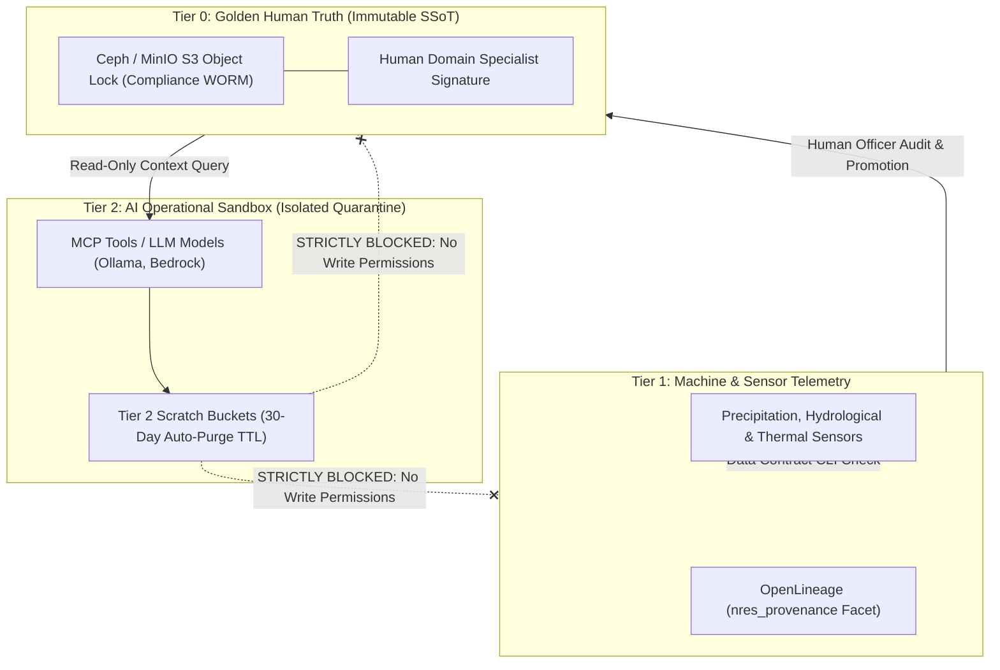

# The Human-to-AI Quarantine Model and Data Classification Topology

Establishing the BDA platform as an authoritative Single Source of Truth (SSoT) requires verifiable guarantees regarding the provenance, custody, and modification history of all ingested data.

---

## 🏛️ Three-Tier Data Classification & Quarantine Topology

The diagram below details the 3-tier data classification architecture, enforcing WORM Compliance Mode for Tier 0 Golden Human Truth and complete isolation for Tier 2 AI Sandboxes.

### 1. Standalone Production-Ready SVG Vector Graphic (`.svg`)

<svg xmlns="http://www.w3.org/2000/svg" viewBox="0 0 960 420" width="100%" height="100%">
  <defs>
    <marker id="arrow-quar" viewBox="0 0 10 10" refX="6" refY="5" markerWidth="6" markerHeight="6" orient="auto-start-reverse">
      <path d="M 0 0 L 10 5 L 0 10 z" fill="#64748B" />
    </marker>
    <filter id="shadow-quar" x="-4%" y="-4%" width="108%" height="108%">
      <feDropShadow dx="0" dy="2" stdDeviation="3" flood-color="#000000" flood-opacity="0.25"/>
    </filter>
  </defs>

  <!-- Background -->
  <rect width="960" height="420" fill="#0F172A" rx="10"/>

  <!-- Tier 0 Box -->
  <rect x="20" y="20" width="920" height="110" fill="#1E293B" stroke="#22C55E" stroke-width="1.5" rx="8" filter="url(#shadow-quar)"/>
  <rect x="20" y="20" width="920" height="26" fill="#065F46" rx="8"/>
  <text x="35" y="38" font-family="-apple-system, BlinkMacSystemFont, 'Segoe UI', Roboto, sans-serif" font-size="12" font-weight="bold" fill="#86EFAC">TIER 0: GOLDEN HUMAN TRUTH (IMMUTABLE AUTHORITATIVE SSOT)</text>

  <rect x="40" y="55" width="430" height="60" fill="#0F172A" stroke="#22C55E" rx="6"/>
  <text x="50" y="75" font-family="-apple-system, BlinkMacSystemFont, 'Segoe UI', Roboto, sans-serif" font-size="12" font-weight="bold" fill="#86EFAC">Ceph / MinIO S3 Object Lock (Compliance Mode WORM)</text>
  <text x="50" y="95" font-family="Consolas, Monaco, monospace" font-size="10" fill="#4ADE80">Certified Human Cryptographic Signatures Required</text>

  <rect x="490" y="55" width="430" height="60" fill="#0F172A" stroke="#22C55E" rx="6"/>
  <text x="500" y="75" font-family="-apple-system, BlinkMacSystemFont, 'Segoe UI', Roboto, sans-serif" font-size="12" font-weight="bold" fill="#86EFAC">Bitol ODCS v3.1.0 Contract Validation Gate</text>
  <text x="500" y="95" font-family="Consolas, Monaco, monospace" font-size="10" fill="#4ADE80">Strictly Zero Unvalidated AI Writes Permitted</text>

  <!-- Tier 1 Box -->
  <rect x="20" y="150" width="920" height="110" fill="#1E293B" stroke="#3B82F6" stroke-width="1.5" rx="8" filter="url(#shadow-quar)"/>
  <rect x="20" y="150" width="920" height="26" fill="#1E3A8A" rx="8"/>
  <text x="35" y="168" font-family="-apple-system, BlinkMacSystemFont, 'Segoe UI', Roboto, sans-serif" font-size="12" font-weight="bold" fill="#93C5FD">TIER 1: MACHINE TELEMETRY &amp; SENSOR INGESTION LAYER</text>

  <rect x="40" y="185" width="430" height="60" fill="#0F172A" stroke="#3B82F6" rx="6"/>
  <text x="50" y="205" font-family="-apple-system, BlinkMacSystemFont, 'Segoe UI', Roboto, sans-serif" font-size="12" font-weight="bold" fill="#93C5FD">Automated Sensor Feeds &amp; Governance Lock</text>
  <text x="50" y="225" font-family="Consolas, Monaco, monospace" font-size="10" fill="#60A5FA">Precipitation, Hydrological Logs, Thermal Satellites</text>

  <rect x="490" y="185" width="430" height="60" fill="#0F172A" stroke="#3B82F6" rx="6"/>
  <text x="500" y="205" font-family="-apple-system, BlinkMacSystemFont, 'Segoe UI', Roboto, sans-serif" font-size="12" font-weight="bold" fill="#93C5FD">OpenLineage nres_provenance Tracking</text>
  <text x="500" y="225" font-family="Consolas, Monaco, monospace" font-size="10" fill="#60A5FA">Human Audit &amp; Stewardship Required for Promotion</text>

  <!-- Tier 2 Box -->
  <rect x="20" y="280" width="920" height="120" fill="#1E293B" stroke="#EF4444" stroke-width="1.5" rx="8" filter="url(#shadow-quar)"/>
  <rect x="20" y="280" width="920" height="26" fill="#7F1D1D" rx="8"/>
  <text x="35" y="298" font-family="-apple-system, BlinkMacSystemFont, 'Segoe UI', Roboto, sans-serif" font-size="12" font-weight="bold" fill="#FCA5A5">TIER 2: AI OPERATIONAL &amp; ANALYTICAL SANDBOX (ISOLATED QUARANTINE)</text>

  <rect x="40" y="315" width="430" height="70" fill="#0F172A" stroke="#EF4444" rx="6"/>
  <text x="50" y="337" font-family="-apple-system, BlinkMacSystemFont, 'Segoe UI', Roboto, sans-serif" font-size="12" font-weight="bold" fill="#FCA5A5">Ephemeral Scratch Storage (30-Day Auto-Purge TTL)</text>
  <text x="50" y="357" font-family="Consolas, Monaco, monospace" font-size="10" fill="#EF4444">LLM Prompts, MCP Tool Outputs, Synthetic Scenarios</text>

  <rect x="490" y="315" width="430" height="70" fill="#0F172A" stroke="#EF4444" rx="6"/>
  <text x="500" y="337" font-family="-apple-system, BlinkMacSystemFont, 'Segoe UI', Roboto, sans-serif" font-size="12" font-weight="bold" fill="#FCA5A5">Strict One-Way Egress &amp; Read-Only Boundaries</text>
  <text x="500" y="357" font-family="Consolas, Monaco, monospace" font-size="10" fill="#EF4444">Write Privileges to Tier 0 / Tier 1 Permanently Blocked</text>

  <!-- Flow Arrow -->
  <line x1="255" y1="185" x2="255" y2="115" stroke="#22C55E" stroke-width="2" marker-end="url(#arrow-quar)"/>
  <text x="265" y="150" font-family="-apple-system, BlinkMacSystemFont, 'Segoe UI', Roboto, sans-serif" font-size="10" font-weight="bold" fill="#4ADE80">Certified Promotion (Human Sign-off)</text>

  <line x1="705" y1="315" x2="705" y2="245" stroke="#EF4444" stroke-width="2" stroke-dasharray="4,4"/>
  <text x="715" y="280" font-family="-apple-system, BlinkMacSystemFont, 'Segoe UI', Roboto, sans-serif" font-size="10" font-weight="bold" fill="#EF4444">BLOCKED (No Tier 1 Writes)</text>

  <line x1="705" y1="315" x2="705" y2="115" stroke="#EF4444" stroke-width="2" stroke-dasharray="4,4"/>
  <text x="715" y="150" font-family="-apple-system, BlinkMacSystemFont, 'Segoe UI', Roboto, sans-serif" font-size="10" font-weight="bold" fill="#EF4444">BLOCKED (No Tier 0 Writes)</text>
</svg>

### 2. Git-Native Mermaid Topology (`.mmd`)



### 3. Summary Interface & Routing Table

| Source Component | Target Component | Port / Protocol / API Ingress | Security Boundary / Access Key | Operational Significance / Flow Description |
| :--- | :--- | :--- | :--- | :--- |
| **Telemetry Sensor** | **Tier 1 Storage** | `TCP 8443` / HTTPS Data Contract | Ingress Token / Contract Schema | Streamed telemetry is validated against Bitol ODCS v3.1.0 contracts. |
| **Human Specialist** | **Tier 0 Storage** | HTTPS Web Portal / Keycloak | Cryptographic X.509 Signature | Promoted data receives official human sign-off and is locked under Compliance WORM. |
| **AI Agent / MCP Tool** | **Tier 0 Ceph/MinIO S3 &amp; PostgreSQL Master** | `TCP 5432` / PostgreSQL TLS 1.3 | Read-Only DB Session Scope | AI models query Tier 0 context via read-only PostgreSQL session roles and S3 read APIs without write access to master tables. |

---

## The Foundational Boundary Principle

The foundational principle governing the modernized BDA platform is that **institutional big data infrastructure must preserve, verify, and serve human knowledge compiled from certified authorities**.

Artificial intelligence technologies can assist with infrastructure orchestration, data normalization, anomaly detection, and query acceleration, but **AI must never act as an unverified author of ground-truth data**, nor can AI-generated synthetic records be intermingled with certified physical data.

---

## Three-Tier Physical & Logical Data Classification Topology

To institutionalize this boundary, the lakehouse architecture enforces a three-tier physical and logical data classification topology:

```
Tier 0: Golden Human Truth (Authoritative SSoT)
└── Immutable storage on MinIO/Ceph with S3 Object Lock (Compliance Mode)
└── Requires human cryptographic signatures and ODCS contract validation
└── Strictly zero unvalidated AI-generated records permitted

Tier 1: Machine and Sensor Ingestion
└── Storage on standard S3 buckets with Governance Mode Object Lock
└── Direct telemetry feeds: precipitation sensors, hydrological logs, thermal hotspots
└── Pre-ingestion validation via Data Contract CLI; human audit required for promotion

Tier 2: AI Operational and Analytical Sandbox (Isolated Quarantine)
└── Isolated object buckets with automated 30-day Time-To-Live (TTL) expiration
└── Ephemeral storage for LLM intermediate runs, synthetic models, and MCP outputs
└── Strict access barriers preventing automated writing or promotion to Tier 0
```

---

### Tier Detailed Specifications

#### Tier 0: Golden Human Truth (Authoritative SSoT)

- **Content:** Authoritative datasets verified and signed off by authorized human domain experts. Includes gazetted conservation reserves, certified geological hazard maps, borehole logs, official forest concession boundaries, and statutory environmental indices.
- **Storage Protection:** Dedicated object storage buckets configured with S3 Object Lock in **Compliance Mode**, rendering them completely immutable. No record can be committed to Tier 0 without carrying an authorized human specialist's cryptographic signature.

#### Tier 1: Machine and Sensor Ingestion

- **Content:** Raw telemetry streamed directly from physical instrumentation. Includes automated precipitation readings from rain gauges, river monitoring sensors, and thermal hotspot coordinates streamed from satellite feeds.
- **Storage Protection:** Object buckets with S3 Object Lock in **Governance Mode**. Records remain in Tier 1 until passing automated quality assertions and receiving human domain stewardship sign-off.

#### Tier 2: AI Operational and Analytical Sandbox

- **Content:** Ephemeral execution environment for synthetic simulations, exploratory model embeddings, predictive hazard scores, and intermediate outputs generated by Model Context Protocol (MCP) server pipelines.
- **Storage Protection:** Isolated object buckets with automated **30-day Time-To-Live (TTL)** expiration cycles. Storage policies strictly block Tier 2 from writing directly to Tier 0 or Tier 1.

---

## OpenLineage & `nres_provenance` Custom Facet

Data lineage and provenance across these tiers are enforced using the open-source **OpenLineage specification**. Every pipeline execution—whether managed by Apache Airflow, Apache Spark, or Trino—emits OpenLineage metadata events capturing execution context, job definitions, input dataset versions, output snapshots, and specialized dataset facets.

To trace human custody and ensure complete isolation from unverified AI data, the platform implements a mandatory custom OpenLineage facet named `nres_provenance`:

```json
{
  "nres_provenance": {
    "origin_type": "CERTIFIED_HUMAN_SURVEY",
    "verification_tier": "TIER_0_GOLDEN_SSOT",
    "human_author_id": "usr_domain_specialist_8842",
    "ai_generated_data": false,
    "payload_sha256": "e3b0c44298fc1c149afbf4c8996fb92427ae41e4649b934ca495991b7852b855"
  }
}
```

Through this facet, any dataset derived through automated transformations preserves an auditable record of every processing step, ensuring that data lineage can be traced back to the original certified field survey.

---

## Data Tier Governance Comparison Matrix

| Governance Parameter | Tier 0: Golden Human SSoT | Tier 1: Machine & Sensor Ingestion | Tier 2: AI Sandbox & Analytics |
| :--- | :--- | :--- | :--- |
| **Primary Institutional Purpose** | Authoritative national truth, statutory policy formulation, certified legal record. | Empirical environmental observation, telemetry aggregation, baseline monitoring. | Exploratory modelling, scenario simulation, predictive risk computation. |
| **Storage Technology & WORM Mode** | Distributed Object Store; S3 Object Lock in **Compliance Mode**. | Distributed Object Store; S3 Object Lock in **Governance Mode**. | Standard Object Store bucket; lifecycle rule with **30-day auto-purge TTL**. |
| **Allowable Ingestion Sources** | Certified human domain surveys, gazetted boundaries, signed departmental records. | Direct telemetry streams: precipitation gauges, water sensors, satellite thermal API. | Model outputs, MCP pipeline agents, synthetic climate projections. |
| **AI Role & Permissions** | Read-only access via certified tools. Zero automated AI write access permitted. | Machine learning models can execute cleansing, deduplication, and anomaly detection. | Unrestricted generative and predictive computation within sandboxed perimeter. |
| **Lineage & Validation Standard** | Mandatory ODCS v3.1.0 contract validation + OpenLineage `nres_provenance` signing. | Automated ODCS contract validation + deterministic quality assertion checks. | OpenLineage job execution tracking; outputs permanently tagged as `AI_GENERATED`. |
| **Promotion Criteria** | Terminal authoritative tier; updates require formal versioning and re-signing. | Promoted to Tier 0 only after automated DQ validation and human officer sign-off. | Cannot be promoted directly; requires distillation and formal human certification. |
