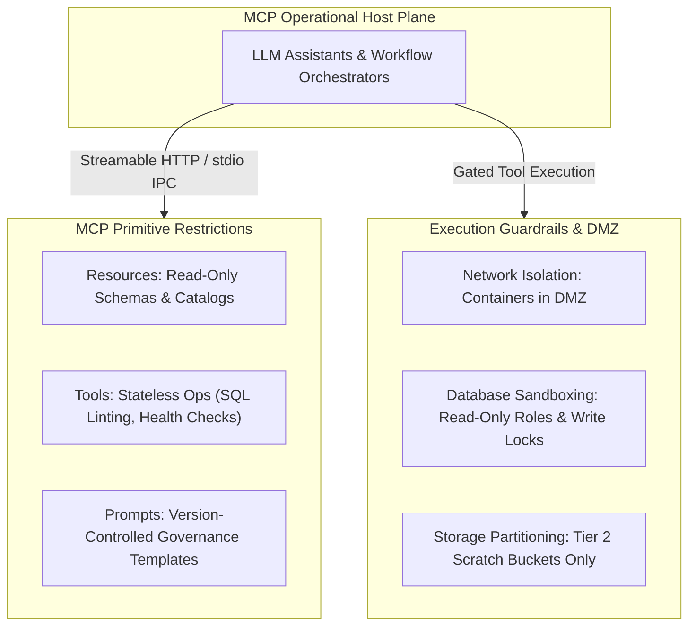
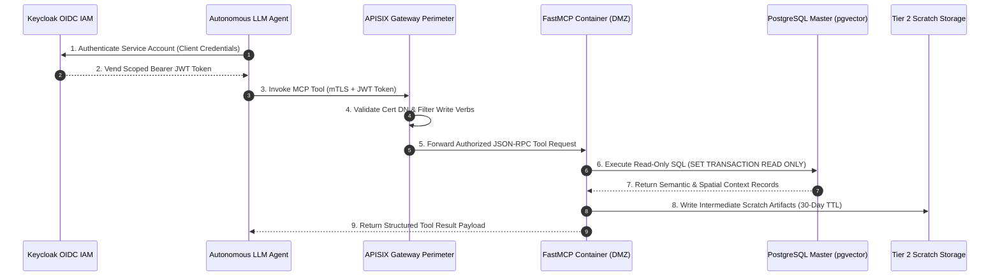

# Model Context Protocol (MCP) and AI Sandboxing Architecture

The integration of artificial intelligence within the modernized BDA architecture is designed around containment: **AI is utilized as an operational tool to optimize pipelines, assist data engineers, monitor operations, and automate metadata discovery, but it is strictly barred from modifying ground truth.**

---

## Architectural Principles & Standard Adoption

To standardize AI interactions while enforcing security boundaries, the platform implements the **Model Context Protocol (MCP)**, an open standard donated by Anthropic to the Agentic AI Foundation under the Linux Foundation. Operating over JSON-RPC 2.0, MCP replaces fragile custom model integrations by separating AI applications (hosts) from data sources and tools (servers).

### 1. Standalone Production-Ready SVG Vector Graphic (`.svg`)

<svg xmlns="http://www.w3.org/2000/svg" viewBox="0 0 920 420" width="100%" height="100%">
  <defs>
    <marker id="arrow-mcp" viewBox="0 0 10 10" refX="6" refY="5" markerWidth="6" markerHeight="6" orient="auto-start-reverse">
      <path d="M 0 0 L 10 5 L 0 10 z" fill="#64748B" />
    </marker>
  </defs>

  <!-- Canvas Background -->
  <rect width="920" height="420" fill="#0F172A" rx="10"/>

  <!-- Host Plane -->
  <rect x="20" y="20" width="880" height="80" fill="#1E293B" stroke="#334155" stroke-width="1.5" rx="8"/>
  <rect x="20" y="20" width="880" height="28" fill="#0F172A" rx="8"/>
  <text x="35" y="39" font-family="-apple-system, BlinkMacSystemFont, 'Segoe UI', Roboto, sans-serif" font-size="12" font-weight="bold" fill="#60A5FA">MCP OPERATIONAL HOST PLANE (LLM ASSISTANTS &amp; WORKFLOW ORCHESTRATORS)</text>
  <text x="35" y="65" font-family="Consolas, Monaco, monospace" font-size="11" fill="#38BDF8">JSON-RPC 2.0 over mTLS / Keycloak OIDC Authentication</text>

  <!-- Primitives Box -->
  <rect x="20" y="120" width="420" height="270" fill="#1E293B" stroke="#334155" stroke-width="1.5" rx="8"/>
  <rect x="20" y="120" width="420" height="28" fill="#0F172A" rx="8"/>
  <text x="35" y="139" font-family="-apple-system, BlinkMacSystemFont, 'Segoe UI', Roboto, sans-serif" font-size="12" font-weight="bold" fill="#4ADE80">MCP PRIMITIVE RESTRICTIONS</text>

  <rect x="35" y="160" width="390" height="60" fill="#0F172A" stroke="#334155" rx="6"/>
  <text x="45" y="180" font-family="-apple-system, BlinkMacSystemFont, 'Segoe UI', Roboto, sans-serif" font-size="12" font-weight="bold" fill="#86EFAC">Resources (Read-Only Interfaces)</text>
  <text x="45" y="200" font-family="-apple-system, BlinkMacSystemFont, 'Segoe UI', Roboto, sans-serif" font-size="11" fill="#94A3B8">• OpenMetadata schemas, catalogs &amp; data dictionaries</text>

  <rect x="35" y="230" width="390" height="60" fill="#0F172A" stroke="#334155" rx="6"/>
  <text x="45" y="250" font-family="-apple-system, BlinkMacSystemFont, 'Segoe UI', Roboto, sans-serif" font-size="12" font-weight="bold" fill="#86EFAC">Tools (Stateless Operations)</text>
  <text x="45" y="270" font-family="-apple-system, BlinkMacSystemFont, 'Segoe UI', Roboto, sans-serif" font-size="11" fill="#94A3B8">• SQL syntax linting &amp; Airflow health checks</text>

  <rect x="35" y="300" width="390" height="70" fill="#0F172A" stroke="#334155" rx="6"/>
  <text x="45" y="320" font-family="-apple-system, BlinkMacSystemFont, 'Segoe UI', Roboto, sans-serif" font-size="12" font-weight="bold" fill="#86EFAC">Prompts (Governance Templates)</text>
  <text x="45" y="340" font-family="-apple-system, BlinkMacSystemFont, 'Segoe UI', Roboto, sans-serif" font-size="11" fill="#94A3B8">• Deterministic templates enforcing domain rules</text>

  <!-- Execution Guardrails Box -->
  <rect x="480" y="120" width="420" height="270" fill="#1E293B" stroke="#334155" stroke-width="1.5" rx="8"/>
  <rect x="480" y="120" width="420" height="28" fill="#0F172A" rx="8"/>
  <text x="495" y="139" font-family="-apple-system, BlinkMacSystemFont, 'Segoe UI', Roboto, sans-serif" font-size="12" font-weight="bold" fill="#FBBF24">EXECUTION GUARDRAILS &amp; DMZ</text>

  <rect x="495" y="160" width="390" height="60" fill="#0F172A" stroke="#334155" rx="6"/>
  <text x="505" y="180" font-family="-apple-system, BlinkMacSystemFont, 'Segoe UI', Roboto, sans-serif" font-size="12" font-weight="bold" fill="#FDE68A">Network Isolation</text>
  <text x="505" y="200" font-family="-apple-system, BlinkMacSystemFont, 'Segoe UI', Roboto, sans-serif" font-size="11" fill="#94A3B8">• Docker/Kubernetes containers in dedicated DMZ</text>

  <rect x="495" y="230" width="390" height="60" fill="#0F172A" stroke="#334155" rx="6"/>
  <text x="505" y="250" font-family="-apple-system, BlinkMacSystemFont, 'Segoe UI', Roboto, sans-serif" font-size="12" font-weight="bold" fill="#FDE68A">Database Sandboxing</text>
  <text x="505" y="270" font-family="-apple-system, BlinkMacSystemFont, 'Segoe UI', Roboto, sans-serif" font-size="11" fill="#94A3B8">• Read-only roles &amp; transactional write locks</text>

  <rect x="495" y="300" width="390" height="70" fill="#0F172A" stroke="#F59E0B" rx="6"/>
  <text x="505" y="320" font-family="-apple-system, BlinkMacSystemFont, 'Segoe UI', Roboto, sans-serif" font-size="12" font-weight="bold" fill="#FDE68A">Storage Partitioning</text>
  <text x="505" y="340" font-family="-apple-system, BlinkMacSystemFont, 'Segoe UI', Roboto, sans-serif" font-size="11" fill="#94A3B8">• Zero Tier 0 access; writes limited to Tier 2 scratch</text>

  <!-- Connectors -->
  <line x1="230" y1="100" x2="230" y2="120" stroke="#64748B" stroke-width="1.5" marker-end="url(#arrow-mcp)"/>
  <rect x="180" y="102" width="100" height="16" fill="#1E3A8A" rx="3"/>
  <text x="185" y="114" font-family="Consolas, Monaco, monospace" font-size="9" fill="#93C5FD">JSON-RPC / mTLS</text>

  <line x1="690" y1="100" x2="690" y2="120" stroke="#64748B" stroke-width="1.5" marker-end="url(#arrow-mcp)"/>
  <rect x="635" y="102" width="110" height="16" fill="#065F46" rx="3"/>
  <text x="640" y="114" font-family="Consolas, Monaco, monospace" font-size="9" fill="#86EFAC">Gated Tool Exec</text>
</svg>

### 2. Git-Native Mermaid Topology (`.mmd`)

### 3. Summary Interface & Routing Table

| Source Component | Target Component | Port / Protocol / API Ingress | Security Boundary / Access Key | Operational Significance / Flow Description |
| :--- | :--- | :--- | :--- | :--- |
| **Remote AI Client / Host** | **Remote MCP Server** | `HTTPS / Streamable HTTP` (`TCP 443`) | APISIX Gateway / Keycloak OIDC JWT | Remote agent tool invocation over encrypted Streamable HTTP / SSE endpoints (filters write HTTP methods: allows POST for tool calls, blocks PUT/DELETE/PATCH). |
| **Local Coding Agent** | **Local MCP Server** | `stdio` (Process IPC / stdin/stdout) | OS Process Isolation / Read-Only Subprocess | Local AI agent subprocess execution without network listener or network auth overhead. |
| **MCP Tool Execution** | **Trino / PostgreSQL** | `TCP 8080` / `TCP 5432` (mTLS) | DMZ -> Database Read-Only Role | Executes read-only schema introspection and query syntax validation. |
| **MCP Server Output** | **Object Storage** | `TCP 9000` (S3 REST API) | DMZ -> Tier 2 Scratch Bucket | Confines all temporary model outputs and derived scratch data to Tier 2 storage. |

---

### Dual-Render Diagram 2: Zero-Trust MCP Agent Isolation & Keycloak OIDC Authentication Sequence

The diagram below details the second dual-render architecture spec for MCP Sandboxing: the zero-trust authentication, APISIX mTLS gateway route filtering, and read-only database execution sequence.

#### 1. Standalone Production-Ready SVG Vector Graphic (`.svg`)

<svg xmlns="http://www.w3.org/2000/svg" viewBox="0 0 960 400" width="100%" height="100%">
  <defs>
    <marker id="arrow-mcp-seq" viewBox="0 0 10 10" refX="6" refY="5" markerWidth="6" markerHeight="6" orient="auto-start-reverse">
      <path d="M 0 0 L 10 5 L 0 10 z" fill="#64748B" />
    </marker>
    <filter id="shadow-mcp-seq" x="-4%" y="-4%" width="108%" height="108%">
      <feDropShadow dx="0" dy="2" stdDeviation="3" flood-color="#000000" flood-opacity="0.25"/>
    </filter>
  </defs>

  <!-- Background -->
  <rect width="960" height="400" fill="#0F172A" rx="10"/>

  <!-- Keycloak IAM Box -->
  <rect x="20" y="20" width="280" height="100" fill="#1E293B" stroke="#3B82F6" stroke-width="1.5" rx="8" filter="url(#shadow-mcp-seq)"/>
  <rect x="20" y="20" width="280" height="26" fill="#1E3A8A" rx="8"/>
  <text x="35" y="38" font-family="-apple-system, BlinkMacSystemFont, 'Segoe UI', Roboto, sans-serif" font-size="12" font-weight="bold" fill="#93C5FD">1. KEYCLOAK OIDC FEDERATION</text>
  <text x="35" y="62" font-family="-apple-system, BlinkMacSystemFont, 'Segoe UI', Roboto, sans-serif" font-size="12" font-weight="bold" fill="#60A5FA">Service Account JWT Authentication</text>
  <text x="35" y="82" font-family="Consolas, Monaco, monospace" font-size="10" fill="#93C5FD">Client Credentials &amp; Read-Only Scopes</text>

  <!-- APISIX Gateway Box -->
  <rect x="340" y="20" width="280" height="100" fill="#1E293B" stroke="#38BDF8" stroke-width="1.5" rx="8" filter="url(#shadow-mcp-seq)"/>
  <rect x="340" y="20" width="280" height="26" fill="#0369A1" rx="8"/>
  <text x="350" y="38" font-family="-apple-system, BlinkMacSystemFont, 'Segoe UI', Roboto, sans-serif" font-size="12" font-weight="bold" fill="#E0F2FE">2. APISIX MTLS GATEWAY PERIMETER</text>
  <text x="350" y="62" font-family="-apple-system, BlinkMacSystemFont, 'Segoe UI', Roboto, sans-serif" font-size="12" font-weight="bold" fill="#38BDF8">mTLS Client Cert Verification</text>
  <text x="350" y="82" font-family="Consolas, Monaco, monospace" font-size="10" fill="#7DD3FC">HTTP Write Verb Filtering (PUT/DELETE/PATCH; POST for MCP Tool Invocation)</text>

  <!-- FastMCP Container Box -->
  <rect x="660" y="20" width="280" height="100" fill="#1E293B" stroke="#4ADE80" stroke-width="1.5" rx="8" filter="url(#shadow-mcp-seq)"/>
  <rect x="660" y="20" width="280" height="26" fill="#065F46" rx="8"/>
  <text x="670" y="38" font-family="-apple-system, BlinkMacSystemFont, 'Segoe UI', Roboto, sans-serif" font-size="12" font-weight="bold" fill="#86EFAC">3. FASTMCP DMZ CONTAINER</text>
  <text x="670" y="62" font-family="-apple-system, BlinkMacSystemFont, 'Segoe UI', Roboto, sans-serif" font-size="12" font-weight="bold" fill="#4ADE80">Isolated Podman / K8s Container</text>
  <text x="670" y="82" font-family="Consolas, Monaco, monospace" font-size="10" fill="#86EFAC">Read-Only SQL Session &amp; Tier 2 Write Only</text>

  <!-- Database Storage Target -->
  <rect x="20" y="260" width="920" height="110" fill="#1E293B" stroke="#C084FC" stroke-width="1.5" rx="8" filter="url(#shadow-mcp-seq)"/>
  <rect x="20" y="260" width="920" height="26" fill="#581C87" rx="8"/>
  <text x="35" y="278" font-family="-apple-system, BlinkMacSystemFont, 'Segoe UI', Roboto, sans-serif" font-size="12" font-weight="bold" fill="#E9D5FF">PROTECTED LAKEHOUSE &amp; OPERATIONAL DB (SET TRANSACTION READ ONLY)</text>

  <rect x="40" y="295" width="430" height="60" fill="#0F172A" stroke="#A855F7" rx="6"/>
  <text x="50" y="317" font-family="-apple-system, BlinkMacSystemFont, 'Segoe UI', Roboto, sans-serif" font-size="12" font-weight="bold" fill="#E9D5FF">PostgreSQL Master Hub (pgvector / PostGIS)</text>
  <text x="50" y="337" font-family="Consolas, Monaco, monospace" font-size="10" fill="#C084FC">Strict Read-Only SQL Roles &amp; Transaction Lock</text>

  <rect x="490" y="295" width="430" height="60" fill="#0F172A" stroke="#A855F7" rx="6"/>
  <text x="500" y="317" font-family="-apple-system, BlinkMacSystemFont, 'Segoe UI', Roboto, sans-serif" font-size="12" font-weight="bold" fill="#E9D5FF">Tier 2 Ephemeral AI Scratch Storage</text>
  <text x="500" y="337" font-family="Consolas, Monaco, monospace" font-size="10" fill="#C084FC">S3 Bucket s3://bda-tier2-scratch (30-Day TTL Purge)</text>

  <!-- Flow Lines -->
  <line x1="300" y1="70" x2="340" y2="70" stroke="#64748B" stroke-width="2" marker-end="url(#arrow-mcp-seq)"/>
  <line x1="620" y1="70" x2="660" y2="70" stroke="#64748B" stroke-width="2" marker-end="url(#arrow-mcp-seq)"/>

  <line x1="800" y1="120" x2="255" y2="295" stroke="#64748B" stroke-width="1.5" marker-end="url(#arrow-mcp-seq)"/>
  <line x1="800" y1="120" x2="705" y2="295" stroke="#64748B" stroke-width="1.5" marker-end="url(#arrow-mcp-seq)"/>
</svg>

#### 2. Git-Native Mermaid Topology (`.mmd`)

#### 3. Summary Interface & Routing Table

| Source Component | Target Component | Port / Protocol / API Ingress | Security Boundary / Access Key | Operational Significance / Flow Description |
| :--- | :--- | :--- | :--- | :--- |
| **LLM Agent** | **Keycloak IAM** | `TCP 8443` / OIDC HTTPS | Service Account Credentials | Authenticates agent and issues short-lived JWT token with read-only scopes. |
| **LLM Agent** | **APISIX Gateway** | `TCP 8443` / mTLS HTTPS | mTLS Client Certificate + JWT | Terminates mTLS, validates client DN, and blocks all write HTTP methods. |
| **MCP Container** | **PostgreSQL Hub** | `TCP 5432` / TLS 1.3 PostgreSQL | Read-Only Session Role | Executes controlled vector search queries; write transactions are aborted. |

---

## MCP Primitive Restrictions

The MCP specification articulates three server primitives: Resources, Tools, and Prompts. Strict constraints are enforced across each primitive:

1. **Resources (Read-Only Interfaces):** Provide read-only data interfaces through which an AI model can retrieve context without executing side effects. In BDA, Resources expose OpenMetadata data dictionaries, schema definitions, and sanitized database views, providing structural context while preventing direct access to sensitive raw data.
2. **Tools (Executable Functions):** Restricted exclusively to operational utilities, such as validating ODCS data contracts, parsing Trino SQL queries, inspecting Airflow DAG states, and running schema drift evaluations. All tools that could alter system state—such as SQL write operations (`INSERT`, `UPDATE`, `DELETE`, `DROP`), Iceberg commit mutations, or file deletions—are blocked at the API gateway.
3. **Prompts (Version-Controlled Templates):** Structured interaction templates enforcing governance standards across AI-assisted tasks.

---

## Execution Guardrails & Security Boundaries

To prevent unauthorized write access or unintentional data leakage, MCP servers operate within strict security boundaries:

- **Network Isolation:** Deployed within isolated Docker or Kubernetes containers inside a dedicated Demilitarized Zone (DMZ). External network connectivity is restricted, and communication with internal services is routed through Apache APISIX over Mutual TLS (mTLS) with Keycloak service account authentication.
- **Sandboxed Database Access:** Interfacing with database engines (Trino or PostgreSQL) is restricted to read-only service accounts operating with transactional read-only constraints (`SET SESSION CHARACTERISTICS AS TRANSACTION READ ONLY`) and denied write permissions on Tier 0 and Tier 1 schemas.
- **Ephemeral Analytics Storage:** In scenarios where AI models perform analytical inferencing—such as computing predictive hazard zones or simulating fire spread rates—all derived outputs are written to isolated Tier 2 scratch buckets.
- **Lineage Tagging:** The ingestion pipeline automatically tags intermediate records with `ai_generated_data: true` and `provenance_tier: TIER_2_SANDBOX` via the `nres_provenance` OpenLineage facet. These outputs remain isolated from Tier 0 golden datasets until an authorized domain specialist validates the methodology and cryptographically signs the data for promotion.

---

## Dedicated MCP Servers Matrix

| MCP Server Identifier | Business Domain Alignment | Operational Capability | Primitive Scope | Access Permissions and Safeguards |
| :--- | :--- | :--- | :--- | :--- |
| `mcp-catalog-context` | Enterprise-wide metadata management. | Exposes schema definitions, business glossary terms, and lineage graphs to assist analysts with semantic data discovery. | **Resources:** `schema://*` **Prompts:** `glossary_search` | OpenMetadata REST API; Read-only metadata token; zero data payload access. |
| `mcp-trino-query-gen` | Analytical domain query generation. | Translates natural language queries into optimized ANSI SQL for execution on Trino; validates query syntax and structure. | **Tools:** `validate_sql`, `explain_query` **Prompts:** `sql_assist` | Trino Query Engine; Read-only credentials; execution timeout limited to 30 seconds. |
| `mcp-pipeline-monitor` | Environmental ingestion telemetry. | Monitors Airflow DAG runs and NiFi data queues; identifies pipeline bottlenecks and alerts operators to backpressure issues. | **Tools:** `get_dag_status`, `read_flow_metrics` | Apache Airflow REST API & NiFi Diagnostics API; Read-only monitoring role. |
| `mcp-contract-linter` | Data governance and ingestion gates. | Validates draft data contracts against ODCS v3.1.0 specifications; analyzes proposed schema changes for backward compatibility. | **Tools:** `lint_contract`, `diff_schema` | Local isolated container execution; no network egress; ephemeral scratch memory. |
