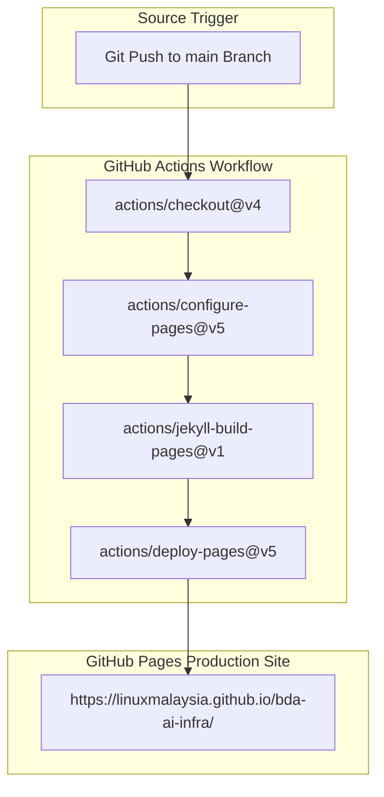

# 🚀 GitHub Pages Setup & Deployment Guide

This guide details how to configure GitHub Pages for automated building and publishing of documentation using Jekyll.

---

## 🏛️ GitHub Pages & Jekyll Deployment Workflow Topology

The diagram below outlines the GitHub Actions Jekyll deployment pipeline publishing the documentation site to GitHub Pages.

### 1. Standalone Production-Ready SVG Vector Graphic (`.svg`)

<svg xmlns="http://www.w3.org/2000/svg" viewBox="0 0 960 400" width="100%" height="100%">
  <defs>
    <marker id="arrow-ghp" viewBox="0 0 10 10" refX="6" refY="5" markerWidth="6" markerHeight="6" orient="auto-start-reverse">
      <path d="M 0 0 L 10 5 L 0 10 z" fill="#64748B" />
    </marker>
    <filter id="shadow-ghp" x="-4%" y="-4%" width="108%" height="108%">
      <feDropShadow dx="0" dy="2" stdDeviation="3" flood-color="#000000" flood-opacity="0.25"/>
    </filter>
  </defs>

  <!-- Background -->
  <rect width="960" height="400" fill="#0F172A" rx="10"/>

  <!-- Step 1: Git Push -->
  <rect x="20" y="20" width="920" height="80" fill="#1E293B" stroke="#334155" stroke-width="1.5" rx="8" filter="url(#shadow-ghp)"/>
  <rect x="20" y="20" width="920" height="26" fill="#0F172A" rx="8"/>
  <text x="35" y="38" font-family="-apple-system, BlinkMacSystemFont, 'Segoe UI', Roboto, sans-serif" font-size="12" font-weight="bold" fill="#60A5FA">SOURCE COMMIT &amp; TRIGGER TIER</text>

  <rect x="40" y="52" width="880" height="38" fill="#1E3A8A" stroke="#3B82F6" rx="4"/>
  <text x="50" y="75" font-family="-apple-system, BlinkMacSystemFont, 'Segoe UI', Roboto, sans-serif" font-size="12" font-weight="bold" fill="#93C5FD">Git Push to Main Branch → Trigger .github/workflows/jekyll-gh-pages.yml</text>

  <!-- Step 2: GitHub Actions -->
  <rect x="20" y="135" width="920" height="120" fill="#1E293B" stroke="#334155" stroke-width="1.5" rx="8" filter="url(#shadow-ghp)"/>
  <rect x="20" y="135" width="920" height="26" fill="#0F172A" rx="8"/>
  <text x="35" y="153" font-family="-apple-system, BlinkMacSystemFont, 'Segoe UI', Roboto, sans-serif" font-size="12" font-weight="bold" fill="#4ADE80">GITHUB ACTIONS BUILD &amp; BUNDLE RUNNER</text>

  <rect x="40" y="170" width="270" height="70" fill="#0F172A" stroke="#22C55E" rx="6"/>
  <text x="50" y="192" font-family="-apple-system, BlinkMacSystemFont, 'Segoe UI', Roboto, sans-serif" font-size="13" font-weight="bold" fill="#86EFAC">actions/checkout@v4</text>
  <text x="50" y="212" font-family="Consolas, Monaco, monospace" font-size="10" fill="#4ADE80">Pull Repository Master Branch</text>

  <rect x="345" y="170" width="270" height="70" fill="#0F172A" stroke="#22C55E" rx="6"/>
  <text x="355" y="192" font-family="-apple-system, BlinkMacSystemFont, 'Segoe UI', Roboto, sans-serif" font-size="13" font-weight="bold" fill="#86EFAC">jekyll-build-pages@v1</text>
  <text x="355" y="212" font-family="Consolas, Monaco, monospace" font-size="10" fill="#4ADE80">Compile _config.yml &amp; SASS CSS</text>

  <rect x="650" y="170" width="270" height="70" fill="#0F172A" stroke="#22C55E" rx="6"/>
  <text x="660" y="192" font-family="-apple-system, BlinkMacSystemFont, 'Segoe UI', Roboto, sans-serif" font-size="13" font-weight="bold" fill="#86EFAC">actions/deploy-pages@v5</text>
  <text x="660" y="212" font-family="Consolas, Monaco, monospace" font-size="10" fill="#4ADE80">Upload HTML Static Artifacts</text>

  <!-- Step 3: Published Site -->
  <rect x="20" y="285" width="920" height="85" fill="#1E293B" stroke="#334155" stroke-width="1.5" rx="8" filter="url(#shadow-ghp)"/>
  <rect x="20" y="285" width="920" height="26" fill="#0F172A" rx="8"/>
  <text x="35" y="303" font-family="-apple-system, BlinkMacSystemFont, 'Segoe UI', Roboto, sans-serif" font-size="12" font-weight="bold" fill="#FBBF24">LIVE PRODUCTION ENVIRONMENT</text>

  <rect x="40" y="318" width="880" height="42" fill="#0F172A" stroke="#F59E0B" rx="6"/>
  <text x="50" y="344" font-family="-apple-system, BlinkMacSystemFont, 'Segoe UI', Roboto, sans-serif" font-size="12" font-weight="bold" fill="#FDE68A">GitHub Pages HTTPS Endpoint (https://linuxmalaysia.github.io/bda-ai-infra/)</text>

  <!-- Connectors -->
  <line x1="480" y1="90" x2="175" y2="170" stroke="#64748B" stroke-width="1.5" marker-end="url(#arrow-ghp)"/>
  <line x1="175" y1="240" x2="480" y2="318" stroke="#64748B" stroke-width="1.5" marker-end="url(#arrow-ghp)"/>
  <line x1="480" y1="240" x2="480" y2="318" stroke="#64748B" stroke-width="1.5" marker-end="url(#arrow-ghp)"/>
  <line x1="785" y1="240" x2="480" y2="318" stroke="#64748B" stroke-width="1.5" marker-end="url(#arrow-ghp)"/>
</svg>

### 2. Git-Native Mermaid Topology (`.mmd`)



### 3. Summary Interface & Routing Table

| Source Component | Target Component | Port / Protocol / API Ingress | Security Boundary / Access Key | Operational Significance / Flow Description |
| :--- | :--- | :--- | :--- | :--- |
| **Git Push** | **GitHub Actions Runner** | HTTPS Webhook | GITHUB_TOKEN Secret | Automatically starts Jekyll site build on push to main branch. |
| **Jekyll Builder** | **GitHub Pages Environment** | Internal Artifact Upload | GitHub OIDC Deployment Token | Compiles Markdown documents, Liquid templates, and SASS stylesheets into static HTML. |


## Overview

GitHub Pages is configured using the official GitHub Actions workflow `.github/workflows/jekyll-gh-pages.yml`. On every push to the `main` branch, GitHub Actions builds the static site using Jekyll and deploys it to the `github-pages` environment.

## Step-by-Step Configuration

1. **Repository Settings**:
   - Navigate to **Settings > Pages** in your GitHub repository.
   - Under **Build and deployment > Source**, select **GitHub Actions**.

2. **Jekyll Configuration (`_config.yml`)**:
   - Ensure `_config.yml` at root specifies `url` and `baseurl`:
     ```yaml
     title: "BDA AI Infra :: Enterprise Big Data & AI Architecture"
     baseurl: "/bda-ai-infra"
     url: "https://linuxmalaysia.github.io"
     ```

3. **Workflow Verification**:
   - The workflow `.github/workflows/jekyll-gh-pages.yml` executes:
     - `actions/checkout@v4`
     - `actions/configure-pages@v5`
     - `actions/jekyll-build-pages@v1`
     - `actions/deploy-pages@v5`

4. **Automated Publishing**:
   - The site is automatically published at `https://linuxmalaysia.github.io/bda-ai-infra/`.
