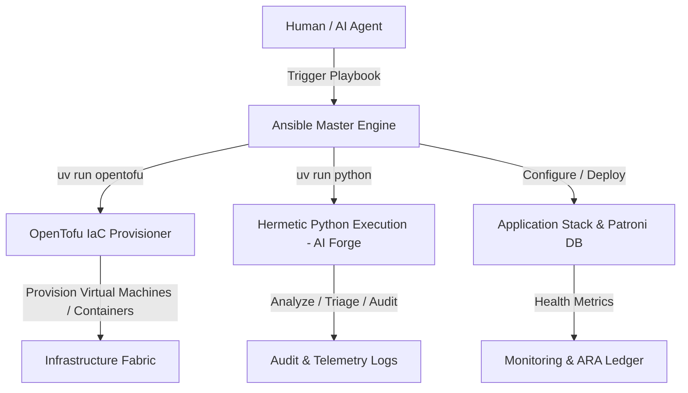

# 🛠️ Ansible, AI Forge, OpenTofu, and UV Python Integration Blueprint

This how-to guide details the strategic adoption and operational implementation of the **Ansible AI Forge** skill ecosystem, integrated with **Ansible**, **OpenTofu**, and the **`uv` Python toolchain** under the **Deep State of Mind (DSOM)** sovereign protocol.

---

## 🧭 4W1H Analysis & Architectural Strategy

### 1. Who? (Target Actors & Governance Roles)
- **Primary Orchestrator:** **Ansible Playbooks**, serving as the single deterministic gatekeeper and execution master.
- **Human Operators:** System Administrators and DevOps Engineers providing Human-in-the-Loop (HITL) approval, configuration parameters, and audit sign-offs.
- **Autonomous Cognitive AI Agents:** Digital twin agents (e.g., Google Jules, Claude Code) operating within strict DSOM constraints to trigger, generate, and validate playbook executions without running unverified raw shell commands.
- **Target Fabrics:** Sovereign enterprise infrastructure spanning local control nodes, Proxmox VE hosts, K3s/RKE2 Kubernetes clusters, Patroni PostgreSQL fabrics, and Ceph S3 storage tiers.

### 2. What? (Integrated Software Stack)
- **Ansible:** Core automation engine orchestrating workflow state, provisioning, configuration management, and tool invocations.
- **`uv` Python:** Hermetic, high-performance Python package manager and execution environment ensuring zero-global pollution and predictable runtime dependency isolation (`uv run`).
- **OpenTofu:** Infrastructure-as-Code (IaC) engine invoked by Ansible to manage declarative cloud, hypervisor, and container resources.
- **Ansible AI Forge Skills:** Standardised AI agent skills and module specifications adapted from `ansible-community/ai-forge` to enforce structured automation, triage, and lifecycle management.

### 3. When? (Lifecycle Operations & Execution Timing)
- **Day 0 (Installation & Bootstrapping):** Environment setup, hermetic Python environment initialization via `uv`, and OpenTofu provider initialization.
- **Day 1 (Configuration & Deployment):** Declarative infrastructure provisioning via OpenTofu followed by software configuration, database schema staging, and service deployment via Ansible playbooks.
- **Day 2 (Administration & Operations):** Continuous compliance auditing, zero-downtime rolling upgrades, credential rotation, and automated failover drills.
- **Day 2+ (Monitoring & Reporting):** Automated health metrics scraping, telemetry consolidation, ARA execution logging, and automated triage reporting.

### 4. Where? (Execution Boundary & Spatial Memory)
- **Control Plane:** Sovereign Control Nodes executing Ansible playbooks inside isolated `uv` virtual environments.
- **Spatial Memory:** Spatial state tracked in `.agents/brain/` (`task.md`, `walkthrough.md`, `palace_registry.md`, `active_context_manifest.md`).
- **Target Nodes:** Tier 1 to Tier 4 environment topologies managed via SSH passwordless access and rootless execution hooks.

### 5. How? (Execution Mechanics & Workflow Architecture)

Ansible serves as the top-level driver, wrapping OpenTofu and `uv` Python calls inside declarative playbook tasks:

<!-- SVG Vector Graphic: Print-Safe White Canvas -->
<svg xmlns="http://www.w3.org/2000/svg" viewBox="0 0 880 260" width="100%" height="auto" style="background-color: #FFFFFF; font-family: system-ui, -apple-system, sans-serif;">
  <rect x="10" y="10" width="860" height="240" rx="12" fill="#F8FAFC" stroke="#CBD5E1" stroke-width="1.5"/>
  <text x="440" y="38" fill="#0F172A" font-size="16" font-weight="bold" text-anchor="middle">Figure 1.1: Ansible + AI Forge + OpenTofu + uv Python Integration Fabric</text>

  <!-- Step 1 Card -->
  <rect x="30" y="65" width="180" height="150" rx="8" fill="#EFF6FF" stroke="#2563EB" stroke-width="1.5"/>
  <text x="120" y="90" fill="#1E40AF" font-size="14" font-weight="bold" text-anchor="middle">Human / AI Agent</text>
  <text x="120" y="112" fill="#0F172A" font-size="12" font-weight="bold" text-anchor="middle">Ansible Trigger</text>
  <rect x="45" y="145" width="150" height="50" rx="4" fill="#FFFFFF" stroke="#CBD5E1" stroke-width="1"/>
  <text x="120" y="165" fill="#1E293B" font-size="10" text-anchor="middle">Playbook Dispatch</text>
  <text x="120" y="180" fill="#1E293B" font-size="10" text-anchor="middle">Master Gatekeeper</text>

  <!-- Arrow 1-2 -->
  <path d="M 210 140 L 240 140" stroke="#2563EB" stroke-width="2" marker-end="url(#arrow)"/>

  <!-- Step 2 Card -->
  <rect x="240" y="65" width="180" height="150" rx="8" fill="#ECFDF5" stroke="#059669" stroke-width="1.5"/>
  <text x="330" y="90" fill="#065F46" font-size="14" font-weight="bold" text-anchor="middle">OpenTofu IaC</text>
  <text x="330" y="112" fill="#0F172A" font-size="12" font-weight="bold" text-anchor="middle">Provisioning</text>
  <rect x="255" y="145" width="150" height="50" rx="4" fill="#FFFFFF" stroke="#CBD5E1" stroke-width="1"/>
  <text x="330" y="165" fill="#1E293B" font-size="10" text-anchor="middle">VMs &amp; Containers</text>
  <text x="330" y="180" fill="#1E293B" font-size="10" text-anchor="middle">Inventory Staging</text>

  <!-- Arrow 2-3 -->
  <path d="M 420 140 L 450 140" stroke="#059669" stroke-width="2" marker-end="url(#arrow)"/>

  <!-- Step 3 Card -->
  <rect x="450" y="65" width="180" height="150" rx="8" fill="#FEF3C7" stroke="#D97706" stroke-width="1.5"/>
  <text x="540" y="90" fill="#92400E" font-size="14" font-weight="bold" text-anchor="middle">uv Python</text>
  <text x="540" y="112" fill="#0F172A" font-size="12" font-weight="bold" text-anchor="middle">AI Forge Skills</text>
  <rect x="465" y="145" width="150" height="50" rx="4" fill="#FFFFFF" stroke="#CBD5E1" stroke-width="1"/>
  <text x="540" y="165" fill="#1E293B" font-size="10" text-anchor="middle">Hermetic Execution</text>
  <text x="540" y="180" fill="#1E293B" font-size="10" text-anchor="middle">Triage &amp; Diagnostics</text>

  <!-- Arrow 3-4 -->
  <path d="M 630 140 L 660 140" stroke="#D97706" stroke-width="2" marker-end="url(#arrow)"/>

  <!-- Step 4 Card -->
  <rect x="660" y="65" width="180" height="150" rx="8" fill="#F3E8FF" stroke="#7C3AED" stroke-width="1.5"/>
  <text x="750" y="90" fill="#5B21B6" font-size="14" font-weight="bold" text-anchor="middle">Telemetry &amp; ARA</text>
  <text x="750" y="112" fill="#0F172A" font-size="12" font-weight="bold" text-anchor="middle">Audit Ledger</text>
  <rect x="675" y="145" width="150" height="50" rx="4" fill="#FFFFFF" stroke="#CBD5E1" stroke-width="1"/>
  <text x="750" y="165" fill="#1E293B" font-size="10" text-anchor="middle">ARA Records Ansible</text>
  <text x="750" y="180" fill="#1E293B" font-size="10" text-anchor="middle">Reporting Schema</text>

  <!-- Marker definition -->
  <defs>
    <marker id="arrow" viewBox="0 0 10 10" refX="5" refY="5" markerWidth="6" markerHeight="6" orient="auto-start-reverse">
      <path d="M 0 0 L 10 5 L 0 10 z" fill="#475569"/>
    </marker>
  </defs>
</svg>

### Git-Native Mermaid Topology



### Summary Routing Table

| Source Component | Target Component | Ingress Protocol | Security Boundary | Description |
| :--- | :--- | :--- | :--- | :--- |
| **OpenTofu IaC** | `opentofu apply` | Local Process | Control Plane | Reads `opentofu/main.tf` and generates inventory file |
| **`uv` Python** | `uv run python` | CLI Pipe | Hermetic Venv | Executes isolated Python scripts and diagnostic tools |
| **Ansible Core** | `ansible-playbook` | SSH Subsystem | Control Plane | Executes master playbooks for configuration and deployment |
| **AI Forge Skill** | `ansible-ai-forge-orchestrator` | Skill Manifest | Agent Boundary | Provides standardized automation and triage commands |
| **ARA Ledger** | `ARA Records Ansible` | Audit Stream | Audit Boundary | Captures play execution logs for governance reporting |

---

## 📋 Comprehensive Lifecycle Operations

### Step 1: Installation & Toolchain Bootstrapping
Ansible manages the installation and verification of `uv`, `opentofu`, and required Python dependencies without polluting system global packages:

```bash
# Verify hermetic uv environment
uv run python --version
uv run opentofu version
uv run ansible-playbook --version
```

### Step 2: Infrastructure Provisioning via OpenTofu
Ansible executes OpenTofu tasks using the `community.general.terraform` or `ansible.builtin.command` module wrapped inside `uv run`:

```yaml
- name: Provision Infrastructure with OpenTofu
  ansible.builtin.command:
    cmd: "opentofu apply -auto-approve"
    chdir: "{{ playbook_dir }}/../opentofu"
  register: opentofu_result
```

### Step 3: Software Configuration & Service Deployment
Once OpenTofu outputs target host IP addresses, Ansible dynamically populates the inventory and executes software configuration tasks across the node fabric.

### Step 4: System Administration & Governance
System maintenance, user access control, PGP key management, and security patch distributions are executed via modular Ansible roles structured under AI Forge conventions.

### Step 5: Continuous Monitoring & Telemetry
Ansible playbooks periodically execute health checks, collect system telemetry via `uv` Python scripts, and validate service health endpoints.

### Step 6: Automated Reporting & Audit Ledger
Execution logs and triage reports are compiled into markdown summaries, verified against JSON schemas, and recorded in ARA Records Ansible for complete operational auditability.

---

## 🛡️ DSOM Compliance & Sovereign Execution Rules

1. **The `uv` Mandate:** All Python scripts, CLI extensions, and helper tools MUST be invoked via `uv run` to guarantee deterministic dependency resolution.
2. **Ansible Master Driver Mandate:** Direct shell execution of OpenTofu or Python scripts on production hosts is prohibited; all actions must be dispatched through Ansible playbooks.
3. **Open Knowledge Format (OKF v0.2):** All generated operational documentation, runbooks, and triage reports MUST adhere to OKF v0.2 frontmatter specifications.
4. **Public-Safe Infrastructure Placeholders:** All IP addresses, hostnames, and credentials in documentation and playbooks MUST use RFC 5737 test IP addresses (e.g. `203.0.113.x`) and generic placeholders.
