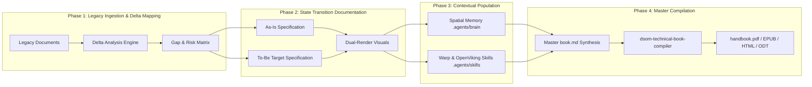

# DSOM 4-Phase Migration Blueprint & AI Skills Execution Guide

This guide provides step-by-step instructions for AI agents and ICT architects operating under the Deep State of Mind (DSOM) framework to execute legacy migrations, construct skill capabilities compliant with Warp and OpenViking specifications, and compile publication-grade technical handbooks.

---

## 🎨 Pipeline Architecture Overview

<!-- SVG Vector Graphic: Light Canvas Adaptable -->
<svg xmlns="http://www.w3.org/2000/svg" viewBox="0 0 880 260" width="100%" height="auto" style="background-color: #0F172A; font-family: system-ui, -apple-system, sans-serif;">
  <rect x="10" y="10" width="860" height="240" rx="12" fill="#1E293B" stroke="#334155" stroke-width="2"/>
  <text x="440" y="38" fill="#F8FAFC" font-size="16" font-weight="bold" text-anchor="middle">Figure 1.1: DSOM 4-Phase Migration &amp; Skills Execution Pipeline</text>

  <!-- Phase 1 Card -->
  <rect x="30" y="65" width="180" height="150" rx="8" fill="#0F172A" stroke="#3B82F6" stroke-width="2"/>
  <text x="120" y="90" fill="#60A5FA" font-size="14" font-weight="bold" text-anchor="middle">Phase 1</text>
  <text x="120" y="112" fill="#F8FAFC" font-size="12" font-weight="bold" text-anchor="middle">Legacy Ingestion</text>
  <text x="120" y="130" fill="#94A3B8" font-size="11" text-anchor="middle">&amp; Delta Mapping</text>
  <rect x="45" y="145" width="150" height="50" rx="4" fill="#1E293B" stroke="#475569" stroke-width="1"/>
  <text x="120" y="165" fill="#CBD5E1" font-size="10" text-anchor="middle">Parse Legacy Arch</text>
  <text x="120" y="180" fill="#CBD5E1" font-size="10" text-anchor="middle">Gap Analysis vs Target</text>

  <!-- Arrow 1-2 -->
  <path d="M 210 140 L 240 140" stroke="#3B82F6" stroke-width="2" marker-end="url(#arrow)"/>

  <!-- Phase 2 Card -->
  <rect x="240" y="65" width="180" height="150" rx="8" fill="#0F172A" stroke="#10B981" stroke-width="2"/>
  <text x="330" y="90" fill="#34D399" font-size="14" font-weight="bold" text-anchor="middle">Phase 2</text>
  <text x="330" y="112" fill="#F8FAFC" font-size="12" font-weight="bold" text-anchor="middle">State Transition</text>
  <text x="330" y="130" fill="#94A3B8" font-size="11" text-anchor="middle">Documentation</text>
  <rect x="255" y="145" width="150" height="50" rx="4" fill="#1E293B" stroke="#475569" stroke-width="1"/>
  <text x="330" y="165" fill="#CBD5E1" font-size="10" text-anchor="middle">As-Is vs To-Be Spec</text>
  <text x="330" y="180" fill="#CBD5E1" font-size="10" text-anchor="middle">Dual-Render Visuals</text>

  <!-- Arrow 2-3 -->
  <path d="M 420 140 L 450 140" stroke="#10B981" stroke-width="2" marker-end="url(#arrow)"/>

  <!-- Phase 3 Card -->
  <rect x="450" y="65" width="180" height="150" rx="8" fill="#0F172A" stroke="#F59E0B" stroke-width="2"/>
  <text x="540" y="90" fill="#FBBF24" font-size="14" font-weight="bold" text-anchor="middle">Phase 3</text>
  <text x="540" y="112" fill="#F8FAFC" font-size="12" font-weight="bold" text-anchor="middle">Contextual</text>
  <text x="540" y="130" fill="#94A3B8" font-size="11" text-anchor="middle">Population (DSOM)</text>
  <rect x="465" y="145" width="150" height="50" rx="4" fill="#1E293B" stroke="#475569" stroke-width="1"/>
  <text x="540" y="165" fill="#CBD5E1" font-size="10" text-anchor="middle">Populate .agents/brain</text>
  <text x="540" y="180" fill="#CBD5E1" font-size="10" text-anchor="middle">Warp/OpenViking Skills</text>

  <!-- Arrow 3-4 -->
  <path d="M 630 140 L 660 140" stroke="#F59E0B" stroke-width="2" marker-end="url(#arrow)"/>

  <!-- Phase 4 Card -->
  <rect x="660" y="65" width="180" height="150" rx="8" fill="#0F172A" stroke="#8B5CF6" stroke-width="2"/>
  <text x="750" y="90" fill="#A78BFA" font-size="14" font-weight="bold" text-anchor="middle">Phase 4</text>
  <text x="750" y="112" fill="#F8FAFC" font-size="12" font-weight="bold" text-anchor="middle">Master Compilation</text>
  <text x="750" y="130" fill="#94A3B8" font-size="11" text-anchor="middle">Publication Suite</text>
  <rect x="675" y="145" width="150" height="50" rx="4" fill="#1E293B" stroke="#475569" stroke-width="1"/>
  <text x="750" y="165" fill="#CBD5E1" font-size="10" text-anchor="middle">Pandoc / Chromium</text>
  <text x="750" y="180" fill="#CBD5E1" font-size="10" text-anchor="middle">PDF, EPUB, HTML, ODT</text>

  <!-- Marker definition -->
  <defs>
    <marker id="arrow" viewBox="0 0 10 10" refX="5" refY="5" markerWidth="6" markerHeight="6" orient="auto-start-reverse">
      <path d="M 0 0 L 10 5 L 0 10 z" fill="#94A3B8"/>
    </marker>
  </defs>
</svg>

### Git-Native Mermaid Topology



### Summary Interface Routing Table

| Phase | Input Artifact | Processing Engine / Tool | Output Artifact | Target Location |
| :--- | :--- | :--- | :--- | :--- |
| **Phase 1** | Legacy architectural docs | Context parsing & delta mapping | Delta Matrix & Technical Debt Assessment | Context Memory / `docs/reference/` |
| **Phase 2** | Delta Matrix | Git-native Markdown & SVG generator | As-Is vs To-Be Specs + Dual-Render Visuals | `docs/reference/`, `docs/explanation/` |
| **Phase 3** | Verified Transition Specs | OKF & Warp/OpenViking Skill Builders | Spatial Memory & Skill Definitions | `.agents/brain/`, `.agents/skills/` |
| **Phase 4** | Complete Markdown Palace | Pandoc, Edge/Chromium, `uv run python` | `handbook.pdf`, `handbook.epub`, `handbook.html` | Root `/`, `docs/`, `build/` |

---

## 🛠️ Step-by-Step Execution Blueprint

### Phase 1: Legacy Ingestion & Delta Mapping
1. **Context Ingestion:** Supply raw legacy architecture, deployment configurations, and database schemas into the AI context window.
2. **Structural Delta Evaluation:** Map legacy components directly against target self-hosted stack components:
   - Proprietary DBs $\rightarrow$ Percona Patroni PostgreSQL 18 with `pgvector` & `PostGIS`.
   - Legacy ETL / Cron $\rightarrow$ Apache NiFi 2.0 streaming pipelines.
   - Legacy BI $\rightarrow$ Apache Superset dashboards over Fusio API Gateway.
   - Proprietary SaaS AI $\rightarrow$ Self-hosted Model Context Protocol (MCP) server endpoints.
3. **Draft Gap Analysis:** Record technical debt, single-point-of-failure (SPOF) risks, and zero-trust security requirements.

### Phase 2: State Transition Documentation
1. **Define As-Is & To-Be States:** Create clear Markdown files in `docs/` detailing current operational realities alongside target modernised states.
2. **Incorporate Dual-Render Graphics:** Ensure every major architectural transition contains raw inline SVG vector graphics, Git-native Mermaid blocks, and interface summary routing tables.

### Phase 3: Contextual Population (DSOM)
1. **Update Spatial Memory:** Record active tasks and walkthrough logs in `.agents/brain/task.md` and `.agents/brain/walkthrough.md`.
2. **Register Warp & OpenViking Skills:** Create skills in `.agents/skills/<skill-name>/SKILL.md` satisfying:
   - **Warp Skill Spec:** `name`, `description`, Markdown instructions, parameter placeholders (`$ARGUMENTS`, `$0`).
   - **OpenViking Skill Spec:** `allowed-tools`, `tags`, `metadata` (`author`, `requires`), parameter breakdown, usage guidelines.
   - **OKF v0.2 Header:** Start on line 1, column 1 with valid trust metadata.

### Phase 4: Master Compilation
1. **Synthesise Palace:** Combine all documentation chapters into `build/book.md`.
2. **Execute Book Compiler:** Run the compilation script:
   ```bash
   uv run python .agents/skills/dsom-technical-book-compiler/scripts/compile-book.py
   ```
3. **Verify Deliverables:** Confirm generated artifacts (`handbook.pdf`, `handbook.epub`, `handbook.html`, `handbook.odt`) render cleanly with zero toner waste in print mode (`#FFFFFF` background).

---

## 📜 Verifying AI Skills Readiness

To verify that an AI skill is correctly registered and ready for execution:
1. Check that the skill directory exists under `.agents/skills/<skill-name>/SKILL.md`.
2. Execute static linter checks:
   ```bash
   npx markdownlint-cli --config .markdownlint.json "**/*.md"
   uv run ruff check .
   uv run pytest
   ```
3. Verify that the skill is listed in `.agents/brain/active_context_manifest.md` and `SUMMARY.md`.
