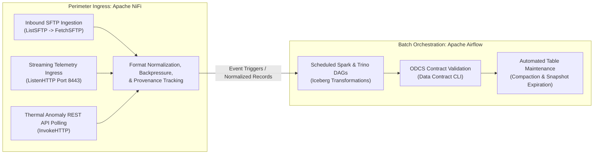
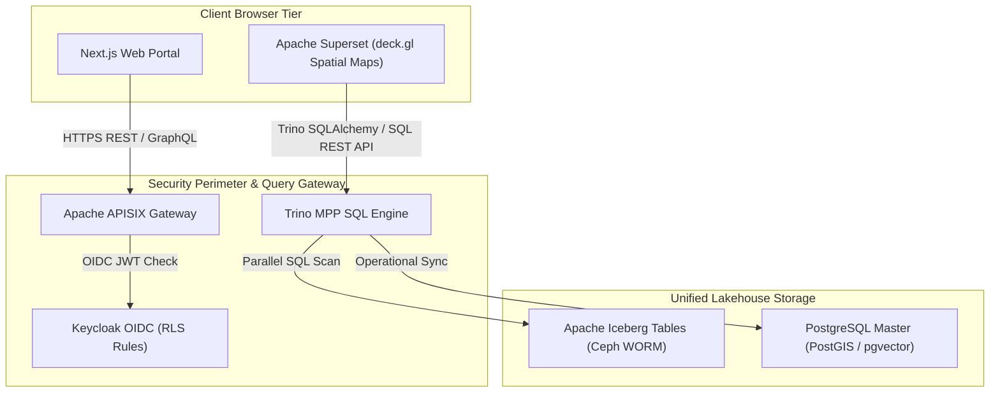

# Ingestion Pipeline, Application Portal, and Superset Modernization

Modernizing data ingestion, web application delivery, and visual analytics replaces manual processes and legacy software with an automated, observable, and modular open-source pipeline.

---

## 1. Decoupled Ingestion Framework (NiFi & Airflow)

Ingestion is overhauled by implementing a decoupled, event-driven framework using **Apache NiFi** and **Apache Airflow**:

### 1. Standalone Production-Ready SVG Vector Graphic (`.svg`)

<svg xmlns="http://www.w3.org/2000/svg" viewBox="0 0 920 400" width="100%" height="100%">
  <defs>
    <marker id="arrow-ing" viewBox="0 0 10 10" refX="6" refY="5" markerWidth="6" markerHeight="6" orient="auto-start-reverse">
      <path d="M 0 0 L 10 5 L 0 10 z" fill="#64748B" />
    </marker>
  </defs>

  <!-- Background -->
  <rect width="920" height="400" fill="#0F172A" rx="10"/>

  <!-- Subnet 1: Perimeter Ingress (NiFi) -->
  <rect x="20" y="20" width="420" height="360" fill="#1E293B" stroke="#334155" stroke-width="1.5" rx="8"/>
  <rect x="20" y="20" width="420" height="32" fill="#0F172A" rx="8"/>
  <text x="35" y="41" font-family="-apple-system, BlinkMacSystemFont, 'Segoe UI', Roboto, sans-serif" font-size="12" font-weight="bold" fill="#60A5FA">PERIMETER INGRESS: APACHE NIFI (STREAMING)</text>

  <rect x="40" y="70" width="380" height="80" fill="#0F172A" stroke="#334155" rx="6"/>
  <text x="50" y="92" font-family="-apple-system, BlinkMacSystemFont, 'Segoe UI', Roboto, sans-serif" font-size="13" font-weight="bold" fill="#F8FAFC">Telemetry &amp; SFTP Ingestion</text>
  <text x="50" y="112" font-family="Consolas, Monaco, monospace" font-size="10" fill="#60A5FA">ListSFTP -> FetchSFTP / ListenHTTP (Port 8443)</text>
  <text x="50" y="130" font-family="-apple-system, BlinkMacSystemFont, 'Segoe UI', Roboto, sans-serif" font-size="11" fill="#94A3B8">• Continuous precipitation &amp; sensor polling</text>

  <rect x="40" y="170" width="380" height="80" fill="#0F172A" stroke="#334155" rx="6"/>
  <text x="50" y="192" font-family="-apple-system, BlinkMacSystemFont, 'Segoe UI', Roboto, sans-serif" font-size="13" font-weight="bold" fill="#F8FAFC">REST API Polling Engine</text>
  <text x="50" y="212" font-family="Consolas, Monaco, monospace" font-size="10" fill="#38BDF8">InvokeHTTP (Thermal Anomaly API)</text>
  <text x="50" y="230" font-family="-apple-system, BlinkMacSystemFont, 'Segoe UI', Roboto, sans-serif" font-size="11" fill="#94A3B8">• Replaces manual email ingestion flows</text>

  <rect x="40" y="270" width="380" height="90" fill="#0F172A" stroke="#22C55E" rx="6"/>
  <text x="50" y="292" font-family="-apple-system, BlinkMacSystemFont, 'Segoe UI', Roboto, sans-serif" font-size="13" font-weight="bold" fill="#86EFAC">Backpressure &amp; Provenance</text>
  <text x="50" y="312" font-family="Consolas, Monaco, monospace" font-size="10" fill="#4ADE80">Format Normalization &amp; Audit Lineage</text>
  <text x="50" y="330" font-family="-apple-system, BlinkMacSystemFont, 'Segoe UI', Roboto, sans-serif" font-size="11" fill="#94A3B8">• Event-driven queue flow control</text>

  <!-- Subnet 2: Batch Orchestration (Airflow) -->
  <rect x="480" y="20" width="420" height="360" fill="#1E293B" stroke="#334155" stroke-width="1.5" rx="8"/>
  <rect x="480" y="20" width="420" height="32" fill="#0F172A" rx="8"/>
  <text x="495" y="41" font-family="-apple-system, BlinkMacSystemFont, 'Segoe UI', Roboto, sans-serif" font-size="12" font-weight="bold" fill="#FBBF24">BATCH ORCHESTRATION: APACHE AIRFLOW (DAGS)</text>

  <rect x="500" y="70" width="380" height="80" fill="#0F172A" stroke="#334155" rx="6"/>
  <text x="510" y="92" font-family="-apple-system, BlinkMacSystemFont, 'Segoe UI', Roboto, sans-serif" font-size="13" font-weight="bold" fill="#F8FAFC">Spark &amp; Trino Workflows</text>
  <text x="510" y="112" font-family="Consolas, Monaco, monospace" font-size="10" fill="#FBBF24">Airflow DAGs (Scheduled / Event Triggers)</text>
  <text x="510" y="130" font-family="-apple-system, BlinkMacSystemFont, 'Segoe UI', Roboto, sans-serif" font-size="11" fill="#94A3B8">• Distributed transformations on Iceberg</text>

  <rect x="500" y="170" width="380" height="80" fill="#0F172A" stroke="#334155" rx="6"/>
  <text x="510" y="192" font-family="-apple-system, BlinkMacSystemFont, 'Segoe UI', Roboto, sans-serif" font-size="13" font-weight="bold" fill="#F8FAFC">ODCS Contract Gates &amp; Lineage</text>
  <text x="510" y="212" font-family="Consolas, Monaco, monospace" font-size="10" fill="#60A5FA">Data Contract CLI &amp; OpenLineage</text>
  <text x="510" y="230" font-family="-apple-system, BlinkMacSystemFont, 'Segoe UI', Roboto, sans-serif" font-size="11" fill="#94A3B8">• Schema validation &amp; OpenMetadata sync</text>

  <rect x="500" y="270" width="380" height="90" fill="#0F172A" stroke="#F59E0B" rx="6"/>
  <text x="510" y="292" font-family="-apple-system, BlinkMacSystemFont, 'Segoe UI', Roboto, sans-serif" font-size="13" font-weight="bold" fill="#FDE68A">Iceberg Table Maintenance</text>
  <text x="510" y="312" font-family="Consolas, Monaco, monospace" font-size="10" fill="#FBBF24">Compaction &amp; Snapshot Purging</text>
  <text x="510" y="330" font-family="-apple-system, BlinkMacSystemFont, 'Segoe UI', Roboto, sans-serif" font-size="11" fill="#94A3B8">• Automated table optimization DAGs</text>

  <!-- Connector -->
  <line x1="440" y1="200" x2="480" y2="200" stroke="#64748B" stroke-width="2" marker-end="url(#arrow-ing)"/>
  <rect x="442" y="192" width="36" height="16" fill="#065F46" rx="3"/>
  <text x="445" y="204" font-family="Consolas, Monaco, monospace" font-size="9" fill="#86EFAC">REST</text>
</svg>

### 2. Git-Native Mermaid Topology (`.mmd`)

### 3. Summary Interface & Routing Table

| Source Component | Target Component | Port / Protocol / API Ingress | Security Boundary / Access Key | Operational Significance / Flow Description |
| :--- | :--- | :--- | :--- | :--- |
| **Departmental SFTP Server** | **Apache NiFi** | `ListSFTP -> FetchSFTP` (`TCP 22`) | Partner Network -> DMZ Ingestion | Inbound SFTP polling using ListSFTP and FetchSFTP processors. |
| **Telemetry Ingress Stream** | **Apache NiFi** | `ListenHTTP` (`TCP 8443` / HTTPS) | Boundary Perimeter -> DMZ Ingestion | Continuous streaming ingestion of precipitation telemetry payloads. |
| **Thermal Anomaly REST API** | **Apache NiFi** | `TCP 443` / HTTPS REST | External API -> Ingestion Queue | Replaces manual email parsing with automated REST polling via `InvokeHTTP`. |
| **Apache NiFi** | **Apache Airflow** | `TCP 8080` / REST Webhook | DMZ -> Batch Processing Tier | Triggers Airflow DAG execution upon buffer batch threshold or schedule completion. |
| **Apache Airflow** | **Spark / Trino / Iceberg** | `TCP 7077` / `TCP 8080` | Batch Tier -> Core Lakehouse | Executes SQL transformations, enforces ODCS contract gates, and purges Iceberg snapshots. |

### Ingress & Protocol Translation (Apache NiFi)

Apache NiFi is deployed at the network boundary to handle continuous, real-time data movement, protocol translation, and streaming ingestion. NiFi manages incoming external connections, monitors departmental SFTP drop locations, polls satellite thermal anomaly REST APIs, ingests rainfall telemetry streams, and validates incoming payloads with built-in backpressure management and provenance tracking.

### Batch Orchestration (Apache Airflow)

Apache Airflow acts as the centralized batch orchestrator, managing complex, scheduled Directed Acyclic Graphs (DAGs) across Apache Spark, Trino, and PostgreSQL. Airflow DAGs enforce data contract checks via the Data Contract CLI, extract OpenLineage events, trigger metadata updates in OpenMetadata, and schedule Iceberg table maintenance tasks (such as compaction and snapshot expiration).

---

### Dual-Render Diagram 2: Web Portal & Apache Superset Visualization Architecture

The diagram below details the presentation and access tier modernization, replacing proprietary BI servers with Next.js, APISIX, Keycloak IAM, and Apache Superset with native `deck.gl` geospatial rendering.

#### 1. Standalone Production-Ready SVG Vector Graphic (`.svg`)

<svg xmlns="http://www.w3.org/2000/svg" viewBox="0 0 960 400" width="100%" height="100%">
  <defs>
    <marker id="arrow-viz2" viewBox="0 0 10 10" refX="6" refY="5" markerWidth="6" markerHeight="6" orient="auto-start-reverse">
      <path d="M 0 0 L 10 5 L 0 10 z" fill="#64748B" />
    </marker>
    <filter id="shadow-viz2" x="-4%" y="-4%" width="108%" height="108%">
      <feDropShadow dx="0" dy="2" stdDeviation="3" flood-color="#000000" flood-opacity="0.25"/>
    </filter>
  </defs>

  <!-- Background -->
  <rect width="960" height="400" fill="#0F172A" rx="10"/>

  <!-- Client Browser Tier -->
  <rect x="20" y="20" width="920" height="80" fill="#1E293B" stroke="#334155" stroke-width="1.5" rx="8" filter="url(#shadow-viz2)"/>
  <rect x="20" y="20" width="920" height="26" fill="#0F172A" rx="8"/>
  <text x="35" y="38" font-family="-apple-system, BlinkMacSystemFont, 'Segoe UI', Roboto, sans-serif" font-size="12" font-weight="bold" fill="#38BDF8">CLIENT PRESENTATION &amp; GEOSPATIAL MAP BROWSER TIER</text>

  <rect x="40" y="52" width="430" height="38" fill="#0369A1" stroke="#38BDF8" rx="4"/>
  <text x="50" y="75" font-family="-apple-system, BlinkMacSystemFont, 'Segoe UI', Roboto, sans-serif" font-size="12" font-weight="bold" fill="#E0F2FE">Next.js Modern Web Portal &amp; React UI</text>

  <rect x="490" y="52" width="430" height="38" fill="#1E3A8A" stroke="#3B82F6" rx="4"/>
  <text x="500" y="75" font-family="-apple-system, BlinkMacSystemFont, 'Segoe UI', Roboto, sans-serif" font-size="12" font-weight="bold" fill="#93C5FD">Apache Superset deck.gl Spatial Maps (WebGL)</text>

  <!-- Security Perimeter Tier -->
  <rect x="20" y="135" width="920" height="120" fill="#1E293B" stroke="#334155" stroke-width="1.5" rx="8" filter="url(#shadow-viz2)"/>
  <rect x="20" y="135" width="920" height="26" fill="#0F172A" rx="8"/>
  <text x="35" y="153" font-family="-apple-system, BlinkMacSystemFont, 'Segoe UI', Roboto, sans-serif" font-size="12" font-weight="bold" fill="#4ADE80">PERIMETER ACCESS &amp; IDENTITY FEDERATION CORE</text>

  <rect x="40" y="170" width="270" height="70" fill="#0F172A" stroke="#22C55E" rx="6"/>
  <text x="50" y="192" font-family="-apple-system, BlinkMacSystemFont, 'Segoe UI', Roboto, sans-serif" font-size="13" font-weight="bold" fill="#86EFAC">Apache APISIX Gateway</text>
  <text x="50" y="212" font-family="Consolas, Monaco, monospace" font-size="10" fill="#4ADE80">JWT Validation &amp; Rate Limit</text>

  <rect x="345" y="170" width="270" height="70" fill="#0F172A" stroke="#22C55E" rx="6"/>
  <text x="355" y="192" font-family="-apple-system, BlinkMacSystemFont, 'Segoe UI', Roboto, sans-serif" font-size="13" font-weight="bold" fill="#86EFAC">Keycloak OIDC IAM</text>
  <text x="355" y="212" font-family="Consolas, Monaco, monospace" font-size="10" fill="#4ADE80">Row-Level Security (RLS) Scopes</text>

  <rect x="650" y="170" width="270" height="70" fill="#0F172A" stroke="#22C55E" rx="6"/>
  <text x="660" y="192" font-family="-apple-system, BlinkMacSystemFont, 'Segoe UI', Roboto, sans-serif" font-size="13" font-weight="bold" fill="#86EFAC">Trino Distributed SQL</text>
  <text x="660" y="212" font-family="Consolas, Monaco, monospace" font-size="10" fill="#4ADE80">SQLAlchemy Trino Connection</text>

  <!-- Core Storage Tier -->
  <rect x="20" y="285" width="920" height="90" fill="#1E293B" stroke="#334155" stroke-width="1.5" rx="8" filter="url(#shadow-viz2)"/>
  <rect x="20" y="285" width="920" height="26" fill="#0F172A" rx="8"/>
  <text x="35" y="303" font-family="-apple-system, BlinkMacSystemFont, 'Segoe UI', Roboto, sans-serif" font-size="12" font-weight="bold" fill="#C084FC">PERSISTENT ICEBERG LAKEHOUSE &amp; POSTGIS CORE</text>

  <rect x="40" y="320" width="880" height="42" fill="#0F172A" stroke="#A855F7" rx="6"/>
  <text x="50" y="346" font-family="-apple-system, BlinkMacSystemFont, 'Segoe UI', Roboto, sans-serif" font-size="12" font-weight="bold" fill="#E9D5FF">Apache Iceberg Tables (Ceph WORM) + PostgreSQL PostGIS / pgvector Master Hub</text>

  <!-- Connectors -->
  <line x1="255" y1="90" x2="175" y2="170" stroke="#64748B" stroke-width="1.5" marker-end="url(#arrow-viz2)"/>
  <line x1="705" y1="90" x2="785" y2="170" stroke="#64748B" stroke-width="1.5" marker-end="url(#arrow-viz2)"/>
  <line x1="310" y1="205" x2="345" y2="205" stroke="#64748B" stroke-width="1.5" marker-end="url(#arrow-viz2)"/>
  <line x1="785" y1="240" x2="480" y2="320" stroke="#64748B" stroke-width="1.5" marker-end="url(#arrow-viz2)"/>
</svg>

#### 2. Git-Native Mermaid Topology (`.mmd`)

#### 3. Summary Interface & Routing Table

| Source Component | Target Component | Port / Protocol / API Ingress | Security Boundary / Access Key | Operational Significance / Flow Description |
| :--- | :--- | :--- | :--- | :--- |
| **Next.js Web Portal** | **APISIX Gateway** | `TCP 443` / HTTPS REST | Keycloak Bearer JWT Token | Routes authenticated user requests to microservices and PostGIS endpoints. |
| **APISIX Gateway** | **Keycloak OIDC IAM** | `TCP 8443` / HTTPS OIDC | OAuth2 Realm Keys | Validates client bearer tokens and checks user roles before forwarding web requests. |
| **Apache Superset** | **Trino MPP Engine** | `TCP 8080` / SQL REST API (HTTPS/TLS with Certificate Validation) | OAuth2 RLS Scopes | Executes federated SQL spatial queries over HTTPS/TLS with certificate validation and renders hardware-accelerated `deck.gl` maps. |
| **Trino MPP Engine** | **Apache Iceberg Tables** | `TCP 8181` / Iceberg REST API | Keycloak Client Credentials | Queries and scans versioned Parquet table snapshots managed by Apache Polaris. |
| **Trino MPP Engine** | **PostgreSQL Master** | `TCP 5432` / PostgreSQL TLS 1.3 | mTLS Certificate / DB Service Key | Synchronizes operational spatial and vector metadata with PostgreSQL PostGIS/pgvector. |

---

## 2. Web Portal & Visualization Tier Modernization

### Web Portal Architecture (Next.js & APISIX)

The presentation and access tier is modernized by retiring legacy CMS and monolithic web application servers. They are replaced by a modern, decoupled web application developed using **Next.js / React** deployed in containerized environments behind **Apache APISIX**. The frontend communicates with backend services through secure GraphQL and REST APIs, using **Keycloak** for unified Single Sign-On across all user roles.

### Business Intelligence Overhaul (Apache Superset)

Proprietary BI server infrastructure—including worker nodes, load balancers, and desktop authoring licenses—is replaced by **Apache Superset**, an enterprise open-source business intelligence and data exploration platform.

- **Direct Trino Integration:** Apache Superset connects natively to Trino via SQLAlchemy, executing distributed queries directly over Apache Iceberg tables without per-seat licensing fees.
- **Geospatial Analytics with deck.gl:** For geospatial analytics, Superset natively integrates `deck.gl` visualization libraries, enabling hardware-accelerated rendering of complex spatial layers—including choropleths, point clusters, heatmaps, and 3D terrain grids—directly from GeoParquet and PostGIS geometries.
- **Row-Level Security (RLS):** Superset's Row-Level Security policies restrict spatial views based on Keycloak user roles, ensuring that department officers access only the geographic zones and data assets within their authorized administrative scope.

---

## 3. Implementation Step-by-Step

### Step 1: Deploy NiFi & Airflow Ingestion Flows

1. Configure NiFi processors to ingest telemetry via HTTPS streams and poll thermal anomaly REST APIs on schedule.
2. Embed `data-contract` CLI validation gates within NiFi processor flows and Airflow DAG entry points. Payloads failing validation are diverted to quarantine queues.

### Step 2: Configure Next.js Application & APISIX Routing

1. Containerize the Next.js web application and deploy behind APISIX.
2. Bind Keycloak OIDC authentication plugins in APISIX to secure `/api/*` endpoints.

### Step 3: Configure Apache Superset Dashboards & RLS

1. Connect Superset to Trino via SQLAlchemy URI (`trino://trino.internal.domain:8443/iceberg`).
2. Implement deck.gl spatial layers for hazard risk maps and active thermal risk grids.
3. Configure Row-Level Security (RLS) rules mapped to Keycloak domain roles.
