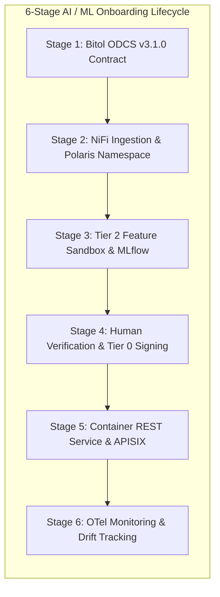

# How-To Guide: Onboarding and Scaling New AI/ML Business Cases

This guide provides data engineers, AI practitioners, and domain managers with a step-by-step operational procedure for rapidly prototyping, sandboxing, validating, and deploying new **Machine Learning (ML) and Artificial Intelligence (AI)** business cases onto the BDA Single Source of Truth (SSoT) Lakehouse.

---

## 🏛️ 6-Stage AI/ML Onboarding Pipeline Topology

The diagram below details the 6-stage operational pipeline for onboarding new AI business cases, maintaining strict zero-trust quarantine and human sign-off.

### 1. Standalone Production-Ready SVG Vector Graphic (`.svg`)

<svg xmlns="http://www.w3.org/2000/svg" viewBox="0 0 960 420" width="100%" height="100%">
  <defs>
    <marker id="arrow-onb" viewBox="0 0 10 10" refX="6" refY="5" markerWidth="6" markerHeight="6" orient="auto-start-reverse">
      <path d="M 0 0 L 10 5 L 0 10 z" fill="#64748B" />
    </marker>
    <filter id="shadow-onb" x="-4%" y="-4%" width="108%" height="108%">
      <feDropShadow dx="0" dy="2" stdDeviation="3" flood-color="#000000" flood-opacity="0.25"/>
    </filter>
  </defs>

  <!-- Background -->
  <rect width="960" height="420" fill="#0F172A" rx="10"/>

  <!-- Stage 1 Box -->
  <rect x="20" y="20" width="280" height="110" fill="#1E293B" stroke="#38BDF8" stroke-width="1.5" rx="8" filter="url(#shadow-onb)"/>
  <rect x="20" y="20" width="280" height="26" fill="#0369A1" rx="8"/>
  <text x="30" y="38" font-family="-apple-system, BlinkMacSystemFont, 'Segoe UI', Roboto, sans-serif" font-size="11" font-weight="bold" fill="#E0F2FE">STAGE 1: CONTRACT FORMULATION</text>
  <text x="30" y="62" font-family="-apple-system, BlinkMacSystemFont, 'Segoe UI', Roboto, sans-serif" font-size="12" font-weight="bold" fill="#38BDF8">Bitol ODCS v3.1.0 Contract</text>
  <text x="30" y="82" font-family="Consolas, Monaco, monospace" font-size="10" fill="#7DD3FC">YAML Schema &amp; Quality Rules</text>
  <text x="30" y="100" font-family="-apple-system, BlinkMacSystemFont, 'Segoe UI', Roboto, sans-serif" font-size="11" fill="#E2E8F0">• Local Contract CLI Validation</text>

  <!-- Stage 2 Box -->
  <rect x="340" y="20" width="280" height="110" fill="#1E293B" stroke="#3B82F6" stroke-width="1.5" rx="8" filter="url(#shadow-onb)"/>
  <rect x="340" y="20" width="280" height="26" fill="#1E3A8A" rx="8"/>
  <text x="350" y="38" font-family="-apple-system, BlinkMacSystemFont, 'Segoe UI', Roboto, sans-serif" font-size="11" font-weight="bold" fill="#93C5FD">STAGE 2: CATALOG &amp; INGESTION</text>
  <text x="350" y="62" font-family="-apple-system, BlinkMacSystemFont, 'Segoe UI', Roboto, sans-serif" font-size="12" font-weight="bold" fill="#60A5FA">Apache NiFi &amp; OpenMetadata</text>
  <text x="350" y="82" font-family="Consolas, Monaco, monospace" font-size="10" fill="#93C5FD">Polaris REST Namespace Provisioning</text>
  <text x="350" y="100" font-family="-apple-system, BlinkMacSystemFont, 'Segoe UI', Roboto, sans-serif" font-size="11" fill="#E2E8F0">• Ingress Validation &amp; Classification</text>

  <!-- Stage 3 Box -->
  <rect x="660" y="20" width="280" height="110" fill="#1E293B" stroke="#A855F7" stroke-width="1.5" rx="8" filter="url(#shadow-onb)"/>
  <rect x="660" y="20" width="280" height="26" fill="#581C87" rx="8"/>
  <text x="670" y="38" font-family="-apple-system, BlinkMacSystemFont, 'Segoe UI', Roboto, sans-serif" font-size="11" font-weight="bold" fill="#E9D5FF">STAGE 3: TIER 2 AI SANDBOXING</text>
  <text x="670" y="62" font-family="-apple-system, BlinkMacSystemFont, 'Segoe UI', Roboto, sans-serif" font-size="12" font-weight="bold" fill="#C084FC">Feature Store &amp; Local Embeddings</text>
  <text x="670" y="82" font-family="Consolas, Monaco, monospace" font-size="10" fill="#E9D5FF">DuckDB vss / MLflow Tracking</text>
  <text x="670" y="100" font-family="-apple-system, BlinkMacSystemFont, 'Segoe UI', Roboto, sans-serif" font-size="11" fill="#E2E8F0">• 30-Day Auto-Purge TTL</text>

  <!-- Stage 4 Box -->
  <rect x="660" y="155" width="280" height="110" fill="#1E293B" stroke="#22C55E" stroke-width="1.5" rx="8" filter="url(#shadow-onb)"/>
  <rect x="660" y="155" width="280" height="26" fill="#065F46" rx="8"/>
  <text x="670" y="173" font-family="-apple-system, BlinkMacSystemFont, 'Segoe UI', Roboto, sans-serif" font-size="11" font-weight="bold" fill="#86EFAC">STAGE 4: VERIFICATION &amp; SIGN-OFF</text>
  <text x="670" y="197" font-family="-apple-system, BlinkMacSystemFont, 'Segoe UI', Roboto, sans-serif" font-size="12" font-weight="bold" fill="#4ADE80">Human Domain Expert Audit</text>
  <text x="670" y="217" font-family="Consolas, Monaco, monospace" font-size="10" fill="#86EFAC">OpenLineage nres_provenance Facet</text>
  <text x="670" y="235" font-family="-apple-system, BlinkMacSystemFont, 'Segoe UI', Roboto, sans-serif" font-size="11" fill="#E2E8F0">• Cryptographic Signing to Tier 0</text>

  <!-- Stage 5 Box -->
  <rect x="340" y="155" width="280" height="110" fill="#1E293B" stroke="#F59E0B" stroke-width="1.5" rx="8" filter="url(#shadow-onb)"/>
  <rect x="340" y="155" width="280" height="26" fill="#78350F" rx="8"/>
  <text x="350" y="173" font-family="-apple-system, BlinkMacSystemFont, 'Segoe UI', Roboto, sans-serif" font-size="11" font-weight="bold" fill="#FDE68A">STAGE 5: PRODUCTION DEPLOYMENT</text>
  <text x="350" y="197" font-family="-apple-system, BlinkMacSystemFont, 'Segoe UI', Roboto, sans-serif" font-size="12" font-weight="bold" fill="#FBBF24">vLLM / Ollama Container &amp; APISIX</text>
  <text x="350" y="217" font-family="Consolas, Monaco, monospace" font-size="10" fill="#FDE68A">Keycloak OIDC &amp; Rate Limiting</text>
  <text x="350" y="235" font-family="-apple-system, BlinkMacSystemFont, 'Segoe UI', Roboto, sans-serif" font-size="11" fill="#E2E8F0">• Apache Superset Spatial Map</text>

  <!-- Stage 6 Box -->
  <rect x="20" y="155" width="280" height="110" fill="#1E293B" stroke="#EC4899" stroke-width="1.5" rx="8" filter="url(#shadow-onb)"/>
  <rect x="20" y="155" width="280" height="26" fill="#831843" rx="8"/>
  <text x="30" y="173" font-family="-apple-system, BlinkMacSystemFont, 'Segoe UI', Roboto, sans-serif" font-size="11" font-weight="bold" fill="#FBCFE8">STAGE 6: OTEL LIFECYCLE MONITORING</text>
  <text x="30" y="197" font-family="-apple-system, BlinkMacSystemFont, 'Segoe UI', Roboto, sans-serif" font-size="12" font-weight="bold" fill="#F472B6">OpenTelemetry Collector &amp; Grafana</text>
  <text x="30" y="217" font-family="Consolas, Monaco, monospace" font-size="10" fill="#FBCFE8">Inference Latency &amp; Concept Drift</text>
  <text x="30" y="235" font-family="-apple-system, BlinkMacSystemFont, 'Segoe UI', Roboto, sans-serif" font-size="11" fill="#E2E8F0">• SLA Alerts &amp; Continuous Retraining</text>

  <!-- Connectors -->
  <line x1="300" y1="75" x2="340" y2="75" stroke="#64748B" stroke-width="2" marker-end="url(#arrow-onb)"/>
  <line x1="620" y1="75" x2="660" y2="75" stroke="#64748B" stroke-width="2" marker-end="url(#arrow-onb)"/>
  <line x1="800" y1="130" x2="800" y2="155" stroke="#64748B" stroke-width="2" marker-end="url(#arrow-onb)"/>
  <line x1="660" y1="210" x2="620" y2="210" stroke="#64748B" stroke-width="2" marker-end="url(#arrow-onb)"/>
  <line x1="340" y1="210" x2="300" y2="210" stroke="#64748B" stroke-width="2" marker-end="url(#arrow-onb)"/>
</svg>

### 2. Git-Native Mermaid Topology (`.mmd`)



### 3. Summary Interface & Routing Table

| Source Component | Target Component | Port / Protocol / API Ingress | Security Boundary / Access Key | Operational Significance / Flow Description |
| :--- | :--- | :--- | :--- | :--- |
| **Contract Linter** | **Apache NiFi Ingestion** | Local CLI / `TCP 8443` | ODCS Contract Spec | Ensures incoming training telemetry matches schema bounds before pipeline entry. |
| **Feature Extractor** | **Tier 2 AI Sandbox** | S3 API / `s3://bda-tier2-ai-sandbox` | S3 IAM Vended Token | Stores intermediate feature matrices in ephemeral storage with 30-day auto-purge TTL. |
| **Inference Container** | **APISIX Gateway** | `TCP 8000` / HTTPS REST | Keycloak OAuth2 JWT | Exposes model predictions securely behind rate-limiting and OTel tracing filters. |


---

## The 6-Stage Lifecycle Blueprint

To maintain zero-trust security and data sovereignty while encouraging rapid AI innovation, every new AI business case follows a mandatory 6-stage operational pipeline:

```
[ Stage 1: Contract Formulation ] ──> [ Stage 2: Catalog & Ingestion ] ──> [ Stage 3: Tier 2 AI Sandboxing ]
                                                                                   │
[ Stage 6: OTel Lifecycle Monitoring ] <── [ Stage 5: Production Deployment ] <── [ Stage 4: Verification & Sign-Off ]
```

---

## Step-by-Step Execution Guide

### Stage 1: Business Case Definition & ODCS Contract Formulation

1. **Define Business Objectives & Metrics:** Document the core mandate, targeted domain (e.g., deforestation detection, disaster dispatching), required prediction frequency, and key performance indicators (KPIs).
2. **Formulate ODCS v3.1.0 Data Contract:** Create a YAML specification defining input schema requirements, acceptable field bounds, spatial coordinate systems (`EPSG:4326` or `EPSG:3168`), and data quality rules.

   ```yaml
   # example-ai-business-case-contract.yaml
   apiVersion: v3.1.0
   kind: DataContract
   id: contract-deforestation-alert-v1
   version: 1.0.0
   dataset: raw_deforestation_canopy_telemetry
   domain: Environmental_Monitoring
   owner: domain_specialist_team
   schema:
     deforestation_canopy_telemetry:
       logicalType: object
       properties:
         image_id:
           logicalType: string
           required: true
         acquisition_timestamp:
           logicalType: timestamp
           required: true
         canopy_loss_percentage:
           logicalType: number
           required: true
           logicalTypeOptions:
             minimum: 0.0
             maximum: 100.0
         geometry_wkt:
           logicalType: string
           required: true
   ```

3. **Validate Contract:** Run the local contract linter via CLI:
   ```bash
   datacontract lint example-ai-business-case-contract.yaml
   ```

---

### Stage 2: Ingestion Pipeline & Catalog Registration

1. **Provision Ingestion Pipeline in Apache NiFi:** Configure a NiFi process group to ingest incoming telemetry (REST API, Webhook, or S3 bucket notification) and route records through the ODCS contract validation processor.
2. **Register Metadata in OpenMetadata:** Attach domain tags, classification tags (`Classification.Internal`, `Domain.Forestry`), and security classifications.
3. **Configure Polaris REST Catalog Namespace:** Register the target Apache Iceberg namespace under Apache Polaris using HTTPS with TLS certificate verification over secure internal networks (e.g. `https://polaris.internal:8182/api/catalog/v1/{catalog}/namespaces`). Where mTLS service mesh sidecars (e.g., Linkerd or Istio) secure this internal endpoint, explicit cryptographic identity verification is enforced alongside the bearer token:
   ```bash
   # Register namespace via Polaris REST API over HTTPS with catalog identifier 'bda_catalog'
   curl -X POST https://polaris.internal:8182/api/catalog/v1/bda_catalog/namespaces \
     -H "Authorization: Bearer ${POLARIS_TOKEN}" \
     -H "Content-Type: application/json" \
     -d '{"namespace": ["environmental", "deforestation"]}'
   ```

---

### Stage 3: Feature Engineering & Tier 2 AI Sandboxing

1. **Target Tier 2 Scratch Buckets:** Configure feature extraction pipelines (Apache Spark / Sedona or DuckDB) to write intermediate datasets exclusively to Tier 2 Object Storage (`s3://bda-tier2-ai-sandbox/`).
   *Note: Tier 2 storage enforces an automated 30-day auto-purge TTL.*
2. **Generate Local Vector Embeddings:** Run zero-trust local embedding extraction on metadata and schema descriptions using local sentence transformers (`all-MiniLM-L6-v2`), materializing vector embeddings into DuckDB `vss` fixed-size `ARRAY` columns or `pgvector` tables.
3. **MLflow Experiment Tracking:** Log training parameters, metrics, and model artifacts into the local MLflow registry:
   ```python
   import mlflow

   mlflow.set_tracking_uri("http://mlflow.internal:5000")
   mlflow.set_experiment("deforestation_detection_v1")

   with mlflow.start_run():
       mlflow.log_param("model_type", "RandomForestSpatial")
       mlflow.log_metric("f1_score", 0.942)
       mlflow.sklearn.log_model(model, "model")
   ```

---

### Stage 4: Model Validation & Human Cryptographic Sign-Off

1. **Verify Human-to-AI Quarantine Boundary:** Confirm that model outputs are tagged with the custom OpenLineage facet `nres_provenance`:
   ```json
   {
     "nres_provenance": {
       "origin_type": "AI_SANDBOX_MODEL_OUTPUT",
       "verification_tier": "TIER_2_SANDBOX",
       "ai_generated_data": true,
       "payload_sha256": "8f4e2b..."
     }
   }
   ```
2. **Domain Specialist Review:** Domain experts inspect model predictions, precision/recall curves, and spatial heatmaps.
3. **Cryptographic Promotion to Tier 0 SSoT:** Once approved, the authorized specialist signs the record payload using their private key. The pipeline then commits the golden dataset into Tier 0 WORM storage (`s3://bda-tier0-golden/`).

---

### Stage 5: Production Container Deployment & APISIX API Exposure

1. **Deploy Local Inference Endpoint:** Package the validated ML model into a containerized REST service (vLLM, Ollama, or Triton Inference Server) running in the production Kubernetes cluster.
2. **Register Route in Apache APISIX Gateway:** Configure APISIX to proxy API traffic to the inference endpoint, attaching Keycloak OIDC authentication and rate-limiting plugins:
   ```json
   {
     "uri": "/api/v1/predict/deforestation",
     "plugins": {
       "openid-connect": {
         "client_id": "bda-ai-service",
         "discovery": "http://keycloak:8080/realms/bda/.well-known/openid-configuration"
       },
       "limit-req": {
         "rate": 100,
         "burst": 20,
         "key": "remote_addr"
       },
       "opentelemetry": {
         "sampler": { "type": "always_on" }
       }
     },
     "upstream": {
       "type": "roundrobin",
       "nodes": { "deforestation-inference-svc:8000": 1 }
     }
   }
   ```
3. **Integrate with Apache Superset:** Create custom deck.gl spatial visualization layers or dashboards connected via Trino to present real-time model predictions.

---

### Stage 6: Full-Stack OTel Monitoring & Drift Management

1. **Attach OpenTelemetry Collector:** Ensure the inference container emits OTLP metrics, traces, and logs.
2. **Monitor Drift in Grafana:** Track key operational metrics across Grafana dashboards:
   - **Data Drift & Concept Drift:** Monitor input feature distribution shifts vs. baseline training data.
   - **Inference Latency:** Target SLA < 200ms for REST scoring API endpoints.
   - **Error & Anomaly Rates:** Alert operators if model prediction confidence drops below configured thresholds.

---

## Onboarding Checklist

| Verification Checklist Item | Primary Tool / Platform | Status |
| :--- | :--- | :--- |
| **1. ODCS v3.1.0 Contract Defined & Validated** | Data Contract CLI / `mcp-contract-linter` | [ ] Completed |
| **2. Asset Registered in OpenMetadata Catalog** | OpenMetadata SSoT Catalog | [ ] Completed |
| **3. Polaris REST Catalog Namespace Provisioned** | Apache Polaris REST Catalog | [ ] Completed |
| **4. Ingestion Pipeline & NiFi Flow Deployed** | Apache NiFi | [ ] Completed |
| **5. ML Features Written to Tier 2 Sandbox** | S3 Tier 2 Bucket (30-day TTL) | [ ] Completed |
| **6. Local Vector Embeddings Materialized** | DuckDB `vss` / `pgvector` | [ ] Completed |
| **7. Human Cryptographic Verification Completed** | Tier 0 Compliance Lock Promotion | [ ] Completed |
| **8. APISIX API Gateway & Keycloak SSO Configured** | Apache APISIX / Keycloak IAM | [ ] Completed |
| **9. OTel Instrumentation & Grafana Alerts Live** | OpenTelemetry Collector / Grafana | [ ] Completed |
