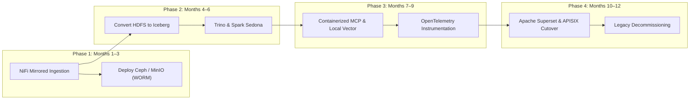

# Phased Migration Strategy and Implementation Roadmap

Transitioning mission-critical infrastructure supporting continuous environmental and disaster monitoring—such as landslide hazard alerts and forest fire tracking—requires an incremental migration strategy that ensures business continuity throughout the transition.

---

## 🏛️ 4-Phase Migration Roadmap & Dual-Run Ingestion Topology

The diagram below outlines the 4-phase migration execution flow, demonstrating parallel dual-run ingestion and zero-downtime cutover.

### 1. Standalone Production-Ready SVG Vector Graphic (`.svg`)

<svg xmlns="http://www.w3.org/2000/svg" viewBox="0 0 960 420" width="100%" height="100%">
  <defs>
    <marker id="arrow-mig" viewBox="0 0 10 10" refX="6" refY="5" markerWidth="6" markerHeight="6" orient="auto-start-reverse">
      <path d="M 0 0 L 10 5 L 0 10 z" fill="#64748B" />
    </marker>
    <filter id="shadow-mig" x="-4%" y="-4%" width="108%" height="108%">
      <feDropShadow dx="0" dy="2" stdDeviation="3" flood-color="#000000" flood-opacity="0.25"/>
    </filter>
  </defs>

  <!-- Background -->
  <rect width="960" height="420" fill="#0F172A" rx="10"/>

  <!-- Phase 1 Card -->
  <rect x="20" y="20" width="215" height="380" fill="#1E293B" stroke="#38BDF8" stroke-width="1.5" rx="8" filter="url(#shadow-mig)"/>
  <rect x="20" y="20" width="215" height="26" fill="#0369A1" rx="8"/>
  <text x="30" y="38" font-family="-apple-system, BlinkMacSystemFont, 'Segoe UI', Roboto, sans-serif" font-size="11" font-weight="bold" fill="#E0F2FE">PHASE 1: MONTHS 1–3</text>
  <text x="30" y="65" font-family="-apple-system, BlinkMacSystemFont, 'Segoe UI', Roboto, sans-serif" font-size="13" font-weight="bold" fill="#38BDF8">Foundation &amp; Dual-Run</text>
  <text x="30" y="90" font-family="-apple-system, BlinkMacSystemFont, 'Segoe UI', Roboto, sans-serif" font-size="11" fill="#E2E8F0">• Deploy Ceph / MinIO</text>
  <text x="30" y="110" font-family="-apple-system, BlinkMacSystemFont, 'Segoe UI', Roboto, sans-serif" font-size="11" fill="#E2E8F0">• WORM Compliance Lock</text>
  <text x="30" y="130" font-family="-apple-system, BlinkMacSystemFont, 'Segoe UI', Roboto, sans-serif" font-size="11" fill="#E2E8F0">• Polaris &amp; OpenMetadata</text>
  <text x="30" y="150" font-family="-apple-system, BlinkMacSystemFont, 'Segoe UI', Roboto, sans-serif" font-size="11" fill="#E2E8F0">• NiFi Mirrored Feeds</text>

  <!-- Phase 2 Card -->
  <rect x="255" y="20" width="215" height="380" fill="#1E293B" stroke="#3B82F6" stroke-width="1.5" rx="8" filter="url(#shadow-mig)"/>
  <rect x="255" y="20" width="215" height="26" fill="#1E3A8A" rx="8"/>
  <text x="265" y="38" font-family="-apple-system, BlinkMacSystemFont, 'Segoe UI', Roboto, sans-serif" font-size="11" font-weight="bold" fill="#93C5FD">PHASE 2: MONTHS 4–6</text>
  <text x="265" y="65" font-family="-apple-system, BlinkMacSystemFont, 'Segoe UI', Roboto, sans-serif" font-size="13" font-weight="bold" fill="#60A5FA">Compute Modernization</text>
  <text x="265" y="90" font-family="-apple-system, BlinkMacSystemFont, 'Segoe UI', Roboto, sans-serif" font-size="11" fill="#E2E8F0">• Trino &amp; Spark Sedona</text>
  <text x="265" y="110" font-family="-apple-system, BlinkMacSystemFont, 'Segoe UI', Roboto, sans-serif" font-size="11" fill="#E2E8F0">• ODCS Data Contracts</text>
  <text x="265" y="130" font-family="-apple-system, BlinkMacSystemFont, 'Segoe UI', Roboto, sans-serif" font-size="11" fill="#E2E8F0">• HDFS to Iceberg Parquet</text>
  <text x="265" y="150" font-family="-apple-system, BlinkMacSystemFont, 'Segoe UI', Roboto, sans-serif" font-size="11" fill="#E2E8F0">• OpenLineage Hooks</text>

  <!-- Phase 3 Card -->
  <rect x="490" y="20" width="215" height="380" fill="#1E293B" stroke="#22C55E" stroke-width="1.5" rx="8" filter="url(#shadow-mig)"/>
  <rect x="490" y="20" width="215" height="26" fill="#065F46" rx="8"/>
  <text x="500" y="38" font-family="-apple-system, BlinkMacSystemFont, 'Segoe UI', Roboto, sans-serif" font-size="11" font-weight="bold" fill="#86EFAC">PHASE 3: MONTHS 7–9</text>
  <text x="500" y="65" font-family="-apple-system, BlinkMacSystemFont, 'Segoe UI', Roboto, sans-serif" font-size="13" font-weight="bold" fill="#4ADE80">AI Sandbox &amp; OTel</text>
  <text x="500" y="90" font-family="-apple-system, BlinkMacSystemFont, 'Segoe UI', Roboto, sans-serif" font-size="11" fill="#E2E8F0">• Containerized FastMCP</text>
  <text x="500" y="110" font-family="-apple-system, BlinkMacSystemFont, 'Segoe UI', Roboto, sans-serif" font-size="11" fill="#E2E8F0">• Read-Only DB Roles</text>
  <text x="500" y="130" font-family="-apple-system, BlinkMacSystemFont, 'Segoe UI', Roboto, sans-serif" font-size="11" fill="#E2E8F0">• DuckDB vss &amp; pgvector</text>
  <text x="500" y="150" font-family="-apple-system, BlinkMacSystemFont, 'Segoe UI', Roboto, sans-serif" font-size="11" fill="#E2E8F0">• OpenTelemetry Collectors</text>

  <!-- Phase 4 Card -->
  <rect x="725" y="20" width="215" height="380" fill="#1E293B" stroke="#F59E0B" stroke-width="1.5" rx="8" filter="url(#shadow-mig)"/>
  <rect x="725" y="20" width="215" height="26" fill="#78350F" rx="8"/>
  <text x="735" y="38" font-family="-apple-system, BlinkMacSystemFont, 'Segoe UI', Roboto, sans-serif" font-size="11" font-weight="bold" fill="#FDE68A">PHASE 4: MONTHS 10–12</text>
  <text x="735" y="65" font-family="-apple-system, BlinkMacSystemFont, 'Segoe UI', Roboto, sans-serif" font-size="13" font-weight="bold" fill="#FBBF24">Presentation &amp; Cutover</text>
  <text x="735" y="90" font-family="-apple-system, BlinkMacSystemFont, 'Segoe UI', Roboto, sans-serif" font-size="11" fill="#E2E8F0">• Apache Superset BI</text>
  <text x="735" y="110" font-family="-apple-system, BlinkMacSystemFont, 'Segoe UI', Roboto, sans-serif" font-size="11" fill="#E2E8F0">• Next.js + APISIX Gateway</text>
  <text x="735" y="130" font-family="-apple-system, BlinkMacSystemFont, 'Segoe UI', Roboto, sans-serif" font-size="11" fill="#E2E8F0">• 30-Day Operational Run</text>
  <text x="735" y="150" font-family="-apple-system, BlinkMacSystemFont, 'Segoe UI', Roboto, sans-serif" font-size="11" fill="#E2E8F0">• Legacy Decommissioning</text>

  <!-- Flow Arrows between Cards -->
  <line x1="235" y1="200" x2="255" y2="200" stroke="#64748B" stroke-width="2" marker-end="url(#arrow-mig)"/>
  <line x1="470" y1="200" x2="490" y2="200" stroke="#64748B" stroke-width="2" marker-end="url(#arrow-mig)"/>
  <line x1="705" y1="200" x2="725" y2="200" stroke="#64748B" stroke-width="2" marker-end="url(#arrow-mig)"/>
</svg>

### 2. Git-Native Mermaid Topology (`.mmd`)



### 3. Summary Interface & Routing Table

| Source Component | Target Component | Port / Protocol / API Ingress | Security Boundary / Access Key | Operational Significance / Flow Description |
| :--- | :--- | :--- | :--- | :--- |
| **Apache NiFi (Phase 1)** | **Ceph / MinIO Store** | `TCP 8080` (Ceph RGW) / `TCP 9000` (MinIO) S3 API | NiFi mTLS Cert / S3 Access Key | Mirrors production data streams without interrupting legacy workflows into S3 WORM storage. |
| **Spark Sedona (Phase 2)** | **Apache Iceberg Table** | AWS Glue / Polaris REST | Spark IAM Role | Converts raw HDFS/GlusterFS files into versioned Iceberg Parquet snapshots. |
| **APISIX / Superset (Phase 4)** | **User Web Browser** | `TCP 443` / HTTPS TLS 1.3 | Keycloak OAuth2 JWT | Replaces proprietary BI and legacy CMS with open-source dashboards. |

---

## 4-Phase Implementation Summary Timeline

```
Phase 1: Foundation Setup and Dual-Run Ingestion (Months 1–3)
└── Deploy Ceph/MinIO with S3 Object Lock; stand up Polaris and OpenMetadata
└── Deploy Apache NiFi to mirror external feeds into object storage
└── Run mirrored ingestion alongside legacy systems without operational impact

Phase 2: Compute Modernization and Data Contract Enforcement (Months 4–6)
└── Deploy Trino, Apache Spark, and Apache Sedona compute clusters
└── Formalize ODCS v3.1.0 data contracts across all domain modules
└── Execute parallel Spark jobs to migrate legacy data into Apache Iceberg format
└── Integrate OpenLineage runtime emission across Airflow DAGs

Phase 3: AI Operational Sandboxing, Local Vector Search & OpenTelemetry (Months 7–9)
└── Deploy containerized MCP servers with read-only database connections
└── Integrate DuckDB vss and pgvector with OpenMetadata for local zero-trust semantic search
└── Instrument Airflow DAGs, Spark jobs, and APISIX routes with OpenTelemetry collectors
└── Restrict AI interactions to operational tooling and schema discovery
└── Enforce cryptographic verification gates for promoting data to Tier 0

Phase 4: Presentation Cutover and Legacy Decommissioning (Months 10–12)
└── Deploy Apache Superset and migrate legacy BI dashboards to deck.gl views
└── Launch containerized Next.js web application behind APISIX and Keycloak
└── Validate 30-day parallel operational run across all domain modules
└── Decommission legacy Hadoop, GlusterFS, relational stores, and BI servers
```

---

## Phase Detailed Execution Plan

### Phase 1: Foundation Setup and Dual-Run Ingestion (Months 1–3)

- **Actions:** Provision Ceph or MinIO distributed object storage on bare-metal hardware with S3 Object Lock immutability enabled. Deploy Apache Polaris and OpenMetadata catalogs. Position Apache NiFi at the network boundary to mirror incoming precipitation streams and satellite thermal anomaly data into object storage while preserving legacy pipelines.
- **Goal:** Establish zero-impact parallel ingestion without altering production legacy operations.

### Phase 2: Compute Modernization and Data Contract Enforcement (Months 4–6)

- **Actions:** Deploy Trino and Apache Spark/Sedona clusters integrated with the Polaris catalog. Formalize ODCS v3.1.0 data contracts across all analytical domain modules. Execute parallel Spark batch jobs to convert historical datasets from HDFS, GlusterFS, and relational stores into Apache Iceberg table formats. Validate row counts and SHA-256 checksums. Instrument Airflow orchestrators with OpenLineage hooks.

### Phase 3: AI Operational Sandboxing, Local Vector Search & OpenTelemetry (Months 7–9)

- **Actions:** Deploy containerized MCP servers (`mcp-catalog-context`, `mcp-trino-query-gen`, `mcp-pipeline-monitor`) in isolated DMZ environments using read-only database roles. Provision Tier 2 AI sandbox object storage with automated 30-day TTL purges. Integrate DuckDB `vss` and `pgvector` with OpenMetadata to power zero-trust local semantic search & Hybrid RAG across the BDA SSoT without external network egress. Deploy OpenTelemetry Collectors to collect traces, metrics, and logs from Airflow DAGs, Spark jobs, and APISIX routes, routing metrics to Prometheus, traces to Grafana Tempo, and logs to Grafana Loki connected to Grafana dashboards. Conduct rigorous boundary testing to confirm AI models cannot execute unauthorized writes or alter Tier 0 records.

### Phase 4: Presentation Cutover and Legacy Decommissioning (Months 10–12)

- **Actions:** Deploy Apache Superset and rebuild legacy BI dashboards using native Superset controls and deck.gl geospatial layers. Launch Next.js web application behind APISIX and Keycloak SSO. Execute a 30-day parallel run to validate data consistency, alert latency, and system performance. Upon formal sign-off, decommission legacy Hadoop, GlusterFS, relational instances, and proprietary BI server licenses.

---

## Phased Risk Mitigation & Technical Fallback Matrix

| Implementation Phase | Target Legacy Subsystems | Modern Open-Source Replacements | Operational Risk Factors | Technical Mitigation & Fallback Procedures |
| :--- | :--- | :--- | :--- | :--- |
| **Phase 1: Foundation & Dual Ingestion** (Months 1–3) | Point-to-point SFTP, local folder shares, manual email ingestion. | Ceph / MinIO (WORM), Apache Polaris, OpenMetadata, Apache NiFi. | Upstream format modifications during mirroring; network saturation at boundary. | Operate NiFi in non-intrusive listening mode; legacy production paths remain authoritative; allocate isolated NICs. |
| **Phase 2: Compute & Contract Migration** (Months 4–6) | Hadoop HDFS, GlusterFS, relational project stores, WildFly. | Apache Iceberg, Trino, Apache Spark + Sedona, Data Contract CLI. | Data truncation or encoding errors during historical Iceberg Parquet conversions. | Execute automated row-count and partition checksum verifications; preserve raw source stores in read-only mode. |
| **Phase 3: AI Sandboxing, Local RAG & OTel Deploy** (Months 7–9) | Unmonitored administrative scripts, ad-hoc Python workflows, legacy StatsD/JMX exporters. | Model Context Protocol servers, Keycloak IAM, Tier 2 Sandbox, DuckDB `vss`, `pgvector`, OpenTelemetry Collectors. | Over-privileged AI agents attempting schema adjustments; WAN data leakage from cloud vector services; broken trace context. | Enforce read-only database connections; run local embedding models with zero egress; standardize W3C trace context across APISIX and OTel collectors. |
| **Phase 4: Cutover & Decommissioning** (Months 10–12) | Proprietary BI server cluster, legacy CMS, web portal. | Apache Superset (deck.gl), Next.js / React portal, Apache APISIX. | Discrepancies between legacy BI and Superset spatial maps; user resistance to new UI. | Run 30-day side-by-side verification runs; validate geospatial rendering against PostGIS base layers; conduct user training. |
