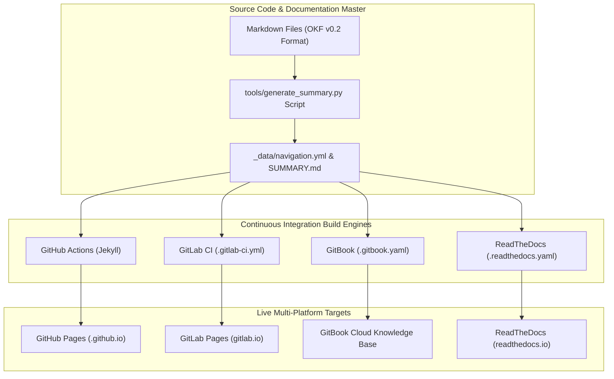

# 🌐 Multi-Platform Documentation Hosting Guide

This project supports seamless multi-platform hosting across GitHub Pages, GitLab Pages, GitBook, and ReadTheDocs.

---

## 🏛️ Multi-Platform Documentation Publishing Topology

The diagram below details the continuous integration and multi-host deployment pipeline across GitHub Pages, GitLab Pages, GitBook, and ReadTheDocs.

### 1. Standalone Production-Ready SVG Vector Graphic (`.svg`)

<svg xmlns="http://www.w3.org/2000/svg" viewBox="0 0 960 400" width="100%" height="100%">
  <defs>
    <marker id="arrow-host" viewBox="0 0 10 10" refX="6" refY="5" markerWidth="6" markerHeight="6" orient="auto-start-reverse">
      <path d="M 0 0 L 10 5 L 0 10 z" fill="#64748B" />
    </marker>
    <filter id="shadow-host" x="-4%" y="-4%" width="108%" height="108%">
      <feDropShadow dx="0" dy="2" stdDeviation="3" flood-color="#000000" flood-opacity="0.25"/>
    </filter>
  </defs>

  <!-- Background -->
  <rect width="960" height="400" fill="#0F172A" rx="10"/>

  <!-- Repository Source Tier -->
  <rect x="20" y="20" width="920" height="80" fill="#1E293B" stroke="#334155" stroke-width="1.5" rx="8" filter="url(#shadow-host)"/>
  <rect x="20" y="20" width="920" height="26" fill="#0F172A" rx="8"/>
  <text x="35" y="38" font-family="-apple-system, BlinkMacSystemFont, 'Segoe UI', Roboto, sans-serif" font-size="12" font-weight="bold" fill="#60A5FA">SOURCE REPOSITORY &amp; NAVIGATION GENERATOR</text>

  <rect x="40" y="52" width="430" height="38" fill="#1E3A8A" stroke="#3B82F6" rx="4"/>
  <text x="50" y="75" font-family="-apple-system, BlinkMacSystemFont, 'Segoe UI', Roboto, sans-serif" font-size="12" font-weight="bold" fill="#93C5FD">Markdown Docs (OKF v0.2) + SUMMARY.md</text>

  <rect x="490" y="52" width="430" height="38" fill="#065F46" stroke="#22C55E" rx="4"/>
  <text x="500" y="75" font-family="-apple-system, BlinkMacSystemFont, 'Segoe UI', Roboto, sans-serif" font-size="12" font-weight="bold" fill="#86EFAC">tools/generate_summary.py Auto-Indexer</text>

  <!-- CI/CD Build Engine Tier -->
  <rect x="20" y="135" width="920" height="110" fill="#1E293B" stroke="#334155" stroke-width="1.5" rx="8" filter="url(#shadow-host)"/>
  <rect x="20" y="135" width="920" height="26" fill="#0F172A" rx="8"/>
  <text x="35" y="153" font-family="-apple-system, BlinkMacSystemFont, 'Segoe UI', Roboto, sans-serif" font-size="12" font-weight="bold" fill="#4ADE80">MULTI-PLATFORM CI/CD BUILD RUNNERS</text>

  <rect x="40" y="170" width="200" height="60" fill="#0F172A" stroke="#22C55E" rx="6"/>
  <text x="50" y="190" font-family="-apple-system, BlinkMacSystemFont, 'Segoe UI', Roboto, sans-serif" font-size="12" font-weight="bold" fill="#86EFAC">GitHub Actions</text>
  <text x="50" y="210" font-family="Consolas, Monaco, monospace" font-size="10" fill="#4ADE80">Jekyll / Pages</text>

  <rect x="270" y="170" width="200" height="60" fill="#0F172A" stroke="#22C55E" rx="6"/>
  <text x="280" y="190" font-family="-apple-system, BlinkMacSystemFont, 'Segoe UI', Roboto, sans-serif" font-size="12" font-weight="bold" fill="#86EFAC">GitLab CI Pipeline</text>
  <text x="280" y="210" font-family="Consolas, Monaco, monospace" font-size="10" fill="#4ADE80">.gitlab-ci.yml</text>

  <rect x="500" y="170" width="200" height="60" fill="#0F172A" stroke="#22C55E" rx="6"/>
  <text x="510" y="190" font-family="-apple-system, BlinkMacSystemFont, 'Segoe UI', Roboto, sans-serif" font-size="12" font-weight="bold" fill="#86EFAC">GitBook Sync</text>
  <text x="510" y="210" font-family="Consolas, Monaco, monospace" font-size="10" fill="#4ADE80">.gitbook.yaml</text>

  <rect x="730" y="170" width="190" height="60" fill="#0F172A" stroke="#22C55E" rx="6"/>
  <text x="740" y="190" font-family="-apple-system, BlinkMacSystemFont, 'Segoe UI', Roboto, sans-serif" font-size="12" font-weight="bold" fill="#86EFAC">ReadTheDocs Builder</text>
  <text x="740" y="210" font-family="Consolas, Monaco, monospace" font-size="10" fill="#4ADE80">MkDocs Python 3.12</text>

  <!-- Publishing Targets Tier -->
  <rect x="20" y="280" width="920" height="95" fill="#1E293B" stroke="#334155" stroke-width="1.5" rx="8" filter="url(#shadow-host)"/>
  <rect x="20" y="280" width="920" height="26" fill="#0F172A" rx="8"/>
  <text x="35" y="298" font-family="-apple-system, BlinkMacSystemFont, 'Segoe UI', Roboto, sans-serif" font-size="12" font-weight="bold" fill="#FBBF24">LIVE PUBLISHED DOCUMENTATION SITES</text>

  <rect x="40" y="315" width="200" height="45" fill="#0F172A" stroke="#F59E0B" rx="6"/>
  <text x="50" y="342" font-family="-apple-system, BlinkMacSystemFont, 'Segoe UI', Roboto, sans-serif" font-size="12" font-weight="bold" fill="#FDE68A">GitHub Pages Site</text>

  <rect x="270" y="315" width="200" height="45" fill="#0F172A" stroke="#F59E0B" rx="6"/>
  <text x="280" y="342" font-family="-apple-system, BlinkMacSystemFont, 'Segoe UI', Roboto, sans-serif" font-size="12" font-weight="bold" fill="#FDE68A">GitLab Pages Site</text>

  <rect x="500" y="315" width="200" height="45" fill="#0F172A" stroke="#F59E0B" rx="6"/>
  <text x="510" y="342" font-family="-apple-system, BlinkMacSystemFont, 'Segoe UI', Roboto, sans-serif" font-size="12" font-weight="bold" fill="#FDE68A">GitBook Portal</text>

  <rect x="730" y="315" width="190" height="45" fill="#0F172A" stroke="#F59E0B" rx="6"/>
  <text x="740" y="342" font-family="-apple-system, BlinkMacSystemFont, 'Segoe UI', Roboto, sans-serif" font-size="12" font-weight="bold" fill="#FDE68A">ReadTheDocs Site</text>

  <!-- Connectors -->
  <line x1="255" y1="90" x2="255" y2="170" stroke="#64748B" stroke-width="1.5" marker-end="url(#arrow-host)"/>
  <line x1="705" y1="90" x2="705" y2="170" stroke="#64748B" stroke-width="1.5" marker-end="url(#arrow-host)"/>

  <line x1="140" y1="230" x2="140" y2="315" stroke="#64748B" stroke-width="1.5" marker-end="url(#arrow-host)"/>
  <line x1="370" y1="230" x2="370" y2="315" stroke="#64748B" stroke-width="1.5" marker-end="url(#arrow-host)"/>
  <line x1="600" y1="230" x2="600" y2="315" stroke="#64748B" stroke-width="1.5" marker-end="url(#arrow-host)"/>
  <line x1="825" y1="230" x2="825" y2="315" stroke="#64748B" stroke-width="1.5" marker-end="url(#arrow-host)"/>
</svg>

### 2. Git-Native Mermaid Topology (`.mmd`)

### 3. Summary Interface & Routing Table

| Source Component | Target Component | Port / Protocol / API Ingress | Security Boundary / Access Key | Operational Significance / Flow Description |
| :--- | :--- | :--- | :--- | :--- |
| **Git Push Event** | **GitHub Actions / GitLab CI** | HTTPS Webhook / Git Push | Repository Deployment Key | Triggers automated site build workflows and tests on commit. |
| **generate_summary.py** | **SUMMARY.md & navigation.yml** | Local Python Script | File System Write | Re-indexes all markdown files into unified table of contents. |
| **Jekyll / MkDocs** | **GitHub / GitLab Pages** | `TCP 443` / HTTPS TLS 1.3 | Public Web Domain | Renders responsive HTML site with adaptive light/dark mode CSS styling. |

## Supported Platforms

### 1. GitLab Pages (`.gitlab-ci.yml`)
- Deploys automatically via GitLab CI/CD using Ruby 3.2 and Jekyll.
- Output directory: `public/`.

### 2. GitBook (`.gitbook.yaml`)
- Native GitBook integration reading `README.md` as home and `SUMMARY.md` as table of contents structure.

### 3. ReadTheDocs.org (`.readthedocs.yaml`)
- ReadTheDocs v2 configuration using Python 3.12 and MkDocs dependencies listed in `docs/requirements.txt`.

### 4. Dynamic Markdown Navigation
- All documentation files under `docs/` and root files (`README.md`, `CHANGELOG.md`, `SUMMARY.md`, `HISTORY.md`) are automatically indexed by `tools/generate_summary.py`.
