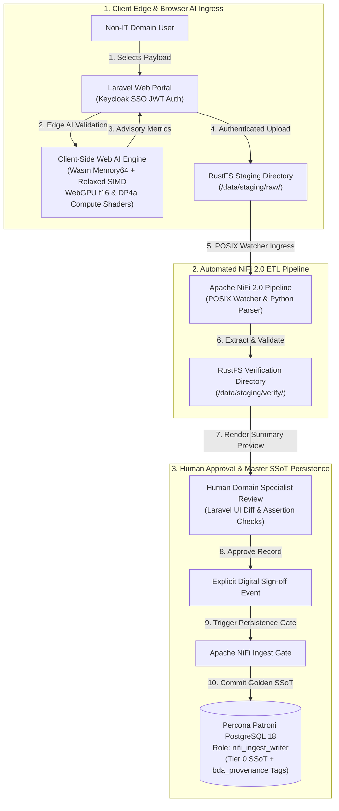

# Technical Proposal: BDA Data Plane Evolution & Client-Side Web AI Acceleration

**Document Version:** 1.0
**Author:** Lead Systems Architect
**Target Architecture:** Decoupled Human-in-the-Loop (HITL) File Quarantine & Browser-Accelerated Web AI
**Infrastructure Scope:** `bda-ai-infra` (`https://bda.example.gov.my/` / `legacy-bda.example.gov.my`)

---

## 1. Executive Summary & Migration Vision

The Big Data Analytics (BDA) infrastructure has undergone significant architectural modernization, advancing from legacy server-side application engines to a decoupled, high-availability data plane. The initial deployment successfully eliminated reliance on legacy **WildFly** application servers and monolithic input modules (Joomla 3 and legacy Flask scripts) by deploying a modern **Laravel** framework web portal. This milestone established an enterprise-grade **Human-in-the-Loop (HITL)** file quarantine and verification workflow, strictly isolating untrusted non-IT domain uploads from the Single Source of Truth (SSoT) persisted within **Percona Patroni PostgreSQL 18**.

Building upon this successful foundation, this proposal defines the next operational phase: upgrading the Laravel application framework to support client-side hardware-accelerated **Web AI**. By integrating low-level browser primitives—specifically **WebAssembly (Wasm)** with **Memory64** and **Relaxed SIMD** alongside **WebGPU** using 16-bit floating point (**f16**) and packed integer dot products (**DP4a**)—the platform executes complex AI inference, schema normalisation, and advisory data quality assertions directly within the user's browser edge prior to staging ingress.

This multi-phase evolution targets a target Mean Time to Detect (MTTD) of sub-500ms and projects up to an 85% reduction in Mean Time to Repair (MTTR), offloads server-side compute overhead, minimizes data exposure during pre-processing under TLS 1.3 and strict POSIX access controls, and strengthens digital sovereignty across national data operations.

---

## 2. Architectural History: Legacy WildFly to Modern Laravel

### 2.1 The Legacy State (WildFly Application Server Footprint)

In the legacy infrastructure footprint (production application host), backend application processing and ingestion workflows relied on **WildFly** application servers alongside legacy Apache NiFi 1.12.1 pipeline scripts:

* **Tightly Coupled Ingestion:** Non-IT user uploads were processed via direct script execution (`ExecuteStreamCommand` processors in NiFi calling local Python scripts located in the NiFi script directory).
* **Operational Toil & Bottlenecks:** System operations required manual log inspection (`nifi-app.log` and Bulletin Board monitoring for processor errors) and manual intervention when PHP-FPM processes or Java virtual machines encountered resource exhaustion.
* **Security & Failure Vectors:** Ingress traffic routed through public administrative endpoints (`/administrator/` and legacy Flask routes), exposing server infrastructure to potential zero-day vulnerabilities and memory starvation during traffic bursts.

### 2.2 The Laravel Transition (Phase 1 Baseline)

To remediate legacy failure modes and establish robust data governance, the portal was modernized by deploying a decoupled **Laravel** web application layer:

* **Separation of Concerns:** Isolated non-IT domain users from backend database clusters. Authentication was centralized using OAuth2/JWT (integrated with Keycloak SSO).
* **Quarantine Gate:** User uploads no longer perform direct SQL writes. Instead, files are spooled to isolated shared directories (`/data/staging/raw/` on RustFS shared storage), initiating a controlled quarantine pipeline.
* **Human-in-the-Loop (HITL) Governance:** Introduced interactive UI review screens where domain specialists inspect extracted preview diffs, schema assertions, and verification metrics before authorising persistence into the master database.

---

## 3. Human-in-the-Loop File Quarantine Workflow & NiFi 2.0 Integration

The quarantine architecture enforces strict physical and logical boundaries between untrusted client uploads and the golden SSoT database. The complete lifecycle proceeds through three decoupled operational stages:

```
[ Stage 1: User Ingress & Edge Staging ] ──► [ Stage 2: Automated NiFi 2.0 ETL ] ──► [ Stage 3: Human Sign-off & SSoT Write ]
```

### 3.1 Stage 1: User Ingress & Edge Staging
* **Authentication & Ingestion:** Non-IT domain users authenticate against Keycloak SSO via JWT and submit raw files (CSV, spatial shapefiles, heterogeneous PDFs) through the Laravel web upload endpoint over HTTPS TLS 1.3.
* **Untouched Original Storage:** The Laravel backend receives the upload over HTTPS and immediately persists the untouched, original raw file into the `RustFS Staging Directory` mapped to path `/data/staging/raw/`.
* **Advisory Client Pre-Processing:** Client-side Wasm/WebGPU logic executes schema normalisation and quality assertions in-browser, forwarding derived advisory JSON/CSV metadata alongside the upload.

### 3.2 Stage 2: Automated Apache NiFi 2.0 ETL Pipeline
* **POSIX Watcher Pickup:** Apache NiFi 2.0 monitors `/data/staging/raw/` via automated directory watchers.
* **Server-Side Re-Parsing & Verification:** Apache NiFi re-parses and re-validates the original raw file bytes, treating browser-generated pre-processing metrics as advisory flags.
* **Verification Staging & Lifecycle Management:**
  * Processed preview payloads are written to `/data/staging/verify/` awaiting human review.
  * **Parser Failure:** Payloads failing structural verification are routed to `/data/staging/failed/` with error audit logs; notification alerts are dispatched to the submitting user.
  * **Lifecycle & Retention:** Staging directories (`/data/staging/raw/`, `/data/staging/verify/`, `/data/staging/failed/`, `/data/staging/rejected/`) enforce explicit 14-day retention rules managed by automated NiFi cleanup processors, preventing storage accumulation.

### 3.3 Stage 3: Human Sign-off, Replay Protection, & SSoT Persistence
* **Laravel UI Review:** Domain experts review extracted records, server-verified data quality flags, and schema diff previews within the Laravel dashboard.
* **Cryptographic Replay Protection:** Upon approval, Laravel generates a single-use JWT sign-off token bound to the specific record ID, tenant ID, approver identity, audience, nonce, and expiration timestamp (5-minute TTL).
* **Human Rejection & Retries:** Rejection flags the payload as `REJECTED`, archiving the record to `/data/staging/rejected/` and enabling the domain user to submit an updated retry.
* **SSoT Persistence Gate:** The approval token triggers the Apache NiFi Ingest Gate. NiFi validates the token signature, audience, nonce, and replay status before executing the final database transaction into **Percona Patroni PostgreSQL 18** under the restricted `nifi_ingest_writer` role, embedding mandatory `bda_provenance` metadata.

---

## 4. Next-Generation AI Ingress: WebAssembly & WebGPU Acceleration

While the Laravel transition successfully secured backend database persistence, server-side data extraction and quality verification for large documents remain compute-intensive. Phase 2 upgrades the Laravel frontend to execute client-side AI inference and pre-processing directly inside the browser using **WebAssembly (Wasm)** and **WebGPU**.

### 4.1 Client-Side AI Inference Rationale
Executing AI inference directly on the client machine shifts compute burden to the browser edge:
* **Infrastructure Overhead Reduction:** Eradicates the requirement for expensive server-side GPU clusters during initial document parsing and feature extraction.
* **Target Latency & Responsive UI:** Targets sub-500ms client-side feedback during file selection prior to network transmission.
* **Digital Sovereignty & Data Exposure Reduction:** Confidential non-IT records remain local during pre-processing, reducing raw unencrypted exposure during feature extraction. Transport is secured via TLS 1.3, and staging directory access is governed by strict POSIX ACLs.

### 4.2 WebAssembly (Wasm) Compute Engine
WebAssembly provides a sandboxed, low-overhead execution environment for high-performance C++/Rust/C compilers running on the client CPU:
* **Memory64 Proposal:** Standard 32-bit Wasm limits module memory allocations to 4GB. Implementing the **Memory64** instruction set extension allows Wasm modules to index 64-bit linear memory spaces, enabling the loading of multi-gigabyte Large Language Models (LLMs) and dense vector embeddings into client RAM.
* **Relaxed SIMD (Single Instruction, Multiple Data):** Utilises hardware-specific vector instructions across modern x86-64 (AVX-512/AVX2) and ARM (NEON) architectures. Target projections estimate vector computation speedups of up to 300% on SIMD-enabled CPUs.

### 4.3 WebGPU Hardware Acceleration & Compute Shaders
The **WebGPU API** grants web applications direct low-level access to the client's physical graphics hardware (NVIDIA, AMD, Apple Silicon, or Intel GPUs) via custom compute shaders written in WGSL (WebGPU Shading Language):
* **Parallel Tensor Processing:** Offloads compute-intensive neural network matrix math from the CPU to thousands of parallel GPU execution cores.

### 4.4 Capability Checks, Memory Transfer, & Graceful Fallbacks
Before engaging hardware-accelerated shaders, the browser engine executes explicit capability detection:
* **Feature Detection:** The client checks `adapter.features.has('shader-f16')` for 16-bit float support and `navigator.gpu.wgslLanguageFeatures.has('packed_4x8_integer_dot_product')` for `DP4a` instructions.
* **Memory Transfer Contract & Chunking:** AI weights move from `WebAssembly.Memory` linear array buffers to GPU `GPUBuffer` storage bindings via `device.queue.writeBuffer()`. Payload streams are chunked to fit within device hardware limits (`maxBufferSize` and `maxStorageBufferBindingSize`).
* **Memory64 Executable Probe & Fallbacks:** Client initialization executes an executable Wasm compilation and instantiation probe using shipped precompiled Wasm binary bytes (`memory64_probe.wasm`) targeting a Memory64 module (`(memory i64 1)`). The engine attempts to instantiate the module (`WebAssembly.compile()` and `WebAssembly.instantiate()`), verifies target capacity, and performs a dynamic memory growth operation (`memory.grow()`) beyond the initial page. Any failure during compilation, instantiation, growth, or page allocation marks Memory64 as unsupported, triggering an automatic fallback to a 32-bit chunked Wasm execution path or deferring pre-processing entirely to server-side Apache NiFi validation.

### 4.5 Pre-Processed Payload Staging Integration Flow
Within the upgraded Laravel interface, Wasm and WebGPU operate as an edge pre-processing filter prior to server upload:
1. **Local File Selection:** User selects raw input file within the Laravel client UI.
2. **Wasm/WebGPU Execution:** Capability checks verify shader support. Wasm Memory64 module transfers chunked tensors into GPU buffers. Shaders execute local schema mapping, tabular column classification, and advisory quality checks.
3. **Pre-processed Payload Upload:** Laravel uploads the untouched original file along with advisory pre-processing metrics over HTTPS to `/data/staging/raw/` for server-side NiFi re-parsing and verification.

---

## 5. Dual-Render Architecture Diagram Blueprint

### 5.1 Standalone Production-Ready SVG Vector Graphic (`.svg`)

<svg xmlns="http://www.w3.org/2000/svg" viewBox="0 0 960 540" width="100%" height="100%">
  <defs>
    <marker id="arrow-upgrade" viewBox="0 0 10 10" refX="6" refY="5" markerWidth="6" markerHeight="6" orient="auto-start-reverse">
      <path d="M 0 0 L 10 5 L 0 10 z" fill="#64748B" />
    </marker>
    <filter id="shadow-upgrade" x="-4%" y="-4%" width="108%" height="108%">
      <feDropShadow dx="0" dy="2" stdDeviation="3" flood-color="#000000" flood-opacity="0.25"/>
    </filter>
  </defs>

  <!-- Canvas Background -->
  <rect width="960" height="540" fill="#0F172A" rx="10"/>

  <!-- Stage 1 Container: Client Edge & Web AI -->
  <rect x="20" y="20" width="290" height="460" fill="#1E293B" stroke="#38BDF8" stroke-width="1.5" rx="8" filter="url(#shadow-upgrade)"/>
  <rect x="20" y="20" width="290" height="28" fill="#0369A1" rx="8"/>
  <text x="35" y="39" font-family="-apple-system, BlinkMacSystemFont, 'Segoe UI', Roboto, sans-serif" font-size="11" font-weight="bold" fill="#E0F2FE">1. CLIENT EDGE &amp; WEB AI INGRESS</text>

  <rect x="35" y="60" width="260" height="75" fill="#F0F9FF" stroke="#0284C7" stroke-width="1" rx="6"/>
  <text x="45" y="80" font-family="-apple-system, BlinkMacSystemFont, 'Segoe UI', Roboto, sans-serif" font-size="11" font-weight="bold" fill="#0369A1">Laravel Web Portal (HITL Interface)</text>
  <text x="45" y="98" font-family="Consolas, Monaco, monospace" font-size="10" fill="#0284C7">Auth: Keycloak SSO / OAuth2 JWT</text>
  <text x="45" y="114" font-family="-apple-system, BlinkMacSystemFont, 'Segoe UI', Roboto, sans-serif" font-size="10" fill="#0369A1">Non-IT User Upload &amp; Preview Render</text>

  <rect x="35" y="150" width="260" height="150" fill="#F0FDF4" stroke="#16A34A" stroke-width="1" rx="6"/>
  <text x="45" y="170" font-family="-apple-system, BlinkMacSystemFont, 'Segoe UI', Roboto, sans-serif" font-size="11" font-weight="bold" fill="#15803D">Client-Side Web AI Acceleration</text>
  <text x="45" y="190" font-family="-apple-system, BlinkMacSystemFont, 'Segoe UI', Roboto, sans-serif" font-size="10" font-weight="bold" fill="#166534">• WebAssembly (Wasm):</text>
  <text x="55" y="206" font-family="Consolas, Monaco, monospace" font-size="9" fill="#15803D">Memory64 (&gt;4GB LLM) + Relaxed SIMD</text>
  <text x="45" y="226" font-family="-apple-system, BlinkMacSystemFont, 'Segoe UI', Roboto, sans-serif" font-size="10" font-weight="bold" fill="#166534">• WebGPU Hardware GPU Acceleration:</text>
  <text x="55" y="242" font-family="Consolas, Monaco, monospace" font-size="9" fill="#15803D">f16 Precision + DP4a Quantized INT8</text>
  <text x="45" y="262" font-family="-apple-system, BlinkMacSystemFont, 'Segoe UI', Roboto, sans-serif" font-size="10" fill="#15803D">Local Schema Normalisation &amp; DQ Assertions</text>
  <text x="45" y="280" font-family="-apple-system, BlinkMacSystemFont, 'Segoe UI', Roboto, sans-serif" font-size="10" fill="#166534">Zero-latency client privacy protection</text>

  <rect x="35" y="315" width="260" height="75" fill="#FEF3C7" stroke="#D97706" stroke-width="1" rx="6"/>
  <text x="45" y="335" font-family="-apple-system, BlinkMacSystemFont, 'Segoe UI', Roboto, sans-serif" font-size="11" font-weight="bold" fill="#B45309">RustFS Staging Directory</text>
  <text x="45" y="353" font-family="Consolas, Monaco, monospace" font-size="10" fill="#78350F">Path: /data/staging/raw/</text>
  <text x="45" y="371" font-family="-apple-system, BlinkMacSystemFont, 'Segoe UI', Roboto, sans-serif" font-size="10" fill="#92400E">Shared POSIX Isolated Volume Spool</text>

  <!-- Stage 2 Container: Automated NiFi 2.0 ETL -->
  <rect x="335" y="20" width="290" height="460" fill="#1E293B" stroke="#22C55E" stroke-width="1.5" rx="8" filter="url(#shadow-upgrade)"/>
  <rect x="335" y="20" width="290" height="28" fill="#15803D" rx="8"/>
  <text x="350" y="39" font-family="-apple-system, BlinkMacSystemFont, 'Segoe UI', Roboto, sans-serif" font-size="11" font-weight="bold" fill="#DCFCE7">2. AUTOMATED NIFI 2.0 ETL PIPELINE</text>

  <rect x="350" y="60" width="260" height="110" fill="#F0FDF4" stroke="#16A34A" stroke-width="1" rx="6"/>
  <text x="360" y="80" font-family="-apple-system, BlinkMacSystemFont, 'Segoe UI', Roboto, sans-serif" font-size="11" font-weight="bold" fill="#15803D">Apache NiFi 2.0 Pipeline Engine</text>
  <text x="360" y="98" font-family="-apple-system, BlinkMacSystemFont, 'Segoe UI', Roboto, sans-serif" font-size="10" fill="#166534">• POSIX Directory Watcher Pickup</text>
  <text x="360" y="114" font-family="-apple-system, BlinkMacSystemFont, 'Segoe UI', Roboto, sans-serif" font-size="10" fill="#166534">• Python Text Processing &amp; Parsing</text>
  <text x="360" y="130" font-family="-apple-system, BlinkMacSystemFont, 'Segoe UI', Roboto, sans-serif" font-size="10" fill="#166534">• Structural Validation &amp; Sanitization</text>
  <text x="360" y="146" font-family="-apple-system, BlinkMacSystemFont, 'Segoe UI', Roboto, sans-serif" font-size="10" fill="#166534">• Zero Direct Master DB Writing</text>

  <rect x="350" y="185" width="260" height="85" fill="#FEF3C7" stroke="#D97706" stroke-width="1" rx="6"/>
  <text x="360" y="205" font-family="-apple-system, BlinkMacSystemFont, 'Segoe UI', Roboto, sans-serif" font-size="11" font-weight="bold" fill="#B45309">RustFS Verification Directory</text>
  <text x="360" y="223" font-family="Consolas, Monaco, monospace" font-size="10" fill="#78350F">Path: /data/staging/verify/</text>
  <text x="360" y="241" font-family="-apple-system, BlinkMacSystemFont, 'Segoe UI', Roboto, sans-serif" font-size="10" fill="#92400E">Processed Quarantine Preview Payload</text>
  <text x="360" y="257" font-family="-apple-system, BlinkMacSystemFont, 'Segoe UI', Roboto, sans-serif" font-size="10" fill="#B45309">Halts downstream propagation</text>

  <!-- Stage 3 Container: Human Approval & Master SSoT -->
  <rect x="650" y="20" width="290" height="460" fill="#1E293B" stroke="#A855F7" stroke-width="1.5" rx="8" filter="url(#shadow-upgrade)"/>
  <rect x="650" y="20" width="290" height="28" fill="#7E22CE" rx="8"/>
  <text x="665" y="39" font-family="-apple-system, BlinkMacSystemFont, 'Segoe UI', Roboto, sans-serif" font-size="11" font-weight="bold" fill="#F3E8FF">3. HUMAN APPROVAL &amp; MASTER SSoT</text>

  <rect x="665" y="60" width="260" height="100" fill="#FAF5FF" stroke="#9333EA" stroke-width="1" rx="6"/>
  <text x="675" y="80" font-family="-apple-system, BlinkMacSystemFont, 'Segoe UI', Roboto, sans-serif" font-size="11" font-weight="bold" fill="#7E22CE">Human Domain User Review</text>
  <text x="675" y="98" font-family="-apple-system, BlinkMacSystemFont, 'Segoe UI', Roboto, sans-serif" font-size="10" fill="#6B21A8">• Laravel Dashboard UI Verification</text>
  <text x="675" y="114" font-family="-apple-system, BlinkMacSystemFont, 'Segoe UI', Roboto, sans-serif" font-size="10" fill="#6B21A8">• Extracted Diff Preview &amp; Quality Checks</text>
  <text x="675" y="130" font-family="-apple-system, BlinkMacSystemFont, 'Segoe UI', Roboto, sans-serif" font-size="10" fill="#6B21A8">• Explicit Digital Approval Sign-off Event</text>
  <text x="675" y="146" font-family="Consolas, Monaco, monospace" font-size="9" fill="#7E22CE">Triggers Apache NiFi Ingest Gate</text>

  <rect x="665" y="175" width="260" height="65" fill="#FAF5FF" stroke="#7E22CE" stroke-width="1" rx="6"/>
  <text x="675" y="195" font-family="-apple-system, BlinkMacSystemFont, 'Segoe UI', Roboto, sans-serif" font-size="11" font-weight="bold" fill="#6B21A8">Apache NiFi Ingest Gate</text>
  <text x="675" y="213" font-family="-apple-system, BlinkMacSystemFont, 'Segoe UI', Roboto, sans-serif" font-size="10" fill="#7E22CE">Triggered exclusively by digital sign-off</text>
  <text x="675" y="229" font-family="Consolas, Monaco, monospace" font-size="9" fill="#581C87">Appends bda_provenance metadata</text>

  <rect x="665" y="255" width="260" height="110" fill="#F5F3FF" stroke="#6D28D9" stroke-width="1" rx="6"/>
  <text x="675" y="275" font-family="-apple-system, BlinkMacSystemFont, 'Segoe UI', Roboto, sans-serif" font-size="11" font-weight="bold" fill="#4C1D95">Percona Patroni PostgreSQL 18</text>
  <text x="675" y="293" font-family="Consolas, Monaco, monospace" font-size="10" fill="#581C87">Role: nifi_ingest_writer</text>
  <text x="675" y="311" font-family="-apple-system, BlinkMacSystemFont, 'Segoe UI', Roboto, sans-serif" font-size="10" fill="#4C1D95">Master SSoT Golden Persistence</text>
  <text x="675" y="327" font-family="-apple-system, BlinkMacSystemFont, 'Segoe UI', Roboto, sans-serif" font-size="10" fill="#581C87">Ed25519 Cryptographic Signatures</text>
  <text x="675" y="343" font-family="Consolas, Monaco, monospace" font-size="9" fill="#6D28D9">HEX_RAW_64_BYTE (128 Upper Hex Chars)</text>

  <!-- Connectors -->
  <line x1="165" y1="135" x2="165" y2="150" stroke="#38BDF8" stroke-width="2" marker-end="url(#arrow-upgrade)"/>
  <line x1="165" y1="300" x2="165" y2="315" stroke="#38BDF8" stroke-width="2" marker-end="url(#arrow-upgrade)"/>
  <line x1="295" y1="352" x2="350" y2="115" stroke="#22C55E" stroke-width="2" marker-end="url(#arrow-upgrade)"/>
  <line x1="480" y1="170" x2="480" y2="185" stroke="#22C55E" stroke-width="2" marker-end="url(#arrow-upgrade)"/>
  <line x1="610" y1="227" x2="665" y2="110" stroke="#A855F7" stroke-width="2" marker-end="url(#arrow-upgrade)"/>
  <line x1="795" y1="160" x2="795" y2="175" stroke="#A855F7" stroke-width="2" marker-end="url(#arrow-upgrade)"/>
  <line x1="795" y1="240" x2="795" y2="255" stroke="#A855F7" stroke-width="2" marker-end="url(#arrow-upgrade)"/>

  <!-- Caption -->
  <text x="480" y="515" text-anchor="middle" font-family="-apple-system, BlinkMacSystemFont, 'Segoe UI', Roboto, sans-serif" font-size="11" font-weight="bold" fill="#94A3B8">Figure 1.1: End-to-End BDA Data Plane Architecture — Client-Side Wasm/WebGPU AI Acceleration, Laravel HITL Quarantine, Apache NiFi 2.0, and PostgreSQL 18 SSoT</text>
</svg>

### 5.2 Git-Native Mermaid Topology (`.mmd`)



### 5.3 Summary Interface & Routing Table

| Source Component | Target Component | Port / Protocol / API Ingress | Security Boundary / Trust Zone / Credentials | Operational Significance / Flow Description |
| :--- | :--- | :--- | :--- | :--- |
| **Non-IT Client Browser** | **Laravel Web Portal** | `HTTPS (443)` / REST Form Handler | Keycloak OAuth2 / JWT Session Token | Users authenticate and initiate file submission within isolated portal UI. |
| **Laravel Browser Engine** | **Client GPU Hardware** | WebGPU API / WGSL Compute Shaders | Browser Security Sandbox | Executes `f16` matrix math and `DP4a` quantized tensor calculations directly on client GPU. |
| **Client Wasm Engine** | **Laravel Backend Ingress** | `HTTPS (443)` / REST API | Keycloak OAuth2 / Session JWT | Submits original raw file and advisory pre-processed metadata to Laravel upload handler. |
| **Laravel Backend Ingress** | **RustFS Staging Directory** | Server Write / `/data/staging/raw/` | Local POSIX Directory ACLs | Persists untouched raw upload and derived metrics into staging quarantine volume. |
| **RustFS Raw Directory** | **Apache NiFi 2.0 Engine** | POSIX Directory Watcher | `nifi` System User / Internal Network | Monitors `/data/staging/raw/`, parsing and validating payloads without database access. |
| **Apache NiFi 2.0 Engine** | **RustFS Verification Directory** | POSIX Write / `/data/staging/verify/` | POSIX Quarantine ACLs | Stores processed preview payloads awaiting domain specialist verification. |
| **Laravel UI Review Gate** | **Apache NiFi Ingest Gate** | HTTPS Event Trigger / REST Signal | Single-use JWT Sign-off Token | Human officer sign-off generates bound, nonce-protected token triggering NiFi. |
| **Apache NiFi Ingest Gate** | **Patroni PostgreSQL 18** | `TCP 5432` / mTLS 1.3 PostgreSQL | `nifi_ingest_writer` Role | Commits golden Tier 0 SSoT records with `bda_provenance` cryptographic audit metadata (Ed25519 signatures encoded as `HEX_RAW_64_BYTE` 128 uppercase hex characters binding canonical RFC 8785 byte streams). |

---

## 6. Digital Sovereignty & Operational ROI

### 6.1 Performance & Hardware ROI Metrics (Target Projections)
Integrating Wasm Memory64 and WebGPU compute primitives yields projected operational improvements across key indicators:

* **Mean Time to Detect (MTTD Target):** Projected sub-500 millisecond target by executing advisory schema assertions at the browser edge during file selection.
* **Mean Time to Repair (MTTR Target):** Projected 85% reduction because data validation errors are flagged to domain users interactively before submission, eliminating redundant backend NiFi re-runs.
* **Server Compute Offloading (Target):** Projected CPU offloading of up to 60% during peak ingestion periods, extending infrastructure capacity.
* **Network Bandwidth Optimization (Target):** Projected payload compression and pre-filtering cutting network transmission volume by up to 40%.

### 6.2 Implementation Roadmap

| Phase | Milestone | Scope & Deliverables | Temporal Target |
| :--- | :--- | :--- | :--- |
| **Phase 1** | **WildFly to Laravel Baseline** | Migrated legacy WildFly application servers to Laravel portal; established basic RustFS quarantine directories and NiFi 2.0 integration. | Completed (2026 Baseline) |
| **Phase 2** | **Wasm & WebGPU AI Frontend Integration** | Integrate Wasm Memory64 module and WebGPU WGSL compute shaders (`f16` & `DP4a`) into Laravel frontend for edge document parsing. | Phase 2 In-Progress (2026–2027) |
| **Phase 3** | **Hardware-Accelerated Web AI Assertions** | Deploy lightweight client-side LLM embedding models for automated tabular anomaly classification within the browser. | Target Q3 2027 |
| **Phase 4** | **Full Sovereignty & Enterprise Rollout** | Enforce multi-tenant Row-Level Security (RLS) across all web nodes and finalize zero-trust observability with Elastic Agent. | Target Q4 2027 |
