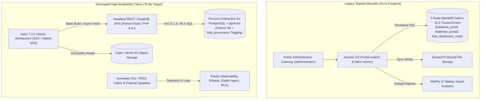

# Technical Migration Proposal: BDA Portal Architecture Modernisation (Joomla 3 to Astro 7.3.2)

**Document Version:** 1.0
**Author:** Lead Systems Architect
**Target Architecture:** Decoupled, High-Availability (HA), Static-First Infrastructure
**Infrastructure Scope:** `bda-ai-infra` (`https://bda.nres.gov.my/` / `bda.ketsa.gov.my`)

---

## 1. Executive Summary & Migration Vision

Through this operational blueprint, the primary objective is to completely decouple the legacy stateful monolithic architecture of `https://bda.nres.gov.my/` and migrate it to a modern, headless, and highly resilient framework.

An exhaustive audit of the existing *As-Is* environment reveals a heavy, stateful High Availability (HA) stack comprising Joomla 3 (versions 3.9.19 and 3.9.14), GlusterFS distributed storage, Nginx 1.18.0 reverse proxying, WildFly application servers, a 5-node MariaDB Galera cluster managed via ClusterControl, and Tableau visual analytics. By targeting **Astro 7.3.2** for the *To-Be* state, this proposal eliminates the compute overhead of dynamic CMS rendering, strictly adhering to national digital sovereignty and open-source software (FOSS) mandates.

By adhering to the **Deep State of Mind (DSOM)** protocol, execution follows four precise operations:
1. **Legacy Ingestion & Delta Mapping:** Dissecting existing database schemas (`bdaketsa_portal`, `bdaketsa_portal2`, `bda_dashboard_main`) and GlusterFS volumes to identify dependencies for deprecation or refactoring into headless API endpoints.
2. **State Transition Documentation (As-Is vs To-Be):** Authoring Git-native Markdown documenting legacy constraints and target decoupled architectures.
3. **Knowledge Base Ingestion (`.agents/brain`):** Injecting operational context into `.agents/brain` and `.agents/skills` to align autonomous AI execution context.
4. **Master Compilation:** Compiling all manifests, maps, and specifications via `dsom-technical-book-compiler` into an immutable source of truth.

---

## 2. Architectural Baseline (As-Is vs To-Be)

### 2.1 As-Is Footprint: Legacy Monolithic Stack

The legacy `bda.ketsa.gov.my` environment relies on a stateful, tightly coupled LAMP-stack architecture hosted on CentOS 8 virtual machines within a Proxmox VE 6.2-4 hypervisor cluster:

* **Application Core:** Serves the primary portal on Joomla! 3.9.19 (`Portal-node01`, HTTPS port `443`) and the main portal on Joomla! 3.9.14 (`Main-portal-node`, HTTPS port `443`).
* **Ingress Routing:** Nginx 1.18.0 reverse proxy gateway filtering incoming web traffic over HTTP/HTTPS.
* **Database Dependency:** Maintains persistent connections to a 5-node MariaDB Galera cluster (version 10.5.9) managed via ClusterControl, hosting `bdaketsa_portal`, `bdaketsa_portal2`, and `bda_dashboard_main`.
* **Storage & Redundancy:** Heavy infrastructure redundancy relying on GlusterFS shared file storage to synchronise media assets across application nodes.
* **Administrative Surface:** Publicly exposes administrative interfaces (`/administrator/`), presenting continuous zero-day vulnerability risks.
* **Operational Toil & Bottlenecks:**
  * *PHP-FPM Errors:* Requires manual intervention to verify available disk space and clear accumulated log files.
  * *Service Hangs:* Nginx and PHP-FPM processes freeze during traffic spikes or DDoS attacks, requiring administrators to manually restart services.
  * *Certificate Failures:* Expired SSL/TLS digital certificates cause HTTPS outages, demanding manual certificate installation.

### 2.2 To-Be Fabric: Astro 7.3.2 Decoupled Framework

The target architecture shifts from reactive server-side dynamic rendering to proactive build-time generation using Astro 7.3.2:

* **Compute Overhead Eradication:** Astro 7.3.2 utilizes Static Site Generation (SSG) with Islands Architecture or lightweight hybrid Server-Side Rendering (SSR). Pre-rendered HTML/CSS eliminates continuous PHP-FPM processing and database queries for page views.
* **Decoupled Intelligence:** Frontend rendering is severed from direct database access. Content is consumed via headless REST/GraphQL APIs (Python Flask or PHP 8.4+).
* **Storage Modernisation:** Complex GlusterFS shared storage is deprecated. Astro static build assets are packaged as immutable container images or served directly from S3-compatible object storage (e.g., Ceph or MinIO).
* **Zero-Trust Security Posture:** Compiling presentation layers to static HTML/CSS/JS removes PHP execution vectors from the frontend. Secure API authentication, strict input validation, and administrative-surface access controls are implemented separately as required security measures.
* **Deployment Resiliency:** The frontend becomes an immutable artifact, enabling zero-downtime deployments and instantaneous atomic rollbacks across Kubernetes nodes without database locking risks.

---

## 3. Dual-Render Architecture Diagram Blueprint

### 3.1 Standalone Production-Ready SVG Vector Graphic (`.svg`)

<svg xmlns="http://www.w3.org/2000/svg" viewBox="0 0 960 520" width="100%" height="100%">
  <defs>
    <marker id="arrow-astro" viewBox="0 0 10 10" refX="6" refY="5" markerWidth="6" markerHeight="6" orient="auto-start-reverse">
      <path d="M 0 0 L 10 5 L 0 10 z" fill="#64748B" />
    </marker>
    <filter id="shadow-astro" x="-4%" y="-4%" width="108%" height="108%">
      <feDropShadow dx="0" dy="2" stdDeviation="3" flood-color="#000000" flood-opacity="0.25"/>
    </filter>
  </defs>

  <!-- Background Canvas -->
  <rect width="960" height="520" fill="#0F172A" rx="10"/>

  <!-- As-Is Legacy Stack Container -->
  <rect x="20" y="20" width="450" height="440" fill="#1E293B" stroke="#EF4444" stroke-width="1.5" rx="8" filter="url(#shadow-astro)"/>
  <rect x="20" y="20" width="450" height="28" fill="#991B1B" rx="8"/>
  <text x="35" y="39" font-family="-apple-system, BlinkMacSystemFont, 'Segoe UI', Roboto, sans-serif" font-size="12" font-weight="bold" fill="#FEE2E2">AS-IS STATE: LEGACY STATEFUL MONOLITH (JOOMLA 3)</text>

  <!-- As-Is Sub-components -->
  <rect x="35" y="60" width="420" height="65" fill="#FEF2F2" stroke="#DC2626" stroke-width="1" rx="6"/>
  <text x="45" y="80" font-family="-apple-system, BlinkMacSystemFont, 'Segoe UI', Roboto, sans-serif" font-size="11" font-weight="bold" fill="#991B1B">Joomla 3.9 CMS Portals (PHP-FPM + Nginx 1.18)</text>
  <text x="45" y="98" font-family="Consolas, Monaco, monospace" font-size="10" fill="#7F1D1D">Portal-node01 (Primary) | Main-portal-node (Secondary)</text>
  <text x="45" y="114" font-family="-apple-system, BlinkMacSystemFont, 'Segoe UI', Roboto, sans-serif" font-size="10" fill="#991B1B">Public /administrator/ Exposed | Manual SSL &amp; Log Cleanup Toil</text>

  <rect x="35" y="140" width="420" height="65" fill="#FEF2F2" stroke="#DC2626" stroke-width="1" rx="6"/>
  <text x="45" y="160" font-family="-apple-system, BlinkMacSystemFont, 'Segoe UI', Roboto, sans-serif" font-size="11" font-weight="bold" fill="#991B1B">5-Node MariaDB Galera Cluster (10.5.9)</text>
  <text x="45" y="178" font-family="Consolas, Monaco, monospace" font-size="10" fill="#7F1D1D">Databases: bdaketsa_portal, bdaketsa_portal2, bda_dashboard_main</text>
  <text x="45" y="194" font-family="-apple-system, BlinkMacSystemFont, 'Segoe UI', Roboto, sans-serif" font-size="10" fill="#991B1B">Managed via ClusterControl | Persistent DB Connection Limits</text>

  <rect x="35" y="220" width="420" height="55" fill="#FEF2F2" stroke="#DC2626" stroke-width="1" rx="6"/>
  <text x="45" y="240" font-family="-apple-system, BlinkMacSystemFont, 'Segoe UI', Roboto, sans-serif" font-size="11" font-weight="bold" fill="#991B1B">GlusterFS Shared Storage Cluster</text>
  <text x="45" y="258" font-family="-apple-system, BlinkMacSystemFont, 'Segoe UI', Roboto, sans-serif" font-size="10" fill="#7F1D1D">Synchronises Joomla media assets across Proxmox VE VMs</text>

  <rect x="35" y="290" width="420" height="55" fill="#FEF2F2" stroke="#DC2626" stroke-width="1" rx="6"/>
  <text x="45" y="310" font-family="-apple-system, BlinkMacSystemFont, 'Segoe UI', Roboto, sans-serif" font-size="11" font-weight="bold" fill="#991B1B">WildFly &amp; Tableau Visual Analytics</text>
  <text x="45" y="328" font-family="-apple-system, BlinkMacSystemFont, 'Segoe UI', Roboto, sans-serif" font-size="10" fill="#7F1D1D">Proprietary licensing overhead &amp; monolithic application server</text>

  <rect x="35" y="360" width="420" height="85" fill="#FEF2F2" stroke="#B91C1C" stroke-width="1" rx="6"/>
  <text x="45" y="380" font-family="-apple-system, BlinkMacSystemFont, 'Segoe UI', Roboto, sans-serif" font-size="11" font-weight="bold" fill="#7F1D1D">Vulnerabilities &amp; Failure Modes</text>
  <text x="45" y="398" font-family="-apple-system, BlinkMacSystemFont, 'Segoe UI', Roboto, sans-serif" font-size="10" fill="#991B1B">• Service hangs during traffic bursts (Nginx / PHP-FPM)</text>
  <text x="45" y="414" font-family="-apple-system, BlinkMacSystemFont, 'Segoe UI', Roboto, sans-serif" font-size="10" fill="#991B1B">• PHP zero-day attack vector on exposed admin endpoints</text>
  <text x="45" y="430" font-family="-apple-system, BlinkMacSystemFont, 'Segoe UI', Roboto, sans-serif" font-size="10" fill="#991B1B">• Complex multi-node state synchronization bottlenecks</text>

  <!-- To-Be Target Stack Container -->
  <rect x="490" y="20" width="450" height="440" fill="#1E293B" stroke="#22C55E" stroke-width="1.5" rx="8" filter="url(#shadow-astro)"/>
  <rect x="490" y="20" width="450" height="28" fill="#065F46" rx="8"/>
  <text x="505" y="39" font-family="-apple-system, BlinkMacSystemFont, 'Segoe UI', Roboto, sans-serif" font-size="12" font-weight="bold" fill="#D1FAE5">TO-BE STATE: DECOUPLED ASTRO 7.3.2 FABRIC</text>

  <!-- To-Be Sub-components -->
  <rect x="505" y="60" width="420" height="65" fill="#F0FDF4" stroke="#16A34A" stroke-width="1" rx="6"/>
  <text x="515" y="80" font-family="-apple-system, BlinkMacSystemFont, 'Segoe UI', Roboto, sans-serif" font-size="11" font-weight="bold" fill="#15803D">Astro 7.3.2 Frontend (Islands Architecture)</text>
  <text x="515" y="98" font-family="Consolas, Monaco, monospace" font-size="10" fill="#166534">Static Site Generation (SSG) &amp; Hybrid SSR Containers</text>
  <text x="515" y="114" font-family="-apple-system, BlinkMacSystemFont, 'Segoe UI', Roboto, sans-serif" font-size="10" fill="#15803D">Zero dynamic PHP overhead | Zero public admin endpoints</text>

  <rect x="505" y="140" width="420" height="65" fill="#EFF6FF" stroke="#2563EB" stroke-width="1" rx="6"/>
  <text x="515" y="160" font-family="-apple-system, BlinkMacSystemFont, 'Segoe UI', Roboto, sans-serif" font-size="11" font-weight="bold" fill="#1E40AF">Container Orchestration &amp; Runtime</text>
  <text x="515" y="178" font-family="Consolas, Monaco, monospace" font-size="10" fill="#1E3A8A">Sovereign K3s / RKE2 Kubernetes &amp; Podman Quadlets</text>
  <text x="515" y="194" font-family="-apple-system, BlinkMacSystemFont, 'Segoe UI', Roboto, sans-serif" font-size="10" fill="#1E40AF">Embedded etcd datastore | systemd integration &amp; rollbacks</text>

  <rect x="505" y="220" width="420" height="65" fill="#FAF5FF" stroke="#9333EA" stroke-width="1" rx="6"/>
  <text x="515" y="240" font-family="-apple-system, BlinkMacSystemFont, 'Segoe UI', Roboto, sans-serif" font-size="11" font-weight="bold" fill="#7E22CE">Headless API Layer &amp; Database HA</text>
  <text x="515" y="258" font-family="Consolas, Monaco, monospace" font-size="10" fill="#581C87">REST/GraphQL (Flask/PHP 8.4+) + Patroni PostgreSQL 18</text>
  <text x="515" y="274" font-family="-apple-system, BlinkMacSystemFont, 'Segoe UI', Roboto, sans-serif" font-size="10" fill="#7E22CE">pgvector extension | bda_provenance cryptographic tags</text>

  <rect x="505" y="300" width="420" height="55" fill="#F0FDF4" stroke="#059669" stroke-width="1" rx="6"/>
  <text x="515" y="320" font-family="-apple-system, BlinkMacSystemFont, 'Segoe UI', Roboto, sans-serif" font-size="11" font-weight="bold" fill="#047857">S3-Compatible Object Storage (Ceph / MinIO)</text>
  <text x="515" y="338" font-family="-apple-system, BlinkMacSystemFont, 'Segoe UI', Roboto, sans-serif" font-size="10" fill="#065F46">High-performance asset storage replacing GlusterFS volumes</text>

  <rect x="505" y="370" width="420" height="75" fill="#EFF6FF" stroke="#3B82F6" stroke-width="1" rx="6"/>
  <text x="515" y="390" font-family="-apple-system, BlinkMacSystemFont, 'Segoe UI', Roboto, sans-serif" font-size="11" font-weight="bold" fill="#1D4ED8">Day 2 Observability &amp; Zero-Trust Security</text>
  <text x="515" y="408" font-family="-apple-system, BlinkMacSystemFont, 'Segoe UI', Roboto, sans-serif" font-size="10" fill="#1E40AF">• Elastic Observability (Kibana, Elastic Agent, RCA)</text>
  <text x="515" y="424" font-family="-apple-system, BlinkMacSystemFont, 'Segoe UI', Roboto, sans-serif" font-size="10" fill="#1E40AF">• Mutual TLS (mTLS 1.3) &amp; Transparent Data Encryption</text>

  <!-- Figure Caption -->
  <text x="480" y="500" text-anchor="middle" font-family="-apple-system, BlinkMacSystemFont, 'Segoe UI', Roboto, sans-serif" font-size="11" font-weight="bold" fill="#94A3B8">Figure 1.1: BDA Portal Architecture Transition — Legacy Stateful Monolith (As-Is) to Decoupled Astro 7.3.2 Fabric (To-Be)</text>
</svg>

### 3.2 Git-Native Mermaid Topology (`.mmd`)

### 3.3 Summary Interface & Routing Table

| Source Component | Target Component | Port / Protocol / API Ingress | Security Boundary / Trust Zone / Access Key | Operational Significance / Flow Description |
| :--- | :--- | :--- | :--- | :--- |
| **Legacy Clients / Browsers** | **Joomla 3 Monolith (As-Is)** | `HTTPS (443)` / Dynamic PHP | Exposed `/administrator/` Path | Serves web traffic via PHP-FPM; vulnerable to zero-day attacks and service hangs. |
| **Joomla 3 Application Core** | **MariaDB Galera Cluster** | `TCP 3306` / Unencrypted SQL | Local Network / Database Credentials | Maintains persistent database connections, creating connection pooling bottlenecks. |
| **Astro 7.3.2 Static Frontend** | **Headless API Gateway** | `HTTPS (443)` / REST & GraphQL | Bearer Token / API Scope | Ingests data at build time (SSG) or asynchronously (hydration), decoupling presentation from DB. |
| **Headless API Gateway** | **Patroni PostgreSQL + pgvector** | `TCP 5432` / mTLS 1.3 | PostgreSQL Row-Level Security (RLS) | Queries Tier 0 SSoT with automated HA failover and `bda_provenance` cryptographic metadata tags. |
| **K3s / Podman Quadlets** | **Elastic Observability Stack** | `TCP 9200/5044` / Elastic Agent | OIDC JWT / Encrypted TLS | Streamlines Day 2 log analytics, anomaly detection, and automated Root Cause Analysis (RCA). |

---

## 4. Digital Sovereignty & Compute Fabric

### 4.1 Container Orchestration: Sovereign K3s / RKE2
To satisfy strict digital sovereignty requirements, the compute layer is deployed on self-hosted Kubernetes fabrics (K3s with embedded etcd datastore or RKE2):
* **Embedded High Availability:** K3s configured with an embedded etcd cluster provides fault-tolerant control planes without requiring external database dependencies.
* **Lightweight Footprint:** Reduces node resource overhead while retaining full CNCF Kubernetes compliance.

### 4.2 Immutable Deployments: Podman Quadlets & systemd
For lightweight single-node or edge deployments, Astro builds are packaged via **Podman Quadlets**:
* **Systemd Native Management:** Integrates container lifecycle management directly into `systemd`, ensuring automatic restart on boot, clean dependency ordering, and predictable process supervision.
* **Atomic Rollbacks:** Upgrades are executed as immutable image tag updates, enabling sub-second rollbacks if health checks fail.

---

## 5. Data Ingestion, API Modernisation & Database HA

### 5.1 Headless API Integration Layer
Replacing Joomla's monolithic data coupling involves introducing a dedicated containerised API layer (Python Flask or modern PHP 8.4+):
* **Asynchronous Data Retrieval:** Static Astro sites fetch data asynchronously during build time or client hydration, insulating backend databases from traffic surges.
* **Decoupled Data Contracts:** Open API specifications (OpenAPI / TypeSchema) define immutable data contracts between frontend presentation and backend storage.

### 5.2 Database High Availability: Percona PostgreSQL + Patroni
Legacy MariaDB Galera clusters are migrated to **Percona Distribution for PostgreSQL** with `pgvector`, managed by **Patroni**:
* **Automated Failover:** Patroni leverages etcd consensus to execute leader elections and automated failover in under 10 seconds.
* **Vector Analytics:** `pgvector` enables spatial analytics and AI vector similarity search directly alongside structured relational data.
* **Single Authoritative Writer:** Apache NiFi 2.0 acts as the sole authoritative writer for Tier 0 Golden SSoT data, appending `bda_provenance` cryptographic signature metadata (`signature`, `key_id`, `verification_status`, `verification_timestamp`, `signature_algorithm`, `signature_encoding`) to ensure total auditability.

---

## 6. Day 2 Operations, Observability & Security

### 6.1 AIOps Integration: Elastic Observability
Day 2 operations default to **Elastic Observability** (Elasticsearch, Kibana, Elastic Agent):
* **Centralised Log Intelligence:** Ingests container logs, API latency metrics, and ingress audit trails across Astro nodes and API gateways.
* **Automated RCA Correlation:** Anomaly detection engines automatically flag error rate spikes and correlate root cause analysis (RCA) across decoupled services.

### 6.2 Zero-Trust Security Architecture
* **Mutual TLS (mTLS 1.3):** Enforces encrypted, authenticated inter-pod communication across the service mesh.
* **Transparent Data Encryption (TDE):** Protects static data volumes and database tables at rest.
* **Attack Surface Eradication:** Removing PHP execution from web-facing servers completely eliminates CMS-specific vulnerability vectors.

---

## 7. DSOM 4-Phase Migration Execution Pipeline

Following the Deep State of Mind (DSOM) framework, execution proceeds through four sequential operations:

1. **Phase 1: Legacy Ingestion & Delta Mapping**
   * Dissect `bdaketsa_portal`, `bdaketsa_portal2`, and `bda_dashboard_main` MariaDB schemas.
   * Extract GlusterFS media assets and map endpoints to S3 bucket structures.
2. **Phase 2: State Transition Documentation (As-Is vs To-Be)**
   * Formalise state comparison within `docs/proposals/nre-bda-astro-migration.md`.
3. **Phase 3: Knowledge Base Ingestion (`.agents/brain`)**
   * Inject extracted operational intelligence into `.agents/brain/` spatial memory files (`task.md`, `walkthrough.md`, `palace_registry.md`) and `.agents/skills/`.
4. **Phase 4: Master Compilation**
   * Synchronise and compile all paperwork into the master handbook via `dsom-technical-book-compiler`.
