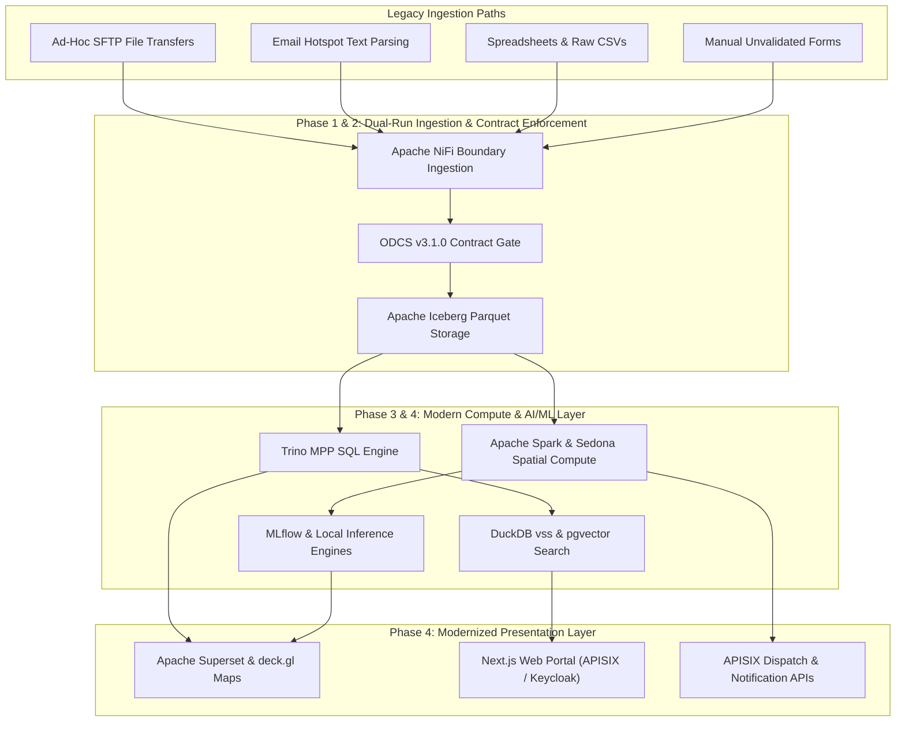
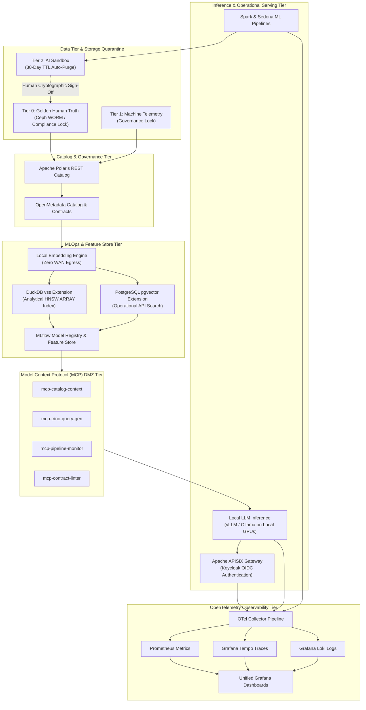

# 5-Year Strategic BDA & AI Roadmap & Master Business Case Specification (2026–2030)

This master document outlines the **5-Year Strategic Plan (2026–2030)** for modernizing Big Data Analytics (BDA) with Machine Learning (ML) and Artificial Intelligence (AI). It establishes a unified, 100% open-source Single Source of Truth (SSoT) Data Lakehouse architecture designed to guarantee zero vendor lock-in, strict data sovereignty, complete operational continuity, and rapid business case expansion.

---

## 1. Master Big Picture Business Case

### Executive Summary & Vision
The primary objective of the Big Data Analytics (BDA) platform modernization is to transform fragmented legacy data stores into a high-performance, open-source S3-compatible Lakehouse ecosystem. By integrating advanced Machine Learning (ML) and Artificial Intelligence (AI) natively into the data pipeline, the platform transitions enterprise analytics from reactive reporting to proactive, predictive, and autonomous operational decision-making.

```
+-----------------------------------------------------------------------------------+
|                        THE BDA & AI BIG PICTURE BUSINESS CASE                      |
+-----------------------------------------------------------------------------------+
|  GOAL 1: Modernize Legacy Infrastructure into 100% Open-Source SSoT Lakehouse     |
|  GOAL 2: Ensure 100% Continuity & Zero Downtime Migration for Existing Cases    |
|  GOAL 3: Embed Zero-Trust Local AI/ML & Autonomous Agents via Sandboxing & MCP    |
|  GOAL 4: Provide Rapid Framework to Onboard & Scale New AI/ML Business Cases     |
+-----------------------------------------------------------------------------------+
```

### Strategic Value Drivers & Return on Investment (ROI)

| Value Driver | Legacy BDA Challenge | Modernized BDA + AI Target | Quantifiable Business Impact |
| :--- | :--- | :--- | :--- |
| **Total Cost of Ownership (TCO)** | Expensive proprietary server licenses, closed SANs, and proprietary BI seats. | 100% Open-Source stack (Proxmox VE, RKE2, Ceph SDS, Apache Iceberg, Superset). | **60%–70% reduction** in recurring software licensing and vendor lock-in costs. |
| **Data Recency & Velocity** | Batch ETL jobs taking hours/days; manual spreadsheet compilations. | Real-time streaming via Apache NiFi, Spark Streaming, and APISIX gateway. | Reduction in alert latency from **hours to under 30 seconds** for hazard events. |
| **Data Trust & Governance** | Fragmented silos, unverified data feeds, lack of column-level lineage. | OpenMetadata SSoT catalog, Linux Foundation ODCS v3.1.0 data contracts, OpenLineage. | **100% data provenance auditability** and zero schema drift across all domains. |
| **AI/ML Scalability** | Ad-hoc unmonitored scripts, proprietary AI cloud dependencies, WAN egress risks. | Local zero-trust vector search (DuckDB `vss`, `pgvector`), MCP sandboxing, OTel monitoring. | **Zero WAN data egress**, total data sovereignty, and secure agentic orchestration. |

---

## 2. 5-Year Strategic Horizon Roadmap (2026–2030)

```
Year 1 (2026): Foundation & Dual-Run Ingestion
├── Ceph / MinIO Object Storage with S3 Object Lock (WORM)
├── Apache Polaris REST Catalog & OpenMetadata Data Catalog
└── Apache NiFi Dual-Run Ingestion (Zero impact to legacy)

Year 2 (2027): Compute Modernization & Iceberg Migration
├── Trino MPP Query Engine & Apache Spark + Sedona Compute
├── ODCS v3.1.0 Data Contract Enforcement & OpenLineage Tracing
└── Historical Data Conversion to Apache Iceberg Parquet Tables

Year 3 (2028): Local AI/ML Sandboxing & Zero-Trust RAG
├── Model Context Protocol (MCP) Isolated DMZ Server Deployment
├── DuckDB vss & PostgreSQL pgvector Local Vector Search Engine
└── OpenTelemetry Full-Stack Observability (Airflow, Spark, APISIX)

Year 4 (2029): MLOps Pipeline & Enterprise Autonomous Agents
├── Feature Store (Feast for feature versioning & retrieval), MLflow (Model Registry & Experiment Tracking) & vLLM Local Inference
├── Automated Anomaly Detection & Real-Time Predictive Pipelines
└── Keycloak-Gated Natural Language Query & Interactive Copilots

Year 5 (2030): Predictive Digital Twin & Self-Healing Lakehouse
├── Multi-Domain Predictive Digital Twin (Spatial Hydro-Geological Simulations)
├── Autonomous Data Quality Healing & Self-Optimizing Indexing
└── Inter-Agency Federated Open Data Ecosystem
```

### Year-by-Year Milestones & Objectives

#### Year 1 (2026) — Infrastructure Foundation & Dual-Run Ingestion
- Deploy resilient, bare-metal enterprise storage using Ceph SDS and MinIO with WORM (S3 Object Lock) immutability.
- Stand up Apache Polaris as the centralized multi-engine Iceberg REST catalog and OpenMetadata for metadata discovery.
- Deploy Apache NiFi at boundary networks to mirror incoming data feeds alongside legacy systems with zero production downtime.

#### Year 2 (2027) — Compute Modernization, Data Contracts & Iceberg Migration
- Provision Trino MPP SQL and Apache Spark / Sedona spatial compute clusters connected to the Polaris catalog.
- Formalize Linux Foundation ODCS v3.1.0 data contracts across all domain pipelines.
- Execute automated Spark conversion jobs migrating legacy HDFS, GlusterFS, and relational data into Apache Iceberg table formats.
- Instrument Airflow orchestrators with OpenLineage runtime emission for end-to-end lineage tracking.

#### Year 3 (2028) — Local Zero-Trust AI/ML Sandboxing & Hybrid RAG
- Deploy containerized Model Context Protocol (MCP) servers (`mcp-catalog-context`, `mcp-trino-query-gen`, `mcp-pipeline-monitor`, `mcp-contract-linter`) in isolated DMZ environments using read-only roles.
- Integrate DuckDB `vss` and PostgreSQL `pgvector` with OpenMetadata for zero-trust local semantic search and Hybrid RAG.
- Enforce the **Human-to-AI Quarantine Model** (Tier 0 SSoT, Tier 1 Telemetry, Tier 2 AI Sandbox with 30-day TTL).
- Instrument Airflow, Spark, and APISIX with OpenTelemetry Collectors feeding Prometheus, Tempo, Loki, and Grafana.

#### Year 4 (2029) — MLOps Pipeline & Enterprise Autonomous Agents
- Implement Feast as the enterprise Feature Store responsible for feature versioning, feature definitions, online feature retrieval (backed by PostgreSQL), and offline training dataset generation (backed by Apache Iceberg Parquet). Deploy MLflow for experiment tracking, model lineage, and central model registry, while DuckDB is utilized strictly for local ad-hoc vector and analytical queries.
- Deploy local GPU-accelerated inference endpoints using vLLM or Ollama for local LLM execution.
- Launch automated real-time prediction pipelines across all five core business domains.
- Roll out Keycloak-gated conversational AI assistants for natural language SQL query generation and spatial data exploration.

#### Year 5 (2030) — Predictive Digital Twin & Self-Healing Lakehouse
- Consolidate multi-domain analytical outputs into a unified Predictive Multi-Domain Digital Twin for national environmental modeling.
- Implement self-healing lakehouse operations using autonomous AI agents to detect schema anomalies, clean bad data, and trigger auto-reindexing.
- Establish secure inter-agency federated data sharing via open APIs behind Apache APISIX and Keycloak OIDC.

---

## 3. Migration, Maintenance, and Growth Strategy for Current Business Cases

To ensure complete business continuity, the 5 core legacy business cases are systematically migrated to the modern AI Lakehouse without operational disruption, followed by long-term maintenance and AI enhancement plans.



### Core Business Domains Migration & Maintenance Matrix

| Business Domain Module | Migration Path & Dual-Run Strategy | Modern Open-Source Integration | AI & ML Infrastructure Enhancement | Maintenance & SLA Guarantee |
| :--- | :--- | :--- | :--- | :--- |
| **1. Human-Wildlife Incident Management (HWC)** | Replace manual forms with GeoJSON REST APIs in NiFi. Parallel run with legacy form store for 30 days. | GeoJSON API -> NiFi -> ODCS Gate -> Iceberg -> PostGIS -> Apache Superset. | Spatial clustering (DBSCAN/K-Means), wildlife corridor movement prediction models. | 99.9% ingestion uptime; sub-second incident heatmap rendering. |
| **2. Groundwater Potential (GroW)** | Mirror raw borehole logs and well test CSVs via NiFi to MinIO/Ceph object storage. | NiFi Parquet conversion -> Apache Spark/Sedona -> Trino / Superset. | Subsurface lithology classification via Random Forest/XGBoost; automated aquifer yield estimation. | Automated row-count and SHA-256 validation; zero data loss during conversion. |
| **3. Forest Fire Analysis & Prediction** | Replace manual thermal email parsing with automated HTTPS polling of satellite thermal anomaly APIs. | Satellite REST API -> NiFi -> Sedona spatial join with weather grids -> Iceberg. | Random Forest fire risk scoring; LSTM thermal spread prediction; automated biomass susceptibility scoring. | Real-time thermal hotspot ingestion in **< 3 minutes**; automated risk push via APISIX. |
| **4. Climate Change Vulnerability (MAIN)** | Consolidate fragmented spreadsheets into versioned Iceberg tables enforcing $0.0 \le \text{Index} \le 1.0$. | Versioned Iceberg tables -> Data Contract assertions -> Superset dashboards. | Multi-variate climate impact projection modeling; automated vulnerability trend anomaly detection. | Historical baseline checksum verification; zero contract constraint violations. |
| **5. Geological Landslide Management (GeoSlide)** | Replace manual SFTP transfers with continuous NiFi precipitation telemetry streaming. | Telemetry streaming -> Spark Streaming rainfall threshold matching -> APISIX alerts. | Dynamic rainfall-slope failure threshold modeling using neural networks; real-time early hazard warning generation. | Telemetry ingestion latency **< 10 seconds**; high-priority hazard payload routing via APISIX. |

---

## 4. Framework for Prototyping, Building, and Scaling New AI Business Cases

To ensure the organization can seamlessly build and launch new AI business cases over the 5-year planning period, a standardized 6-stage lifecycle framework is established.

```
Stage 1: Business Case Definition & ODCS Contract Formulation
└── Define domain objectives, SLA metrics, and machine-readable ODCS v3.1.0 contract schema.

Stage 2: Ingestion & Metadata Registration in OpenMetadata
└── Provision NiFi flow, register asset in OpenMetadata, attach security & domain tags.

Stage 3: Feature Engineering & Tier 2 AI Sandboxing
└── Materialize features in Feast (offline Iceberg store & online PostgreSQL store); log experiment tracking in MLflow; run exploratory vector analytics in DuckDB; execute exploratory modeling in Tier 2 Sandbox.

Stage 4: Model Validation & Human Cryptographic Sign-Off
└── Validate model precision/recall metrics; human domain specialist signs payload for Tier 0.

Stage 5: Production Deployment & APISIX API Exposure
└── Deploy inference container (vLLM/Ollama/Triton); expose endpoints via APISIX with Keycloak SSO.

Stage 6: Full-Stack OTel Monitoring & Lifecycle Management
└── Instrument with OTel Collectors; monitor feature drift, prediction latency, and model accuracy.
```

### Potential Strategic New Business Cases (2026–2030)

1. **Generative Spatial Intelligence Copilot:** Natural language interface enabling non-technical users to query complex spatial datasets (e.g., "Show all areas with high landslide risk near gazetted forests where rainfall exceeded 100mm today").
2. **Autonomous Disaster Dispatch & Resource Routing:** Real-time AI agent routing emergency response teams based on combined flooding telemetry, road closure vectors, and landslide risk scores.
3. **Climate Financial Risk & Carbon Sequestration Modeling:** ML models quantifying forest biomass carbon capture credits and assessing physical risk ratings for infrastructure investments.
4. **Satellite Imagery Anomaly & Deforestation Detection:** Computer vision pipeline processing Sentinel/Landsat imagery to automatically detect illegal land clearing or canopy degradation in near-real-time.

---

## 5. End-to-End Machine Learning and AI Architecture

The platform embeds ML and AI capabilities directly into the Lakehouse ecosystem while enforcing strict isolation, security, and observability.



### Core AI Infrastructure Components

1. **Human-to-AI Quarantine Topology:**
   - **Tier 0 (Golden SSoT):** Immutable, WORM-protected store containing certified human ground truth. AI has zero write access.
   - **Tier 1 (Machine Telemetry):** Direct sensor feeds with automated contract validation.
   - **Tier 2 (AI Sandbox):** Sandboxed workspace with automated 30-day TTL purges where AI models execute, generate scratch outputs, and compute predictions.
2. **Model Context Protocol (MCP) Servers:**
   - Operating in an isolated DMZ container environment over JSON-RPC 2.0.
   - Restricted to stateless operational utilities (`validate_sql`, `lint_contract`, `read_schema`) with zero write capabilities to ground truth.
3. **Local Zero-Trust Vector Search & Hybrid RAG:**
   - **DuckDB `vss`:** Explicitly labeled as an experimental extension, evaluated during Stage 3 / Year 3 for embedded HNSW vector indexing over fixed-size `ARRAY` columns in Parquet tables for fast batch analytical similarity search. Due to its experimental status and in-memory, RAM-bound constraints, production adoption requires passing a formal qualification gate; PostgreSQL `pgvector` serves as the primary supported production fallback.
   - **`pgvector`:** Powers sub-10ms operational API search and interactive portal lookups inside the HA PostgreSQL database.
   - **Zero WAN Egress:** Local sentence transformer embeddings ensure sensitive enterprise metadata never leaves on-premises infrastructure. Egress isolation is strictly enforced via deny-by-default network security policies, egress proxy allowlists, local DNS sinkholing, and automated CI/CD acceptance tests verifying zero WAN egress.
4. **Full-Stack OpenTelemetry Observability:**
   - Unified OTel Collectors capture traces, metrics, and logs across Airflow, Spark, APISIX, and ML inference engines.
   - Pushes metrics to Prometheus, traces to Grafana Tempo, and logs to Grafana Loki for centralized Grafana monitoring.

---

## 6. Summary Business Case Matrix & Governance Sign-Off

| Strategic Milestone | Target Completion | Success Metric / SLA | Primary Responsible Component |
| :--- | :--- | :--- | :--- |
| **Ceph/MinIO & Polaris Baseline** | Q2 2026 | 100% S3 Object Lock compliance; multi-engine Iceberg REST connectivity. | Infrastructure & Ceph Team |
| **Legacy Ingestion Mirroring** | Q4 2026 | Zero downtime; dual-run parity across all 5 core domain feeds. | Data Engineering & Apache NiFi |
| **Compute & Contract Migration** | Q2 2027 | 100% ODCS v3.1.0 contract compliance; automated OpenLineage emission. | Platform Team & Trino/Spark |
| **Local Vector Search & MCP Deployment** | Q4 2028 | Sub-10ms semantic search; zero WAN egress; isolated DMZ sandboxes. | AI Infrastructure & Security |
| **Full MLOps & Copilot Launch** | Q4 2029 | MLflow registry online; Keycloak-gated natural language query portal live. | MLOps Team & APISIX/Keycloak |
| **Predictive Digital Twin** | Q4 2030 | Multi-domain spatial simulation operational; self-healing lakehouse enabled. | Enterprise Architecture |
