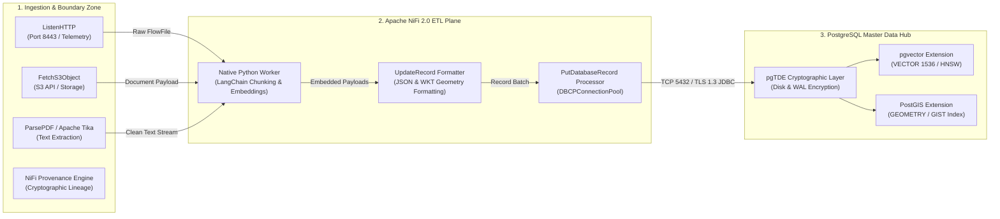
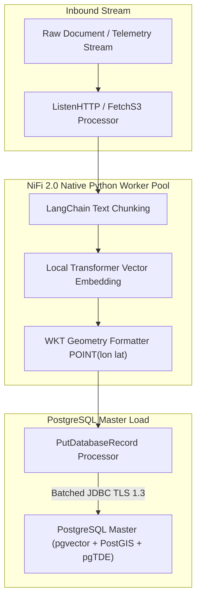

# Apache NiFi 2.0 Master Data Plane Architecture and Migration Guide

This reference specification establishes **Apache NiFi 2.0** as the primary master data plane, streaming ingestion, and Extract-Transform-Load (ETL/ELT) engine for the Big Data Analytics (BDA) and Enterprise AI infrastructure. It details the integration between Apache NiFi 2.0 and a unified PostgreSQL Master database equipped with `pgvector`, `PostGIS`, and `pgTDE`, alongside a step-by-step migration blueprint from legacy Apache NiFi 1.x environments.

---

## 1. Introduction & Strategic Overview

The rapid industrialization of Generative AI (GenAI) and Large Language Models (LLMs) has forced an architectural re-evaluation of data pipelines. While early AI systems relied on fragmented data stacks—separating relational operational metadata from specialized vector stores and geographic databases—modern enterprise applications require consolidated, secure, and unified environments. Building production-grade AI systems, particularly those utilizing Retrieval-Augmented Generation (RAG) and multimodal spatio-temporal tracking, places intense pressure on data logistics.

To manage this complexity, infrastructure architects are increasingly deploying unified storage hubs. PostgreSQL has emerged as the definitive enterprise open-source master database by incorporating advanced multi-model capabilities via extensions. By integrating `pgvector` for high-dimensional semantic vector storage, `PostGIS` for advanced geospatial topologies, and `pgTDE` (Transparent Data Encryption) for cryptographic rest-layer security, PostgreSQL transitions from a traditional relational storage engine into a unified AI Data Platform.

However, a unified data store requires an equally mature, high-throughput, and observable data logistics engine. The release of Apache NiFi 2.0 solves this orchestration challenge. With its native Python extensions, stateless architecture, and seamless database virtualization drivers, NiFi 2.0 acts as the ultimate automated data plane feeding this secure PostgreSQL master. This document details the technical integration of Apache NiFi 2.0 with an encrypted, spatial-vector PostgreSQL ecosystem and provides a complete architectural blueprint for enterprise AI Data Infrastructure.

---

## 2. The Unified Master Architecture: PostgreSQL as the Core AI Lakehouse

Traditional architectures often introduce data fragmentation by deploying distinct databases for different data types (e.g., standalone vector databases for embeddings, document stores for unstructured content, and relational databases for transactional operations). This fragmentation introduces latency, data synchronization hazards, and severe administrative overhead.

The modern approach consolidates these capabilities into a single, high-availability PostgreSQL Master instance:

```
┌──────────────────────────────────────────────────────────┐
│             POSTGRESQL MASTER DATA INFRA                 │
│  ┌────────────────────────────────────────────────────┐  │
│  │         pgTDE (Transparent Data Encryption)        │  │
│  │   Encrypts Tablespaces, WAL, and Vector Logs       │  │
│  └─────────────────────────┬──────────────────────────┘  │
│                            ▼                             │
│       ┌────────────────────┴────────────────────┐        │
│       ▼                                         ▼        │
│ ┌───────────┐                             ┌───────────┐  │
│ │ pgvector  │                             │  PostGIS  │  │
│ │ HNSW/IVFF │                             │ Spatial R-│  │
│ │ Indexes   │                             │   Trees   │  │
│ └───────────┘                             └───────────┘  │
└──────────────────────────────────────────────────────────┘
```

### Core Architecture Components

1. **Semantic Layer (`pgvector`):** By storing text fragments alongside their coordinate vectors natively in the same row, applications can query structured fields and compute cosine distances or inner products using standard, highly optimized SQL queries (`vector_cosine_ops`, HNSW, or IVFFlat indexing).
2. **Geospatial Layer (`PostGIS`):** AI pipelines tracking physical asset movements, logistics fleets, or location-based environmental contexts run bounding-box, distance-based, and polygon intersection calculations directly alongside text and vector indices using R-Tree spatial indexing.
3. **Cryptographic Layer (`pgTDE`):** Because embedding vectors map directly back to sensitive enterprise secrets and proprietary documents, `pgTDE` (deployed via Percona Distribution for PostgreSQL) provides transparent disk-level encryption. When configured with an external key provider (e.g., HashiCorp Vault or key file) and explicit WAL encryption, `pgTDE` encrypts underlying tablespace data files and Write-Ahead Logs at rest without modifying downstream application layers or SQL execution paths. (Note: temporary spill files are not automatically encrypted by current `pgTDE` versions and require strict `work_mem` RAM bounds).

---

## 3. Architectural Synergy: NiFi 2.0 & PostgreSQL Integration

Apache NiFi 2.0 serves as the primary system of ingestion, transformation, and load (ETL/ELT) for this unified data hub. The core engineering components enabling this synergy include:

### 3.1 High-Performance JDBC Virtualization

NiFi 2.0 interacts with PostgreSQL via an updated asynchronous `DBCPConnectionPool` (Database Connection Pool) controller service, passing data via the native PostgreSQL JDBC driver. This pooling layer dynamically adjusts to database connection ceilings, handling transaction auto-commits, custom isolation levels, and secure TLS 1.3 encryption tunnels natively between NiFi and the PostgreSQL Master.

### 3.2 The Native Python ETL Lifecycle

In legacy versions (NiFi 1.x), data scaling and transformations utilizing Python scripts required fragile wrappers like Jython or subprocess execution calls. NiFi 2.0 introduces an isolated native Python process pool. This pool allows data engineers to run complex parsing scripts natively on incoming unstructured text before database insertion:

```
[Raw Inbound Stream] ──► [NiFi Ingestion Engine] ──► [Native Python Worker]
                                                            │
                                                            ▼
                                                * LangChain Text Chunking
                                                * Embedding Generation
                                                            │
                                                            ▼
[PostgreSQL Master Hub] ◄── [PutDatabaseRecord] ◄───────────┘
```

During this phase, text chunks are passed through tokenization schemes (e.g., `tiktoken`, Hugging Face Tokenizers), converted into structural arrays, and mapped straight into NiFi FlowFile attributes or internal record schemas before being committed to the database.

---

## 4. Implementation Blueprint & Database Schemas

### 4.1 Database Initialization

To construct the master data infrastructure, the PostgreSQL instance initializes extensions and establishes target physical schemas:

```sql
-- Initialize core extensions within the master instance
CREATE EXTENSION IF NOT EXISTS vector;
CREATE EXTENSION IF NOT EXISTS postgis;
CREATE EXTENSION IF NOT EXISTS postgis_topology;

-- Create target unified enterprise knowledge repository
CREATE TABLE secure_ai_lakehouse (
    uuid UUID PRIMARY KEY DEFAULT gen_random_uuid(),
    source_origin VARCHAR(255) NOT NULL,
    payload_content TEXT NOT NULL,
    spatial_coordinates GEOMETRY(Point, 4326), -- PostGIS Spatial Data (SRID 4326)
    semantic_embedding VECTOR(1536),           -- pgvector Space (e.g., OpenAI text-embedding-3)
    ingested_timestamp TIMESTAMP WITH TIME ZONE DEFAULT CURRENT_TIMESTAMP
);

-- Construct spatial and vector indexes for ultra-low latency searches
CREATE INDEX idx_spatial_geo ON secure_ai_lakehouse USING GIST (spatial_coordinates);
CREATE INDEX idx_vector_hnsw ON secure_ai_lakehouse USING HNSW (semantic_embedding vector_cosine_ops);
```

### 4.2 End-to-End NiFi 2.0 Pipeline Dataflow

The unified ingest pipeline uses specific functional processors to clean data and structure it for the PostgreSQL engine:

1. **Ingestion (`ListenHTTP` / `FetchS3Object`):** Monitors corporate storage and streaming endpoints, catching documents, API telemetry, or location logs.
2. **Extraction (Extension-based Parsers):** Strips raw markup or structural tags (using Apache Tika or PDF parsers), turning documents into clean text.
3. **Transformation (Native Python Processor):**
   - Reads the content stream.
   - Applies a `RecursiveCharacterTextSplitter` to generate chunks (e.g., 500 characters with 10% overlap).
   - Calls local or cloud embedding engines to generate a 1536-dimension float array.
   - Extracts geographic coordinate parameters (Latitude, Longitude) embedded within file metadata.
4. **Formatting (`UpdateRecord`):** Converts the output payload into a clean JSON structure, formatting location into standard Well-Known Text (WKT) format: `POINT(longitude latitude)`.
5. **Persistence (`PutDatabaseRecord`):** Connects to the PostgreSQL `DBCPConnectionPool`. The system streams rows into the target table, where the PostgreSQL driver maps the text array directly to the `VECTOR` column and converts the WKT string into native `GEOMETRY` objects.

---

## 5. Modern Data Architecture Visual Topology (Dual-Render Specification)

The following diagrams illustrate the end-to-end dataflow between boundary ingestion sources, Apache NiFi 2.0 native Python processing pools, and the PostgreSQL Master database.

### 5.1 Standalone Production Vector Diagram (SVG)

<svg xmlns="http://www.w3.org/2000/svg" viewBox="0 0 1000 520" width="100%" height="100%">
  <defs>
    <marker id="arrow" viewBox="0 0 10 10" refX="6" refY="5" markerWidth="6" markerHeight="6" orient="auto-start-reverse">
      <path d="M 0 0 L 10 5 L 0 10 z" fill="#64748B" />
    </marker>
    <filter id="shadow" x="-5%" y="-5%" width="110%" height="110%">
      <feDropShadow dx="2" dy="2" stdDeviation="3" flood-color="#000000" flood-opacity="0.25" />
    </filter>
  </defs>

  <!-- Canvas Background -->
  <rect width="1000" height="520" fill="#0F172A" rx="12" />

  <!-- Zone 1: Ingestion Zone -->
  <rect x="20" y="20" width="280" height="480" fill="#1E293B" stroke="#334155" stroke-width="1.5" rx="10" filter="url(#shadow)" />
  <rect x="20" y="20" width="280" height="40" fill="#0F172A" rx="10" />
  <text x="35" y="45" font-family="-apple-system, BlinkMacSystemFont, 'Segoe UI', Roboto, sans-serif" font-size="14" font-weight="bold" fill="#60A5FA">1. INGESTION &amp; BOUNDARY ZONE</text>

  <!-- Ingestion Nodes -->
  <rect x="40" y="80" width="240" height="70" fill="#0F172A" stroke="#334155" stroke-width="1" rx="6" />
  <text x="55" y="105" font-family="-apple-system, BlinkMacSystemFont, 'Segoe UI', Roboto, sans-serif" font-size="13" font-weight="bold" fill="#F8FAFC">REST / Telemetry Stream</text>
  <text x="55" y="125" font-family="Monaco, Consolas, monospace" font-size="11" fill="#60A5FA">ListenHTTP (Port 8443)</text>

  <rect x="40" y="170" width="240" height="70" fill="#0F172A" stroke="#334155" stroke-width="1" rx="6" />
  <text x="55" y="195" font-family="-apple-system, BlinkMacSystemFont, 'Segoe UI', Roboto, sans-serif" font-size="13" font-weight="bold" fill="#F8FAFC">Object Storage Feed</text>
  <text x="55" y="215" font-family="Monaco, Consolas, monospace" font-size="11" fill="#38BDF8">FetchS3Object (S3 API)</text>

  <rect x="40" y="260" width="240" height="70" fill="#0F172A" stroke="#334155" stroke-width="1" rx="6" />
  <text x="55" y="285" font-family="-apple-system, BlinkMacSystemFont, 'Segoe UI', Roboto, sans-serif" font-size="13" font-weight="bold" fill="#F8FAFC">Document Parsers</text>
  <text x="55" y="305" font-family="Monaco, Consolas, monospace" font-size="11" fill="#94A3B8">ParsePDF / Apache Tika</text>

  <rect x="40" y="350" width="240" height="130" fill="#0F172A" stroke="#F59E0B" stroke-width="1" rx="6" />
  <text x="55" y="375" font-family="-apple-system, BlinkMacSystemFont, 'Segoe UI', Roboto, sans-serif" font-size="13" font-weight="bold" fill="#FDE68A">NiFi Provenance Engine</text>
  <text x="55" y="395" font-family="-apple-system, BlinkMacSystemFont, 'Segoe UI', Roboto, sans-serif" font-size="11" fill="#E2E8F0">FlowFile Audit &amp; Lineage</text>
  <text x="55" y="415" font-family="Monaco, Consolas, monospace" font-size="10" fill="#FBBF24">Cryptographic Chain of Trust</text>
  <text x="55" y="435" font-family="Monaco, Consolas, monospace" font-size="10" fill="#FBBF24">Zero Data Loss Provenance</text>

  <!-- Zone 2: Apache NiFi 2.0 Engine -->
  <rect x="340" y="20" width="320" height="480" fill="#1E293B" stroke="#334155" stroke-width="1.5" rx="10" filter="url(#shadow)" />
  <rect x="340" y="20" width="320" height="40" fill="#0F172A" rx="10" />
  <text x="355" y="45" font-family="-apple-system, BlinkMacSystemFont, 'Segoe UI', Roboto, sans-serif" font-size="14" font-weight="bold" fill="#4ADE80">2. APACHE NIFI 2.0 ETL PLANE</text>

  <rect x="360" y="80" width="280" height="110" fill="#0F172A" stroke="#22C55E" stroke-width="1.5" rx="6" />
  <text x="375" y="105" font-family="-apple-system, BlinkMacSystemFont, 'Segoe UI', Roboto, sans-serif" font-size="13" font-weight="bold" fill="#86EFAC">Native Python Process Pool</text>
  <text x="375" y="125" font-family="Monaco, Consolas, monospace" font-size="11" fill="#4ADE80">• LangChain Text Chunking</text>
  <text x="375" y="145" font-family="Monaco, Consolas, monospace" font-size="11" fill="#4ADE80">• OpenAI / Local Embeddings</text>
  <text x="375" y="165" font-family="Monaco, Consolas, monospace" font-size="11" fill="#4ADE80">• Metadata &amp; WKT Geo Extraction</text>

  <rect x="360" y="210" width="280" height="80" fill="#0F172A" stroke="#334155" stroke-width="1" rx="6" />
  <text x="375" y="235" font-family="-apple-system, BlinkMacSystemFont, 'Segoe UI', Roboto, sans-serif" font-size="13" font-weight="bold" fill="#F8FAFC">UpdateRecord Formatter</text>
  <text x="375" y="255" font-family="Monaco, Consolas, monospace" font-size="11" fill="#94A3B8">JSON Struct &amp; WKT Formatting</text>

  <rect x="360" y="310" width="280" height="170" fill="#0F172A" stroke="#334155" stroke-width="1" rx="6" />
  <text x="375" y="335" font-family="-apple-system, BlinkMacSystemFont, 'Segoe UI', Roboto, sans-serif" font-size="13" font-weight="bold" fill="#F8FAFC">PutDatabaseRecord Processor</text>
  <text x="375" y="360" font-family="-apple-system, BlinkMacSystemFont, 'Segoe UI', Roboto, sans-serif" font-size="11" font-weight="bold" fill="#E2E8F0">DBCPConnectionPool Controller</text>
  <text x="375" y="380" font-family="Monaco, Consolas, monospace" font-size="10" fill="#94A3B8">Driver: org.postgresql.Driver</text>
  <text x="375" y="400" font-family="Monaco, Consolas, monospace" font-size="10" fill="#94A3B8">URL: jdbc:postgresql://postgres.master.internal:5432/enterprise_ai_db?sslmode=verify-full&amp;sslrootcert=/var/private/ssl/rootCA.crt</text>
  <text x="375" y="420" font-family="Monaco, Consolas, monospace" font-size="10" fill="#94A3B8">Security: Server-Authenticated TLS</text>
  <text x="375" y="440" font-family="Monaco, Consolas, monospace" font-size="10" fill="#94A3B8">Auto-Commit: Disabled (Batched)</text>

  <!-- Zone 3: PostgreSQL Master Hub -->
  <rect x="700" y="20" width="280" height="480" fill="#1E293B" stroke="#334155" stroke-width="1.5" rx="10" filter="url(#shadow)" />
  <rect x="700" y="20" width="280" height="40" fill="#0F172A" rx="10" />
  <text x="715" y="45" font-family="-apple-system, BlinkMacSystemFont, 'Segoe UI', Roboto, sans-serif" font-size="14" font-weight="bold" fill="#C084FC">3. POSTGRESQL MASTER DATA HUB</text>

  <rect x="720" y="80" width="240" height="80" fill="#0F172A" stroke="#A855F7" stroke-width="1.5" rx="6" />
  <text x="735" y="105" font-family="-apple-system, BlinkMacSystemFont, 'Segoe UI', Roboto, sans-serif" font-size="13" font-weight="bold" fill="#E9D5FF">pgTDE Cryptographic Layer</text>
  <text x="735" y="125" font-family="Monaco, Consolas, monospace" font-size="11" fill="#C084FC">Disk Encryption at Rest</text>
  <text x="735" y="145" font-family="Monaco, Consolas, monospace" font-size="10" fill="#C084FC">Tablespaces / WAL (RAM work_mem)</text>

  <rect x="720" y="180" width="240" height="130" fill="#0F172A" stroke="#A855F7" stroke-width="1.5" rx="6" />
  <text x="735" y="205" font-family="-apple-system, BlinkMacSystemFont, 'Segoe UI', Roboto, sans-serif" font-size="13" font-weight="bold" fill="#E9D5FF">pgvector Extension</text>
  <text x="735" y="225" font-family="Monaco, Consolas, monospace" font-size="11" fill="#C084FC">VECTOR(1536) Indexing</text>
  <text x="735" y="245" font-family="Monaco, Consolas, monospace" font-size="10" fill="#C084FC">HNSW Index (vector_cosine_ops)</text>
  <text x="735" y="265" font-family="Monaco, Consolas, monospace" font-size="10" fill="#C084FC">Sub-millisecond Cosine Search</text>

  <rect x="720" y="330" width="240" height="150" fill="#0F172A" stroke="#A855F7" stroke-width="1.5" rx="6" />
  <text x="735" y="355" font-family="-apple-system, BlinkMacSystemFont, 'Segoe UI', Roboto, sans-serif" font-size="13" font-weight="bold" fill="#E9D5FF">PostGIS Spatial Extension</text>
  <text x="735" y="375" font-family="Monaco, Consolas, monospace" font-size="11" fill="#C084FC">GEOMETRY(Point, 4326)</text>
  <text x="735" y="395" font-family="Monaco, Consolas, monospace" font-size="10" fill="#C084FC">GIST Spatial R-Tree Indexing</text>
  <text x="735" y="415" font-family="Monaco, Consolas, monospace" font-size="10" fill="#C084FC">Bounding Box &amp; Spatial Join</text>

  <!-- Connectors -->
  <line x1="300" y1="115" x2="338" y2="115" stroke="#64748B" stroke-width="2" marker-end="url(#arrow)" />
  <line x1="300" y1="205" x2="338" y2="205" stroke="#64748B" stroke-width="2" marker-end="url(#arrow)" />
  <line x1="300" y1="295" x2="338" y2="295" stroke="#64748B" stroke-width="2" marker-end="url(#arrow)" />

  <line x1="640" y1="395" x2="698" y2="395" stroke="#22C55E" stroke-width="2.5" marker-end="url(#arrow)" />
  <rect x="648" y="375" width="42" height="18" fill="#065F46" rx="3" />
  <text x="651" y="388" font-family="Monaco, Consolas, monospace" font-size="9" font-weight="bold" fill="#86EFAC">TLS 1.3</text>
</svg>

### 5.2 Git-Native Mermaid Topology



### 5.3 Interface & Routing Matrix

| Source Component | Target Component | Port / Protocol / API Ingress | Security Boundary / Trust Zone | Operational Description |
| :--- | :--- | :--- | :--- | :--- |
| Ingestion Endpoints | NiFi Ingestion Engine | `TCP 8443` / HTTPS REST API | Public / Partner Network -> Boundary DMZ | Streams unstructured documents, telemetry logs, and S3 objects into NiFi flow queues. |
| Ingestion Processors | Native Python Worker | Internal IPC Process Pool | Ingest Boundary -> Isolation Runtime | Executes LangChain splitting, model embedding calls, and metadata spatial parsing. |
| `UpdateRecord` Processor | `PutDatabaseRecord` | In-Memory FlowFile Record | Isolation Runtime -> JDBC Connection Pool | Formats metadata into JSON and updates FlowFile attributes with standard WKT geometry string representations. |
| `PutDatabaseRecord` | PostgreSQL Master Hub | `TCP 5432` / PostgreSQL JDBC (TLS 1.3) | Isolation Runtime -> Encrypted Master Database | Streams batched records over encrypted connection pool into `pgvector` and `PostGIS` columns. |

---

## 6. Advantages of the Consolidated Architecture

1. **Zero Architectural Sprawl:** Eliminates the need to maintain distinct cluster networks for vector services and spatial indices. All operations benefit from PostgreSQL's ACID transactional compliance, unified backup procedures, and single-pane-of-glass administrative tooling.
2. **Enterprise-Grade Security Perimeter:** Combining `pgTDE` with NiFi's encrypted connection pool prevents data leaks across all layers. Even if physical storage volumes or operational database backups are compromised at the disk level, embedding hashes, coordinate data, and associated textual secrets remain fully encrypted at rest.
3. **Granular Data Traceability & Lineage:** If a production LLM surfaces a hallucinated response using context from this pipeline, compliance officers and data engineers can use NiFi's Data Provenance logs to trace the exact lineage path back to the origin file, timestamp, and transformation steps.

---

## 7. Architectural Evolution & Migration Guide: NiFi 1.x vs NiFi 2.0

### 7.1 Comprehensive Comparison Matrix

| Architectural Pillar | Apache NiFi 1.x | Apache NiFi 2.0 (AI-Optimized Master Data Plane) |
| :--- | :--- | :--- |
| **Extensibility Core** | Strictly Java-based (NAR deployment). Scripting required heavy abstractions like Jython or Groovy. | Native Python Processors. Allows direct execution of native C-extensions and modern AI/ML libraries. |
| **Cluster Orchestration** | Dependent on external Apache ZooKeeper clusters for state management and primary node election. | Embedded Cluster Coordinator (ZooKeeper-free). Eliminates infrastructure overhead and deployment complexity. |
| **Execution Paradigm** | Stateful, disk-bound queueing (FlowFile repository). High disk I/O dependency. | Stateless Engine Support. Memory-first, ephemeral execution ideal for serverless and event-driven containerization. |
| **Cloud-Native Fit** | Monolithic scaling characteristics; cumbersome to scale dynamically in response to erratic workloads. | Kubernetes-Native Architecture. Designed for micro-scaling alongside AI compute workloads (GPUs/TPUs). |

### 7.2 Native Python Processor Ingestion & Vector Transformation Pipeline (Diagram 2)

The diagram below details the second dual-render architecture spec for Apache NiFi 2.0: the isolated native Python execution worker pool performing Chunking, Embedding, and PostGIS WKT formatting before committing to PostgreSQL.

#### 1. Standalone Production-Ready SVG Vector Graphic (`.svg`)

<svg xmlns="http://www.w3.org/2000/svg" viewBox="0 0 960 400" width="100%" height="100%">
  <defs>
    <marker id="arrow-nifi2" viewBox="0 0 10 10" refX="6" refY="5" markerWidth="6" markerHeight="6" orient="auto-start-reverse">
      <path d="M 0 0 L 10 5 L 0 10 z" fill="#64748B" />
    </marker>
    <filter id="shadow-nifi2" x="-4%" y="-4%" width="108%" height="108%">
      <feDropShadow dx="0" dy="2" stdDeviation="3" flood-color="#000000" flood-opacity="0.25"/>
    </filter>
  </defs>

  <!-- Background -->
  <rect width="960" height="400" fill="#0F172A" rx="10"/>

  <!-- Inbound Stream -->
  <rect x="20" y="20" width="920" height="80" fill="#1E293B" stroke="#334155" stroke-width="1.5" rx="8" filter="url(#shadow-nifi2)"/>
  <rect x="20" y="20" width="920" height="26" fill="#0F172A" rx="8"/>
  <text x="35" y="38" font-family="-apple-system, BlinkMacSystemFont, 'Segoe UI', Roboto, sans-serif" font-size="12" font-weight="bold" fill="#38BDF8">INBOUND RAW STREAM &amp; NIFI FLOWFILE QUEUE</text>

  <rect x="40" y="52" width="430" height="38" fill="#0369A1" stroke="#38BDF8" rx="4"/>
  <text x="50" y="75" font-family="-apple-system, BlinkMacSystemFont, 'Segoe UI', Roboto, sans-serif" font-size="12" font-weight="bold" fill="#E0F2FE">Unstructured Telemetry / Documents (ListenHTTP / FetchS3)</text>

  <rect x="490" y="52" width="430" height="38" fill="#1E3A8A" stroke="#3B82F6" rx="4"/>
  <text x="500" y="75" font-family="-apple-system, BlinkMacSystemFont, 'Segoe UI', Roboto, sans-serif" font-size="12" font-weight="bold" fill="#93C5FD">FlowFile Metadata &amp; Content Stream Buffer</text>

  <!-- Python Process Pool -->
  <rect x="20" y="135" width="920" height="120" fill="#1E293B" stroke="#334155" stroke-width="1.5" rx="8" filter="url(#shadow-nifi2)"/>
  <rect x="20" y="135" width="920" height="26" fill="#0F172A" rx="8"/>
  <text x="35" y="153" font-family="-apple-system, BlinkMacSystemFont, 'Segoe UI', Roboto, sans-serif" font-size="12" font-weight="bold" fill="#4ADE80">NIFI 2.0 ISOLATED NATIVE PYTHON PROCESS POOL</text>

  <rect x="40" y="170" width="270" height="70" fill="#0F172A" stroke="#22C55E" rx="6"/>
  <text x="50" y="192" font-family="-apple-system, BlinkMacSystemFont, 'Segoe UI', Roboto, sans-serif" font-size="13" font-weight="bold" fill="#86EFAC">1. Text Chunking</text>
  <text x="50" y="212" font-family="Consolas, Monaco, monospace" font-size="10" fill="#4ADE80">Recursive Character Splitter</text>

  <rect x="345" y="170" width="270" height="70" fill="#0F172A" stroke="#22C55E" rx="6"/>
  <text x="355" y="192" font-family="-apple-system, BlinkMacSystemFont, 'Segoe UI', Roboto, sans-serif" font-size="13" font-weight="bold" fill="#86EFAC">2. Vector Embeddings</text>
  <text x="355" y="212" font-family="Consolas, Monaco, monospace" font-size="10" fill="#4ADE80">1536-dim Float Array Gen</text>

  <rect x="650" y="170" width="270" height="70" fill="#0F172A" stroke="#22C55E" rx="6"/>
  <text x="660" y="192" font-family="-apple-system, BlinkMacSystemFont, 'Segoe UI', Roboto, sans-serif" font-size="13" font-weight="bold" fill="#86EFAC">3. WKT Formatting</text>
  <text x="660" y="212" font-family="Consolas, Monaco, monospace" font-size="10" fill="#4ADE80">POINT(lon lat) PostGIS Prep</text>

  <!-- Database Load Tier -->
  <rect x="20" y="285" width="920" height="90" fill="#1E293B" stroke="#334155" stroke-width="1.5" rx="8" filter="url(#shadow-nifi2)"/>
  <rect x="20" y="285" width="920" height="26" fill="#0F172A" rx="8"/>
  <text x="35" y="303" font-family="-apple-system, BlinkMacSystemFont, 'Segoe UI', Roboto, sans-serif" font-size="12" font-weight="bold" fill="#C084FC">POSTGRESQL MASTER DATABASE LOAD (PUTDATABASERECORD)</text>

  <rect x="40" y="320" width="880" height="42" fill="#0F172A" stroke="#A855F7" rx="6"/>
  <text x="50" y="346" font-family="-apple-system, BlinkMacSystemFont, 'Segoe UI', Roboto, sans-serif" font-size="12" font-weight="bold" fill="#E9D5FF">Batched JDBC Insert into secure_ai_lakehouse (pgvector HNSW + PostGIS R-Tree + pgTDE Encrypted)</text>

  <!-- Connectors -->
  <line x1="255" y1="90" x2="175" y2="170" stroke="#64748B" stroke-width="1.5" marker-end="url(#arrow-nifi2)"/>
  <line x1="705" y1="90" x2="480" y2="170" stroke="#64748B" stroke-width="1.5" marker-end="url(#arrow-nifi2)"/>

  <line x1="175" y1="240" x2="480" y2="320" stroke="#64748B" stroke-width="1.5" marker-end="url(#arrow-nifi2)"/>
  <line x1="480" y1="240" x2="480" y2="320" stroke="#64748B" stroke-width="1.5" marker-end="url(#arrow-nifi2)"/>
  <line x1="785" y1="240" x2="480" y2="320" stroke="#64748B" stroke-width="1.5" marker-end="url(#arrow-nifi2)"/>
</svg>

#### 2. Git-Native Mermaid Topology (`.mmd`)



#### 3. Summary Interface & Routing Table

| Source Component | Target Component | Port / Protocol / API Ingress | Security Boundary / Access Key | Operational Significance / Flow Description |
| :--- | :--- | :--- | :--- | :--- |
| **NiFi Core Engine** | **Python Worker Pool** | Internal IPC Memory Bridge | Isolated Process Boundary | Executes Python text chunking and vector transformations natively without Jython wrappers. |
| **Python Worker** | **PutDatabaseRecord** | Internal FlowFile Attribute Pass | Memory Record Buffer | Passes structured JSON payload containing 1536-dim vector array and WKT coordinates. |
| **PutDatabaseRecord** | **PostgreSQL Master** | `TCP 5432` / JDBC TLS 1.3 | DB Service Credentials / pgTDE | Commits batched records directly to `pgvector` HNSW and `PostGIS` spatial indexes. |

---

### 7.3 Step-by-Step Migration Strategy (NiFi 1.x -> NiFi 2.0)

Migration from NiFi 1.x to 2.0 requires careful planning across process group configurations, custom extensions, and state management:

#### Phase 1: Environment & Dependency Preparation
1. **Configure Cluster State & ZooKeeper Management:** Configure cluster state management in `nifi.properties` by setting `nifi.state.management.provider.cluster=zk-provider`, `nifi.cluster.is.node=true`, `nifi.zookeeper.connect.string`, and `nifi.zookeeper.root.node`. Ensure `conf/state-management.xml` defines the matching `zk-provider` cluster-provider entry using `org.apache.nifi.controller.state.providers.zookeeper.ZooKeeperStateProvider`. For embedded ZooKeeper ensembles, set `nifi.state.management.embedded.zookeeper.start=true` in `nifi.properties`, specify `nifi.state.management.embedded.zookeeper.properties=./conf/zookeeper.properties`, and configure ensemble node parameters in `conf/zookeeper.properties`.
2. **Prepare Python Environment:** Ensure Python (supported versions 3.10, 3.11, or 3.12 for NiFi 2.0.0) is installed across all worker nodes. Configure `nifi.properties` with Python binary locations (`nifi.python.command=python3`).

#### Phase 2: Flow Definition & Template Migration
1. **Convert XML Templates to Flow Definition JSON:** NiFi 1.x XML flow templates are deprecated in NiFi 2.0. Export all process groups as Flow Definition JSON files or register them in Apache NiFi Registry 2.0.
2. **Update Deprecated Processors:** Replace legacy processors (e.g., `ExecuteScript` using Jython) with native NiFi 2.0 processors or native Python components.

#### Phase 3: Custom NAR and Python Code Porting
1. **Port Custom Java NARs:** Recompile Java custom processors against the NiFi 2.0 API (`nifi-api-2.x.jar`). Note that legacy Jakarta/Javax namespace transitions apply.
2. **Deploy Native Python Processors:** Place custom Python scripts in the `python/extensions` directory. NiFi 2.0 automatically detects processor classes, installs defined dependencies (`requirements.txt`), and manages process pooling.

```python
# Example: Custom Native Python Processor for Text Chunking in NiFi 2.0
import json
from nifiapi.flowfiletransform import FlowFileTransform, FlowFileTransformResult
from nifiapi.processor import ProcessorDetails

class ChunkAndEmbedText(FlowFileTransform):
    class Java:
        implements = ['org.apache.nifi.python.processor.FlowFileTransform']

    class ProcessorDetails:
        version = '2.0.0'
        description = 'Splits raw FlowFile text into chunks and emits JSON vector payload.'

    MAX_SIZE_BYTES = 10 * 1024 * 1024  # Enforce 10MB memory safeguard threshold

    def split_text(self, text: str, chunk_size: int = 500, overlap: int = 50) -> list[str]:
        """Splits raw text into character chunks with designated overlap."""
        chunks = []
        start = 0
        while start < len(text):
            end = start + chunk_size
            chunks.append(text[start:end])
            if end >= len(text):
                break
            start += chunk_size - overlap
        return chunks

    def transform(self, context, flowfile):
        if flowfile.getSize() > self.MAX_SIZE_BYTES:
            raise ValueError(f"FlowFile size exceeds maximum threshold of {self.MAX_SIZE_BYTES} bytes")

        raw_bytes = flowfile.getContentsAsBytes()
        text_content = raw_bytes.decode('utf-8')

        # Apply text splitting logic and emit structured payload
        chunks = self.split_text(text_content)
        payload = {
            "source": flowfile.getAttribute("filename") or "unknown",
            "chunks": chunks,
            "chunk_count": len(chunks)
        }

        output_bytes = json.dumps(payload).encode('utf-8')
        return FlowFileTransformResult(
            relationship='success',
            contents=output_bytes,
            attributes={'chunk.count': str(len(chunks)), 'mime.type': 'application/json'}
        )
```

#### Phase 4: Validation & Cutover
1. **Parallel Execution (Dual-Run):** Operate NiFi 2.0 parallel to NiFi 1.x feeds. Validate output record parity in PostgreSQL using automated row counts and cryptographic checksum matching.
2. **Cutover & Decommissioning:** Re-route external API pushing endpoints to NiFi 2.0 and decommission NiFi 1.x nodes.

---

## 8. Core Pillars of NiFi 2.0 as AI Data Infrastructure

### 8.1 The Native Python Extension Ecosystem
The single most transformative feature of NiFi 2.0 is the Native Python Processor API. Previously, integrating Python required executing shell scripts or using slow scripting wrappers. NiFi 2.0 launches a dedicated Python process pool that interacts seamlessly with the core Java engine, enabling direct use of frameworks like LangChain, LlamaIndex, and Hugging Face Transformers inside visual data flows.

### 8.2 Advanced Retrieval-Augmented Generation (RAG) Pipelines
NiFi 2.0 acts as the automated ingestion engine for RAG systems by providing out-of-the-box processors for embedding generation and vector database connectors. Built-in services convert raw text to mathematical vectors natively within the flow before committing payloads to target vector stores.

### 8.3 Data Governance and Provenance for AI Compliance
Under emerging global AI frameworks (such as the EU AI Act), enterprise pipelines must account for training and context data lineage. NiFi's Data Provenance engine records every FlowFile transformation with cryptographic accountability, enabling compliance teams to trace vector embeddings back to the original source document.

### 8.4 Stateless NiFi and Containerized AI Scale
When deployed on Kubernetes, NiFi 2.0 flows can be wrapped as ephemeral, auto-scaling microservices using Stateless NiFi execution. In-memory processing allows pods to scale rapidly during spike workloads and spin down when queue depth returns to zero.

---

## 9. Functional Comparison: Apache NiFi 2.0 vs. n8n

Engineers often evaluate lightweight workflow automation tools like n8n alongside Apache NiFi. While both offer visual DAG interfaces, their architectural focus differs significantly:

| Feature | Apache NiFi 2.0 | n8n |
| :--- | :--- | :--- |
| **Primary Core Use Case** | Enterprise-scale data logistics, high-throughput streaming ETL, and AI data plane orchestration. | SaaS API orchestration, webhooks, and light workflow automation (IPaaS). |
| **Data Volume Capacity** | High-throughput streaming (Gigabytes to Terabytes/sec) with backpressure management. | Small to medium JSON payloads (API triggers, webhooks, notification alerts). |
| **SaaS/App Integration** | Configured via HTTP/REST/JDBC generic processors or custom Python extensions. | Hundreds of pre-built app nodes for commercial SaaS tools (Slack, Jira, Salesforce). |
| **Licensing** | 100% True Open-Source (Apache 2.0 License). Unlimited enterprise deployment. | Sustainable Use License / Fair-Code (Restrictions on commercial SaaS hosting). |
| **Resource Footprint** | Enterprise Java/JVM runtime with isolated Python worker pools. Requires multi-core allocations. | Lightweight Node.js runtime. Low idle memory footprint. |
| **Data Lineage & Provenance** | Immutable, granular Data Provenance tracking every byte and attribute transformation. | Execution logs for troubleshooting; lacks granular data lineage tracking. |

### Architectural Selection Framework
- **Choose Apache NiFi 2.0 when:** Processing raw big data streams, ingesting heavy files into lakehouses, building secure enterprise AI pipelines feeding PostgreSQL Master (`pgvector`/`PostGIS`), or operating under strict open-source governance.
- **Choose n8n when:** Orchestrating lightweight SaaS notifications, executing business approval webhooks, or connecting non-data-intensive SaaS tools.
- **Hybrid Pattern:** Use Apache NiFi 2.0 as the Data Plane (moving and transforming heavy streams into the lakehouse) and n8n as the Control Plane (triggering human-in-the-loop approvals or sending Slack alerts on pipeline events).

---

## 10. Technical Operational Matrix

| Layer | Technology | Primary System Role | Key Enterprise Feature |
| :--- | :--- | :--- | :--- |
| **Ingestion & ETL** | Apache NiFi 2.0 | Orchestrates streaming, native Python text chunking, and metadata parsing. | Native Python Execution, Embedded Coordinator, Data Provenance. |
| **Relational Core** | PostgreSQL 16/17 Master | Central system of record and relational metadata manager. | ACID Compliance, High Availability, Relational Integrity. |
| **AI Vectors** | `pgvector` Extension | Stores and performs high-speed semantic searches on model outputs. | HNSW and IVFFlat vector distance similarity indexing. |
| **Spatial Engine** | `PostGIS` Extension | Manages geographic boundaries and physical location data points. | Spatial R-Tree indexing, geometric calculations. |
| **Security Layer** | `pgTDE` Extension | Transparent physical disk encryption for files, tables, and WAL. | Rest-layer encryption, FIPS compliance, cryptographic masking. |

---

## 11. Architectural Synthesis & Implementation Guide (Sintesis Bahasa Malaysia)

Membina super-infrastruktur berasaskan PostgreSQL sebagai Data Store Utama (Master Hub) yang dipadukan dengan Apache NiFi 2.0 sebagai enjin logistik AI adalah satu langkah seni bina (*architectural paradigm*) yang sangat mantap. Dengan menggabungkan `pgvector` (AI/RAG), `PostGIS` (Data Geospatial/Lokasi), dan `pgTDE` (*Transparent Data Encryption* untuk sekuriti enterprise), PostgreSQL bertukar menjadi **Unified Data & AI Platform**.

### 11.1 Reka Bentuk Seni Bina (Architecture Blueprint)

Dalam ekosistem ini, peranan dibahagikan secara strategik:
- **PostgreSQL Hub (Master):** Menyimpan semua state data struktur, metadata, geospatial vectors, dan AI embedding vectors dalam keadaan tersifrat secara fizikal (`pgTDE`).
- **Apache NiFi 2.0 (Orchestrator):** Menguruskan pergerakan data dari pelbagai sumber, memanggil model LLM (menggunakan Python Natif), melakukan pemecahan teks (*text chunking*), dan menyuap keputusan tersebut ke dalam PostgreSQL Master.

```
[ Pelbagai Sumber Data ] ──► [ Apache NiFi 2.0 ]
                                 │
                                 ├─► (Native Python: Chunking / Text Splitting)
                                 ├─► (API Call: Generate Embeddings via LLM)
                                 │
                                 ▼ (Secure JDBC TLS Connection)
                  ┌──────────────────────────────┐
                  │      POSTGRESQL MASTER       │
                  │  ┌────────────────────────┐  │
                  │  │ pgTDE (Encrypted Disk) │  │
                  │  └───────────┬────────────┘  │
                  │              ▼               │
                  │   [PostGIS]  │  [pgvector]   │
                  │  (Geospatial)│ (Vector Embed)│
                  └──────────────┴───────────────┘
```

### 11.2 Langkah Operasi & Konfigurasi Utama

1. **Aktifkan Pelanjutan PostgreSQL:**
   ```sql
   CREATE EXTENSION IF NOT EXISTS vector;
   CREATE EXTENSION IF NOT EXISTS postgis;
   CREATE EXTENSION IF NOT EXISTS postgis_topology;
   ```
2. **Konfigurasi `pgTDE` (Percona Distribution for PostgreSQL):** Append `pg_tde` kepada `shared_preload_libraries` di dalam `postgresql.conf`, lakukan restart penuh kluster PostgreSQL (kerana perubahan `shared_preload_libraries` dan `pg_tde.wal_encrypt = on` memerlukan restart), bina pelanjutan menerusi `CREATE EXTENSION IF NOT EXISTS pg_tde;` di dalam setiap pangkalan data sasaran, tetapkan penyedia kunci (key provider seperti Vault/keyfile), serta aktifkan penyifratan WAL (`pg_tde.wal_encrypt = on`). Nota: fail tumpahan sementara (*temporary spill files*) tidak disifrat secara automatik oleh versi `pgTDE` semasa.
3. **Penyediaan DBCPConnectionPool di NiFi 2.0:**
   - **Database Connection URL:** `jdbc:postgresql://postgres.master.internal:5432/enterprise_ai_db?sslmode=verify-full&sslrootcert=/var/private/ssl/rootCA.crt`
   - **Database Driver Class Name:** `org.postgresql.Driver`
   - **Database Driver Location:** `/opt/nifi/current/lib/postgresql-42.x.x.jar`
4. **Implementasi Saluran Data AI:**
   - **Ingestion & Extraction:** Gunakan processor `FetchS3Object` atau `ListenHTTP` dan `ParseContent` / `Apache Tika`.
   - **Native Python Processing:** Jalankan fungsi chunking dan pemanggilan embedding secara terus dalam kanvas NiFi.
   - **Ekstrak Data Geospatial:** Formatkan koordinat ke bentuk WKT `POINT(longitude latitude)`.
   - **Penyerapan Data (`PutDatabaseRecord`):** Memetakan atribut teks dan vektor terus ke dalam ruangan `VECTOR` dan `GEOMETRY` di PostgreSQL Master.

---

## 12. Strategic Conclusion

Apache NiFi 2.0 redefines enterprise data logistics by bridging the gap between Java-based streaming architectures and the Python-dominated AI ecosystem. By acting as the master data plane feeding an encrypted, spatial-vector PostgreSQL Master hub (`pgvector` + `PostGIS` + `pgTDE`), NiFi 2.0 guarantees high-throughput ingestion, zero-trust cryptographic security, and complete data provenance—enabling organizations to scale AI workloads from experimental prototypes to mission-critical production infrastructure.
