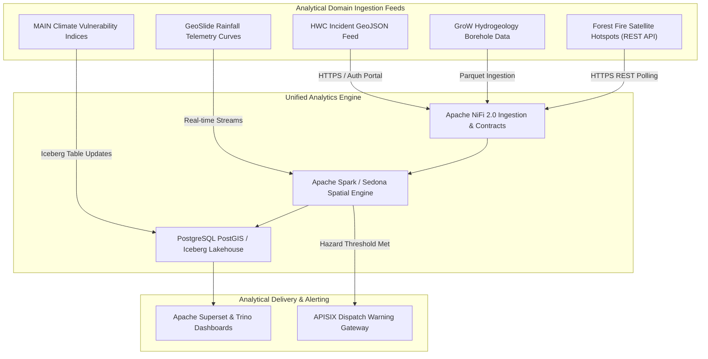

# Big Data Domain Specifications and Analytical Workflows

The Big Data Analytics (BDA) platform services five core analytical domain modules representing critical environmental and natural resource management capabilities.

---

## 🏛️ Domain Applications Architecture & Integration Topology

Each analytical domain module routes raw telemetry and spatial feeds through Apache NiFi 2.0 into the unified Apache Iceberg Lakehouse and PostgreSQL PostGIS/pgvector layers.

### 1. Standalone Production-Ready SVG Vector Graphic (`.svg`)

<svg xmlns="http://www.w3.org/2000/svg" viewBox="0 0 960 420" width="100%" height="100%">
  <defs>
    <marker id="arrow-ba" viewBox="0 0 10 10" refX="6" refY="5" markerWidth="6" markerHeight="6" orient="auto-start-reverse">
      <path d="M 0 0 L 10 5 L 0 10 z" fill="#64748B" />
    </marker>
    <filter id="shadow-ba" x="-4%" y="-4%" width="108%" height="108%">
      <feDropShadow dx="0" dy="2" stdDeviation="3" flood-color="#000000" flood-opacity="0.25"/>
    </filter>
  </defs>

  <!-- Background -->
  <rect width="960" height="420" fill="#0F172A" rx="10"/>

  <!-- Tier 1: Ingestion Sources -->
  <rect x="20" y="20" width="920" height="70" fill="#1E293B" stroke="#334155" stroke-width="1.5" rx="8" filter="url(#shadow-ba)"/>
  <rect x="20" y="20" width="920" height="26" fill="#0F172A" rx="8"/>
  <text x="35" y="38" font-family="-apple-system, BlinkMacSystemFont, 'Segoe UI', Roboto, sans-serif" font-size="12" font-weight="bold" fill="#94A3B8">ANALYTICAL DOMAIN INGESTION SOURCES</text>

  <rect x="35" y="52" width="160" height="30" fill="#1E3A8A" stroke="#3B82F6" rx="4"/>
  <text x="45" y="71" font-family="-apple-system, BlinkMacSystemFont, 'Segoe UI', Roboto, sans-serif" font-size="11" font-weight="bold" fill="#93C5FD">HWC Incident GeoJSON</text>

  <rect x="215" y="52" width="160" height="30" fill="#065F46" stroke="#22C55E" rx="4"/>
  <text x="225" y="71" font-family="-apple-system, BlinkMacSystemFont, 'Segoe UI', Roboto, sans-serif" font-size="11" font-weight="bold" fill="#86EFAC">GroW Borehole Logs</text>

  <rect x="395" y="52" width="160" height="30" fill="#78350F" stroke="#F59E0B" rx="4"/>
  <text x="405" y="71" font-family="-apple-system, BlinkMacSystemFont, 'Segoe UI', Roboto, sans-serif" font-size="11" font-weight="bold" fill="#FDE68A">Forest Fire Sat Thermal</text>

  <rect x="575" y="52" width="160" height="30" fill="#581C87" stroke="#A855F7" rx="4"/>
  <text x="585" y="71" font-family="-apple-system, BlinkMacSystemFont, 'Segoe UI', Roboto, sans-serif" font-size="11" font-weight="bold" fill="#E9D5FF">MAIN Vulnerability Index</text>

  <rect x="755" y="52" width="160" height="30" fill="#831843" stroke="#EC4899" rx="4"/>
  <text x="765" y="71" font-family="-apple-system, BlinkMacSystemFont, 'Segoe UI', Roboto, sans-serif" font-size="11" font-weight="bold" fill="#FBCFE8">GeoSlide Rainfall Telemetry</text>

  <!-- Tier 2: Unified Processing Engine -->
  <rect x="20" y="125" width="920" height="150" fill="#1E293B" stroke="#334155" stroke-width="1.5" rx="8" filter="url(#shadow-ba)"/>
  <rect x="20" y="125" width="920" height="26" fill="#0F172A" rx="8"/>
  <text x="35" y="143" font-family="-apple-system, BlinkMacSystemFont, 'Segoe UI', Roboto, sans-serif" font-size="12" font-weight="bold" fill="#60A5FA">UNIFIED PROCESSING &amp; SPATIAL ANALYTICS CORE</text>

  <rect x="40" y="160" width="270" height="100" fill="#0F172A" stroke="#3B82F6" rx="6"/>
  <text x="50" y="182" font-family="-apple-system, BlinkMacSystemFont, 'Segoe UI', Roboto, sans-serif" font-size="13" font-weight="bold" fill="#93C5FD">Apache NiFi 2.0 Master Pipeline</text>
  <text x="50" y="202" font-family="Consolas, Monaco, monospace" font-size="10" fill="#60A5FA">Data Contract &amp; Schema Validation</text>
  <text x="50" y="222" font-family="-apple-system, BlinkMacSystemFont, 'Segoe UI', Roboto, sans-serif" font-size="11" fill="#E2E8F0">• Convert to Parquet / Vector</text>

  <rect x="345" y="160" width="270" height="100" fill="#0F172A" stroke="#22C55E" rx="6"/>
  <text x="355" y="182" font-family="-apple-system, BlinkMacSystemFont, 'Segoe UI', Roboto, sans-serif" font-size="13" font-weight="bold" fill="#86EFAC">Spark &amp; Sedona Spatial Engine</text>
  <text x="355" y="202" font-family="Consolas, Monaco, monospace" font-size="10" fill="#4ADE80">Stream Processing &amp; Join Grids</text>
  <text x="355" y="222" font-family="-apple-system, BlinkMacSystemFont, 'Segoe UI', Roboto, sans-serif" font-size="11" fill="#E2E8F0">• Hydrogeology &amp; Risk Scoring</text>

  <rect x="650" y="160" width="270" height="100" fill="#0F172A" stroke="#F59E0B" rx="6"/>
  <text x="660" y="182" font-family="-apple-system, BlinkMacSystemFont, 'Segoe UI', Roboto, sans-serif" font-size="13" font-weight="bold" fill="#FDE68A">PostgreSQL &amp; Apache Iceberg</text>
  <text x="660" y="202" font-family="Consolas, Monaco, monospace" font-size="10" fill="#FBBF24">PostGIS / pgvector Storage</text>
  <text x="660" y="222" font-family="-apple-system, BlinkMacSystemFont, 'Segoe UI', Roboto, sans-serif" font-size="11" fill="#E2E8F0">• Spatial Buffer &amp; Vector Index</text>

  <!-- Tier 3: Consumption & Alerting -->
  <rect x="20" y="305" width="920" height="90" fill="#1E293B" stroke="#334155" stroke-width="1.5" rx="8" filter="url(#shadow-ba)"/>
  <rect x="20" y="305" width="920" height="26" fill="#0F172A" rx="8"/>
  <text x="35" y="323" font-family="-apple-system, BlinkMacSystemFont, 'Segoe UI', Roboto, sans-serif" font-size="12" font-weight="bold" fill="#C084FC">ANALYTICAL CONSUMPTION &amp; HAZARD ALERTING</text>

  <rect x="40" y="340" width="410" height="45" fill="#0F172A" stroke="#A855F7" rx="6"/>
  <text x="50" y="367" font-family="-apple-system, BlinkMacSystemFont, 'Segoe UI', Roboto, sans-serif" font-size="12" font-weight="bold" fill="#E9D5FF">Apache Superset &amp; Trino Interactive Dashboards</text>

  <rect x="510" y="340" width="410" height="45" fill="#0F172A" stroke="#EC4899" rx="6"/>
  <text x="520" y="367" font-family="-apple-system, BlinkMacSystemFont, 'Segoe UI', Roboto, sans-serif" font-size="12" font-weight="bold" fill="#FBCFE8">APISIX Automated Disaster Warning Payloads</text>

  <!-- Connectors -->
  <line x1="115" y1="82" x2="175" y2="160" stroke="#64748B" stroke-width="1.5" marker-end="url(#arrow-ba)"/>
  <line x1="295" y1="82" x2="175" y2="160" stroke="#64748B" stroke-width="1.5" marker-end="url(#arrow-ba)"/>
  <line x1="475" y1="82" x2="175" y2="160" stroke="#64748B" stroke-width="1.5" marker-end="url(#arrow-ba)"/>
  <line x1="655" y1="82" x2="785" y2="160" stroke="#64748B" stroke-width="1.5" marker-end="url(#arrow-ba)"/>
  <line x1="835" y1="82" x2="480" y2="160" stroke="#64748B" stroke-width="1.5" marker-end="url(#arrow-ba)"/>

  <line x1="310" y1="210" x2="345" y2="210" stroke="#64748B" stroke-width="1.5" marker-end="url(#arrow-ba)"/>
  <line x1="615" y1="210" x2="650" y2="210" stroke="#64748B" stroke-width="1.5" marker-end="url(#arrow-ba)"/>
  <line x1="785" y1="260" x2="245" y2="340" stroke="#64748B" stroke-width="1.5" marker-end="url(#arrow-ba)"/>
  <line x1="480" y1="260" x2="715" y2="340" stroke="#64748B" stroke-width="1.5" marker-end="url(#arrow-ba)"/>
</svg>

### 2. Git-Native Mermaid Topology (`.mmd`)

### 3. Summary Interface & Routing Table

| Source Component | Target Component | Port / Protocol / API Ingress | Security Boundary / Access Key | Operational Significance / Flow Description |
| :--- | :--- | :--- | :--- | :--- |
| **HWC / GroW / Fire Ingestion** | **Apache NiFi 2.0** | `TCP 8443` / HTTPS REST API | Keycloak OIDC / TLS 1.3 | Validates GeoJSON and borehole schemas against data contracts before lakehouse store. |
| **GeoSlide Telemetry** | **Apache Spark Streaming** | `TCP 9092` / Kafka / Spark Streaming | mTLS Cluster Certs | Computes precipitation curves against geotechnical threshold curves in real time. |
| **Lakehouse Core** | **Apache Superset / Trino** | `TCP 8088` / HTTP Trino JDBC | OAuth2 JWT / RBAC Roles | Serves interactive maps, subsurface reserves, and thermal risk overlays. |
| **Spark Engine** | **APISIX Dispatch Gateway** | `TCP 8000` / HTTPS Webhook | Service Key / API Signature | Automatically dispatches hazard alerts to emergency response centers when thresholds break. |

---

## 1. Human-Wildlife Encounter & Incident Management (HWC)

* **Core Mandate:** Record incident encounters, spatial movement corridors, conflict hotspots, and species distribution patterns.
* **Modernized Ingestion & Workflow:** Legacy incident reports submitted via unvalidated web forms are replaced by structured GeoJSON payloads submitted through an authenticated web portal or mobile API. Payloads are validated against the HWC data contract, written to Iceberg tables, and cross-referenced with gazetted conservation boundaries in PostGIS to produce incident heatmaps and migration corridors in Apache Superset.

---

## 2. Integrated Groundwater Potential Information (GroW)

* **Core Mandate:** Map hydrogeological borehole reserves, groundwater availability, lithological profiles, and subsurface aquifers.
* **Modernized Ingestion & Workflow:** Hydrogeological borehole readings, lithological logs, and well testing data are ingested through Apache NiFi, which converts raw files into standardized Parquet formats. Subsurface hydrogeological models are computed using Apache Sedona on Apache Spark, with the resulting spatial layers served to decision-makers via Trino-backed Superset dashboards.

---

## 3. Forest Fire Analysis and Prediction (Forest Fire)

* **Core Mandate:** Track peatland fires, biomass susceptibility, active satellite thermal hotspots, and fire risk index predictions.
* **Modernized Ingestion & Workflow:** The manual parsing of satellite hotspot emails is retired. Apache NiFi queries satellite thermal anomaly REST APIs over HTTPS, ingesting hotspot coordinates within minutes of capture. Hotspot vectors are joined against weather forecasting grids and concession boundaries using Apache Sedona, generating spatial fire risk predictions.

---

## 4. Climate Change Vulnerability and Adaptation Index (MAIN)

* **Core Mandate:** Model hydrological flows, sea level rise, coastal vulnerability, and socio-economic climate adaptation indicators.
* **Modernized Ingestion & Workflow:** Hydrological modeling outputs, coastal vulnerability indices, and socio-economic adaptation indicators are consolidated from fragmented spreadsheets into versioned Iceberg tables. The data contract enforces valid index range constraints ($0.0 \le \text{Index} \le 1.0$) and tracks computational versions, supporting verifiable climate change reporting.

---

## 5. Geological Landslide Disaster Management (GeoSlide)

* **Core Mandate:** Calculate slope stability risks, slope movement, and early hazard warnings based on telemetry rainfall thresholds.
* **Modernized Ingestion & Workflow:** Manual file transfers of precipitation data are replaced by continuous NiFi ingestion pipelines. Ingested precipitation curves are matched against geotechnical slope stability thresholds using Spark streaming. When precipitation exceeds safety limits in vulnerable geological zones, hazard warning payloads are automatically pushed through the APISIX gateway to dispatch centers.

---

## Domain & Analytical Module Summary Table

| Business Domain Module | Core Functional Mandate | Ingestion & Processing Pipeline | Modernized Target Integration |
| :--- | :--- | :--- | :--- |
| **Incident Management (HWC)** | Incident tracking, wildlife corridors, conflict mitigation. | Direct GeoJSON API -> NiFi -> Data Contract Gate -> Iceberg -> PostGIS. | Interactive heatmaps & spatial corridor analysis in Apache Superset. |
| **Groundwater Potential (GroW)** | Borehole potential, subsurface aquifers, lithology maps. | Automated NiFi Parquet conversion -> Spark/Sedona spatial modeling. | Subsurface reserve maps queried via Trino / Apache Superset. |
| **Forest Fire Analysis** | Peatland fire prediction, biomass risk, thermal hotspot tracking. | Thermal REST API HTTPS polling -> Sedona spatial join with weather grids. | Real-time active thermal anomaly maps and predictive risk scoring. |
| **Climate Change Adaptation (MAIN)** | Hydrological & coastal vulnerability, adaptation indices. | Versioned Iceberg tables -> Data contract index validation ($0.0 \le \text{Index} \le 1.0$). | Automated vulnerability index dashboards and trend modeling. |
| **Geological Landslide (GeoSlide)** | Rainfall thresholds, slope stability alerts, disaster warnings. | Real-time precipitation telemetry -> Spark Streaming threshold matching. | Real-time automated hazard warning payloads routed via APISIX gateway. |
