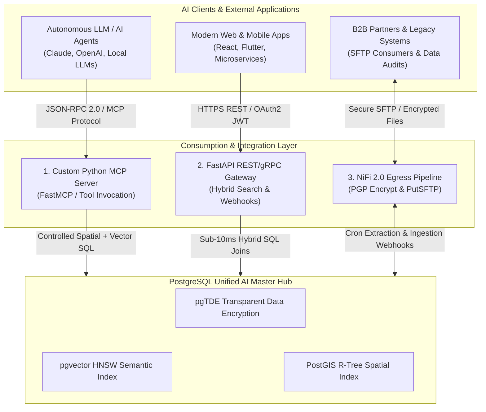

# Consumption & Integration Layer Specification

Following the establishment of the Master Data Plane (**Apache NiFi 2.0**) and the Secure Multi-Model Database (**PostgreSQL Master** + **`pgvector`** + **`PostGIS`** + **`pgTDE`**), this reference specification details the **Consumption & Integration Layer**.

This layer acts as the unified, zero-trust gateway. It securely exposes semantic, spatial, and relational enterprise data to autonomous AI agents, web/mobile microservices, legacy B2B partners, and compliance extraction tools.

---

## 🏛️ Master Architecture & Dual-Render Topology

The Consumption & Integration Layer provides three dedicated ingress/egress paradigms over the encrypted PostgreSQL Master core:

1. **AI / LLM Clients via MCP Server:** Dynamic tool invocation and context retrieval using the Model Context Protocol (MCP).
2. **Modern REST / gRPC APIs via FastAPI:** Sub-10ms hybrid spatial-vector-text searches, OAuth2/JWT security perimeters, and data ingestion webhooks.
3. **External File Transfer Layer via Apache NiFi 2.0:** Scheduled DB extraction, native PGP encryption, and automated SFTP delivery.

### 1. Standalone Production-Ready SVG Vector Graphic (`.svg`)

```xml
<svg xmlns="http://www.w3.org/2000/svg" viewBox="0 0 960 480" width="100%" height="100%">
  <defs>
    <marker id="arrow-ci" viewBox="0 0 10 10" refX="6" refY="5" markerWidth="6" markerHeight="6" orient="auto-start-reverse">
      <path d="M 0 0 L 10 5 L 0 10 z" fill="#64748B" />
    </marker>
    <filter id="shadow-ci" x="-4%" y="-4%" width="108%" height="108%">
      <feDropShadow dx="0" dy="2" stdDeviation="3" flood-color="#000000" flood-opacity="0.25"/>
    </filter>
  </defs>

  <!-- Background -->
  <rect width="960" height="480" fill="#0F172A" rx="10"/>

  <!-- Tier 1: Client Applications -->
  <rect x="20" y="20" width="920" height="70" fill="#1E293B" stroke="#334155" stroke-width="1.5" rx="8" filter="url(#shadow-ci)"/>
  <rect x="20" y="20" width="920" height="26" fill="#0F172A" rx="8"/>
  <text x="35" y="38" font-family="-apple-system, BlinkMacSystemFont, 'Segoe UI', Roboto, sans-serif" font-size="12" font-weight="bold" fill="#94A3B8">AI CLIENTS &amp; EXTERNAL APPLICATIONS TIER</text>

  <rect x="40" y="52" width="260" height="30" fill="#1E3A8A" stroke="#3B82F6" rx="4"/>
  <text x="50" y="71" font-family="-apple-system, BlinkMacSystemFont, 'Segoe UI', Roboto, sans-serif" font-size="11" font-weight="bold" fill="#93C5FD">Autonomous LLM / AI Agents</text>

  <rect x="350" y="52" width="260" height="30" fill="#065F46" stroke="#22C55E" rx="4"/>
  <text x="360" y="71" font-family="-apple-system, BlinkMacSystemFont, 'Segoe UI', Roboto, sans-serif" font-size="11" font-weight="bold" fill="#86EFAC">Web &amp; Mobile Microservices</text>

  <rect x="660" y="52" width="260" height="30" fill="#78350F" stroke="#F59E0B" rx="4"/>
  <text x="670" y="71" font-family="-apple-system, BlinkMacSystemFont, 'Segoe UI', Roboto, sans-serif" font-size="11" font-weight="bold" fill="#FDE68A">B2B &amp; Legacy File Consumers</text>

  <!-- Tier 2: Consumption Gateway Layer -->
  <rect x="20" y="125" width="920" height="190" fill="#1E293B" stroke="#334155" stroke-width="1.5" rx="8" filter="url(#shadow-ci)"/>
  <rect x="20" y="125" width="920" height="26" fill="#0F172A" rx="8"/>
  <text x="35" y="143" font-family="-apple-system, BlinkMacSystemFont, 'Segoe UI', Roboto, sans-serif" font-size="12" font-weight="bold" fill="#60A5FA">CONSUMPTION &amp; INTEGRATION GATEWAY LAYER</text>

  <!-- Component 1: MCP Server -->
  <rect x="40" y="160" width="260" height="140" fill="#0F172A" stroke="#3B82F6" stroke-width="1" rx="6"/>
  <text x="50" y="182" font-family="-apple-system, BlinkMacSystemFont, 'Segoe UI', Roboto, sans-serif" font-size="13" font-weight="bold" fill="#93C5FD">1. Python MCP Server</text>
  <text x="50" y="202" font-family="Consolas, Monaco, monospace" font-size="10" fill="#60A5FA">Protocol: JSON-RPC 2.0 (std/mTLS)</text>
  <text x="50" y="222" font-family="-apple-system, BlinkMacSystemFont, 'Segoe UI', Roboto, sans-serif" font-size="11" fill="#E2E8F0">• Tool: spatial_semantic_search</text>
  <text x="50" y="240" font-family="-apple-system, BlinkMacSystemFont, 'Segoe UI', Roboto, sans-serif" font-size="11" fill="#E2E8F0">• Dynamic Context Retrieval</text>
  <text x="50" y="258" font-family="-apple-system, BlinkMacSystemFont, 'Segoe UI', Roboto, sans-serif" font-size="11" fill="#E2E8F0">• Keycloak OIDC Service Account</text>

  <!-- Component 2: FastAPI -->
  <rect x="350" y="160" width="260" height="140" fill="#0F172A" stroke="#22C55E" stroke-width="1" rx="6"/>
  <text x="360" y="182" font-family="-apple-system, BlinkMacSystemFont, 'Segoe UI', Roboto, sans-serif" font-size="13" font-weight="bold" fill="#86EFAC">2. FastAPI REST/gRPC Gateway</text>
  <text x="360" y="202" font-family="Consolas, Monaco, monospace" font-size="10" fill="#4ADE80">Port 8000 / OpenAPI 3.1</text>
  <text x="360" y="222" font-family="-apple-system, BlinkMacSystemFont, 'Segoe UI', Roboto, sans-serif" font-size="11" fill="#E2E8F0">• Hybrid Search Endpoints</text>
  <text x="360" y="240" font-family="-apple-system, BlinkMacSystemFont, 'Segoe UI', Roboto, sans-serif" font-size="11" fill="#E2E8F0">• Data Ingestion Webhooks</text>
  <text x="360" y="258" font-family="-apple-system, BlinkMacSystemFont, 'Segoe UI', Roboto, sans-serif" font-size="11" fill="#E2E8F0">• JWT OAuth2 Security Perimeter</text>

  <!-- Component 3: File Transfer NiFi Egress -->
  <rect x="660" y="160" width="260" height="140" fill="#0F172A" stroke="#F59E0B" stroke-width="1" rx="6"/>
  <text x="670" y="182" font-family="-apple-system, BlinkMacSystemFont, 'Segoe UI', Roboto, sans-serif" font-size="13" font-weight="bold" fill="#FDE68A">3. NiFi 2.0 Egress &amp; SFTP</text>
  <text x="670" y="202" font-family="Consolas, Monaco, monospace" font-size="10" fill="#FBBF24">Port 22 (PutSFTP / EncryptContent)</text>
  <text x="670" y="222" font-family="-apple-system, BlinkMacSystemFont, 'Segoe UI', Roboto, sans-serif" font-size="11" fill="#E2E8F0">• Cron Extract DB Queries</text>
  <text x="670" y="240" font-family="-apple-system, BlinkMacSystemFont, 'Segoe UI', Roboto, sans-serif" font-size="11" fill="#E2E8F0">• PGP Cryptographic Packaging</text>
  <text x="670" y="258" font-family="-apple-system, BlinkMacSystemFont, 'Segoe UI', Roboto, sans-serif" font-size="11" fill="#E2E8F0">• S3 Egress &amp; SFTP Protocol</text>

  <!-- Tier 3: Core Database Hub -->
  <rect x="20" y="345" width="920" height="115" fill="#1E293B" stroke="#334155" stroke-width="1.5" rx="8" filter="url(#shadow-ci)"/>
  <rect x="20" y="345" width="920" height="26" fill="#0F172A" rx="8"/>
  <text x="35" y="363" font-family="-apple-system, BlinkMacSystemFont, 'Segoe UI', Roboto, sans-serif" font-size="12" font-weight="bold" fill="#C084FC">POSTGRESQL UNIFIED AI MASTER HUB (PORT 5432 / TLS 1.3)</text>

  <rect x="40" y="380" width="260" height="65" fill="#0F172A" stroke="#A855F7" rx="6"/>
  <text x="50" y="400" font-family="-apple-system, BlinkMacSystemFont, 'Segoe UI', Roboto, sans-serif" font-size="12" font-weight="bold" fill="#E9D5FF">pgvector Extension</text>
  <text x="50" y="418" font-family="Consolas, Monaco, monospace" font-size="10" fill="#C084FC">HNSW Index (vector_cosine_ops)</text>

  <rect x="350" y="380" width="260" height="65" fill="#0F172A" stroke="#A855F7" rx="6"/>
  <text x="360" y="400" font-family="-apple-system, BlinkMacSystemFont, 'Segoe UI', Roboto, sans-serif" font-size="12" font-weight="bold" fill="#E9D5FF">PostGIS Spatial Engine</text>
  <text x="360" y="418" font-family="Consolas, Monaco, monospace" font-size="10" fill="#C084FC">ST_DWithin Geography R-Tree</text>

  <rect x="660" y="380" width="260" height="65" fill="#0F172A" stroke="#A855F7" rx="6"/>
  <text x="670" y="400" font-family="-apple-system, BlinkMacSystemFont, 'Segoe UI', Roboto, sans-serif" font-size="12" font-weight="bold" fill="#E9D5FF">pgTDE &amp; Security Perimeter</text>
  <text x="670" y="418" font-family="Consolas, Monaco, monospace" font-size="10" fill="#C084FC">Transparent Encryption at Rest</text>

  <!-- Connectors -->
  <line x1="170" y1="82" x2="170" y2="160" stroke="#64748B" stroke-width="1.5" marker-end="url(#arrow-ci)"/>
  <line x1="480" y1="82" x2="480" y2="160" stroke="#64748B" stroke-width="1.5" marker-end="url(#arrow-ci)"/>
  <line x1="790" y1="82" x2="790" y2="160" stroke="#64748B" stroke-width="1.5" marker-end="url(#arrow-ci)"/>

  <line x1="170" y1="300" x2="170" y2="380" stroke="#64748B" stroke-width="1.5" marker-end="url(#arrow-ci)"/>
  <line x1="480" y1="300" x2="480" y2="380" stroke="#64748B" stroke-width="1.5" marker-end="url(#arrow-ci)"/>
  <line x1="790" y1="300" x2="790" y2="380" stroke="#64748B" stroke-width="1.5" marker-end="url(#arrow-ci)"/>
</svg>
```

### 2. Git-Native Mermaid Topology (`.mmd`)



### 3. Summary Interface & Routing Table

| Source Component | Target Component | Port / Protocol / API Ingress | Security Boundary / Access Key | Operational Significance / Flow Description |
| :--- | :--- | :--- | :--- | :--- |
| **LLM / AI Agent** | **MCP Server** | Stdio / `TCP 8080` (JSON-RPC 2.0) | Keycloak Service Account / Read-Only Tool Limits | Intercepts model prompts and executes deterministic `semantic_spatial_search` tools against PostgreSQL. |
| **Web / Microservices** | **FastAPI Gateway** | `TCP 8000` / HTTPS REST API | OAuth2 Bearer JWT Token / APISIX Gateway | Exposes hybrid search endpoints and vector ingestion webhooks with sub-10ms target latency. |
| **FastAPI Gateway** | **Apache NiFi 2.0** | `TCP 8443` / HTTPS Webhook | NiFi Mutual TLS (mTLS) Client Certificate | Streams incoming vector ingestion payloads directly into NiFi flow queues. |
| **Apache NiFi 2.0** | **External SFTP Server** | `TCP 22` / SSH SFTP Protocol | SSH Public Key / PGP Encryption Key | Extracts scheduled SQL batches from PostgreSQL, packages encrypted CSVs/Parquet, and transfers via SFTP. |
| **Consumption Layer** | **PostgreSQL Master** | `TCP 5432` / PostgreSQL TLS 1.3 | DB Role Permissions (`verify-full`, pgTDE key) | Executes unified SQL queries combining PostGIS `ST_DWithin` spatial buffers and `pgvector` HNSW distance matchers. |

---

## 1. AI with MCP (Model Context Protocol) Server Blueprint

The **Model Context Protocol (MCP)** is an open standard designed to connect Large Language Models to local data infrastructure. By exposing pre-defined database tools, LLMs execute controlled SQL operations rather than raw, arbitrary queries.

### Production Python MCP Server Code (`mcp_postgres_server.py`)

```python
"""Enterprise PostgreSQL MCP Server for Spatial & Semantic RAG Search.

Protocol: Model Context Protocol (MCP)
Author: BDA Infrastructure Team
License: Apache-2.0
"""

import os
import json
import logging
import asyncpg
from mcp.server.fastmcp import FastMCP
from sentence_transformers import SentenceTransformer

# Configure logging
logging.basicConfig(level=logging.INFO)
logger = logging.getLogger("mcp-postgres-server")

# Initialize FastMCP Server instance
mcp = FastMCP("PostgreSQL Spatial-Semantic Knowledge Hub")

# Global connection pool and embedding model handle
db_pool = None
embedding_model = None

LOCAL_MODEL_PATH = os.getenv("EMBEDDING_MODEL_PATH", "/opt/models/WhereIsAI/UAE-Large-V1")
DB_DSN = os.getenv("DATABASE_URL")
if not DB_DSN:
    raise RuntimeError("DATABASE_URL environment variable must be set in deployment secret store.")

@mcp.on_startup()
async def startup():
    """Initialize database connection pool and local embedding model on startup."""
    global db_pool, embedding_model
    logger.info("Initializing PostgreSQL Connection Pool...")
    db_pool = await asyncpg.create_pool(dsn=DB_DSN, min_size=2, max_size=10)

    logger.info(f"Loading local SentenceTransformer model from {LOCAL_MODEL_PATH}...")
    embedding_model = SentenceTransformer(LOCAL_MODEL_PATH, device="cuda" if os.path.exists("/dev/nvidia0") else "cpu", local_files_only=True)
    logger.info("MCP Server successfully initialized.")

@mcp.on_shutdown()
async def shutdown():
    """Gracefully close database pool on shutdown."""
    global db_pool
    if db_pool:
        await db_pool.close()
        logger.info("PostgreSQL Connection Pool closed.")

@mcp.tool()
async def semantic_spatial_search(
    query_text: str,
    longitude: float,
    latitude: float,
    radius_meters: float = 5000.0,
    limit: int = 5
) -> str:
    """Executes a hybrid spatial (PostGIS) and semantic vector (pgvector) query over the PostgreSQL Lakehouse.

    Args:
        query_text: Plain text search prompt from user.
        longitude: WGS84 Longitude (e.g. 101.6868 for Cyberjaya).
        latitude: WGS84 Latitude (e.g. 2.9213 for Cyberjaya).
        radius_meters: Spatial bounding radius in meters (default: 5000m).
        limit: Maximum record count to return.

    Returns:
        JSON string containing matching documents, spatial distance, and similarity score.
    """
    global db_pool, embedding_model
    if not db_pool or not embedding_model:
        return json.dumps({"error": "Server not initialized"})

    # 1. Generate local vector embedding
    embedding_vector = embedding_model.encode(query_text).tolist()
    embedding_str = f"[{','.join(map(str, embedding_vector))}]"

    # 2. Query PostgreSQL Master with SRID 4326 geography casting
    sql_query = """
        SELECT
            uuid,
            source_origin,
            payload_content,
            ST_AsText(spatial_coordinates) AS location_wkt,
            ST_Distance(spatial_coordinates, ST_SetSRID(ST_MakePoint($1, $2), 4326)::geography) AS distance_meters,
            1 - (semantic_embedding <=> $3::vector) AS cosine_similarity
        FROM secure_ai_lakehouse
        WHERE ST_DWithin(spatial_coordinates, ST_SetSRID(ST_MakePoint($1, $2), 4326)::geography, $4)
        ORDER BY semantic_embedding <=> $3::vector
        LIMIT $5;
    """

    async with db_pool.acquire() as conn:
        records = await conn.fetch(sql_query, longitude, latitude, embedding_str, radius_meters, limit)

        results = []
        for r in records:
            results.append({
                "uuid": str(r["uuid"]),
                "source_origin": r["source_origin"],
                "content": r["payload_content"],
                "location_wkt": r["location_wkt"],
                "distance_meters": round(r["distance_meters"], 2),
                "similarity_score": round(r["cosine_similarity"], 4)
            })

        return json.dumps(results, indent=2)

if __name__ == "__main__":
    mcp.run()
```

---

## 2. FastAPI Hybrid Search API Blueprint

For microservices, web apps, and internal tools requiring predictable low latency without autonomous AI agent orchestration, **FastAPI** provides an asynchronous API gateway.

### Production FastAPI Application Code (`fastapi_gateway.py`)

```python
"""FastAPI Hybrid Search & Data Ingestion Gateway.

Author: BDA Infrastructure Team
License: Apache-2.0
"""

import os
import requests
import jwt
from typing import List, Optional, Dict, Any
from fastapi import FastAPI, Depends, HTTPException, status, Security
from fastapi.security import HTTPBearer, HTTPAuthorizationCredentials
from pydantic import BaseModel, Field
import psycopg2
from psycopg2.extras import RealDictCursor
from pgvector.psycopg2 import register_vector
from sentence_transformers import SentenceTransformer

app = FastAPI(
    title="BDA Lakehouse Hybrid Search & Ingestion API",
    version="2.0.0",
    description="Low-latency REST API exposing PostgreSQL pgvector, PostGIS, and NiFi ingestion webhooks."
)

security = HTTPBearer()

# Pre-load local transformer model
MODEL_PATH = os.getenv("EMBEDDING_MODEL_PATH", "/opt/models/WhereIsAI/UAE-Large-V1")
model = SentenceTransformer(MODEL_PATH, local_files_only=True)

NIFI_WEBHOOK_URL = os.getenv("NIFI_WEBHOOK_URL", "https://nifi.master.internal:8443/content-ingest")
KEYCLOAK_PUBLIC_KEY = os.getenv("KEYCLOAK_PUBLIC_KEY")  # PEM-encoded RSA public key from Keycloak realm
OIDC_ISSUER = os.getenv("OIDC_ISSUER", "https://idp.master.internal/realms/bda-realm")
OIDC_AUDIENCE = os.getenv("OIDC_AUDIENCE", "bda-api-service")

def get_db_connection():
    """Connects to PostgreSQL Master with TLS verification."""
    db_password = os.getenv("DB_PASSWORD")
    if not db_password:
        raise RuntimeError("DB_PASSWORD environment variable must be set in deployment secret store.")

    conn = psycopg2.connect(
        host=os.getenv("DB_HOST", "postgres.master.internal"),
        dbname=os.getenv("DB_NAME", "enterprise_ai_db"),
        user=os.getenv("DB_USER", "api_gateway"),
        password=db_password,
        sslmode="verify-full",
        sslrootcert="/etc/ssl/certs/pg-ca.crt"
    )
    register_vector(conn)
    return conn

def verify_jwt_token(credentials: HTTPAuthorizationCredentials = Security(security)) -> Dict[str, Any]:
    """Validates Keycloak OIDC JWT Bearer token signature, issuer, audience, and expiry."""
    token = credentials.credentials
    if not token or not KEYCLOAK_PUBLIC_KEY:
        raise HTTPException(
            status_code=status.HTTP_401_UNAUTHORIZED,
            detail="Authentication token or Keycloak key configuration missing",
            headers={"WWW-Authenticate": "Bearer"},
        )

    try:
        payload = jwt.decode(
            token,
            KEYCLOAK_PUBLIC_KEY,
            algorithms=["RS256"],
            audience=OIDC_AUDIENCE,
            issuer=OIDC_ISSUER
        )
        return payload
    except jwt.PyJWTError as err:
        raise HTTPException(
            status_code=status.HTTP_401_UNAUTHORIZED,
            detail=f"Invalid JWT Token: {str(err)}",
            headers={"WWW-Authenticate": "Bearer"},
        )

class SearchRequest(BaseModel):
    query_text: str = Field(..., example="Cyberjaya safety incident report")
    longitude: float = Field(..., example=101.6868)
    latitude: float = Field(..., example=2.9213)
    radius_meters: Optional[float] = Field(5000.0, example=5000.0)
    limit: Optional[int] = Field(5, example=5)

class IngestionPayload(BaseModel):
    source_origin: str = Field(..., example="mobile_app_sensor")
    payload_content: str = Field(..., example="Environmental sensor reading at Cyberjaya station.")
    longitude: float = Field(..., example=101.6868)
    latitude: float = Field(..., example=2.9213)

@app.post("/api/v1/search/hybrid", summary="Execute Hybrid Spatial + Vector Search", dependencies=[Depends(verify_jwt_token)])
def hybrid_search(req: SearchRequest):
    """Converts user query text into vector embedding and executes unified PostGIS + pgvector query with SRID 4326."""
    query_vector = model.encode(req.query_text).tolist()

    conn = get_db_connection()
    try:
        with conn.cursor(cursor_factory=RealDictCursor) as cur:
            sql = """
                SELECT
                    uuid,
                    source_origin,
                    payload_content,
                    ST_AsText(spatial_coordinates) AS location_wkt,
                    ST_Distance(spatial_coordinates, ST_SetSRID(ST_MakePoint(%s, %s), 4326)::geography) AS distance_meters,
                    1 - (semantic_embedding <=> %s::vector) AS cosine_similarity
                FROM secure_ai_lakehouse
                WHERE ST_DWithin(spatial_coordinates, ST_SetSRID(ST_MakePoint(%s, %s), 4326)::geography, %s)
                ORDER BY semantic_embedding <=> %s::vector
                LIMIT %s;
            """
            cur.execute(sql, (req.longitude, req.latitude, query_vector, req.longitude, req.latitude, req.radius_meters, query_vector, req.limit))
            results = cur.fetchall()
            return {"status": "success", "count": len(results), "data": results}
    finally:
        conn.close()

@app.post("/api/v1/ingest/webhook", summary="Stream Ingestion Payload into NiFi Ingestion Queue", dependencies=[Depends(verify_jwt_token)])
def stream_ingestion_webhook(payload: IngestionPayload):
    """Receives data payloads from external sources and dispatches directly to Apache NiFi 2.0 queue."""
    nifi_payload = {
        "source_origin": payload.source_origin,
        "payload_content": payload.payload_content,
        "wkt_location": f"POINT({payload.longitude} {payload.latitude})"
    }

    try:
        response = requests.post(NIFI_WEBHOOK_URL, json=nifi_payload, verify="/etc/ssl/certs/nifi-ca.crt", timeout=5.0)
        if response.status_code in [200, 202]:
            return {"status": "queued", "nifi_response": response.status_code}
        else:
            raise HTTPException(status_code=500, detail=f"NiFi ingestion queue rejected payload: {response.text}")
    except Exception as e:
        raise HTTPException(status_code=500, detail=f"Failed to reach NiFi Webhook: {str(e)}")
```

---

## 3. Files Transfer Layer (Apache NiFi 2.0 Egress Blueprint)

For legacy enterprise B2B integration, automated reporting, and regulatory file exports, **Apache NiFi 2.0** extracts data from PostgreSQL, packages files with **PGP Encryption**, and transfers them via **PutSFTP**.

### 1. NiFi Egress Processor Flow Pipeline Architecture

```
[ExecuteSQL / QueryDatabaseTableRecord] (Cron: 0 0 * * * - Extract Daily SQL Logs)
                │
                ▼
[ConvertRecord / UpdateRecord] (Package into CSV / Parquet Schema)
                │
                ▼
[EncryptContent] (PGP Symmetric / Public Key Cryptographic Encryption)
                │
                ▼
[PutSFTP] (Secure Port 22 SSH Transfer to External Partner SFTP Gateway)
```

### 2. Production Native Python NiFi Egress Processor (`nifi_pgp_egress.py`)

```python
"""Apache NiFi 2.0 Native Python Processor for PGP Encryption & Egress Packaging.

Author: BDA Infrastructure Team
License: Apache-2.0
"""

import pgpy
from nifiapi.flowfiletransform import FlowFileTransform, FlowFileTransformResult

class PGPEncryptAndPackage(FlowFileTransform):
    class Java:
        implements = ['org.apache.nifi.python.processor.FlowFileTransform']

    class ProcessorDetails:
        version = '2.0.0'
        description = 'Encrypts extracted FlowFile CSV data using enterprise PGP public key before SFTP egress.'

    PGP_PUBLIC_KEY_PATH = "/var/private/keys/partner_public_key.asc"

    def transform(self, context, flowfile):
        raw_data = flowfile.getContentsAsBytes()

        # Load PGP Key and encrypt payload
        key, _ = pgpy.PGPKey.from_file(self.PGP_PUBLIC_KEY_PATH)
        message = pgpy.PGPMessage.new(raw_data)
        encrypted_message = key.encrypt(message)

        encrypted_bytes = str(encrypted_message).encode('utf-8')

        filename = flowfile.getAttribute("filename") or "extract.csv"
        encrypted_filename = f"{filename}.pgp"

        return FlowFileTransformResult(
            relationship='success',
            contents=encrypted_bytes,
            attributes={
                'filename': encrypted_filename,
                'mime.type': 'application/pgp-encrypted',
                'pgp.encrypted': 'true'
            }
        )
```

---

## 🇲🇾 Ringkasan Seni Bina (Bahasa Malaysia)

Selepas penyediaan Data Plane (**Apache NiFi 2.0**) dan Secure Multi-Model Database (**PostgreSQL Master** + **`pgvector`** + **`PostGIS`** + **`pgTDE`**), **Lapisan Konsumsi & Integrasi (Consumption & Integration Layer)** bertindak sebagai jambatan utama yang menghubungkan data berstruktur, spatial, dan vektor kepada pengguna luaran.

### Tiga Komponen Utama Lapisan Konsumsi:

1. **AI / LLM melalui MCP Server (Python):** Model Context Protocol membolehkan model AI memanggil fungsi SQL pratakrif (`semantic_spatial_search`) secara selamat tanpa mengeksekusi arahan SQL bebas yang berisiko.
2. **Lapisan API FastAPI (REST / gRPC):** Gateway berprestasi tinggi yang menukarkan soalan teks pengguna kepada vektor secara dinamik, mengeksekusi carian gabungan spatial-vektor, serta menyediakan webhook ingestion ke dalam barisan NiFi 2.0.
3. **Egress Fail Terenkripsi NiFi 2.0 & SFTP:** Aliran kerja automatik NiFi 2.0 untuk megekstrak data dari PostgreSQL, memproses fail ke format CSV/Parquet, menyifratkannya dengan **PGP Encryption** (`EncryptContent`), dan menghantarnya ke pelayan SFTP luaran secara selamat.
