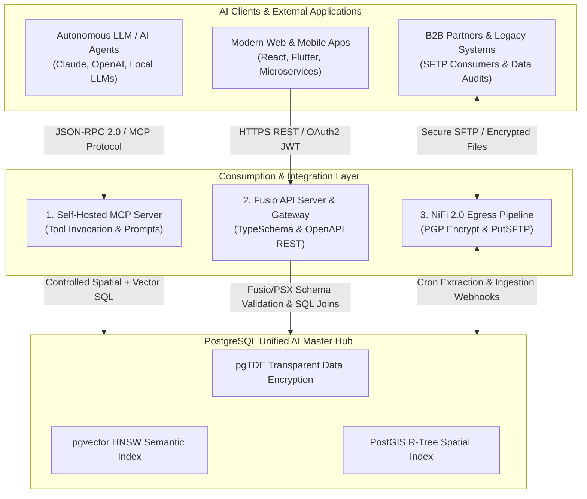
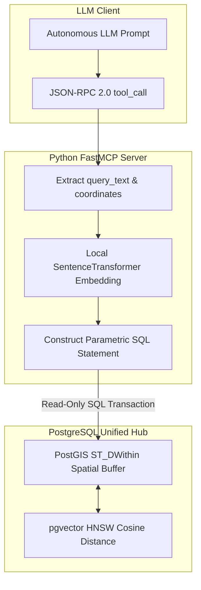

# Consumption & Integration Layer Specification

Following the establishment of the Master Data Plane (**Apache NiFi 2.0**) and the Secure Multi-Model Database (**PostgreSQL Master** + **`pgvector`** + **`PostGIS`** + **`pgTDE`**), this reference specification details the **Consumption & Integration Layer**.

This layer acts as the unified, zero-trust gateway. It securely exposes semantic, spatial, and relational enterprise data to autonomous AI agents, web/mobile microservices, legacy B2B partners, and compliance extraction tools.

---

## 🏛️ Master Architecture & Dual-Render Topology

The Consumption & Integration Layer provides three dedicated ingress/egress paradigms over the encrypted PostgreSQL Master core:

1. **AI / LLM Clients via MCP Server:** Dynamic tool invocation and context retrieval using the Model Context Protocol (MCP).
2. **Modern REST / gRPC APIs via Fusio API Server:** Sub-10ms hybrid spatial-vector-text searches, OAuth2/JWT security perimeters, and data ingestion webhooks.
3. **External File Transfer Layer via Apache NiFi 2.0:** Scheduled DB extraction, native PGP encryption, and automated SFTP delivery.

### 1. Standalone Production-Ready SVG Vector Graphic (`.svg`)

<svg xmlns="http://www.w3.org/2000/svg" viewBox="0 0 960 480" width="100%" height="100%">
  <defs>
    <marker id="arrow-ci" viewBox="0 0 10 10" refX="6" refY="5" markerWidth="6" markerHeight="6" orient="auto-start-reverse">
      <path d="M 0 0 L 10 5 L 0 10 z" fill="#64748B" />
    </marker>
    <filter id="shadow-ci" x="-4%" y="-4%" width="108%" height="108%">
      <feDropShadow dx="0" dy="2" stdDeviation="3" flood-color="#000000" flood-opacity="0.25"/>
    </filter>
  </defs>

  <!-- Background -->
  <rect width="960" height="480" fill="#0F172A" rx="10"/>

  <!-- Tier 1: Client Applications -->
  <rect x="20" y="20" width="920" height="70" fill="#1E293B" stroke="#334155" stroke-width="1.5" rx="8" filter="url(#shadow-ci)"/>
  <rect x="20" y="20" width="920" height="26" fill="#0F172A" rx="8"/>
  <text x="35" y="38" font-family="-apple-system, BlinkMacSystemFont, 'Segoe UI', Roboto, sans-serif" font-size="12" font-weight="bold" fill="#94A3B8">AI CLIENTS &amp; EXTERNAL APPLICATIONS TIER</text>

  <rect x="40" y="52" width="260" height="30" fill="#1E3A8A" stroke="#3B82F6" rx="4"/>
  <text x="50" y="71" font-family="-apple-system, BlinkMacSystemFont, 'Segoe UI', Roboto, sans-serif" font-size="11" font-weight="bold" fill="#93C5FD">Autonomous LLM / AI Agents</text>

  <rect x="350" y="52" width="260" height="30" fill="#065F46" stroke="#22C55E" rx="4"/>
  <text x="360" y="71" font-family="-apple-system, BlinkMacSystemFont, 'Segoe UI', Roboto, sans-serif" font-size="11" font-weight="bold" fill="#86EFAC">Web &amp; Mobile Microservices</text>

  <rect x="660" y="52" width="260" height="30" fill="#78350F" stroke="#F59E0B" rx="4"/>
  <text x="670" y="71" font-family="-apple-system, BlinkMacSystemFont, 'Segoe UI', Roboto, sans-serif" font-size="11" font-weight="bold" fill="#FDE68A">B2B &amp; Legacy File Consumers</text>

  <!-- Tier 2: Consumption Gateway Layer -->
  <rect x="20" y="125" width="920" height="190" fill="#1E293B" stroke="#334155" stroke-width="1.5" rx="8" filter="url(#shadow-ci)"/>
  <rect x="20" y="125" width="920" height="26" fill="#0F172A" rx="8"/>
  <text x="35" y="143" font-family="-apple-system, BlinkMacSystemFont, 'Segoe UI', Roboto, sans-serif" font-size="12" font-weight="bold" fill="#60A5FA">CONSUMPTION &amp; INTEGRATION GATEWAY LAYER</text>

  <!-- Component 1: MCP Server -->
  <rect x="40" y="160" width="260" height="140" fill="#0F172A" stroke="#3B82F6" stroke-width="1" rx="6"/>
  <text x="50" y="182" font-family="-apple-system, BlinkMacSystemFont, 'Segoe UI', Roboto, sans-serif" font-size="13" font-weight="bold" fill="#93C5FD">1. Python MCP Server</text>
  <text x="50" y="202" font-family="Consolas, Monaco, monospace" font-size="10" fill="#60A5FA">Protocol: JSON-RPC 2.0 (std/mTLS)</text>
  <text x="50" y="222" font-family="-apple-system, BlinkMacSystemFont, 'Segoe UI', Roboto, sans-serif" font-size="11" fill="#E2E8F0">• Tool: spatial_semantic_search</text>
  <text x="50" y="240" font-family="-apple-system, BlinkMacSystemFont, 'Segoe UI', Roboto, sans-serif" font-size="11" fill="#E2E8F0">• Dynamic Context Retrieval</text>
  <text x="50" y="258" font-family="-apple-system, BlinkMacSystemFont, 'Segoe UI', Roboto, sans-serif" font-size="11" fill="#E2E8F0">• Keycloak OIDC Service Account</text>

  <!-- Component 2: Fusio API Server -->
  <rect x="350" y="160" width="260" height="140" fill="#0F172A" stroke="#22C55E" stroke-width="1" rx="6"/>
  <text x="360" y="182" font-family="-apple-system, BlinkMacSystemFont, 'Segoe UI', Roboto, sans-serif" font-size="13" font-weight="bold" fill="#86EFAC">2. Fusio API Server &amp; Gateway</text>
  <text x="360" y="202" font-family="Consolas, Monaco, monospace" font-size="10" fill="#4ADE80">Port 8080 / OpenAPI &amp; TypeSchema</text>
  <text x="360" y="222" font-family="-apple-system, BlinkMacSystemFont, 'Segoe UI', Roboto, sans-serif" font-size="11" fill="#E2E8F0">• TypeSchema Data Contracts</text>
  <text x="360" y="240" font-family="-apple-system, BlinkMacSystemFont, 'Segoe UI', Roboto, sans-serif" font-size="11" fill="#E2E8F0">• OpenAPI JSON Formatted Actions</text>
  <text x="360" y="258" font-family="-apple-system, BlinkMacSystemFont, 'Segoe UI', Roboto, sans-serif" font-size="11" fill="#E2E8F0">• OAuth2 / OIDC Security Perimeter</text>

  <!-- Component 3: File Transfer NiFi Egress -->
  <rect x="660" y="160" width="260" height="140" fill="#0F172A" stroke="#F59E0B" stroke-width="1" rx="6"/>
  <text x="670" y="182" font-family="-apple-system, BlinkMacSystemFont, 'Segoe UI', Roboto, sans-serif" font-size="13" font-weight="bold" fill="#FDE68A">3. NiFi 2.0 Egress &amp; SFTP</text>
  <text x="670" y="202" font-family="Consolas, Monaco, monospace" font-size="10" fill="#FBBF24">Port 22 (PutSFTP / EncryptContent)</text>
  <text x="670" y="222" font-family="-apple-system, BlinkMacSystemFont, 'Segoe UI', Roboto, sans-serif" font-size="11" fill="#E2E8F0">• Cron Extract DB Queries</text>
  <text x="670" y="240" font-family="-apple-system, BlinkMacSystemFont, 'Segoe UI', Roboto, sans-serif" font-size="11" fill="#E2E8F0">• PGP Cryptographic Packaging</text>
  <text x="670" y="258" font-family="-apple-system, BlinkMacSystemFont, 'Segoe UI', Roboto, sans-serif" font-size="11" fill="#E2E8F0">• S3 Egress &amp; SFTP Protocol</text>

  <!-- Tier 3: Core Database Hub -->
  <rect x="20" y="345" width="920" height="115" fill="#1E293B" stroke="#334155" stroke-width="1.5" rx="8" filter="url(#shadow-ci)"/>
  <rect x="20" y="345" width="920" height="26" fill="#0F172A" rx="8"/>
  <text x="35" y="363" font-family="-apple-system, BlinkMacSystemFont, 'Segoe UI', Roboto, sans-serif" font-size="12" font-weight="bold" fill="#C084FC">POSTGRESQL UNIFIED AI MASTER HUB (PORT 5432 / TLS 1.3)</text>

  <rect x="40" y="380" width="260" height="65" fill="#0F172A" stroke="#A855F7" rx="6"/>
  <text x="50" y="400" font-family="-apple-system, BlinkMacSystemFont, 'Segoe UI', Roboto, sans-serif" font-size="12" font-weight="bold" fill="#E9D5FF">pgvector Extension</text>
  <text x="50" y="418" font-family="Consolas, Monaco, monospace" font-size="10" fill="#C084FC">HNSW Index (vector_cosine_ops)</text>

  <rect x="350" y="380" width="260" height="65" fill="#0F172A" stroke="#A855F7" rx="6"/>
  <text x="360" y="400" font-family="-apple-system, BlinkMacSystemFont, 'Segoe UI', Roboto, sans-serif" font-size="12" font-weight="bold" fill="#E9D5FF">PostGIS Spatial Engine</text>
  <text x="360" y="418" font-family="Consolas, Monaco, monospace" font-size="10" fill="#C084FC">ST_DWithin Geography R-Tree</text>

  <rect x="660" y="380" width="260" height="65" fill="#0F172A" stroke="#A855F7" rx="6"/>
  <text x="670" y="400" font-family="-apple-system, BlinkMacSystemFont, 'Segoe UI', Roboto, sans-serif" font-size="12" font-weight="bold" fill="#E9D5FF">pgTDE &amp; Security Perimeter</text>
  <text x="670" y="418" font-family="Consolas, Monaco, monospace" font-size="10" fill="#C084FC">Transparent Encryption at Rest</text>

  <!-- Connectors -->
  <line x1="170" y1="82" x2="170" y2="160" stroke="#64748B" stroke-width="1.5" marker-end="url(#arrow-ci)"/>
  <line x1="480" y1="82" x2="480" y2="160" stroke="#64748B" stroke-width="1.5" marker-end="url(#arrow-ci)"/>
  <line x1="790" y1="82" x2="790" y2="160" stroke="#64748B" stroke-width="1.5" marker-end="url(#arrow-ci)"/>

  <line x1="170" y1="300" x2="170" y2="380" stroke="#64748B" stroke-width="1.5" marker-end="url(#arrow-ci)"/>
  <line x1="480" y1="300" x2="480" y2="380" stroke="#64748B" stroke-width="1.5" marker-end="url(#arrow-ci)"/>
  <line x1="790" y1="300" x2="790" y2="380" stroke="#64748B" stroke-width="1.5" marker-end="url(#arrow-ci)"/>
</svg>

### 2. Git-Native Mermaid Topology (`.mmd`)



### 3. Summary Interface & Routing Table

| Source Component | Target Component | Port / Protocol / API Ingress | Security Boundary / Access Key | Operational Significance / Flow Description |
| :--- | :--- | :--- | :--- | :--- |
| **LLM / AI Agent** | **MCP Server** | Stdio / `TCP 8080` (JSON-RPC 2.0) | Keycloak Service Account / Read-Only Tool Limits | Self-hosted MCP server intercepting model prompts and executing deterministic `semantic_spatial_search` tools against PostgreSQL. |
| **Web / Microservices** | **Fusio API Server** | `TCP 8080` / HTTPS REST API | OAuth2 Bearer JWT Token / APISIX Gateway | Exposes TypeSchema-validated endpoints formatted in OpenAPI JSON standard with sub-10ms target latency. |
| **Fusio API Server** | **Apache NiFi 2.0** | `TCP 8443` / HTTPS Webhook | NiFi Mutual TLS (mTLS) Client Certificate | Streams incoming vector ingestion payloads directly into NiFi flow queues. |
| **Apache NiFi 2.0** | **External SFTP Server** | `TCP 22` / SSH SFTP Protocol | SSH Public Key / PGP Encryption Key | Extracts scheduled SQL batches from PostgreSQL, packages encrypted CSVs/Parquet, and transfers via SFTP. |
| **Consumption Layer** | **PostgreSQL Master** | `TCP 5432` / PostgreSQL TLS 1.3 | DB Role Permissions (`verify-full`, pgTDE key) | Executes unified SQL queries combining PostGIS `ST_DWithin` spatial buffers and `pgvector` HNSW distance matchers. |

---

## 1. AI with MCP (Model Context Protocol) Server Blueprint

The **Model Context Protocol (MCP)** is an open standard designed to connect Large Language Models to local data infrastructure. By exposing pre-defined database tools, LLMs execute controlled SQL operations rather than raw, arbitrary queries.

### 1.1 Architectural Bridge: REST/OpenAPI to MCP Transition via Fusio

With the rapid advancement of Artificial Intelligence (AI) agents, Large Language Models (LLMs) are no longer merely responding with text; they act as reasoning engines calling external functions. However, the largest gap in enterprise environments is enabling LLMs to securely access existing APIs without requiring fragile custom glue code.

This section dissects the methodology for bridging the gap between REST/OpenAPI architectures and the Model Context Protocol (MCP) to produce MCP-ready endpoints.

#### 1. Key Problem: Why Are Traditional APIs Difficult for AI to Consume?

* **Context Window Bloat (Token Bloat):** OpenAPI/Swagger specifications containing hundreds of schemas consume the model's context window budget before reasoning even begins.
* **Protocol Differences:** REST is based on stateless HTTP (request-response), whereas modern agent interactions require bidirectional JSON-RPC exchanges via stdio or Server-Sent Events (SSE / Streamable HTTP).
* **Security Risks Without Boundaries:** Passing API keys directly to models exposes risks of unintended tool invocation without strict auditing.

#### 2. Architectural Bridge: Fusio API Server as an MCP Hub

Fusio API Server (an open-source, PHP-based platform) acts as an abstraction layer between internal databases and AI models.

```
[ AI Agents (Gemini / Claude / Qwen / Local LLM) ]
                 │
                 ▼  (Model Context Protocol / JSON-RPC over SSE)
    [ MCP Proxy / Gateway Layer ]
                 │
                 ▼  (REST / Automatic OpenAPI Spec)
     [ Fusio API Server (Self-Hosted) ]
                 │
      ┌──────────┴──────────┐
      ▼                     ▼
[ PostgreSQL / Patroni ]  [ Business Logic PHP/Worker ]
```

By positioning Fusio at the core of the enterprise gateway:

* **Instant Schema Generation:** Every endpoint in Fusio automatically generates TypeSchema and OpenAPI definitions.
* **Schema Thinning:** Only critical endpoints (e.g., log inspection, cluster status, data search) are exposed to MCP, avoiding the token waste of exposing hundreds of CRUD schemas.
* **Data Sovereignty:** Database credentials and API keys remain strictly within infrastructure boundaries without exposure to third-party cloud services.

### Dual-Render Diagram 2: Model Context Protocol (MCP) Tool Invocation & Spatial-Vector Query Execution

The diagram below details the second dual-render architecture spec for the Consumption Layer: the end-to-end MCP JSON-RPC 2.0 tool invocation lifecycle over PostgreSQL `PostGIS` and `pgvector`.

#### 1. Standalone Production-Ready SVG Vector Graphic (`.svg`)

<svg xmlns="http://www.w3.org/2000/svg" viewBox="0 0 960 400" width="100%" height="100%">
  <defs>
    <marker id="arrow-mcp2" viewBox="0 0 10 10" refX="6" refY="5" markerWidth="6" markerHeight="6" orient="auto-start-reverse">
      <path d="M 0 0 L 10 5 L 0 10 z" fill="#64748B" />
    </marker>
    <filter id="shadow-mcp2" x="-4%" y="-4%" width="108%" height="108%">
      <feDropShadow dx="0" dy="2" stdDeviation="3" flood-color="#000000" flood-opacity="0.25"/>
    </filter>
  </defs>

  <!-- Background -->
  <rect width="960" height="400" fill="#0F172A" rx="10"/>

  <!-- LLM Prompt Invocation -->
  <rect x="20" y="20" width="920" height="80" fill="#1E293B" stroke="#334155" stroke-width="1.5" rx="8" filter="url(#shadow-mcp2)"/>
  <rect x="20" y="20" width="920" height="26" fill="#0F172A" rx="8"/>
  <text x="35" y="38" font-family="-apple-system, BlinkMacSystemFont, 'Segoe UI', Roboto, sans-serif" font-size="12" font-weight="bold" fill="#38BDF8">AUTONOMOUS LLM CLIENT / TOOL INVOCATION TIER</text>

  <rect x="40" y="52" width="430" height="38" fill="#0369A1" stroke="#38BDF8" rx="4"/>
  <text x="50" y="75" font-family="-apple-system, BlinkMacSystemFont, 'Segoe UI', Roboto, sans-serif" font-size="12" font-weight="bold" fill="#E0F2FE">LLM Agent (Claude / OpenAI / Local vLLM)</text>

  <rect x="490" y="52" width="430" height="38" fill="#1E3A8A" stroke="#3B82F6" rx="4"/>
  <text x="500" y="75" font-family="-apple-system, BlinkMacSystemFont, 'Segoe UI', Roboto, sans-serif" font-size="12" font-weight="bold" fill="#93C5FD">JSON-RPC 2.0 tool_call: semantic_spatial_search</text>

  <!-- MCP Execution Server -->
  <rect x="20" y="135" width="920" height="120" fill="#1E293B" stroke="#334155" stroke-width="1.5" rx="8" filter="url(#shadow-mcp2)"/>
  <rect x="20" y="135" width="920" height="26" fill="#0F172A" rx="8"/>
  <text x="35" y="153" font-family="-apple-system, BlinkMacSystemFont, 'Segoe UI', Roboto, sans-serif" font-size="12" font-weight="bold" fill="#4ADE80">FASTMCP SERVER EXECUTION &amp; EMBEDDING GENERATION</text>

  <rect x="40" y="170" width="270" height="70" fill="#0F172A" stroke="#22C55E" rx="6"/>
  <text x="50" y="192" font-family="-apple-system, BlinkMacSystemFont, 'Segoe UI', Roboto, sans-serif" font-size="13" font-weight="bold" fill="#86EFAC">1. Parameter Parsing</text>
  <text x="50" y="212" font-family="Consolas, Monaco, monospace" font-size="10" fill="#4ADE80">query_text, lon, lat, radius</text>

  <rect x="345" y="170" width="270" height="70" fill="#0F172A" stroke="#22C55E" rx="6"/>
  <text x="355" y="192" font-family="-apple-system, BlinkMacSystemFont, 'Segoe UI', Roboto, sans-serif" font-size="13" font-weight="bold" fill="#86EFAC">2. Vector Embedding</text>
  <text x="355" y="212" font-family="Consolas, Monaco, monospace" font-size="10" fill="#4ADE80">SentenceTransformer Model</text>

  <rect x="650" y="170" width="270" height="70" fill="#0F172A" stroke="#22C55E" rx="6"/>
  <text x="660" y="192" font-family="-apple-system, BlinkMacSystemFont, 'Segoe UI', Roboto, sans-serif" font-size="13" font-weight="bold" fill="#86EFAC">3. Controlled SQL Query</text>
  <text x="660" y="212" font-family="Consolas, Monaco, monospace" font-size="10" fill="#4ADE80">ST_DWithin &amp; &lt;=&gt; Operator</text>

  <!-- Database Core Tier -->
  <rect x="20" y="285" width="920" height="90" fill="#1E293B" stroke="#334155" stroke-width="1.5" rx="8" filter="url(#shadow-mcp2)"/>
  <rect x="20" y="285" width="920" height="26" fill="#0F172A" rx="8"/>
  <text x="35" y="303" font-family="-apple-system, BlinkMacSystemFont, 'Segoe UI', Roboto, sans-serif" font-size="12" font-weight="bold" fill="#C084FC">POSTGRESQL UNIFIED AI MASTER HUB (PORT 5432 / READ-ONLY SESSION)</text>

  <rect x="40" y="320" width="880" height="42" fill="#0F172A" stroke="#A855F7" rx="6"/>
  <text x="50" y="346" font-family="-apple-system, BlinkMacSystemFont, 'Segoe UI', Roboto, sans-serif" font-size="12" font-weight="bold" fill="#E9D5FF">Hybrid SQL Execution: PostGIS ST_DWithin (Geography Buffer) + pgvector HNSW Cosine Matcher</text>

  <!-- Connectors -->
  <line x1="255" y1="90" x2="175" y2="170" stroke="#64748B" stroke-width="1.5" marker-end="url(#arrow-mcp2)"/>
  <line x1="310" y1="205" x2="345" y2="205" stroke="#64748B" stroke-width="1.5" marker-end="url(#arrow-mcp2)"/>
  <line x1="615" y1="205" x2="650" y2="205" stroke="#64748B" stroke-width="1.5" marker-end="url(#arrow-mcp2)"/>
  <line x1="785" y1="240" x2="480" y2="320" stroke="#64748B" stroke-width="1.5" marker-end="url(#arrow-mcp2)"/>
</svg>

#### 2. Git-Native Mermaid Topology (`.mmd`)



#### 3. Summary Interface & Routing Table

| Source Component | Target Component | Port / Protocol / API Ingress | Security Boundary / Access Key | Operational Significance / Flow Description |
| :--- | :--- | :--- | :--- | :--- |
| **LLM Agent** | **Python MCP Server** | Stdio / `TCP 8080` (JSON-RPC 2.0) | Keycloak OIDC Service Account | Intercepts agent prompt and executes pre-defined `semantic_spatial_search` tool. |
| **MCP Server** | **PostgreSQL Hub** | `TCP 5432` / PostgreSQL TLS 1.3 | Read-Only Session Transaction | Evaluates spatial buffer `ST_DWithin` and cosine vector distance `<=>` in unified SQL pass. |

---

### Production Python MCP Server Code (`mcp_postgres_server.py`)

```python
"""Enterprise PostgreSQL MCP Server for Spatial & Semantic RAG Search.

Protocol: Model Context Protocol (MCP)
Author: BDA Infrastructure Team
License: Apache-2.0
"""

import os
import json
import logging
import asyncpg
from mcp.server.fastmcp import FastMCP
from sentence_transformers import SentenceTransformer

# Configure logging
logging.basicConfig(level=logging.INFO)
logger = logging.getLogger("mcp-postgres-server")

# Initialize FastMCP Server instance
mcp = FastMCP("PostgreSQL Spatial-Semantic Knowledge Hub")

# Global connection pool and embedding model handle
db_pool = None
embedding_model = None

LOCAL_MODEL_PATH = os.getenv("EMBEDDING_MODEL_PATH", "/opt/models/WhereIsAI/UAE-Large-V1")
DB_DSN = os.getenv("DATABASE_URL")
if not DB_DSN:
    raise RuntimeError("DATABASE_URL environment variable must be set in deployment secret store.")

@mcp.on_startup()
async def startup():
    """Initialize database connection pool and local embedding model on startup."""
    global db_pool, embedding_model
    logger.info("Initializing PostgreSQL Connection Pool...")
    db_pool = await asyncpg.create_pool(dsn=DB_DSN, min_size=2, max_size=10)

    logger.info(f"Loading local SentenceTransformer model from {LOCAL_MODEL_PATH}...")
    embedding_model = SentenceTransformer(LOCAL_MODEL_PATH, device="cuda" if os.path.exists("/dev/nvidia0") else "cpu", local_files_only=True)
    logger.info("MCP Server successfully initialized.")

@mcp.on_shutdown()
async def shutdown():
    """Gracefully close database pool on shutdown."""
    global db_pool
    if db_pool:
        await db_pool.close()
        logger.info("PostgreSQL Connection Pool closed.")

@mcp.tool()
async def semantic_spatial_search(
    query_text: str,
    longitude: float,
    latitude: float,
    radius_meters: float = 5000.0,
    limit: int = 5
) -> str:
    """Executes a hybrid spatial (PostGIS) and semantic vector (pgvector) query with strict session context injection.

    Args:
        query_text: Plain text search prompt from user.
        longitude: WGS84 Longitude (e.g. 101.6868 for Cyberjaya).
        latitude: WGS84 Latitude (e.g. 2.9213 for Cyberjaya).
        radius_meters: Spatial bounding radius in meters (default: 5000m).
        limit: Maximum record count to return.

    Returns:
        JSON string containing matching documents, spatial distance, and similarity score.
    """
    global db_pool, embedding_model
    if not db_pool or not embedding_model:
        return json.dumps({"error": "Server not initialized"})

    # Derive identity parameters from authenticated MCP principal context rather than caller input
    ctx = mcp.get_context()
    user_role = getattr(ctx, "user_role", None) or os.getenv("MCP_CLIENT_ROLE")
    tenant_id = getattr(ctx, "tenant_id", None) or os.getenv("MCP_CLIENT_TENANT_ID")

    if not user_role or user_role not in ALLOWED_ROLES:
        raise ValueError(f"Invalid or missing user_role in MCP identity context: {user_role}")
    if not tenant_id or not isinstance(tenant_id, str):
        raise ValueError("Missing or invalid tenant_id in MCP identity context")

    # 1. Generate local vector embedding
    embedding_vector = embedding_model.encode(query_text).tolist()
    embedding_str = f"[{','.join(map(str, embedding_vector))}]"

    # 2. Query PostgreSQL Master with transactional session context parameter binding via set_config
    sql_query = """
        SELECT
            uuid,
            source_origin,
            payload_content,
            ST_AsText(spatial_coordinates) AS location_wkt,
            ST_Distance(spatial_coordinates, ST_SetSRID(ST_MakePoint($1, $2), 4326)::geography) AS distance_meters,
            1 - (semantic_embedding <=> $3::vector) AS cosine_similarity
        FROM secure_ai_lakehouse
        WHERE ST_DWithin(spatial_coordinates, ST_SetSRID(ST_MakePoint($1, $2), 4326)::geography, $4)
        ORDER BY semantic_embedding <=> $3::vector
        LIMIT $5;
    """

    async with db_pool.acquire() as conn:
        async with conn.transaction():
            # Inject authenticated session security parameters for PostgreSQL Row-Level Security (RLS) via set_config
            await conn.execute("SELECT set_config('app.current_user_role', $1, true);", user_role)
            await conn.execute("SELECT set_config('app.current_tenant_id', $1, true);", tenant_id)

            records = await conn.fetch(sql_query, longitude, latitude, embedding_str, radius_meters, limit)

        results = []
        for r in records:
            results.append({
                "uuid": str(r["uuid"]),
                "source_origin": r["source_origin"],
                "content": r["payload_content"],
                "location_wkt": r["location_wkt"],
                "distance_meters": round(r["distance_meters"], 2),
                "similarity_score": round(r["cosine_similarity"], 4)
            })

        return json.dumps(results, indent=2)

if __name__ == "__main__":
    mcp.run()
```

---

## 2. Fusio API Server & Self-Hosted MCP Blueprint

For microservices, web apps, external partners, and self-hosted autonomous AI agent orchestration, **Fusio API Server** serves as an open-source API management and API server platform. Fusio incorporates **TypeSchema** for strict JSON data contract definitions and formats endpoints into standard **OpenAPI** (JSON Schema) specifications.

### Fusio API Server Configuration & Schema Specification (`fusio_app.json`)

```json
{
  "title": "BDA Hybrid Search & Ingestion API",
  "version": "6.0.0",
  "definitions": {
    "HybridSearchRequest": {
      "type": "object",
      "properties": {
        "query": {
          "type": "string",
          "description": "Natural language query string for full-text and semantic vector matching"
        },
        "latitude": {
          "type": "number",
          "description": "WGS84 latitude coordinate"
        },
        "longitude": {
          "type": "number",
          "description": "WGS84 longitude coordinate"
        },
        "radius_meters": {
          "type": "number",
          "minimum": 1.0,
          "maximum": 50000.0,
          "default": 5000.0,
          "description": "Spatial search buffer radius in meters (1.0 to 50000.0)"
        },
        "limit": {
          "type": "integer",
          "minimum": 1,
          "maximum": 100,
          "default": 10,
          "description": "Maximum candidate result rows to return (1 to 100)"
        }
      },
      "required": ["query", "latitude", "longitude"]
    },
    "HybridSearchResponse": {
      "type": "object",
      "properties": {
        "status": { "type": "string" },
        "user_id": { "type": "string" },
        "total_results": { "type": "integer" },
        "data": {
          "type": "array",
          "items": {
            "$ref": "#/definitions/SearchResultItem"
          }
        }
      }
    },
    "SearchResultItem": {
      "type": "object",
      "properties": {
        "id": { "type": "string" },
        "chunk_content": { "type": "string" },
        "metadata": {
          "type": "object",
          "description": "JSON metadata key-value document attributes"
        },
        "latitude": { "type": "number" },
        "longitude": { "type": "number" },
        "distance_meters": { "type": "number" },
        "cosine_similarity": { "type": "number" },
        "text_rank": { "type": "number" }
      }
    },
    "IngestPayloadRequest": {
      "type": "object",
      "properties": {
        "document_id": { "type": "string" },
        "content": { "type": "string" },
        "metadata": { "type": "object" }
      },
      "required": ["document_id", "content"]
    },
    "IngestPayloadResponse": {
      "type": "object",
      "properties": {
        "status": { "type": "string" },
        "message": { "type": "string" },
        "nifi_queue_status": { "type": "integer" }
      }
    }
  }
}
```

### Self-Hosted Fusio Hybrid Search Action (`fusio_hybrid_search.php`)

```php
<?php
/**
 * Fusio API Action for BDA Hybrid Spatial-Vector-Text Search over PostgreSQL Master.
 *
 * Uses OpenAPI JSON formatting, Fusio/PSX schema structural contracts, and RLS context binding.
 */

namespace App\Action;

use Fusio\Engine\ActionAbstract;
use Fusio\Engine\ContextInterface;
use Fusio\Engine\ParametersInterface;
use Fusio\Engine\RequestInterface;

class HybridSearchAction extends ActionAbstract
{
    public function handle(RequestInterface $request, ParametersInterface $parameters, ContextInterface $context): mixed
    {
        $body = $request->getPayload();
        $query = (string) ($body->query ?? '');
        $lat = (float) ($body->latitude ?? 0.0);
        $lon = (float) ($body->longitude ?? 0.0);
        $radius = (float) ($body->radius_meters ?? 5000.0);
        $limit = (int) ($body->limit ?? 10);

        // Server-side bounds validation
        if ($radius < 1.0 || $radius > 50000.0) {
            throw new \InvalidArgumentException('radius_meters must be between 1.0 and 50000.0 meters');
        }
        if ($limit < 1 || $limit > 100) {
            throw new \InvalidArgumentException('limit must be between 1 and 100');
        }

        /** @var \PDO $pdo */
        $pdo = $this->connector->getConnection('PostgreSQL-Master');

        $userRole = $context->getUser()->getRole() ?? 'bda_api_user';
        $tenantId = $context->getUser()->getTenantId() ?? 'default_tenant';

        // Bind PostgreSQL Row-Level Security (RLS) context parameters within query transaction
        $pdo->beginTransaction();
        $pdo->exec("SELECT set_config('app.current_user_role', " . $pdo->quote($userRole) . ", true)");
        $pdo->exec("SELECT set_config('app.current_tenant_id', " . $pdo->quote($tenantId) . ", true)");

        // Combined PostGIS ST_DWithin, pgvector cosine distance, and full-text search with unique parameter placeholders
        $sql = "
            SELECT
                id,
                chunk_content,
                metadata,
                ST_Y(location::geometry) as latitude,
                ST_X(location::geometry) as longitude,
                ST_Distance(
                    location,
                    ST_SetSRID(ST_MakePoint(:lon1, :lat1), 4326)::geography
                ) as distance_meters,
                1 - (embedding <=> :vector1::vector) as cosine_similarity,
                ts_rank(search_vector, plainto_tsquery('english', :fts_query1)) as text_rank
            FROM bda_golden_ssot.enterprise_knowledge_base
            WHERE ST_DWithin(
                location,
                ST_SetSRID(ST_MakePoint(:lon2, :lat2), 4326)::geography,
                :radius
            )
            AND search_vector @@ plainto_tsquery('english', :fts_query2)
            ORDER BY embedding <=> :vector2::vector ASC, text_rank DESC
            LIMIT :limit;
        ";

        $vectorStr = $this->generateVectorEmbedding($query);

        $stmt = $pdo->prepare($sql);
        $stmt->bindValue(':lon1', $lon);
        $stmt->bindValue(':lat1', $lat);
        $stmt->bindValue(':vector1', $vectorStr);
        $stmt->bindValue(':fts_query1', $query);
        $stmt->bindValue(':lon2', $lon);
        $stmt->bindValue(':lat2', $lat);
        $stmt->bindValue(':radius', $radius);
        $stmt->bindValue(':fts_query2', $query);
        $stmt->bindValue(':vector2', $vectorStr);
        $stmt->bindValue(':limit', $limit, \PDO::PARAM_INT);
        $stmt->execute();

        $results = $stmt->fetchAll(\PDO::FETCH_ASSOC);
        $pdo->commit();

        return $this->response->build(200, [], [
            'status' => 'success',
            'user_id' => $context->getUser()->getUserId(),
            'total_results' => count($results),
            'data' => $results
        ]);
    }

    private function generateVectorEmbedding(string $text): string
    {
        $ch = curl_init('http://localhost:8081/embed');
        curl_setopt($ch, CURLOPT_POSTFIELDS, json_encode(['text' => $text]));
        curl_setopt($ch, CURLOPT_HTTPHEADER, ['Content-Type: application/json']);
        curl_setopt($ch, CURLOPT_RETURNTRANSFER, true);
        curl_setopt($ch, CURLOPT_CONNECTTIMEOUT, 3);
        curl_setopt($ch, CURLOPT_TIMEOUT, 5);

        $res = curl_exec($ch);
        if ($res === false) {
            $error = curl_error($ch);
            curl_close($ch);
            throw new \RuntimeException('Embedding sidecar request failed: ' . $error);
        }

        $httpCode = curl_getinfo($ch, CURLINFO_HTTP_CODE);
        curl_close($ch);

        if ($httpCode !== 200) {
            throw new \RuntimeException('Embedding sidecar returned HTTP status ' . $httpCode);
        }

        $data = json_decode($res, true);
        if (!is_array($data) || !isset($data['embedding']) || !is_array($data['embedding'])) {
            throw new \RuntimeException('Invalid JSON response format from embedding sidecar');
        }

        return '[' . implode(',', $data['embedding']) . ']';
    }
}
```

### Self-Hosted Fusio Ingestion Action (`fusio_nifi_ingest.php`)

```php
<?php
/**
 * Fusio API Action for Ingesting Payload into Apache NiFi 2.0 Flow Queues.
 */

namespace App\Action;

use Fusio\Engine\ActionAbstract;
use Fusio\Engine\ContextInterface;
use Fusio\Engine\ParametersInterface;
use Fusio\Engine\RequestInterface;

class IngestAction extends ActionAbstract
{
    public function handle(RequestInterface $request, ParametersInterface $parameters, ContextInterface $context): mixed
    {
        $payload = $request->getPayload();
        $nifiUrl = getenv('NIFI_WEBHOOK_URL') ?: 'https://nifi.master.internal:8443/content-ingest';

        $ch = curl_init($nifiUrl);
        curl_setopt($ch, CURLOPT_POST, true);
        curl_setopt($ch, CURLOPT_POSTFIELDS, json_encode($payload));
        curl_setopt($ch, CURLOPT_HTTPHEADER, [
            'Content-Type: application/json',
            'X-User-ID: ' . $context->getUser()->getUserId()
        ]);
        curl_setopt($ch, CURLOPT_RETURNTRANSFER, true);
        curl_setopt($ch, CURLOPT_SSL_VERIFYPEER, true);
        curl_setopt($ch, CURLOPT_CAINFO, '/etc/ssl/certs/nifi-ca.crt');
        curl_setopt($ch, CURLOPT_CONNECTTIMEOUT, 3);
        curl_setopt($ch, CURLOPT_TIMEOUT, 5);

        $res = curl_exec($ch);
        if ($res === false) {
            $error = curl_error($ch);
            curl_close($ch);
            throw new \RuntimeException('NiFi Ingestion Webhook unreachable: ' . $error);
        }

        $httpCode = curl_getinfo($ch, CURLINFO_HTTP_CODE);
        curl_close($ch);

        if ($httpCode !== 200 && $httpCode !== 202) {
            throw new \RuntimeException('NiFi Ingestion Webhook rejected payload with status ' . $httpCode);
        }

        return $this->response->build(202, [], [
            'status' => 'queued',
            'message' => 'Payload successfully forwarded to Apache NiFi processing queue',
            'nifi_queue_status' => $httpCode
        ]);
    }
}
```

---

## 3. Files Transfer Layer (Apache NiFi 2.0 Egress Blueprint)

For legacy enterprise B2B integration, automated reporting, and regulatory file exports, **Apache NiFi 2.0** extracts data from PostgreSQL, packages files with **PGP Encryption**, and transfers them via **PutSFTP**.

### 1. NiFi Egress Processor Flow Pipeline Architecture

```
[ExecuteSQL / QueryDatabaseTableRecord] (Cron: 0 0 * * * - Extract Daily SQL Logs)
                │
                ▼
[ConvertRecord / UpdateRecord] (Package into CSV / Parquet Schema)
                │
                ▼
[EncryptContent] (PGP Symmetric / Public Key Cryptographic Encryption)
                │
                ▼
[PutSFTP] (Secure Port 22 SSH Transfer to External Partner SFTP Gateway)
```

### 2. Production Native Python NiFi Egress Processor (`nifi_pgp_egress.py`)

```python
"""Apache NiFi 2.0 Native Python Processor for PGP Encryption & Egress Packaging.

Author: BDA Infrastructure Team
License: Apache-2.0
"""

import pgpy
from nifiapi.flowfiletransform import FlowFileTransform, FlowFileTransformResult

class PGPEncryptAndPackage(FlowFileTransform):
    class Java:
        implements = ['org.apache.nifi.python.processor.FlowFileTransform']

    class ProcessorDetails:
        version = '2.0.0'
        description = 'Encrypts extracted FlowFile CSV data using enterprise PGP public key before SFTP egress.'

    PGP_PUBLIC_KEY_PATH = "/var/private/keys/partner_public_key.asc"

    def transform(self, context, flowfile):
        raw_data = flowfile.getContentsAsBytes()

        # Load PGP Key and encrypt payload
        key, _ = pgpy.PGPKey.from_file(self.PGP_PUBLIC_KEY_PATH)
        message = pgpy.PGPMessage.new(raw_data)
        encrypted_message = key.encrypt(message)

        encrypted_bytes = str(encrypted_message).encode('utf-8')

        filename = flowfile.getAttribute("filename") or "extract.csv"
        encrypted_filename = f"{filename}.pgp"

        return FlowFileTransformResult(
            relationship='success',
            contents=encrypted_bytes,
            attributes={
                'filename': encrypted_filename,
                'mime.type': 'application/pgp-encrypted',
                'pgp.encrypted': 'true'
            }
        )
```

---

## 🇲🇾 Ringkasan Seni Bina (Bahasa Malaysia)

Selepas penyediaan Data Plane (**Apache NiFi 2.0**) dan Secure Multi-Model Database (**PostgreSQL Master** + **`pgvector`** + **`PostGIS`** + **`pgTDE`**), **Lapisan Konsumsi & Integrasi (Consumption & Integration Layer)** bertindak sebagai jambatan utama yang menghubungkan data berstruktur, spatial, dan vektor kepada pengguna luaran.

### Tiga Komponen Utama Lapisan Konsumsi:

1. **AI / LLM melalui MCP Server (Python):** Model Context Protocol membolehkan model AI memanggil fungsi SQL pratakrif (`semantic_spatial_search`) secara selamat tanpa mengeksekusi arahan SQL bebas yang berisiko.
2. **Lapisan API Fusio API Server (TypeSchema & OpenAPI):** Gateway berprestasi tinggi yang menukarkan soalan teks pengguna kepada vektor secara dinamik, mengeksekusi carian gabungan spatial-vektor, serta menyediakan webhook ingestion ke dalam barisan NiFi 2.0.
3. **Egress Fail Terenkripsi NiFi 2.0 & SFTP:** Aliran kerja automatik NiFi 2.0 untuk megekstrak data dari PostgreSQL, memproses fail ke format CSV/Parquet, menyifratkannya dengan **PGP Encryption** (`EncryptContent`), dan menghantarnya ke pelayan SFTP luaran secara selamat.
