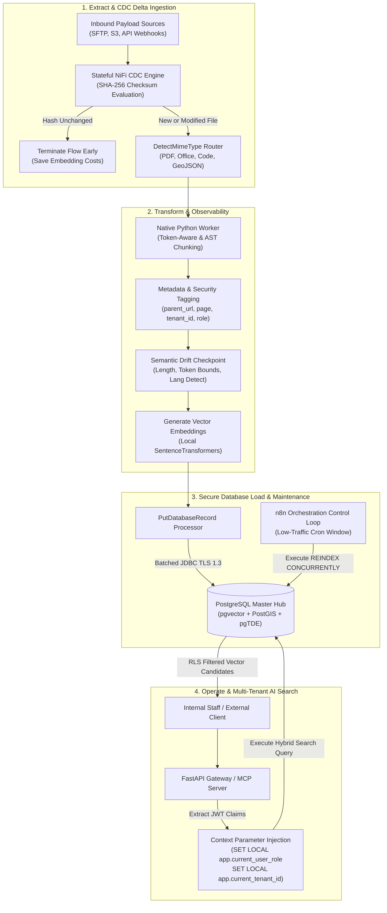

# Enterprise AI ETL Lifecycle, Dynamic Multi-Modal Parsing, & Multi-Tenant RLS Specification

This master reference specification establishes the **Enterprise AI ETL (Extract, Transform, Load) Lifecycle** for Big Data Analytics (BDA) and Enterprise AI infrastructure. Traditional database ETL pipelines focus solely on transactional safety and row syntax. In an AI Data Infrastructure stack, the ETL lifecycle must expand to accommodate Large Language Models (LLMs), high-dimensional vector embeddings, dynamic multi-modal parsing across all file types, continuous delta synchronisation, and multi-tenant Row-Level Security (RLS).

By integrating these operational capabilities into **Apache NiFi 2.0** and the **PostgreSQL Master Hub** (`pgvector` + `PostGIS` + `pgTDE`), the platform guarantees data quality, prevents vector duplication, eliminates index degradation, and enforces cryptographic isolation across internal staff and external clients.

---

## 1. The Fully Realised Enterprise AI ETL Lifecycle Architecture

The end-to-end AI pipeline operates as a continuous, resilient loop spanning ingestion, transformation, secure database loading, and autonomous query operation:

```
[ EXTRACT ]   ──► File Ingestion via NiFi 2.0 (Tracks Cryptographic SHA-256 Delta Hashes)
                        │
[ TRANSFORM ] ──► Dynamic MIME Parsing ──► Chunking ──► Parent Metadata & Security Tags ──► Embedding Call
                        │
[ LOAD ]      ──► Secure TLS Stream into PostgreSQL Master (pgTDE Encrypted Storage Layer)
                        │
[ OPERATE ]   ──► Asynchronous HNSW Reindexing ──► RLS Query Filtration ──► Secure AI via MCP Server
```

### Dual-Render Architecture Specification: Enterprise AI ETL Lifecycle

#### 1. Standalone Production-Ready SVG Vector Graphic (`.svg`)

<svg xmlns="http://www.w3.org/2000/svg" viewBox="0 0 1000 580" width="100%" height="100%">
  <defs>
    <marker id="arrow-etl" viewBox="0 0 10 10" refX="6" refY="5" markerWidth="6" markerHeight="6" orient="auto-start-reverse">
      <path d="M 0 0 L 10 5 L 0 10 z" fill="#64748B" />
    </marker>
    <filter id="shadow-etl" x="-4%" y="-4%" width="108%" height="108%">
      <feDropShadow dx="0" dy="2" stdDeviation="3" flood-color="#000000" flood-opacity="0.25"/>
    </filter>
  </defs>

  <!-- Background Canvas -->
  <rect width="1000" height="580" fill="#0F172A" rx="12"/>

  <!-- Header Banner -->
  <rect x="20" y="20" width="960" height="40" fill="#1E293B" stroke="#334155" rx="6"/>
  <text x="35" y="45" font-family="-apple-system, BlinkMacSystemFont, 'Segoe UI', Roboto, sans-serif" font-size="15" font-weight="bold" fill="#F8FAFC">
    ENTERPRISE AI ETL LIFECYCLE &amp; MULTI-TENANT RLS ARCHITECTURE
  </text>
  <text x="780" y="45" font-family="Consolas, Monaco, monospace" font-size="12" fill="#38BDF8">
    ZONE: ZERO-TRUST-ETL
  </text>

  <!-- Stage 1: Extract & CDC Delta Ingestion -->
  <rect x="20" y="80" width="220" height="470" fill="#1E293B" stroke="#334155" stroke-width="1.5" rx="8" filter="url(#shadow-etl)"/>
  <rect x="20" y="80" width="220" height="32" fill="#0F172A" rx="8"/>
  <text x="30" y="101" font-family="-apple-system, BlinkMacSystemFont, 'Segoe UI', Roboto, sans-serif" font-size="12" font-weight="bold" fill="#60A5FA">
    1. EXTRACT &amp; CDC DELTA
  </text>

  <rect x="35" y="130" width="190" height="85" fill="#0F172A" stroke="#334155" stroke-width="1" rx="6"/>
  <text x="45" y="150" font-family="-apple-system, BlinkMacSystemFont, 'Segoe UI', Roboto, sans-serif" font-size="12" font-weight="bold" fill="#F8FAFC">Inbound Ingestion</text>
  <text x="45" y="168" font-family="Consolas, Monaco, monospace" font-size="10" fill="#38BDF8">SFTP / S3 / API Webhooks</text>
  <text x="45" y="186" font-family="-apple-system, BlinkMacSystemFont, 'Segoe UI', Roboto, sans-serif" font-size="10" fill="#94A3B8">All File Types (PDF, CSV, Geo)</text>

  <rect x="35" y="235" width="190" height="105" fill="#0F172A" stroke="#38BDF8" stroke-width="1" rx="6"/>
  <text x="45" y="255" font-family="-apple-system, BlinkMacSystemFont, 'Segoe UI', Roboto, sans-serif" font-size="12" font-weight="bold" fill="#F8FAFC">CDC Checksum Engine</text>
  <text x="45" y="273" font-family="Consolas, Monaco, monospace" font-size="10" fill="#60A5FA">SHA-256 Delta Hash Check</text>
  <text x="45" y="291" font-family="-apple-system, BlinkMacSystemFont, 'Segoe UI', Roboto, sans-serif" font-size="10" fill="#94A3B8">Stateful NiFi Cache</text>
  <text x="45" y="309" font-family="Consolas, Monaco, monospace" font-size="10" fill="#FBBF24">Skip Unmodified Files</text>

  <rect x="35" y="360" width="190" height="170" fill="#0F172A" stroke="#334155" stroke-width="1" rx="6"/>
  <text x="45" y="380" font-family="-apple-system, BlinkMacSystemFont, 'Segoe UI', Roboto, sans-serif" font-size="12" font-weight="bold" fill="#F8FAFC">MIME-Type Router</text>
  <text x="45" y="398" font-family="Consolas, Monaco, monospace" font-size="10" fill="#38BDF8">DetectMimeType Processor</text>
  <text x="45" y="416" font-family="-apple-system, BlinkMacSystemFont, 'Segoe UI', Roboto, sans-serif" font-size="10" fill="#E2E8F0">• Apache Tika (Docs)</text>
  <text x="45" y="432" font-family="-apple-system, BlinkMacSystemFont, 'Segoe UI', Roboto, sans-serif" font-size="10" fill="#E2E8F0">• Record Path (JSON/CSV)</text>
  <text x="45" y="448" font-family="-apple-system, BlinkMacSystemFont, 'Segoe UI', Roboto, sans-serif" font-size="10" fill="#E2E8F0">• GeoJSON / KML Agent</text>
  <text x="45" y="464" font-family="-apple-system, BlinkMacSystemFont, 'Segoe UI', Roboto, sans-serif" font-size="10" fill="#E2E8F0">• AST Parser (Code Files)</text>

  <!-- Stage 2: Transform, Enrich, & Observability -->
  <rect x="260" y="80" width="230" height="470" fill="#1E293B" stroke="#334155" stroke-width="1.5" rx="8" filter="url(#shadow-etl)"/>
  <rect x="260" y="80" width="230" height="32" fill="#0F172A" rx="8"/>
  <text x="270" y="101" font-family="-apple-system, BlinkMacSystemFont, 'Segoe UI', Roboto, sans-serif" font-size="12" font-weight="bold" fill="#4ADE80">
    2. TRANSFORM &amp; OBSERVABILITY
  </text>

  <rect x="275" y="130" width="200" height="95" fill="#0F172A" stroke="#22C55E" stroke-width="1" rx="6"/>
  <text x="285" y="150" font-family="-apple-system, BlinkMacSystemFont, 'Segoe UI', Roboto, sans-serif" font-size="12" font-weight="bold" fill="#F8FAFC">Native Python Worker</text>
  <text x="285" y="168" font-family="Consolas, Monaco, monospace" font-size="10" fill="#4ADE80">Token-Aware Chunking</text>
  <text x="285" y="186" font-family="-apple-system, BlinkMacSystemFont, 'Segoe UI', Roboto, sans-serif" font-size="10" fill="#94A3B8">10%-20% Token Overlap</text>
  <text x="285" y="204" font-family="Consolas, Monaco, monospace" font-size="10" fill="#4ADE80">Semantic &amp; AST Splitting</text>

  <rect x="275" y="240" width="200" height="110" fill="#0F172A" stroke="#F59E0B" stroke-width="1" rx="6"/>
  <text x="285" y="260" font-family="-apple-system, BlinkMacSystemFont, 'Segoe UI', Roboto, sans-serif" font-size="12" font-weight="bold" fill="#F8FAFC">Metadata &amp; Security</text>
  <text x="285" y="278" font-family="-apple-system, BlinkMacSystemFont, 'Segoe UI', Roboto, sans-serif" font-size="10" fill="#E2E8F0">Parent Docs: source_url, author</text>
  <text x="285" y="294" font-family="-apple-system, BlinkMacSystemFont, 'Segoe UI', Roboto, sans-serif" font-size="10" fill="#E2E8F0">Page number &amp; creation date</text>
  <text x="285" y="310" font-family="Consolas, Monaco, monospace" font-size="10" fill="#FBBF24">ACL Stamps: tenant_id, role</text>

  <rect x="275" y="365" width="200" height="165" fill="#0F172A" stroke="#EF4444" stroke-width="1" rx="6"/>
  <text x="285" y="385" font-family="-apple-system, BlinkMacSystemFont, 'Segoe UI', Roboto, sans-serif" font-size="12" font-weight="bold" fill="#F8FAFC">Observability Checkpoint</text>
  <text x="285" y="403" font-family="Consolas, Monaco, monospace" font-size="10" fill="#F87171">Semantic Drift Inspection</text>
  <text x="285" y="421" font-family="-apple-system, BlinkMacSystemFont, 'Segoe UI', Roboto, sans-serif" font-size="10" fill="#E2E8F0">• Minimum character bounds</text>
  <text x="285" y="437" font-family="-apple-system, BlinkMacSystemFont, 'Segoe UI', Roboto, sans-serif" font-size="10" fill="#E2E8F0">• Token count validation</text>
  <text x="285" y="453" font-family="-apple-system, BlinkMacSystemFont, 'Segoe UI', Roboto, sans-serif" font-size="10" fill="#E2E8F0">• Language detection filter</text>
  <text x="285" y="469" font-family="-apple-system, BlinkMacSystemFont, 'Segoe UI', Roboto, sans-serif" font-size="10" fill="#E2E8F0">• Vector embedding generator</text>

  <!-- Stage 3: Load into PostgreSQL Master Hub -->
  <rect x="510" y="80" width="230" height="470" fill="#1E293B" stroke="#334155" stroke-width="1.5" rx="8" filter="url(#shadow-etl)"/>
  <rect x="510" y="80" width="230" height="32" fill="#0F172A" rx="8"/>
  <text x="520" y="101" font-family="-apple-system, BlinkMacSystemFont, 'Segoe UI', Roboto, sans-serif" font-size="12" font-weight="bold" fill="#C084FC">
    3. SECURE POSTGRESQL LOAD
  </text>

  <rect x="525" y="130" width="200" height="120" fill="#0F172A" stroke="#A855F7" stroke-width="1" rx="6"/>
  <text x="535" y="150" font-family="-apple-system, BlinkMacSystemFont, 'Segoe UI', Roboto, sans-serif" font-size="12" font-weight="bold" fill="#E9D5FF">PostgreSQL Master Core</text>
  <text x="535" y="168" font-family="Consolas, Monaco, monospace" font-size="10" fill="#C084FC">pgTDE Encrypted Storage</text>
  <text x="535" y="186" font-family="-apple-system, BlinkMacSystemFont, 'Segoe UI', Roboto, sans-serif" font-size="10" fill="#E2E8F0">pgvector (1024/1536 dim)</text>
  <text x="535" y="204" font-family="-apple-system, BlinkMacSystemFont, 'Segoe UI', Roboto, sans-serif" font-size="10" fill="#E2E8F0">PostGIS (SRID 4326 Geo)</text>

  <rect x="525" y="265" width="200" height="120" fill="#0F172A" stroke="#A855F7" stroke-width="1" rx="6"/>
  <text x="535" y="285" font-family="-apple-system, BlinkMacSystemFont, 'Segoe UI', Roboto, sans-serif" font-size="12" font-weight="bold" fill="#E9D5FF">Row-Level Security (RLS)</text>
  <text x="535" y="303" font-family="Consolas, Monaco, monospace" font-size="10" fill="#C084FC">tenant_id, access_classification</text>
  <text x="535" y="321" font-family="-apple-system, BlinkMacSystemFont, 'Segoe UI', Roboto, sans-serif" font-size="10" fill="#E2E8F0">internal_staff_policy</text>
  <text x="535" y="339" font-family="-apple-system, BlinkMacSystemFont, 'Segoe UI', Roboto, sans-serif" font-size="10" fill="#E2E8F0">external_client_policy</text>

  <rect x="525" y="400" width="200" height="130" fill="#0F172A" stroke="#A855F7" stroke-width="1" rx="6"/>
  <text x="535" y="420" font-family="-apple-system, BlinkMacSystemFont, 'Segoe UI', Roboto, sans-serif" font-size="12" font-weight="bold" fill="#E9D5FF">Index Control Loop</text>
  <text x="535" y="438" font-family="Consolas, Monaco, monospace" font-size="10" fill="#C084FC">Deferred Indexing Strategy</text>
  <text x="535" y="456" font-family="-apple-system, BlinkMacSystemFont, 'Segoe UI', Roboto, sans-serif" font-size="10" fill="#E2E8F0">n8n Orchestration Trigger</text>
  <text x="535" y="474" font-family="Consolas, Monaco, monospace" font-size="10" fill="#38BDF8">REINDEX CONCURRENTLY</text>

  <!-- Stage 4: Operate & Secure AI Consumption -->
  <rect x="760" y="80" width="220" height="470" fill="#1E293B" stroke="#334155" stroke-width="1.5" rx="8" filter="url(#shadow-etl)"/>
  <rect x="760" y="80" width="220" height="32" fill="#0F172A" rx="8"/>
  <text x="770" y="101" font-family="-apple-system, BlinkMacSystemFont, 'Segoe UI', Roboto, sans-serif" font-size="12" font-weight="bold" fill="#FBBF24">
    4. OPERATE &amp; AI CONSUME
  </text>

  <rect x="775" y="130" width="190" height="110" fill="#0F172A" stroke="#F59E0B" stroke-width="1" rx="6"/>
  <text x="785" y="150" font-family="-apple-system, BlinkMacSystemFont, 'Segoe UI', Roboto, sans-serif" font-size="12" font-weight="bold" fill="#FDE68A">MCP / FastAPI Gateway</text>
  <text x="785" y="168" font-family="Consolas, Monaco, monospace" font-size="10" fill="#FBBF24">JWT Token Authentication</text>
  <text x="785" y="186" font-family="-apple-system, BlinkMacSystemFont, 'Segoe UI', Roboto, sans-serif" font-size="10" fill="#E2E8F0">Extract role &amp; tenant_id</text>

  <rect x="775" y="255" width="190" height="120" fill="#0F172A" stroke="#F59E0B" stroke-width="1" rx="6"/>
  <text x="785" y="275" font-family="-apple-system, BlinkMacSystemFont, 'Segoe UI', Roboto, sans-serif" font-size="12" font-weight="bold" fill="#FDE68A">Context Injection</text>
  <text x="785" y="293" font-family="Consolas, Monaco, monospace" font-size="10" fill="#38BDF8">set_config app.current_user_role</text>
  <text x="785" y="311" font-family="Consolas, Monaco, monospace" font-size="10" fill="#38BDF8">set_config app.current_tenant_id</text>
  <text x="785" y="329" font-family="-apple-system, BlinkMacSystemFont, 'Segoe UI', Roboto, sans-serif" font-size="10" fill="#E2E8F0">Enforces DB-Level Firewall</text>

  <rect x="775" y="390" width="190" height="140" fill="#0F172A" stroke="#22C55E" stroke-width="1" rx="6"/>
  <text x="785" y="410" font-family="-apple-system, BlinkMacSystemFont, 'Segoe UI', Roboto, sans-serif" font-size="12" font-weight="bold" fill="#86EFAC">Grounded AI Results</text>
  <text x="785" y="428" font-family="-apple-system, BlinkMacSystemFont, 'Segoe UI', Roboto, sans-serif" font-size="10" fill="#E2E8F0">Filtered Vector Matching</text>
  <text x="785" y="444" font-family="-apple-system, BlinkMacSystemFont, 'Segoe UI', Roboto, sans-serif" font-size="10" fill="#E2E8F0">Exact Citation Metadata</text>
  <text x="785" y="460" font-family="Consolas, Monaco, monospace" font-size="10" fill="#4ADE80">Zero Data Leakage</text>

  <!-- Connectors -->
  <line x1="225" y1="285" x2="275" y2="180" stroke="#64748B" stroke-width="1.5" marker-end="url(#arrow-etl)"/>
  <line x1="475" y1="450" x2="525" y2="190" stroke="#64748B" stroke-width="1.5" marker-end="url(#arrow-etl)"/>
  <line x1="725" y1="325" x2="775" y2="185" stroke="#64748B" stroke-width="1.5" marker-end="url(#arrow-etl)"/>
</svg>

#### 2. Git-Native Mermaid Diagram (`.mmd`)



#### 3. Summary Interface & Routing Table

| Source Component | Target Component | Port / Protocol / API Ingress | Security Boundary / Access Key | Operational Significance / Flow Description |
| :--- | :--- | :--- | :--- | :--- |
| **Inbound Storage** | **NiFi CDC Engine** | File System / S3 API | Ingestion DMZ | Evaluates SHA-256 checksums against NiFi state storage; kills flow if unmodified to eliminate duplicate embeddings. |
| **`DetectMimeType` Router** | **Native Python Worker** | Internal IPC Memory Bridge | Isolated Process Runtime | Routes documents to Apache Tika, code to AST splitters, and spatial files to GeoJSON parsers for context-aware chunking. |
| **Observability Node** | **Embedding Generator** | In-Memory FlowFile | Isolation Runtime | Validates text length, token metrics, and language detection before sending payloads to GPU embedding transformers. |
| **FastAPI / MCP Server** | **PostgreSQL Master Hub** | `TCP 5432` / PostgreSQL Protocol | TLS 1.3 (`verify-full`, JWT Token) | Injects `SET LOCAL` session context parameters; PostgreSQL Row-Level Security (RLS) automatically blocks unauthorized records. |
| **n8n Control Loop** | **PostgreSQL Master Hub** | `TCP 5432` / Admin SQL Role | Scheduled Low-Traffic Cron | Triggers `REINDEX CONCURRENTLY` for HNSW vector indexes to prevent performance degradation during large file transfers. |

---

## 2. Deep Dive: Resolving the 5 Critical Operational Gaps

### Gap 1: Advanced Chunking Strategy & Document Metadata Enrichment

Passing massive, un-chunked data blocks into `pgvector` causes LLMs to hit context window limits and miss subtle semantic nuances. Furthermore, loading raw vector floats without parent document lineage prevents downstream AI agents from citing sources or applying deterministic metadata filters.

#### Technical Solution
1. **Token-Aware Chunking Strategy:** Implemented within Apache NiFi 2.0 native Python processors, using `tiktoken` or Hugging Face tokenizers to enforce strict token length constraints (e.g., 512 or 1024 tokens) with a **10%–20% token overlap**. This preserves context boundaries across chunk splits.
2. **Parent Document Metadata Enrichment:** Prior to database insertion, every chunk record is stamped with detailed JSON metadata attributes:
   - `document_source_url`: Originating file path or object URL.
   - `page_number`: Exact document page or slide index.
   - `author` & `creation_date`: File provenance attributes.
   - `parent_chunk_id`: Hierarchical parent reference for context expansion.

```python
# Native Python NiFi Processor Snippet: Token-Aware Chunking & Metadata Enrichment
import json
import tiktoken
from nifiapi.flowfiletransform import FlowFileTransform, FlowFileTransformResult

class TokenAwareChunker(FlowFileTransform):
    def __init__(self):
        self.tokenizer = tiktoken.get_encoding("cl100k_base")

    def chunk_by_tokens(self, text: str, max_tokens: int = 512, overlap: int = 64) -> list[str]:
        tokens = self.tokenizer.encode(text)
        chunks = []
        start = 0
        while start < len(tokens):
            end = start + max_tokens
            chunk_tokens = tokens[start:end]
            chunks.append(self.tokenizer.decode(chunk_tokens))
            if end >= len(tokens):
                break
            start += max_tokens - overlap
        return chunks

    def transform(self, context, flowfile):
        content = flowfile.getContentsAsBytes().decode('utf-8')
        metadata_str = flowfile.getAttribute("custom.metadata") or "{}"
        parent_meta = json.loads(metadata_str)

        chunks = self.chunk_by_tokens(content, max_tokens=512, overlap=64)
        enriched_records = []

        for idx, chunk_text in enumerate(chunks):
            record = {
                "chunk_index": idx,
                "payload_content": chunk_text,
                "metadata": {
                    "document_source_url": flowfile.getAttribute("filename"),
                    "page_number": flowfile.getAttribute("page.number") or 1,
                    "author": parent_meta.get("author", "unknown"),
                    "creation_date": parent_meta.get("creation_date", ""),
                    "token_count": len(self.tokenizer.encode(chunk_text))
                }
            }
            enriched_records.append(record)

        return FlowFileTransformResult(
            relationship='success',
            contents=json.dumps(enriched_records).encode('utf-8'),
            attributes={'mime.type': 'application/json'}
        )
```

---

### Gap 2: Vector Index Optimisation Strategy

Building a Hierarchical Navigable Small World (HNSW) or Inverted File Flat (IVFFlat) index during active bulk ingestion causes extreme CPU and disk I/O thrashing. `pgvector` index compilation locks memory resources, degrading overall query execution times.

#### Technical Solution
1. **Deferred Indexing Pattern:** During large bulk file transfers, write records directly into tables without an active index or with low initial `m`/`ef_construction` bounds.
2. **Asynchronous Index Maintenance Control Loop:** An external orchestration workflow (managed via **n8n**) fires during low-traffic maintenance windows (e.g., 02:00 AM daily) to execute non-blocking maintenance:

```sql
-- Executed asynchronously during maintenance windows via n8n SQL node
SET maintenance_work_mem = '4GB';
SET max_parallel_maintenance_workers = 4;

-- Rebuild HNSW vector index concurrently without blocking ongoing read transactions
REINDEX INDEX CONCURRENTLY idx_knowledge_embedding_hnsw;
```

---

### Gap 3: Continuous Sync Loop (CDC / Delta Load & Deletion Tombstones)

If an existing enterprise document is edited or deleted on an upstream SFTP server, blindly pushing every file through the pipeline generates massive duplicate vector embeddings, inflating database storage costs and distorting vector distance ranking.

#### Technical Solution
Utilise Apache NiFi's **Stateful Processors** to maintain an in-memory and persistent key-value store of cryptographic hashes (**SHA-256**) for all ingested payloads, combined with an authoritative inventory scan and deletion-tombstone workflow to manage removed documents:

1. **Payload Modification Tracking:** When incoming files match existing SHA-256 hashes in state storage, NiFi terminates the flow early, avoiding unnecessary embedding model API calls.
2. **Deletion & Tombstone Engine:** To handle deleted source files, a scheduled NiFi inventory processor compares active source listings against the state cache. When a previously indexed file is no longer present in the source manifest, NiFi emits a deletion event and executes a tenant-scoped SQL deletion query using the document's stable identity (`document_source_url` and `tenant_id`), purging its associated vector chunks from PostgreSQL:

```sql
-- Purge vector chunks for deleted source documents scoped to tenant
DELETE FROM secure_ai_lakehouse
WHERE source_origin = :document_source_url
  AND tenant_id = :tenant_id;
```

```
[Inbound File Payload] ──► [Calculate SHA-256 Hash]
                                    │
                                    ▼
                     [Lookup Hash in NiFi State Cache]
                                    │
              ┌─────────────────────┴─────────────────────┐
              ▼ (Hash Match: File Unchanged)              ▼ (Hash New/Modified)
      [ Route to Terminate ]                     [ Update State Cache &amp; Continue ]
      * Save Embedding API Costs                 * Pass to Chunking &amp; Vectorization
      * Prevent DB Duplication
```

---

### Gap 4: Semantic Drift Monitoring & Data Observability

Upstream file sources frequently suffer from schema changes, character encoding corruption, language switches, or truncated contents. Generating vector embeddings on corrupted text produces useless vector clusters, degrading LLM response quality.

#### Technical Solution
Insert a **Data Quality Inspection Node** in NiFi prior to calling embedding models. The inspection node evaluates three strict health metrics:

```python
# Observability Inspection Logic inside NiFi Python Processor
def validate_content_health(text: str) -> tuple[bool, str]:
    if len(text.strip()) < 50:
        return False, "REJECTED_TOO_SHORT: Content under 50 characters."

    # Language detection check (e.g. using langdetect)
    lang = detect_language(text)
    if lang not in ["en", "ms"]:
        return False, f"REJECTED_UNSUPPORTED_LANG: Detected {lang}."

    # Character corruption check (high ratio of non-printable / gibberish symbols)
    non_ascii_ratio = sum(1 for c in text if ord(c) > 127) / max(len(text), 1)
    if non_ascii_ratio > 0.35:
        return False, "REJECTED_CORRUPTED_ENCODING: High non-ASCII symbol ratio."

    return True, "PASSED"
```

---

### Gap 5: Multi-Tenant and Row-Level Security (RLS) Mapping

Exposing an AI Model Context Protocol (MCP) Server or FastAPI endpoint directly to external users creates prompt injection vulnerabilities. If an external client tricks the LLM into executing broad SQL queries, sensitive internal documents could leak across tenant boundaries.

#### Technical Solution
Enforce security at the database engine level by implementing **PostgreSQL Row-Level Security (RLS)** mapped directly to attributes stamped during ETL ingestion.

##### 1. Database Schema DDL Expansion
```sql
-- Extend master lakehouse table with security classification & tenant attributes
ALTER TABLE secure_ai_lakehouse
    ADD COLUMN tenant_id VARCHAR(50) NOT NULL DEFAULT 'INTERNAL',
    ADD COLUMN access_classification VARCHAR(20) NOT NULL DEFAULT 'RESTRICTED', -- 'PUBLIC', 'RESTRICTED', 'INTERNAL_ONLY'
    ADD COLUMN organizational_unit VARCHAR(50) DEFAULT 'GENERAL';

CREATE INDEX idx_lakehouse_tenant_access ON secure_ai_lakehouse (tenant_id, access_classification);
```

##### 2. Enable RLS and Configure Policy Rules
```sql
-- Enable Row-Level Security on master table
ALTER TABLE secure_ai_lakehouse ENABLE ROW LEVEL SECURITY;

-- Policy 1: Internal Staff Policy (Can read all internal and public tenant data)
CREATE POLICY internal_staff_policy ON secure_ai_lakehouse
    FOR SELECT
    USING (
        current_setting('app.current_user_role', true) = 'INTERNAL_STAFF'
    );

-- Policy 2: External Client Policy (Strictly locked to their tenant_id & public classification)
CREATE POLICY external_client_policy ON secure_ai_lakehouse
    FOR SELECT
    USING (
        current_setting('app.current_user_role', true) = 'EXTERNAL_CLIENT'
        AND tenant_id = current_setting('app.current_tenant_id', true)
        AND access_classification = 'PUBLIC'
    );
```

---

## 3. Dynamic Multi-Modal Parsing Strategy ("All File Types")

To support a multi-tenant enterprise environment handling structured logs, semi-structured documents, unstructured PDFs, code files, and geospatial layers, Apache NiFi 2.0 executes a **Dynamic MIME-Type Routing Loop**:

```
                          ┌───────────────────────┐
                          │  Inbound File (NiFi)  │
                          └───────────┬───────────┘
                                      │
                         [ DetectMimeType Processor ]
                                      │
              ┌───────────────────────┼───────────────────────┐
              ▼ (Office / PDF Docs)   ▼ (Structured / Logs)   ▼ (Geospatial Files)
       [ Apache Tika ]         [ Record Path Parser ]  [ GeoJSON / KML Agent ]
    (PDF, DOCX, TXT, PPTX)        (CSV, JSON, XML)      (Shapefiles, KML, GeoJSON)
              │                       │                       │
              └───────────────────────┼───────────────────────┘
                                      ▼
                        [ Native Python Processor ]
                        * Content-aware chunking (AST/Semantic)
                        * Extract Metadata (Source, Geo, Tags)
```

### Parsing Matrix by Data Type

| Data Category | Mime Types / File Formats | Processing Engine | Chunking & Extraction Strategy | Target PostgreSQL Storage |
| :--- | :--- | :--- | :--- | :--- |
| **Unstructured Documents** | PDF, DOCX, PPTX, TXT | Apache Tika / PyPDF | Recursive paragraph splitting (512 tokens, 10% overlap). Extract author & page metadata. | `pgvector` (`semantic_embedding`) |
| **Structured Logs & Tables** | CSV, JSON, XML, Parquet | Record Path Parser | Row-level JSON array mapping. Retain structural schema keys in JSONB. | Relational Columns + JSONB |
| **Source Code Repositories** | `.py`, `.java`, `.ts`, `.cpp` | AST Parser (Native Python) | Abstract Syntax Tree (AST) functional block splitting. | `pgvector` (`semantic_embedding`) |
| **Geospatial Boundaries** | GeoJSON, KML, Shapefiles | GeoJSON Spatial Agent | Extract geometric coordinates into Well-Known Text (`POINT`/`POLYGON`). | `PostGIS` (`spatial_coordinates`) |

---

## 4. End-to-End Session Context Injection via MCP Server

When an AI agent or external client queries the infrastructure, the **MCP Server** opens a transactional database session, injects the user's authenticated JWT credentials into PostgreSQL session variables (`SET LOCAL`), and executes the search:

```python
# Session Context Injection in FastMCP Tool Invocation
@mcp.tool()
async def secure_tenant_vector_search(
    query_text: str,
    longitude: float,
    latitude: float,
    radius_meters: float = 5000.0
) -> str:
    """Executes multi-tenant hybrid search with strict session context binding."""
    # Derive identity parameters from authenticated server context rather than caller inputs
    ctx = mcp.get_context()
    user_role = getattr(ctx, "user_role", None) or os.getenv("MCP_CLIENT_ROLE")
    tenant_id = getattr(ctx, "tenant_id", None) or os.getenv("MCP_CLIENT_TENANT_ID")

    if not user_role or user_role not in ALLOWED_ROLES:
        raise ValueError("Unauthorised or missing user_role in MCP session context")
    if not tenant_id:
        raise ValueError("Missing tenant_id in MCP session context")

    embedding_vector = model.encode(query_text).tolist()

    async with db_pool.acquire() as conn:
        async with conn.transaction():
            # 1. Inject security session context into PostgreSQL transaction using set_config
            await conn.execute("SELECT set_config('app.current_user_role', $1, true);", user_role)
            await conn.execute("SELECT set_config('app.current_tenant_id', $1, true);", tenant_id)

            # 2. Execute SQL query. PostgreSQL RLS automatically filters unauthorized rows!
            sql = """
                SELECT source_origin, payload_content, access_classification
                FROM secure_ai_lakehouse
                WHERE ST_DWithin(spatial_coordinates, ST_SetSRID(ST_MakePoint($1, $2), 4326)::geography, $3)
                ORDER BY semantic_embedding <=> $4::vector
                LIMIT 5;
            """
            records = await conn.fetch(sql, longitude, latitude, radius_meters, str(embedding_vector))
            return json.dumps([dict(r) for r in records])
```

---

## 🇲🇾 Ringkasan Eksekutif (Bahasa Malaysia)

Spesifikasi ini melengkapkan **Enterprise AI ETL Lifecycle** bagi menangani lima jurang operasi kritikal dalam infrastruktur data AI:
1. **Strategi Pembahagian Pintar (Chunking) & Metadata Parent:** Pembahagian teks mengikut token (10%–20% overlap) dan penyuntikan metadata parent (`document_source_url`, `page_number`, `author`).
2. **Optimasi Indeks Vektor:** Penjadualan penyelenggaraan indeks HNSW/IVFFlat secara separa senyap (`REINDEX CONCURRENTLY`) menggunakan n8n sewaktu waktu luar puncak.
3. **Penyemakan SHA-256 (CDC / Delta Sync):** Menyemak cap jari kriptografi fail masuk untuk menamatkan aliran data jika fail tidak berubah, sekaligus menjimatkan kos API embedding.
4. **Pemantauan Drift Semantik & Observabiliti Data:** Menapis teks rosak, bahasa tidak disokong, atau julat token tidak sah sebelum diproses oleh model transformer.
5. **Keselamatan Multi-Penyewa (RLS):** Melaksanakan Row-Level Security (RLS) pada pangkalan data PostgreSQL Master dengan menyuntik parameter sesi (`SET LOCAL app.current_user_role` & `SET LOCAL app.current_tenant_id`) untuk menghalang kebocoran data antara pengguna dalaman dan luaran.
