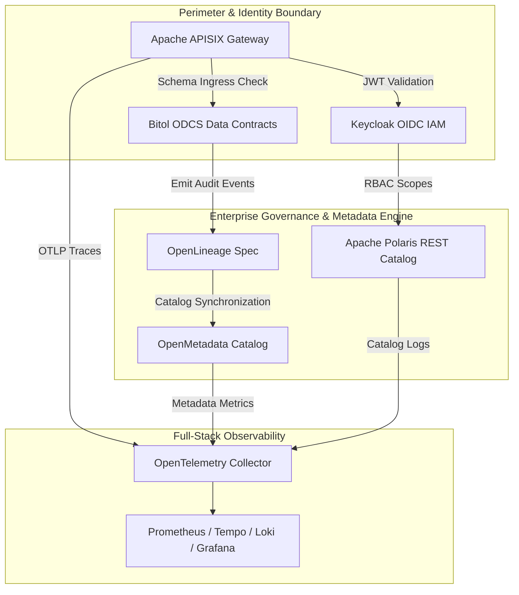

# Data Governance, Subsystems, and Standards Matrix

This reference document outlines the modern governance subsystems, metadata engines, access controls, and technical standards implemented across the modernized BDA lakehouse platform.

---

## 🏛️ Enterprise Governance Enforcement Topology

The diagram below illustrates the end-to-end zero-trust governance perimeter, combining API security via APISIX, Keycloak OIDC, OpenMetadata discovery, and OpenTelemetry observability.

### 1. Standalone Production-Ready SVG Vector Graphic (`.svg`)

<svg xmlns="http://www.w3.org/2000/svg" viewBox="0 0 960 420" width="100%" height="100%">
  <defs>
    <marker id="arrow-gov" viewBox="0 0 10 10" refX="6" refY="5" markerWidth="6" markerHeight="6" orient="auto-start-reverse">
      <path d="M 0 0 L 10 5 L 0 10 z" fill="#64748B" />
    </marker>
    <filter id="shadow-gov" x="-4%" y="-4%" width="108%" height="108%">
      <feDropShadow dx="0" dy="2" stdDeviation="3" flood-color="#000000" flood-opacity="0.25"/>
    </filter>
  </defs>

  <!-- Canvas Background -->
  <rect width="960" height="420" fill="#0F172A" rx="10"/>

  <!-- Perimeter Tier -->
  <rect x="20" y="20" width="920" height="80" fill="#1E293B" stroke="#334155" stroke-width="1.5" rx="8" filter="url(#shadow-gov)"/>
  <rect x="20" y="20" width="920" height="26" fill="#0F172A" rx="8"/>
  <text x="35" y="38" font-family="-apple-system, BlinkMacSystemFont, 'Segoe UI', Roboto, sans-serif" font-size="12" font-weight="bold" fill="#38BDF8">PERIMETER ACCESS &amp; IDENTITY FEDERATION TIER</text>

  <rect x="40" y="52" width="270" height="38" fill="#0369A1" stroke="#38BDF8" rx="4"/>
  <text x="50" y="75" font-family="-apple-system, BlinkMacSystemFont, 'Segoe UI', Roboto, sans-serif" font-size="12" font-weight="bold" fill="#E0F2FE">APISIX Cloud-Native Gateway</text>

  <rect x="345" y="52" width="270" height="38" fill="#1E3A8A" stroke="#3B82F6" rx="4"/>
  <text x="355" y="75" font-family="-apple-system, BlinkMacSystemFont, 'Segoe UI', Roboto, sans-serif" font-size="12" font-weight="bold" fill="#93C5FD">Keycloak OIDC / OAuth2 IAM</text>

  <rect x="650" y="52" width="270" height="38" fill="#581C87" stroke="#A855F7" rx="4"/>
  <text x="660" y="75" font-family="-apple-system, BlinkMacSystemFont, 'Segoe UI', Roboto, sans-serif" font-size="12" font-weight="bold" fill="#E9D5FF">ODCS v3.1.0 Contract Gate</text>

  <!-- Governance Core Tier -->
  <rect x="20" y="135" width="920" height="150" fill="#1E293B" stroke="#334155" stroke-width="1.5" rx="8" filter="url(#shadow-gov)"/>
  <rect x="20" y="135" width="920" height="26" fill="#0F172A" rx="8"/>
  <text x="35" y="153" font-family="-apple-system, BlinkMacSystemFont, 'Segoe UI', Roboto, sans-serif" font-size="12" font-weight="bold" fill="#4ADE80">ENTERPRISE METADATA, PROVENANCE &amp; DISCOVERY CORE</text>

  <rect x="40" y="170" width="270" height="100" fill="#0F172A" stroke="#22C55E" rx="6"/>
  <text x="50" y="192" font-family="-apple-system, BlinkMacSystemFont, 'Segoe UI', Roboto, sans-serif" font-size="13" font-weight="bold" fill="#86EFAC">OpenMetadata Catalog</text>
  <text x="50" y="212" font-family="Consolas, Monaco, monospace" font-size="10" fill="#4ADE80">PostgreSQL + OpenSearch Store</text>
  <text x="50" y="232" font-family="-apple-system, BlinkMacSystemFont, 'Segoe UI', Roboto, sans-serif" font-size="11" fill="#E2E8F0">• DuckDB vss / Local RAG Index</text>

  <rect x="345" y="170" width="270" height="100" fill="#0F172A" stroke="#22C55E" rx="6"/>
  <text x="355" y="192" font-family="-apple-system, BlinkMacSystemFont, 'Segoe UI', Roboto, sans-serif" font-size="13" font-weight="bold" fill="#86EFAC">OpenLineage Standard</text>
  <text x="355" y="212" font-family="Consolas, Monaco, monospace" font-size="10" fill="#4ADE80">Facet: nres_provenance</text>
  <text x="355" y="232" font-family="-apple-system, BlinkMacSystemFont, 'Segoe UI', Roboto, sans-serif" font-size="11" fill="#E2E8F0">• Runtime Pipeline Tracking</text>

  <rect x="650" y="170" width="270" height="100" fill="#0F172A" stroke="#22C55E" rx="6"/>
  <text x="660" y="192" font-family="-apple-system, BlinkMacSystemFont, 'Segoe UI', Roboto, sans-serif" font-size="13" font-weight="bold" fill="#86EFAC">Apache Polaris REST</text>
  <text x="660" y="212" font-family="Consolas, Monaco, monospace" font-size="10" fill="#4ADE80">Iceberg REST Catalog</text>
  <text x="660" y="232" font-family="-apple-system, BlinkMacSystemFont, 'Segoe UI', Roboto, sans-serif" font-size="11" fill="#E2E8F0">• Temp S3 Credential Vending</text>

  <!-- Observability Tier -->
  <rect x="20" y="315" width="920" height="85" fill="#1E293B" stroke="#334155" stroke-width="1.5" rx="8" filter="url(#shadow-gov)"/>
  <rect x="20" y="315" width="920" height="26" fill="#0F172A" rx="8"/>
  <text x="35" y="333" font-family="-apple-system, BlinkMacSystemFont, 'Segoe UI', Roboto, sans-serif" font-size="12" font-weight="bold" fill="#FBBF24">FULL-STACK OPENTELEMETRY OBSERVABILITY TIER</text>

  <rect x="40" y="348" width="880" height="42" fill="#0F172A" stroke="#F59E0B" rx="6"/>
  <text x="50" y="374" font-family="-apple-system, BlinkMacSystemFont, 'Segoe UI', Roboto, sans-serif" font-size="12" font-weight="bold" fill="#FDE68A">OpenTelemetry Collector → Prometheus (Metrics) | Grafana Tempo (Traces) | Grafana Loki (Logs)</text>

  <!-- Lines -->
  <line x1="310" y1="71" x2="345" y2="71" stroke="#64748B" stroke-width="1.5" marker-end="url(#arrow-gov)"/>
  <line x1="785" y1="90" x2="480" y2="170" stroke="#64748B" stroke-width="1.5" marker-end="url(#arrow-gov)"/>
  <line x1="345" y1="220" x2="310" y2="220" stroke="#64748B" stroke-width="1.5" marker-end="url(#arrow-gov)"/>
  <line x1="480" y1="90" x2="785" y2="170" stroke="#64748B" stroke-width="1.5" marker-end="url(#arrow-gov)"/>
  <line x1="175" y1="270" x2="480" y2="348" stroke="#64748B" stroke-width="1.5" marker-end="url(#arrow-gov)"/>
  <line x1="785" y1="270" x2="480" y2="348" stroke="#64748B" stroke-width="1.5" marker-end="url(#arrow-gov)"/>
</svg>

### 2. Git-Native Mermaid Topology (`.mmd`)

### 3. Summary Interface & Routing Table

| Source Component | Target Component | Port / Protocol / API Ingress | Security Boundary / Access Key | Operational Significance / Flow Description |
| :--- | :--- | :--- | :--- | :--- |
| **API Ingress Client** | **APISIX Gateway** | `TCP 8443` / HTTPS OTLP | Keycloak OAuth2 JWT | Enforces perimeter TLS, rate limiting, and trace token propagation. |
| **Data Ingestion Job** | **Bitol ODCS CLI** | Local Subprocess Execution | Schema Contract Spec | Validates incoming payloads against contract schema before committing to Iceberg. |
| **Spark / Airflow** | **OpenLineage Endpoint** | `TCP 5000` / HTTP Lineage REST | Service Token | Captures runtime execution lineage graph including source and target table facets. |
| **Iceberg Client** | **Apache Polaris REST** | `TCP 8181` / HTTPS Iceberg REST | Keycloak Client Credentials | Vends temporary scoped S3 credentials for direct object storage reading. |

---

## 1. Enterprise Governance Subsystem Comparison

| Governance Subsystem | Legacy BDA Stack | Open-Source Replacement | Enterprise Capabilities & Operational Advantages |
| :--- | :--- | :--- | :--- |
| **Enterprise Data Catalog** | Local data dictionaries; unindexed table schemas. | OpenMetadata (backed by PostgreSQL & OpenSearch) & Apache Polaris REST Catalog. | Centralized discovery; automated metadata crawlers; column-level lineage tracking; native Iceberg REST RBAC & temporary S3 credential vending. |
| **Vector Search & Local RAG** | Absence of semantic search; external cloud AI risk. | DuckDB `vss` & PostgreSQL `pgvector` integrated with OpenMetadata. | Zero-trust local semantic search over enterprise schemas and data assets; zero egress to cloud AI services. |
| **Lineage & Provenance Engine** | Manual documentation, untracked operational scripts. | OpenLineage Standard (with custom `nres_provenance` facet). | Runtime operational lineage capture; automated tracking of inputs/outputs across Spark, Airflow, and Trino; cryptographic verification. |
| **Identity & Access (IAM)** | Hardcoded user credentials, local application user tables. | Keycloak Identity and Access Management. | Centralized OpenID Connect (OIDC) / OAuth 2.0; role-based access control (RBAC); Single Sign-On; Multi-Factor Authentication. |
| **API Perimeter Gateway** | Unmanaged load balancers, direct port exposures. | Apache APISIX Cloud-Native API Gateway. | High-performance dynamic routing; JWT validation at the perimeter; TLS termination; IP whitelisting; OpenTelemetry trace context propagation (`opentelemetry` plugin). |
| **Full-Stack Observability** | Fragmented JMX exporters and local log files. | OpenTelemetry Collector feeding Prometheus, Grafana Tempo, and Grafana Loki. | Unified OTLP telemetry standard across Airflow DAGs, Spark jobs, and APISIX routes; Tempo trace storage, Loki log aggregation, and Prometheus metrics visualized in Grafana. |
| **Geospatial Governance** | Undocumented local coordinate systems and file folders. | Standardized Geospatial Profiles (MS ISO 19115:2003 / OGC). | Standardized geospatial metadata; formal EPSG projection definitions; spatial clearinghouse exchange compatibility. |

---

## 2. Ingestion & Application Infrastructure Matrix

| Platform Component | Legacy BDA Architecture | Modern Open-Source Replacement | Core Functional Capabilities |
| :--- | :--- | :--- | :--- |
| **Data Ingestion Engine** | Point-to-point SFTP, manual email parsing, shared folders. | Apache NiFi | Visual flow design, automated protocol translation, built-in backpressure, end-to-end data provenance. |
| **Pipeline Orchestrator** | Static cron schedules, unmonitored background tasks. | Apache Airflow | Declarative Python DAGs, data contract validation gates, native OpenLineage instrumentation, automated retry workflows. |
| **Public & Admin Web Portals** | Monolithic CMS, legacy web application frameworks. | Containerized Next.js / React Web Application | Headless modern architecture, responsive component design, zero legacy CMS vulnerabilities, optimized API integration. |
| **Identity & Authentication** | Local database authentication tables. | Keycloak Identity & Access Management | Unified SSO, OpenID Connect / OAuth 2.0 federation, MFA enforcement, centralized role mapping. |
| **API Management** | Unmanaged load balancers, direct port exposures. | Apache APISIX API Gateway | Dynamic routing, SSL termination, JWT token validation, rate-limiting, edge request transformation. |
| **Business Intelligence Platform** | Proprietary BI server cluster (worker nodes, desktop authoring). | Apache Superset | 100% open-source, horizontally scalable user concurrency (tested across 4 worker nodes with 15–20% headroom), native Trino integration, deck.gl spatial analytics, Row-Level Security. |

---

## 3. Data Governance & Interoperability Standards

### Standard Geospatial Metadata Profile

- **Standard:** MS ISO 19115:2003 / OGC (Geographic Information - Metadata).
- **Mandatory Attributes:** Standardized Coordinate Reference Systems (`EPSG:3168`, `EPSG:3169`, `EPSG:4326`), spatial resolutions, bounding coordinate extents, and lineage source histories.
- **Integration:** Mapped directly as custom metadata facets within OpenMetadata for automated compatibility with spatial clearinghouses.

### Open-Source Architecture & Sovereignty Directives

- **Directives:** Prioritize adoption of robust open-source software, enforce strict data sovereignty protections (on-premises storage), eliminate vendor lock-in, and establish secure, audited inter-agency data sharing.

### Linux Foundation Bitol Open Data Contract Standard (ODCS v3.1.0)

- **Scope:** Machine-readable data contract specifications defining schema models, physical data types, nullability rules, geospatial bounding boxes, and mandatory provenance metadata.
- **Enforcement:** Automated Data Contract CLI gates embedded in NiFi and Airflow ingestion tasks. Rejected non-compliant payloads are diverted to isolated dead-letter queues.
