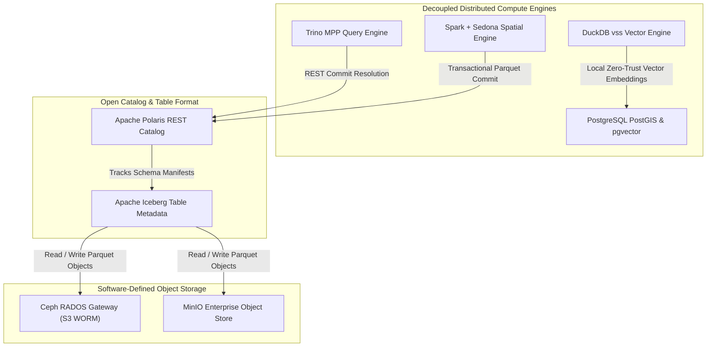

# Target 100% Open-Source Lakehouse Architecture: Storage & Compute Decoupling

The modern data lakehouse pattern resolves the limitations of legacy big data architectures by physically and logically decoupling persistent storage from distributed compute engines. By moving away from HDFS and distributed POSIX file systems like GlusterFS, the modern lakehouse organizes structured, semi-structured, and unstructured data across high-performance, distributed object storage clusters governed by an open table format.

---

## 🏛️ Target Lakehouse Decoupled Storage & Compute Architecture

The diagram below illustrates the modern open-source lakehouse stack, detailing software-defined object storage, the Iceberg REST catalog, and decoupled specialized compute engines.

### 1. Standalone Production-Ready SVG Vector Graphic (`.svg`)

<svg xmlns="http://www.w3.org/2000/svg" viewBox="0 0 960 420" width="100%" height="100%">
  <defs>
    <marker id="arrow-lake" viewBox="0 0 10 10" refX="6" refY="5" markerWidth="6" markerHeight="6" orient="auto-start-reverse">
      <path d="M 0 0 L 10 5 L 0 10 z" fill="#64748B" />
    </marker>
    <filter id="shadow-lake" x="-4%" y="-4%" width="108%" height="108%">
      <feDropShadow dx="0" dy="2" stdDeviation="3" flood-color="#000000" flood-opacity="0.25"/>
    </filter>
  </defs>

  <!-- Background -->
  <rect width="960" height="420" fill="#0F172A" rx="10"/>

  <!-- Tier 1: Compute Engines -->
  <rect x="20" y="20" width="920" height="110" fill="#1E293B" stroke="#334155" stroke-width="1.5" rx="8" filter="url(#shadow-lake)"/>
  <rect x="20" y="20" width="920" height="26" fill="#0F172A" rx="8"/>
  <text x="35" y="38" font-family="-apple-system, BlinkMacSystemFont, 'Segoe UI', Roboto, sans-serif" font-size="12" font-weight="bold" fill="#60A5FA">DECOUPLED SPECIALIZED COMPUTE ENGINES TIER</text>

  <rect x="40" y="55" width="200" height="60" fill="#0F172A" stroke="#3B82F6" rx="6"/>
  <text x="50" y="75" font-family="-apple-system, BlinkMacSystemFont, 'Segoe UI', Roboto, sans-serif" font-size="12" font-weight="bold" fill="#93C5FD">Trino Query Engine</text>
  <text x="50" y="95" font-family="Consolas, Monaco, monospace" font-size="10" fill="#60A5FA">Distributed MPP SQL</text>

  <rect x="270" y="55" width="200" height="60" fill="#0F172A" stroke="#22C55E" rx="6"/>
  <text x="280" y="75" font-family="-apple-system, BlinkMacSystemFont, 'Segoe UI', Roboto, sans-serif" font-size="12" font-weight="bold" fill="#86EFAC">Spark &amp; Sedona</text>
  <text x="280" y="95" font-family="Consolas, Monaco, monospace" font-size="10" fill="#4ADE80">SpatialRDD / GeoParquet</text>

  <rect x="500" y="55" width="200" height="60" fill="#0F172A" stroke="#F59E0B" rx="6"/>
  <text x="510" y="75" font-family="-apple-system, BlinkMacSystemFont, 'Segoe UI', Roboto, sans-serif" font-size="12" font-weight="bold" fill="#FDE68A">DuckDB Engine</text>
  <text x="510" y="95" font-family="Consolas, Monaco, monospace" font-size="10" fill="#FBBF24">vss Vector Similarity Search</text>

  <rect x="730" y="55" width="190" height="60" fill="#0F172A" stroke="#A855F7" rx="6"/>
  <text x="740" y="75" font-family="-apple-system, BlinkMacSystemFont, 'Segoe UI', Roboto, sans-serif" font-size="12" font-weight="bold" fill="#E9D5FF">PostgreSQL PostGIS</text>
  <text x="740" y="95" font-family="Consolas, Monaco, monospace" font-size="10" fill="#C084FC">pgvector Operational Cache</text>

  <!-- Tier 2: Open Catalog -->
  <rect x="20" y="150" width="920" height="80" fill="#1E293B" stroke="#334155" stroke-width="1.5" rx="8" filter="url(#shadow-lake)"/>
  <rect x="20" y="150" width="920" height="26" fill="#0F172A" rx="8"/>
  <text x="35" y="168" font-family="-apple-system, BlinkMacSystemFont, 'Segoe UI', Roboto, sans-serif" font-size="12" font-weight="bold" fill="#4ADE80">ICEBERG OPEN REST CATALOG &amp; METADATA LAYER</text>

  <rect x="40" y="182" width="430" height="38" fill="#065F46" stroke="#22C55E" rx="4"/>
  <text x="50" y="205" font-family="-apple-system, BlinkMacSystemFont, 'Segoe UI', Roboto, sans-serif" font-size="12" font-weight="bold" fill="#86EFAC">Apache Polaris REST Catalog (ACID Commit Arbitration &amp; Credential Vending)</text>

  <rect x="490" y="182" width="430" height="38" fill="#1E3A8A" stroke="#3B82F6" rx="4"/>
  <text x="500" y="205" font-family="-apple-system, BlinkMacSystemFont, 'Segoe UI', Roboto, sans-serif" font-size="12" font-weight="bold" fill="#93C5FD">Apache Iceberg Table Format (Metadata Files, Manifest Lists &amp; Parquet)</text>

  <!-- Tier 3: Storage -->
  <rect x="20" y="250" width="920" height="150" fill="#1E293B" stroke="#334155" stroke-width="1.5" rx="8" filter="url(#shadow-lake)"/>
  <rect x="20" y="250" width="920" height="26" fill="#0F172A" rx="8"/>
  <text x="35" y="268" font-family="-apple-system, BlinkMacSystemFont, 'Segoe UI', Roboto, sans-serif" font-size="12" font-weight="bold" fill="#FBBF24">PERSISTENT SOFTWARE-DEFINED OBJECT STORAGE (S3 WORM COMPLIANCE)</text>

  <rect x="40" y="285" width="430" height="100" fill="#0F172A" stroke="#F59E0B" rx="6"/>
  <text x="50" y="307" font-family="-apple-system, BlinkMacSystemFont, 'Segoe UI', Roboto, sans-serif" font-size="13" font-weight="bold" fill="#FDE68A">Ceph RADOS Gateway Cluster</text>
  <text x="50" y="327" font-family="Consolas, Monaco, monospace" font-size="10" fill="#FBBF24">S3 API / WORM S3 Object Lock</text>
  <text x="50" y="347" font-family="-apple-system, BlinkMacSystemFont, 'Segoe UI', Roboto, sans-serif" font-size="11" fill="#E2E8F0">• Hardware-grade WORM Compliance Mode</text>

  <rect x="490" y="285" width="430" height="100" fill="#0F172A" stroke="#F59E0B" rx="6"/>
  <text x="500" y="307" font-family="-apple-system, BlinkMacSystemFont, 'Segoe UI', Roboto, sans-serif" font-size="13" font-weight="bold" fill="#FDE68A">MinIO Enterprise Object Store</text>
  <text x="500" y="327" font-family="Consolas, Monaco, monospace" font-size="10" fill="#FBBF24">High-Throughput Parquet Storage</text>
  <text x="500" y="347" font-family="-apple-system, BlinkMacSystemFont, 'Segoe UI', Roboto, sans-serif" font-size="11" fill="#E2E8F0">• S3 Versioning &amp; Object Lock Retention</text>

  <!-- Connectors -->
  <line x1="140" y1="115" x2="255" y2="182" stroke="#64748B" stroke-width="1.5" marker-end="url(#arrow-lake)"/>
  <line x1="370" y1="115" x2="255" y2="182" stroke="#64748B" stroke-width="1.5" marker-end="url(#arrow-lake)"/>
  <line x1="600" y1="115" x2="705" y2="182" stroke="#64748B" stroke-width="1.5" marker-end="url(#arrow-lake)"/>
  <line x1="825" y1="115" x2="705" y2="182" stroke="#64748B" stroke-width="1.5" marker-end="url(#arrow-lake)"/>

  <line x1="255" y1="220" x2="255" y2="285" stroke="#64748B" stroke-width="1.5" marker-end="url(#arrow-lake)"/>
  <line x1="705" y1="220" x2="705" y2="285" stroke="#64748B" stroke-width="1.5" marker-end="url(#arrow-lake)"/>
</svg>

### 2. Git-Native Mermaid Topology (`.mmd`)

### 3. Summary Interface & Routing Table

| Source Component | Target Component | Port / Protocol / API Ingress | Security Boundary / Access Key | Operational Significance / Flow Description |
| :--- | :--- | :--- | :--- | :--- |
| **Trino / Spark Engine** | **Apache Polaris REST** | `TCP 8181` / Iceberg REST API | Keycloak Client Credentials | Discovers tables, manages ACID snapshot commits, and obtains S3 tokens. |
| **Polaris Catalog** | **Ceph / MinIO Storage** | `TCP 8080` / `TCP 9000` S3 API | S3 IAM Vended Credentials | Accesses underlying Parquet data files under S3 Object Lock protection. |
| **DuckDB / PostGIS** | **OpenMetadata Catalog** | `TCP 5432` / PostgreSQL TLS 1.3 | mTLS Certificate / DB Key | Provides low-latency operational vector retrieval for local RAG pipelines. |

---

## 1. Storage & Table Format Foundation

### Software-Defined Object Storage

The persistent storage foundation for the modernized BDA platform replaces HDFS and GlusterFS with an on-premises, software-defined object storage cluster powered by **Ceph (via RADOS Gateway)** or **MinIO Enterprise Object Store**.

- **S3 API Compatibility:** Both platforms provide high-throughput, horizontally scalable, S3-compatible APIs.
- **Data Immutability (WORM):** Native support for Write-Once-Read-Many (WORM) storage through S3 Object Lock. Configuring object buckets with S3 Object Lock in **Compliance Mode** establishes hardware-grade data immutability, ensuring that ingested master records cannot be overwritten, modified, or prematurely purged by any user or compromised system account.

### Apache Iceberg Universal Open Table Format

On top of the raw object storage layer, **Apache Iceberg** serves as the universal open table format, replacing relational database sprawl and raw file directories. Iceberg abstracts tabular data away from concrete object paths by maintaining a hierarchical metadata tree composed of metadata files, manifest lists, and manifest files that track immutable Parquet data files.

Core Iceberg capabilities implemented in BDA:

1. **ACID Transactions:** Serialized transaction guarantees through optimistic concurrency control, ensuring that partial or failed analytical writes never expose corrupted records to downstream readers.
2. **In-Place Schema Evolution:** Allows columns to be added, dropped, renamed, or reordered without requiring physical table rewrites or corrupting historical schemas.
3. **Hidden Partitioning & Evolution:** Removes the need for data consumers to know physical directory layout schemes and eliminates query failures caused by human user errors.
4. **Snapshot Isolation & Time-Travel Querying:** Allows auditors and domain scientists to reproduce the state of any table at any historical timestamp or snapshot ID.

---

## 2. Open Catalog & Distributed Compute Engines

### Open-Source Lakehouse Catalog

Centralized table management and commit resolution are decoupled from physical storage through an open-source Iceberg REST catalog, utilizing **Apache Polaris (incubating)**.

- **Apache Polaris:** Acts as the sole central authority for table registration, namespace allocation, transactional commit arbitration, and credential vending.
- Implementing the open Iceberg REST catalog specification ensures that disparate compute engines can discover, read, and write Iceberg tables with consistent access control rules, completely eliminating vendor lock-in.

### Specialized Compute Engines

The processing tier is split into specialized, horizontally scalable compute engines:

1. **Trino (Distributed MPP Query Engine):** Trino serves as the distributed massively parallel processing (MPP) SQL query engine, querying Iceberg tables directly via the Polaris REST catalog. Trino replaces the compute overhead of legacy relational clusters by executing low-latency federated queries across analytical datasets, spatial geometries, and operational stores.
2. **Apache Spark + Apache Sedona (Distributed Geospatial Processing):** Apache Spark, coupled with Apache Sedona, manages intensive batch data transformations, continuous Change Data Capture (CDC) processing, and distributed spatial computing. Apache Sedona extends Spark's memory model with spatial Resilient Distributed Datasets (SpatialRDDs) and vectorized GeoParquet processors, enabling high-performance polygon intersection calculations, spatial joins, and coordinate transformations across massive territorial datasets.
3. **DuckDB (Embedded Analytical & Vector Search Engine):** DuckDB with `vss` (Vector Similarity Search) extension operates as an in-process analytical engine for sub-second analytical queries and local zero-trust semantic search vectors; Parquet datasets are materialized into DuckDB tables with fixed-size `ARRAY` columns before `vss` creates HNSW indexes.
4. **PostgreSQL with PostGIS & `pgvector` (Master Operational & Semantic Serving Layer):** PostgreSQL enhanced with PostGIS and `pgvector` serves as the primary master database engine for operational workloads, spatial caching, metadata catalogs, and persistent HNSW vector similarity search backend for interactive search portals and OpenMetadata semantic RAG pipelines. See [PostgreSQL & pgvector Enterprise Strategy Specification](postgresql-pgvector-enterprise-strategy.html).

---

## 3. Full-Stack Observability & Zero-Trust Local RAG

### OpenTelemetry Observability Pipeline
A unified **OpenTelemetry (OTel)** collector pipeline routes metrics to Prometheus, traces to Grafana Tempo, and logs to Grafana Loki, with Grafana connected to Prometheus, Tempo, and Loki backends:
- **Airflow DAGs:** Instrumented via OpenTelemetry listener for pipeline execution, DAG task latency, and failure tracing.
- **Apache Spark Jobs:** Instrumented via OTel JVM agent and Spark metrics sink for executor CPU, memory, shuffle statistics, and stage traces.
- **Apache APISIX Routes:** Instrumented via `opentelemetry` plugin propagating W3C `traceparent` headers for distributed API route latency, HTTP status codes, and trace context monitoring.

---

## Architectural Mapping & Capabilities Comparison

| Architectural Layer | Legacy BDA Infrastructure | Modern Open-Source Replacement | Core Architectural Capabilities |
| :--- | :--- | :--- | :--- |
| **Distributed Object Storage** | Hadoop HDFS (2 NameNodes, 3 DataNodes), GlusterFS (6 Nodes). | Ceph Object Storage / MinIO Distributed Object Store. | Horizontal scale-out; unified S3 API; hardware-grade WORM S3 Object Lock immutability; elimination of small-file NameNode bottlenecks. |
| **Open Table Format** | Unstructured CSV/JSON files, uncoordinated relational tables. | Apache Iceberg (backed by columnar Apache Parquet). | Serialized ACID transactions; schema and partition evolution without data restructuring; snapshot isolation; time-travel query replay. |
| **Lakehouse Catalog** | Custom relational schemas and local HDFS file directories. | Apache Polaris (Incubating). | Open REST catalog standard; centralized table metadata; cross-engine concurrency arbitration; credential vending and policy enforcement. |
| **Analytical Query Engine** | Monolithic application server, local relational engines. | Trino Distributed SQL Query Engine. | In-memory massively parallel processing; sub-second analytical SQL execution; multi-catalog federation; cost-based query optimization. |
| **Geospatial Processing Engine** | Local spatial libraries, fragmented spatial compute instances. | Apache Sedona executing on Apache Spark + GeoParquet. | Distributed spatial indexing (R-Tree, Quad-Tree); distributed spatial joins; native GeoParquet vector processing; EPSG transformation pipelines. |
| **Operational & Vector Serving** | Fractured operational database clusters. | High-Availability PostgreSQL with PostGIS & `pgvector` extension; DuckDB `vss`. | High-concurrency spatial index caching; sub-10ms operational vector lookups; zero-trust local semantic search over OpenMetadata assets. |
| **Full-Stack Observability** | Isolated JMX exporters, StatsD, and raw log files. | OpenTelemetry Collector feeding Prometheus, Tempo, and Loki with Grafana dashboards. | Unified OTLP tracing, metrics, and logs across Airflow DAGs, Spark jobs, and APISIX routes; Tempo trace storage and Loki log aggregation. |
