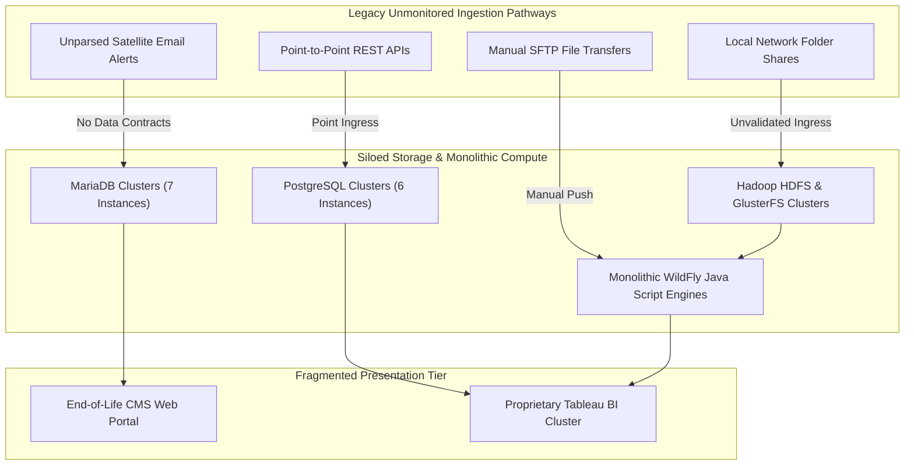

# Legacy Big Data Analytics Environment Architectural Deconstruction

## Executive Summary & Background

Legacy Big Data Analytics (BDA) platforms were typically conceived as centralized analytical facilities to aggregate environmental, telemetry, geological, and operational datasets across multiple organizational domains. However, early-generation deployments are characterized by:

- Tightly coupled compute and storage architectures.
- Unmanaged database proliferation.
- Fragile point-to-point data ingestion methods.
- Proprietary, expensive visualization systems.

---

## 🏛️ Legacy System Architecture & Silo Deconstruction Topology

The diagram below illustrates the fragmented, siloed structure of the legacy BDA environment, demonstrating point-to-point data ingestion and uncoordinated storage nodes.

### 1. Standalone Production-Ready SVG Vector Graphic (`.svg`)

<svg xmlns="http://www.w3.org/2000/svg" viewBox="0 0 960 440" width="100%" height="100%">
  <defs>
    <marker id="arrow-leg" viewBox="0 0 10 10" refX="6" refY="5" markerWidth="6" markerHeight="6" orient="auto-start-reverse">
      <path d="M 0 0 L 10 5 L 0 10 z" fill="#64748B" />
    </marker>
    <filter id="shadow-leg" x="-4%" y="-4%" width="108%" height="108%">
      <feDropShadow dx="0" dy="2" stdDeviation="3" flood-color="#000000" flood-opacity="0.25"/>
    </filter>
  </defs>

  <!-- Canvas Background -->
  <rect width="960" height="440" fill="#0F172A" rx="10"/>

  <!-- Ingestion Tier -->
  <rect x="20" y="20" width="920" height="70" fill="#1E293B" stroke="#334155" stroke-width="1.5" rx="8" filter="url(#shadow-leg)"/>
  <rect x="20" y="20" width="920" height="26" fill="#0F172A" rx="8"/>
  <text x="35" y="38" font-family="-apple-system, BlinkMacSystemFont, 'Segoe UI', Roboto, sans-serif" font-size="12" font-weight="bold" fill="#EF4444">LEGACY FRAGMENTED INGESTION PATHWAYS (NO CONTRACTS)</text>

  <rect x="40" y="52" width="200" height="30" fill="#7F1D1D" stroke="#EF4444" rx="4"/>
  <text x="50" y="71" font-family="-apple-system, BlinkMacSystemFont, 'Segoe UI', Roboto, sans-serif" font-size="11" font-weight="bold" fill="#FCA5A5">Unmonitored Local Shares</text>

  <rect x="270" y="52" width="200" height="30" fill="#7F1D1D" stroke="#EF4444" rx="4"/>
  <text x="280" y="71" font-family="-apple-system, BlinkMacSystemFont, 'Segoe UI', Roboto, sans-serif" font-size="11" font-weight="bold" fill="#FCA5A5">Unparsed Satellite Emails</text>

  <rect x="500" y="52" width="200" height="30" fill="#7F1D1D" stroke="#EF4444" rx="4"/>
  <text x="510" y="71" font-family="-apple-system, BlinkMacSystemFont, 'Segoe UI', Roboto, sans-serif" font-size="11" font-weight="bold" fill="#FCA5A5">Ad-Hoc Point-to-Point APIs</text>

  <rect x="730" y="52" width="190" height="30" fill="#7F1D1D" stroke="#EF4444" rx="4"/>
  <text x="740" y="71" font-family="-apple-system, BlinkMacSystemFont, 'Segoe UI', Roboto, sans-serif" font-size="11" font-weight="bold" fill="#FCA5A5">Manual SFTP File Transfers</text>

  <!-- Storage & Compute Tier -->
  <rect x="20" y="125" width="920" height="170" fill="#1E293B" stroke="#334155" stroke-width="1.5" rx="8" filter="url(#shadow-leg)"/>
  <rect x="20" y="125" width="920" height="26" fill="#0F172A" rx="8"/>
  <text x="35" y="143" font-family="-apple-system, BlinkMacSystemFont, 'Segoe UI', Roboto, sans-serif" font-size="12" font-weight="bold" fill="#F59E0B">SILOED COMPUTING &amp; DISPARATE STORAGE FABRICS</text>

  <rect x="40" y="160" width="260" height="120" fill="#0F172A" stroke="#F59E0B" rx="6"/>
  <text x="50" y="182" font-family="-apple-system, BlinkMacSystemFont, 'Segoe UI', Roboto, sans-serif" font-size="13" font-weight="bold" fill="#FDE68A">HDFS &amp; GlusterFS Clusters</text>
  <text x="50" y="202" font-family="Consolas, Monaco, monospace" font-size="10" fill="#FBBF24">2 NameNodes, 3 DataNodes, NFS</text>
  <text x="50" y="222" font-family="-apple-system, BlinkMacSystemFont, 'Segoe UI', Roboto, sans-serif" font-size="11" fill="#E2E8F0">• POSIX Locking Bottlenecks</text>
  <text x="50" y="240" font-family="-apple-system, BlinkMacSystemFont, 'Segoe UI', Roboto, sans-serif" font-size="11" fill="#E2E8F0">• Coupled Storage &amp; Compute</text>

  <rect x="350" y="160" width="260" height="120" fill="#0F172A" stroke="#F59E0B" rx="6"/>
  <text x="360" y="182" font-family="-apple-system, BlinkMacSystemFont, 'Segoe UI', Roboto, sans-serif" font-size="13" font-weight="bold" fill="#FDE68A">Disparate RDBMS Clusters</text>
  <text x="360" y="202" font-family="Consolas, Monaco, monospace" font-size="10" fill="#FBBF24">7x MariaDB + 6x Postgres Instances</text>
  <text x="360" y="222" font-family="-apple-system, BlinkMacSystemFont, 'Segoe UI', Roboto, sans-serif" font-size="11" fill="#E2E8F0">• Siloed Domain Tables</text>
  <text x="360" y="240" font-family="-apple-system, BlinkMacSystemFont, 'Segoe UI', Roboto, sans-serif" font-size="11" fill="#E2E8F0">• Uncontrolled Data Replication</text>

  <rect x="660" y="160" width="260" height="120" fill="#0F172A" stroke="#F59E0B" rx="6"/>
  <text x="670" y="182" font-family="-apple-system, BlinkMacSystemFont, 'Segoe UI', Roboto, sans-serif" font-size="13" font-weight="bold" fill="#FDE68A">WildFly Application Server</text>
  <text x="670" y="202" font-family="Consolas, Monaco, monospace" font-size="10" fill="#FBBF24">Monolithic Java ETL Scripts</text>
  <text x="670" y="222" font-family="-apple-system, BlinkMacSystemFont, 'Segoe UI', Roboto, sans-serif" font-size="11" fill="#E2E8F0">• No Pipeline Observability</text>
  <text x="670" y="240" font-family="-apple-system, BlinkMacSystemFont, 'Segoe UI', Roboto, sans-serif" font-size="11" fill="#E2E8F0">• Slow Vector Calculation</text>

  <!-- Presentation Tier -->
  <rect x="20" y="325" width="920" height="90" fill="#1E293B" stroke="#334155" stroke-width="1.5" rx="8" filter="url(#shadow-leg)"/>
  <rect x="20" y="325" width="920" height="26" fill="#0F172A" rx="8"/>
  <text x="35" y="343" font-family="-apple-system, BlinkMacSystemFont, 'Segoe UI', Roboto, sans-serif" font-size="12" font-weight="bold" fill="#94A3B8">PROPRIETARY PRESENTATION &amp; EOL CMS</text>

  <rect x="40" y="360" width="410" height="45" fill="#0F172A" stroke="#64748B" rx="6"/>
  <text x="50" y="387" font-family="-apple-system, BlinkMacSystemFont, 'Segoe UI', Roboto, sans-serif" font-size="12" font-weight="bold" fill="#E2E8F0">Legacy EOL Content Management System (CMS)</text>

  <rect x="510" y="360" width="410" height="45" fill="#0F172A" stroke="#64748B" rx="6"/>
  <text x="520" y="387" font-family="-apple-system, BlinkMacSystemFont, 'Segoe UI', Roboto, sans-serif" font-size="12" font-weight="bold" fill="#E2E8F0">Proprietary BI Cluster &amp; Desktop Licensing</text>

  <!-- Lines -->
  <line x1="140" y1="82" x2="170" y2="160" stroke="#EF4444" stroke-width="1.5" marker-end="url(#arrow-leg)"/>
  <line x1="370" y1="82" x2="480" y2="160" stroke="#EF4444" stroke-width="1.5" marker-end="url(#arrow-leg)"/>
  <line x1="600" y1="82" x2="480" y2="160" stroke="#EF4444" stroke-width="1.5" marker-end="url(#arrow-leg)"/>
  <line x1="825" y1="82" x2="790" y2="160" stroke="#EF4444" stroke-width="1.5" marker-end="url(#arrow-leg)"/>

  <line x1="170" y1="280" x2="245" y2="360" stroke="#64748B" stroke-width="1.5" marker-end="url(#arrow-leg)"/>
  <line x1="480" y1="280" x2="245" y2="360" stroke="#64748B" stroke-width="1.5" marker-end="url(#arrow-leg)"/>
  <line x1="790" y1="280" x2="715" y2="360" stroke="#64748B" stroke-width="1.5" marker-end="url(#arrow-leg)"/>
</svg>

### 2. Git-Native Mermaid Topology (`.mmd`)

### 3. Summary Interface & Routing Table

| Source Component | Target Component | Port / Protocol / API Ingress | Security Boundary / Access Key | Operational Significance / Flow Description |
| :--- | :--- | :--- | :--- | :--- |
| **Local Folder / SFTP** | **HDFS / WildFly** | `TCP 22` / `TCP 9000` (NFS/HDFS) | Local User Credentials / No mTLS | Unmonitored file landing zone causing data drift and file corruption. |
| **Email Server** | **MariaDB Data Cluster** | `TCP 3306` (Unencrypted DB) | Static DB Passwords | Parsing scripts extract thermal alerts from raw text without error handling. |
| **WildFly Application** | **Proprietary BI** | `TCP 8000` / HTTP Proprietary | Application Access Tables | Bespoke Java transformation creates isolated data marts for desktop BI consumers. |

---

## Architectural Breakdown by Subsystem

### 1. Data Ingestion Tier

The data ingestion tier currently depends on fractured, unmonitored integration pathways:

- **Precipitation & Meteorological Streams:** Telemetry enters the platform via unmonitored local network folder shares.
- **Satellite Thermal Alerts:** Thermal anomaly alerts arrive through unparsed automated emails.
- **Geospatial & Geological Boundaries:** Hazard boundaries and spatial coordinates are retrieved via point APIs.
- **Departmental Datasets:** Manually transferred over SSH File Transfer Protocol (SFTP) or raw file uploads.

#### Failure Modes

These ingestions lack pre-ingestion schema validation, data contracts, or automated provenance tracking. Upstream structural modifications or transient transmission failures silently break downstream transformation scripts without alerting data operations.

---

### 2. Processing and Distributed Storage Backbone

The processing and storage foundation is fragmented across multiple disparate storage fabrics:

#### Distributed File Storage

- **Hadoop HDFS Cluster:** Comprising 2 NameNodes, 3 DataNodes, and a Network File System (NFS) gateway.
- **GlusterFS Cluster:** A six-node GlusterFS cluster (`GlusterFS-01` through `GlusterFS-06`).

#### Relational Database Tier

Structured data processing is split across uncoordinated relational database instances:

1. **MariaDB Web Portal Cluster:** A high-availability pair of MariaDB nodes (`MariaDB-HA1`, `MariaDB-HA2`) dedicated to web portal management.
2. **MariaDB Data Projects Cluster:** A five-node MariaDB cluster (`MariaDB-01` through `MariaDB-05`) housing specific project tables.
3. **PostgreSQL Web Application Cluster:** A three-node PostgreSQL cluster (`Postgresql-laravel-01` through `Postgresql-laravel-03`) supporting web application state.
4. **PostgreSQL Analytics Cluster:** An independent three-node PostgreSQL cluster (`Postgresql-01` through `Postgresql-03`) executing business queries.

#### Compute Transformations

Cleansing, exploratory analysis, and entity merging run on legacy Red Hat WildFly application server instances. These run bespoke Java scripts without modern orchestration frameworks, declarative pipeline abstractions, or execution observability.

---

### 3. Access, Web Portal, and Visualization Tier

The access and presentation tier is divided between:

- **Primary Web Portal:** Hosted on an end-of-life Content Management System.
- **Dashboard Portal:** A custom application web portal.
- **Visual Analytics:** A proprietary Tableau Server cluster managed by Tableau Server Manager (TSM) alongside desktop client licenses.

#### Security & Access Bottlenecks

This decoupled web and reporting topology lacks unified identity federation, relying instead on localized application access tables that complicate cross-domain authorization and identity management.

---

## Legacy BDA Subsystem Summary Table

| Platform Subsystem | Legacy BDA Architecture | Structural Bottlenecks and Failure Modes |
| :--- | :--- | :--- |
| **Ingestion Tier** | Point-to-point SFTP, local folder shares, automated email parsing, manual web uploads. | Absence of schema validation; lack of ingress rate-limiting; silent pipeline failures upon upstream payload modifications; missing audit trails. |
| **Distributed Storage** | Hadoop HDFS (2 NameNodes, 3 DataNodes, NFS), GlusterFS (6 Nodes). | Tight compute-storage coupling; NameNode memory limits on small files; POSIX locking overhead; lack of object-level immutability. |
| **Relational Database Tier** | Disparate MariaDB clusters (7 instances) and PostgreSQL clusters (6 instances). | Siloed datasets; inconsistent business definitions across departments; uncontrolled replication; database maintenance overhead. |
| **Processing and Analytics** | Application servers running custom cleansing and merging scripts. | Monolithic processing engines; lack of parallel distributed compute; inability to handle large geospatial vector calculations efficiently. |
| **Web Portal Tier** | Legacy CMS (Master and 2 HA nodes), monolithic web application servers. | End-of-life CMS vulnerabilities; tightly coupled presentation logic; decentralized user authentication repositories. |
| **Visualization Tier** | Proprietary BI cluster (3 worker nodes, 2 load balancers, Desktop authoring). | High recurring proprietary licensing fees; vendor lock-in; proprietary workbook formats; restricted cross-organizational sharing. |

---

## Key Takeaways

These disparate systems prevent the BDA platform from functioning as an authoritative Single Source of Truth (SSoT). Relational and file silos encourage data drift, creating divergent versions of critical indicators across departments. Furthermore, the absence of an open metadata and provenance layer means that decision-makers cannot cryptographically verify whether displayed analytical metrics derive from certified field surveys or unvalidated intermediate transformations.
