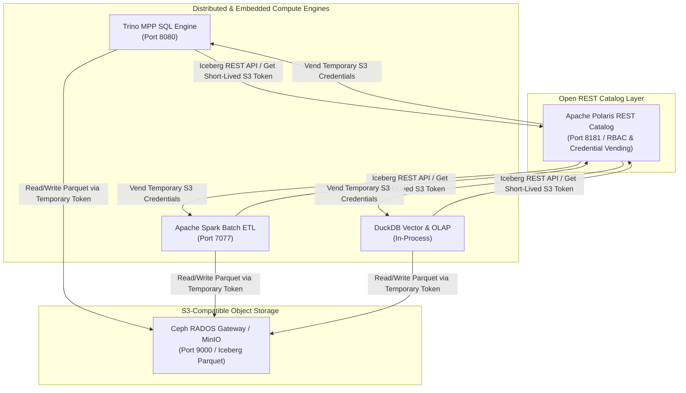
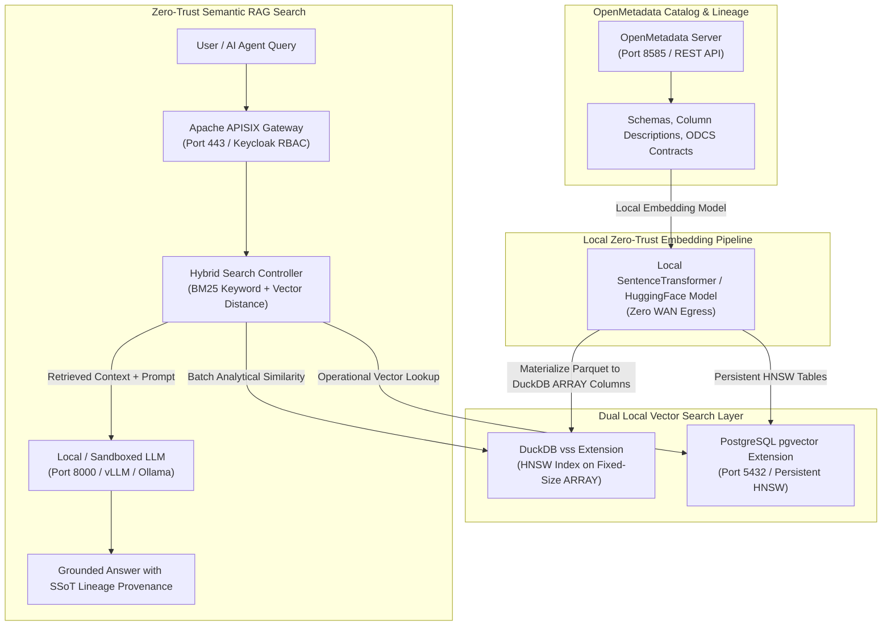
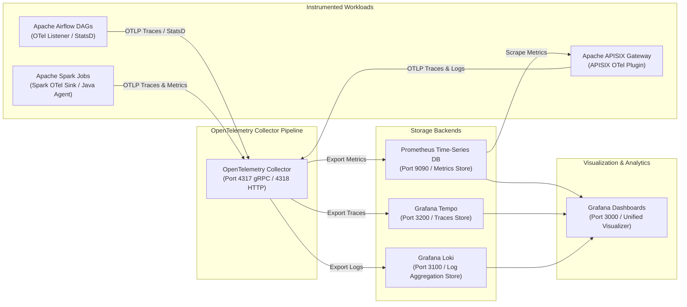

# Next Technology Roadmap Stack Specification

This specification outlines the next-generation open-source technology stack adopted into the **Big Data Analytics (BDA) Single Source of Truth (SSoT) Lakehouse Platform**. The architecture modernizes table catalog management, local zero-trust semantic search / Hybrid RAG, and end-to-end full-stack observability.

---

## 1. Apache Polaris: Multi-Engine Open-Source REST Catalog

### Architectural Adoption
**Apache Polaris (Incubating)** is adopted as the central open-source, multi-engine Iceberg REST catalog across the BDA Lakehouse platform. Polaris acts as the unified metadata catalog and transactional commit authority, serving **Trino**, **Apache Spark**, and **DuckDB**.

Polaris implements the open Apache Iceberg REST Catalog specification, providing centralized role-based access control (RBAC), secure short-lived S3/Ceph credential vending, and multi-catalog namespace isolation without locking compute engines into vendor-proprietary catalog infrastructure.

### Comparison Table: Apache Polaris vs. Apache Gravitino vs. Legacy Metastoes

| Feature / Dimension | Apache Polaris (Selected) | Apache Gravitino | Project Nessie | Hive Metastore (Legacy) |
| :--- | :--- | :--- | :--- | :--- |
| **Primary Scope** | Dedicated Apache Iceberg REST Catalog & Security Engine | Unified Multi-Domain Metadata Catalog (Iceberg, Relational, Kafka, Files) | Git-like Branching Iceberg Catalog | Relational Metadata Catalog for Hive/Hadoop |
| **Multi-Engine Support** | Native Iceberg REST API (Trino, Spark, DuckDB, Flink, PyIceberg) | Multi-catalog proxy wrappers across engines | Iceberg REST & Custom API (Trino, Spark, Flink) | Legacy Thrift API requiring engine shims |
| **Access Control & Credential Vending** | Native RBAC & automated short-lived storage credential vending (S3/Ceph) | Delegated access control across federated catalogs | External OIDC/OAuth2 integration without credential vending | Static HDFS/S3 storage credentials in client configs |
| **Storage Engine Isolation** | Direct S3 / Ceph / MinIO storage integration | Cross-engine abstraction layer | Storage-agnostic object backing | Tied to HDFS/S3 URI path configurations |
| **Concurrency Arbitration** | Serialized ACID commit resolution via Iceberg REST spec | Federated catalog transaction arbitration | Git-style commit branching and merge semantics | MySQL/PostgreSQL metastore lock table overhead |
| **Deployment Complexity** | Low (Stateless REST service with relational/NoSQL metadata backend) | Medium (Requires multi-connector metadata setup) | Medium (Requires backing graph/database store) | High (Heavy JVM footprint and relational DB dependency) |

### Polaris Integration Topology

#### 1. Standalone Production-Ready SVG Vector Graphic (`.svg`)

```xml
<svg xmlns="http://www.w3.org/2000/svg" viewBox="0 0 900 420" width="100%" height="100%">
  <defs>
    <marker id="arrow-pol" viewBox="0 0 10 10" refX="6" refY="5" markerWidth="6" markerHeight="6" orient="auto-start-reverse">
      <path d="M 0 0 L 10 5 L 0 10 z" fill="#475569" />
    </marker>
  </defs>

  <rect width="900" height="420" fill="#F8FAFC" rx="10"/>

  <!-- Compute Tier -->
  <rect x="20" y="20" width="860" height="100" fill="#FFFFFF" stroke="#CBD5E1" stroke-width="1.5" rx="8"/>
  <rect x="20" y="20" width="860" height="28" fill="#EFF6FF" rx="8"/>
  <text x="30" y="39" font-family="-apple-system, BlinkMacSystemFont, 'Segoe UI', Roboto, sans-serif" font-size="12" font-weight="bold" fill="#1E40AF">DISTRIBUTED &amp; EMBEDDED COMPUTE ENGINES</text>

  <rect x="35" y="55" width="250" height="50" fill="#F8FAFC" stroke="#E2E8F0" rx="6"/>
  <text x="45" y="75" font-family="-apple-system, BlinkMacSystemFont, 'Segoe UI', Roboto, sans-serif" font-size="12" font-weight="bold" fill="#0F172A">Trino MPP Engine</text>
  <text x="45" y="92" font-family="Consolas, Monaco, monospace" font-size="10" fill="#2563EB">Port 8080 / SQL</text>

  <rect x="325" y="55" width="250" height="50" fill="#F8FAFC" stroke="#E2E8F0" rx="6"/>
  <text x="335" y="75" font-family="-apple-system, BlinkMacSystemFont, 'Segoe UI', Roboto, sans-serif" font-size="12" font-weight="bold" fill="#0F172A">Apache Spark Batch</text>
  <text x="335" y="92" font-family="Consolas, Monaco, monospace" font-size="10" fill="#166534">Port 7077 / Batch ETL</text>

  <rect x="615" y="55" width="250" height="50" fill="#F8FAFC" stroke="#E2E8F0" rx="6"/>
  <text x="625" y="75" font-family="-apple-system, BlinkMacSystemFont, 'Segoe UI', Roboto, sans-serif" font-size="12" font-weight="bold" fill="#0F172A">DuckDB OLAP &amp; vss</text>
  <text x="625" y="92" font-family="Consolas, Monaco, monospace" font-size="10" fill="#92400E">In-Process Library</text>

  <!-- Catalog Tier -->
  <rect x="20" y="150" width="860" height="110" fill="#FFFFFF" stroke="#CBD5E1" stroke-width="1.5" rx="8"/>
  <rect x="20" y="150" width="860" height="28" fill="#DCFCE7" rx="8"/>
  <text x="30" y="169" font-family="-apple-system, BlinkMacSystemFont, 'Segoe UI', Roboto, sans-serif" font-size="12" font-weight="bold" fill="#166534">OPEN ICEBERG REST CATALOG TIER</text>

  <rect x="230" y="190" width="440" height="55" fill="#F8FAFC" stroke="#A7F3D0" rx="6"/>
  <text x="240" y="212" font-family="-apple-system, BlinkMacSystemFont, 'Segoe UI', Roboto, sans-serif" font-size="13" font-weight="bold" fill="#065F46">Apache Polaris REST Catalog</text>
  <text x="240" y="230" font-family="Consolas, Monaco, monospace" font-size="11" fill="#047857">Port 8181 / Iceberg REST API (RBAC &amp; Credential Vending)</text>

  <!-- Storage Tier -->
  <rect x="20" y="290" width="860" height="110" fill="#FFFFFF" stroke="#CBD5E1" stroke-width="1.5" rx="8"/>
  <rect x="20" y="290" width="860" height="28" fill="#F1F5F9" rx="8"/>
  <text x="30" y="309" font-family="-apple-system, BlinkMacSystemFont, 'Segoe UI', Roboto, sans-serif" font-size="12" font-weight="bold" fill="#334155">S3-COMPATIBLE OBJECT STORAGE</text>

  <rect x="230" y="330" width="440" height="55" fill="#F8FAFC" stroke="#E2E8F0" rx="6"/>
  <text x="240" y="352" font-family="-apple-system, BlinkMacSystemFont, 'Segoe UI', Roboto, sans-serif" font-size="13" font-weight="bold" fill="#0F172A">Ceph RADOS Gateway / MinIO</text>
  <text x="240" y="370" font-family="Consolas, Monaco, monospace" font-size="11" fill="#475569">Port 9000 / S3 API (Parquet &amp; Iceberg Metadata)</text>

  <!-- Arrows -->
  <line x1="160" y1="105" x2="310" y2="190" stroke="#475569" stroke-width="1.5" marker-end="url(#arrow-pol)"/>
  <line x1="450" y1="105" x2="450" y2="190" stroke="#475569" stroke-width="1.5" marker-end="url(#arrow-pol)"/>
  <line x1="740" y1="105" x2="590" y2="190" stroke="#475569" stroke-width="1.5" marker-end="url(#arrow-pol)"/>

  <line x1="450" y1="245" x2="450" y2="330" stroke="#475569" stroke-width="1.5" marker-end="url(#arrow-pol)"/>
</svg>
```

#### 2. Git-Native Mermaid Diagram (`.mmd`)



#### 3. Summary Interface & Routing Table

| Source Component | Target Component | Port / Protocol / API Ingress | Security Boundary / Trust Zone / Access Key | Operational Significance / Flow Description |
| :--- | :--- | :--- | :--- | :--- |
| **Trino / Spark / DuckDB** | **Apache Polaris** | `TCP 8181` / Iceberg REST API | Internal Management Network -> Catalog Zone | Requests table catalog commits and short-lived scoped S3 storage access tokens. |
| **Apache Polaris** | **Compute Engines** | `TCP 8181` / REST Response | Catalog Zone -> Compute Engines | Vends short-lived, scoped S3 access credentials without distributing permanent secrets. |
| **Compute Engines** | **Ceph / MinIO Storage** | `TCP 9000` / S3 REST API | Compute Engines -> S3 Storage | Reads/writes Parquet columnar data directly using temporary Polaris credentials. |

---

## 2. Vector Search & Hybrid RAG: Local Zero-Trust Semantic Search

### Architectural Adoption
To enable local, privacy-preserving semantic search and Retrieval-Augmented Generation (RAG) across the BDA SSoT without transmitting sensitive enterprise metadata to external cloud SaaS APIs, the platform integrates **DuckDB `vss` (Vector Similarity Search)** and **`pgvector` (PostgreSQL Vector Extension)** with **OpenMetadata**.

- **OpenMetadata:** Serves as the central metadata repository and lineage catalog. Metadata assets (table schemas, column descriptions, data contracts, and operational lineage) are ingested and converted into dense vector embeddings locally using open-source embedding models (e.g., `all-MiniLM-L6-v2` or `bge-small-en-v1.5`).
- **DuckDB `vss`:** Provides embedded HNSW (Hierarchical Navigable Small World) indexing for ad-hoc analytical similarity queries and batch vector operations. Parquet datasets are materialized into DuckDB tables with fixed-size `ARRAY` columns (e.g., `FLOAT[384]`) before `vss` constructs HNSW vector indexes over those array columns.
- **`pgvector`:** Embedded into the primary master PostgreSQL database engine (alongside PostGIS), providing persistent HNSW and IVFFlat vector indexing for high-concurrency API endpoint queries, interactive search portals, and Keycloak-gated semantic RAG agents. See [PostgreSQL & pgvector Enterprise Strategy Specification](postgresql-pgvector-enterprise-strategy.md).

### Comparison Table: DuckDB `vss` vs. `pgvector` vs. External Vector SaaS

| Feature / Dimension | DuckDB `vss` (Selected for Analytics) | `pgvector` (Selected for Operational API) | External SaaS Vector DBs (Pinecone, Qdrant Cloud) |
| :--- | :--- | :--- | :--- |
| **Deployment Model** | Embedded in-process extension for DuckDB | Native PostgreSQL extension in operational store | Cloud-hosted multi-tenant SaaS |
| **Zero-Trust Sovereignty** | 100% On-Premises / Local Execution (Zero egress) | 100% On-Premises / Local Execution (Zero egress) | Requires sending sensitive enterprise data over WAN |
| **Index Types Supported** | Array cosine/L2 distance, HNSW vector index over fixed-size ARRAY columns | HNSW (Hierarchical Navigable Small World), IVFFlat | Proprietary cloud vector indexes |
| **Integration with BDA SSoT** | Materializes Parquet into DuckDB tables with fixed-size ARRAY columns for vss HNSW indexing | Integrated with PostGIS operational serving tables | Requires separate ETL pipeline and SaaS synchronization |
| **OpenMetadata Coupling** | Directly indexes OpenMetadata batch metadata exports | Powers OpenMetadata live semantic search backend | Secondary catalog copy required |
| **Query Latency & Use Case** | Ultra-fast batch analytical similarity & local memory RAG | Sub-10ms operational vector lookups & concurrent API search | Variable network latency depending on cloud link |
| **Operational Overhead** | Zero extra infrastructure (Runs inside client process) | Managed within existing HA PostgreSQL cluster | Third-party vendor subscription & cloud API lock-in |

### Zero-Trust Local Hybrid RAG Architecture

#### 1. Standalone Production-Ready SVG Vector Graphic (`.svg`)

```xml
<svg xmlns="http://www.w3.org/2000/svg" viewBox="0 0 950 480" width="100%" height="100%">
  <defs>
    <marker id="arrow-rag" viewBox="0 0 10 10" refX="6" refY="5" markerWidth="6" markerHeight="6" orient="auto-start-reverse">
      <path d="M 0 0 L 10 5 L 0 10 z" fill="#475569" />
    </marker>
  </defs>

  <rect width="950" height="480" fill="#F8FAFC" rx="10"/>

  <!-- Zone 1: OpenMetadata -->
  <rect x="20" y="20" width="210" height="440" fill="#FFFFFF" stroke="#CBD5E1" stroke-width="1.5" rx="8"/>
  <rect x="20" y="20" width="210" height="32" fill="#EFF6FF" rx="8"/>
  <text x="30" y="41" font-family="-apple-system, BlinkMacSystemFont, 'Segoe UI', Roboto, sans-serif" font-size="12" font-weight="bold" fill="#1E40AF">1. OPENMETADATA CATALOG</text>

  <rect x="35" y="110" width="180" height="80" fill="#F8FAFC" stroke="#E2E8F0" rx="6"/>
  <text x="45" y="132" font-family="-apple-system, BlinkMacSystemFont, 'Segoe UI', Roboto, sans-serif" font-size="12" font-weight="bold" fill="#0F172A">OpenMetadata Server</text>
  <text x="45" y="152" font-family="Consolas, Monaco, monospace" font-size="10" fill="#2563EB">Schemas &amp; ODCS Contracts</text>

  <!-- Zone 2: Embedding Pipeline -->
  <rect x="250" y="20" width="210" height="440" fill="#FFFFFF" stroke="#CBD5E1" stroke-width="1.5" rx="8"/>
  <rect x="250" y="20" width="210" height="32" fill="#F1F5F9" rx="8"/>
  <text x="260" y="41" font-family="-apple-system, BlinkMacSystemFont, 'Segoe UI', Roboto, sans-serif" font-size="12" font-weight="bold" fill="#334155">2. LOCAL EMBEDDING</text>

  <rect x="265" y="110" width="180" height="100" fill="#F8FAFC" stroke="#E2E8F0" rx="6"/>
  <text x="275" y="132" font-family="-apple-system, BlinkMacSystemFont, 'Segoe UI', Roboto, sans-serif" font-size="12" font-weight="bold" fill="#0F172A">SentenceTransformer</text>
  <text x="275" y="152" font-family="Consolas, Monaco, monospace" font-size="10" fill="#059669">Local GPU Execution</text>
  <text x="275" y="172" font-family="-apple-system, BlinkMacSystemFont, 'Segoe UI', Roboto, sans-serif" font-size="10" fill="#64748B">Zero WAN Egress</text>

  <!-- Zone 3: Vector Stores -->
  <rect x="480" y="20" width="220" height="440" fill="#FFFFFF" stroke="#CBD5E1" stroke-width="1.5" rx="8"/>
  <rect x="480" y="20" width="220" height="32" fill="#DCFCE7" rx="8"/>
  <text x="490" y="41" font-family="-apple-system, BlinkMacSystemFont, 'Segoe UI', Roboto, sans-serif" font-size="12" font-weight="bold" fill="#166534">3. DUAL VECTOR STORES</text>

  <rect x="495" y="80" width="190" height="80" fill="#F8FAFC" stroke="#E2E8F0" rx="6"/>
  <text x="505" y="102" font-family="-apple-system, BlinkMacSystemFont, 'Segoe UI', Roboto, sans-serif" font-size="12" font-weight="bold" fill="#0F172A">DuckDB vss</text>
  <text x="505" y="122" font-family="Consolas, Monaco, monospace" font-size="10" fill="#166534">ARRAY HNSW Index</text>

  <rect x="495" y="180" width="190" height="80" fill="#F8FAFC" stroke="#A7F3D0" rx="6"/>
  <text x="505" y="202" font-family="-apple-system, BlinkMacSystemFont, 'Segoe UI', Roboto, sans-serif" font-size="12" font-weight="bold" fill="#0F172A">pgvector Store</text>
  <text x="505" y="222" font-family="Consolas, Monaco, monospace" font-size="10" fill="#047857">Port 5432 / Persistent HNSW</text>

  <!-- Zone 4: Hybrid RAG Agent -->
  <rect x="720" y="20" width="210" height="440" fill="#FFFFFF" stroke="#CBD5E1" stroke-width="1.5" rx="8"/>
  <rect x="720" y="20" width="210" height="32" fill="#FEF3C7" rx="8"/>
  <text x="730" y="41" font-family="-apple-system, BlinkMacSystemFont, 'Segoe UI', Roboto, sans-serif" font-size="12" font-weight="bold" fill="#92400E">4. HYBRID RAG AGENT</text>

  <rect x="735" y="70" width="180" height="60" fill="#F8FAFC" stroke="#E2E8F0" rx="6"/>
  <text x="745" y="92" font-family="-apple-system, BlinkMacSystemFont, 'Segoe UI', Roboto, sans-serif" font-size="12" font-weight="bold" fill="#0F172A">APISIX Gateway</text>
  <text x="745" y="112" font-family="Consolas, Monaco, monospace" font-size="10" fill="#2563EB">Keycloak OIDC</text>

  <rect x="735" y="150" width="180" height="80" fill="#F8FAFC" stroke="#E2E8F0" rx="6"/>
  <text x="745" y="172" font-family="-apple-system, BlinkMacSystemFont, 'Segoe UI', Roboto, sans-serif" font-size="12" font-weight="bold" fill="#0F172A">Hybrid Controller</text>
  <text x="745" y="192" font-family="Consolas, Monaco, monospace" font-size="10" fill="#D97706">BM25 + Vector Distance</text>

  <rect x="735" y="250" width="180" height="80" fill="#F8FAFC" stroke="#FDE68A" rx="6"/>
  <text x="745" y="272" font-family="-apple-system, BlinkMacSystemFont, 'Segoe UI', Roboto, sans-serif" font-size="12" font-weight="bold" fill="#0F172A">Local vLLM / Ollama</text>
  <text x="745" y="292" font-family="Consolas, Monaco, monospace" font-size="10" fill="#92400E">Grounded Answer Output</text>

  <!-- Connectors -->
  <line x1="215" y1="150" x2="265" y2="150" stroke="#475569" stroke-width="1.5" marker-end="url(#arrow-rag)"/>
  <line x1="445" y1="140" x2="495" y2="120" stroke="#475569" stroke-width="1.5" marker-end="url(#arrow-rag)"/>
  <line x1="445" y1="180" x2="495" y2="210" stroke="#475569" stroke-width="1.5" marker-end="url(#arrow-rag)"/>
  <line x1="685" y1="220" x2="735" y2="190" stroke="#475569" stroke-width="1.5" marker-end="url(#arrow-rag)"/>
</svg>
```

#### 2. Git-Native Mermaid Diagram (`.mmd`)



#### 3. Summary Interface & Routing Table

| Source Component | Target Component | Port / Protocol / API Ingress | Security Boundary / Trust Zone / Access Key | Operational Significance / Flow Description |
| :--- | :--- | :--- | :--- | :--- |
| **OpenMetadata Server** | **Local Embedder** | In-Memory CUDA / IPC | Zone 1 -> Zone 2 (Local Container Memory) | Extracts schema metadata and generates dense 384-dim / 1024-dim embeddings locally. |
| **Local Embedder** | **DuckDB vss Extension** | In-Process Memory IPC | Zone 2 -> Zone 3 (Zero WAN Egress) | Indexes analytical vector embeddings in-process over fixed-size ARRAY columns. |
| **Local Embedder** | **pgvector Store** | `TCP 5432` / PostgreSQL TLS | Zone 2 -> Zone 3 (Zero WAN Egress) | Materializes persistent HNSW vector similarity tables in HA PostgreSQL cluster. |
| **APISIX Gateway** | **Hybrid Controller** | `TCP 443` / HTTPS OIDC | Zone 4 Perimeter (Keycloak JWT) | Authenticates incoming RAG queries and dispatches hybrid BM25 + vector search requests. |
| **Hybrid Controller** | **Local LLM Inference** | `TCP 8000` / HTTP REST | Zone 4 Internal (Local Host GPU) | Supplies retrieved grounded context chunks to local LLM for zero-hallucination response generation. |

---

## 3. OpenTelemetry Observability: Full-Stack Instrumenting

### Architectural Adoption
The platform replaces fragmented logging and legacy monitoring agents with a unified **OpenTelemetry (OTel)** observability pipeline. OpenTelemetry collectors collect traces, metrics, and logs across **Apache Airflow DAGs**, **Apache Spark jobs**, and **Apache APISIX routes**, routing metrics to **Prometheus**, traces to **Grafana Tempo**, and logs to **Grafana Loki**, with **Grafana** connected to all three backend stores for unified dashboarding.

- **Apache Airflow:** Instrumented using the OpenTelemetry Airflow listener for OTLP trace generation, alongside the StatsD exporter feeding the OTel Collector `statsd` receiver for metrics. Airflow DAG execution logs written to `/opt/airflow/logs/` (mounted to the OTel Collector container at `/var/log/airflow/`) are ingested via the OTel Collector `filelog` receiver (`include: ["/var/log/airflow/**/*.log"]`) and exported to Grafana Loki.
- **Apache Spark:** Instrumented using the Spark OpenTelemetry metrics sink and Java agent attached to Driver and Executors, transmitting OTLP traces and metrics. Spark Driver and Executor logs written to `/opt/spark/logs/` (mounted to the OTel Collector container at `/var/log/spark/`) are ingested via the OTel Collector `filelog` receiver (`include: ["/var/log/spark/**/*.log"]`) and exported to Grafana Loki.
- **Apache APISIX:** Instrumented using the native APISIX `opentelemetry` plugin for distributed HTTP OTLP tracing (propagating W3C `traceparent` headers), alongside the `prometheus` metrics plugin. Access and error logs written to `/usr/local/apisix/logs/` (mounted to the OTel Collector container at `/var/log/apisix/`) are ingested via the OTel Collector `filelog` receiver (`include: ["/var/log/apisix/*.log"]`) and exported to Grafana Loki.

### Comparison Table: OpenTelemetry Stack vs. Legacy Monitoring Solutions

| Metric / Dimension | OpenTelemetry Stack (Selected) | Legacy / Standalone Exporters | Custom Proprietary APM (Dynatrace, Datadog) |
| :--- | :--- | :--- | :--- |
| **Telemetry Standard** | Unified CNCF Standard (Traces, Metrics, Logs) | Fragmented (StatsD for Airflow, JMX for Spark, custom logs) | Proprietary vendor agent formats |
| **Context Propagation** | W3C TraceContext standard across HTTP and gRPC | Broken context across microservice boundaries | Proprietary tracing headers requiring vendor agent |
| **Collector Architecture** | Single OTel Collector daemonset / sidecar pipeline | Multiple disparate exporter daemons | Vendor agent background daemons |
| **Storage Backend** | Prometheus (Metrics), Grafana Tempo (Traces), Grafana Loki (Logs) | Prometheus JMX Exporters + raw log files | Third-party cloud SaaS storage |
| **Vendor Independence** | 100% Vendor-Neutral Open Source | Open-source but uncoordinated extensions | Heavy commercial vendor lock-in |
| **Resource Footprint** | Lightweight Go-based collector with agent buffering | High JVM/Python overhead per custom exporter | High resource agent footprint |

### OpenTelemetry Telemetry Pipeline

#### 1. Standalone Production-Ready SVG Vector Graphic (`.svg`)

```xml
<svg xmlns="http://www.w3.org/2000/svg" viewBox="0 0 950 420" width="100%" height="100%">
  <defs>
    <marker id="arrow-otel" viewBox="0 0 10 10" refX="6" refY="5" markerWidth="6" markerHeight="6" orient="auto-start-reverse">
      <path d="M 0 0 L 10 5 L 0 10 z" fill="#475569" />
    </marker>
  </defs>

  <rect width="950" height="420" fill="#F8FAFC" rx="10"/>

  <!-- Zone 1: Workloads -->
  <rect x="20" y="20" width="220" height="380" fill="#FFFFFF" stroke="#CBD5E1" stroke-width="1.5" rx="8"/>
  <rect x="20" y="20" width="220" height="32" fill="#F1F5F9" rx="8"/>
  <text x="30" y="41" font-family="-apple-system, BlinkMacSystemFont, 'Segoe UI', Roboto, sans-serif" font-size="12" font-weight="bold" fill="#334155">1. WORKLOADS</text>

  <rect x="35" y="70" width="190" height="70" fill="#F8FAFC" stroke="#E2E8F0" rx="6"/>
  <text x="45" y="92" font-family="-apple-system, BlinkMacSystemFont, 'Segoe UI', Roboto, sans-serif" font-size="12" font-weight="bold" fill="#0F172A">Apache Airflow DAGs</text>
  <text x="45" y="112" font-family="Consolas, Monaco, monospace" font-size="10" fill="#475569">OTel Listener &amp; StatsD</text>

  <rect x="35" y="160" width="190" height="70" fill="#F8FAFC" stroke="#E2E8F0" rx="6"/>
  <text x="45" y="182" font-family="-apple-system, BlinkMacSystemFont, 'Segoe UI', Roboto, sans-serif" font-size="12" font-weight="bold" fill="#0F172A">Apache Spark Jobs</text>
  <text x="45" y="202" font-family="Consolas, Monaco, monospace" font-size="10" fill="#2563EB">Spark OTel Java Agent</text>

  <rect x="35" y="250" width="190" height="70" fill="#F8FAFC" stroke="#E2E8F0" rx="6"/>
  <text x="45" y="272" font-family="-apple-system, BlinkMacSystemFont, 'Segoe UI', Roboto, sans-serif" font-size="12" font-weight="bold" fill="#0F172A">Apache APISIX</text>
  <text x="45" y="292" font-family="Consolas, Monaco, monospace" font-size="10" fill="#059669">APISIX OTel Plugin</text>

  <!-- Zone 2: OTel Collector -->
  <rect x="260" y="20" width="210" height="380" fill="#FFFFFF" stroke="#CBD5E1" stroke-width="1.5" rx="8"/>
  <rect x="260" y="20" width="210" height="32" fill="#EFF6FF" rx="8"/>
  <text x="270" y="41" font-family="-apple-system, BlinkMacSystemFont, 'Segoe UI', Roboto, sans-serif" font-size="12" font-weight="bold" fill="#1E40AF">2. OTEL COLLECTOR</text>

  <rect x="275" y="140" width="180" height="120" fill="#F8FAFC" stroke="#CBD5E1" rx="6"/>
  <text x="285" y="165" font-family="-apple-system, BlinkMacSystemFont, 'Segoe UI', Roboto, sans-serif" font-size="13" font-weight="bold" fill="#0F172A">OTel Collector</text>
  <text x="285" y="185" font-family="Consolas, Monaco, monospace" font-size="10" fill="#2563EB">Port 4317 gRPC / 4318</text>
  <text x="285" y="205" font-family="-apple-system, BlinkMacSystemFont, 'Segoe UI', Roboto, sans-serif" font-size="11" fill="#475569">Traces, Metrics, Logs</text>

  <!-- Zone 3: Storage Backends -->
  <rect x="490" y="20" width="220" height="380" fill="#FFFFFF" stroke="#CBD5E1" stroke-width="1.5" rx="8"/>
  <rect x="490" y="20" width="220" height="32" fill="#DCFCE7" rx="8"/>
  <text x="500" y="41" font-family="-apple-system, BlinkMacSystemFont, 'Segoe UI', Roboto, sans-serif" font-size="12" font-weight="bold" fill="#166534">3. BACKEND STORES</text>

  <rect x="505" y="70" width="190" height="70" fill="#F8FAFC" stroke="#E2E8F0" rx="6"/>
  <text x="515" y="92" font-family="-apple-system, BlinkMacSystemFont, 'Segoe UI', Roboto, sans-serif" font-size="12" font-weight="bold" fill="#0F172A">Prometheus</text>
  <text x="515" y="112" font-family="Consolas, Monaco, monospace" font-size="10" fill="#2563EB">Port 9090 / Metrics</text>

  <rect x="505" y="160" width="190" height="70" fill="#F8FAFC" stroke="#E2E8F0" rx="6"/>
  <text x="515" y="182" font-family="-apple-system, BlinkMacSystemFont, 'Segoe UI', Roboto, sans-serif" font-size="12" font-weight="bold" fill="#0F172A">Grafana Tempo</text>
  <text x="515" y="202" font-family="Consolas, Monaco, monospace" font-size="10" fill="#059669">Port 3200 / Traces</text>

  <rect x="505" y="250" width="190" height="70" fill="#F8FAFC" stroke="#E2E8F0" rx="6"/>
  <text x="515" y="272" font-family="-apple-system, BlinkMacSystemFont, 'Segoe UI', Roboto, sans-serif" font-size="12" font-weight="bold" fill="#0F172A">Grafana Loki</text>
  <text x="515" y="292" font-family="Consolas, Monaco, monospace" font-size="10" fill="#D97706">Port 3100 / Logs</text>

  <!-- Zone 4: Visualization -->
  <rect x="730" y="20" width="200" height="380" fill="#FFFFFF" stroke="#CBD5E1" stroke-width="1.5" rx="8"/>
  <rect x="730" y="20" width="200" height="32" fill="#FEF3C7" rx="8"/>
  <text x="740" y="41" font-family="-apple-system, BlinkMacSystemFont, 'Segoe UI', Roboto, sans-serif" font-size="12" font-weight="bold" fill="#92400E">4. VISUALIZATION</text>

  <rect x="745" y="150" width="170" height="100" fill="#F8FAFC" stroke="#FDE68A" rx="6"/>
  <text x="755" y="175" font-family="-apple-system, BlinkMacSystemFont, 'Segoe UI', Roboto, sans-serif" font-size="13" font-weight="bold" fill="#0F172A">Grafana</text>
  <text x="755" y="195" font-family="Consolas, Monaco, monospace" font-size="10" fill="#D97706">Port 3000 / Dashboards</text>

  <!-- Connectors -->
  <line x1="225" y1="200" x2="275" y2="200" stroke="#475569" stroke-width="1.5" marker-end="url(#arrow-otel)"/>
  <line x1="455" y1="180" x2="505" y2="105" stroke="#475569" stroke-width="1.5" marker-end="url(#arrow-otel)"/>
  <line x1="455" y1="200" x2="505" y2="195" stroke="#475569" stroke-width="1.5" marker-end="url(#arrow-otel)"/>
  <line x1="455" y1="220" x2="505" y2="285" stroke="#475569" stroke-width="1.5" marker-end="url(#arrow-otel)"/>
  <line x1="695" y1="200" x2="745" y2="200" stroke="#475569" stroke-width="1.5" marker-end="url(#arrow-otel)"/>
</svg>
```

#### 2. Git-Native Mermaid Diagram (`.mmd`)



#### 3. Summary Interface & Routing Table

| Source Component | Target Component | Port / Protocol / API Ingress | Security Boundary / Trust Zone / Access Key | Operational Significance / Flow Description |
| :--- | :--- | :--- | :--- | :--- |
| **Airflow / Spark / APISIX** | **OTel Collector** | `TCP 4317` gRPC / `4318` HTTP | Zone 1 -> Zone 2 (Internal Telemetry Network) | Streams distributed traces and log events via OTLP to central collector. |
| **Airflow Workload** | **OTel Collector** | `UDP 8125` / StatsD | Zone 1 -> Zone 2 | Transmits Airflow DAG execution metrics to OTel Collector StatsD receiver. |
| **Workload Log Files** | **OTel Collector** | Filelog Receiver / Local Log Mount | Zone 1 -> Zone 2 | Ingests Airflow, Spark, and APISIX container stdout/file logs via OTel filelog receiver. |
| **OTel Collector** | **Prometheus** | `TCP 9090` / Prometheus OTLP | Zone 2 -> Zone 3 | Exports aggregated time-series infrastructure and application metrics. |
| **Prometheus** | **Apache APISIX** | `TCP 9091` / HTTP Scrape | Zone 3 -> Zone 1 | Initiates periodic Prometheus metrics scrape against APISIX gateway endpoint. |
| **OTel Collector** | **Grafana Tempo** | `TCP 4317` gRPC / `4318` HTTP | Zone 2 -> Zone 3 | Exports distributed W3C trace spans to Grafana Tempo storage backend. |
| **OTel Collector** | **Grafana Loki** | `TCP 3100` / HTTP Loki Push API | Zone 2 -> Zone 3 | Exports structured log streams to Grafana Loki log aggregation backend. |
| **Grafana UI** | **Prometheus / Tempo / Loki** | `TCP 3000` / HTTP Query APIs | Zone 4 Operations Dashboard | Queries Prometheus (9090), Tempo (3200), and Loki (3100) backends for unified dashboarding. |

---

## 4. Consolidated Stack Technology Roadmap Matrix

| Subsystem Layer | Target Open-Source Software | Primary Architectural Function | SSoT Platform Integration Point |
| :--- | :--- | :--- | :--- |
| **Iceberg REST Catalog** | **Apache Polaris (Incubating)** | Centralized Iceberg table catalog, RBAC, and temporary S3 credential vending. | Integrated with Trino, Apache Spark, and DuckDB. |
| **Embedded Vector Search** | **DuckDB `vss` Extension** | Fixed-size ARRAY column materialization and embedded HNSW vector indexing for fast analytical search. | OpenMetadata local analytical vector pipeline & local RAG. |
| **Operational Vector Store** | **PostgreSQL `pgvector`** | Persistent vector similarity index for high-concurrency API lookups and semantic portal search. | Integrated into PostgreSQL operational serving layer & APISIX API endpoints. |
| **Metadata & Lineage** | **OpenMetadata** | Enterprise data catalog, automated column profiling, and local embedding extraction. | Synchronized with Polaris REST catalog and DuckDB `vss` / `pgvector`. |
| **Observability Collector** | **OpenTelemetry Collector** | Unified collector for traces, metrics, and logs with W3C trace context propagation. | Receives telemetry from Airflow, Spark, and APISIX; exports to Prometheus, Tempo, and Loki. |
| **Metrics, Traces, Logs & Visualization** | **Prometheus, Tempo, Loki & Grafana** | Unified storage and visualization for time-series metrics, distributed traces, and log aggregation. | Connects Grafana dashboards to Prometheus (metrics), Tempo (traces), and Loki (logs). |
