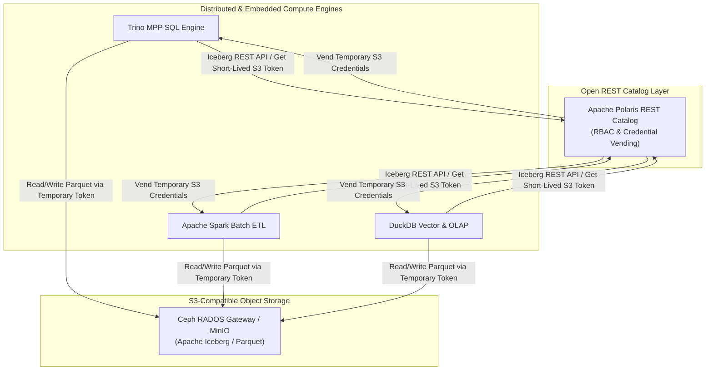
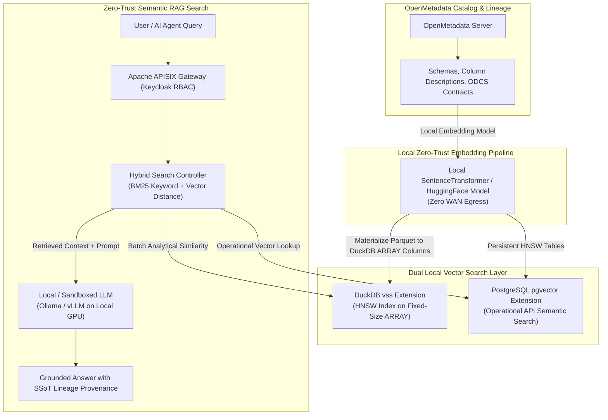

# Next Technology Roadmap Stack Specification

This specification outlines the next-generation open-source technology stack adopted into the **Big Data Analytics (BDA) Single Source of Truth (SSoT) Lakehouse Platform**. The architecture modernizes table catalog management, local zero-trust semantic search / Hybrid RAG, and end-to-end full-stack observability.

---

## 1. Apache Polaris: Multi-Engine Open-Source REST Catalog

### Architectural Adoption
**Apache Polaris (Incubating)** is adopted as the central open-source, multi-engine Iceberg REST catalog across the BDA Lakehouse platform. Polaris acts as the unified metadata catalog and transactional commit authority, serving **Trino**, **Apache Spark**, and **DuckDB**.

Polaris implements the open Apache Iceberg REST Catalog specification, providing centralized role-based access control (RBAC), secure short-lived S3/Ceph credential vending, and multi-catalog namespace isolation without locking compute engines into vendor-proprietary catalog infrastructure.

### Comparison Table: Apache Polaris vs. Apache Gravitino vs. Legacy Metastoes

| Feature / Dimension | Apache Polaris (Selected) | Apache Gravitino | Project Nessie | Hive Metastore (Legacy) |
| :--- | :--- | :--- | :--- | :--- |
| **Primary Scope** | Dedicated Apache Iceberg REST Catalog & Security Engine | Unified Multi-Domain Metadata Catalog (Iceberg, Relational, Kafka, Files) | Git-like Branching Iceberg Catalog | Relational Metadata Catalog for Hive/Hadoop |
| **Multi-Engine Support** | Native Iceberg REST API (Trino, Spark, DuckDB, Flink, PyIceberg) | Multi-catalog proxy wrappers across engines | Iceberg REST & Custom API (Trino, Spark, Flink) | Legacy Thrift API requiring engine shims |
| **Access Control & Credential Vending** | Native RBAC & automated short-lived storage credential vending (S3/Ceph) | Delegated access control across federated catalogs | External OIDC/OAuth2 integration without credential vending | Static HDFS/S3 storage credentials in client configs |
| **Storage Engine Isolation** | Direct S3 / Ceph / MinIO storage integration | Cross-engine abstraction layer | Storage-agnostic object backing | Tied to HDFS/S3 URI path configurations |
| **Concurrency Arbitration** | Serialized ACID commit resolution via Iceberg REST spec | Federated catalog transaction arbitration | Git-style commit branching and merge semantics | MySQL/PostgreSQL metastore lock table overhead |
| **Deployment Complexity** | Low (Stateless REST service with relational/NoSQL metadata backend) | Medium (Requires multi-connector metadata setup) | Medium (Requires backing graph/database store) | High (Heavy JVM footprint and relational DB dependency) |

### Polaris Integration Topology



---

## 2. Vector Search & Hybrid RAG: Local Zero-Trust Semantic Search

### Architectural Adoption
To enable local, privacy-preserving semantic search and Retrieval-Augmented Generation (RAG) across the BDA SSoT without transmitting sensitive enterprise metadata to external cloud SaaS APIs, the platform integrates **DuckDB `vss` (Vector Similarity Search)** and **`pgvector` (PostgreSQL Vector Extension)** with **OpenMetadata**.

- **OpenMetadata:** Serves as the central metadata repository and lineage catalog. Metadata assets (table schemas, column descriptions, data contracts, and operational lineage) are ingested and converted into dense vector embeddings locally using open-source embedding models (e.g., `all-MiniLM-L6-v2` or `bge-small-en-v1.5`).
- **DuckDB `vss`:** Provides embedded HNSW (Hierarchical Navigable Small World) indexing for ad-hoc analytical similarity queries and batch vector operations. Parquet datasets are materialized into DuckDB tables with fixed-size `ARRAY` columns (e.g., `FLOAT[384]`) before `vss` constructs HNSW vector indexes over those array columns.
- **`pgvector`:** Embedded into the operational PostgreSQL serving layer (alongside PostGIS), providing persistent HNSW and IVFFlat vector indexing for high-concurrency API endpoint queries, interactive search portals, and Keycloak-gated semantic RAG agents.

### Comparison Table: DuckDB `vss` vs. `pgvector` vs. External Vector SaaS

| Feature / Dimension | DuckDB `vss` (Selected for Analytics) | `pgvector` (Selected for Operational API) | External SaaS Vector DBs (Pinecone, Qdrant Cloud) |
| :--- | :--- | :--- | :--- |
| **Deployment Model** | Embedded in-process extension for DuckDB | Native PostgreSQL extension in operational store | Cloud-hosted multi-tenant SaaS |
| **Zero-Trust Sovereignty** | 100% On-Premises / Local Execution (Zero egress) | 100% On-Premises / Local Execution (Zero egress) | Requires sending sensitive enterprise data over WAN |
| **Index Types Supported** | Array cosine/L2 distance, HNSW vector index over fixed-size ARRAY columns | HNSW (Hierarchical Navigable Small World), IVFFlat | Proprietary cloud vector indexes |
| **Integration with BDA SSoT** | Materializes Parquet into DuckDB tables with fixed-size ARRAY columns for vss HNSW indexing | Integrated with PostGIS operational serving tables | Requires separate ETL pipeline and SaaS synchronization |
| **OpenMetadata Coupling** | Directly indexes OpenMetadata batch metadata exports | Powers OpenMetadata live semantic search backend | Secondary catalog copy required |
| **Query Latency & Use Case** | Ultra-fast batch analytical similarity & local memory RAG | Sub-10ms operational vector lookups & concurrent API search | Variable network latency depending on cloud link |
| **Operational Overhead** | Zero extra infrastructure (Runs inside client process) | Managed within existing HA PostgreSQL cluster | Third-party vendor subscription & cloud API lock-in |

### Zero-Trust Local Hybrid RAG Architecture



---

## 3. OpenTelemetry Observability: Full-Stack Instrumenting

### Architectural Adoption
The platform replaces fragmented logging and legacy monitoring agents with a unified **OpenTelemetry (OTel)** observability pipeline. OpenTelemetry collectors collect traces, metrics, and logs across **Apache Airflow DAGs**, **Apache Spark jobs**, and **Apache APISIX routes**, routing metrics to **Prometheus**, traces to **Grafana Tempo**, and logs to **Grafana Loki**, with **Grafana** connected to all three backend stores for unified dashboarding.

- **Apache Airflow:** Instrumented using the OpenTelemetry Airflow listener for OTLP trace generation, alongside the StatsD exporter feeding the OpenTelemetry Collector's `statsd` receiver for metrics. Airflow DAG execution logs emitted as structured JSON to container stdout/disk are collected via the OTel Collector `filelog` receiver and routed to Grafana Loki.
- **Apache Spark:** Instrumented using the Spark OpenTelemetry metrics sink and Java agent attached to Driver and Executors, transmitting OTLP traces and metrics. Spark Driver and Executor log files are collected via the OTel Collector `filelog` receiver and routed to Grafana Loki.
- **Apache APISIX:** Instrumented using the native APISIX `opentelemetry` plugin for distributed HTTP OTLP tracing (propagating W3C `traceparent` headers), alongside the `prometheus` metrics plugin. Access and error logs written to stdout/files are collected via the OTel Collector `filelog` receiver and routed to Grafana Loki.

### Comparison Table: OpenTelemetry Stack vs. Legacy Monitoring Solutions

| Metric / Dimension | OpenTelemetry Stack (Selected) | Legacy / Standalone Exporters | Custom Proprietary APM (Dynatrace, Datadog) |
| :--- | :--- | :--- | :--- |
| **Telemetry Standard** | Unified CNCF Standard (Traces, Metrics, Logs) | Fragmented (StatsD for Airflow, JMX for Spark, custom logs) | Proprietary vendor agent formats |
| **Context Propagation** | W3C TraceContext standard across HTTP and gRPC | Broken context across microservice boundaries | Proprietary tracing headers requiring vendor agent |
| **Collector Architecture** | Single OTel Collector daemonset / sidecar pipeline | Multiple disparate exporter daemons | Vendor agent background daemons |
| **Storage Backend** | Prometheus (Metrics), Grafana Tempo (Traces), Grafana Loki (Logs) | Prometheus JMX Exporters + raw log files | Third-party cloud SaaS storage |
| **Vendor Independence** | 100% Vendor-Neutral Open Source | Open-source but uncoordinated extensions | Heavy commercial vendor lock-in |
| **Resource Footprint** | Lightweight Go-based collector with agent buffering | High JVM/Python overhead per custom exporter | High resource agent footprint |

### OpenTelemetry Telemetry Pipeline

```mermaid
flowchart LR
    subgraph Workloads ["Instrumented Workloads"]
        Airflow["Apache Airflow DAGs<br/>(OTel Listener / StatsD)"]
        Spark["Apache Spark Jobs<br/>(Spark OTel Sink / Java Agent)"]
        APISIX["Apache APISIX Gateway<br/>(APISIX OTel Plugin)"]
    end

    subgraph OTelCollectorLayer ["OpenTelemetry Collector Pipeline"]
        OTelCollector["OpenTelemetry Collector<br/>(DaemonSet / Sidecar)"]
    end

    subgraph StorageBackends ["Storage Backends"]
        Prometheus["Prometheus Time-Series DB<br/>(Metrics Store)"]
        Tempo["Grafana Tempo<br/>(Distributed Traces Store)"]
        Loki["Grafana Loki<br/>(Log Aggregation Store)"]
    end

    subgraph VisualizationLayer ["Visualization & Analytics"]
        Grafana["Grafana Dashboards<br/>(Unified Visualizer)"]
    end

    Airflow -->|OTLP Traces, StatsD Metrics, stdout JSON Logs (filelog)| OTelCollector
    Spark -->|OTLP Traces, Metrics, stdout Logs (filelog)| OTelCollector
    APISIX -->|OTLP Traces & stdout Logs (filelog)| OTelCollector
    APISIX -->|Scrape Prometheus Metrics| Prometheus

    OTelCollector -->|Export Metrics| Prometheus
    OTelCollector -->|Export Traces| Tempo
    OTelCollector -->|Export Logs| Loki

    Prometheus --> Grafana
    Tempo --> Grafana
    Loki --> Grafana
```

---

## 4. Consolidated Stack Technology Roadmap Matrix

| Subsystem Layer | Target Open-Source Software | Primary Architectural Function | SSoT Platform Integration Point |
| :--- | :--- | :--- | :--- |
| **Iceberg REST Catalog** | **Apache Polaris (Incubating)** | Centralized Iceberg table catalog, RBAC, and temporary S3 credential vending. | Integrated with Trino, Apache Spark, and DuckDB. |
| **Embedded Vector Search** | **DuckDB `vss` Extension** | Fixed-size ARRAY column materialization and embedded HNSW vector indexing for fast analytical search. | OpenMetadata local analytical vector pipeline & local RAG. |
| **Operational Vector Store** | **PostgreSQL `pgvector`** | Persistent vector similarity index for high-concurrency API lookups and semantic portal search. | Integrated into PostgreSQL operational serving layer & APISIX API endpoints. |
| **Metadata & Lineage** | **OpenMetadata** | Enterprise data catalog, automated column profiling, and local embedding extraction. | Synchronized with Polaris REST catalog and DuckDB `vss` / `pgvector`. |
| **Observability Collector** | **OpenTelemetry Collector** | Unified collector for traces, metrics, and logs with W3C trace context propagation. | Receives telemetry from Airflow, Spark, and APISIX; exports to Prometheus, Tempo, and Loki. |
| **Metrics, Traces, Logs & Visualization** | **Prometheus, Tempo, Loki & Grafana** | Unified storage and visualization for time-series metrics, distributed traces, and log aggregation. | Connects Grafana dashboards to Prometheus (metrics), Tempo (traces), and Loki (logs). |
