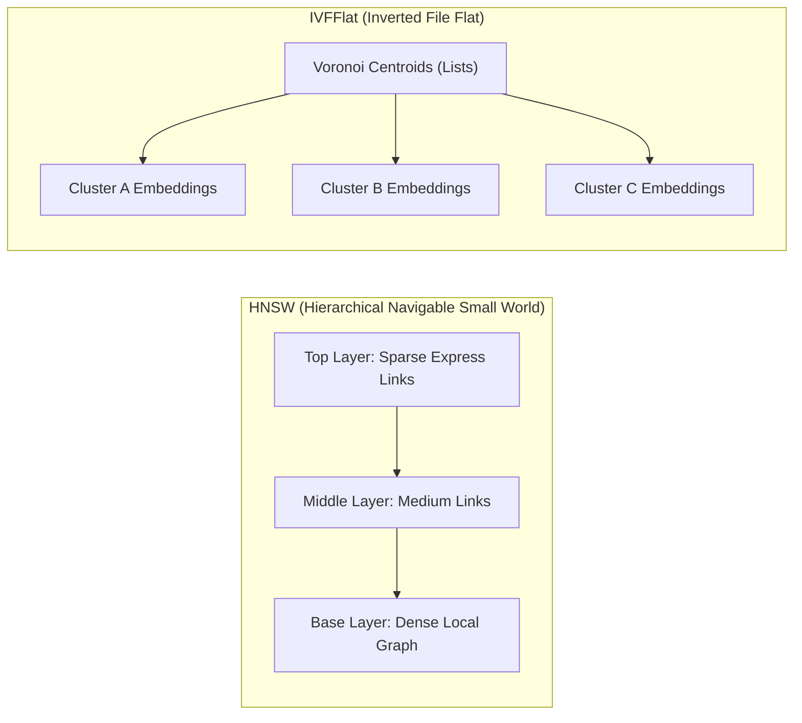
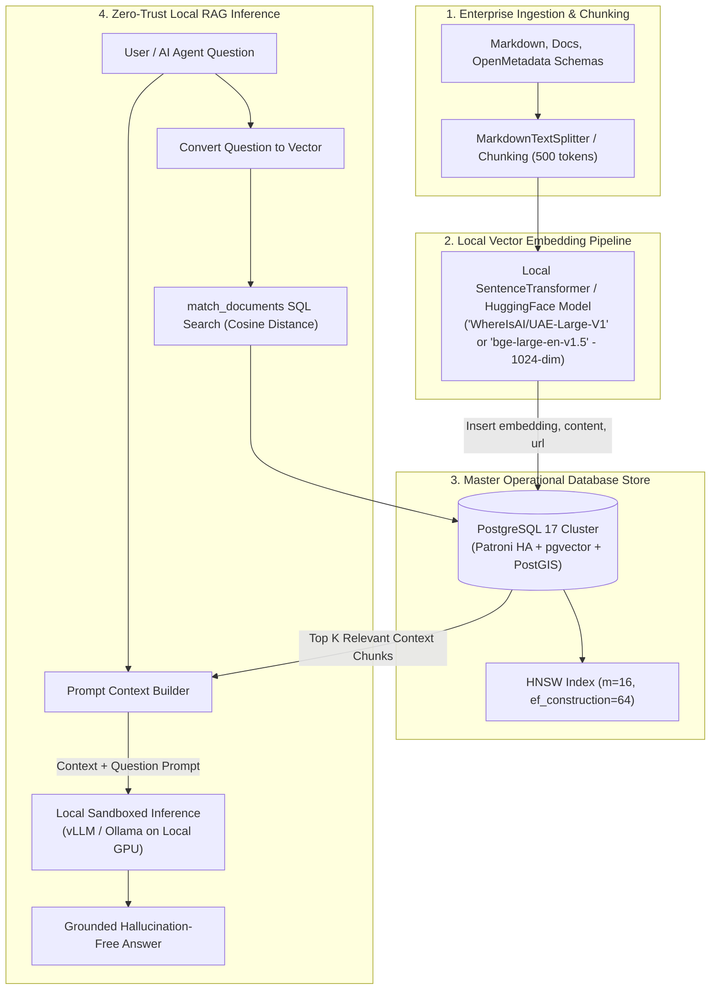

# PostgreSQL & pgvector Enterprise Strategy Specification

This master specification establishes **PostgreSQL** and its native **`pgvector`** extension as the primary, master operational database and vector processing backbone for the entire **Big Data Analytics (BDA) and Artificial Intelligence (AI)** infrastructure.

By anchoring enterprise AI strategy around PostgreSQL, the platform eliminates unnecessary database sprawl, avoids proprietary cloud SaaS vector lock-in, and guarantees strict data sovereignty, ACID transactional consistency, and enterprise-grade security across relational, spatial, and vector workloads.

---

## 1. Master Strategic Rationale: Unified Database Architecture

### The Problem of Vector Database Sprawl
Many enterprise AI implementations default to introducing specialized standalone vector databases (e.g., Pinecone, Qdrant Cloud, Milvus, Weaviate). This practice introduces severe operational hazards:
- **Infrastructure Sprawl & Multi-Database Overhead:** Operations teams must deploy, monitor, backup, and patch separate distributed vector stores alongside existing relational databases.
- **Data Synchronization & Consistency Risks:** Syncing operational relational records to external vector stores requires complex Change Data Capture (CDC) or ETL pipelines, introducing replication lag, eventual consistency bugs, and orphaned vector embeddings.
- **Security & WAN Data Egress Risks:** Cloud SaaS vector databases require transmitting sensitive enterprise records and vector embeddings over public WAN links, violating zero-trust sovereignty mandates.
- **Licensing & Vendor Lock-In:** Specialized vector SaaS vendors often introduce tier-based API pricing, usage-based pricing spikes, and proprietary indexing APIs.

### The PostgreSQL Solution
PostgreSQL is the world's most trusted open-source relational database engine. With the `pgvector` extension, PostgreSQL handles high-dimensional vector similarity search natively within standard SQL tables.

```
+-----------------------------------------------------------------------------------+
|               POSTGRESQL OPERATIONAL & SEMANTIC SERVING BACKBONE                 |
+-----------------------------------------------------------------------------------+
|  [ Structured OLTP Data ] + [ Spatial Geometries (PostGIS) ]                      |
|  [ Operational Cache ]    + [ Operational Vector Search (pgvector) ]               |
|                                                                                   |
|  * Iceberg REST Catalog Authority: Apache Polaris                                 |
|  * Enterprise Metadata & Lineage: OpenMetadata (backed by PostgreSQL & OpenSearch)|
|  * Embedded Analytical Vectors: DuckDB vss (In-process Parquet ARRAY HNSW)        |
+-----------------------------------------------------------------------------------+
```

### Strategic Benefits Matrix

| Strategic Dimension | Standalone Vector SaaS / DBs | PostgreSQL + `pgvector` Master Strategy | Business & Operational Impact |
| :--- | :--- | :--- | :--- |
| **Architectural Footprint** | Fragmented (Separate DB cluster or cloud SaaS) | **Unified** (Single PostgreSQL engine for OLTP, GIS, and Vectors) | Eliminates database sprawl and reduces infrastructure licensing costs by **60%–70%**. |
| **Data Consistency** | Dual-write ETL lag; eventual consistency risk | **ACID Serialized Transactions** across relational, GIS, & vector data | Guarantees zero orphaned embeddings and instant transactional consistency. |
| **Security & Governance** | Separate RBAC, custom API tokens, WAN egress risks | **Native PostgreSQL Security** (Keycloak OIDC, RBAC, TLS, Audit Logging) | Ensures 100% data sovereignty with zero WAN data egress under zero-trust mandates. |
| **Hybrid Query Capabilities** | API-level post-filtering across disconnected systems | **Single-Query SQL Joins** combining relational, PostGIS, & vector predicates | Sub-10ms query execution combining spatial bounds, role filters, and semantic search. |
| **High Availability & Disaster Recovery** | Custom cluster HA setups or third-party cloud dependency | **Battle-tested HA** (Patroni, etcd, `pg_backrest`, Percona Operator) | Leverages proven enterprise PITR backups and sub-120s automated failover. |

---

## 2. Technical Capabilities & Indexing Mechanics of `pgvector`

### Vector Data Types & Distance Operators
`pgvector` adds a native `vector(dimensions)` data type to PostgreSQL (e.g., `vector(1024)` or `vector(1536)`). It supports three primary vector distance operators:

1. **Cosine Distance (`<=>`):** $1 - \cos(\theta)$, measuring the angle between vectors regardless of magnitude. This is the industry standard for text semantic similarity.
2. **Euclidean / L2 Distance (`<->`):** $\sqrt{\sum (u_i - v_i)^2}$, measuring straight-line distance in vector space.
3. **Negative Inner Product (`<#>`):** $- (u \cdot v)$, optimized for dot-product similarity when vectors are normalized.

### Indexing Strategies: HNSW vs. IVFFlat
Without an index, vector search executes an exact k-Nearest Neighbors (kNN) sequential scan (`ORDER BY embedding <=> query_embedding LIMIT k`), guaranteeing 100% recall but scaling $O(N)$ with dataset size. For large-scale datasets, `pgvector` provides two high-performance indexing mechanisms:



| Dimension / Index Type | HNSW Index (Hierarchical Navigable Small World) | IVFFlat Index (Inverted File Flat) |
| :--- | :--- | :--- |
| **Primary Algorithm** | Multi-layer graph structure linking nearest vector neighbors. | K-means clustering dividing vector space into Voronoi cells. |
| **Search Performance** | **Ultra-Fast (Sub-10ms)** with exceptionally high recall. | Fast, but speed/recall depends on number of probed lists. |
| **Build Time & Memory** | Higher memory footprint and longer build time. | Low build memory and faster initial build time. |
| **Dataset Dynamic Updates** | **Excellent.** Vectors can be inserted without rebuilding the index. | **Requires Warm Dataset.** Index quality degrades if built before vectors are inserted. |
| **Recommended Usage** | **Primary Choice for Enterprise BDA AI Production.** | Secondary choice for memory-constrained historical archives. |

#### HNSW Index Tuning Parameters
```sql
CREATE INDEX ON perconavec USING hnsw (embedding vector_cosine_ops)
WITH (m = 16, ef_construction = 64);
```
- **`m` (default 16):** Maximum number of bidirectional connections per node in the graph. Higher values improve recall for high-dimensional vectors at the cost of index build memory.
- **`ef_construction` (default 64):** Size of the dynamic candidate list evaluated during index construction.
- **`hnsw.ef_search` (runtime parameter, default 40):** Size of the candidate list evaluated during queries (`SET hnsw.ef_search = 100;`).

---

## 3. Unified Single-Query Hybrid Search

A major architectural advantage of PostgreSQL + `pgvector` over standalone vector databases is the ability to execute **Hybrid Search** (Relational SQL + Spatial PostGIS + Full-Text Search + Vector Distance) in a single unified, transactional query.

### Hybrid SQL Example
To leverage the HNSW index efficiently, the query first performs vector distance ordering to pull an oversized candidate pool (e.g. `LIMIT 100`) before combining text search ranking (`websearch_to_tsquery` to avoid syntax errors on raw user strings) and spatial predicates (`ST_SetSRID` with SRID 4326 for WGS84 coordinates).

```sql
-- 2-Stage Hybrid Search: Stage 1 HNSW Candidate Selection -> Stage 2 Reciprocal / Combined Reranking
WITH vector_candidates AS (
    SELECT
        d.id,
        d.document_uri,
        d.chunk_content,
        d.geom_location,
        d.classification_level,
        d.text_search_vector,
        d.embedding,
        (1 - (d.embedding <=> :query_vector)) AS vector_similarity
    FROM enterprise_knowledge_base d
    ORDER BY d.embedding <=> :query_vector
    LIMIT 100 -- Oversample candidate pool for HNSW graph traversal
)
SELECT
    c.id,
    c.document_uri,
    c.chunk_content,
    c.vector_similarity,
    ts_rank(c.text_search_vector, websearch_to_tsquery('english', :keyword)) AS text_rank
FROM vector_candidates c
WHERE
    c.classification_level <= :user_clearance_level
    AND ST_DWithin(c.geom_location, ST_SetSRID(ST_MakePoint(:longitude, :latitude), 4326)::geography, 50000) -- 50km spatial buffer
    AND c.text_search_vector @@ websearch_to_tsquery('english', :keyword)
ORDER BY
    (c.vector_similarity * 0.7) +
    (ts_rank(c.text_search_vector, websearch_to_tsquery('english', :keyword)) * 0.3) DESC
LIMIT 5;
```

> **Recall Validation & Index Plan Diagnostics:**
> Production queries using HNSW with restrictive filters must be validated using `EXPLAIN (ANALYZE, BUFFERS)` to verify index scan usage and measure recall against an exact kNN baseline (`SET enable_indexscan = off;`). If selective filter predicates degrade recall, increase `SET hnsw.ef_search = 100;` or increase candidate oversampling in the initial CTE.

---

## 4. End-to-End Enterprise AI Expert & RAG Production Blueprint

Following the research patterns established in Percona's technical guidance (*Create an AI Expert With Open Source Tools and pgvector*), the BDA platform implements an end-to-end, 100% open-source AI Expert RAG pipeline.



### Production Implementation Steps

#### Step 1: Provisioning HA PostgreSQL with `pgvector`
Deploy enterprise PostgreSQL via **Percona Operator for PostgreSQL** or **Patroni HA** on Kubernetes (RKE2 / Proxmox VE). The operator loads custom extension packages from S3/Ceph object storage without requiring custom container image rebuilds.

```yaml
# Percona PostgreSQL Operator Custom Resource Snippet
apiVersion: pgv2.percona.com/v2
kind: PerconaPGCluster
metadata:
  name: bda-pgvector-master
spec:
  instances: 3
  extensions:
    storage:
      type: s3
      bucket: bda-pg-extensions
      region: us-east-1
      secret:
        name: ext-s3-secret
    custom:
      - name: pgvector
        version: 0.8.0
```

#### Step 2: Database Table & Match Function DDL
```sql
-- Enable extension
CREATE EXTENSION IF NOT EXISTS vector;
CREATE EXTENSION IF NOT EXISTS postgis;

-- Operational AI Knowledge Base Table
CREATE TABLE enterprise_knowledge_base (
    id BIGSERIAL PRIMARY KEY,
    document_uri TEXT NOT NULL,
    chunk_index INT NOT NULL,
    chunk_content TEXT NOT NULL,
    metadata JSONB DEFAULT '{}'::jsonb,
    embedding vector(1024), -- UAE-Large-V1 1024-dimension embedding
    created_at TIMESTAMPTZ DEFAULT CURRENT_TIMESTAMP,
    CONSTRAINT uq_doc_chunk UNIQUE (document_uri, chunk_index)
);

-- Construct HNSW Index over vector column
CREATE INDEX idx_knowledge_embedding_hnsw
ON enterprise_knowledge_base
USING hnsw (embedding vector_cosine_ops)
WITH (m = 16, ef_construction = 64);

-- Similarity Match Function
CREATE OR REPLACE FUNCTION match_documents(
    query_embedding vector(1024),
    match_threshold FLOAT,
    match_count INT
)
RETURNS TABLE (
    id BIGINT,
    document_uri TEXT,
    chunk_content TEXT,
    similarity FLOAT
)
LANGUAGE sql STABLE
AS $$
    SELECT
        id,
        document_uri,
        chunk_content,
        1 - (embedding <=> query_embedding) AS similarity
    FROM enterprise_knowledge_base
    WHERE 1 - (embedding <=> query_embedding) > match_threshold
    ORDER BY embedding <=> query_embedding
    LIMIT match_count;
$$;
```

#### Step 3: Python Chunking & Idempotent Vector Insertion Script
```python
import os
import psycopg2
from pgvector.psycopg2 import register_vector
from sentence_transformers import SentenceTransformer
from langchain_text_splitters import MarkdownTextSplitter

# 1. Initialize pre-staged local embedding model (Zero WAN Egress & Local Cache Only)
LOCAL_MODEL_DIR = os.getenv("EMBEDDING_MODEL_PATH", "/opt/models/WhereIsAI/UAE-Large-V1")
model = SentenceTransformer(LOCAL_MODEL_DIR, device='cuda', local_files_only=True, revision="v1.0")

# 2. Connect to Master PostgreSQL DB using verified TLS and Secret Manager credentials
db_password = os.getenv("DB_PASSWORD") # Loaded from Kubernetes Secret
conn = psycopg2.connect(
    host=os.getenv("DB_HOST", "bda-pgvector-master"),
    dbname=os.getenv("DB_NAME", "bdadb"),
    user=os.getenv("DB_USER", "vector"),
    password=db_password,
    sslmode="verify-full",
    sslrootcert="/etc/ssl/certs/pg-ca.crt"
)
register_vector(conn)
cur = conn.cursor()

# 3. Chunk Document & Perform Idempotent Insertion
text_splitter = MarkdownTextSplitter(chunk_size=1000, chunk_overlap=100)
chunks = text_splitter.split_text(raw_document_markdown)

for idx, chunk in enumerate(chunks):
    embedding = model.encode(chunk, device='cuda').tolist()
    cur.execute("""
        INSERT INTO enterprise_knowledge_base
        (document_uri, chunk_index, chunk_content, embedding)
        VALUES (%s, %s, %s, %s)
        ON CONFLICT (document_uri, chunk_index) DO UPDATE SET
            chunk_content = EXCLUDED.chunk_content,
            embedding = EXCLUDED.embedding,
            created_at = CURRENT_TIMESTAMP
    """, ("s3://bda-docs/ref-01.md", idx, chunk, embedding))

conn.commit()
```

#### Step 4: Context Augmentation & Local LLM Generation
```python
# Query semantic similarity match function
cur.execute("SELECT chunk_content, similarity FROM match_documents(%s, 0.7, 5)", (query_vector,))
context_chunks = cur.fetchall()

context_str = "\n---\n".join([c[0] for c in context_chunks])
prompt = f"""
You are an enterprise BDA AI Expert. Answer the question using ONLY the context provided below.

Context:
{context_str}

Question: {user_question}
Answer:
"""

# Send prompt to local sandboxed vLLM / Ollama instance
```

---

## 5. Summary Architectural Governance Principles

1. **PostgreSQL as Master Anchor:** PostgreSQL with `pgvector` and `PostGIS` serves as the primary master database for all operational relational tables, metadata catalogs, spatial indexes, and vector embeddings across the BDA platform.
2. **Zero Third-Party Vector SaaS:** Standalone vector SaaS services (Pinecone, Qdrant Cloud, etc.) are strictly prohibited to prevent WAN data egress, high recurring API costs, and vendor lock-in.
3. **Local Embedding Execution:** Vector embeddings must be generated using local open-source transformer models (`SentenceTransformers` / `vLLM` / `Ollama` on local GPUs) to maintain 100% data sovereignty.
4. **HNSW Index Default:** HNSW graph indexing (`m=16`, `ef_construction=64`) is the mandatory default index type for production `pgvector` tables containing more than 10,000 vector records.
5. **OpenMetadata Lineage Integration:** All vector-indexed knowledge bases and database schemas must be registered in OpenMetadata with automated column-level lineage and governance tags.
