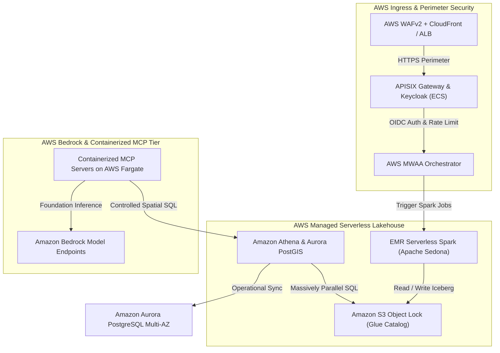

# Solution 1 Reference Spec: AWS Native & Cloud Managed Infrastructure

This reference specification details **Solution 1: All in Cloud (AWS Native & Cloud Managed Services)** for modernizing the Big Data Analytics (BDA) platform. Solution 1 deploys the entire data lakehouse, governance, and AI infrastructure within AWS Cloud infrastructure (specifically optimized for AWS Asia Pacific regions such as `ap-southeast-5` Malaysia).

---

## Technical Executive Summary

Solution 1 leverages open-source data formats (**Apache Iceberg** tables and **Apache Parquet** columnar files) alongside containerized open-source utilities (**Keycloak**, **Apache APISIX**, **OpenMetadata**, **Apache Superset**), while replacing self-hosted distributed state engines with managed AWS cloud services (**AWS Glue Data Catalog**, **Amazon EMR Serverless**, **Amazon Athena**, **AWS MWAA**, and **Amazon Bedrock**).

## 🏛️ AWS Native Architecture & Multi-Tier Topology

The diagram below details Solution 1's AWS Native deployment architecture, illustrating perimeter ingress, serverless lakehouse compute, and managed Bedrock AI inference.

### 1. Standalone Production-Ready SVG Vector Graphic (`.svg`)

<svg xmlns="http://www.w3.org/2000/svg" viewBox="0 0 960 420" width="100%" height="100%">
  <defs>
    <marker id="arrow-aws" viewBox="0 0 10 10" refX="6" refY="5" markerWidth="6" markerHeight="6" orient="auto-start-reverse">
      <path d="M 0 0 L 10 5 L 0 10 z" fill="#64748B" />
    </marker>
    <filter id="shadow-aws" x="-4%" y="-4%" width="108%" height="108%">
      <feDropShadow dx="0" dy="2" stdDeviation="3" flood-color="#000000" flood-opacity="0.25"/>
    </filter>
  </defs>

  <!-- Background -->
  <rect width="960" height="420" fill="#0F172A" rx="10"/>

  <!-- Ingress Tier -->
  <rect x="20" y="20" width="920" height="80" fill="#1E293B" stroke="#334155" stroke-width="1.5" rx="8" filter="url(#shadow-aws)"/>
  <rect x="20" y="20" width="920" height="26" fill="#0F172A" rx="8"/>
  <text x="35" y="38" font-family="-apple-system, BlinkMacSystemFont, 'Segoe UI', Roboto, sans-serif" font-size="12" font-weight="bold" fill="#F59E0B">PERIMETER INGRESS &amp; SECURITY (AWS AP-SOUTHEAST-5)</text>

  <rect x="40" y="52" width="270" height="38" fill="#78350F" stroke="#F59E0B" rx="4"/>
  <text x="50" y="75" font-family="-apple-system, BlinkMacSystemFont, 'Segoe UI', Roboto, sans-serif" font-size="12" font-weight="bold" fill="#FDE68A">AWS WAFv2 + CloudFront / ALB</text>

  <rect x="345" y="52" width="270" height="38" fill="#1E3A8A" stroke="#3B82F6" rx="4"/>
  <text x="355" y="75" font-family="-apple-system, BlinkMacSystemFont, 'Segoe UI', Roboto, sans-serif" font-size="12" font-weight="bold" fill="#93C5FD">APISIX Gateway &amp; Keycloak (ECS)</text>

  <rect x="650" y="52" width="270" height="38" fill="#065F46" stroke="#22C55E" rx="4"/>
  <text x="660" y="75" font-family="-apple-system, BlinkMacSystemFont, 'Segoe UI', Roboto, sans-serif" font-size="12" font-weight="bold" fill="#86EFAC">AWS MWAA &amp; OpenMetadata (EKS)</text>

  <!-- Compute Tier -->
  <rect x="20" y="135" width="920" height="150" fill="#1E293B" stroke="#334155" stroke-width="1.5" rx="8" filter="url(#shadow-aws)"/>
  <rect x="20" y="135" width="920" height="26" fill="#0F172A" rx="8"/>
  <text x="35" y="153" font-family="-apple-system, BlinkMacSystemFont, 'Segoe UI', Roboto, sans-serif" font-size="12" font-weight="bold" fill="#60A5FA">SERVERLESS COMPUTE &amp; ICEBERG LAKEHOUSE ENGINE</text>

  <rect x="40" y="170" width="270" height="100" fill="#0F172A" stroke="#3B82F6" rx="6"/>
  <text x="50" y="192" font-family="-apple-system, BlinkMacSystemFont, 'Segoe UI', Roboto, sans-serif" font-size="13" font-weight="bold" fill="#93C5FD">EMR Serverless Spark</text>
  <text x="50" y="212" font-family="Consolas, Monaco, monospace" font-size="10" fill="#60A5FA">Apache Sedona Spatial Engine</text>
  <text x="50" y="232" font-family="-apple-system, BlinkMacSystemFont, 'Segoe UI', Roboto, sans-serif" font-size="11" fill="#E2E8F0">• GeoParquet &amp; CDC Pipeline</text>

  <rect x="345" y="170" width="270" height="100" fill="#0F172A" stroke="#3B82F6" rx="6"/>
  <text x="355" y="192" font-family="-apple-system, BlinkMacSystemFont, 'Segoe UI', Roboto, sans-serif" font-size="13" font-weight="bold" fill="#93C5FD">Amazon S3 Object Lock</text>
  <text x="355" y="212" font-family="Consolas, Monaco, monospace" font-size="10" fill="#60A5FA">AWS Glue Data Catalog / Iceberg</text>
  <text x="355" y="232" font-family="-apple-system, BlinkMacSystemFont, 'Segoe UI', Roboto, sans-serif" font-size="11" fill="#E2E8F0">• Compliance &amp; Governance WORM</text>

  <rect x="650" y="170" width="270" height="100" fill="#0F172A" stroke="#3B82F6" rx="6"/>
  <text x="660" y="192" font-family="-apple-system, BlinkMacSystemFont, 'Segoe UI', Roboto, sans-serif" font-size="13" font-weight="bold" fill="#93C5FD">Amazon Athena &amp; Aurora</text>
  <text x="660" y="212" font-family="Consolas, Monaco, monospace" font-size="10" fill="#60A5FA">PostgreSQL Multi-AZ PostGIS</text>
  <text x="660" y="232" font-family="-apple-system, BlinkMacSystemFont, 'Segoe UI', Roboto, sans-serif" font-size="11" fill="#E2E8F0">• Low-latency Spatial Cache</text>

  <!-- AI Tier -->
  <rect x="20" y="315" width="920" height="85" fill="#1E293B" stroke="#334155" stroke-width="1.5" rx="8" filter="url(#shadow-aws)"/>
  <rect x="20" y="315" width="920" height="26" fill="#0F172A" rx="8"/>
  <text x="35" y="333" font-family="-apple-system, BlinkMacSystemFont, 'Segoe UI', Roboto, sans-serif" font-size="12" font-weight="bold" fill="#C084FC">CLOUD MANAGED AI &amp; CONTAINERIZED MCP SERVICES</text>

  <rect x="40" y="348" width="880" height="42" fill="#0F172A" stroke="#A855F7" rx="6"/>
  <text x="50" y="374" font-family="-apple-system, BlinkMacSystemFont, 'Segoe UI', Roboto, sans-serif" font-size="12" font-weight="bold" fill="#E9D5FF">Amazon Bedrock + SageMaker Endpoints + Fargate MCP Servers (Private Subnet &amp; Least-Privilege IAM)</text>

  <!-- Connectors -->
  <line x1="175" y1="90" x2="175" y2="170" stroke="#64748B" stroke-width="1.5" marker-end="url(#arrow-aws)"/>
  <line x1="480" y1="90" x2="480" y2="170" stroke="#64748B" stroke-width="1.5" marker-end="url(#arrow-aws)"/>
  <line x1="785" y1="90" x2="785" y2="170" stroke="#64748B" stroke-width="1.5" marker-end="url(#arrow-aws)"/>

  <line x1="175" y1="270" x2="480" y2="348" stroke="#64748B" stroke-width="1.5" marker-end="url(#arrow-aws)"/>
  <line x1="480" y1="270" x2="480" y2="348" stroke="#64748B" stroke-width="1.5" marker-end="url(#arrow-aws)"/>
  <line x1="785" y1="270" x2="480" y2="348" stroke="#64748B" stroke-width="1.5" marker-end="url(#arrow-aws)"/>
</svg>

### 2. Git-Native Mermaid Topology (`.mmd`)



### 3. Summary Interface & Routing Table

| Source Component | Target Component | Port / Protocol / API Ingress | Security Boundary / Access Key | Operational Significance / Flow Description |
| :--- | :--- | :--- | :--- | :--- |
| **User / API Client** | **AWS WAFv2 / CloudFront** | `TCP 443` / HTTPS TLS 1.3 | WAF OWASP Rulesets / TLS Cert | Filters malicious traffic and routes verified HTTPS calls to ALB. |
| **MWAA Orchestrator** | **EMR Serverless** | AWS SDK / EMR API | IAM Role / VPC Endpoint | Triggers auto-scaling Spark batch jobs for GeoParquet and CDC transformations. |
| **EMR Serverless** | **Amazon S3 Object Lock** | S3 API / `s3a://` | S3 IAM Policy / KMS Key | Commits Iceberg data files under S3 Object Lock Compliance WORM retention. |
| **Fargate MCP Server** | **Amazon Bedrock / Athena** | AWS SDK / Bedrock API | Task IAM Policy / DB Read-Only | Invokes LLM foundation models and executes scoped spatial query tools over Athena. |

---

## Portability Qualification & Cloud-Managed Trade-offs

* **Portability Qualification:** Solution 1 maintains open table and data asset standards (Apache Iceberg / Parquet) to prevent data payload lock-in. However, because it relies on AWS-managed control plane services (AWS Glue, AWS MWAA, Amazon Bedrock), it is cloud-dependent and AWS-managed rather than 100% vendor-neutral.
* **Target Adoption:** Designed for enterprise organizations seeking low operational overhead, automatic serverless scaling, managed compliance SLAs, and rapid regional deployment in `ap-southeast-5`.

---

## Core Components & Cloud Services Mapping

### 1. Persistent Cloud Storage (Tier 0, 1, 2)
* **Tier 0 Golden Human SSoT:** Amazon S3 Buckets configured with **S3 Object Lock in Compliance Mode** (Bucket Versioning enabled). Enforces software-enforced immutability for statutory records under a defined compliance retention policy (e.g., 7-year statutory or 365-day operational compliance).
* **Tier 1 Machine Telemetry:** Amazon S3 Buckets with **S3 Object Lock in Governance Mode** for raw precipitation, hydrological, and thermal satellite telemetry.
* **Tier 2 AI Operational Sandbox:** Ephemeral Amazon S3 Scratch Buckets with automated **S3 Lifecycle Rules** enforcing a 30-day object expiration/auto-purge policy.

### 2. Lakehouse Catalog & Metadata Tier
* **AWS Glue Data Catalog / Apache Polaris REST Catalog:** Serves as the central Iceberg REST catalog on Amazon EKS or AWS Glue, managing Iceberg table commits and Parquet file manifests.
* **OpenMetadata on Amazon EKS:** Backed by **Amazon Aurora PostgreSQL** and **AWS OpenSearch Service**, capturing column-level lineage, Bitol ODCS contracts, and ISO 19115 geospatial metadata.

### 3. Distributed Query & Processing Engines
* **Amazon EMR Serverless (Apache Spark + Apache Sedona):** Serverless execution of distributed GeoParquet processing, SpatialRDD joins, and CDC transformations without managing EC2 instances.
* **Amazon Athena / Amazon EMR Trino:** Massively parallel SQL query engine over Iceberg tables via Glue/Polaris REST catalog.
* **Amazon Aurora PostgreSQL (Multi-AZ with PostGIS):** Operational serving store and spatial cache providing low-latency queries for interactive web dashboards.

### 4. Ingestion & Pipeline Orchestration
* **Amazon Managed Workflows for Apache Airflow (MWAA):** Orchestrates batch pipelines, ODCS contract CLI validation, and OpenLineage event hooks. Operational lineage tracking requires the version-compatible `apache-airflow-providers-openlineage` provider package, matching constraint files, and an explicit `openlineage.transport` configuration pointing to OpenMetadata or OpenLineage backends.
* **Apache NiFi on ECS / EKS:** Streaming ingestion, protocol translation, and API polling from sensor networks.

### 5. Perimeter Security, Ingress & Identity
* **AWS WAFv2 + ALB + AWS CloudFront:** Perimeter protection with rate-limiting and OWASP Top 10 rulesets. When mTLS is required for API clients, CloudFront operates in TLS passthrough mode (or ALB TCP passthrough) to forward raw client TLS handshakes directly to Apache APISIX.
* **Apache APISIX Gateway on ECS/EKS:** APISIX terminates client mTLS, validates client X.509 certificates against trusted CA bundles, strips unverified incoming proxy headers, injects authenticated user/client identity headers (`X-Client-Cert-DN`, `X-User-ID`), and enforces cache policy disabling on all mTLS-authenticated routes.
* **AWS Cognito / Keycloak on ECS:** Unified OIDC/OAuth 2.0 authentication and MFA enforcement.

### 6. Cloud AI & MCP Sandboxing with Enforceable Guardrails
* **Amazon Bedrock & Amazon SageMaker Endpoints:** Provides foundation models (e.g., Anthropic Claude, Amazon Titan) for analytical inferencing.
* **Containerized MCP Servers on AWS Fargate (ECS) / EKS Enforceable Controls:**
  * **Database Least Privilege:** Database roles assigned to MCP agents execute with strictly limited grants (`GRANT SELECT ON ...` only) and enforce `SET SESSION CHARACTERISTICS AS TRANSACTION READ ONLY`.
  * **IAM & S3 Tier 2 Scoping:** Fargate task execution roles are governed by IAM policies restricting S3 write verbs (`s3:PutObject`) exclusively to `arn:aws:s3:::bda-tier2-scratch-*` buckets.
  * **Network Isolation:** MCP containers run in private subnets with egress restricted via Security Group stateful rules to APISIX gateway endpoints and Bedrock VPC endpoints only.
  * **Negative Testing & Guardrail Verification:** Automated CI/CD integration tests verify that compromised MCP tool payloads attempting `INSERT`, `UPDATE`, `DROP`, or out-of-bounds `s3:PutObject` calls are rejected with `403 Access Denied` or SQL transaction abort errors.

---

## Architectural Mapping & Technical Specifications

| Subsystem | Managed AWS Cloud Implementation | Core Technical Specifications & Workload-Scoped Targets |
| :--- | :--- | :--- |
| **Object Storage** | Amazon S3 with S3 Object Lock (Compliance / Governance Mode). | 99.999999999% (11 9's) storage durability target; software WORM immutability; automated 30-day lifecycle auto-purge for Tier 2 scratch. |
| **Lakehouse Catalog** | AWS Glue Data Catalog / Apache Polaris REST Catalog on EKS. | Centralized Iceberg REST catalog; ACID commit resolution; cross-engine credential vending. |
| **Batch Compute** | Amazon EMR Serverless (Apache Spark 3.5+ & Apache Sedona). | Auto-scaling driver/executor capacity; GeoParquet vector processing; zero server provisioning. |
| **SQL Query Engine** | Amazon Athena / Amazon EMR Trino. | Massively parallel in-memory SQL engine; sub-second analytical query execution target over Iceberg Parquet tables. |
| **Orchestration** | AWS MWAA (Managed Workflows for Apache Airflow). | Fully managed Airflow DAG execution; OpenLineage provider integration (`apache-airflow-providers-openlineage`); automated retries. |
| **Operational DB** | Amazon Aurora PostgreSQL (Multi-AZ with PostGIS). | Workload-scoped spatial query target (< 10ms for PostGIS spatial index lookups under warm cache); Multi-AZ failover target (< 120s RTO). |
| **Perimeter Security** | AWS WAFv2 + ALB + CloudFront + Apache APISIX Gateway. | OWASP protection; APISIX mTLS client certificate termination & validation; unverified header stripping; mTLS cache disabling. |
| **AI Inferencing** | Amazon Bedrock + SageMaker Endpoints + Fargate MCP. | Managed LLM endpoints; containerized MCP tools with least-privilege DB roles, IAM S3 Tier 2 bucket scoping, and negative write tests. |

---

## Key Findings & External References

1. **EMR Serverless & Iceberg AWS Glue Integration:** AWS EMR Serverless integrates natively with Apache Iceberg using the AWS Glue Data Catalog. For Spark batch jobs submitted to EMR Serverless, the required configuration options include:
   ```json
   {
     "classification": "spark-defaults",
     "properties": {
       "spark.sql.extensions": "org.apache.iceberg.spark.extensions.IcebergSparkSessionExtensions",
       "spark.sql.catalog.dev": "org.apache.iceberg.spark.SparkCatalog",
       "spark.sql.catalog.dev.catalog-impl": "org.apache.iceberg.aws.glue.GlueCatalog",
       "spark.sql.catalog.dev.warehouse": "s3://bda-lakehouse-warehouse/iceberg/",
       "spark.hadoop.hive.metastore.client.factory.class": "com.amazonaws.glue.catalog.metastore.AWSGlueDataCatalogHiveClientFactory"
     }
   }
   ```
   See [AWS Documentation: Using Apache Iceberg with EMR Serverless](https://docs.aws.amazon.com/emr/latest/EMR-Serverless-UserGuide/using-iceberg.html).
2. **S3 Object Lock Retention Guarantees:** Software-enforced Compliance Mode prevents even AWS root accounts from deleting or overriding locked objects during the retention window. See [AWS Documentation: How S3 Object Lock Works](https://docs.aws.amazon.com/AmazonS3/latest/userguide/object-lock-overview.html).
3. **AWS MWAA OpenLineage Provider Integration:** Lineage tracking in MWAA is enabled by adding `apache-airflow-providers-openlineage` to `requirements.txt` with matching Airflow constraint files, and configuring `openlineage.transport` settings in Airflow configuration options. See [AWS Big Data Blog: OpenLineage Integration on AWS](https://aws.amazon.com/blogs/big-data/).
