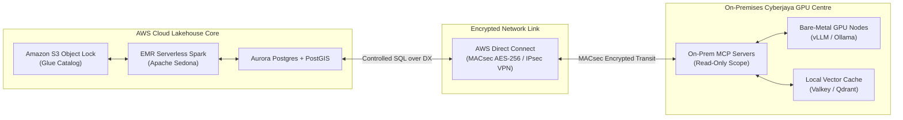

# Solution 2 Reference Spec: Hybrid Cloud Lakehouse & On-Premises GPU Infrastructure

This reference specification details **Solution 2: Hybrid - AI On-Premises (Cloud Lakehouse + On-Prem GPU Infrastructure)** for modernizing the Big Data Analytics (BDA) platform. Solution 2 balances cloud elasticity for data storage with complete data sovereignty and high-performance local AI inferencing on local GPU hardware.

---

## Technical Executive Summary

Solution 2 retains the core data lakehouse, primary S3 Object Lock storage, and batch compute processing within AWS Cloud, while placing AI inferencing engines (**Ollama**, **vLLM**, **RAGFlow**), vector databases (**Valkey**, **Qdrant**), and containerized **Model Context Protocol (MCP)** servers on-premises on local bare-metal GPU servers connected via **AWS Direct Connect**.

## 🏛️ Hybrid Cloud-OnPrem Architecture Topology

The diagram below details Solution 2's hybrid architecture, linking the AWS Cloud Lakehouse Core to On-Premises GPU inference nodes over an encrypted AWS Direct Connect link.

### 1. Standalone Production-Ready SVG Vector Graphic (`.svg`)

<svg xmlns="http://www.w3.org/2000/svg" viewBox="0 0 960 420" width="100%" height="100%">
  <defs>
    <marker id="arrow-hyb" viewBox="0 0 10 10" refX="6" refY="5" markerWidth="6" markerHeight="6" orient="auto-start-reverse">
      <path d="M 0 0 L 10 5 L 0 10 z" fill="#64748B" />
    </marker>
    <filter id="shadow-hyb" x="-4%" y="-4%" width="108%" height="108%">
      <feDropShadow dx="0" dy="2" stdDeviation="3" flood-color="#000000" flood-opacity="0.25"/>
    </filter>
  </defs>

  <!-- Background -->
  <rect width="960" height="420" fill="#0F172A" rx="10"/>

  <!-- Left Container: AWS Cloud -->
  <rect x="20" y="20" width="430" height="380" fill="#1E293B" stroke="#334155" stroke-width="1.5" rx="8" filter="url(#shadow-hyb)"/>
  <rect x="20" y="20" width="430" height="26" fill="#0F172A" rx="8"/>
  <text x="35" y="38" font-family="-apple-system, BlinkMacSystemFont, 'Segoe UI', Roboto, sans-serif" font-size="12" font-weight="bold" fill="#38BDF8">AWS CLOUD LAKEHOUSE CORE (AP-SOUTHEAST-5)</text>

  <rect x="40" y="60" width="390" height="85" fill="#0F172A" stroke="#0284C7" rx="6"/>
  <text x="50" y="82" font-family="-apple-system, BlinkMacSystemFont, 'Segoe UI', Roboto, sans-serif" font-size="13" font-weight="bold" fill="#38BDF8">AWS S3 Object Lock &amp; Glue Catalog</text>
  <text x="50" y="102" font-family="Consolas, Monaco, monospace" font-size="10" fill="#7DD3FC">Tier 0 SSoT WORM Compliance Mode</text>
  <text x="50" y="122" font-family="-apple-system, BlinkMacSystemFont, 'Segoe UI', Roboto, sans-serif" font-size="11" fill="#E2E8F0">• Iceberg Table Catalog &amp; Metadata</text>

  <rect x="40" y="165" width="390" height="85" fill="#0F172A" stroke="#0284C7" rx="6"/>
  <text x="50" y="187" font-family="-apple-system, BlinkMacSystemFont, 'Segoe UI', Roboto, sans-serif" font-size="13" font-weight="bold" fill="#38BDF8">Amazon EMR Serverless &amp; Athena</text>
  <text x="50" y="207" font-family="Consolas, Monaco, monospace" font-size="10" fill="#7DD3FC">Apache Spark + Apache Sedona Spatial</text>
  <text x="50" y="227" font-family="-apple-system, BlinkMacSystemFont, 'Segoe UI', Roboto, sans-serif" font-size="11" fill="#E2E8F0">• GeoParquet Processing &amp; SQL Query</text>

  <rect x="40" y="270" width="390" height="110" fill="#0F172A" stroke="#0284C7" rx="6"/>
  <text x="50" y="292" font-family="-apple-system, BlinkMacSystemFont, 'Segoe UI', Roboto, sans-serif" font-size="13" font-weight="bold" fill="#38BDF8">Aurora Postgres + MWAA Airflow</text>
  <text x="50" y="312" font-family="Consolas, Monaco, monospace" font-size="10" fill="#7DD3FC">PostGIS / OpenMetadata Orchestration</text>
  <text x="50" y="332" font-family="-apple-system, BlinkMacSystemFont, 'Segoe UI', Roboto, sans-serif" font-size="11" fill="#E2E8F0">• Spatial Cache &amp; Pipeline Control</text>

  <!-- Right Container: On-Premises GPU Centre -->
  <rect x="510" y="20" width="430" height="380" fill="#1E293B" stroke="#334155" stroke-width="1.5" rx="8" filter="url(#shadow-hyb)"/>
  <rect x="510" y="20" width="430" height="26" fill="#0F172A" rx="8"/>
  <text x="525" y="38" font-family="-apple-system, BlinkMacSystemFont, 'Segoe UI', Roboto, sans-serif" font-size="12" font-weight="bold" fill="#4ADE80">ON-PREMISES DATA CENTRE (CYBERJAYA GPU)</text>

  <rect x="530" y="60" width="390" height="85" fill="#0F172A" stroke="#16A34A" rx="6"/>
  <text x="540" y="82" font-family="-apple-system, BlinkMacSystemFont, 'Segoe UI', Roboto, sans-serif" font-size="13" font-weight="bold" fill="#86EFAC">Bare-Metal GPU Inference Nodes</text>
  <text x="540" y="102" font-family="Consolas, Monaco, monospace" font-size="10" fill="#4ADE80">NVIDIA H100 / A100 / Ollama / vLLM</text>
  <text x="540" y="122" font-family="-apple-system, BlinkMacSystemFont, 'Segoe UI', Roboto, sans-serif" font-size="11" fill="#E2E8F0">• Local Qwen / Llama 3 Inference</text>

  <rect x="530" y="165" width="390" height="85" fill="#0F172A" stroke="#16A34A" rx="6"/>
  <text x="540" y="187" font-family="-apple-system, BlinkMacSystemFont, 'Segoe UI', Roboto, sans-serif" font-size="13" font-weight="bold" fill="#86EFAC">Local Vector Cache &amp; RAGFlow</text>
  <text x="540" y="207" font-family="Consolas, Monaco, monospace" font-size="10" fill="#4ADE80">Valkey / Qdrant High-Speed Store</text>
  <text x="540" y="227" font-family="-apple-system, BlinkMacSystemFont, 'Segoe UI', Roboto, sans-serif" font-size="11" fill="#E2E8F0">• Sub-millisecond Local Embeddings</text>

  <rect x="530" y="270" width="390" height="110" fill="#0F172A" stroke="#16A34A" rx="6"/>
  <text x="540" y="292" font-family="-apple-system, BlinkMacSystemFont, 'Segoe UI', Roboto, sans-serif" font-size="13" font-weight="bold" fill="#86EFAC">Containerized MCP Servers</text>
  <text x="540" y="312" font-family="Consolas, Monaco, monospace" font-size="10" fill="#4ADE80">Podman / K8s Zero-Trust Agent</text>
  <text x="540" y="332" font-family="-apple-system, BlinkMacSystemFont, 'Segoe UI', Roboto, sans-serif" font-size="11" fill="#E2E8F0">• Read-Only DB Session &amp; Tier 2 Scratch</text>

  <!-- Middle Interconnect Pill -->
  <line x1="430" y1="210" x2="510" y2="210" stroke="#F59E0B" stroke-width="3" marker-start="url(#arrow-hyb)" marker-end="url(#arrow-hyb)"/>
  <rect x="405" y="180" width="150" height="30" fill="#0F172A" stroke="#F59E0B" rx="4"/>
  <text x="415" y="198" font-family="-apple-system, BlinkMacSystemFont, 'Segoe UI', Roboto, sans-serif" font-size="10" font-weight="bold" fill="#FBBF24">DirectConnect MACsec</text>
</svg>

### 2. Git-Native Mermaid Topology (`.mmd`)

### 3. Summary Interface & Routing Table

| Source Component | Target Component | Port / Protocol / API Ingress | Security Boundary / Access Key | Operational Significance / Flow Description |
| :--- | :--- | :--- | :--- | :--- |
| **On-Prem GPU Cluster** | **AWS Direct Connect** | `10G/100G` / IEEE 802.1AE MACsec | `GCM-AES-XPN-256` Keys | Dedicated physical link providing encrypted high-throughput data transit. |
| **Containerized MCP Server** | **AWS Aurora Postgres** | `TCP 5432` / TLS 1.3 PostgreSQL | Read-Only Session / PostgreSQL RBAC | Executes controlled SQL spatial queries over encrypted Direct Connect using read-only database session roles. |
| **Containerized MCP Server** | **APISIX Catalog &amp; Query Routes** | `TCP 8443` / Streamable HTTP | APISIX Write Verb Filtering | Proxies HTTP catalog requests; APISIX route rules allow POST for Streamable HTTP tool invocation while blocking PUT, DELETE, and PATCH write verbs. |
| **On-Prem MCP Server** | **vLLM / Ollama Engine** | `TCP 11434` / HTTP Local REST | Local Container Network | Prompts local open-source LLMs using context retrieved from vector cache and cloud DB. |

---

## Core Components & Hybrid Architecture Breakdown

### 1. Cloud Core Lakehouse Tier (AWS Cloud)
* **Data Storage:** AWS S3 with WORM S3 Object Lock housing **Tier 0 SSoT** golden human records (Compliance Mode) and **Tier 1 raw telemetry** feeds (Governance Mode).
* **Processing & Querying:** **Amazon EMR Serverless** (Spark + Sedona), **Amazon Athena / Trino**, and **AWS MWAA Airflow** running in the cloud.
* **Catalog & Serving:** AWS Glue / Apache Polaris catalog and **Amazon Aurora Postgres + PostGIS** serving layer.

### 2. On-Premises Dedicated AI Tier (Local Data Centre)
* **Bare-Metal GPU Compute Nodes:** Local enterprise servers equipped with NVIDIA H100, A100, or L40S GPUs running in an on-premises data centre (e.g., Cyberjaya).
* **Local AI Inference Engine:** Ollama, vLLM, or RAGFlow running in rootless Podman containers or local Kubernetes, serving local open LLMs (Qwen, Llama 3, DeepSeek) for natural language processing, vector embedding generation, and dynamic hazard prediction.
* **Local Vector Caching:** Valkey / Qdrant instance for ultra-fast local vector similarity search and RAG retrieval.

### 3. Secure Hybrid Connectivity & MCP Integration
* **AWS Direct Connect Network Topology:** AWS Direct Connect provides a dedicated private physical circuit connecting the on-premises GPU cluster directly to the AWS VPC.
  * **10 Gbps Circuits:** Native IEEE 802.1AE MACsec provides hardware Layer 2 encryption using both `GCM-AES-256` and `GCM-AES-XPN-256` cipher suites.
  * **100 Gbps & 400 Gbps Circuits:** Requires Extended Packet Numbering (XPN) supporting `GCM-AES-XPN-256` cipher suites at high throughput speeds.
  * **1 Gbps Circuits or Non-MACsec POPs:** Employs a Layer 3 IPsec VPN overlay tunnel across Direct Connect to guarantee encryption in transit.
* **On-Premises MCP Servers:** MCP servers (`mcp-trino-query-gen`, `mcp-catalog-context`, `mcp-contract-linter`) run locally inside the on-prem GPU cluster.
* **Read-Only Session Scope & APISIX Route Controls:**
  * The `SET SESSION CHARACTERISTICS AS TRANSACTION READ ONLY` control is enforced specifically on the PostgreSQL transaction session connection path between MCP agents and the database.
  * To protect non-PostgreSQL endpoints (such as AWS Glue Data Catalog, Apache Polaris REST catalog, and Trino query gateways), backend database roles assigned to MCP services are provisioned with strict `READ-ONLY` RBAC privileges.
  * At the perimeter, Apache APISIX route rules block all incoming HTTP write verbs (`POST`, `PUT`, `DELETE`, `PATCH`) on catalog and query routes assigned to MCP client certificates.
* **Data Quarantine Enforcement:** All AI inferencing occurs on-premises. Model intermediate outputs are stored on local S3-compatible storage (MinIO) configured with a 30-day S3 Lifecycle expiration rule marked as Tier 2 Scratch. AI models have zero write permissions back to Cloud Tier 0 SSoT.

---

## Architectural Mapping & Technical Specifications

| Hybrid Component | Location & Implementation | Technical Specification & Encryption Standard |
| :--- | :--- | :--- |
| **Core Lakehouse** | AWS Cloud (`ap-southeast-5`). | S3 Object Lock Compliance WORM; EMR Serverless; Athena/Trino. |
| **Hybrid Direct Link** | AWS Direct Connect. | Layer 2 MACsec (`GCM-AES-256` / `GCM-AES-XPN-256` for 10G; `GCM-AES-XPN-256` for 100G/400G) or Layer 3 IPsec VPN on 1G. |
| **AI Inference Cluster** | On-Premises (Cyberjaya DC). | Bare-metal NVIDIA H100/A100/L40S GPUs; Ollama / vLLM / RAGFlow. |
| **Vector DB Cache** | On-Premises (Cyberjaya DC). | High-throughput Valkey / Qdrant cluster for local RAG embeddings. |
| **MCP Execution** | On-Premises (Podman / K8s). | Isolated containerized MCP servers; read-only PostgreSQL session scope, backend read-only RBAC roles, and APISIX write verb blocking. |
| **Tier 2 AI Scratch** | On-Premises (Local MinIO). | Local S3-compatible buckets with 30-day lifecycle auto-purge. |

---

## Key Findings & External References

1. **AWS Direct Connect MACsec Encryption by Link Speed:** MACsec (IEEE 802.1AE) encryption supported on dedicated Direct Connect connections requires 256-bit MACsec keys. Supported cipher suites are `GCM-AES-256` and `GCM-AES-XPN-256` for 10 Gbps links, and strictly `GCM-AES-XPN-256` (using Extended Packet Numbering) for 100 Gbps and 400 Gbps links. See [AWS Documentation: MAC Security in Direct Connect](https://docs.aws.amazon.com/directconnect/latest/UserGuide/MACsec.html).
2. **Local AI Model Deployment:** Hosting local LLMs via vLLM and Ollama on bare-metal GPU nodes allows government and enterprise entities to maintain complete model parameter and inference prompt sovereignty.
3. **Model Context Protocol (MCP) Read-Only Controls:** Anthropic's Model Context Protocol combined with PostgreSQL session-level read-only constraints (`SET SESSION CHARACTERISTICS AS TRANSACTION READ ONLY`), read-only catalog credentials, and APISIX write verb filtering prevents LLMs from modifying master datasets across hybrid network perimeters. See [Model Context Protocol Specification](https://modelcontextprotocol.io).
