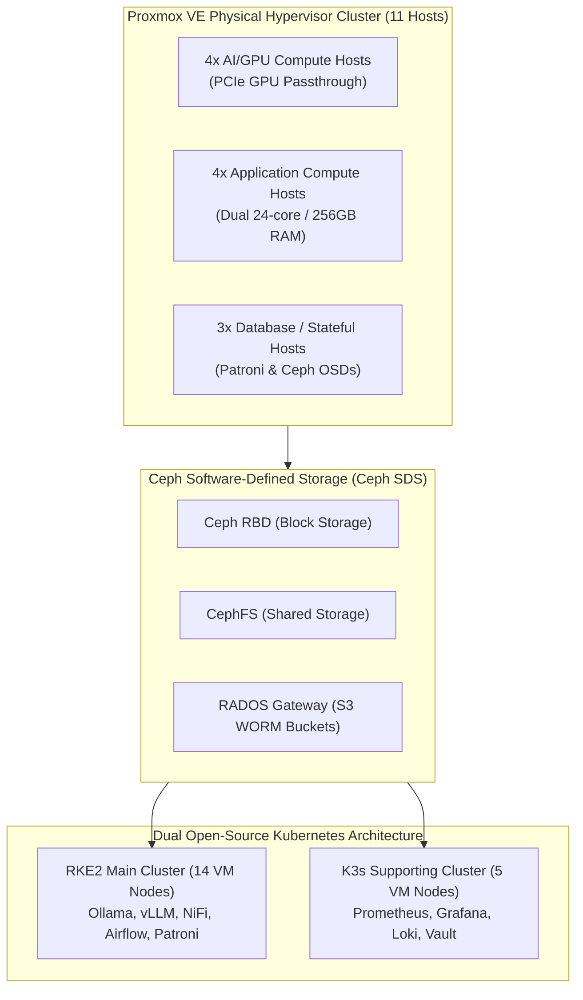

# Solution 3 Reference Spec: 100% On-Premises Sovereign Architecture (Proxmox VE + RKE2 + Ceph SDS)

This reference specification details **Solution 3: Everything On-Premises using Proxmox VE + RKE2 + Distributed Ceph Storage** for modernizing the Big Data Analytics (BDA) platform. Solution 3 provides complete operational sovereignty, hardware-level control, and zero vendor lock-in by executing 100% of the platform on-premises.

---

## Technical Executive Summary

Solution 3 hosts the entire software-defined data lakehouse, Kubernetes orchestration, relational serving layer, AI inferencing stack, and presentation web applications on a physical enterprise hypervisor cluster managed by **Proxmox Virtual Environment (VE)**, **Rancher Kubernetes Engine 2 (RKE2)**, **K3s**, and **Ceph Software-Defined Storage (SDS)**.

## 🏛️ Sovereign On-Premises Hypervisor & Kubernetes Topology

The diagram below details Solution 3's 100% sovereign architecture, illustrating the PVE hardware layer, Ceph SDS, and dual RKE2/K3s Kubernetes clusters.

### 1. Standalone Production-Ready SVG Vector Graphic (`.svg`)

<svg xmlns="http://www.w3.org/2000/svg" viewBox="0 0 960 440" width="100%" height="100%">
  <defs>
    <marker id="arrow-pve" viewBox="0 0 10 10" refX="6" refY="5" markerWidth="6" markerHeight="6" orient="auto-start-reverse">
      <path d="M 0 0 L 10 5 L 0 10 z" fill="#64748B" />
    </marker>
    <filter id="shadow-pve" x="-4%" y="-4%" width="108%" height="108%">
      <feDropShadow dx="0" dy="2" stdDeviation="3" flood-color="#000000" flood-opacity="0.25"/>
    </filter>
  </defs>

  <!-- Background -->
  <rect width="960" height="440" fill="#0F172A" rx="10"/>

  <!-- Proxmox VE Hardware Layer -->
  <rect x="20" y="20" width="920" height="110" fill="#1E293B" stroke="#334155" stroke-width="1.5" rx="8" filter="url(#shadow-pve)"/>
  <rect x="20" y="20" width="920" height="26" fill="#0F172A" rx="8"/>
  <text x="35" y="38" font-family="-apple-system, BlinkMacSystemFont, 'Segoe UI', Roboto, sans-serif" font-size="12" font-weight="bold" fill="#F59E0B">PROXMOX VE PHYSICAL HYPERVISOR CLUSTER (11 HARDWARE HOSTS)</text>

  <rect x="40" y="55" width="270" height="60" fill="#0F172A" stroke="#F59E0B" rx="6"/>
  <text x="50" y="75" font-family="-apple-system, BlinkMacSystemFont, 'Segoe UI', Roboto, sans-serif" font-size="12" font-weight="bold" fill="#FDE68A">4x AI / GPU Hosts</text>
  <text x="50" y="95" font-family="Consolas, Monaco, monospace" font-size="10" fill="#FBBF24">2x H100/A100 PCIe Passthrough</text>

  <rect x="345" y="55" width="270" height="60" fill="#0F172A" stroke="#F59E0B" rx="6"/>
  <text x="355" y="75" font-family="-apple-system, BlinkMacSystemFont, 'Segoe UI', Roboto, sans-serif" font-size="12" font-weight="bold" fill="#FDE68A">4x Application Hosts</text>
  <text x="355" y="95" font-family="Consolas, Monaco, monospace" font-size="10" fill="#FBBF24">Dual 24-core CPUs / 256GB RAM</text>

  <rect x="650" y="55" width="270" height="60" fill="#0F172A" stroke="#F59E0B" rx="6"/>
  <text x="660" y="75" font-family="-apple-system, BlinkMacSystemFont, 'Segoe UI', Roboto, sans-serif" font-size="12" font-weight="bold" fill="#FDE68A">3x Database / State Hosts</text>
  <text x="660" y="95" font-family="Consolas, Monaco, monospace" font-size="10" fill="#FBBF24">Patroni Postgres &amp; Ceph OSDs</text>

  <!-- Distributed Storage Tier -->
  <rect x="20" y="150" width="920" height="70" fill="#1E293B" stroke="#334155" stroke-width="1.5" rx="8" filter="url(#shadow-pve)"/>
  <rect x="20" y="150" width="920" height="26" fill="#0F172A" rx="8"/>
  <text x="35" y="168" font-family="-apple-system, BlinkMacSystemFont, 'Segoe UI', Roboto, sans-serif" font-size="12" font-weight="bold" fill="#38BDF8">CEPH SOFTWARE-DEFINED STORAGE (CEPH SDS)</text>

  <rect x="40" y="182" width="270" height="30" fill="#0369A1" stroke="#38BDF8" rx="4"/>
  <text x="50" y="201" font-family="-apple-system, BlinkMacSystemFont, 'Segoe UI', Roboto, sans-serif" font-size="11" font-weight="bold" fill="#E0F2FE">Ceph RBD (Block Storage)</text>

  <rect x="345" y="182" width="270" height="30" fill="#0369A1" stroke="#38BDF8" rx="4"/>
  <text x="355" y="201" font-family="-apple-system, BlinkMacSystemFont, 'Segoe UI', Roboto, sans-serif" font-size="11" font-weight="bold" fill="#E0F2FE">CephFS (Shared Filesystem)</text>

  <rect x="650" y="182" width="270" height="30" fill="#0369A1" stroke="#38BDF8" rx="4"/>
  <text x="660" y="201" font-family="-apple-system, BlinkMacSystemFont, 'Segoe UI', Roboto, sans-serif" font-size="11" font-weight="bold" fill="#E0F2FE">RADOS GW (S3 WORM Buckets)</text>

  <!-- Kubernetes Clusters Tier -->
  <rect x="20" y="240" width="920" height="180" fill="#1E293B" stroke="#334155" stroke-width="1.5" rx="8" filter="url(#shadow-pve)"/>
  <rect x="20" y="240" width="920" height="26" fill="#0F172A" rx="8"/>
  <text x="35" y="258" font-family="-apple-system, BlinkMacSystemFont, 'Segoe UI', Roboto, sans-serif" font-size="12" font-weight="bold" fill="#4ADE80">DUAL KUBERNETES CLUSTER ARCHITECTURE (RKE2 + K3S)</text>

  <rect x="40" y="275" width="430" height="130" fill="#0F172A" stroke="#22C55E" rx="6"/>
  <text x="50" y="297" font-family="-apple-system, BlinkMacSystemFont, 'Segoe UI', Roboto, sans-serif" font-size="13" font-weight="bold" fill="#86EFAC">RKE2 Main Production Cluster (14 VM Nodes)</text>
  <text x="50" y="317" font-family="Consolas, Monaco, monospace" font-size="10" fill="#4ADE80">rke2 v1.30.x / FIPS / Canal / Cilium</text>
  <text x="50" y="337" font-family="-apple-system, BlinkMacSystemFont, 'Segoe UI', Roboto, sans-serif" font-size="11" fill="#E2E8F0">• 3x Control Plane | 4x AI GPU | 4x App | 3x DB</text>
  <text x="50" y="355" font-family="-apple-system, BlinkMacSystemFont, 'Segoe UI', Roboto, sans-serif" font-size="11" fill="#E2E8F0">• NiFi, Airflow, Superset, Trino, vLLM, Patroni</text>

  <rect x="490" y="275" width="430" height="130" fill="#0F172A" stroke="#22C55E" rx="6"/>
  <text x="500" y="297" font-family="-apple-system, BlinkMacSystemFont, 'Segoe UI', Roboto, sans-serif" font-size="13" font-weight="bold" fill="#86EFAC">K3s Supporting Services Cluster (5 VM Nodes)</text>
  <text x="500" y="317" font-family="Consolas, Monaco, monospace" font-size="10" fill="#4ADE80">k3s v1.30.x / Management &amp; Observability</text>
  <text x="500" y="337" font-family="-apple-system, BlinkMacSystemFont, 'Segoe UI', Roboto, sans-serif" font-size="11" fill="#E2E8F0">• 3x Control Plane | 2x Worker Agent Nodes</text>
  <text x="500" y="355" font-family="-apple-system, BlinkMacSystemFont, 'Segoe UI', Roboto, sans-serif" font-size="11" fill="#E2E8F0">• Prometheus, Grafana, Loki, Vault, CI/CD</text>

  <!-- Connectors -->
  <line x1="175" y1="115" x2="175" y2="150" stroke="#64748B" stroke-width="1.5" marker-end="url(#arrow-pve)"/>
  <line x1="480" y1="115" x2="480" y2="150" stroke="#64748B" stroke-width="1.5" marker-end="url(#arrow-pve)"/>
  <line x1="785" y1="115" x2="785" y2="150" stroke="#64748B" stroke-width="1.5" marker-end="url(#arrow-pve)"/>

  <line x1="255" y1="212" x2="255" y2="275" stroke="#64748B" stroke-width="1.5" marker-end="url(#arrow-pve)"/>
  <line x1="705" y1="212" x2="705" y2="275" stroke="#64748B" stroke-width="1.5" marker-end="url(#arrow-pve)"/>
</svg>

### 2. Git-Native Mermaid Topology (`.mmd`)

### 3. Summary Interface & Routing Table

| Source Component | Target Component | Port / Protocol / API Ingress | Security Boundary / Access Key | Operational Significance / Flow Description |
| :--- | :--- | :--- | :--- | :--- |
| **PVE Hypervisor** | **Ceph Storage Cluster** | Dual 100GbE / Ceph Protocol | Internal Storage VLAN | Provides block, filesystem, and S3 Object Lock storage across physical hosts. |
| **RKE2 Worker Node** | **Ceph RADOS Gateway** | `TCP 8080` / S3 API (mTLS) | S3 Access & Secret Keys | Serves Iceberg table snapshots under software-enforced WORM compliance lock. |
| **K3s Worker Node** | **RKE2 Production API** | `TCP 6443` / Kubernetes API | ServiceAccount Bearer Token | Collects OTLP metrics, logs, and traces from RKE2 application workloads. |

---

## 1. Hypervisor & Compute Infrastructure (Proxmox VE)

### Physical Host Topology & Hardware Specifications
High-density enterprise hypervisor cluster comprising **11 physical Proxmox VE hosts** linked with a dual 100GbE data plane and 10GbE out-of-band management network:
* **4x AI/GPU Compute Hosts:** Dual 32-core CPUs (AMD EPYC / Intel Xeon), 512GB RAM, 8TB NVMe storage, and 2x NVIDIA H100/A100/L40S GPUs per physical host.
* **4x Application Compute Hosts:** Dual 24-core CPUs, 256GB RAM, 4TB NVMe storage per physical host.
* **3x Database / Stateful Hosts:** Dual 24-core CPUs, 256GB RAM, 4TB NVMe storage per physical host.

### VM Sizing, Anti-Affinity & N+1 Headroom
* **Virtual Machines Provisioning:** The 14 virtualized RKE2 production nodes and 5 virtualized K3s management nodes execute as VMs distributed across the 11 physical PVE hosts.
* **VM Anti-Affinity Rules:** Strict Proxmox VE anti-affinity rules ensure that control-plane nodes and Patroni DB nodes never co-locate on the same physical host (preventing single points of failure).
* **N+1 Headroom & GPU Passthrough Failover Limits:**
  * Application and database VM tiers maintain a 15–20% CPU/RAM capacity headroom per physical host. Upon physical host hardware failure, Proxmox VE HA automatically restarts affected VMs on surviving physical hosts.
  * For virtualized worker VMs configured with PCIe GPU Passthrough, automatic VM failover is restricted to target physical hosts that possess matching unallocated physical GPUs and identical PCIe passthrough mapping configs. If no unallocated GPU capacity is available on surviving hosts, GPU-bound AI worker VMs remain offline until host replacement or manual reallocation.

---

## 2. Dual-Cluster Open-Source Kubernetes Architecture (RKE2 & K3s)

### Upstream Version Selection, Upgrade Cadence & Validation Policy
Kubernetes clusters in Solution 3 track upstream Kubernetes minor releases within a 12-month support window (~1 minor release version lag behind latest stable upstream):
* **Supported Version Policy:** Upgrades occur quarterly. Production deployments undergo a 30-day staging validation cycle before upgrading production control plane and worker nodes.

### Cluster A: Main Production Cluster (14 VM Nodes - RKE2)
* **Runtime Standard:** Built on Rancher Kubernetes Engine 2 (**RKE2 v1.30.x** series, e.g. `v1.30.4+rke2r1`). Deployed with **Canal CNI** (Flannel + Calico) when FIPS 140-2 compliance is required, or **Cilium CNI** for eBPF performance and advanced networking.
* **3x Control Plane / Server VM Nodes (`rke2-cp-01` to `03`):** High-Availability etcd quorum.
* **4x AI / GPU Worker VM Nodes (`rke2-worker-ai-01` to `04`):** Executes Ollama, vLLM, RAGFlow, and Spark/Sedona distributed spatial workloads.
* **4x Application Worker VM Nodes (`rke2-worker-app-01` to `04`):** Hosts Apache NiFi, Airflow, APISIX, Keycloak, Superset, Next.js, and Trino engines.
* **3x Database & Stateful Worker VM Nodes (`rke2-worker-db-01` to `03`):** Hosts PostgreSQL Patroni nodes and local Ceph OSD storage daemons.

### Cluster B: Supporting Services Cluster (5 VM Nodes - K3s)
* **Runtime Standard:** Built on lightweight **K3s v1.30.x** (`v1.30.4+k3s1`).
* **3x Control Plane VM Nodes (`k3s-mgmt-01` to `03`).**
* **2x Worker Agent VM Nodes (`k3s-worker-01` to `02`):** Hosting Prometheus, Grafana, Loki, HashiCorp Vault, and local CI/CD runners.

---

## 3. Distributed Software-Defined Storage (Ceph SDS) & Storage Matrix

### Storage Fabric Integration & Verified Immutability Scope
* **RADOS Gateway (S3 Object Storage):** Supplies S3-compatible APIs. Buckets configured with S3 Object Lock in **Compliance Mode** (Versioning enabled) provide software-enforced WORM storage for Tier 0 SSoT records under defined retention policies.
* **Verified Immutability Scope:** Software-enforced WORM immutability, Compliance Mode retention hold, legal hold, and protection against unauthorized overwrite or premature deletion have been verified equivalent across AWS S3, Ceph RADOS Gateway (RGW), and MinIO Enterprise Object Store.

### Storage Provisioning Drivers Matrix

| Storage Provisioner | Access Mode | Resiliency & HA Profile | Target Workloads | OS Dependencies | Performance Profile |
| :--- | :--- | :--- | :--- | :--- | :--- |
| **Ceph CSI (RBD)** | `ReadWriteOnce` (RWO) | Multi-node OSD replication, dynamic failover. | PostgreSQL / Patroni, Vector DBs, Stateful Apps. | `ceph-common`, `rbd` kernel module | High IOPS, Low Latency, Distributed HA. |
| **Ceph CSI (CephFS)** | `ReadWriteMany` (RWX) | Multi-MDS HA filesystem, distributed replication. | Shared media streams, raw file attachments. | `ceph-common` | Medium-High IOPS, Shared Filesystem. |
| **NFS External** | `ReadWriteMany` (RWX) | Single NFS server (SPOF unless hardware appliance). | Shared config files, static assets. | `nfs-common` / `nfs-utils` | Low-Medium IOPS, File Locking Bottleneck. |
| **Local Path Provisioner** | `ReadWriteOnce` (RWO) | Bound to single host disk (No node failover). | Kafka, Ephemeral Tier 2 AI Scratchpad. | None (Standard filesystem mount) | Maximum Raw NVMe IOPS, Sub-millisecond. |

---

## 4. Complete On-Premises Open-Source Software Stack

* **Object Store & Catalog:** Ceph RADOS Gateway / MinIO + Apache Polaris / Project Nessie REST Catalog on RKE2.
* **Compute & Processing:** Trino Distributed MPP Query Engine + Apache Spark & Sedona on RKE2.
* **Operational Database:** High-Availability PostgreSQL 17 managed by Patroni with etcd, `pg_backrest`, and PostGIS extension.
* **Ingestion & Orchestration:** Apache NiFi + Apache Airflow DAGs with Data Contract CLI and OpenLineage hooks.
* **Ingress, IAM & Governance:** Apache APISIX Gateway + Keycloak OIDC IAM + OpenMetadata catalog.
* **AI & Local Inference:** Local Ollama / vLLM + RAGFlow on GPU Nodes + Containerized MCP Servers.
* **Presentation Layer:** Next.js / React Web Application + Apache Superset with deck.gl spatial maps.

---

## Key Findings & External References

1. **RKE2 Scope of FIPS 140-2 Enablement:** RKE2 daemons, container runtime binaries (`containerd`), etcd, bundled Canal CNI, and bundled NGINX ingress are statically compiled with the FIPS-validated GoBoring compiler module. Additional workloads deployed on RKE2 (such as Apache APISIX) execute as standard container images and require separate validation if FIPS compliance is mandated for those application layer containers. See [RKE2 Documentation: FIPS 140-2 Enablement](https://docs.rke2.io/security/fips_support).
2. **Ceph RADOS Gateway S3 WORM Parquet Storage:** Ceph RGW provides full S3 Object Lock API compatibility, allowing Apache Iceberg snapshot retention and Parquet file immutability to be enforced on-premises without cloud vendor dependencies.
3. **Proxmox VE HA & Kubernetes Control Plane Resiliency:** Proxmox VE HA Manager provides infrastructure-level VM crash detection and automated hypervisor host migration. Application-level high availability and consensus quorum for RKE2 control planes and Patroni PostgreSQL database clusters are maintained independently at the Kubernetes etcd layer and Patroni DCS layer across separate VM nodes.
