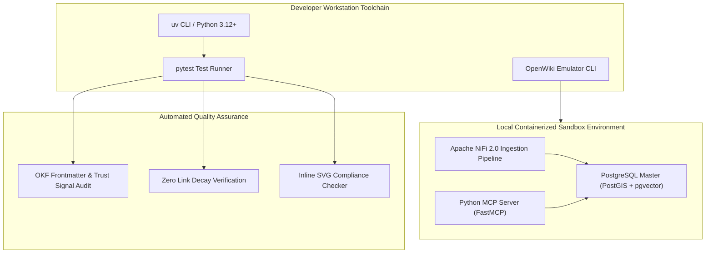

# BDA Lakehouse Onboarding and Developer Setup

Welcome to the Modernized Big Data Analytics (BDA) platform documentation suite.

---

## 🏛️ Developer Environment & Local Sandbox Topology

The diagram below details the local sandbox setup and developer environment tooling for testing BDA lakehouse pipelines.

### 1. Standalone Production-Ready SVG Vector Graphic (`.svg`)

<svg xmlns="http://www.w3.org/2000/svg" viewBox="0 0 960 400" width="100%" height="100%">
  <defs>
    <marker id="arrow-dev" viewBox="0 0 10 10" refX="6" refY="5" markerWidth="6" markerHeight="6" orient="auto-start-reverse">
      <path d="M 0 0 L 10 5 L 0 10 z" fill="#64748B" />
    </marker>
    <filter id="shadow-dev" x="-4%" y="-4%" width="108%" height="108%">
      <feDropShadow dx="0" dy="2" stdDeviation="3" flood-color="#000000" flood-opacity="0.25"/>
    </filter>
  </defs>

  <!-- Background -->
  <rect width="960" height="400" fill="#0F172A" rx="10"/>

  <!-- Developer Workstation Tier -->
  <rect x="20" y="20" width="920" height="80" fill="#1E293B" stroke="#334155" stroke-width="1.5" rx="8" filter="url(#shadow-dev)"/>
  <rect x="20" y="20" width="920" height="26" fill="#0F172A" rx="8"/>
  <text x="35" y="38" font-family="-apple-system, BlinkMacSystemFont, 'Segoe UI', Roboto, sans-serif" font-size="12" font-weight="bold" fill="#60A5FA">DEVELOPER WORKSTATION &amp; TOOLCHAIN (UV RUN / PYTEST)</text>

  <rect x="40" y="52" width="270" height="38" fill="#1E3A8A" stroke="#3B82F6" rx="4"/>
  <text x="50" y="75" font-family="-apple-system, BlinkMacSystemFont, 'Segoe UI', Roboto, sans-serif" font-size="12" font-weight="bold" fill="#93C5FD">Python Toolchain (uv / pytest / ruff)</text>

  <rect x="345" y="52" width="270" height="38" fill="#065F46" stroke="#22C55E" rx="4"/>
  <text x="355" y="75" font-family="-apple-system, BlinkMacSystemFont, 'Segoe UI', Roboto, sans-serif" font-size="12" font-weight="bold" fill="#86EFAC">OpenWiki Emulator &amp; Doc Generator</text>

  <rect x="650" y="52" width="270" height="38" fill="#581C87" stroke="#A855F7" rx="4"/>
  <text x="660" y="75" font-family="-apple-system, BlinkMacSystemFont, 'Segoe UI', Roboto, sans-serif" font-size="12" font-weight="bold" fill="#E9D5FF">Bitol ODCS Data Contract CLI</text>

  <!-- Containerized Local Sandbox Tier -->
  <rect x="20" y="135" width="920" height="130" fill="#1E293B" stroke="#334155" stroke-width="1.5" rx="8" filter="url(#shadow-dev)"/>
  <rect x="20" y="135" width="920" height="26" fill="#0F172A" rx="8"/>
  <text x="35" y="153" font-family="-apple-system, BlinkMacSystemFont, 'Segoe UI', Roboto, sans-serif" font-size="12" font-weight="bold" fill="#4ADE80">CONTAINERIZED LOCAL SANDBOX (PODMAN / DOCKER COMPOSE)</text>

  <rect x="40" y="170" width="270" height="80" fill="#0F172A" stroke="#22C55E" rx="6"/>
  <text x="50" y="192" font-family="-apple-system, BlinkMacSystemFont, 'Segoe UI', Roboto, sans-serif" font-size="13" font-weight="bold" fill="#86EFAC">PostgreSQL Master Core</text>
  <text x="50" y="212" font-family="Consolas, Monaco, monospace" font-size="10" fill="#4ADE80">PostGIS + pgvector + pgTDE</text>
  <text x="50" y="230" font-family="-apple-system, BlinkMacSystemFont, 'Segoe UI', Roboto, sans-serif" font-size="11" fill="#E2E8F0">• Port 5432 / Local Vector Store</text>

  <rect x="345" y="170" width="270" height="80" fill="#0F172A" stroke="#22C55E" rx="6"/>
  <text x="355" y="192" font-family="-apple-system, BlinkMacSystemFont, 'Segoe UI', Roboto, sans-serif" font-size="13" font-weight="bold" fill="#86EFAC">Apache NiFi 2.0 Ingestion</text>
  <text x="355" y="212" font-family="Consolas, Monaco, monospace" font-size="10" fill="#4ADE80">Port 8443 / Native Python Processors</text>
  <text x="355" y="230" font-family="-apple-system, BlinkMacSystemFont, 'Segoe UI', Roboto, sans-serif" font-size="11" fill="#E2E8F0">• Flow Queues &amp; Data Contracts</text>

  <rect x="650" y="170" width="270" height="80" fill="#0F172A" stroke="#22C55E" rx="6"/>
  <text x="660" y="192" font-family="-apple-system, BlinkMacSystemFont, 'Segoe UI', Roboto, sans-serif" font-size="13" font-weight="bold" fill="#86EFAC">Python MCP Server</text>
  <text x="660" y="212" font-family="Consolas, Monaco, monospace" font-size="10" fill="#4ADE80">FastMCP / JSON-RPC 2.0</text>
  <text x="660" y="230" font-family="-apple-system, BlinkMacSystemFont, 'Segoe UI', Roboto, sans-serif" font-size="11" fill="#E2E8F0">• Local RAG &amp; Spatial Retrieval</text>

  <!-- Quality Assurance Tier -->
  <rect x="20" y="295" width="920" height="80" fill="#1E293B" stroke="#334155" stroke-width="1.5" rx="8" filter="url(#shadow-dev)"/>
  <rect x="20" y="295" width="920" height="26" fill="#0F172A" rx="8"/>
  <text x="35" y="313" font-family="-apple-system, BlinkMacSystemFont, 'Segoe UI', Roboto, sans-serif" font-size="12" font-weight="bold" fill="#FBBF24">AUTOMATED CI/CD VERIFICATION &amp; TRUST SIGNAL AUDIT</text>

  <rect x="40" y="328" width="880" height="38" fill="#0F172A" stroke="#F59E0B" rx="6"/>
  <text x="50" y="352" font-family="-apple-system, BlinkMacSystemFont, 'Segoe UI', Roboto, sans-serif" font-size="12" font-weight="bold" fill="#FDE68A">pytest (OKF Frontmatter Validation, Trust Signals, Link Decay &amp; Inline SVG Checkers)</text>

  <!-- Connectors -->
  <line x1="175" y1="90" x2="175" y2="170" stroke="#64748B" stroke-width="1.5" marker-end="url(#arrow-dev)"/>
  <line x1="480" y1="90" x2="480" y2="170" stroke="#64748B" stroke-width="1.5" marker-end="url(#arrow-dev)"/>
  <line x1="785" y1="90" x2="785" y2="170" stroke="#64748B" stroke-width="1.5" marker-end="url(#arrow-dev)"/>

  <line x1="175" y1="250" x2="480" y2="328" stroke="#64748B" stroke-width="1.5" marker-end="url(#arrow-dev)"/>
  <line x1="480" y1="250" x2="480" y2="328" stroke="#64748B" stroke-width="1.5" marker-end="url(#arrow-dev)"/>
  <line x1="785" y1="250" x2="480" y2="328" stroke="#64748B" stroke-width="1.5" marker-end="url(#arrow-dev)"/>
</svg>

### 2. Git-Native Mermaid Topology (`.mmd`)



### 3. Summary Interface & Routing Table

| Source Component | Target Component | Port / Protocol / API Ingress | Security Boundary / Access Key | Operational Significance / Flow Description |
| :--- | :--- | :--- | :--- | :--- |
| **Developer Terminal** | **uv run pytest** | Local Subprocess Execution | Non-Root User | Runs 230+ automated tests verifying OKF frontmatter, trust signals, and link integrity. |
| **NiFi Ingestion** | **PostgreSQL Master** | `TCP 5432` / TLS 1.3 PostgreSQL | Local DB Credentials | Tests native Python processors and vector transformation pipelines locally. |
| **FastMCP Server** | **PostgreSQL Master** | Stdio / `TCP 8080` (JSON-RPC 2.0) | Read-Only Session / Local Key | Executes spatial-semantic search tools against local `pgvector` index. |


This tutorial guides new engineers, data stewards, and system administrators through setting up their environment and navigating the platform architecture documentation.

---

## Learning Objectives

By completing this onboarding guide, you will:

1. Understand the core architectural principles of the modernized 100% open-source BDA lakehouse.
2. Know where to find technical reference materials, conceptual explanations, and operational how-to guides using the **Diátaxis documentation compass**.
3. Learn how data contracts (ODCS v3.1.0) and OpenLineage metadata tracking safeguard Tier 0 Golden Human Truth.

---

## Step 1: Navigating the Documentation Suite (Diátaxis Compass)

The BDA documentation is structured according to the **Diátaxis documentation framework**, separating content along two axes: **Learning vs. Working** and **Practical vs. Theoretical**:

- **Tutorials (`docs/tutorials/`):** Practical, learning-oriented lessons for onboarding (this document).
- **How-To Guides (`docs/how-to-guides/`):** Step-by-step directions for completing real-world engineering tasks (e.g. pipeline modernization, phased migration).
- **Reference (`docs/reference/`):** Factual, authoritative specifications (e.g. legacy deconstruction, lakehouse architecture specs, business domain modules, governance matrix).
- **Explanation (`docs/explanation/`):** Conceptual frameworks and design rationale (e.g. Human-to-AI Quarantine Model, MCP sandboxing, governance compliance).

---

## Step 2: Understanding the Target Stack in 5 Minutes

Read through the primary reference and explanation documents to familiarize yourself with the target stack:

1. **Storage & Table Format:** Decoupled storage built on **Ceph / MinIO Enterprise Object Store** with S3 Object Lock in **Compliance Mode** (WORM), governed by **Apache Iceberg** table formats and managed via the **Apache Polaris** catalog.
2. **Compute Engines:** **Trino** for massively parallel SQL analytics, and **Apache Spark + Apache Sedona** for distributed geospatial transformations.
3. **Data Provenance & Quality:** Machine-readable data contracts under **ODCS v3.1.0** enforced at ingestion gates via the **Data Contract CLI**, with runtime lineage tracked via **OpenLineage** (`nres_provenance` facet) into **OpenMetadata**.
4. **AI Containment:** **Model Context Protocol (MCP)** servers restricted to read-only database connections and isolated Tier 2 scratch storage. Zero automated AI write access permitted to Tier 0 Golden Human SSoT.
5. **Presentation & Security:** Containerized **Next.js** web portals secured by **Apache APISIX** and **Keycloak IAM**, with **Apache Superset** replacing proprietary BI servers for `deck.gl` geospatial analytics.

---

## Step 3: Verifying Local Project Setup

If you are inspecting or contributing to the codebase repository:

1. Clone the repository and navigate into the root directory:

   ```bash
   git clone <repo-url>
   cd <repo-folder>
   ```

2. Verify the documentation files under `docs/`:

   ```bash
   ls -la docs/reference/ docs/explanation/ docs/how-to-guides/ docs/tutorials/
   ```

3. Read `docs/README.md` for full cross-referencing and index navigation.
