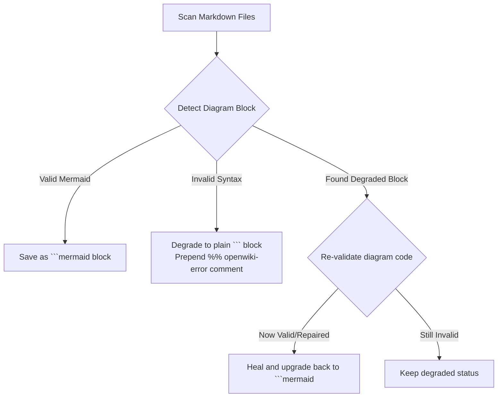

<!-- OPENWIKI:GENERATED BY DSOM PYTHON EMULATOR -->

# OpenWiki Native Python Emulator Instructions

Welcome to the operational guide for the **OpenWiki Native Python Emulator** in `bda-ai-infra`.

---

## 🏛️ Architectural Purpose

The OpenWiki Native Python Emulator (`tools/openwiki_emulator.py`) satisfies **Sovereign AI Rule 27**.
It replaces heavy Node.js dependencies with a zero-dependency Python CLI utility.

This ensures:
1. **Digital Sovereignty:** Builds and audits run entirely offline.
2. **Single Source of Truth (SSoT):** Maps relationships between all 100% Open Source Software components.
3. **Execution Safety:** Runs safely across Linux, macOS, and Windows via `uv run`.

---

## ⚙️ Operational Commands & Usage

### 1. Initialize & Materialize the Wiki
```bash
uv run --with pyyaml python tools/openwiki_emulator.py --init
```

### 2. Fast OKF Metadata Search
```bash
uv run --with pyyaml python tools/openwiki_emulator.py --search "trino"
```

### 3. Compile Recent Git Status
```bash
uv run --with pyyaml python tools/openwiki_emulator.py --update
```

### 4. Export Standalone Graph Visualizer
```bash
uv run --with pyyaml python tools/openwiki_emulator.py --export-graph
```

---

## 🧜‍♀️ Mermaid Diagram Validation & Self-Healing

The emulator incorporates a zero-dependency Mermaid diagram compiler with self-healing capabilities.

### Dual-Render Architecture Specification: Mermaid Validation & Self-Healing Pipeline

#### 1. Standalone Production-Ready SVG Vector Graphic (`.svg`)

```xml
<svg xmlns="http://www.w3.org/2000/svg" viewBox="0 0 800 350" width="100%" height="100%">
  <defs>
    <marker id="arrow-inst" viewBox="0 0 10 10" refX="6" refY="5" markerWidth="6" markerHeight="6" orient="auto-start-reverse">
      <path d="M 0 0 L 10 5 L 0 10 z" fill="#475569" />
    </marker>
  </defs>

  <rect width="800" height="350" fill="#F8FAFC" rx="10"/>

  <rect x="20" y="20" width="210" height="90" fill="#FFFFFF" stroke="#CBD5E1" stroke-width="1.5" rx="8"/>
  <text x="35" y="45" font-family="-apple-system, BlinkMacSystemFont, 'Segoe UI', Roboto, sans-serif" font-size="13" font-weight="bold" fill="#0F172A">Scan Markdown</text>
  <text x="35" y="65" font-family="Consolas, Monaco, monospace" font-size="10" fill="#2563EB">openwiki/**/*.md</text>

  <rect x="280" y="20" width="220" height="90" fill="#FFFFFF" stroke="#CBD5E1" stroke-width="1.5" rx="8"/>
  <text x="295" y="45" font-family="-apple-system, BlinkMacSystemFont, 'Segoe UI', Roboto, sans-serif" font-size="13" font-weight="bold" fill="#0F172A">Detect Diagram</text>
  <text x="295" y="65" font-family="Consolas, Monaco, monospace" font-size="10" fill="#059669">Parser Gate</text>

  <rect x="550" y="20" width="220" height="90" fill="#FFFFFF" stroke="#CBD5E1" stroke-width="1.5" rx="8"/>
  <text x="565" y="45" font-family="-apple-system, BlinkMacSystemFont, 'Segoe UI', Roboto, sans-serif" font-size="13" font-weight="bold" fill="#0F172A">Save Valid Mermaid</text>
  <text x="565" y="65" font-family="Consolas, Monaco, monospace" font-size="10" fill="#166534">```mermaid Fence</text>

  <rect x="280" y="200" width="220" height="90" fill="#FFFFFF" stroke="#CBD5E1" stroke-width="1.5" rx="8"/>
  <text x="295" y="225" font-family="-apple-system, BlinkMacSystemFont, 'Segoe UI', Roboto, sans-serif" font-size="13" font-weight="bold" fill="#0F172A">Self-Healing Recheck</text>
  <text x="295" y="245" font-family="Consolas, Monaco, monospace" font-size="10" fill="#D97706">Validate Syntax</text>

  <line x1="230" y1="65" x2="280" y2="65" stroke="#475569" stroke-width="1.5" marker-end="url(#arrow-inst)"/>
  <line x1="500" y1="65" x2="550" y2="65" stroke="#475569" stroke-width="1.5" marker-end="url(#arrow-inst)"/>
  <line x1="390" y1="110" x2="390" y2="200" stroke="#475569" stroke-width="1.5" marker-end="url(#arrow-inst)"/>
</svg>
```

#### 2. Git-Native Mermaid Diagram (`.mmd`)



#### 3. Summary Interface & Routing Table

| Source Component | Target Component | Port / Protocol / API Ingress | Security Boundary / Trust Zone / Access Key | Operational Significance / Flow Description |
| :--- | :--- | :--- | :--- | :--- |
| **Markdown Scanner** | **Diagram Parser Gate** | In-Process File I/O | Local Build Sandbox | Parses markdown files for embedded diagram code fences. |
| **Diagram Parser Gate** | **Mermaid Validator** | In-Process String Parsing | Local Build Sandbox | Validates syntax; degrades invalid diagrams safely without breaking build. |
| **Mermaid Validator** | **Self-Healing Engine** | In-Process String Mutation | Local Build Sandbox | Automatically restores degraded diagrams to standard ```mermaid blocks once syntax errors are fixed. |

---

## 🤖 Standard Operating Rules for AI Agents

1. **No Manual Mod-Edit of Wiki Pages:** Edit `tools/openwiki_emulator.py` definitions instead.
2. **Run Before Committing:** Execute `python tools/openwiki_emulator.py --init` before finalizing commits.
