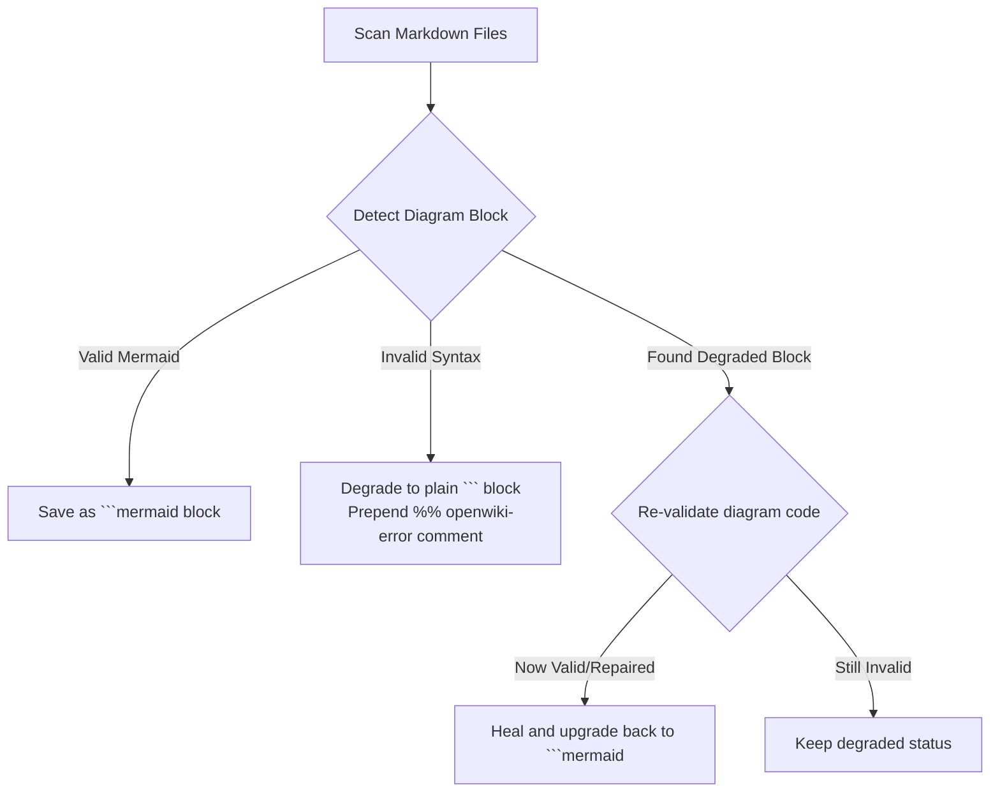

<!-- OPENWIKI:GENERATED BY DSOM PYTHON EMULATOR -->

# OpenWiki Native Python Emulator Instructions

Welcome to the operational guide for the **OpenWiki Native Python Emulator** in `bda-ai-infra`.

---

## 🏛️ Architectural Purpose

The OpenWiki Native Python Emulator (`tools/openwiki_emulator.py`) satisfies **Sovereign AI Rule 27**.
It replaces heavy Node.js dependencies with a zero-dependency Python CLI utility.

This ensures:
1. **Digital Sovereignty:** Builds and audits run entirely offline.
2. **Single Source of Truth (SSoT):** Maps relationships between all 100% Open Source Software components.
3. **Execution Safety:** Runs safely across Linux, macOS, and Windows via `uv run`.

---

## ⚙️ Operational Commands & Usage

### 1. Initialize & Materialize the Wiki
```bash
uv run --with pyyaml python tools/openwiki_emulator.py --init
```

### 2. Fast OKF Metadata Search
```bash
uv run --with pyyaml python tools/openwiki_emulator.py --search "trino"
```

### 3. Compile Recent Git Status
```bash
uv run --with pyyaml python tools/openwiki_emulator.py --update
```

### 4. Export Standalone Graph Visualizer
```bash
uv run --with pyyaml python tools/openwiki_emulator.py --export-graph
```

---

## 🧜‍♀️ Mermaid Diagram Validation & Self-Healing

The emulator incorporates a zero-dependency Mermaid diagram compiler with self-healing capabilities.



---

## 🤖 Standard Operating Rules for AI Agents

1. **No Manual Mod-Edit of Wiki Pages:** Edit `tools/openwiki_emulator.py` definitions instead.
2. **Run Before Committing:** Execute `python tools/openwiki_emulator.py --init` before finalizing commits.
