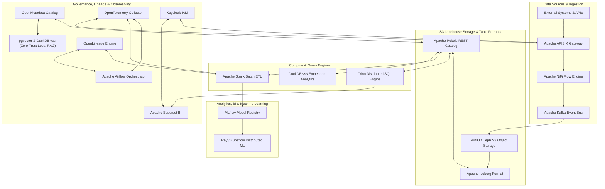

# BDA Lakehouse Architecture & 100% Open-Source Software Stack

The modern Big Data Analytics (BDA) Lakehouse platform establishes an authoritative Single Source of Truth (SSoT) built exclusively on **100% Open Source Software (OSS)**.

## 🧩 Open-Source Software Component Relationship Matrix

### Dual-Render Architecture Specification: Component Relationship Matrix

#### 1. Standalone Production-Ready SVG Vector Graphic (`.svg`)

<svg xmlns="http://www.w3.org/2000/svg" viewBox="0 0 1000 500" width="100%" height="100%">
  <defs>
    <marker id="arrow-ov" viewBox="0 0 10 10" refX="6" refY="5" markerWidth="6" markerHeight="6" orient="auto-start-reverse">
      <path d="M 0 0 L 10 5 L 0 10 z" fill="#64748B" />
    </marker>
  </defs>

  <rect width="1000" height="500" fill="#0F172A" rx="10"/>

  <rect x="20" y="20" width="170" height="460" fill="#1E293B" stroke="#334155" stroke-width="1.5" rx="8"/>
  <rect x="20" y="20" width="170" height="30" fill="#0F172A" rx="8"/>
  <text x="30" y="40" font-family="-apple-system, BlinkMacSystemFont, 'Segoe UI', Roboto, sans-serif" font-size="11" font-weight="bold" fill="#94A3B8">1. INGESTION</text>
  <rect x="30" y="60" width="150" height="60" fill="#0F172A" stroke="#334155" rx="6"/>
  <text x="40" y="80" font-family="-apple-system, BlinkMacSystemFont, 'Segoe UI', Roboto, sans-serif" font-size="11" font-weight="bold" fill="#F8FAFC">APISIX Gateway</text>
  <text x="40" y="98" font-family="Consolas, Monaco, monospace" font-size="9" fill="#60A5FA">Port 443 / OIDC</text>
  <rect x="30" y="140" width="150" height="60" fill="#0F172A" stroke="#334155" rx="6"/>
  <text x="40" y="160" font-family="-apple-system, BlinkMacSystemFont, 'Segoe UI', Roboto, sans-serif" font-size="11" font-weight="bold" fill="#F8FAFC">Apache NiFi</text>
  <rect x="30" y="220" width="150" height="60" fill="#0F172A" stroke="#334155" rx="6"/>
  <text x="40" y="240" font-family="-apple-system, BlinkMacSystemFont, 'Segoe UI', Roboto, sans-serif" font-size="11" font-weight="bold" fill="#F8FAFC">Apache Kafka</text>

  <rect x="210" y="20" width="180" height="460" fill="#1E293B" stroke="#334155" stroke-width="1.5" rx="8"/>
  <rect x="210" y="20" width="180" height="30" fill="#0F172A" rx="8"/>
  <text x="220" y="40" font-family="-apple-system, BlinkMacSystemFont, 'Segoe UI', Roboto, sans-serif" font-size="11" font-weight="bold" fill="#60A5FA">2. STORAGE &amp; CATALOG</text>
  <rect x="225" y="60" width="150" height="70" fill="#0F172A" stroke="#334155" rx="6"/>
  <text x="235" y="80" font-family="-apple-system, BlinkMacSystemFont, 'Segoe UI', Roboto, sans-serif" font-size="11" font-weight="bold" fill="#F8FAFC">Ceph / MinIO S3</text>
  <text x="235" y="98" font-family="Consolas, Monaco, monospace" font-size="9" fill="#94A3B8">Port 9000 / Parquet</text>
  <rect x="225" y="150" width="150" height="70" fill="#0F172A" stroke="#334155" rx="6"/>
  <text x="235" y="170" font-family="-apple-system, BlinkMacSystemFont, 'Segoe UI', Roboto, sans-serif" font-size="11" font-weight="bold" fill="#F8FAFC">Apache Iceberg</text>
  <rect x="225" y="240" width="150" height="70" fill="#0F172A" stroke="#22C55E" rx="6"/>
  <text x="235" y="260" font-family="-apple-system, BlinkMacSystemFont, 'Segoe UI', Roboto, sans-serif" font-size="11" font-weight="bold" fill="#86EFAC">Polaris REST Catalog</text>
  <text x="235" y="278" font-family="Consolas, Monaco, monospace" font-size="9" fill="#4ADE80">Port 8181 / REST</text>

  <rect x="410" y="20" width="180" height="460" fill="#1E293B" stroke="#334155" stroke-width="1.5" rx="8"/>
  <rect x="410" y="20" width="180" height="30" fill="#0F172A" rx="8"/>
  <text x="420" y="40" font-family="-apple-system, BlinkMacSystemFont, 'Segoe UI', Roboto, sans-serif" font-size="11" font-weight="bold" fill="#4ADE80">3. COMPUTE ENGINES</text>
  <rect x="425" y="60" width="150" height="60" fill="#0F172A" stroke="#334155" rx="6"/>
  <text x="435" y="80" font-family="-apple-system, BlinkMacSystemFont, 'Segoe UI', Roboto, sans-serif" font-size="11" font-weight="bold" fill="#F8FAFC">Trino SQL Engine</text>
  <rect x="425" y="140" width="150" height="60" fill="#0F172A" stroke="#334155" rx="6"/>
  <text x="435" y="160" font-family="-apple-system, BlinkMacSystemFont, 'Segoe UI', Roboto, sans-serif" font-size="11" font-weight="bold" fill="#F8FAFC">Apache Spark</text>
  <rect x="425" y="220" width="150" height="60" fill="#0F172A" stroke="#334155" rx="6"/>
  <text x="435" y="240" font-family="-apple-system, BlinkMacSystemFont, 'Segoe UI', Roboto, sans-serif" font-size="11" font-weight="bold" fill="#F8FAFC">DuckDB vss</text>

  <rect x="610" y="20" width="180" height="460" fill="#1E293B" stroke="#334155" stroke-width="1.5" rx="8"/>
  <rect x="610" y="20" width="180" height="30" fill="#0F172A" rx="8"/>
  <text x="620" y="40" font-family="-apple-system, BlinkMacSystemFont, 'Segoe UI', Roboto, sans-serif" font-size="11" font-weight="bold" fill="#94A3B8">4. GOVERNANCE</text>
  <rect x="625" y="60" width="150" height="60" fill="#0F172A" stroke="#334155" rx="6"/>
  <text x="635" y="80" font-family="-apple-system, BlinkMacSystemFont, 'Segoe UI', Roboto, sans-serif" font-size="11" font-weight="bold" fill="#F8FAFC">OpenMetadata</text>
  <rect x="625" y="140" width="150" height="60" fill="#0F172A" stroke="#334155" rx="6"/>
  <text x="635" y="160" font-family="-apple-system, BlinkMacSystemFont, 'Segoe UI', Roboto, sans-serif" font-size="11" font-weight="bold" fill="#F8FAFC">OpenLineage</text>
  <rect x="625" y="220" width="150" height="60" fill="#0F172A" stroke="#334155" rx="6"/>
  <text x="635" y="240" font-family="-apple-system, BlinkMacSystemFont, 'Segoe UI', Roboto, sans-serif" font-size="11" font-weight="bold" fill="#F8FAFC">OTel Collector</text>
  <rect x="625" y="300" width="150" height="60" fill="#0F172A" stroke="#334155" rx="6"/>
  <text x="635" y="320" font-family="-apple-system, BlinkMacSystemFont, 'Segoe UI', Roboto, sans-serif" font-size="11" font-weight="bold" fill="#F8FAFC">Keycloak IAM</text>

  <rect x="810" y="20" width="170" height="460" fill="#1E293B" stroke="#334155" stroke-width="1.5" rx="8"/>
  <rect x="810" y="20" width="170" height="30" fill="#0F172A" rx="8"/>
  <text x="820" y="40" font-family="-apple-system, BlinkMacSystemFont, 'Segoe UI', Roboto, sans-serif" font-size="11" font-weight="bold" fill="#FBBF24">5. ANALYTICS &amp; ML</text>
  <rect x="820" y="60" width="150" height="60" fill="#0F172A" stroke="#334155" rx="6"/>
  <text x="830" y="80" font-family="-apple-system, BlinkMacSystemFont, 'Segoe UI', Roboto, sans-serif" font-size="11" font-weight="bold" fill="#F8FAFC">Apache Superset</text>
  <rect x="820" y="140" width="150" height="60" fill="#0F172A" stroke="#334155" rx="6"/>
  <text x="830" y="160" font-family="-apple-system, BlinkMacSystemFont, 'Segoe UI', Roboto, sans-serif" font-size="11" font-weight="bold" fill="#F8FAFC">MLflow Registry</text>

  <line x1="180" y1="250" x2="225" y2="95" stroke="#64748B" stroke-width="1.5" marker-end="url(#arrow-ov)"/>
  <line x1="375" y1="275" x2="425" y2="90" stroke="#64748B" stroke-width="1.5" marker-end="url(#arrow-ov)"/>
  <line x1="575" y1="90" x2="820" y2="90" stroke="#64748B" stroke-width="1.5" marker-end="url(#arrow-ov)"/>
</svg>

#### 2. Git-Native Mermaid Diagram (`.mmd`)

#### 3. Summary Interface & Routing Table

| Source Component | Target Component | Port / Protocol / API Ingress | Security Boundary / Trust Zone / Access Key | Operational Significance / Flow Description |
| :--- | :--- | :--- | :--- | :--- |
| **Apache APISIX** | **Apache NiFi** | `TCP 8443` / HTTPS | Perimeter Gate -> Ingestion Boundary | Ingests external API payloads through APISIX gateway for NiFi flow distribution. |
| **Apache Polaris Catalog** | **Trino & Spark** | `TCP 8181` / REST | Catalog Tier -> Compute Engines | Manages Iceberg table namespace commits and vends short-lived S3 storage tokens. |
| **OpenMetadata Catalog** | **pgvector & DuckDB vss** | `TCP 5432` / TLS | Governance Tier -> Local Vector Store | Synchronizes dataset metadata and column descriptions into local zero-trust vector stores. |
| **Airflow / Spark / APISIX** | **OTel Collector** | `TCP 4317` gRPC / `4318` HTTP | Internal Operations Network | Streams OTLP traces to central OpenTelemetry collector. |
| **Airflow Workloads** | **OTel Collector** | `UDP 8125` / StatsD | Internal Operations Network | Transmits Airflow DAG execution metrics to OTel Collector StatsD receiver. |
| **Workload Log Files** | **OTel Collector** | Filelog Receiver / Local Log Mount | Internal Operations Network | Ingests Airflow, Spark, and APISIX container logs via filelog receiver. |
| **OTel Collector** | **Prometheus** | `TCP 9090` / Prometheus OTLP | Internal Operations Network | Exports aggregated time-series metrics to Prometheus backend. |
| **Prometheus** | **Apache APISIX** | `TCP 9091` / HTTP Scrape | Internal Operations Network | Initiates periodic Prometheus metrics scrape against APISIX gateway endpoint. |
| **OTel Collector** | **Grafana Tempo** | `TCP 4317` gRPC / `4318` HTTP | Internal Operations Network | Exports distributed W3C trace spans to Grafana Tempo storage backend. |
| **OTel Collector** | **Grafana Loki** | `TCP 3100` / HTTP Loki Push API | Internal Operations Network | Exports structured log streams to Grafana Loki log aggregation backend. |

## 🎯 Architecture Core Directives

1. **Zero Vendor Lock-In:** Pure open-source binaries with S3-standard object storage API abstractions.
2. **Data Sovereignty:** Full on-premises deployment capabilities (Proxmox VE + RKE2 + Ceph SDS).
3. **Decoupled Compute & Storage:** Independent scaling of compute workers (Trino/Spark) from physical storage (Ceph/MinIO).
4. **Contract-Driven Governance:** Mandatory ODCS v3.1.0 data contract enforcement at ingestion perimeter.
