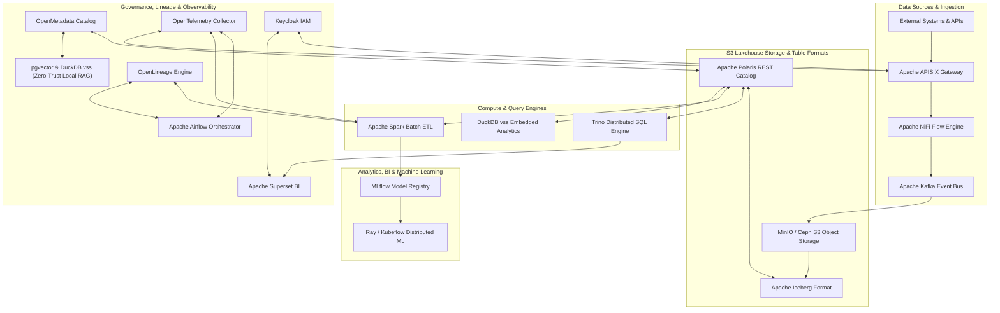

# BDA Lakehouse Architecture & 100% Open-Source Software Stack

The modern Big Data Analytics (BDA) Lakehouse platform establishes an authoritative Single Source of Truth (SSoT) built exclusively on **100% Open Source Software (OSS)**.

## 🧩 Open-Source Software Component Relationship Matrix

## 🎯 Architecture Core Directives

1. **Zero Vendor Lock-In:** Pure open-source binaries with S3-standard object storage API abstractions.
2. **Data Sovereignty:** Full on-premises deployment capabilities (Proxmox VE + RKE2 + Ceph SDS).
3. **Decoupled Compute & Storage:** Independent scaling of compute workers (Trino/Spark) from physical storage (Ceph/MinIO).
4. **Contract-Driven Governance:** Mandatory ODCS v3.1.0 data contract enforcement at ingestion perimeter.
