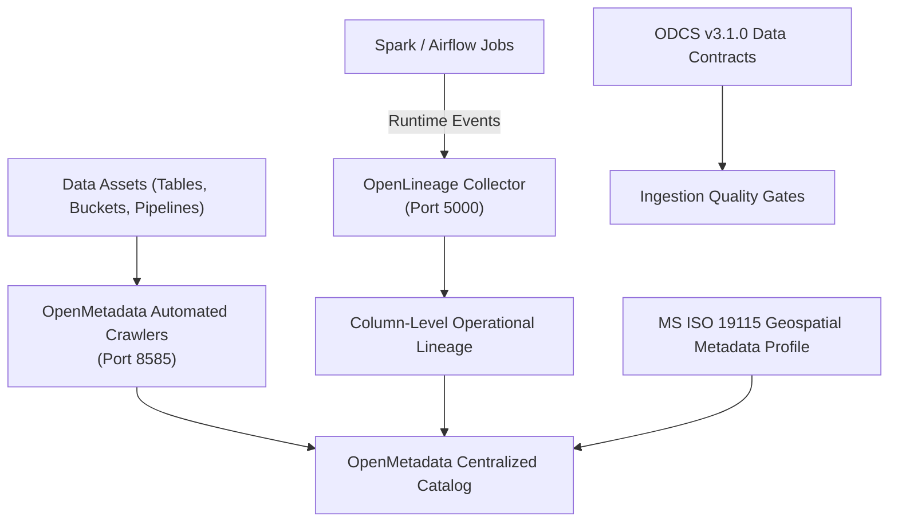

# Governance, Catalog & Lineage Matrix: OpenMetadata & OpenLineage

Data governance establishes automated metadata extraction, dataset discovery, and end-to-end operational lineage across the SSoT.

## 🏛️ Governance Subsystem Architecture

### Dual-Render Architecture Specification: Governance Subsystem Architecture

#### 1. Standalone Production-Ready SVG Vector Graphic (`.svg`)

```xml
<svg xmlns="http://www.w3.org/2000/svg" viewBox="0 0 900 380" width="100%" height="100%">
  <defs>
    <marker id="arrow-gov" viewBox="0 0 10 10" refX="6" refY="5" markerWidth="6" markerHeight="6" orient="auto-start-reverse">
      <path d="M 0 0 L 10 5 L 0 10 z" fill="#475569" />
    </marker>
  </defs>

  <rect width="900" height="380" fill="#F8FAFC" rx="10"/>

  <rect x="20" y="20" width="250" height="340" fill="#FFFFFF" stroke="#CBD5E1" stroke-width="1.5" rx="8"/>
  <rect x="20" y="20" width="250" height="30" fill="#EFF6FF" rx="8"/>
  <text x="30" y="40" font-family="-apple-system, BlinkMacSystemFont, 'Segoe UI', Roboto, sans-serif" font-size="12" font-weight="bold" fill="#1E40AF">DATA ASSETS &amp; PIPELINES</text>
  <rect x="35" y="80" width="220" height="60" fill="#F8FAFC" stroke="#E2E8F0" rx="6"/>
  <text x="45" y="102" font-family="-apple-system, BlinkMacSystemFont, 'Segoe UI', Roboto, sans-serif" font-size="12" font-weight="bold" fill="#0F172A">Data Assets</text>
  <text x="45" y="122" font-family="Consolas, Monaco, monospace" font-size="10" fill="#475569">Tables, Buckets, DAGs</text>
  <rect x="35" y="180" width="220" height="60" fill="#F8FAFC" stroke="#E2E8F0" rx="6"/>
  <text x="45" y="202" font-family="-apple-system, BlinkMacSystemFont, 'Segoe UI', Roboto, sans-serif" font-size="12" font-weight="bold" fill="#0F172A">Spark / Airflow Jobs</text>

  <rect x="310" y="20" width="280" height="340" fill="#FFFFFF" stroke="#CBD5E1" stroke-width="1.5" rx="8"/>
  <rect x="310" y="20" width="280" height="30" fill="#DCFCE7" rx="8"/>
  <text x="320" y="40" font-family="-apple-system, BlinkMacSystemFont, 'Segoe UI', Roboto, sans-serif" font-size="12" font-weight="bold" fill="#166534">CRAWLERS &amp; LINEAGE COLLECTORS</text>
  <rect x="325" y="80" width="250" height="60" fill="#F8FAFC" stroke="#E2E8F0" rx="6"/>
  <text x="335" y="102" font-family="-apple-system, BlinkMacSystemFont, 'Segoe UI', Roboto, sans-serif" font-size="12" font-weight="bold" fill="#0F172A">OpenMetadata Crawlers</text>
  <text x="335" y="122" font-family="Consolas, Monaco, monospace" font-size="10" fill="#2563EB">Port 8585 / REST API</text>
  <rect x="325" y="180" width="250" height="60" fill="#F8FAFC" stroke="#E2E8F0" rx="6"/>
  <text x="335" y="202" font-family="-apple-system, BlinkMacSystemFont, 'Segoe UI', Roboto, sans-serif" font-size="12" font-weight="bold" fill="#0F172A">OpenLineage Collector</text>
  <text x="335" y="222" font-family="Consolas, Monaco, monospace" font-size="10" fill="#2563EB">Port 5000 / OpenLineage API</text>

  <rect x="630" y="20" width="250" height="340" fill="#FFFFFF" stroke="#CBD5E1" stroke-width="1.5" rx="8"/>
  <rect x="630" y="20" width="250" height="30" fill="#FEF3C7" rx="8"/>
  <text x="640" y="40" font-family="-apple-system, BlinkMacSystemFont, 'Segoe UI', Roboto, sans-serif" font-size="12" font-weight="bold" fill="#92400E">CENTRAL CATALOG</text>
  <rect x="645" y="130" width="220" height="100" fill="#F8FAFC" stroke="#FDE68A" rx="6"/>
  <text x="655" y="155" font-family="-apple-system, BlinkMacSystemFont, 'Segoe UI', Roboto, sans-serif" font-size="13" font-weight="bold" fill="#0F172A">OpenMetadata Catalog</text>
  <text x="655" y="175" font-family="Consolas, Monaco, monospace" font-size="10" fill="#D97706">Port 8585 / REST API</text>
  <text x="655" y="195" font-family="-apple-system, BlinkMacSystemFont, 'Segoe UI', Roboto, sans-serif" font-size="10" fill="#475569">Column-Level Lineage &amp; ODCS</text>

  <line x1="255" y1="110" x2="325" y2="110" stroke="#475569" stroke-width="1.5" marker-end="url(#arrow-gov)"/>
  <line x1="255" y1="210" x2="325" y2="210" stroke="#475569" stroke-width="1.5" marker-end="url(#arrow-gov)"/>
  <line x1="575" y1="110" x2="645" y2="180" stroke="#475569" stroke-width="1.5" marker-end="url(#arrow-gov)"/>
  <line x1="575" y1="210" x2="645" y2="180" stroke="#475569" stroke-width="1.5" marker-end="url(#arrow-gov)"/>
</svg>
```

#### 2. Git-Native Mermaid Diagram (`.mmd`)



#### 3. Summary Interface & Routing Table

| Source Component | Target Component | Port / Protocol / API Ingress | Security Boundary / Trust Zone / Access Key | Operational Significance / Flow Description |
| :--- | :--- | :--- | :--- | :--- |
| **Data Assets** | **OpenMetadata Crawlers** | `TCP 8585` / REST API | SSoT Data Tier -> Catalog Zone | Crawls database schemas, Iceberg tables, and S3 buckets for metadata cataloging. |
| **Spark & Airflow** | **OpenLineage Collector** | `TCP 5000` / OpenLineage API | Pipeline Execution -> Governance Zone | Emits runtime lineage events capturing input/output dataset dependencies down to column level. |
| **ODCS Contracts** | **Ingestion Gates** | In-Memory Flow | Governance Zone -> Ingestion DMZ | Enforces schema validation and contract constraints on all incoming pipeline data. |

## 📋 Governance Specifications Matrix

| Dimension | Legacy Environment | Modern Open-Source Replacement | SSoT Enterprise Benefit |
| :--- | :--- | :--- | :--- |
| **Enterprise Data Catalog** | Unindexed dictionaries & static spreadsheets. | **OpenMetadata** (PostgreSQL & OpenSearch) | Centralized dataset discovery, automated column profiling, and owner tagging. |
| **Lineage & Provenance** | Untracked manual scripts. | **OpenLineage Standard** | Automated runtime lineage capturing inputs/outputs across Spark, Airflow, and Trino. |
| **Data Contracts** | Implicit or absent schema rules. | **Bitol ODCS v3.1.0** | Machine-readable JSON/YAML contract verification before writing to Lakehouse storage. |
| **Geospatial Standards** | Custom coordinate representations. | **MS ISO 19115:2003 / OGC** | EPSG coordinate reference system standardization (`EPSG:3168`, `EPSG:4326`). |
