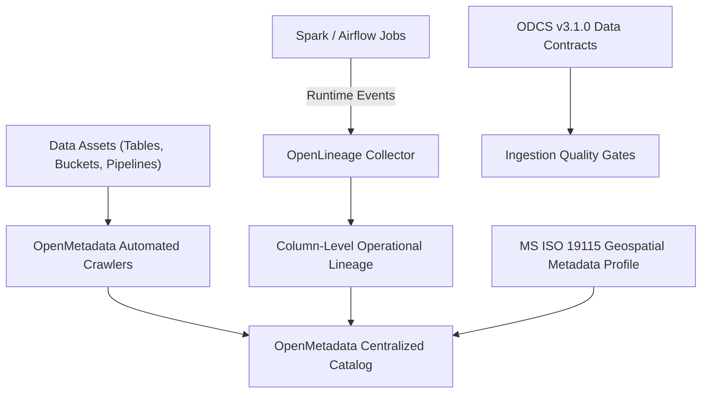

# Governance, Catalog & Lineage Matrix: OpenMetadata & OpenLineage

Data governance establishes automated metadata extraction, dataset discovery, and end-to-end operational lineage across the SSoT.

## 🏛️ Governance Subsystem Architecture

## 📋 Governance Specifications Matrix

| Dimension | Legacy Environment | Modern Open-Source Replacement | SSoT Enterprise Benefit |
| :--- | :--- | :--- | :--- |
| **Enterprise Data Catalog** | Unindexed dictionaries & static spreadsheets. | **OpenMetadata** (PostgreSQL & OpenSearch) | Centralized dataset discovery, automated column profiling, and owner tagging. |
| **Lineage & Provenance** | Untracked manual scripts. | **OpenLineage Standard** | Automated runtime lineage capturing inputs/outputs across Spark, Airflow, and Trino. |
| **Data Contracts** | Implicit or absent schema rules. | **Bitol ODCS v3.1.0** | Machine-readable JSON/YAML contract verification before writing to Lakehouse storage. |
| **Geospatial Standards** | Custom coordinate representations. | **MS ISO 19115:2003 / OGC** | EPSG coordinate reference system standardization (`EPSG:3168`, `EPSG:4326`). |
