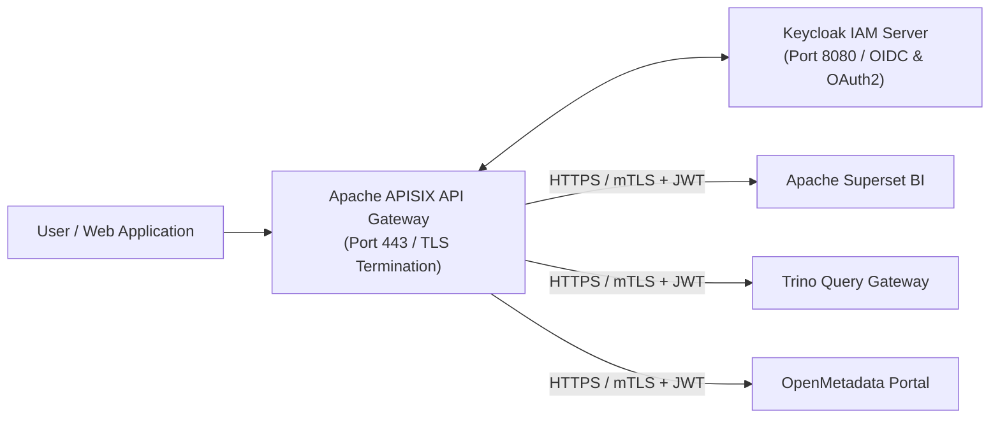

# Security, Identity & API Perimeter: Keycloak & Apache APISIX

Perimeter security and identity management guarantee zero-trust access control across all analytical portals and APIs.

## 🔐 Perimeter Security Architecture

### Dual-Render Architecture Specification: Perimeter Security Architecture

#### 1. Standalone Production-Ready SVG Vector Graphic (`.svg`)

```xml
<svg xmlns="http://www.w3.org/2000/svg" viewBox="0 0 950 360" width="100%" height="100%">
  <defs>
    <marker id="arrow-sec" viewBox="0 0 10 10" refX="6" refY="5" markerWidth="6" markerHeight="6" orient="auto-start-reverse">
      <path d="M 0 0 L 10 5 L 0 10 z" fill="#64748B" />
    </marker>
  </defs>

  <rect width="950" height="360" fill="#0F172A" rx="10"/>

  <rect x="20" y="20" width="180" height="320" fill="#1E293B" stroke="#334155" stroke-width="1.5" rx="8"/>
  <rect x="20" y="20" width="180" height="30" fill="#0F172A" rx="8"/>
  <text x="30" y="40" font-family="-apple-system, BlinkMacSystemFont, 'Segoe UI', Roboto, sans-serif" font-size="12" font-weight="bold" fill="#94A3B8">USER CLIENTS</text>
  <rect x="35" y="110" width="150" height="100" fill="#0F172A" stroke="#334155" rx="6"/>
  <text x="45" y="135" font-family="-apple-system, BlinkMacSystemFont, 'Segoe UI', Roboto, sans-serif" font-size="12" font-weight="bold" fill="#F8FAFC">Web Apps &amp; APIs</text>

  <rect x="230" y="20" width="220" height="320" fill="#1E293B" stroke="#334155" stroke-width="1.5" rx="8"/>
  <rect x="230" y="20" width="220" height="30" fill="#0F172A" rx="8"/>
  <text x="240" y="40" font-family="-apple-system, BlinkMacSystemFont, 'Segoe UI', Roboto, sans-serif" font-size="12" font-weight="bold" fill="#60A5FA">PERIMETER GATEWAY</text>
  <rect x="245" y="70" width="190" height="80" fill="#0F172A" stroke="#334155" rx="6"/>
  <text x="255" y="95" font-family="-apple-system, BlinkMacSystemFont, 'Segoe UI', Roboto, sans-serif" font-size="12" font-weight="bold" fill="#F8FAFC">Apache APISIX</text>
  <text x="255" y="115" font-family="Consolas, Monaco, monospace" font-size="10" fill="#60A5FA">Port 443 / TLS &amp; WAF</text>
  <rect x="245" y="170" width="190" height="80" fill="#0F172A" stroke="#22C55E" rx="6"/>
  <text x="255" y="195" font-family="-apple-system, BlinkMacSystemFont, 'Segoe UI', Roboto, sans-serif" font-size="12" font-weight="bold" fill="#86EFAC">Keycloak IAM</text>
  <text x="255" y="215" font-family="Consolas, Monaco, monospace" font-size="10" fill="#4ADE80">Port 8080 / OIDC Token</text>

  <rect x="480" y="20" width="440" height="320" fill="#1E293B" stroke="#334155" stroke-width="1.5" rx="8"/>
  <rect x="480" y="20" width="440" height="30" fill="#0F172A" rx="8"/>
  <text x="490" y="40" font-family="-apple-system, BlinkMacSystemFont, 'Segoe UI', Roboto, sans-serif" font-size="12" font-weight="bold" fill="#4ADE80">PROTECTED UPSTREAM SERVICES</text>
  <rect x="495" y="60" width="410" height="60" fill="#0F172A" stroke="#334155" rx="6"/>
  <text x="505" y="82" font-family="-apple-system, BlinkMacSystemFont, 'Segoe UI', Roboto, sans-serif" font-size="12" font-weight="bold" fill="#F8FAFC">Apache Superset BI</text>
  <rect x="495" y="130" width="410" height="60" fill="#0F172A" stroke="#334155" rx="6"/>
  <text x="505" y="152" font-family="-apple-system, BlinkMacSystemFont, 'Segoe UI', Roboto, sans-serif" font-size="12" font-weight="bold" fill="#F8FAFC">Trino Query Gateway</text>
  <rect x="495" y="200" width="410" height="60" fill="#0F172A" stroke="#334155" rx="6"/>
  <text x="505" y="222" font-family="-apple-system, BlinkMacSystemFont, 'Segoe UI', Roboto, sans-serif" font-size="12" font-weight="bold" fill="#F8FAFC">OpenMetadata Portal</text>

  <line x1="185" y1="160" x2="245" y2="110" stroke="#64748B" stroke-width="1.5" marker-end="url(#arrow-sec)"/>
  <line x1="340" y1="150" x2="340" y2="170" stroke="#64748B" stroke-width="1.5" marker-end="url(#arrow-sec)"/>
  <line x1="435" y1="110" x2="495" y2="90" stroke="#64748B" stroke-width="1.5" marker-end="url(#arrow-sec)"/>
  <line x1="435" y1="110" x2="495" y2="160" stroke="#64748B" stroke-width="1.5" marker-end="url(#arrow-sec)"/>
  <line x1="435" y1="110" x2="495" y2="230" stroke="#64748B" stroke-width="1.5" marker-end="url(#arrow-sec)"/>
</svg>
```

#### 2. Git-Native Mermaid Diagram (`.mmd`)



#### 3. Summary Interface & Routing Table

| Source Component | Target Component | Port / Protocol / API Ingress | Security Boundary / Trust Zone / Access Key | Operational Significance / Flow Description |
| :--- | :--- | :--- | :--- | :--- |
| **User Client** | **Apache APISIX** | `TCP 443` / HTTPS | External DMZ -> Perimeter Gateway | Handles TLS termination, IP rate limiting, and JWT validation. |
| **Apache APISIX** | **Keycloak IAM** | `TCP 8080` / OIDC | Perimeter Gateway -> Identity Zone | Validates OAuth2 bearer tokens, user claims, and MFA roles. |
| **Apache APISIX** | **Upstream Portals** | `TCP 443` / mTLS | Perimeter Gateway -> Internal Trust Zone | Forwards authenticated requests with propagated service account JWT claims. |

## 🛡️ Security Capabilities

- **Keycloak (Apache 2.0):** Unified Identity & Access Management (IAM) supporting OpenID Connect (OIDC), OAuth 2.0 federation, Role-Based Access Control (RBAC), and Multi-Factor Authentication (MFA).
- **Apache APISIX (Apache 2.0):** Cloud-native, dynamic API gateway handling perimeter TLS termination, JWT token validation, IP whitelisting, and rate limiting. Downstream connections to Superset, Trino, and OpenMetadata are strictly authenticated and encrypted via HTTPS/mTLS and service account token propagation.
- **Row-Level Security (RLS):** Integrated RLS policies in Superset and Trino mapping directly to Keycloak user roles.
