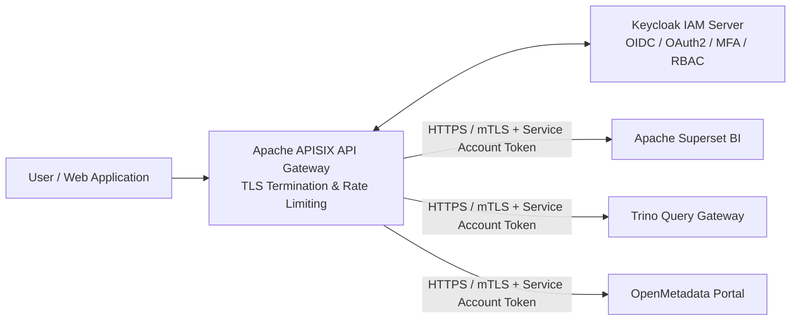

# Security, Identity & API Perimeter: Keycloak & Apache APISIX

Perimeter security and identity management guarantee zero-trust access control across all analytical portals and APIs.

## 🔐 Perimeter Security Architecture

## 🛡️ Security Capabilities

- **Keycloak (Apache 2.0):** Unified Identity & Access Management (IAM) supporting OpenID Connect (OIDC), OAuth 2.0 federation, Role-Based Access Control (RBAC), and Multi-Factor Authentication (MFA).
- **Apache APISIX (Apache 2.0):** Cloud-native, dynamic API gateway handling perimeter TLS termination, JWT token validation, IP whitelisting, and rate limiting. Downstream connections to Superset, Trino, and OpenMetadata are strictly authenticated and encrypted via HTTPS/mTLS and service account token propagation.
- **Row-Level Security (RLS):** Integrated RLS policies in Superset and Trino mapping directly to Keycloak user roles.
