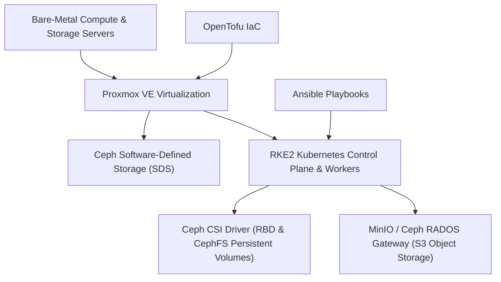

# Sovereign Infrastructure: Proxmox VE, RKE2, Ceph SDS & Automation

The infrastructure foundation delivers high availability, fault tolerance, and absolute data sovereignty through a hyperconverged, open-source stack.

## 🏗️ Infrastructure Stack Layers

### Dual-Render Architecture Specification: Sovereign Infrastructure Stack

#### 1. Standalone Production-Ready SVG Vector Graphic (`.svg`)

```xml
<svg xmlns="http://www.w3.org/2000/svg" viewBox="0 0 900 400" width="100%" height="100%">
  <defs>
    <marker id="arrow-inf" viewBox="0 0 10 10" refX="6" refY="5" markerWidth="6" markerHeight="6" orient="auto-start-reverse">
      <path d="M 0 0 L 10 5 L 0 10 z" fill="#475569" />
    </marker>
  </defs>

  <rect width="900" height="400" fill="#F8FAFC" rx="10"/>

  <rect x="20" y="20" width="860" height="60" fill="#FFFFFF" stroke="#CBD5E1" stroke-width="1.5" rx="8"/>
  <text x="35" y="55" font-family="-apple-system, BlinkMacSystemFont, 'Segoe UI', Roboto, sans-serif" font-size="13" font-weight="bold" fill="#0F172A">Bare-Metal Hardware Cluster</text>
  <text x="350" y="55" font-family="Consolas, Monaco, monospace" font-size="11" fill="#475569">Dell/HPE Bare-Metal Compute &amp; Storage Nodes</text>

  <rect x="20" y="110" width="860" height="60" fill="#FFFFFF" stroke="#CBD5E1" stroke-width="1.5" rx="8"/>
  <text x="35" y="145" font-family="-apple-system, BlinkMacSystemFont, 'Segoe UI', Roboto, sans-serif" font-size="13" font-weight="bold" fill="#0F172A">Proxmox VE Hypervisor</text>
  <text x="350" y="145" font-family="Consolas, Monaco, monospace" font-size="11" fill="#2563EB">Type-1 Bare-Metal KVM / OpenTofu Managed</text>

  <rect x="20" y="200" width="410" height="80" fill="#FFFFFF" stroke="#CBD5E1" stroke-width="1.5" rx="8"/>
  <text x="35" y="230" font-family="-apple-system, BlinkMacSystemFont, 'Segoe UI', Roboto, sans-serif" font-size="13" font-weight="bold" fill="#0F172A">Ceph SDS Storage</text>
  <text x="35" y="250" font-family="Consolas, Monaco, monospace" font-size="11" fill="#059669">RADOS Block &amp; CephFS</text>

  <rect x="470" y="200" width="410" height="80" fill="#FFFFFF" stroke="#CBD5E1" stroke-width="1.5" rx="8"/>
  <text x="485" y="230" font-family="-apple-system, BlinkMacSystemFont, 'Segoe UI', Roboto, sans-serif" font-size="13" font-weight="bold" fill="#0F172A">RKE2 Kubernetes Engine</text>
  <text x="485" y="250" font-family="Consolas, Monaco, monospace" font-size="11" fill="#D97706">FIPS 140-2 CIS Hardened / Ansible</text>

  <rect x="20" y="310" width="410" height="60" fill="#FFFFFF" stroke="#CBD5E1" stroke-width="1.5" rx="8"/>
  <text x="35" y="345" font-family="-apple-system, BlinkMacSystemFont, 'Segoe UI', Roboto, sans-serif" font-size="13" font-weight="bold" fill="#0F172A">Ceph CSI Driver (RBD &amp; CephFS)</text>

  <rect x="470" y="310" width="410" height="60" fill="#FFFFFF" stroke="#CBD5E1" stroke-width="1.5" rx="8"/>
  <text x="485" y="345" font-family="-apple-system, BlinkMacSystemFont, 'Segoe UI', Roboto, sans-serif" font-size="13" font-weight="bold" fill="#0F172A">MinIO / Ceph RADOS S3 Gateway (TCP 9000)</text>

  <line x1="450" y1="80" x2="450" y2="110" stroke="#475569" stroke-width="1.5" marker-end="url(#arrow-inf)"/>
  <line x1="225" y1="170" x2="225" y2="200" stroke="#475569" stroke-width="1.5" marker-end="url(#arrow-inf)"/>
  <line x1="675" y1="170" x2="675" y2="200" stroke="#475569" stroke-width="1.5" marker-end="url(#arrow-inf)"/>
  <line x1="225" y1="280" x2="225" y2="310" stroke="#475569" stroke-width="1.5" marker-end="url(#arrow-inf)"/>
  <line x1="675" y1="280" x2="675" y2="310" stroke="#475569" stroke-width="1.5" marker-end="url(#arrow-inf)"/>
</svg>
```

#### 2. Git-Native Mermaid Diagram (`.mmd`)



#### 3. Summary Interface & Routing Table

| Source Component | Target Component | Port / Protocol / API Ingress | Security Boundary / Trust Zone / Access Key | Operational Significance / Flow Description |
| :--- | :--- | :--- | :--- | :--- |
| **OpenTofu IaC** | **Proxmox VE** | `TCP 8006` / HTTPS REST API | Admin Management Network | Provisions KVM virtual machines and virtual network bridges idempotently. |
| **Ansible Playbooks** | **RKE2 K8s Nodes** | `TCP 22` / SSH | Admin Management Network (SSH Key) | Bootstraps CIS-hardened RKE2 control plane and worker nodes. |
| **RKE2 Worker Nodes** | **Ceph SDS Storage** | `TCP 6789` / Ceph Protocol | Internal Storage Fabric | Mounts resilient block (RBD) and file (CephFS) persistent volume claims via Ceph CSI. |
| **RKE2 Worker Nodes** | **MinIO / Ceph RADOS S3 Gateway** | `TCP 9000` / S3 REST API | Internal Storage Fabric | Connects Kubernetes workload pods to S3 object storage bucket endpoints. |

## 🛠️ Component Specifications

| Component | License / Type | Primary Function | Operational Advantage |
| :--- | :--- | :--- | :--- |
| **Proxmox VE** | AGPLv3 / Open Source | Type-1 Bare-Metal Hypervisor | Enterprise KVM virtualization without licensing fees. |
| **Ceph SDS** | LGPLv2.1 / Open Source | Distributed Block, File, and S3 Storage | Self-healing, resilient object store powering Lakehouse S3 API. |
| **RKE2** | Apache 2.0 / Open Source | CIS-hardened Kubernetes Engine | FIPS 140-2 compliant container orchestration for BDA microservices. |
| **OpenTofu** | MPL v2.0 / Open Source | Infrastructure as Code (IaC) | Declarative VM and cloud infrastructure provisioning. |
| **Ansible** | GPLv3 / Open Source | Configuration & AIOps | Idempotent cluster bootstrapping, OS hardening, and rollouts. |
